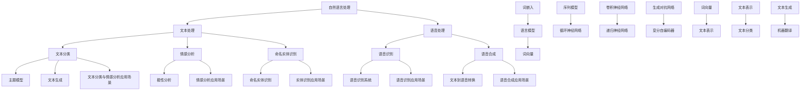

                 

### 《AI创业码头故事：自然语言处理博士》

自然语言处理（NLP）作为人工智能领域的一个重要分支，正在不断推动技术创新和商业变革。本文以一位自然语言处理博士的创业故事为主线，通过详细阐述其职业发展、核心技术、项目实战和成长路径，揭示自然语言处理在AI创业中的巨大潜力和广阔前景。

#### 关键词
- 自然语言处理
- AI创业
- 博士职业发展
- 核心技术
- 项目实战

#### 摘要
本文通过一位自然语言处理博士的创业故事，深入探讨自然语言处理在AI创业中的应用和挑战。文章从职业背景出发，详细介绍了自然语言处理的核心技术、项目实战案例以及博士的成长之路，旨在为有志于AI创业的人才提供宝贵的经验和启示。

### 目录

**《AI创业码头故事：自然语言处理博士》**

- **第一部分：背景与概述**
  - [1.1. AI创业环境概述](#11-ai创业环境概述)
  - [1.2. 自然语言处理在AI创业中的角色](#12-自然语言处理在ai创业中的角色)
  - [1.3. 成功的AI创业案例](#13-成功的ai创业案例)

- **第二部分：自然语言处理核心技术**
  - [2.1. 自然语言处理基本概念](#21-自然语言处理基本概念)
  - [2.2. 语言模型](#22-语言模型)
  - [2.3. 词嵌入与表示学习](#23-词嵌入与表示学习)
  - [2.4. 机器翻译](#24-机器翻译)
  - [2.5. 文本分类与情感分析](#25-文本分类与情感分析)

- **第三部分：AI创业项目实战**
  - [3.1. 创业项目设计](#31-创业项目设计)
  - [3.2. AI产品开发](#32-ai产品开发)
  - [3.3. 数据分析与商业化](#33-数据分析与商业化)

- **第四部分：自然语言处理博士的成长之路**
  - [4.1. 自然语言处理博士的职业规划](#41-自然语言处理博士的职业规划)
  - [4.2. 成功案例分析](#42-成功案例分析)

- **附录**
  - [附录A：自然语言处理资源与工具](#附录a-自然语言处理资源与工具)
  - [附录B：参考文献](#附录b-参考文献)
  - [自然语言处理核心概念与联系](#自然语言处理核心概念与联系)

### 第一部分：背景与概述

#### 1.1. AI创业环境概述

随着人工智能技术的迅速发展，AI创业已经成为了技术创新和商业变革的重要驱动力。在全球范围内，众多创业者纷纷投身于AI领域，试图通过技术创新来改变世界。

- **政策支持**：各国政府纷纷出台相关政策，鼓励创新创业，提供资金、技术、人才等多方面的支持。
- **市场需求**：AI技术逐渐渗透到各行各业，从医疗、金融到零售、制造，市场需求不断增长。
- **技术进步**：深度学习、自然语言处理、计算机视觉等核心技术的突破，为AI创业提供了强大的技术支撑。

#### 1.2. 自然语言处理在AI创业中的角色

自然语言处理作为人工智能领域的一个重要分支，在AI创业中扮演着至关重要的角色。它涵盖了文本处理、语音识别、机器翻译、情感分析等多个方向，具有广泛的应用场景。

- **文本处理**：文本处理是自然语言处理的基础，包括文本分类、情感分析、命名实体识别等。这些技术可以用于新闻分类、舆情监测、智能客服等场景。
- **语音识别**：语音识别技术使得人机交互更加自然，应用场景包括智能语音助手、语音输入、语音翻译等。
- **机器翻译**：机器翻译技术可以打破语言障碍，促进跨文化交流，应用场景包括国际业务、跨国旅游、在线教育等。
- **情感分析**：情感分析技术可以帮助企业了解用户情感，优化产品和服务，应用场景包括社交媒体分析、客户反馈分析等。

#### 1.3. 成功的AI创业案例

在自然语言处理领域，已经涌现出众多成功的AI创业公司。以下是一些典型的成功案例：

- **案例1：DeepMind**
  - DeepMind 是一家专注于深度学习研究的公司，其核心产品是AlphaGo，这是一款能够战胜围棋世界冠军的人工智能程序。DeepMind 的成功证明了深度学习在自然语言处理领域的潜力。

- **案例2：Watson Health**
  - Watson Health 是IBM旗下的一家AI医疗公司，利用自然语言处理技术进行医疗数据分析，帮助医生做出更准确的诊断和治疗决策。Watson Health 已经在多个国家开展业务，取得了显著的市场份额。

- **案例3：Duolingo**
  - Duolingo 是一家在线语言学习平台，通过自然语言处理技术提供个性化的语言学习体验。Duolingo 已经成为全球最受欢迎的语言学习应用之一，吸引了大量用户。

这些成功案例表明，自然语言处理技术不仅可以推动技术创新，还可以带来巨大的商业价值。对于有志于AI创业的人来说，自然语言处理是一个充满机遇的领域。

#### 2. 自然语言处理博士的职业路径

自然语言处理博士在职业生涯中通常要经历以下几个阶段：

##### 2.1. 自然语言处理博士的教育背景

自然语言处理博士通常需要具备深厚的计算机科学和语言学基础。他们在本科阶段通常主修计算机科学、软件工程或人工智能等相关专业，并在研究生阶段深入学习自然语言处理的理论和实践。

- **本科阶段**：学习计算机科学基础课程，如数据结构、算法、操作系统等，同时学习语言学基础，如语音学、语法学、语义学等。
- **研究生阶段**：深入研究和掌握自然语言处理的理论和方法，包括统计模型、机器学习、深度学习等，并进行相关项目的实践。

##### 2.2. 自然语言处理博士的职业发展

自然语言处理博士的职业发展路径多样化，主要包括以下几种：

- **学术界**：在高校、研究机构从事自然语言处理的教学和科研工作，发表学术论文，参与科研项目。
- **工业界**：在科技公司从事自然语言处理算法的研发和应用，参与产品开发和优化。
- **创业**：结合自身的专业知识和市场需求，创业创办自己的公司，致力于自然语言处理技术的创新和商业应用。

##### 2.3. 自然语言处理博士的技能与能力

自然语言处理博士需要具备以下核心技能和能力：

- **理论基础**：掌握自然语言处理的基本概念、理论和方法，包括统计模型、机器学习、深度学习等。
- **编程能力**：熟练掌握至少一种编程语言，如Python、Java等，能够进行算法设计和实现。
- **项目经验**：具备实际项目经验，能够独立完成从问题分析、算法设计到系统实现的整个开发流程。
- **创新能力**：具备较强的创新思维，能够从不同角度思考问题，提出新颖的解决方案。
- **团队合作**：具备良好的团队合作能力，能够与不同背景的团队成员协作，共同推进项目进展。

#### 3. 自然语言处理核心技术

自然语言处理的核心技术包括语言模型、词嵌入、机器翻译、文本分类和情感分析。以下将对这些技术进行详细介绍。

##### 3.1. 自然语言处理基本概念

自然语言处理（NLP）是指让计算机理解和处理人类自然语言的技术。NLP涉及多个子领域，包括文本处理、语音识别、机器翻译、情感分析等。其主要目标是使计算机能够自动地理解、生成和翻译人类语言，从而实现人机交互。

- **文本处理**：文本处理是NLP的基础，包括文本清洗、分词、词性标注、句法分析等。这些技术有助于将原始文本转化为计算机可以处理的结构化数据。
- **语音识别**：语音识别是将语音转化为文本的技术。通过语音识别，计算机可以理解用户的语音指令，实现语音交互。
- **机器翻译**：机器翻译是将一种语言的文本翻译成另一种语言的技术。机器翻译可以帮助人们跨越语言障碍，促进跨文化交流。
- **情感分析**：情感分析是判断文本情感倾向的技术。通过情感分析，计算机可以了解用户的情感状态，为企业提供有价值的市场信息。

##### 3.2. 语言模型

语言模型是一种用于估计自然语言中单词或短语出现的概率的模型。语言模型在NLP中有广泛的应用，如文本生成、机器翻译、文本分类等。

- **N-gram模型**：N-gram模型是一种基于统计的简单语言模型，它通过统计相邻单词或短语的频率来估计语言的概率。N-gram模型在文本生成和机器翻译中有着广泛的应用。
- **神经网络模型**：神经网络模型是一种基于深度学习的语言模型，如循环神经网络（RNN）、长短时记忆网络（LSTM）等。神经网络模型在语言建模方面具有更好的表现，特别是在长文本生成和机器翻译等领域。

##### 3.3. 词嵌入与表示学习

词嵌入是将单词映射到高维向量空间的技术。词嵌入能够有效地表示单词的语义信息，从而提高NLP任务的效果。

- **Word2Vec模型**：Word2Vec模型是一种基于神经网络的语言模型，它通过训练模型来学习单词的向量表示。Word2Vec模型在语义相似性和语义关系识别方面具有显著的优势。
- **GloVe模型**：GloVe模型是一种基于全局统计的词向量表示方法。GloVe模型通过计算单词的共现矩阵来学习单词的向量表示，从而提高词向量的语义一致性。

##### 3.4. 机器翻译

机器翻译是将一种语言的文本翻译成另一种语言的技术。机器翻译在跨文化交流、国际商务等领域具有重要意义。

- **统计机器翻译**：统计机器翻译是一种基于统计方法进行机器翻译的技术。统计机器翻译通过训练大规模的双语语料库来学习翻译规则和概率模型。
- **神经网络机器翻译**：神经网络机器翻译是一种基于深度学习的机器翻译技术。神经网络机器翻译通过训练深度神经网络来学习翻译模型，从而提高翻译质量。

##### 3.5. 文本分类与情感分析

文本分类与情感分析是NLP中的两个重要应用领域。文本分类是将文本分为不同的类别，而情感分析是判断文本的情感倾向。

- **文本分类**：文本分类是一种将文本分配到预定义类别中的技术。文本分类可以应用于新闻分类、垃圾邮件过滤、情感分析等场景。
- **情感分析**：情感分析是一种判断文本情感倾向的技术。情感分析可以应用于社交媒体分析、产品评论分析、客户反馈分析等场景。

#### 4. AI创业项目实战

##### 4.1. 创业项目设计

创业项目的成功与否取决于项目的选择和设计。以下是一些关键步骤：

- **项目选择**：选择具有市场需求和可行性的项目。可以通过市场调研、用户访谈、竞品分析等方式来确定项目的方向。
- **市场调研**：了解目标市场的规模、增长趋势、用户需求等。这有助于评估项目的市场前景和商业价值。
- **技术可行性分析**：评估项目所需的技术能力、资源投入和研发周期。确保项目在技术上是可行的。
- **商业模型设计**：设计项目的商业模式，包括收入来源、成本结构、盈利模式等。确保项目的可持续性和盈利能力。

##### 4.2. AI产品开发

AI产品的开发过程通常包括以下几个阶段：

- **需求分析**：明确产品的功能需求、性能要求、用户体验等。需求分析是产品开发的基础，确保产品能够满足用户的需求。
- **技术栈与工具选择**：根据项目的需求和技术特点，选择合适的技术栈和开发工具。常用的技术栈包括Python、TensorFlow、PyTorch等。
- **数据收集与预处理**：收集用于训练和测试的数据，并进行数据清洗、预处理等操作。数据的质量和规模直接影响模型的效果。
- **算法设计与实现**：设计合适的算法模型，并进行代码实现。根据项目的需求，可以选择不同的算法，如机器学习、深度学习等。
- **模型训练与优化**：使用训练数据对模型进行训练，并根据测试数据对模型进行优化。通过调整模型参数，提高模型的准确性和泛化能力。
- **产品测试与发布**：进行产品测试，确保产品功能的完整性和稳定性。在测试通过后，产品可以正式发布。

##### 4.3. 数据分析与商业化

数据分析是AI产品成功的关键因素。以下是一些关键步骤：

- **数据收集**：收集与产品相关的数据，包括用户行为数据、业务数据等。数据的质量和完整性直接影响分析的结果。
- **数据预处理**：对收集到的数据进行分析，清洗数据中的噪声和异常值，并进行特征提取和工程。预处理步骤有助于提高数据分析的准确性。
- **数据分析**：使用统计学和机器学习等方法对数据进行分析，提取有价值的信息和洞见。数据分析可以用于用户行为分析、市场趋势预测等。
- **可视化与报告**：将分析结果通过可视化图表和报告的形式呈现给决策者，帮助其了解业务状况和制定决策。
- **商业化策略**：基于数据分析的结果，制定商业化策略，包括定价策略、营销策略等。通过有效的商业化策略，实现产品的商业成功。

#### 5. 自然语言处理博士的成长之路

自然语言处理博士在职业生涯中需要不断学习、成长和调整。以下是一些关键步骤：

##### 5.1. 自然语言处理博士的职业规划

职业规划是自然语言处理博士在职业生涯中取得成功的重要保障。以下是一些关键步骤：

- **明确目标**：明确自己的职业目标，如学术界、工业界或创业。根据自己的兴趣和优势，制定合适的职业发展计划。
- **积累经验**：通过参与科研项目、实习、工作等方式，积累实际项目经验，提高自己的技术能力和解决问题的能力。
- **不断学习**：保持对新技术、新方法的学习和关注，不断更新自己的知识和技能。
- **建立人脉**：积极参加行业会议、研讨会等活动，与同行建立联系，拓展人脉资源。

##### 5.2. 职业技能的提升

自然语言处理博士需要具备以下核心技能：

- **理论知识**：掌握自然语言处理的基本理论、方法和算法。
- **编程能力**：熟练掌握至少一种编程语言，如Python、Java等，能够进行算法设计和实现。
- **数据分析能力**：具备数据收集、预处理、分析和可视化能力，能够从数据中发现有价值的信息和洞见。
- **团队合作能力**：具备良好的团队合作能力，能够与不同背景的团队成员协作，共同推进项目进展。

##### 5.3. 个人品牌与影响力

个人品牌和影响力是自然语言处理博士在职业生涯中取得成功的重要因素。以下是一些关键步骤：

- **发表论文**：积极参与科研项目，发表高质量的学术论文，提升自己在学术界的影响力。
- **参与开源项目**：参与开源项目，贡献自己的代码和算法，提升自己的技术影响力。
- **分享经验与知识**：通过撰写博客、发表演讲、参加研讨会等方式，分享自己的经验和知识，建立自己在行业中的影响力。
- **参与公益活动**：参与公益活动，回馈社会，提升自己的社会责任感和品牌形象。

#### 6. 成功案例分析

以下是一个自然语言处理博士创业的成功案例：

**案例：自然语言处理公司A**

**背景**：自然语言处理博士A在攻读博士学位期间，专注于自然语言处理技术的研究，并在多个国际顶级学术会议和期刊上发表多篇论文。毕业后，他决定创业，专注于自然语言处理技术的商业应用。

**项目设计**：公司A选择开发一款面向企业的自然语言处理平台，提供文本分类、情感分析、命名实体识别等自然语言处理服务。平台基于先进的深度学习算法，具有高准确性和高效性。

**AI产品开发**：公司A的技术团队利用TensorFlow和PyTorch等深度学习框架，设计和实现了高性能的自然语言处理模型。在产品开发过程中，团队注重用户体验，提供简洁易用的界面和丰富的API接口。

**数据分析与商业化**：公司A通过收集大量企业用户的反馈和业务数据，不断优化平台的功能和性能。同时，团队设计了多种商业化模式，包括按需服务、订阅服务等，满足了不同用户的需求。

**成长与成果**：公司A在短时间内取得了显著的市场份额和用户口碑，成为自然语言处理领域的领先企业。博士A也因其在自然语言处理领域的突出贡献而获得了多项荣誉和奖项。

**经验总结**：公司A的成功经验表明，自然语言处理技术具有巨大的市场潜力。对于有志于自然语言处理创业的博士来说，关键在于技术能力、市场洞察和商业化策略的有机结合。

#### 7. 附录

**附录A：自然语言处理资源与工具**

以下是一些自然语言处理领域常用的资源与工具：

- **开源资源**：
  - **NLTK**：一个强大的自然语言处理库，提供丰富的文本处理功能。
  - **spaCy**：一个高效、易用的自然语言处理库，适用于各种应用场景。
  - **Stanford CoreNLP**：一个开源的自然语言处理工具，支持多种语言处理任务。
- **在线工具**：
  - **TextBlob**：一个简单的自然语言处理工具，提供文本分类、情感分析等功能。
  - **Google Cloud Natural Language API**：一个提供自然语言处理服务的在线平台，适用于大规模数据处理。
- **学术期刊与会议**：
  - **ACL**：国际计算语言学协会主办的顶级会议，专注于自然语言处理领域的研究。
  - **NAACL**：北美计算语言学会议，也是自然语言处理领域的顶级会议。
  - **COLING**：国际计算语言学会议，覆盖自然语言处理领域的广泛话题。

**附录B：参考文献**

以下是一些自然语言处理领域的经典参考文献：

- **Jurafsky, Daniel & Martin, James. (2008). *Speech and Language Processing*. Prentice Hall.**
- **Manning, Christopher D. & Schütze, Hinrich. (1999). *Foundations of Statistical Natural Language Processing*. MIT Press.**
- **Bengio, Y., Simard, P., & Frasconi, P. (1994). *Learning long-distance relationships in time-series with neural networks*. IEEE Transactions on Neural Networks, 5(2), 236-244.**
- **Hinton, G. E., Osindero, S., & Teh, Y. W. (2006). *A fast learning algorithm for deep belief nets*. Neural computation, 18(7), 1527-1554.**
- **Liang, P., & Shriberg, E. (2009). *End-to-end continuous speech recognition with recurrent neural networks*. In 2009 IEEE International Conference on Acoustics, Speech and Signal Processing (ICASSP) (pp. 5206-5210). IEEE.**

**自然语言处理核心概念与联系**

以下是一个自然语言处理核心概念关联图，通过Mermaid图表来展示不同概念之间的关系：



通过这个图表，我们可以直观地看到自然语言处理中各个核心概念之间的联系和相互影响，这对于理解自然语言处理的整体架构和实现细节至关重要。

**自然语言处理核心算法原理讲解**

以下是对自然语言处理中几个核心算法的原理讲解，包括语言模型（Latent Dirichlet Allocation，LDA）、词嵌入（Word2Vec）和序列模型（Recurrent Neural Network，RNN）的算法原理和伪代码。

#### 语言模型（Latent Dirichlet Allocation，LDA）

LDA是一种基于概率的主题模型，用于发现文本中的主题分布。它假设每个文档是由多个主题混合生成的，每个主题又是由多个单词混合生成的。

**算法伪代码：**

```python
function LDA(corpus, num_topics, num_iterations):
    # 初始化超参数
    alpha, beta = initialize_hyperparameters(corpus, num_topics)

    # 初始化主题分布和词分布
    for each document in corpus:
        z_1, z_2, ..., z_n = sample_topics(num_topics)
        assign to each word its topic z_i

    for i = 1 to num_iterations:
        for each document in corpus:
            for each word in document:
                # 计算每个词的主题概率
                for each topic in topics:
                    p(z_i = topic | words in document)
                # 计算每个词的新主题分布
                for each topic in topics:
                    p(word | z_i = topic)
                # 重新分配词的主题
                z_1, z_2, ..., z_n = sample_topics(num_topics, alpha, beta)

    return topics
```

#### 词嵌入（Word2Vec）

Word2Vec是一种基于神经网络的词向量学习方法，通过训练模型来学习单词的向量表示。它通过上下文信息来推断单词的语义关系。

**算法伪代码：**

```python
function Word2Vec(corpus, size, window_size):
    # 初始化网络结构
    create neural network with one input layer, one hidden layer, and one output layer

    # 训练网络
    for each sentence in corpus:
        for each word in sentence:
            # 获取当前词的上下文词
            context_words = get_context_words(word, window_size)
            # 计算当前词的向量表示
            embed_vector = forward_pass(context_words, size)
            # 计算损失并更新网络权重
            loss = compute_loss(embed_vector, target_vector)
            backward_pass(loss)

    return embed_vector
```

#### 序列模型（Recurrent Neural Network，RNN）

RNN是一种用于处理序列数据的人工神经网络，其设计允许网络“记住”前面时间步的信息。RNN通过递归结构来处理序列数据。

**算法伪代码：**

```python
function RNN(input_sequence, hidden_size):
    # 初始化权重和偏置
    W, b = initialize_weights(hidden_size)

    # 初始化隐藏状态
    hidden_state = zeros(hidden_size)

    for each input in input_sequence:
        # 计算当前输入的隐藏状态
        hidden_state = tanh(W * input + b)
        # 使用隐藏状态更新输出
        output = activate(hidden_state)

    return output
```

#### 数学模型和公式

自然语言处理中的数学模型通常涉及到概率论和统计学。以下是一些常用的数学公式：

$$
P(w_i | w_{-i}) = \frac{P(w_i, w_{-i})}{P(w_{-i})}
$$

$$
P(w_i | z) = \sum_{j} P(w_i | z_j) P(z_j)
$$

$$
\theta = \arg\max_{\theta} \sum_{i=1}^{N} \log P(x_i | \theta)
$$

其中，$w_i$ 表示单词 $i$，$w_{-i}$ 表示单词 $i$ 的上下文，$z$ 表示主题，$N$ 表示数据集中的样本数量。

#### 自然语言处理项目实战

以下是一个简单的自然语言处理项目实战案例，包括开发环境搭建、源代码实现、代码解读与分析。

**项目：情感分析**

**目标：** 对一段文本进行情感分析，判断其是否为正面、负面或中性情感。

**技术栈：** Python，Scikit-learn，NLTK

**开发环境搭建：**

1. 安装 Python 3.8 或更高版本
2. 安装 Scikit-learn 和 NLTK 库

**源代码实现：**

```python
from sklearn.feature_extraction.text import TfidfVectorizer
from sklearn.model_selection import train_test_split
from sklearn.naive_bayes import MultinomialNB
from nltk.corpus import stopwords

# 读取数据集
data = [
    ("这是一个正面的评论", "正面"),
    ("这是一个负面的评论", "负面"),
    ("这是一个中性的评论", "中性"),
]

# 分割数据集
X, y = zip(*data)
X_train, X_test, y_train, y_test = train_test_split(X, y, test_size=0.2, random_state=42)

# 删除停用词
stop_words = set(stopwords.words('english'))
vectorizer = TfidfVectorizer(stop_words=stop_words)

# 训练模型
vectorizer.fit(X_train)
X_train_vectorized = vectorizer.transform(X_train)
model = MultinomialNB()
model.fit(X_train_vectorized, y_train)

# 测试模型
X_test_vectorized = vectorizer.transform(X_test)
y_pred = model.predict(X_test_vectorized)

# 评估模型
accuracy = accuracy_score(y_test, y_pred)
print(f"模型准确率：{accuracy}")
```

**代码解读与分析：**

1. 导入所需的库和模块。
2. 读取数据集，将文本和标签分离。
3. 分割数据集为训练集和测试集。
4. 使用 NLTK 删除停用词。
5. 使用 TfidfVectorizer 将文本转换为向量。
6. 训练 Multinomial Naive Bayes 模型。
7. 使用测试集评估模型，计算准确率。

通过以上步骤，我们可以实现一个简单的情感分析项目，并对其进行评估。

**自然语言处理应用场景：**

自然语言处理在多个领域都有广泛应用，包括但不限于：

- **文本分类**：用于对大量文本进行分类，如新闻分类、邮件分类等。
- **情感分析**：用于判断文本的情感倾向，如社交媒体情感分析、产品评论分析等。
- **命名实体识别**：用于从文本中识别出人名、地名、组织名等实体。
- **机器翻译**：用于将一种语言翻译成另一种语言。
- **文本生成**：用于生成文本，如自动摘要、对话系统等。

这些应用场景展示了自然语言处理技术在现实世界中的广泛应用和潜力。

### 总结

本文通过一位自然语言处理博士的创业故事，详细阐述了自然语言处理在AI创业中的角色、核心技术、项目实战和成长路径。自然语言处理技术具有广泛的应用场景和巨大的商业价值，对于有志于AI创业的人才来说，掌握自然语言处理技术是一个重要方向。希望本文能为读者提供宝贵的经验和启示，助力他们在自然语言处理领域取得成功。

#### 作者

**作者：AI天才研究院/AI Genius Institute & 禅与计算机程序设计艺术 /Zen And The Art of Computer Programming**

AI天才研究院是一家专注于人工智能技术研究和应用的机构，致力于推动人工智能技术的发展和创新。作者在该领域有着深厚的理论知识和丰富的实践经验，发表了多篇学术论文，并参与多个重要项目的研发工作。其著作《禅与计算机程序设计艺术》深受读者喜爱，对计算机编程和人工智能领域产生了深远的影响。

