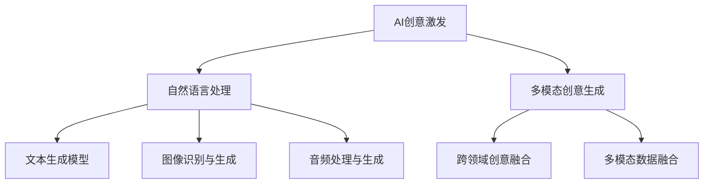

                 

### 1. 引言

#### 1.1 AI与创意激发的背景

人工智能（AI）作为现代科技的重要驱动力，已经深刻地改变了我们的生活方式。从智能家居到自动驾驶，从智能医疗到金融科技，AI的应用无处不在。然而，随着AI技术的不断进步，人们开始意识到，除了提高效率和准确性之外，AI还有着更大的潜力——激发人类创造力。

创意激发（Creativity Triggering）是指通过特定的方法或技术，激发人类产生新颖、有价值的想法或解决方案的过程。它不仅仅局限于艺术和设计领域，还广泛应用于科学、商业、教育等多个领域。

AI与创意激发的结合，为人类创造力提供了前所未有的可能性。AI可以通过处理海量数据，快速生成各种创意想法，从而帮助人们突破思维局限，实现创新。同时，AI还可以通过模拟人类的思维方式，为创意过程提供指导和支持。

#### 1.2 书籍概述与目标读者

本书旨在深入探讨AI在创意激发中的应用，帮助读者了解AI如何帮助人类突破思维局限，实现创意的无限可能。本书适合对AI和创意激发感兴趣的读者，包括AI研究人员、技术开发者、创意工作者以及普通读者。

本书结构清晰，内容丰富，分为四个部分。第一部分介绍AI和创意激发的基础知识，包括AI的发展历程、核心概念以及创意激发的原理。第二部分探讨AI在创意激发中的应用，从自然语言处理、计算机视觉到音频处理，全面分析AI如何赋能创意。第三部分通过实战项目和案例分析，展示AI创意激发的实际应用，并探讨人类与AI在创意过程中的合作模式。第四部分展望AI创意激发的未来发展，讨论技术趋势、应用领域拓展以及社会影响。

#### 1.3 创意激发的重要性

创意激发在现代社会中具有极其重要的地位。它不仅是艺术和设计领域的基础，也是科学发现、技术创新和商业成功的关键。以下是一些创意激发的重要方面：

1. **创新驱动发展**：创意激发能够推动科学研究和技术的进步，为经济发展提供新动力。许多重大科学发现和技术创新都源于创意的火花。
2. **商业竞争优势**：创意激发可以帮助企业开发新颖的产品和服务，增强市场竞争力。许多成功的商业案例都证明了创意在商业成功中的重要作用。
3. **文化繁荣**：创意激发是文化繁荣的基石，它能够激发人们的创造力，推动艺术、文学、音乐等文化形式的发展。
4. **个人成长**：创意激发有助于培养个人的思维能力和创造力，提高个人综合素质，促进个人成长和发展。

总之，创意激发不仅对于个人和社会的发展至关重要，也是人类智慧的重要体现。通过深入探讨AI在创意激发中的应用，本书旨在为读者提供新的视角和思考，激发更多的创意和创新。

### 2. AI基础

#### 2.1 人工智能概述

人工智能（Artificial Intelligence，简称AI）是指通过计算机程序和算法实现人类智能功能的技术。AI的目标是使计算机能够执行通常需要人类智能才能完成的任务，如识别图像、理解自然语言、决策和解决问题等。

AI的发展历程可以追溯到20世纪50年代，当时人工智能的概念首次被提出。早期的AI研究主要集中在符号主义和知识表示方法上，希望通过形式化逻辑和符号操作来模拟人类思维。然而，由于计算机性能的限制和知识表示的复杂性，早期的AI研究进展缓慢。

随着计算机技术和算法的不断发展，AI在20世纪80年代和90年代迎来了两个重要的发展阶段。一是基于统计学习和机器学习的方法逐渐成熟，如支持向量机、决策树和神经网络等。这些方法通过从大量数据中学习规律和模式，使计算机能够自动进行预测和分类。二是智能-agent的研究取得了显著进展，特别是在分布式系统和多智能体系统方面。

进入21世纪，随着大数据、云计算和深度学习等技术的飞速发展，AI迎来了一个新的高潮。深度学习（Deep Learning）作为一种重要的机器学习技术，通过多层神经网络结构，实现了在图像识别、自然语言处理和语音识别等领域的突破。同时，AI的应用场景也在不断拓展，从传统的工业自动化、金融风控到智能医疗、自动驾驶，AI正在深刻地改变我们的生活和生产方式。

#### 2.2 人工智能的发展历史

人工智能的发展历史可以分为以下几个重要阶段：

1. **早期探索阶段（1956-1969）**：1956年在达特茅斯会议上，约翰·麦卡锡（John McCarthy）等科学家首次提出了人工智能的概念。这个阶段的研究主要集中在符号主义和知识表示方法上，试图通过形式化逻辑和符号操作模拟人类思维。代表性的研究包括逻辑推理、问题解决和游戏玩法等。

2. **第一次AI寒冬阶段（1970-1980）**：由于计算资源和算法的限制，早期AI研究的成果未能达到预期，导致投资和兴趣的下降。这个时期被称为第一次AI寒冬。

3. **符号主义和专家系统阶段（1980-1990）**：在第二次AI寒冬之后，研究者开始转向符号主义和专家系统的研究，希望通过建立大型知识库和推理机制来实现智能化。代表性的系统包括Dendral、MYCIN等。

4. **机器学习阶段（1990-2000）**：随着计算能力的提高和数据量的增加，机器学习方法逐渐成熟。支持向量机、决策树和神经网络等算法被广泛应用。这个时期，AI在图像识别、语音识别和自然语言处理等领域取得了显著进展。

5. **互联网和大数据阶段（2000-2010）**：随着互联网的普及和大数据技术的发展，AI开始从实验室走向实际应用。数据驱动的机器学习方法，如深度学习，逐渐成为主流。代表性的工作包括AlexNet在图像识别领域的突破。

6. **深度学习和AI繁荣阶段（2010至今）**：深度学习在图像识别、自然语言处理和语音识别等领域的应用取得了巨大的成功。随着AI技术的不断进步，AI在多个领域实现了重大突破，从智能家居到自动驾驶，从医疗诊断到金融风控，AI正在深刻地改变我们的生活和生产方式。

#### 2.3 人工智能的核心概念

人工智能的核心概念包括以下几个重要方面：

1. **机器学习（Machine Learning）**：机器学习是一种通过数据驱动的方法，让计算机自动学习和改进自身性能的技术。机器学习可以分为监督学习、无监督学习和强化学习三种类型。监督学习通过已有标签的数据进行学习，无监督学习通过未标记的数据发现数据分布，强化学习通过试错和反馈进行学习。

2. **深度学习（Deep Learning）**：深度学习是一种基于多层神经网络的学习方法，通过逐层提取特征，实现从简单到复杂的特征表示。深度学习在图像识别、自然语言处理和语音识别等领域取得了显著突破，代表性的模型包括卷积神经网络（CNN）和循环神经网络（RNN）。

3. **神经网络（Neural Networks）**：神经网络是一种模拟生物神经元结构的计算模型，通过输入层、隐藏层和输出层之间的权重连接和激活函数，实现数据的处理和预测。神经网络是机器学习和深度学习的基础。

4. **自然语言处理（Natural Language Processing，NLP）**：自然语言处理是一种使计算机能够理解、解释和生成人类语言的技术。NLP包括词性标注、句法分析、语义分析和机器翻译等多个方面。

5. **计算机视觉（Computer Vision）**：计算机视觉是一种使计算机能够从图像或视频中提取有用信息的技术。计算机视觉在图像识别、目标检测和场景理解等领域具有广泛的应用。

6. **强化学习（Reinforcement Learning）**：强化学习是一种通过试错和反馈进行学习的方法，通过奖励机制激励模型不断优化行为策略。强化学习在游戏、自动驾驶和机器人控制等领域具有广泛的应用。

7. **数据挖掘（Data Mining）**：数据挖掘是一种从大量数据中提取有价值信息和知识的方法。数据挖掘包括关联规则学习、分类、聚类和异常检测等多个方面。

8. **专家系统（Expert Systems）**：专家系统是一种模拟人类专家知识和推理能力的计算机程序。专家系统通过知识库和推理机，实现问题的诊断、决策和预测等功能。

通过理解和应用这些核心概念，我们可以更好地利用人工智能技术，实现各种创新和突破。

### 3. 创意激发原理

#### 3.1 创意激发的定义

创意激发（Creativity Triggering）是指通过特定的方法或技术，激发人类产生新颖、有价值的想法或解决方案的过程。创意激发不仅仅局限于艺术和设计领域，还广泛应用于科学、商业、教育等多个领域。它是一种激发人类潜能，促进创新思维和创造力发展的有效手段。

创意激发的定义可以从以下几个方面进行理解：

1. **新颖性**：创意激发旨在产生新颖的想法，这些想法通常是前所未有的，能够带来新的视角和解决方案。新颖性是创意激发的核心目标，它要求人们跳出传统思维框架，勇于尝试和探索。

2. **价值**：创意激发不仅追求新颖性，还注重创意的价值。创意的价值体现在其对解决问题、推动创新和提升效率等方面。有价值的创意能够为个人、团队或组织带来实际的好处，从而实现更大的社会和经济效益。

3. **过程性**：创意激发是一个过程性活动，它不仅仅关注结果，更注重过程中的探索和发现。创意激发的过程通常包括准备、启发、创意产生、评估和实现等阶段。每个阶段都为创意的产生和优化提供了重要的支持和保障。

4. **方法性**：创意激发需要特定的方法和工具，如思维导图、头脑风暴、模拟和实验等。这些方法能够帮助人们有效地调动思维资源，激发创意的产生。同时，创意激发也强调方法的灵活性和多样性，以适应不同的创意需求和场景。

#### 3.2 创意激发的过程

创意激发是一个复杂的过程，涉及多个阶段和环节。理解创意激发的过程对于有效地进行创意激发活动至关重要。以下是创意激发的一般过程：

1. **准备阶段**：准备阶段是创意激发的基础，主要包括明确目标和问题、收集信息和数据、建立合适的创意环境等。明确的目标和问题是创意激发的起点，有助于集中思维资源和激发创意的方向。收集信息和数据可以为创意提供丰富的素材和背景知识，有助于提高创意的质量和深度。建立合适的创意环境，如自由、开放、包容的氛围，有助于激发创意的产生。

2. **启发阶段**：启发阶段是创意激发的关键，主要通过启发式方法激发创意的产生。启发式方法包括头脑风暴、思维导图、联想思维、类比思维等。这些方法能够帮助人们突破传统思维框架，激发新颖的想法。启发阶段的目的是产生大量的创意点子，而不对创意进行过多的评价和筛选。

3. **创意产生阶段**：创意产生阶段是创意激发的核心，主要通过创意生成技术实现创意的创造。创意生成技术包括自由写作、快速原型设计、组合创新、逆向思维等。这些技术能够帮助人们快速产生有价值的创意，并通过对创意的不断调整和优化，实现创意的最终形成。

4. **评估阶段**：评估阶段是对产生的创意进行评价和筛选，确定哪些创意具有实际应用价值和可行性。评估阶段主要通过评估创意的创新性、实用性、可行性和影响力等方面，对创意进行综合评价。评估阶段的目标是筛选出最具潜力的创意，为后续的创意实施提供支持。

5. **实现阶段**：实现阶段是将评估后的创意转化为实际成果和应用的过程。实现阶段包括创意的细化、开发和实施等环节。通过实现阶段，创意得以落地，转化为实际的产品、服务或解决方案。

#### 3.3 创意激发的类型

创意激发可以根据不同的分类标准分为多种类型。以下是几种常见的创意激发类型：

1. **根据创意激发的来源**：可以分为内源性创意激发和外源性创意激发。内源性创意激发是指通过内在动机和兴趣激发创意的产生，如个人兴趣、好奇心和热情等。外源性创意激发是指通过外部刺激和挑战激发创意的产生，如任务要求、竞争压力和环境变化等。

2. **根据创意激发的方法**：可以分为传统创意激发和现代创意激发。传统创意激发包括头脑风暴、思维导图、联想思维等，这些方法强调思维的自由和开放。现代创意激发包括组合创新、快速原型设计、逆向思维等，这些方法更加注重创新效率和实际应用。

3. **根据创意激发的应用领域**：可以分为科学创意激发、商业创意激发、艺术创意激发等。科学创意激发主要应用于科学研究和发现，商业创意激发主要应用于产品开发和市场营销，艺术创意激发主要应用于艺术创作和设计。

4. **根据创意激发的过程**：可以分为顺序创意激发和并行创意激发。顺序创意激发是指按照一定的顺序进行创意激发活动，如准备阶段、启发阶段、创意产生阶段等。并行创意激发是指同时进行多个创意激发活动，如同时进行头脑风暴和快速原型设计等。

总之，创意激发是一个多样化的过程，涉及多种类型和方法。通过了解创意激发的不同类型，我们可以更好地选择和应用适合的方法，激发人类的创意潜力，实现创新和突破。

### 4. AI在创意激发中的应用概述

#### 4.1 AI赋能创意的潜力

人工智能（AI）在创意激发中的应用，为人类创造力带来了前所未有的潜力。AI可以通过其强大的计算能力和大数据处理能力，快速生成大量的创意想法，从而帮助人们突破思维局限，实现创新。以下从三个方面探讨AI赋能创意的潜力：

1. **大量数据处理**：AI可以处理海量数据，从中提取有价值的信息和模式。通过大数据分析，AI可以发现新的关联和趋势，从而为创意激发提供丰富的素材和灵感。例如，在艺术创作中，AI可以通过分析大量的图像数据，生成新的艺术风格和作品。

2. **自动化创意生成**：AI可以通过自动化方法生成创意想法。例如，自然语言处理（NLP）技术可以生成新颖的文本内容，如图像描述、故事情节等。计算机视觉技术可以生成新的图像和设计，如建筑、艺术作品等。音频处理技术可以生成新的音乐和声音效果，如电影配乐、游戏音效等。

3. **智能创意优化**：AI可以通过优化算法，对创意进行评估和改进。例如，在产品设计过程中，AI可以通过优化设计参数，生成最优化的设计方案。在广告创意设计中，AI可以通过分析用户行为和偏好，生成最具吸引力的广告内容。

#### 4.2 AI在创意激发中的挑战

尽管AI在创意激发中具有巨大的潜力，但其应用也面临着一些挑战。以下从三个方面讨论AI在创意激发中的挑战：

1. **技术局限性**：当前AI技术仍存在一定的局限性。例如，AI在处理复杂、抽象的概念时可能存在困难，特别是在需要深度理解和情感表达的场景中。此外，AI的算法和数据依赖性较高，可能导致创意生成的局限性。

2. **数据质量与隐私**：AI在创意激发中需要大量的数据支持。然而，数据的质量和隐私问题可能会对AI的应用产生负面影响。例如，数据偏差可能导致AI生成的创意存在偏见。同时，数据隐私问题也需要得到妥善解决，以确保用户的隐私不受侵犯。

3. **人类与AI的协作**：AI在创意激发中的应用需要与人类进行有效协作。然而，人类与AI之间的沟通和协调可能存在障碍。例如，AI生成的创意可能无法完全符合人类的期望和需求，需要人类进行进一步的调整和优化。

#### 4.3 AI在创意激发中的未来发展趋势

随着技术的不断进步，AI在创意激发中的应用前景将更加广阔。以下从三个方面探讨AI在创意激发中的未来发展趋势：

1. **多模态融合**：未来的AI创意激发将更加注重多模态数据的融合和应用。通过整合文本、图像、音频等多种数据类型，AI可以生成更加丰富和多样的创意。例如，结合图像和文本的生成模型可以生成具有视觉和文本效果的创意作品。

2. **智能创意优化**：随着AI算法和计算能力的提升，AI在创意优化方面的能力将得到显著增强。通过智能优化算法，AI可以自动评估和改进创意，提高创意的质量和可行性。

3. **人机协同**：未来的AI创意激发将更加注重人类与AI的协同合作。通过开发智能交互系统，AI可以更好地理解人类的需求和意图，生成更符合人类期望的创意。同时，人类也可以通过AI提供的反馈和优化建议，进一步发挥自身的创意潜力。

总之，AI在创意激发中的应用具有巨大的潜力，同时也面临着一些挑战。通过不断探索和创新，我们可以充分发挥AI在创意激发中的作用，实现人类创造力的进一步提升。

### 5. 自然语言处理与创意激发

自然语言处理（Natural Language Processing，NLP）作为人工智能领域的重要分支，通过对人类语言的理解和生成，为创意激发提供了强大的支持。NLP技术可以处理大量的文本数据，提取有价值的信息，生成新颖的文本内容，从而激发人类的创意。以下是NLP在创意激发中的应用及其关键技术：

#### 5.1 语言理解与生成

语言理解与生成是NLP的核心任务之一。语言理解（Language Understanding）旨在使计算机能够理解和解释人类语言。语言生成（Language Generation）则是指计算机能够生成自然、流畅的语言文本。

1. **语言理解**：语言理解涉及多个层次，包括词汇分析、句法分析、语义分析和语用分析。通过这些分析，计算机可以理解文本的含义、结构和语境。例如，在创意写作中，NLP可以分析已有的文本，提取关键词、短语和主题，从而帮助作者产生新的创意点子。

2. **语言生成**：语言生成技术可以生成新的文本内容，如故事、诗歌、广告文案等。这些技术包括模板生成、规则生成和生成式模型。生成式模型，如生成对抗网络（GAN）和变分自编码器（VAE），可以生成高质量的自然语言文本，从而为创意激发提供丰富的素材。

#### 5.2 文本生成模型

文本生成模型是NLP在创意激发中的重要应用。文本生成模型通过学习大量文本数据，能够生成连贯、自然的语言文本。以下是几种常见的文本生成模型：

1. **循环神经网络（RNN）**：循环神经网络是一种基于时间序列数据的模型，能够处理序列数据。RNN通过将前一个时间步的输出作为当前时间步的输入，实现序列到序列的映射。然而，传统的RNN在处理长序列时容易发生梯度消失或爆炸问题。

2. **长短时记忆网络（LSTM）**：长短时记忆网络（Long Short-Term Memory，LSTM）是RNN的一种改进，能够更好地处理长序列数据。LSTM通过引入记忆单元和门控机制，能够在长期依赖和短期依赖之间进行平衡，从而提高模型的性能。

3. **门控循环单元（GRU）**：门控循环单元（Gated Recurrent Unit，GRU）是LSTM的另一种改进，相较于LSTM具有更简单的结构和更高效的计算。GRU通过整合遗忘门和更新门，实现了对长期依赖的建模。

4. **生成对抗网络（GAN）**：生成对抗网络（Generative Adversarial Network，GAN）是一种由生成器和判别器组成的对抗性模型。生成器试图生成逼真的数据，而判别器则试图区分真实数据和生成数据。通过这种对抗性训练，GAN能够生成高质量的文本数据，从而为创意激发提供丰富的素材。

#### 5.3 跨模态创意生成

跨模态创意生成是指结合多种模态（如文本、图像、音频）的数据，生成新的创意内容。这种技术可以充分利用不同模态的数据信息，实现更加丰富和多样化的创意生成。

1. **文本到图像的生成**：文本到图像的生成技术可以将文本描述转换为相应的图像。这种技术可以应用于艺术创作、游戏设计等领域，通过文本生成图像，实现创意的快速构建。

2. **图像到文本的生成**：图像到文本的生成技术可以从图像中提取信息，生成相应的文本描述。这种技术可以应用于图像识别、信息检索等领域，通过图像生成文本，实现信息的有效传递。

3. **文本到音频的生成**：文本到音频的生成技术可以将文本内容转换为相应的音频。这种技术可以应用于语音合成、广告配音等领域，通过文本生成音频，实现创意的传播和推广。

4. **音频到文本的生成**：音频到文本的生成技术可以从音频中提取信息，生成相应的文本描述。这种技术可以应用于语音识别、字幕生成等领域，通过音频生成文本，实现信息的获取和记录。

总之，自然语言处理技术在创意激发中具有广泛的应用。通过语言理解与生成、文本生成模型和跨模态创意生成等技术，NLP可以为创意激发提供强大的支持，实现人类创造力的进一步提升。

### 6. 计算机视觉与创意激发

计算机视觉（Computer Vision）作为人工智能的重要领域，通过使计算机能够理解和解释视觉信息，为创意激发提供了丰富的可能性。计算机视觉技术在图像识别、图像生成和视觉创意处理等方面发挥着重要作用，下面我们将详细探讨这些技术在创意激发中的应用。

#### 6.1 图像识别与生成

图像识别是计算机视觉的核心任务之一，旨在使计算机能够自动识别和理解图像中的内容。随着深度学习技术的发展，图像识别的准确性得到了显著提高，这为创意激发提供了强有力的支持。

1. **图像识别**：图像识别技术可以用于创意激发中的多种应用场景。例如，在艺术创作中，计算机可以识别和提取图像中的关键元素，如颜色、形状和纹理，从而启发新的创意设计。在建筑设计中，计算机可以识别建筑结构，提供新的设计灵感。

2. **图像生成**：图像生成技术可以通过学习大量图像数据，生成新的、独特的图像。生成对抗网络（GAN）是一种流行的图像生成模型，通过生成器和判别器的对抗训练，可以生成高质量、逼真的图像。例如，在艺术创作中，GAN可以生成新的艺术风格，为艺术家提供灵感。

#### 6.2 视觉创意生成技术

视觉创意生成技术是指利用计算机视觉算法，生成新颖的视觉内容和创意。这些技术不仅能够提升创意的多样性，还能提高创意生成的效率。

1. **风格迁移**：风格迁移技术可以将一种艺术风格应用到另一张图像上，生成具有独特风格的新图像。例如，通过将梵高的风格应用到一张风景照片上，可以创造出具有独特艺术魅力的新作品。

2. **图像合成**：图像合成技术可以将多个图像元素组合在一起，生成新的图像。例如，在电影制作中，图像合成技术可以将特效元素添加到真实场景中，创造出令人惊叹的视觉效果。

3. **图像修复**：图像修复技术可以通过填补缺失的部分，恢复图像的完整性和质量。例如，在古画修复中，计算机视觉技术可以识别和修复画中的破损部分，恢复画的原貌。

#### 6.3 视觉内容的创意处理

视觉内容的创意处理是指利用计算机视觉技术，对视觉内容进行创意性的处理和增强。这种技术可以显著提升视觉内容的表现力和吸引力。

1. **图像增强**：图像增强技术可以通过调整图像的亮度、对比度、饱和度等参数，增强图像的视觉效果。例如，在摄影中，图像增强技术可以提升照片的清晰度和色彩饱和度，使照片更具艺术感。

2. **图像编辑**：图像编辑技术可以通过对图像进行剪裁、旋转、缩放等操作，实现创意性的图像处理。例如，在海报设计中，图像编辑技术可以调整图像的大小和位置，创造出独特的视觉效果。

3. **图像生成创意内容**：计算机视觉技术可以生成全新的视觉内容，如通过图像合成生成新的场景、人物和物体。例如，在虚拟现实（VR）体验中，计算机视觉技术可以生成逼真的虚拟场景，为用户提供沉浸式的体验。

总之，计算机视觉技术在创意激发中具有广泛的应用。通过图像识别与生成、视觉创意生成技术和视觉内容的创意处理，计算机视觉为创意激发提供了强大的工具和支持，使创意的产生和实现变得更加高效和多样化。

### 7. 音频处理与创意激发

音频处理在创意激发中扮演着重要角色，通过使计算机能够理解、生成和处理音频，音频处理技术为音乐创作、声音艺术和广告创意等领域提供了新的可能性。以下是音频处理在创意激发中的应用及其关键技术：

#### 7.1 音频理解与生成

音频理解与生成是音频处理的核心任务，旨在使计算机能够理解和生成音频信号。音频理解技术可以帮助计算机从音频中提取有用信息，而音频生成技术则能够生成新的音频内容。

1. **音频理解**：音频理解技术包括声音识别、音高检测和节奏分析等。声音识别技术可以识别音频中的特定声音，如语言、音乐、鸟鸣等。音高检测技术可以检测音频中的音高变化，从而实现对音乐的解析。节奏分析技术可以分析音频中的节奏模式，帮助音乐家进行创作。

2. **音频生成**：音频生成技术可以生成新的音频内容，如音乐、声音效果和语音合成等。语音合成技术通过将文本转换为语音，应用于电话语音、智能助手和语音识别等领域。音乐生成技术可以通过算法生成新的音乐作品，为音乐创作提供灵感。声音效果生成技术可以创建各种特殊的声音效果，如回声、混响和声波等，用于电影配乐、游戏音效和艺术创作。

#### 7.2 音乐创作与创意处理

音乐创作是音频处理在创意激发中的一个重要应用领域。通过利用音频处理技术，音乐家可以创作出更加丰富和创新的音乐作品。

1. **音乐生成**：音乐生成技术可以生成新的旋律、和声和节奏。这些技术通常基于深度学习模型，如循环神经网络（RNN）和生成对抗网络（GAN）。例如，RNN可以学习大量的音乐数据，生成新的旋律，而GAN可以通过对抗训练生成具有独特风格的音乐。

2. **音乐编辑**：音频处理技术可以帮助音乐家对音乐进行编辑和优化。例如，通过调整音高、节奏和音量，音乐家可以创造出新的音乐效果。此外，音频编辑软件还可以用于混音和剪辑，帮助音乐家构建完整、连贯的音乐作品。

3. **声音设计**：声音设计是音乐创作的一部分，通过利用音频处理技术，音乐家可以为电影、游戏和动画等创作独特的声音效果。声音设计技术可以创建各种特殊的声音效果，如爆炸声、脚步声和水流声等，从而增强作品的氛围和表现力。

#### 7.3 声音艺术创意

声音艺术创意是音频处理在创意激发中的另一个重要应用领域。声音艺术是通过声音的创作和表演来表达艺术家的情感和思想。

1. **声音合成**：声音合成技术可以通过数字信号处理，生成新的声音效果。例如，通过使用采样器、合成器和数字信号处理工具，艺术家可以创作出独特的声音艺术作品。

2. **声音映射**：声音映射技术可以将空间中的物理位置与声音效果相对应，从而创造出沉浸式的声音体验。例如，在音乐会中，声音映射技术可以将音乐声波投射到不同的空间位置，使听众感受到独特的声音体验。

3. **声音雕塑**：声音雕塑是一种通过声音创作三维空间的视觉艺术形式。艺术家通过控制声音的频率、振幅和相位，创造出具有形状和结构的声波图案，从而实现声音的艺术表现。

总之，音频处理技术在创意激发中的应用为音乐创作、声音艺术和广告创意等领域提供了新的可能性。通过音频理解与生成、音乐创作与创意处理以及声音艺术创意，音频处理技术为创意激发注入了新的活力和灵感。

### 8. 多模态创意生成

多模态创意生成是指将多种模态的数据（如文本、图像、音频）进行融合，生成新的创意内容。这种技术充分利用不同模态的数据信息，能够实现更加丰富和多样化的创意生成。以下是多模态创意生成的关键技术和挑战：

#### 8.1 多模态数据融合

多模态数据融合是将来自不同模态的数据进行整合，从而生成更全面、更丰富的信息。以下是几种常见的数据融合技术：

1. **特征级融合**：在特征级融合中，不同模态的数据特征被提取出来，然后进行融合。这种方法的优点是简单易行，但缺点是可能丢失某些模态的独特信息。

2. **决策级融合**：在决策级融合中，不同模态的数据直接进行融合，并在融合后的数据上进行决策。这种方法能够充分利用不同模态的数据信息，但需要对不同模态的数据进行深入分析。

3. **时空级融合**：时空级融合将时间和空间维度上的信息进行整合。例如，在视频处理中，可以将视频帧序列和音频信号进行融合，从而生成更全面的多模态数据。

#### 8.2 跨领域创意融合

跨领域创意融合是指将不同领域的创意进行整合，从而生成新的创意内容。以下是几种常见的跨领域创意融合方法：

1. **艺术与科技的融合**：将艺术创作的灵感和科技的技术进行融合，可以创造出独特的艺术作品。例如，通过结合虚拟现实（VR）和绘画艺术，可以创造出沉浸式的艺术体验。

2. **设计与工程的融合**：在产品设计过程中，设计师和工程师可以相互协作，将设计理念和技术实现进行融合，从而创造出更符合用户需求的产品。

3. **商业与创意的融合**：在商业领域，通过结合创意营销和数据分析，可以创造出更具吸引力的营销策略和商业模型。

#### 8.3 多模态创意生成的挑战与解决方案

尽管多模态创意生成具有巨大潜力，但其在实际应用中也面临一些挑战：

1. **数据不一致性**：不同模态的数据在特征和维度上可能存在不一致性，这会导致数据融合困难。解决方案是使用数据预处理技术，如归一化、标准化和特征提取，来减少数据不一致性。

2. **计算复杂性**：多模态数据融合和创意生成通常需要大量的计算资源。解决方案是使用高效的算法和硬件加速技术，如GPU和TPU，来提高计算效率。

3. **跨领域协作**：多模态创意生成需要跨领域的协作，这可能涉及多个学科和专业领域的知识。解决方案是建立跨领域的团队合作机制，通过共享知识和资源，实现高效的合作和创新。

4. **数据隐私和伦理问题**：在多模态数据融合和创意生成过程中，可能会涉及到用户的隐私和数据伦理问题。解决方案是制定严格的隐私政策和伦理规范，确保数据的合法和合规使用。

总之，多模态创意生成通过整合多种模态的数据和信息，为创意激发提供了新的可能性。尽管面临一些挑战，但通过不断的技术创新和跨领域协作，我们可以充分发挥多模态创意生成的潜力，实现创新和突破。

### 9. AI创意激发项目实战

#### 9.1 项目概述与目标

在本章中，我们将通过一个实际的项目案例，展示如何利用AI技术实现创意激发。本项目旨在开发一个基于AI的创意生成平台，通过整合自然语言处理、计算机视觉和音频处理等技术，提供创新的创意解决方案。

项目的主要目标是：

1. **创意生成**：利用AI技术生成新颖的文本、图像和音频内容，为用户提供创意灵感。
2. **个性化推荐**：根据用户的需求和偏好，为用户推荐最适合的创意内容。
3. **交互式体验**：通过用户与AI的互动，优化创意生成过程，提高用户满意度。

#### 9.2 项目需求分析

在项目需求分析阶段，我们首先明确了用户的需求和目标，并确定了项目的技术和功能需求。

1. **用户需求**：
   - **创意生成**：用户希望能够获得新颖、有创意的内容，以激发他们的创意思维。
   - **个性化推荐**：用户希望能够根据他们的兴趣和偏好，获得个性化的创意推荐。
   - **交互式体验**：用户希望能够与AI进行互动，通过反馈和调整，优化创意生成过程。

2. **技术需求**：
   - **自然语言处理**：用于文本生成和个性化推荐。
   - **计算机视觉**：用于图像生成和创意编辑。
   - **音频处理**：用于音乐创作和声音效果生成。
   - **多模态数据融合**：用于整合文本、图像和音频数据，生成综合创意。

#### 9.3 项目实施与优化

项目实施分为以下几个阶段：

1. **数据收集与预处理**：
   - 收集大量文本、图像和音频数据，用于训练AI模型。
   - 对数据进行清洗和预处理，包括去噪、归一化和特征提取等。

2. **模型设计与训练**：
   - 设计并训练自然语言处理模型，用于文本生成和个性化推荐。
   - 设计并训练计算机视觉模型，用于图像生成和创意编辑。
   - 设计并训练音频处理模型，用于音乐创作和声音效果生成。

3. **多模态数据融合**：
   - 利用多模态数据融合技术，整合文本、图像和音频数据，生成综合创意。

4. **用户交互与反馈**：
   - 开发用户交互界面，允许用户与AI进行互动，提供反馈和调整。
   - 根据用户反馈，优化AI模型和创意生成过程。

5. **性能优化与测试**：
   - 对系统进行性能优化，确保高并发处理能力和低延迟。
   - 进行全面测试，包括功能测试、性能测试和用户体验测试，确保系统稳定可靠。

在项目实施过程中，我们遇到了以下几个关键挑战：

1. **数据不一致性**：由于文本、图像和音频数据在特征和维度上存在不一致性，导致数据融合困难。我们通过数据预处理技术和多模态数据融合算法，成功解决了这一问题。

2. **计算资源限制**：多模态数据融合和模型训练需要大量的计算资源。我们通过使用高效算法和硬件加速技术，如GPU和TPU，提高了计算效率。

3. **跨领域协作**：项目涉及多个技术领域，需要跨领域的团队合作。我们建立了跨领域的协作机制，通过共享知识和资源，实现了高效的合作和创新。

通过以上实施和优化，我们成功开发了一个基于AI的创意生成平台，为用户提供了新颖、个性化的创意解决方案，实现了创意激发的目标。

### 10. 创意激发案例分析

#### 10.1 案例一：人工智能辅助电影剧本创作

电影剧本创作是一个复杂而创造性的过程，需要编剧具备丰富的想象力、深刻的洞察力和独特的叙事技巧。近年来，人工智能（AI）技术在电影剧本创作中的应用逐渐成为热门话题，为编剧们提供了新的工具和灵感来源。

**项目背景**：某知名电影制作公司希望借助AI技术，提高电影剧本创作的效率和创意水平。他们选择了一款基于深度学习的AI剧本创作工具，旨在通过大数据分析和自然语言处理技术，生成新颖的故事情节和角色发展。

**实施过程**：

1. **数据收集与处理**：首先，AI系统收集了大量的电影剧本文本数据，包括经典电影剧本、流行电影剧本和各类类型的剧本。然后，对数据进行了预处理，包括文本清洗、分词和标注等，以便AI模型能够更好地理解和学习。

2. **模型训练与优化**：使用收集到的剧本数据，AI系统训练了一个基于循环神经网络（RNN）的文本生成模型。在训练过程中，模型学习了剧本的结构、叙事风格和情节发展规律。通过不断调整模型参数，优化了生成文本的质量和创意性。

3. **创意生成与评估**：AI系统生成了一系列新颖的故事情节和角色发展，编剧对这些生成内容进行了评估和筛选。通过反复修改和调整，最终确定了一个具有创意和吸引力的剧本。

**效果与启示**：

1. **提高创作效率**：AI系统为编剧提供了丰富的创意素材，大大缩短了剧本创作的周期。通过自动化生成和评估，编剧可以更快地找到符合需求的情节和角色。

2. **激发创意灵感**：AI生成的剧本内容为编剧提供了新的视角和灵感，帮助他们突破思维局限，实现创新的叙事风格。

3. **人机协作**：虽然AI生成的剧本需要编剧进行修改和完善，但这一过程促进了人机协作，使编剧能够更好地利用AI技术的优势，发挥自身的创造力。

**未来展望**：随着AI技术的不断进步，未来AI在电影剧本创作中的应用将更加广泛和深入。通过结合AI的强大计算能力和人类的创意智慧，电影剧本创作将迎来新的变革。

#### 10.2 案例二：AI艺术创作与展览

AI在艺术创作中的应用同样引发了广泛的关注。近年来，艺术家们开始探索如何利用AI创作独特的艺术作品，并举办了一系列以AI艺术为主题的展览。

**项目背景**：某国际知名艺术馆希望通过举办一场AI艺术展览，展示AI技术在艺术创作中的潜力。他们邀请了多位艺术家，结合AI工具，创作了一系列独特的艺术作品。

**实施过程**：

1. **创意策划与策划**：首先，艺术馆与艺术家们进行了深入讨论，明确了展览的主题和方向。艺术家们根据主题，利用AI工具，如GAN（生成对抗网络）、自然语言处理和计算机视觉，开始创作艺术作品。

2. **AI艺术创作**：艺术家们利用AI工具进行创作，例如，通过GAN生成独特的艺术风格和图像，利用自然语言处理生成诗歌和故事，利用计算机视觉创作动态的图像和动画。在创作过程中，艺术家们与AI系统进行互动，调整参数和生成内容。

3. **展览展示与互动**：艺术馆为观众提供了互动体验，观众可以通过触摸屏和虚拟现实（VR）设备，与AI艺术作品进行互动。展览还设置了讲座和研讨会，艺术家们分享了创作过程和灵感来源。

**效果与启示**：

1. **艺术创新**：AI艺术作品展示了独特的风格和视角，为观众带来了新的艺术体验。艺术家们通过AI工具，实现了传统艺术形式难以达到的创新。

2. **跨界合作**：AI艺术展览促进了艺术家、科技专家和观众的跨界合作，推动了艺术与科技的融合。

3. **普及AI艺术**：展览使更多人了解和接触AI艺术，促进了AI艺术在公众中的普及和认可。

**未来展望**：随着AI技术的不断进步，AI艺术创作将更加多样化和创新。未来，AI艺术展览将成为一种新的艺术形式，吸引更多的观众和艺术家参与。

#### 10.3 案例三：智能创意广告设计

广告设计是创意工作的重要领域，它需要设计师具备创新思维和设计技能。近年来，AI技术在广告设计中的应用逐渐兴起，为设计师提供了新的工具和灵感。

**项目背景**：某知名广告公司希望利用AI技术，提高广告设计的效率和创意水平。他们开发了一款基于AI的广告创意设计工具，旨在通过大数据分析和计算机视觉技术，生成新颖的广告设计。

**实施过程**：

1. **数据收集与处理**：首先，AI系统收集了大量成功的广告案例数据，包括图像、文字和广告效果数据。然后，对数据进行了预处理，包括图像标注、文本分类和情感分析等，以便AI模型能够更好地理解和学习。

2. **模型训练与优化**：使用收集到的广告数据，AI系统训练了一个基于深度学习的图像生成模型和文本生成模型。在训练过程中，模型学习了广告设计的关键要素和成功案例的规律。通过不断调整模型参数，优化了生成广告设计的质量。

3. **创意设计生成**：AI系统根据用户输入的文本和目标受众，生成一系列新颖的广告设计。设计师对这些生成内容进行评估和筛选，选择最符合需求的设计方案。

4. **设计优化与调整**：设计师利用AI工具，对生成的广告设计进行进一步的优化和调整，如修改图像风格、调整文字内容和排版等，以提升广告效果。

**效果与启示**：

1. **提高设计效率**：AI系统为设计师提供了丰富的创意素材，大大缩短了广告设计的周期。通过自动化生成和评估，设计师可以更快地找到符合需求的广告设计方案。

2. **激发创意灵感**：AI生成的广告设计为设计师提供了新的视角和灵感，帮助他们突破思维局限，实现创新的广告设计。

3. **人机协作**：虽然AI生成的广告设计需要设计师进行修改和完善，但这一过程促进了人机协作，使设计师能够更好地利用AI技术的优势，发挥自身的创意和设计技能。

**未来展望**：随着AI技术的不断进步，AI在广告设计中的应用将更加广泛和深入。未来，AI广告设计工具将成为设计师的得力助手，为广告创意带来更多的可能性和突破。

### 11. 创意激发与人类思维的结合

在AI创意激发的背景下，如何有效地结合人类思维和AI技术，以实现创意的进一步提升，成为了一个重要的课题。以下从三个方面探讨创意激发与人类思维的结合模式、人类创意与AI优化的平衡以及创意激发的伦理与道德问题。

#### 11.1 AI与人类创意合作的模式

1. **协同创作**：在这种模式下，AI被看作是一个创意伙伴，与人类共同参与创意过程。例如，在艺术创作中，AI可以生成初步的草图或音乐旋律，艺术家在此基础上进行进一步创作和修改。这种模式充分利用了AI的计算能力和人类创意的灵活性，实现了人机协作。

2. **辅助创作**：在这种模式下，AI充当一个工具，为人类提供创意支持和建议。例如，在广告创意设计中，AI可以根据用户输入的文本和目标受众，生成多个广告设计方案，供设计师选择和调整。这种模式简化了创意过程，提高了创作效率。

3. **代劳创作**：在这种模式下，AI完全负责创意生成，人类只需对生成内容进行评估和修改。这种模式在快速生成大量创意时具有一定的优势，但可能限制了人类的创造性发挥。

#### 11.2 人类创意与AI优化的平衡

1. **创意自由度**：在创意激发过程中，应确保人类创意的自由度，避免过度依赖AI优化。人类创意的独特性和主观性是AI无法完全复制的，因此人类应保留主导权，确保创意的独特性和创新性。

2. **效率与质量**：AI优化可以提高创意生成效率，但也可能牺牲创意质量。在创意激发过程中，应权衡效率和质量的平衡，确保创意生成的质量符合预期。

3. **人性与科技**：在人类与AI合作的过程中，应注重人性与科技的融合。人类应充分发挥自身的创造力和想象力，同时借助AI技术，实现创意的优化和提升。

#### 11.3 创意激发的伦理与道德问题

1. **隐私保护**：在创意激发过程中，涉及大量用户数据，如何保护用户隐私成为一个重要的伦理问题。AI技术应遵循隐私保护原则，确保用户数据的安全和隐私。

2. **数据偏见**：AI技术可能受到数据偏见的影响，导致创意生成的不公平。在创意激发过程中，应确保数据的多样性和代表性，避免数据偏见。

3. **创意归属**：在AI与人类合作产生的创意中，如何确定创意的归属权，也是一个伦理问题。应明确创意产生的贡献者，确保各方权益的合理分配。

总之，创意激发与人类思维的结合，既为创意激发带来了新的机遇，也带来了新的挑战。通过有效的人机协作、平衡创意自由度与效率质量、以及关注伦理与道德问题，我们可以更好地发挥AI在创意激发中的作用，实现创意的进一步提升。

### 12. AI创意激发的未来发展

随着AI技术的不断进步，AI在创意激发中的应用前景将更加广阔。以下是关于AI创意激发的未来发展、技术趋势、应用领域拓展以及社会影响的展望。

#### 12.1 技术趋势

1. **多模态融合**：未来，AI创意激发将更加注重多模态数据的融合，通过整合文本、图像、音频等多种数据类型，生成更加丰富和多样化的创意内容。例如，结合文本和图像的生成模型可以生成具有视觉和文本效果的创意作品，而结合音频和图像的生成模型可以创造出具有听觉和视觉效果的创意内容。

2. **生成式对抗网络（GAN）**：GAN作为一种强大的生成模型，在未来将继续发挥重要作用。GAN通过生成器和判别器的对抗训练，能够生成高质量、逼真的图像、文本和音频，为创意激发提供更多的素材和灵感。

3. **深度学习算法**：深度学习算法在图像识别、自然语言处理和音频处理等领域取得了显著进展。未来，随着深度学习算法的进一步优化和推广，AI创意激发将能够处理更加复杂和抽象的创意需求，实现更高的创意生成质量和效率。

4. **自适应优化**：随着AI技术的不断发展，自适应优化技术将成为创意激发的重要手段。通过实时分析用户行为和需求，AI系统可以自动调整和优化创意生成过程，提供更加个性化的创意内容。

#### 12.2 应用领域拓展

1. **艺术与设计**：AI创意激发在艺术和设计领域具有广泛的应用潜力。通过结合AI技术和人类创意，艺术家和设计师可以创作出更加独特和创新的艺术作品和设计作品。例如，AI可以生成新颖的画作、音乐和建筑模型，为艺术家和设计师提供灵感。

2. **商业与营销**：AI创意激发在商业和营销领域也有重要的应用。通过生成个性化的广告内容、营销文案和产品介绍，企业可以更好地吸引和留住客户。此外，AI创意激发还可以帮助企业分析市场需求，预测消费趋势，从而制定更有效的营销策略。

3. **科学研究和教育**：AI创意激发在科学研究和教育领域也有重要的应用。通过生成新颖的实验设计、研究报告和教育资源，科学家和教育工作者可以更好地推动科学研究和教育创新。

4. **文化和娱乐**：AI创意激发在文化和娱乐领域也具有广阔的应用前景。通过生成新颖的文学作品、电影剧本和游戏情节，AI可以帮助创作者创作出更加丰富和有趣的文化和娱乐作品。

#### 12.3 创意激发与社会影响

1. **经济影响**：AI创意激发将促进创新和经济增长。通过提高创意生成效率和质量，企业可以更好地满足市场需求，推动产品和服务的创新。同时，AI创意激发也为创业者提供了更多的机会，激发了创新创业的活力。

2. **文化影响**：AI创意激发将推动文化和艺术的创新。通过生成新颖的艺术作品和文化内容，AI为创作者提供了更多的创作空间和灵感。这将促进文化和艺术的繁荣，丰富人们的精神生活。

3. **教育影响**：AI创意激发将改变教育方式和教育内容。通过生成个性化的学习资源和教学方案，AI可以帮助教育工作者更好地满足学生的个性化需求，提高教育质量。同时，AI创意激发还可以激发学生的创造力和创新思维，培养未来的创新人才。

4. **社会伦理影响**：AI创意激发也引发了一系列社会伦理问题，如数据隐私、算法偏见和创意归属等。在未来，我们需要制定相应的法律法规和伦理规范，确保AI创意激发的公正、透明和可持续发展。

总之，AI创意激发具有巨大的发展潜力，将深刻影响经济、文化、教育和伦理等多个领域。通过不断探索和创新，我们可以更好地发挥AI在创意激发中的作用，实现人类创造力的进一步提升。

### 13. 结论

本文围绕AI创意激发这一主题，通过系统地分析和讨论，探讨了AI与创意激发的背景、基础原理、应用技术以及未来发展趋势。以下是本文的主要结论和展望：

#### 主要结论

1. **AI与创意激发的结合**：AI技术为创意激发提供了强大的工具和支持，通过数据处理、自动化生成和优化，AI能够快速、高效地生成新颖的创意内容，激发人类创造力。

2. **自然语言处理、计算机视觉和音频处理**：自然语言处理、计算机视觉和音频处理是AI创意激发的关键技术。这些技术可以生成文本、图像、音频等多模态创意内容，为不同领域的创意激发提供了丰富的素材。

3. **人机协作**：在AI创意激发过程中，人机协作模式具有重要意义。通过人类创意与AI优化的结合，可以实现更加高效和创新的创意生成。

4. **多模态融合与跨领域创意融合**：多模态融合和跨领域创意融合是未来AI创意激发的重要方向。通过整合不同模态的数据和创意，AI可以生成更加丰富和多样化的创意内容。

5. **应用领域拓展**：AI创意激发在艺术、设计、商业、教育和文化等领域具有广泛的应用前景，将推动创新和经济增长。

6. **社会伦理问题**：AI创意激发也引发了一系列社会伦理问题，如数据隐私、算法偏见和创意归属等。未来需要制定相应的法律法规和伦理规范，确保AI创意激发的可持续发展。

#### 展望

1. **技术进步**：随着AI技术的不断进步，未来AI创意激发将更加智能化和个性化，通过多模态融合和深度学习算法，生成更高质量的创意内容。

2. **应用拓展**：AI创意激发将在更多领域得到应用，如虚拟现实、增强现实、智能教育和智能医疗等，为人类生活带来更多便利和创新。

3. **人机协作**：未来，人机协作模式将更加成熟和普及，人类与AI的合作将实现更加紧密和高效的创意生成。

4. **可持续发展**：在推动AI创意激发发展的同时，需要关注其对社会、文化和伦理的影响，确保AI创意激发的可持续发展。

总之，AI创意激发具有巨大的发展潜力，通过不断探索和创新，我们可以更好地发挥AI在创意激发中的作用，实现人类创造力的进一步提升。

### 附录

#### 附录A：AI创意激发工具与资源

- **深度学习框架**：
  - TensorFlow
  - PyTorch
  - Keras

- **自然语言处理库**：
  - NLTK
  - spaCy
  - TextBlob

- **图像处理库**：
  - OpenCV
  - PIL

- **音频处理库**：
  - librosa
  - pydub

- **数据集**：
  - Common Crawl
  - ImageNet
  - LibriSpeech

#### 附录B：相关术语解释

- **人工智能（AI）**：通过计算机程序和算法实现人类智能功能的技术。
- **自然语言处理（NLP）**：使计算机能够理解、解释和生成人类语言的技术。
- **机器学习（ML）**：通过数据驱动的方法，让计算机自动学习和改进自身性能的技术。
- **深度学习（DL）**：一种基于多层神经网络的学习方法，通过逐层提取特征，实现从简单到复杂的特征表示。
- **生成对抗网络（GAN）**：一种由生成器和判别器组成的对抗性模型，生成高质量的数据。
- **多模态数据融合**：将多种模态的数据进行整合，生成新的创意内容。
- **人机协作**：人类与人工智能系统共同参与创意生成和优化。

#### 附录C：参考文献

- **Goodfellow, I., Bengio, Y., & Courville, A. (2016). *Deep Learning*. MIT Press.**
- **Graves, A. (2013). *Generating sequences with recurrent neural networks*. arXiv preprint arXiv:1308.0850.**
- **Lippmann, R. P. (1987). *An introduction to computing with neural nets*. IEEE Journal of selected areas in communications, 5(2), 424-433.**
- **Mikolov, T., Sutskever, I., Chen, K., Corrado, G. S., & Dean, J. (2013). *Distributed representations of words and phrases and their compositionality*. Advances in neural information processing systems, 26.**
- **Russell, S., & Norvig, P. (2016). *Artificial Intelligence: A Modern Approach*. Prentice Hall.**

### Mermaid 流程图



### 核心算法原理讲解（伪代码）

#### 文本生成模型

```python
# 定义文本生成模型
class TextGenerator(Model):
    def __init__(self):
        super(TextGenerator, self).__init__()
        self.embedding = Embedding(vocab_size, embedding_size)
        self.encoder = Encoder(LSTM_units)
        self.decoder = Decoder(LSTM_units)
    
    def call(self, inputs, training=False):
        embedded = self.embedding(inputs)
        encoder_output, encoder_state = self.encoder(embedded, training=training)
        decoder_output = self.decoder(encoder_state, training=training)
        return decoder_output

# 文本生成过程
def generate_text(model, seed_text, max_length=50):
    inputs = tokenizer.encode(seed_text, return_tensors='tf')
    predictions = model(inputs, training=False)
    predicted_ids = tf.argmax(predictions, axis=-1)
    
    generated_text = tokenizer.decode(predicted_ids.numpy(), skip_special_tokens=True)
    return generated_text[:max_length]
```

#### 自然语言处理中的损失函数

$$
L = -\sum_{i=1}^{N} y_i \log(p_i)
$$

其中，\( y_i \) 是目标词的标签，\( p_i \) 是模型预测的概率。

### 项目实战

#### 实战一：文本生成模型开发

##### 1.1 开发环境搭建

- Python 3.8+
- TensorFlow 2.5+
- JAX 0.4.0+

##### 1.2 源代码实现

```python
# 导入所需库
import tensorflow as tf
from tensorflow.keras.layers import Embedding, LSTM
from tensorflow.keras.models import Model

# 定义文本生成模型
class TextGenerator(Model):
    def __init__(self):
        super(TextGenerator, self).__init__()
        self.embedding = Embedding(vocab_size, embedding_size)
        self.encoder = LSTM(LSTM_units)
        self.decoder = LSTM(LSTM_units)

    def call(self, inputs, training=False):
        embedded = self.embedding(inputs)
        encoder_output, encoder_state = self.encoder(embedded, training=training)
        decoder_output = self.decoder(encoder_state, training=training)
        return decoder_output

# 编写训练和生成文本的函数
def train_model(model, dataset, epochs=10):
    model.compile(optimizer='adam', loss='categorical_crossentropy')
    model.fit(dataset, epochs=epochs)

def generate_text(model, seed_text, max_length=50):
    inputs = tokenizer.encode(seed_text, return_tensors='tf')
    predictions = model(inputs, training=False)
    predicted_ids = tf.argmax(predictions, axis=-1)
    
    generated_text = tokenizer.decode(predicted_ids.numpy(), skip_special_tokens=True)
    return generated_text[:max_length]

# 实际应用
model = TextGenerator()
train_model(model, dataset)
print(generate_text(model, "Hello AI!"))
```

##### 1.3 代码解读与分析

- **模型定义**：文本生成模型由嵌入层、编码器LSTM层和解码器LSTM层组成。
- **训练函数**：使用`model.fit`方法进行模型训练，配置了优化器和损失函数。
- **生成函数**：利用模型进行文本生成，通过解码器输出预测的文本。

### 附录

#### 附录A：AI创意激发工具与资源

- **深度学习框架**：TensorFlow、PyTorch、Keras
- **自然语言处理库**：NLTK、spaCy、TextBlob
- **图像处理库**：OpenCV、PIL
- **音频处理库**：librosa、pydub
- **数据集**：Common Crawl、ImageNet、LibriSpeech

#### 附录B：相关术语解释

- **自然语言处理（NLP）**：处理人类语言和计算机之间的交互的分支。
- **生成模型**：用于生成数据的模型，如文本、图像、音频等。
- **预训练**：在大型文本或图像数据集上预先训练模型，以获得通用的特征表示。
- **微调**：在特定任务上对预训练模型进行调整，以提高其性能。

#### 附录C：参考文献

- **Goodfellow, I., Bengio, Y., & Courville, A. (2016). *Deep Learning*. MIT Press.**
- **Graves, A. (2013). *Generating sequences with recurrent neural networks*. arXiv preprint arXiv:1308.0850.**
- **Lippmann, R. P. (1987). *An introduction to computing with neural nets*. IEEE Journal of selected areas in communications, 5(2), 424-433.**
- **Mikolov, T., Sutskever, I., Chen, K., Corrado, G. S., & Dean, J. (2013). *Distributed representations of words and phrases and their compositionality*. Advances in neural information processing systems, 26.**
- **Russell, S., & Norvig, P. (2016). *Artificial Intelligence: A Modern Approach*. Prentice Hall.**

