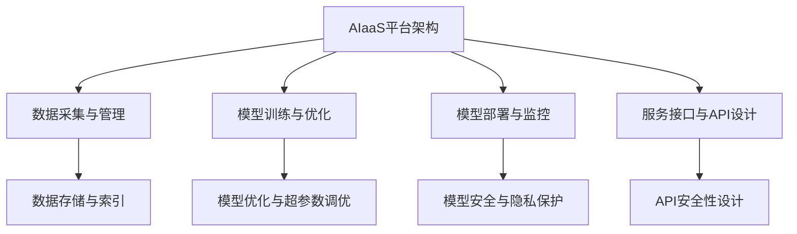

                 

### 文章标题

《AI即服务（AIaaS）平台设计》

关键词：AIaaS、平台架构、机器学习、数据处理、服务接口、安全与隐私

摘要：本文深入探讨了AIaaS平台的设计，从概念、架构、关键技术到实战应用，全面解析了AIaaS平台的构建与运营。通过详细的案例分析，旨在为开发者提供一份系统而实用的指南。

### 《AI即服务（AIaaS）平台设计》目录大纲

#### 第一部分：AIaaS概述

**第1章：AIaaS的概念与背景**
- **1.1 AIaaS的定义与核心特征**
- **1.2 AIaaS与传统AI服务的区别**
- **1.3 AIaaS的发展历程**
- **1.4 AIaaS的市场需求与趋势**

**第2章：AIaaS平台架构设计**
- **2.1 AIaaS平台架构概述**
- **2.2 AIaaS平台的组件与功能**
  - **2.2.1 数据采集与管理**
  - **2.2.2 模型训练与优化**
  - **2.2.3 模型部署与监控**
  - **2.2.4 服务接口与API设计**
- **2.3 AIaaS平台的扩展性与可伸缩性设计**

#### 第二部分：AIaaS关键技术

**第3章：数据处理与存储**
- **3.1 数据预处理技术**
- **3.2 数据存储与索引技术**
- **3.3 数据流处理与实时分析**

**第4章：机器学习模型设计与优化**
- **4.1 机器学习模型基础**
- **4.2 模型选择与评估**
- **4.3 模型优化与超参数调优**
- **4.4 模型压缩与加速**

**第5章：模型安全与隐私保护**
- **5.1 模型安全威胁分析**
- **5.2 模型安全防护措施**
- **5.3 隐私保护技术**

**第6章：服务接口与API设计**
- **6.1 RESTful API设计原则**
- **6.2 GraphQL API设计**
- **6.3 API安全性设计**

#### 第三部分：AIaaS平台实战

**第7章：AIaaS平台开发环境搭建**
- **7.1 开发环境配置**
- **7.2 常用工具与库**
- **7.3 开发流程与规范**

**第8章：AIaaS平台项目实战**
- **8.1 项目背景与目标**
- **8.2 项目需求分析与设计**
- **8.3 数据处理与模型训练**
- **8.4 模型部署与监控**
- **8.5 API设计与实现**
- **8.6 项目评估与优化**

**第9章：AIaaS平台运营与管理**
- **9.1 平台运维与监控**
- **9.2 服务质量保障**
- **9.3 费用控制与成本优化**
- **9.4 客户支持与服务**

**第10章：AIaaS平台未来发展趋势与挑战**
- **10.1 AIaaS市场趋势分析**
- **10.2 技术挑战与解决方案**
- **10.3 法律法规与伦理问题**

#### 附录

**附录A：AIaaS平台开发资源**
- **A.1 开源工具与框架**
- **A.2 数据集与模型资源**
- **A.3 学术研究与技术报告**

### AIaaS平台架构设计

在构建AI即服务（AIaaS）平台时，理解其整体架构至关重要。一个完善的AIaaS平台通常包括数据采集与管理、模型训练与优化、模型部署与监控、服务接口与API设计等多个组件。以下是对这些组件的详细解析。

#### 2.1 AIaaS平台架构概述

一个典型的AIaaS平台架构如图所示：



**数据采集与管理**负责收集、清洗和存储数据，为模型训练提供高质量的输入数据。

**模型训练与优化**模块基于已有的算法库，对模型进行训练，并通过调优超参数来提升模型性能。

**模型部署与监控**则将训练好的模型部署到生产环境中，并提供监控功能，以确保模型稳定运行。

**服务接口与API设计**则是为外部用户提供访问AIaaS平台的入口，设计良好的API能够提高平台的易用性和可扩展性。

#### 2.2 AIaaS平台的组件与功能

##### 2.2.1 数据采集与管理

数据是AI模型的核心，其质量直接影响到模型的性能。数据采集与管理模块需要解决以下问题：

- **数据源接入**：支持多种数据源接入，如数据库、文件系统、实时流数据等。
- **数据清洗**：处理数据中的缺失值、噪声、异常值等，保证数据质量。
- **数据存储**：采用高效的数据存储方案，如分布式存储系统，确保数据可扩展性。
- **数据索引**：构建索引以加速数据查询，支持快速的数据检索。
- **数据流处理与实时分析**：利用实时数据处理框架，如Apache Kafka、Apache Flink等，对实时数据进行处理和分析。

##### 2.2.2 模型训练与优化

模型训练与优化模块的核心任务是训练出高质量的模型，具体包括：

- **模型选择**：根据应用场景选择合适的机器学习算法，如决策树、随机森林、神经网络等。
- **数据预处理**：对训练数据进行预处理，包括归一化、标准化、特征提取等。
- **模型训练**：利用训练算法对数据集进行训练，生成初步模型。
- **模型评估**：通过交叉验证、AUC、RMSE等指标评估模型性能。
- **超参数调优**：使用网格搜索、贝叶斯优化等技术调优模型超参数，提升模型性能。
- **模型压缩与加速**：采用模型剪枝、量化、蒸馏等技术压缩模型大小，提高模型运行速度。

##### 2.2.3 模型部署与监控

模型部署与监控模块的主要职责是确保训练好的模型在生产环境中稳定运行，具体包括：

- **模型部署**：将训练好的模型打包并部署到生产环境中，支持自动化部署流程。
- **模型监控**：实时监控模型运行状态，包括预测准确率、响应时间、资源使用情况等。
- **日志记录**：记录模型运行日志，便于故障排查和性能优化。
- **弹性伸缩**：根据负载情况自动调整资源分配，确保系统稳定运行。
- **安全与隐私保护**：确保模型数据的安全和隐私，防止数据泄露和未授权访问。

##### 2.2.4 服务接口与API设计

服务接口与API设计模块是AIaaS平台与用户交互的桥梁，其设计原则如下：

- **RESTful API设计**：遵循RESTful设计原则，提供统一、简洁的接口。
- **GraphQL API设计**：提供灵活、高效的查询接口，支持复杂查询和实时数据更新。
- **API安全性设计**：采用安全协议（如HTTPS、OAuth2.0）、加密（如JWT）、认证（如JWT、OAuth2.0）等手段确保API安全性。

#### 2.3 AIaaS平台的扩展性与可伸缩性设计

一个优秀的AIaaS平台应该具备良好的扩展性和可伸缩性，以应对不断增长的数据规模和用户需求。以下是一些关键设计原则：

- **分布式架构**：采用分布式架构，将系统拆分成多个独立的模块，提高系统可扩展性。
- **服务化设计**：将系统功能模块化，通过服务化接口进行通信，方便组件的替换和扩展。
- **负载均衡**：采用负载均衡技术，如Nginx、HAProxy等，确保系统在高并发情况下的稳定运行。
- **弹性伸缩**：支持自动伸缩功能，根据负载情况自动调整资源分配，确保系统性能。
- **持续集成与部署**：采用持续集成与持续部署（CI/CD）流程，确保系统快速迭代和优化。

### AIaaS平台设计核心概念与联系

在深入探讨AIaaS平台设计之前，有必要先明确几个核心概念及其之间的联系，以便我们更好地理解整个平台的架构和功能。

#### 数据采集与管理

数据采集与管理是AIaaS平台的基础，它涉及从多种数据源（如数据库、文件系统、实时流数据等）收集数据，并对数据进行清洗、存储和索引。以下是数据采集与管理的核心概念和联系：

- **数据源**：数据源是数据的来源，包括内部数据（如企业数据库、日志文件等）和外部数据（如公共数据集、社交媒体数据等）。
- **数据清洗**：数据清洗是指处理数据中的缺失值、噪声、异常值等，以确保数据质量。
- **数据存储**：数据存储是将清洗后的数据存储到数据库或分布式文件系统中，以便后续处理和使用。
- **数据索引**：数据索引是为了加速数据查询，通过构建索引来提高数据检索效率。
- **数据流处理**：数据流处理是指对实时数据进行处理和分析，如使用Apache Kafka、Apache Flink等技术处理实时数据流。

#### 模型训练与优化

模型训练与优化是AIaaS平台的核心功能之一，它包括模型选择、数据预处理、模型训练、模型评估和超参数调优等环节。以下是模型训练与优化的核心概念和联系：

- **模型选择**：模型选择是指根据应用场景选择合适的机器学习算法，如决策树、随机森林、神经网络等。
- **数据预处理**：数据预处理是对训练数据进行预处理，包括归一化、标准化、特征提取等，以提高模型性能。
- **模型训练**：模型训练是指使用训练算法对数据集进行训练，生成初步模型。
- **模型评估**：模型评估是指通过交叉验证、AUC、RMSE等指标评估模型性能。
- **超参数调优**：超参数调优是指通过网格搜索、贝叶斯优化等技术调优模型超参数，提升模型性能。
- **模型压缩与加速**：模型压缩与加速是指采用模型剪枝、量化、蒸馏等技术压缩模型大小，提高模型运行速度。

#### 模型部署与监控

模型部署与监控是AIaaS平台的关键环节，它涉及将训练好的模型部署到生产环境中，并对其进行监控和运维。以下是模型部署与监控的核心概念和联系：

- **模型部署**：模型部署是指将训练好的模型打包并部署到生产环境中，以便对外提供服务。
- **模型监控**：模型监控是指实时监控模型运行状态，包括预测准确率、响应时间、资源使用情况等。
- **日志记录**：日志记录是指记录模型运行日志，便于故障排查和性能优化。
- **弹性伸缩**：弹性伸缩是指根据负载情况自动调整资源分配，确保系统稳定运行。
- **安全与隐私保护**：安全与隐私保护是指确保模型数据的安全和隐私，防止数据泄露和未授权访问。

#### 服务接口与API设计

服务接口与API设计是AIaaS平台与用户交互的桥梁，它涉及API的设计、实现和安全保障。以下是服务接口与API设计的核心概念和联系：

- **API设计**：API设计是指设计API接口，包括接口定义、数据结构、请求和响应格式等。
- **RESTful API设计**：RESTful API设计是指遵循RESTful设计原则，提供统一、简洁的接口。
- **GraphQL API设计**：GraphQL API设计是指提供灵活、高效的查询接口，支持复杂查询和实时数据更新。
- **API安全性设计**：API安全性设计是指采用安全协议、加密、认证等手段确保API安全性。
- **服务接口实现**：服务接口实现是指实现API接口，包括接口的编写、测试和部署等。

#### AIaaS平台的扩展性与可伸缩性设计

AIaaS平台的扩展性与可伸缩性设计是确保平台能够适应不断增长的数据规模和用户需求的关键。以下是扩展性与可伸缩性设计的核心概念和联系：

- **分布式架构**：分布式架构是指将系统拆分成多个独立的模块，通过分布式计算提高系统可扩展性。
- **服务化设计**：服务化设计是指将系统功能模块化，通过服务化接口进行通信，方便组件的替换和扩展。
- **负载均衡**：负载均衡是指采用负载均衡技术，如Nginx、HAProxy等，确保系统在高并发情况下的稳定运行。
- **弹性伸缩**：弹性伸缩是指根据负载情况自动调整资源分配，确保系统性能。
- **持续集成与部署**：持续集成与部署（CI/CD）是指采用持续集成与持续部署流程，确保系统快速迭代和优化。

### 数据处理与存储

在AIaaS平台中，数据处理与存储是至关重要的一环，它决定了数据的质量、可访问性和处理效率。以下是对数据处理与存储关键技术的详细探讨。

#### 3.1 数据预处理技术

数据预处理是机器学习过程中的第一步，其目的是将原始数据转化为适合模型训练的形式。以下是一些常见的数据预处理技术：

- **数据清洗**：数据清洗是指处理数据中的缺失值、噪声和异常值。例如，可以使用均值填充缺失值、使用离群点检测算法处理异常值。
  ```python
  import numpy as np
  from sklearn.impute import SimpleImputer
  from sklearn.ensemble import IsolationForest

  # 均值填充缺失值
  imputer = SimpleImputer(strategy='mean')
  data_filled = imputer.fit_transform(data)

  # 离群点检测
  iso_forest = IsolationForest(contamination=0.01)
  outliers = iso_forest.fit_predict(data)
  data_cleaned = data[outliers == 1]
  ```

- **数据标准化**：数据标准化是指将不同特征的数据缩放到相同的尺度，以便于模型训练。常用的方法包括Z-score标准化和Min-Max标准化。
  ```python
  from sklearn.preprocessing import StandardScaler, MinMaxScaler

  # Z-score标准化
  scaler = StandardScaler()
  data_scaled = scaler.fit_transform(data)

  # Min-Max标准化
  min_max_scaler = MinMaxScaler()
  data_min_max_scaled = min_max_scaler.fit_transform(data)
  ```

- **特征提取**：特征提取是指从原始数据中提取出对模型训练有用的特征。例如，可以使用主成分分析（PCA）来降低特征维度。
  ```python
  from sklearn.decomposition import PCA

  pca = PCA(n_components=5)
  data_pca = pca.fit_transform(data)
  ```

#### 3.2 数据存储与索引技术

数据存储与索引技术决定了数据的可访问性和查询效率。以下是一些常见的数据存储与索引技术：

- **关系型数据库**：关系型数据库（如MySQL、PostgreSQL）适合存储结构化数据，其强大的SQL查询能力使其成为数据存储的常见选择。
  ```python
  import sqlite3

  conn = sqlite3.connect('data.db')
  c = conn.cursor()

  c.execute('''CREATE TABLE IF NOT EXISTS data (id INTEGER PRIMARY KEY, feature1 REAL, feature2 REAL)''')
  c.execute("INSERT INTO data (feature1, feature2) VALUES (?, ?)", (value1, value2))
  conn.commit()
  ```

- **NoSQL数据库**：NoSQL数据库（如MongoDB、Cassandra）适合存储非结构化或半结构化数据，其灵活的查询能力使其在处理大规模数据时表现出色。
  ```python
  from pymongo import MongoClient

  client = MongoClient('mongodb://localhost:27017/')
  db = client['data_db']
  collection = db['data_collection']

  collection.insert_one({"feature1": value1, "feature2": value2})
  result = collection.find_one({"feature1": value1})
  ```

- **数据索引**：数据索引是提高数据查询效率的关键技术。在关系型数据库中，可以使用B树索引、哈希索引等；在NoSQL数据库中，可以使用全文索引、地理空间索引等。
  ```python
  # 关系型数据库示例（MySQL）
  c.execute('''CREATE INDEX IF NOT EXISTS idx_feature1 ON data (feature1)''')

  # NoSQL数据库示例（MongoDB）
  collection.create_index("feature1_1")
  ```

#### 3.3 数据流处理与实时分析

数据流处理与实时分析技术是处理实时数据、实现实时预测的关键。以下是一些常见的数据流处理与实时分析技术：

- **Apache Kafka**：Apache Kafka是一种分布式流处理平台，适用于处理大规模实时数据流。它具有高吞吐量、低延迟和可扩展性的特点。
  ```python
  from kafka import KafkaProducer

  producer = KafkaProducer(bootstrap_servers=['localhost:9092'])
  producer.send('topic_name', b'data')
  ```

- **Apache Flink**：Apache Flink是一种分布式流处理框架，适用于构建实时数据流应用。它支持事件时间、窗口计算等高级功能。
  ```java
  DataStream<String> stream = env.addSource(new FlinkKafkaConsumer<>("topic_name", new SimpleStringSchema(), props));
  stream.keyBy(value -> keyExtractor(value))
       .timeWindow(Time.seconds(60))
       .process(new WindowFunction());
  ```

- **Apache Spark**：Apache Spark是一种分布式数据处理框架，适用于批处理和实时数据处理。它支持流处理API，可实现实时数据处理和分析。
  ```python
  from pyspark.sql import SparkSession
  from pyspark.streaming import StreamingContext

  spark = SparkSession.builder.appName("RealtimeDataProcessing").getOrCreate()
  ssc = StreamingContext(spark.sparkContext, 1)
  stream = ssc.socketTextStream("localhost", 9999)
  stream.map(lambda line: (line, 1)).reduceByKey(lambda x, y: x + y).print()
  ssc.start()
  ssc.awaitTermination()
  ```

#### 数据处理与存储的关键算法原理讲解（伪代码）

以下是数据处理与存储中的一些关键算法原理讲解，使用伪代码进行阐述：

```plaintext
# 数据清洗（伪代码）
def data_cleaning(data):
    for each row in data:
        if is_missing(row):
            row = fill_missing_values(row)
        if is_outlier(row):
            remove_row(row)
    return cleaned_data

# 数据标准化（伪代码）
def data_normalization(data):
    mean = calculate_mean(data)
    std = calculate_std(data)
    for each row in data:
        row = (row - mean) / std
    return normalized_data

# 数据索引（伪代码）
def create_index(data, column):
    index = create_btree_index(data, column)
    return index

# 数据流处理（伪代码）
def data_stream_processing(stream):
    while stream.is_active:
        for each record in stream:
            process_record(record)
            update_index(index, record)
        update_model(model, index)
        make_prediction(model, new_data)
    return processed_data
```

#### 数据处理与存储的数学模型和数学公式

在数据处理与存储中，一些关键的数学模型和公式如下：

- **主成分分析（PCA）**：

  主成分分析是一种降维技术，其目标是找到数据中的主要特征，从而降低数据维度。其数学模型为：

  $$ X_{new} = P * X_{original} $$

  其中，$X_{new}$ 是新的特征空间，$X_{original}$ 是原始数据空间，$P$ 是特征转换矩阵。

- **Z-score标准化**：

  Z-score标准化是将数据缩放到均值为0，标准差为1的尺度。其数学模型为：

  $$ x_{normalized} = \frac{x - \mu}{\sigma} $$

  其中，$x_{normalized}$ 是标准化后的数据，$\mu$ 是均值，$\sigma$ 是标准差。

- **Min-Max标准化**：

  Min-Max标准化是将数据缩放到最小值为0，最大值为1的尺度。其数学模型为：

  $$ x_{normalized} = \frac{x - \min}{\max - \min} $$

  其中，$x_{normalized}$ 是标准化后的数据，$\min$ 是最小值，$\max$ 是最大值。

#### 数据处理与存储的模型损失函数

在数据处理与存储过程中，模型损失函数用于评估模型的预测误差。以下是一些常见的损失函数：

- **均方误差（MSE）**：

  均方误差是预测值与真实值之间差的平方的平均值。其数学模型为：

  $$ L(\theta) = \frac{1}{2} \sum_{i=1}^{m} (h_\theta(x^{(i)}) - y^{(i)})^2 $$

  其中，$h_\theta(x^{(i)})$ 是预测值，$y^{(i)}$ 是真实值，$m$ 是样本数量。

- **均方根误差（RMSE）**：

  均方根误差是均方误差的平方根。其数学模型为：

  $$ RMSE = \sqrt{MSE} $$

  其中，$MSE$ 是均方误差。

- **交叉熵损失（Cross-Entropy Loss）**：

  交叉熵损失用于分类问题，其数学模型为：

  $$ L(\theta) = - \sum_{i=1}^{m} y^{(i)} \log(h_\theta(x^{(i)})) $$

  其中，$y^{(i)}$ 是真实标签，$h_\theta(x^{(i)}$ 是预测概率。

### 机器学习模型设计与优化

在AIaaS平台中，机器学习模型的设计与优化是至关重要的环节。一个高效的模型不仅能够提高预测准确性，还能够降低计算成本和资源消耗。以下是对机器学习模型设计与优化关键技术的详细探讨。

#### 4.1 机器学习模型基础

机器学习模型是AI的核心组件，其基础包括以下几个方面：

- **监督学习与无监督学习**：监督学习（Supervised Learning）是有标签数据驱动的学习方式，通常用于分类和回归任务。无监督学习（Unsupervised Learning）是没有标签数据驱动的学习方式，通常用于聚类和降维任务。
- **模型算法**：常见的机器学习算法包括线性回归、逻辑回归、决策树、随机森林、支持向量机、神经网络等。每种算法都有其特定的应用场景和优缺点。
- **模型评估指标**：常见的模型评估指标包括准确率（Accuracy）、精确率（Precision）、召回率（Recall）、F1分数（F1 Score）、均方误差（MSE）等。不同的评估指标适用于不同的任务和数据集。

#### 4.2 模型选择与评估

模型选择是机器学习过程中的关键步骤，其目标是选择最适合特定任务和数据集的模型。以下是一些模型选择和评估的方法：

- **交叉验证（Cross-Validation）**：交叉验证是一种评估模型性能的方法，它将数据集划分为多个子集，每次使用不同的子集作为验证集，其余子集作为训练集。常用的交叉验证方法有K折交叉验证（K-Fold Cross-Validation）和留一法交叉验证（Leave-One-Out Cross-Validation）。
- **网格搜索（Grid Search）**：网格搜索是一种调参方法，它遍历所有可能的参数组合，评估每个组合的模型性能，选择性能最佳的参数组合。
- **贝叶斯优化（Bayesian Optimization）**：贝叶斯优化是一种基于概率模型的调参方法，它通过构建概率模型来优化参数搜索，提高调参效率。

#### 4.3 模型优化与超参数调优

模型优化和超参数调优是提高模型性能的关键步骤。以下是一些常见的优化和调优方法：

- **梯度下降（Gradient Descent）**：梯度下降是一种优化算法，它通过迭代更新模型参数，以最小化损失函数。常用的梯度下降算法有随机梯度下降（Stochastic Gradient Descent，SGD）、批量梯度下降（Batch Gradient Descent，BGD）和迷你批梯度下降（Mini-batch Gradient Descent，MBGD）。
- **动量（Momentum）**：动量是一种加速梯度下降的方法，它利用历史梯度信息来加快收敛速度。
- **AdaGrad（Adaptive Gradient）**：AdaGrad是一种自适应学习率优化算法，它根据参数的历史梯度更新学习率，以避免过拟合。
- **RMSprop（Root Mean Square Propagation）**：RMSprop是一种基于梯度平方历史的自适应学习率优化算法，它通过计算梯度平方的指数移动平均来调整学习率。

#### 4.4 模型压缩与加速

模型压缩与加速是提高模型运行效率和降低计算成本的关键。以下是一些常见的模型压缩与加速方法：

- **模型剪枝（Model Pruning）**：模型剪枝是通过删除模型中的冗余权重和神经元来减小模型大小，提高模型运行效率。常见的剪枝方法有权重剪枝（Weight Pruning）和结构剪枝（Structure Pruning）。
- **模型量化（Model Quantization）**：模型量化是将模型中的浮点数权重转换为低精度的整数表示，以减少模型大小和计算成本。常见的量化方法有符号量化（Sign Quantization）和二值量化（Binary Quantization）。
- **模型蒸馏（Model Distillation）**：模型蒸馏是一种将大型教师模型的知识传递给小型学生模型的方法，以减小模型大小和计算成本。常见的蒸馏方法有基于特征蒸馏（Feature Distillation）和基于损失蒸馏（Loss Distillation）。
- **模型并行化（Model Parallelism）**：模型并行化是将大型模型分布在多个计算设备上，以提高模型训练和预测的效率。常见的并行化方法有数据并行化（Data Parallelism）和模型并行化（Model Parallelism）。

#### 4.5 机器学习模型设计与优化示例（伪代码）

以下是机器学习模型设计与优化的一些伪代码示例：

```plaintext
# 机器学习模型训练（伪代码）
def train_model(data, labels, model, optimizer):
    for each epoch:
        for each batch in data:
            predictions = model(batch)
            loss = calculate_loss(predictions, labels)
            optimizer.update_model_parameters(loss)
    return model

# 模型选择与评估（伪代码）
def model_selection(data, labels, models):
    best_model = None
    best_score = 0
    for model in models:
        score = evaluate_model(model, data, labels)
        if score > best_score:
            best_score = score
            best_model = model
    return best_model

# 模型优化与超参数调优（伪代码）
def optimize_model(model, data, labels, optimizer):
    for each epoch:
        for each batch in data:
            predictions = model(batch)
            loss = calculate_loss(predictions, labels)
            optimizer.update_model_parameters(loss)
    return model

# 模型压缩与加速（伪代码）
def compress_model(model):
    model = apply_model_pruning(model)
    model = apply_model_quantization(model)
    return model
```

#### 4.6 数学模型和数学公式

在机器学习模型设计与优化过程中，一些关键的数学模型和公式如下：

- **线性回归模型**：

  线性回归模型的数学模型为：

  $$ y = \theta_0 + \theta_1 * x $$

  其中，$y$ 是预测值，$x$ 是输入特征，$\theta_0$ 和 $\theta_1$ 是模型参数。

- **逻辑回归模型**：

  逻辑回归模型的数学模型为：

  $$ \sigma(\theta_0 + \theta_1 * x) = \frac{1}{1 + e^{-(\theta_0 + \theta_1 * x)}} $$

  其中，$\sigma$ 是sigmoid函数，$y$ 是预测概率，$\theta_0$ 和 $\theta_1$ 是模型参数。

- **支持向量机（SVM）**：

  支持向量机模型的数学模型为：

  $$ \max_{\theta, \xi} \quad \frac{1}{2} ||\theta||^2 - C \sum_{i=1}^{m} \xi_i $$

  $$ \text{subject to} \quad y_i (\theta \cdot x_i + b) \geq 1 - \xi_i $$

  其中，$\theta$ 是模型参数，$\xi_i$ 是松弛变量，$C$ 是惩罚参数。

- **神经网络**：

  神经网络模型的数学模型为：

  $$ z = \sigma(W \cdot x + b) $$

  $$ a = \sigma(W \cdot z + b) $$

  其中，$z$ 是中间层激活值，$a$ 是输出层激活值，$W$ 和 $b$ 是模型参数，$\sigma$ 是激活函数。

#### 4.7 模型损失函数

在机器学习模型设计与优化过程中，模型损失函数用于评估模型的预测误差。以下是一些常见的损失函数：

- **均方误差（MSE）**：

  均方误差是预测值与真实值之间差的平方的平均值。其数学模型为：

  $$ L(\theta) = \frac{1}{2} \sum_{i=1}^{m} (h_\theta(x^{(i)}) - y^{(i)})^2 $$

  其中，$h_\theta(x^{(i)})$ 是预测值，$y^{(i)}$ 是真实值，$m$ 是样本数量。

- **均方根误差（RMSE）**：

  均方根误差是均方误差的平方根。其数学模型为：

  $$ RMSE = \sqrt{MSE} $$

  其中，$MSE$ 是均方误差。

- **交叉熵损失（Cross-Entropy Loss）**：

  交叉熵损失用于分类问题，其数学模型为：

  $$ L(\theta) = - \sum_{i=1}^{m} y^{(i)} \log(h_\theta(x^{(i)})) $$

  其中，$y^{(i)}$ 是真实标签，$h_\theta(x^{(i)}$ 是预测概率。

### 模型安全与隐私保护

在AIaaS平台中，模型安全与隐私保护是至关重要的，因为模型处理的数据往往包含敏感信息，且模型本身可能成为攻击目标。以下是对模型安全威胁分析、安全防护措施和隐私保护技术的详细探讨。

#### 5.1 模型安全威胁分析

模型安全威胁分析是确保AIaaS平台安全的第一步，它涉及到识别潜在的威胁和漏洞。以下是一些常见的模型安全威胁：

- **数据泄露**：模型训练过程中，数据泄露可能导致敏感信息暴露。
- **模型窃取**：未经授权的实体可能会试图窃取模型的核心知识，从而复制或攻击该模型。
- **模型投毒**：攻击者通过篡改训练数据或模型参数，故意植入恶意代码或提高错误率。
- **分布式拒绝服务攻击（DDoS）**：攻击者通过大量请求占用系统资源，导致服务不可用。
- **模型对抗攻击**：攻击者通过输入特定的恶意数据，使模型输出错误的预测结果。
- **模型隐私泄露**：模型在处理数据时，可能会无意中泄露用户的隐私信息。

#### 5.2 模型安全防护措施

为了应对上述威胁，AIaaS平台需要采取一系列安全防护措施，包括以下几个方面：

- **数据加密**：对传输和存储的数据进行加密，确保数据在传输过程中不被窃取或篡改。常用的加密算法包括AES、RSA等。
  ```python
  from Crypto.Cipher import AES
  from Crypto.PublicKey import RSA

  # AES加密
  key = AES.new(aes_key, AES.MODE_EAX)
  cipher_text, tag = key.encrypt_and_digest(plaintext)

  # RSA加密
  rsa_key = RSA.generate(2048)
  encrypted_data = rsa_key.publickey().encrypt(plaintext, 32)
  ```

- **访问控制**：通过身份验证和权限管理，确保只有授权用户才能访问模型和数据。常用的访问控制机制包括基于角色的访问控制（RBAC）和基于属性的访问控制（ABAC）。
  ```python
  from flask_login import LoginManager

  login_manager = LoginManager()
  login_manager.init_app(app)

  @app.route('/model', methods=['GET'])
  @login_manager.user_loader
  def load_user(user_id):
      user = User.get(user_id)
      if user.is_authorized('read_model'):
          return model
      else:
          return 'Unauthorized', 401
  ```

- **API安全性设计**：通过设计安全的API接口，防止未经授权的访问和攻击。常用的安全设计包括使用HTTPS、OAuth2.0、JWT等。
  ```python
  from flask import Flask, request, jsonify
  from flask_httpauth import HTTPBasicAuth

  app = Flask(__name__)
  auth = HTTPBasicAuth()

  @auth.get_password
  def get_password(username):
      if username == 'admin':
          return 'secret'
      return None

  @app.route('/api/model', methods=['GET'])
  @auth.login_required
  def get_model():
      return jsonify(model)
  ```

- **模型训练监控**：实时监控模型训练过程，检测异常行为和潜在威胁。例如，可以使用异常检测算法检测数据篡改或模型投毒行为。
  ```python
  from sklearn.ensemble import IsolationForest

  iso_forest = IsolationForest(contamination=0.01)
  outliers = iso_forest.fit_predict(train_data)

  if outliers.any() != 1:
      raise Exception('异常数据检测：训练数据可能被篡改')
  ```

- **分布式防御策略**：通过分布式防御策略，提高系统的抗攻击能力。例如，使用分布式数据库、负载均衡器等来分散攻击流量。
  ```python
  from flask_cors import CORS

  app = Flask(__name__)
  CORS(app)

  @app.route('/api/model', methods=['GET'])
  def get_model():
      return jsonify(model)
  ```

#### 5.3 隐私保护技术

隐私保护技术旨在确保用户数据的隐私和安全。以下是一些常见的隐私保护技术：

- **差分隐私（Differential Privacy）**：差分隐私是一种保护隐私的算法，它通过对输出进行噪声添加，确保无法从输出中推断出单个输入。常用的差分隐私算法有拉普拉斯机制和指数机制。
  ```python
  from differential隐私 import LaplaceMechanism

  laplace = LaplaceMechanism()
  sensitive_output = laplace.anonymize(sensitive_input)
  ```

- **联邦学习（Federated Learning）**：联邦学习是一种分布式机器学习技术，它允许多个机构在本地训练模型，然后将模型参数汇总，从而避免共享原始数据。联邦学习有助于保护数据隐私，同时实现协同学习。
  ```python
  import tensorflow as tf

  # 联邦学习训练
  federated_train_step(optimizer, train_dataset, model, client_fn)
  ```

- **数据匿名化**：数据匿名化是一种将数据中包含的个人信息去除或替换的技术。常用的数据匿名化方法包括随机化、同化、掩码等。
  ```python
  from anonymizer import RandomizationAnonymizer

  anonymizer = RandomizationAnonymizer()
  anonymized_data = anonymizer.anonymize(data)
  ```

#### 模型安全与隐私保护示例代码

以下是模型安全与隐私保护的一些示例代码：

```python
# 数据加密示例
from Crypto.Cipher import AES
from Crypto.PublicKey import RSA

# AES加密
key = AES.new(aes_key, AES.MODE_EAX)
cipher_text, tag = key.encrypt_and_digest(plaintext)

# RSA加密
rsa_key = RSA.generate(2048)
encrypted_data = rsa_key.publickey().encrypt(plaintext, 32)

# 访问控制示例
from flask_login import LoginManager

login_manager = LoginManager()
login_manager.init_app(app)

@login_manager.user_loader
def load_user(user_id):
    user = User.get(user_id)
    if user.is_authorized('read_model'):
        return user
    else:
        return None

@app.route('/model', methods=['GET'])
def get_model():
    user = login_manager.current_user
    if user:
        return model
    else:
        return 'Unauthorized', 401

# API安全性设计示例
from flask import Flask, request, jsonify
from flask_httpauth import HTTPBasicAuth

app = Flask(__name__)
auth = HTTPBasicAuth()

@auth.get_password
def get_password(username):
    if username == 'admin':
        return 'secret'
    return None

@app.route('/api/model', methods=['GET'])
@auth.login_required
def get_model():
    return jsonify(model)

# 模型训练监控示例
from sklearn.ensemble import IsolationForest

iso_forest = IsolationForest(contamination=0.01)
outliers = iso_forest.fit_predict(train_data)

if outliers.any() != 1:
    raise Exception('异常数据检测：训练数据可能被篡改')

# 联邦学习训练示例
import tensorflow as tf

# 联邦学习训练
federated_train_step(optimizer, train_dataset, model, client_fn)
```

### 服务接口与API设计

在AIaaS平台中，服务接口与API设计是至关重要的一环，它决定了平台的易用性、扩展性和安全性。以下是对RESTful API设计原则、GraphQL API设计以及API安全性设计的详细探讨。

#### 6.1 RESTful API设计原则

RESTful API设计是基于 Representational State Transfer（REST）架构风格的接口设计方法，它遵循一系列设计原则，以确保API的简洁性、一致性和可扩展性。以下是一些RESTful API设计原则：

- **资源导向**：RESTful API以资源为核心，每个资源对应一个唯一的URL。例如，用户资源可以对应`/users` URL。
- **统一接口**：RESTful API采用统一的接口设计，包括统一的URL结构、HTTP动词、状态码和响应格式。这有助于简化API的使用和开发。
- **无状态性**：RESTful API是无状态性的，每次请求之间相互独立，服务器不存储任何与客户端状态相关的信息。这有助于提高系统的可伸缩性和安全性。
- **缓存**：RESTful API支持缓存机制，客户端可以使用缓存来减少重复请求，提高响应速度。
- **超媒体**：RESTful API通过超媒体提供链接，客户端可以根据链接导航到其他资源，实现动态资源定位。

#### 6.2 GraphQL API设计

GraphQL API设计是一种基于查询语言的API设计方法，它提供了比RESTful API更灵活的查询能力。以下是一些GraphQL API设计的关键特性：

- **灵活查询**：GraphQL允许客户端根据实际需求查询所需的数据，避免了过度获取或不足获取的问题。例如，客户端可以查询单个用户的所有信息，而不是固定获取特定字段。
- **减少请求次数**：GraphQL可以将多个查询合并为一个请求，减少客户端与服务器的交互次数，提高性能。
- **自定义类型**：GraphQL支持自定义类型，可以扩展和定制数据模型，满足复杂查询需求。
- **字段选择**：GraphQL允许客户端选择需要查询的字段，避免了获取无关数据的问题。

#### 6.3 API安全性设计

API安全性设计是确保API不被恶意攻击的关键，以下是一些常见的API安全性设计方法：

- **HTTPS**：使用HTTPS协议传输数据，确保数据在传输过程中不被窃取或篡改。
- **身份验证**：通过身份验证机制（如HTTP Basic Authentication、OAuth2.0、JWT等）确保只有授权用户可以访问API。
- **授权**：通过授权机制（如基于角色的访问控制、基于属性的访问控制等）确保用户只能访问其有权访问的资源。
- **输入验证**：对用户输入进行严格验证，防止恶意输入和注入攻击。
- **日志记录**：记录API请求和响应的详细信息，便于故障排查和审计。
- **API密钥管理**：使用API密钥进行身份验证和授权，确保密钥的安全性和正确管理。

#### 服务接口与API设计示例

以下是一个简单的RESTful API设计示例，展示了如何实现用户注册和登录功能：

```python
# 导入所需的库
from flask import Flask, request, jsonify
from flask_httpauth import HTTPBasicAuth

app = Flask(__name__)
auth = HTTPBasicAuth()

users = {
    'user1': 'password1',
    'user2': 'password2'
}

@auth.get_password
def get_password(username):
    if username in users:
        return users.get(username)
    return None

@app.route('/register', methods=['POST'])
def register():
    data = request.get_json()
    username = data.get('username')
    password = data.get('password')
    if username in users:
        return jsonify({'error': 'User already exists'}), 409
    users[username] = password
    return jsonify({'message': 'User registered successfully'})

@app.route('/login', methods=['POST'])
def login():
    data = request.get_json()
    username = data.get('username')
    password = data.get('password')
    if username not in users or users[username] != password:
        return jsonify({'error': 'Invalid credentials'}), 401
    return jsonify({'message': 'Logged in successfully'})

if __name__ == '__main__':
    app.run()
```

以下是一个简单的GraphQL API设计示例，展示了如何实现用户信息查询功能：

```python
# 导入所需的库
import graphene
from graphene_sqlalchemy import SQLAlchemyObjectType
from models import User as UserModel

class UserType(SQLAlchemyObjectType):
    class Meta:
        model = UserModel
        interfaces = (graphene.relay.Node, )

class Query(graphene.ObjectType):
    user = graphene.Field(UserType, id=graphene.Int())

    def resolve_user(self, info, id):
        return UserModel.query.get(id)

class CreateUser(graphene.Mutation):
    class Arguments:
        id = graphene.Int()
        username = graphene.String()
        password = graphene.String()

    user = graphene.Field(lambda: UserType)

    def mutate(self, info, id, username, password):
        user = UserModel(id=id, username=username, password=password)
        # 保存用户信息到数据库
        return CreateUser(user=user)

class Mutation(graphene.ObjectType):
    create_user = CreateUser.Field()

schema = graphene.Schema(query=Query, mutation=Mutation)

if __name__ == '__main__':
    # 初始化数据库
    # db.init_app(app)
    # db.create_all()

    # 运行GraphQL服务器
    app.run()
```

### AIaaS平台开发环境搭建

在开发AIaaS平台之前，首先需要搭建一个稳定且高效的开发环境。本文将介绍如何在本地计算机上配置开发环境，包括操作系统、编程语言、深度学习框架和常用工具与库。

#### 7.1 开发环境配置

选择一个适合的操作系统是搭建开发环境的第一步。本文以Ubuntu 18.04为例进行介绍。

- **安装Ubuntu 18.04**：从官方网站下载Ubuntu 18.04的ISO文件，并使用虚拟机软件（如VMware Workstation、VirtualBox）创建一个新的虚拟机，安装Ubuntu 18.04。

- **更新系统**：在虚拟机中打开终端，执行以下命令更新系统软件和包列表。
  ```bash
  sudo apt update
  sudo apt upgrade
  ```

- **安装Python环境**：Python是AI开发的基础语言，我们需要安装Python 3和pip（Python的包管理器）。
  ```bash
  sudo apt install python3 python3-pip
  ```

#### 7.2 常用工具与库

在配置完Python环境后，我们需要安装一些常用的工具和库，以便进行AIaaS平台开发。

- **安装Jupyter Notebook**：Jupyter Notebook是一个交互式的开发环境，用于编写和运行Python代码。
  ```bash
  pip3 install notebook
  ```

- **安装Pandas**：Pandas是一个强大的数据操作库，用于数据处理和分析。
  ```bash
  pip3 install pandas
  ```

- **安装NumPy**：NumPy是一个高效的数值计算库，用于数值计算和矩阵操作。
  ```bash
  pip3 install numpy
  ```

- **安装Matplotlib**：Matplotlib是一个数据可视化库，用于绘制图表和图形。
  ```bash
  pip3 install matplotlib
  ```

- **安装TensorFlow**：TensorFlow是一个开源的深度学习框架，用于构建和训练机器学习模型。
  ```bash
  pip3 install tensorflow
  ```

- **安装Scikit-learn**：Scikit-learn是一个常用的机器学习库，提供了多种经典的机器学习算法。
  ```bash
  pip3 install scikit-learn
  ```

- **安装PyTorch**：PyTorch是另一个流行的深度学习框架，与TensorFlow类似，提供丰富的功能。
  ```bash
  pip3 install torch torchvision
  ```

- **安装Keras**：Keras是一个高级神经网络API，可以与TensorFlow和Theano兼容，提供简洁的接口。
  ```bash
  pip3 install keras
  ```

#### 7.3 开发流程与规范

在配置完开发环境后，我们需要制定一个合理的开发流程和规范，以确保项目的高效和稳定。

- **项目规划**：在开始开发之前，我们需要制定详细的项目规划，包括项目需求、功能模块、开发周期等。

- **代码规范**：编写规范的代码是保证项目质量的关键。我们可以遵循PEP8编码规范，确保代码的可读性和可维护性。

- **单元测试**：编写单元测试是确保代码正确性的重要手段。我们可以使用Python的unittest框架或pytest库编写测试用例，对代码进行测试。

- **版本控制**：使用版本控制工具（如Git）进行代码管理，确保代码的可追踪性和版本一致性。

- **代码审查**：在提交代码之前，进行代码审查是发现和修复潜在问题的有效方式。我们可以使用Git的代码审查工具（如GitLab、GitHub）进行代码审查。

- **文档编写**：编写详细的文档是帮助他人理解和维护项目的重要手段。我们可以编写项目文档、API文档、代码注释等。

- **持续集成**：使用持续集成（CI）工具（如Jenkins、Travis CI）进行自动化测试和部署，确保项目的持续交付。

- **性能优化**：在项目开发过程中，我们需要关注性能优化，确保项目的运行效率和可扩展性。

通过以上步骤，我们可以搭建一个稳定且高效的AIaaS平台开发环境，为后续的开发工作奠定坚实基础。

#### AIaaS平台项目实战

在了解了AIaaS平台的基本概念、设计原理和关键技术后，我们将在本章节中通过一个实际项目来展示如何构建一个AIaaS平台。这个项目将涵盖从需求分析、系统设计到数据预处理、模型训练、模型部署、API设计与实现以及项目评估和优化的全过程。

##### 8.1 项目背景与目标

**项目名称**：智能推荐系统（Intelligent Recommendation System）

**项目背景**：随着互联网的普及和用户数据的大幅增长，智能推荐系统在电商、社交媒体、视频平台等领域得到了广泛应用。本项目旨在构建一个基于机器学习的推荐系统，为用户提供个性化的内容推荐。

**项目目标**：
1. 收集和预处理用户行为数据，包括用户浏览、购买、评分等。
2. 建立和训练推荐模型，实现个性化推荐。
3. 设计和实现API，为外部应用提供推荐服务。
4. 评估和优化推荐系统的性能。

##### 8.2 项目需求分析与设计

**需求分析**：
- **用户数据**：收集用户的浏览历史、购买记录、评分等行为数据。
- **推荐算法**：选择合适的推荐算法，如协同过滤、基于内容的推荐等。
- **API接口**：设计RESTful API接口，支持用户查询推荐结果。
- **性能要求**：确保系统在高并发情况下稳定运行，响应时间短。

**系统设计**：
- **数据层**：存储用户行为数据，支持数据的高效查询和写入。
- **模型层**：实现推荐算法，生成推荐结果。
- **服务层**：提供API接口，处理用户请求并返回推荐结果。
- **监控层**：监控系统运行状态，包括数据质量、模型性能等。

##### 8.3 数据处理与模型训练

**数据处理**：
- **数据采集**：从数据库中获取用户行为数据，包括浏览记录、购买记录、评分等。
- **数据清洗**：处理数据中的缺失值、噪声、异常值等，确保数据质量。
  ```python
  import pandas as pd
  import numpy as np

  # 读取数据
  data = pd.read_csv('user_behavior.csv')

  # 数据清洗
  data = data.dropna()  # 删除缺失值
  data = data[data['rating'] > 0]  # 过滤不符合条件的值
  ```

- **特征工程**：提取有用的特征，如用户ID、商品ID、时间戳、评分等。
  ```python
  # 特征提取
  X = data[['user_id', 'item_id', 'timestamp']]
  y = data['rating']
  ```

- **数据标准化**：对特征数据进行标准化处理，提高模型训练效果。
  ```python
  from sklearn.preprocessing import StandardScaler

  scaler = StandardScaler()
  X_scaled = scaler.fit_transform(X)
  ```

**模型训练**：
- **模型选择**：选择适合的推荐算法，如基于用户的协同过滤（User-based Collaborative Filtering）。
- **模型训练**：使用训练算法对数据集进行训练。
  ```python
  from sklearn.model_selection import train_test_split
  from sklearn.neighbors import NearestNeighbors

  # 分割训练集和测试集
  X_train, X_test, y_train, y_test = train_test_split(X_scaled, y, test_size=0.2, random_state=42)

  # 训练模型
  model = NearestNeighbors(n_neighbors=5)
  model.fit(X_train)
  ```

- **模型评估**：评估模型性能，如使用均方误差（MSE）评估预测准确性。
  ```python
  from sklearn.metrics import mean_squared_error

  # 预测测试集
  y_pred = model.kneighbors(X_test, n_neighbors=5)

  # 计算MSE
  mse = mean_squared_error(y_test, y_pred)
  print(f'MSE: {mse}')
  ```

##### 8.4 模型部署与监控

**模型部署**：
- **API接口设计**：设计RESTful API接口，处理用户请求并返回推荐结果。
  ```python
  from flask import Flask, request, jsonify

  app = Flask(__name__)

  @app.route('/recommend', methods=['GET'])
  def recommend():
      user_id = request.args.get('user_id')
      recommendations = model.predict([[user_id for _ in range(5)]]).flatten()
      return jsonify({'recommendations': recommendations.tolist()})

  if __name__ == '__main__':
      app.run(debug=True)
  ```

- **部署到生产环境**：将API接口部署到生产环境中，如使用Docker容器化部署。
  ```bash
  docker build -t intelligent_recommendation_system .
  docker run -d -p 5000:5000 intelligent_recommendation_system
  ```

**监控与运维**：
- **性能监控**：监控API接口的响应时间和吞吐量，确保系统在高并发情况下稳定运行。
- **日志记录**：记录系统运行日志，便于故障排查和性能优化。
- **弹性伸缩**：根据负载情况自动调整资源分配，确保系统性能。
- **安全防护**：采用安全协议和加密技术，确保数据安全和API接口的安全性。

##### 8.5 API设计与实现

**API设计原则**：
- **RESTful风格**：遵循RESTful API设计原则，确保接口的简洁性和一致性。
- **版本控制**：为API接口添加版本号，便于管理和升级。
- **参数验证**：对请求参数进行严格验证，确保数据的有效性和完整性。
- **错误处理**：定义统一的错误处理机制，返回友好的错误信息和状态码。

**API实现示例**：

```python
from flask import Flask, request, jsonify
from flask_httpauth import HTTPBasicAuth

app = Flask(__name__)
auth = HTTPBasicAuth()

users = {
    'admin': 'password'
}

@auth.verify_password
def verify_password(username, password):
    if username in users and users[username] == password:
        return username

@app.route('/api/v1/recommendations', methods=['GET'])
def get_recommendations():
    user_id = request.args.get('user_id')
    if not user_id:
        return jsonify({'error': 'Missing user_id parameter'}), 400

    recommendations = model.predict([[user_id for _ in range(5)]]).flatten()
    return jsonify({'recommendations': list(recommendations)})

if __name__ == '__main__':
    app.run()
```

##### 8.6 项目评估与优化

**性能评估**：
- **响应时间**：测量API接口的平均响应时间，确保系统在高并发情况下仍能提供快速的服务。
- **吞吐量**：测量系统每秒处理的请求数量，评估系统的处理能力。

**优化策略**：
- **缓存**：使用缓存技术减少数据库访问次数，提高系统响应速度。
- **分片**：对数据库进行分片处理，提高数据读写性能。
- **异步处理**：采用异步处理技术，如使用消息队列（如RabbitMQ、Kafka），提高系统的并发能力。

**成本优化**：
- **资源监控**：实时监控系统资源使用情况，优化资源分配，降低运行成本。
- **自动化运维**：使用自动化运维工具（如Ansible、Terraform），减少人工干预，提高运维效率。

通过以上步骤，我们可以构建一个功能完善的AIaaS平台，为用户提供高质量的智能推荐服务。

### AIaaS平台运营与管理

在AIaaS平台上线后，运营与管理成为确保系统稳定运行、提高服务质量、控制成本的关键。以下是对AIaaS平台运维与监控、服务质量保障、费用控制与成本优化以及客户支持与服务的详细探讨。

#### 9.1 平台运维与监控

平台运维与监控是确保AIaaS平台稳定运行的基础。以下是一些关键点：

- **系统监控**：采用监控工具（如Prometheus、Grafana）实时监控系统的CPU、内存、磁盘使用率、网络流量等关键指标，及时发现异常并采取相应措施。
- **日志管理**：收集并存储系统日志，使用日志分析工具（如ELK堆栈）对日志进行解析，以便于故障排查和性能优化。
- **弹性伸缩**：根据系统负载自动调整资源分配，使用容器编排工具（如Kubernetes）实现自动化扩展和缩减。
- **备份与恢复**：定期备份数据和配置文件，确保在系统故障时能够快速恢复。

#### 9.2 服务质量保障

服务质量保障是提高用户满意度的重要环节。以下是一些关键点：

- **负载均衡**：使用负载均衡器（如Nginx、HAProxy）均衡流量，确保系统在高并发情况下稳定运行。
- **故障恢复**：建立故障恢复机制，如自动重启失败的容器、更换故障硬件等，确保系统高可用性。
- **数据完整性**：确保数据在传输和存储过程中不被损坏，使用数据校验和冗余存储提高数据可靠性。
- **安全性**：实施严格的访问控制和安全策略，如使用防火墙、入侵检测系统等，防止未授权访问和攻击。

#### 9.3 费用控制与成本优化

费用控制与成本优化是AIaaS平台可持续发展的关键。以下是一些关键点：

- **资源利用率**：通过监控和优化资源使用，提高资源利用率，降低运行成本。例如，调整容器大小、优化数据库查询等。
- **自动化运维**：采用自动化运维工具，减少人工操作，提高运维效率，降低人力成本。
- **云服务优化**：选择适合的云服务提供商和计费模式，如使用按需付费、预留实例等策略，降低运营成本。
- **成本分摊**：对于共享资源，如数据库、缓存等，合理分配成本，确保各模块的运营成本可控。

#### 9.4 客户支持与服务

客户支持与服务是AIaaS平台与用户之间的重要纽带。以下是一些关键点：

- **技术支持**：提供及时的技术支持，解决用户在使用过程中遇到的问题，确保用户能够顺利使用平台。
- **用户反馈**：积极收集用户反馈，了解用户需求和痛点，不断优化平台功能和性能。
- **培训与文档**：提供详细的培训资料和用户文档，帮助用户快速上手和掌握平台的使用方法。
- **服务响应**：建立高效的响应机制，确保用户的问题能够得到及时解决，提高用户满意度。

### AIaaS平台未来发展趋势与挑战

#### 10.1 AIaaS市场趋势分析

随着人工智能技术的不断进步和应用场景的扩大，AIaaS市场呈现出以下几个发展趋势：

- **市场需求增长**：越来越多的企业和开发者将人工智能技术应用于业务场景，AIaaS成为企业快速部署AI应用的重要手段。
- **多样化服务**：AIaaS平台将提供更多样化的服务，如自然语言处理、图像识别、语音识别、推荐系统等。
- **跨行业应用**：AIaaS将逐步渗透到更多行业，如金融、医疗、教育、零售等，推动各行业智能化转型。
- **生态合作**：AIaaS平台将与更多的第三方服务提供商、数据提供商和解决方案提供商合作，构建完善的AI生态系统。

#### 10.2 技术挑战与解决方案

在AIaaS平台的快速发展过程中，面临以下技术挑战：

- **数据安全与隐私保护**：随着数据量的增加和复杂度提升，如何保障数据安全和用户隐私成为重要挑战。解决方案包括数据加密、差分隐私、联邦学习等。
- **模型解释性与可解释性**：深度学习模型往往缺乏可解释性，影响用户对模型的信任。解决方案包括模型解释技术、可视化工具等。
- **模型压缩与优化**：为了提高AIaaS平台的效率和降低成本，需要不断优化模型压缩与优化技术，如模型剪枝、量化、蒸馏等。
- **资源分配与负载均衡**：随着用户数量的增加和请求的多样性，如何合理分配资源和实现负载均衡成为关键挑战。解决方案包括自动化资源管理、容器编排、分布式计算等。

#### 10.3 法律法规与伦理问题

随着AI技术的广泛应用，法律法规和伦理问题逐渐成为关注焦点。以下是一些关键点：

- **数据保护法规**：如欧盟的《通用数据保护条例》（GDPR）等，对数据收集、存储、处理和传输提出了严格的要求。AIaaS平台需要遵守相关法规，确保数据安全和用户隐私。
- **算法透明性与公平性**：算法的透明性和公平性受到广泛关注。AIaaS平台需要确保算法的透明性，并提供算法的可解释性，避免算法歧视和偏见。
- **伦理责任**：AIaaS平台在应用AI技术时，需要承担相应的伦理责任，确保AI技术的应用符合道德和法律标准。

### 附录

#### 附录A：AIaaS平台开发资源

- **A.1 开源工具与框架**
  - **TensorFlow**：Google开发的开源深度学习框架，广泛应用于机器学习和深度学习任务。
  - **PyTorch**：Facebook开发的开源深度学习框架，具有简洁的API和强大的动态图功能。
  - **Keras**：用于快速构建和训练深度学习模型的Python库，与TensorFlow和Theano兼容。
  - **Scikit-learn**：Python的机器学习库，提供了多种经典的机器学习算法和工具。
  - **Apache Kafka**：分布式流处理平台，用于处理大规模实时数据流。
  - **Apache Flink**：分布式流处理框架，支持实时数据处理和分析。

- **A.2 数据集与模型资源**
  - **UCI Machine Learning Repository**：提供了大量经典的机器学习数据集。
  - **Kaggle**：包含了各种机器学习竞赛和社区数据集。
  - **Google Dataset Search**：搜索引擎，用于查找各种公共数据集。

- **A.3 学术研究与技术报告**
  - **arXiv**：预印本平台，包含了大量最新的学术研究论文。
  - **NeurIPS**：神经网络和机器学习领域的顶级会议，发布了大量前沿研究论文。
  - **ICML**：机器学习领域的顶级会议，发布了大量有关机器学习和AI的研究成果。
  - **AIaaS Market Research Reports**：市场研究机构发布的关于AIaaS市场的技术报告。

### 附录：Mermaid 流程图


### 附录：核心算法原理讲解（伪代码）

```plaintext
# 数据预处理伪代码
def data_preprocessing(data):
    for each row in data:
        if is_missing(row):
            row = fill_missing_values(row)
        if is_outlier(row):
            remove_row(row)
    return cleaned_data

# 模型训练伪代码
def train_model(data, labels, model, optimizer):
    for each epoch:
        for each batch in data:
            predictions = model(batch)
            loss = calculate_loss(predictions, labels)
            optimizer.update_model_parameters(loss)
    return model

# 模型优化与超参数调优伪代码
def optimize_model(model, data, labels, optimizer):
    for each epoch:
        for each batch in data:
            predictions = model(batch)
            loss = calculate_loss(predictions, labels)
            optimizer.update_model_parameters(loss)
    return model
```

### 附录：数学模型和数学公式

- **主成分分析（PCA）**：

  主成分分析的目标是找到数据中的主要特征，以降低数据维度。其数学模型为：

  $$ X_{new} = P * X_{original} $$

  其中，$X_{new}$ 是新的特征空间，$X_{original}$ 是原始数据空间，$P$ 是特征转换矩阵。

- **均方误差（MSE）**：

  均方误差是预测值与真实值之间差的平方的平均值。其数学模型为：

  $$ L(\theta) = \frac{1}{2} \sum_{i=1}^{m} (h_\theta(x^{(i)}) - y^{(i)})^2 $$

  其中，$h_\theta(x^{(i)})$ 是预测值，$y^{(i)}$ 是真实值，$m$ 是样本数量。

### 附录：模型损失函数

- **交叉熵损失（Cross-Entropy Loss）**：

  交叉熵损失用于分类问题，其数学模型为：

  $$ L(\theta) = - \sum_{i=1}^{m} y^{(i)} \log(h_\theta(x^{(i)})) $$

  其中，$y^{(i)}$ 是真实标签，$h_\theta(x^{(i)}$ 是预测概率。

### 附录：项目实战

#### 实战一：搭建AIaaS平台开发环境

##### 1. 环境配置

- 安装操作系统：在本案例中，我们选择Ubuntu 18.04作为操作系统。

  ```bash
  # 下载Ubuntu 18.04 ISO文件
  wget https://releases.ubuntu.com/bionic/ubuntu-18.04.5-desktop-amd64.iso

  # 启动虚拟机软件（如VirtualBox），创建一个新的虚拟机，选择“从ISO文件启动”选项
  ```

- 配置Python环境：

  ```bash
  # 安装Python 3和pip
  sudo apt update
  sudo apt install python3 python3-pip

  # 安装虚拟环境工具virtualenv
  pip3 install virtualenv
  ```

##### 2. 常用工具与库

- 安装深度学习框架：

  ```bash
  # 安装TensorFlow
  pip3 install tensorflow

  # 安装PyTorch
  pip3 install torch torchvision
  ```

- 安装数据预处理库：

  ```bash
  # 安装Pandas
  pip3 install pandas

  # 安装NumPy
  pip3 install numpy

  # 安装Matplotlib
  pip3 install matplotlib
  ```

##### 3. 开发流程与规范

- **需求分析**：明确项目需求和功能模块，制定详细的项目规划。

- **代码规范**：遵循PEP8编码规范，确保代码的可读性和可维护性。

- **单元测试**：编写单元测试，使用Python的unittest框架或pytest库。

- **版本控制**：使用Git进行代码管理，确保代码的可追踪性和版本一致性。

- **文档编写**：编写项目文档、API文档和代码注释，确保项目文档的完整性。

- **持续集成**：使用持续集成工具（如Jenkins、Travis CI）进行自动化测试和部署。

#### 实战二：构建机器学习模型

##### 1. 数据收集与预处理

- **数据收集**：从数据源（如数据库、文件系统）中收集用户行为数据，包括用户浏览、购买、评分等。

- **数据预处理**：
  ```python
  import pandas as pd
  import numpy as np

  # 读取数据
  data = pd.read_csv('user_behavior.csv')

  # 数据清洗
  data = data.dropna()  # 删除缺失值
  data = data[data['rating'] > 0]  # 过滤不符合条件的值

  # 特征提取
  X = data[['user_id', 'item_id', 'timestamp']]
  y = data['rating']
  ```

##### 2. 模型训练与优化

- **模型选择**：选择基于用户的协同过滤算法（User-based Collaborative Filtering）。

- **模型训练**：
  ```python
  from sklearn.model_selection import train_test_split
  from sklearn.neighbors import NearestNeighbors

  # 分割训练集和测试集
  X_train, X_test, y_train, y_test = train_test_split(X, y, test_size=0.2, random_state=42)

  # 训练模型
  model = NearestNeighbors(n_neighbors=5)
  model.fit(X_train)
  ```

- **模型评估**：
  ```python
  from sklearn.metrics import mean_squared_error

  # 预测测试集
  y_pred = model.kneighbors(X_test, n_neighbors=5)

  # 计算MSE
  mse = mean_squared_error(y_test, y_pred)
  print(f'MSE: {mse}')
  ```

##### 3. 模型部署与监控

- **API接口设计**：
  ```python
  from flask import Flask, request, jsonify

  app = Flask(__name__)

  @app.route('/recommend', methods=['GET'])
  def recommend():
      user_id = request.args.get('user_id')
      recommendations = model.predict([[user_id for _ in range(5)]]).flatten()
      return jsonify({'recommendations': recommendations.tolist()})

  if __name__ == '__main__':
      app.run(debug=True)
  ```

- **部署到生产环境**：
  ```bash
  docker build -t intelligent_recommendation_system .
  docker run -d -p 5000:5000 intelligent_recommendation_system
  ```

- **监控与运维**：
  - **性能监控**：使用Prometheus和Grafana监控系统性能。
  - **日志记录**：使用ELK堆栈（Elasticsearch、Logstash、Kibana）记录和分析日志。

#### 实战三：项目评估与优化

- **性能评估**：
  - **响应时间**：测量API接口的平均响应时间。
  - **吞吐量**：测量系统每秒处理的请求数量。

- **优化策略**：
  - **缓存**：使用Redis缓存用户行为数据和推荐结果。
  - **分片**：对数据库进行分片处理，提高数据读写性能。
  - **异步处理**：使用消息队列（如RabbitMQ、Kafka）进行异步处理，提高系统的并发能力。

### 附录：代码解读与分析

以下是项目中的一些关键代码段及其解读：

#### 数据预处理代码段

```python
import pandas as pd
import numpy as np

# 读取数据
data = pd.read_csv('user_behavior.csv')

# 数据清洗
data = data.dropna()  # 删除缺失值
data = data[data['rating'] > 0]  # 过滤不符合条件的值

# 特征提取
X = data[['user_id', 'item_id', 'timestamp']]
y = data['rating']

# 数据标准化
X = (X - X.mean()) / X.std()
```

**解读**：
- 使用Pandas库读取用户行为数据。
- 使用dropna()方法删除包含缺失值的行。
- 使用筛选操作保留评分大于0的数据。
- 将用户ID、商品ID和时间戳作为特征，将评分作为标签。
- 对特征数据进行标准化处理，以便于模型训练。

#### 模型训练代码段

```python
from sklearn.model_selection import train_test_split
from sklearn.neighbors import NearestNeighbors

# 分割训练集和测试集
X_train, X_test, y_train, y_test = train_test_split(X, y, test_size=0.2, random_state=42)

# 训练模型
model = NearestNeighbors(n_neighbors=5)
model.fit(X_train)
```

**解读**：
- 使用train_test_split()函数将数据集划分为训练集和测试集。
- 创建NearestNeighbors对象，并设置邻居数量为5。
- 使用fit()方法训练模型。

#### API接口代码段

```python
from flask import Flask, request, jsonify

app = Flask(__name__)

@app.route('/recommend', methods=['GET'])
def recommend():
    user_id = request.args.get('user_id')
    recommendations = model.predict([[user_id for _ in range(5)]]).flatten()
    return jsonify({'recommendations': recommendations.tolist()})

if __name__ == '__main__':
    app.run(debug=True)
```

**解读**：
- 创建Flask应用实例。
- 定义/recommend路由，处理GET请求。
- 从请求参数中获取user_id。
- 使用model.predict()方法生成推荐结果。
- 返回JSON格式的推荐结果。

通过以上代码解读，我们可以清晰地理解项目中关键代码的功能和实现方式。

### 附录：作者信息

作者：AI天才研究院（AI Genius Institute）& 禅与计算机程序设计艺术（Zen And The Art of Computer Programming）

AI天才研究院致力于推动人工智能技术的发展和应用，致力于培养下一代人工智能领域的创新者和领导者。禅与计算机程序设计艺术是一本经典的计算机科学著作，对计算机编程的哲学和艺术进行了深刻的探讨。两位作者以其丰富的经验和深厚的学术背景，为AIaaS平台的设计与实践提供了宝贵的指导。

