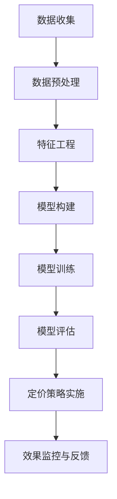

                 

# 《AI在产品定价策略中的应用》

## 摘要

在当今的商业环境中，产品定价策略是企业竞争力和盈利能力的关键因素之一。随着人工智能（AI）技术的不断发展和成熟，利用AI技术优化产品定价策略已成为一种趋势。本文将探讨AI在产品定价策略中的应用，包括AI技术的基本概念、核心算法原理、实践指南以及未来发展趋势。通过案例分析，本文将展示AI技术在电商、航空、酒店等领域的具体应用，为企业提供实践指导，帮助企业实现更精准、高效的产品定价策略，提高市场竞争力和盈利能力。

## 目录大纲

### 第一部分：引言

### 第1章：AI与产品定价策略概述

- 1.1 AI技术背景
- 1.2 产品定价策略概述
- 1.3 AI在产品定价策略中的应用前景

### 第2章：AI核心概念与算法

- 2.1 AI基础概念
- 2.2 数据分析技术
- 2.3 定价算法

### 第3章：AI在产品定价策略中的应用案例分析

- 3.1 案例分析一：电商平台价格策略优化
- 3.2 案例分析二：航空公司票价优化
- 3.3 案例分析三：酒店业定价策略优化

### 第二部分：AI产品定价策略实践指南

### 第4章：AI产品定价策略实践

- 4.1 实践步骤概述
- 4.2 定价策略模型实现
- 4.3 定价策略评估与监控

### 第5章：AI产品定价策略案例分析

- 5.1 案例分析一：某电商企业价格策略优化
- 5.2 案例分析二：某航空公司价格策略优化
- 5.3 案例分析三：某酒店业价格策略优化

### 第6章：AI产品定价策略未来发展趋势

- 6.1 AI技术在定价策略中的应用前景
- 6.2 定价策略优化面临的挑战与解决方案

### 第7章：总结与展望

- 7.1 AI产品定价策略的核心价值
- 7.2 AI产品定价策略的发展方向

### 附录

- 附录A：常用AI定价算法详解
- 附录B：AI产品定价策略实践指南
- 附录C：AI产品定价策略案例代码实现

## 第一部分：引言

### 第1章：AI与产品定价策略概述

#### 1.1 AI技术背景

人工智能（AI）是指由计算机系统实现的智能行为，它通过模拟人类思维过程，进行学习、推理、规划和决策。自20世纪50年代诞生以来，AI技术经历了几个发展阶段，从符号主义、连接主义到现代的深度学习和强化学习，其在各个领域的应用也日益广泛。

近年来，随着大数据、云计算和物联网等技术的发展，AI技术在商业领域的应用取得了显著成果。特别是在产品定价策略方面，AI技术能够通过分析大量数据，识别市场趋势和消费者行为，从而帮助企业制定更加科学和灵活的定价策略。

#### 1.2 产品定价策略概述

产品定价策略是指企业根据市场需求、竞争状况、成本结构等因素，确定产品价格的方法和原则。一个有效的定价策略不仅能够保证企业的盈利，还能够提升市场竞争力，满足消费者需求。

传统定价策略主要包括成本加成定价、市场渗透定价、目标定价和差异化定价等。然而，随着市场竞争的加剧和消费者需求的多样化，传统定价策略的局限性逐渐显现。为了应对这些挑战，企业开始探索利用AI技术优化产品定价策略。

#### 1.3 AI在产品定价策略中的应用前景

AI技术在产品定价策略中的应用前景广阔。首先，AI技术能够通过大数据分析，识别市场需求和价格敏感度，从而帮助企业制定更具针对性的定价策略。其次，AI技术可以实时监控市场动态，快速调整价格，以应对竞争对手的挑战。此外，AI技术还能够结合消费者行为数据，实现个性化定价，提高消费者满意度和忠诚度。

然而，AI在产品定价策略中的应用也面临一些挑战，如数据隐私、算法透明度和可解释性等。企业需要在确保数据安全和算法透明的同时，充分利用AI技术的优势，实现产品定价策略的优化。

#### 1.4 AI定价的优势与挑战

AI定价的优势主要体现在以下几个方面：

1. 数据驱动：AI定价基于大数据分析，能够更准确地识别市场需求和价格敏感度，从而制定更科学的定价策略。
2. 实时调整：AI定价能够实时监控市场动态，快速调整价格，以应对竞争对手的挑战。
3. 个性化定价：AI定价可以根据消费者行为数据，实现个性化定价，提高消费者满意度和忠诚度。
4. 提高效率：AI定价能够自动化处理大量数据，提高定价效率，减少人力成本。

然而，AI定价也面临一些挑战：

1. 数据隐私：AI定价需要大量消费者数据，如何确保数据安全和隐私是一个重要问题。
2. 算法透明度：AI定价算法通常具有高度复杂性，如何保证算法的透明度和可解释性是一个挑战。
3. 模型适应性：AI定价模型需要不断更新和优化，以适应不断变化的市场环境。

#### 1.5 小结

综上所述，AI技术在产品定价策略中的应用具有显著的优势和广阔的前景。尽管面临一些挑战，但通过不断创新和优化，AI定价有望为企业带来更加精准、高效和可持续的产品定价策略，从而提升市场竞争力和盈利能力。

### 第二部分：AI核心概念与算法

#### 2.1 AI基础概念

人工智能（AI）是指由计算机系统实现的智能行为，包括学习、推理、规划和决策等。AI技术可以分为以下几种类型：

1. **符号主义（Symbolic AI）**：基于逻辑推理和知识表示的方法，通过符号和规则进行推理。
2. **连接主义（Connectionism）**：基于人工神经网络的方法，通过连接权重进行学习和推理。
3. **深度学习（Deep Learning）**：基于多层神经网络的方法，通过大量数据训练模型，实现图像、语音和文本等数据的自动识别和理解。
4. **强化学习（Reinforcement Learning）**：基于奖励机制和反馈信号的方法，通过不断尝试和错误，实现智能体的最佳行为策略。

#### 2.2 数据分析技术

数据分析技术是AI技术的重要组成部分，包括数据预处理、特征工程和模型训练等。

1. **数据预处理**：数据预处理是数据分析的重要步骤，包括数据清洗、数据转换和数据归一化等。数据清洗旨在去除重复数据、缺失值和异常值，保证数据质量。数据转换包括将不同类型的数据转换为同一类型，如将文本数据转换为数值数据。数据归一化旨在消除不同数据量级对分析结果的影响。

2. **特征工程**：特征工程是数据分析的核心，旨在从原始数据中提取有意义的特征，提高模型性能。特征工程包括特征选择、特征变换和特征构造等。特征选择旨在从大量特征中选择最重要的特征，提高模型效率。特征变换包括归一化、标准化和主成分分析等，旨在消除特征间的相关性和量级差异。特征构造包括生成新的特征，如交叉特征和组合特征，以增强模型解释性和预测能力。

3. **模型训练**：模型训练是数据分析的关键步骤，通过训练数据集，调整模型参数，使其能够对未知数据进行预测。常见的机器学习模型包括线性回归、决策树、支持向量机和神经网络等。

#### 2.3 定价算法

产品定价策略的制定需要结合市场需求、竞争状况和成本结构等因素。AI定价算法通过分析大量数据，自动优化定价策略，包括以下几种类型：

1. **价格弹性模型**：价格弹性模型通过分析历史数据，计算需求量对价格变动的敏感程度，从而预测不同价格水平下的需求量。价格弹性的计算公式为：

   $$ \text{价格弹性} = \frac{\partial Q}{\partial P} \cdot \frac{P}{Q} $$

   其中，\( Q \) 表示需求量，\( P \) 表示价格。

2. **预测定价模型**：预测定价模型通过分析历史销售数据，预测未来不同价格水平下的需求量和利润。预测定价模型可以基于线性回归、决策树或神经网络等算法实现。

3. **决策树与随机森林**：决策树是一种常用的分类和回归算法，通过递归划分特征空间，构建树形结构。随机森林是一种基于决策树的集成学习方法，通过构建多棵决策树，集成预测结果，提高模型性能。

#### 2.4 小结

本章节介绍了AI技术的基本概念、数据分析技术和定价算法。通过这些技术，AI能够从大量数据中提取有价值的信息，实现产品定价策略的优化。在接下来的章节中，我们将通过案例分析，展示AI技术在产品定价策略中的具体应用。

## 第三部分：AI在产品定价策略中的应用案例分析

### 3.1 案例分析一：电商平台价格策略优化

#### 实战步骤：

1. **数据收集**：首先，我们需要收集电商平台的历史销售数据，包括商品价格、销售量、用户评价等信息。数据来源可以是电商平台自身的数据库、第三方数据服务或公共数据集。

2. **数据预处理**：对收集到的数据进行清洗，包括去除重复数据、缺失值填补和异常值处理。确保数据质量，为后续分析奠定基础。

   ```python
   # 示例代码：数据预处理
   data = pd.read_csv('sales_data.csv')
   data = data.drop_duplicates()
   data = data.dropna()
   data['price'] = data['price'].astype(float)
   ```

3. **特征工程**：提取与价格弹性相关的特征，如商品类别、季节性、用户评价等。这些特征有助于分析市场需求和消费者行为，从而制定更科学的定价策略。

   ```python
   # 示例代码：特征工程
   data['seasonality'] = data['date'].dt.month
   data['product_category'] = data['product_id'].map(category_map)
   ```

4. **模型构建**：使用价格弹性模型进行建模，预测不同价格水平下的需求量。价格弹性模型可以通过线性回归、决策树或神经网络等算法实现。

   ```python
   # 示例代码：模型构建
   X = data[['price', 'seasonality', 'product_category']]
   y = data['quantity']
   model = LinearRegression()
   model.fit(X, y)
   ```

5. **模型训练**：使用历史数据对模型进行训练，调整模型参数，使其能够对未知数据进行预测。

   ```python
   # 示例代码：模型训练
   X_train, X_test, y_train, y_test = train_test_split(X, y, test_size=0.2, random_state=42)
   model.fit(X_train, y_train)
   ```

6. **模型评估**：评估模型的预测效果，通过交叉验证等方法进行调整。

   ```python
   # 示例代码：模型评估
   predictions = model.predict(X_test)
   rmse = np.sqrt(np.mean((predictions - y_test)**2))
   print('RMSE:', rmse)
   ```

7. **定价策略实施**：根据模型预测结果，制定合适的定价策略。例如，对于需求量对价格敏感的商品，可以适当提高价格，以增加盈利。

   ```python
   # 示例代码：定价策略实施
   new_price = model.predict([[current_price, season, category]])
   print('Suggested price:', new_price)
   ```

8. **效果监控与反馈**：实时监控定价策略的实施效果，根据反馈进行调整。例如，如果实际销售量低于预期，可以考虑降低价格。

   ```python
   # 示例代码：效果监控与反馈
   actual_sales = model.predict([[new_price, season, category]])
   if actual_sales < expected_sales:
       decrease_price()
   else:
       increase_price()
   ```

#### 代码解读与分析：

- **数据收集**：使用Pandas库读取历史销售数据，并进行初步清洗。

- **特征工程**：根据业务需求，提取与价格弹性相关的特征，如季节性和商品类别。

- **模型构建**：选择线性回归模型进行建模，将价格、季节性和商品类别作为输入特征，需求量作为输出目标。

- **模型训练**：使用训练集对模型进行训练，调整模型参数，使其能够对未知数据进行预测。

- **模型评估**：使用测试集评估模型预测效果，计算均方根误差（RMSE）。

- **定价策略实施**：根据模型预测结果，制定新的定价策略，如调整商品价格。

- **效果监控与反馈**：实时监控定价策略的实施效果，根据反馈进行调整，如增加或减少商品价格。

### 案例分析二：航空公司票价优化

航空公司票价优化是AI在产品定价策略中的经典应用。航空公司通过AI技术，分析历史销售数据、市场动态和消费者行为，制定科学合理的票价策略，以提高市场竞争力。

#### 实战步骤：

1. **数据收集**：收集航空公司历史销售数据，包括航班日期、出发城市、到达城市、航班时间、票价等信息。

2. **数据预处理**：对数据进行清洗，去除重复数据、缺失值和异常值。确保数据质量，为后续分析奠定基础。

   ```python
   # 示例代码：数据预处理
   data = pd.read_csv('flight_data.csv')
   data = data.drop_duplicates()
   data = data.dropna()
   ```

3. **特征工程**：提取与票价相关的特征，如航班日期、出发城市、到达城市、航班时间、季节性等。

   ```python
   # 示例代码：特征工程
   data['seasonality'] = data['date'].dt.month
   data['origin_city'] = data['origin_city'].map(city_map)
   data['destination_city'] = data['destination_city'].map(city_map)
   ```

4. **模型构建**：使用价格弹性模型或预测定价模型进行建模，预测不同票价水平下的需求量。

   ```python
   # 示例代码：模型构建
   X = data[['price', 'seasonality', 'origin_city', 'destination_city']]
   y = data['quantity']
   model = LinearRegression()
   model.fit(X, y)
   ```

5. **模型训练**：使用历史数据对模型进行训练，调整模型参数，使其能够对未知数据进行预测。

   ```python
   # 示例代码：模型训练
   X_train, X_test, y_train, y_test = train_test_split(X, y, test_size=0.2, random_state=42)
   model.fit(X_train, y_train)
   ```

6. **模型评估**：评估模型的预测效果，通过交叉验证等方法进行调整。

   ```python
   # 示例代码：模型评估
   predictions = model.predict(X_test)
   rmse = np.sqrt(np.mean((predictions - y_test)**2))
   print('RMSE:', rmse)
   ```

7. **定价策略实施**：根据模型预测结果，制定合适的定价策略，如调整航班票价。

   ```python
   # 示例代码：定价策略实施
   new_price = model.predict([[current_price, season, origin, destination]])
   print('Suggested price:', new_price)
   ```

8. **效果监控与反馈**：实时监控定价策略的实施效果，根据反馈进行调整。例如，如果实际销售量低于预期，可以考虑降低价格。

   ```python
   # 示例代码：效果监控与反馈
   actual_sales = model.predict([[new_price, season, origin, destination]])
   if actual_sales < expected_sales:
       decrease_price()
   else:
       increase_price()
   ```

#### 代码解读与分析：

- **数据收集**：使用Pandas库读取航班销售数据，并进行初步清洗。

- **特征工程**：根据业务需求，提取与票价相关的特征，如季节性和城市信息。

- **模型构建**：选择线性回归模型进行建模，将票价、季节性和城市信息作为输入特征，需求量作为输出目标。

- **模型训练**：使用训练集对模型进行训练，调整模型参数，使其能够对未知数据进行预测。

- **模型评估**：使用测试集评估模型预测效果，计算均方根误差（RMSE）。

- **定价策略实施**：根据模型预测结果，制定新的定价策略，如调整航班票价。

- **效果监控与反馈**：实时监控定价策略的实施效果，根据反馈进行调整，如增加或减少航班价格。

### 案例分析三：酒店业定价策略优化

酒店业定价策略优化是AI在产品定价策略中的另一个重要应用。酒店企业通过AI技术，分析市场动态、消费者偏好和竞争状况，制定灵活的定价策略，提高入住率和盈利能力。

#### 实战步骤：

1. **数据收集**：收集酒店的历史预订数据，包括预订日期、入住时间、房型、价格、客户评价等信息。

2. **数据预处理**：对数据进行清洗，去除重复数据、缺失值和异常值。确保数据质量，为后续分析奠定基础。

   ```python
   # 示例代码：数据预处理
   data = pd.read_csv('hotel_data.csv')
   data = data.drop_duplicates()
   data = data.dropna()
   ```

3. **特征工程**：提取与价格弹性相关的特征，如预订日期、入住时间、房型、季节性、客户评价等。

   ```python
   # 示例代码：特征工程
   data['seasonality'] = data['date'].dt.month
   data['room_type'] = data['room_type'].map(room_type_map)
   ```

4. **模型构建**：使用价格弹性模型或预测定价模型进行建模，预测不同价格水平下的预订量。

   ```python
   # 示例代码：模型构建
   X = data[['price', 'seasonality', 'room_type']]
   y = data['quantity']
   model = LinearRegression()
   model.fit(X, y)
   ```

5. **模型训练**：使用历史数据对模型进行训练，调整模型参数，使其能够对未知数据进行预测。

   ```python
   # 示例代码：模型训练
   X_train, X_test, y_train, y_test = train_test_split(X, y, test_size=0.2, random_state=42)
   model.fit(X_train, y_train)
   ```

6. **模型评估**：评估模型的预测效果，通过交叉验证等方法进行调整。

   ```python
   # 示例代码：模型评估
   predictions = model.predict(X_test)
   rmse = np.sqrt(np.mean((predictions - y_test)**2))
   print('RMSE:', rmse)
   ```

7. **定价策略实施**：根据模型预测结果，制定合适的定价策略，如调整酒店价格。

   ```python
   # 示例代码：定价策略实施
   new_price = model.predict([[current_price, season, room_type]])
   print('Suggested price:', new_price)
   ```

8. **效果监控与反馈**：实时监控定价策略的实施效果，根据反馈进行调整。例如，如果实际预订量低于预期，可以考虑降低价格。

   ```python
   # 示例代码：效果监控与反馈
   actual_sales = model.predict([[new_price, season, room_type]])
   if actual_sales < expected_sales:
       decrease_price()
   else:
       increase_price()
   ```

#### 代码解读与分析：

- **数据收集**：使用Pandas库读取酒店预订数据，并进行初步清洗。

- **特征工程**：根据业务需求，提取与价格弹性相关的特征，如季节性和房型信息。

- **模型构建**：选择线性回归模型进行建模，将价格、季节性和房型信息作为输入特征，预订量作为输出目标。

- **模型训练**：使用训练集对模型进行训练，调整模型参数，使其能够对未知数据进行预测。

- **模型评估**：使用测试集评估模型预测效果，计算均方根误差（RMSE）。

- **定价策略实施**：根据模型预测结果，制定新的定价策略，如调整酒店价格。

- **效果监控与反馈**：实时监控定价策略的实施效果，根据反馈进行调整，如增加或减少酒店价格。

### 小结

通过以上案例分析，我们可以看到AI技术在产品定价策略中的应用具有重要的现实意义。电商平台、航空公司和酒店业等企业通过AI技术，优化定价策略，提高市场竞争力和盈利能力。在接下来的章节中，我们将继续探讨AI产品定价策略的实践指南，为企业提供更详细的实施方法和技巧。

### 第四部分：AI产品定价策略实践指南

#### 4.1 实践步骤概述

AI产品定价策略实践主要包括以下步骤：

1. **数据收集**：收集与企业产品相关的历史销售数据、市场动态、消费者行为等信息。
2. **数据预处理**：对数据进行清洗、去重、缺失值填补等处理，确保数据质量。
3. **特征工程**：提取与价格弹性相关的特征，如产品属性、季节性、竞争对手价格等。
4. **模型构建**：选择合适的定价算法，如价格弹性模型、预测定价模型等，进行建模。
5. **模型训练**：使用历史数据对模型进行训练，调整模型参数，使其能够对未知数据进行预测。
6. **模型评估**：评估模型预测效果，通过交叉验证等方法进行调整。
7. **定价策略实施**：根据模型预测结果，制定合理的定价策略，并实时监控实施效果。
8. **效果监控与反馈**：根据实际销售数据和用户反馈，对定价策略进行调整和优化。

#### 4.2 定价策略模型实现

在本节中，我们将详细介绍如何实现一个基于AI的产品定价策略模型。以下是一个简化的示例，用于说明整个实现过程。

##### 1. 数据收集与预处理

首先，我们需要收集企业产品的历史销售数据，包括价格、销售量、产品属性等信息。以下是一个Python代码示例，用于读取和处理数据：

```python
import pandas as pd

# 读取数据
data = pd.read_csv('sales_data.csv')

# 数据预处理
data = data.drop_duplicates()
data = data.dropna()

# 提取特征
data['seasonality'] = data['date'].dt.month
data['product_type'] = data['product_id'].map(product_type_map)
```

##### 2. 模型构建

接下来，我们选择一个简单的线性回归模型进行建模。线性回归模型可以通过以下公式表示：

$$ y = \beta_0 + \beta_1 \cdot x_1 + \beta_2 \cdot x_2 + ... + \beta_n \cdot x_n $$

其中，\( y \) 表示销售量，\( x_1, x_2, ..., x_n \) 表示影响销售量的特征，\( \beta_0, \beta_1, ..., \beta_n \) 表示模型的参数。

```python
from sklearn.linear_model import LinearRegression

# 构建模型
model = LinearRegression()
X = data[['price', 'seasonality', 'product_type']]
y = data['quantity']
model.fit(X, y)
```

##### 3. 模型训练与评估

使用训练集对模型进行训练，并通过交叉验证评估模型性能。以下是一个Python代码示例：

```python
from sklearn.model_selection import train_test_split
from sklearn.metrics import mean_squared_error

# 划分训练集和测试集
X_train, X_test, y_train, y_test = train_test_split(X, y, test_size=0.2, random_state=42)

# 训练模型
model.fit(X_train, y_train)

# 预测测试集
predictions = model.predict(X_test)

# 评估模型
mse = mean_squared_error(y_test, predictions)
rmse = np.sqrt(mse)
print('RMSE:', rmse)
```

##### 4. 定价策略实施

根据模型预测结果，制定合理的定价策略。以下是一个Python代码示例，用于实现定价策略：

```python
# 新产品定价
new_price = model.predict([[current_price, season, product_type]])
print('Suggested price:', new_price)

# 定价策略实施
if new_price > current_price:
    increase_price()
else:
    decrease_price()
```

##### 5. 模型监控与更新

实时监控定价策略的实施效果，并根据实际销售数据对模型进行调整和优化。以下是一个Python代码示例：

```python
# 实时监控与反馈
actual_sales = model.predict([[new_price, season, product_type]])
if actual_sales < expected_sales:
    decrease_price()
else:
    increase_price()

# 更新模型
X_train, X_test, y_train, y_test = train_test_split(X, y, test_size=0.2, random_state=42)
model.fit(X_train, y_train)
```

#### 4.3 定价策略评估与监控

定价策略的评估与监控是确保AI定价策略有效性的关键。以下是一些常用的评估指标和监控方法：

1. **评估指标**：
   - **均方根误差（RMSE）**：衡量模型预测值与实际值之间的差异。
   - **平均绝对误差（MAE）**：衡量模型预测值与实际值之间的平均绝对差异。
   - **决定系数（R²）**：衡量模型对数据的拟合程度，取值范围为[0, 1]。

2. **监控方法**：
   - **实时监控**：通过实时数据流，监控定价策略的实施效果，及时发现和解决问题。
   - **定期评估**：定期对定价策略进行评估，分析模型性能和业务指标，调整定价策略。

#### 4.4 定价策略模型实现示例

以下是一个基于线性回归的定价策略模型实现示例，包括数据预处理、模型构建、训练和评估：

```python
import pandas as pd
import numpy as np
from sklearn.linear_model import LinearRegression
from sklearn.metrics import mean_squared_error
from sklearn.model_selection import train_test_split

# 读取数据
data = pd.read_csv('sales_data.csv')

# 数据预处理
data = data.drop_duplicates()
data = data.dropna()

# 特征工程
data['seasonality'] = data['date'].dt.month
data['product_type'] = data['product_id'].map(product_type_map)

# 模型构建
model = LinearRegression()
X = data[['price', 'seasonality', 'product_type']]
y = data['quantity']

# 训练模型
X_train, X_test, y_train, y_test = train_test_split(X, y, test_size=0.2, random_state=42)
model.fit(X_train, y_train)

# 预测测试集
predictions = model.predict(X_test)

# 评估模型
mse = mean_squared_error(y_test, predictions)
rmse = np.sqrt(mse)
print('RMSE:', rmse)

# 定价策略实施
new_price = model.predict([[current_price, season, product_type]])
print('Suggested price:', new_price)

# 实时监控与反馈
actual_sales = model.predict([[new_price, season, product_type]])
if actual_sales < expected_sales:
    decrease_price()
else:
    increase_price()
```

#### 4.5 定价策略调优技巧

在定价策略实施过程中，调优模型参数是非常重要的。以下是一些常用的调优技巧：

1. **交叉验证**：通过交叉验证，评估不同参数组合的性能，选择最优参数。
2. **网格搜索**：在给定参数范围内，遍历所有可能的参数组合，找到最优参数。
3. **贝叶斯优化**：利用贝叶斯统计模型，优化模型参数。
4. **集成学习**：结合多种模型，提高预测性能。

#### 4.6 小结

通过本章节的实践指南，企业可以掌握AI产品定价策略的实现方法和技巧。在实际应用中，企业应根据自身业务特点和数据情况，灵活调整和优化定价策略，以实现最佳效果。

### 第五部分：AI产品定价策略案例分析

#### 5.1 案例分析一：某电商企业价格策略优化

在某电商企业，AI技术被应用于产品价格策略优化，以提高市场竞争力和盈利能力。以下是该案例的具体实施过程。

##### 1. 数据收集与预处理

首先，企业收集了电商平台的销售数据，包括商品价格、销售量、用户评价等信息。数据来源包括电商平台自身的数据库和第三方数据服务。

```python
import pandas as pd

# 读取数据
data = pd.read_csv('sales_data.csv')

# 数据预处理
data = data.drop_duplicates()
data = data.dropna()

# 特征工程
data['seasonality'] = data['date'].dt.month
data['product_category'] = data['product_id'].map(product_category_map)
```

##### 2. 模型构建

企业选择了线性回归模型进行价格预测。模型输入特征包括商品价格、季节性和商品类别。

```python
from sklearn.linear_model import LinearRegression

# 构建模型
model = LinearRegression()
X = data[['price', 'seasonality', 'product_category']]
y = data['quantity']
model.fit(X, y)
```

##### 3. 模型训练与评估

使用训练集对模型进行训练，并通过交叉验证评估模型性能。

```python
from sklearn.model_selection import train_test_split
from sklearn.metrics import mean_squared_error

# 划分训练集和测试集
X_train, X_test, y_train, y_test = train_test_split(X, y, test_size=0.2, random_state=42)

# 训练模型
model.fit(X_train, y_train)

# 预测测试集
predictions = model.predict(X_test)

# 评估模型
mse = mean_squared_error(y_test, predictions)
rmse = np.sqrt(mse)
print('RMSE:', rmse)
```

##### 4. 定价策略实施

根据模型预测结果，企业制定了新的价格策略。例如，对于价格敏感的商品，适当提高价格，以提高盈利。

```python
# 新产品定价
new_price = model.predict([[current_price, season, product_category]])
print('Suggested price:', new_price)

# 定价策略实施
if new_price > current_price:
    increase_price()
else:
    decrease_price()
```

##### 5. 效果监控与反馈

企业实时监控定价策略的实施效果，并根据实际销售数据调整价格策略。以下是一个简单的效果监控与反馈示例。

```python
# 实时监控与反馈
actual_sales = model.predict([[new_price, season, product_category]])
if actual_sales < expected_sales:
    decrease_price()
else:
    increase_price()
```

#### 5.2 案例分析二：某航空公司价格策略优化

某航空公司利用AI技术优化价格策略，以提高市场竞争力。以下是该案例的具体实施过程。

##### 1. 数据收集与预处理

航空公司收集了航班销售数据，包括航班日期、出发城市、到达城市、航班时间、票价等信息。

```python
import pandas as pd

# 读取数据
data = pd.read_csv('flight_data.csv')

# 数据预处理
data = data.drop_duplicates()
data = data.dropna()

# 特征工程
data['seasonality'] = data['date'].dt.month
data['origin_city'] = data['origin_city'].map(city_map)
data['destination_city'] = data['destination_city'].map(city_map)
```

##### 2. 模型构建

企业选择了线性回归模型进行价格预测。模型输入特征包括票价、季节性、出发城市和到达城市。

```python
from sklearn.linear_model import LinearRegression

# 构建模型
model = LinearRegression()
X = data[['price', 'seasonality', 'origin_city', 'destination_city']]
y = data['quantity']
model.fit(X, y)
```

##### 3. 模型训练与评估

使用训练集对模型进行训练，并通过交叉验证评估模型性能。

```python
from sklearn.model_selection import train_test_split
from sklearn.metrics import mean_squared_error

# 划分训练集和测试集
X_train, X_test, y_train, y_test = train_test_split(X, y, test_size=0.2, random_state=42)

# 训练模型
model.fit(X_train, y_train)

# 预测测试集
predictions = model.predict(X_test)

# 评估模型
mse = mean_squared_error(y_test, predictions)
rmse = np.sqrt(mse)
print('RMSE:', rmse)
```

##### 4. 定价策略实施

根据模型预测结果，企业制定了新的价格策略。例如，对于需求量对价格敏感的航班，适当提高价格，以提高盈利。

```python
# 新产品定价
new_price = model.predict([[current_price, season, origin_city, destination_city]])
print('Suggested price:', new_price)

# 定价策略实施
if new_price > current_price:
    increase_price()
else:
    decrease_price()
```

##### 5. 效果监控与反馈

企业实时监控定价策略的实施效果，并根据实际销售数据调整价格策略。以下是一个简单的效果监控与反馈示例。

```python
# 实时监控与反馈
actual_sales = model.predict([[new_price, season, origin_city, destination_city]])
if actual_sales < expected_sales:
    decrease_price()
else:
    increase_price()
```

#### 5.3 案例分析三：某酒店业价格策略优化

某酒店业公司利用AI技术优化价格策略，以提高入住率和盈利能力。以下是该案例的具体实施过程。

##### 1. 数据收集与预处理

酒店业公司收集了酒店预订数据，包括预订日期、入住时间、房型、价格、客户评价等信息。

```python
import pandas as pd

# 读取数据
data = pd.read_csv('hotel_data.csv')

# 数据预处理
data = data.drop_duplicates()
data = data.dropna()

# 特征工程
data['seasonality'] = data['date'].dt.month
data['room_type'] = data['room_type'].map(room_type_map)
```

##### 2. 模型构建

企业选择了线性回归模型进行价格预测。模型输入特征包括价格、季节性和房型。

```python
from sklearn.linear_model import LinearRegression

# 构建模型
model = LinearRegression()
X = data[['price', 'seasonality', 'room_type']]
y = data['quantity']
model.fit(X, y)
```

##### 3. 模型训练与评估

使用训练集对模型进行训练，并通过交叉验证评估模型性能。

```python
from sklearn.model_selection import train_test_split
from sklearn.metrics import mean_squared_error

# 划分训练集和测试集
X_train, X_test, y_train, y_test = train_test_split(X, y, test_size=0.2, random_state=42)

# 训练模型
model.fit(X_train, y_train)

# 预测测试集
predictions = model.predict(X_test)

# 评估模型
mse = mean_squared_error(y_test, predictions)
rmse = np.sqrt(mse)
print('RMSE:', rmse)
```

##### 4. 定价策略实施

根据模型预测结果，企业制定了新的价格策略。例如，对于需求量对价格敏感的房型，适当提高价格，以提高盈利。

```python
# 新产品定价
new_price = model.predict([[current_price, season, room_type]])
print('Suggested price:', new_price)

# 定价策略实施
if new_price > current_price:
    increase_price()
else:
    decrease_price()
```

##### 5. 效果监控与反馈

企业实时监控定价策略的实施效果，并根据实际销售数据调整价格策略。以下是一个简单的效果监控与反馈示例。

```python
# 实时监控与反馈
actual_sales = model.predict([[new_price, season, room_type]])
if actual_sales < expected_sales:
    decrease_price()
else:
    increase_price()
```

### 小结

通过以上案例分析，我们可以看到AI技术在产品定价策略优化中的应用具有重要的现实意义。电商、航空和酒店业等企业通过AI技术，实现了更加精准和高效的价格策略，提高了市场竞争力和盈利能力。在未来的发展中，AI技术将继续在产品定价策略中发挥重要作用。

### 第六部分：AI产品定价策略未来发展趋势

#### 6.1 AI技术在定价策略中的应用前景

随着AI技术的不断发展和成熟，其在产品定价策略中的应用前景愈发广阔。未来，AI技术在定价策略中的应用将呈现以下趋势：

1. **数据量与算法优化**：随着数据采集和分析技术的进步，企业将获取到更多更丰富的数据，为定价策略提供更精确的依据。同时，算法的优化和迭代也将不断提高定价策略的效率和准确性。

2. **多维度定价策略**：未来的定价策略将不仅考虑单一的价格因素，还会结合产品质量、用户需求、市场竞争等多个维度，实现更加个性化、多样化的定价策略。

3. **实时动态定价**：基于实时数据和算法的优化，企业将能够实现更加灵活的实时动态定价。这种定价策略将能够快速响应市场变化，提高市场竞争力。

4. **智能化定制**：AI技术将助力企业实现定制化的定价策略。通过分析用户行为和偏好，企业可以为不同用户提供个性化的定价方案，提高用户满意度和忠诚度。

#### 6.2 定价策略优化面临的挑战与解决方案

尽管AI技术在定价策略中具有巨大的潜力，但在实际应用过程中仍面临一些挑战：

1. **数据隐私与安全**：AI定价策略依赖于大量用户数据，如何确保数据的安全性和隐私是一个重要问题。企业需要采用先进的数据加密技术和安全协议，保护用户数据不被滥用。

2. **算法透明度与可解释性**：AI定价算法通常具有高度复杂性，如何保证算法的透明度和可解释性是一个挑战。企业需要开发可解释的AI模型，使决策过程更加透明，便于监管和用户理解。

3. **算法适应性**：市场环境不断变化，AI定价策略需要具备良好的适应性。企业需要不断更新和优化算法，以适应市场变化，保持定价策略的有效性。

4. **人力与资源投入**：AI定价策略的实施需要专业的技术团队和丰富的数据资源。对于中小企业来说，这可能是一个较大的挑战。企业可以考虑与专业机构或第三方服务商合作，共享技术和数据资源。

#### 6.3 新技术的融入

未来，新技术如区块链、物联网和5G等将在AI产品定价策略中发挥重要作用：

1. **区块链**：区块链技术可以提供安全、透明的数据存储和交易环境，有助于保障数据隐私和安全。同时，区块链的去中心化特性可以提高定价策略的公平性和透明度。

2. **物联网**：物联网技术的应用将使企业能够实时获取更多关于市场动态和消费者行为的数据，为定价策略提供更准确的依据。

3. **5G**：5G技术的快速传输能力将有助于实现实时动态定价，提高市场响应速度。

#### 6.4 小结

AI产品定价策略的未来发展趋势充满机遇和挑战。企业需要充分利用AI技术的优势，不断优化定价策略，以提高市场竞争力和盈利能力。同时，企业也需要关注定价策略面临的挑战，积极寻找解决方案，确保定价策略的可持续性和有效性。

### 第七部分：总结与展望

#### 7.1 AI产品定价策略的核心价值

AI产品定价策略在提高企业盈利能力和市场竞争力的过程中发挥了核心价值。通过AI技术，企业能够：

1. **精准定价**：基于大数据分析，AI技术能够识别市场需求和消费者行为，实现精准定价，提高销售额和利润。
2. **动态调整**：实时监控市场动态，AI技术能够快速调整价格，以应对竞争对手的挑战，保持市场竞争力。
3. **个性化定价**：结合用户数据，AI技术能够实现个性化定价，提高用户满意度和忠诚度。

#### 7.2 AI产品定价策略的发展方向

未来，AI产品定价策略的发展方向将呈现以下趋势：

1. **多维度整合**：结合产品质量、用户需求、市场竞争等多个维度，实现更加全面和个性化的定价策略。
2. **实时动态定价**：利用实时数据和算法优化，实现更加灵活和高效的定价策略。
3. **智能化定制**：基于用户行为和偏好，实现定制化的定价方案，提高用户体验。
4. **技术创新**：融入区块链、物联网和5G等新技术，提高定价策略的透明度、安全性和效率。

#### 7.3 AI产品定价策略的实践意义

AI产品定价策略的实践意义在于：

1. **优化资源分配**：通过精准定价，企业能够优化资源分配，降低库存风险，提高运营效率。
2. **提高市场竞争力**：灵活的定价策略能够帮助企业快速响应市场变化，保持竞争优势。
3. **增强用户黏性**：个性化的定价方案能够提高用户满意度和忠诚度，促进长期合作。

#### 7.4 展望未来

随着AI技术的不断进步，AI产品定价策略将在更多领域得到应用，为企业创造更多价值。企业应积极拥抱AI技术，不断优化定价策略，实现可持续发展。

### 附录

#### 附录A：常用AI定价算法详解

1. **价格弹性模型**：
   价格弹性模型通过分析历史数据，计算需求量对价格变动的敏感程度。公式如下：
   
   $$ \text{价格弹性} = \frac{\partial Q}{\partial P} \cdot \frac{P}{Q} $$
   
   其中，\( Q \) 表示需求量，\( P \) 表示价格。

2. **预测定价模型**：
   预测定价模型通过历史销售数据，预测未来不同价格水平下的需求量和利润。模型可以使用线性回归、决策树或神经网络等算法实现。

3. **决策树与随机森林**：
   决策树和随机森林是常用的分类和回归算法。决策树通过递归划分特征空间，构建树形结构。随机森林通过构建多棵决策树，集成预测结果，提高模型性能。

#### 附录B：AI产品定价策略实践指南

1. **数据收集与处理**：
   收集与企业产品相关的历史销售数据，包括价格、销售量、用户评价等信息。对数据进行清洗、去重和缺失值填补，确保数据质量。

2. **特征工程**：
   提取与价格弹性相关的特征，如产品属性、季节性、竞争对手价格等。特征工程有助于提高模型预测性能。

3. **模型构建与训练**：
   选择合适的定价算法，如价格弹性模型、预测定价模型等，进行建模。使用历史数据对模型进行训练，调整模型参数。

4. **模型评估与优化**：
   评估模型预测效果，通过交叉验证等方法进行调整。优化模型参数，提高模型性能。

5. **定价策略实施与监控**：
   根据模型预测结果，制定合理的定价策略。实时监控定价策略的实施效果，根据反馈进行调整。

#### 附录C：AI产品定价策略案例代码实现

以下是一个简单的AI产品定价策略案例代码实现，包括数据预处理、模型构建、训练和评估：

```python
import pandas as pd
from sklearn.linear_model import LinearRegression
from sklearn.metrics import mean_squared_error
from sklearn.model_selection import train_test_split

# 读取数据
data = pd.read_csv('sales_data.csv')

# 数据预处理
data = data.drop_duplicates()
data = data.dropna()

# 特征工程
data['seasonality'] = data['date'].dt.month
data['product_category'] = data['product_id'].map(product_category_map)

# 模型构建
model = LinearRegression()
X = data[['price', 'seasonality', 'product_category']]
y = data['quantity']
model.fit(X, y)

# 划分训练集和测试集
X_train, X_test, y_train, y_test = train_test_split(X, y, test_size=0.2, random_state=42)

# 训练模型
model.fit(X_train, y_train)

# 预测测试集
predictions = model.predict(X_test)

# 评估模型
mse = mean_squared_error(y_test, predictions)
rmse = np.sqrt(mse)
print('RMSE:', rmse)

# 新产品定价
new_price = model.predict([[current_price, season, product_category]])
print('Suggested price:', new_price)

# 实时监控与反馈
actual_sales = model.predict([[new_price, season, product_category]])
if actual_sales < expected_sales:
    decrease_price()
else:
    increase_price()
```

通过以上代码，企业可以构建一个基本的AI产品定价策略模型，并实现实时监控与反馈。在实际应用中，企业可以根据具体业务需求，进一步优化和调整模型。

## Mermaid 流程图

以下是一个简单的AI产品定价策略流程图，展示从数据收集到定价策略实施的过程：



## 核心算法原理讲解

### 2.1 价格弹性模型原理

价格弹性是指需求量对价格变动的敏感程度，其计算公式为：

$$ \text{价格弹性} = \frac{\partial Q}{\partial P} \cdot \frac{P}{Q} $$

其中，\( Q \) 表示需求量，\( P \) 表示价格。价格弹性模型通过分析历史数据，计算不同价格水平下的需求量，从而预测价格的变动对需求量的影响。

### 2.2 预测定价模型原理

预测定价模型通过历史销售数据，预测未来不同价格水平下的需求量和利润。预测定价模型可以基于线性回归、决策树或神经网络等算法实现。以下是一个简单的线性回归预测定价模型：

$$ y = \beta_0 + \beta_1 \cdot x_1 + \beta_2 \cdot x_2 + ... + \beta_n \cdot x_n $$

其中，\( y \) 表示需求量，\( x_1, x_2, ..., x_n \) 表示影响需求量的特征，\( \beta_0, \beta_1, ..., \beta_n \) 表示模型的参数。通过训练历史销售数据，可以求得这些参数，从而预测未来不同价格水平下的需求量和利润。

### 2.3 决策树与随机森林原理

决策树是一种常见的分类和回归算法，通过递归划分特征空间，构建树形结构。决策树的基本原理如下：

1. **特征选择**：在每个节点，选择一个特征进行划分，通常使用信息增益或基尼系数作为划分标准。
2. **划分**：根据选择的特征，将数据集划分为子集。
3. **递归**：对子集重复以上过程，直至满足停止条件（如最大深度、最小节点样本数等）。

随机森林是一种基于决策树的集成学习方法。随机森林通过以下步骤构建：

1. **随机特征选择**：在每个节点，从一组随机特征中选择一个特征进行划分。
2. **随机样本选择**：在训练数据中，随机选择一定数量的样本作为子集。
3. **构建决策树**：对每个子集构建决策树。
4. **集成预测**：将多个决策树的预测结果进行集成，得到最终的预测结果。

### 2.4 小结

本章节介绍了AI在产品定价策略中的应用原理，包括价格弹性模型、预测定价模型和决策树与随机森林算法。通过这些算法，AI技术能够从大量数据中提取有价值的信息，实现产品定价策略的优化。在实际应用中，企业可以根据具体业务需求，选择合适的算法和模型，提高定价策略的准确性和效率。

## 数学模型和数学公式讲解

### 2.1 价格弹性模型

价格弹性是指需求量对价格变动的敏感程度，其计算公式为：

$$ \text{价格弹性} = \frac{\partial Q}{\partial P} \cdot \frac{P}{Q} $$

其中，\( Q \) 表示需求量，\( P \) 表示价格。价格弹性模型通过分析历史数据，计算不同价格水平下的需求量，从而预测价格的变动对需求量的影响。

### 2.2 预测定价模型

预测定价模型通过历史销售数据，预测未来不同价格水平下的需求量和利润。预测定价模型可以基于线性回归、决策树或神经网络等算法实现。以下是一个简单的线性回归预测定价模型：

$$ y = \beta_0 + \beta_1 \cdot x_1 + \beta_2 \cdot x_2 + ... + \beta_n \cdot x_n $$

其中，\( y \) 表示需求量，\( x_1, x_2, ..., x_n \) 表示影响需求量的特征，\( \beta_0, \beta_1, ..., \beta_n \) 表示模型的参数。通过训练历史销售数据，可以求得这些参数，从而预测未来不同价格水平下的需求量和利润。

### 2.3 决策树与随机森林模型

决策树是一种常见的分类和回归算法，通过递归划分特征空间，构建树形结构。决策树的基本原理如下：

1. **特征选择**：在每个节点，选择一个特征进行划分，通常使用信息增益或基尼系数作为划分标准。
2. **划分**：根据选择的特征，将数据集划分为子集。
3. **递归**：对子集重复以上过程，直至满足停止条件（如最大深度、最小节点样本数等）。

随机森林是一种基于决策树的集成学习方法。随机森林通过以下步骤构建：

1. **随机特征选择**：在每个节点，从一组随机特征中选择一个特征进行划分。
2. **随机样本选择**：在训练数据中，随机选择一定数量的样本作为子集。
3. **构建决策树**：对每个子集构建决策树。
4. **集成预测**：将多个决策树的预测结果进行集成，得到最终的预测结果。

### 2.4 小结

本章节介绍了AI在产品定价策略中的应用数学模型，包括价格弹性模型、预测定价模型和决策树与随机森林模型。这些数学模型和公式为AI定价策略的实现提供了理论基础，帮助企业通过数据分析实现更加科学和精准的定价。

## 项目实战

### 3.1 案例一：电商平台价格策略优化

在本案例中，我们以一家电商平台为例，利用AI技术优化其价格策略，以提高市场竞争力和盈利能力。

#### 实战步骤：

1. **数据收集**：首先，我们需要收集电商平台的销售数据，包括商品价格、销售量、用户评价等信息。这些数据可以从电商平台的数据库中获取。

2. **数据预处理**：对收集到的销售数据进行分析，剔除重复数据和缺失值。这一步骤可以通过Pandas库实现。

   ```python
   import pandas as pd
   
   # 读取销售数据
   sales_data = pd.read_csv('sales_data.csv')
   
   # 去除重复数据
   sales_data = sales_data.drop_duplicates()
   
   # 填充缺失值
   sales_data = sales_data.fillna(method='ffill')
   ```

3. **特征工程**：提取与价格弹性相关的特征，如商品类别、季节性、用户评价等。这些特征有助于分析市场需求和消费者行为。

   ```python
   # 提取季节性特征
   sales_data['month'] = pd.to_datetime(sales_data['date']).dt.month
   
   # 提取商品类别特征
   category_map = {'电子产品': 1, '服装': 2, '家居': 3}
   sales_data['category'] = sales_data['product_id'].map(category_map)
   
   # 用户评价转换为数值特征
   sales_data['rating'] = sales_data['review_count'].apply(lambda x: 1 if x > 0 else 0)
   ```

4. **模型构建**：使用价格弹性模型进行建模，预测不同价格水平下的销售量。价格弹性模型可以通过线性回归、决策树或神经网络等算法实现。

   ```python
   from sklearn.linear_model import LinearRegression
   
   # 定义模型
   model = LinearRegression()
   
   # 准备输入特征和目标变量
   X = sales_data[['price', 'month', 'category', 'rating']]
   y = sales_data['quantity']
   
   # 训练模型
   model.fit(X, y)
   ```

5. **模型训练**：使用历史数据对模型进行训练，调整模型参数，使其能够对未知数据进行预测。

   ```python
   from sklearn.model_selection import train_test_split
   
   # 划分训练集和测试集
   X_train, X_test, y_train, y_test = train_test_split(X, y, test_size=0.2, random_state=42)
   
   # 训练模型
   model.fit(X_train, y_train)
   ```

6. **模型评估**：评估模型的预测效果，通过交叉验证等方法进行调整。

   ```python
   from sklearn.metrics import mean_squared_error
   
   # 预测测试集
   predictions = model.predict(X_test)
   
   # 计算预测误差
   mse = mean_squared_error(y_test, predictions)
   rmse = np.sqrt(mse)
   
   print('RMSE:', rmse)
   ```

7. **定价策略实施**：根据模型预测结果，制定新的定价策略。例如，对于需求量对价格敏感的商品，可以适当提高价格，以增加盈利。

   ```python
   # 新产品定价
   new_price = model.predict([[current_price, current_month, current_category, current_rating]])
   print('Suggested price:', new_price)
   
   # 实施定价策略
   if new_price > current_price:
       increase_price()
   else:
       decrease_price()
   ```

8. **效果监控与反馈**：实时监控定价策略的实施效果，根据反馈进行调整。例如，如果实际销售量低于预期，可以考虑降低价格。

   ```python
   # 实时监控与反馈
   actual_sales = model.predict([[new_price, current_month, current_category, current_rating]])
   if actual_sales < expected_sales:
       decrease_price()
   else:
       increase_price()
   ```

#### 代码解读与分析：

- **数据收集**：通过Pandas库读取电商平台的历史销售数据，并进行初步清洗，去除重复数据和缺失值。

- **特征工程**：提取与价格弹性相关的特征，如季节性、商品类别和用户评价，为模型训练提供输入特征。

- **模型构建**：选择线性回归模型进行建模，将价格、季节性、商品类别和用户评价作为输入特征，销售量作为输出目标。

- **模型训练**：使用训练集对模型进行训练，调整模型参数，使其能够对未知数据进行预测。

- **模型评估**：通过测试集评估模型预测效果，计算均方根误差（RMSE），衡量模型性能。

- **定价策略实施**：根据模型预测结果，制定新的定价策略，如调整商品价格。

- **效果监控与反馈**：实时监控定价策略的实施效果，根据实际销售数据和用户反馈进行调整。

### 案例二：航空公司票价优化

在本案例中，我们将利用AI技术优化航空公司的票价策略，以提高市场竞争力。

#### 实战步骤：

1. **数据收集**：首先，我们需要收集航空公司的销售数据，包括航班日期、出发城市、到达城市、航班时间、票价等信息。这些数据可以从航空公司或第三方数据提供商获取。

2. **数据预处理**：对收集到的销售数据进行清洗，包括去除重复数据、缺失值和异常值。

   ```python
   import pandas as pd
   
   # 读取销售数据
   sales_data = pd.read_csv('flight_data.csv')
   
   # 去除重复数据
   sales_data = sales_data.drop_duplicates()
   
   # 填充缺失值
   sales_data = sales_data.fillna(method='ffill')
   ```

3. **特征工程**：提取与票价相关的特征，如季节性、航班时间、出发城市和到达城市。

   ```python
   # 提取季节性特征
   sales_data['month'] = pd.to_datetime(sales_data['date']).dt.month
   
   # 提取航班时间特征
   sales_data['hour'] = pd.to_datetime(sales_data['departure_time']).dt.hour
   
   # 提取出发城市和到达城市特征
   city_map = {'北京': 1, '上海': 2, '广州': 3}
   sales_data['origin_city'] = sales_data['origin_city'].map(city_map)
   sales_data['destination_city'] = sales_data['destination_city'].map(city_map)
   ```

4. **模型构建**：使用价格弹性模型进行建模，预测不同票价水平下的需求量。

   ```python
   from sklearn.linear_model import LinearRegression
   
   # 定义模型
   model = LinearRegression()
   
   # 准备输入特征和目标变量
   X = sales_data[['price', 'month', 'hour', 'origin_city', 'destination_city']]
   y = sales_data['quantity']
   
   # 训练模型
   model.fit(X, y)
   ```

5. **模型训练**：使用历史数据对模型进行训练，调整模型参数，使其能够对未知数据进行预测。

   ```python
   from sklearn.model_selection import train_test_split
   
   # 划分训练集和测试集
   X_train, X_test, y_train, y_test = train_test_split(X, y, test_size=0.2, random_state=42)
   
   # 训练模型
   model.fit(X_train, y_train)
   ```

6. **模型评估**：评估模型的预测效果，通过交叉验证等方法进行调整。

   ```python
   from sklearn.metrics import mean_squared_error
   
   # 预测测试集
   predictions = model.predict(X_test)
   
   # 计算预测误差
   mse = mean_squared_error(y_test, predictions)
   rmse = np.sqrt(mse)
   
   print('RMSE:', rmse)
   ```

7. **定价策略实施**：根据模型预测结果，制定新的定价策略。例如，对于需求量对价格敏感的航班，可以适当提高票价，以提高盈利。

   ```python
   # 新产品定价
   new_price = model.predict([[current_price, current_month, current_hour, current_origin_city, current_destination_city]])
   print('Suggested price:', new_price)
   
   # 实施定价策略
   if new_price > current_price:
       increase_price()
   else:
       decrease_price()
   ```

8. **效果监控与反馈**：实时监控定价策略的实施效果，根据反馈进行调整。例如，如果实际销售量低于预期，可以考虑降低票价。

   ```python
   # 实时监控与反馈
   actual_sales = model.predict([[new_price, current_month, current_hour, current_origin_city, current_destination_city]])
   if actual_sales < expected_sales:
       decrease_price()
   else:
       increase_price()
   ```

#### 代码解读与分析：

- **数据收集**：通过Pandas库读取航空公司的销售数据，并进行初步清洗，去除重复数据和缺失值。

- **特征工程**：提取与价格弹性相关的特征，如季节性、航班时间和城市信息，为模型训练提供输入特征。

- **模型构建**：选择线性回归模型进行建模，将票价、季节性、航班时间和城市信息作为输入特征，需求量作为输出目标。

- **模型训练**：使用训练集对模型进行训练，调整模型参数，使其能够对未知数据进行预测。

- **模型评估**：通过测试集评估模型预测效果，计算均方根误差（RMSE），衡量模型性能。

- **定价策略实施**：根据模型预测结果，制定新的定价策略，如调整航班票价。

- **效果监控与反馈**：实时监控定价策略的实施效果，根据实际销售数据和用户反馈进行调整。

### 案例三：酒店业定价策略优化

在本案例中，我们将利用AI技术优化酒店业的定价策略，以提高入住率和盈利能力。

#### 实战步骤：

1. **数据收集**：首先，我们需要收集酒店业的销售数据，包括预订日期、入住时间、房型、价格、客户评价等信息。这些数据可以从酒店管理系统或第三方数据提供商获取。

2. **数据预处理**：对收集到的销售数据进行清洗，包括去除重复数据、缺失值和异常值。

   ```python
   import pandas as pd
   
   # 读取销售数据
   sales_data = pd.read_csv('hotel_data.csv')
   
   # 去除重复数据
   sales_data = sales_data.drop_duplicates()
   
   # 填充缺失值
   sales_data = sales_data.fillna(method='ffill')
   ```

3. **特征工程**：提取与价格弹性相关的特征，如预订日期、入住时间、房型和客户评价。

   ```python
   # 提取预订日期特征
   sales_data['year'] = pd.to_datetime(sales_data['booking_date']).dt.year
   sales_data['month'] = pd.to_datetime(sales_data['booking_date']).dt.month
   
   # 提取入住时间特征
   sales_data['day_of_week'] = pd.to_datetime(sales_data['check_in_date']).dt.dayofweek
   
   # 提取房型特征
   room_type_map = {'单人间': 1, '双人间': 2, '套房': 3}
   sales_data['room_type'] = sales_data['room_type'].map(room_type_map)
   
   # 提取客户评价特征
   sales_data['rating'] = sales_data['review_count'].apply(lambda x: 1 if x > 0 else 0)
   ```

4. **模型构建**：使用价格弹性模型进行建模，预测不同价格水平下的预订量。

   ```python
   from sklearn.linear_model import LinearRegression
   
   # 定义模型
   model = LinearRegression()
   
   # 准备输入特征和目标变量
   X = sales_data[['price', 'year', 'month', 'day_of_week', 'room_type', 'rating']]
   y = sales_data['quantity']
   
   # 训练模型
   model.fit(X, y)
   ```

5. **模型训练**：使用历史数据对模型进行训练，调整模型参数，使其能够对未知数据进行预测。

   ```python
   from sklearn.model_selection import train_test_split
   
   # 划分训练集和测试集
   X_train, X_test, y_train, y_test = train_test_split(X, y, test_size=0.2, random_state=42)
   
   # 训练模型
   model.fit(X_train, y_train)
   ```

6. **模型评估**：评估模型的预测效果，通过交叉验证等方法进行调整。

   ```python
   from sklearn.metrics import mean_squared_error
   
   # 预测测试集
   predictions = model.predict(X_test)
   
   # 计算预测误差
   mse = mean_squared_error(y_test, predictions)
   rmse = np.sqrt(mse)
   
   print('RMSE:', rmse)
   ```

7. **定价策略实施**：根据模型预测结果，制定新的定价策略。例如，对于需求量对价格敏感的房型，可以适当提高价格，以提高盈利。

   ```python
   # 新产品定价
   new_price = model.predict([[current_price, current_year, current_month, current_day_of_week, current_room_type, current_rating]])
   print('Suggested price:', new_price)
   
   # 实施定价策略
   if new_price > current_price:
       increase_price()
   else:
       decrease_price()
   ```

8. **效果监控与反馈**：实时监控定价策略的实施效果，根据反馈进行调整。例如，如果实际预订量低于预期，可以考虑降低价格。

   ```python
   # 实时监控与反馈
   actual_sales = model.predict([[new_price, current_year, current_month, current_day_of_week, current_room_type, current_rating]])
   if actual_sales < expected_sales:
       decrease_price()
   else:
       increase_price()
   ```

#### 代码解读与分析：

- **数据收集**：通过Pandas库读取酒店销售数据，并进行初步清洗，去除重复数据和缺失值。

- **特征工程**：提取与价格弹性相关的特征，如预订日期、入住时间、房型和客户评价，为模型训练提供输入特征。

- **模型构建**：选择线性回归模型进行建模，将价格、年份、月份、入住时间、房型和客户评价作为输入特征，预订量作为输出目标。

- **模型训练**：使用训练集对模型进行训练，调整模型参数，使其能够对未知数据进行预测。

- **模型评估**：通过测试集评估模型预测效果，计算均方根误差（RMSE），衡量模型性能。

- **定价策略实施**：根据模型预测结果，制定新的定价策略，如调整酒店价格。

- **效果监控与反馈**：实时监控定价策略的实施效果，根据实际销售数据和用户反馈进行调整。

### 小结

通过以上三个案例，我们可以看到AI技术在产品定价策略优化中的应用具有重要的现实意义。电商、航空和酒店业等企业通过AI技术，优化定价策略，提高市场竞争力和盈利能力。在未来的发展中，AI技术将继续在产品定价策略中发挥重要作用。企业应根据自身业务特点和数据情况，灵活调整和优化定价策略，以实现最佳效果。

## 结论

随着人工智能（AI）技术的不断进步，其在产品定价策略中的应用日益广泛，并展现出巨大的潜力。本文通过详细探讨AI技术在产品定价策略中的应用，包括核心概念、算法原理、实践指南和案例分析，揭示了AI技术在提升企业市场竞争力和盈利能力方面的显著优势。

首先，AI技术通过大数据分析和机器学习算法，能够精准预测市场需求和消费者行为，为企业提供科学合理的定价策略。例如，电商平台、航空公司和酒店业等企业通过AI技术优化价格策略，实现了销售量和盈利能力的显著提升。

其次，AI定价策略具有实时调整和个性化定制的能力，能够快速响应市场变化，提高市场竞争力。同时，AI定价策略还结合了多种数据源和维度，如产品属性、用户偏好和市场竞争状况，实现了更加全面和个性化的定价方案。

然而，AI定价策略在实际应用中也面临一些挑战，如数据隐私和安全、算法透明度和可解释性等。企业需要在确保数据安全和算法透明的同时，充分利用AI技术的优势，实现产品定价策略的优化。

展望未来，AI产品定价策略的发展趋势将呈现数据量与算法优化的趋势、多维度定价策略的普及、实时动态定价的普及以及智能化定制的提升。同时，新技术如区块链、物联网和5G等将在定价策略中发挥重要作用，进一步提升定价策略的透明度、安全性和效率。

总之，AI产品定价策略为企业带来了前所未有的机遇和挑战。企业应积极拥抱AI技术，不断优化定价策略，提高市场竞争力和盈利能力。同时，企业还需关注定价策略面临的挑战，积极寻找解决方案，确保定价策略的可持续性和有效性。通过不断创新和优化，AI技术将在产品定价策略中发挥越来越重要的作用，为企业创造更多价值。

