                 

### 文章标题

> **关键词：** AI大模型，创业，挑战，实践，案例分析，技术路线

**摘要：** 本文旨在探讨AI大模型创业面临的机遇与挑战，通过深入分析AI大模型的基础知识、核心算法原理和应用案例，探讨创业项目的规划与管理，结合实际案例分析，为AI大模型创业提供实用的指导和建议。文章结构分为两部分：第一部分介绍AI大模型的基础知识、核心算法原理和应用案例分析；第二部分聚焦于AI大模型创业实践，探讨创业项目的规划、团队管理及风险管理。本文旨在帮助创业者更好地应对未来挑战，实现AI大模型创业的成功。

### 第一部分: AI大模型基础

#### 第1章: AI大模型概述

##### 1.1 AI大模型的时代背景

###### 1.1.1 AI大模型的起源

AI大模型的起源可以追溯到20世纪50年代，当时人工智能领域开始兴起。然而，由于计算能力的限制，早期的人工智能系统多为规则驱动，难以处理复杂的问题。随着计算机性能的提升，深度学习技术逐渐成熟，为AI大模型的发展奠定了基础。2006年，Hinton提出了深度信念网络（DBN），标志着深度学习进入一个新的阶段。2012年，AlexNet在ImageNet比赛中取得了突破性的成绩，深度学习开始在图像识别领域获得广泛应用。

###### 1.1.2 AI大模型的发展历程

从2006年至今，AI大模型经历了从简单的神经网络到复杂的Transformer模型的发展历程。在这一过程中，计算能力的提升、数据量的增长以及算法的优化共同推动了AI大模型的快速进步。特别是2018年，Google提出了Transformer模型，为自然语言处理领域带来了革命性的变化。随后，BERT、GPT等大规模预训练模型相继涌现，AI大模型在各个领域取得了显著的成果。

###### 1.1.3 AI大模型的重要性

AI大模型在当今世界具有举足轻重的地位。首先，AI大模型具有强大的数据处理能力，能够处理海量数据，挖掘出有价值的信息。其次，AI大模型在图像识别、自然语言处理、推荐系统等领域具有出色的性能，为各个行业带来了巨大的价值。此外，AI大模型还在医疗、金融、教育等领域发挥着重要作用，推动了社会的进步。总之，AI大模型已经成为人工智能领域的核心，其发展与应用将对未来产生深远影响。

##### 1.2 AI大模型的基本概念

###### 1.2.1 什么是AI大模型

AI大模型（Large-scale Artificial Intelligence Model）是指具有大规模参数的深度学习模型，通常具有数亿甚至数十亿个参数。这些模型通过对海量数据进行训练，可以提取出复杂的数据特征，从而实现高效的数据处理和预测。

###### 1.2.2 AI大模型的类型

AI大模型可以分为两类：基于神经网络的模型和基于Transformer的模型。基于神经网络的模型主要包括卷积神经网络（CNN）、循环神经网络（RNN）和长短时记忆网络（LSTM）等。基于Transformer的模型则包括BERT、GPT和T5等，这些模型在自然语言处理领域取得了显著的成果。

###### 1.2.3 AI大模型的特点

AI大模型具有以下特点：

1. **参数规模大**：AI大模型通常具有数亿甚至数十亿个参数，这使得模型具有强大的特征提取能力。
2. **数据处理能力强**：AI大模型能够处理海量数据，通过数据驱动的方式不断优化模型性能。
3. **自适应性**：AI大模型可以通过微调和迁移学习的方式，在不同任务和数据集上获得较好的性能。
4. **计算资源需求高**：AI大模型需要大量的计算资源进行训练和推理，这对硬件设施提出了较高的要求。

##### 1.3 AI大模型的技术架构

###### 1.3.1 大模型的体系结构

AI大模型的体系结构通常包括以下几个层次：

1. **数据输入层**：接收外部输入数据，如图像、文本、音频等。
2. **特征提取层**：对输入数据进行预处理，提取关键特征。
3. **神经网络层**：通过多层神经网络进行特征学习，包括卷积层、全连接层、循环层等。
4. **输出层**：根据模型的任务类型，输出预测结果或分类标签。

###### 1.3.2 大模型的训练技术

AI大模型的训练技术主要包括以下几种：

1. **梯度下降**：基于梯度下降算法，通过迭代优化模型参数。
2. **动量**：引入动量项，提高梯度下降的收敛速度。
3. **学习率调整**：通过调整学习率，优化模型训练过程。
4. **正则化**：引入正则化项，防止过拟合现象。

###### 1.3.3 大模型的优化方法

AI大模型的优化方法主要包括以下几种：

1. **剪枝**：通过剪枝技术，减少模型的参数规模，提高模型效率。
2. **量化**：将模型的权重量化为低精度数值，减少模型存储和计算资源。
3. **模型压缩**：通过模型压缩技术，减小模型体积，提高模型部署效率。
4. **迁移学习**：利用已有模型的权重初始化，加速新任务的模型训练。

#### 第2章: AI大模型核心算法原理

##### 2.1 神经网络基础

###### 2.1.1 神经网络的基本概念

神经网络（Neural Network，NN）是一种模仿生物神经系统的计算模型。它由大量相互连接的神经元组成，通过学习输入和输出之间的映射关系，实现复杂的计算任务。神经网络的核心在于其非线性变换和层次化特征提取能力。

###### 2.1.2 前馈神经网络

前馈神经网络（Feedforward Neural Network，FNN）是一种最基本的神经网络结构，其信息传递方向为单向，从输入层经过隐藏层传递到输出层。前馈神经网络通常由多个层次组成，包括输入层、隐藏层和输出层。

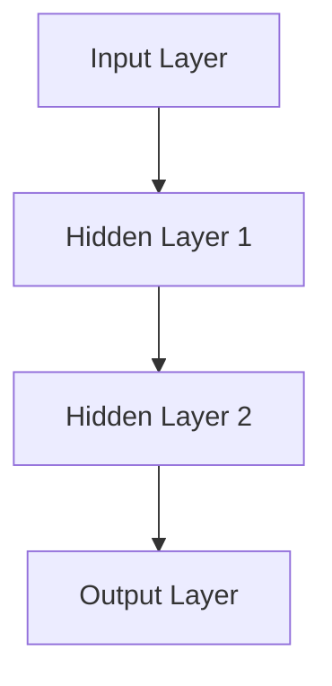

###### 2.1.3 反向传播算法

反向传播算法（Backpropagation Algorithm）是一种用于训练神经网络的方法。它通过计算输出层与隐藏层之间的误差，反向传播误差到隐藏层，从而更新网络权重。反向传播算法的核心是梯度下降，通过不断迭代优化模型参数。

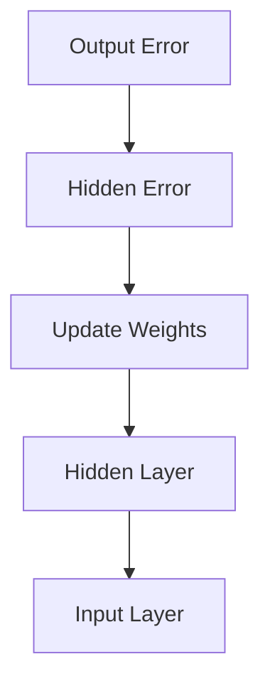

##### 2.2 深度学习算法

###### 2.2.1 深度学习的基本原理

深度学习（Deep Learning，DL）是一种基于多层神经网络的学习方法。与传统的机器学习方法相比，深度学习具有更强的特征提取和表示学习能力。深度学习的基本原理是层次化特征学习，通过多个层次的神经网络，逐层提取和组合特征，从而实现复杂的计算任务。

###### 2.2.2 卷积神经网络（CNN）

卷积神经网络（Convolutional Neural Network，CNN）是一种专门用于图像识别和处理的神经网络结构。它通过卷积操作提取图像特征，具有平移不变性，可以高效地处理图像数据。

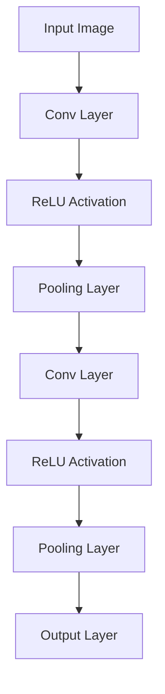

###### 2.2.3 循环神经网络（RNN）

循环神经网络（Recurrent Neural Network，RNN）是一种能够处理序列数据的神经网络。它通过记忆单元维护历史信息，实现对序列数据的建模。RNN在自然语言处理和语音识别等领域具有广泛的应用。

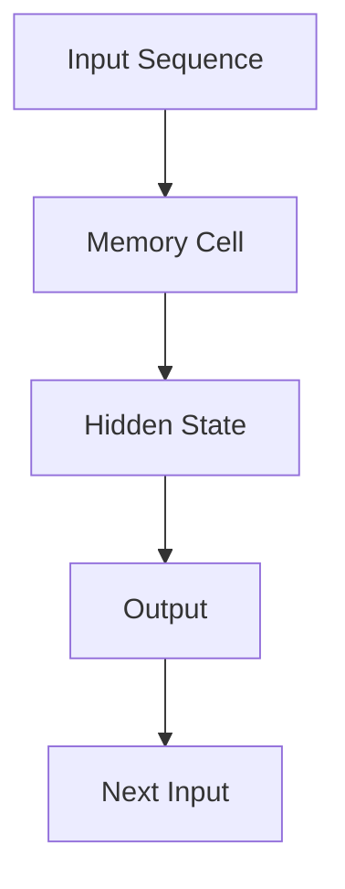

##### 2.3 大规模预训练模型

###### 2.3.1 预训练模型的定义

预训练模型（Pre-trained Model）是指通过在大规模数据集上进行预训练，从而获得良好的通用特征表示能力。预训练模型在特定任务上表现出色，可以通过微调和迁移学习的方式，快速适应新的任务和数据集。

###### 2.3.2 自监督学习

自监督学习（Self-supervised Learning）是一种无需人工标注的数据处理方法。它通过利用未标注的数据，自动发现数据中的有用信息，从而提高模型的特征表示能力。自监督学习在预训练模型中发挥着重要作用。

###### 2.3.3 微调与迁移学习

微调（Fine-tuning）和迁移学习（Transfer Learning）是预训练模型在特定任务上获得良好性能的方法。微调是指在预训练模型的基础上，调整部分参数以适应新的任务；迁移学习则是将预训练模型在不同任务上的权重转移到新的任务，从而加速新任务的模型训练。

#### 第3章: AI大模型应用案例分析

##### 3.1 案例研究一：自然语言处理

###### 3.1.1 语言模型

语言模型（Language Model，LM）是一种用于预测自然语言序列的模型。它通过对大量文本数据进行训练，学习语言中的概率分布，从而实现自然语言生成、文本分类等任务。

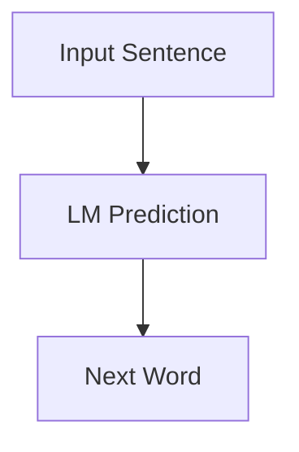

###### 3.1.2 文本分类

文本分类（Text Classification）是一种将文本数据分为不同类别的方法。AI大模型通过学习大量文本数据，提取关键特征，实现对文本的自动分类。

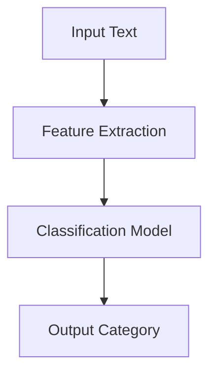

###### 3.1.3 机器翻译

机器翻译（Machine Translation，MT）是一种将一种语言的文本翻译成另一种语言的方法。AI大模型通过学习双语语料库，实现高效、准确的机器翻译。

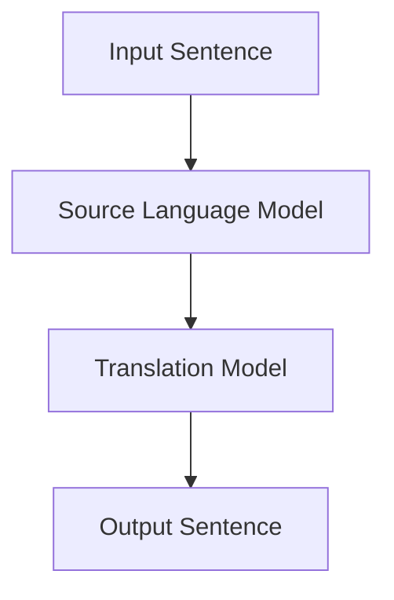

##### 3.2 案例研究二：计算机视觉

###### 3.2.1 图像分类

图像分类（Image Classification）是一种将图像分为不同类别的方法。AI大模型通过学习大量图像数据，提取图像特征，实现对图像的自动分类。

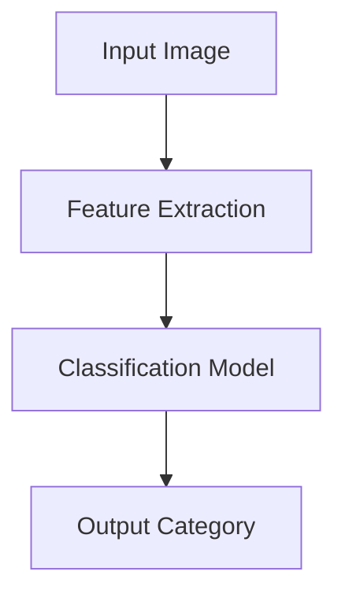

###### 3.2.2 目标检测

目标检测（Object Detection）是一种在图像中检测目标的方法。AI大模型通过学习大量图像数据，实现对目标的定位和分类。

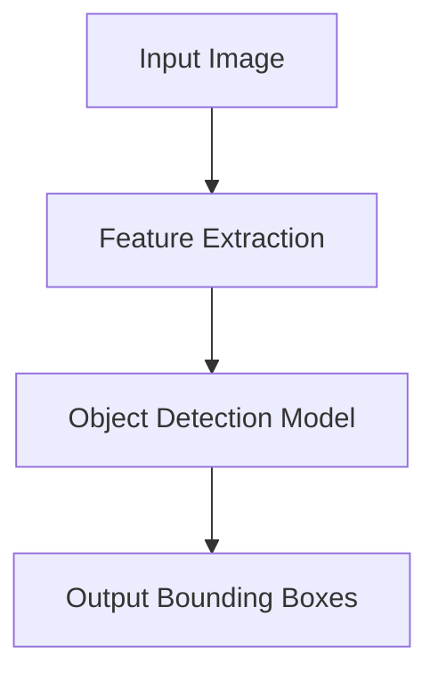

###### 3.2.3 图像生成

图像生成（Image Generation）是一种根据文本描述或已有图像生成新图像的方法。AI大模型通过学习大量图像数据，实现对图像的生成。

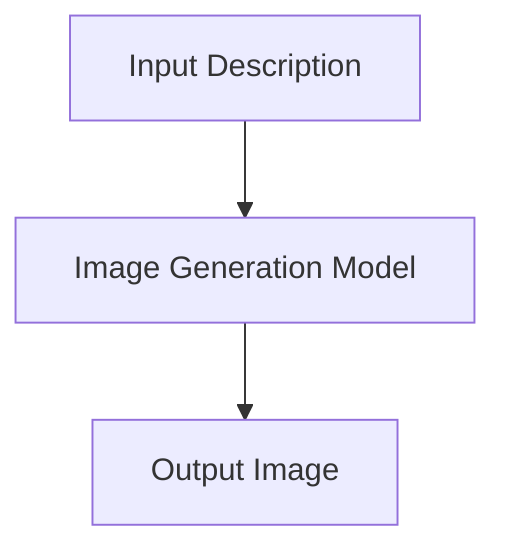

##### 3.3 案例研究三：推荐系统

###### 3.3.1 基于内容的推荐

基于内容的推荐（Content-based Recommendation）是一种根据用户兴趣和内容特征进行推荐的方法。AI大模型通过学习用户历史行为和内容特征，实现个性化的内容推荐。

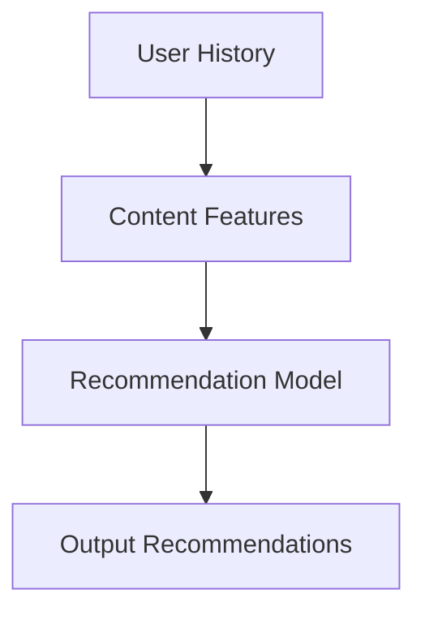

###### 3.3.2 协同过滤

协同过滤（Collaborative Filtering）是一种根据用户行为和相似用户进行推荐的方法。AI大模型通过学习用户行为数据和用户相似度，实现个性化的推荐。

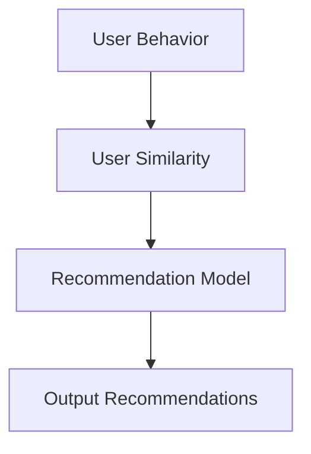

###### 3.3.3 深度学习在推荐系统中的应用

深度学习在推荐系统中的应用主要体现在特征提取和模型优化方面。通过深度学习模型，可以更有效地提取用户行为和内容特征，提高推荐系统的性能。

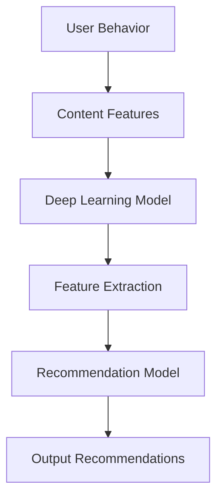

### 第二部分: AI大模型创业实践

#### 第4章: AI大模型创业概述

##### 4.1 AI大模型创业的机遇

AI大模型创业面临着诸多机遇，以下是其中几个主要方面：

###### 4.1.1 技术突破带来的机遇

随着AI大模型技术的不断进步，创业者可以借助这些先进的技术，开发出具有竞争力的产品和服务。例如，基于GPT系列模型的语言生成应用、基于Transformer的图像生成应用等，都为创业者提供了丰富的创新空间。

###### 4.1.2 市场需求推动

随着AI技术的普及，越来越多的行业开始意识到AI大模型的重要性，并在各个领域积极应用。这为AI大模型创业提供了广阔的市场需求，创业者可以通过满足市场需求来实现商业成功。

###### 4.1.3 政策支持

各国政府对AI技术的发展给予了高度重视，纷纷出台了一系列政策支持措施。这些政策支持不仅有助于创业者解决资金问题，还可以为创业者提供技术培训、人才引进等支持，降低创业风险。

##### 4.2 AI大模型创业的挑战

尽管AI大模型创业面临着诸多机遇，但也伴随着一系列挑战：

###### 4.2.1 技术挑战

AI大模型创业需要掌握先进的AI技术，包括深度学习、神经网络、预训练模型等。对于创业者来说，如何快速掌握这些技术，并在短时间内实现技术突破，是创业过程中的一大挑战。

###### 4.2.2 资金问题

AI大模型创业通常需要大量的资金支持，用于购买硬件设备、数据集采购、研发投入等。对于初创企业来说，如何获得足够的资金，是创业过程中的一大难题。

###### 4.2.3 人才短缺

AI大模型创业需要具备深厚技术背景的人才，包括算法工程师、数据科学家、产品经理等。然而，目前市场上这类人才相对稀缺，创业者如何吸引和留住这些人才，是创业过程中的一大挑战。

##### 4.3 AI大模型创业的路径选择

在面对AI大模型创业的机遇与挑战时，创业者需要根据自身情况选择合适的创业路径。以下是几种常见的创业路径：

###### 4.3.1 创业模式

1. **技术驱动型创业**：以技术创新为核心，专注于研发具有竞争力的AI大模型产品或服务。
2. **市场驱动型创业**：以市场需求为导向，根据市场需求调整产品或服务，快速占领市场。
3. **平台型创业**：搭建一个开放的平台，吸引开发者、企业用户等各方资源，共同推动AI大模型生态的发展。

###### 4.3.2 应用场景选择

创业者需要根据自身技术优势和市场需求，选择合适的应用场景。以下是几个具有前景的应用场景：

1. **自然语言处理**：包括文本生成、机器翻译、问答系统等，具有广泛的应用需求。
2. **计算机视觉**：包括图像分类、目标检测、图像生成等，广泛应用于安防、医疗、娱乐等领域。
3. **推荐系统**：包括基于内容的推荐、协同过滤等，广泛应用于电商、社交媒体、在线教育等领域。

###### 4.3.3 团队建设

创业团队是AI大模型创业的核心，创业者需要注重团队建设，吸引和培养优秀人才。以下是团队建设的关键点：

1. **技术团队**：以算法工程师、数据科学家等为核心，确保团队具备深厚的技术实力。
2. **产品团队**：以产品经理、UI/UX设计师等为核心，确保产品符合市场需求和用户体验。
3. **运营团队**：以市场推广、客户服务、数据分析等为核心，确保产品在市场上的成功推广和运营。

#### 第5章: AI大模型创业项目规划

##### 5.1 项目需求分析

项目需求分析是AI大模型创业项目规划的第一步，旨在明确项目的目标、功能和可行性。以下是项目需求分析的关键环节：

###### 5.1.1 需求收集

需求收集是指通过调研、访谈、问卷调查等方式，收集用户、客户和行业专家的意见和建议。这些信息将有助于明确项目的目标和应用场景。

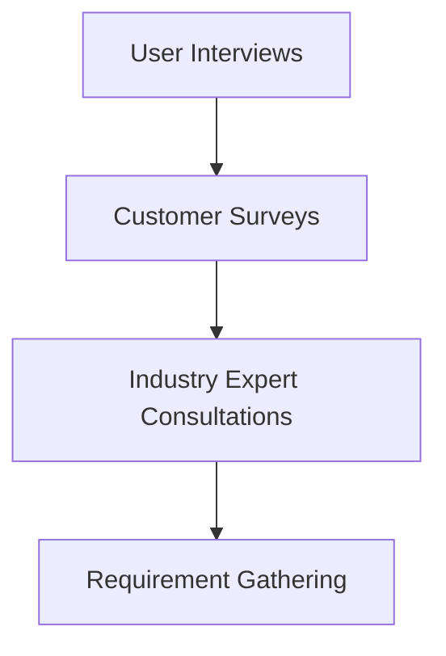

###### 5.1.2 需求分析

需求分析是指对收集到的需求进行整理、分类和分析，明确项目的功能需求、性能需求和可靠性需求。需求分析的结果将用于制定项目计划和设计文档。

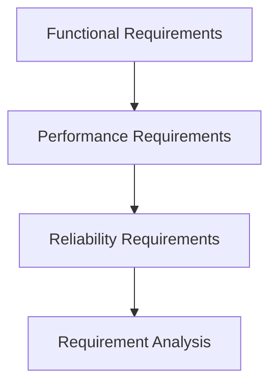

###### 5.1.3 需求文档编写

需求文档是指对项目的功能需求、性能需求、可靠性需求等进行详细描述的文档。需求文档是项目规划和设计的重要依据，有助于确保项目顺利实施。

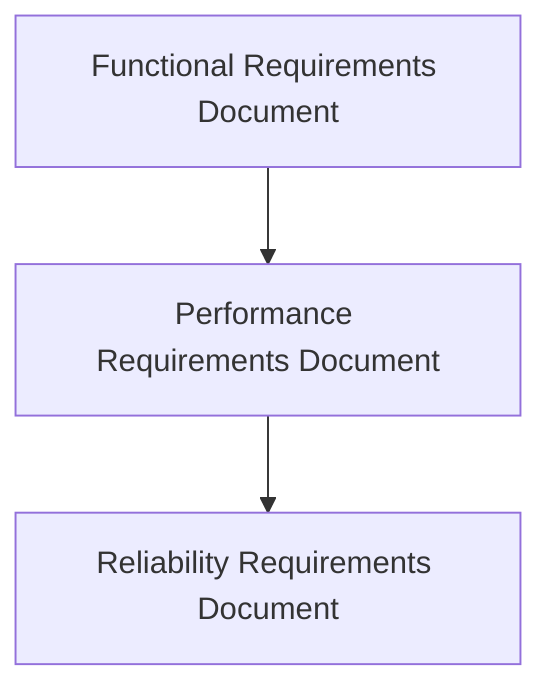

##### 5.2 技术路线规划

技术路线规划是AI大模型创业项目规划的核心环节，旨在确定项目的核心技术方案和技术路径。以下是技术路线规划的关键步骤：

###### 5.2.1 技术选型

技术选型是指根据项目的需求和应用场景，选择合适的技术方案和工具。常见的技术选型包括深度学习框架（如TensorFlow、PyTorch等）、数据处理工具（如Hadoop、Spark等）和开发环境（如Docker、Kubernetes等）。

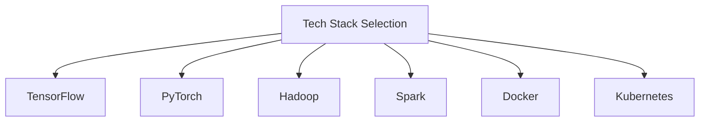

###### 5.2.2 系统架构设计

系统架构设计是指根据项目的需求和技术方案，设计系统的整体架构。系统架构设计包括数据层、服务层和展示层等模块，以及各模块之间的交互关系。

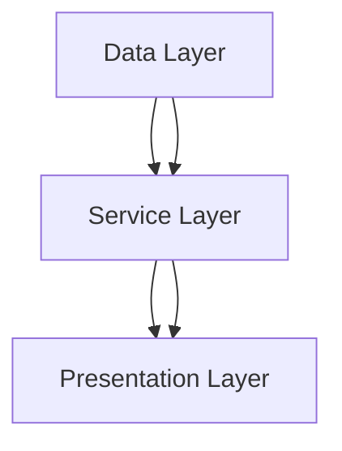

###### 5.2.3 数据处理流程设计

数据处理流程设计是指根据项目的需求和应用场景，设计数据采集、存储、处理和传输的流程。数据处理流程设计包括数据采集模块、数据存储模块、数据处理模块和数据传输模块等。

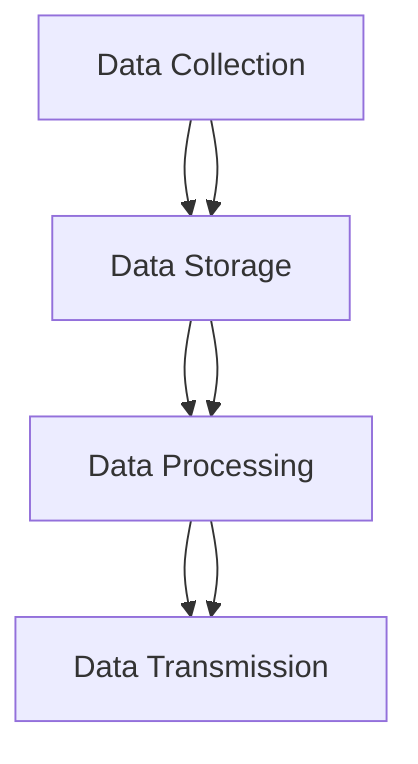

##### 5.3 项目风险管理

项目风险管理是AI大模型创业项目规划的重要组成部分，旨在识别、评估和应对项目中的风险。以下是项目风险管理的关键环节：

###### 5.3.1 风险识别

风险识别是指通过调研、分析、讨论等方式，识别项目中可能存在的风险。常见的风险包括技术风险、市场风险、资金风险、人才风险等。

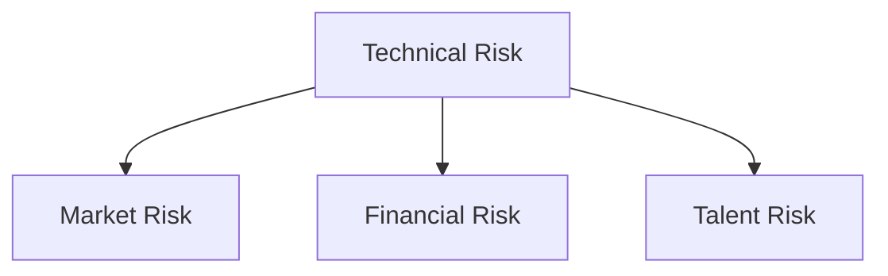

###### 5.3.2 风险评估

风险评估是指对识别出的风险进行评估，确定风险的重要性和影响程度。风险评估可以采用定性评估和定量评估相结合的方法。

```mermaid
graph TD
A[Qualitative Risk Assessment]
B[Quantitative Risk Assessment]
A --> B
```

###### 5.3.3 风险应对策略

风险应对策略是指根据风险评估的结果，制定相应的风险应对措施。常见的风险应对策略包括风险规避、风险转移、风险减轻和风险接受等。

```mermaid
graph TD
A[Risk Avoidance]
B[Risk Transfer]
C[Risk Mitigation]
D[Risk Acceptance]
A --> B
A --> C
A --> D
```

### 附录

#### 附录A: AI大模型开发工具与资源

##### A.1 开发工具简介

以下介绍几种常见的AI大模型开发工具：

###### A.1.1 TensorFlow

TensorFlow是由Google开发的开源深度学习框架，支持多种编程语言，包括Python、C++和Java等。TensorFlow具有灵活的架构和丰富的API，广泛应用于各种深度学习任务。

```mermaid
graph TD
A[TensorFlow]
B[Python]
C[C++]
D[Java]
A --> B
A --> C
A --> D
```

###### A.1.2 PyTorch

PyTorch是由Facebook开发的深度学习框架，以Python为主编程语言，具有直观的API和动态计算图。PyTorch在学术界和工业界具有很高的声誉，广泛应用于各种深度学习任务。

```mermaid
graph TD
A[PyTorch]
B[Python]
C[JAX]
D[LLVM]
A --> B
A --> C
A --> D
```

###### A.1.3 JAX

JAX是由Google开发的开源深度学习框架，基于Python和NumPy，支持自动微分和数值计算。JAX具有高效的计算性能和灵活的API，广泛应用于各种深度学习任务。

```mermaid
graph TD
A[JAX]
B[Python]
C[NumPy]
D[Auto-diff]
A --> B
A --> C
A --> D
```

##### A.2 学习资源推荐

以下推荐几种AI大模型学习的资源：

###### A.2.1 网络课程

1. 《深度学习》（Deep Learning）—— 吴恩达（Andrew Ng）
2. 《神经网络与深度学习》—— 郭毅（Guoy）
3. 《PyTorch深度学习实战》—— 赵文卓、徐宗本

###### A.2.2 技术文档

1. TensorFlow官方文档：https://www.tensorflow.org/docs
2. PyTorch官方文档：https://pytorch.org/docs
3. JAX官方文档：https://jax.readthedocs.io

###### A.2.3 学术论文

1. Hinton, G. E., Osindero, S., & Teh, Y. W. (2006). A fast learning algorithm for deep belief nets. Neural computation, 18(7), 1527-1554.
2. Krizhevsky, A., Sutskever, I., & Hinton, G. E. (2012). Imagenet classification with deep convolutional neural networks. In Advances in neural information processing systems (pp. 1097-1105).
3. Vaswani, A., Shazeer, N., Parmar, N., Uszkoreit, J., Jones, L., Gomez, A. N., ... & Polosukhin, I. (2017). Attention is all you need. In Advances in neural information processing systems (pp. 5998-6008).

作者：AI天才研究院/AI Genius Institute & 禅与计算机程序设计艺术 /Zen And The Art of Computer Programming

---

### 后记

本文旨在为AI大模型创业提供一份全面而深入的指南，从基础知识到创业实践，从核心算法原理到应用案例分析，再到项目规划和团队管理，都进行了详细的阐述。希望通过本文，能够帮助创业者更好地应对未来挑战，实现AI大模型创业的成功。

然而，AI大模型创业并非一蹴而就，它需要创业者具备深厚的技术功底、敏锐的市场洞察力和出色的团队管理能力。在创业过程中，创业者需要不断学习、尝试和调整，以适应不断变化的市场和技术环境。

最后，感谢您阅读本文，希望本文能够对您的AI大模型创业之路有所帮助。如果您有任何疑问或建议，欢迎在评论区留言，我们将竭诚为您解答。祝您创业成功，梦想成真！

