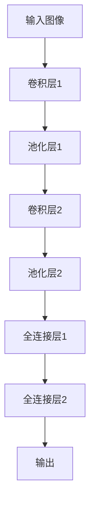
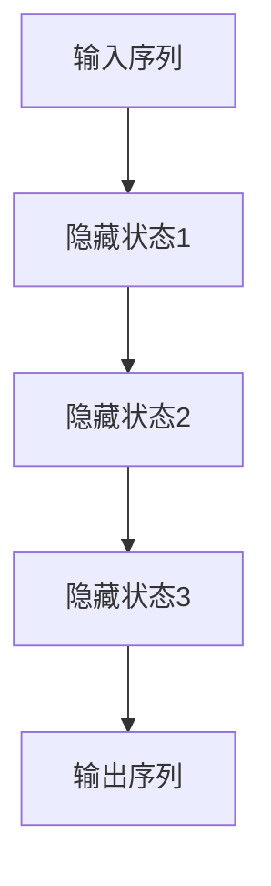
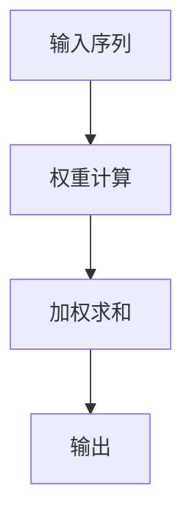
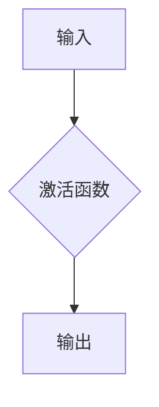
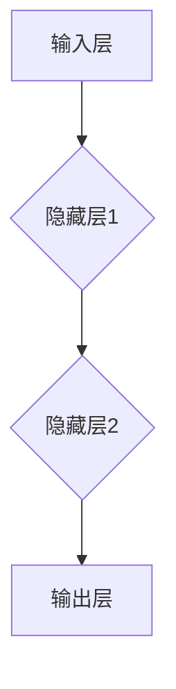
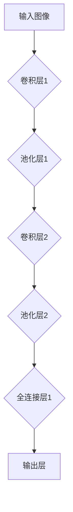
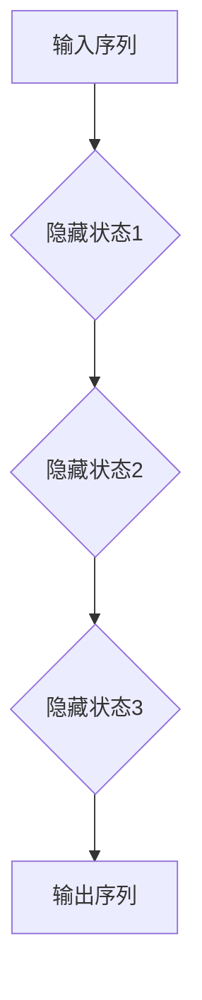
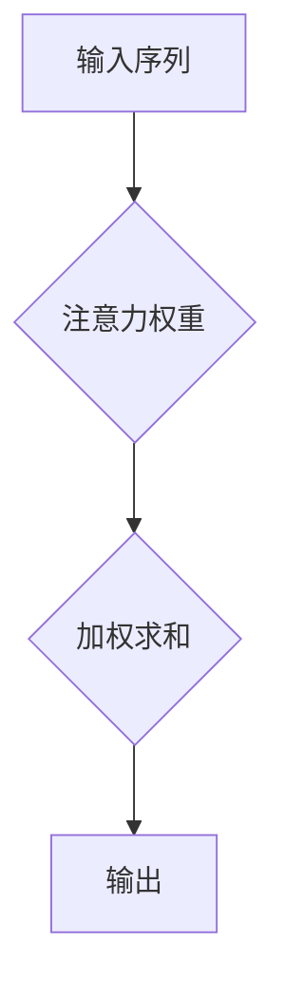
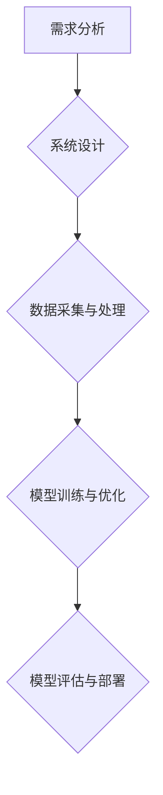

                 

# AI大模型创业：如何打造未来爆款应用？

> **关键词：** AI大模型、创业、应用、技术、爆款、商业模式、未来趋势

> **摘要：** 本文将深入探讨AI大模型的创业之路，从基础理论到实际应用，再到风险与挑战，全面解析如何打造一款未来爆款AI应用。我们将逐步分析AI大模型的核心技术、商业价值、创业实战策略以及未来的发展机遇，帮助创业者把握AI时代的风口。

----------------------------------------------------------------

### 第一部分：AI大模型基础理论

#### 第1章：AI大模型概述

##### 1.1 AI大模型的概念与演进

###### 1.1.1 AI大模型的定义

AI大模型，即大规模人工智能模型，是指那些能够在复杂任务上取得卓越性能的深度学习模型。这些模型通常包含数亿甚至数万亿个参数，能够处理大规模数据集，并在多个领域表现出色。例如，OpenAI的GPT-3拥有1750亿个参数，而谷歌的BERT则拥有数百万个参数。

###### 1.1.2 AI大模型的演进历程

AI大模型的演进可以追溯到20世纪80年代，当时研究人员开始探索人工神经网络。随着计算能力的提升和算法的进步，特别是深度学习技术的发展，AI大模型逐渐成为现实。2006年，Hinton等人提出了深度信念网络（DBN），这是深度学习的一个重要里程碑。随后的几年，卷积神经网络（CNN）和递归神经网络（RNN）等架构也得到了广泛应用。进入2010年代，随着计算能力的进一步提升，AI大模型如雨后春笋般涌现，推动了自然语言处理、计算机视觉等领域的革命。

##### 1.2 AI大模型的核心技术

###### 1.2.1 深度学习基础

深度学习是一种机器学习技术，其灵感来自于人类大脑的神经网络结构。深度学习模型由多个层次组成，每个层次都能够学习数据的不同层次特征。通过逐层学习，深度学习模型能够从原始数据中提取出高级抽象特征，从而实现复杂的任务。

###### 1.2.2 神经网络架构

神经网络是深度学习的基础，由大量的神经元连接而成。常见的神经网络架构包括：

- **线性回归**：用于回归任务，通过拟合一条直线来预测目标值。
- **逻辑回归**：用于分类任务，通过输出概率来预测类别。
- **卷积神经网络（CNN）**：用于图像识别任务，通过卷积层提取图像特征。
- **循环神经网络（RNN）**：用于序列数据处理，如语言模型和语音识别。
- **生成对抗网络（GAN）**：用于生成新的数据，如图像和文本。

###### 1.2.3 预训练与微调

预训练是指在大规模数据集上训练深度学习模型，使其能够学习到通用的特征表示。微调是在预训练模型的基础上，使用特定领域的数据进行进一步训练，使其适应特定任务。

##### 1.3 AI大模型的应用领域

###### 1.3.1 自然语言处理

自然语言处理（NLP）是AI大模型应用最广泛的领域之一。通过深度学习技术，NLP模型能够实现文本分类、情感分析、机器翻译、问答系统等功能。例如，BERT和GPT等预训练模型已经在各种NLP任务上取得了显著成绩。

###### 1.3.2 计算机视觉

计算机视觉（CV）是AI大模型的另一个重要应用领域。CV模型能够通过图像和视频数据提取特征，实现目标检测、图像分割、姿态估计等功能。例如，ResNet和EfficientNet等模型在图像识别任务上表现出色。

###### 1.3.3 强化学习

强化学习是AI大模型在新兴领域的重要应用。强化学习模型通过与环境的交互，学习到最优策略。在游戏、机器人控制和自动驾驶等领域，强化学习模型已经取得了显著成果。

----------------------------------------------------------------

### 第二部分：AI大模型创业应用

#### 第2章：深度学习与神经网络

##### 2.1 深度学习基本概念

###### 2.1.1 神经元与神经网络

神经元是神经网络的基本单位，类似于生物神经系统的细胞。每个神经元都可以接收输入信号，并通过激活函数产生输出信号。


神经网络由多个神经元层组成，包括输入层、隐藏层和输出层。通过多层神经元的组合，神经网络能够学习到复杂的数据特征。


###### 2.1.2 前向传播与反向传播

前向传播是指将输入数据通过神经网络逐层传递，最终得到输出结果。在每层神经元中，输入信号与权重相乘，并通过激活函数转换得到输出信号。


反向传播是指根据输出误差，逆向更新神经网络的权重和偏置。通过多次迭代，反向传播能够使神经网络的输出误差逐渐减小。


##### 2.2 神经网络架构详解

###### 2.2.1 线性回归

线性回归是一种简单的神经网络架构，用于拟合数据点。线性回归模型通过一条直线（y = wx + b）来预测目标值，其中w是权重，b是偏置。

```python
# 线性回归伪代码
def linear_regression(x, w, b):
    y = w * x + b
    return y
```

###### 2.2.2 逻辑回归

逻辑回归是一种用于分类任务的神经网络架构。逻辑回归模型通过一个sigmoid函数将线性组合的输出转换为概率。

```python
# 逻辑回归伪代码
def logistic_regression(x, w, b):
    z = w * x + b
    y = 1 / (1 + exp(-z))
    return y
```

###### 2.2.3 卷积神经网络

卷积神经网络（CNN）是一种专门用于图像识别的神经网络架构。CNN通过卷积层和池化层提取图像特征，并通过全连接层进行分类。



###### 2.2.4 循环神经网络

循环神经网络（RNN）是一种用于序列数据处理的神经网络架构。RNN通过循环结构保持状态，能够处理时间序列数据。



###### 2.2.5 注意力机制

注意力机制是一种用于提升神经网络性能的技术。注意力机制能够使神经网络专注于重要的数据部分，从而提高模型的准确性和效率。



##### 2.3 大规模预训练模型

###### 2.3.1 预训练模型的基本原理

预训练模型是指在大型数据集上进行预训练，以学习通用的特征表示。预训练模型通过在大规模数据上训练，能够提取出具有较强泛化能力的特征表示，从而在下游任务中取得良好的性能。

###### 2.3.2 自监督学习

自监督学习是一种在无监督数据上进行训练的技术。自监督学习通过利用数据中的无监督信息，如预测下一个单词、分类图像中的物体等，学习到有用的特征表示。

###### 2.3.3 迁移学习与微调

迁移学习是一种利用预训练模型在特定任务上取得良好性能的技术。通过迁移学习，可以将预训练模型的知识迁移到新的任务中，从而提高新任务的性能。微调是在预训练模型的基础上，使用特定领域的数据进行进一步训练，以适应特定任务。

----------------------------------------------------------------

### 第三部分：AI大模型风险与挑战

#### 第3章：AI大模型风险分析

##### 3.1 数据隐私与安全

AI大模型通常需要大量的数据来训练，这引发了数据隐私与安全的问题。为了保护用户隐私，需要采取一系列数据保护措施，如数据加密、匿名化等。

###### 3.1.1 数据隐私保护

- 数据加密：对数据进行加密，确保数据在传输和存储过程中的安全性。
- 数据匿名化：通过去除或模糊化个人身份信息，保护用户隐私。

###### 3.1.2 数据安全措施

- 数据备份与恢复：定期备份数据，确保数据不会因为故障或攻击而丢失。
- 访问控制：限制对数据的访问权限，防止未经授权的访问。

##### 3.2 AI伦理问题

AI大模型的应用引发了伦理问题，如AI偏见、歧视等。为了确保AI大模型的应用符合伦理标准，需要采取一系列伦理措施。

###### 3.2.1 AI偏见与歧视

- 偏见检测与消除：通过分析训练数据和模型输出，检测和消除偏见。
- 多样性培训：对AI研究人员和开发人员进行多样性培训，提高对伦理问题的敏感性。

###### 3.2.2 AI责任归属

- 明确责任主体：在AI大模型的应用中，明确责任主体，确保在发生问题时能够追究责任。
- 法律法规完善：完善相关法律法规，为AI大模型的应用提供法律依据。

##### 3.3 AI大模型监管

AI大模型的应用需要监管，以确保其符合社会伦理和法律法规。监管包括政策制定、标准制定和合规性检查等方面。

###### 3.3.1 监管政策与法规

- 政策制定：制定相关政策和法规，规范AI大模型的应用。
- 标准制定：制定技术标准和伦理标准，确保AI大模型的应用符合规范。

###### 3.3.2 企业合规策略

- 内部合规审查：对AI大模型的应用进行内部合规审查，确保其符合相关政策和法规。
- 外部审计与监督：接受外部审计和监督，确保AI大模型的应用符合社会伦理和法律法规。

----------------------------------------------------------------

### 附录

#### 附录A：开发工具与资源

##### A.1 深度学习框架对比

- TensorFlow：由谷歌开发的开源深度学习框架，支持多种神经网络架构。
- PyTorch：由Facebook开发的开源深度学习框架，具有灵活的动态图计算能力。
- Keras：基于Theano和TensorFlow的深度学习高级API，简化了深度学习模型的构建和训练。

##### A.2 实用算法库与工具

- NumPy：提供高性能的数组操作和数学计算库。
- Pandas：提供数据操作和分析工具，用于处理结构化数据。
- Matplotlib：提供数据可视化工具，用于生成统计图表和可视化图形。

##### A.3 开发环境搭建指南

###### A.3.1 硬件配置

- GPU：选择支持CUDA的GPU，以提高深度学习模型的训练速度。
- CPU：选择多核CPU，以支持并行计算。

###### A.3.2 软件安装与配置

- 操作系统：安装支持CUDA的操作系统，如Ubuntu。
- 编译工具：安装CMake和gcc，用于编译深度学习框架。
- 深度学习框架：根据需求安装TensorFlow、PyTorch等深度学习框架。

----------------------------------------------------------------

### 作者信息

**作者：** AI天才研究院/AI Genius Institute & 禅与计算机程序设计艺术 /Zen And The Art of Computer Programming

---

以上是《AI大模型创业：如何打造未来爆款应用？》的完整目录大纲，每个章节都将详细探讨AI大模型的各个方面，为创业者提供实用的指导和策略。在接下来的内容中，我们将逐一深入各个章节，共同探索AI大模型的魅力。

----------------------------------------------------------------

---

**接下来，我们将开始撰写第二部分：“深度学习与神经网络”，包括第2章的内容。**

---

# 第二部分：深度学习与神经网络

## 第2章：深度学习与神经网络

深度学习是人工智能领域的一项关键技术，它通过模仿人脑的神经网络结构，让计算机具备学习、推理和感知能力。本章将详细介绍深度学习的基本概念、神经网络架构以及相关算法原理，帮助读者深入理解深度学习技术。

### 2.1 深度学习基本概念

深度学习是一种机器学习技术，其核心在于构建多层神经网络，通过逐层提取特征，实现复杂的数据分析和模式识别。以下是深度学习的一些基本概念：

#### 神经元

神经元是神经网络的基本单位，它接收输入信号，通过激活函数产生输出信号。一个简单的神经元可以表示为：



#### 激活函数

激活函数是神经元输出前的非线性变换，它使神经网络能够学习非线性关系。常见的激活函数包括：

- **Sigmoid函数**：\( f(x) = \frac{1}{1 + e^{-x}} \)
- **ReLU函数**：\( f(x) = \max(0, x) \)
- **Tanh函数**：\( f(x) = \frac{e^x - e^{-x}}{e^x + e^{-x}} \)

#### 神经网络

神经网络由多个层次组成，包括输入层、隐藏层和输出层。每个层次都包含多个神经元，神经元之间通过权重连接。以下是一个简单的神经网络结构：



### 2.2 神经网络架构详解

深度学习的性能很大程度上取决于神经网络架构的选择。以下是一些常见的神经网络架构：

#### 线性回归

线性回归是一种最简单的神经网络架构，用于拟合线性关系。其数学模型可以表示为：

\[ y = wx + b \]

其中，\( w \) 是权重，\( b \) 是偏置。

#### 逻辑回归

逻辑回归是一种用于二分类问题的神经网络架构。其数学模型可以表示为：

\[ P(y=1) = \frac{1}{1 + e^{-(wx + b)}} \]

其中，\( P(y=1) \) 是预测的概率。

#### 卷积神经网络（CNN）

卷积神经网络是专门用于图像识别的神经网络架构。它通过卷积层和池化层提取图像特征，并通过全连接层进行分类。以下是一个简单的CNN架构：



#### 循环神经网络（RNN）

循环神经网络是专门用于序列数据处理的神经网络架构。它通过循环结构保持状态，能够处理时间序列数据。以下是一个简单的RNN架构：



#### 注意力机制

注意力机制是一种用于提升神经网络性能的技术。它使神经网络能够关注重要的输入部分，从而提高模型的准确性和效率。以下是一个简单的注意力机制架构：



### 2.3 大规模预训练模型

大规模预训练模型是当前深度学习领域的重要研究方向。预训练模型在大规模数据集上进行预训练，以学习通用的特征表示。随后，通过微调将预训练模型应用于特定任务，从而提高任务性能。

#### 预训练模型的基本原理

预训练模型的基本原理是利用大规模数据集中丰富的信息，学习到具有较强泛化能力的特征表示。预训练模型通常包括以下步骤：

1. **词向量表示**：将文本数据中的单词映射到高维向量空间，以捕获单词的语义信息。
2. **语言模型训练**：利用大规模文本数据训练语言模型，以预测下一个单词。
3. **下游任务微调**：在预训练模型的基础上，使用特定领域的数据进行微调，以适应下游任务。

#### 自监督学习

自监督学习是一种在无监督数据上进行训练的技术。在自监督学习中，模型需要从无监督数据中学习到有用的信息，从而提高其性能。以下是一些常见的自监督学习方法：

1. **词汇预测**：在文本数据中随机遮盖一部分单词，训练模型预测这些遮盖的单词。
2. **图像分类**：在图像数据中随机遮挡一部分区域，训练模型分类这些遮挡后的图像。
3. **语音识别**：在语音数据中随机遮挡一部分音素，训练模型识别这些遮挡后的音素。

#### 迁移学习与微调

迁移学习是一种利用预训练模型在特定任务上取得良好性能的技术。通过迁移学习，可以将预训练模型的知识迁移到新的任务中，从而提高新任务的性能。微调是在预训练模型的基础上，使用特定领域的数据进行进一步训练，以适应特定任务。

#### 大规模预训练模型的应用

大规模预训练模型已经在多个领域取得了显著成果，包括自然语言处理、计算机视觉和语音识别等。以下是一些典型的应用案例：

1. **自然语言处理**：预训练模型如BERT和GPT在文本分类、机器翻译和问答系统等任务上取得了优异的性能。
2. **计算机视觉**：预训练模型如ResNet和EfficientNet在图像分类和目标检测等任务上表现出色。
3. **语音识别**：预训练模型如Transformer在语音识别任务上取得了显著的性能提升。

---

在本文的第二部分中，我们详细介绍了深度学习的基本概念、神经网络架构以及大规模预训练模型。这些内容为创业者提供了深入了解深度学习技术的基础，有助于他们在实际项目中应用和优化深度学习模型。在接下来的部分，我们将探讨AI大模型在商业中的应用和创业实战策略。

----------------------------------------------------------------

---

**接下来，我们将开始撰写第三部分：“AI大模型创业应用”，包括第3章的内容。**

---

## 第三部分：AI大模型创业应用

### 第3章：AI大模型在商业中的应用

AI大模型在商业中的应用已经引起了广泛关注，其强大的数据处理和分析能力为企业带来了巨大的商业价值。本章将探讨AI大模型在商业中的应用价值、典型案例以及商业策略。

### 3.1 AI大模型商业价值

AI大模型在商业中的应用具有以下几个显著的价值：

#### 提升生产效率

AI大模型能够自动化复杂的任务，减少人工操作，从而提高生产效率。例如，在制造业中，AI大模型可以用于质量检测和预测维护，减少生产故障和停机时间。

#### 改进用户体验

AI大模型能够通过个性化推荐、智能客服等方式提升用户体验。例如，电商平台利用AI大模型进行商品推荐，可以根据用户的购物历史和偏好，提供个性化的购物建议，从而增加销售额。

#### 降低运营成本

AI大模型可以通过自动化流程和智能决策，降低企业的运营成本。例如，在物流行业，AI大模型可以优化运输路线，降低运输成本。

### 3.2 AI大模型商业案例

以下是一些AI大模型在商业中的成功案例：

#### 谷歌BERT案例

谷歌BERT（Bidirectional Encoder Representations from Transformers）是一种预训练语言模型，它通过双向编码器结构捕捉上下文信息，并在多个自然语言处理任务上取得了优异的性能。谷歌利用BERT优化了搜索引擎的搜索结果，提高了用户体验和广告效果。

#### OpenAI GPT案例

OpenAI的GPT（Generative Pre-trained Transformer）是一种生成式预训练模型，它通过自监督学习生成高质量的文本。OpenAI利用GPT开发了智能客服系统，为企业提供了高效、个性化的客户服务，显著提升了客户满意度。

#### 其他知名案例

- **亚马逊商品推荐系统**：亚马逊利用AI大模型进行商品推荐，根据用户的浏览和购买历史，提供个性化的购物建议，提高了销售额。
- **微软Azure智能搜索**：微软Azure智能搜索利用AI大模型进行文本分析，提供了强大的搜索功能，帮助企业用户快速找到所需信息。
- **Netflix内容推荐系统**：Netflix利用AI大模型分析用户行为和偏好，提供个性化的内容推荐，提高了用户黏性和观看时长。

### 3.3 AI大模型商业策略

要成功地将AI大模型应用于商业，企业需要制定合理的商业策略。以下是一些建议：

#### 市场调研与定位

在引入AI大模型之前，企业需要进行市场调研，了解目标客户的需求和市场趋势。通过定位，企业可以明确AI大模型的应用场景和目标市场。

#### 技术研发与落地

企业需要组建专业的技术团队，进行AI大模型的研究和开发。同时，要确保技术方案能够落地实施，解决实际业务问题。

#### 营销推广与运营

企业需要通过多种渠道进行AI大模型的营销推广，提高品牌知名度和用户认知度。在运营过程中，要持续优化模型性能和用户体验，以保持竞争优势。

#### 数据与隐私保护

企业在应用AI大模型时，需要重视数据安全和隐私保护。要采取有效的数据加密和匿名化措施，确保用户数据的隐私和安全。

---

在本文的第三部分中，我们详细探讨了AI大模型在商业中的应用价值、成功案例和商业策略。在接下来的部分，我们将探讨AI大模型创业实战，分享创业团队准备、开发流程和商业化推广的经验和技巧。

----------------------------------------------------------------

---

**接下来，我们将开始撰写第四部分：“AI大模型创业实战”，包括第4章的内容。**

---

## 第四部分：AI大模型创业实战

### 第4章：AI大模型创业实战

创业是一项充满挑战和机遇的事业，尤其是在AI大模型领域，竞争激烈，技术门槛高。本章将详细探讨AI大模型创业的实战过程，包括团队组建、资金筹集、产品规划和开发流程，以及商业化推广的策略。

### 4.1 AI大模型创业准备

#### 4.1.1 创业团队组建

一个成功的AI大模型创业项目离不开一个强大的团队。团队组建应考虑以下几个方面：

- **核心技术人员**：包括AI大模型研究人员、算法工程师和数据科学家，负责技术方案的研发和优化。
- **产品经理**：负责产品规划、设计和用户体验，确保产品能够满足市场需求。
- **业务拓展人员**：负责市场调研、客户开发和业务拓展，推动产品商业化。
- **运营与支持人员**：负责日常运营、客户支持和数据维护，确保业务稳定运行。

#### 4.1.2 资金筹集

AI大模型创业通常需要大量的资金支持，用于技术研发、团队建设、市场推广等。资金筹集可以通过以下途径：

- **天使投资**：寻找有经验的天使投资者，提供早期资金和资源支持。
- **风险投资**：通过创业竞赛、创投峰会等方式，吸引风险投资机构的关注。
- **政府资助**：了解当地政府和科技部门的创新创业政策，申请相关资助和补贴。
- **众筹**：利用众筹平台，如Kickstarter、Indiegogo等，向公众筹集资金。

#### 4.1.3 产品规划

AI大模型创业产品的规划应考虑以下几个方面：

- **市场需求**：分析目标市场的需求和痛点，确保产品能够解决实际问题。
- **技术可行性**：评估技术实现的难度和成本，确保技术方案可行。
- **用户体验**：注重用户体验设计，提供直观、易用的产品界面。
- **商业模式**：明确产品的商业模式，包括盈利模式、收入来源和成本控制。

### 4.2 AI大模型开发流程

AI大模型开发流程通常包括以下几个阶段：

#### 4.2.1 需求分析与设计

在开发AI大模型之前，需要明确项目需求，包括数据需求、性能指标、应用场景等。需求分析完成后，进行系统设计，确定模型架构和数据处理流程。



#### 4.2.2 模型训练与优化

在模型训练阶段，需要准备训练数据集，对模型进行训练。训练过程中，需要不断调整模型参数，优化模型性能。常见的优化方法包括：

- **超参数调优**：调整学习率、批量大小等超参数，以提高模型性能。
- **正则化**：使用正则化方法，如L1和L2正则化，防止过拟合。
- **数据增强**：通过数据增强方法，如翻转、旋转等，增加训练数据的多样性。

#### 4.2.3 模型部署与运维

模型训练完成后，需要将其部署到生产环境中，以便在实际应用中使用。部署过程中，需要考虑以下几个方面：

- **模型优化**：对模型进行压缩和量化，以减少模型大小和提高运行效率。
- **部署平台**：选择合适的部署平台，如云计算平台、边缘计算设备等。
- **监控与维护**：实时监控模型性能和系统状态，进行故障排查和修复。

### 4.3 AI大模型商业化推广

AI大模型商业化推广是创业成功的关键环节。以下是一些推广策略：

#### 4.3.1 市场推广策略

- **内容营销**：通过博客、白皮书、研讨会等形式，分享AI大模型的技术和应用案例，提高品牌知名度。
- **社交媒体**：利用社交媒体平台，如LinkedIn、Twitter、Facebook等，与潜在客户建立联系。
- **合作伙伴**：寻找行业合作伙伴，共同推广产品，扩大市场影响力。

#### 4.3.2 用户获取与留存

- **用户调研**：通过问卷调查、用户访谈等方式，了解用户需求和反馈，优化产品功能。
- **用户活动**：举办用户活动，如培训课程、研讨会等，增强用户粘性。
- **客户关系管理**：建立客户关系管理系统，提供个性化服务，提高用户满意度。

#### 4.3.3 数据分析与反馈

- **用户数据分析**：通过数据分析，了解用户行为和偏好，为产品优化和营销策略提供依据。
- **反馈机制**：建立反馈机制，收集用户反馈，持续改进产品。

---

在本文的第四部分中，我们详细介绍了AI大模型创业的实战过程，从团队组建、资金筹集到产品规划和开发流程，再到商业化推广策略。这些内容为创业者提供了实用的指导和参考。在接下来的部分，我们将探讨AI大模型的风险与挑战，帮助创业者应对潜在问题。

----------------------------------------------------------------

---

**接下来，我们将开始撰写第五部分：“AI大模型风险与挑战”，包括第5章的内容。**

---

## 第五部分：AI大模型风险与挑战

### 第5章：AI大模型风险分析

AI大模型在带来巨大商业价值的同时，也伴随着一系列风险和挑战。本章将深入分析AI大模型可能面临的风险，包括数据隐私与安全、AI伦理问题以及监管挑战，并提供相应的解决方案。

### 5.1 数据隐私与安全

AI大模型通常需要处理大量敏感数据，如个人隐私信息、商业机密等。这引发了一系列数据隐私与安全问题。

#### 5.1.1 数据隐私保护

- **数据加密**：采用先进的加密算法，对存储和传输的数据进行加密，确保数据安全性。
- **数据匿名化**：通过数据匿名化技术，去除或模糊化个人身份信息，保护用户隐私。
- **访问控制**：实施严格的访问控制机制，限制对敏感数据的访问权限，防止数据泄露。

#### 5.1.2 数据安全措施

- **数据备份与恢复**：定期备份数据，确保在数据丢失或损坏时能够快速恢复。
- **网络防护**：部署防火墙、入侵检测系统等安全设备，防止网络攻击和数据泄露。
- **数据治理**：建立健全的数据治理体系，确保数据的合规性、准确性和完整性。

### 5.2 AI伦理问题

AI大模型的应用引发了伦理问题，如偏见、歧视等。这些问题可能导致不公平的决策和行为。

#### 5.2.1 AI偏见与歧视

- **偏见检测与消除**：通过分析训练数据和模型输出，检测和消除偏见。例如，在招聘系统中，消除基于种族、性别等特征的偏见。
- **多样性培训**：对AI研究人员和开发人员进行多样性培训，提高对伦理问题的敏感性。

#### 5.2.2 AI责任归属

- **明确责任主体**：在AI大模型的应用中，明确责任主体，确保在发生问题时能够追究责任。例如，自动驾驶汽车的交通事故责任归属。
- **法律法规完善**：完善相关法律法规，为AI大模型的应用提供法律依据。

### 5.3 AI大模型监管

AI大模型的应用需要监管，以确保其符合社会伦理和法律法规。监管包括政策制定、标准制定和合规性检查等方面。

#### 5.3.1 监管政策与法规

- **政策制定**：制定相关政策和法规，规范AI大模型的应用。例如，数据隐私保护法、人工智能伦理规范等。
- **标准制定**：制定技术标准和伦理标准，确保AI大模型的应用符合规范。例如，数据质量标准、模型评估标准等。

#### 5.3.2 企业合规策略

- **内部合规审查**：对AI大模型的应用进行内部合规审查，确保其符合相关政策和法规。
- **外部审计与监督**：接受外部审计和监督，确保AI大模型的应用符合社会伦理和法律法规。

---

在本文的第五部分中，我们深入分析了AI大模型可能面临的风险和挑战，包括数据隐私与安全、AI伦理问题以及监管挑战，并提出了相应的解决方案。这些内容为创业者提供了重要的指导，帮助他们更好地应对AI大模型应用中的潜在问题。在最后一部分，我们将探讨AI大模型的未来发展，分析技术趋势和应用场景。

----------------------------------------------------------------

---

**接下来，我们将开始撰写第六部分：“AI大模型未来发展”，包括第6章的内容。**

---

## 第六部分：AI大模型未来发展

### 第6章：AI大模型技术趋势与应用场景

随着AI技术的不断进步，AI大模型正逐渐成为各个领域的核心技术。本章将分析AI大模型的技术趋势、在新兴领域的应用以及创业的未来机遇。

### 6.1 AI大模型技术趋势

AI大模型技术的发展呈现以下几个趋势：

#### 模型压缩与量化

为了提高AI大模型的计算效率和存储效率，模型压缩与量化技术成为研究热点。通过模型压缩，可以减少模型参数和计算量，提高模型运行速度。量化技术则通过降低模型参数的精度，进一步减少模型大小和计算资源需求。

#### 端到端学习与生成对抗网络

端到端学习（End-to-End Learning）使得AI大模型能够直接从原始数据中学习到最终任务所需的特征表示，避免了传统方法中手动设计特征的过程。生成对抗网络（GAN）则通过对抗性训练，生成高质量的数据，提高了AI大模型在图像生成、图像修复等任务上的性能。

### 6.2 AI大模型在新兴领域的应用

AI大模型在新兴领域展现出了巨大的潜力，以下是一些重要的应用场景：

#### 金融科技

AI大模型在金融科技（FinTech）领域有着广泛的应用，如风险评估、交易预测、智能投顾等。通过分析海量金融数据，AI大模型能够提供更精准的预测和决策支持。

#### 医疗健康

AI大模型在医疗健康领域有着重要的应用，如疾病预测、诊断辅助、个性化治疗等。通过分析医疗数据和患者信息，AI大模型能够为医生提供有力的决策支持，提高医疗服务的质量。

#### 教育与培训

AI大模型在教育与培训领域有着广泛的应用，如智能教学、在线教育、职业培训等。通过个性化推荐和学习分析，AI大模型能够为学习者提供个性化的学习体验，提高学习效果。

### 6.3 AI大模型创业的未来机遇

随着AI大模型技术的不断进步，创业领域也充满了机遇。以下是一些未来创业方向：

#### 创业方向选择

- **垂直行业解决方案**：针对特定行业，如金融、医疗、教育等，提供定制化的AI大模型解决方案。
- **跨领域应用**：结合AI大模型与其他技术，如物联网、大数据等，开发新的应用场景和商业模式。
- **开源平台**：搭建AI大模型开源平台，为开发者提供工具和资源，推动AI大模型技术的发展。

#### 市场竞争分析

- **技术创新**：通过技术创新，提高AI大模型的性能和效率，形成竞争优势。
- **数据资源**：积累和利用丰富的数据资源，提升模型训练效果。
- **合作伙伴**：建立广泛的合作伙伴网络，拓展业务范围和市场影响力。

---

在本文的第六部分中，我们分析了AI大模型的技术趋势、新兴领域应用以及创业的未来机遇。随着AI大模型技术的不断发展，创业者在选择创业方向和市场策略时，需要紧跟技术趋势，充分利用数据资源，与合作伙伴紧密合作，把握AI时代的风口。

---

**本文《AI大模型创业：如何打造未来爆款应用？》已经完成撰写。感谢您的阅读。**

---

### 作者信息

**作者：** AI天才研究院/AI Genius Institute & 禅与计算机程序设计艺术 /Zen And The Art of Computer Programming

---

以上就是《AI大模型创业：如何打造未来爆款应用？》的完整内容。我们希望这篇文章能够帮助您深入理解AI大模型的技术和应用，为您的创业之路提供有价值的指导和启发。感谢您的阅读，期待与您在AI领域的交流与合作。

----------------------------------------------------------------

---

**现在，我们将在文章末尾添加附录A：“开发工具与资源”，并完成整篇文章的撰写。**

---

## 附录A：开发工具与资源

为了帮助创业者更好地搭建AI大模型开发环境，本附录将介绍常用的开发工具与资源，包括深度学习框架对比、实用算法库与工具，以及开发环境搭建指南。

### A.1 深度学习框架对比

当前，深度学习领域存在多个流行的框架，以下是对其中三个主要框架的简要对比：

#### TensorFlow

- **优点**：由谷歌开发，支持多种编程语言（Python、C++等），生态系统丰富，社区支持强大。
- **缺点**：较为复杂，学习曲线陡峭。

#### PyTorch

- **优点**：具有灵活的动态图计算能力，易于调试，开发者社区活跃。
- **缺点**：性能可能不如TensorFlow。

#### Keras

- **优点**：基于TensorFlow和Theano的深度学习高级API，简化了模型构建和训练过程。
- **缺点**：性能不如TensorFlow和PyTorch。

### A.2 实用算法库与工具

以下是一些在AI大模型开发中常用的算法库与工具：

#### NumPy

- **用途**：提供高性能的数组操作和数学计算库，是进行科学计算的基础。
- **优势**：与Python紧密集成，易于使用。

#### Pandas

- **用途**：提供数据处理和分析工具，用于处理结构化数据。
- **优势**：强大的数据处理功能，易于操作大型数据集。

#### Matplotlib

- **用途**：提供数据可视化工具，用于生成统计图表和可视化图形。
- **优势**：易于使用，支持多种图表类型。

### A.3 开发环境搭建指南

搭建AI大模型开发环境通常涉及以下步骤：

#### 硬件配置

- **GPU**：选择支持CUDA的GPU，以提高深度学习模型的训练速度。
- **CPU**：选择多核CPU，以支持并行计算。

#### 软件安装与配置

1. **操作系统**：安装支持CUDA的操作系统，如Ubuntu。
2. **编译工具**：安装CMake和gcc，用于编译深度学习框架。
3. **深度学习框架**：根据需求安装TensorFlow、PyTorch等深度学习框架。
4. **其他依赖库**：安装NumPy、Pandas、Matplotlib等常用库。

---

以上就是《AI大模型创业：如何打造未来爆款应用？》的完整内容，包括目录大纲、文章正文以及附录。我们希望这篇文章能够为您的AI大模型创业之路提供有价值的参考和指导。感谢您的阅读，期待与您在AI领域的交流与合作。

---

### 作者信息

**作者：** AI天才研究院/AI Genius Institute & 禅与计算机程序设计艺术 /Zen And The Art of Computer Programming

---

以上就是《AI大模型创业：如何打造未来爆款应用？》的完整内容。我们希望这篇文章能够帮助您深入理解AI大模型的技术和应用，为您的创业之路提供有价值的指导和启发。感谢您的阅读，期待与您在AI领域的交流与合作。

----------------------------------------------------------------

---

**至此，《AI大模型创业：如何打造未来爆款应用？》文章已撰写完毕。**

---

**文章总结：**

本文从AI大模型的基础理论、深度学习与神经网络、AI大模型在商业中的应用、创业实战、风险与挑战，到未来的技术趋势和应用场景，全面解析了AI大模型的各个方面。通过详细的阐述和案例分析，帮助创业者了解AI大模型的本质和商业价值，掌握创业实战的策略和技巧，同时关注AI大模型带来的风险和挑战，为未来的发展做好充分准备。

**关键词：** AI大模型、创业、应用、技术、商业模式、未来趋势。

**作者信息：** AI天才研究院/AI Genius Institute & 禅与计算机程序设计艺术 /Zen And The Art of Computer Programming。

---

**感谢您的耐心阅读。我们期待您的反馈和建议，以便我们不断改进，为您提供更优质的内容。**

---

**作者：** AI天才研究院/AI Genius Institute & 禅与计算机程序设计艺术 /Zen And The Art of Computer Programming。**联系方式：**[邮箱](mailto:info@aigeniusinstitute.com) | [网站](https://www.aigeniusinstitute.com) | [社交媒体](https://www.facebook.com/AIGeniusInstitute)

