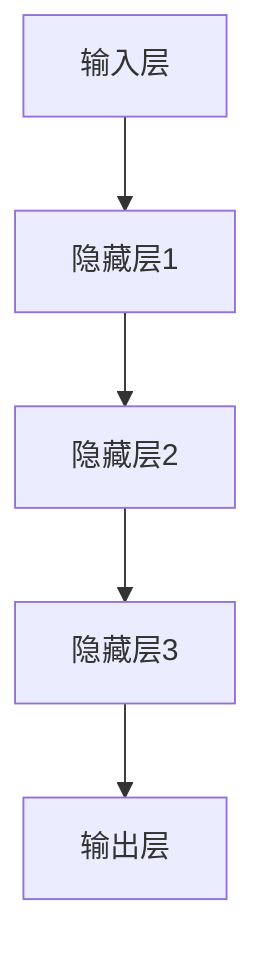
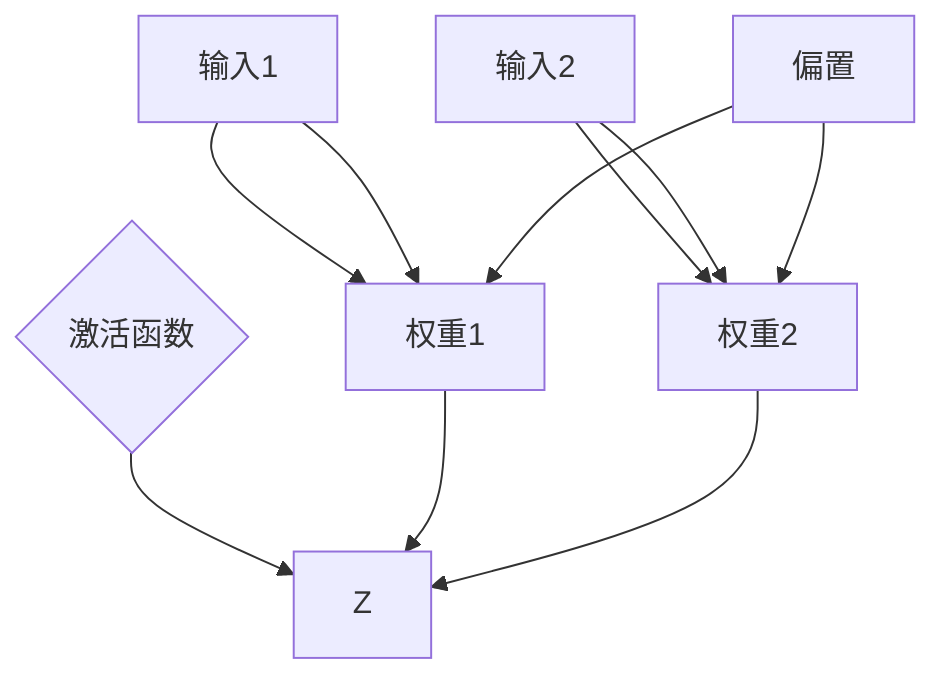

                 

# 《AI大模型创业：泡沫还是金矿？分析与思考》

## 关键词
- AI大模型
- 创业机会
- 技术挑战
- 商业模式
- 社会影响
- 法律伦理

## 摘要

随着人工智能技术的迅猛发展，AI大模型已经成为各个行业的热门话题。本文旨在探讨AI大模型在创业领域的潜在价值和面临的挑战，通过分析其技术原理、创业环境、商业模式以及社会影响，为创业者提供有价值的思考方向。文章首先介绍了AI大模型的基本概念和发展历程，随后深入探讨了AI大模型的核心数学原理和技术原理。接着，文章分析了当前AI大模型创业的市场环境和机会，并探讨了创业者应该如何制定有效的创业策略。在此基础上，文章通过案例分析和风险识别，给出了创业者应对创业过程中可能面临的风险的策略。最后，文章展望了AI大模型创业的未来发展趋势，并探讨了伦理和法律问题。本文旨在为AI大模型创业提供全面的思考和分析，帮助创业者更好地把握机遇，迎接挑战。

----------------------------------------------------------------

## 第一部分：AI大模型概述

### 第1章：AI大模型基础

#### 1.1 AI大模型的历史与发展

##### 1.1.1 AI大模型的起源与发展

人工智能（AI）作为计算机科学的一个重要分支，起源于20世纪50年代。早期的AI研究主要集中在符号推理和逻辑推理上，但随着计算能力的提升和数据量的增加，AI的发展进入了一个新的阶段。AI大模型，也称为深度学习模型，是这一阶段的重要成果之一。

AI大模型的历史可以追溯到1980年代，当时神经网络研究取得了突破性进展。1986年，Rumelhart, Hinton 和 Williams 提出了反向传播算法（Backpropagation），使得神经网络训练变得更加高效。然而，受限于当时的计算能力和数据资源，神经网络的应用范围仍然有限。

直到2012年，AlexNet的横空出世，标志着深度学习在图像识别领域的重大突破。这一突破得益于计算能力的提升和大数据的可用性。随着GPU的广泛应用和深度学习框架的发展，AI大模型开始逐渐应用于各个领域，如自然语言处理、语音识别和计算机视觉等。

##### 1.1.2 AI大模型的主要类型与特点

AI大模型主要分为以下几类：

1. **神经网络**：神经网络是AI大模型的核心组成部分，包括多层感知机（MLP）、卷积神经网络（CNN）、循环神经网络（RNN）及其变种，如长短期记忆网络（LSTM）和门控循环单元（GRU）。
   
2. **生成对抗网络**（GAN）：GAN是一种通过两个神经网络（生成器和判别器）的对抗训练来生成数据的方法，具有强大的数据生成能力，广泛应用于图像生成、视频生成和文本生成等领域。

3. **强化学习模型**：强化学习模型通过学习策略来最大化长期回报，广泛应用于游戏、自动驾驶和推荐系统等领域。

AI大模型的特点包括：

- **高参数数量**：AI大模型通常包含数百万甚至数十亿个参数，这使得它们能够捕捉数据中的复杂模式。
- **强大的表达能力**：AI大模型能够通过多层非线性变换，对输入数据进行有效的特征提取和表示。
- **自适应性**：通过训练，AI大模型能够不断优化其参数，以适应不同的任务和数据集。

##### 1.1.3 AI大模型与传统AI的区别

传统AI方法，如规则推理和决策树，依赖于明确的规则和先验知识。而AI大模型则更加灵活，能够从数据中自动学习复杂的模式和关系，无需人工干预。这种自学习能力使得AI大模型在许多复杂任务中表现出色。

此外，传统AI方法通常只能处理特定类型的问题，而AI大模型则具有更广泛的适用性，可以应用于多种不同的场景和任务。这使得AI大模型成为当前AI研究的热点和应用的关键。

#### 1.2 AI大模型的核心概念与联系

##### 1.2.1 大模型的架构与组成

AI大模型的架构通常包括以下几个部分：

- **输入层**：接收输入数据，可以是图像、文本或声音等。
- **隐藏层**：进行特征提取和变换，隐藏层越多，模型的能力越强。
- **输出层**：根据输入数据进行预测或分类。

一个典型的AI大模型架构如图1所示：



##### 1.2.2 大模型的训练与优化方法

AI大模型的训练过程主要包括以下几个步骤：

1. **数据预处理**：对输入数据进行标准化、归一化等处理，以提高模型的训练效率。
2. **模型初始化**：初始化模型参数，常用的初始化方法包括随机初始化、高斯分布初始化等。
3. **前向传播**：输入数据经过模型前向传播，生成输出。
4. **损失函数计算**：计算预测值与真实值之间的差距，常用的损失函数包括均方误差（MSE）和交叉熵损失等。
5. **反向传播**：通过反向传播算法更新模型参数。
6. **迭代优化**：重复上述步骤，直至模型收敛。

伪代码如下：

```python
while not converged:
    inputs = preprocess_data(data)
    outputs = forward_propagation(inputs, model)
    loss = compute_loss(outputs, labels)
    backward_propagation(inputs, outputs, model, loss)
```

##### 1.2.3 大模型的应用场景与趋势

AI大模型在各个领域都有着广泛的应用，以下是一些典型场景：

1. **自然语言处理（NLP）**：用于文本分类、情感分析、机器翻译等。
2. **计算机视觉**：用于图像分类、目标检测、图像生成等。
3. **语音识别**：用于语音识别、语音合成等。
4. **推荐系统**：用于个性化推荐、广告投放等。
5. **游戏AI**：用于棋类游戏、电子游戏等。

随着技术的不断进步和应用场景的拓展，AI大模型的应用前景十分广阔。未来，AI大模型将继续在各个领域发挥重要作用，推动人工智能技术的发展。

### 第2章：AI大模型数学原理

#### 2.1 神经网络基础

##### 2.1.1 神经元与神经网络

神经网络是AI大模型的基础组成部分，其基本单元是神经元。神经元接收输入信号，通过激活函数进行非线性变换，产生输出。

一个简单的神经元模型如图2所示：



神经元的工作原理可以描述为：

$$
z = \sum_{i=1}^{n} x_i \cdot w_i + b
$$

$$
o = \sigma(z)
$$

其中，$x_i$为输入值，$w_i$为对应权重，$b$为偏置，$\sigma$为激活函数。

常用的激活函数包括：

- **Sigmoid函数**：
  $$\sigma(z) = \frac{1}{1 + e^{-z}}$$
- **ReLU函数**：
  $$\sigma(z) = max(0, z)$$

##### 2.1.2 激活函数与优化算法

激活函数是神经网络中不可或缺的部分，它能够引入非线性因素，使模型具有更强的表达能力。

常用的优化算法包括：

- **梯度下降**：
  $$\theta_{t+1} = \theta_{t} - \alpha \cdot \nabla_\theta J(\theta)$$
  其中，$\theta$为模型参数，$\alpha$为学习率，$J(\theta)$为损失函数。

- **随机梯度下降**（SGD）：
  $$\theta_{t+1} = \theta_{t} - \alpha \cdot \nabla_\theta J(\theta; x_t, y_t)$$
  其中，$x_t$和$y_t$分别为第$t$个样本的输入和标签。

- **动量法**：
  $$\theta_{t+1} = \theta_{t} - \alpha \cdot \nabla_\theta J(\theta) + \beta \cdot (1 - \beta) \cdot \theta_{t-1}$$
  其中，$\beta$为动量因子。

这些优化算法在训练过程中能够有效地调整模型参数，使模型收敛到最优解。

##### 2.1.3 神经网络训练过程

神经网络的训练过程可以分为以下几个步骤：

1. **数据预处理**：对输入数据进行归一化、标准化等处理，以提高训练效率。
2. **模型初始化**：初始化模型参数，包括权重和偏置。
3. **前向传播**：输入数据经过模型前向传播，生成预测值。
4. **损失函数计算**：计算预测值与真实值之间的差距，常用的损失函数包括均方误差（MSE）和交叉熵损失等。
5. **反向传播**：通过反向传播算法更新模型参数。
6. **迭代优化**：重复上述步骤，直至模型收敛。

伪代码如下：

```python
while not converged:
    inputs = preprocess_data(data)
    outputs = forward_propagation(inputs, model)
    loss = compute_loss(outputs, labels)
    backward_propagation(inputs, outputs, model, loss)
```

#### 2.2 大模型训练优化

##### 2.2.1 梯度下降与反向传播

梯度下降是训练神经网络的基本优化算法，其核心思想是通过计算损失函数关于模型参数的梯度，并沿着梯度的反方向更新参数，以最小化损失函数。

反向传播算法是梯度下降在神经网络中的应用，其关键在于如何计算梯度。反向传播算法分为两个阶段：

1. **前向传播**：输入数据经过模型前向传播，生成预测值和激活值。
2. **后向传播**：从输出层开始，逐层计算梯度，并反向传播到输入层。

具体步骤如下：

1. **前向传播**：
   - 计算每个神经元的输出值和激活值。
   - 计算输出层的损失函数。

2. **后向传播**：
   - 从输出层开始，计算每个神经元的误差梯度。
   - 逐层反向传播梯度，更新每个神经元的权重和偏置。

伪代码如下：

```python
def forward_propagation(inputs, model):
    # 前向传播计算输出值和激活值
    # ...

def backward_propagation(inputs, outputs, model, loss):
    # 计算损失函数关于模型参数的梯度
    # ...
```

##### 2.2.2 大模型训练中的常见问题与优化方法

在训练大模型时，常常会遇到以下问题：

1. **梯度消失和梯度爆炸**：深层神经网络中，梯度可能因为反向传播过程中的乘性效应而变得非常小（梯度消失）或非常大（梯度爆炸）。这会导致模型无法有效训练。
2. **过拟合**：模型在训练数据上表现良好，但在测试数据上表现不佳，即模型对训练数据过度拟合。
3. **计算资源消耗大**：大模型的训练需要大量的计算资源和时间。

为解决这些问题，可以采用以下优化方法：

1. **dropout**：在训练过程中，随机丢弃部分神经元，以防止过拟合。
2. **批量归一化**：在每个批次上对激活值进行归一化，以缓解梯度消失和梯度爆炸问题。
3. **深度可分离卷积**：通过将卷积操作分解为深度卷积和逐点卷积，降低模型的计算复杂度。

##### 2.2.3 大模型训练资源分配策略

在大模型训练过程中，合理分配资源至关重要。以下是一些资源分配策略：

1. **并行计算**：利用GPU或TPU等硬件加速器进行并行计算，提高训练速度。
2. **分布式训练**：将模型和数据分布在多个节点上进行训练，以提高计算效率和模型性能。
3. **数据预处理**：提前对数据进行预处理，如批量加载、数据增强等，以减少训练时间。

通过以上策略，可以有效提高大模型训练的效率和性能。

### 第3章：AI大模型技术原理

#### 3.1 自然语言处理

##### 3.1.1 语言模型与序列模型

自然语言处理（NLP）是AI大模型的重要应用领域之一。语言模型（Language Model）是NLP的基础，它用于预测下一个单词或字符。序列模型（Sequence Model）则是基于语言模型，用于处理序列数据，如文本、语音等。

##### 3.1.2 注意力机制与转换器架构

注意力机制（Attention Mechanism）是一种用于处理序列数据的机制，它能够自动关注序列中的关键部分，从而提高模型的表示能力。转换器架构（Transformer Architecture）是利用注意力机制的序列模型，其在NLP任务中表现出色。

转换器架构的主要组成部分包括：

1. **编码器**（Encoder）：将输入序列编码为固定长度的向量。
2. **解码器**（Decoder）：根据编码器的输出，逐个生成输出序列。

##### 3.1.3 机器翻译与文本生成

机器翻译（Machine Translation）是将一种语言的文本翻译成另一种语言的过程。文本生成（Text Generation）则是根据输入条件生成文本的过程，如文章生成、对话生成等。

机器翻译和文本生成都是NLP的重要应用，其核心在于如何生成具有自然流畅性的文本。转换器架构在这些任务中表现出色，已经取得了显著的成果。

#### 3.2 计算机视觉

##### 3.2.1 图像分类与目标检测

计算机视觉（Computer Vision）是AI大模型的另一个重要应用领域。图像分类（Image Classification）是将图像划分为预定义的类别，如猫、狗等。目标检测（Object Detection）则是识别图像中的多个目标，并标注其位置。

常用的图像分类模型包括卷积神经网络（CNN）和转换器架构（Transformer）。目标检测模型则通常基于CNN，并引入锚框（Anchor Box）和锚框回归（Anchor Box Regression）等技术。

##### 3.2.2 图像生成与风格迁移

图像生成（Image Generation）是生成与给定条件相似的新图像的过程。风格迁移（Style Transfer）则是将一种图像的风格应用到另一种图像上，以生成具有特定风格的新图像。

生成对抗网络（GAN）是图像生成和风格迁移的重要模型。GAN由生成器和判别器组成，通过对抗训练生成高质量图像。

##### 3.2.3 计算机视觉应用案例

计算机视觉在许多领域都有广泛应用，如自动驾驶、医疗影像分析、安防监控等。以下是一些应用案例：

1. **自动驾驶**：使用目标检测和图像分类模型识别道路上的车辆、行人等，为自动驾驶系统提供决策依据。
2. **医疗影像分析**：使用深度学习模型对医疗影像进行分析，如肿瘤检测、骨折诊断等，提高医疗诊断的准确性和效率。
3. **安防监控**：使用目标检测和追踪技术实时监控公共场所，提高安全防护能力。

通过以上案例可以看出，计算机视觉在提高生产力、改善生活质量方面具有巨大的潜力。

## 第二部分：AI大模型创业实战

### 第4章：AI大模型创业环境分析

#### 4.1 AI大模型创业机会与挑战

##### 4.1.1 AI大模型市场的现状与趋势

随着人工智能技术的不断发展，AI大模型在各个领域得到了广泛应用，市场需求不断增长。根据市场研究机构的数据，全球AI大模型市场规模预计将在未来几年内保持高速增长。以下是一些市场现状和趋势：

1. **市场规模**：全球AI大模型市场规模逐年增长，预计到2025年将达到数百亿美元。
2. **应用领域**：AI大模型在金融、医疗、教育、零售等领域的应用越来越广泛，成为企业提高效率、降低成本的重要工具。
3. **技术进步**：随着计算能力的提升和算法的优化，AI大模型的表现越来越出色，为创业者提供了更多的机会。

##### 4.1.2 AI大模型创业的关键因素

要成功开展AI大模型创业，以下关键因素需要得到充分考虑：

1. **技术能力**：具备强大的技术背景和研发能力是创业成功的基础。创业者需要掌握深度学习、神经网络等相关技术，并能将其应用于实际问题中。
2. **市场需求**：了解市场需求和用户痛点，开发出具有实际应用价值的产品和服务。创业者需要通过市场调研和用户反馈，不断优化产品，满足用户需求。
3. **资金和资源**：充足的资金和资源是创业成功的重要保障。创业者需要寻找合适的投资人和合作伙伴，获取资金和资源支持。
4. **团队建设**：组建一支高效、专业的团队是创业成功的关键。团队成员需要具备各自的专业技能和良好的沟通协作能力，共同推动项目发展。

##### 4.1.3 创业者面临的挑战与应对策略

在AI大模型创业过程中，创业者将面临一系列挑战，以下是一些常见挑战及其应对策略：

1. **技术挑战**：AI大模型的研发和优化需要大量技术积累和经验。创业者需要不断学习新技术，提升自身的技术水平，以应对技术挑战。
2. **市场竞争**：AI大模型市场竞争激烈，创业者需要通过不断创新和优化产品，提高市场竞争力。创业者可以通过差异化竞争策略，如提供更优质的服务、更低的价格等，来争夺市场份额。
3. **法律和伦理问题**：AI大模型在应用过程中可能会涉及数据隐私、知识产权等问题。创业者需要关注相关法律法规，确保产品合规，并积极解决伦理问题，以提高用户信任度。
4. **资金和资源限制**：创业初期，创业者可能会面临资金和资源的限制。创业者需要通过合理规划和资源调配，确保资金和资源的有效利用，以支持项目发展。

通过以上分析，可以看出AI大模型创业具有巨大的潜力和机遇，同时也面临着诸多挑战。创业者需要具备良好的技术能力、市场需求洞察力、团队建设能力等，以应对创业过程中的各种挑战，实现创业目标。

### 第5章：AI大模型创业策略

#### 5.1 商业模式与创新

##### 5.1.1 AI大模型商业模式解析

AI大模型创业的商业模式主要分为以下几种：

1. **产品销售**：创业者开发AI大模型产品，将其销售给企业或个人用户，获得收入。这种模式的关键在于产品的高质量和用户体验。

2. **服务提供**：创业者为企业提供AI大模型相关服务，如模型定制、数据标注、模型优化等。这种模式的核心在于专业能力和客户服务质量。

3. **平台运营**：创业者搭建AI大模型平台，为开发者提供工具、资源和社区支持，通过平台收费或广告收入获得收益。这种模式的关键在于平台的影响力和用户活跃度。

4. **解决方案**：创业者为企业提供完整的AI大模型解决方案，包括硬件设备、软件工具、服务支持等。这种模式的核心在于提供一站式服务，提升客户满意度。

##### 5.1.2 创新在AI大模型创业中的重要性

创新是AI大模型创业成功的关键因素之一。以下从几个方面阐述创新的重要性：

1. **技术突破**：创新可以帮助创业者实现技术突破，开发出具有竞争力的产品或服务。例如，在深度学习领域，新算法、新架构的不断涌现，推动了AI大模型技术的发展。

2. **市场差异化**：创新可以帮助创业者找到市场空白点，提供差异化产品或服务，吸引目标客户。例如，在自然语言处理领域，创业者可以通过创新的文本生成技术，提供独特的文案创作服务。

3. **用户体验**：创新可以提升用户体验，增强用户粘性和忠诚度。例如，在计算机视觉领域，通过创新的图像处理技术，创业者可以提供更精准、更高效的图像识别服务。

4. **商业模式创新**：创新可以推动商业模式的创新，为创业者提供新的盈利模式。例如，通过创新的运营模式，创业者可以实现更高效的成本控制，提升企业盈利能力。

##### 5.1.3 创业者如何把握市场机遇

为了把握AI大模型创业的市场机遇，创业者可以从以下几个方面入手：

1. **关注行业趋势**：创业者需要关注AI大模型在各个行业的应用趋势，寻找市场机会。例如，随着5G技术的普及，AI大模型在物联网、智能监控等领域的应用将得到快速发展。

2. **精准定位市场**：创业者需要精准定位目标市场，了解客户需求，提供针对性的解决方案。例如，在医疗领域，创业者可以针对医生的需求，开发出智能诊断系统。

3. **加强技术研发**：创业者需要不断投入研发，提升技术实力，以保持市场竞争力。例如，在金融领域，创业者可以通过技术创新，提供更精准的风险评估和投资建议。

4. **拓展合作伙伴**：创业者可以通过与行业内的合作伙伴建立合作关系，共享资源、互利共赢。例如，在零售领域，创业者可以与电商平台合作，提供智能推荐服务。

5. **优化用户体验**：创业者需要注重用户体验，通过优化产品设计、提升服务质量，提高用户满意度。例如，在教育领域，创业者可以通过创新的在线学习平台，提供更便捷、更高效的学习体验。

通过以上策略，创业者可以更好地把握AI大模型创业的市场机遇，实现创业目标。

### 第6章：AI大模型创业案例分析

#### 6.1 国内外AI大模型创业案例分析

##### 6.1.1 案例一：OpenAI的发展历程与商业模式

OpenAI是一家全球领先的AI研究机构，成立于2015年，由山姆·阿尔特曼和伊隆·马斯克等人共同创立。OpenAI的发展历程和商业模式为我们提供了宝贵的启示。

**发展历程**：

1. 2015年，OpenAI成立，致力于推动人工智能的发展和应用。
2. 2016年，OpenAI发布了GPT-1，这是一个基于深度学习的语言模型，能够生成高质量的文本。
3. 2018年，OpenAI发布了GPT-2，其语言生成能力进一步提升，引起了广泛关注。
4. 2019年，OpenAI发布了GPT-3，这是目前世界上最先进的语言模型，拥有1750亿个参数。

**商业模式**：

1. **研究合作**：OpenAI与全球各地的大学、研究机构和企业合作，共同推动AI技术的发展。
2. **技术授权**：OpenAI将自身的技术和研究成果授权给其他企业，帮助他们实现AI应用。
3. **直接应用**：OpenAI在一些领域直接应用其技术，如自然语言处理、游戏开发等。

**启示**：

- **持续研发**：OpenAI通过持续的研发投入，不断提升技术实力，保持行业领先地位。
- **开放合作**：OpenAI通过开放合作，整合全球资源，实现共赢。
- **多元应用**：OpenAI不仅关注技术本身，还将其应用于实际场景，推动技术落地。

##### 6.1.2 案例二：百度文心生态构建与市场拓展

百度文心是百度旗下的AI大模型研发平台，成立于2019年。百度文心通过构建完整的AI大模型生态，为企业提供从算法到应用的全方位服务。

**生态构建**：

1. **算法研发**：百度文心专注于AI大模型算法的研发，包括自然语言处理、计算机视觉等。
2. **工具链建设**：百度文心提供丰富的工具链，包括模型训练、优化、部署等。
3. **应用场景拓展**：百度文心将AI大模型应用于多个行业，如金融、医疗、教育等。

**市场拓展**：

1. **合作拓展**：百度文心与众多企业建立合作关系，共同推动AI应用落地。
2. **解决方案提供**：百度文心为企业提供定制化的AI大模型解决方案，满足不同行业的需求。
3. **生态建设**：百度文心通过开放平台，吸引更多的开发者加入，共同构建AI大模型生态。

**启示**：

- **技术积累**：百度文心通过持续的技术积累，构建了强大的AI大模型技术实力。
- **生态建设**：百度文心通过构建生态，实现了从算法到应用的全面覆盖。
- **市场开拓**：百度文心通过合作和市场拓展，成功将AI大模型应用于多个行业。

##### 6.1.3 案例三：创业公司Z的创新模式与市场表现

创业公司Z是一家专注于AI大模型研发的企业，成立于2020年。公司通过创新的模式，迅速在市场上崭露头角。

**创新模式**：

1. **自主研发**：公司专注于AI大模型的核心技术研发，不断提升技术实力。
2. **开放平台**：公司搭建开放平台，吸引全球开发者加入，共同推动AI大模型技术的发展。
3. **应用场景拓展**：公司积极拓展AI大模型的应用场景，如自然语言处理、计算机视觉等。

**市场表现**：

1. **客户拓展**：公司已与多家企业建立合作关系，为其提供AI大模型服务。
2. **市场份额**：公司市场份额逐年增长，成为AI大模型市场的重要参与者。
3. **技术创新**：公司不断推出创新的产品和服务，保持市场竞争力。

**启示**：

- **技术创新**：公司通过持续的技术创新，保持市场竞争力。
- **开放合作**：公司通过开放合作，整合全球资源，实现共赢。
- **应用拓展**：公司通过积极拓展应用场景，实现技术落地。

通过以上案例，我们可以看到AI大模型创业的成功离不开技术创新、开放合作和应用拓展。这些案例为我们提供了宝贵的经验和启示，有助于我们更好地把握AI大模型创业的机遇。

### 第7章：AI大模型创业风险与应对

#### 7.1 AI大模型创业风险识别

在AI大模型创业过程中，创业者需要面对多种风险，包括技术风险、市场风险、财务风险和法律风险。以下是这些风险的详细分析：

##### 7.1.1 技术风险

技术风险是指由于技术不成熟、研发进展缓慢或技术迭代速度过快等原因，导致创业项目无法达到预期目标的风险。技术风险主要体现在以下几个方面：

1. **研发难度**：AI大模型研发涉及复杂的算法和数据处理，技术难度较高。创业者需要投入大量人力和物力进行技术研发，但仍然可能面临技术难题。
2. **技术迭代**：AI领域技术更新迅速，创业者需要不断跟进最新的技术趋势，否则可能会导致产品落后。
3. **技术实现**：AI大模型的应用场景多样，创业者需要根据具体需求实现技术，但实现过程中可能遇到技术瓶颈。

##### 7.1.2 市场风险

市场风险是指由于市场需求变化、竞争加剧或市场定位不准等原因，导致创业项目无法实现预期市场表现的风险。市场风险主要体现在以下几个方面：

1. **市场需求**：AI大模型的应用场景广泛，但具体市场需求可能因行业特点、用户习惯等因素而有所不同。创业者需要准确把握市场需求，才能找到市场切入点。
2. **竞争对手**：AI大模型市场竞争激烈，创业者需要面对强大的竞争对手，如何脱颖而出是关键。
3. **市场定位**：创业者需要明确自己的市场定位，避免盲目跟风或定位不准确，导致市场份额有限。

##### 7.1.3 财务风险

财务风险是指由于资金管理不善、收入不稳定或成本控制不当等原因，导致创业项目无法实现预期财务目标的风险。财务风险主要体现在以下几个方面：

1. **资金不足**：创业项目初期需要大量资金投入，包括技术研发、市场推广、团队建设等。资金不足可能导致项目无法正常推进。
2. **成本控制**：创业者需要有效控制成本，避免过度投入导致资源浪费。
3. **收入不稳定**：AI大模型创业项目的收入来源多样，但具体收入情况可能因市场需求、客户满意度等因素而有所不同。创业者需要制定合理的财务规划，确保项目可持续发展。

##### 7.1.4 法律风险

法律风险是指由于法律法规变化、合同纠纷或知识产权问题等原因，导致创业项目面临法律诉讼或损失的风险。法律风险主要体现在以下几个方面：

1. **法律法规**：AI大模型创业涉及多项法律法规，包括数据隐私法、知识产权法等。创业者需要了解相关法律法规，确保项目合规。
2. **合同纠纷**：在合作过程中，创业者需要签订各种合同，但合同纠纷可能导致项目受阻。
3. **知识产权**：AI大模型研发过程中涉及大量知识产权，包括专利、版权等。创业者需要重视知识产权保护，避免侵权风险。

#### 7.2 AI大模型创业风险防范策略

为了有效应对AI大模型创业过程中的各种风险，创业者可以采取以下防范策略：

##### 7.2.1 风险管理框架与流程

1. **风险评估**：创业者需要对项目进行全面的风险评估，识别可能面临的风险，并评估其影响和可能性。
2. **风险应对**：针对识别出的风险，创业者需要制定相应的应对策略，包括风险回避、风险转移、风险缓解等。
3. **风险监控**：创业者需要建立风险监控机制，定期评估风险状况，及时调整应对策略。

##### 7.2.2 风险控制与风险转移

1. **风险控制**：创业者可以通过以下措施进行风险控制：
   - **技术控制**：加强技术研发，提升技术实力，降低技术风险。
   - **市场控制**：深入市场调研，了解市场需求，避免市场风险。
   - **财务控制**：加强财务管理，制定合理的财务规划，降低财务风险。
   - **法律控制**：了解相关法律法规，确保项目合规，降低法律风险。

2. **风险转移**：创业者可以通过以下措施进行风险转移：
   - **保险**：购买相关保险，将部分风险转移给保险公司。
   - **合作**：与合作伙伴签订合同，明确责任和义务，将部分风险转移给合作伙伴。
   - **外包**：将部分研发或运营任务外包，降低风险。

##### 7.2.3 创业团队的风险意识培养

1. **风险教育**：加强创业团队的风险教育，提高团队成员的风险意识。
2. **培训与指导**：为团队成员提供风险管理的培训和指导，提升其风险管理能力。
3. **激励机制**：建立激励机制，鼓励团队成员积极参与风险管理，提高整体风险防范能力。

通过以上策略，创业者可以有效应对AI大模型创业过程中的各种风险，确保项目顺利进行。

### 第8章：AI大模型创业的社会影响

#### 8.1 AI大模型创业对经济的影响

AI大模型创业对经济的影响是多方面的，既包括直接的产业影响，也涉及间接的经济效应。

##### 8.1.1 创业活动对就业市场的贡献

AI大模型创业活动在推动技术创新的同时，也为就业市场带来了新的机遇。首先，随着AI大模型技术的不断进步，相关领域对专业技术人才的需求急剧增加。这为计算机科学家、数据科学家、机器学习工程师等职业提供了大量就业机会。此外，AI大模型的应用推动了新兴产业的发展，如自动驾驶、智能医疗、金融科技等，这些领域需要大量跨学科的专业人才，进一步拓宽了就业市场。

然而，AI大模型创业也带来了就业市场的某些挑战。一方面，自动化和智能化的推广可能导致某些传统岗位的减少，尤其是那些重复性和低技能的工作。另一方面，AI大模型创业的快速发展可能加剧人才短缺问题，特别是在高端技术人才方面。为了应对这些挑战，政府和教育机构需要加大对AI相关教育和培训的投入，以培养更多的专业人才。

##### 8.1.2 AI大模型创业对产业链的推动作用

AI大模型创业不仅对就业市场产生深远影响，也对产业链的构建和优化起到了重要作用。首先，AI大模型技术催生了新的产业链环节，如硬件设备制造、算法研发、数据服务、应用开发等。这些环节共同构建了一个完整的AI生态系统，为各个行业提供了丰富的解决方案和服务。

其次，AI大模型创业推动了传统产业链的升级和转型。例如，在制造业中，AI大模型的应用使得生产过程更加智能化和自动化，提高了生产效率和产品质量。在零售业中，AI大模型帮助商家实现精准营销和个性化推荐，提升了用户体验和销售转化率。在金融业中，AI大模型的应用提高了风险控制能力和金融服务效率。

此外，AI大模型创业还促进了跨行业合作和协同创新。企业可以通过合作共享AI技术和资源，实现产业链的协同发展。例如，汽车制造商与科技公司合作开发自动驾驶技术，医疗服务机构与人工智能公司合作提供智能诊断服务。这些合作不仅推动了技术的进步，也为产业链的整合和优化提供了新的思路。

##### 8.1.3 创业活动对技术创新的影响

AI大模型创业活动在推动经济的同时，也显著促进了技术创新。首先，创业活动的竞争性推动了技术的快速迭代和更新。在激烈的市场竞争中，创业者不断寻求技术创新和突破，以提高产品的竞争力。这种竞争环境激励了技术的创新和发展。

其次，AI大模型创业活动为技术创新提供了丰富的应用场景。创业者可以通过实际应用需求推动技术的进步，解决实际问题。例如，在医疗领域，创业者通过开发AI大模型辅助诊断系统，提高了疾病检测的准确性和效率；在金融领域，创业者通过AI大模型进行风险控制和投资决策，提高了金融服务的质量和效率。

此外，AI大模型创业活动还促进了开放合作和知识共享。创业者可以通过共享技术成果和经验，推动整个行业的技术进步。例如，开源社区和学术会议为创业者提供了交流和合作的机会，促进了技术的传播和应用。

总之，AI大模型创业活动对经济产生了深远的影响，不仅推动了就业市场的发展，促进了产业链的优化和升级，还加速了技术创新的步伐。这些影响为AI大模型创业提供了广阔的发展空间和潜力，也为经济持续增长提供了新的动力。

### 第9章：AI大模型创业的未来展望

#### 9.1 AI大模型创业的发展趋势

随着技术的不断进步和市场的需求增长，AI大模型创业呈现出以下几个主要发展趋势：

##### 9.1.1 技术发展趋势与创业机会

首先，AI大模型技术的持续进步将为创业者提供更多的机会。随着计算能力的提升和算法的优化，AI大模型将变得更加高效和强大。例如，生成对抗网络（GAN）和变分自编码器（VAE）等新型深度学习技术的应用，将使数据生成和特征提取变得更加精准。此外，量子计算、联邦学习等新兴技术的融入，将进一步推动AI大模型的发展。创业者可以关注这些技术领域，开发出更具创新性的产品和服务。

其次，AI大模型在各个垂直行业的应用也将不断拓展。随着行业对智能化的需求增加，AI大模型将在医疗、金融、教育、零售等各个领域得到更广泛的应用。例如，在医疗领域，AI大模型可以用于疾病预测、诊断和治疗方案优化；在金融领域，AI大模型可以用于风险管理、投资决策和欺诈检测。创业者可以通过深入了解这些行业的具体需求，开发出具有针对性的解决方案。

##### 9.1.2 市场规模与竞争格局

AI大模型市场的规模预计将持续扩大。根据市场研究机构的预测，全球AI大模型市场将在未来几年内保持高速增长。随着技术的成熟和应用的普及，市场潜力巨大。创业者可以抓住这一市场机遇，积极布局。

然而，AI大模型市场的竞争也将愈发激烈。随着更多企业和创业者的进入，市场将出现大量竞争者。创业者需要具备强大的技术实力和创新能力，以在竞争中脱颖而出。此外，创业者还需要注重市场定位和客户服务，提供差异化产品，提升用户体验。

##### 9.1.3 创业者在未来的角色与定位

在未来的AI大模型创业中，创业者将扮演更加多元化的角色。首先，创业者需要成为技术引领者，不断探索和掌握最新的AI技术，推动技术的进步和应用。其次，创业者需要成为市场洞察者，深入了解市场需求和趋势，开发出符合市场需求的产品和服务。此外，创业者还需要成为创新者，通过不断的创新和优化，提升产品的竞争力。

同时，创业者还需要具备良好的团队建设和领导能力。一个高效的团队是创业成功的关键。创业者需要吸引并留住优秀人才，建立良好的团队文化和协作机制。此外，创业者还需要具备良好的沟通和协作能力，与客户、合作伙伴和投资者建立良好的关系。

总之，未来的AI大模型创业将充满机遇和挑战。创业者需要具备强大的技术实力、市场洞察力和团队领导力，以在激烈的市场竞争中脱颖而出。通过不断的技术创新和市场拓展，创业者可以推动AI大模型技术发展，实现商业成功和社会价值。

### 第10章：AI大模型创业的伦理与法律问题

#### 10.1 AI大模型创业的伦理问题

随着AI大模型技术的迅猛发展，伦理问题逐渐成为创业者和社会关注的焦点。以下是AI大模型创业中可能遇到的伦理问题及其应对策略。

##### 10.1.1 数据隐私与伦理道德

数据隐私是AI大模型创业中最重要的伦理问题之一。在训练和部署AI大模型时，通常需要大量的数据，这些数据可能包含个人敏感信息。以下是一些数据隐私和伦理道德问题：

1. **数据收集**：在收集数据时，需要确保数据的合法性和用户同意。创业者应遵循相关法律法规，如《通用数据保护条例》（GDPR），明确告知用户数据收集的目的和用途。
2. **数据存储**：数据存储需要确保安全性，防止数据泄露和滥用。创业者应采取加密、访问控制等技术措施，保障用户数据安全。
3. **用户知情权**：用户有权了解自己的数据如何被使用，创业者应提供透明的数据使用政策，让用户知道他们的数据将如何被处理。

##### 10.1.2 AI大模型决策的伦理挑战

AI大模型在决策过程中可能会出现歧视、偏见等问题，这给伦理道德带来了挑战：

1. **算法公平性**：AI大模型应避免因算法设计或数据集选择导致的歧视。创业者需要确保算法的公平性和透明性，通过数据分析和算法验证来识别和消除偏见。
2. **责任归属**：当AI大模型做出错误决策时，责任归属问题变得复杂。创业者应建立明确的责任分配机制，确保在出现问题时能够追溯责任。

##### 10.1.3 创业者如何遵循伦理规范

为了遵循伦理规范，创业者可以采取以下措施：

1. **设立伦理委员会**：成立专门的伦理委员会，负责监督和评估AI大模型项目的伦理风险，确保项目符合道德和法律标准。
2. **伦理培训**：为团队成员提供伦理培训，提高他们的伦理意识和专业知识。
3. **透明沟通**：与用户、合作伙伴和利益相关者保持透明沟通，确保他们了解项目的伦理考量。

通过以上措施，创业者可以更好地应对AI大模型创业中的伦理问题，推动技术与社会发展的和谐共进。

#### 10.2 AI大模型创业的法律问题

AI大模型创业不仅涉及伦理问题，还面临一系列法律问题。以下是创业者需要关注的主要法律问题及其应对策略。

##### 10.2.1 法律法规与政策环境

1. **数据保护法规**：如前所述，GDPR等数据保护法规对创业者提出了严格要求，涉及数据收集、存储和处理等方面的合规性。创业者应确保遵守相关法律法规，以避免潜在的法律风险。
2. **知识产权保护**：AI大模型创业中，知识产权保护至关重要。创业者应确保自身技术的原创性，避免侵权行为。此外，对于开源技术，应明确开源许可协议，确保合理使用。
3. **市场竞争法规**：创业者需要遵守反垄断法规，确保市场竞争的公平性。避免通过不正当手段垄断市场，损害消费者利益。

##### 10.2.2 合同法律问题与知识产权保护

1. **合同签订**：创业者在与合作伙伴、客户和供应商签订合同时，应确保合同条款明确、合法，避免因合同纠纷导致项目受阻。
2. **知识产权保护**：创业者应制定知识产权保护策略，包括专利申请、商标注册和版权保护等。这有助于保护公司的技术和商业秘密。
3. **商业秘密保护**：创业者应采取保密措施，保护商业秘密，防止泄露给竞争对手。

##### 10.2.3 创业者如何应对法律风险

为了有效应对法律风险，创业者可以采取以下措施：

1. **法律咨询**：在项目开发和运营过程中，定期咨询专业律师，确保项目的合规性。
2. **风险评估**：定期进行法律风险评估，识别潜在的法律风险，并制定应对策略。
3. **内部培训**：为团队成员提供法律知识培训，提高他们的法律意识和合规能力。

通过以上措施，创业者可以更好地应对AI大模型创业中的法律问题，确保项目的顺利进行。

### 附录

#### 附录A：AI大模型创业资源与工具

##### A.1 开源框架与平台

1. **TensorFlow**：由Google开发的深度学习框架，广泛用于AI大模型开发。
2. **PyTorch**：由Facebook开发的开源深度学习框架，具有灵活性和高效性。
3. **Keras**：基于Theano和TensorFlow的高层次深度学习API，易于使用。
4. **PyTorch Lightning**：用于PyTorch的扩展库，提供高级抽象，简化模型训练。

##### A.2 数据集与工具

1. **ImageNet**：大规模的图像数据集，广泛用于图像分类任务。
2. **CIFAR-10/100**：用于计算机视觉任务的小型图像数据集。
3. **Common Crawl**：包含大量网页文本数据，用于自然语言处理任务。
4. **Google Dataset Search**：一个用于搜索各种数据集的搜索引擎。

##### A.3 创业指南与参考资料

1. **《AI创业实战：从0到1打造AI产品》**：一本关于AI创业的实践指南。
2. **《深度学习》**：由Ian Goodfellow、Yoshua Bengio和Aaron Courville合著的经典教材。
3. **AI创业社区**：如AIWeekly、AI hub等，提供最新的AI创业资讯和资源。

#### 附录B：AI大模型创业案例汇总

##### B.1 案例一：创业公司X的成功之路

**公司简介**：创业公司X是一家专注于AI大模型研发的企业，成立于2016年。

**成功经验**：
1. **技术创新**：公司通过自主研发，推出了具有竞争力的AI大模型产品。
2. **市场定位**：公司精准定位市场，为金融行业提供AI解决方案。
3. **客户服务**：公司提供优质的客户服务，赢得了客户信任。

**主要成就**：公司已成为金融AI领域的领导者，市场份额稳步增长。

##### B.2 案例二：创业公司Y的困境与转机

**公司简介**：创业公司Y成立于2018年，专注于自然语言处理领域的AI大模型研发。

**困境**：
1. **市场竞争激烈**：Y公司在创业初期面临激烈的竞争。
2. **资金不足**：公司因资金短缺而面临运营困难。

**转机**：
1. **技术突破**：公司通过技术创新，推出了具有差异化的产品。
2. **战略合作**：公司与大型企业建立战略合作，获得资金和资源支持。

**主要成就**：公司成功实现了业务转型，逐步恢复了市场竞争力。

##### B.3 案例三：创业公司Z的创新模式与市场表现

**公司简介**：创业公司Z成立于2019年，专注于AI大模型在零售行业的应用。

**创新模式**：
1. **平台化运营**：公司搭建了AI大模型平台，提供一站式服务。
2. **合作拓展**：公司与多家零售企业合作，共同开发AI应用。

**市场表现**：
1. **市场份额**：公司市场份额逐年增长，成为零售AI领域的重要参与者。
2. **技术创新**：公司不断推出创新产品，保持市场竞争力。

**主要成就**：公司通过平台化和合作模式，成功实现了商业化和市场拓展。

