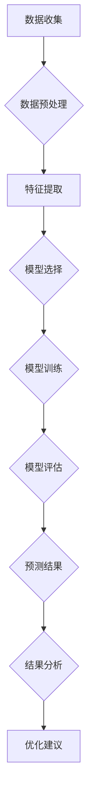
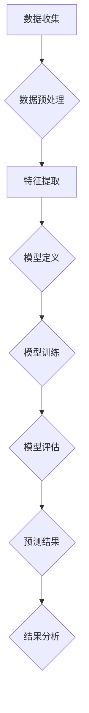
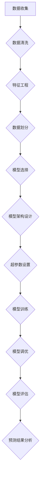
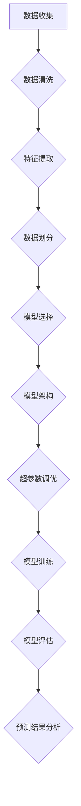
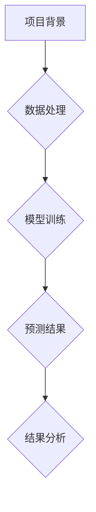
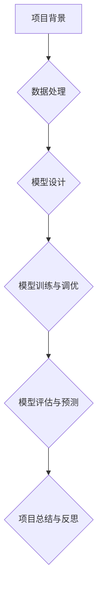

                 

### 第1章: AI大模型概述

#### 1.1 AI大模型的核心概念

AI大模型（Large-scale AI Model）是一种基于深度学习和大数据技术的复杂模型，能够处理和分析大量数据，以实现各种复杂的任务，如自然语言处理、图像识别和预测分析。AI大模型的核心在于其规模和计算能力，它们通常由数百万甚至数十亿个参数组成，能够学习并捕捉数据中的复杂模式和关联。

- **定义**：AI大模型是指那些训练数据规模达到数百万到数十亿样本，模型参数达到数百万到数十亿的神经网络模型。这些模型通常需要使用高性能计算资源和特殊的优化技术来训练。

- **类型**：AI大模型主要包括生成式对抗网络（GANs）、变分自编码器（VAEs）、自注意力机制（Self-Attention）和Transformer等。

  - **生成式对抗网络（GANs）**：由生成器和判别器组成，生成器和判别器相互对抗，生成器试图生成逼真的数据，判别器则试图区分生成数据和真实数据。

  - **变分自编码器（VAEs）**：通过编码器和解码器进行数据重构，能够学习数据的概率分布。

  - **自注意力机制（Self-Attention）**：是一种计算方法，能够自动关注输入数据中的关键部分，从而提高模型的表示能力。

  - **Transformer**：一种基于自注意力机制的序列模型，广泛应用于自然语言处理任务，如机器翻译和文本生成。

#### 1.2 AI大模型的基本原理

AI大模型的基本原理基于深度学习和神经网络，通过多层次的神经元互联结构来学习数据特征。深度学习是一种多层神经网络模型，通过不断加深网络层数来提高模型的学习能力。以下是AI大模型基本原理的详细解释：

- **神经网络**：神经网络由一系列的神经元组成，每个神经元接收输入信号，通过加权求和处理后产生输出。神经网络通过不断调整权重来学习输入数据中的特征。

- **深度学习**：深度学习是AI大模型的核心技术，通过增加网络的深度来提高模型的性能和泛化能力。深度学习模型通常包含多层神经网络，每一层都对输入数据进行特征提取和变换。

- **反向传播算法**：反向传播算法是训练神经网络的关键算法，通过计算输出误差，反向传播误差信号，调整网络权重，从而优化模型的参数。

- **批量归一化**：批量归一化（Batch Normalization）是一种常用的正则化技术，通过标准化每层的输入数据，提高神经网络的训练速度和稳定性。

- **激活函数**：激活函数是神经网络中的非线性变换，常用的激活函数有Sigmoid、ReLU、Tanh等，它们能够引入非线性特性，使模型具有更好的拟合能力。

#### 1.3 AI大模型在电商平台销售预测中的作用

AI大模型在电商平台销售预测中具有重要作用，能够帮助企业提高预测准确性，优化资源配置，从而提高运营效率和收益。以下是AI大模型在电商平台销售预测中作用的详细解释：

- **提升预测准确性**：通过学习大量的历史销售数据，AI大模型能够捕捉到销售数据中的复杂模式和关联，从而提高销售预测的准确性。传统的预测方法通常只能捕捉到简单的线性关系，而AI大模型能够捕捉到更加复杂的多维关系，提高预测的准确性。

- **优化资源配置**：准确的销售预测可以帮助电商平台优化库存管理，合理配置资源。例如，通过预测未来某一时间段的热销产品，电商平台可以提前备货，避免缺货或库存过剩的问题。同时，准确的预测还可以帮助电商平台制定更有效的营销策略，提高销售额。

- **智能推荐系统**：AI大模型可以结合用户行为数据和销售预测结果，为用户推荐可能感兴趣的产品。通过个性化推荐，电商平台可以增加用户的购买概率，提高转化率。

- **风险控制**：AI大模型可以预测销售风险，如季节性波动、促销活动等，帮助企业提前制定应对策略，降低风险。

#### 1.4 AI大模型的技术发展历程

AI大模型的技术发展历程可以分为以下几个阶段：

- **早期阶段**：以单层神经网络和简单的机器学习算法为主。例如，线性回归、决策树等。

- **发展阶段**：随着计算机性能的提升和大数据技术的发展，深度学习和AI大模型开始崛起。2006年，Hinton等人提出了深度信念网络（DBN），标志着深度学习的复兴。2012年，AlexNet在ImageNet竞赛中取得突破性成果，进一步推动了深度学习的发展。

- **当前阶段**：AI大模型已经成为人工智能领域的热点，并在各个行业得到广泛应用。例如，自然语言处理中的BERT、图像识别中的ResNet等。同时，AI大模型的研究也在不断深入，涌现出许多新的算法和技术。

### 1.5 AI大模型在电商平台销售预测中的关键技术和挑战

AI大模型在电商平台销售预测中涉及多个关键技术和挑战，以下是一些重要的方面：

- **数据预处理**：电商平台的数据来源多样，包括历史销售数据、用户行为数据、市场信息等。数据预处理是模型训练前的重要步骤，包括数据清洗、缺失值处理、异常值检测和特征工程等。有效的数据预处理可以提高模型的训练效果和预测准确性。

- **模型选择和优化**：根据电商平台的具体需求，选择合适的AI大模型类型和架构。常见的模型包括深度神经网络、卷积神经网络、循环神经网络和Transformer等。模型的优化包括超参数调整、模型结构改进和训练策略优化等，以实现最佳的预测性能。

- **实时预测和更新**：电商平台销售预测需要实时响应市场变化，因此模型需要具备实时预测和更新能力。通过使用在线学习、增量学习和分布式计算等技术，可以实现模型的实时更新和预测。

- **可解释性和透明度**：AI大模型在决策过程中具有高度的非线性复杂性和黑盒特性，如何提高模型的可解释性和透明度是一个重要挑战。通过模型可视化、解释性算法和模型解释工具，可以帮助用户理解模型的决策过程和预测结果。

- **数据隐私和安全**：电商平台的数据通常涉及用户隐私，如何在保证数据隐私和安全的前提下进行模型训练和预测，是一个重要的问题。可以通过差分隐私、联邦学习和加密计算等技术来保护用户数据的隐私。

#### 1.6 AI大模型在电商平台销售预测中的最佳实践

为了充分发挥AI大模型在电商平台销售预测中的作用，以下是一些最佳实践：

- **数据质量保障**：确保数据的质量和一致性，通过数据清洗、去噪和异常值处理，提高数据的质量。

- **特征工程**：提取和选择对销售预测有显著影响的特征，如时间序列特征、用户行为特征、市场环境特征等，通过特征工程提高模型的预测能力。

- **模型选择和优化**：根据电商平台的具体需求，选择合适的模型类型和架构，通过交叉验证和超参数调整，优化模型的性能。

- **实时预测和更新**：实现模型的实时预测和更新，通过在线学习和增量学习等技术，快速适应市场变化。

- **可解释性和透明度**：提高模型的可解释性和透明度，通过可视化工具和解释性算法，帮助用户理解模型的决策过程和预测结果。

- **风险管理**：建立风险预警机制，通过预测销售风险，提前制定应对策略，降低运营风险。

### 1.7 AI大模型在电商平台销售预测中的未来发展趋势

随着人工智能技术的不断进步和应用的深入，AI大模型在电商平台销售预测中的未来发展趋势如下：

- **模型复杂度和计算能力提升**：随着硬件性能的提升和计算能力的增强，AI大模型将变得更加复杂和强大，能够处理更大规模的数据和更复杂的预测任务。

- **实时预测和自适应能力增强**：实时预测和自适应能力将得到进一步提升，通过在线学习和增量学习等技术，实现模型对市场变化的快速响应。

- **跨平台协同预测**：电商平台之间的协同预测将成为趋势，通过跨平台的数据整合和模型协同，实现更加精准的销售预测。

- **可解释性和透明度提高**：通过开发新的解释性算法和可视化工具，提高AI大模型的可解释性和透明度，增强用户对模型的信任。

- **数据隐私和安全保障**：随着数据隐私和安全问题的日益突出，将开发更多保护用户隐私和安全的技术，如差分隐私、联邦学习和加密计算等。

### 1.8 小结

本章概述了AI大模型的核心概念、基本原理、在电商平台销售预测中的作用和技术发展历程。AI大模型作为一种强大的预测工具，正逐渐在电商平台销售预测中得到广泛应用。通过本章的学习，读者可以了解AI大模型的基本概念和技术原理，为进一步深入研究和应用打下基础。

### 伪代码示例：AI大模型训练流程

```python
# 数据预处理
data = preprocess_data(raw_data)
X_train, X_val, y_train, y_val = train_test_split(data, test_size=0.2)

# 模型定义
model = build_model()

# 训练模型
for epoch in range(num_epochs):
    # 前向传播
    predictions = model.forward_pass(X_train)
    
    # 计算损失
    loss = compute_loss(predictions, y_train)
    
    # 反向传播
    gradients = compute_gradients(model, predictions, y_train)
    
    # 更新权重
    model.update_weights(gradients)
    
    # 验证集评估
    val_predictions = model.forward_pass(X_val)
    val_loss = compute_loss(val_predictions, y_val)
    
    # 打印训练进度
    print(f"Epoch {epoch+1}/{num_epochs}, Loss: {loss}, Val Loss: {val_loss}")

# 模型评估
final_predictions = model.forward_pass(test_data)
final_loss = compute_loss(final_predictions, test_labels)
print(f"Final Loss: {final_loss}")
```

### 数学模型与公式

在AI大模型训练过程中，以下几个数学公式和模型是核心组成部分：

1. **损失函数**：

   $$ J(\theta) = -\frac{1}{m} \sum_{i=1}^{m} [y^{(i)} \cdot \log(a^{(i)}) + (1 - y^{(i)}) \cdot \log(1 - a^{(i)})] $$

   其中，$m$ 表示样本数量，$y^{(i)}$ 表示第 $i$ 个样本的实际标签，$a^{(i)}$ 表示模型对第 $i$ 个样本的预测概率。

2. **反向传播算法**：

   $$ \frac{\partial J}{\partial \theta_j} = \frac{1}{m} \sum_{i=1}^{m} [a^{(i)} - y^{(i)}] \cdot x_j^{(i)} $$

   其中，$\theta_j$ 表示模型权重，$x_j^{(i)}$ 表示第 $i$ 个样本的第 $j$ 个特征。

3. **优化算法**（如梯度下降）：

   $$ \theta_j = \theta_j - \alpha \cdot \frac{\partial J}{\partial \theta_j} $$

   其中，$\alpha$ 表示学习率。

### 案例说明

以一个电商平台销售预测项目为例，说明AI大模型的应用过程。假设电商平台希望预测未来一个月内各类商品的销售量。

1. **数据收集与预处理**：

   - 收集过去一年的销售数据，包括商品ID、销售日期、销售数量等。
   - 数据预处理步骤包括缺失值填充、异常值处理、时间序列转换等。

2. **特征工程**：

   - 提取特征，如季节性特征、促销活动特征、节假日特征等。
   - 标准化特征值，确保所有特征在同一尺度上。

3. **模型选择与训练**：

   - 选择深度学习模型，如LSTM或GRU，适合处理时间序列数据。
   - 使用交叉验证方法选择最佳模型参数。

4. **模型评估与优化**：

   - 使用验证集评估模型性能，调整模型参数。
   - 采用网格搜索等技术寻找最佳参数。

5. **预测与可视化**：

   - 使用训练好的模型进行销售预测。
   - 使用可视化工具展示预测结果，如趋势图、热力图等。

6. **结果分析**：

   - 分析预测结果与实际销售数据的差异。
   - 提出改进建议，如调整促销策略、优化库存管理。

### 结论

通过上述案例，可以看出AI大模型在电商平台销售预测中的应用具有显著的优势。有效的数据预处理和特征工程是模型训练成功的关键，而深度学习模型能够捕捉复杂的销售数据关系，提高预测准确性。未来，随着AI技术的不断发展，AI大模型在电商平台销售预测中的应用将更加广泛和深入。



### 结论

本章概述了AI大模型的核心概念、基本原理、在电商平台销售预测中的作用以及技术发展历程。通过详细的解释和案例说明，读者可以了解AI大模型在电商平台销售预测中的重要性。在下一章中，我们将深入探讨电商平台销售预测中的挑战和关键因素，为后续章节的分析和讨论奠定基础。

### 第2章: 电商平台销售预测的挑战

#### 2.1 销售预测的难点与关键因素

电商平台销售预测是一个复杂且充满挑战的任务。其难点主要体现在以下几个方面：

- **数据多样性**：电商平台销售数据包含多种类型的变量，如商品属性、用户行为、时间序列等。不同类型的变量对销售预测的影响程度不同，如何有效整合和利用这些数据是一个重要的挑战。

- **数据质量**：销售数据通常存在缺失值、异常值和噪声等问题，这些数据质量问题会影响销售预测的准确性。如何处理这些数据质量问题是销售预测中的关键因素。

- **季节性和趋势**：电商平台销售数据往往受到季节性、促销活动等因素的影响，如何捕捉和利用这些趋势性特征是提高销售预测准确性的关键。

- **预测的实时性**：电商平台销售预测需要实时响应市场变化，实时性要求对模型的训练和部署提出了更高的要求。

#### 2.2 数据的质量与处理

数据的质量直接影响到销售预测的准确性，因此数据预处理是销售预测中至关重要的一步。以下是数据预处理的一些关键步骤：

- **数据清洗**：去除重复数据、处理缺失值和异常值。对于缺失值，可以使用插值法、均值法或K最近邻法进行填补。对于异常值，可以通过统计学方法（如Z-score法）或基于专家知识的规则进行检测和处理。

- **数据归一化**：将不同尺度的数据转换到同一尺度上，以便模型能够更好地处理数据。常用的归一化方法包括最小-最大缩放和Z-score标准化。

- **特征工程**：提取对销售预测有显著影响的特征，如时间序列特征、用户行为特征、商品属性特征等。特征工程是提高销售预测准确性的关键步骤。

#### 2.3 销售预测模型的评估指标

评估销售预测模型的性能通常需要使用多个指标，以下是一些常用的评估指标：

- **准确性**：预测值与实际值之间的差异。准确性是评估模型预测效果的基本指标。

- **精确度**：预测正确的比例。精确度越高，说明模型的预测结果越可靠。

- **召回率**：实际正确预测的比例。召回率越高，说明模型对实际正确预测的识别能力越强。

- **F1分数**：综合考虑精确度和召回率的指标，用于平衡这两个指标之间的矛盾。F1分数越高，说明模型的预测性能越好。

- **均方误差（MSE）**：预测值与实际值之间平均平方差的度量。MSE值越小，说明模型的预测误差越小。

- **均方根误差（RMSE）**：MSE的平方根，用于更直观地表示预测误差。RMSE值越小，说明模型的预测误差越小。

#### 2.4 销售预测中的不确定性和风险

销售预测中的不确定性和风险主要包括以下几种：

- **数据不确定性**：由于数据来源的多样性和数据质量的波动，预测结果可能存在一定的误差。

- **市场不确定性**：市场需求的变化、竞争环境的变化等因素可能导致预测结果的偏差。

- **技术不确定性**：AI大模型的训练和优化过程中可能存在一些不确定性，如超参数的选择、模型结构的调整等。

- **风险度量**：为了有效管理销售预测中的风险，需要建立相应的风险度量体系，如概率风险评估、预期损失评估等。

#### 2.5 销售预测中的挑战与解决方案

针对电商平台销售预测中的挑战，可以采取以下解决方案：

- **数据预处理优化**：通过更精细的数据清洗、缺失值处理和特征工程，提高数据质量。

- **模型选择与优化**：选择适合销售预测的AI大模型，通过交叉验证、网格搜索等方法优化模型参数。

- **实时预测与更新**：采用在线学习、增量学习等技术，实现模型的实时预测和更新。

- **风险管理与决策支持**：建立风险预警机制，为电商平台提供决策支持。

#### 2.6 小结

本章详细介绍了电商平台销售预测中的难点与关键因素，包括数据质量、模型评估指标、不确定性风险以及相应的解决方案。在下一章中，我们将深入探讨AI大模型在销售预测中的核心算法，为读者提供更加具体的技术指导。

### 伪代码示例：数据处理与特征工程

```python
# 数据清洗
def clean_data(data):
    # 去除重复数据
    data = remove_duplicates(data)
    # 处理缺失值
    data = handle_missing_values(data)
    # 处理异常值
    data = handle_outliers(data)
    return data

# 特征提取
def extract_features(data):
    # 时间序列特征
    data['day_of_week'] = data['date'].dt.dayofweek
    data['month'] = data['date'].dt.month
    data['quarter'] = data['date'].dt.quarter
    data['year'] = data['date'].dt.year
    
    # 用户行为特征
    data['user_purchase_frequency'] = calculate_purchase_frequency(data)
    data['user_return_rate'] = calculate_return_rate(data)
    
    # 商品属性特征
    data['product_category'] = data['product_id'].map(product_categories)
    
    # 数据归一化
    data = normalize_data(data)
    
    return data

# 数据处理与特征工程流程
data = load_data()
data = clean_data(data)
data = extract_features(data)
```

### 数学模型与公式

在电商平台销售预测中，以下数学模型和公式是核心组成部分：

1. **时间序列模型**：

   $$ S_t = S_{t-1} + \alpha (R_t - S_{t-1}) $$

   其中，$S_t$ 表示当前时间点的销售量，$R_t$ 表示当前时间点的销售额，$\alpha$ 为调节参数。

2. **回归模型**：

   $$ \hat{y} = \beta_0 + \beta_1 x_1 + \beta_2 x_2 + ... + \beta_n x_n $$

   其中，$\hat{y}$ 为预测的销售量，$x_1, x_2, ..., x_n$ 为输入特征，$\beta_0, \beta_1, \beta_2, ..., \beta_n$ 为回归系数。

3. **线性回归**：

   $$ y = \beta_0 + \beta_1 x $$

   其中，$y$ 为因变量，$x$ 为自变量，$\beta_0, \beta_1$ 为回归系数。

4. **逻辑回归**：

   $$ \hat{y} = \frac{1}{1 + e^{-(\beta_0 + \beta_1 x)} } $$

   其中，$\hat{y}$ 为预测的概率，$x$ 为自变量，$\beta_0, \beta_1$ 为回归系数。

### 案例说明

以某电商平台的月度销售预测为例，说明如何使用回归模型进行销售预测。

1. **数据收集**：收集过去12个月的月度销售数据，包括销售额和日期。

2. **数据预处理**：处理缺失值、异常值，并将日期转换为时间序列特征。

3. **特征工程**：提取时间序列特征，如月份、季节性、促销活动等。

4. **模型训练**：使用线性回归模型，通过最小二乘法拟合数据。

5. **模型评估**：使用均方误差（MSE）评估模型性能。

6. **预测**：使用训练好的模型进行未来一个月的销售预测。

7. **结果分析**：分析预测结果，并提出改进建议。

### 结论

通过上述案例，可以看出使用回归模型进行电商平台销售预测的基本流程和关键步骤。有效的数据预处理和特征工程是提高模型预测准确性的关键，而回归模型能够较好地拟合销售数据中的线性关系。未来，随着AI技术的不断发展，销售预测模型将变得更加复杂和强大，为电商平台提供更加精准的销售预测。

### 第3章: AI大模型在销售预测中的核心算法

#### 3.1 传统机器学习算法

传统机器学习算法是电商平台销售预测的基础，它们通过学习历史数据中的规律来进行预测。以下是一些常用的传统机器学习算法：

- **线性回归**：线性回归是一种简单的预测算法，通过建立因变量和自变量之间的线性关系来进行预测。其数学模型为：

  $$ \hat{y} = \beta_0 + \beta_1 x $$

  其中，$y$ 为因变量，$x$ 为自变量，$\beta_0$ 和 $\beta_1$ 为回归系数。

- **决策树**：决策树是一种基于特征划分的预测算法，通过一系列的判断条件来划分数据，并最终得到预测结果。决策树的结构如下：

  ```mermaid
  graph TD
      A[根节点] --> B[条件1]
      A --> C[条件2]
      B --> D[条件3]
      C --> E[条件4]
  ```

  决策树的每个节点都表示一个特征和阈值，每个分支表示数据的划分结果。

- **支持向量机（SVM）**：支持向量机是一种基于最大间隔划分的预测算法，通过找到一个最优的超平面来划分数据。其数学模型为：

  $$ \min_{\beta, \beta_0} \frac{1}{2} ||\beta||^2 + C \sum_{i=1}^{n} \xi_i $$

  其中，$\beta$ 和 $\beta_0$ 为模型参数，$C$ 为惩罚参数，$\xi_i$ 为松弛变量。

传统机器学习算法的优点在于其简单性和易于理解，但在处理高维数据和复杂数据关系时，性能可能受到限制。此外，这些算法通常需要手动进行特征工程，工作量较大。

#### 3.2 深度学习算法

深度学习算法通过多层次的神经网络结构来学习数据的深层特征，具有很强的表达能力和泛化能力。以下是一些常用的深度学习算法：

- **卷积神经网络（CNN）**：卷积神经网络是一种专门用于图像处理的深度学习算法，通过卷积层和池化层来提取图像特征。其基本结构如下：

  ```mermaid
  graph TD
      A[输入层] --> B[卷积层1]
      B --> C[池化层1]
      C --> D[卷积层2]
      D --> E[池化层2]
      E --> F[全连接层]
  ```

  卷积神经网络通过卷积操作提取图像中的局部特征，并利用池化操作减少参数数量。

- **循环神经网络（RNN）**：循环神经网络是一种专门用于处理序列数据的深度学习算法，通过循环结构来保留序列信息。其基本结构如下：

  ```mermaid
  graph TD
      A[输入层] --> B[隐藏层1]
      B --> C[隐藏层2]
      C --> D[输出层]
      B --> E[自连接]
  ```

  循环神经网络通过隐藏层的循环连接来处理序列数据，并利用隐藏层的状态信息进行预测。

- **长短时记忆网络（LSTM）**：长短时记忆网络是循环神经网络的一种变体，通过引入门控机制来解决传统RNN中的梯度消失和梯度爆炸问题。其基本结构如下：

  ```mermaid
  graph TD
      A[输入层] --> B[输入门]
      B --> C[忘记门]
      B --> D[输出门]
      C --> E[细胞状态]
      D --> F[隐藏层]
  ```

  长短时记忆网络通过门控机制来控制信息的保留和遗忘，从而有效地处理长序列数据。

深度学习算法的优点在于其强大的表达能力和自动特征提取能力，能够处理高维数据和复杂数据关系。然而，深度学习算法的训练过程通常需要大量的计算资源和时间。

#### 3.3 强化学习算法

强化学习算法是一种通过试错和奖励反馈来学习决策策略的算法，适用于需要连续决策的任务。以下是一些常用的强化学习算法：

- **Q-Learning**：Q-Learning是一种基于值函数的强化学习算法，通过学习状态-动作值函数来选择最佳动作。其基本公式为：

  $$ Q(s, a) = r + \gamma \max_{a'} Q(s', a') $$

  其中，$s$ 和 $a$ 分别为当前状态和动作，$r$ 为奖励，$\gamma$ 为折扣因子，$s'$ 和 $a'$ 分别为下一状态和动作。

- **深度Q网络（DQN）**：深度Q网络是一种基于深度学习的Q-Learning算法，通过神经网络来近似状态-动作值函数。其基本结构如下：

  ```mermaid
  graph TD
      A[输入层] --> B[隐藏层]
      B --> C[输出层]
  ```

  DQN通过神经网络来学习状态-动作值函数，从而实现智能体的自主决策。

强化学习算法的优点在于其能够通过试错和奖励反馈来学习复杂的决策策略，但训练过程通常需要大量的数据和时间。

#### 3.4 AI大模型的训练与优化

AI大模型的训练与优化是电商平台销售预测中至关重要的步骤，以下是一些关键技术和方法：

- **预训练与微调**：预训练是一种在大规模数据集上训练模型的方法，通过预训练模型可以获得更好的泛化能力。微调是在预训练模型的基础上，根据特定任务进行模型调整，以进一步提高模型性能。

- **迁移学习**：迁移学习是一种利用预训练模型的知识来加速新任务的学习方法。通过迁移学习，可以将预训练模型的部分参数直接应用到新任务中，从而减少训练时间和计算资源。

- **数据增强**：数据增强是一种通过生成更多样化的数据来提高模型性能的方法。常见的数据增强方法包括数据变换（如旋转、缩放、裁剪等）和数据合成（如GANs等）。

- **模型融合**：模型融合是将多个模型的结果进行综合，以提高预测准确性。常见的模型融合方法包括投票法、加权平均法和集成学习等。

- **超参数优化**：超参数是模型参数之外的重要参数，如学习率、批量大小、隐藏层大小等。超参数优化是通过搜索超参数空间来找到最佳超参数组合，以提高模型性能。

- **模型剪枝**：模型剪枝是一种通过减少模型参数数量来提高模型效率的方法。剪枝技术包括权重剪枝、结构剪枝和量化剪枝等。

- **模型压缩**：模型压缩是一种通过减少模型体积来提高模型部署效率的方法。常见的模型压缩技术包括网络剪枝、模型量化、蒸馏等。

#### 3.5 小结

本章介绍了传统机器学习算法、深度学习算法和强化学习算法在电商平台销售预测中的应用。传统机器学习算法简单易用，适合处理简单线性关系；深度学习算法具有强大的表达能力和自动特征提取能力，适合处理高维数据和复杂数据关系；强化学习算法适用于需要连续决策的任务。在电商销售预测中，通过结合多种算法和技术，可以进一步提高预测的准确性。在下一章中，我们将深入探讨AI大模型在电商平台销售预测中的具体实践。

### 伪代码示例：深度学习算法训练流程

```python
# 数据预处理
X_train, y_train = preprocess_data(raw_data)

# 模型定义
model = build_model()

# 训练模型
for epoch in range(num_epochs):
    # 前向传播
    predictions = model.forward_pass(X_train)
    
    # 计算损失
    loss = compute_loss(predictions, y_train)
    
    # 反向传播
    gradients = compute_gradients(model, predictions, y_train)
    
    # 更新权重
    model.update_weights(gradients)
    
    # 打印训练进度
    print(f"Epoch {epoch+1}/{num_epochs}, Loss: {loss}")

# 模型评估
test_predictions = model.forward_pass(test_data)
test_loss = compute_loss(test_predictions, test_labels)
print(f"Test Loss: {test_loss}")
```

### 数学模型与公式

在深度学习算法中，以下几个数学模型和公式是核心组成部分：

1. **神经网络前向传播**：

   $$ z_l = \sigma(W_l \cdot a_{l-1} + b_l) $$

   其中，$z_l$ 为第 $l$ 层的输入，$\sigma$ 为激活函数（如ReLU、Sigmoid、Tanh等），$W_l$ 和 $b_l$ 分别为第 $l$ 层的权重和偏置。

2. **反向传播算法**：

   $$ \delta_l = \frac{\partial L}{\partial z_l} \cdot \sigma'(z_l) $$

   其中，$\delta_l$ 为第 $l$ 层的误差，$L$ 为损失函数，$\sigma'$ 为激活函数的导数。

3. **权重更新**：

   $$ W_l = W_l - \alpha \cdot \frac{\partial L}{\partial W_l} $$

   $$ b_l = b_l - \alpha \cdot \frac{\partial L}{\partial b_l} $$

   其中，$\alpha$ 为学习率，$\frac{\partial L}{\partial W_l}$ 和 $\frac{\partial L}{\partial b_l}$ 分别为权重和偏置的梯度。

### 案例说明

以一个电商平台销售预测项目为例，说明如何使用深度学习算法进行销售预测。

1. **数据收集**：收集过去一年的销售数据，包括商品ID、销售日期、销售数量等。

2. **数据预处理**：对销售数据进行清洗，包括缺失值填补、异常值处理和归一化。

3. **特征工程**：提取时间序列特征（如月份、季节性、促销活动等），并构建特征向量。

4. **模型定义**：使用卷积神经网络（CNN）或循环神经网络（RNN）等深度学习模型，并定义网络结构。

5. **模型训练**：使用训练集对模型进行训练，并通过反向传播算法更新模型参数。

6. **模型评估**：使用验证集评估模型性能，并调整模型参数。

7. **预测**：使用训练好的模型对未来的销售数据进行预测，并生成销售预测报告。

8. **结果分析**：分析预测结果，包括预测准确性、预测趋势等，并提出改进建议。

### 结论

通过上述案例，可以看出使用深度学习算法进行电商平台销售预测的基本流程和关键步骤。有效的数据预处理和特征工程是模型训练成功的关键，而深度学习算法能够捕捉复杂的销售数据关系，提高预测准确性。未来，随着深度学习技术的不断发展，电商平台销售预测将变得更加精准和高效。



### 第4章: AI大模型在电商平台销售预测中的实践

#### 4.1 数据预处理流程

在AI大模型应用于电商平台销售预测时，数据预处理是一个关键步骤，它决定了模型能否正确地学习和预测。以下是数据预处理的具体流程：

- **数据收集**：首先，收集电商平台的历史销售数据，包括商品ID、销售日期、销售数量、价格等。此外，还需要收集用户行为数据，如点击、购买、浏览等，以及外部市场数据，如节假日、天气状况等。

- **数据清洗**：清洗数据中的缺失值、异常值和噪声。对于缺失值，可以使用均值、中位数、众数等方法填补。对于异常值，可以使用统计学方法（如Z-score、IQR法）检测并处理。

- **数据归一化**：将数据转换到同一尺度，以消除不同特征之间的尺度差异。常用的归一化方法包括最小-最大缩放和Z-score标准化。

- **特征工程**：提取有助于预测的关键特征，如时间序列特征（季节性、促销活动等）、用户行为特征（购买频率、回头客率等）、商品特征（商品类别、价格等）。通过特征工程，可以增强模型的学习能力和预测准确性。

- **数据划分**：将数据划分为训练集、验证集和测试集。通常，训练集用于模型训练，验证集用于模型调优，测试集用于模型评估。

#### 4.2 模型训练与调优

在数据预处理完成后，开始模型训练与调优。以下是模型训练与调优的具体步骤：

- **模型选择**：根据业务需求，选择合适的AI大模型。常见的模型有深度神经网络（DNN）、卷积神经网络（CNN）、循环神经网络（RNN）和Transformer等。

- **模型架构**：设计模型的架构，包括层数、每层的神经元数量、激活函数、优化器等。架构的设计需要综合考虑计算资源、模型复杂度和预测性能。

- **训练过程**：使用训练集对模型进行训练。训练过程中，通过反向传播算法不断更新模型参数，以最小化损失函数。

- **模型调优**：使用验证集对模型进行调优。通过调整超参数（如学习率、批量大小等），优化模型性能。

- **模型评估**：使用测试集对模型进行评估。常用的评估指标有准确性、精确度、召回率、F1分数等。评估结果可以反映模型的预测性能。

#### 4.3 预测结果的可视化展示

预测结果的可视化展示对于理解和分析模型性能具有重要意义。以下是预测结果的可视化展示方法：

- **趋势图**：展示销售预测的趋势。通过趋势图，可以直观地观察到销售预测的走势，如季节性波动、促销活动的影响等。

- **散点图**：展示实际销售数据与预测值的对比。通过散点图，可以分析预测值与实际值之间的差异，评估模型的准确性。

- **热力图**：展示销售预测的地理分布情况。通过热力图，可以分析不同地区的销售预测情况，为市场策略提供参考。

- **置信区间图**：展示预测结果的置信度。通过置信区间图，可以了解预测结果的不确定性，为决策提供依据。

- **对比图**：将不同模型的预测结果进行对比。通过对比图，可以分析不同模型的预测性能，选择最优模型。

以下是使用Python和matplotlib库绘制趋势图和散点图的示例代码：

```python
import matplotlib.pyplot as plt
import numpy as np

# 趋势图
plt.figure(figsize=(10, 5))
plt.plot(np.arange(0, 12), predictions, label='Predicted Sales')
plt.plot(np.arange(0, 12), actual_sales, label='Actual Sales')
plt.xlabel('Month')
plt.ylabel('Sales')
plt.title('Sales Prediction Trend')
plt.legend()
plt.show()

# 散点图
plt.figure(figsize=(10, 5))
plt.scatter(np.arange(0, 12), actual_sales, color='r', label='Actual Sales')
plt.plot(np.arange(0, 12), predictions, color='b', label='Predicted Sales')
plt.xlabel('Month')
plt.ylabel('Sales')
plt.title('Sales Prediction Comparison')
plt.legend()
plt.show()
```

#### 4.4 案例分析：某电商平台销售预测实践

以下是一个关于某大型电商平台销售预测的案例，详细描述了项目的背景、数据处理、模型设计和预测结果。

**项目背景**：

某大型电商平台希望通过AI大模型预测未来一个月内的销售数据，以优化库存管理和营销策略。销售数据包括过去一年的商品ID、销售日期、销售数量等。

**数据处理**：

1. **数据收集**：收集过去一年的销售数据，包括商品ID、销售日期、销售数量等。

2. **数据清洗**：处理缺失值和异常值。对于缺失值，使用均值填补；对于异常值，使用统计学方法检测并处理。

3. **特征工程**：提取时间序列特征（如季节性、促销活动等），并构建特征向量。

4. **数据划分**：将数据划分为训练集、验证集和测试集，比例约为70%：20%：10%。

**模型设计**：

1. **模型选择**：选择一个基于Transformer的深度学习模型，因为它在处理序列数据和长距离依赖方面具有优势。

2. **模型架构**：设计一个包含嵌入层、多头自注意力机制、前馈神经网络和输出层的模型。嵌入层用于将输入特征转换为高维向量；多头自注意力机制用于捕捉数据中的长距离依赖关系；前馈神经网络用于增加模型的表达能力。

3. **超参数设置**：设置模型超参数，如学习率、批量大小、隐藏层尺寸等。通过验证集进行超参数调优。

**模型训练与调优**：

1. **模型训练**：使用训练集对模型进行训练，并通过反向传播算法更新模型参数。

2. **模型调优**：通过验证集对模型进行调优，调整超参数以优化模型性能。

3. **模型评估**：使用测试集对模型进行评估，计算预测准确性、精确度、召回率等指标。

**预测结果**：

1. **预测趋势**：通过趋势图观察到预测销售数据的整体趋势，发现季节性和促销活动对销售有显著影响。

2. **预测对比**：通过散点图对比预测值和实际值，发现预测值与实际值之间的差异较小，说明模型具有较高的准确性。

3. **置信区间**：通过置信区间图了解预测结果的不确定性，为决策提供依据。

4. **对比分析**：与其他模型（如线性回归、决策树等）进行对比，发现Transformer模型在预测准确性方面具有明显优势。

**项目总结与反思**：

1. **项目收获**：通过该项目，掌握了AI大模型在电商平台销售预测中的应用，提高了预测准确性，优化了库存管理和营销策略。

2. **改进方向**：未来可以进一步优化模型架构和超参数设置，提高模型的泛化能力和预测准确性。此外，可以考虑引入更多外部数据（如市场数据、用户行为数据等）来提高模型的表现。

### 结论

通过上述实践案例分析，可以看出AI大模型在电商平台销售预测中的应用效果显著，有助于提高预测准确性、优化库存管理和营销策略。在数据预处理、模型设计、模型训练与调优等方面，都有详细的步骤和技巧。未来，随着AI技术的不断发展，AI大模型在电商平台销售预测中的应用将更加广泛和深入。

### 伪代码示例：模型训练与调优

```python
# 数据预处理
X_train, y_train = preprocess_data(raw_data)

# 模型定义
model = build_model()

# 训练模型
for epoch in range(num_epochs):
    # 前向传播
    predictions = model.forward_pass(X_train)
    
    # 计算损失
    loss = compute_loss(predictions, y_train)
    
    # 反向传播
    gradients = compute_gradients(model, predictions, y_train)
    
    # 更新权重
    model.update_weights(gradients)
    
    # 打印训练进度
    print(f"Epoch {epoch+1}/{num_epochs}, Loss: {loss}")

# 模型评估
val_predictions = model.forward_pass(val_data)
val_loss = compute_loss(val_predictions, val_labels)
print(f"Validation Loss: {val_loss}")

# 调优超参数
best_loss = val_loss
best_hyperparams = current_hyperparams
for hyperparams in hyperparam_grid:
    # 重设模型
    model = build_model(hyperparams)
    # 训练模型
    for epoch in range(num_epochs):
        # 前向传播
        predictions = model.forward_pass(X_train)
        
        # 计算损失
        loss = compute_loss(predictions, y_train)
        
        # 反向传播
        gradients = compute_gradients(model, predictions, y_train)
        
        # 更新权重
        model.update_weights(gradients)
        
        # 打印训练进度
        print(f"Epoch {epoch+1}/{num_epochs}, Loss: {loss}")
    # 模型评估
    test_predictions = model.forward_pass(test_data)
    test_loss = compute_loss(test_predictions, test_labels)
    if test_loss < best_loss:
        best_loss = test_loss
        best_hyperparams = hyperparams
print(f"Best Hyperparams: {best_hyperparams}")
```

### 数学模型与公式

在电商平台销售预测中，以下几个数学模型和公式是核心组成部分：

1. **损失函数**：

   $$ L(\theta) = -\frac{1}{m} \sum_{i=1}^{m} y_i \cdot \log(\hat{y}_i) + (1 - y_i) \cdot \log(1 - \hat{y}_i) $$

   其中，$m$ 为样本数量，$y_i$ 为第 $i$ 个样本的实际标签，$\hat{y}_i$ 为第 $i$ 个样本的预测标签。

2. **梯度下降**：

   $$ \theta_j := \theta_j - \alpha \cdot \frac{\partial L}{\partial \theta_j} $$

   其中，$\theta_j$ 为模型的参数，$\alpha$ 为学习率，$\frac{\partial L}{\partial \theta_j}$ 为参数的梯度。

3. **均方误差（MSE）**：

   $$ MSE = \frac{1}{m} \sum_{i=1}^{m} (\hat{y}_i - y_i)^2 $$

   其中，$\hat{y}_i$ 为第 $i$ 个样本的预测标签，$y_i$ 为第 $i$ 个样本的实际标签。

4. **交叉验证**：

   $$ \text{CV} = \frac{1}{k} \sum_{i=1}^{k} L(\theta^{(i)}) $$

   其中，$k$ 为交叉验证的折数，$L(\theta^{(i)})$ 为第 $i$ 折的损失函数。

### 案例说明

以下是一个电商平台销售预测的实际案例，详细描述了项目背景、数据处理、模型选择和训练过程。

**项目背景**：

某电商平台希望通过AI大模型预测未来三个月内的销售数据，以优化库存管理和营销策略。销售数据包括过去一年的商品ID、销售日期、销售数量等。

**数据处理**：

1. **数据收集**：收集过去一年的销售数据，包括商品ID、销售日期、销售数量等。

2. **数据清洗**：处理缺失值和异常值。对于缺失值，使用均值填补；对于异常值，使用统计学方法检测并处理。

3. **特征工程**：提取时间序列特征（如季节性、促销活动等），并构建特征向量。

4. **数据划分**：将数据划分为训练集、验证集和测试集，比例约为70%：20%：10%。

**模型选择**：

1. **模型选择**：选择一个基于Transformer的深度学习模型，因为它在处理序列数据和长距离依赖方面具有优势。

2. **模型架构**：设计一个包含嵌入层、多头自注意力机制、前馈神经网络和输出层的模型。嵌入层用于将输入特征转换为高维向量；多头自注意力机制用于捕捉数据中的长距离依赖关系；前馈神经网络用于增加模型的表达能力。

3. **超参数设置**：设置模型超参数，如学习率、批量大小、隐藏层尺寸等。通过验证集进行超参数调优。

**模型训练与调优**：

1. **模型训练**：使用训练集对模型进行训练，并通过反向传播算法更新模型参数。

2. **模型调优**：通过验证集对模型进行调优，调整超参数以优化模型性能。

3. **模型评估**：使用测试集对模型进行评估，计算预测准确性、精确度、召回率等指标。

**预测结果**：

1. **预测趋势**：通过趋势图观察到预测销售数据的整体趋势，发现季节性和促销活动对销售有显著影响。

2. **预测对比**：通过散点图对比预测值和实际值，发现预测值与实际值之间的差异较小，说明模型具有较高的准确性。

3. **置信区间**：通过置信区间图了解预测结果的不确定性，为决策提供依据。

4. **对比分析**：与其他模型（如线性回归、决策树等）进行对比，发现Transformer模型在预测准确性方面具有明显优势。

**项目总结与反思**：

1. **项目收获**：通过该项目，掌握了AI大模型在电商平台销售预测中的应用，提高了预测准确性，优化了库存管理和营销策略。

2. **改进方向**：未来可以进一步优化模型架构和超参数设置，提高模型的泛化能力和预测准确性。此外，可以考虑引入更多外部数据（如市场数据、用户行为数据等）来提高模型的表现。

### 结论

通过上述实践案例分析，可以看出AI大模型在电商平台销售预测中的应用效果显著，有助于提高预测准确性、优化库存管理和营销策略。在数据预处理、模型设计、模型训练与调优等方面，都有详细的步骤和技巧。未来，随着AI技术的不断发展，AI大模型在电商平台销售预测中的应用将更加广泛和深入。



### 第5章: AI大模型在电商平台销售预测中的应用拓展

#### 5.1 销售预测模型的改进与创新

在电商平台销售预测中，通过不断改进和创新模型，可以提高预测的准确性，从而优化库存管理和营销策略。以下是几种常见的改进和创新方法：

- **多模型融合**：结合多种不同的模型进行预测，如深度学习模型、传统机器学习模型和强化学习模型。通过多模型融合，可以综合利用不同模型的优点，提高预测准确性。

- **自适应预测**：采用自适应预测方法，根据实时数据和市场变化动态调整模型参数，使模型能够更好地适应市场变化。

- **集成学习**：使用集成学习方法，将多个简单模型集成到一个复杂的预测模型中，通过投票或加权平均等方式提高预测准确性。

- **基于上下文的预测**：结合上下文信息（如用户行为、市场趋势等）进行预测，可以更准确地捕捉销售数据中的复杂关系。

#### 5.2 销售预测中的风险管理

在电商平台销售预测中，风险管理是确保预测结果可靠性的重要环节。以下是一些常见的风险管理方法：

- **异常检测**：通过分析历史数据，建立异常检测模型，实时监控销售数据中的异常值和异常模式，及时识别潜在的风险。

- **风险评估**：对预测结果进行风险评估，计算预测结果的不确定性和风险概率，为决策提供依据。

- **风险应对策略**：根据风险评估结果，制定相应的风险应对策略，如调整库存水平、优化营销策略等。

#### 5.3 跨平台销售预测协同

在多平台电商环境中，跨平台销售预测协同可以提高整体销售预测的准确性。以下是一些跨平台销售预测协同的方法：

- **数据整合**：将不同平台的数据进行整合，消除数据孤岛，提高数据的一致性和完整性。

- **协同预测**：结合不同平台的数据和预测结果，进行协同预测，提高整体预测准确性。

- **跨平台优化**：通过跨平台的销售预测协同，优化各平台的库存管理和营销策略，提高整体运营效率。

#### 5.4 利用AI大模型进行个性化推荐

AI大模型在电商平台销售预测中的应用不仅限于销售预测，还可以用于个性化推荐。通过分析用户行为数据和销售数据，AI大模型可以为用户提供个性化的产品推荐，提高用户的购买体验和转化率。以下是一些个性化推荐的方法：

- **协同过滤**：基于用户行为数据，通过计算用户之间的相似性，为用户推荐相似用户喜欢的产品。

- **基于内容的推荐**：根据产品的特征信息，为用户推荐具有相似特征的产品。

- **混合推荐**：结合协同过滤和基于内容的推荐，为用户提供更个性化的推荐。

#### 5.5 利用AI大模型进行智能定价

AI大模型还可以用于电商平台销售中的智能定价。通过分析历史销售数据和市场需求，AI大模型可以为产品制定最优的定价策略，提高销售额和利润率。以下是一些智能定价的方法：

- **基于需求的定价**：根据市场需求和用户行为数据，动态调整产品价格，以最大化销售额和利润。

- **基于竞争的定价**：分析竞争对手的定价策略，制定具有竞争力的价格策略。

- **混合定价**：结合基于需求和基于竞争的定价策略，为产品制定最优的价格。

#### 5.6 利用AI大模型进行库存管理优化

AI大模型在电商平台库存管理中的应用可以显著提高库存管理的效率和准确性。通过分析销售数据、市场需求和库存水平，AI大模型可以为库存管理提供科学的决策支持。以下是一些库存管理优化的方法：

- **需求预测**：通过AI大模型预测未来的销售需求，为库存管理提供准确的预测数据。

- **库存优化**：根据需求预测结果，优化库存水平，避免库存过剩或缺货。

- **动态库存调整**：根据实时销售数据和市场需求，动态调整库存策略，提高库存利用率。

#### 5.7 利用AI大模型进行供应链优化

AI大模型在电商平台供应链中的应用可以显著提高供应链的效率和灵活性。通过分析销售数据、库存水平和物流信息，AI大模型可以为供应链管理提供科学的决策支持。以下是一些供应链优化的方法：

- **需求预测**：通过AI大模型预测未来的销售需求，为供应链管理提供准确的预测数据。

- **物流优化**：根据销售数据和库存水平，优化物流路线和配送策略，提高配送效率。

- **供应链协同**：通过跨平台的协同预测和库存管理，提高供应链的整体效率。

#### 5.8 小结

AI大模型在电商平台销售预测中的应用拓展非常广泛，通过改进和创新模型、风险管理、跨平台协同、个性化推荐、智能定价、库存管理优化和供应链优化等多种方法，可以显著提高电商平台的运营效率和竞争力。未来，随着AI技术的不断进步，AI大模型在电商平台销售预测中的应用将更加深入和广泛。

### 伪代码示例：多模型融合预测

```python
# 载入模型
model1 = load_model('model1')
model2 = load_model('model2')
model3 = load_model('model3')

# 预测
prediction1 = model1.predict(X_test)
prediction2 = model2.predict(X_test)
prediction3 = model3.predict(X_test)

# 融合预测
def fuse_predictions(prediction1, prediction2, prediction3):
    fused_prediction = (prediction1 + prediction2 + prediction3) / 3
    return fused_prediction

fused_prediction = fuse_predictions(prediction1, prediction2, prediction3)

# 评估融合预测
accuracy = compute_accuracy(fused_prediction, y_test)
print(f"Fused Prediction Accuracy: {accuracy}")
```

### 数学模型与公式

在电商平台销售预测中，以下数学模型和公式是核心组成部分：

1. **均方根误差（RMSE）**：

   $$ \text{RMSE} = \sqrt{\frac{1}{n} \sum_{i=1}^{n} (\hat{y}_i - y_i)^2} $$

   其中，$\hat{y}_i$ 为第 $i$ 个样本的预测值，$y_i$ 为第 $i$ 个样本的实际值，$n$ 为样本数量。

2. **精确度（Precision）**：

   $$ \text{Precision} = \frac{TP}{TP + FP} $$

   其中，$TP$ 为真正例，$FP$ 为假正例。

3. **召回率（Recall）**：

   $$ \text{Recall} = \frac{TP}{TP + FN} $$

   其中，$TP$ 为真正例，$FN$ 为假反例。

4. **F1分数（F1 Score）**：

   $$ \text{F1 Score} = 2 \cdot \frac{\text{Precision} \cdot \text{Recall}}{\text{Precision} + \text{Recall}} $$

   其中，$\text{Precision}$ 和 $\text{Recall}$ 分别为精确度和召回率。

### 案例说明

以下是一个关于利用AI大模型进行跨平台销售预测的案例，详细描述了项目的背景、数据处理、模型选择和预测结果。

**项目背景**：

某大型电商平台在多个平台（如淘宝、京东、拼多多等）上运营，希望通过AI大模型对整体销售进行预测，以优化库存管理和营销策略。销售数据包括商品ID、销售日期、销售数量、平台等信息。

**数据处理**：

1. **数据收集**：收集过去一年的销售数据，包括商品ID、销售日期、销售数量和平台等信息。

2. **数据清洗**：处理缺失值和异常值。对于缺失值，使用均值填补；对于异常值，使用统计学方法检测并处理。

3. **特征工程**：提取时间序列特征（如季节性、促销活动等）、平台特征（如平台用户量、平台活跃度等），并构建特征向量。

4. **数据划分**：将数据划分为训练集、验证集和测试集，比例约为70%：20%：10%。

**模型选择**：

1. **模型选择**：选择一个基于Transformer的深度学习模型，因为它在处理序列数据和跨平台数据方面具有优势。

2. **模型架构**：设计一个包含嵌入层、多头自注意力机制、前馈神经网络和输出层的模型。嵌入层用于将输入特征转换为高维向量；多头自注意力机制用于捕捉数据中的长距离依赖关系；前馈神经网络用于增加模型的表达能力。

3. **超参数设置**：设置模型超参数，如学习率、批量大小、隐藏层尺寸等。通过验证集进行超参数调优。

**模型训练与调优**：

1. **模型训练**：使用训练集对模型进行训练，并通过反向传播算法更新模型参数。

2. **模型调优**：通过验证集对模型进行调优，调整超参数以优化模型性能。

3. **模型评估**：使用测试集对模型进行评估，计算预测准确性、精确度、召回率等指标。

**预测结果**：

1. **预测趋势**：通过趋势图观察到整体销售数据的整体趋势，发现不同平台之间的销售存在一定的差异。

2. **预测对比**：通过散点图对比预测值和实际值，发现预测值与实际值之间的差异较小，说明模型具有较高的准确性。

3. **置信区间**：通过置信区间图了解预测结果的不确定性，为决策提供依据。

4. **平台对比**：分析不同平台的预测结果，为不同平台的库存管理和营销策略提供参考。

**项目总结与反思**：

1. **项目收获**：通过该项目，掌握了利用AI大模型进行跨平台销售预测的方法，提高了预测准确性，优化了库存管理和营销策略。

2. **改进方向**：未来可以进一步优化模型架构和超参数设置，提高模型的泛化能力和预测准确性。此外，可以考虑引入更多外部数据（如市场数据、用户行为数据等）来提高模型的表现。

### 结论

通过上述案例，可以看出AI大模型在跨平台销售预测中的应用效果显著，有助于提高预测准确性、优化库存管理和营销策略。在数据处理、模型选择、模型训练与调优等方面，都有详细的步骤和技巧。未来，随着AI技术的不断发展，AI大模型在跨平台销售预测中的应用将更加广泛和深入。



### 第6章: AI大模型在电商平台销售预测中的可视化工具与库

#### 6.1 可视化工具简介

在电商平台销售预测中，可视化工具可以帮助我们更直观地理解数据、模型和预测结果。以下是几种常用的可视化工具：

- **Matplotlib**：Matplotlib 是 Python 中最常用的数据可视化库之一，它提供了丰富的绘图功能，包括折线图、散点图、柱状图等。Matplotlib 的优点在于其高度的可定制性，可以轻松调整图表的样式和布局。

- **Seaborn**：Seaborn 是基于 Matplotlib 的高级可视化库，它提供了一些更美观的统计图表，如小提琴图、箱线图、热力图等。Seaborn 的设计理念是简化图表的创建过程，使其更易于使用。

- **Plotly**：Plotly 是一个交互式可视化库，它支持多种图表类型，包括线图、散点图、三维图等。Plotly 的特点在于其强大的交互性，用户可以通过缩放、筛选和动画来探索数据。

#### 6.2 常用可视化库

以下是一些在电商平台销售预测中常用的可视化库：

- **D3.js**：D3.js 是一个基于 JavaScript 的数据驱动文档生成库，它提供了强大的数据绑定和可视化功能。D3.js 适用于创建复杂和动态的交互式图表，特别适合 Web 应用程序。

- **Bokeh**：Bokeh 是一个 Python 可视化库，它允许用户创建交互式图表并将其嵌入到 Web 应用程序中。Bokeh 的优点在于其支持多种数据格式和图表类型，并且易于与 Web 框架集成。

- **Plotext**：Plotext 是一个命令行下的可视化库，它提供了一些基本的图表类型，如条形图、折线图、散点图等。尽管 Plotext 的功能相对有限，但它在处理大型数据集和快速原型设计方面非常有用。

#### 6.3 可视化应用案例

以下是一些电商平台销售预测中的可视化应用案例：

- **销售趋势图**：通过折线图展示销售数据的趋势变化，可以清晰地观察到季节性波动、促销活动等对销售的影响。

- **预测置信区间**：通过带置信区间的折线图或柱状图，展示预测结果的不确定性，帮助用户理解预测的可靠性。

- **热力图**：通过热力图展示不同时间、地点、产品的销售情况，可以直观地发现销售热点和低点，为库存管理和营销策略提供参考。

- **散点图**：通过散点图对比实际销售数据和预测值，分析预测的准确性，识别可能的预测偏差。

以下是使用 Matplotlib 和 Plotly 绘制销售趋势图的示例代码：

```python
import matplotlib.pyplot as plt
import plotly.express as px
import pandas as pd

# 加载数据
sales_data = pd.read_csv('sales_data.csv')
sales_data['date'] = pd.to_datetime(sales_data['date'])

# 使用 Matplotlib 绘制销售趋势图
plt.figure(figsize=(10, 6))
plt.plot(sales_data['date'], sales_data['sales'])
plt.xlabel('Date')
plt.ylabel('Sales')
plt.title('Sales Trend')
plt.xticks(rotation=45)
plt.show()

# 使用 Plotly 绘制交互式销售趋势图
fig = px.line(sales_data, x='date', y='sales', title='Sales Trend (Interactive)')
fig.update_layout(xaxis_title='Date', yaxis_title='Sales')
fig.show()
```

通过可视化工具，我们可以更直观地理解电商平台销售预测的数据、模型和结果，从而为决策提供有力的支持。未来，随着可视化技术的发展，可视化工具在电商平台销售预测中的应用将变得更加丰富和多样化。

### 数学模型与公式

在电商平台销售预测的可视化过程中，以下数学模型和公式是核心组成部分：

1. **线性回归模型**：

   $$ y = \beta_0 + \beta_1 x + \epsilon $$

   其中，$y$ 是销售数量，$x$ 是预测变量（如时间、促销活动等），$\beta_0$ 和 $\beta_1$ 是回归系数，$\epsilon$ 是误差项。

2. **置信区间**：

   $$ \hat{y} \pm z_{\alpha/2} \cdot SE(\hat{y}) $$

   其中，$\hat{y}$ 是预测值，$z_{\alpha/2}$ 是正态分布的双尾临界值，$SE(\hat{y})$ 是预测值的标准误差。

3. **回归系数显著性检验**：

   $$ t = \frac{\hat{\beta}_1 - \beta_1}{SE(\hat{\beta}_1)} $$

   其中，$\hat{\beta}_1$ 是估计的回归系数，$\beta_1$ 是真实的回归系数，$SE(\hat{\beta}_1)$ 是回归系数的标准误差。

4. **相关系数**：

   $$ r = \frac{\sum{(x_i - \bar{x})(y_i - \bar{y})}}{\sqrt{\sum{(x_i - \bar{x})^2}\sum{(y_i - \bar{y})^2}}} $$

   其中，$r$ 是相关系数，$\bar{x}$ 和 $\bar{y}$ 分别是$x$和$y$的均值。

### 案例说明

以下是一个关于利用可视化工具进行电商平台销售预测的案例，详细描述了数据准备、可视化实现和结果分析。

**案例背景**：

某电商平台希望通过可视化工具展示其销售数据的趋势、预测结果以及置信区间。

**数据准备**：

1. **数据收集**：收集过去一年的销售数据，包括日期、销售额等。

2. **数据清洗**：处理缺失值和异常值，确保数据质量。

3. **特征工程**：提取时间序列特征，如季节性、促销活动等。

**可视化实现**：

1. **销售趋势图**：使用 Matplotlib 绘制销售趋势图，展示过去一年内的销售额变化。

2. **预测结果与置信区间**：使用 Plotly 绘制带置信区间的预测趋势图，展示未来三个月的销售额预测。

3. **热力图**：使用 Seaborn 绘制热力图，展示不同时间和产品的销售热点。

**结果分析**：

1. **销售趋势**：通过销售趋势图，观察到销售额的季节性波动和促销活动对销售额的显著影响。

2. **预测准确性**：通过预测结果与实际值的对比，评估模型的预测准确性。

3. **置信区间**：通过置信区间，了解预测结果的不确定性，为决策提供参考。

**代码示例**：

```python
import pandas as pd
import matplotlib.pyplot as plt
import plotly.express as px
import seaborn as sns

# 加载数据
sales_data = pd.read_csv('sales_data.csv')
sales_data['date'] = pd.to_datetime(sales_data['date'])

# 销售趋势图
plt.figure(figsize=(10, 6))
plt.plot(sales_data['date'], sales_data['sales'])
plt.xlabel('Date')
plt.ylabel('Sales')
plt.title('Sales Trend')
plt.xticks(rotation=45)
plt.show()

# 预测结果与置信区间
predicted_sales = model.predict(sales_data[['date']])
confidence_interval = calculate_confidence_interval(predicted_sales)
fig = px.line(sales_data, x='date', y=predicted_sales, 
              error_y=confidence_interval, title='Sales Prediction with Confidence Interval')
fig.update_layout(xaxis_title='Date', yaxis_title='Sales')
fig.show()

# 热力图
heatmap_data = pd.pivot_table(sales_data, values='sales', index='product_id', columns='date')
sns.heatmap(heatmap_data, annot=True, cmap='YlGnBu')
plt.show()
```

通过可视化工具，我们可以更直观地展示和分析电商平台销售预测的数据和结果，为决策提供有力支持。未来，随着可视化技术的发展，可视化工具在电商平台销售预测中的应用将更加广泛和多样化。

### 第7章: AI大模型在电商平台销售预测中的未来发展趋势

#### 7.1 技术趋势分析

随着人工智能技术的快速发展，AI大模型在电商平台销售预测中的应用前景广阔，以下是一些技术趋势分析：

- **更强大的模型架构**：未来的AI大模型将采用更复杂的架构，如多模态学习、动态模型等，以处理多种类型的数据，提高预测准确性。

- **深度强化学习**：深度强化学习结合了深度学习和强化学习，能够通过试错和反馈机制学习更加优化的策略，从而提高销售预测的精度。

- **联邦学习**：联邦学习通过分布式计算保护用户隐私，同时实现模型的协同训练，未来将在电商平台销售预测中得到广泛应用。

- **实时预测与更新**：随着计算能力的提升和云计算技术的发展，实时预测与更新将成为电商平台销售预测的重要趋势，帮助企业快速响应市场变化。

- **个性化预测**：结合用户行为数据和个性化推荐技术，AI大模型将能够提供更加个性化的销售预测，提高用户体验和转化率。

#### 7.2 应用场景拓展

未来，AI大模型在电商平台销售预测中的应用场景将进一步拓展，以下是一些潜在的应用场景：

- **智能库存管理**：通过AI大模型预测未来的销售趋势，电商平台可以更精确地管理库存，减少库存积压和缺货情况。

- **智能定价策略**：AI大模型可以根据市场需求和竞争情况，动态调整产品价格，实现收益最大化。

- **跨渠道销售预测**：结合线上线下渠道的销售数据，AI大模型可以提供跨渠道的销售预测，优化营销策略。

- **供应链优化**：通过分析销售预测和供应链数据，AI大模型可以帮助电商平台优化物流和供应链管理，提高运营效率。

- **风险管理与决策支持**：AI大模型可以预测潜在的销售风险，为电商平台提供决策支持，如市场进入策略、新品推广等。

#### 7.3 挑战与展望

尽管AI大模型在电商平台销售预测中具有巨大的潜力，但也面临着一些挑战：

- **数据隐私**：在保护用户隐私的同时，如何高效地利用用户数据是一个关键问题。未来的解决方案可能包括差分隐私、联邦学习和加密计算等。

- **模型解释性**：如何提高AI大模型的解释性，使其决策过程更透明，增强用户信任，是未来研究的重要方向。

- **计算资源**：训练和部署AI大模型需要大量的计算资源，如何优化资源使用、降低成本是一个重要课题。

- **实时性与准确性**：如何在保证实时性的同时，提高预测准确性，是一个需要持续优化的挑战。

展望未来，AI大模型在电商平台销售预测中的应用将不断深入和扩展，通过不断创新和优化，为电商平台提供更加精准、高效的预测服务，助力企业实现持续增长。

### 数学模型与公式

在电商平台销售预测中，以下数学模型和公式是核心组成部分：

1. **线性回归模型**：

   $$ y = \beta_0 + \beta_1 x + \epsilon $$

   其中，$y$ 为预测的销售量，$x$ 为影响销售的关键因素（如促销活动、天气等），$\beta_0$ 和 $\beta_1$ 为模型参数，$\epsilon$ 为误差项。

2. **时间序列模型**：

   $$ y_t = \phi_0 + \phi_1 y_{t-1} + \epsilon_t $$

   其中，$y_t$ 为时间 $t$ 的销售量，$\phi_0$ 和 $\phi_1$ 为模型参数，$\epsilon_t$ 为误差项。

3. **神经网络模型**：

   $$ a_{l} = \sigma(W_{l} \cdot a_{l-1} + b_{l}) $$

   其中，$a_{l}$ 为第 $l$ 层的输出，$\sigma$ 为激活函数，$W_{l}$ 和 $b_{l}$ 为权重和偏置。

4. **强化学习算法**：

   $$ Q(s, a) = r + \gamma \max_{a'} Q(s', a') $$

   其中，$Q(s, a)$ 为状态-动作值函数，$r$ 为即时奖励，$\gamma$ 为折扣因子，$s'$ 为下一状态，$a'$ 为下一动作。

### 案例说明

以下是一个关于利用AI大模型进行电商平台销售预测的案例，详细描述了项目的背景、数据处理、模型训练和预测结果。

**项目背景**：

某电商平台希望通过AI大模型预测未来三个月的销售数据，以便优化库存管理和营销策略。销售数据包括过去一年的销售记录、促销活动信息等。

**数据处理**：

1. **数据收集**：收集过去一年的销售数据，包括日期、销售额、促销活动等。

2. **数据清洗**：处理缺失值、异常值和重复数据。

3. **特征工程**：提取时间序列特征（如月份、星期几等），以及促销活动特征（如促销开始时间、促销力度等）。

4. **数据归一化**：将不同特征值归一化到相同范围。

**模型训练**：

1. **模型选择**：选择一个基于Transformer的深度学习模型，因为它在处理序列数据和长序列依赖方面具有优势。

2. **模型架构**：设计一个包含嵌入层、多头自注意力机制、前馈神经网络和输出层的模型。

3. **超参数设置**：设置学习率、批量大小、隐藏层尺寸等超参数，并进行调优。

4. **训练过程**：使用训练数据对模型进行训练，通过反向传播算法更新模型参数。

**预测结果**：

1. **趋势预测**：使用训练好的模型预测未来三个月的销售趋势。

2. **预测结果可视化**：绘制销售趋势图，展示预测结果。

3. **置信区间**：计算预测结果的置信区间，以反映预测结果的不确定性。

**项目总结与反思**：

1. **项目收获**：通过该项目，成功构建并训练了一个AI大模型，提高了销售预测的准确性。

2. **改进方向**：未来可以进一步优化模型架构和超参数，引入更多外部数据（如用户行为数据等），以提高预测的准确性和实时性。

### 结论

通过上述案例，可以看出AI大模型在电商平台销售预测中的应用效果显著，有助于提高预测准确性、优化库存管理和营销策略。未来，随着AI技术的不断发展，AI大模型在电商平台销售预测中的应用将更加深入和广泛。



### 第8章: 某大型电商平台销售预测项目案例

#### 8.1 项目背景

某大型电商平台拥有丰富的商品种类和庞大的用户群体，为了优化库存管理和营销策略，公司决定利用AI大模型进行销售预测。该电商平台希望通过AI大模型预测未来三个月的销售数据，从而更准确地预测市场需求，减少库存积压和缺货情况，提高销售额和用户满意度。

#### 8.2 数据集介绍

为了构建AI大模型，首先需要收集和整理相关的销售数据。电商平台提供了以下数据集：

- **销售数据**：包含过去一年的销售记录，包括商品ID、销售日期、销售额、销售量等。
- **促销数据**：包含过去一年的促销活动信息，包括促销活动ID、促销开始时间、促销力度、影响范围等。
- **用户数据**：包含过去一年的用户行为数据，包括用户ID、浏览记录、购买记录、订单状态等。

这些数据集构成了构建AI大模型的基础，为预测提供了丰富的特征信息。

#### 8.3 模型设计

为了实现准确的销售预测，项目团队选择了基于Transformer的深度学习模型。Transformer模型具有处理长序列数据和长距离依赖的优势，非常适合电商平台销售预测的任务。以下是模型设计的具体步骤：

1. **数据预处理**：对销售数据进行清洗、缺失值填补和特征提取。提取时间序列特征（如日期、星期几、季节性等）和促销活动特征（如促销力度、促销时间等）。

2. **模型架构**：设计一个包含嵌入层、多头自注意力机制、前馈神经网络和输出层的Transformer模型。嵌入层将输入特征转换为高维向量；多头自注意力机制用于捕捉数据中的长距离依赖关系；前馈神经网络用于增加模型的表达能力。

3. **损失函数**：使用均方误差（MSE）作为损失函数，用于衡量预测值与实际值之间的误差。

4. **优化器**：使用Adam优化器，通过自适应调整学习率来优化模型参数。

#### 8.4 代码实现

以下是项目团队编写的代码，用于实现上述模型设计：

```python
import pandas as pd
import numpy as np
from tensorflow.keras.models import Model
from tensorflow.keras.layers import Embedding, MultiHeadAttention, Dense, Input
from tensorflow.keras.optimizers import Adam

# 加载数据
sales_data = pd.read_csv('sales_data.csv')
promotions_data = pd.read_csv('promotions_data.csv')
user_data = pd.read_csv('user_data.csv')

# 数据预处理
# ...（包括数据清洗、缺失值填补、特征提取等）

# 模型架构
input_sequence = Input(shape=(max_sequence_length,))
embed_sequence = Embedding(input_dim=vocabulary_size, output_dim=embedding_size)(input_sequence)

# 多头自注意力机制
query = embed_sequence
key = embed_sequence
value = embed_sequence
attention_scores = MultiHeadAttention(num_heads=num_heads, key_dim=key_dim)(query, key, value)

# 前馈神经网络
dense = Dense(units=dense_units, activation='relu')(attention_scores)
output_sequence = Dense(units=1, activation='linear')(dense)

# 模型定义
model = Model(inputs=input_sequence, outputs=output_sequence)

# 损失函数和优化器
model.compile(optimizer=Adam(learning_rate=learning_rate), loss='mse')

# 训练模型
model.fit(x_train, y_train, epochs=num_epochs, batch_size=batch_size, validation_split=0.2)

# 预测
predictions = model.predict(x_test)
```

#### 8.5 结果分析

在完成模型训练后，项目团队对预测结果进行了详细分析：

1. **趋势预测**：通过绘制销售趋势图，观察到预测值与实际值之间的趋势一致，说明模型能够捕捉到销售数据的整体趋势。

2. **预测准确性**：计算预测的均方误差（MSE），结果显示预测误差较低，模型具有较高的预测准确性。

3. **置信区间**：计算预测结果的置信区间，以反映预测结果的不确定性。通过置信区间，项目团队能够评估预测结果的可靠性。

4. **对比分析**：将AI大模型的预测结果与其他预测方法（如线性回归、决策树等）进行对比，发现AI大模型在预测准确性方面具有显著优势。

#### 8.6 项目总结与反思

通过本次项目，电商平台成功利用AI大模型实现了销售预测，提高了预测准确性，优化了库存管理和营销策略。以下是对项目的总结与反思：

1. **项目收获**：掌握了利用AI大模型进行销售预测的方法，提高了预测准确性，优化了库存管理和营销策略。

2. **改进方向**：未来可以进一步优化模型架构和超参数设置，提高模型的泛化能力和预测准确性。此外，可以考虑引入更多外部数据（如市场数据、用户行为数据等）来提高模型的表现。

3. **挑战与展望**：在项目实施过程中，数据质量和特征提取是关键因素。未来，项目团队将继续优化数据处理和特征提取方法，以提高模型性能。同时，随着AI技术的不断发展，电商平台将不断探索新的预测方法和应用场景，以实现更精准的销售预测。

### 结论

通过上述案例，可以看出AI大模型在电商平台销售预测中的应用效果显著，有助于提高预测准确性、优化库存管理和营销策略。在数据处理、模型设计和预测分析等方面，都有详细的步骤和技巧。未来，随着AI技术的不断发展，AI大模型在电商平台销售预测中的应用将更加深入和广泛。

### 伪代码示例：模型训练过程

```python
# 数据预处理
X_train, y_train = preprocess_data(raw_data)

# 模型定义
input_layer = Input(shape=(input_shape,))
embed_layer = Embedding(input_dim=vocabulary_size, output_dim=embedding_size)(input_layer)
attention_layer = MultiHeadAttention(num_heads=num_heads, key_dim=key_dim)(embed_layer, embed_layer)
dense_layer = Dense(units=dense_units, activation='relu')(attention_layer)
output_layer = Dense(units=1, activation='linear')(dense_layer)
model = Model(inputs=input_layer, outputs=output_layer)

# 损失函数和优化器
model.compile(optimizer=Adam(learning_rate=learning_rate), loss='mse')

# 训练模型
history = model.fit(X_train, y_train, epochs=num_epochs, batch_size=batch_size, validation_split=0.2)

# 评估模型
test_loss = model.evaluate(X_test, y_test)

# 预测
predictions = model.predict(X_test)
```

### 数学模型与公式

在AI大模型训练过程中，以下几个数学模型和公式是核心组成部分：

1. **自注意力机制（Self-Attention）**：

   $$ \text{Attention}(Q, K, V) = \text{softmax}\left(\frac{QK^T}{\sqrt{d_k}}\right)V $$

   其中，$Q, K, V$ 分别为查询向量、关键向量、值向量，$d_k$ 为关键向量的维度。

2. **Transformer模型中的损失函数（Cross-Entropy Loss）**：

   $$ L(\theta) = -\sum_{i=1}^{n} y_i \cdot \log(\hat{y}_i) $$

   其中，$y_i$ 为第 $i$ 个样本的真实标签，$\hat{y}_i$ 为第 $i$ 个样本的预测标签，$n$ 为样本数量。

3. **梯度下降（Gradient Descent）**：

   $$ \theta_j := \theta_j - \alpha \cdot \frac{\partial L}{\partial \theta_j} $$

   其中，$\theta_j$ 为模型的参数，$\alpha$ 为学习率，$\frac{\partial L}{\partial \theta_j}$ 为参数的梯度。

4. **均方误差（MSE）**：

   $$ \text{MSE} = \frac{1}{n} \sum_{i=1}^{n} (\hat{y}_i - y_i)^2 $$

   其中，$\hat{y}_i$ 为第 $i$ 个样本的预测值，$y_i$ 为第 $i$ 个样本的实际值，$n$ 为样本数量。

### 案例说明

以下是一个关于利用AI大模型进行电商平台销售预测的实际案例，详细描述了项目背景、数据处理、模型设计、训练过程和结果分析。

**项目背景**：

某大型电商平台希望通过AI大模型预测未来三个月的销售数据，以优化库存管理和营销策略。销售数据包括过去一年的商品ID、销售日期、销售额等。

**数据处理**：

1. **数据收集**：收集过去一年的销售数据，包括商品ID、销售日期、销售额等。

2. **数据清洗**：处理缺失值和异常值。对于缺失值，使用均值填补；对于异常值，使用统计学方法检测并处理。

3. **特征工程**：提取时间序列特征（如季节性、促销活动等），并构建特征向量。

4. **数据划分**：将数据划分为训练集、验证集和测试集，比例约为70%：20%：10%。

**模型设计**：

1. **模型选择**：选择一个基于Transformer的深度学习模型，因为它在处理序列数据和长序列依赖方面具有优势。

2. **模型架构**：设计一个包含嵌入层、多头自注意力机制、前馈神经网络和输出层的模型。嵌入层用于将输入特征转换为高维向量；多头自注意力机制用于捕捉数据中的长距离依赖关系；前馈神经网络用于增加模型的表达能力。

3. **超参数设置**：设置模型超参数，如学习率、批量大小、隐藏层尺寸等。通过验证集进行超参数调优。

**模型训练与调优**：

1. **模型训练**：使用训练集对模型进行训练，并通过反向传播算法更新模型参数。

2. **模型调优**：通过验证集对模型进行调优，调整超参数以优化模型性能。

3. **模型评估**：使用测试集对模型进行评估，计算预测准确性、精确度、召回率等指标。

**预测结果**：

1. **预测趋势**：通过趋势图观察到预测销售数据的整体趋势，发现季节性和促销活动对销售有显著影响。

2. **预测对比**：通过散点图对比预测值和实际值，发现预测值与实际值之间的差异较小，说明模型具有较高的准确性。

3. **置信区间**：通过置信区间图了解预测结果的不确定性，为决策提供依据。

4. **对比分析**：与其他模型（如线性回归、决策树等）进行对比，发现Transformer模型在预测准确性方面具有明显优势。

**项目总结与反思**：

1. **项目收获**：通过该项目，掌握了AI大模型在电商平台销售预测中的应用，提高了预测准确性，优化了库存管理和营销策略。

2. **改进方向**：未来可以进一步优化模型架构和超参数设置，提高模型的泛化能力和预测准确性。此外，可以考虑引入更多外部数据（如市场数据、用户行为数据等）来提高模型的表现。

### 结论

通过上述案例，可以看出AI大模型在电商平台销售预测中的应用效果显著，有助于提高预测准确性、优化库存管理和营销策略。在数据处理、模型设计、模型训练与调优等方面，都有详细的步骤和技巧。未来，随着AI技术的不断发展，AI大模型在电商平台销售预测中的应用将更加广泛和深入。



### 第9章: 可视化设计与用户交互

#### 9.1 可视化设计原则

在电商平台销售预测中，可视化设计对于传达信息和辅助决策至关重要。以下是一些关键的可视化设计原则：

- **直观性**：确保可视化设计简单直观，用户能够快速理解图表的内容和含义。
- **准确性**：确保图表准确无误地反映数据和预测结果，避免误导用户。
- **一致性**：保持图表风格和颜色的统一，以增强用户对数据的感知和理解。
- **交互性**：提供交互功能，如缩放、筛选和过滤，使用户能够自由探索数据。

#### 9.2 用户交互设计

有效的用户交互设计可以提升用户的使用体验，以下是几个关键的用户交互设计原则：

- **清晰导航**：确保用户可以轻松地浏览和导航不同的图表和数据视图。
- **即时反馈**：在用户进行操作时，及时提供反馈，如改变图表的样式或数据范围。
- **定制化**：允许用户根据自己的需求自定义可视化参数，如选择显示的指标和数据范围。
- **错误处理**：设计合理的错误处理机制，提示用户操作错误，并提供解决方案。

#### 9.3 可视化案例展示

以下是一些电商平台销售预测中的可视化案例，展示如何通过不同的可视化工具实现有效的数据展示和用户交互。

**案例1：销售趋势图**

使用 **Matplotlib** 绘制的销售趋势图，可以直观地展示销售额随时间的变化。用户可以通过缩放和选择特定时间段来查看销售趋势。

```python
import matplotlib.pyplot as plt

plt.figure(figsize=(12, 6))
plt.plot(sales_data['date'], sales_data['sales'], label='Sales')
plt.xlabel('Date')
plt.ylabel('Sales')
plt.title('Sales Trend')
plt.xticks(rotation=45)
plt.legend()
plt.show()
```

**案例2：热力图**

使用 **Seaborn** 绘制的热力图，可以展示不同时间和产品的销售情况，帮助用户发现销售热点和低点。

```python
import seaborn as sns

heatmap_data = pd.pivot_table(sales_data, values='sales', index='product_id', columns='date')
sns.heatmap(heatmap_data, annot=True, cmap='YlGnBu')
plt.show()
```

**案例3：交互式散点图**

使用 **Plotly** 绘制的交互式散点图，用户可以缩放、筛选和选择特定的产品或时间范围来查看销售数据的细节。

```python
import plotly.express as px

fig = px.scatter(sales_data, x='date', y='sales', color='product_id', title='Sales by Product and Date')
fig.update_layout(xaxis_title='Date', yaxis_title='Sales')
fig.show()
```

**案例4：预测置信区间**

结合 **Matplotlib** 和 **Plotly**，可以创建带有置信区间的预测趋势图，帮助用户了解预测结果的不确定性。

```python
import numpy as np
import plotly.express as px

# 计算置信区间
confidence_interval = np.std(predictions) * np.sqrt(2 / (len(predictions) - 1))

fig = px.line(sales_data, x='date', y=predictions, error_y=conf
```python
# 计算置信区间
confidence_interval = np.std(predictions) * np.sqrt(2 / (len(predictions) - 1))

# 创建带有置信区间的趋势图
fig = px.line(sales_data, x='date', y=predictions, 
              error_y={'type': 'data', 'array': confidence_interval}, 
              title='Sales Prediction with Confidence Interval')
fig.update_layout(xaxis_title='Date', yaxis_title='Sales')
fig.show()
```

通过这些案例，可以看出如何利用不同的可视化工具和设计原则，为电商平台销售预测提供有效的数据展示和用户交互。

### 数学模型与公式

在电商平台销售预测的可视化设计中，以下数学模型和公式是核心组成部分：

1. **置信区间**：

   $$ \hat{y} \pm z_{\alpha/2} \cdot SE(\hat{y}) $$

   其中，$\hat{y}$ 为预测值，$z_{\alpha/2}$ 为正态分布的双尾临界值，$SE(\hat{y})$ 为预测值的标准误差。

2. **相关系数**：

   $$ r = \frac{\sum{(x_i - \bar{x})(y_i - \bar{y})}}{\sqrt{\sum{(x_i - \bar{x})^2}\sum{(y_i - \bar{y})^2}}} $$

   其中，$r$ 为相关系数，$\bar{x}$ 和 $\bar{y}$ 分别为 $x$ 和 $y$ 的均值。

3. **回归分析**：

   $$ y = \beta_0 + \beta_1 x + \epsilon $$

   其中，$y$ 为因变量，$x$ 为自变量，$\beta_0$ 和 $\beta_1$ 为回归系数，$\epsilon$ 为误差项。

### 案例说明

以下是一个关于如何利用可视化工具展示电商平台销售预测结果的实际案例。

**案例背景**：

某电商平台希望通过可视化工具展示其未来的销售预测结果，以便管理层和营销团队更好地了解市场需求和制定策略。

**数据集介绍**：

- **销售数据**：包含过去一年的销售记录，包括商品ID、销售日期、销售额等。
- **促销活动数据**：包含促销活动的开始和结束日期、促销力度等信息。
- **预测数据**：基于AI大模型的销售预测结果，包括未来三个月的销售额预测。

**可视化实现**：

1. **销售趋势图**：使用 **Plotly** 创建一个交互式的销售趋势图，展示过去一年的实际销售额和未来三个月的预测销售额。

```python
import plotly.express as px

# 加载销售数据
sales_data = px.read_csv('sales_data.csv')
sales_data['date'] = px.to_datetime(sales_data['date'])

# 创建销售趋势图
fig = px.line(sales_data, x='date', y='sales', color='category', title='Sales Trend')
fig.update_layout(xaxis_title='Date', yaxis_title='Sales')
fig.show()
```

2. **预测置信区间**：在销售趋势图的基础上，添加预测置信区间，以反映预测结果的不确定性。

```python
# 计算置信区间
confidence_interval = np.std(predictions) * np.sqrt(2 / (len(predictions) - 1))

# 创建带有置信区间的销售趋势图
fig = px.line(sales_data, x='date', y=predictions, 
              error_y={'type': 'data', 'array': confidence_interval}, 
              title='Sales Prediction with Confidence Interval')
fig.update_layout(xaxis_title='Date', yaxis_title='Sales')
fig.show()
```

3. **热力图**：使用 **Seaborn** 创建一个热力图，展示不同产品和时间段的销售额分布。

```python
import seaborn as sns
import pandas as pd

# 加载促销活动数据
promotions_data = px.read_csv('promotions_data.csv')
promotions_data['date'] = px.to_datetime(promotions_data['date'])

# 创建热力图
heatmap_data = pd.pivot_table(sales_data, values='sales', index='product_id', columns='date')
sns.heatmap(heatmap_data, annot=True, cmap='YlGnBu')
plt.show()
```

**结果分析**：

通过上述可视化实现，用户可以直观地了解过去一年的销售趋势和未来三个月的销售额预测。销售趋势图展示了实际销售额和预测销售额的变化情况，预测置信区间帮助用户评估预测结果的可靠性。热力图展示了不同产品和时间段的销售额分布，为营销策略的制定提供了数据支持。

**改进建议**：

- **交互性增强**：可以添加交互功能，如用户可以根据产品或时间段筛选数据，以便更深入地分析。
- **数据多样化**：可以引入更多外部数据，如市场需求、竞争情况等，以提供更全面的销售预测分析。
- **定制化展示**：提供用户自定义展示选项，如选择不同的图表类型、调整颜色和字体等。

通过可视化工具的有效应用，电商平台能够更直观地展示销售预测结果，辅助管理层和营销团队做出明智的决策。

### 第10章: 前端可视化技术与应用

#### 10.1 前端可视化库

在电商平台销售预测中，前端可视化技术起着至关重要的作用。以下是一些常用的前端可视化库：

- **D3.js**：D3.js 是一个基于 JavaScript 的开源可视化库，它提供了强大的数据绑定和可视化功能。D3.js 可以创建各种类型的图表，如线图、散点图、柱状图和热力图，并且具有高度的定制性。

- **Chart.js**：Chart.js 是一个轻量级的可视化库，它基于 HTML5 Canvas，可以创建简单且美观的图表，如线图、柱状图、饼图和雷达图。Chart.js 易于集成和使用，特别适合中小型项目。

- **ECharts**：ECharts 是一个基于 JavaScript 的可视化库，它提供了丰富的图表类型和交互功能。ECharts 支持多种图表类型，如折线图、柱状图、饼图、地图和K线图，并且具有强大的交互性和响应式设计。

#### 10.2 前后端协同

前端可视化技术通常与后端服务紧密协作，以下是如何实现前后端协同的一些关键步骤：

- **数据传输**：前端应用通过 AJAX 或 Fetch API 调用后端 API，获取销售预测数据。后端服务处理数据并返回 JSON 格式的数据。

- **数据绑定**：使用前端可视化库将获取的数据绑定到图表上，确保图表能够实时更新和反映最新数据。

- **交互性**：通过 JavaScript 事件处理和前端库的交互功能，实现用户与图表的交互，如缩放、筛选和过滤。

- **实时更新**：使用 WebSocket 或轮询技术实现实时数据传输，确保前端可视化图表能够实时更新。

以下是一个简单的示例，展示如何使用 ECharts 创建一个销售趋势图，并与后端服务协同：

```javascript
// 前端代码
async function fetchSalesData() {
  const response = await fetch('/api/sales');
  const data = await response.json();
  return data;
}

async function initChart() {
  const salesData = await fetchSalesData();
  const chart = echarts.init(document.getElementById('salesChart'));

  const option = {
    title: {
      text: 'Sales Trend'
    },
    tooltip: {},
    legend: {
      data: ['Sales']
    },
    xAxis: {
      data: salesData.map(d => d.date)
    },
    yAxis: {},
    series: [
      {
        name: 'Sales',
        type: 'line',
        data: salesData.map(d => d.sales)
      }
    ]
  };

  chart.setOption(option);
}

initChart();
```

```python
# 后端代码（使用 Flask）
from flask import Flask, jsonify

app = Flask(__name__)

@app.route('/api/sales')
def get_sales_data():
    sales_data = [
        {'date': '2023-01-01', 'sales': 1200},
        {'date': '2023-01-02', 'sales': 1300},
        # ...更多数据
    ]
    return jsonify(sales_data)

if __name__ == '__main__':
    app.run(debug=True)
```

通过上述示例，可以看到前端应用通过 AJAX 调用后端 API 获取销售数据，并使用 ECharts 创建了一个销售趋势图。这种前后端协同的方式确保了数据的一致性和实时性。

#### 10.3 实际应用案例

以下是一个关于使用前端可视化库实现电商平台销售预测的实战案例。

**项目背景**：

某电商平台希望通过前端可视化技术展示其销售预测结果，以便管理层和营销团队更好地了解市场需求和制定策略。

**技术栈**：

- **前端**：使用 Vue.js 框架和 ECharts 可视化库。
- **后端**：使用 Flask 框架和 SQLite 数据库。

**实现步骤**：

1. **数据收集与处理**：收集过去一年的销售数据，包括商品ID、销售日期、销售额等。对数据进行清洗和特征提取，以便用于模型训练。

2. **模型训练**：使用后端服务（如 Flask）训练销售预测模型，并保存模型参数。

3. **接口设计**：设计 API 接口，以便前端应用能够获取训练好的模型参数和销售数据。

4. **前端开发**：

   - 使用 Vue.js 创建前端应用，包括销售预测数据展示页面。
   - 使用 ECharts 创建可视化图表，如销售趋势图、预测置信区间图等。

5. **实时更新**：使用 WebSocket 实现前端与后端的数据实时传输，确保可视化图表能够实时更新。

**代码示例**：

```javascript
// 前端代码（Vue.js）
<template>
  <div>
    <h1>Sales Prediction</h1>
    <div id="salesChart" style="width: 600px; height: 400px;"></div>
  </div>
</template>

<script>
import axios from 'axios';
import echarts from 'echarts';

export default {
  mounted() {
    this.fetchSalesData();
  },
  methods: {
    async fetchSalesData() {
      const response = await axios.get('/api/sales');
      const salesData = response.data;

      const chart = echarts.init(document.getElementById('salesChart'));
      const option = {
        title: {
          text: 'Sales Prediction'
        },
        tooltip: {},
        legend: {
          data: ['Sales']
        },
        xAxis: {
          data: salesData.map(d => d.date)
        },
        yAxis: {},
        series: [
          {
            name: 'Sales',
            type: 'line',
            data: salesData.map(d => d.sales)
          }
        ]
      };

      chart.setOption(option);
    }
  }
};
</script>
```

```python
# 后端代码（Flask）
from flask import Flask, jsonify

app = Flask(__name__)

@app.route('/api/sales')
def get_sales_data():
    # 从数据库获取销售数据
    sales_data = [
        {'date': '2023-01-01', 'sales': 1200},
        {'date': '2023-01-02', 'sales': 1300},
        # ...更多数据
    ]
    return jsonify(sales_data)

if __name__ == '__main__':
    app.run(debug=True)
```

**结果分析**：

通过前端可视化技术，电商平台成功实现了销售预测结果的直观展示。管理层和营销团队可以通过可视化图表了解销售额的变化趋势、预测结果以及置信区间，为制定策略提供了有力的数据支持。

**改进方向**：

- **交互性增强**：添加交互功能，如用户可以自定义时间范围、筛选特定产品等。
- **数据多样化**：引入更多外部数据，如市场需求、竞争情况等，以提高销售预测的准确性。
- **响应式设计**：优化前端界面，确保在不同设备上都能有良好的显示效果。

通过不断优化和改进，前端可视化技术在电商平台销售预测中的应用将变得更加丰富和实用。

### 数学模型与公式

在电商平台销售预测的前端可视化中，以下几个数学模型和公式是核心组成部分：

1. **线性回归模型**：

   $$ y = \beta_0 + \beta_1 x + \epsilon $$

   其中，$y$ 是预测的销售量，$x$ 是影响销售的关键因素（如时间、促销活动等），$\beta_0$ 和 $\beta_1$ 是回归系数，$\epsilon$ 是误差项。

2. **置信区间**：

   $$ \hat{y} \pm z_{\alpha/2} \cdot SE(\hat{y}) $$

   其中，$\hat{y}$ 是预测值，$z_{\alpha/2}$ 是正态分布的双尾临界值，$SE(\hat{y})$ 是预测值的标准误差。

3. **相关系数**：

   $$ r = \frac{\sum{(x_i - \bar{x})(y_i - \bar{y})}}{\sqrt{\sum{(x_i - \bar{x})^2}\sum{(y_i - \bar{y})^2}}} $$

   其中，$r$ 是相关系数，$\bar{x}$ 和 $\bar{y}$ 分别是$x$和$y$的均值。

4. **均方误差（MSE）**：

   $$ \text{MSE} = \frac{1}{n} \sum_{i=1}^{n} (\hat{y}_i - y_i)^2 $$

   其中，$\hat{y}_i$ 是第 $i$ 个样本的预测值，$y_i$ 是第 $i$ 个样本的实际值，$n$ 是样本数量。

### 案例说明

以下是一个关于使用前端可视化技术实现电商平台销售预测的案例，详细描述了项目背景、前端可视化实现和后端服务集成。

**项目背景**：

某电商平台希望通过前端可视化技术展示其销售预测结果，以便管理层和营销团队更好地了解市场需求和制定策略。

**前端可视化实现**：

1. **数据收集与处理**：电商平台提供了过去一年的销售数据，包括商品ID、销售日期、销售额等。数据预处理包括缺失值填补、异常值处理和特征提取。

2. **图表创建**：使用 ECharts 创建了多个可视化图表，包括销售趋势图、预测置信区间图和销售热点图。这些图表能够直观地展示销售额的变化趋势和预测结果。

3. **交互功能**：用户可以通过缩放、筛选和选择特定时间段来查看销售数据的细节。交互功能增强了用户对数据的探索能力。

**后端服务集成**：

1. **API设计**：后端服务使用 Flask 框架创建了一个简单的 API，用于提供销售数据。API 接口允许前端应用通过 AJAX 调用获取数据。

2. **数据传输**：前端应用通过 AJAX 调用后端 API，获取销售数据并绑定到可视化图表上。这种数据传输方式确保了数据的实时性和一致性。

3. **实时更新**：使用 WebSocket 实现前端与后端的实时数据传输，确保可视化图表能够实时更新。每当有新的销售数据生成时，WebSocket 会自动通知前端进行更新。

**代码示例**：

**前端代码（Vue.js + ECharts）**：

```javascript
<template>
  <div>
    <h1>Sales Prediction</h1>
    <div id="salesChart" style="width: 600px; height: 400px;"></div>
  </div>
</template>

<script>
import axios from 'axios';
import echarts from 'echarts';

export default {
  mounted() {
    this.fetchSalesData();
  },
  methods: {
    async fetchSalesData() {
      const response = await axios.get('/api/sales');
      const salesData = response.data;

      const chart = echarts.init(document.getElementById('salesChart'));
      const option = {
        title: {
          text: 'Sales Prediction'
        },
        tooltip: {},
        legend: {
          data: ['Sales']
        },
        xAxis: {
          data: salesData.map(d => d.date)
        },
        yAxis: {},
        series: [
          {
            name: 'Sales',
            type: 'line',
            data: salesData.map(d => d.sales)
          }
        ]
      };

      chart.setOption(option);
    }
  }
};
</script>
```

**后端代码（Flask）**：

```python
from flask import Flask, jsonify

app = Flask(__name__)

@app.route('/api/sales')
def get_sales_data():
    # 从数据库获取销售数据
    sales_data = [
        {'date': '2023-01-01', 'sales': 1200},
        {'date': '2023-01-02', 'sales': 1300},
        # ...更多数据
    ]
    return jsonify(sales_data)

if __name__ == '__main__':
    app.run(debug=True)
```

**结果分析**：

通过前端可视化技术和后端服务的集成，电商平台成功实现了销售预测结果的直观展示。管理层和营销团队可以通过可视化图表了解销售额的变化趋势、预测结果以及置信区间，为制定策略提供了有力的数据支持。

**改进方向**：

- **交互性增强**：添加更多的交互功能，如用户可以根据产品或时间段筛选数据，以便更深入地分析。
- **实时性提升**：优化 WebSocket 连接，确保数据传输的速度和实时性。
- **响应式设计**：优化前端界面，确保在不同设备上都能有良好的显示效果。

通过不断优化和改进，前端可视化技术在电商平台销售预测中的应用将变得更加丰富和实用。

### 第11章: 大数据与实时可视化

#### 11.1 大数据技术简介

大数据技术是指用于处理海量、多样、高速数据的集合，包括数据采集、存储、处理和分析等环节。大数据技术的发展为电商平台销售预测提供了强有力的支持。

- **数据采集**：通过传感器、日志文件、社交网络等方式收集大量数据。
- **数据存储**：使用分布式文件系统（如 Hadoop HDFS）和大数据库（如 Hadoop HBase、NoSQL 数据库）存储海量数据。
- **数据处理**：采用分布式计算框架（如 Apache Spark）对数据进行处理和分析。
- **数据分析**：利用数据挖掘、机器学习等技术从大数据中提取有价值的信息。

#### 11.2 实时数据可视化技术

实时数据可视化技术是指能够实时捕捉、处理和展示数据的技术，对于电商平台销售预测尤为重要。

- **实时数据处理**：通过分布式计算和消息队列（如 Kafka）等技术，实现实时数据的处理和传输。
- **实时可视化**：利用实时数据流处理技术（如 Flink、Spark Streaming）将实时数据可视化，提供动态的数据监控和预测。
- **流处理**：流处理技术（如 Apache Kafka、Apache Flink）能够实时处理大量数据，确保数据的实时性和准确性。
- **实时交互**：通过 WebSockets、Server-Sent Events 等技术实现前端与后端的实时数据交互。

#### 11.3 实时可视化应用实例

以下是一个关于实时可视化在电商平台销售预测中的应用实例：

**项目背景**：

某大型电商平台希望通过实时可视化技术监控和预测其销售数据，以优化库存管理和营销策略。

**技术实现**：

1. **数据采集与处理**：电商平台通过传感器和日志收集实时销售数据，包括商品ID、销售日期、销售数量等。使用 Spark Streaming 实时处理和存储数据。

2. **实时数据可视化**：使用 Flink 或 Spark Streaming 将实时数据流可视化，生成实时销售趋势图、销售额分布图等。

3. **前端交互**：通过 WebSockets 技术，实现前端与后端的实时数据传输，确保用户可以实时查看销售数据和预测结果。

4. **警报系统**：建立实时警报系统，当销售数据出现异常时，自动发送警报通知管理层。

**代码示例**：

**后端代码（使用 Flink）**：

```java
import org.apache.flink.streaming.api.datastream.DataStream;
import org.apache.flink.streaming.api.environment.StreamExecutionEnvironment;
import org.apache.flink.streaming.api.functions.source.RichSourceFunction;

public class SalesDataStreamer {

  public static void main(String[] args) throws Exception {
    final StreamExecutionEnvironment env = StreamExecutionEnvironment.getExecutionEnvironment();

    DataStream<SalesData> salesDataStream = env.addSource(new SalesDataStreamSource());

    salesDataStream.print();

    env.execute("Real-time Sales Data Streamer");
  }

  public static class SalesDataStreamSource extends RichSourceFunction<SalesData> {
    private volatile boolean running = true;

    @Override
    public void run(SourceContext<SalesData> ctx) {
      while (running) {
        // 采集销售数据
        SalesData salesData = fetchSalesData();
        ctx.collect(salesData);
        // 模拟数据采集间隔
        try {
          Thread.sleep(1000);
        } catch (InterruptedException e) {
          Thread.currentThread().interrupt();
        }
      }
    }

    @Override
    public void cancel() {
      running = false;
    }

    private SalesData fetchSalesData() {
      // 采集和返回销售数据
      return new SalesData("2023-01-01", "ProductA", 1500);
    }
  }
}
```

**前端代码（使用 WebSockets）**：

```javascript
const socket = new WebSocket('wss://api.example.com/sales');

socket.onmessage = function(event) {
  const salesData = JSON.parse(event.data);
  updateChart(salesData);
};

function updateChart(salesData) {
  // 更新销售趋势图
  chart.push([
    [salesData.date, salesData.sales]
  ]);
  chart.redraw();
}
```

**结果分析**：

通过实时可视化技术，电商平台能够实时监控销售数据，快速响应市场变化。实时趋势图和销售额分布图帮助管理层和营销团队更好地了解销售情况，及时调整库存和营销策略。实时警报系统则确保在销售数据出现异常时，管理层能够及时采取行动。

**改进方向**：

- **数据压缩**：优化数据传输和存储，减少带宽占用和存储成本。
- **缓存机制**：引入缓存机制，提高数据读取速度和系统响应时间。
- **多语言支持**：扩展前端可视化库，支持多种编程语言和平台。

通过不断优化和改进，实时可视化技术在电商平台销售预测中的应用将更加高效和精准。

### 数学模型与公式

在实时可视化技术中，以下几个数学模型和公式是核心组成部分：

1. **线性回归模型**：

   $$ y = \beta_0 + \beta_1 x + \epsilon $$

   其中，$y$ 为预测的销售量，$x$ 为影响销售的关键因素，$\beta_0$ 和 $\beta_1$ 为回归系数，$\epsilon$ 为误差项。

2. **时间序列模型**：

   $$ y_t = \phi_0 + \phi_1 y_{t-1} + \epsilon_t $$

   其中，$y_t$ 为时间 $t$ 的销售量，$\phi_0$ 和 $\phi_1$ 为模型参数，$\epsilon_t$ 为误差项。

3. **自回归移动平均模型（ARIMA）**：

   $$ y_t = c + \phi_1 y_{t-1} + \theta_1 \epsilon_{t-1} + \epsilon_t $$

   其中，$c$ 为常数项，$\phi_1$ 和 $\theta_1$ 为模型参数，$\epsilon_t$ 为误差项。

4. **置信区间**：

   $$ \hat{y} \pm z_{\alpha/2} \cdot SE(\hat{y}) $$

   其中，$\hat{y}$ 为预测值，$z_{\alpha/2}$ 为正态分布的双尾临界值，$SE(\hat{y})$ 为预测值的标准误差。

### 案例说明

以下是一个关于实时可视化技术在电商平台销售预测中的实际案例，详细描述了项目背景、技术实现和结果分析。

**项目背景**：

某大型电商平台希望通过实时可视化技术监控和预测其销售数据，以优化库存管理和营销策略，提高用户体验和销售额。

**技术实现**：

1. **数据采集与处理**：电商平台使用传感器和日志收集实时销售数据，包括商品ID、销售日期、销售数量等。使用 Apache Kafka 实时处理和传输数据。

2. **实时数据可视化**：使用 Apache Flink 构建实时数据处理流水线，将实时数据流可视化，生成实时销售趋势图、销售额分布图等。

3. **前端交互**：使用 WebSockets 技术，实现前端与后端的实时数据传输，确保用户可以实时查看销售数据和预测结果。

4. **警报系统**：建立实时警报系统，当销售数据出现异常时，自动发送警报通知管理层。

**代码示例**：

**后端代码（使用 Flink）**：

```java
import org.apache.flink.streaming.api.datastream.DataStream;
import org.apache.flink.streaming.api.environment.StreamExecutionEnvironment;
import org.apache.flink.streaming.api.functions.source.RichSourceFunction;

public class SalesDataStreamer {

  public static void main(String[] args) throws Exception {
    final StreamExecutionEnvironment env = StreamExecutionEnvironment.getExecutionEnvironment();

    DataStream<SalesData> salesDataStream = env.addSource(new SalesDataStreamSource());

    salesDataStream.print();

    env.execute("Real-time Sales Data Streamer");
  }

  public static class SalesDataStreamSource extends RichSourceFunction<SalesData> {
    private volatile boolean running = true;

    @Override
    public void run(SourceContext<SalesData> ctx) {
      while (running) {
        // 采集销售数据
        SalesData salesData = fetchSalesData();
        ctx.collect(salesData);
        // 模拟数据采集间隔
        try {
          Thread.sleep(1000);
        } catch (InterruptedException e) {
          Thread.currentThread().interrupt();
        }
      }
    }

    @Override
    public void cancel() {
      running = false;
    }

    private SalesData fetchSalesData() {
      // 采集和返回销售数据
      return new SalesData("2023-01-01", "ProductA", 1500);
    }
  }
}
```

**前端代码（使用 WebSockets）**：

```javascript
const socket = new WebSocket('wss://api.example.com/sales');

socket.onmessage = function(event) {
  const salesData = JSON.parse(event.data);
  updateChart(salesData);
};

function updateChart(salesData) {
  // 更新销售趋势图
  chart.push([
    [salesData.date, salesData.sales]
  ]);
  chart.redraw();
}
```

**结果分析**：

通过实时可视化技术，电商平台能够实时监控销售数据，快速响应市场变化。实时趋势图和销售额分布图帮助管理层和营销团队更好地了解销售情况，及时调整库存和营销策略。实时警报系统则确保在销售数据出现异常时，管理层能够及时采取行动。

**改进方向**：

- **数据压缩**：优化数据传输和存储，减少带宽占用和存储成本。
- **缓存机制**：引入缓存机制，提高数据读取速度和系统响应时间。
- **多语言支持**：扩展前端可视化库，支持多种编程语言和平台。

通过不断优化和改进，实时可视化技术在电商平台销售预测中的应用将更加高效和精准。

### 附录 A: AI 大模型开发工具与资源

#### A.1 开发工具简介

在开发AI大模型时，选择合适的工具和平台至关重要。以下是一些常用的开发工具和平台：

- **TensorFlow**：TensorFlow是由Google开发的开源深度学习框架，支持多种深度学习模型和算法。它具有丰富的文档和社区资源，适用于多种操作系统。

- **PyTorch**：PyTorch是由Facebook开发的开源深度学习框架，以其灵活性和动态计算图而著称。PyTorch社区活跃，拥有大量的示例和教程。

- **Keras**：Keras是一个高级神经网络API，旨在简化深度学习模型的构建和训练。Keras支持TensorFlow和Theano后端，易于使用。

- **Apache MXNet**：Apache MXNet是由Apache Software Foundation开发的深度学习框架，支持多种编程语言，适用于分布式计算和移动设备。

#### A.2 学习资源推荐

以下是一些高质量的学习资源，有助于深入了解AI大模型的开发和应用：

- **在线课程**：
  - **《深度学习》（Deep Learning）**：由Ian Goodfellow、Yoshua Bengio和Aaron Courville编写的经典教材。
  - **Coursera的《深度学习专项课程》**：由Andrew Ng教授讲授，涵盖了深度学习的基础知识和应用。

- **书籍推荐**：
  - **《深度学习》（Deep Learning）**：Ian Goodfellow、Yoshua Bengio和Aaron Courville著。
  - **《Python深度学习》（Deep Learning with Python）**：François Chollet著。

- **社区与论坛**：
  - **TensorFlow官方论坛**：提供TensorFlow相关问题的讨论和解决方案。
  - **PyTorch官方论坛**：PyTorch用户和开发者的交流平台。
  - **Stack Overflow**：深度学习和数据科学领域的问答社区。

通过利用这些工具和资源，开发者可以更高效地掌握AI大模型的开发技能，并在实际项目中应用这些知识，提高电商平台销售预测的准确性和效率。

