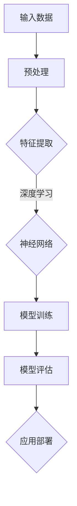

                 

### 第1章 AI大模型概述

#### 1.1 AI大模型的基本概念

**AI大模型**指的是那些训练数据量庞大、参数规模巨大的深度学习模型，它们通常具有极强的学习能力，可以在多种复杂任务中取得优异的性能。这些模型通常基于神经网络架构，例如Transformer、BERT和GPT等。

大模型在AI中的地位和作用不可低估。首先，大模型能够通过大量的数据训练，自动学习并提取数据中的复杂模式和关系，从而在语音识别、图像识别、自然语言处理等任务中表现出色。其次，大模型能够进行端到端的任务处理，减少了中间环节的需求，提高了整体效率。此外，大模型的可解释性也在逐渐提高，使其在实际应用中更具可靠性。

**核心概念与联系**：
- **深度学习**：深度学习是一种机器学习方法，通过构建多层神经网络来模拟人脑的决策过程，实现对数据的自动特征提取和模式识别。
- **神经网络**：神经网络由大量简单的神经元组成，通过层层传递输入信息，实现复杂任务的求解。
- **Transformer**：Transformer是一种基于自注意力机制的深度学习模型，特别适用于序列到序列的映射任务，如机器翻译、文本生成等。

**Mermaid流程图**：

#### 1.1.1 大模型在AI中的地位与作用

**大模型在AI中的地位**：

1. **核心驱动力**：大模型的出现是AI技术发展的重要里程碑，它们代表了当前AI技术的最高水平。无论是在图像识别、语音识别还是自然语言处理领域，大模型都展现了其强大的处理能力。

2. **突破传统局限**：传统AI模型往往依赖于人工设计特征，而大模型则通过自动从数据中学习特征，解决了特征工程的问题，使得AI系统在处理复杂任务时更加高效。

3. **推动行业进步**：大模型的应用不仅在学术界取得显著成果，也在工业界得到了广泛认可，推动了各个行业的智能化升级。

**大模型在AI中的作用**：

1. **提升准确率**：大模型通过深度学习和大规模数据训练，可以显著提升模型在各类任务中的准确率，例如在图像分类任务中，大模型可以识别出更多细微的特征差异。

2. **提高泛化能力**：大模型具有更强的泛化能力，能够在不同的数据集和应用场景中保持良好的性能，减少了模型在不同环境下的调优需求。

3. **自动化与智能化**：大模型可以实现自动化和智能化，降低了对人工干预的依赖，提高了运营效率和用户体验。

#### 1.1.2 大模型的发展历程

**早期发展**：

1. **20世纪80年代**：神经网络的研究开始兴起，Hopfield网络和Backpropagation算法的出现，为神经网络的发展奠定了基础。

2. **20世纪90年代**：虽然神经网络在理论上具有潜力，但由于计算资源和数据量的限制，其应用受到很大限制。

**快速发展**：

1. **2006年**：Hinton等人的论文《A Fast Learning Algorithm for Deep Belief Nets》提出了深度信念网（DBN），标志着深度学习的复兴。

2. **2012年**：AlexNet在ImageNet竞赛中取得突破性成果，使深度学习在图像识别领域得到了广泛应用。

**现状与未来**：

1. **现状**：目前，大模型如BERT、GPT-3等已经成为AI领域的热点，它们在自然语言处理、计算机视觉等领域取得了显著成果。

2. **未来**：随着计算能力的提升和大数据技术的发展，大模型将继续在AI领域发挥重要作用，推动人工智能的发展。未来的大模型可能会更加智能化、自适应，能够更好地处理多模态数据。

#### 1.2 大模型的类型与应用领域

**自然语言处理领域**：

1. **语言模型**：如GPT和BERT，用于生成文本、翻译和问答等任务。

2. **文本分类**：用于对文本数据分类，如情感分析、主题分类等。

3. **命名实体识别**：用于识别文本中的特定实体，如人名、地名、组织名等。

**计算机视觉领域**：

1. **图像分类**：用于对图像进行分类，如人脸识别、物体识别等。

2. **目标检测**：用于定位图像中的目标，并对其进行分类。

3. **图像生成**：用于生成新的图像，如风格迁移、图像合成等。

**语音识别领域**：

1. **语音识别**：用于将语音转换为文本，如语音助手、语音输入等。

2. **语音合成**：用于将文本转换为语音，如电话语音、语音播放等。

**大模型的应用前景**：

1. **提高运营效率**：大模型可以通过自动化、智能化的方式，提高企业在营销、客户服务、供应链管理、人力资源管理等方面的效率。

2. **创新业务模式**：大模型可以帮助企业探索新的业务模式，如基于大数据的个性化推荐、智能客服、智能供应链管理等。

3. **降低运营成本**：大模型可以替代部分人工操作，降低运营成本，提高企业的竞争力。

4. **提升用户体验**：大模型可以提供更加智能、个性化的服务，提升用户体验，增加用户粘性。

#### 1.3 大模型应用中的挑战与机遇

**挑战**：

1. **数据隐私**：大模型对数据的需求巨大，如何保护用户隐私成为一个重要挑战。

2. **计算资源**：大模型的训练和推理需要大量的计算资源，对硬件设施的要求较高。

3. **模型解释性**：大模型通常较为复杂，如何解释其决策过程是一个挑战。

**机遇**：

1. **技术创新**：大模型的发展带动了相关技术的创新，如深度学习、自然语言处理、计算机视觉等。

2. **行业应用**：大模型在各个行业的应用日益广泛，为企业提供了新的解决方案。

3. **人才培养**：大模型的发展需要大量专业人才，为相关领域的人才培养提供了机会。

---

**摘要**：

本章首先介绍了AI大模型的基本概念、在AI中的地位和作用，以及其发展历程。随后，我们详细探讨了不同类型的大模型及其应用领域，包括自然语言处理、计算机视觉和语音识别。此外，本章还讨论了大模型在营销、客户服务、供应链管理和人力资源管理中的应用前景，以及其在实际应用中面临的挑战和机遇。通过本章的阅读，读者可以全面了解AI大模型的基础知识，为后续章节的学习和应用打下坚实的基础。

