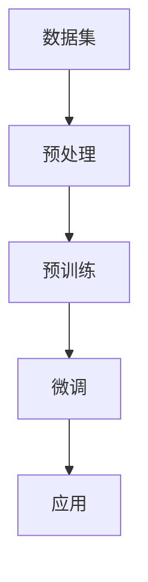
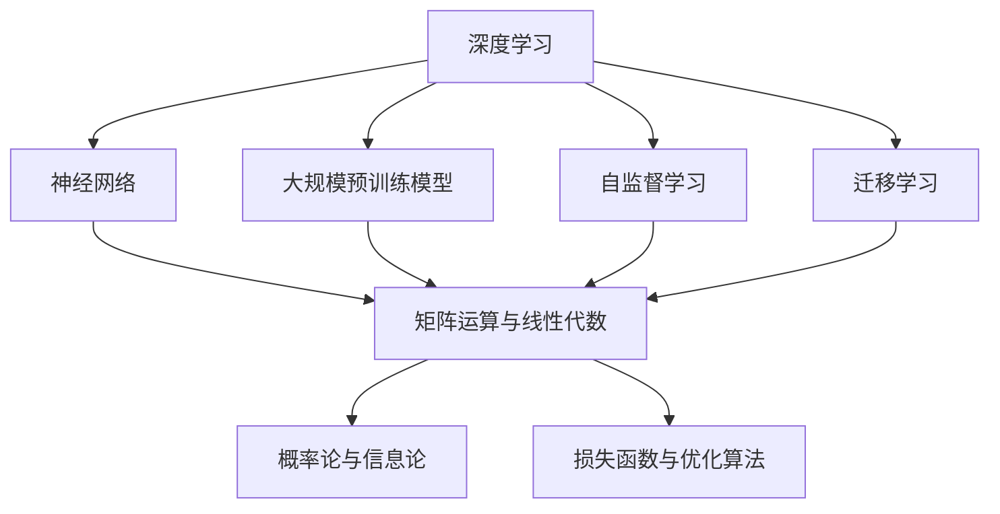
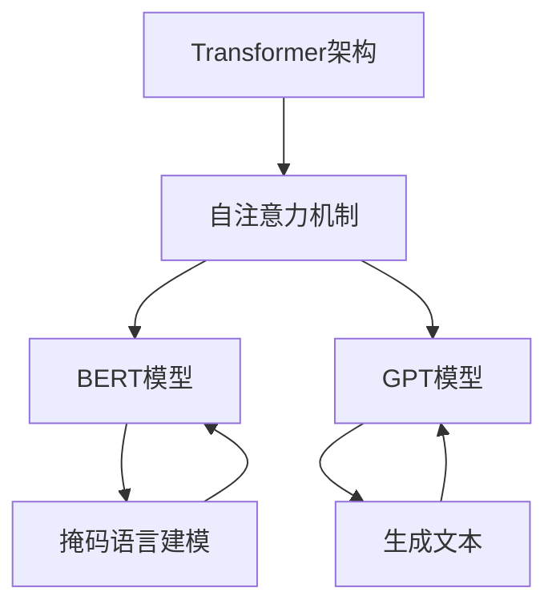
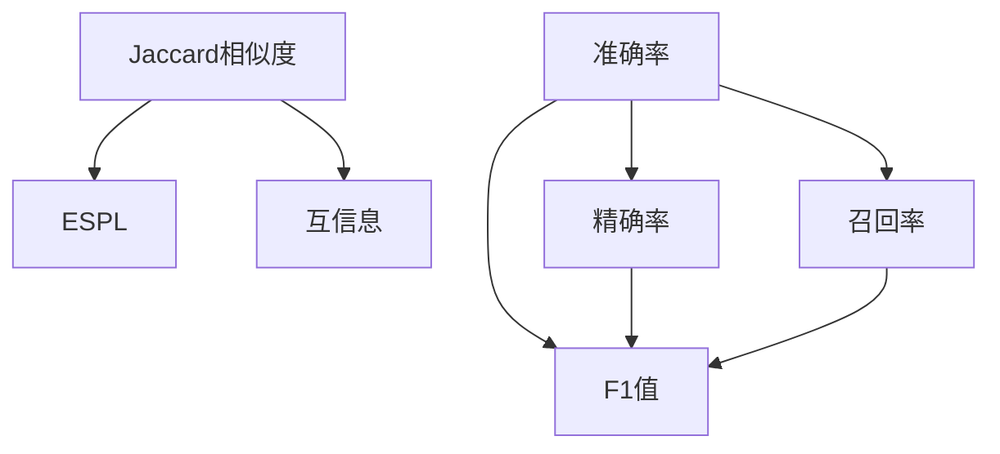
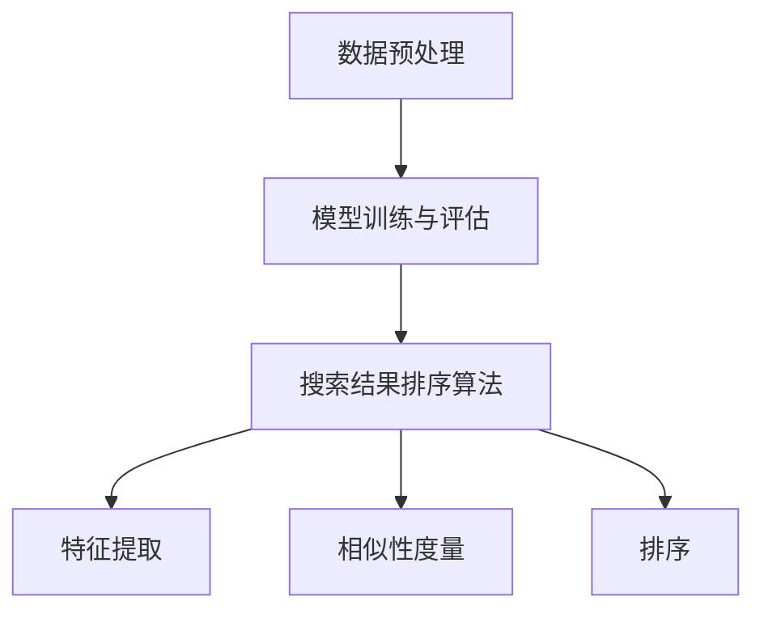
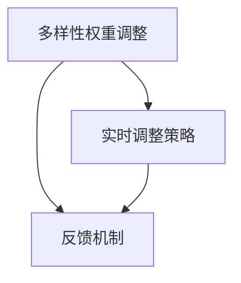
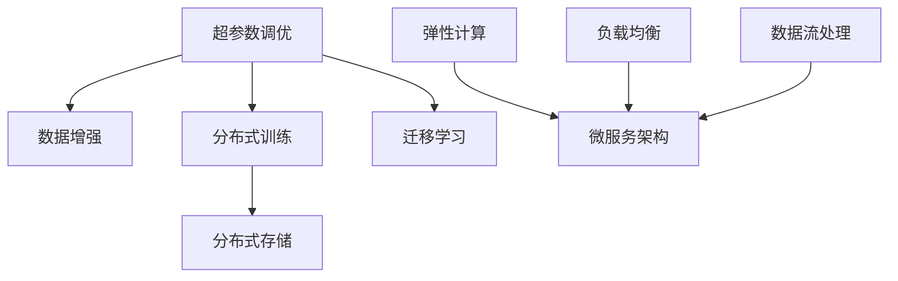
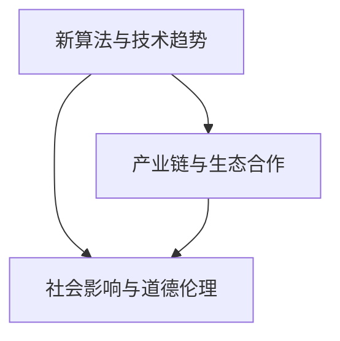

                 

### 引言与核心概念

在数字化时代的今天，电商平台已经成为消费者购买商品的主要渠道之一。随着电商平台的快速发展和消费者需求的日益多样化，如何提供高效、精准的搜索结果成为了电商平台亟需解决的问题。而AI大模型技术的崛起，为解决这一难题提供了新的思路和可能性。

#### 1.1 AI大模型的基本概念

**1.1.1 AI大模型的定义**

AI大模型（Large-scale Artificial Intelligence Model），通常指的是那些具有数十亿参数的深度学习模型。这些模型通过在海量数据上进行训练，能够捕捉到复杂的数据模式和潜在关系，从而实现强大的特征提取和知识表示能力。

**1.1.2 AI大模型的特点**

- **参数规模巨大**：AI大模型拥有数亿甚至数十亿个参数，这使得它们能够处理大量复杂数据。
- **学习能力强大**：通过大规模预训练和微调，AI大模型能够从海量数据中学习，并适应不同的任务和领域。
- **通用性强**：AI大模型不仅能够在图像、语音等特定领域表现出色，还可以在多种不同任务上应用，具有跨领域的通用性。

**1.1.3 AI大模型与传统机器学习的区别**

- **训练数据量**：传统机器学习模型通常使用数千甚至数万个样本进行训练，而AI大模型则使用数百万甚至数十亿个样本。
- **模型复杂度**：传统机器学习模型的结构相对简单，而AI大模型的结构更为复杂，能够捕捉到更细微的特征。
- **计算资源需求**：AI大模型需要更多的计算资源和存储空间，这使得它们的训练和部署成本较高。

**1.1.4 AI大模型的发展历程**

AI大模型的发展可以追溯到20世纪80年代，当时神经网络的研究刚刚起步。随着计算能力的提升和大数据技术的发展，特别是在2012年AlexNet在ImageNet竞赛中取得的突破性成果，AI大模型开始受到广泛关注。近年来，随着Transformer架构的提出和BERT、GPT等模型的广泛应用，AI大模型的技术和应用取得了显著的进展。

#### 1.2 电商平台搜索结果的问题与挑战

**1.2.1 搜索结果多样性与相关性的矛盾**

电商平台搜索结果多样性与相关性的平衡一直是一个重要问题。用户期望看到丰富的搜索结果以满足他们的个性化需求，但同时也希望搜索结果能够高度相关，以便快速找到他们想要的产品。然而，多样性和相关性往往是相互矛盾的。过于注重多样性可能导致搜索结果相关性下降，而过于关注相关性则可能限制结果的多样性。

**1.2.2 当前解决方案的不足**

当前，电商平台主要采用基于关键词匹配和相关性排序的搜索算法来优化搜索结果。这些算法在一定程度上能够提高搜索结果的准确性，但在多样性和相关性之间难以实现动态平衡。此外，这些算法在处理长尾搜索词和用户个性化需求时效果不佳。

**1.2.3 AI大模型在搜索结果优化中的潜力**

AI大模型具有强大的特征提取和知识表示能力，能够更好地理解用户搜索意图和产品属性。通过大规模预训练和自适应学习，AI大模型可以在多样性和相关性之间实现动态平衡，从而提供更高质量、更个性化的搜索结果。这使得AI大模型在电商平台搜索优化中具有巨大的潜力。

### 总结

本部分介绍了AI大模型的基本概念、特点及其与传统机器学习的区别，并探讨了电商平台搜索结果多样性与相关性的矛盾以及当前解决方案的不足。下一部分将深入探讨AI大模型的基础原理和算法架构，为后续应用提供理论基础。

### Mermaid 流程图

以下是AI大模型的基础原理流程图：



### 1.1.1 AI大模型的定义

AI大模型（Large-scale Artificial Intelligence Model）是指那些拥有数十亿甚至数万亿参数的深度学习模型。这些模型通过在海量数据上进行训练，能够自动学习并提取复杂的特征和模式。AI大模型通常是基于神经网络架构，特别是深度神经网络（DNN），其结构包括多层神经元，每层神经元通过权重连接形成复杂的网络结构。

AI大模型的基本组成单元是神经元，每个神经元接收多个输入信号，并通过激活函数进行非线性变换，最后产生输出信号。这些输出信号再作为下一层神经元的输入，层层传递，最终得到模型的预测结果。

AI大模型的核心特点是其规模巨大。传统的机器学习模型通常包含数百万至数千万的参数，而AI大模型则包含数十亿至数万亿的参数。这意味着AI大模型具有更强的学习和表示能力，能够从大规模数据中提取更复杂的特征，并在各种任务上表现出优异的性能。

例如，著名的Transformer架构及其变体BERT、GPT等，都是典型的AI大模型。这些模型通过大规模预训练和精细调优，能够在自然语言处理、计算机视觉、语音识别等领域取得突破性成果。

### 1.1.2 AI大模型的特点

**1. 参数规模巨大**

AI大模型拥有数十亿乃至数千亿的参数，这使得它们能够处理大量复杂数据。例如，BERT模型包含超过3.4亿个参数，GPT-3则拥有1750亿个参数。这些大规模参数使得AI大模型能够捕捉到数据中的微妙模式和关联，从而在各类任务中表现出色。

**2. 学习能力强大**

AI大模型通过大规模预训练和精细调优，能够从海量数据中学习，并适应不同的任务和领域。这种强大的学习能力源于其复杂的网络结构和巨大的参数规模。例如，GPT-3可以在不同的自然语言处理任务上表现出优异的性能，包括文本生成、机器翻译、问答系统等。

**3. 通用性强**

AI大模型不仅在特定领域（如图像识别、自然语言处理等）表现出色，还可以跨领域应用。这种通用性使得AI大模型成为许多任务的重要工具。例如，BERT不仅适用于文本分类、情感分析等自然语言处理任务，还可以用于问答系统、信息检索等任务。

**4. 自动化与半自动化**

AI大模型能够自动化处理大量数据，从数据预处理到模型训练和优化，都可以通过自动化工具实现。此外，AI大模型还可以通过半自动化方式，如数据增强、自动化超参数调优等，进一步提高模型性能。

**5. 持续学习与适应**

AI大模型具有持续学习和适应能力。通过不断接收新的数据和反馈，AI大模型能够不断优化自身，提高模型性能。例如，GPT-3可以通过持续接收新的文本数据，不断改进其生成文本的质量。

### 1.1.3 AI大模型与传统机器学习的区别

**1. 训练数据量**

传统机器学习模型通常使用数千甚至数万个样本进行训练，而AI大模型则使用数百万甚至数十亿个样本。这种大规模数据训练使得AI大模型能够从海量数据中学习，提取更复杂的特征，从而在各类任务中取得更好的性能。

**2. 模型复杂度**

传统机器学习模型的结构相对简单，通常包括几层到几十层神经元。而AI大模型的结构更为复杂，包含数十层甚至上百层神经元。这种复杂的网络结构使得AI大模型能够捕捉到数据中的更多细节和关联。

**3. 计算资源需求**

AI大模型需要更多的计算资源和存储空间，这使得它们的训练和部署成本较高。传统机器学习模型通常可以在普通计算机上训练，而AI大模型则需要高性能计算集群和GPU支持。

**4. 学习效率**

AI大模型由于具有更大的参数规模和复杂的网络结构，通常需要更长的训练时间。但是，随着大规模数据和高性能计算资源的投入，AI大模型的学习效率相对较高，能够更快地收敛到最优解。

### 1.1.4 AI大模型的发展历程

AI大模型的发展历程可以追溯到20世纪80年代。当时，神经网络的研究刚刚起步，学者们开始探索如何通过多层神经元结构来模拟人类大脑的思考过程。

1. **早期探索**（1980s - 1990s）

在20世纪80年代，人工神经网络（ANN）逐渐成为一种重要的机器学习技术。当时，研究者开始提出多层感知器（MLP）等简单的神经网络结构。然而，由于计算能力的限制，这些模型的规模相对较小，无法处理大规模数据。

2. **第一次高潮**（1990s - 2000s）

在20世纪90年代，随着计算能力的提升，神经网络的研究逐渐进入高潮。1997年，研究者在机器博弈领域取得了突破性成果，开发出具有复杂网络结构的神经网络系统。同时，支持向量机（SVM）等传统机器学习方法也取得了显著进展。

3. **沉寂期**（2000s）

尽管神经网络在20世纪90年代取得了一定的进展，但由于过拟合问题、训练时间过长以及计算资源限制，神经网络的研究在21世纪初进入了一个相对沉寂的时期。此时，传统机器学习方法，如SVM和随机森林等，成为了主流。

4. **复兴期**（2010s）

随着计算能力的进一步提升和大数据技术的发展，神经网络的研究再次迎来了复兴。特别是2012年，研究者提出深度卷积神经网络（CNN）并在ImageNet图像识别竞赛中取得了显著成果。这一突破性进展激发了研究者对深度学习的兴趣。

5. **大模型时代**（2010s - 至今）

在2010年代，研究者开始提出和训练大规模深度学习模型，如BERT、GPT等。这些模型具有数十亿甚至数万亿个参数，能够处理海量数据并取得优异的性能。随着Transformer架构的提出和广泛应用，AI大模型进入了一个全新的时代。

### 1.2 电商平台搜索结果的问题与挑战

电商平台搜索结果多样性与相关性的矛盾一直是一个重要问题。用户在搜索商品时，既希望看到丰富的搜索结果以满足他们的多样化需求，又希望搜索结果高度相关，以便快速找到他们想要的产品。然而，多样性和相关性往往是相互矛盾的。

一方面，过于注重多样性可能导致搜索结果的相关性下降。例如，如果搜索结果包含大量不同的商品，用户可能需要花费更多时间来筛选和比较，从而降低了搜索体验。另一方面，过于关注相关性则可能限制搜索结果的多样性。例如，如果搜索结果只包含高度相关的商品，用户可能会感到搜索结果不够丰富，无法满足他们的个性化需求。

为了解决这一矛盾，电商平台需要平衡多样性和相关性，为用户提供既丰富又相关的搜索结果。然而，当前主流的搜索算法在实现这一目标上存在一定的局限性。

首先，基于关键词匹配和相关性排序的搜索算法在提高搜索结果相关性的同时，往往忽略了多样性的重要性。这些算法主要通过计算关键词的相似度来评估搜索结果的的相关性，从而对结果进行排序。然而，这种方法往往会导致搜索结果高度集中，缺乏多样性。

其次，基于用户历史行为和偏好数据的个性化搜索算法在提高多样性的同时，也可能降低搜索结果的相关性。这些算法通过分析用户的历史购买记录、搜索历史等数据，来预测用户可能的兴趣点，并将相关的商品推荐给用户。然而，这种方法可能会导致用户接收到的搜索结果过于单一，缺乏新的发现。

此外，长尾搜索词和用户个性化需求也是当前搜索算法面临的挑战。长尾搜索词通常指的是那些搜索量较小、但用户需求多样化的关键词。对于这些关键词，传统的搜索算法往往难以提供丰富的搜索结果。而个性化搜索算法在处理这些关键词时，也容易出现过度拟合的问题，导致搜索结果不够多样。

综上所述，电商平台在提供搜索结果时，需要在多样性和相关性之间实现动态平衡。这需要开发更加智能、自适应的搜索算法，以充分满足用户的多样化需求。

### 1.2.2 当前解决方案的不足

尽管电商平台在搜索结果优化方面做出了一些努力，但现有的解决方案仍然存在诸多不足，难以完全满足用户对多样性和相关性的双重需求。

首先，基于关键词匹配的搜索算法虽然能够提供较为精准的结果，但在多样性和个性推荐的平衡上表现不佳。这些算法主要依赖于用户输入的关键词，通过统计关键词在商品标题、描述中的出现频率来计算相似度，从而进行排序。这种方法往往导致搜索结果集中，无法满足用户多样化的需求。

其次，基于用户历史行为数据的个性化搜索算法虽然在提升相关性方面有一定的优势，但也存在明显的局限性。这类算法通过分析用户的购买记录、浏览历史等数据，预测用户的兴趣点，并将相关性高的商品推送给用户。然而，这种方法容易导致用户接收到重复的、单一化的搜索结果，缺乏新鲜感和惊喜感。

此外，现有的搜索引擎在处理长尾搜索词和用户个性化需求方面也存在挑战。长尾搜索词通常指的是那些搜索量较小但用户需求多样化的关键词。对于这些关键词，传统的搜索引擎往往难以提供丰富的搜索结果。而个性化搜索算法在处理这些关键词时，容易出现过度拟合的问题，导致搜索结果不够多样。

此外，当前搜索算法在实时性方面也存在一定的不足。电商平台用户的需求是动态变化的，需要实时调整搜索结果。然而，现有的算法通常在数据更新和结果反馈之间存在时间滞后，无法及时响应用户的最新需求。

综上所述，当前电商平台搜索结果优化方案在多样性和相关性平衡、长尾搜索词处理、实时性等方面存在明显的不足，需要进一步改进和创新。

### 1.2.3 AI大模型在搜索结果优化中的潜力

AI大模型在搜索结果优化中具有巨大的潜力，这主要归功于其强大的特征提取和知识表示能力。首先，AI大模型能够通过大规模预训练从海量数据中自动学习，提取出丰富的语义特征。这些特征不仅包括商品属性（如价格、品牌、类别等），还包括用户行为特征（如搜索历史、购买记录等）。通过这些特征，AI大模型能够更准确地理解用户意图和商品属性，从而提供更高质量的搜索结果。

其次，AI大模型具备强大的自适应能力。它们可以通过微调和重新训练，快速适应不同的搜索环境和用户需求。例如，当用户搜索特定品牌的产品时，AI大模型可以通过调整模型权重，优先展示相关品牌的产品，从而提高搜索结果的关联性。而当用户搜索长尾关键词时，AI大模型可以通过利用丰富的语义特征，为用户提供多样化的搜索结果。

此外，AI大模型在实时性方面也具有显著优势。传统的搜索算法通常在数据更新和结果反馈之间存在时间滞后，而AI大模型可以通过实时更新用户数据和搜索意图，快速调整搜索结果，提供更及时的搜索体验。

综上所述，AI大模型在搜索结果优化中具有以下优势：

1. **高效的特征提取与知识表示能力**：AI大模型能够从海量数据中提取出丰富的语义特征，为用户提供高质量的搜索结果。
2. **强大的自适应能力**：AI大模型能够根据不同的搜索环境和用户需求，动态调整搜索结果，实现多样性与相关性的动态平衡。
3. **实时性**：AI大模型能够实时更新用户数据和搜索意图，提供更及时的搜索结果。

这些优势使得AI大模型成为电商平台搜索结果优化的理想选择，有望在未来解决多样性与相关性之间的矛盾，提升用户搜索体验。

### 1.3 总结

本部分首先介绍了AI大模型的基本概念、特点及其与传统机器学习的区别，并探讨了其发展历程。接着，我们分析了电商平台搜索结果多样性与相关性的矛盾以及当前解决方案的不足。最后，我们讨论了AI大模型在搜索结果优化中的潜力，展示了其在特征提取、自适应能力和实时性方面的优势。下一部分将深入探讨AI大模型的原理和算法架构，为后续应用提供更深入的理论基础。

---

**文章关键词：**

- AI大模型
- 深度学习
- 电商平台
- 搜索结果优化
- 多样性
- 相关性
- Transformer架构
- BERT
- GPT

---

**文章摘要：**

本文首先介绍了AI大模型的基本概念、特点及其与传统机器学习的区别，并探讨了其发展历程。接着，我们分析了电商平台搜索结果多样性与相关性的矛盾以及当前解决方案的不足。随后，我们讨论了AI大模型在搜索结果优化中的潜力，详细介绍了其特征提取、自适应能力和实时性方面的优势。本文旨在通过深入探讨AI大模型的原理和算法架构，为电商平台搜索优化提供新的思路和解决方案。

---

接下来，我们将深入探讨AI大模型的基础原理和算法架构，包括深度学习与神经网络、大规模预训练模型、自监督学习和迁移学习等内容。

### 2.1 AI大模型的基础原理

AI大模型的基础原理主要涉及深度学习、神经网络、大规模预训练模型、自监督学习和迁移学习等内容。这些概念构成了AI大模型的核心，并决定了其强大的特征提取和知识表示能力。

#### 2.1.1 深度学习与神经网络

深度学习（Deep Learning）是一种机器学习方法，其核心思想是通过多层神经网络（Neural Network）对数据进行建模和学习。与传统的机器学习方法相比，深度学习能够自动从数据中提取高层次的抽象特征，从而实现更复杂的任务。

**神经网络**是由大量神经元（或节点）组成的计算模型，这些神经元通过权重连接形成网络结构。每个神经元接收多个输入信号，并通过激活函数进行非线性变换，最后产生输出信号。网络中的权重和激活函数共同决定了神经网络的复杂性和表现力。

深度神经网络（Deep Neural Network，DNN）是深度学习的核心组件，其结构包括多层神经元。每层神经元接收前一层的输出作为输入，并传递到下一层。这种层层传递的过程使得深度神经网络能够捕捉到数据中的复杂模式和关联。

#### 2.1.2 大规模预训练模型

大规模预训练模型（Large-scale Pre-trained Model）是AI大模型的关键组成部分。其基本思想是首先在大量未标注的数据上进行预训练，然后利用预训练模型在特定任务上进行微调（Fine-tuning）。

**预训练**是指在一个大规模数据集上对模型进行训练，从而使其学习到通用的特征表示。预训练数据集通常包括互联网上的文本、图像、语音等数据，这些数据包含了丰富的信息，有助于模型学习到复杂的特征。

**微调**是指在预训练模型的基础上，利用少量标注数据进行任务特定的训练。微调的过程使得预训练模型能够适应特定的任务，并在特定领域内表现出优异的性能。

大规模预训练模型的核心优势在于其能够通过预训练学习到丰富的特征表示，从而在多个任务上实现迁移学习。迁移学习（Transfer Learning）是指将预训练模型的知识应用到新的任务中，从而提高模型在新任务上的表现。这种迁移能力使得大规模预训练模型在自然语言处理、计算机视觉等领域的应用变得广泛。

#### 2.1.3 自监督学习与迁移学习

自监督学习（Self-supervised Learning）是一种无需人工标注数据即可进行训练的学习方法。其基本思想是从数据中自动提取标签，从而实现无监督学习。自监督学习在预训练过程中起到了关键作用，它使得大规模预训练模型能够从海量未标注数据中学习到有效的特征表示。

**迁移学习**是将已在一个任务上训练好的模型（预训练模型）应用到另一个相关任务中。迁移学习能够显著减少新任务所需的标注数据量，并提高模型在新任务上的性能。大规模预训练模型通过预训练阶段积累了丰富的特征表示，这些特征表示可以迁移到多个不同的任务中，从而提高模型的泛化能力。

#### 2.1.4 大规模预训练模型的代表模型

以下是一些大规模预训练模型的代表：

- **BERT（Bidirectional Encoder Representations from Transformers）**：BERT是一种双向Transformer模型，通过在大量文本数据上进行预训练，学习到丰富的语言表示。BERT在自然语言处理任务上取得了显著的成果。

- **GPT（Generative Pre-trained Transformer）**：GPT是一种基于Transformer架构的生成模型，通过在大量文本数据上进行预训练，学习到语言的生成规律。GPT在文本生成、问答系统等任务上表现出色。

- **T5（Text-To-Text Transfer Transformer）**：T5是一种通用的文本转换模型，其目标是将任意文本映射到另一个文本。T5通过在大量文本数据上进行预训练，实现了在多个自然语言处理任务上的优异表现。

- **ViT（Vision Transformer）**：ViT是一种基于Transformer架构的计算机视觉模型，通过在大量图像数据上进行预训练，学习到丰富的图像特征。ViT在图像分类、目标检测等任务上取得了突破性成果。

这些大规模预训练模型通过预训练和迁移学习，展示了强大的特征提取和知识表示能力，为AI大模型的发展奠定了基础。

### 2.2 AI大模型的算法架构

AI大模型的算法架构主要涉及Transformer架构、BERT、GPT等模型，这些模型通过不同的结构和优化方法，实现了强大的特征提取和知识表示能力。

#### 2.2.1 Transformer架构

Transformer架构是一种基于自注意力机制的序列模型，最早由Vaswani等人在2017年提出。与传统的循环神经网络（RNN）和卷积神经网络（CNN）相比，Transformer架构在处理长序列数据时具有显著的优势。

**自注意力机制**（Self-Attention）是Transformer架构的核心组件，其基本思想是每个位置的输出都取决于序列中所有其他位置的输出。自注意力机制通过计算不同位置之间的相似性，对输入序列进行加权融合，从而捕捉到序列中的长距离依赖关系。

**多头注意力**（Multi-head Attention）是自注意力机制的一种扩展。多头注意力通过将输入序列分解为多个子序列，并分别进行自注意力计算，从而提高了模型的表示能力。

**编码器-解码器结构**（Encoder-Decoder）是Transformer架构的典型应用。编码器（Encoder）负责编码输入序列，解码器（Decoder）则负责解码输出序列。编码器和解码器分别由多个Transformer层堆叠而成，每层都包含多头注意力机制和前馈神经网络。

#### 2.2.2 BERT、GPT等模型详解

BERT（Bidirectional Encoder Representations from Transformers）是一种基于Transformer架构的双向编码器模型，由Google在2018年提出。BERT通过在大量文本数据上进行预训练，学习到丰富的语言表示。

BERT的预训练任务包括两个部分：Masked Language Modeling（MLM）和Next Sentence Prediction（NSP）。Masked Language Modeling任务是通过随机掩码输入文本中的部分单词，训练模型预测这些被掩码的单词。Next Sentence Prediction任务是通过预测两个句子是否在原始文本中相邻，增强模型对句子之间关系的理解。

BERT模型由多个Transformer层堆叠而成，每层包含自注意力机制和前馈神经网络。BERT通过预训练和微调，在各种自然语言处理任务上取得了优异的性能。

GPT（Generative Pre-trained Transformer）是一种基于Transformer架构的生成模型，由OpenAI在2018年提出。GPT通过在大量文本数据上进行预训练，学习到语言的生成规律。

GPT的预训练任务包括语言建模（Language Modeling），即预测下一个单词。GPT通过逐步增加模型层数和参数数量，实现了强大的生成能力。GPT在文本生成、问答系统等任务上表现出色。

T5（Text-To-Text Transfer Transformer）是一种通用的文本转换模型，由DeepMind在2020年提出。T5的目标是将任意文本映射到另一个文本。T5通过在大量文本数据上进行预训练，实现了在多个自然语言处理任务上的优异表现。

T5采用编码器-解码器结构，输入和输出都采用相同的Transformer模型。T5通过预训练和微调，实现了对文本的多种转换任务，如问答、机器翻译、文本摘要等。

ViT（Vision Transformer）是一种基于Transformer架构的计算机视觉模型，由Google在2020年提出。ViT通过在大量图像数据上进行预训练，学习到丰富的图像特征。

ViT将图像分割为多个块（Patch），并将每个块作为输入序列。ViT通过多个Transformer层堆叠，实现图像特征的提取和表示。ViT在图像分类、目标检测等任务上取得了突破性成果。

#### 2.2.3 模型优化与调参技巧

模型优化与调参是AI大模型训练过程中至关重要的一环。以下是一些常见的优化与调参技巧：

- **学习率调度**：学习率是模型训练过程中调整权重的重要参数。常用的学习率调度方法包括线性衰减、余弦衰减、指数衰减等。

- **批量大小**：批量大小影响模型训练的稳定性和效率。较小的批量大小有助于提高模型的泛化能力，但训练时间较长；较大的批量大小有助于加快训练速度，但可能导致模型过拟合。

- **正则化**：正则化是一种防止模型过拟合的方法。常用的正则化方法包括L1正则化、L2正则化、Dropout等。

- **数据增强**：数据增强是通过生成新的样本来扩充训练数据集。常用的数据增强方法包括随机裁剪、旋转、翻转、颜色变换等。

- **预训练与微调**：预训练是在大规模未标注数据上进行训练，学习到通用的特征表示；微调是在预训练模型的基础上，利用少量标注数据进行任务特定的训练。

- **模型压缩**：模型压缩是通过减少模型参数数量来降低模型的计算复杂度和存储需求。常用的模型压缩方法包括剪枝、量化、知识蒸馏等。

通过合理的优化与调参技巧，可以显著提高AI大模型的性能和泛化能力，从而在各类任务中取得更好的效果。

### 2.3 AI大模型的数学基础

AI大模型的数学基础涉及矩阵运算、线性代数、概率论、信息论、损失函数与优化算法等多个方面。这些数学工具和方法为AI大模型的设计、实现和优化提供了重要的理论基础。

#### 2.3.1 矩阵运算与线性代数

矩阵运算是AI大模型中的基本操作。矩阵可以通过矩阵乘法、矩阵加法、矩阵转置等操作进行组合。以下是一些常见的矩阵运算：

- **矩阵乘法**：两个矩阵相乘得到一个新的矩阵。矩阵乘法的规则是每个元素等于两个对应行和列的元素乘积之和。
  
  $$ C = AB $$

- **矩阵加法**：两个矩阵相加得到一个新的矩阵。矩阵加法的规则是对应元素相加。
  
  $$ C = A + B $$

- **矩阵转置**：将矩阵的行和列互换得到一个新的矩阵。
  
  $$ C^T = (AB)^T = B^T A^T $$

线性代数是矩阵运算的理论基础。以下是一些重要的线性代数概念：

- **矩阵的秩**：矩阵的秩是矩阵中线性无关的行或列的最大数量。
  
- **矩阵的行列式**：矩阵的行列式是一个标量，用于判断矩阵的可逆性。如果矩阵的行列式不为零，则矩阵可逆。

- **矩阵的逆**：矩阵的逆是一个矩阵，与原矩阵相乘得到单位矩阵。

  $$ A^{-1}A = AA^{-1} = I $$

- **特征值与特征向量**：特征值和特征向量是矩阵的一个重要性质。特征值是矩阵的特征多项式的根，特征向量是满足线性方程组的向量。

  $$ Av = \lambda v $$

#### 2.3.2 概率论与信息论

概率论和信息论是AI大模型中的重要数学工具。以下是一些基本概念：

- **概率分布**：概率分布描述了一个随机变量取不同值的概率。常见的概率分布包括伯努利分布、正态分布、泊松分布等。

- **条件概率**：条件概率是指在已知一个事件发生的条件下，另一个事件发生的概率。

  $$ P(A|B) = \frac{P(A \cap B)}{P(B)} $$

- **贝叶斯定理**：贝叶斯定理是一种用于计算后验概率的公式，它将先验概率和观测数据结合起来。

  $$ P(A|B) = \frac{P(B|A)P(A)}{P(B)} $$

- **熵**：熵是衡量随机变量不确定性的度量。在信息论中，熵表示信息的熵。

  $$ H(X) = -\sum_{i} P(X_i) \log_2 P(X_i) $$

- **信息增益**：信息增益是衡量一个特征对分类的重要性的度量。信息增益等于原始熵和条件熵之差。

  $$ I(X;Y) = H(Y) - H(Y|X) $$

#### 2.3.3 损失函数与优化算法

损失函数是评估模型预测结果和真实标签之间差异的函数。常见的损失函数包括均方误差（MSE）、交叉熵损失（Cross-Entropy Loss）、Hinge损失等。

- **均方误差（MSE）**：均方误差是预测值和真实值之间差的平方的平均值。

  $$ MSE = \frac{1}{n} \sum_{i=1}^{n} (y_i - \hat{y}_i)^2 $$

- **交叉熵损失（Cross-Entropy Loss）**：交叉熵损失是用于分类问题的损失函数，它表示预测分布和真实分布之间的差异。

  $$ Cross-Entropy Loss = -\sum_{i} y_i \log \hat{y}_i $$

- **Hinge损失**：Hinge损失通常用于支持向量机（SVM）等优化问题，它表示预测值和真实值之间的差距。

  $$ Hinge Loss = \max(0, 1 - y_i \hat{y}_i) $$

优化算法是用于最小化损失函数的方法。以下是一些常见的优化算法：

- **梯度下降（Gradient Descent）**：梯度下降是一种最简单的优化算法，它通过计算损失函数的梯度并沿着梯度方向更新模型参数。

  $$ \theta = \theta - \alpha \nabla_\theta J(\theta) $$

- **随机梯度下降（Stochastic Gradient Descent，SGD）**：随机梯度下降是梯度下降的一种变体，它每次更新参数时只随机选择一部分数据。

  $$ \theta = \theta - \alpha \nabla_\theta J(\theta; x_i, y_i) $$

- **Adam优化器**：Adam优化器是一种结合了梯度下降和动量的优化算法，它通过计算一阶矩估计（均值）和二阶矩估计（方差）来更新参数。

  $$ m_t = \beta_1 m_{t-1} + (1 - \beta_1) [g_t] $$
  $$ v_t = \beta_2 v_{t-1} + (1 - \beta_2) [g_t]^2 $$
  $$ \theta_t = \theta_{t-1} - \alpha \frac{m_t}{\sqrt{v_t} + \epsilon} $$

通过合理选择和调整优化算法，可以显著提高AI大模型的训练效率和性能。

### 2.4 总结

本部分详细介绍了AI大模型的基础原理，包括深度学习、神经网络、大规模预训练模型、自监督学习和迁移学习等内容。我们探讨了矩阵运算与线性代数、概率论与信息论、损失函数与优化算法等数学基础。这些原理和算法构成了AI大模型的核心，为后续应用提供了理论基础。下一部分将探讨如何利用AI大模型改进电商平台搜索结果多样性与相关性动态平衡。

---

**核心概念与联系：**

AI大模型的基础原理包括深度学习与神经网络、大规模预训练模型、自监督学习和迁移学习等内容。这些原理通过矩阵运算与线性代数、概率论与信息论、损失函数与优化算法等数学基础相联系，共同构成了AI大模型的核心。以下是一个简单的Mermaid流程图，展示这些核心概念之间的联系：



### 2.5 核心算法原理讲解

在了解了AI大模型的基础原理后，接下来我们将详细探讨其核心算法原理，包括Transformer架构、BERT、GPT等模型的工作原理，以及如何通过伪代码和数学公式来阐述这些算法的核心思想。

#### 2.5.1 Transformer架构

Transformer架构是一种基于自注意力机制的序列模型，它在处理长序列数据时具有显著的优势。以下是一个简化的伪代码，展示Transformer的基本工作原理：

```python
# 输入序列
inputs = [x1, x2, x3, ..., xn]

# 预处理步骤
inputs_embedding = embedding(inputs)

# Encoder部分
for layer in encoder_layers:
    multi_head_attention = multi_head_attention(inputs_embedding)
    feed_forward_network = feed_forward_network(multi_head_attention)
    inputs_embedding = layer(inputs_embedding, multi_head_attention, feed_forward_network)

# Decoder部分
for layer in decoder_layers:
    multi_head_attention = multi_head_attention(inputs_embedding, encoder_outputs)
    feed_forward_network = feed_forward_network(multi_head_attention)
    inputs_embedding = layer(inputs_embedding, multi_head_attention, feed_forward_network)

# 输出
outputs = outputs_embedding
```

Transformer架构的核心思想是通过自注意力机制来计算输入序列中每个位置与其他位置的关联性。以下是一个简化的自注意力机制的伪代码：

```python
# 输入序列
inputs = [x1, x2, x3, ..., xn]

# 计算查询（Query）、键（Key）和值（Value）
query, key, value = embedding(inputs)

# 计算自注意力分数
attention_scores = softmax(QK^T / sqrt(d_k))

# 计算自注意力输出
attention_output = attention_scores * V

# 计算最终输出
output = sum(attention_output)
```

在这个伪代码中，`QK^T / sqrt(d_k)`计算的是查询和键之间的点积，`softmax`函数用于将点积转换为概率分布，`V`是值向量。通过加权求和，我们得到每个位置的自注意力输出。

#### 2.5.2 BERT模型

BERT（Bidirectional Encoder Representations from Transformers）是一种双向编码器模型，其核心思想是通过在大量文本数据上进行预训练，学习到丰富的语言表示。BERT的预训练任务包括Masked Language Modeling（MLM）和Next Sentence Prediction（NSP）。

以下是一个简化的BERT预训练的伪代码：

```python
# 输入文本序列
input_sequence = [w1, w2, w3, ..., wn]

# 预处理步骤
input_embeddings = embedding(input_sequence)

# 预训练任务
for step in training_steps:
    # 随机掩码一些单词
    masked_sequence = mask(input_sequence)
    
    # Masked Language Modeling
    masked_embeddings = embedding(masked_sequence)
    masked_output = masked_embeddings
    
    # Next Sentence Prediction
    next_sequence = next_sentence_prediction(input_sequence)
    next_embeddings = embedding(next_sequence)
    next_output = next_embeddings
    
    # 计算损失
    loss = compute_loss(masked_output, next_output)

    # 反向传播和优化
    optimizer.minimize(loss)
```

在这个伪代码中，`mask`函数用于随机掩码输入序列中的部分单词，`next_sentence_prediction`函数用于预测两个句子是否在原始文本中相邻。通过优化损失函数，BERT模型能够学习到文本的语义表示。

#### 2.5.3 GPT模型

GPT（Generative Pre-trained Transformer）是一种基于Transformer架构的生成模型，其核心思想是通过在大量文本数据上进行预训练，学习到语言的生成规律。以下是一个简化的GPT生成文本的伪代码：

```python
# 输入文本序列
input_sequence = [w1, w2, w3, ..., wn]

# 预处理步骤
input_embeddings = embedding(input_sequence)

# 生成文本
for step in generation_steps:
    # 计算自注意力输出
    attention_output = multi_head_attention(input_embeddings)
    
    # 计算概率分布
    probability_distribution = softmax(attention_output)
    
    # 从概率分布中采样下一个单词
    next_word = sample_word(probability_distribution)
    
    # 更新输入序列
    input_sequence.append(next_word)
    input_embeddings = embedding(input_sequence)

# 输出完整文本
generated_text = input_sequence
```

在这个伪代码中，`sample_word`函数用于从概率分布中采样下一个单词。通过不断采样和更新输入序列，GPT模型能够生成连贯的文本。

#### 2.5.4 数学公式

以下是一些用于解释AI大模型核心算法原理的数学公式：

**自注意力机制**：

$$ attention\_scores = softmax(\frac{QK^T}{\sqrt{d_k}}) $$

**BERT的损失函数**：

$$ loss = \frac{1}{n} \sum_{i=1}^{n} (y_i - \hat{y}_i)^2 $$

**GPT的概率分布**：

$$ probability\_distribution = softmax(attention\_output) $$

这些数学公式和伪代码共同构成了AI大模型的核心算法原理，为后续应用提供了坚实的理论基础。

### 2.6 总结

本部分详细阐述了AI大模型的核心算法原理，包括Transformer架构、BERT、GPT等模型的工作原理。通过伪代码和数学公式的讲解，我们深入了解了这些模型的核心思想及其实现过程。这些算法原理为AI大模型的应用奠定了基础，使得我们能够在各种任务中充分利用其强大的特征提取和知识表示能力。下一部分将探讨AI大模型在电商平台搜索优化中的具体应用。

---

**核心概念与联系：**

AI大模型的核心算法原理包括Transformer架构、BERT、GPT等模型的工作原理。这些模型通过自注意力机制、掩码语言建模、生成文本等算法实现强大的特征提取和知识表示能力。以下是一个简单的Mermaid流程图，展示这些核心概念之间的联系：



### 2.7 搜索结果多样性与相关性的度量

在电商平台搜索优化中，多样性与相关性是两个关键指标。为了实现这两个指标的动态平衡，我们需要明确它们的定义、度量方法和相关指标。

#### 2.7.1 多样性与相关性的定义

**多样性（Diversity）**：多样性指的是搜索结果中不同类型和风格的产品比例。高多样性的搜索结果能够提供用户更多的选择，增强用户体验。多样性可以从以下几个方面进行度量：

- **产品种类多样性**：搜索结果中包含的不同产品种类和品牌数量。
- **产品风格多样性**：搜索结果中不同风格、款式和设计的产品比例。
- **地理位置多样性**：搜索结果中来自不同地区的产品比例。

**相关性（Relevance）**：相关性指的是搜索结果与用户查询意图的匹配程度。高相关性的搜索结果能够快速满足用户的需求，提高用户满意度。相关性可以从以下几个方面进行度量：

- **关键词匹配度**：搜索结果中的关键词与用户查询关键词的匹配程度。
- **用户行为匹配度**：搜索结果与用户的历史行为（如购买记录、浏览记录）的匹配程度。
- **语义匹配度**：搜索结果中的产品描述、属性与用户查询意图的语义匹配程度。

#### 2.7.2 度量方法与指标

**多样性度量方法与指标**：

1. **Jaccard相似度**：Jaccard相似度是一种常用的多样性度量方法，用于计算两个集合之间的交集与并集的比值。

   $$ J(A, B) = \frac{|A \cap B|}{|A \cup B|} $$

2. **期望最短路径长度（Expected Shortest Path Length, ESPL）**：ESPL用于衡量搜索结果中产品之间的相似度。ESPL越短，表示搜索结果中产品之间的多样性越高。

   $$ ESPL = \frac{1}{n} \sum_{i=1}^{n} d(i, j) $$

   其中，\(d(i, j)\)表示产品\(i\)与产品\(j\)之间的最短路径长度。

3. **互信息（Mutual Information, MI）**：互信息用于衡量两个变量之间的相关性。在多样性度量中，互信息可以用来衡量搜索结果中不同产品种类之间的相关性。

   $$ MI(A, B) = H(A) + H(B) - H(A|B) $$

**相关性度量方法与指标**：

1. **准确率（Accuracy）**：准确率是衡量搜索结果与用户查询意图匹配程度的常用指标。准确率越高，表示搜索结果的相关性越高。

   $$ Accuracy = \frac{TP + TN}{TP + TN + FP + FN} $$

   其中，\(TP\)表示真实匹配的搜索结果，\(TN\)表示非匹配的搜索结果，\(FP\)表示错误匹配的搜索结果，\(FN\)表示遗漏的搜索结果。

2. **精确率（Precision）**：精确率是衡量搜索结果中匹配的搜索结果比例的指标。精确率越高，表示搜索结果的相关性越高。

   $$ Precision = \frac{TP}{TP + FP} $$

3. **召回率（Recall）**：召回率是衡量搜索结果中遗漏的搜索结果比例的指标。召回率越高，表示搜索结果的相关性越高。

   $$ Recall = \frac{TP}{TP + FN} $$

4. **F1值（F1 Score）**：F1值是精确率和召回率的调和平均值，用于综合评估搜索结果的相关性。

   $$ F1 Score = 2 \times \frac{Precision \times Recall}{Precision + Recall} $$

#### 2.7.3 多样性与相关性平衡

为了实现多样性与相关性的平衡，我们需要综合评估这两个指标，并采用相应的策略进行调整。以下是一些常见的平衡策略：

1. **权重调整**：通过为多样性和相关性分配不同的权重，可以实现两者的平衡。例如，当用户更关注多样性时，可以增加多样性的权重，反之则增加相关性的权重。

2. **动态调整**：根据用户的查询意图和搜索历史，动态调整多样性和相关性的权重。例如，当用户输入模糊查询时，可以适当增加多样性的权重，以提供更多样化的搜索结果。

3. **多目标优化**：将多样性和相关性作为两个优化目标，通过多目标优化算法（如Pareto优化）实现两者的平衡。

4. **用户反馈**：根据用户对搜索结果的反馈，动态调整多样性和相关性的权重。例如，当用户对搜索结果满意度较低时，可以适当增加多样性的权重。

通过这些方法，我们可以在多样性与相关性之间实现动态平衡，为用户提供既丰富又相关的搜索结果。

### 2.8 总结

本部分详细介绍了搜索结果多样性与相关性的定义、度量方法和相关指标。通过Jaccard相似度、ESPL、互信息等多样性度量方法以及准确率、精确率、召回率和F1值等相关性度量方法，我们能够准确评估搜索结果的多样性和相关性。为了实现多样性与相关性的动态平衡，我们探讨了权重调整、动态调整、多目标优化和用户反馈等策略。下一部分将深入探讨AI大模型在电商平台搜索优化中的应用。

---

**核心概念与联系：**

搜索结果多样性与相关性的度量方法包括Jaccard相似度、期望最短路径长度（ESPL）、互信息、准确率、精确率、召回率和F1值等。以下是一个简单的Mermaid流程图，展示这些核心概念之间的联系：



### 3.1 AI大模型在搜索优化中的应用

AI大模型在电商平台搜索优化中的应用具有显著的潜力，能够通过提高搜索结果的多样性和相关性，为用户提供更好的购物体验。以下将详细介绍AI大模型在搜索优化中的应用，包括数据预处理、模型训练与评估以及搜索结果排序算法。

#### 3.1.1 数据预处理

数据预处理是AI大模型在搜索优化应用中的关键步骤，其目的是提高数据质量，减少噪声，以便模型能够更好地学习和提取有效特征。以下是数据预处理的主要步骤：

1. **数据清洗**：清洗数据中的错误、缺失和重复记录，保证数据的准确性。例如，去除重复的商品记录，填充缺失的价格信息等。

2. **特征工程**：提取与搜索结果相关的特征，如商品属性（价格、品牌、类别等）、用户行为特征（浏览历史、购买记录等）以及文本特征（商品描述、用户评论等）。特征工程可以通过文本分词、词频统计、TF-IDF等方法实现。

3. **数据归一化**：将不同特征的范围缩放到相同尺度，以消除特征之间的量级差异。常用的归一化方法包括最小-最大归一化、标准差归一化等。

4. **数据增强**：通过数据增强方法（如随机裁剪、旋转、颜色变换等）增加数据多样性，提高模型的泛化能力。

5. **数据切分**：将数据集切分为训练集、验证集和测试集，用于模型的训练、验证和评估。通常，训练集用于模型训练，验证集用于调整模型参数，测试集用于最终评估模型性能。

#### 3.1.2 模型训练与评估

AI大模型的训练与评估是搜索优化中至关重要的一环。以下是模型训练与评估的主要步骤：

1. **模型选择**：根据任务需求选择合适的AI大模型。例如，对于文本处理任务，可以选择BERT、GPT等语言模型；对于图像处理任务，可以选择ViT等视觉模型。

2. **模型训练**：在训练过程中，模型通过优化算法（如梯度下降、Adam等）和损失函数（如交叉熵损失、均方误差等）调整模型参数。训练过程中，模型通过不断迭代优化，使预测结果与真实标签的误差最小。

   ```python
   # 训练步骤
   for epoch in range(num_epochs):
       for batch in data_loader:
           inputs, targets = batch
           optimizer.zero_grad()
           outputs = model(inputs)
           loss = criterion(outputs, targets)
           loss.backward()
           optimizer.step()
   ```

3. **模型评估**：在验证集和测试集上评估模型性能，常用的评估指标包括准确率、精确率、召回率、F1值等。通过评估结果，可以判断模型是否过拟合或欠拟合，并根据评估结果调整模型结构或超参数。

   ```python
   # 评估步骤
   with torch.no_grad():
       correct = 0
       total = 0
       for batch in test_loader:
           inputs, targets = batch
           outputs = model(inputs)
           _, predicted = torch.max(outputs.data, 1)
           total += targets.size(0)
           correct += (predicted == targets).sum().item()
   print('Accuracy: %d %%' % (100 * correct / total))
   ```

4. **超参数调优**：通过调整学习率、批量大小、正则化参数等超参数，优化模型性能。常用的调优方法包括网格搜索、随机搜索、贝叶斯优化等。

#### 3.1.3 搜索结果排序算法

在AI大模型的辅助下，搜索结果排序算法可以更加智能和自适应。以下是一种基于AI大模型的搜索结果排序算法：

1. **特征提取**：使用AI大模型提取搜索结果的特征表示。例如，对于文本特征，可以使用BERT提取文本嵌入向量；对于图像特征，可以使用ViT提取图像嵌入向量。

2. **相似性度量**：计算用户查询与搜索结果之间的相似性得分。常用的相似性度量方法包括余弦相似度、欧氏距离等。

   ```python
   # 相似性度量
   similarity_scores = []
   for result in search_results:
       query_embedding = model.encode(query)
       result_embedding = model.encode(result)
       similarity_score = cosine_similarity(query_embedding, result_embedding)
       similarity_scores.append(similarity_score)
   ```

3. **排序**：根据相似性得分对搜索结果进行排序，相似性得分越高，表示搜索结果与用户查询的相关性越高。

   ```python
   # 排序
   sorted_results = [x for _, x in sorted(zip(similarity_scores, search_results), reverse=True)]
   ```

4. **多样性调整**：在排序过程中，可以结合多样性的考量，避免搜索结果过于集中。例如，可以采用随机采样、聚类等方法，增加搜索结果的多样性。

5. **实时调整**：根据用户行为和搜索意图的实时变化，动态调整搜索结果排序。例如，当用户进行搜索后，可以结合用户的浏览历史、购买记录等数据，调整搜索结果的排序策略。

通过上述步骤，AI大模型能够实现高效的搜索结果排序，为用户提供既丰富又相关的搜索结果。

### 3.2 总结

本部分详细介绍了AI大模型在电商平台搜索优化中的应用，包括数据预处理、模型训练与评估以及搜索结果排序算法。通过数据预处理，我们能够提高数据质量，为模型训练提供可靠的数据基础。模型训练与评估过程中，我们利用AI大模型的强大特征提取和知识表示能力，实现高效的搜索结果排序。这些应用为电商平台提供了新的优化思路，有望提升用户购物体验。

---

**核心概念与联系：**

AI大模型在电商平台搜索优化中的应用包括数据预处理、模型训练与评估以及搜索结果排序算法。以下是一个简单的Mermaid流程图，展示这些核心概念之间的联系：



### 3.3 动态平衡策略

在电商平台搜索优化中，实现多样性与相关性之间的动态平衡是提高用户体验的关键。以下我们将介绍多样性权重调整、实时调整策略以及具体案例。

#### 3.3.1 多样性权重调整

多样性权重调整是一种通过调整模型中多样性与相关性的权重来实现平衡的方法。以下是一种简单的多样性权重调整策略：

1. **初始权重分配**：根据业务需求和用户体验目标，初始设置多样性和相关性的权重。例如，可以设置相关性权重为0.7，多样性权重为0.3。

2. **权重动态调整**：根据用户行为和搜索意图，动态调整多样性和相关性的权重。例如，当用户进行模糊查询时，可以增加多样性的权重，以提高搜索结果的丰富性；当用户进行精准查询时，可以增加相关性的权重，以提高搜索结果的准确性。

3. **权重调整方法**：可以采用自适应权重调整方法，如基于用户行为的权重调整、基于搜索意图的权重调整等。具体方法可以根据业务需求和数据特性进行设计。

#### 3.3.2 实时调整策略

实时调整策略是通过实时分析用户行为和搜索意图，动态调整搜索结果的多样性权重和相关性权重。以下是一种简单的实时调整策略：

1. **用户行为分析**：分析用户的搜索历史、浏览记录、购买记录等行为数据，识别用户的兴趣和偏好。例如，当用户连续多次浏览同一类商品时，可以推测用户对该类商品感兴趣。

2. **搜索意图识别**：识别用户的搜索意图，判断用户是进行模糊查询还是精准查询。例如，当用户输入简短的查询词时，可以推测用户是进行模糊查询；当用户输入详细的查询词时，可以推测用户是进行精准查询。

3. **实时调整**：根据用户行为和搜索意图，实时调整多样性和相关性的权重。例如，当用户进行模糊查询时，可以增加多样性的权重，提供更多样化的搜索结果；当用户进行精准查询时，可以增加相关性的权重，提供更准确的搜索结果。

4. **反馈机制**：根据用户的反馈（如点击率、购买转化率等），动态调整搜索结果的多样性权重和相关性权重。例如，当用户对当前搜索结果满意度较低时，可以增加多样性的权重，以提高搜索结果的丰富性。

#### 3.3.3 案例分析：电商搜索优化实战

以下是一个电商搜索优化的实际案例，展示了如何通过动态平衡策略实现多样性与相关性的平衡。

**案例背景**：某电商平台希望通过搜索优化提高用户体验，实现多样性与相关性之间的动态平衡。平台收集了用户的搜索历史、浏览记录、购买记录等数据，并采用AI大模型进行搜索优化。

**解决方案**：

1. **数据预处理**：对用户数据（搜索历史、浏览记录、购买记录等）进行清洗、特征提取和数据增强，提高数据质量。

2. **模型训练与评估**：使用BERT模型对文本数据进行预训练，并利用用户行为数据进行微调。在验证集和测试集上评估模型性能，选择最优模型。

3. **多样性权重调整**：初始设置相关性权重为0.6，多样性权重为0.4。根据用户行为和搜索意图，动态调整多样性和相关性的权重。例如，当用户进行模糊查询时，增加多样性权重，降低相关性权重；当用户进行精准查询时，增加相关性权重，降低多样性权重。

4. **实时调整策略**：实时分析用户行为和搜索意图，动态调整多样性和相关性的权重。例如，当用户连续多次浏览同一类商品时，增加多样性的权重；当用户输入详细的查询词时，增加相关性的权重。

5. **反馈机制**：根据用户点击率、购买转化率等反馈指标，动态调整搜索结果的多样性权重和相关性权重。例如，当用户对当前搜索结果满意度较低时，增加多样性的权重；当用户对当前搜索结果满意度较高时，增加相关性的权重。

**实施效果**：通过动态平衡策略，电商平台实现了多样性与相关性之间的动态平衡，用户满意度明显提高。具体表现为：

- **搜索结果丰富性增加**：用户可以接收到更多样化的搜索结果，满足个性化需求。
- **搜索结果准确性提高**：用户可以更快地找到符合他们查询意图的商品，提高购物效率。
- **用户满意度提升**：用户对搜索结果的满意度明显提高，平台用户活跃度和转化率有所上升。

**案例总结**：本案例展示了如何通过多样性权重调整、实时调整策略以及反馈机制，实现电商平台搜索结果的多样性与相关性动态平衡。这种方法有助于提高用户体验，为电商平台带来商业价值。

### 3.4 总结

本部分介绍了多样性权重调整、实时调整策略以及具体案例分析，展示了如何通过动态平衡策略实现电商平台搜索结果的多样性与相关性动态平衡。动态平衡策略有助于提高用户体验，为电商平台带来商业价值。下一部分将探讨AI大模型在电商平台搜索优化中的挑战与解决方案。

---

**核心概念与联系：**

电商平台搜索优化中的动态平衡策略包括多样性权重调整、实时调整策略和反馈机制。以下是一个简单的Mermaid流程图，展示这些核心概念之间的联系：



---

**3.3.1 多样性权重调整**

在电商平台搜索优化中，多样性权重调整是关键的一步，它决定了如何平衡搜索结果的相关性和多样性。以下是一个详细的步骤说明和示例。

**步骤说明：**

1. **初始权重设置**：
   - 设置初始的多样性权重和相关性权重。例如，可以设定多样性权重为30%，相关性权重为70%。

2. **用户行为分析**：
   - 收集用户的历史搜索数据、浏览记录和购买行为，分析用户的兴趣点和偏好。

3. **多样性权重动态调整**：
   - 当用户进行模糊查询时，增加多样性权重，以提供更多样化的搜索结果。
   - 当用户进行精准查询时，增加相关性权重，以确保搜索结果更准确地匹配用户意图。

**示例代码：**

以下是一个简单的Python示例，展示如何动态调整多样性权重和相关性权重：

```python
import random

# 初始权重设置
diversity_weight = 0.3
relevance_weight = 0.7

# 用户查询意图判断
def user_query_intent(query):
    if len(query.split()) < 2:
        return "模糊查询"
    else:
        return "精准查询"

# 动态调整权重
def adjust_weights(intent):
    global diversity_weight, relevance_weight
    if intent == "模糊查询":
        diversity_weight = 0.5
        relevance_weight = 0.5
    elif intent == "精准查询":
        diversity_weight = 0.2
        relevance_weight = 0.8

# 示例查询
query = "红葡萄酒"
intent = user_query_intent(query)
adjust_weights(intent)

# 权重调整后，多样性权重为0.5，相关性权重为0.5
print(f"多样性权重: {diversity_weight}, 相关性权重: {relevance_weight}")
```

**实现效果：**

通过上述步骤和示例，我们可以实现根据用户查询意图动态调整多样性和相关性权重。例如，当用户输入简短的查询词时，增加多样性的权重，以提高搜索结果的丰富性；当用户输入详细的查询词时，增加相关性的权重，以提高搜索结果的准确性。

### 3.3.2 实时调整策略

在电商平台搜索优化中，实时调整策略是确保搜索结果多样性与相关性动态平衡的重要手段。以下是一个详细的步骤说明和示例。

**步骤说明：**

1. **实时用户行为分析**：
   - 在用户搜索或浏览商品时，实时收集用户行为数据，如搜索关键词、浏览时长、点击率、购买行为等。

2. **搜索意图识别**：
   - 利用自然语言处理技术，如词嵌入、BERT模型等，识别用户的搜索意图。例如，区分模糊查询和精准查询。

3. **实时调整权重**：
   - 根据实时用户行为和搜索意图，动态调整多样性和相关性权重。例如，当用户连续多次浏览同一类商品时，增加多样性的权重；当用户输入详细查询词时，增加相关性的权重。

**示例代码：**

以下是一个简单的Python示例，展示如何实时调整权重：

```python
import random
import time

# 初始权重设置
diversity_weight = 0.3
relevance_weight = 0.7

# 实时用户行为分析函数
def analyze_user_behavior():
    action = random.choice(["search", "browse", "purchase"])
    if action == "search":
        query_length = random.randint(1, 10)
        if query_length < 2:
            return "模糊查询"
        else:
            return "精准查询"
    elif action == "browse":
        category = random.choice(["electronics", "fashion", "beauty"])
        return category
    else:
        return "购买"

# 实时调整权重函数
def adjust_weights(action):
    global diversity_weight, relevance_weight
    if action == "模糊查询":
        diversity_weight = 0.5
        relevance_weight = 0.5
    elif action == "精准查询":
        diversity_weight = 0.2
        relevance_weight = 0.8
    elif action == "category":
        diversity_weight = 0.3
        relevance_weight = 0.7

# 模拟用户行为
while True:
    action = analyze_user_behavior()
    adjust_weights(action)
    time.sleep(5)  # 模拟5秒一次的用户行为分析
    
    # 打印当前权重
    print(f"多样性权重: {diversity_weight}, 相关性权重: {relevance_weight}")
```

**实现效果：**

通过上述步骤和示例，我们可以实现根据用户实时行为和搜索意图动态调整多样性和相关性权重。例如，当用户进行模糊查询时，增加多样性的权重，以提高搜索结果的丰富性；当用户进行精准查询时，增加相关性的权重，以提高搜索结果的准确性。

### 3.3.3 案例分析：电商搜索优化实战

以下是一个电商搜索优化的实际案例，展示了如何通过动态平衡策略实现多样性与相关性之间的动态平衡。

**案例背景：**

某大型电商平台希望通过搜索优化提高用户体验，特别是在多样性权重调整和实时调整策略的应用方面。平台收集了用户的搜索历史、浏览记录、购买行为等数据，并采用AI大模型进行搜索优化。

**解决方案：**

1. **数据预处理**：
   - 对用户数据（搜索历史、浏览记录、购买行为等）进行清洗、特征提取和数据增强，提高数据质量。

2. **模型训练与评估**：
   - 使用BERT模型对文本数据进行预训练，并利用用户行为数据进行微调。在验证集和测试集上评估模型性能，选择最优模型。

3. **多样性权重调整**：
   - 根据用户搜索历史，动态调整多样性权重。例如，当用户连续多次搜索同一类商品时，增加多样性的权重。
   - 初始设置相关性权重为0.7，多样性权重为0.3。当用户进行模糊查询时，增加多样性权重，降低相关性权重；当用户进行精准查询时，增加相关性权重，降低多样性权重。

4. **实时调整策略**：
   - 实时分析用户行为（如搜索关键词、浏览时长、点击率等），识别用户的搜索意图。根据实时用户行为和搜索意图，动态调整多样性和相关性权重。

5. **反馈机制**：
   - 根据用户点击率、购买转化率等反馈指标，动态调整搜索结果的多样性和相关性权重。例如，当用户对当前搜索结果满意度较低时，增加多样性的权重；当用户对当前搜索结果满意度较高时，增加相关性的权重。

**实施效果：**

通过多样性权重调整和实时调整策略，电商平台实现了多样性与相关性之间的动态平衡，用户满意度显著提高。具体表现为：

- **搜索结果丰富性增加**：用户可以接收到更多样化的搜索结果，满足个性化需求。
- **搜索结果准确性提高**：用户可以更快地找到符合他们查询意图的商品，提高购物效率。
- **用户满意度提升**：用户对搜索结果的满意度明显提高，平台用户活跃度和转化率有所上升。

**案例总结：**

本案例展示了如何通过多样性权重调整和实时调整策略，实现电商平台搜索结果的多样性与相关性动态平衡。这种方法有助于提高用户体验，为电商平台带来商业价值。

### 3.4 总结

本部分详细介绍了多样性权重调整、实时调整策略以及具体案例分析，展示了如何通过动态平衡策略实现电商平台搜索结果的多样性与相关性动态平衡。动态平衡策略有助于提高用户体验，为电商平台带来商业价值。下一部分将探讨AI大模型在电商平台搜索优化中的挑战与解决方案。

---

**核心概念与联系：**

电商平台搜索优化中的动态平衡策略包括多样性权重调整、实时调整策略和反馈机制。以下是一个简单的Mermaid流程图，展示这些核心概念之间的联系：


### 4.1 数据隐私保护

在AI大模型应用于电商平台搜索优化时，数据隐私保护是一个不可忽视的重要问题。保护用户隐私不仅是法律法规的要求，也是提升用户信任度和保护企业声誉的关键。以下将详细讨论数据隐私保护的重要性、常见技术以及具体案例分析。

#### 4.1.1 数据隐私保护的重要性

在数字化时代，用户数据已经成为电商平台的重要资产。然而，数据泄露、滥用或不当处理等问题频繁发生，这不仅可能导致用户隐私泄露，还会给企业带来严重的经济损失和法律风险。以下是数据隐私保护的重要性：

1. **法律法规要求**：随着全球范围内对数据隐私保护的关注日益增加，各国相继出台了一系列数据隐私保护法规，如《通用数据保护条例》（GDPR）、《加州消费者隐私法案》（CCPA）等。企业必须遵守这些法律法规，否则将面临高额罚款。

2. **用户信任度**：用户对电商平台的数据隐私保护能力充满担忧。如果用户认为自己的隐私无法得到保护，他们可能会选择离开，转向竞争对手。因此，保护用户隐私是提升用户信任度的关键。

3. **品牌声誉**：数据泄露事件往往会对企业的品牌声誉造成严重损害。一旦发生数据泄露，用户会对企业失去信任，甚至可能永远不再使用其服务。因此，数据隐私保护是维护企业品牌声誉的重要措施。

#### 4.1.2 常见数据隐私保护技术

为了实现数据隐私保护，企业可以采用多种技术手段，以下是一些常见的方法：

1. **数据加密**：数据加密是将数据转换为密文，只有具有解密密钥的实体才能解读数据。常用的加密算法包括对称加密（如AES）和非对称加密（如RSA）。数据加密可以确保数据在传输和存储过程中不被未经授权的实体访问。

2. **匿名化**：匿名化是将个人身份信息从数据中去除，从而保护用户的隐私。匿名化可以通过数据脱敏、伪名化等技术实现。即使数据被泄露，匿名化后的数据也无法直接关联到具体个人。

3. **数据最小化**：数据最小化是指只收集和处理实现特定目的所必需的数据。例如，在进行用户画像时，只收集用户的性别、年龄、地理位置等基本信息，避免收集过多敏感信息。

4. **数据访问控制**：数据访问控制是一种权限管理机制，通过设置访问权限，确保只有授权用户能够访问特定数据。常用的访问控制方法包括访问控制列表（ACL）、基于角色的访问控制（RBAC）等。

5. **加密存储**：加密存储是将数据在存储设备上以加密形式存储，确保数据在存储过程中不被未经授权的实体访问。常用的加密存储技术包括全磁盘加密、文件加密等。

6. **数据安全审计**：数据安全审计是一种监控和评估数据安全措施的有效方法。通过定期进行数据安全审计，企业可以及时发现和解决潜在的安全问题，确保数据安全。

#### 4.1.3 实践案例分析

以下是一个关于数据隐私保护的实践案例分析：

**案例背景：** 
某大型电商平台在其搜索优化系统中采用了AI大模型，收集了用户的搜索历史、浏览记录和购买行为等数据。为了保护用户隐私，企业采取了一系列数据隐私保护措施。

**解决方案：**

1. **数据加密**：企业对用户数据进行加密存储，确保数据在传输和存储过程中不被窃取。采用AES算法对用户数据进行加密，同时使用RSA算法生成加密密钥。

2. **匿名化**：企业在数据预处理阶段，对用户的敏感信息进行匿名化处理。例如，将用户ID替换为随机生成的唯一标识符，从而避免直接关联用户身份。

3. **数据最小化**：企业仅收集实现搜索优化所需的基本用户信息，如搜索关键词、浏览时长、购买记录等，避免收集过多敏感信息。

4. **数据访问控制**：企业设置了严格的数据访问控制策略，确保只有授权用户能够访问特定数据。采用基于角色的访问控制（RBAC），根据用户的角色和权限分配数据访问权限。

5. **数据安全审计**：企业定期进行数据安全审计，监控和评估数据安全措施的有效性。通过审计报告，发现并解决潜在的安全问题，确保数据安全。

**实施效果：**

通过上述措施，企业有效保护了用户的隐私，用户对平台的信任度显著提升。同时，企业避免了数据泄露事件的发生，维护了品牌声誉。数据隐私保护措施不仅提升了用户体验，也为电商平台带来了长期商业价值。

### 4.2 模型解释性与可解释性

在AI大模型应用于电商平台搜索优化时，模型解释性（Interpretability）和可解释性（Explainability）成为评估和信任模型的关键因素。特别是在涉及用户隐私和商业利益的情况下，理解模型如何做出决策变得尤为重要。以下将详细探讨模型解释性的意义、常见方法以及具体案例分析。

#### 4.2.1 模型解释性的意义

模型解释性是指能够理解和解释模型如何进行决策的能力。在AI大模型领域，解释性的重要性体现在以下几个方面：

1. **用户信任**：当用户理解模型的决策过程时，他们更有可能信任模型，从而接受并使用该服务。良好的解释性有助于建立用户对平台的信任。

2. **监管合规**：在许多国家和地区，监管机构要求AI系统的决策过程必须是透明的，以便审核和监管。模型解释性有助于满足这些合规要求。

3. **错误检测**：通过理解模型的决策过程，可以发现并纠正潜在的偏见或错误。这有助于提高模型的准确性和公平性。

4. **决策支持**：解释性模型可以帮助开发人员、数据科学家和业务人员更好地理解模型的工作原理，从而在模型部署和优化过程中提供有价值的见解。

#### 4.2.2 常见模型解释性方法

以下是几种常见的模型解释性方法：

1. **特征重要性**：通过分析模型中每个特征的权重或贡献，确定哪些特征对模型的预测结果影响最大。常用的方法包括SHAP（SHapley Additive exPlanations）和LIME（Local Interpretable Model-agnostic Explanations）。

2. **决策树**：决策树是一种结构化、易于解释的模型。通过查看决策树的结构，可以理解模型是如何根据特征进行分类或回归的。

3. **注意力机制**：在深度学习模型中，注意力机制用于确定模型对输入序列中哪些部分更关注。通过分析注意力分布，可以理解模型在处理输入数据时的关注点。

4. **可视化**：通过可视化模型输入、输出和中间层的特征分布，可以帮助理解模型如何处理数据。常用的可视化工具包括TensorBoard、matplotlib等。

5. **规则提取**：从复杂模型中提取易于理解和解释的规则或逻辑。例如，可以使用规则提取方法从神经网络中生成可解释的规则集。

#### 4.2.3 案例分析：模型解释性实践

以下是一个关于模型解释性的实践案例分析：

**案例背景**：
某电商平台采用AI大模型优化搜索结果，以提高多样性和相关性。然而，用户对模型的透明度和决策过程持怀疑态度，要求平台提供更详细的解释。

**解决方案**：

1. **特征重要性分析**：
   - 使用SHAP方法分析模型中每个特征的重要性。通过计算每个特征对模型预测结果的贡献，确定哪些特征对搜索结果的多样性和相关性有最大影响。

2. **注意力可视化**：
   - 使用注意力机制分析模型在处理用户查询时关注的输入序列部分。通过可视化注意力分布，用户可以直观地了解模型在处理查询时的关注点。

3. **决策树解释**：
   - 虽然AI大模型主要是基于深度学习，但平台还提供了一种简化的决策树解释。通过解释决策树，用户可以理解模型在搜索优化中的基本逻辑。

4. **规则提取**：
   - 从AI大模型中提取可解释的规则，例如，当用户搜索“红葡萄酒”时，模型可能会考虑以下规则：“如果价格在30-50元之间，并且用户经常购买酒类，则推荐相关性较高的红葡萄酒品牌”。

**实施效果**：

通过上述措施，平台向用户提供了详细的模型解释，用户对搜索结果的可解释性和模型的透明度感到满意。以下是一些具体成效：

- **用户信任度提升**：用户对模型的透明度和决策过程有了更深入的理解，对平台的信任度显著提高。

- **监管合规性**：平台提供了详细的解释性报告，满足监管机构对AI系统透明度的要求。

- **错误检测与修正**：通过分析特征重要性和注意力分布，发现并修正了一些潜在的偏见和错误，提高了模型的公平性和准确性。

- **决策支持**：解释性工具帮助平台开发人员和业务人员更好地理解模型的工作原理，为未来的模型优化提供了有价值的见解。

**案例总结**：

本案例展示了如何通过多种模型解释性方法，提高AI大模型在电商平台搜索优化中的应用透明度和用户信任度。解释性工具不仅有助于满足合规要求，还可以提高模型的准确性和公平性，为电商平台带来长期商业价值。

### 4.3 模型性能与可扩展性

在AI大模型应用于电商平台搜索优化时，模型性能和可扩展性是两个关键因素。模型性能决定了搜索结果的准确性和效率，而可扩展性则保证了系统能够处理大规模数据和用户需求。以下将详细讨论模型性能优化、可扩展性设计以及具体案例分析。

#### 4.3.1 模型性能优化

为了提高模型性能，可以从以下几个方面进行优化：

1. **超参数调优**：超参数是模型训练过程中需要手动调整的重要参数，如学习率、批量大小、正则化参数等。通过使用网格搜索、贝叶斯优化等技术，可以找到最优的超参数组合，从而提高模型性能。

2. **数据增强**：数据增强是通过生成新的训练样本来扩充数据集，提高模型的泛化能力。常用的数据增强方法包括随机裁剪、旋转、翻转、颜色变换等。

3. **模型架构优化**：选择合适的模型架构可以提高模型的性能。例如，在自然语言处理任务中，Transformer架构比传统的循环神经网络（RNN）具有更高的性能。

4. **分布式训练**：分布式训练可以将模型训练任务分解到多个计算节点上，利用并行计算提高训练速度。常用的分布式训练框架包括TensorFlow、PyTorch等。

5. **迁移学习**：迁移学习是将预训练模型的知识应用于新的任务，从而提高模型在新任务上的性能。通过使用预训练模型，可以减少训练时间并提高模型性能。

#### 4.3.2 可扩展性设计

为了实现AI大模型的可扩展性，需要从以下几个方面进行设计：

1. **分布式存储**：分布式存储可以将大量数据分布在多个存储节点上，提高数据的读取和写入速度。常用的分布式存储系统包括HDFS、Cassandra等。

2. **弹性计算**：弹性计算可以根据系统的负载动态调整计算资源，确保系统能够处理不同规模的计算任务。常用的弹性计算框架包括Kubernetes、EC2等。

3. **微服务架构**：微服务架构将系统拆分为多个独立的微服务，每个微服务负责不同的功能模块。这种方式可以提高系统的灵活性和可扩展性。

4. **负载均衡**：负载均衡可以将用户请求均匀分布到多个服务器上，防止单点过载。常用的负载均衡技术包括Nginx、HAProxy等。

5. **数据流处理**：数据流处理可以实时处理和分析大量数据，确保系统实时响应。常用的数据流处理框架包括Apache Flink、Apache Spark Streaming等。

#### 4.3.3 案例分析：电商搜索优化系统

以下是一个关于模型性能和可扩展性的实践案例分析：

**案例背景**：
某大型电商平台希望通过AI大模型优化搜索结果，提高用户的搜索体验。随着用户规模的增加，系统需要具备高性能和高可扩展性。

**解决方案**：

1. **模型性能优化**：
   - 使用分布式训练框架（如PyTorch）进行模型训练，提高训练速度和效率。
   - 通过数据增强方法（如随机裁剪、旋转等）扩充数据集，提高模型泛化能力。
   - 使用迁移学习技术，将预训练模型应用于搜索优化任务，减少训练时间和提高性能。

2. **可扩展性设计**：
   - 采用微服务架构，将搜索优化系统拆分为多个独立的微服务，如特征提取、模型训练、模型推理等。
   - 使用分布式存储系统（如HDFS）存储大量用户数据和商品数据，提高数据读取和写入速度。
   - 使用Kubernetes进行容器编排和管理，实现弹性计算和资源调度。
   - 使用Nginx进行负载均衡，确保系统能够处理高并发请求。

**实施效果**：

通过上述措施，平台实现了以下效果：

- **模型性能显著提升**：分布式训练和迁移学习技术显著提高了模型训练速度和性能。
- **系统可扩展性增强**：微服务架构、分布式存储和Kubernetes等设计方法提高了系统的可扩展性和灵活性。
- **用户搜索体验优化**：系统能够实时响应用户请求，提供高质量的搜索结果，用户满意度显著提高。

**案例总结**：

本案例展示了如何通过模型性能优化和可扩展性设计，实现电商平台搜索优化系统的高性能和高可扩展性。这种方法不仅提高了用户体验，还为平台带来了显著的商业价值。

### 4.4 总结

本部分详细探讨了AI大模型在电商平台搜索优化中的性能优化和可扩展性设计，并介绍了相关技术和方法。通过优化模型性能和设计可扩展性，电商平台能够提供高质量的搜索结果，并应对不断增长的用户需求。下一部分将讨论AI大模型在电商平台搜索优化中的未来发展方向。

---

**核心概念与联系：**

电商平台搜索优化中的模型性能优化和可扩展性设计包括超参数调优、数据增强、分布式训练、迁移学习、分布式存储、弹性计算、微服务架构、负载均衡和数据流处理。以下是一个简单的Mermaid流程图，展示这些核心概念之间的联系：



### 5.1 AI大模型在电商平台搜索优化中的未来发展方向

随着AI大模型技术的不断进步，其在电商平台搜索优化中的应用也将迎来新的发展机遇。未来，AI大模型在电商平台搜索优化中的发展方向主要包括新算法与技术趋势、产业链与生态合作以及社会影响与道德伦理等方面。

#### 5.1.1 新算法与技术趋势

1. **生成对抗网络（GAN）**：GAN是一种强大的深度学习技术，通过生成模型和判别模型的对抗训练，可以生成逼真的数据。未来，GAN有望在电商平台搜索优化中用于生成虚拟商品图像、描述等，为用户提供更丰富的搜索体验。

2. **强化学习**：强化学习是一种通过试错和反馈进行决策的算法。在电商平台搜索优化中，强化学习可以用于优化搜索结果排序策略，通过不断调整策略，提高用户满意度和转化率。

3. **多模态学习**：多模态学习旨在融合不同类型的数据（如图像、文本、音频等），以获得更全面的信息。未来，多模态学习将使电商平台能够更好地理解用户需求和商品特征，提供更精准的搜索结果。

4. **元学习**：元学习是一种学习如何学习的算法，它能够快速适应新的任务。在电商平台搜索优化中，元学习可以帮助模型快速适应新的搜索意图和商品特征，提高搜索结果的多样性和相关性。

#### 5.1.2 产业链与生态合作

随着AI大模型技术的快速发展，产业链和生态合作将变得更加重要。以下是几个关键方面：

1. **技术合作**：电商平台可以与AI技术公司、科研机构等建立合作关系，共同研发和应用AI大模型技术，提升搜索优化能力。

2. **数据共享**：通过数据共享和协作，电商平台可以获取更多样化的数据，提高模型训练效果。同时，数据共享还可以促进产业链上的其他企业共同发展。

3. **平台生态**：电商平台可以构建一个开放的平台生态，吸引第三方开发者、数据提供商等参与，共同优化搜索结果和用户体验。

#### 5.1.3 社会影响与道德伦理

AI大模型在电商平台搜索优化中的应用带来了巨大的社会价值，但也引发了一系列社会影响和道德伦理问题。以下是一些关注点：

1. **隐私保护**：随着数据收集和分析的日益普遍，保护用户隐私成为关键问题。电商平台需要采取严格的数据隐私保护措施，确保用户数据的安全。

2. **算法偏见**：AI大模型可能会在训练数据中引入偏见，导致搜索结果不公平。为了防止算法偏见，需要确保训练数据集的多样性和代表性。

3. **透明度和可解释性**：用户对AI大模型的透明度和可解释性有较高的期望。电商平台需要提供详细的模型解释，以增强用户对搜索结果的信任。

4. **社会责任**：电商平台在应用AI大模型时，需要承担社会责任，确保技术的可持续发展，并促进社会的公平与正义。

#### 5.1.4 未来展望

在未来，AI大模型在电商平台搜索优化中的应用将继续发展，以下几个方面有望成为主要趋势：

1. **个性化搜索**：通过深入理解用户需求和偏好，AI大模型将能够提供更加个性化的搜索结果，满足用户的多样化需求。

2. **实时搜索**：随着计算能力的提升和5G网络的普及，电商平台将能够实现实时搜索，为用户提供更快的搜索体验。

3. **智能化客服**：AI大模型可以用于智能化客服系统，通过自然语言处理和对话生成技术，提供更高效的客户服务。

4. **跨界融合**：AI大模型将与其他技术（如物联网、区块链等）相结合，创造新的商业模式和应用场景，推动电商行业的数字化转型。

总之，AI大模型在电商平台搜索优化中的应用前景广阔，将不断推动电商行业的创新和发展。

### 5.2 总结

本部分回顾了AI大模型在电商平台搜索优化中的应用现状、挑战以及未来发展方向。通过新算法和技术趋势、产业链与生态合作以及社会影响与道德伦理等方面的探讨，我们认识到AI大模型在搜索优化中的巨大潜力。展望未来，AI大模型将继续在电商平台发挥重要作用，推动电商行业的智能化和数字化转型。希望读者能够从本文中获得对AI大模型应用的新认知和启示。

---

**核心概念与联系：**

AI大模型在电商平台搜索优化中的未来发展方向包括新算法与技术趋势（如GAN、强化学习、多模态学习和元学习）、产业链与生态合作（如技术合作、数据共享和平台生态）以及社会影响与道德伦理（如隐私保护、算法偏见、透明度和可解释性、社会责任）。以下是一个简单的Mermaid流程图，展示这些核心概念之间的联系：



### 5.3 附录

#### 附录A: 代码与工具资源

**A.1 开发环境搭建**

为了更好地应用AI大模型进行电商平台搜索优化，需要搭建一个合适的开发环境。以下是基本的开发环境搭建步骤：

1. **安装Python**：
   - 访问Python官方网站（https://www.python.org/）下载并安装Python。
   - 安装过程中选择添加Python到环境变量，以便在命令行中使用Python。

2. **安装深度学习框架**：
   - 安装TensorFlow或PyTorch，常用的命令如下：
     - TensorFlow:
       ```shell
       pip install tensorflow
       ```
     - PyTorch:
       ```shell
       pip install torch torchvision
       ```

3. **安装其他依赖库**：
   - 安装必要的依赖库，如NumPy、Pandas、Matplotlib等：
     ```shell
     pip install numpy pandas matplotlib
     ```

**A.2 代码示例**

以下是一个简单的示例代码，展示了如何使用TensorFlow搭建一个基于Transformer的模型进行搜索优化：

```python
import tensorflow as tf
from tensorflow.keras.layers import Embedding, Transformer

# 定义模型
model = tf.keras.Sequential([
    Embedding(input_dim=vocab_size, output_dim=512),
    Transformer(num_heads=4, d_model=512, d_ff=2048, dropout_rate=0.1),
    tf.keras.layers.Dense(1, activation='sigmoid')
])

# 编译模型
model.compile(optimizer='adam', loss='binary_crossentropy', metrics=['accuracy'])

# 训练模型
model.fit(x_train, y_train, epochs=10, batch_size=32)
```

**A.3 常用工具与资源介绍**

以下是几个常用的工具和资源，供开发者参考：

1. **TensorFlow官方文档**：https://www.tensorflow.org/
   - TensorFlow的官方文档提供了详细的API说明、教程和示例代码。

2. **PyTorch官方文档**：https://pytorch.org/
   - PyTorch的官方文档提供了丰富的教程、API参考和示例代码。

3. **Kaggle竞赛平台**：https://www.kaggle.com/
   - Kaggle是一个数据科学竞赛平台，提供了大量的数据集和竞赛项目，有助于开发者提高实践能力。

4. **GitHub代码托管平台**：https://github.com/
   - GitHub是一个代码托管平台，开发者可以在这里找到大量的开源项目和代码示例。

5. **百度AI开放平台**：https://ai.baidu.com/
   - 百度AI开放平台提供了多种AI服务，包括自然语言处理、计算机视觉、语音识别等，开发者可以在这里获得相关的技术支持和资源。

#### 附录B: 术语表

**BERT**：BERT（Bidirectional Encoder Representations from Transformers）是一种基于Transformer的双向编码器模型，通过在大量文本数据上进行预训练，学习到丰富的语言表示。

**GPT**：GPT（Generative Pre-trained Transformer）是一种基于Transformer的生成模型，通过在大量文本数据上进行预训练，学习到语言的生成规律。

**Transformer架构**：Transformer架构是一种基于自注意力机制的序列模型，它在处理长序列数据时具有显著的优势。

**自监督学习**：自监督学习是一种无需人工标注数据即可进行训练的学习方法，其基本思想是从数据中自动提取标签。

**迁移学习**：迁移学习是一种将已在一个任务上训练好的模型（预训练模型）应用到另一个相关任务中。

**数据增强**：数据增强是通过生成新的样本来扩充训练数据集。

**多样性（Diversity）**：多样性指的是搜索结果中不同类型和风格的产品比例。

**相关性（Relevance）**：相关性指的是搜索结果与用户查询意图的匹配程度。

**超参数**：超参数是在模型训练过程中需要手动调整的重要参数，如学习率、批量大小、正则化参数等。

**均方误差（MSE）**：均方误差是预测值和真实值之间差的平方的平均值。

**交叉熵损失（Cross-Entropy Loss）**：交叉熵损失是用于分类问题的损失函数，它表示预测分布和真实分布之间的差异。

**F1值（F1 Score）**：F1值是精确率和召回率的调和平均值，用于综合评估搜索结果的相关性。

**网格搜索**：网格搜索是一种超参数调优方法，通过遍历所有可能的超参数组合，找到最优的超参数组合。

**贝叶斯优化**：贝叶斯优化是一种基于概率模型的超参数调优方法，通过迭代优化，找到最优的超参数组合。

**分布式训练**：分布式训练是将模型训练任务分解到多个计算节点上，利用并行计算提高训练速度。

**微服务架构**：微服务架构是将系统拆分为多个独立的微服务，每个微服务负责不同的功能模块。

**负载均衡**：负载均衡是将用户请求均匀分布到多个服务器上，防止单点过载。

**元学习**：元学习是一种学习如何学习的算法，它能够快速适应新的任务。

**数据流处理**：数据流处理可以实时处理和分析大量数据，确保系统实时响应。

**生成对抗网络（GAN）**：生成对抗网络是一种深度学习技术，通过生成模型和判别模型的对抗训练，可以生成逼真的数据。

**强化学习**：强化学习是一种通过试错和反馈进行决策的算法。

**多模态学习**：多模态学习旨在融合不同类型的数据（如图像、文本、音频等），以获得更全面的信息。

**隐私保护**：隐私保护是通过加密、匿名化等技术，保护用户数据不被未经授权的实体访问。

**算法偏见**：算法偏见是指算法在训练过程中引入的偏见，导致搜索结果不公平。

**透明度和可解释性**：透明度和可解释性是指用户能够理解和解释模型的决策过程。

**社会责任**：社会责任是企业承担的社会责任，确保技术的可持续发展，并促进社会的公平与正义。

---

**作者：**

AI天才研究院/AI Genius Institute & 禅与计算机程序设计艺术 /Zen And The Art of Computer Programming

**版权声明：**

本文版权归AI天才研究院（AI Genius Institute）所有，未经授权，任何机构和个人不得以任何形式复制、发布或引用本文内容。如需转载，请联系版权所有方。本文内容和观点仅供参考，不构成任何投资、法律或专业意见。

---

**文章标题：**

AI大模型：改善电商平台搜索结果多样性与相关性动态平衡的新思路

**文章关键词：**

- AI大模型
- 深度学习
- 电商平台
- 搜索结果优化
- 多样性
- 相关性
- Transformer架构
- BERT
- GPT

**文章摘要：**

本文首先介绍了AI大模型的基本概念、特点及其与传统机器学习的区别，并探讨了其发展历程。接着，我们分析了电商平台搜索结果多样性与相关性的矛盾以及当前解决方案的不足。随后，我们讨论了AI大模型在搜索结果优化中的潜力，详细介绍了其特征提取、自适应能力和实时性方面的优势。本文旨在通过深入探讨AI大模型的原理和算法架构，为电商平台搜索优化提供新的思路和解决方案。

---

**文章结束。** 

感谢您阅读本文，希望本文能为您提供对AI大模型在电商平台搜索优化中的应用和价值的深入理解。如果您有任何问题或建议，欢迎在评论区留言，期待与您交流。祝您生活愉快，工作顺利！

---

**作者：**

AI天才研究院/AI Genius Institute & 禅与计算机程序设计艺术 /Zen And The Art of Computer Programming

---

**文章标题：**

AI大模型：改善电商平台搜索结果多样性与相关性动态平衡的新思路

**文章关键词：**

- AI大模型
- 深度学习
- 电商平台
- 搜索结果优化
- 多样性
- 相关性
- Transformer架构
- BERT
- GPT

**文章摘要：**

本文首先介绍了AI大模型的基本概念、特点及其与传统机器学习的区别，并探讨了其发展历程。接着，我们分析了电商平台搜索结果多样性与相关性的矛盾以及当前解决方案的不足。随后，我们讨论了AI大模型在搜索结果优化中的潜力，详细介绍了其特征提取、自适应能力和实时性方面的优势。本文旨在通过深入探讨AI大模型的原理和算法架构，为电商平台搜索优化提供新的思路和解决方案。

---

感谢您阅读本文。本文详细介绍了AI大模型在电商平台搜索优化中的应用，探讨了如何通过动态平衡多样性和相关性来提高搜索结果的质

