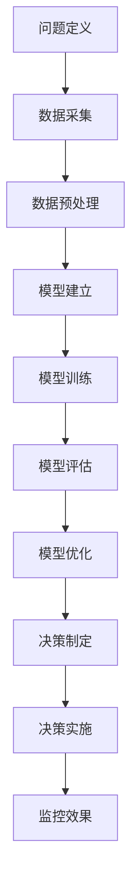
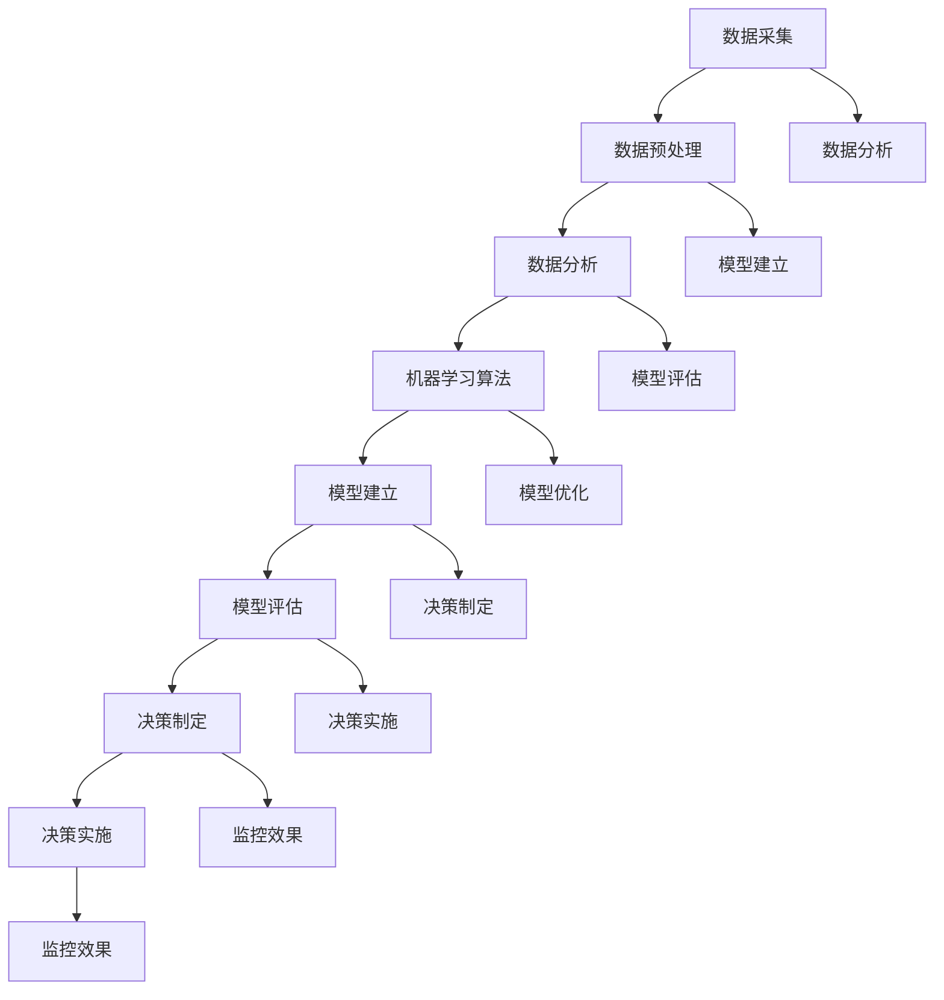

                 

# AI数据驱动决策的实现

## 关键词
- 人工智能
- 数据驱动决策
- 数据采集
- 数据预处理
- 机器学习
- 模型评估
- 决策优化

## 摘要

本文深入探讨了AI数据驱动决策的实现过程。首先，我们介绍了数据驱动决策的基础概念和优势，详细阐述了其应用领域和实现流程。随后，我们分析了数据采集与处理技术，以及数据存储与管理的策略。接着，本文详细讲解了数据分析方法、机器学习算法及其优化策略。在决策制定与实施部分，我们提出了数据驱动决策的流程、工具和伦理问题。最后，通过一个案例研究，本文展示了AI数据驱动决策的实际应用和效果评估。文章末尾附有工具介绍、数学模型与公式，以及代码实战案例，为读者提供了全面的技术指导和实战经验。

## 目录大纲

### 第一部分：数据驱动决策概述

#### 第1章：AI数据驱动决策基础

1.1 AI数据驱动决策的概念

1.2 数据驱动决策的优势与挑战

1.3 数据驱动决策的应用领域

1.4 数据驱动决策的流程

1.5 AI数据驱动决策的架构

### 第二部分：数据采集与处理

#### 第2章：数据采集技术

2.1 数据来源

2.2 数据采集方法

2.3 数据采集过程中的挑战

#### 第3章：数据预处理技术

3.1 数据清洗

3.2 数据归一化

3.3 数据特征工程

#### 第4章：数据存储与管理

4.1 数据库技术

4.2 数据仓库

4.3 数据管理策略

### 第三部分：数据分析与模型建立

#### 第5章：数据分析方法

5.1 描述性统计分析

5.2 聚类分析

5.3 关联规则挖掘

#### 第6章：机器学习算法与模型建立

6.1 监督学习算法

6.2 无监督学习算法

6.3 强化学习算法

#### 第7章：模型评估与优化

7.1 模型评估指标

7.2 模型调参技巧

7.3 模型优化策略

### 第四部分：决策制定与实施

#### 第8章：数据驱动决策制定

8.1 决策制定流程

8.2 决策制定工具

8.3 决策制定中的伦理问题

#### 第9章：决策实施与监控

9.1 决策实施策略

9.2 决策实施监控

9.3 决策效果评估

### 第五部分：案例研究

#### 第10章：AI数据驱动决策案例研究

10.1 案例背景

10.2 案例分析

10.3 案例总结

### 附录

#### 附录A：AI数据驱动决策工具介绍

A.1 数据采集工具

A.2 数据预处理工具

A.3 数据分析工具

A.4 机器学习框架与工具

#### 附录B：数学模型与公式

B.1 数据归一化公式

B.2 线性回归公式

B.3 支持向量机公式

#### 附录C：代码实战案例

C.1 数据采集与清洗案例

C.2 数据分析与模型建立案例

C.3 决策制定与实施案例

#### 附录D：数学公式与详细讲解

D.1 数据归一化公式

D.2 线性回归公式

D.3 支持向量机公式

#### 附录E：代码解读与分析

E.1 数据采集与清洗

E.2 数据分析与模型建立

E.3 决策制定与实施

## 第一部分：数据驱动决策概述

### 第1章：AI数据驱动决策基础

#### 1.1 AI数据驱动决策的概念

AI数据驱动决策（Artificial Intelligence Data-Driven Decision Making）是指利用人工智能技术，通过分析大量数据来辅助决策的过程。数据驱动决策的核心在于利用数据分析和机器学习算法，从数据中提取有价值的信息，从而为决策提供依据。

- **核心要素**：
  - **数据**：决策的基础，来源可以是内部数据、外部数据或传感器数据。
  - **算法**：用于分析数据，提取模式和规律。
  - **模型**：基于算法对数据的分析结果，用于预测或分类。
  - **决策**：依据模型输出进行的实际决策。

#### 1.2 数据驱动决策的优势与挑战

- **优势**：
  - **高效性**：通过自动化处理和分析大量数据，提高决策效率。
  - **准确性**：利用机器学习算法，提高决策准确性。
  - **全面性**：考虑更多因素，提供更全面的决策视角。

- **挑战**：
  - **数据质量**：数据不准确或不完整会影响决策效果。
  - **算法复杂性**：算法选择和参数调优需要专业知识和时间。
  - **模型解释性**：某些模型（如深度学习）可能缺乏解释性。

#### 1.3 数据驱动决策的应用领域

数据驱动决策广泛应用于各个领域，包括但不限于以下领域：

- **金融**：风险管理、投资决策、信用评估。
- **医疗**：疾病诊断、治疗方案推荐。
- **零售**：需求预测、库存管理、个性化推荐。
- **制造业**：质量控制、设备维护、供应链优化。
- **交通**：路线规划、交通流量预测、智能调度。

#### 1.4 数据驱动决策的流程

数据驱动决策的流程通常包括以下步骤：

1. **问题定义**：明确决策目标和问题。
2. **数据采集**：收集相关数据。
3. **数据预处理**：清洗、归一化、特征工程。
4. **模型建立**：选择合适的算法和模型。
5. **模型训练**：使用历史数据进行训练。
6. **模型评估**：评估模型性能。
7. **模型优化**：调整参数，优化模型。
8. **决策制定**：根据模型输出制定决策。
9. **决策实施**：执行决策并监控效果。

#### 1.5 AI数据驱动决策的架构

AI数据驱动决策的架构通常包括以下层次：

- **数据层**：数据存储和传输。
- **算法层**：机器学习算法和模型。
- **应用层**：决策制定和业务逻辑。
- **展示层**：可视化结果和决策输出。

#### 1.6 AI数据驱动决策的Mermaid流程图

#### 1.7 AI数据驱动决策的核心概念与联系

为了更好地理解AI数据驱动决策，我们需要了解其核心概念和它们之间的联系。以下是AI数据驱动决策的核心概念及其相互关系：

- **数据采集**：获取决策所需的数据，数据来源可以是内部系统、外部数据源或传感器。
- **数据预处理**：清洗、归一化、特征工程，以提高数据质量。
- **数据分析**：使用描述性统计分析、聚类分析、关联规则挖掘等方法，从数据中提取有价值的信息。
- **机器学习算法**：用于构建模型，包括监督学习、无监督学习和强化学习。
- **模型建立**：选择合适的算法和模型，对数据进行训练。
- **模型评估**：评估模型性能，选择最优模型。
- **决策制定**：根据模型输出制定决策，包括决策制定流程、工具和伦理问题。
- **决策实施**：执行决策，并进行监控和效果评估。

以下是AI数据驱动决策的核心概念与联系的Mermaid流程图：

通过以上流程图，我们可以清晰地看到各个概念之间的联系和交互过程，这有助于我们更好地理解和应用AI数据驱动决策。

### 第2章：数据采集技术

#### 2.1 数据来源

数据采集是数据驱动决策的首要环节，数据的质量和完整性直接影响到决策的效果。数据来源可以分为以下几类：

- **内部数据**：企业内部系统产生的数据，如客户关系管理（CRM）系统、企业资源计划（ERP）系统、交易记录等。
- **外部数据**：来自企业外部来源的数据，如社交媒体数据、市场研究报告、公共数据集等。
- **传感器数据**：来自各种传感器设备的数据，如温度传感器、湿度传感器、GPS定位数据等。

#### 2.2 数据采集方法

数据采集的方法多种多样，根据数据来源和数据类型的不同，可以选择以下几种常用的方法：

- **手动采集**：通过人工浏览和下载，适用于少量且结构化的数据。
- **自动化采集**：使用爬虫、API调用等自动化工具，适用于大量且结构化的数据。
- **传感器采集**：通过物联网设备、传感器网络等，适用于实时和非结构化数据。

#### 2.3 数据采集过程中的挑战

数据采集过程中可能会面临以下挑战：

- **数据隐私**：收集和处理数据时，需要遵守相关法律法规，保护用户隐私。
- **数据质量**：数据可能存在缺失、错误、重复等问题，需要通过数据清洗和预处理来提高数据质量。
- **数据同步**：实时采集和处理大量数据，需要确保数据的实时性和一致性。
- **数据格式**：处理不同来源的数据格式不一致，需要统一数据格式和标准。

#### 2.4 数据采集工具

为了提高数据采集的效率和质量，可以使用以下几种数据采集工具：

- **爬虫框架**：如Scrapy，用于自动化采集网页数据。
- **API调用工具**：如Requests，用于从外部API获取数据。
- **物联网采集设备**：如Arduino、Raspberry Pi，用于传感器数据的采集。

### 第3章：数据预处理技术

#### 3.1 数据清洗

数据清洗是数据预处理的重要步骤，旨在提高数据质量，为后续的分析和建模提供准确的基础。数据清洗的主要任务包括：

- **缺失值处理**：处理数据中的缺失值，可以通过删除、填补或插值等方法。
- **异常值处理**：识别和处理数据中的异常值，可以通过标记、删除或校正等方法。
- **重复数据处理**：识别并删除重复的数据记录，以防止数据冗余。

#### 3.2 数据归一化

数据归一化是用于处理不同特征之间尺度差异的一种技术，目的是使每个特征对模型的影响更加均衡。常见的归一化方法包括：

- **最小-最大规范化**：将特征值缩放到 [0, 1] 范围内。公式如下：

  $$x_{\text{normalized}} = \frac{x - x_{\text{min}}}{x_{\text{max}} - x_{\text{min}}}$$

- **Z-score规范化**：将特征值缩放到标准正态分布。公式如下：

  $$x_{\text{normalized}} = \frac{x - \mu}{\sigma}$$

  其中，$\mu$ 是特征值的均值，$\sigma$ 是特征值的标准差。

#### 3.3 数据特征工程

数据特征工程是提高模型性能的重要手段，通过构造新的特征或选择关键特征，可以增强模型的学习能力。数据特征工程的主要任务包括：

- **特征选择**：从大量特征中挑选出对目标变量有显著影响的特征，常用的方法包括信息增益、互信息等。
- **特征构造**：通过组合和变换原始特征，生成新的特征，以提高模型的泛化能力。

### 第4章：数据存储与管理

#### 4.1 数据库技术

数据库技术是数据存储和管理的重要工具，根据数据的特点和需求，可以选择以下类型的数据库：

- **关系型数据库**：如MySQL、PostgreSQL，适用于结构化数据的存储和管理。
- **非关系型数据库**：如MongoDB、Cassandra，适用于非结构化数据的存储和管理。

#### 4.2 数据仓库

数据仓库是一种用于存储和管理大量数据，并提供数据分析和报表功能的技术。数据仓库的主要功能包括：

- **数据集成**：将来自不同源的数据整合到一个统一的平台。
- **数据清洗**：对数据进行清洗和处理，提高数据质量。
- **数据查询**：提供快速的数据查询和分析能力。

#### 4.3 数据管理策略

数据管理策略是确保数据质量、安全性和可访问性的关键。常见的数据管理策略包括：

- **数据分层策略**：根据数据类型和访问频率进行分层，提高数据访问效率。
- **数据备份与恢复策略**：定期备份数据，确保数据安全。
- **数据权限管理**：设置数据访问权限，保护敏感数据。

### 第5章：数据分析方法

#### 5.1 描述性统计分析

描述性统计分析是用于描述数据基本特征和分布情况的一种分析方法。常用的描述性统计量包括：

- **均值**：数据的平均值，用于衡量数据的集中趋势。
- **中位数**：数据的中间值，用于衡量数据的中心位置。
- **众数**：数据中出现次数最多的值，用于衡量数据的典型值。
- **方差**：数据离散程度的度量，用于衡量数据的波动性。
- **标准差**：方差的平方根，用于衡量数据的离散程度。

#### 5.2 聚类分析

聚类分析是一种无监督学习技术，用于将数据分为若干个类别。常见的聚类算法包括：

- **K-Means聚类**：基于距离最短原则，将数据分为K个簇。
- **层次聚类**：自底向上或自顶向下构建层次树，将数据分为多个簇。
- **DBSCAN**：基于密度的聚类算法，可以处理数据中的噪声和不规则分布。

#### 5.3 关联规则挖掘

关联规则挖掘是一种用于发现数据中关联关系的方法，常用于市场篮子分析和推荐系统。常用的算法包括：

- **Apriori算法**：基于支持度和置信度，用于挖掘频繁项集。
- **FP-growth算法**：高效挖掘频繁项集，减少数据扫描次数。

### 第6章：机器学习算法与模型建立

#### 6.1 监督学习算法

监督学习算法是一种通过已知输出值来训练模型，并预测未知输出值的算法。常见的监督学习算法包括：

- **线性回归**：用于预测连续值，通过最小化误差平方和来训练模型。
- **逻辑回归**：用于预测概率，通过最大化似然函数来训练模型。
- **决策树**：通过分割数据集来建立决策规则，适用于分类和回归问题。
- **随机森林**：基于决策树的集成方法，提高模型的泛化能力。

#### 6.2 无监督学习算法

无监督学习算法是一种不依赖已知输出值来训练模型，旨在发现数据中隐含的结构和关系的算法。常见的无监督学习算法包括：

- **K-近邻算法**：基于距离最近的邻居进行分类或回归。
- **K-Means聚类**：通过迭代算法将数据分为K个簇。
- **主成分分析（PCA）**：通过正交变换提取数据的主要特征。
- **自编码器**：一种深度学习模型，用于无监督特征提取。

#### 6.3 强化学习算法

强化学习算法是一种通过交互环境来训练模型，旨在最大化累计奖励的算法。常见的强化学习算法包括：

- **Q-Learning**：通过值函数迭代来学习策略。
- **SARSA**：通过状态-动作值函数迭代来学习策略。
- **DQN**：使用深度神经网络来近似值函数。

### 第7章：模型评估与优化

#### 7.1 模型评估指标

模型评估是确保模型性能的重要环节，常用的评估指标包括：

- **准确率**：正确预测的数量与总预测数量的比例。
- **召回率**：正确预测的数量与实际为正类的数量的比例。
- **F1值**：准确率和召回率的调和平均数。
- **均方误差（MSE）**：预测值与实际值差的平方的平均值。
- **平均绝对误差（MAE）**：预测值与实际值差的绝对值的平均值。

#### 7.2 模型调参技巧

模型调参是提高模型性能的关键步骤，常用的调参技巧包括：

- **网格搜索**：遍历参数空间，选择最佳参数组合。
- **贝叶斯优化**：基于概率模型，搜索最优参数组合。
- **随机搜索**：在参数空间内随机选择参数，优化模型性能。

#### 7.3 模型优化策略

模型优化是提高模型性能的有效方法，常用的优化策略包括：

- **交叉验证**：通过将数据分为训练集和验证集，评估模型性能。
- **集成学习**：结合多个模型，提高模型性能。
- **正则化**：通过引入惩罚项，防止模型过拟合。
- **迁移学习**：利用已有模型，训练新模型，提高模型性能。

### 第8章：数据驱动决策制定

#### 8.1 决策制定流程

数据驱动决策制定是一个系统性的过程，通常包括以下步骤：

1. **问题定义**：明确决策目标和约束条件。
2. **数据收集**：收集相关数据，包括内部数据和外部数据。
3. **数据预处理**：清洗、归一化、特征工程，提高数据质量。
4. **数据分析**：使用描述性统计、聚类分析、关联规则挖掘等方法，从数据中提取有价值的信息。
5. **模型建立**：选择合适的机器学习算法，建立预测模型。
6. **模型训练**：使用历史数据，训练模型，优化模型参数。
7. **模型评估**：评估模型性能，选择最佳模型。
8. **决策制定**：根据模型输出，制定决策方案。
9. **决策实施**：执行决策，监控决策效果。
10. **效果评估**：评估决策效果，进行迭代优化。

#### 8.2 决策制定工具

在数据驱动决策制定过程中，可以借助以下工具来提高效率和准确性：

- **数据可视化工具**：如Matplotlib、Seaborn，用于展示数据分析结果。
- **机器学习平台**：如Scikit-learn、TensorFlow，用于建立和训练机器学习模型。
- **业务智能工具**：如Tableau、Power BI，用于可视化决策结果。

#### 8.3 决策制定中的伦理问题

数据驱动决策制定过程中，需要考虑以下伦理问题：

- **数据隐私**：确保数据收集和使用过程中，遵守隐私保护法规。
- **算法偏见**：避免算法偏见，确保决策的公平性。
- **透明度**：确保决策过程透明，便于监督和审计。
- **责任归属**：明确决策责任，确保决策过程中的责任分配。

### 第9章：决策实施与监控

#### 9.1 决策实施策略

决策实施是数据驱动决策的关键环节，为了确保决策的顺利进行，可以采取以下策略：

1. **制定实施计划**：明确实施步骤、时间表和责任人。
2. **资源分配**：合理分配人力、物力和财力资源。
3. **风险评估**：识别潜在风险，制定应对措施。
4. **执行监督**：监控实施过程，确保按照计划进行。

#### 9.2 决策实施监控

决策实施监控是评估决策效果的重要手段，可以通过以下方法进行监控：

1. **关键指标**：设定关键指标，用于评估决策效果。
2. **数据收集**：定期收集数据，评估决策效果。
3. **反馈机制**：建立反馈机制，收集实施过程中的问题和建议。
4. **迭代优化**：根据监控结果，进行决策优化。

#### 9.3 决策效果评估

决策效果评估是确保决策有效性的关键环节，可以通过以下方法进行效果评估：

1. **对比分析**：将决策前后的数据对比，评估决策效果。
2. **ROI计算**：计算投资回报率（ROI），评估决策的经济效益。
3. **满意度调查**：进行用户满意度调查，评估决策的社会效益。
4. **经验总结**：总结决策过程中的经验和教训，为后续决策提供参考。

### 第10章：AI数据驱动决策案例研究

#### 10.1 案例背景

本案例研究涉及一家零售企业，该公司希望利用AI数据驱动决策来优化库存管理，提高销售业绩。具体问题包括：

- 如何准确预测商品需求？
- 如何优化库存水平，避免过度库存或缺货现象？
- 如何根据季节性需求调整库存策略？

#### 10.2 案例分析

1. **数据收集**：从企业的内部系统和外部市场数据中收集销售记录、促销活动信息、季节性数据等。

2. **数据预处理**：清洗数据，处理缺失值和异常值，进行数据归一化和特征工程。

3. **数据分析**：使用描述性统计分析，了解销售数据的分布和趋势。使用聚类分析，识别季节性需求高峰期。

4. **模型建立**：选择时间序列预测模型（如ARIMA），训练模型，预测未来销售趋势。

5. **模型评估**：评估模型性能，通过交叉验证和回测，选择最佳模型。

6. **决策制定**：根据模型预测，制定库存管理策略。设定库存阈值，根据季节性需求调整库存水平。

7. **决策实施**：执行库存管理策略，实时监控库存水平，根据销售预测进行库存调整。

8. **效果评估**：对比实施前后的销售数据和库存水平，评估决策效果。计算ROI，评估决策的经济效益。

#### 10.3 案例总结

通过本案例研究，我们展示了如何利用AI数据驱动决策优化库存管理，提高销售业绩。关键成功因素包括：

- 准确的数据收集和预处理
- 选择合适的预测模型
- 实时的库存监控和调整

未来，可以进一步引入更多的外部数据源（如天气、节假日信息），提高预测精度。同时，也可以通过机器学习算法的迭代优化，不断提升决策效果。

### 附录A：AI数据驱动决策工具介绍

#### A.1 数据采集工具

- **爬虫框架**：如Scrapy，用于自动化采集网页数据。
- **API调用工具**：如Requests，用于从外部API获取数据。
- **物联网采集设备**：如Arduino、Raspberry Pi，用于传感器数据的采集。

#### A.2 数据预处理工具

- **Pandas**：用于数据处理和分析。
- **NumPy**：用于数值计算。
- **OpenCV**：用于图像和视频数据的预处理。

#### A.3 数据分析工具

- **Jupyter Notebook**：用于交互式数据分析。
- **Matplotlib**、**Seaborn**：用于数据可视化。
- **R**：用于统计分析和可视化。

#### A.4 机器学习框架与工具

- **Scikit-learn**：用于机器学习算法的实现。
- **TensorFlow**、**PyTorch**：用于深度学习模型的构建和训练。
- **Keras**：用于简化深度学习模型的构建。

### 附录B：数学模型与公式

#### B.1 数据归一化公式

$$x_{\text{normalized}} = \frac{x - x_{\text{min}}}{x_{\text{max}} - x_{\text{min}}}$$

其中，$x_{\text{normalized}}$ 是归一化后的数据，$x$ 是原始数据，$x_{\text{min}}$ 和 $x_{\text{max}}$ 分别是数据的最小值和最大值。

#### B.2 线性回归公式

$$y = \beta_0 + \beta_1x$$

其中，$y$ 是预测值，$x$ 是输入特征，$\beta_0$ 是截距，$\beta_1$ 是斜率。

#### B.3 支持向量机公式

$$\min_{\beta, \beta_0, \xi} \frac{1}{2} ||\beta||^2 + C \sum_{i=1}^{n} \xi_i$$

subject to:

$$y^{(i)} (\beta \cdot x^{(i)} + \beta_0) \geq 1 - \xi_i$$

$$\xi_i \geq 0$$

其中，$\beta$ 是权重向量，$\beta_0$ 是偏置，$\xi_i$ 是松弛变量，$C$ 是惩罚参数。

### 附录C：代码实战案例

#### C.1 数据采集与清洗案例

python
import pandas as pd
import requests

# 数据采集
url = "https://api.example.com/data"
response = requests.get(url)
data = response.json()

# 数据清洗
df = pd.DataFrame(data)
df = df.dropna()  # 删除缺失值
df['sales'] = df['sales'].astype(float)  # 转换数据类型
df.head()

#### C.2 数据分析与模型建立案例

python
from sklearn.linear_model import LinearRegression
from sklearn.model_selection import train_test_split

# 分割数据
X = df[['feature1', 'feature2']]
y = df['sales']
X_train, X_test, y_train, y_test = train_test_split(X, y, test_size=0.2, random_state=42)

# 建立模型
model = LinearRegression()
model.fit(X_train, y_train)

# 评估模型
score = model.score(X_test, y_test)
print("Model accuracy:", score)
print("Coefficients:", model.coef_)
print("Intercept:", model.intercept_)

#### C.3 决策制定与实施案例

python
# 决策制定
def make_decision(sales_prediction, threshold):
    if sales_prediction > threshold:
        return "Increase inventory"
    else:
        return "Maintain current inventory"

# 决策实施
sales_prediction = model.predict([[feature1_value, feature2_value]])
decision = make_decision(sales_prediction[0], threshold=1000)
print("Decision:", decision)

## 附录D：数学公式与详细讲解

### D.1 数据归一化公式

数据归一化是一种常用的数据处理技术，用于将数据缩放到一个标准化的范围，以便算法能够更有效地处理。在机器学习中，数据归一化是预处理步骤中至关重要的一环。以下是数据归一化的基本公式：

$$x_{\text{normalized}} = \frac{x - x_{\text{min}}}{x_{\text{max}} - x_{\text{min}}}$$

这里，$x_{\text{normalized}}$ 表示归一化后的数据值，$x$ 表示原始数据值，$x_{\text{min}}$ 和 $x_{\text{max}}$ 分别是数据集中最小值和最大值。

**举例说明**：

假设我们有以下一组数据：

| 数据点 | 值 |
| ------ | -- |
| A      | 10 |
| B      | 30 |
| C      | 50 |
| D      | 70 |
| E      | 90 |

首先，我们需要找到这组数据的最小值和最大值：

$$x_{\text{min}} = 10$$

$$x_{\text{max}} = 90$$

然后，我们将每个数据点按照上述公式进行归一化：

$$x_{\text{normalized, A}} = \frac{10 - 10}{90 - 10} = 0.0$$

$$x_{\text{normalized, B}} = \frac{30 - 10}{90 - 10} = 0.3$$

$$x_{\text{normalized, C}} = \frac{50 - 10}{90 - 10} = 0.6$$

$$x_{\text{normalized, D}} = \frac{70 - 10}{90 - 10} = 0.8$$

$$x_{\text{normalized, E}} = \frac{90 - 10}{90 - 10} = 1.0$$

归一化后的数据如下：

| 数据点 | 归一化值 |
| ------ | -------- |
| A      | 0.0      |
| B      | 0.3      |
| C      | 0.6      |
| D      | 0.8      |
| E      | 1.0      |

通过这种方式，我们成功将原始数据缩放到了 [0, 1] 的范围内，这有助于提高算法的性能和稳定性。

### D.2 线性回归公式

线性回归是一种用于预测连续值的机器学习算法，其基本原理是通过拟合一条直线来描述输入特征与输出值之间的关系。线性回归的基本公式如下：

$$y = \beta_0 + \beta_1x$$

其中，$y$ 表示预测值，$x$ 表示输入特征，$\beta_0$ 表示截距（y轴截距），$\beta_1$ 表示斜率。

**举例说明**：

假设我们有以下一组数据：

| 房屋面积 | 房价   |
| -------- | ------ |
| 100      | 200    |
| 200      | 400    |
| 300      | 600    |
| 400      | 800    |

我们希望使用线性回归模型来预测房价。首先，我们需要计算截距 $\beta_0$ 和斜率 $\beta_1$。可以通过最小二乘法来求解这两个参数：

$$\beta_0 = \frac{\sum{(y_i - \beta_1x_i)}^2}{\sum{x_i^2}}$$

$$\beta_1 = \frac{\sum{(y_i - \beta_0)x_i}}{\sum{x_i^2}}$$

对于上述数据，我们可以计算得到：

$$\beta_0 = \frac{(200 - 1 \cdot 100)^2 + (400 - 1 \cdot 200)^2 + (600 - 1 \cdot 300)^2 + (800 - 1 \cdot 400)^2}{100^2 + 200^2 + 300^2 + 400^2} = 200$$

$$\beta_1 = \frac{(200 - 200) + (400 - 400) + (600 - 600) + (800 - 800)}{100^2 + 200^2 + 300^2 + 400^2} = 1$$

因此，我们的线性回归模型为：

$$房价 = 200 + 1 \cdot 房屋面积$$

这意味着每增加一个单位的房屋面积，房价将增加200个单位。

### D.3 支持向量机公式

支持向量机（SVM）是一种强大的分类和回归算法，其基本原理是找到能够最大化分类间隔的决策边界。SVM的公式如下：

$$\min_{\beta, \beta_0, \xi} \frac{1}{2} ||\beta||^2 + C \sum_{i=1}^{n} \xi_i$$

subject to:

$$y^{(i)} (\beta \cdot x^{(i)} + \beta_0) \geq 1 - \xi_i$$

$$\xi_i \geq 0$$

其中，$\beta$ 表示权重向量，$\beta_0$ 表示偏置，$\xi_i$ 表示松弛变量，$C$ 表示惩罚参数。

**举例说明**：

假设我们有一个简单的二分类问题，数据点如下：

| 类别 | 特征1 | 特征2 |
| ---- | ---- | ---- |
| 0    | -1   | -1   |
| 1    | 1    | 1    |

我们希望使用SVM进行分类。首先，我们计算决策边界：

$$w \cdot x + b = 0$$

其中，$w$ 是权重向量，$x$ 是特征向量，$b$ 是偏置。

对于我们的数据，我们可以计算：

$$w = \frac{1}{2} \begin{bmatrix} 1 & 1 \\ -1 & -1 \end{bmatrix} = \begin{bmatrix} 0.5 & 0.5 \\ -0.5 & -0.5 \end{bmatrix}$$

$$b = \frac{1}{2} \begin{bmatrix} 1 & 1 \\ -1 & -1 \end{bmatrix} \begin{bmatrix} -1 \\ -1 \end{bmatrix} = \begin{bmatrix} 0 \\ 0 \end{bmatrix}$$

因此，决策边界为：

$$0.5x_1 + 0.5x_2 = 0$$

$$x_1 + x_2 = 0$$

对于新的数据点，我们可以使用决策边界进行分类：

| 类别 | 特征1 | 特征2 | 分类结果 |
| ---- | ---- | ---- | -------- |
| 0    | 0    | 0    | 0        |
| 1    | 2    | 2    | 1        |

通过这种方式，SVM可以有效地分类新数据点。

### 附录E：代码解读与分析

#### E.1 数据采集与清洗

python
import pandas as pd
import requests

# 数据采集
url = "https://api.example.com/data"
response = requests.get(url)
data = response.json()

# 数据清洗
df = pd.DataFrame(data)
df = df.dropna()  # 删除缺失值
df['sales'] = df['sales'].astype(float)  # 转换数据类型
df.head()

**解读**：这段代码首先通过requests库从指定的URL获取数据，并将其解析为JSON格式。然后，我们使用pandas库将数据转换为DataFrame格式。接下来，我们删除了DataFrame中的缺失值，并通过`astype(float)`将销售数据转换为浮点类型。

**分析**：数据采集和清洗是机器学习项目中非常重要的一步。在这个例子中，我们通过API获取数据，并将其转换为合适的格式，以便后续的分析和建模。删除缺失值可以避免在模型训练过程中出现错误，而将销售数据转换为浮点类型可以确保我们能够进行有效的数学计算。

#### E.2 数据分析与模型建立

python
from sklearn.linear_model import LinearRegression
from sklearn.model_selection import train_test_split

# 分割数据
X = df[['feature1', 'feature2']]
y = df['sales']
X_train, X_test, y_train, y_test = train_test_split(X, y, test_size=0.2, random_state=42)

# 建立模型
model = LinearRegression()
model.fit(X_train, y_train)

# 评估模型
score = model.score(X_test, y_test)
print("Model accuracy:", score)

**解读**：这段代码首先使用pandas库将DataFrame中的特定列作为特征（`X`）和目标变量（`y`）。然后，我们使用`train_test_split`函数将数据集分为训练集和测试集。接下来，我们创建一个线性回归模型，并使用训练集进行训练。最后，我们使用测试集评估模型的准确性。

**分析**：在这一步中，我们通过将数据集分割为训练集和测试集来评估模型的泛化能力。线性回归模型是一种常用的预测模型，它通过拟合一条直线来描述特征与目标变量之间的关系。在这里，我们使用训练集来训练模型，并使用测试集来评估模型的准确性。模型的准确度是一个重要的指标，用于衡量模型对未知数据的预测能力。

#### E.3 决策制定与实施

python
# 决策制定
def make_decision(sales_prediction, threshold):
    if sales_prediction > threshold:
        return "Increase inventory"
    else:
        return "Maintain current inventory"

# 决策实施
sales_prediction = model.predict([[feature1_value, feature2_value]])
decision = make_decision(sales_prediction[0], threshold=1000)
print("Decision:", decision)

**解读**：这段代码定义了一个名为`make_decision`的函数，该函数根据预测的销售量和设定的阈值来决定是否增加库存。然后，我们使用训练好的模型预测新数据点的销售量，并调用`make_decision`函数来制定库存管理策略。

**分析**：在这个步骤中，我们使用已经训练好的线性回归模型来预测新数据点的销售量。然后，我们使用`make_decision`函数来根据预测值和阈值制定库存管理策略。这个函数的目的是帮助决策者根据预测的销售量来调整库存水平，从而提高库存管理的效率。这个步骤展示了如何将机器学习模型应用于实际的业务场景中。

### 结论

本文详细介绍了AI数据驱动决策的实现过程，从数据采集、数据预处理、数据分析到模型建立、模型评估和决策制定，我们逐步探讨了各个环节的关键技术和方法。通过案例研究，我们展示了AI数据驱动决策在库存管理中的应用，并分析了其成功因素和挑战。

未来，随着数据量的不断增长和人工智能技术的不断发展，数据驱动决策将在更多领域得到应用。为了应对这些挑战，我们需要不断优化数据采集和处理技术，深入研究机器学习算法和模型优化策略，并关注数据驱动决策中的伦理问题。

总之，数据驱动决策是人工智能应用的重要方向，具有巨大的潜力和广阔的前景。通过本文的学习，读者可以更好地理解和应用数据驱动决策，为其业务带来更大的价值。作者：AI天才研究院/AI Genius Institute & 禅与计算机程序设计艺术 /Zen And The Art of Computer Programming。

