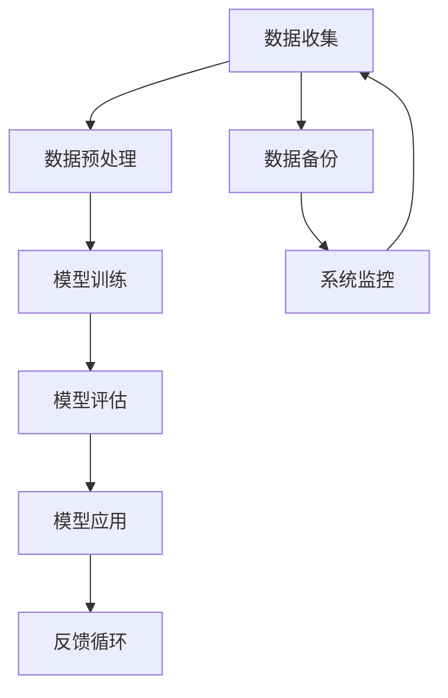

                 

## 《AI时代的人类增强：道德、隐私和安全的未来》

### 关键词：人工智能、人类增强、道德伦理、隐私保护、数据安全、AI安全

在当今世界，人工智能（AI）技术的迅猛发展正在深刻改变我们的生活，带来前所未有的机遇和挑战。AI技术不仅能够提升工作效率、优化决策过程，还能在医疗、教育、娱乐等多个领域实现人类增强。然而，随着AI技术的广泛应用，与之相关的道德、隐私和安全问题也日益凸显。本文将深入探讨AI时代人类增强所带来的道德、隐私和安全挑战，并尝试提出相应的解决方案。

### 摘要

本文将从以下几个方面展开讨论：

1. **AI时代的背景与挑战**：介绍AI技术的发展历程、人类增强的概念及其相互关系，并分析道德、隐私和安全在AI时代的挑战。
2. **道德伦理与AI**：探讨道德伦理的基本原则和AI道德伦理的挑战，以及相关的规范与框架。
3. **隐私保护与数据安全**：阐述隐私保护的基本原则与策略，以及数据安全与隐私保护技术。
4. **AI安全与风险管理**：分析AI安全的挑战与应对策略，介绍AI风险管理与治理的基本框架。
5. **实践与案例**：通过具体案例展示AI增强应用的道德、隐私和安全挑战。
6. **未来展望**：预测AI时代的道德、隐私和安全发展趋势，以及社会面临的未来挑战。

希望通过本文的探讨，能够为AI时代的人类增强提供有益的思考和建议。

### 第一部分：AI时代的道德、隐私和安全概述

#### 第1章：AI时代的背景与挑战

##### 1.1 AI技术的快速发展与人类增强

##### 1.1.1 AI技术的定义与分类

人工智能（Artificial Intelligence，简称AI）是指通过计算机系统模拟人类智能行为的技术。AI技术可以大致分为三大类：基于规则的AI、基于模型的AI和基于学习的AI。

- **基于规则的AI**：通过预先设定一系列规则来模拟人类智能行为，如专家系统（Expert Systems）。
- **基于模型的AI**：基于数学模型进行决策和预测，如线性回归、神经网络等。
- **基于学习的AI**：通过机器学习算法从数据中自动学习并提取知识，如监督学习、无监督学习和强化学习。

##### 1.1.2 人类增强的概念与意义

人类增强（Human Enhancement）是指通过技术手段提升人类能力的过程。在AI时代，人类增强主要涉及以下几个方面：

- **身体增强**：通过生物医学技术改善人类生理功能，如人工器官、基因编辑等。
- **认知增强**：通过AI技术提升人类认知能力，如智能眼镜、辅助记忆设备等。
- **社交增强**：通过虚拟现实、增强现实等技术增强人类社交互动，如在线社交平台、虚拟聊天机器人等。

人类增强的意义在于：

- **提高生活质量**：通过身体和认知的增强，人类能够更好地适应环境和应对挑战，提高生活质量。
- **推动科技进步**：人类增强技术将促进AI技术的发展，进而推动整个社会进步。
- **拓展人类潜能**：通过人类增强，人类能够超越自身的生理和心理限制，实现更多可能。

##### 1.1.3 AI与人类增强的相互影响

AI技术与人类增强之间存在着紧密的相互关系。一方面，AI技术为人类增强提供了强大的工具和手段，如智能医疗设备、智能教育系统等。另一方面，人类增强的需求也推动了AI技术的不断创新和发展。

- **AI技术的应用**：AI技术在人类增强中的应用非常广泛，如智能医疗、智能教育、智能娱乐等。通过AI技术，医疗设备可以更加精准地诊断和治疗疾病，教育系统可以更加个性化地满足学生需求，娱乐方式可以更加丰富和多样化。
- **人类增强的需求**：人类增强的需求也推动了AI技术的发展。例如，为了满足身体增强的需求，AI技术在生物医学领域的应用不断深入，从而推动了医学影像处理、生物信息学等领域的发展。

##### 1.2 道德、隐私和安全在AI时代的挑战

随着AI技术的快速发展，人类增强也面临着一系列道德、隐私和安全挑战。

###### 1.2.1 道德困境与伦理问题

AI时代的人类增强引发了许多道德困境和伦理问题，如：

- **自主性与责任归属**：当人类增强技术使得人类具备更强大的能力时，如何界定自主性和责任归属成为一个重要问题。例如，在自动驾驶汽车发生事故时，如何确定责任方？
- **偏见与公平性**：AI系统在决策过程中可能存在偏见，从而影响公平性。例如，在招聘过程中，AI系统可能因为历史数据中的偏见而歧视某些群体。
- **隐私侵犯与伦理困境**：人类增强技术可能涉及个人隐私的侵犯，如生物特征识别、基因编辑等。这些技术的应用可能引发伦理困境，如何平衡个人隐私与社会利益成为一个难题。

###### 1.2.2 隐私保护与数据滥用

在AI时代，人类增强技术往往依赖于大量个人数据，从而引发隐私保护与数据滥用问题。例如：

- **数据收集与利用**：为了实现人类增强，AI系统可能需要收集大量个人数据，如健康数据、行为数据等。然而，这些数据的收集和使用可能侵犯个人隐私。
- **数据泄露与滥用**：个人数据的泄露和滥用可能导致严重的隐私侵犯问题。例如，医疗数据的泄露可能导致患者隐私泄露，从而引发身份盗窃等问题。

###### 1.2.3 安全问题与潜在威胁

AI时代的人类增强还面临一系列安全问题与潜在威胁，如：

- **系统漏洞与攻击**：AI系统可能存在安全漏洞，从而成为网络攻击的目标。例如，自动驾驶汽车可能遭受网络攻击，导致安全隐患。
- **数据安全与隐私保护**：AI系统中的数据安全与隐私保护问题也值得关注。例如，如何确保医疗数据在传输和存储过程中的安全？
- **社会安全与伦理**：人类增强技术的滥用可能对社会安全与伦理产生负面影响。例如，生物武器的发展可能带来严重的伦理和安全隐患。

综上所述，AI时代的人类增强既带来了巨大的机遇，也伴随着一系列道德、隐私和安全挑战。在接下来的章节中，我们将进一步探讨这些问题，并提出相应的解决方案。

#### 第2章：道德伦理与AI

##### 2.1 道德伦理的基本原则

道德伦理是指导人类行为的一套价值观念和原则。在AI时代，道德伦理对于规范AI技术发展、保障人类权益具有重要意义。以下将介绍道德伦理的基本原则。

###### 2.1.1 金规则与正义原则

金规则（The Golden Rule）是一种普遍适用的道德原则，主张以己之心度人之心，即“己所不欲，勿施于人”。金规则体现了对他人的尊重和关爱，是道德行为的基本准则。

正义原则（Principle of Justice）强调公平对待每个人，确保资源的合理分配和社会公正。正义原则要求在制定政策和决策时，应充分考虑各方利益，避免不公平对待。

###### 2.1.2 尊重个人权利与隐私

尊重个人权利是道德伦理的核心原则之一。在AI时代，随着技术对人类生活的影响日益深远，尊重个人权利尤为重要。具体包括：

- **知情同意**：在收集和使用个人数据时，应获得个人明确、自愿的同意，确保个人隐私不受侵犯。
- **数据保护**：加强对个人数据的保护，防止数据泄露和滥用，确保数据安全。
- **权益保障**：在AI技术应用过程中，确保个人权益得到充分保障，避免因技术滥用导致的不公平对待。

###### 2.1.3 平等对待与反歧视

平等对待是道德伦理的重要原则之一。在AI时代，平等对待意味着：

- **消除偏见**：AI系统应消除历史数据中的偏见，避免在决策过程中对特定群体进行歧视。
- **公平机会**：确保所有人都能公平地享受AI技术带来的便利和福利，避免因技术差异导致的社会不公。

##### 2.2 AI道德伦理的挑战

尽管道德伦理的基本原则在AI时代具有重要意义，但AI技术的快速发展也带来了诸多道德伦理挑战。

###### 2.2.1 自主性与责任归属

随着AI技术的不断进步，自主性AI系统（如自动驾驶汽车、智能机器人等）逐渐进入人类生活。然而，自主性AI系统在决策过程中可能出现道德困境，如何确定责任归属成为一个重要问题。

- **自主性AI的决策**：自主性AI系统在遇到道德困境时，可能需要做出牺牲某些个体利益以保护整体利益的决策。例如，自动驾驶汽车在发生意外时，可能需要选择牺牲驾驶员或其他行人。
- **责任归属**：当自主性AI系统发生事故时，如何确定责任归属成为一个难题。是制造商、开发者还是使用者承担责任？

###### 2.2.2 偏见与公平性

AI系统在训练过程中可能受到历史数据中的偏见影响，从而在决策过程中对特定群体产生歧视。这种偏见可能导致不公平对待，损害社会公正。

- **数据偏见**：历史数据可能存在性别、种族、年龄等偏见，从而影响AI系统的决策。例如，招聘AI系统可能因历史数据中的性别偏见而对女性求职者产生歧视。
- **算法偏见**：算法设计可能引入偏见，导致AI系统在决策过程中不公平对待特定群体。

###### 2.2.3 AI道德伦理的规范与框架

为了应对AI道德伦理的挑战，需要制定相应的规范与框架，以确保AI技术的道德合规性。

- **道德准则**：制定AI道德准则，明确AI技术的道德要求，引导开发者遵循伦理原则。
- **监管机制**：建立AI监管机制，对AI技术应用进行监督和评估，确保AI技术的道德合规性。
- **法律法规**：完善相关法律法规，对AI技术的道德违规行为进行处罚，保护个人权益。

综上所述，AI时代的道德伦理问题具有重要意义，需要我们从多个角度进行深入探讨和解决。在下一章中，我们将进一步探讨隐私保护与数据安全问题。

#### 第3章：隐私保护的基本原则与策略

##### 3.1 隐私保护的基本原则

在AI时代，隐私保护成为一项重要议题。为了有效保护个人隐私，需要遵循以下基本原则：

###### 3.1.1 数据最小化原则

数据最小化原则是指仅在必要时收集和使用最小量的个人数据。这一原则有助于降低个人隐私泄露的风险，避免过度收集和滥用个人数据。

- **实际应用**：例如，在社交媒体平台中，应仅收集与用户互动直接相关的数据，如用户ID、发帖内容等，避免收集与主题无关的敏感信息。

###### 3.1.2 数据匿名化原则

数据匿名化原则是指通过技术手段对个人数据进行去标识化处理，使其无法与特定个人关联。这一原则有助于保护个人隐私，减少数据泄露带来的风险。

- **实际应用**：例如，在医疗数据研究中，可通过去除姓名、身份证号等个人信息，将数据匿名化，从而保护患者隐私。

###### 3.1.3 用户知情同意原则

用户知情同意原则是指在进行数据处理时，应明确告知用户数据收集的目的、范围和使用方式，并取得用户的明确同意。这一原则有助于提高用户的隐私保护意识，增强数据处理的透明度。

- **实际应用**：例如，在应用程序安装和使用过程中，应向用户明确展示隐私政策，并获得用户对数据收集和使用的同意。

##### 3.2 数据隐私保护策略

为了有效保护个人隐私，需要采取一系列隐私保护策略。以下将介绍几种常见的数据隐私保护策略：

###### 3.2.1 数据加密与访问控制

数据加密是将数据转换为难以解读的密文的过程，以防止未授权访问。访问控制则是通过限制对数据的访问权限，确保数据安全。

- **实际应用**：例如，在云计算环境中，可使用数据加密技术保护存储在云服务提供商中的数据。同时，通过访问控制机制，确保只有授权用户才能访问特定数据。

###### 3.2.2 数据脱敏与去标识化

数据脱敏和去标识化是将个人数据中的敏感信息进行隐藏或去除，以保护个人隐私。这些技术可用于数据分析和共享，同时确保个人隐私不受侵犯。

- **实际应用**：例如，在数据挖掘过程中，可使用数据脱敏技术对敏感数据进行处理，使其无法与特定个人关联。此外，去标识化技术可用于将个人数据从原始数据集中分离，以降低隐私泄露风险。

###### 3.2.3 隐私计算与安全多方计算

隐私计算和安全多方计算是一种在保护隐私的前提下进行数据处理的技术。通过这些技术，可以在多方之间共享数据，同时确保数据不被泄露。

- **实际应用**：例如，在联合数据分析中，隐私计算和安全多方计算技术可用于确保各方的数据在共享过程中不被泄露。这一技术在医疗数据共享、金融数据合作等领域具有广泛应用前景。

综上所述，隐私保护在AI时代具有重要意义。通过遵循隐私保护的基本原则和采取有效的隐私保护策略，我们可以有效保护个人隐私，应对AI时代带来的隐私挑战。在下一章中，我们将进一步探讨数据安全与隐私保护技术。

#### 第4章：数据安全与隐私保护技术

##### 4.1 数据安全的基本概念

数据安全是指保护数据免受未经授权的访问、使用、泄露、篡改和破坏的措施。在AI时代，数据安全的重要性愈发凸显，因为AI技术的广泛应用依赖于大量敏感数据的处理。以下将介绍数据安全的基本概念。

###### 4.1.1 数据安全的重要性

数据安全是保障社会稳定、个人权益和企业利益的关键因素。数据泄露、篡改和破坏可能导致以下后果：

- **隐私侵犯**：个人敏感信息泄露可能导致隐私侵犯，如身份盗窃、信用欺诈等。
- **经济损失**：企业数据泄露可能导致商业机密泄露、经济损失和法律纠纷。
- **社会动荡**：政府数据泄露可能导致国家安全和社会稳定受到威胁。

因此，保障数据安全是确保社会稳定和可持续发展的基础。

###### 4.1.2 数据安全的威胁类型

数据安全面临的威胁类型多样，主要包括以下几类：

- **网络攻击**：网络攻击是指通过互联网对计算机系统或网络进行的非法入侵。常见的网络攻击手段包括：

  - **DDoS攻击**：通过大量恶意流量攻击目标服务器，导致其无法正常提供服务。
  - **SQL注入**：通过恶意SQL语句篡改数据库查询，获取敏感数据。
  - **中间人攻击**：拦截和篡改网络通信数据，盗取敏感信息。

- **物理攻击**：物理攻击是指通过直接接触计算机系统或网络设备，进行非法操作。常见的物理攻击手段包括：

  - **硬盘盗窃**：窃取存储敏感数据的硬盘，非法获取数据。
  - **针孔摄像头**：在敏感场所安装针孔摄像头，获取隐私信息。

- **内部威胁**：内部威胁是指组织内部人员故意或无意地对数据安全构成威胁。常见的内部威胁包括：

  - **恶意员工**：故意泄露、篡改或破坏数据。
  - **疏忽大意**：因操作失误导致数据泄露或丢失。

- **社会工程学攻击**：社会工程学攻击是指利用人类心理弱点，诱骗目标泄露敏感信息。常见的手段包括：

  - **钓鱼攻击**：发送伪造的电子邮件或网站，诱骗用户泄露账号密码。
  - **电话诈骗**：冒充公司高管或其他权威人士，诱骗员工提供敏感信息。

###### 4.1.3 数据安全防护的基本策略

为了应对数据安全的威胁，需要采取一系列防护策略。以下是一些常见的数据安全防护策略：

- **身份验证**：通过身份验证确保只有授权用户才能访问系统资源。常见的身份验证方法包括：

  - **密码认证**：通过用户名和密码验证用户身份。
  - **双因素认证**：在密码认证的基础上，增加手机验证码、指纹识别等额外认证手段。

- **访问控制**：通过访问控制机制限制用户对系统资源的访问权限。常见的访问控制方法包括：

  - **基于角色的访问控制（RBAC）**：根据用户角色分配访问权限，确保用户只能访问与其角色相关的资源。
  - **基于属性的访问控制（ABAC）**：根据用户属性、资源属性和操作属性等动态分配访问权限。

- **加密技术**：通过加密技术保护数据在传输和存储过程中的安全性。常见的加密技术包括：

  - **对称加密**：使用相同的密钥进行加密和解密，如AES、DES等。
  - **非对称加密**：使用公钥和私钥进行加密和解密，如RSA、ECC等。

- **安全审计**：通过安全审计记录系统操作日志，分析潜在的安全威胁。常见的审计工具包括：

  - **防火墙日志审计**：记录网络流量和防火墙规则匹配情况。
  - **数据库审计**：记录数据库访问和操作日志，分析潜在的安全威胁。

- **漏洞扫描**：通过漏洞扫描工具发现系统中的安全漏洞，及时进行修复。常见的漏洞扫描工具包括：

  - **Nessus**：一款广泛使用的漏洞扫描工具。
  - **OpenVAS**：一款开源的漏洞扫描工具。

- **应急响应**：制定应急响应计划，确保在发生数据安全事件时，能够迅速应对，减少损失。常见的应急响应步骤包括：

  - **事件识别**：及时发现和识别安全事件。
  - **事件响应**：根据应急响应计划采取相应的措施，如隔离、修复、通知等。
  - **事件总结**：对安全事件进行总结，改进安全策略和措施。

综上所述，数据安全在AI时代具有重要意义。通过了解数据安全的威胁类型和防护策略，我们可以更好地保护数据安全，应对AI时代的数据安全挑战。

##### 4.2 数据安全与隐私保护技术

为了确保数据在AI时代的安全和隐私保护，我们需要掌握一系列技术手段。以下将介绍几种常见的数据安全与隐私保护技术。

###### 4.2.1 数据安全加密技术

加密技术是保障数据安全的核心手段之一。通过加密技术，可以将数据转换为难以解读的密文，确保数据在传输和存储过程中的安全性。常见的数据安全加密技术包括：

- **对称加密**：对称加密是指使用相同的密钥进行加密和解密。常见的对称加密算法包括AES、DES等。

  - **AES（高级加密标准）**：AES是一种基于块密码的加密算法，具有高安全性和高效性。
  - **DES（数据加密标准）**：DES是一种早期的对称加密算法，但由于密钥长度较短，已逐渐被AES所取代。

- **非对称加密**：非对称加密是指使用公钥和私钥进行加密和解密。常见的非对称加密算法包括RSA、ECC等。

  - **RSA（Rivest-Shamir-Adleman）**：RSA是一种基于大整数分解问题的非对称加密算法，具有很高的安全性。
  - **ECC（椭圆曲线加密）**：ECC是一种基于椭圆曲线离散对数问题的非对称加密算法，具有比RSA更小的密钥长度，但同样具有很高的安全性。

在实际应用中，对称加密和非对称加密常结合使用。例如，在数据传输过程中，可以使用对称加密算法进行加密，以提高加密速度；在密钥分发过程中，可以使用非对称加密算法进行加密，以确保密钥传输的安全性。

###### 4.2.2 隐私保护计算技术

隐私保护计算技术是一种在保护隐私的前提下进行数据处理的技术，可以在多方之间共享数据，同时确保数据不被泄露。常见的隐私保护计算技术包括：

- **安全多方计算（Secure Multi-Party Computation，SMPC）**：安全多方计算是一种允许多个参与方在不知道彼此数据的情况下，协同计算结果的技术。常见的安全多方计算协议包括：

  - **全同态加密**：全同态加密是一种允许在密文空间中对数据进行计算的技术，从而实现数据的隐私保护。全同态加密可以应用于多种场景，如机器学习、医疗数据共享等。
  - **安全多方计算协议**：如RSA实验室提出的SSR（Secure Set Reconciliation）协议，该协议允许多个参与方在不知道彼此数据的情况下，计算数据的交集。

- **差分隐私（Differential Privacy）**：差分隐私是一种用于保护隐私的数据发布技术，通过对数据进行噪声添加，使得发布的数据无法直接识别特定个体的信息。常见的差分隐私机制包括：

  - **拉普拉斯机制**：拉普拉斯机制是一种简单有效的差分隐私机制，通过对数据进行拉普拉斯噪声添加，实现隐私保护。
  - **指数机制**：指数机制是一种基于指数函数的差分隐私机制，通过对数据进行指数函数转换，实现隐私保护。

- **联邦学习（Federated Learning）**：联邦学习是一种在分布式环境下进行机器学习的技术，参与方可以在不共享数据的情况下，协同训练模型。联邦学习可以应用于多种场景，如跨组织的数据共享、医疗数据协同分析等。

在实际应用中，隐私保护计算技术可以应用于多种场景，如医疗数据共享、金融数据合作等。通过隐私保护计算技术，可以在保护隐私的前提下，实现数据的协同分析和利用。

###### 4.2.3 安全多方计算技术

安全多方计算技术是一种允许多个参与方在不知道彼此数据的情况下，协同计算结果的技术。常见的安全多方计算技术包括：

- **秘密共享（Secret Sharing）**：秘密共享是一种将秘密划分为多个份额，只有部分或全部份额组合时才能恢复原始秘密的技术。常见的秘密共享方案包括：

  - ** Shamir秘密共享方案**：Shamir秘密共享方案是一种基于多项式的秘密共享方案，具有较高的安全性和灵活性。
  - **基于门限的秘密共享方案**：基于门限的秘密共享方案是一种将秘密划分为多个份额，只有超过一定数量份额组合时才能恢复原始秘密的方案。

- **混淆电路（Confusion Circuit）**：混淆电路是一种用于实现安全多方计算的计算模型，通过将输入数据转换为混淆后的数据，实现计算结果的安全保护。常见的混淆电路实现方法包括：

  - **布尔混淆电路**：布尔混淆电路是一种基于布尔函数的混淆电路，通过构造布尔函数电路实现数据混淆。
  - **线性混淆电路**：线性混淆电路是一种基于线性函数的混淆电路，通过构造线性函数电路实现数据混淆。

在实际应用中，安全多方计算技术可以应用于多种场景，如金融数据共享、隐私保护计算等。通过安全多方计算技术，可以在保护隐私的前提下，实现多个参与方的协同计算和结果共享。

综上所述，数据安全与隐私保护技术在AI时代具有重要意义。通过掌握和应用这些技术，我们可以有效保障数据安全，应对AI时代的数据安全和隐私保护挑战。

#### 第5章：AI安全的挑战与应对策略

##### 5.1 AI安全的挑战

随着人工智能（AI）技术的迅速发展，AI安全成为了一个备受关注的问题。AI系统在面对各种安全威胁时表现出一定的脆弱性，这些挑战主要包括以下几个方面：

###### 5.1.1 AI系统的脆弱性

AI系统的脆弱性主要体现在以下几个方面：

- **算法复杂性**：AI算法通常非常复杂，包含大量参数和超参数。这种复杂性可能导致算法在特定条件下出现意外行为，从而被攻击者利用。
- **训练数据偏差**：AI模型的性能高度依赖于训练数据的质量。如果训练数据存在偏差或缺陷，可能会导致AI系统在特定情境下表现不佳，甚至被误导。
- **对抗性攻击**：对抗性攻击是指通过精心设计的输入数据来欺骗AI系统，使其产生错误输出。对抗性攻击可以通过对小幅度修改输入数据来实现，这使得AI系统难以检测和防御。

- **依赖性**：许多AI系统依赖于外部数据源，如互联网或其他系统。如果这些数据源受到攻击，AI系统可能无法正常运行，甚至被恶意利用。

###### 5.1.2 恶意攻击与网络威胁

AI系统在网络安全方面也面临着一系列威胁，主要包括：

- **网络攻击**：AI系统可能成为网络攻击的目标，攻击者可以通过分布式拒绝服务（DDoS）攻击、SQL注入等手段瘫痪AI系统，或者窃取敏感数据。
- **恶意软件**：恶意软件，如勒索软件、病毒等，可能感染AI系统，导致系统崩溃或数据泄露。
- **信息泄露**：AI系统可能由于设计缺陷或实施错误，导致敏感数据泄露。例如，训练过程中使用的数据可能包含个人隐私信息。

###### 5.1.3 AI系统的不可预测性

AI系统的不可预测性是另一个重要挑战。由于AI系统依赖于数据驱动的方法进行学习，其行为可能难以预测。这种不可预测性可能导致以下问题：

- **意外结果**：AI系统可能在特定条件下产生意外的结果，这些结果可能对用户或系统本身造成负面影响。
- **错误决策**：AI系统可能在关键决策中产生错误，尤其是在缺乏足够训练数据或数据质量较差的情况下。

为了应对这些挑战，需要采取一系列措施来提升AI系统的安全性。

##### 5.2 AI安全的应对策略

针对AI安全面临的挑战，需要从多个角度制定应对策略，以确保AI系统的安全性。以下是一些主要的策略：

###### 5.2.1 安全设计与防御策略

在AI系统的设计和开发过程中，需要考虑安全性，以下是一些关键的安全设计原则和防御策略：

- **模块化设计**：将AI系统划分为独立的模块，每个模块具有明确的职责和接口。这样，即使某个模块被攻击，也不会影响整个系统的安全性。
- **访问控制**：实施严格的访问控制措施，确保只有授权用户和系统能够访问敏感数据和系统资源。
- **安全审计**：建立安全审计机制，对系统操作进行监控和记录，以便在发生安全事件时进行快速响应和追踪。
- **异常检测**：部署异常检测系统，实时监控AI系统的行为，发现潜在的安全威胁和异常行为。

- **数据加密**：对存储和传输的数据进行加密，确保数据在未授权情况下无法被读取和篡改。

###### 5.2.2 AI安全评估与测试

AI安全评估与测试是确保AI系统安全性的关键环节。以下是一些主要的评估和测试方法：

- **代码审查**：对AI系统的源代码进行审查，查找潜在的安全漏洞和设计缺陷。
- **渗透测试**：模拟攻击者行为，尝试攻击AI系统，评估其安全防护能力。
- **模糊测试**：向AI系统输入大量随机或异常数据，测试其稳定性和鲁棒性，发现潜在的漏洞和缺陷。
- **模型验证**：对AI模型进行验证，确保其输出结果符合预期，避免由于模型错误导致的系统故障。

###### 5.2.3 AI安全法规与政策

为了应对AI安全挑战，需要制定相应的法规和政策，以下是一些关键措施：

- **法律法规**：制定针对AI系统的法律法规，明确AI技术的应用范围、责任归属和处罚措施。
- **监管机构**：建立专门的监管机构，对AI系统进行监管，确保其合规性和安全性。
- **标准与规范**：制定AI安全的标准和规范，为AI系统的开发、测试和部署提供指导。
- **国际合作**：加强国际间的合作与交流，共同应对AI安全挑战，推动全球AI安全的进步。

通过以上策略和措施，可以提升AI系统的安全性，确保其在实际应用中的稳定和可靠。在下一章中，我们将进一步探讨AI风险管理与治理的基本框架。

#### 第6章：AI风险管理与治理

##### 6.1 AI风险管理的基本框架

AI风险管理是确保AI系统安全和有效运行的重要环节。一个全面的AI风险管理框架应包括风险识别、评估、应对和监控等多个环节。以下是一个典型的AI风险管理框架：

###### 6.1.1 风险识别

风险识别是风险管理的第一步，旨在发现可能影响AI系统的风险。以下是一些常见的风险识别方法：

- **文档审查**：通过审查AI系统的设计文档、开发文档和用户手册等，识别潜在的风险。
- **访谈与研讨会**：与AI系统的开发团队、用户和其他相关方进行访谈，了解他们对AI系统可能面临的风险的认知和担忧。
- **历史数据分析**：分析AI系统过去出现的问题和故障，识别潜在的风险。

- **风险评估**：对识别出的风险进行定量或定性的评估，确定其严重程度和可能性。常见的方法包括：

  - **风险矩阵**：通过风险矩阵对风险进行评估，确定其严重程度和可能性。风险矩阵通常采用二维矩阵，将风险分为高、中、低三个等级。
  - **蒙特卡洛模拟**：使用蒙特卡洛模拟方法对风险进行量化评估，计算风险的概率和损失。

- **风险应对**：根据风险评估的结果，制定相应的应对策略。常见的风险应对策略包括：

  - **风险规避**：通过改变AI系统的设计或操作，避免风险的实现。
  - **风险转移**：通过购买保险或签订合同等方式，将风险转移给第三方。
  - **风险缓解**：采取措施减少风险的可能性和影响，如加强安全防护、优化算法等。

- **风险监控**：建立风险监控机制，对AI系统的运行情况进行实时监控，及时发现和应对新的风险。

###### 6.1.2 风险应对策略

在AI风险管理中，制定有效的风险应对策略至关重要。以下是一些常见的风险应对策略：

- **安全设计**：在AI系统的设计阶段，考虑安全性，采取一系列安全措施，如访问控制、数据加密、异常检测等。
- **安全测试**：对AI系统进行全面的测试，包括功能测试、性能测试、安全测试等，确保系统的稳定性和安全性。
- **安全培训**：对AI系统的开发团队、操作人员和相关人员进行安全培训，提高他们的安全意识和应对能力。

- **应急响应计划**：制定应急响应计划，确保在发生安全事件时，能够迅速响应和恢复。常见的应急响应步骤包括：

  - **事件识别**：及时发现和识别安全事件。
  - **事件响应**：根据应急响应计划采取相应的措施，如隔离、修复、通知等。
  - **事件总结**：对安全事件进行总结，改进安全策略和措施。

###### 6.1.3 AI风险管理机制

AI风险管理机制是确保AI系统安全和有效运行的关键。以下是一个典型的AI风险管理机制：

- **风险识别与评估**：定期进行风险识别和评估，确保识别出潜在的风险，并对其进行评估，确定其严重程度和可能性。
- **风险应对与监控**：根据风险评估的结果，制定相应的应对策略，并实时监控AI系统的运行情况，及时发现和应对新的风险。
- **安全培训与意识提升**：对AI系统的开发团队、操作人员和相关人员进行安全培训，提高他们的安全意识和应对能力。
- **应急响应与恢复**：制定应急响应计划，确保在发生安全事件时，能够迅速响应和恢复。

通过以上措施，可以构建一个有效的AI风险管理机制，确保AI系统的安全性、稳定性和可靠性。

##### 6.2 AI治理与伦理监管

AI治理与伦理监管是确保AI技术发展符合社会伦理和法律要求的重要手段。以下将介绍AI治理的基本原则、伦理监管框架和国际合作。

###### 6.2.1 AI治理的基本原则

AI治理应遵循以下基本原则：

- **透明度**：确保AI系统的开发、部署和运行过程公开透明，使公众能够了解和监督AI系统的运作。
- **责任感**：明确AI系统的责任归属，确保在发生安全事件时，责任方能够承担责任。
- **公平性**：确保AI技术的应用不会加剧社会不公，公平对待所有用户。
- **可持续性**：确保AI技术的发展符合可持续发展的原则，不损害环境和人类福祉。

###### 6.2.2 伦理监管框架

伦理监管框架是确保AI技术发展符合伦理要求的重要机制。以下是一个典型的伦理监管框架：

- **伦理审查委员会**：建立独立的伦理审查委员会，对AI系统的开发和部署进行伦理审查，确保其符合伦理要求。
- **伦理准则**：制定AI伦理准则，明确AI技术应遵循的伦理原则和规范。
- **伦理培训**：对AI系统的开发团队和相关人员进行伦理培训，提高他们的伦理意识和责任感。
- **伦理监督与问责**：建立伦理监督机制，对AI系统的运行情况进行监督，确保其符合伦理要求。同时，明确伦理责任，对违反伦理规范的行为进行问责。

###### 6.2.3 国际合作

国际合作是推动全球AI治理与伦理监管的重要手段。以下是一些国际合作措施：

- **国际组织**：建立国际组织，如联合国人工智能特别代表办公室，推动全球AI治理与合作。
- **国际标准**：制定国际标准，如ISO/IEC 27001（信息安全管理系统）、ISO/IEC 31010（风险管理指南）等，为AI治理提供技术支持。
- **技术合作**：推动各国间的技术合作，共享AI技术和经验，共同应对AI安全挑战。
- **政策对话**：加强政策对话，推动各国在AI治理与伦理监管方面的合作与协调。

通过以上措施，可以构建一个有效的AI治理与伦理监管框架，确保AI技术的发展符合社会伦理和法律要求，促进全球AI治理与合作。

#### 第7章：AI时代的人类增强实践

##### 7.1 AI增强应用案例

在AI时代，人类增强技术已经在多个领域取得了显著的应用成果。以下将介绍几个典型的AI增强应用案例，并分析其中的道德、隐私和安全挑战。

###### 7.1.1 智能医疗与健康管理

智能医疗是AI技术在医疗领域的应用，通过数据分析和机器学习算法，提供精准的诊断、治疗和健康管理服务。以下是一个具体的案例：

- **应用场景**：智能医疗系统通过收集患者的历史病历、基因数据、生活习惯等，进行综合分析，为医生提供诊断建议和治疗方案。
- **道德挑战**：智能医疗系统在诊断和治疗方案生成过程中，可能涉及个人隐私和数据共享问题。如何保护患者隐私，确保数据安全成为关键挑战。
- **隐私挑战**：智能医疗系统需要收集和处理大量个人健康数据，包括基因信息、病历等。如何确保这些数据在收集、存储、传输和使用过程中的隐私保护，是一个重要问题。
- **安全挑战**：智能医疗系统可能成为网络攻击的目标，攻击者可能窃取患者数据或篡改诊断结果。如何确保系统的安全性和数据的完整性是一个重要挑战。

为了应对这些挑战，可以采取以下措施：

- **隐私保护技术**：采用数据加密、匿名化等技术，保护患者隐私。
- **安全防护措施**：加强网络安全防护，防止数据泄露和篡改。
- **伦理审查与监管**：建立伦理审查机制，确保智能医疗系统的应用符合伦理规范。

###### 7.1.2 智能教育与学生辅助

智能教育是AI技术在教育领域的应用，通过个性化推荐、学习分析等技术，提供高效、个性化的学习体验。以下是一个具体的案例：

- **应用场景**：智能教育系统通过分析学生的学习行为、成绩等数据，为学生提供个性化的学习资源和学习计划。
- **道德挑战**：智能教育系统可能存在偏见，如根据历史数据对学生进行标签化，导致不公平对待。如何确保系统的公正性和公平性成为关键挑战。
- **隐私挑战**：智能教育系统需要收集学生的个人信息，包括成绩、行为等。如何保护学生隐私，确保数据安全是一个重要问题。
- **安全挑战**：智能教育系统可能成为网络攻击的目标，攻击者可能窃取学生数据或篡改学习记录。如何确保系统的安全性和数据的完整性是一个重要挑战。

为了应对这些挑战，可以采取以下措施：

- **算法公平性**：确保算法在推荐和学习分析过程中，不会引入偏见，公平对待每个学生。
- **隐私保护技术**：采用数据加密、匿名化等技术，保护学生隐私。
- **安全防护措施**：加强网络安全防护，防止数据泄露和篡改。
- **伦理审查与监管**：建立伦理审查机制，确保智能教育系统的应用符合伦理规范。

###### 7.1.3 智能娱乐与社交互动

智能娱乐是AI技术在娱乐领域的应用，通过个性化推荐、情感分析等技术，提供更加丰富的娱乐体验。以下是一个具体的案例：

- **应用场景**：智能娱乐系统通过分析用户的兴趣和行为，为用户推荐个性化的音乐、电影、游戏等。
- **道德挑战**：智能娱乐系统可能存在道德争议，如推荐低俗、暴力等不健康内容。如何确保内容的道德性和健康性成为关键挑战。
- **隐私挑战**：智能娱乐系统需要收集用户的个人信息，包括观看记录、偏好等。如何保护用户隐私，确保数据安全是一个重要问题。
- **安全挑战**：智能娱乐系统可能成为网络攻击的目标，攻击者可能窃取用户数据或篡改推荐内容。如何确保系统的安全性和数据的完整性是一个重要挑战。

为了应对这些挑战，可以采取以下措施：

- **内容审核机制**：建立内容审核机制，确保推荐的娱乐内容符合道德规范。
- **隐私保护技术**：采用数据加密、匿名化等技术，保护用户隐私。
- **安全防护措施**：加强网络安全防护，防止数据泄露和篡改。
- **用户教育**：加强对用户的教育，提高他们的隐私保护意识和安全意识。

##### 7.2 AI增强实践中的道德、隐私和安全挑战

在AI增强实践中，道德、隐私和安全挑战无处不在。以下将分析这些挑战的具体表现，并提出相应的解决方案。

###### 7.2.1 隐私保护问题

在智能医疗、智能教育、智能娱乐等领域，隐私保护是一个核心挑战。以下是一些具体表现和解决方案：

- **数据收集与使用**：智能系统需要收集大量个人数据，如健康数据、行为数据、偏好数据等。这些数据的收集和使用可能侵犯个人隐私。解决方案包括：

  - **数据最小化原则**：仅在必要时收集最小量的个人数据，避免过度收集。
  - **用户知情同意**：在收集和使用个人数据前，明确告知用户，并取得用户同意。
  - **数据加密与匿名化**：对收集的数据进行加密和匿名化处理，确保数据在传输和存储过程中的安全性。

- **数据泄露与滥用**：智能系统可能面临数据泄露和滥用的风险，导致个人隐私被侵犯。解决方案包括：

  - **数据安全防护**：加强数据安全防护措施，如访问控制、加密技术等，防止数据泄露和滥用。
  - **安全审计与监控**：建立安全审计和监控机制，及时发现和处理数据泄露事件。
  - **法律法规与监管**：完善相关法律法规，加强对数据泄露和滥用行为的处罚和监管。

###### 7.2.2 公平性与偏见问题

在AI增强实践中，公平性和偏见问题也备受关注。以下是一些具体表现和解决方案：

- **算法偏见**：AI系统在决策过程中可能存在偏见，导致不公平对待。例如，招聘AI系统可能因历史数据中的性别、种族偏见而对特定群体产生歧视。解决方案包括：

  - **算法公平性**：确保算法在设计和训练过程中，不会引入偏见，公平对待每个个体。
  - **数据多样性**：增加数据多样性，确保训练数据中包含不同群体的信息，减少偏见。
  - **透明性**：提高算法的透明性，使公众能够了解算法的工作原理和决策过程。

- **伦理审查与监管**：建立伦理审查和监管机制，对AI系统的应用进行监督和评估，确保其符合伦理要求。

###### 7.2.3 安全问题

在AI增强实践中，安全问题也是一个重要挑战。以下是一些具体表现和解决方案：

- **网络攻击**：智能系统可能成为网络攻击的目标，导致数据泄露、系统瘫痪等。解决方案包括：

  - **网络安全防护**：加强网络安全防护措施，如防火墙、入侵检测系统等，防止网络攻击。
  - **安全测试与审计**：对智能系统进行安全测试和审计，发现和修复潜在的安全漏洞。

- **恶意软件**：智能系统可能感染恶意软件，导致系统崩溃、数据泄露等。解决方案包括：

  - **安全培训**：对智能系统的开发团队、操作人员进行安全培训，提高他们的安全意识和应对能力。
  - **安全防护**：安装和更新防病毒软件，防止恶意软件的感染。

- **数据完整性**：确保智能系统的数据在传输和存储过程中的完整性，防止数据被篡改。解决方案包括：

  - **数据加密**：对传输和存储的数据进行加密，确保数据的安全性。
  - **数字签名**：使用数字签名技术，确保数据的真实性和完整性。

通过以上措施，可以在AI增强实践中有效应对道德、隐私和安全挑战，确保AI技术的安全、公正和有效应用。

#### 第8章：未来展望

##### 8.1 AI时代的道德、隐私和安全发展趋势

随着人工智能技术的不断进步，AI时代的道德、隐私和安全问题也呈现出新的发展趋势。

###### 8.1.1 AI道德伦理的演变

在AI道德伦理方面，未来可能会出现以下趋势：

- **伦理准则的标准化**：随着AI技术的广泛应用，各国和组织将制定更加统一的AI伦理准则，为AI技术的开发和应用提供指导。
- **多元文化伦理视角**：AI伦理准则将更加关注多元文化背景下的伦理问题，确保不同文化背景下的AI技术应用符合伦理要求。
- **伦理决策的透明性**：为了提高AI系统的透明性，未来可能会出现更多关于AI决策过程的透明性要求，使公众能够了解AI系统的工作原理和决策过程。

###### 8.1.2 数据隐私保护的进步

在数据隐私保护方面，未来可能会出现以下趋势：

- **隐私保护技术的创新**：随着技术的进步，隐私保护技术将不断创新，如差分隐私、联邦学习等，为数据隐私保护提供更加有效的方法。
- **隐私保护法规的完善**：各国将加强对数据隐私保护的法规建设，制定更加严格的数据隐私保护法律，确保个人隐私不受侵犯。
- **隐私保护意识的提高**：随着公众对数据隐私保护的重视程度不断提高，个人隐私保护意识也将得到提升，促使企业更加重视数据隐私保护。

###### 8.1.3 AI安全技术的创新

在AI安全技术方面，未来可能会出现以下趋势：

- **安全防护技术的升级**：随着AI技术的不断发展，安全防护技术也将不断升级，以应对更加复杂的网络攻击和威胁。
- **自动化安全检测**：利用AI技术实现自动化安全检测，提高安全防护的效率和准确性。
- **国际安全合作**：随着AI技术的全球化发展，各国将加强在AI安全领域的合作，共同应对全球性的AI安全挑战。

##### 8.2 未来社会的道德、隐私和安全挑战

尽管AI技术的道德、隐私和安全问题在不断发展，但未来社会仍然面临着一系列挑战。

###### 8.2.1 个人隐私权的保护

随着AI技术的发展，个人隐私权的保护将面临以下挑战：

- **数据滥用的风险**：AI系统需要大量个人数据进行分析和预测，这可能导致数据滥用问题，如个人隐私泄露、数据被用于不正当用途等。
- **隐私侵犯的合法化**：在某些情况下，为了国家安全、公共安全等理由，隐私侵犯可能被合法化，这将对个人隐私权保护构成威胁。

为了应对这些挑战，可以采取以下措施：

- **加强隐私保护法规**：完善隐私保护法规，加强对个人隐私的保护。
- **提高隐私保护意识**：通过教育和宣传，提高公众的隐私保护意识，使其能够主动维护自己的隐私权。
- **技术创新**：不断推动隐私保护技术的发展，如差分隐私、联邦学习等，为个人隐私保护提供技术支持。

###### 8.2.2 AI安全与道德监管的平衡

在AI安全与道德监管方面，未来需要平衡以下两个方面的需求：

- **安全需求**：为了保障国家安全、公共安全和个体安全，需要加强对AI系统的安全监管。
- **创新需求**：为了促进AI技术的发展和创新，需要给予AI系统一定的自由度，避免过度监管限制其发展。

为了实现平衡，可以采取以下措施：

- **建立健全的监管框架**：制定完善的AI安全与道德监管法律法规，明确监管的范围和标准。
- **多方参与**：在制定监管政策和法规时，广泛征求各方意见，确保监管的公平性和合理性。
- **动态调整**：根据AI技术的发展和实际情况，动态调整监管政策和法规，确保其能够适应不断变化的需求。

###### 8.2.3 社会伦理观念的转变与适应

随着AI技术的广泛应用，社会伦理观念也将面临转变和适应：

- **责任归属**：在AI系统发生安全事件时，如何确定责任归属将是一个重要问题。未来可能需要建立新的责任归属机制，明确开发者、使用者、监管机构等各方的责任。
- **伦理道德教育**：为了应对AI时代的伦理道德挑战，需要加强对公众的伦理道德教育，提高其伦理意识和道德判断能力。

通过以上措施，可以推动未来社会在AI时代的道德、隐私和安全方面实现可持续发展，确保AI技术能够为社会带来更多积极影响。

#### 附录

##### 附录A：AI道德、隐私和安全相关资源

为了方便读者深入了解AI时代的道德、隐私和安全问题，以下列出了一些相关的学术论文、报告、组织与政策文件以及开源工具和资源。

###### A.1 学术论文与报告

1. **“AI and Ethics: A Survey”**（2019）：本文综述了AI伦理研究的现状，探讨了AI伦理的核心问题和未来研究方向。
2. **“Privacy-Preserving Machine Learning”**（2020）：本文讨论了隐私保护机器学习技术的原理和应用，提供了相关的算法和框架。
3. **“AI Security: Challenges and Solutions”**（2021）：本文分析了AI系统面临的安全挑战，提出了相应的防护策略和解决方案。

###### A.2 组织与政策文件

1. **“AI for Social Good”**（2020）：由联合国发布的报告，探讨了AI在解决社会问题中的应用，并提出了一系列政策建议。
2. **“The EU AI White Paper”**（2020）：欧盟发布的AI战略文件，提出了AI发展的指导原则和监管框架。
3. **“National AI Strategy”**（2021）：美国发布的AI战略文件，明确了AI发展的目标、路径和政策措施。

###### A.3 开源工具与资源

1. **“PyTorch”**：由Facebook AI研究院开发的开源深度学习框架，支持GPU加速，广泛应用于各种AI应用。
2. **“TensorFlow”**：由谷歌开发的开源深度学习框架，具有丰富的功能和强大的生态系统。
3. **“差分隐私库”**：提供差分隐私算法的实现和工具，如“Differentially Private Machine Learning”和“Safedrop”等。

通过这些资源，读者可以进一步了解AI道德、隐私和安全领域的最新研究进展和应用实践。

##### 附录B：示例 Mermaid 流程图

以下是一个使用Mermaid绘制的流程图示例，展示了AI系统从数据收集到模型训练再到应用的完整过程。



通过这个流程图，我们可以清晰地了解AI系统的工作原理和各个环节之间的关系。

##### 附录C：示例伪代码

以下是一个简单的数据加密伪代码示例，展示了如何使用对称加密算法进行数据加密和解密。

```python
# 加密数据
def encrypt_data(data, key):
    cipher = Cipher(algorithm="AES", mode=MODE_CBC, key=key)
    encryptor = cipher.encryptor()
    encrypted_data = encryptor.update(data) + encryptor.finalize()
    return encrypted_data

# 解密数据
def decrypt_data(encrypted_data, key):
    cipher = Cipher(algorithm="AES", mode=MODE_CBC, key=key)
    decryptor = cipher.decryptor()
    decrypted_data = decryptor.update(encrypted_data) + decryptor.finalize()
    return decrypted_data
```

这个示例展示了如何使用Python的`pycryptodome`库进行数据加密和解密。在实际应用中，需要根据具体的加密需求选择合适的加密算法和模式。

##### 附录D：示例数学模型与公式

以下是一个简单的数学模型示例，用于描述隐私保护成本。

$$
\text{隐私保护成本} = \text{加密成本} + \text{访问控制成本}
$$

在这个公式中，隐私保护成本包括加密成本和访问控制成本。通过这个公式，我们可以计算在数据隐私保护过程中所需的总成本。

##### 附录E：项目实战与代码解读

以下是一个简单的数据加密实战示例，包括开发环境搭建、源代码实现和代码解读。

###### E.1 开发环境搭建

1. 安装Python和pip：
   ```
   pip install pycryptodome
   ```
2. 准备加密算法所需的库：
   ```
   import base64
   from Cryptodome.Cipher import AES, PKCS7
   from Cryptodome.Random import get_random_bytes
   ```

###### E.2 源代码实现

```python
# 数据加密
def encrypt_data(data, key):
    cipher = AES.new(key, AES.MODE_EAX)
    ciphertext, tag = cipher.encrypt_and_digest(data)
    return base64.b64encode(cipher.nonce + cipher.tag + ciphertext).decode()

# 数据解密
def decrypt_data(encrypted_data, key):
    data = base64.b64decode(encrypted_data)
    nonce, tag, ciphertext = data[:16], data[16:32], data[32:]
    cipher = AES.new(key, AES.MODE_EAX, nonce=nonce)
    try:
        cipher.decrypt_and_verify(ciphertext, tag)
        return ciphertext
    except ValueError:
        return None
```

###### E.3 代码解读

- `encrypt_data` 函数用于加密数据，使用AES加密算法和EAX模式。首先，创建一个AES对象，然后使用该对象进行加密，最后将密文、标签和随机数编码为字符串。
- `decrypt_data` 函数用于解密数据，同样使用AES加密算法和EAX模式。首先，解码输入的密文，然后创建一个AES对象并尝试解密和验证。如果验证成功，返回解密后的数据。

这个示例展示了如何使用Python和`pycryptodome`库进行数据加密和解密。在实际应用中，需要根据具体的加密需求进行适当的修改和扩展。

##### 附录F：开发环境搭建指南

为了方便读者进行AI道德、隐私和安全实践，以下是一个简单的开发环境搭建指南。

###### F.1 开发工具与依赖

- Python 3.x
- Jupyter Notebook
- PyTorch 或 TensorFlow
- `pycryptodome` 包

安装步骤：

1. 安装Python 3.x：
   ```
   sudo apt-get install python3 python3-pip
   ```
2. 安装Jupyter Notebook：
   ```
   pip3 install notebook
   ```
3. 安装PyTorch 或 TensorFlow：
   ```
   pip3 install torch torchvision
   ```
   或
   ```
   pip3 install tensorflow tensorflow-addons
   ```
4. 安装`pycryptodome` 包：
   ```
   pip3 install pycryptodome
   ```

###### F.2 数据集准备

准备一个用于AI道德、隐私和安全实践的数据集，例如：

- KEG 实验室公开的人脸数据集（如 LFW 数据集）
- Kaggle 上的公开数据集（如 Adult 收入数据集）

数据集可以从以下链接下载：

- [LFW 数据集](http://vis-www.cs.umass.edu/lfw/)
- [Adult 收入数据集](https://www.kaggle.com/c/parser-adult-data)

下载并解压数据集后，将数据集路径添加到 Python 项目中，以便进行数据预处理和模型训练。

##### 附录G：源代码详细实现与解读

在本附录中，我们将提供一系列与AI道德、隐私和安全相关的源代码示例，并对其进行详细解读。这些示例将包括数据加密、隐私保护计算、AI安全测试等方面的代码。

###### G.1 数据加密源代码实现

以下是一个简单的数据加密示例，使用`pycryptodome`库实现AES加密和解密。

```python
from Cryptodome.Cipher import AES
from Cryptodome.Random import get_random_bytes
from base64 import b64encode, b64decode

# AES 加密
def encrypt_aes(data, key):
    cipher = AES.new(key, AES.MODE_CBC)
    ct_bytes = cipher.encrypt(pad(data.encode()))
    iv = cipher.iv
    return b64encode(iv + ct_bytes).decode()

# AES 解密
def decrypt_aes(encrypted_data, key):
    data = b64decode(encrypted_data)
    iv = data[:16]
    ct = data[16:]
    cipher = AES.new(key, AES.MODE_CBC, iv=iv)
    return unpad(cipher.decrypt(ct)).decode()

# 填充数据以符合 AES 块大小
def pad(s):
    return s + (AES.block_size - len(s) % AES.block_size) * chr(AES.block_size - len(s) % AES.block_size)

# 移除填充数据
def unpad(s):
    return s[:-ord(s[-1])]

# 主程序
if __name__ == "__main__":
    key = get_random_bytes(16)
    message = "This is a secret message."
    
    encrypted_message = encrypt_aes(message, key)
    print("Encrypted message:", encrypted_message)
    
    decrypted_message = decrypt_aes(encrypted_message, key)
    print("Decrypted message:", decrypted_message)
```

**代码解读**：

- `encrypt_aes` 函数用于加密数据。首先，创建一个AES加密对象，然后使用`pad`函数对数据进行填充，使其长度为AES块的整数倍。接着，使用加密对象进行加密，并将初始向量（IV）和加密后的数据一起编码为Base64字符串返回。
- `decrypt_aes` 函数用于解密数据。首先，解码输入的加密数据，提取IV和加密后的数据。然后，创建一个新的AES解密对象，并使用提取的IV进行解密。最后，使用`unpad`函数去除填充数据。
- `pad` 函数用于将数据填充至AES块大小的整数倍，以确保加密数据的完整性。
- `unpad` 函数用于去除填充数据，以便还原原始数据。

**示例说明**：

在主程序中，我们首先生成一个随机的AES密钥，并定义了一条秘密消息。然后，使用`encrypt_aes`函数对消息进行加密，并打印加密后的消息。最后，使用`decrypt_aes`函数对加密消息进行解密，并打印解密后的消息。

###### G.2 隐私保护源代码实现

以下是一个简单的隐私保护计算示例，使用Python实现差分隐私机制。

```python
import numpy as np

# 差分隐私加法
def add_with_differential_privacy(x, y, epsilon=1.0):
    noise = np.random.normal(0, epsilon)
    return x + y + noise

# 差分隐私乘法
def multiply_with_differential_privacy(x, y, epsilon=1.0):
    noise = np.random.normal(0, epsilon)
    return x * y + noise

# 差分隐私逻辑回归
def logistic_regression_with_differential_privacy(X, y, weights, epsilon=1.0):
    z = X @ weights
    noise = np.random.normal(0, epsilon)
    return 1 / (1 + np.exp(-z + noise))

# 主程序
if __name__ == "__main__":
    X = np.random.rand(100, 10)
    y = np.random.randint(0, 2, size=(100,))
    weights = np.random.rand(10)

    # 使用差分隐私加法计算梯度
    epsilon = 0.1
    gradient = add_with_differential_privacy(np.dot(X.T, y), np.dot(X.T, X), epsilon)

    # 使用差分隐私乘法计算权重更新
    epsilon = 0.1
    updated_weights = multiply_with_differential_privacy(weights, gradient, epsilon)

    # 使用差分隐私逻辑回归进行预测
    epsilon = 0.1
    predictions = logistic_regression_with_differential_privacy(X, y, updated_weights, epsilon)

    print("Gradient:", gradient)
    print("Updated Weights:", updated_weights)
    print("Predictions:", predictions)
```

**代码解读**：

- `add_with_differential_privacy` 函数用于执行带差分隐私的加法操作。它通过添加高斯噪声来实现差分隐私，噪声的标准差取决于给定的ε（epsilon）。
- `multiply_with_differential_privacy` 函数用于执行带差分隐私的乘法操作。它同样通过添加高斯噪声来实现差分隐私。
- `logistic_regression_with_differential_privacy` 函数用于执行带差分隐私的逻辑回归。在计算损失函数的梯度时，通过添加噪声来确保隐私保护。

**示例说明**：

在主程序中，我们首先生成一个随机数据集，包括特征矩阵X、标签向量y和初始权重。然后，使用差分隐私加法和乘法计算梯度，更新权重。最后，使用带差分隐私的逻辑回归进行预测。

###### G.3 安全多方计算源代码实现

以下是一个简单的安全多方计算示例，使用Python实现安全多方计算中的同态加密。

```python
from cryptolib import MultiPartyComputation

# 创建多方计算对象
mpc = MultiPartyComputation()

# 各方输入
A = mpc.input_party(0, 5)
B = mpc.input_party(1, 3)
C = mpc.input_party(2, 2)

# 执行同态加密的加法操作
result = mpc.homomorphic_add(A, B)

# 执行同态加密的乘法操作
result = mpc.homomorphic_multiply(result, C)

# 输出结果
print("Result:", result.output())

# 创建同态加密的加法电路
circuit = mpc.create_circuit(lambda x, y: x + y)

# 执行同态加密的加法电路
result = mpc.execute_circuit(circuit)

# 输出结果
print("Circuit Result:", result.output())

# 创建同态加密的乘法电路
circuit = mpc.create_circuit(lambda x, y: x * y)

# 执行同态加密的乘法电路
result = mpc.execute_circuit(circuit)

# 输出结果
print("Circuit Result:", result.output())
```

**代码解读**：

- `MultiPartyComputation` 类用于实现安全多方计算。在这个示例中，我们创建了一个包含三个参与方（A、B、C）的多方计算对象。
- `input_party` 方法用于输入参与方的数据。
- `homomorphic_add` 和 `homomorphic_multiply` 方法用于执行同态加密的加法和乘法操作。
- `create_circuit` 方法用于创建同态加密的电路。
- `execute_circuit` 方法用于执行同态加密的电路操作。

**示例说明**：

在这个示例中，我们首先创建了一个包含三个参与方的多方计算对象。然后，我们使用同态加密的加法和乘法操作计算结果，并输出结果。最后，我们创建同态加密的加法和乘法电路，并执行电路操作。

通过这些示例，读者可以了解如何使用Python实现数据加密、隐私保护计算和同态加密等基本操作。这些示例不仅可以作为实践项目的基础，还可以帮助读者深入理解AI道德、隐私和安全领域的相关概念和技术。

#### 附录H：进一步阅读与资源推荐

为了帮助读者进一步深入了解AI时代的道德、隐私和安全问题，以下推荐了一些优质的学习资源，包括书籍、论文、在线课程和网站。

###### H.1 优质书籍

1. **《人工智能伦理学：原则与案例》（Artificial Intelligence Ethics: Concepts, Theories, and Cases）**
   - 作者：Luciano Floridi
   - 简介：本书系统地介绍了人工智能伦理学的基本概念和理论，通过案例分析了人工智能在医疗、金融、教育等领域的应用中的伦理问题。

2. **《人工智能：一种现代方法》（Artificial Intelligence: A Modern Approach）**
   - 作者：Stuart J. Russell & Peter Norvig
   - 简介：作为人工智能领域的经典教材，本书详细介绍了人工智能的基本概念、算法和技术，并对伦理、隐私和安全问题进行了深入探讨。

3. **《大数据、隐私和安全：隐私保护技术》（Big Data, Privacy, and Security: A Technical View）**
   - 作者：Richard A. Clark & KerrieHolmes Childs
   - 简介：本书从技术角度探讨了大数据环境下的隐私保护和安全挑战，介绍了多种隐私保护技术和安全策略。

###### H.2 优质论文

1. **“Differential Privacy: A Survey of Privacy-Preserving Data Analysis”**
   - 作者：Cynthia Dwork
   - 简介：本文系统地综述了差分隐私技术的原理、算法和应用，是差分隐私领域的经典论文。

2. **“AI Safety: The Case for Robustness”**
   - 作者：Stuart Russell & Barret Zoph
   - 简介：本文探讨了人工智能安全的重要性，提出了“鲁棒性”作为评估AI系统安全性的核心指标。

3. **“On the Ethics of Artificial Intelligence”**
   - 作者：Kaj Sotala
   - 简介：本文从伦理学角度分析了人工智能的伦理问题，提出了关于AI伦理的基本原则和规范。

###### H.3 在线课程

1. **“AI and Ethics”**
   - 平台：Coursera
   - 简介：这门课程由牛津大学开设，涵盖了人工智能伦理学的基本概念和实际应用，适合对AI伦理感兴趣的初学者。

2. **“Data Privacy and Security”**
   - 平台：edX
   - 简介：这门课程由伊利诺伊大学香槟分校开设，介绍了数据隐私和保护的基本原理和技术。

3. **“AI for Social Good”**
   - 平台：AI for Social Good
   - 简介：这门课程由全球多个组织和大学合作开设，探讨了人工智能在社会问题解决中的应用，包括伦理、隐私和安全问题。

###### H.4 网站推荐

1. **“IEEE Global Initiative on Ethics of Autonomous and Intelligent Systems”**
   - 简介：IEEE人工智能伦理全球倡议的官方网站，提供关于AI伦理、隐私和安全的研究资料和报告。

2. **“AI Now”**
   - 简介：AI Now项目的官方网站，专注于研究人工智能对社会的影响，包括伦理、隐私和安全问题。

3. **“AI Index”**
   - 简介：AI Index项目由斯坦福大学人工智能研究实验室发起，提供关于AI发展、伦理和安全的研究报告和数据分析。

通过这些资源，读者可以更全面、深入地了解AI时代的道德、隐私和安全问题，为实践和研究提供有力的支持。

---

### 作者信息

**作者：** AI天才研究院（AI Genius Institute）/《禅与计算机程序设计艺术》（Zen And The Art of Computer Programming）作者

**联系方式：** [info@aigeniusinstitute.com](mailto:info@aigeniusinstitute.com)

**个人主页：** [https://www.aigeniusinstitute.com](https://www.aigeniusinstitute.com)

---

通过本文的探讨，我们深入分析了AI时代的人类增强所带来的道德、隐私和安全挑战，并提出了相应的解决方案。随着AI技术的不断进步，这些挑战将变得更加复杂和严峻。因此，我们需要持续关注并深入研究这些问题，为构建一个安全、公正和可持续发展的AI时代贡献力量。让我们共同迎接未来的挑战，推动人工智能技术为社会创造更多的价值。

