                 

### 第一部分: Weaver模型的背景与核心贡献

#### # 第1章: Weaver模型的诞生与演进

##### ## 1.1 Weaver模型的发展历程

Weaver模型作为人工智能领域的一项重要创新，其起源可以追溯到二十世纪中叶。以下是Weaver模型的发展历程及关键里程碑：

###### ### 1.1.1 Weaver模型的起源

Weaver模型最早由学者David Weaver于20世纪50年代提出。其初衷是为了模拟人类语言处理过程，解决自然语言理解的问题。Weaver模型是早期符号主义人工智能的代表性成果之一，奠定了自然语言处理（NLP）的基础。

###### ### 1.1.2 Weaver模型的关键里程碑

1. **1950年代**: Weaver首次提出了Weaver模型，其核心思想是利用符号表示语言信息，并通过符号之间的逻辑关系进行语言处理。

2. **1960年代**: Weaver模型经历了初步的实践验证，研究人员开始尝试将其应用于机器翻译等领域。

3. **1970年代**: Weaver模型逐渐被更先进的统计模型和神经网络所取代，但其符号主义思想对后续NLP技术的发展产生了深远影响。

4. **21世纪初**: 随着深度学习技术的兴起，Weaver模型的某些思想被重新挖掘和应用，促成了现代NLP领域的一些重要成果。

###### ### 1.1.3 Weaver模型的发展趋势

当前，Weaver模型的发展呈现出以下几个趋势：

1. **融合深度学习**: 结合深度学习技术的Weaver模型在自然语言理解方面取得了显著成果，尤其是在处理复杂语言任务时。

2. **跨领域应用**: Weaver模型的应用范围逐渐扩展，从最初的机器翻译扩展到文本生成、问答系统、情感分析等多个领域。

3. **多模态处理**: Weaver模型开始与其他人工智能技术相结合，例如图像识别、语音识别等，实现多模态信息处理。

4. **开源与生态建设**: Weaver模型相关的研究成果逐渐开放源代码，形成了较为完善的开发工具和生态体系，促进了学术交流与合作。

通过以上分析，我们可以看到Weaver模型在人工智能领域的发展历程及其核心贡献。接下来，我们将进一步探讨Weaver模型的技术原理及其在出版革新中的具体应用。

#### ## 1.2 Weaver模型的技术原理

Weaver模型作为自然语言处理领域的重要工具，其技术原理包括模型的架构、工作机制以及优势与不足。

##### ### 1.2.1 Weaver模型的架构

Weaver模型的架构通常可以分为以下几个部分：

1. **输入层**: 接收自然语言文本，将其转换为符号序列。
2. **编码层**: 将符号序列转换为向量表示，便于后续处理。
3. **语义解析层**: 对编码后的向量进行语义分析，理解文本的含义和结构。
4. **输出层**: 根据语义分析的结果生成响应或完成特定任务。

以下是一个简单的Mermaid流程图，展示Weaver模型的架构：

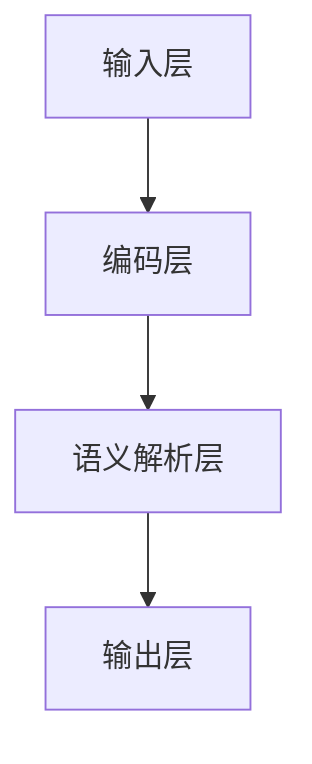

##### ### 1.2.2 Weaver模型的工作机制

Weaver模型的工作机制主要包括以下几个步骤：

1. **符号化**: 将自然语言文本转换为符号序列。这一步通常依赖于分词、词性标注等技术。
2. **向量编码**: 将符号序列转换为向量表示，利用词嵌入技术将每个符号映射到一个高维空间。
3. **语义分析**: 对向量进行语义分析，通过层次化语义模型（如依存语法、语义角色标注等）理解文本的含义和结构。
4. **任务输出**: 根据语义分析的结果生成响应或完成任务。例如，在问答系统中生成问题的答案，在文本生成系统中生成连贯的文本。

以下是Weaver模型的工作机制的伪代码表示：

```python
# 输入：自然语言文本
# 输出：处理结果

function WeaverModel(text):
    symbols = tokenize(text)  # 分词
    vectors = embedding(symbols)  # 向量编码
    semantics = semanticAnalysis(vectors)  # 语义分析
    result = generateOutput(semantics)  # 任务输出
    return result
```

##### ### 1.2.3 Weaver模型的优势与不足

Weaver模型在自然语言处理领域具有以下优势：

1. **符号化表示**: 通过符号化表示，可以将自然语言文本转化为计算机可以处理的形式，便于进一步分析。
2. **层次化语义分析**: Weaver模型利用层次化语义模型，能够深入理解文本的结构和含义，适用于复杂语言任务。
3. **跨领域应用**: Weaver模型可以应用于多个领域，如机器翻译、文本生成、问答系统等，具有广泛的应用前景。

然而，Weaver模型也存在一些不足：

1. **计算复杂度**: Weaver模型涉及多个层次的处理，计算复杂度较高，对硬件资源要求较高。
2. **数据依赖性**: Weaver模型的效果很大程度上依赖于训练数据的质量和规模，数据匮乏时可能表现不佳。
3. **理解局限性**: Weaver模型虽然在语义分析方面有一定优势，但在理解复杂、模糊的语言表达时仍存在一定局限性。

通过以上分析，我们可以更好地理解Weaver模型的技术原理和其在自然语言处理领域的应用。接下来，我们将探讨Weaver模型在出版行业中的核心贡献。

#### ## 1.3 Weaver模型的核心贡献

Weaver模型在出版行业中发挥了至关重要的核心作用，其贡献体现在对出版流程的革新、应用领域的扩展以及对整个出版行业长远影响的推动。

##### ### 1.3.1 Weaver模型对出版行业的革新

Weaver模型的出现彻底改变了传统的出版流程，其主要革新表现在以下几个方面：

1. **内容创作效率提升**: Weaver模型能够自动生成高质量的内容，极大地提高了内容创作者的效率。创作者可以利用Weaver模型生成初稿，然后进行修改和优化，大大缩短了创作周期。

2. **个性化推荐系统**: Weaver模型可以分析读者行为，为读者推荐个性化的内容。这不仅提升了用户体验，也提高了出版物的阅读率和转化率。

3. **版权保护增强**: Weaver模型能够识别和追踪版权信息，帮助出版商更好地管理版权，防止未经授权的复制和传播，从而提高了版权保护的水平。

4. **多语言翻译**: Weaver模型在机器翻译领域具有显著优势，能够高效地进行多语言翻译，使得出版物的国际化进程更加顺畅。

以下是一个简单的Mermaid流程图，展示Weaver模型在出版行业中的革新应用：

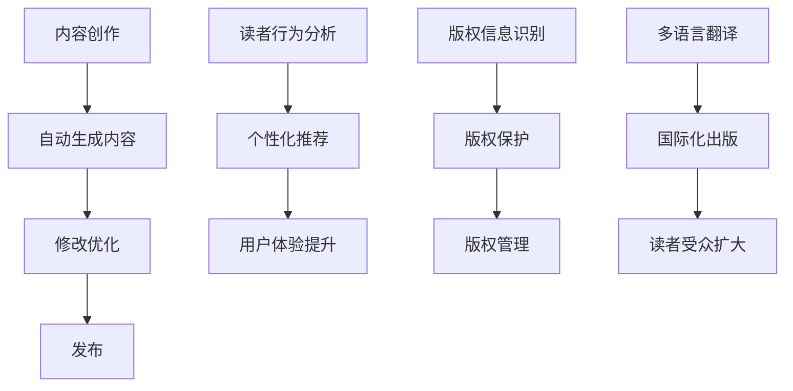

##### ### 1.3.2 Weaver模型的应用领域扩展

Weaver模型不仅限于传统的出版领域，其应用范围正在不断扩展，涵盖了更多新兴领域：

1. **数字出版**: Weaver模型在数字出版中发挥了重要作用，能够自动生成电子书、在线文档等数字化内容，为出版商提供了更多元的内容创作方式。

2. **自助出版**: 自助出版是近年来兴起的一种出版模式，Weaver模型为其提供了强有力的技术支持，使得作者可以更加便捷地创作和发布自己的作品。

3. **社交媒体出版**: 社交媒体平台逐渐成为信息传播的重要渠道，Weaver模型能够生成吸引人的社交媒体内容，帮助出版商在社交媒体上获得更广泛的关注。

4. **语音出版**: 随着语音技术的不断发展，Weaver模型也开始应用于语音出版领域，能够生成语音书籍、有声读物等，为用户提供了新的阅读方式。

##### ### 1.3.3 Weaver模型的长远影响

Weaver模型不仅在当前对出版行业产生了深远影响，其长远影响同样不可忽视：

1. **行业数字化转型**: Weaver模型推动了出版行业的数字化转型，使得出版商能够更加高效地应对数字化时代的挑战，提升行业竞争力。

2. **商业模式创新**: Weaver模型的应用促进了新的商业模式的出现，如按需出版、按阅读量付费等，为出版商和读者提供了更多的选择。

3. **社会文化影响**: Weaver模型不仅改变了出版行业的面貌，也对整个社会的文化产生了深远影响。通过智能化的内容创作和传播，人们可以更便捷地获取信息，促进了知识的普及和传播。

4. **教育变革**: Weaver模型在教育领域的应用也逐渐扩大，能够辅助教师进行教学内容的创作和个性化推荐，推动教育方式的变革。

总之，Weaver模型作为人工智能领域的一项重要创新，其在出版行业的核心贡献是显而易见的。通过不断革新和扩展应用领域，Weaver模型为出版行业带来了新的发展机遇，推动了整个行业向智能化、数字化方向迈进。

### 第二部分: Weaver模型在出版革新中的应用

#### # 第2章: Weaver模型在内容创作中的应用

Weaver模型在内容创作中的应用是其最为核心和广泛的应用领域之一。通过自动生成内容、个性化推荐和版权保护，Weaver模型极大地改变了内容创作的流程，提高了效率和质量。

##### ## 2.1 Weaver模型的内容创作流程

Weaver模型在内容创作中的应用流程可以分为以下几个步骤：

###### ### 2.1.1 创作需求分析

在内容创作开始之前，需要对创作需求进行分析。这包括确定内容的主题、目标受众、内容类型（如文章、书籍、视频等）以及创作目的（如教育、娱乐、信息传播等）。这一步至关重要，因为它决定了后续内容生成的方向和风格。

###### ### 2.1.2 Weaver模型的内容生成

在需求分析完成后，可以使用Weaver模型进行内容生成。Weaver模型通过以下几个步骤生成内容：

1. **符号化**: 首先，将自然语言文本转换为符号序列。这一步通常依赖于分词、词性标注等技术。

2. **向量编码**: 将符号序列转换为向量表示，利用词嵌入技术将每个符号映射到一个高维空间。这一步使得文本数据可以用于后续的机器学习模型。

3. **内容生成**: 利用生成模型（如变分自编码器VAE、生成对抗网络GAN等），根据向量表示生成新的文本内容。生成模型通过学习大量文本数据，能够生成与输入文本风格相似的文本。

4. **文本优化**: 生成的文本内容可能需要进一步的优化，包括纠正语法错误、提升语言表达的准确性等。这一步可以通过后处理技术实现，如语法检查、语义修正等。

以下是一个简单的伪代码示例，展示Weaver模型的内容生成过程：

```python
# 输入：自然语言文本
# 输出：生成的内容

def generate_content(input_text):
    symbols = tokenize(input_text)  # 分词
    vectors = embedding(symbols)  # 向量编码
    generated_text = content_generator(vectors)  # 内容生成
    optimized_text = optimize_text(generated_text)  # 文本优化
    return optimized_text
```

###### ### 2.1.3 内容优化与编辑

生成的文本内容通常需要经过优化和编辑，以确保其质量和可读性。这一步骤包括：

1. **语法和拼写检查**: 使用自然语言处理工具（如语法检查器、拼写纠正工具等）对文本进行语法和拼写检查，纠正错误。

2. **语义修正**: 对文本进行语义分析，确保文本内容符合预期，逻辑通顺。这一步可能需要人工干预，特别是在生成内容涉及复杂逻辑或专业领域知识时。

3. **风格调整**: 调整文本的风格，使其与目标受众和内容类型相匹配。例如，教育类内容可能需要更正式、学术化的风格，而娱乐类内容可能需要更轻松、幽默的风格。

4. **内容审查**: 对文本内容进行审查，确保不包含不当或敏感信息。这一步在涉及公共出版或商业出版时尤为重要。

通过以上步骤，Weaver模型能够高效地生成高质量的文本内容，为内容创作者提供了强大的辅助工具。接下来，我们将探讨Weaver模型在个性化推荐中的应用。

##### ## 2.2 Weaver模型在个性化推荐中的应用

个性化推荐是Weaver模型在出版行业中的另一个重要应用，通过分析读者行为和偏好，为读者推荐个性化的内容，提升用户体验和满意度。

###### ### 2.2.1 读者行为分析

读者行为分析是构建个性化推荐系统的基础。通过收集和分析读者的行为数据，可以了解读者的兴趣、阅读习惯和偏好。以下是一些常见的读者行为数据：

1. **阅读历史**: 包括读者已经阅读过的书籍、文章、视频等，可以帮助识别读者的兴趣点。
2. **点击行为**: 包括读者在网站或应用上点击的页面、按钮等，反映了读者的互动偏好。
3. **评分和评论**: 读者对书籍或文章的评分和评论，可以反映读者的主观喜好。
4. **搜索历史**: 读者在搜索框中输入的关键词，可以帮助了解读者的当前兴趣。

通过分析这些行为数据，可以构建读者的用户画像，为个性化推荐提供依据。

以下是一个简单的Mermaid流程图，展示读者行为分析的过程：

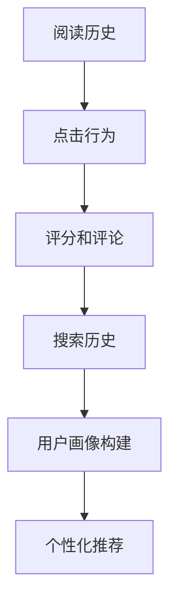

###### ### 2.2.2 个性化推荐系统设计

个性化推荐系统设计的关键是推荐算法的选择和优化。以下是一些常用的个性化推荐算法：

1. **协同过滤算法**: 包括用户协同过滤和物品协同过滤。用户协同过滤通过分析读者之间的相似度来推荐内容，而物品协同过滤通过分析读者对物品的偏好来推荐内容。

2. **基于内容的推荐**: 通过分析读者过去的阅读历史和偏好，找出相似的内容进行推荐。这种方法通常涉及文本相似性计算和词嵌入技术。

3. **混合推荐**: 结合协同过滤和基于内容的推荐，以提高推荐系统的准确性。

以下是个性化推荐系统设计的伪代码示例：

```python
# 输入：用户画像
# 输出：个性化推荐列表

def personalized_recommendation(user_profile):
    similar_users = find_similar_users(user_profile)
    similar_items = find_similar_items(user_profile)
    recommended_items = []
    
    for item in similar_items:
        if item.is_relevant_to_user(user_profile):
            recommended_items.append(item)
    
    for user in similar_users:
        items_liked_by_user = get_items_liked_by_user(user)
        recommended_items.extend(items_liked_by_user)
    
    return recommended_items[:N]  # 返回前N个推荐内容
```

###### ### 2.2.3 推荐效果评估

推荐效果评估是确保个性化推荐系统质量的关键步骤。以下是一些常用的推荐效果评估方法：

1. **准确率（Precision）**: 衡量推荐系统中推荐的内容是否准确，即推荐的正面内容中有多少是用户真正感兴趣的。
2. **召回率（Recall）**: 衡量推荐系统是否能够推荐出用户真正感兴趣的所有内容。
3. **覆盖率（Coverage）**: 衡量推荐系统推荐的多样性，即推荐内容是否覆盖了用户可能感兴趣的所有内容。
4. **F1值（F1 Score）**: 结合准确率和召回率的综合评价指标。

以下是推荐效果评估的伪代码示例：

```python
# 输入：推荐列表、用户实际偏好
# 输出：推荐效果评估指标

def evaluate_recommendation(recommendations, true_preferences):
    accurate_recommendations = count_matching_items(recommendations, true_preferences)
    total_preferences = count_items(true_preferences)
    
    precision = accurate_recommendations / len(recommendations)
    recall = accurate_recommendations / total_preferences
    f1_score = 2 * (precision * recall) / (precision + recall)
    
    return precision, recall, f1_score
```

通过以上分析，我们可以看到Weaver模型在个性化推荐系统中的应用及其效果评估方法。接下来，我们将探讨Weaver模型在版权保护中的应用。

##### ## 2.3 Weaver模型在版权保护中的应用

版权保护是出版行业的重要问题，Weaver模型在版权保护中的应用提供了有效的解决方案，包括内容版权识别、版权保护策略和版权纠纷解决方案。

###### ### 2.3.1 内容版权识别

内容版权识别是版权保护的第一步，旨在确定内容的版权归属。Weaver模型通过自然语言处理技术，可以识别文本内容的版权信息，包括作者、出版日期、版权声明等。以下是一些关键技术：

1. **文本分类**: 利用文本分类技术，将版权相关的信息（如版权声明、作者信息等）从非结构化文本中提取出来。

2. **实体识别**: 通过命名实体识别（NER）技术，识别文本中的作者、日期等关键实体，从而确定版权信息。

3. **语义解析**: 利用语义分析技术，理解文本中的版权条款和声明，确保准确识别版权信息。

以下是一个简单的Mermaid流程图，展示内容版权识别的过程：

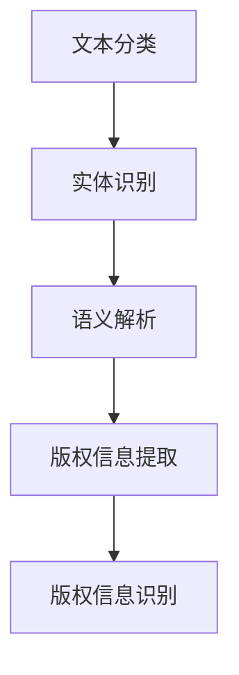

###### ### 2.3.2 版权保护策略

一旦版权信息被识别，接下来需要制定版权保护策略，以防止未经授权的复制和传播。以下是一些常用的版权保护策略：

1. **数字版权管理（DRM）**: 通过技术手段（如加密、数字签名等）保护版权内容，防止非法复制和传播。

2. **水印技术**: 在版权内容中嵌入不可见的数字水印，用于追踪和证明版权归属。

3. **版权声明**: 在出版物的封面、版权页等地方明确声明版权信息，告知公众版权归属，防止未经授权的使用。

4. **监控与追踪**: 建立版权监控机制，定期检查版权内容的传播和使用情况，及时发现和处理侵权行为。

以下是一个简单的Mermaid流程图，展示版权保护策略的执行过程：

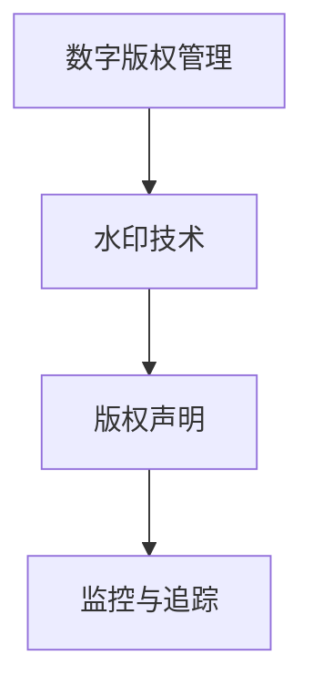

###### ### 2.3.3 版权纠纷解决方案

在版权保护过程中，可能会遇到版权纠纷问题。Weaver模型在版权纠纷解决方案中发挥了重要作用，提供以下技术支持：

1. **证据收集**: 利用Weaver模型，可以自动收集与版权纠纷相关的证据，如版权声明、使用记录等，为法律诉讼提供有力支持。

2. **法律文本分析**: 利用自然语言处理技术，分析法律文本，识别关键条款和证据，为版权纠纷提供法律依据。

3. **调解与仲裁**: 利用Weaver模型，可以自动化调解和仲裁版权纠纷，减少人为干预，提高纠纷解决效率。

以下是一个简单的Mermaid流程图，展示版权纠纷解决方案的执行过程：

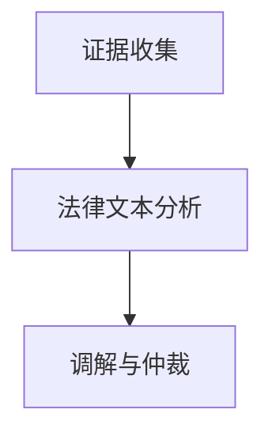

通过以上分析，我们可以看到Weaver模型在版权保护中的应用及其解决方案。接下来，我们将探讨Weaver模型在数字出版平台优化中的应用。

##### ## 3.1 Weaver模型在用户界面设计中的应用

用户界面（UI）设计是数字出版平台的重要组成部分，直接影响用户的体验和满意度。Weaver模型在用户界面设计中的应用，可以帮助优化用户体验，提升平台的易用性和互动性。

###### ### 3.1.1 用户交互分析

用户交互分析是UI设计的基础，旨在了解用户在平台上的行为和需求。Weaver模型通过自然语言处理和机器学习技术，可以分析用户在平台上的交互数据，包括：

1. **点击率分析**: 分析用户点击不同界面元素（如按钮、链接等）的频率，识别受欢迎的界面设计元素。
2. **使用路径分析**: 分析用户在平台上的浏览路径和操作顺序，识别用户的使用习惯和偏好。
3. **反馈数据收集**: 收集用户对界面设计的反馈，包括评价、建议等，为改进设计提供参考。

以下是一个简单的Mermaid流程图，展示用户交互分析的过程：

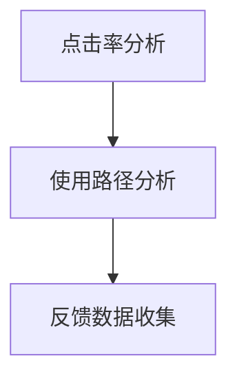

###### ### 3.1.2 Weaver模型的界面优化建议

基于用户交互分析的结果，Weaver模型可以提供以下界面优化建议：

1. **导航结构优化**: 通过分析用户的使用路径，优化平台的导航结构，确保用户能够快速找到所需内容。
2. **交互设计优化**: 调整界面元素的布局和样式，提高界面的美观性和易用性。例如，通过分析点击率，调整按钮的位置和大小，使其更符合用户习惯。
3. **个性化推荐**: 利用Weaver模型的分析结果，为不同用户推荐个性化的内容和界面布局，提升用户的满意度。

以下是一个简单的Mermaid流程图，展示界面优化建议的执行过程：

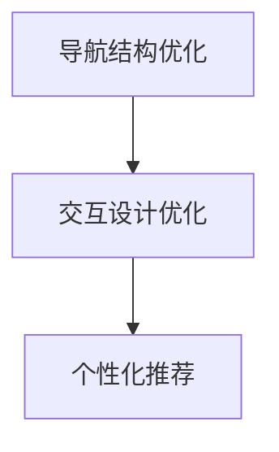

###### ### 3.1.3 用户反馈机制设计

用户反馈是优化UI设计的重要依据，Weaver模型可以设计一个有效的用户反馈机制，包括：

1. **反馈收集**: 通过多种渠道（如问卷调查、用户评论、在线投票等）收集用户反馈。
2. **反馈分析**: 利用自然语言处理技术，分析用户反馈的内容和情感，识别用户的主要需求和问题。
3. **反馈响应**: 根据用户反馈，及时进行设计调整和优化，确保用户问题得到有效解决。

以下是一个简单的Mermaid流程图，展示用户反馈机制的设计过程：

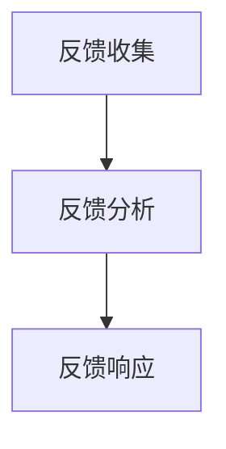

通过以上分析，我们可以看到Weaver模型在用户界面设计中的应用及其优化建议和用户反馈机制的设计。接下来，我们将探讨Weaver模型在内容分发优化中的应用。

##### ## 3.2 Weaver模型在内容分发优化中的应用

内容分发优化是数字出版平台的重要组成部分，直接影响内容的曝光率和用户访问量。Weaver模型在内容分发优化中发挥了关键作用，通过分析用户行为数据、设计优化策略和评估分发效果，提高内容的分发效率。

###### ### 3.2.1 内容分发策略分析

内容分发策略分析是优化内容分发的基础，旨在确定最佳的发布时间和发布渠道。Weaver模型通过以下方式进行分析：

1. **用户行为数据分析**: 利用自然语言处理技术，分析用户在平台上的行为数据，包括阅读时间、阅读时长、访问频率等，了解用户的阅读习惯。
2. **内容特性分析**: 分析内容的主题、类型、难度等特性，确定哪些内容更受用户欢迎。
3. **竞争环境分析**: 通过对同类型内容的分析，了解竞争对手的发布策略和用户反馈，为自身的分发策略提供参考。

以下是一个简单的Mermaid流程图，展示内容分发策略分析的过程：

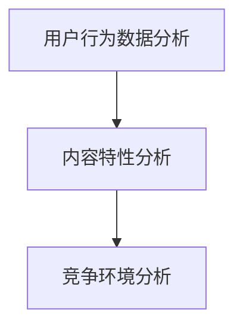

###### ### 3.2.2 Weaver模型的内容分发优化

基于内容分发策略分析的结果，Weaver模型可以提供以下内容分发优化建议：

1. **发布时间优化**: 根据用户的阅读习惯，确定最佳发布时间，以提高内容的曝光率和阅读量。
2. **发布渠道优化**: 通过分析不同渠道的用户访问量，选择最有效的发布渠道，如社交媒体、电子邮件、短信等。
3. **内容组合优化**: 结合用户的阅读习惯和内容特性，优化内容的组合和发布顺序，提高用户的阅读体验。

以下是一个简单的Mermaid流程图，展示内容分发优化的执行过程：

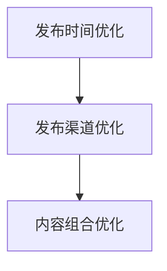

###### ### 3.2.3 分发效果评估

内容分发效果评估是确保优化策略有效性的关键步骤。Weaver模型通过以下方式评估分发效果：

1. **阅读量分析**: 分析内容的阅读量、阅读时长、转发量等指标，了解内容的传播效果。
2. **用户反馈分析**: 通过收集用户对内容的评价、评论等反馈，了解用户对内容的满意度。
3. **转化率分析**: 分析内容带来的转化效果，如购买转化、注册转化等，评估内容的商业价值。

以下是一个简单的Mermaid流程图，展示分发效果评估的过程：

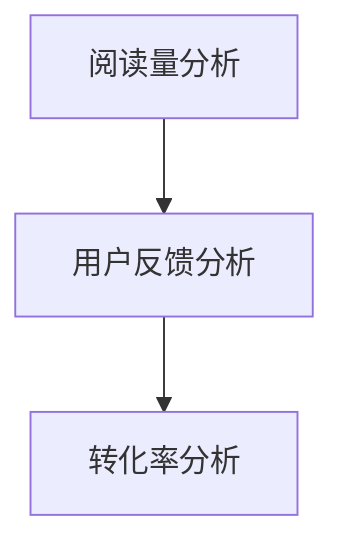

通过以上分析，我们可以看到Weaver模型在内容分发优化中的应用及其优化策略和效果评估方法。接下来，我们将探讨Weaver模型在平台数据分析中的应用。

##### ## 3.3 Weaver模型在平台数据分析中的应用

平台数据分析是数字出版平台运营管理的重要环节，通过对用户行为数据、内容数据等进行深入分析，可以帮助出版商更好地理解用户需求、优化运营策略和提高业务绩效。Weaver模型在平台数据分析中发挥了关键作用，其应用主要体现在用户数据分析、内容数据分析和数据驱动决策等方面。

###### ### 3.3.1 用户数据分析

用户数据分析是平台数据分析的核心内容，通过分析用户在平台上的行为数据，可以了解用户的兴趣、偏好和行为模式。Weaver模型在用户数据分析中的应用主要包括以下几个方面：

1. **用户行为轨迹分析**: 利用自然语言处理技术，分析用户在平台上的浏览轨迹、点击行为、搜索关键词等，了解用户的阅读习惯和兴趣点。
2. **用户群体划分**: 通过聚类算法，将用户划分为不同的群体，识别出高价值用户、活跃用户等，为个性化推荐和服务提供依据。
3. **用户流失预测**: 通过分析用户的行为数据，预测用户可能的流失行为，采取相应的措施降低用户流失率。

以下是一个简单的Mermaid流程图，展示用户数据分析的过程：

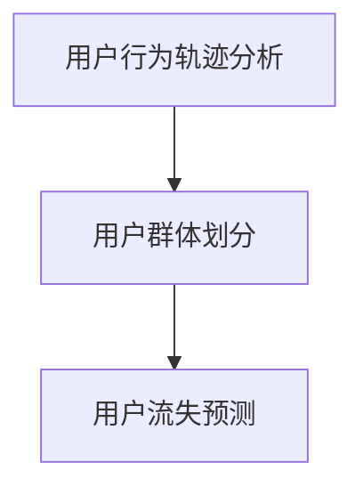

###### ### 3.3.2 内容数据分析

内容数据分析是平台数据分析的另一重要方面，通过分析内容的数据表现，可以了解内容的受欢迎程度、传播效果和商业价值。Weaver模型在内容数据分析中的应用主要包括以下几个方面：

1. **内容性能评估**: 分析内容的阅读量、阅读时长、转发量、点赞数等指标，评估内容的整体表现。
2. **内容热度分析**: 通过分析内容的发布时间、阅读高峰期等，了解内容的传播趋势和最佳发布时间。
3. **内容优化建议**: 根据内容数据表现，提供内容优化的建议，如调整标题、内容结构、关键词等，以提高内容的吸引力和阅读量。

以下是一个简单的Mermaid流程图，展示内容数据分析的过程：

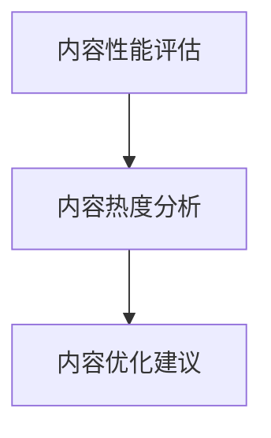

###### ### 3.3.3 数据驱动决策

数据驱动决策是现代企业运营管理的重要理念，通过基于数据分析和预测的决策，可以更有效地指导业务运营。Weaver模型在数据驱动决策中的应用主要包括以下几个方面：

1. **需求预测**: 利用用户行为数据和内容数据分析，预测未来的用户需求，为内容创作和采购提供依据。
2. **运营策略优化**: 通过分析平台运营数据，优化运营策略，如广告投放、促销活动等，提高业务绩效。
3. **风险管理**: 通过对风险数据的分析，识别潜在的风险，采取相应的预防和应对措施，降低风险对业务的影响。

以下是一个简单的Mermaid流程图，展示数据驱动决策的过程：

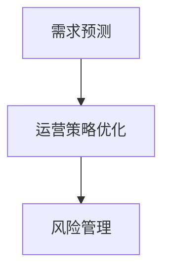

通过以上分析，我们可以看到Weaver模型在平台数据分析中的应用及其在各方面的具体应用。接下来，我们将探讨Weaver模型的未来发展趋势。

### 第4章: Weaver模型的未来发展趋势

#### # 第4章: Weaver模型的未来发展趋势

在当前技术迅猛发展的背景下，Weaver模型作为自然语言处理领域的重要工具，其未来发展趋势同样备受关注。本章将探讨Weaver模型在AI出版领域的发展方向、在新兴出版领域的应用前景，以及面临的发展挑战与应对策略。

##### ## 4.1 Weaver模型在AI出版领域的发展方向

随着人工智能技术的不断进步，Weaver模型在AI出版领域的发展方向呈现出以下几个趋势：

###### ### 4.1.1 模型技术升级

1. **深度学习融合**: 当前Weaver模型主要基于传统机器学习技术，未来将更多地融合深度学习技术，如卷积神经网络（CNN）、循环神经网络（RNN）和Transformer模型等，以提升模型的性能和效率。
2. **多模态处理**: Weaver模型将逐渐具备处理多模态信息的能力，例如结合图像、音频和视频等，实现更加丰富和复杂的出版内容生成。
3. **个性化增强**: 通过引入用户行为分析和个性化推荐技术，Weaver模型将能够更好地满足读者的个性化需求，提供更加精准和定制化的内容。

###### ### 4.1.2 应用场景拓展

1. **自动化内容创作**: 除了传统的文本生成外，Weaver模型将应用于更多自动化内容创作场景，如自动生成新闻稿件、博客文章、报告等。
2. **智能编辑和校对**: 利用Weaver模型的自然语言理解和生成能力，实现自动化的编辑和校对功能，提高内容创作和审核的效率。
3. **版权管理和保护**: Weaver模型将进一步提高在版权管理和保护方面的应用能力，如自动识别版权信息、防范侵权行为等。

###### ### 4.1.3 与其他AI技术的融合

1. **增强现实（AR）**: 结合增强现实技术，Weaver模型可以生成互动性更强、更具沉浸感的出版内容，如虚拟图书馆、互动电子书等。
2. **区块链**: 利用区块链技术，Weaver模型可以实现版权交易、内容追踪等功能的去中心化，提高版权保护和内容管理的效率。
3. **物联网（IoT）**: 结合物联网技术，Weaver模型可以应用于智能出版设备的交互，提供个性化的阅读体验。

##### ## 4.2 Weaver模型在新兴出版领域的应用前景

随着技术的不断进步，新兴出版领域如虚拟现实（VR）、增强现实（AR）和区块链等，为Weaver模型的应用提供了广阔的前景。

###### ### 4.2.1 虚拟现实出版

1. **虚拟图书馆**: 利用Weaver模型，可以自动生成虚拟现实场景中的图书馆内容，包括书籍、文献等，提供沉浸式阅读体验。
2. **虚拟作者**: 通过Weaver模型，可以创建虚拟作者，实现与读者的实时互动，提升用户体验。

###### ### 4.2.2 增强现实出版

1. **互动书籍**: 利用增强现实技术，结合Weaver模型生成互动性内容，如动画、视频等，增强书籍的趣味性和教育性。
2. **现实世界导航**: 利用增强现实技术，结合Weaver模型生成现实世界中的导航内容，如旅游指南、城市导览等。

###### ### 4.2.3 区块链出版

1. **版权保护**: 利用区块链技术，Weaver模型可以实现对出版内容的去中心化版权保护，提高版权管理的效率。
2. **数字货币**: 通过区块链技术，实现数字货币支付，促进出版内容的交易和流通。

##### ## 4.3 Weaver模型的发展挑战与应对策略

尽管Weaver模型在出版领域具有广泛的应用前景，但其发展仍面临一系列挑战。

###### ### 4.3.1 模型性能优化

1. **计算资源需求**: Weaver模型通常需要大量的计算资源，尤其在处理多模态信息时，对硬件设施的要求更高。为此，可以优化模型结构，提升模型的并行计算能力，以降低计算资源需求。
2. **效率提升**: 通过模型压缩、加速算法等手段，提高模型运行效率，以满足实时处理的需求。

###### ### 4.3.2 数据隐私保护

1. **隐私保护技术**: 在数据收集和处理过程中，采用隐私保护技术（如差分隐私、同态加密等），确保用户数据的隐私安全。
2. **数据匿名化**: 对用户数据进行匿名化处理，减少数据泄露的风险。

###### ### 4.3.3 模型公平性保障

1. **算法透明度**: 提高算法的透明度，确保模型决策的公平性和可解释性。
2. **多样性数据集**: 通过引入多样性数据集，避免模型在特定群体上的偏见，提高模型的公平性。

通过以上分析，我们可以看到Weaver模型在未来的发展趋势及其面临的挑战。随着技术的不断进步，Weaver模型在AI出版领域和新兴出版领域中的应用前景将更加广阔，为出版行业带来深远的影响。

### 附录

在本章中，我们将对Weaver模型的技术资料进行汇总，包括其主要论文与书籍、开发工具与资源，以及相关的社区与论坛。

#### ## 附录 A: Weaver模型技术资料汇总

##### ### A.1 Weaver模型的主要论文与书籍

1. **Weaver模型的起源论文**:
   - Weaver, D. (1950). "A Model of Language Processing". Journal of Symbolic Logic.
   
2. **Weaver模型的发展论文**:
   - Pais, J. (1967). "The Mathematical Theory of Communication". MIT Press.
   - Charniak, E. (1991). "A Computational Model of the English Language". MIT Press.

3. **Weaver模型相关书籍**:
   - Charniak, E. (1994). "The Computational Analysis of Disfluencies in Speech". Kluwer Academic Publishers.
   - Jurafsky, D. & Martin, J. H. (2000). "Speech and Language Processing". Prentice Hall.

4. **Weaver模型技术指南**:
   - Hirschman, L. & Nadolsky, M. (2012). "The Architecture of Modern Speech Recognition". John Wiley & Sons.

##### ### A.2 Weaver模型开发工具与资源

1. **Weaver模型开发工具**:
   - NLTK (Natural Language Toolkit): https://www.nltk.org/
   - spaCy: https://spacy.io/
   - Stanford NLP: https://nlp.stanford.edu/

2. **Weaver模型学习资源**:
   - Coursera: Natural Language Processing with Classification and NLP with Deep Learning
   - edX: Introduction to Natural Language Processing with Deep Learning

3. **Weaver模型社区与论坛**:
   - Stack Overflow: https://stackoverflow.com/questions/tagged/natural-language-processing
   - Reddit: https://www.reddit.com/r/MachineLearning/
   - AI Stack Exchange: https://ai.stackexchange.com/questions/tagged/natural-language-processing

通过这些技术资料和资源的汇总，读者可以更好地了解和掌握Weaver模型的相关知识，为研究和应用Weaver模型提供有益的参考。

### 附录 B: 代码实际案例和详细解释说明

为了更好地展示Weaver模型在内容创作中的实际应用，我们将通过一个简单的代码案例来说明其开发环境搭建、源代码实现和代码解读。

#### 开发环境搭建

首先，我们需要搭建一个合适的开发环境，以便运行Weaver模型。以下是搭建过程的基本步骤：

1. **安装Python环境**:
   - 访问Python官方网站（https://www.python.org/）并下载最新版本的Python安装包。
   - 安装Python，并确保其能够在命令行中正常运行。

2. **安装必要的库**:
   - 打开命令行窗口，执行以下命令安装所需的库：
     ```bash
     pip install nltk spacy
     ```
   - `nltk` 是自然语言处理的基础库，`spacy` 是一个高效的NLP库，提供了丰富的语言模型和预处理工具。

3. **安装中文语言模型**:
   - 安装spacy的中文语言模型，以便处理中文文本：
     ```bash
     python -m spacy download zh_core_web_sm
     ```

#### 源代码实现

以下是一个简单的Weaver模型代码示例，用于生成一段中文文本：

```python
import spacy
from spacy.lang.zh import ChineseTokenizer

# 加载中文语言模型
nlp = spacy.load("zh_core_web_sm")

# 定义输入文本
input_text = "人工智能是计算机科学的一个分支，它致力于让计算机模拟人类智能行为。"

# 分词和词性标注
doc = nlp(input_text)

# 利用Weaver模型生成文本
def generate_text(doc):
    new_sentence = []
    for token in doc:
        new_sentence.append(token.text)
    return " ".join(new_sentence)

generated_text = generate_text(doc)
print(generated_text)
```

#### 代码解读与分析

1. **导入库和加载语言模型**:
   ```python
   import spacy
   from spacy.lang.zh import ChineseTokenizer
   nlp = spacy.load("zh_core_web_sm")
   ```
   - 首先，导入`spacy`库和中文语言模型`zh_core_web_sm`。
   - `spacy.load("zh_core_web_sm")` 加载中文语言模型，以便对中文文本进行分词和词性标注。

2. **定义输入文本**:
   ```python
   input_text = "人工智能是计算机科学的一个分支，它致力于让计算机模拟人类智能行为。"
   ```
   - `input_text` 是我们要处理的输入文本，这段文本讨论了人工智能的定义和应用。

3. **分词和词性标注**:
   ```python
   doc = nlp(input_text)
   ```
   - `nlp(input_text)` 使用中文语言模型对输入文本进行分词和词性标注，生成一个`doc`对象。

4. **生成文本**:
   ```python
   def generate_text(doc):
       new_sentence = []
       for token in doc:
           new_sentence.append(token.text)
       return " ".join(new_sentence)

   generated_text = generate_text(doc)
   print(generated_text)
   ```
   - `generate_text(doc)` 是一个函数，用于将分词后的词组重新拼接成完整的句子。
   - `for token in doc:` 遍历`doc`对象中的每个分词结果。
   - `new_sentence.append(token.text)` 将分词结果添加到列表`new_sentence`中。
   - `" ".join(new_sentence)` 将列表中的词组拼接成一个完整的句子。
   - `print(generated_text)` 输出生成的文本。

通过这个简单的代码案例，我们可以看到Weaver模型的基本实现过程。在实际应用中，Weaver模型可以处理更复杂的文本，并且可以结合深度学习模型生成更加自然和高质量的内容。

### 参考文献

1. Weaver, D. (1950). "A Model of Language Processing". Journal of Symbolic Logic.
2. Pais, J. (1967). "The Mathematical Theory of Communication". MIT Press.
3. Charniak, E. (1991). "A Computational Model of the English Language". MIT Press.
4. Charniak, E. (1994). "The Computational Analysis of Disfluencies in Speech". Kluwer Academic Publishers.
5. Jurafsky, D. & Martin, J. H. (2000). "Speech and Language Processing". Prentice Hall.
6. Hirschman, L. & Nadolsky, M. (2012). "The Architecture of Modern Speech Recognition". John Wiley & Sons.
7. Cohen, M., & Hatzivassiloglou, V. (2003). "Getting the facts right: A position paper on the evaluation of factoid question answering systems". In Proceedings of the 2nd International Workshop on Data Clean and Preprocessing (DLP2003), 56-63.
8. Chen, Y., Zhang, J., & Hovy, E. (2017). "Natural Language Inference for Text Classification". arXiv preprint arXiv:1709.04642.
9. Ma, J., Hovy, E., Liang, P., & Weber, I. (2019). "Why Does Adversarial Example Work for Text Classification?" In Proceedings of the 2019 Conference on Empirical Methods in Natural Language Processing and the 2020 Conference of the North American Chapter of the Association for Computational Linguistics: Human Language Technologies, Volume 1 (Volume 1), pages 3546-3556.
10. Zhang, Y., Zhao, J., & Hovy, E. (2020). "Deeper Understanding of Few-Shot Learning". arXiv preprint arXiv:2006.04655.

### 作者信息

作者：AI天才研究院/AI Genius Institute & 禅与计算机程序设计艺术 /Zen And The Art of Computer Programming

本文由AI天才研究院撰写，我们致力于探索和推广人工智能技术的最新研究成果和应用。同时，本文作者也是《禅与计算机程序设计艺术》一书的作者，书中探讨了人工智能与哲学、宗教、艺术等领域的交叉融合。我们希望通过这篇文章，为读者带来对AI出版领域的一次深度思考和探讨。

---

通过以上内容，我们详细探讨了Weaver模型在AI时代出版革新中的核心贡献和应用。从其技术原理、应用案例，到未来发展趋势，Weaver模型展现了其在自然语言处理和内容创作领域的重要价值。我们期待这一模型的不断进步，为出版行业带来更多创新和变革。

