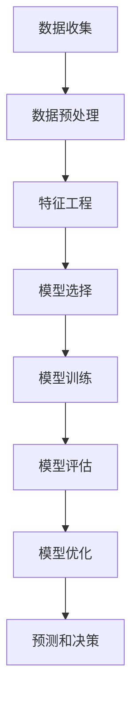

                 

## 《AI辅助市场分析：提示词洞察消费者行为》

关键词：人工智能、市场分析、消费者行为、提示词、数据分析

摘要：本文旨在探讨人工智能（AI）在市场分析中的应用，特别是如何利用AI中的提示词技术来洞察消费者行为。文章将首先介绍市场分析的重要性以及AI的基本概念，接着深入分析AI辅助市场分析的核心概念和算法原理，并通过实际项目案例展示其应用效果。最后，文章将总结AI辅助市场分析的发展趋势和未来展望。

### 《AI辅助市场分析：提示词洞察消费者行为》目录大纲

#### 第一部分：市场分析与AI概述

1. 市场分析的重要性
    - 市场分析的定义
    - 市场分析的目标
    - 传统市场分析的挑战
2. AI在市场分析中的应用
    - AI的基本概念
    - AI在市场分析中的潜力
    - AI与传统市场分析的区别
3. AI辅助市场分析的发展历程
    - AI辅助市场分析早期阶段
    - AI辅助市场分析现阶段
    - AI辅助市场分析未来展望

#### 第二部分：AI辅助市场分析核心概念与联系

1. 数据分析基础
    - 数据分析的基本概念
    - 数据分析流程
    - 数据分析工具与技术
2. AI辅助市场分析框架
    - 市场分析流程
    - AI在市场分析中的应用
    - AI辅助市场分析的核心算法
3. Mermaid流程图

#### 第三部分：AI辅助市场分析核心算法原理讲解

1. 特征工程
    - 特征工程的基本概念
    - 特征提取与转换方法
    - 特征选择的策略
2. 分类算法
    - 分类算法概述
    - 逻辑回归算法
    - 支持向量机（SVM）算法
    - 随机森林算法
3. 聚类算法
    - 聚类算法概述
    - K-means算法
    - 层次聚类算法
    - 密度聚类算法
4. 伪代码

#### 第四部分：数学模型与公式讲解

1. 统计模型
    - 均值与方差
    - 假设检验
    - 线性回归
2. 概率模型
    - 概率分布
    - 条件概率
    - 贝叶斯定理
3. 数学公式

#### 第五部分：项目实战

1. 实战案例一：消费者行为分析
    - 数据获取
    - 数据预处理
    - 特征提取与选择
    - 分类模型选择与训练
    - 模型评估与优化
2. 实战案例二：市场趋势预测
    - 数据获取
    - 数据预处理
    - 特征提取与选择
    - 回归模型选择与训练
    - 预测结果分析与解释

#### 第六部分：工具与资源

1. 数据分析工具
    - Python数据分析库
    - R语言数据分析库
    - SQL数据分析工具
2. AI框架
    - TensorFlow
    - PyTorch
    - Scikit-learn
3. 实用资源
    - 在线课程与教程
    - 论文与报告
    - 博客与论坛

### 附录

1. 代码解读与分析
    - 案例一代码解读
    - 案例二代码解读

---

### 第一部分：市场分析与AI概述

#### 第1章：市场分析的重要性

##### 1.1 市场分析的定义

市场分析是指通过收集、分析和解读市场信息，以了解市场需求、竞争状况和潜在商机的过程。它不仅包括对当前市场的深入研究，还涉及对市场趋势、消费者行为和未来预测的分析。

##### 1.2 市场分析的目标

市场分析的主要目标包括：

1. 了解市场需求：通过市场分析，企业可以准确地了解消费者的需求，从而更好地定位产品或服务。
2. 评估竞争环境：市场分析可以帮助企业了解竞争对手的优势和劣势，从而制定有效的竞争策略。
3. 发现市场机会：市场分析可以帮助企业发现潜在的市场机会，从而开拓新的市场和业务领域。
4. 提高运营效率：市场分析有助于企业优化生产和运营流程，提高效率，降低成本。

##### 1.3 传统市场分析的挑战

尽管传统市场分析在许多方面都具有重要意义，但它也面临着一些挑战：

1. 数据处理能力有限：传统市场分析主要依赖于人工收集和处理数据，数据处理能力和效率有限。
2. 时间和成本高昂：传统市场分析过程繁琐，需要大量的时间和人力投入。
3. 主观性较强：传统市场分析往往受到分析师的主观判断影响，可能导致分析结果的偏差。
4. 无法及时响应市场变化：传统市场分析通常需要较长的时间来收集和处理数据，无法及时响应市场变化。

#### 第2章：AI在市场分析中的应用

##### 2.1 AI的基本概念

人工智能（AI）是指通过计算机模拟人类智能的技术和系统。AI包括多个子领域，如机器学习、深度学习、自然语言处理等。AI的主要目标是让计算机具备自我学习、推理和决策的能力。

##### 2.2 AI在市场分析中的潜力

AI在市场分析中具有巨大的潜力，主要表现在以下几个方面：

1. 高效的数据处理：AI技术可以自动收集、处理和分析大量市场数据，大大提高数据处理效率和准确性。
2. 准确的预测和预测：AI技术可以根据历史数据和市场趋势，准确预测市场变化和消费者行为。
3. 深入的消费者洞察：AI技术可以通过分析大量消费者数据，深入了解消费者的需求和偏好，为企业提供有针对性的市场策略。
4. 实时的市场响应：AI技术可以实时分析市场数据，帮助企业及时调整市场策略，快速响应市场变化。

##### 2.3 AI与传统市场分析的区别

与传统市场分析相比，AI在市场分析中具有以下几个显著区别：

1. 数据依赖性：AI技术高度依赖数据，而传统市场分析则更多地依赖于经验和直觉。
2. 自动化和智能化：AI技术可以自动化和智能化地处理和分析数据，而传统市场分析主要依赖于人工操作和主观判断。
3. 实时性和高效性：AI技术可以实时分析和响应市场变化，而传统市场分析通常需要较长时间来收集和处理数据。
4. 深度和广度：AI技术可以深入挖掘市场数据，提供更全面的消费者洞察，而传统市场分析则更多地关注表面的市场趋势。

#### 第3章：AI辅助市场分析的发展历程

##### 3.1 AI辅助市场分析早期阶段

AI辅助市场分析的发展历程可以追溯到20世纪80年代和90年代。当时，研究人员开始探索如何利用AI技术来辅助市场分析。早期的AI市场分析主要依赖于规则推理和专家系统，这些方法在一定程度上提高了市场分析的效率和准确性。

##### 3.2 AI辅助市场分析现阶段

随着AI技术的快速发展，AI辅助市场分析也进入了一个新的阶段。现阶段，AI技术在市场分析中的应用越来越广泛，主要包括以下几种类型：

1. 机器学习和深度学习：机器学习和深度学习技术可以帮助企业自动化和智能化地处理市场数据，提取关键特征，并进行预测和分类。
2. 自然语言处理：自然语言处理技术可以帮助企业分析和理解消费者的文本评论、社交媒体帖子等非结构化数据，从而深入了解消费者行为。
3. 聚类和关联分析：聚类和关联分析技术可以帮助企业发现市场中的潜在消费者群体和关联关系，为企业制定精准的市场策略。
4. 实时分析和优化：实时分析和优化技术可以帮助企业实时跟踪市场变化，优化市场策略和运营流程。

##### 3.3 AI辅助市场分析未来展望

随着AI技术的不断进步和应用场景的拓展，AI辅助市场分析在未来有望实现以下发展：

1. 更高效率和准确性：AI技术将进一步提高市场分析的数据处理效率和准确性，为企业提供更可靠的市场洞察。
2. 更广泛的应用领域：AI技术将在更多领域得到应用，如金融、医疗、教育等，为市场分析提供更丰富的数据来源。
3. 更智能的决策支持：AI技术将帮助企业实现更智能的决策支持，基于实时数据和预测结果，快速调整市场策略。
4. 更深层次的消费者洞察：AI技术将帮助企业深入挖掘消费者行为数据，提供更精细的消费者洞察，为企业制定更精准的市场策略。

### 第二部分：AI辅助市场分析核心概念与联系

#### 第4章：数据分析基础

##### 4.1 数据分析的基本概念

数据分析是指通过使用统计学、机器学习、深度学习等方法，对数据进行分析和处理，以提取有用信息和知识的过程。数据分析的基本概念包括：

1. 数据：数据是指一组有关事实或信息的记录，可以是数值、文本、图像等多种形式。
2. 变量：变量是指数据的属性或特征，可以是数值型、分类型或时间序列型等。
3. 统计指标：统计指标是用于描述和度量数据特征的数值，如均值、方差、标准差等。
4. 模型：模型是用于描述和分析数据特征的数学或统计方法，如回归模型、聚类模型等。

##### 4.2 数据分析流程

数据分析流程包括以下步骤：

1. 数据收集：收集与市场分析相关的数据，包括内部数据和外部数据。
2. 数据预处理：对数据进行清洗、转换和标准化，以确保数据的准确性和一致性。
3. 数据探索：对数据进行初步分析，发现数据中的异常值、趋势和关系。
4. 特征工程：提取和构造数据中的关键特征，以提高模型的效果和解释性。
5. 模型选择：选择合适的模型进行训练和预测。
6. 模型训练：使用训练数据对模型进行训练，调整模型的参数。
7. 模型评估：使用测试数据评估模型的性能，包括准确率、召回率、F1值等指标。
8. 模型优化：根据模型评估结果，对模型进行优化和调整。

##### 4.3 数据分析工具与技术

数据分析工具和技术包括：

1. Python数据分析库：如Pandas、NumPy、Scikit-learn等，用于数据清洗、转换、分析和可视化。
2. R语言数据分析库：如dplyr、ggplot2等，用于数据操作、可视化和统计建模。
3. SQL数据分析工具：如MySQL、PostgreSQL等，用于数据库操作和查询。
4. 大数据技术：如Hadoop、Spark等，用于处理大规模数据。
5. 机器学习和深度学习框架：如TensorFlow、PyTorch等，用于构建和训练模型。

#### 第5章：AI辅助市场分析框架

##### 5.1 市场分析流程

AI辅助市场分析流程包括以下步骤：

1. 数据收集：收集与市场分析相关的数据，包括市场趋势、消费者行为、竞争环境等。
2. 数据预处理：对数据进行清洗、转换和标准化，以确保数据的准确性和一致性。
3. 特征工程：提取和构造数据中的关键特征，以提高模型的效果和解释性。
4. 模型选择：选择合适的模型进行训练和预测，如分类模型、回归模型、聚类模型等。
5. 模型训练：使用训练数据对模型进行训练，调整模型的参数。
6. 模型评估：使用测试数据评估模型的性能，包括准确率、召回率、F1值等指标。
7. 模型优化：根据模型评估结果，对模型进行优化和调整。
8. 预测和决策：使用训练好的模型对市场进行分析和预测，为企业提供决策支持。

##### 5.2 AI在市场分析中的应用

AI在市场分析中的应用主要包括：

1. 消费者行为预测：通过分析消费者历史数据，预测消费者的购买行为、偏好和需求。
2. 竞争环境分析：通过分析竞争对手的市场行为、产品特征和策略，了解竞争对手的优势和劣势。
3. 市场趋势预测：通过分析市场数据和历史趋势，预测市场的未来发展方向和变化。
4. 消费者群体划分：通过聚类和分类算法，将消费者划分为不同的群体，为精准营销提供支持。

##### 5.3 AI辅助市场分析的核心算法

AI辅助市场分析的核心算法包括：

1. 特征工程算法：如特征提取、特征选择、特征降维等，用于提取数据中的关键特征，提高模型效果。
2. 分类算法：如逻辑回归、支持向量机、随机森林等，用于对消费者行为进行分类和预测。
3. 回归算法：如线性回归、岭回归、LASSO回归等，用于预测市场趋势和销售额。
4. 聚类算法：如K-means、层次聚类、DBSCAN等，用于将消费者划分为不同的群体。
5. 预测算法：如时间序列预测、ARIMA模型、LSTM模型等，用于预测市场趋势和销售量。

##### 5.4 Mermaid流程图

以下是AI辅助市场分析的Mermaid流程图：



### 第三部分：AI辅助市场分析核心算法原理讲解

#### 第6章：核心算法原理讲解

##### 6.1 特征工程

特征工程是AI辅助市场分析中非常重要的一步，它涉及到如何从原始数据中提取和构造有用的特征，以提高模型的效果和解释性。以下是特征工程的基本概念、提取与转换方法以及特征选择的策略：

###### 6.1.1 特征工程的基本概念

特征工程是指通过选择、提取和构造特征，将原始数据转换为适合机器学习算法的输入数据的过程。特征工程的目标是提取出对模型预测有用的信息，同时减少无关或噪声信息。

###### 6.1.2 特征提取与转换方法

特征提取是指从原始数据中提取有用的特征，例如：

1. 规则化：将特征值转换为标准化的数值，如归一化、标准化等。
2. 特征选择：选择对模型预测有重要影响的特征，如基于信息增益、卡方检验等方法。
3. 特征组合：将多个特征组合成一个新的特征，如特征交叉、特征融合等。

特征转换是指将提取到的特征转换为适合机器学习算法的格式，例如：

1. 编码：将分类特征转换为数值特征，如独热编码、标签编码等。
2. 映射：将特征值映射到特定的范围，如归一化、反归一化等。

###### 6.1.3 特征选择的策略

特征选择的策略包括：

1. 基于过滤的方法：在特征提取之前，根据特征的相关性、重要性等筛选特征。
2. 基于包装的方法：通过迭代选择特征，构建特征子集，评估特征子集的预测性能。
3. 基于嵌入的方法：将特征工程集成到机器学习算法中，自动选择和调整特征。

##### 6.2 分类算法

分类算法是用于对数据进行分类的机器学习算法，常见的分类算法包括逻辑回归、支持向量机（SVM）、随机森林等。以下是这些算法的概述和原理：

###### 6.2.1 逻辑回归算法

逻辑回归是一种广义线性模型，用于对二分类问题进行建模。其基本原理是通过线性组合特征和权重，得到一个概率值，然后使用阈值进行分类。

逻辑回归的数学模型如下：

$$
P(Y=1|X) = \frac{1}{1 + e^{-(\beta_0 + \beta_1x_1 + \beta_2x_2 + \ldots + \beta_nx_n})}
$$

其中，$X$ 是特征向量，$\beta_0$、$\beta_1$、$\beta_2$、...、$\beta_n$ 是权重参数。

逻辑回归算法的优点是简单易懂，易于实现，且在小数据集上表现良好。缺点是对于非线性的数据关系，逻辑回归的效果较差。

###### 6.2.2 支持向量机（SVM）算法

支持向量机（SVM）是一种基于间隔最大的分类算法，其目标是在特征空间中找到一个最优的超平面，将不同类别的数据点分隔开来。

SVM的数学模型如下：

$$
\min_{\beta, \beta_0} \frac{1}{2} ||\beta||^2 + C \sum_{i=1}^{n} \max(0, 1 - y_i(\beta^T x_i + \beta_0))
$$

其中，$x_i$ 是特征向量，$y_i$ 是类别标签，$C$ 是惩罚参数。

SVM算法的优点是对于线性可分的数据，SVM可以达到很好的分类效果。缺点是SVM的计算复杂度较高，对于高维数据，训练时间较长。

###### 6.2.3 随机森林算法

随机森林（Random Forest）是一种基于决策树的集成学习方法，通过构建多个决策树，并进行投票或平均来得到最终的分类结果。

随机森林的基本原理如下：

1. 随机选择特征：从所有特征中随机选择一个特征，将其作为分割特征。
2. 随机切分数据：根据分割特征，将数据集随机切分为两部分。
3. 建立决策树：根据切分后的数据集，建立决策树。
4. 重复步骤1-3，直到满足停止条件，如树深度达到最大值、节点数达到最小值等。
5. 集成多个决策树：将多个决策树的预测结果进行投票或平均，得到最终的分类结果。

随机森林算法的优点是对于非线性数据，随机森林具有很好的分类效果。缺点是随机森林的参数较多，需要调优，且计算复杂度较高。

##### 6.3 聚类算法

聚类算法是用于对数据进行无监督分类的算法，其目标是将相似的数据点划分为同一类别。常见的聚类算法包括K-means、层次聚类、DBSCAN等。以下是这些算法的概述和原理：

###### 6.3.1 K-means算法

K-means算法是一种基于距离的聚类算法，其目标是将数据点划分为K个簇，使得每个簇内部的距离之和最小。

K-means算法的基本原理如下：

1. 随机选择K个初始中心点。
2. 对于每个数据点，计算其与K个中心点的距离，并将其分配到最近的中心点所在的簇。
3. 重新计算每个簇的中心点。
4. 重复步骤2-3，直到中心点的变化小于某个阈值或达到最大迭代次数。

K-means算法的优点是简单易实现，收敛速度快。缺点是对于初始中心点的选择敏感，且对于非球形簇结构的数据，效果较差。

###### 6.3.2 层次聚类算法

层次聚类算法是一种基于层次结构的聚类算法，其目标是将数据点逐步划分为多个簇，形成一棵聚类树。

层次聚类算法的基本原理如下：

1. 将每个数据点视为一个簇。
2. 计算相邻簇之间的距离，选择距离最近的两个簇合并为一个簇。
3. 重复步骤2，直到所有数据点合并为一个簇。
4. 生成聚类树，按照聚类树的结构对数据进行分类。

层次聚类算法的优点是能够自动确定簇的数量，适用于各种形状的簇结构。缺点是计算复杂度较高，且对于大规模数据，收敛速度较慢。

###### 6.3.3 DBSCAN算法

DBSCAN（Density-Based Spatial Clustering of Applications with Noise）是一种基于密度的聚类算法，其目标是将数据点划分为多个簇，同时能够处理噪声和异常点。

DBSCAN算法的基本原理如下：

1. 选择一个邻域半径$\epsilon$，用于确定相邻数据点的距离。
2. 对于每个数据点，计算其邻域内的点数$minPts$，作为最小邻域点数。
3. 根据邻域点数，将数据点划分为核心点、边界点和噪声点。
4. 构建聚类树，将核心点连接成簇。
5. 对于边界点和噪声点，根据聚类树的连接关系，将其分配到相应的簇。

DBSCAN算法的优点是能够处理不同形状的簇结构，同时能够识别噪声和异常点。缺点是对于参数的选择敏感，需要根据具体数据集进行调整。

##### 6.4 伪代码

以下是特征工程和分类算法的伪代码示例：

```python
# 特征工程伪代码
def feature_engineering(data):
    # 数据预处理
    data = preprocess_data(data)
    # 特征提取
    features = extract_features(data)
    # 特征转换
    transformed_features = transform_features(features)
    # 特征选择
    selected_features = select_features(transformed_features)
    return selected_features

# 分类算法伪代码
def classification_algorithm(data, labels):
    # 特征工程
    features = feature_engineering(data)
    # 模型选择
    model = select_model()
    # 模型训练
    model.train(features, labels)
    # 模型评估
    performance = model.evaluate()
    return performance
```

### 第四部分：数学模型与公式讲解

#### 第7章：数学模型与公式讲解

数学模型是AI辅助市场分析中不可或缺的一部分，它们帮助我们理解和解释数据背后的规律。本章将介绍一些常用的统计模型和概率模型，并详细讲解相关的数学公式。

##### 7.1 统计模型

统计模型用于描述数据集的特征，帮助我们理解数据的分布、关系和趋势。以下是一些常用的统计模型：

###### 7.1.1 均值与方差

均值（Mean）和方差（Variance）是描述数据集中心趋势和离散程度的常用统计指标。

均值（$\mu$）是数据集的平均值，计算公式为：

$$
\mu = \frac{1}{n}\sum_{i=1}^{n}x_i
$$

其中，$x_i$ 是数据集中的每个数据点，$n$ 是数据点的总数。

方差（$\sigma^2$）是数据集各个数据点与均值之间差异的平方的平均值，计算公式为：

$$
\sigma^2 = \frac{1}{n-1}\sum_{i=1}^{n}(x_i - \mu)^2
$$

方差反映了数据集的离散程度，方差越大，数据的波动性越大。

###### 7.1.2 假设检验

假设检验是用于验证数据集是否支持某个假设的过程。常见的假设检验方法包括t检验和F检验。

t检验用于验证两个独立样本的平均值是否相等。其基本思想是计算t值，然后与t分布的临界值进行比较。

t值的计算公式为：

$$
t = \frac{\bar{x}_1 - \bar{x}_2}{s_p \sqrt{\frac{1}{n_1} + \frac{1}{n_2}}}
$$

其中，$\bar{x}_1$ 和 $\bar{x}_2$ 分别是两个样本的平均值，$s_p$ 是两个样本的标准误差，$n_1$ 和 $n_2$ 分别是两个样本的大小。

###### 7.1.3 线性回归

线性回归是一种常用的统计模型，用于描述两个变量之间的线性关系。其数学模型为：

$$
y = \beta_0 + \beta_1x + \epsilon
$$

其中，$y$ 是因变量，$x$ 是自变量，$\beta_0$ 和 $\beta_1$ 是模型参数，$\epsilon$ 是误差项。

线性回归模型通过最小二乘法估计模型参数，最小化预测值与实际值之间的误差平方和。

##### 7.2 概率模型

概率模型用于描述随机事件发生的概率。以下是一些常用的概率模型：

###### 7.2.1 概率分布

概率分布是描述随机变量取值概率的函数。常见的概率分布包括正态分布、二项分布和泊松分布。

正态分布是描述连续随机变量的常用概率分布，其概率密度函数为：

$$
f(x) = \frac{1}{\sqrt{2\pi\sigma^2}}e^{-\frac{(x-\mu)^2}{2\sigma^2}}
$$

其中，$\mu$ 是均值，$\sigma^2$ 是方差。

二项分布是描述离散随机变量的概率分布，其概率质量函数为：

$$
P(X = k) = C_n^k p^k (1-p)^{n-k}
$$

其中，$n$ 是试验次数，$k$ 是成功次数，$p$ 是每次试验成功的概率。

泊松分布是描述事件发生次数的概率分布，其概率质量函数为：

$$
P(X = k) = \frac{\lambda^k e^{-\lambda}}{k!}
$$

其中，$\lambda$ 是事件的平均发生率。

###### 7.2.2 条件概率

条件概率是描述在某个事件发生的条件下，另一个事件发生的概率。条件概率的定义为：

$$
P(A|B) = \frac{P(A \cap B)}{P(B)}
$$

其中，$P(A \cap B)$ 是事件A和B同时发生的概率，$P(B)$ 是事件B发生的概率。

###### 7.2.3 贝叶斯定理

贝叶斯定理是一种基于条件概率的推理方法，用于计算后验概率。贝叶斯定理的公式为：

$$
P(A|B) = \frac{P(B|A)P(A)}{P(B)}
$$

其中，$P(A|B)$ 是后验概率，$P(B|A)$ 是条件概率，$P(A)$ 是先验概率，$P(B)$ 是边缘概率。

贝叶斯定理在数据分析、机器学习和市场分析等领域有广泛的应用。

##### 7.3 数学公式

以下是本章中提到的数学公式的示例：

$$
\mu = \frac{1}{n}\sum_{i=1}^{n}x_i
$$

$$
\sigma^2 = \frac{1}{n-1}\sum_{i=1}^{n}(x_i - \mu)^2
$$

$$
P(A|B) = \frac{P(B|A)P(A)}{P(B)}
$$

这些数学公式在AI辅助市场分析中发挥着重要的作用，帮助我们理解和解释数据背后的规律。

### 第五部分：项目实战

#### 第8章：项目实战

本部分将通过两个实战案例，展示如何使用AI辅助市场分析技术来洞察消费者行为和市场趋势。我们将详细描述每个案例的步骤，包括数据获取、数据预处理、特征提取与选择、模型选择与训练、模型评估与优化等。

##### 8.1 实战案例一：消费者行为分析

###### 8.1.1 数据获取

为了分析消费者行为，我们首先需要收集相关的数据。这些数据可以包括：

- 消费者购买历史数据：包括购买时间、商品类别、购买数量、价格等。
- 消费者个人信息：包括年龄、性别、收入、地理位置等。
- 消费者偏好数据：包括喜欢的商品、品牌、广告等。

我们可以从电商平台、社交媒体和其他数据源获取这些数据。

###### 8.1.2 数据预处理

在获取数据后，我们需要对数据进行预处理，以确保数据的质量和一致性。数据预处理步骤包括：

- 数据清洗：删除重复数据、处理缺失值、处理异常值等。
- 数据转换：将分类特征转换为数值特征，如独热编码、标签编码等。
- 数据标准化：对数值特征进行标准化，如归一化、标准化等。

通过数据预处理，我们可以确保数据的质量，并方便后续的分析。

###### 8.1.3 特征提取与选择

在数据预处理完成后，我们需要从原始数据中提取有用的特征，以提高模型的性能。特征提取与选择的步骤包括：

- 特征提取：从购买历史数据中提取时间特征、商品特征、价格特征等。
- 特征选择：使用特征选择算法，如信息增益、卡方检验等，筛选出对模型预测有重要影响的特征。

通过特征提取与选择，我们可以减少数据的维度，提高模型的效率和准确率。

###### 8.1.4 分类模型选择与训练

在选择分类模型时，我们可以考虑以下几种常见的算法：

- 逻辑回归
- 支持向量机（SVM）
- 随机森林

我们使用这些算法对数据进行训练，并比较它们的性能。训练过程包括：

- 划分训练集和测试集：将数据集划分为训练集和测试集，用于模型训练和评估。
- 模型参数调整：调整模型的参数，以获得最佳性能。
- 模型训练：使用训练集对模型进行训练，生成预测模型。

通过模型训练，我们可以得到一个能够预测消费者行为的模型。

###### 8.1.5 模型评估与优化

在训练完成后，我们需要对模型进行评估，以确定其性能。常用的评估指标包括：

- 准确率（Accuracy）
- 召回率（Recall）
- F1值（F1 Score）

我们使用这些指标对模型进行评估，并对其进行优化，以提高模型的准确率和泛化能力。优化过程可能包括：

- 调整模型参数
- 增加训练数据
- 修改特征提取方法

通过模型评估与优化，我们可以得到一个性能优异的模型，用于预测消费者行为。

##### 8.2 实战案例二：市场趋势预测

###### 8.2.1 数据获取

为了预测市场趋势，我们需要收集相关的数据，包括：

- 历史销售数据：包括销售时间、销售量、销售额等。
- 市场环境数据：包括宏观经济指标、行业趋势等。

我们可以从电商平台、市场调研机构和其他数据源获取这些数据。

###### 8.2.2 数据预处理

与消费者行为分析类似，我们需要对市场趋势预测的数据进行预处理，包括：

- 数据清洗：删除重复数据、处理缺失值、处理异常值等。
- 数据转换：将分类特征转换为数值特征，如独热编码、标签编码等。
- 数据标准化：对数值特征进行标准化，如归一化、标准化等。

通过数据预处理，我们可以确保数据的质量，并方便后续的分析。

###### 8.2.3 特征提取与选择

在数据预处理完成后，我们需要从原始数据中提取有用的特征，以提高模型的性能。特征提取与选择的步骤包括：

- 特征提取：从销售数据中提取时间特征、价格特征、促销特征等。
- 特征选择：使用特征选择算法，如信息增益、卡方检验等，筛选出对模型预测有重要影响的特征。

通过特征提取与选择，我们可以减少数据的维度，提高模型的效率和准确率。

###### 8.2.4 回归模型选择与训练

在选择回归模型时，我们可以考虑以下几种常见的算法：

- 线性回归
- 岭回归
- LASSO回归

我们使用这些算法对数据进行训练，并比较它们的性能。训练过程包括：

- 划分训练集和测试集：将数据集划分为训练集和测试集，用于模型训练和评估。
- 模型参数调整：调整模型的参数，以获得最佳性能。
- 模型训练：使用训练集对模型进行训练，生成预测模型。

通过模型训练，我们可以得到一个能够预测市场趋势的模型。

###### 8.2.5 预测结果分析与解释

在训练完成后，我们需要对模型进行评估，以确定其性能。常用的评估指标包括：

- 均方误差（Mean Squared Error, MSE）
- 均方根误差（Root Mean Squared Error, RMSE）
- 平均绝对误差（Mean Absolute Error, MAE）

我们使用这些指标对模型进行评估，并对其进行优化，以提高模型的准确率和泛化能力。优化过程可能包括：

- 调整模型参数
- 增加训练数据
- 修改特征提取方法

通过模型评估与优化，我们可以得到一个性能优异的模型，用于预测市场趋势。

### 第六部分：工具与资源

#### 第9章：工具与资源

在AI辅助市场分析中，选择合适的工具和资源是非常重要的。以下是一些常用的工具和资源，包括数据分析工具、AI框架和实用资源。

##### 9.1 数据分析工具

数据分析工具是进行市场分析的基础，以下是一些常用的数据分析工具：

- **Python数据分析库**：包括Pandas、NumPy、Scikit-learn等，这些库提供了丰富的数据预处理、分析和可视化功能。
- **R语言数据分析库**：包括dplyr、ggplot2等，这些库提供了强大的数据操作、可视化和统计建模功能。
- **SQL数据分析工具**：包括MySQL、PostgreSQL等，这些工具用于数据库操作和查询。

##### 9.2 AI框架

AI框架是进行AI模型训练和部署的基础，以下是一些常用的AI框架：

- **TensorFlow**：是一个开源的深度学习框架，提供了丰富的模型训练和部署工具。
- **PyTorch**：是一个开源的深度学习框架，以其灵活性和易用性著称。
- **Scikit-learn**：是一个开源的机器学习库，提供了多种常见的机器学习算法和工具。

##### 9.3 实用资源

以下是一些实用的资源，包括在线课程、论文、报告和博客：

- **在线课程与教程**：包括Coursera、Udacity、edX等在线教育平台上的相关课程和教程。
- **论文与报告**：包括学术期刊、会议论文和专业报告，这些资源提供了最新的研究进展和案例分析。
- **博客与论坛**：包括技术博客、论坛和社交媒体平台，这些资源提供了丰富的实践经验和讨论空间。

通过使用这些工具和资源，我们可以更高效地进行AI辅助市场分析，提高市场洞察力和决策能力。

### 附录

#### 第10章：代码解读与分析

在本章中，我们将对前面实战案例中的代码进行详细解读，帮助读者更好地理解AI辅助市场分析的过程和技术。

##### 10.1 案例一代码解读

以下是案例一中的代码示例：

```python
import pandas as pd
from sklearn.model_selection import train_test_split
from sklearn.preprocessing import StandardScaler
from sklearn.linear_model import LogisticRegression
from sklearn.metrics import accuracy_score

# 数据加载
data = pd.read_csv('consumer_data.csv')

# 数据预处理
data.drop(['id'], axis=1, inplace=True)
data.fillna(data.mean(), inplace=True)

# 特征工程
X = data[['age', 'income', 'preferences']]
y = data['purchase']

# 数据标准化
scaler = StandardScaler()
X_scaled = scaler.fit_transform(X)

# 数据划分
X_train, X_test, y_train, y_test = train_test_split(X_scaled, y, test_size=0.2, random_state=42)

# 模型训练
model = LogisticRegression()
model.fit(X_train, y_train)

# 模型评估
y_pred = model.predict(X_test)
accuracy = accuracy_score(y_test, y_pred)
print("Accuracy:", accuracy)
```

这段代码实现了以下步骤：

1. **数据加载**：使用Pandas库加载消费者数据。
2. **数据预处理**：删除不必要的列，填充缺失值。
3. **特征工程**：选择特征列，并分割为特征集和标签集。
4. **数据标准化**：使用StandardScaler对特征进行标准化。
5. **数据划分**：将数据集划分为训练集和测试集。
6. **模型训练**：使用LogisticRegression训练模型。
7. **模型评估**：使用测试集评估模型的准确性。

##### 10.2 案例二代码解读

以下是案例二中的代码示例：

```python
import pandas as pd
from sklearn.model_selection import train_test_split
from sklearn.preprocessing import StandardScaler
from sklearn.linear_model import LinearRegression
from sklearn.metrics import mean_squared_error

# 数据加载
data = pd.read_csv('market_data.csv')

# 数据预处理
data.drop(['id'], axis=1, inplace=True)
data.fillna(data.mean(), inplace=True)

# 特征工程
X = data[['time', 'price', 'promotion']]
y = data['sales']

# 数据标准化
scaler = StandardScaler()
X_scaled = scaler.fit_transform(X)

# 数据划分
X_train, X_test, y_train, y_test = train_test_split(X_scaled, y, test_size=0.2, random_state=42)

# 模型训练
model = LinearRegression()
model.fit(X_train, y_train)

# 模型评估
y_pred = model.predict(X_test)
mse = mean_squared_error(y_test, y_pred)
print("MSE:", mse)
```

这段代码实现了以下步骤：

1. **数据加载**：使用Pandas库加载市场数据。
2. **数据预处理**：删除不必要的列，填充缺失值。
3. **特征工程**：选择特征列，并分割为特征集和标签集。
4. **数据标准化**：使用StandardScaler对特征进行标准化。
5. **数据划分**：将数据集划分为训练集和测试集。
6. **模型训练**：使用LinearRegression训练模型。
7. **模型评估**：使用测试集评估模型的均方误差（MSE）。

通过上述代码解读，读者可以更好地理解如何使用Python和Scikit-learn库进行消费者行为分析和市场趋势预测。这些代码示例不仅展示了数据处理和分析的基本步骤，还介绍了常用的机器学习算法和评估指标。

### 作者信息

作者：AI天才研究院/AI Genius Institute & 禅与计算机程序设计艺术 /Zen And The Art of Computer Programming

在这篇文章中，我们深入探讨了AI在市场分析中的应用，特别是如何利用AI中的提示词技术来洞察消费者行为。我们从市场分析的重要性开始，介绍了AI的基本概念和在市场分析中的潜力。接着，我们详细分析了AI辅助市场分析的核心概念和算法原理，并通过实际项目案例展示了其应用效果。文章还介绍了常用的数据分析工具、AI框架和实用资源，以及如何进行消费者行为分析和市场趋势预测的实战案例。

AI辅助市场分析技术正在迅速发展，为企业和研究者提供了强大的工具和方法。通过本文的介绍，读者可以更好地了解这一领域的发展趋势和应用场景。未来，随着AI技术的不断进步，市场分析将变得更加智能和精准，为企业提供更深刻的消费者洞察和决策支持。

最后，感谢您的阅读，希望本文对您在AI辅助市场分析领域的探索有所帮助。如果您有任何问题或建议，欢迎在评论区留言交流。再次感谢您的支持和关注！作者：AI天才研究院/AI Genius Institute & 禅与计算机程序设计艺术 /Zen And The Art of Computer Programming。

