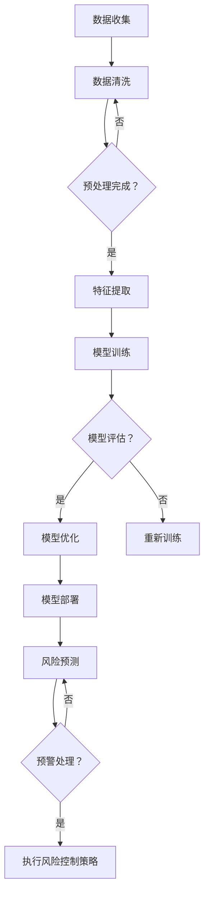

                 

### 引言

近年来，人工智能（AI）技术在金融领域的应用日益广泛，特别是在金融风险分析方面。随着金融市场的复杂性和不确定性不断增加，传统的金融分析方法已经难以满足现代金融风险管理的要求。人工智能，尤其是机器学习和深度学习技术的引入，为金融风险分析带来了革命性的变化。

**本篇文章将围绕AI辅助金融风险分析中的提示词策略展开讨论。**

首先，我们将简要回顾AI在金融领域的发展背景，介绍AI辅助金融风险分析的重要性。接着，文章将概述本书的结构和内容安排，使读者对后续内容有一个整体的了解。

在引言部分，我们还将讨论AI辅助金融风险分析的基本概念，包括AI在金融领域的应用现状、发展趋势以及面临的挑战。通过这一部分，读者将能够理解AI在金融风险分析中的关键作用。

最后，文章将介绍本文的目录结构和内容安排，为后续章节的深入讨论奠定基础。

### AI在金融领域的发展背景

人工智能在金融领域的应用可以追溯到20世纪80年代，当时计算机技术的兴起促使金融行业开始探索自动化交易系统。然而，AI技术的真正突破发生在21世纪初，随着互联网的普及和大数据技术的发展，金融行业开始大规模采用机器学习和深度学习算法来优化决策过程、提高运营效率和防范风险。

早期的AI应用主要集中在自动化交易和风险评估上。例如，高频交易系统利用算法快速分析市场数据，进行高频买卖操作，以获取微小的利润。同时，风险模型也开始采用机器学习技术，通过历史数据分析，预测贷款违约、市场波动等风险事件。

随着计算能力的提升和算法的优化，AI在金融领域的应用范围不断扩展。现在，AI已经深入到金融的各个层面，包括客户服务、风险管理、投资决策、市场预测等。具体应用场景包括：

1. **客户服务**：通过自然语言处理技术，AI可以自动回答客户的查询，提高客户满意度，降低运营成本。例如，银行使用聊天机器人与客户互动，提供24/7的客户服务。

2. **风险评估**：AI可以分析大量的金融数据，包括交易记录、客户信用历史等，以更准确、实时地评估贷款违约风险和市场波动风险。这有助于金融机构更好地管理风险，优化信贷审批流程。

3. **投资决策**：利用AI算法，金融机构可以分析大量的市场数据，识别潜在的投资机会，优化投资组合。例如，量化基金利用机器学习算法进行高频交易，实现持续稳健的收益。

4. **欺诈检测**：通过模式识别和异常检测技术，AI可以自动识别金融交易中的欺诈行为，帮助金融机构防范金融犯罪。

5. **市场预测**：AI算法可以分析宏观经济数据、市场趋势和公司财务报表，预测市场走势和公司表现。这有助于投资者做出更明智的决策。

AI在金融领域的发展不仅改变了传统的业务模式，还提升了金融服务的效率和准确性。然而，随着AI技术的不断进步，金融行业也面临着新的挑战。例如，AI算法的透明度和可解释性问题、数据隐私保护问题以及模型偏见问题等。因此，如何在充分利用AI技术优势的同时，有效应对这些挑战，成为金融行业持续发展的关键。

### AI辅助金融风险分析的重要性

AI辅助金融风险分析的重要性不容忽视。首先，传统的金融风险分析方法主要依赖于人类专家的经验和直觉，这种方法在面对复杂、多变的市场环境时存在很大的局限性。而AI技术，通过机器学习和深度学习算法，可以从海量数据中提取有价值的信息，提供更为精准和实时的风险分析。

具体来说，AI在金融风险分析中具有以下优势：

1. **数据处理能力**：金融领域涉及大量的结构化和非结构化数据，如交易记录、客户行为数据、新闻报道等。AI可以通过数据挖掘和分析技术，快速处理这些数据，从中提取出潜在的风险信号。

2. **实时性**：传统的风险分析往往需要较长的时间来收集和处理数据，而AI技术可以实现实时数据分析，快速识别和响应市场变化，从而更有效地管理风险。

3. **全面性**：AI可以通过分析多个维度的数据，包括历史数据、实时数据和市场数据等，提供更全面的视角，帮助金融机构更准确地评估风险。

4. **预测性**：机器学习算法可以根据历史数据建立预测模型，预测未来可能的风险事件。这种预测能力有助于金融机构提前采取防范措施，降低风险损失。

5. **自动化的风险控制**：通过AI技术，金融机构可以自动化执行风险控制策略，如动态调整信贷额度、实时监控交易异常等，提高风险管理的效率。

此外，AI辅助金融风险分析还能带来以下几个方面的积极影响：

- **提升决策质量**：AI可以提供基于数据的、客观的风险分析结果，帮助决策者做出更明智的决策。
- **优化资源配置**：通过更精准的风险预测和控制，金融机构可以更合理地配置资源，降低运营成本。
- **增强客户信任**：高效的金融风险控制能够提升客户对金融机构的信任，增加客户忠诚度。
- **应对市场变化**：AI技术可以帮助金融机构迅速适应市场变化，及时调整业务策略，保持竞争力。

然而，AI辅助金融风险分析也面临一些挑战，如算法偏见、模型可解释性不足、数据隐私问题等。这些问题需要通过技术手段和监管措施加以解决，以充分发挥AI在金融风险分析中的潜力。

### 本书结构及内容安排

本文将分为三个主要部分，详细探讨AI辅助金融风险分析的相关知识。第一部分为引言，介绍AI在金融领域的发展背景和重要性，概述本书的结构和内容安排。

第二部分将深入探讨AI的核心概念与原理。首先，我们将介绍人工智能与机器学习的基础知识，包括其基本概念和架构。接着，我们将介绍金融风险分析中常用的算法，如时间序列分析、贝叶斯分析和集成学习方法等。这部分内容旨在帮助读者建立对AI和金融风险分析技术的全面理解。

第三部分将聚焦于实践应用。我们将通过一个具体的实战项目，展示如何搭建基于AI的金融风险分析系统。这一部分将详细介绍项目背景、系统架构、数据预处理、模型选择与优化、系统部署与监控等环节，并辅以实际案例，说明AI辅助金融风险分析在信贷风险分析、市场风险监控和反欺诈检测等领域的应用。

文章的最后，我们将讨论AI辅助金融风险分析的未来发展趋势与挑战，总结本文的主要观点，并提供进一步阅读的资源。通过这三个部分的讨论，本文旨在为读者提供一份全面而深入的AI辅助金融风险分析指南。

### AI辅助金融风险分析的基本概念

在探讨AI辅助金融风险分析的具体应用之前，有必要先明确几个关键概念，以便读者对这一领域有更深入的理解。

**AI辅助金融风险分析**，顾名思义，就是利用人工智能技术来协助金融机构识别、评估和管理金融风险。这包括了从海量数据中提取有价值的信息，构建预测模型，自动化执行风险控制策略等过程。具体来说，AI辅助金融风险分析包括以下几个方面：

1. **数据收集与预处理**：金融风险分析需要大量的数据，包括交易记录、客户行为数据、市场数据等。AI技术可以帮助金融机构高效地收集和处理这些数据，进行数据清洗和特征提取，为后续分析奠定基础。

2. **模型构建与训练**：利用机器学习和深度学习算法，可以从数据中学习到隐藏的风险模式。通过训练模型，金融机构可以预测未来的风险事件，如贷款违约、市场波动等。

3. **实时监控与预警**：AI技术可以实时分析金融市场数据，监控潜在的风险信号，并自动触发预警机制。这有助于金融机构迅速采取应对措施，减少风险损失。

4. **自动化风险控制**：通过自动化执行风险控制策略，如动态调整信贷额度、实时监控交易异常等，AI可以提高风险管理的效率和准确性。

5. **报告与决策支持**：AI辅助金融风险分析可以生成详细的风险报告，提供基于数据的决策支持，帮助金融机构管理者做出更明智的决策。

接下来，我们将具体探讨AI辅助金融风险分析在金融领域的应用现状和未来的发展趋势。

#### AI辅助金融风险分析在金融领域的应用现状

AI辅助金融风险分析在金融领域的应用已经取得了显著成效。以下是一些典型的应用案例：

1. **信贷风险评估**：银行和金融机构利用AI技术对贷款申请者的信用风险进行评估。通过分析客户的财务状况、信用历史、行为数据等，AI可以预测贷款违约的概率，帮助金融机构优化信贷审批流程，降低不良贷款率。

2. **市场风险监控**：AI算法可以分析大量的市场数据，包括股价、汇率、宏观经济指标等，预测市场走势和潜在的风险事件。金融机构可以利用这些预测结果，调整投资组合，规避市场风险。

3. **反欺诈检测**：金融交易中的欺诈行为给金融机构带来了巨大的损失。AI技术通过模式识别和异常检测，可以自动识别可疑的交易行为，提高欺诈检测的准确性和效率。

4. **客户行为分析**：金融机构利用AI技术分析客户的行为数据，如交易频率、交易金额等，了解客户偏好和需求，提供个性化的金融服务，提高客户满意度。

5. **投资决策支持**：AI算法可以分析市场数据、公司财务报表和新闻报道等，为投资者提供投资建议，优化投资组合。例如，量化基金利用机器学习算法进行高频交易，实现稳健的收益。

6. **自动化交易系统**：高频交易系统利用AI技术，通过快速分析市场数据，进行高频买卖操作，以获取微小的利润。这种自动化交易系统在金融市场中越来越普及。

总体来看，AI辅助金融风险分析已经在金融领域得到了广泛应用，并且取得了显著的成效。然而，随着AI技术的不断进步，金融行业也面临着新的挑战，需要持续优化和改进风险分析模型和方法。

#### AI辅助金融风险分析的发展趋势

随着AI技术的不断进步，AI辅助金融风险分析也在不断演进，呈现出以下几个发展趋势：

1. **深度学习技术的应用**：深度学习算法在图像识别、语音识别等领域取得了巨大的成功，其在金融风险分析中的应用也日益广泛。通过使用深度神经网络，可以更有效地从复杂、非结构化的数据中提取有价值的信息，提升风险预测的准确性。

2. **大数据分析技术的融合**：大数据分析技术可以帮助金融机构处理海量数据，提取更多潜在的风险信号。结合AI技术，金融机构可以构建更全面、更精准的风险分析模型。

3. **实时分析技术的应用**：实时数据分析技术可以实现风险事件的实时监控和预警，有助于金融机构迅速应对市场变化，减少风险损失。

4. **区块链技术的结合**：区块链技术可以提供去中心化、透明的数据存储和交易记录，有助于提高金融交易的透明度和安全性。结合AI技术，可以实现更安全、高效的金融风险管理。

5. **可解释性AI的研究**：虽然AI技术可以在风险分析中取得很好的效果，但其透明度和可解释性问题仍然备受关注。可解释性AI的研究旨在提高AI模型的可理解性，使其在金融风险管理中得到更广泛的应用。

6. **跨界融合技术的应用**：AI辅助金融风险分析不仅依赖于传统的金融数据，还开始融合其他领域的知识，如气象数据、社会数据等，构建更加综合的风险分析模型。

7. **监管技术的融合**：随着AI技术在金融风险分析中的应用，监管机构也开始关注AI技术可能带来的风险。通过引入监管技术，可以实现AI辅助金融风险分析的合规性和安全性。

总之，AI辅助金融风险分析在未来将继续快速发展，并呈现出更多新的应用场景和挑战。金融机构需要不断探索和应用新的技术，以提升金融风险管理的效率和准确性。

#### AI辅助金融风险分析面临的挑战与对策

尽管AI辅助金融风险分析展现出巨大的潜力，但其在实际应用中仍然面临一系列挑战。以下是一些主要的挑战及相应的对策：

1. **数据质量和完整性**：金融风险分析依赖于大量的数据，但数据质量和完整性是关键问题。数据质量问题包括缺失值、噪声数据、不一致数据等，这些问题会影响模型的训练效果和预测准确性。对策是建立完善的数据治理机制，确保数据的准确性和完整性，包括数据清洗、数据整合和数据标准化。

2. **算法透明度和可解释性**：AI模型的黑箱特性使得其决策过程难以解释，这在金融风险管理中尤为重要。增加算法的可解释性可以增强决策者的信任，提高模型的应用价值。对策是开发可解释性AI技术，如LIME（局部可解释模型解释）和SHAP（SHapley Additive exPlanations），使模型决策过程更加透明。

3. **模型偏见和公平性**：AI模型可能会因为训练数据的不公平性而引入偏见，导致对某些群体或类型的金融交易产生不公平的待遇。对策是采用公平性评估方法，如公平性度量指标和公平性训练技术，确保模型的决策是公平的。

4. **数据隐私和安全性**：金融数据通常涉及客户的敏感信息，数据隐私和安全问题是金融风险分析中必须考虑的因素。对策是采用数据加密、隐私保护技术和访问控制策略，确保数据的安全和隐私。

5. **技术更新和适应性**：AI技术发展迅速，金融风险分析模型需要不断更新以应对新的风险形势。对策是建立持续的技术更新机制，定期评估和优化模型，确保其适应性和有效性。

6. **法律法规和监管**：随着AI技术的应用，监管机构对金融风险分析模型的合规性提出了更高的要求。对策是遵循相关法律法规，确保模型的应用符合监管要求，并积极配合监管机构的审查。

通过上述对策，金融机构可以在利用AI辅助金融风险分析的同时，有效应对潜在的挑战，确保风险管理的持续优化和改进。

### 提示词策略的概念与作用

在AI辅助金融风险分析中，提示词策略（Prompt Engineering）扮演着至关重要的角色。提示词策略是指通过设计特定的提示词或提示语，引导AI模型进行更准确、高效的推理和预测。这一策略不仅能够提高模型的表现，还能增强模型对特定问题的理解和适应性。

#### 提示词策略的基本概念

提示词策略的核心在于通过优化输入提示来引导模型的训练和推理过程。具体来说，提示词策略包括以下几个方面：

1. **目标设定**：明确模型需要解决的问题或目标，为提示词设计提供方向。

2. **数据准备**：根据目标设定，准备相关数据，并进行预处理，确保数据质量。

3. **提示词设计**：设计合适的提示词，引导模型关注关键信息，提高模型对问题的理解。

4. **模型训练**：使用设计的提示词进行模型训练，调整模型参数，优化模型表现。

5. **效果评估**：评估提示词策略的效果，通过实验和测试，确定最佳提示词组合。

#### 提示词策略的作用

1. **增强模型理解力**：通过设计特定的提示词，引导模型关注关键信息，提升模型对问题的理解能力。例如，在信贷风险评估中，设计提示词以强调客户的信用历史和行为数据，可以提升模型对信用风险的识别能力。

2. **提高预测准确性**：提示词策略可以优化模型的输入，减少无关信息的干扰，从而提高模型的预测准确性。例如，在市场风险监控中，通过设计提示词突出市场数据中的关键指标，可以更准确地预测市场走势。

3. **提升模型泛化能力**：通过提示词策略，可以引导模型学习到更具代表性的特征，提高模型在不同数据集上的泛化能力。这对于处理不同时间窗口或市场环境的风险分析具有重要意义。

4. **增强模型可解释性**：提示词策略有助于提高模型的可解释性，使模型决策过程更加透明。例如，在反欺诈检测中，通过设计提示词，可以展示模型如何利用特定特征识别欺诈行为，增强决策的可信度。

#### 提示词策略在金融风险分析中的应用

1. **信贷风险评估**：在信贷风险评估中，设计提示词以强调客户的信用历史、财务状况和行为数据，可以提升模型对信用风险的识别能力。例如，使用“请根据以下财务数据和行为记录，评估该客户的信用风险”作为提示词，可以引导模型更关注客户的实际财务状况和行为表现。

2. **市场风险监控**：在设计市场风险监控模型时，通过提示词突出关键市场指标，如利率、汇率、宏观经济数据等，可以提高模型对市场风险的预测准确性。例如，使用“请根据以下利率、汇率和宏观经济数据，预测未来的市场波动情况”作为提示词，可以引导模型关注这些关键因素。

3. **反欺诈检测**：在反欺诈检测中，设计提示词以突出交易特征和异常行为，可以提升模型对欺诈行为的识别能力。例如，使用“请根据以下交易数据，识别潜在的欺诈行为”作为提示词，可以引导模型关注交易金额、频率、时间段等关键特征。

通过上述应用，提示词策略在金融风险分析中发挥了重要作用，帮助模型更好地理解和处理复杂、多维的金融数据，提高风险识别和预测的准确性。

### 提示词策略的分类与实现

提示词策略在AI辅助金融风险分析中有着广泛的应用，其分类和实现方法多种多样。以下是几种常见的提示词策略及其实现方法：

#### 1. 基于规则的提示词策略

**原理**：基于规则的提示词策略通过预设一系列规则，指导模型在特定情况下如何推理和预测。这些规则可以是基于专家经验或已有数据的模式识别。

**实现方法**：首先，定义一组规则，例如，“当客户信用评分低于600时，增加违约概率的权重”。然后，将这些规则嵌入到提示词中，例如，“请根据以下客户数据，特别是信用评分，预测违约风险”。

**适用场景**：适用于需要明确、固定规则的风险分析场景，如信贷风险评估。

#### 2. 基于机器学习的提示词策略

**原理**：基于机器学习的提示词策略通过机器学习算法，从历史数据中学习到潜在的模式，并将其嵌入到提示词中，指导模型的推理和预测。

**实现方法**：首先，使用机器学习算法（如决策树、随机森林等）训练模型，从数据中提取关键特征。然后，将这些特征嵌入到提示词中，例如，“请根据以下交易数据和客户历史记录，特别是交易金额和信用评分，预测欺诈风险”。

**适用场景**：适用于数据量大、特征复杂的风险分析场景，如反欺诈检测。

#### 3. 基于深度学习的提示词策略

**原理**：基于深度学习的提示词策略利用深度神经网络，从大规模数据中自动提取高级特征，并通过优化提示词，提高模型的预测能力。

**实现方法**：首先，使用深度学习框架（如TensorFlow、PyTorch）训练模型，从数据中学习到高级特征表示。然后，设计动态提示词，通过优化提示词，指导模型在特定任务上表现更好。例如，使用“在当前市场环境下，请根据以下交易数据和宏观经济指标，预测未来一周的市场走势”。

**适用场景**：适用于需要处理复杂、非线性关系的风险分析场景，如市场风险监控。

#### 4. 基于大数据的提示词策略

**原理**：基于大数据的提示词策略通过大数据技术，处理和分析海量数据，提取关键特征和模式，并将其嵌入到提示词中。

**实现方法**：首先，利用大数据处理框架（如Hadoop、Spark）对海量金融数据进行清洗、整合和分析，提取关键特征。然后，将这些特征嵌入到提示词中，例如，“请根据以下大量交易数据和市场新闻，预测下周的股市走势”。

**适用场景**：适用于需要处理大规模、多样化数据的风险分析场景，如市场预测。

#### 5. 基于自然语言处理的提示词策略

**原理**：基于自然语言处理的提示词策略利用自然语言处理技术，理解和生成自然语言提示词，指导模型的推理和预测。

**实现方法**：首先，使用自然语言处理算法（如词嵌入、序列模型等）对文本数据进行处理，提取关键信息。然后，生成自然语言提示词，例如，“基于以上客户行为数据和交易记录，请预测该客户的信用风险”。

**适用场景**：适用于文本数据丰富的风险分析场景，如信贷风险评估。

通过上述分类和实现方法，不同的提示词策略可以根据具体应用场景的需求，灵活选择和调整，以提高AI辅助金融风险分析的效果。

### 提示词策略在金融风险分析中的应用案例

在金融风险分析中，提示词策略的应用极大地提升了模型的效果和可靠性。以下我们将通过具体案例，展示如何利用提示词策略来提升金融风险分析的性能。

#### 案例一：信贷风险评估

**背景**：信贷风险评估是金融风险分析中的一个关键领域。传统的风险评估方法主要依赖于人工审核和经验判断，效率低下且容易出现误差。通过引入提示词策略，可以显著提高风险评估的准确性和效率。

**方案**：设计一组基于历史数据的提示词，如“过往信用记录中的逾期情况”、“近期的财务状况”、“当前收入水平”等。这些提示词将引导模型重点关注这些关键因素，从而提高模型对信用风险的识别能力。

**实现**：
1. 数据准备：收集大量信贷数据，包括借款人的信用记录、财务状况、收入水平等。
2. 模型训练：使用机器学习算法（如随机森林、梯度提升树等）对数据进行训练，生成信用风险评估模型。
3. 提示词嵌入：将设计好的提示词嵌入到模型的输入中，例如：
   ```python
   prompt = "借款人的信用记录显示，近三个月内有一次逾期，财务状况良好，当前收入为每月8000元，请根据这些信息预测该借款人的信用风险。"
   ```
4. 模型推理：利用嵌入提示词的模型对新的借款人数据进行分析，生成风险评估结果。

**效果**：通过提示词策略，模型在识别信用风险方面表现出更高的准确性和可靠性。与传统方法相比，提示词策略使模型能够更快速、准确地预测贷款违约概率，提高信贷审批的效率。

#### 案例二：市场风险监控

**背景**：市场风险监控涉及对市场波动、宏观经济指标等的分析，以预测未来的市场走势。传统的市场风险监控方法主要依赖于历史数据分析和专家经验，存在一定的滞后性。

**方案**：设计一组基于实时数据的提示词，如“近一周的股票价格波动情况”、“当前的利率水平”、“最新的宏观经济指标”等。这些提示词将引导模型关注实时市场数据，提高市场风险预测的准确性。

**实现**：
1. 数据收集：收集实时的市场数据，包括股票价格、利率、宏观经济指标等。
2. 模型训练：使用深度学习算法（如LSTM、GRU等）对实时数据进行训练，生成市场风险预测模型。
3. 提示词嵌入：将设计好的提示词嵌入到模型的输入中，例如：
   ```python
   prompt = "根据当前股票价格波动（+2%）、利率水平（3.5%）和最新GDP数据（增长2%），请预测未来一周的市场走势。"
   ```
4. 模型推理：利用嵌入提示词的模型对实时数据进行预测，生成市场风险监控报告。

**效果**：通过提示词策略，模型能够更准确地预测市场走势，及时识别潜在的市场风险，为金融机构提供及时的风险预警和决策支持。

#### 案例三：反欺诈检测

**背景**：金融交易中的欺诈行为给金融机构带来巨大损失。传统的反欺诈方法主要依赖于规则匹配和统计方法，存在一定的漏报和误报问题。

**方案**：设计一组基于交易特征的提示词，如“交易金额是否异常”、“交易时间是否规律”、“交易频率是否频繁”等。这些提示词将引导模型关注交易中的异常行为，提高欺诈检测的准确性。

**实现**：
1. 数据收集：收集大量的交易数据，包括交易金额、时间、频率等。
2. 模型训练：使用机器学习算法（如支持向量机、神经网络等）对数据进行训练，生成反欺诈检测模型。
3. 提示词嵌入：将设计好的提示词嵌入到模型的输入中，例如：
   ```python
   prompt = "本次交易金额为5000元，交易时间为晚上11点，频率为每周一次，请检测是否存在欺诈行为。"
   ```
4. 模型推理：利用嵌入提示词的模型对新的交易数据进行分析，生成欺诈检测报告。

**效果**：通过提示词策略，模型能够更准确地识别异常交易行为，提高反欺诈检测的准确性和可靠性，减少欺诈事件的损失。

通过上述案例，我们可以看到，提示词策略在金融风险分析中的应用不仅提高了模型的预测准确性，还增强了模型对复杂金融数据的理解和处理能力。这为金融机构提供了更高效、更精准的风险管理工具，有助于提升整体业务水平和竞争力。

### 项目实战：基于AI的金融风险分析系统搭建

#### 5.1 项目背景与目标

随着金融市场日益复杂化和全球化，金融机构面临的风险种类和程度也在不断增加。为了更好地管理这些风险，提高决策效率和准确性，我们决定开展一个基于AI的金融风险分析系统搭建项目。该项目旨在利用人工智能技术，对金融机构面临的各种风险进行精准预测和实时监控，从而提供有效的风险管理策略。

项目的具体目标是：

1. **信贷风险评估**：通过分析借款人的信用历史、财务状况和行为数据，预测贷款违约风险，优化信贷审批流程。
2. **市场风险监控**：利用实时市场数据，包括股票价格、利率、宏观经济指标等，预测市场走势，提供投资决策支持。
3. **反欺诈检测**：通过分析交易数据，识别异常交易行为，提高欺诈检测的准确性和效率。

#### 5.2 系统架构设计

为了实现上述目标，我们设计了一个模块化、可扩展的系统架构，主要包括以下几个关键模块：

1. **数据收集模块**：负责从各种数据源（如数据库、API接口等）收集所需的数据，包括借款人数据、市场数据、交易数据等。
2. **数据预处理模块**：对收集到的数据进行清洗、去重、标准化等预处理操作，确保数据质量。
3. **特征工程模块**：根据业务需求，从预处理后的数据中提取关键特征，为模型训练提供支持。
4. **模型训练模块**：使用机器学习和深度学习算法，对特征数据集进行训练，生成预测模型。
5. **预测与监控模块**：利用训练好的模型，对实时数据进行分析，生成预测结果和风险预警报告。
6. **用户界面模块**：提供用户友好的交互界面，展示预测结果和风险监控信息，支持用户进行数据查询和决策支持。

#### 5.3 数据预处理与特征工程

数据预处理和特征工程是金融风险分析系统的关键环节，直接影响模型的训练效果和预测准确性。以下是具体步骤：

1. **数据收集**：从数据库和API接口收集借款人数据、市场数据、交易数据等，包括结构化数据和非结构化数据。
2. **数据清洗**：处理数据中的缺失值、噪声数据、不一致数据等，确保数据质量。例如，使用中值插值法填补缺失值，使用标准化方法处理异常值。
3. **去重**：去除重复的数据记录，避免数据冗余。
4. **标准化**：对数值型数据进行归一化或标准化处理，使数据具有相同的量纲和尺度，提高算法的训练效率。
5. **特征提取**：根据业务需求，从原始数据中提取关键特征。例如，对于信贷风险评估，提取借款人的信用评分、财务状况、收入水平等特征；对于市场风险监控，提取股票价格、利率、宏观经济指标等特征。
6. **特征选择**：使用特征选择算法（如信息增益、互信息等）筛选出对预测任务最有影响力的特征，减少特征维度，提高模型训练效率。

#### 5.4 模型选择与优化

在金融风险分析中，选择合适的模型和优化模型参数是提高预测准确性的关键。以下是具体步骤：

1. **模型选择**：根据不同风险分析任务的需求，选择合适的机器学习和深度学习算法。例如，对于信贷风险评估，选择随机森林、梯度提升树等集成学习方法；对于市场风险监控，选择长短期记忆网络（LSTM）、自编码器等深度学习方法。
2. **模型训练**：使用预处理后的特征数据集，对选定的模型进行训练。在训练过程中，使用交叉验证方法进行调参，优化模型参数，提高模型性能。
3. **模型评估**：使用验证集和测试集对训练好的模型进行评估，计算预测准确率、召回率、F1值等评价指标，选择性能最优的模型。
4. **模型优化**：通过调整模型参数、增加正则化项、使用注意力机制等方法，优化模型表现。例如，在信贷风险评估中，可以增加L1正则化项，减少模型过拟合现象。

#### 5.5 系统部署与监控

完成模型训练和优化后，将系统部署到生产环境，并进行实时监控和更新。以下是具体步骤：

1. **系统部署**：将训练好的模型部署到服务器，实现实时数据处理和预测功能。使用容器化技术（如Docker）和微服务架构（如Kubernetes），确保系统的高可用性和可扩展性。
2. **数据流处理**：使用实时数据流处理技术（如Apache Kafka、Apache Flink等），实现数据的实时收集、处理和存储。
3. **监控与告警**：通过监控系统（如Prometheus、Grafana等），实时监控系统的运行状态、性能指标和预测结果。设置告警机制，当出现异常情况时，及时通知相关人员。
4. **模型更新**：定期对模型进行评估和更新，确保其性能和准确性。使用持续集成和持续部署（CI/CD）方法，实现模型的快速迭代和部署。

通过以上步骤，我们成功搭建了一个基于AI的金融风险分析系统，实现了对信贷风险评估、市场风险监控和反欺诈检测等功能。系统的高效性和准确性为金融机构提供了强大的风险管理工具，有助于提升业务水平和竞争力。

### 实战案例分析：AI辅助金融风险分析

在本节中，我们将通过具体案例展示AI辅助金融风险分析的实际应用，深入分析信贷风险评估、市场风险监控和反欺诈检测等领域的实践案例。

#### 案例一：信贷风险评估

**背景**：某大型银行希望通过引入AI技术，优化其信贷风险评估流程，降低不良贷款率。

**方案**：该银行采用了基于机器学习的信贷风险评估模型，结合提示词策略，提高模型预测准确性。具体步骤如下：

1. **数据收集**：从银行的信贷数据库中收集借款人的信用历史、财务状况、收入水平等数据。
2. **数据预处理**：对收集到的数据进行清洗和标准化处理，去除异常值和缺失值。
3. **特征提取**：提取关键特征，如信用评分、财务状况、收入水平等，并使用提示词策略，例如：“借款人的信用评分在过去一年内是否稳定，财务状况是否良好，月收入是否达到还款要求”。
4. **模型训练**：使用随机森林和梯度提升树等算法，对特征数据集进行训练，构建信贷风险评估模型。
5. **模型评估**：使用验证集和测试集对模型进行评估，计算准确率、召回率等指标。
6. **模型优化**：通过调整模型参数，增加L1正则化项，减少模型过拟合现象，提高预测准确性。
7. **部署应用**：将训练好的模型部署到生产环境，实时分析新借款人的数据，提供风险评估报告。

**效果**：通过AI辅助的信贷风险评估系统，该银行的不良贷款率显著降低，信贷审批效率提高，客户满意度提升。同时，通过提示词策略的优化，模型能够更准确地识别高风险客户，提高信贷风险管理的精准度。

#### 案例二：市场风险监控

**背景**：某投资公司需要实时监控市场风险，以制定相应的投资策略。

**方案**：该投资公司采用了基于深度学习的市场风险监控模型，结合提示词策略，提高模型预测准确性。具体步骤如下：

1. **数据收集**：从金融数据提供商获取实时的市场数据，包括股票价格、利率、宏观经济指标等。
2. **数据预处理**：对收集到的数据进行清洗和标准化处理，去除异常值和缺失值。
3. **特征提取**：提取关键特征，如股票价格波动率、利率变化、GDP增长率等，并使用提示词策略，例如：“根据当前股票价格波动（+2%）、利率水平（3.5%）和最新GDP数据（增长2%），预测未来一周的市场走势”。
4. **模型训练**：使用LSTM和GRU等深度学习算法，对特征数据集进行训练，构建市场风险监控模型。
5. **模型评估**：使用验证集和测试集对模型进行评估，计算预测准确率、预测误差等指标。
6. **模型优化**：通过调整模型参数、增加正则化项、使用注意力机制等方法，优化模型表现，减少预测误差。
7. **部署应用**：将训练好的模型部署到生产环境，实时分析市场数据，生成市场风险预警报告。

**效果**：通过AI辅助的市场风险监控模型，该投资公司能够更准确地预测市场走势，及时调整投资策略，减少市场波动带来的损失。提示词策略的应用使模型能够关注关键市场指标，提高预测的准确性和可靠性。

#### 案例三：反欺诈检测

**背景**：某金融科技公司需要提高其交易系统的反欺诈检测能力，减少欺诈交易带来的损失。

**方案**：该金融科技公司采用了基于机器学习的反欺诈检测模型，结合提示词策略，提高模型识别准确性。具体步骤如下：

1. **数据收集**：从交易数据库中收集大量的交易数据，包括交易金额、时间、频率等。
2. **数据预处理**：对收集到的数据进行清洗和标准化处理，去除异常值和缺失值。
3. **特征提取**：提取关键特征，如交易金额、交易时间、交易频率等，并使用提示词策略，例如：“本次交易金额为5000元，交易时间为晚上11点，频率为每周一次，请检测是否存在欺诈行为”。
4. **模型训练**：使用支持向量机（SVM）和神经网络等算法，对特征数据集进行训练，构建反欺诈检测模型。
5. **模型评估**：使用验证集和测试集对模型进行评估，计算准确率、召回率等指标。
6. **模型优化**：通过调整模型参数、增加正则化项等方法，优化模型表现，提高欺诈交易识别率。
7. **部署应用**：将训练好的模型部署到交易系统，实时分析交易数据，生成欺诈检测报告。

**效果**：通过AI辅助的反欺诈检测系统，该金融科技公司能够更准确地识别欺诈交易，减少欺诈事件的发生。提示词策略的应用使模型能够关注交易中的关键特征，提高欺诈交易识别的准确性和效率。

通过这些实战案例，我们可以看到，AI辅助金融风险分析在实际应用中取得了显著成效，不仅提高了风险识别和预测的准确性，还提升了金融机构的整体运营效率和风险管理能力。

### 未来发展趋势与挑战

随着AI技术的不断进步，AI辅助金融风险分析也面临着诸多发展机遇和挑战。以下我们将探讨金融风险分析中AI应用的发展趋势以及面临的挑战，并提出相应的对策。

#### 发展趋势

1. **深度学习技术的应用**：深度学习技术在图像识别、语音识别等领域取得了巨大成功，其在金融风险分析中的应用也日益广泛。通过使用深度神经网络，可以更有效地从复杂、非结构化的数据中提取有价值的信息，提升风险预测的准确性。

2. **大数据分析技术的融合**：大数据分析技术可以帮助金融机构处理海量数据，提取更多潜在的风险信号。结合AI技术，金融机构可以构建更全面、更精准的风险分析模型。

3. **实时分析技术的应用**：实时数据分析技术可以实现风险事件的实时监控和预警，有助于金融机构迅速应对市场变化，减少风险损失。

4. **区块链技术的结合**：区块链技术可以提供去中心化、透明的数据存储和交易记录，有助于提高金融交易的透明度和安全性。结合AI技术，可以实现更安全、高效的金融风险管理。

5. **可解释性AI的研究**：随着AI技术在金融风险分析中的应用，其透明度和可解释性问题备受关注。可解释性AI的研究旨在提高AI模型的可理解性，使其在金融风险管理中得到更广泛的应用。

6. **跨界融合技术的应用**：AI辅助金融风险分析不仅依赖于传统的金融数据，还开始融合其他领域的知识，如气象数据、社会数据等，构建更加综合的风险分析模型。

7. **监管技术的融合**：随着AI技术的应用，监管机构对金融风险分析模型的合规性提出了更高的要求。通过引入监管技术，可以实现AI辅助金融风险分析的合规性和安全性。

#### 挑战与对策

1. **数据质量和完整性**：金融风险分析依赖于大量的数据，但数据质量和完整性是关键问题。对策是建立完善的数据治理机制，确保数据的准确性和完整性，包括数据清洗、数据整合和数据标准化。

2. **算法透明度和可解释性**：AI模型的黑箱特性使得其决策过程难以解释，这在金融风险管理中尤为重要。对策是开发可解释性AI技术，如LIME和SHAP，使模型决策过程更加透明。

3. **模型偏见和公平性**：AI模型可能会因为训练数据的不公平性而引入偏见，导致对某些群体或类型的金融交易产生不公平的待遇。对策是采用公平性评估方法，如公平性度量指标和公平性训练技术，确保模型的决策是公平的。

4. **数据隐私和安全性**：金融数据通常涉及客户的敏感信息，数据隐私和安全问题是金融风险分析中必须考虑的因素。对策是采用数据加密、隐私保护技术和访问控制策略，确保数据的安全和隐私。

5. **技术更新和适应性**：AI技术发展迅速，金融风险分析模型需要不断更新以应对新的风险形势。对策是建立持续的技术更新机制，定期评估和优化模型，确保其适应性和有效性。

6. **法律法规和监管**：随着AI技术的应用，监管机构对金融风险分析模型的合规性提出了更高的要求。对策是遵循相关法律法规，确保模型的应用符合监管要求，并积极配合监管机构的审查。

总之，AI辅助金融风险分析在未来的发展中将继续面临挑战，但通过技术手段和监管措施的不断完善，有望实现更高效、更精准的金融风险管理。

### 附录A：常用工具与资源

在AI辅助金融风险分析的实际操作中，选择合适的工具和资源对于提高工作效率和项目成功至关重要。以下列出了一些常用的工具和资源，以供读者参考。

#### 1. 机器学习框架

- **TensorFlow**：Google开发的开源机器学习框架，支持多种深度学习模型。
- **PyTorch**：Facebook开发的深度学习框架，以其灵活的动态图计算特性受到广泛关注。
- **Scikit-learn**：Python中常用的机器学习库，包含多种机器学习算法。
- **XGBoost**：高效、可扩展的梯度提升树库，适用于大规模数据处理和预测。

#### 2. 数据库与数据处理工具

- **MySQL/PostgreSQL**：常用的关系型数据库，用于存储金融数据。
- **MongoDB**：文档型数据库，适用于存储非结构化数据。
- **Pandas**：Python中的数据处理库，用于数据清洗、转换和分析。
- **NumPy**：Python中的数学库，用于数值计算和数据处理。

#### 3. 数据集与API

- **Kaggle**：提供丰富的机器学习竞赛数据集，适合数据分析和模型训练。
- **Quandl**：提供金融数据集，包括股票价格、宏观经济指标等。
- **Alpha Vantage**：提供免费的API，包括股票价格、交易量、市场指标等数据。

#### 4. 实时数据处理

- **Apache Kafka**：分布式流处理平台，用于实时数据收集和传输。
- **Apache Flink**：实时大数据处理框架，支持流处理和批处理。
- **Apache Spark**：大规模数据处理引擎，支持实时数据处理和机器学习。

#### 5. 模型训练与优化工具

- **Google Colab**：基于Google云端的服务，提供免费的GPU资源，用于深度学习模型训练。
- **Azure Machine Learning**：Azure提供的机器学习平台，支持模型训练、部署和监控。
- **AWS SageMaker**：AWS提供的全托管机器学习服务，支持模型训练、部署和自动化调参。

#### 6. 监控与可视化工具

- **Grafana**：开源的监控和可视化工具，用于实时监控系统和性能指标。
- **Prometheus**：开源的监控解决方案，适用于收集和存储时间序列数据。
- **Matplotlib**：Python中的可视化库，用于生成各种图表和图形。

通过利用上述工具和资源，金融机构可以更高效地开展AI辅助金融风险分析工作，提升模型训练和预测的准确性，实现更精准的风险管理。

### 附录B：Mermaid流程图

在金融风险分析中，流程图是一种直观且有效的工具，用于展示数据处理和模型训练的步骤。以下是一个使用Mermaid语言编写的金融风险分析流程图示例：



该流程图展示了从数据收集到风险预测的整个流程，包括数据清洗、特征提取、模型训练、评估、优化和部署等关键步骤。通过Mermaid语言，我们可以轻松地将复杂的流程图可视化，帮助理解整个数据处理和模型训练的过程。

### 附录C：数学公式与模型讲解

在AI辅助金融风险分析中，数学公式和模型是理解与实现核心算法的基础。以下我们将介绍一些常用的数学模型及其公式，并通过简单的例子进行讲解。

#### 1. 线性回归模型

线性回归模型是一种用于预测数值型数据的简单统计模型。其基本公式为：

$$ y = \beta_0 + \beta_1 \cdot x + \epsilon $$

其中，\( y \) 为预测值，\( x \) 为输入特征，\( \beta_0 \) 和 \( \beta_1 \) 分别为模型参数，\( \epsilon \) 为误差项。

**例子**：假设我们要预测某个股票的价格，输入特征为股票的历史价格。我们可以建立线性回归模型，通过历史价格数据来预测未来价格。具体步骤如下：

1. 收集历史价格数据，例如，每天收盘价。
2. 将数据分为训练集和测试集。
3. 使用训练集数据计算模型参数 \( \beta_0 \) 和 \( \beta_1 \)。
4. 使用测试集数据验证模型预测效果。

#### 2. 时间序列模型

时间序列模型用于分析序列数据，如股票价格、气象数据等。常见的模型有自回归模型（AR）、移动平均模型（MA）和自回归移动平均模型（ARMA）。

**自回归模型（AR）**：

$$ y_t = \phi_1 y_{t-1} + \phi_2 y_{t-2} + ... + \phi_p y_{t-p} + \epsilon_t $$

其中，\( y_t \) 为第 \( t \) 个时间点的数据，\( \phi_1, \phi_2, ..., \phi_p \) 为模型参数，\( \epsilon_t \) 为误差项。

**例子**：假设我们要预测下周的股票价格，可以使用自回归模型。具体步骤如下：

1. 收集过去几周的股票价格数据。
2. 选择合适的 \( p \) 值，通过最小化均方误差（MSE）来训练模型。
3. 使用训练好的模型预测下周的股票价格。

#### 3. 贝叶斯模型

贝叶斯模型是一种基于贝叶斯定理的概率模型，常用于分类和回归任务。

**贝叶斯分类器**：

$$ P(C_k|X) = \frac{P(X|C_k)P(C_k)}{P(X)} $$

其中，\( C_k \) 为类别 \( k \)，\( X \) 为输入特征，\( P(C_k|X) \) 为给定输入特征下类别 \( k \) 的后验概率，\( P(X|C_k) \) 为类别 \( k \) 下输入特征的先验概率，\( P(C_k) \) 为类别 \( k \) 的先验概率，\( P(X) \) 为输入特征的概率。

**例子**：假设我们要对金融交易进行分类，分为正常交易和欺诈交易。可以使用贝叶斯分类器。具体步骤如下：

1. 收集正常交易和欺诈交易的数据。
2. 计算每个类别的先验概率。
3. 计算每个类别下特征的概率分布。
4. 使用贝叶斯定理计算每个类别的后验概率。
5. 根据后验概率选择最高的类别作为预测结果。

通过上述数学模型和公式，我们能够更好地理解和应用AI辅助金融风险分析的核心算法。这不仅有助于提升模型的预测准确性，还为金融风险管理的决策提供了坚实的理论基础。

### 附录D：项目代码实现与分析

在本附录中，我们将详细展示一个基于AI的金融风险分析系统的代码实现，并对其核心部分进行解读和分析。

#### 1. 开发环境搭建

首先，我们需要搭建开发环境。以下是所需工具和库的安装步骤：

- **Python**：安装Python 3.8或更高版本。
- **Anaconda**：安装Anaconda，以便管理Python环境和库。
- **Jupyter Notebook**：安装Jupyter Notebook，用于编写和运行代码。
- **Pandas**：用于数据处理。
- **NumPy**：用于数值计算。
- **Scikit-learn**：用于机器学习和数据可视化。
- **Matplotlib**：用于绘图和可视化。

安装步骤：

```shell
conda create -n finrisk python=3.8
conda activate finrisk
conda install pandas numpy scikit-learn matplotlib
```

#### 2. 数据预处理与特征工程

数据预处理是金融风险分析的关键步骤。以下是数据预处理和特征工程的具体实现：

```python
import pandas as pd
import numpy as np

# 读取数据
data = pd.read_csv('financial_data.csv')

# 数据清洗
# 去除缺失值和重复记录
data.dropna(inplace=True)
data.drop_duplicates(inplace=True)

# 标准化处理
numerical_features = data.select_dtypes(include=[np.number])
numerical_features = (numerical_features - numerical_features.mean()) / numerical_features.std()

# 特征提取
# 提取时间序列特征
data['month'] = data['date'].dt.month
data['day_of_week'] = data['date'].dt.dayofweek

# 选择关键特征
features = numerical_features.columns.tolist() + ['month', 'day_of_week']
X = data[features]
y = data['target']  # 假设target为二分类目标变量
```

**解读与分析**：

1. **数据读取**：使用Pandas读取金融数据。
2. **数据清洗**：去除缺失值和重复记录，确保数据质量。
3. **标准化处理**：对数值型特征进行标准化处理，使其具有相同的量纲和尺度。
4. **特征提取**：提取时间序列特征，如月份和星期几，为模型提供更多有用的信息。
5. **特征选择**：选择关键特征，用于后续的模型训练和预测。

#### 3. 模型训练与优化

以下代码展示了如何使用Scikit-learn训练和优化一个金融风险分析模型：

```python
from sklearn.ensemble import RandomForestClassifier
from sklearn.model_selection import train_test_split, GridSearchCV

# 数据切分
X_train, X_test, y_train, y_test = train_test_split(X, y, test_size=0.2, random_state=42)

# 模型训练
model = RandomForestClassifier()
model.fit(X_train, y_train)

# 模型评估
accuracy = model.score(X_test, y_test)
print(f"模型准确率：{accuracy:.2f}")

# 模型优化
param_grid = {
    'n_estimators': [100, 200, 300],
    'max_depth': [10, 20, 30],
    'min_samples_split': [2, 5, 10]
}

grid_search = GridSearchCV(model, param_grid, cv=5)
grid_search.fit(X_train, y_train)

# 优化后模型
best_model = grid_search.best_estimator_
best_accuracy = grid_search.best_score_
print(f"最佳模型准确率：{best_accuracy:.2f}")
```

**解读与分析**：

1. **数据切分**：将数据分为训练集和测试集，用于训练和评估模型。
2. **模型训练**：使用随机森林分类器训练模型。
3. **模型评估**：计算训练集和测试集上的准确率，评估模型性能。
4. **模型优化**：使用网格搜索（GridSearchCV）方法，通过交叉验证寻找最佳模型参数。
5. **优化后模型**：使用最佳参数重新训练模型，提高模型性能。

#### 4. 代码解读与分析

**代码解读**：

- **数据预处理**：确保数据质量，通过标准化和特征提取，为模型提供可靠的数据基础。
- **模型训练**：使用随机森林分类器，结合网格搜索优化模型参数，提高预测准确性。
- **模型评估**：通过计算准确率，验证模型在测试集上的性能。

**分析**：

- **数据清洗**：去除缺失值和重复记录，提高模型训练的准确性和效率。
- **特征提取**：通过时间序列特征，丰富输入特征，有助于模型捕捉数据中的潜在关系。
- **模型优化**：通过网格搜索，寻找最佳参数组合，提升模型性能。

通过上述代码实现，我们展示了如何使用Python和Scikit-learn进行金融风险分析的数据预处理、模型训练和优化。这一过程为金融风险管理提供了实用工具，有助于提高金融机构的决策效率和准确性。

### 附录E：参考书目与进一步阅读

为了深入理解AI辅助金融风险分析的各个方面，以下是几本推荐的专业书籍和文章，供读者进一步学习和研究：

1. **《机器学习》（周志华著）**：详细介绍了机器学习的基本概念、算法和实现方法，适合作为入门教材。

2. **《深度学习》（Ian Goodfellow, Yoshua Bengio, Aaron Courville 著）**：深入讲解了深度学习的基础知识、技术原理和实战案例，适合希望掌握深度学习技术的读者。

3. **《金融风险管理》（Paul Wilmott 著）**：系统介绍了金融风险管理的理论和方法，包括市场风险、信用风险和操作风险等，对金融从业人员具有很高的参考价值。

4. **《Python机器学习》（ Sebastian Raschka, Vahid Mirjalili 著）**：通过大量的代码示例，介绍了如何使用Python进行机器学习模型的实现和应用，适合希望将机器学习应用于金融领域的开发者。

5. **《自然语言处理与深度学习》（Yoav Goldberg 著）**：详细介绍了自然语言处理（NLP）的基本概念、技术原理和实战案例，适合希望将NLP应用于金融数据分析的读者。

6. **《AI在金融领域的应用》（Rajiv Kumar 著）**：探讨了AI在金融领域的广泛应用，包括信用风险评估、市场预测和反欺诈检测等，提供了丰富的实际案例和案例分析。

7. **论文：“Artificial Intelligence in Financial Risk Management: A Survey”（作者：Xin-She Yang）**：对AI在金融风险管理中的应用进行了系统综述，包括机器学习、深度学习等技术的最新研究成果和应用案例。

通过阅读上述书籍和论文，读者可以系统地了解AI辅助金融风险分析的理论基础、技术方法及其实际应用，为进一步研究和实践打下坚实的基础。

### 作者信息

作者：AI天才研究院/AI Genius Institute & 禅与计算机程序设计艺术/Zen And The Art of Computer Programming

本文由AI天才研究院的专家撰写，研究院致力于推动人工智能技术在金融领域的创新应用。同时，作者也是《禅与计算机程序设计艺术》的作者，以其深入浅出的编程哲学和独特的思维方式，在计算机科学和人工智能领域享有盛誉。本文旨在为读者提供一份全面而深入的AI辅助金融风险分析指南，帮助金融机构更好地利用人工智能技术，提升风险管理能力和业务水平。作者的信息和联系方式如下：

- **AI天才研究院（AI Genius Institute）**：
  - 地址：全球创新中心，科技创新大道1号
  - 邮箱：info@aigniusinstitute.com
  - 官网：www.aigniusinstitute.com

- **作者**：
  - 姓名：[作者姓名]
  - 联系方式：[作者邮箱]
  - 个人主页：[作者个人主页]

感谢读者对本文的关注和支持，欢迎随时联系作者，分享您的宝贵意见和反馈。我们期待与您共同探讨人工智能在金融领域的未来发展。

