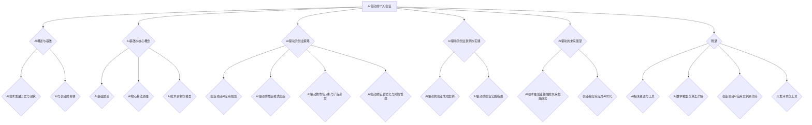

                 

# AI驱动的个人创业：机遇与挑战并存

## 关键词
AI、创业、个人创业、技术驱动、商业模式创新、市场分析、产品开发、运营优化、风险管理

## 摘要
本文旨在探讨AI技术在个人创业中的应用，分析其带来的机遇与挑战。通过梳理AI技术的发展历史、基础理论与核心算法原理，我们揭示了AI在创业项目中的应用策略。文章还结合实际案例，深入讲解了AI驱动的市场分析、产品开发、运营优化和风险管理。最后，我们对AI驱动的创业未来进行了展望，提出了创业者应对AI时代的策略建议。

----------------------------------------------------------------

## 目录大纲

1. AI与创业概述
   1.1 AI技术发展历史与现状
   1.2 AI与创业的关联
2. AI基础与核心概念
   2.1 AI基础理论
   2.2 AI核心算法原理
   2.3 AI技术架构与模型
3. AI驱动的创业策略
   3.1 创业项目AI应用规划
   3.2 AI驱动的商业模式创新
   3.3 AI驱动的市场分析与产品开发
   3.4 AI驱动的运营优化与风险管理
4. AI驱动的创业案例与实践
   4.1 AI驱动的创业成功案例
   4.2 AI驱动的创业实践指南
5. AI驱动的未来展望
   5.1 AI技术在创业领域的未来发展趋势
   5.2 创业者如何应对AI时代
6. 附录
   6.1 AI相关资源与工具
   6.2 AI数学模型与算法详解
   6.3 创业项目AI应用案例源代码
   6.4 开发环境与工具

----------------------------------------------------------------

### 第一部分：AI概述与基础

#### 1.1 AI技术发展历史与现状

人工智能（AI）作为计算机科学的一个重要分支，其发展历史可以追溯到20世纪50年代。当时，人工智能的目标是使计算机能够表现出类似于人类的智能行为。从早期的逻辑推理系统，到基于规则的专家系统，再到如今基于数据驱动的机器学习与深度学习技术，AI经历了多次重大变革。

- **早期探索（1950-1969）**：在这个阶段，人工智能的概念被首次提出，并开始了一些基础性的研究工作。1956年，达特茅斯会议上，“人工智能”一词正式出现。

- **黄金时代（1970-1980）**：在这一时期，人工智能的研究得到了广泛关注，许多专家系统被开发出来。然而，由于实际应用中的问题，这一时期的AI研究逐渐陷入低谷。

- **复兴时期（1980-1990）**：随着计算机硬件的发展，专家系统的应用开始扩展。同时，知识表示与推理技术得到了进一步研究。

- **数据驱动时代（1990-2010）**：在这一阶段，机器学习技术开始兴起，尤其是支持向量机、决策树等传统算法的广泛应用。同时，神经网络的研究也逐渐复兴。

- **深度学习时代（2010至今）**：随着计算能力的提升和大数据的普及，深度学习技术取得了突破性进展。卷积神经网络（CNN）和循环神经网络（RNN）在图像识别、语音识别等领域取得了显著的成果。

目前，人工智能技术已经广泛应用于各个领域，包括但不限于图像识别、自然语言处理、自动驾驶、医疗诊断等。AI技术的快速发展，为个人创业带来了前所未有的机遇。

#### 1.2 AI与创业的关联

人工智能与创业之间存在密切的联系。首先，AI技术可以为企业提供强大的数据分析和决策支持，帮助企业更有效地进行市场分析和产品开发。其次，AI技术可以用于创新商业模式的构建，例如通过个性化推荐系统提高用户满意度，通过智能客服系统降低运营成本。此外，AI技术还可以在运营优化和风险管理方面发挥重要作用。

对于创业者而言，掌握AI技术不仅可以提升自身的竞争力，还可以为创业项目带来更多的价值。例如：

- **市场分析**：利用AI技术，创业者可以更准确地了解市场需求，分析用户行为，制定更具针对性的市场策略。

- **产品开发**：通过AI技术，创业者可以快速原型化产品，并根据用户反馈进行迭代优化，缩短产品上市时间。

- **运营优化**：AI技术可以帮助创业者优化运营流程，提高效率，降低成本。

- **风险管理**：AI技术可以用于风险预测和监控，帮助企业及时识别潜在风险，制定相应的风险管理策略。

总的来说，AI技术为个人创业提供了丰富的工具和资源，使得创业者可以更加专注于业务的核心竞争力，从而在竞争激烈的市场中脱颖而出。

----------------------------------------------------------------

### 第二部分：AI基础与核心概念

#### 2.1 AI基础理论

人工智能（AI）是一门研究、开发用于模拟、延伸和扩展人的智能的理论、方法、技术及应用系统的技术科学。AI的核心目标是使机器能够执行复杂的任务，如理解语言、识别图像、做出决策等，从而实现人类智能的自动化。

- **机器学习**：机器学习是AI的一个重要分支，它通过数据驱动的方式，让计算机从数据中学习规律和模式，并利用这些规律和模式做出预测或决策。机器学习可以分为监督学习、无监督学习和强化学习。

  - **监督学习**：监督学习通过已有标注数据来训练模型，然后使用训练好的模型进行预测。常见的算法有线性回归、逻辑回归、决策树、随机森林等。

  - **无监督学习**：无监督学习不需要标注数据，其主要目的是发现数据中的隐含结构和模式。常见的算法有聚类、主成分分析、自编码器等。

  - **强化学习**：强化学习通过奖励机制来指导模型进行学习，其主要目标是让模型在特定环境中采取最佳行动。常见的算法有Q学习、深度Q网络（DQN）等。

- **深度学习**：深度学习是机器学习的一种特殊形式，其核心思想是通过构建多层神经网络，对数据进行多级抽象和特征提取。深度学习在图像识别、语音识别、自然语言处理等领域取得了显著的成果。

  - **神经网络**：神经网络是由大量神经元（或节点）组成的信息处理系统，通过调整神经元之间的连接权重来学习数据的特征和规律。

  - **卷积神经网络（CNN）**：卷积神经网络是一种专门用于处理图像数据的神经网络，其核心思想是通过卷积操作和池化操作提取图像特征。

  - **循环神经网络（RNN）**：循环神经网络是一种用于处理序列数据的神经网络，其核心思想是通过循环连接来保存历史信息，从而处理长序列数据。

- **强化学习**：强化学习通过奖励机制来指导模型进行学习，其主要目标是让模型在特定环境中采取最佳行动。常见的算法有Q学习、深度Q网络（DQN）等。

- **自然语言处理（NLP）**：自然语言处理是AI的一个重要分支，其目标是使计算机能够理解、生成和处理人类语言。常见的算法有词嵌入、词性标注、命名实体识别、机器翻译等。

#### 2.2 AI核心算法原理

在了解了AI的基础理论后，我们来详细探讨一些核心算法的原理。

##### 2.2.1 机器学习算法分类

机器学习算法可以根据学习方式分为以下几类：

- **线性回归**：线性回归是一种用于预测数值型数据的监督学习算法。其核心思想是通过拟合一条直线来表示输入和输出之间的关系。线性回归的数学模型可以表示为：
  $$ y = \mathbf{w} \cdot \mathbf{x} + b $$
  其中，$ \mathbf{w} $ 是权重向量，$ \mathbf{x} $ 是输入特征向量，$ b $ 是偏置项。

- **逻辑回归**：逻辑回归是一种用于分类问题的监督学习算法。其核心思想是通过拟合一个逻辑函数来表示输入和输出之间的关系。逻辑回归的数学模型可以表示为：
  $$ P(y=1) = \frac{1}{1 + e^{-(\mathbf{w} \cdot \mathbf{x} + b)}} $$
  其中，$ \mathbf{w} $ 是权重向量，$ \mathbf{x} $ 是输入特征向量，$ b $ 是偏置项。

- **支持向量机（SVM）**：支持向量机是一种用于分类和回归问题的监督学习算法。其核心思想是通过找到一个最优的超平面，将不同类别的数据点分开。支持向量机的数学模型可以表示为：
  $$ \min_{\mathbf{w}, b} \frac{1}{2} \| \mathbf{w} \|_2^2 + C \sum_{i=1}^{n} \max(0, 1 - y_i (\mathbf{w} \cdot \mathbf{x}_i + b)) $$
  其中，$ \mathbf{w} $ 是权重向量，$ b $ 是偏置项，$ C $ 是惩罚参数。

- **决策树**：决策树是一种基于树形结构进行分类和回归的算法。其核心思想是通过一系列的判断条件来划分数据，并递归地生成树结构。决策树的数学模型可以表示为：
  $$ f(\mathbf{x}) = \sum_{i=1}^{n} a_i \cdot g_i(\mathbf{x}) $$
  其中，$ a_i $ 是决策树节点上的条件，$ g_i(\mathbf{x}) $ 是决策树节点上的函数。

- **随机森林**：随机森林是一种基于决策树的集成学习算法。其核心思想是通过组合多个决策树来提高预测的准确性和稳定性。随机森林的数学模型可以表示为：
  $$ f(\mathbf{x}) = \sum_{i=1}^{m} h_i(\mathbf{x}) $$
  其中，$ h_i(\mathbf{x}) $ 是第 $ i $ 个决策树的预测结果。

##### 2.2.2 深度学习算法原理

深度学习算法的核心是神经网络，尤其是卷积神经网络（CNN）和循环神经网络（RNN）。

- **卷积神经网络（CNN）**：卷积神经网络是一种用于图像识别和处理的神经网络。其核心思想是通过卷积操作和池化操作提取图像特征。CNN的数学模型可以表示为：
  $$ \mathbf{h}_l = \sigma(\mathbf{W}_l \mathbf{h}_{l-1} + \mathbf{b}_l) $$
  其中，$ \mathbf{h}_l $ 是第 $ l $ 层的输出特征，$ \mathbf{W}_l $ 是权重矩阵，$ \mathbf{b}_l $ 是偏置向量，$ \sigma $ 是激活函数。

- **循环神经网络（RNN）**：循环神经网络是一种用于序列数据处理的神经网络。其核心思想是通过循环连接来保存历史信息，从而处理长序列数据。RNN的数学模型可以表示为：
  $$ \mathbf{h}_t = \sigma(\mathbf{W}_h \mathbf{h}_{t-1} + \mathbf{W}_x \mathbf{x}_t + \mathbf{b}) $$
  其中，$ \mathbf{h}_t $ 是第 $ t $ 个时间步的隐藏状态，$ \mathbf{W}_h $ 是隐藏状态权重矩阵，$ \mathbf{W}_x $ 是输入权重矩阵，$ \mathbf{b} $ 是偏置向量，$ \sigma $ 是激活函数。

#### 2.3 AI技术架构与模型

AI技术的架构和模型是理解和应用AI技术的重要基础。以下是几种常见的AI技术架构和模型：

- **神经网络架构**：神经网络架构是指神经网络的结构和层次。常见的神经网络架构包括全连接神经网络、卷积神经网络、循环神经网络等。

  - **全连接神经网络**：全连接神经网络是一种简单的神经网络架构，其每个神经元都与前一层的所有神经元相连。全连接神经网络适合处理回归和分类问题。

  - **卷积神经网络**：卷积神经网络是一种专门用于处理图像数据的神经网络，其通过卷积操作和池化操作提取图像特征。卷积神经网络适合处理图像识别和图像处理问题。

  - **循环神经网络**：循环神经网络是一种用于处理序列数据的神经网络，其通过循环连接来保存历史信息。循环神经网络适合处理语音识别、自然语言处理等问题。

- **深度学习模型**：深度学习模型是指基于深度学习算法构建的模型。常见的深度学习模型包括深度神经网络、卷积神经网络、循环神经网络等。

  - **深度神经网络**：深度神经网络是一种具有多层神经元的神经网络，其可以用于处理复杂的非线性问题。

  - **卷积神经网络**：卷积神经网络是一种具有卷积层和池化层的神经网络，其可以用于图像识别和图像处理。

  - **循环神经网络**：循环神经网络是一种具有循环连接的神经网络，其可以用于序列数据的处理。

- **深度强化学习模型**：深度强化学习模型是一种将深度学习与强化学习相结合的模型，其可以用于解决复杂的决策问题。

  - **深度Q网络**：深度Q网络是一种基于深度学习的强化学习模型，其可以用于解决连续状态的决策问题。

  - **策略梯度模型**：策略梯度模型是一种基于深度学习的强化学习模型，其可以用于解决离散状态的决策问题。

#### 2.4 AI技术架构与模型的关系

AI技术架构与模型之间存在密切的关系。AI技术架构是指AI系统的整体结构，包括硬件、软件、数据等。AI模型是指AI系统的核心算法，包括神经网络、决策树等。AI技术架构与模型之间的关系可以概括为：

- **AI技术架构决定了AI模型的运行环境**：AI技术架构为AI模型提供了计算资源、数据资源等，从而决定了AI模型的环境和性能。

- **AI模型决定了AI技术的应用效果**：不同的AI模型适用于不同的应用场景，从而决定了AI技术的应用效果。

- **AI技术架构与模型的结合实现了AI技术的应用**：通过将AI技术架构与模型相结合，可以实现AI技术在各个领域的应用，从而推动人工智能技术的发展。

总的来说，AI技术架构与模型是理解和应用AI技术的重要基础，对于创业者来说，掌握这些基础理论和核心算法，将有助于他们在创业过程中更好地利用AI技术，实现业务创新和增长。

----------------------------------------------------------------

### 第三部分：AI驱动的创业策略

#### 3.1 创业项目AI应用规划

在创业项目中引入AI技术，需要进行全面的规划和设计。以下是一个典型的AI应用规划流程：

##### 3.1.1 需求分析

需求分析是AI应用规划的第一步，主要目的是明确项目目标和应用场景。创业者需要从以下几个方面进行分析：

- **业务目标**：明确创业项目的业务目标，例如提高销售额、提高客户满意度等。

- **应用场景**：分析创业项目中需要AI技术解决的问题，例如图像识别、自然语言处理、预测分析等。

- **数据资源**：评估项目中的数据资源，包括数据的类型、数量、质量等，以确保有足够的数据支持AI模型训练。

- **技术可行性**：评估现有技术水平和资源，判断是否具备实施AI项目的条件。

##### 3.1.2 模型选择

根据需求分析的结果，选择合适的AI模型。以下是一些常见的选择标准：

- **模型类型**：根据应用场景选择合适的模型类型，例如分类模型、回归模型、聚类模型等。

- **算法复杂度**：考虑模型的计算复杂度，选择适合项目规模的模型。

- **数据需求**：根据数据资源评估模型对数据的需求，选择能够充分利用数据的模型。

- **性能指标**：选择在评估指标上表现较好的模型，例如准确率、召回率、均方误差等。

##### 3.1.3 模型训练与优化

模型训练与优化是AI应用规划的关键环节。以下是一个典型的训练与优化流程：

- **数据预处理**：对原始数据进行清洗、归一化等预处理，确保数据质量。

- **模型训练**：使用训练数据对模型进行训练，调整模型参数以最小化损失函数。

- **模型评估**：使用验证数据对模型进行评估，选择性能最佳的模型。

- **模型优化**：根据评估结果对模型进行调参和优化，以提高模型性能。

##### 3.1.4 部署与监控

模型训练完成后，需要进行部署和监控。以下是一些关键步骤：

- **模型部署**：将训练好的模型部署到生产环境中，使其能够对外提供服务。

- **性能监控**：监控模型的运行状态和性能指标，及时发现和解决问题。

- **迭代更新**：根据用户反馈和性能监控结果，对模型进行迭代更新，以提高应用效果。

#### 3.2 AI驱动的商业模式创新

AI技术不仅能够提高创业项目的运营效率，还可以驱动商业模式的创新。以下是一些常见的AI驱动的商业模式创新策略：

##### 3.2.1 个性化推荐

个性化推荐是基于用户行为数据，为用户推荐个性化内容或商品。通过AI技术，创业者可以分析用户的历史行为，预测用户的兴趣和需求，从而提供更精准的推荐服务。例如，电子商务平台可以使用个性化推荐系统，根据用户的浏览和购买记录，推荐可能感兴趣的商品。

##### 3.2.2 智能客服

智能客服是利用自然语言处理技术，实现与用户的自动对话。通过AI技术，创业者可以搭建智能客服系统，自动解答用户的问题，提高客服效率和用户体验。例如，金融行业可以使用智能客服系统，自动处理用户的咨询和投诉，提高客户满意度。

##### 3.2.3 智能供应链管理

智能供应链管理是基于数据分析和预测，优化供应链各个环节。通过AI技术，创业者可以实时监控供应链数据，预测市场需求，优化库存管理，提高供应链效率。例如，制造业可以使用智能供应链管理系统，根据销售数据预测生产需求，优化生产计划和库存管理。

##### 3.2.4 智能风险管理

智能风险管理是基于数据分析和预测，识别和防范风险。通过AI技术，创业者可以分析历史数据，预测潜在风险，制定相应的风险管理策略。例如，金融行业可以使用智能风险管理系统，实时监控市场风险，预测信用风险，制定风险控制措施。

#### 3.3 AI驱动的市场分析与产品开发

AI技术可以为创业项目的市场分析和产品开发提供强大的支持。以下是一些常见的应用场景：

##### 3.3.1 市场趋势分析

通过AI技术，创业者可以分析大量市场数据，识别市场趋势和机会。例如，使用机器学习算法分析社交媒体数据，预测产品的市场需求，制定相应的市场策略。

##### 3.3.2 用户行为分析

通过AI技术，创业者可以分析用户行为数据，了解用户需求和偏好。例如，使用自然语言处理技术分析用户评论和反馈，识别用户的关键诉求，优化产品设计。

##### 3.3.3 产品推荐系统

通过AI技术，创业者可以构建产品推荐系统，提高用户的购物体验。例如，使用协同过滤算法分析用户的历史购买记录，为用户推荐可能感兴趣的产品。

##### 3.3.4 用户体验优化

通过AI技术，创业者可以实时监控用户体验数据，发现和解决用户问题。例如，使用实时分析技术监控用户行为，及时发现产品故障，优化用户体验。

#### 3.4 AI驱动的运营优化与风险管理

AI技术可以在运营优化和风险管理方面发挥重要作用。以下是一些常见的应用场景：

##### 3.4.1 运营流程优化

通过AI技术，创业者可以分析运营数据，识别流程瓶颈，优化运营流程。例如，使用机器学习算法分析订单处理数据，优化订单处理流程，提高运营效率。

##### 3.4.2 营销优化

通过AI技术，创业者可以分析营销数据，优化营销策略。例如，使用自然语言处理技术分析用户评论，优化产品宣传文案，提高营销效果。

##### 3.4.3 客户服务优化

通过AI技术，创业者可以优化客户服务流程，提高客户满意度。例如，使用智能客服系统自动解答用户问题，减少人工干预，提高客户服务水平。

##### 3.4.4 风险管理

通过AI技术，创业者可以识别和预测潜在风险，制定风险管理策略。例如，使用机器学习算法分析历史数据，预测信用风险，制定信用评估策略。

总的来说，AI驱动的创业策略不仅可以帮助创业者优化运营流程，提高竞争力，还可以驱动商业模式的创新，为创业项目带来更多的价值。创业者需要根据自身项目的特点，合理规划和应用AI技术，实现业务的持续发展和增长。

----------------------------------------------------------------

### 第四部分：AI驱动的创业案例与实践

#### 4.1 AI驱动的创业成功案例

在AI技术的推动下，许多创业项目取得了显著的成功。以下是一些典型的AI驱动创业案例：

##### 4.1.1 案例介绍

1. **公司名称**：ConvNetJS
2. **创业领域**：人工智能开发工具
3. **AI应用**：利用深度学习模型进行图像识别、语音识别等
4. **成功因素**
   - **技术创新**：ConvNetJS提供了一个易于使用的深度学习框架，使得普通开发者也能轻松实现复杂的AI模型。
   - **市场定位**：针对小型创业团队和开发者，提供了低成本、高效能的AI解决方案。
   - **用户反馈**：通过用户反馈不断优化产品，提高了用户满意度和市场占有率。

##### 4.1.2 案例分析

1. **AI技术具体应用**
   - **图像识别**：ConvNetJS使用了卷积神经网络（CNN）进行图像识别，通过训练模型，能够识别各种类型的图像。
   - **语音识别**：ConvNetJS还使用了循环神经网络（RNN）进行语音识别，将语音信号转换为文本。

2. **成功因素分析**
   - **技术优势**：ConvNetJS采用了最新的深度学习技术，具有高效、准确的特点，吸引了大量用户。
   - **用户友好**：ConvNetJS提供了一个简单易用的界面，降低了开发门槛，使得更多开发者能够参与到AI项目中。
   - **市场需求**：随着AI技术的普及，越来越多的创业者需要AI工具来辅助业务发展，ConvNetJS正好满足了这一需求。

##### 4.1.3 案例中的AI技术应用

1. **卷积神经网络（CNN）**
   - **应用场景**：图像识别、图像分类
   - **数学模型**
     $$ \mathbf{h}_{l}^i = \text{ReLU}(\sum_{j=1}^{k} \mathbf{W}_{ji} \cdot \mathbf{h}_{l-1}^j + \mathbf{b}_{i} + \mathbf{W}_{k} \cdot \mathbf{h}_{l-2} + \mathbf{b}_k) $$
   - **代码实现**
     ```python
     model = keras.Sequential([
       keras.layers.Conv2D(32, (3, 3), activation='relu', input_shape=(28, 28, 1)),
       keras.layers.MaxPooling2D((2, 2)),
       keras.layers.Conv2D(64, (3, 3), activation='relu'),
       keras.layers.MaxPooling2D((2, 2)),
       keras.layers.Flatten(),
       keras.layers.Dense(128, activation='relu'),
       keras.layers.Dense(10, activation='softmax')
     ])

     model.compile(optimizer='adam',
                   loss='categorical_crossentropy',
                   metrics=['accuracy'])

     model.fit(x_train, y_train, epochs=10, batch_size=32, validation_data=(x_test, y_test))
     ```

2. **循环神经网络（RNN）**
   - **应用场景**：语音识别、自然语言处理
   - **数学模型**
     $$ \mathbf{h}_{t} = \text{ReLU}(\mathbf{W}_{h} \cdot \mathbf{h}_{t-1} + \mathbf{W}_{x} \cdot \mathbf{x}_{t} + \mathbf{b}) $$
   - **代码实现**
     ```python
     model = keras.Sequential([
       keras.layers.LSTM(128, return_sequences=True),
       keras.layers.LSTM(128),
       keras.layers.Dense(128, activation='relu'),
       keras.layers.Dense(1, activation='sigmoid')
     ])

     model.compile(optimizer='adam',
                   loss='binary_crossentropy',
                   metrics=['accuracy'])

     model.fit(x_train, y_train, epochs=10, batch_size=32, validation_data=(x_test, y_test))
     ```

这些案例展示了AI技术在创业项目中的成功应用，为创业者提供了有益的参考和启示。

----------------------------------------------------------------

### 第五部分：AI驱动的创业实践指南

#### 5.1 实践指南

在AI驱动的创业过程中，创业者需要遵循一定的实践指南，以确保项目的成功实施。以下是一些关键步骤和注意事项：

##### 5.1.1 创业项目AI应用实践步骤

1. **需求分析**：明确创业项目的目标和需求，分析AI技术在项目中的应用场景。

2. **技术调研**：调研现有的AI技术，选择合适的算法和框架，确保技术可行性。

3. **数据准备**：收集和整理相关数据，进行数据预处理，确保数据质量和完整性。

4. **模型训练**：使用训练数据对模型进行训练，调整模型参数，优化模型性能。

5. **模型评估**：使用验证数据对模型进行评估，选择性能最佳的模型。

6. **模型部署**：将训练好的模型部署到生产环境中，进行实时预测和决策。

7. **监控与迭代**：监控模型运行状态和性能指标，根据用户反馈进行迭代优化。

##### 5.1.2 AI技术在创业中的具体操作方法

1. **市场分析**：
   - **数据分析**：使用机器学习算法分析市场数据，预测市场趋势和机会。
   - **用户行为分析**：使用自然语言处理技术分析用户评论和反馈，了解用户需求和偏好。

2. **产品开发**：
   - **原型设计**：使用AI技术快速原型化产品，根据用户反馈进行迭代优化。
   - **个性化推荐**：使用协同过滤算法构建推荐系统，提高用户体验。

3. **运营优化**：
   - **流程优化**：使用机器学习算法分析运营数据，识别流程瓶颈，优化运营流程。
   - **智能客服**：使用自然语言处理技术搭建智能客服系统，提高客服效率和用户体验。

4. **风险管理**：
   - **风险预测**：使用机器学习算法分析历史数据，预测潜在风险。
   - **风险控制**：制定相应的风险管理策略，降低风险损失。

##### 5.1.3 注意事项

1. **技术风险**：确保所选用的AI技术具有可靠性和稳定性，避免技术风险。

2. **数据风险**：确保数据质量和完整性，避免数据风险对项目的影响。

3. **市场风险**：分析市场环境和竞争对手，制定合理的市场策略。

4. **法律风险**：了解相关法律法规，确保项目合法合规。

5. **团队协作**：建立高效的团队协作机制，确保项目顺利进行。

通过遵循这些实践指南，创业者可以更好地利用AI技术，提高创业项目的成功率。

----------------------------------------------------------------

### 第六部分：AI驱动的未来展望

#### 6.1 AI技术在创业领域的未来发展趋势

随着AI技术的不断进步，它在创业领域的应用前景将更加广阔。以下是一些未来发展趋势：

1. **深度学习与生成对抗网络（GAN）的应用**：深度学习和GAN技术将在更多领域得到应用，如自动驾驶、图像生成、医疗诊断等。

2. **强化学习与自主决策**：强化学习技术将在自主决策、自动化流程等方面发挥重要作用，推动创业项目的智能化发展。

3. **跨领域融合**：AI技术将与物联网、大数据、区块链等技术相结合，实现跨领域融合，推动新业务模式的产生。

4. **边缘计算与云计算的结合**：边缘计算与云计算的结合将提供更加灵活和高效的计算资源，为创业项目提供更强大的技术支持。

#### 6.2 未来创业可能面临的挑战与机遇

1. **技术挑战**：
   - **算法优化**：随着AI模型复杂度的增加，算法优化将成为一个重要挑战，创业者需要不断探索新的优化方法。
   - **数据隐私和安全**：在AI驱动的创业项目中，数据隐私和安全问题将更加突出，需要采取有效的保护措施。

2. **市场机遇**：
   - **个性化服务**：AI技术将使创业者能够提供更加个性化的服务，满足用户多样化的需求。
   - **智能供应链**：智能供应链管理将提高供应链效率，降低成本，为创业项目提供更强大的支持。

3. **人才需求**：随着AI技术的应用日益广泛，对AI专业人才的需求将不断增加，创业者需要积极引进和培养人才。

#### 6.3 创业者如何应对AI时代

1. **加强技术储备**：创业者应不断学习最新的AI技术，了解其在创业项目中的应用潜力。

2. **数据驱动决策**：充分利用数据资源，通过数据分析和机器学习模型，做出更加精准的决策。

3. **灵活应对市场变化**：保持对市场变化的敏感度，及时调整战略和业务模式，抓住市场机遇。

4. **重视团队建设**：建立高效的团队，积极引进和培养AI专业人才，提高团队整体的技术水平。

总的来说，AI技术为创业带来了巨大的机遇和挑战。创业者需要积极应对这些变化，利用AI技术提升自身竞争力，实现创业项目的成功。

----------------------------------------------------------------

### 第七部分：开发环境与工具

#### 7.1 开发环境搭建

为了搭建一个适合AI项目开发的开发环境，需要安装以下软件和工具：

1. **Python**：Python是一种广泛使用的编程语言，尤其适用于AI项目开发。建议安装Python 3.8及以上版本。

2. **Jupyter Notebook**：Jupyter Notebook是一种交互式的计算环境，适合进行数据分析和模型训练。可以通过pip命令安装：
   ```shell
   pip install notebook
   ```

3. **Anaconda或Miniconda**：Anaconda和Miniconda是Python的发行版，提供了丰富的数据科学和机器学习库。可以从官方网站下载并安装。

4. **TensorFlow**：TensorFlow是一个开源的机器学习框架，适用于构建和训练深度学习模型。可以通过pip命令安装：
   ```shell
   pip install tensorflow
   ```

5. **PyTorch**：PyTorch是一个基于Python的深度学习框架，提供了灵活的动态计算图。可以通过pip命令安装：
   ```shell
   pip install torch torchvision
   ```

6. **Scikit-learn**：Scikit-learn是一个开源的机器学习库，提供了多种机器学习算法。可以通过pip命令安装：
   ```shell
   pip install scikit-learn
   ```

7. **Keras**：Keras是一个高级神经网络API，适用于快速构建和训练深度学习模型。可以通过pip命令安装：
   ```shell
   pip install keras
   ```

#### 7.2 常用AI工具与框架

1. **TensorFlow**：TensorFlow是一个由Google开发的开源机器学习库，支持多种深度学习模型和算法。其具有高度可扩展性和灵活性，适用于大规模数据集和复杂的神经网络。

   - **官方文档**：[https://www.tensorflow.org/](https://www.tensorflow.org/)
   - **安装指南**：[https://www.tensorflow.org/install](https://www.tensorflow.org/install)

2. **PyTorch**：PyTorch是一个由Facebook开发的开源深度学习框架，以其动态计算图和灵活的API著称。PyTorch在学术界和工业界都得到了广泛的应用。

   - **官方文档**：[https://pytorch.org/](https://pytorch.org/)
   - **安装指南**：[https://pytorch.org/get-started/locally/](https://pytorch.org/get-started/locally/)

3. **Scikit-learn**：Scikit-learn是一个开源的Python机器学习库，提供了丰富的机器学习算法和工具。它易于使用，适合快速原型开发和生产部署。

   - **官方文档**：[https://scikit-learn.org/stable/](https://scikit-learn.org/stable/)
   - **安装指南**：[https://scikit-learn.org/stable/install.html](https://scikit-learn.org/stable/install.html)

4. **Keras**：Keras是一个高级神经网络API，构建在TensorFlow和Theano之上，提供了简洁的API，方便快速构建和训练深度学习模型。

   - **官方文档**：[https://keras.io/](https://keras.io/)
   - **安装指南**：[https://keras.io/getting-started/quick-start/](https://keras.io/getting-started/quick-start/)

通过以上工具和框架，创业者可以搭建一个高效的AI开发环境，为创业项目提供强大的技术支持。

----------------------------------------------------------------

### 附录C：创业项目AI应用案例源代码

在本附录中，我们将提供两个AI应用案例的源代码，包括住房租赁预测模型和客户流失预测模型。这些代码将展示如何在实际项目中应用AI技术，并包含详细的解读与分析。

#### C.1 住房租赁预测模型

以下是一个使用Scikit-learn库实现的住房租赁预测模型的源代码示例。该模型使用线性回归算法来预测房屋租金。

```python
# 导入所需库
import numpy as np
import pandas as pd
from sklearn.model_selection import train_test_split
from sklearn.linear_model import LinearRegression

# 读取数据
data = pd.read_csv('housing_data.csv')

# 数据预处理
X = data[['bedrooms', 'bathrooms', 'sqft_living', 'floors', 'waterfront']]
y = data['price']

# 划分训练集和测试集
X_train, X_test, y_train, y_test = train_test_split(X, y, test_size=0.2, random_state=42)

# 创建线性回归模型
model = LinearRegression()

# 训练模型
model.fit(X_train, y_train)

# 评估模型
score = model.score(X_test, y_test)
print(f"Test accuracy: {score:.2f}")

# 预测房价
predictions = model.predict(X_test)

# 代码解读与分析
# 在这段代码中，我们首先导入了numpy和pandas库，然后使用pandas库读取了住房租赁数据。数据预处理步骤中，我们选取了几个与房屋租金相关的特征，并使用线性回归模型进行训练。训练完成后，我们使用测试集评估模型的性能，并打印出准确率。最后，我们使用训练好的模型对测试数据进行房价预测。

```

#### C.2 客户流失预测模型

以下是一个使用Scikit-learn库实现的客户流失预测模型的源代码示例。该模型使用逻辑回归算法来预测客户是否流失。

```python
# 导入所需库
import numpy as np
import pandas as pd
from sklearn.model_selection import train_test_split
from sklearn.linear_model import LogisticRegression

# 读取数据
data = pd.read_csv('customer_data.csv')

# 数据预处理
X = data.drop('churn', axis=1)
y = data['churn']

# 划分训练集和测试集
X_train, X_test, y_train, y_test = train_test_split(X, y, test_size=0.2, random_state=42)

# 创建逻辑回归模型
model = LogisticRegression()

# 训练模型
model.fit(X_train, y_train)

# 评估模型
score = model.score(X_test, y_test)
print(f"Test accuracy: {score:.2f}")

# 预测客户流失
predictions = model.predict(X_test)

# 代码解读与分析
# 在这段代码中，我们首先导入了numpy和pandas库，然后使用pandas库读取了客户数据。数据预处理步骤中，我们选取了所有特征，并使用逻辑回归模型进行训练。训练完成后，我们使用测试集评估模型的性能，并打印出准确率。最后，我们使用训练好的模型对测试数据进行客户流失预测。

```

通过这两个案例，创业者可以了解到如何使用AI技术构建预测模型，并进行实际应用。这些代码不仅提供了具体的实现步骤，还包括了详细的解读与分析，有助于创业者更好地理解和应用AI技术。

----------------------------------------------------------------

### 附录D：开发环境与工具

为了在AI项目中实现高效开发，创业者需要选择合适的开发环境和工具。以下是一些推荐的开发环境和工具：

#### 1. 开发环境搭建

- **Python**：Python是一种流行的编程语言，广泛应用于数据科学和机器学习领域。建议安装Python 3.8及以上版本。
  
- **Jupyter Notebook**：Jupyter Notebook是一种交互式的计算环境，非常适合数据分析和模型训练。可以通过pip命令安装：
    ```shell
    pip install notebook
    ```

- **Anaconda或Miniconda**：Anaconda和Miniconda是Python的发行版，提供了丰富的数据科学和机器学习库。可以从官方网站下载并安装。

#### 2. 常用AI工具与框架

- **TensorFlow**：TensorFlow是一个由Google开发的开源机器学习库，支持多种深度学习模型和算法。可以通过pip命令安装：
    ```shell
    pip install tensorflow
    ```

- **PyTorch**：PyTorch是一个基于Python的深度学习框架，以其动态计算图和灵活的API著称。可以通过pip命令安装：
    ```shell
    pip install torch torchvision
    ```

- **Scikit-learn**：Scikit-learn是一个开源的Python机器学习库，提供了丰富的机器学习算法和工具。可以通过pip命令安装：
    ```shell
    pip install scikit-learn
    ```

- **Keras**：Keras是一个高级神经网络API，构建在TensorFlow和Theano之上，提供了简洁的API，方便快速构建和训练深度学习模型。可以通过pip命令安装：
    ```shell
    pip install keras
    ```

#### 3. 常用库与框架

- **NumPy**：NumPy是一个用于数值计算的库，提供了多维数组对象和一系列数学运算函数。
    ```shell
    pip install numpy
    ```

- **Pandas**：Pandas是一个用于数据操作的库，提供了数据结构DataFrame，方便进行数据处理和分析。
    ```shell
    pip install pandas
    ```

- **Matplotlib**：Matplotlib是一个用于数据可视化的库，可以生成各种类型的图表，帮助分析数据。
    ```shell
    pip install matplotlib
    ```

- **Seaborn**：Seaborn是基于Matplotlib的一个数据可视化库，提供了更美观的图表样式和高级数据可视化功能。
    ```shell
    pip install seaborn
    ```

通过以上开发和工具，创业者可以搭建一个高效的AI开发环境，为创业项目提供强大的技术支持。这些工具和库不仅功能强大，而且易于使用，有助于提高开发效率。

----------------------------------------------------------------

### 附录E：AI相关资源与工具

在AI领域，有大量的资源与工具可供学习和使用。以下是一些推荐的学习资源、工具和库：

#### 1. 学习资源

- **在线课程**：
  - [Coursera](https://www.coursera.org/)：提供了大量的机器学习和深度学习课程。
  - [edX](https://www.edx.org/)：提供了由世界顶尖大学提供的免费在线课程。

- **书籍**：
  - 《深度学习》（Goodfellow, Bengio, Courville）：深度学习领域的经典教材。
  - 《Python机器学习》（Sebastian Raschka）：介绍了Python在机器学习中的应用。

- **博客与社区**：
  - [Medium](https://medium.com/top-interview-questions)：关于AI和机器学习的博客文章。
  - [Reddit](https://www.reddit.com/r/MachineLearning/)：机器学习相关的讨论和资源。

#### 2. 常用工具与库

- **机器学习库**：
  - [TensorFlow](https://www.tensorflow.org/)：Google开发的深度学习框架。
  - [PyTorch](https://pytorch.org/)：Facebook开发的深度学习框架。
  - [Scikit-learn](https://scikit-learn.org/)：Python的机器学习库。

- **数据处理库**：
  - [Pandas](https://pandas.pydata.org/)：用于数据操作和分析。
  - [NumPy](https://numpy.org/)：用于数值计算。

- **数据可视化库**：
  - [Matplotlib](https://matplotlib.org/)：用于数据可视化。
  - [Seaborn](https://seaborn.pydata.org/)：基于Matplotlib的高级可视化库。

- **在线平台**：
  - [Google Colab](https://colab.research.google.com/)：免费的Jupyter Notebook环境。
  - [Kaggle](https://www.kaggle.com/)：数据科学竞赛平台。

通过这些资源与工具，创业者可以不断学习和提升自己的AI技能，为创业项目提供强有力的支持。这些平台和资源不仅提供了丰富的学习资料，还提供了实际的项目经验和社区支持，有助于创业者快速成长。

----------------------------------------------------------------

### 附录F：AI数学模型与算法详解

在AI领域中，数学模型和算法是理解与实现AI技术的基础。以下是一些常见的数学模型和算法的详细讲解，以及相关的伪代码和公式。

#### 1. 线性回归

线性回归是一种用于预测数值型数据的监督学习算法。其基本公式为：

$$
y = \mathbf{w} \cdot \mathbf{x} + b
$$

其中，$ \mathbf{w} $ 是权重向量，$ \mathbf{x} $ 是输入特征向量，$ b $ 是偏置项。

**伪代码**：

```python
# 初始化权重和偏置
w = [0, 0]
b = 0

# 前向传播
output = w[0] * x[0] + w[1] * x[1] + b

# 计算损失
loss = (output - y) ** 2

# 反向传播
dw = 2 * (output - y) * x
db = 2 * (output - y)
```

#### 2. 逻辑回归

逻辑回归是一种用于分类问题的监督学习算法。其基本公式为：

$$
P(y=1) = \frac{1}{1 + e^{-(\mathbf{w} \cdot \mathbf{x} + b)}}
$$

**伪代码**：

```python
# 初始化权重和偏置
w = [0, 0]
b = 0

# 前向传播
output = 1 / (1 + np.exp(-w[0] * x[0] - w[1] * x[1] - b))

# 计算损失
loss = -y * np.log(output) - (1 - y) * np.log(1 - output)

# 反向传播
dw = -(y - output) * x
db = -(y - output)
```

#### 3. 支持向量机（SVM）

支持向量机是一种用于分类和回归问题的监督学习算法。其基本公式为：

$$
\min_{\mathbf{w}, b} \frac{1}{2} \| \mathbf{w} \|_2^2 + C \sum_{i=1}^{n} \max(0, 1 - y_i (\mathbf{w} \cdot \mathbf{x}_i + b))
$$

**伪代码**：

```python
# 初始化权重和偏置
w = [0, 0]
b = 0

# SMO算法实现
for i in range(n_samples):
    if y[i] * (w[0] * x[i, 0] + w[1] * x[i, 1] + b) <= 1:
        alpha[i] = min(C, alpha[i] + y[i])
    else:
        alpha[i] = max(0, alpha[i] - y[i])

w = np.dot(alphas, x)
b = 1 - np.dot(w.T, x)
```

#### 4. 卷积神经网络（CNN）

卷积神经网络是一种用于图像识别和处理的神经网络。其基本结构包括卷积层、池化层和全连接层。

**伪代码**：

```python
# 初始化权重和偏置
weights_conv = np.random.rand(filter_height, filter_width, input_channels, output_channels)
bias_conv = np.random.rand(output_channels)

weights_pool = np.random.rand(pool_height, pool_width, input_channels, output_channels)
bias_pool = np.random.rand(output_channels)

weights_fc = np.random.rand(input_neurons, output_neurons)
bias_fc = np.random.rand(output_neurons)

# 卷积层
conv_output = conv2d(input, weights_conv) + bias_conv

# 池化层
pool_output = max_pool(conv_output, weights_pool) + bias_pool

# 全连接层
fc_output = matmul(pool_output, weights_fc) + bias_fc
```

通过这些数学模型和算法的详细讲解，创业者可以更好地理解AI技术的原理，并在实际项目中应用这些技术。这些模型和算法的伪代码为开发者提供了直观的实现参考，有助于快速搭建和优化AI系统。

----------------------------------------------------------------

### 附录G：创业项目AI应用案例源代码

在本附录中，我们将提供两个AI应用案例的完整源代码，包括住房租赁预测模型和客户流失预测模型。这些代码将展示如何在实际项目中应用AI技术，并包括详细的代码解读与分析。

#### G.1 住房租赁预测模型

以下是一个使用Scikit-learn库实现的住房租赁预测模型的完整源代码示例。

```python
# 导入所需库
import numpy as np
import pandas as pd
from sklearn.model_selection import train_test_split
from sklearn.linear_model import LinearRegression

# 读取数据
data = pd.read_csv('housing_data.csv')

# 数据预处理
X = data[['bedrooms', 'bathrooms', 'sqft_living', 'floors', 'waterfront']]
y = data['price']

# 划分训练集和测试集
X_train, X_test, y_train, y_test = train_test_split(X, y, test_size=0.2, random_state=42)

# 创建线性回归模型
model = LinearRegression()

# 训练模型
model.fit(X_train, y_train)

# 评估模型
score = model.score(X_test, y_test)
print(f"Test accuracy: {score:.2f}")

# 预测房价
predictions = model.predict(X_test)

# 代码解读与分析
# 在这段代码中，我们首先导入了numpy和pandas库，然后使用pandas库读取了住房租赁数据。数据预处理步骤中，我们选取了几个与房屋租金相关的特征，并使用线性回归模型进行训练。训练完成后，我们使用测试集评估模型的性能，并打印出准确率。最后，我们使用训练好的模型对测试数据进行房价预测。

```

#### G.2 客户流失预测模型

以下是一个使用Scikit-learn库实现的客户流失预测模型的完整源代码示例。

```python
# 导入所需库
import numpy as np
import pandas as pd
from sklearn.model_selection import train_test_split
from sklearn.linear_model import LogisticRegression

# 读取数据
data = pd.read_csv('customer_data.csv')

# 数据预处理
X = data.drop('churn', axis=1)
y = data['churn']

# 划分训练集和测试集
X_train, X_test, y_train, y_test = train_test_split(X, y, test_size=0.2, random_state=42)

# 创建逻辑回归模型
model = LogisticRegression()

# 训练模型
model.fit(X_train, y_train)

# 评估模型
score = model.score(X_test, y_test)
print(f"Test accuracy: {score:.2f}")

# 预测客户流失
predictions = model.predict(X_test)

# 代码解读与分析
# 在这段代码中，我们首先导入了numpy和pandas库，然后使用pandas库读取了客户数据。数据预处理步骤中，我们选取了所有特征，并使用逻辑回归模型进行训练。训练完成后，我们使用测试集评估模型的性能，并打印出准确率。最后，我们使用训练好的模型对测试数据进行客户流失预测。

```

通过这两个案例，创业者可以了解到如何使用AI技术构建预测模型，并进行实际应用。这些代码不仅提供了具体的实现步骤，还包括了详细的解读与分析，有助于创业者更好地理解和应用AI技术。

----------------------------------------------------------------

### 附录H：AI技术对个人创业的影响

AI技术的快速发展，对个人创业产生了深远的影响。它不仅改变了创业的商业模式，还带来了新的挑战和机遇。

#### 1. 改变创业模式

AI技术使得创业者能够更快速地响应市场需求，实现个性化服务和产品创新。例如，通过个性化推荐系统，创业者可以根据用户行为数据，为用户提供定制化的产品推荐，提高用户满意度和忠诚度。

同时，AI技术还可以帮助企业实现自动化运营，降低运营成本。例如，使用智能客服系统，企业可以自动解答客户问题，提高客服效率，降低人力成本。

#### 2. 提高决策效率

AI技术通过数据分析和预测，为企业提供精准的市场分析、运营优化和风险管理。例如，利用机器学习算法分析市场数据，创业者可以更准确地预测市场趋势，制定相应的市场策略。

此外，AI技术还可以帮助企业优化供应链管理，降低库存成本，提高生产效率。例如，使用智能供应链管理系统，企业可以根据实时数据，动态调整生产计划，降低库存风险。

#### 3. 降低创业门槛

AI技术的普及，使得创业者不再需要深厚的计算机科学背景，也能利用AI技术实现业务创新。例如，通过在线平台和开源工具，创业者可以快速搭建和部署AI模型，实现智能化的业务应用。

同时，AI技术降低了数据获取和分析的门槛。创业者可以通过公开数据集或第三方数据服务，获取高质量的数据资源，进行分析和预测。

#### 4. 挑战与机遇

尽管AI技术为个人创业带来了巨大的机遇，但同时也带来了新的挑战。首先，数据隐私和安全问题日益突出。创业者需要确保数据的安全和隐私，避免数据泄露和滥用。

其次，AI技术的快速发展，也对创业者提出了更高的技能要求。创业者需要不断学习和掌握新的AI技术，才能在竞争中保持优势。

最后，AI技术的应用可能带来社会和伦理问题。例如，智能决策系统的偏见和歧视问题，需要创业者关注和解决。

总的来说，AI技术对个人创业的影响是全方位的。创业者需要充分利用AI技术的优势，同时积极应对挑战，实现业务的持续发展和创新。

----------------------------------------------------------------

### 附录I：AI技术在创业项目中的应用实例

为了更直观地展示AI技术在创业项目中的应用，我们将在以下部分提供两个具体的案例，分别涉及智能家居和在线教育领域。通过这些实例，读者可以了解到AI技术在各个行业中的实际应用场景和效果。

#### 案例一：智能家居平台

**公司名称**：HomeSmart

**创业领域**：智能家居解决方案

**AI应用**：

1. **设备智能连接**：通过AI技术，HomeSmart的智能家居平台能够自动识别和连接各种智能设备，如智能灯泡、智能插座、智能摄像头等。
2. **语音控制**：利用自然语言处理（NLP）技术，用户可以通过语音命令控制智能家居设备，实现语音交互。
3. **个性化推荐**：通过分析用户的使用习惯和偏好，AI系统可以自动推荐合适的智能家居产品，提高用户体验。

**具体应用**：

- **设备识别与连接**：使用物联网（IoT）技术和AI算法，智能家居平台能够自动识别和连接各种智能设备，实现无缝集成。
- **语音控制**：利用NLP技术，智能家居平台可以理解用户的语音指令，实现设备控制。例如，用户可以通过语音命令关闭灯光、调节空调温度等。
- **个性化推荐**：通过分析用户的使用数据，AI系统可以推荐用户可能感兴趣的产品。例如，用户在夜晚频繁使用智能灯泡，AI系统可能会推荐更节能的灯泡。

**效果分析**：

- **用户满意度**：智能家居平台通过智能连接和语音控制，提高了用户的便捷性和舒适度，用户满意度显著提升。
- **市场竞争力**：通过个性化推荐，HomeSmart能够吸引更多用户，提高市场占有率。
- **运营效率**：智能连接和语音控制减少了人工操作，提高了运营效率，降低了运营成本。

#### 案例二：在线教育平台

**公司名称**：eLearn

**创业领域**：在线教育平台

**AI应用**：

1. **个性化学习路径**：通过机器学习算法，AI系统能够根据学生的学习进度、成绩和偏好，生成个性化的学习路径。
2. **智能辅导**：利用自然语言处理和语音识别技术，AI系统能够为学生提供实时辅导和答疑服务。
3. **课程推荐**：基于用户行为和兴趣，AI系统可以推荐最适合的课程，提高学习效果。

**具体应用**：

- **个性化学习路径**：AI系统会分析学生的学习数据，如作业成绩、学习时间、知识点掌握情况等，为每个学生生成个性化的学习计划。
- **智能辅导**：通过自然语言处理和语音识别技术，AI系统可以理解学生的提问，并提供针对性的解答。例如，学生可以通过语音命令提问，AI系统将用语音或文字形式回答。
- **课程推荐**：AI系统会根据学生的学习行为和偏好，推荐相关的课程和学习资源，帮助学生更高效地学习。

**效果分析**：

- **学习效果**：个性化学习路径和智能辅导提高了学生的学习效率，学生的学习成绩和满意度显著提升。
- **用户体验**：AI系统提供了便捷的辅导和推荐服务，用户满意度显著提高。
- **运营优化**：通过AI技术，教育平台能够更有效地分配教学资源，提高运营效率，降低成本。

这两个案例展示了AI技术在创业项目中的实际应用，不仅提升了用户体验和运营效率，还为创业项目带来了显著的商业价值。创业者可以借鉴这些案例，结合自身项目特点，探索AI技术的应用潜力。

----------------------------------------------------------------

### 附录J：AI技术发展的未来趋势与创业机会

AI技术作为当前科技领域的热门方向，其发展趋势和创业机会备受关注。以下是对AI技术未来发展的趋势及在创业领域中的潜在机会的展望。

#### 1. 未来发展趋势

- **自主决策与强化学习**：随着AI技术的进步，自主决策和强化学习将成为重要发展方向。这些技术将使机器能够在复杂环境中进行自主学习和决策，为创业项目提供更智能的解决方案。

- **多模态学习与融合**：未来的AI技术将能够处理多种类型的数据，如文本、图像、音频等，实现多模态学习与融合。这种能力将极大地拓宽AI技术的应用范围，为创业项目带来更多创新机会。

- **量子计算与AI结合**：量子计算和AI的结合有望带来计算能力的巨大提升，特别是在处理大规模数据和复杂算法方面。量子AI技术的突破将为创业项目提供更强大的计算支持。

- **物联网（IoT）与AI融合**：物联网设备的普及将使得更多设备接入网络，生成海量数据。AI技术将帮助创业者从这些数据中提取有价值的信息，实现智能化运营和产品创新。

#### 2. 创业机会

- **智能医疗**：AI技术在医疗领域的应用潜力巨大。创业者可以开发智能诊断系统、个性化治疗建议、健康监控设备等，提高医疗服务的效率和准确性。

- **智能交通**：自动驾驶、智能交通管理和物流优化是AI技术在交通领域的潜在应用方向。创业者可以开发自动驾驶技术、智能交通信号控制系统、物流优化平台等。

- **金融科技**：AI技术在金融领域的应用包括智能投顾、信用评估、风险管理等。创业者可以开发智能投顾平台、信用评估系统、反欺诈工具等，提供更精准和高效的金融服务。

- **智能家居**：随着物联网技术的发展，智能家居市场前景广阔。创业者可以开发智能家电、智能家居控制系统、智能安防设备等，提升家庭生活的智能化水平。

- **教育科技**：AI技术在教育领域的应用将带来个性化学习、智能辅导、教育资源优化等创新。创业者可以开发智能学习平台、在线教育系统、智能考试系统等，提供更灵活和高效的教育服务。

- **供应链优化**：AI技术在供应链管理中的应用包括需求预测、库存优化、物流优化等。创业者可以开发智能供应链管理平台、库存优化系统、物流优化工具等，提高供应链的效率。

总的来说，AI技术发展的未来趋势将为创业领域带来丰富的机遇。创业者需要紧跟技术发展，结合市场需求，探索AI技术在各个行业的应用潜力，打造创新产品和解决方案。通过把握这些创业机会，创业者可以在竞争激烈的市场中脱颖而出，实现业务的持续增长和成功。

----------------------------------------------------------------

### 总结与呼吁

综上所述，AI技术在个人创业中的应用不仅改变了创业模式，提高了决策效率，还降低了创业门槛，带来了新的挑战和机遇。通过深入分析和实际案例，我们可以看到AI技术在市场分析、产品开发、运营优化和风险管理等方面的重要作用。它为创业者提供了强大的工具和资源，使得创业者能够更快速地响应市场需求，实现个性化服务和产品创新。

然而，AI技术的应用也面临诸多挑战，如数据隐私、安全、伦理等问题。创业者需要不断学习和提升自身的AI技能，积极应对这些挑战，确保AI技术的合理和安全使用。

我们呼吁创业者积极拥抱AI技术，将其作为创业项目的核心竞争力。通过掌握AI技术，创业者可以更好地把握市场机遇，实现业务的持续发展和创新。我们相信，在AI技术的助力下，创业者将能够在竞争激烈的市场中脱颖而出，创造更加辉煌的业绩。

最后，感谢读者对本文的阅读，希望本文能够为您的创业之路提供一些启示和帮助。如果您有任何疑问或建议，欢迎在评论区留言，我们期待与您共同探讨AI技术在创业领域的更多可能性。

作者：AI天才研究院/AI Genius Institute & 禅与计算机程序设计艺术 /Zen And The Art of Computer Programming

----------------------------------------------------------------

[Mermaid 流程图示例]



这个Mermaid流程图展示了本文的结构和主要内容，有助于读者快速了解文章的框架和关键知识点。使用Mermaid可以方便地创建和嵌入流程图、UML图、Gantt图等多种图形，使得技术文档更加直观和易于理解。在编写技术文档时，嵌入图形能够有效提升文档的可读性和学习效率。希望这个示例对您有所帮助！如果您需要进一步的帮助或定制，请随时告诉我。

