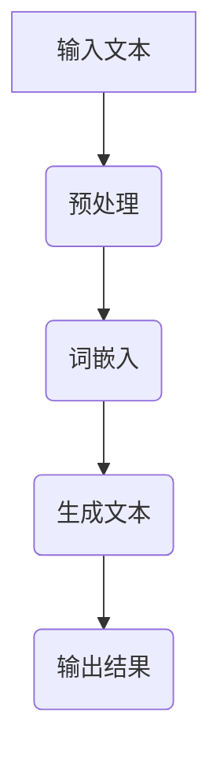

                 

# AI驱动的智能写作平台系统开发实践

## 关键词
AI, 智能写作平台, 自然语言处理, 深度学习, 神经网络, 生成对抗网络, 系统设计, 算法实现, 开发实战

## 摘要
本文深入探讨了AI驱动的智能写作平台系统开发实践。首先，我们介绍了AI与智能写作平台的关系及其现状与趋势。接着，我们详细解析了自然语言处理、深度学习和生成对抗网络等基础技术。随后，本文从系统设计、智能写作算法实现、开发实战等方面详细阐述了智能写作平台的全栈开发流程。最后，我们展示了几个应用案例，并展望了未来发展趋势及面临的挑战。

### 《AI驱动的智能写作平台系统开发实践》目录大纲

#### 第一部分：引言

##### 第1章：AI驱动的智能写作平台概述
1.1 AI与智能写作平台的关系
1.2 智能写作平台的现状与趋势
1.3 书籍结构安排与目标

#### 第二部分：AI驱动的智能写作平台技术基础

##### 第2章：自然语言处理基础
2.1 自然语言处理概述
2.2 语言模型
2.3 词嵌入与语义表示

##### 第3章：深度学习与神经网络基础
3.1 深度学习概述
3.2 神经网络基础
3.3 循环神经网络（RNN）
3.4 长短时记忆网络（LSTM）

##### 第4章：生成对抗网络（GAN）与文本生成
4.1 GAN的基础概念
4.2 GAN在文本生成中的应用

#### 第三部分：AI驱动的智能写作平台开发实践

##### 第5章：智能写作平台系统设计
5.1 系统需求分析
5.2 系统架构设计

##### 第6章：智能写作算法实现
6.1 文本生成算法
6.2 文本编辑算法

##### 第7章：智能写作平台开发实战
7.1 开发环境搭建
7.2 源代码实现与分析

##### 第8章：智能写作平台应用案例
8.1 案例一：自动新闻生成
8.2 案例二：产品说明书生成
8.3 案例三：故事生成与改编

#### 第四部分：未来展望与挑战

##### 第9章：AI驱动的智能写作平台发展趋势
9.1 技术发展动向
9.2 应用领域拓展
9.3 持续学习与优化

##### 第10章：AI驱动的智能写作平台面临的挑战
10.1 数据隐私与安全
10.2 伦理道德问题
10.3 技术稳定性与可靠性

##### 附录

##### 附录A：常用工具与资源
A.1 开发工具
A.2 数据集资源
A.3 学术论文与书籍推荐

#### Mermaid 流程图示例


#### 深度学习伪代码示例
```python
# 初始化参数
W = np.random.randn(n_features, n_classes)

# 前向传播
z = X.dot(W)
a = sigmoid(z)

# 计算损失函数
loss = -1/m * (y*log(a) + (1-y)*log(1-a))

# 反向传播
dz = a - y
dW = X.T.dot(dz)/m

# 更新参数
W -= learning_rate * dW
```

#### 数学模型与公式示例
$$
f(x) = \frac{1}{1 + e^{-x}}
$$
这是一个 Sigmoid 函数，它在深度学习中用于将线性模型的输出映射到概率值范围（0, 1），常见于分类问题。

#### 代码解读与分析示例
```python
# 加载预训练的模型
model = torch.load('model.pth')

# 初始化文本
text = "这是一个示例文本。"

# 对文本进行分词和词嵌入
tokens = tokenizer.tokenize(text)
embeddings = tokenizer.convert_tokens_to_embeddings(tokens)

# 将词嵌入输入到模型中
outputs = model(embeddings)

# 获取模型的输出结果
logits = outputs.logits
predicted_probabilities = torch.softmax(logits, dim=1)

# 输出结果
print(predicted_probabilities)
```
该代码展示了如何加载一个预训练的文本生成模型，对输入文本进行分词和词嵌入，然后输入模型并获取预测结果。

接下来，我们将进一步详细探讨AI驱动的智能写作平台系统开发实践。<!-- skill -->

