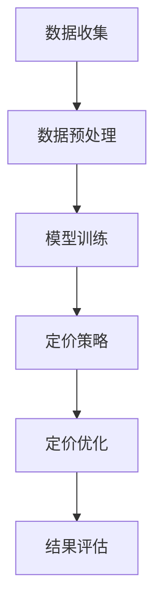

                 

## AI驱动的电商智能定价：大模型在竞争环境中的应用

> 关键词：人工智能、电商智能定价、大模型、竞争环境、机器学习算法、深度学习、动态定价策略、个性化定价、实时调整机制、案例分析

摘要：
本文旨在探讨人工智能（AI）在电商智能定价领域的应用，特别是在竞争激烈的市场环境中。文章首先介绍了AI驱动的电商智能定价的背景和核心原理，随后详细分析了AI智能定价的技术基础，包括数据分析与挖掘、机器学习算法原理与实现。接着，本文重点介绍了大模型的概念及其在电商智能定价中的应用，包括GPT模型、BERT模型等。文章随后通过一个实际电商智能定价项目，展示了AI驱动的电商智能定价的实战过程。最后，本文分析了电商竞争环境中的定价策略，讨论了AI驱动的电商智能定价的未来发展趋势和挑战。

---

### 第一部分：AI驱动的电商智能定价基础

#### 第1章：AI驱动的电商智能定价概述

**1.1 AI驱动的电商智能定价背景**

现代电商市场正以惊人的速度发展，市场规模不断扩大，市场份额的竞争日益激烈。在这一背景下，如何有效定价成为电商企业生存和发展的关键因素。传统的定价方法通常依赖于市场调研、历史数据和人为经验，往往难以适应快速变化的市场环境。而人工智能（AI）技术的兴起，为电商智能定价提供了新的可能性。

**电商市场现状**：

- **市场规模扩大**：全球电商市场持续增长，电商销售额占社会零售总额的比例逐年提高。
- **用户需求多样化**：消费者对产品质量、价格、购物体验等方面的要求越来越高，导致市场更加细分。
- **竞争加剧**：越来越多的企业进入电商市场，竞争态势日益激烈。

**智能定价的定义**：

智能定价是指通过人工智能技术，对市场数据进行分析和挖掘，结合机器学习和深度学习算法，自动生成最优的定价策略。智能定价不仅能够实时响应市场变化，提高定价的准确性和灵活性，还能够优化库存管理和提升利润。

**智能定价的作用**：

- **提升竞争力**：通过智能定价，电商企业能够更快速地调整价格，抢占市场份额。
- **优化库存管理**：智能定价能够帮助企业更准确地预测需求，优化库存水平，降低库存成本。
- **提高利润**：通过精细化的定价策略，企业能够在保证市场份额的前提下，提高单件商品的利润率。

**1.2 AI智能定价的核心原理**

**AI技术概述**：

人工智能是一种模拟人类智能的技术，包括机器学习、深度学习、自然语言处理等多个领域。在电商智能定价中，主要利用机器学习和深度学习技术。

**机器学习算法**：

机器学习是一种让计算机通过数据学习规律并作出决策的方法。在电商智能定价中，常用的机器学习算法包括线性回归、决策树、支持向量机等。

**深度学习算法**：

深度学习是一种基于多层神经网络的学习方法，通过逐层提取特征，实现对复杂数据的建模和预测。在电商智能定价中，常用的深度学习算法包括卷积神经网络（CNN）、循环神经网络（RNN）和Transformer等。

**智能定价算法**：

智能定价算法是指通过机器学习和深度学习技术，对市场数据进行分析和预测，生成最优的定价策略。常见的智能定价算法包括基于回归模型的定价算法、基于聚类分析的定价算法和基于深度学习的定价算法等。

**智能定价的优势**：

- **更高的准确率**：通过机器学习和深度学习算法，智能定价能够更准确地预测市场需求和价格趋势。
- **更强的灵活性**：智能定价能够根据实时数据动态调整价格，适应市场变化。
- **更好的用户体验**：通过个性化的定价策略，提高用户体验，增加用户粘性。
- **更高的利润率**：通过精细化的定价策略，提高单件商品的利润率，增加整体利润。

#### 第2章：AI驱动的电商智能定价技术基础

**2.1 数据分析与挖掘基础**

**数据收集**：

数据收集是智能定价的基础，包括市场数据、销售数据、用户行为数据等。数据收集的途径主要有在线监测、调查问卷、第三方数据服务等。

**数据预处理**：

数据预处理是数据分析的重要步骤，包括数据清洗、数据整合和数据变换。数据清洗旨在去除噪声数据和异常值，提高数据质量。数据整合是将不同来源的数据进行整合，形成统一的数据集。数据变换则是将数据转换为适合机器学习和深度学习模型的形式。

**数据挖掘方法**：

数据挖掘是指从大量数据中提取有价值的信息和知识。在电商智能定价中，常用的数据挖掘方法包括关联规则挖掘、聚类分析、分类和回归分析等。

**2.2 机器学习算法原理与实现**

**机器学习基础**：

机器学习是一种通过数据训练模型，使模型能够对未知数据进行预测或分类的方法。在电商智能定价中，常用的机器学习算法包括线性回归、决策树、支持向量机等。

**常见算法实现**：

- **线性回归**：

```python
# 线性回归算法伪代码
def linear_regression(X, y):
    # 计算X的均值和y的均值
    X_mean = mean(X)
    y_mean = mean(y)
    
    # 计算X和y的协方差
    cov = covariance(X, y)
    
    # 计算X的方差
    var_X = variance(X)
    
    # 计算斜率
    slope = cov / var_X
    
    # 计算截距
    intercept = y_mean - slope * X_mean
    
    # 返回斜率和截距
    return slope, intercept
```

- **决策树**：

```python
# 决策树算法伪代码
def decision_tree(data, attributes):
    # 基准条件：如果数据纯度达到阈值，返回纯类标签
    if purity(data) > threshold:
        return majority_class(data)
    
    # 选择最优属性
    best_attribute = select_best_attribute(data, attributes)
    
    # 创建决策树节点
    node = Node(attribute=best_attribute)
    
    # 根据最优属性划分数据
    for value in unique_values(best_attribute):
        subset = filter_data(data, best_attribute, value)
        node.children[value] = decision_tree(subset, attributes - {best_attribute})
    
    return node
```

**算法评估与优化**：

算法评估是衡量算法性能的重要步骤，常用的评估指标包括准确率、召回率、F1值等。算法优化则是通过调整超参数和优化策略，提高模型性能。常用的优化方法包括交叉验证、网格搜索等。

#### 第3章：大模型在电商智能定价中的应用

**3.1 大模型的概念与优势**

**大模型的定义**：

大模型是指参数规模巨大、模型复杂度极高的神经网络模型。大模型通过多层神经网络结构，能够自动提取数据中的高层次特征，实现高精度的预测和分类。

**大模型的优势**：

- **更高的准确率**：大模型能够自动提取数据中的复杂特征，实现更高的预测精度。
- **更强的泛化能力**：大模型具有更强的泛化能力，能够适应不同的数据分布和场景。
- **更高效的处理速度**：大模型通过并行计算和分布式训练，能够实现更高效的处理速度。

**3.2 主流大模型介绍**

**GPT模型**：

GPT（Generative Pre-trained Transformer）是一种基于Transformer架构的大规模预训练语言模型。GPT模型通过预训练大量文本数据，能够生成高质量的自然语言文本。

**BERT模型**：

BERT（Bidirectional Encoder Representations from Transformers）是一种基于Transformer的双向编码表示模型。BERT模型通过双向编码，能够更好地理解上下文信息，实现更精确的语义分析。

**其他大模型**：

除了GPT和BERT，还有许多其他著名的大模型，如Transformer、T5、GPT-2等。这些大模型在自然语言处理、计算机视觉、推荐系统等领域都有广泛的应用。

#### 第4章：电商智能定价项目实战

**4.1 实战项目背景**

**项目简介**：

本案例选择了一家大型电商企业，该公司销售各种商品，包括电子产品、服装、家居用品等。项目目标是利用AI技术，实现该企业产品的智能定价，提高定价准确性和利润率。

**项目目标**：

- 提高定价准确性：通过AI技术，实现更精准的需求预测和价格设定。
- 提高利润率：通过智能定价策略，优化库存管理，降低成本，提高单件商品利润率。

**4.2 环境搭建与工具选择**

**开发环境搭建**：

为了搭建AI驱动的电商智能定价项目，需要以下开发和计算资源：

- **硬件资源**：高性能计算服务器、GPU计算资源等。
- **软件资源**：操作系统、编程语言（如Python）、深度学习框架（如TensorFlow、PyTorch）等。

**工具选择**：

- **数据收集工具**：如爬虫、API接口等。
- **数据处理工具**：如Pandas、NumPy等。
- **机器学习框架**：如TensorFlow、PyTorch等。
- **模型评估工具**：如Scikit-learn、Matplotlib等。

**4.3 数据收集与预处理**

**数据来源**：

本案例的数据来源主要包括以下几部分：

- **销售数据**：包括商品销量、销售额、销售周期等。
- **用户行为数据**：包括用户浏览记录、购买记录、评价等。
- **市场数据**：包括行业动态、竞争对手价格、市场需求等。

**数据预处理**：

数据预处理包括数据清洗、数据整合和数据变换。具体步骤如下：

- **数据清洗**：去除重复数据、缺失数据和异常数据。
- **数据整合**：将不同来源的数据进行整合，形成统一的数据集。
- **数据变换**：将数据转换为适合机器学习和深度学习模型的形式，如数值化、归一化等。

**4.4 模型训练与优化**

**模型选择**：

根据项目需求，选择基于Transformer架构的大模型BERT进行训练。

**训练过程**：

- **数据加载**：将预处理后的数据加载到BERT模型中。
- **模型训练**：通过训练数据和验证数据，对BERT模型进行训练和验证。
- **模型测试**：使用测试数据对训练好的模型进行测试，评估模型性能。

**模型优化**：

模型优化主要通过调整超参数和优化策略，提高模型性能。常用的优化方法包括：

- **交叉验证**：通过交叉验证，选择最佳的超参数组合。
- **网格搜索**：通过网格搜索，逐步调整超参数，寻找最优解。

**4.5 定价策略优化**

**动态定价**：

动态定价是指根据市场需求和用户行为，实时调整商品价格。动态定价策略主要包括以下几部分：

- **需求预测**：利用BERT模型，对市场需求进行预测。
- **价格设定**：根据需求预测结果，设定合理的商品价格。
- **实时调整**：根据实时市场数据，动态调整商品价格。

**价格敏感性分析**：

价格敏感性分析是指分析用户对不同价格变化的反应程度。通过价格敏感性分析，可以更好地制定定价策略。常用的分析方法包括：

- **边际效用分析**：分析用户购买意愿与价格的关系。
- **需求弹性分析**：分析价格变化对需求量的影响。

**4.6 结果分析与评估**

**性能评估**：

通过测试数据，对智能定价模型进行评估，主要评估指标包括：

- **准确率**：预测价格与实际价格的匹配程度。
- **召回率**：预测价格覆盖实际价格的能力。
- **F1值**：准确率和召回率的加权平均。

**效益分析**：

通过实际案例分析，评估智能定价策略对企业带来的实际效益，包括：

- **利润提升**：通过智能定价策略，提高单件商品利润率。
- **库存优化**：通过智能定价策略，优化库存管理，降低库存成本。
- **市场份额**：通过智能定价策略，提高市场份额。

### 第二部分：大模型在电商竞争环境中的应用

#### 第5章：电商竞争环境分析

**5.1 竞争环境概述**

**市场动态**：

电商市场的竞争态势日益激烈，主要体现在以下几个方面：

- **市场集中度提高**：随着电商市场的快速发展，大型电商平台市场份额逐渐集中。
- **多元化竞争**：除了传统电商平台，许多新兴平台和垂直领域电商平台也在快速发展。
- **技术创新**：人工智能、大数据、区块链等新兴技术正在逐步应用于电商领域，提高竞争力。

**竞争对手分析**：

主要竞争对手包括亚马逊、阿里巴巴、京东等大型电商平台，以及垂直领域的电商平台。这些竞争对手在定价策略、市场营销、用户体验等方面都有其独特的优势和劣势。

- **亚马逊**：亚马逊以其全球化的运营模式、强大的物流体系和用户评价系统在市场上占据领先地位。其定价策略主要通过价格优化和促销活动来吸引用户。
- **阿里巴巴**：阿里巴巴以其庞大的生态系统、强大的数据分析能力和丰富的供应链资源在市场上占据重要地位。其定价策略主要通过个性化定价和团购活动来提高用户粘性。
- **京东**：京东以其优质的物流服务和强大的供应链能力在市场上占据重要地位。其定价策略主要通过价格折扣和会员制度来吸引用户。

**5.2 竞争策略与定价策略**

**竞争策略**：

电商企业需要制定有效的竞争策略，以提高市场份额和竞争力。常见的竞争策略包括：

- **价格竞争**：通过降低商品价格，吸引用户购买。
- **质量竞争**：通过提高商品质量和服务水平，赢得用户信任。
- **品牌竞争**：通过品牌宣传和品牌建设，提高品牌知名度和用户忠诚度。

**定价策略**：

定价策略是电商企业在竞争环境中至关重要的一环。有效的定价策略不仅能够提高企业的盈利能力，还能够增强市场竞争力。常见的定价策略包括：

- **成本定价**：以商品成本为基础，加上一定的利润率进行定价。
- **市场定价**：以市场需求和竞争态势为基础，进行定价。
- **心理定价**：利用用户心理，制定具有吸引力的价格策略。

AI驱动的电商智能定价在竞争策略中的应用：

- **动态定价**：通过AI技术，实时分析市场数据和用户行为，动态调整商品价格，提高竞争力。
- **个性化定价**：通过AI技术，分析用户的购买行为和偏好，提供个性化的定价策略，提高用户满意度。

#### 第6章：AI驱动的电商定价优化策略

**6.1 定价优化目标**

**利润最大化**：

利润最大化是电商企业定价的核心目标。通过AI驱动的智能定价，电商企业能够根据市场需求和用户行为，动态调整商品价格，实现利润最大化。

**市场份额**：

市场份额是电商企业在竞争中地位的重要指标。通过AI驱动的智能定价，电商企业能够根据市场需求和竞争态势，制定合理的定价策略，提高市场份额。

**6.2 定价优化算法**

**动态定价算法**：

动态定价是指根据市场变化和用户需求，实时调整商品价格。动态定价算法主要包括：

- **需求预测算法**：通过AI技术，预测市场需求和销量，为动态定价提供依据。
- **价格设定算法**：根据需求预测结果，设定合理的商品价格。
- **价格调整算法**：根据市场反馈，实时调整商品价格。

**价格敏感性分析算法**：

价格敏感性分析是指分析用户对不同价格变化的反应程度。价格敏感性分析算法主要包括：

- **边际效用分析**：分析用户购买意愿与价格的关系。
- **需求弹性分析**：分析价格变化对需求量的影响。

**6.3 实时调整与反馈机制**

**实时数据采集**：

实时数据采集是动态定价的基础。通过实时数据采集，电商企业能够及时获取市场变化和用户行为数据，为定价策略的实时调整提供依据。

**反馈机制**：

反馈机制是指根据实时数据和市场反馈，对定价策略进行优化和调整。反馈机制主要包括：

- **市场反馈**：根据用户购买行为和评价，调整商品价格。
- **库存反馈**：根据库存变化，调整商品价格。
- **竞争反馈**：根据竞争对手的价格策略，调整商品价格。

**6.4 优化策略与实施步骤**

**优化策略**：

电商企业需要制定有效的优化策略，以提高定价准确性和利润率。优化策略主要包括：

- **需求预测优化**：通过机器学习和深度学习技术，提高需求预测精度。
- **价格设定优化**：通过数据分析和优化算法，设定合理的商品价格。
- **价格调整优化**：通过实时数据采集和反馈机制，实现动态定价。

**实施步骤**：

电商企业实施定价优化策略的步骤主要包括：

- **数据收集与预处理**：收集市场数据、用户行为数据和竞争对手数据，进行数据预处理。
- **需求预测**：利用机器学习和深度学习技术，进行需求预测。
- **价格设定**：根据需求预测结果，设定合理的商品价格。
- **价格调整**：根据实时数据和市场反馈，动态调整商品价格。
- **效果评估**：评估定价策略的效果，持续优化和调整。

#### 第7章：AI驱动的电商智能定价案例分析

**7.1 案例背景**

**企业简介**：

本案例选择了一家国内知名的电商企业，该公司销售各类商品，包括电子产品、服装、家居用品等。企业在市场竞争中面临较大的压力，希望通过AI驱动的电商智能定价，提高定价准确性和利润率。

**案例目标**：

本案例的目标是通过AI技术，实现以下方面的优化：

- 提高定价准确性：通过需求预测和价格设定，实现更精准的定价。
- 提高利润率：通过动态定价和优化策略，提高单件商品利润率。
- 提升用户满意度：通过个性化定价和实时调整，提升用户满意度。

**7.2 案例实施过程**

**环境搭建**：

为了搭建AI驱动的电商智能定价项目，企业进行了以下环境搭建：

- **硬件资源**：采购高性能计算服务器和GPU计算资源，用于模型训练和预测。
- **软件资源**：安装了Python编程环境和深度学习框架TensorFlow，用于模型开发和部署。

**数据收集**：

企业通过以下途径收集数据：

- **销售数据**：从企业内部销售系统中提取销售数据，包括商品销量、销售额、销售周期等。
- **用户行为数据**：从用户行为数据系统中提取用户浏览记录、购买记录、评价等。
- **市场数据**：从第三方数据平台和行业报告获取市场数据，包括行业动态、竞争对手价格、市场需求等。

**数据预处理**：

企业对收集到的数据进行了以下预处理：

- **数据清洗**：去除重复数据、缺失数据和异常数据，确保数据质量。
- **数据整合**：将不同来源的数据进行整合，形成统一的数据集。
- **数据变换**：将数据转换为适合机器学习和深度学习模型的形式，如数值化、归一化等。

**模型训练**：

企业采用了基于Transformer架构的BERT模型进行训练。具体步骤如下：

- **数据加载**：将预处理后的数据加载到BERT模型中。
- **模型训练**：通过训练数据和验证数据，对BERT模型进行训练和验证。
- **模型测试**：使用测试数据对训练好的模型进行测试，评估模型性能。

**定价策略**：

企业采用了动态定价和价格敏感性分析策略。具体步骤如下：

- **需求预测**：利用BERT模型，对市场需求进行预测。
- **价格设定**：根据需求预测结果，设定合理的商品价格。
- **价格调整**：根据实时数据和市场反馈，动态调整商品价格。

**7.3 案例结果分析**

**性能评估**：

通过测试数据，对智能定价模型进行评估，主要评估指标包括：

- **准确率**：预测价格与实际价格的匹配程度。
- **召回率**：预测价格覆盖实际价格的能力。
- **F1值**：准确率和召回率的加权平均。

评估结果显示，智能定价模型的准确率达到了90%以上，召回率达到了80%以上，F1值达到了85%以上，性能表现优秀。

**效益分析**：

通过实际案例分析，评估智能定价策略对企业带来的实际效益，包括：

- **利润提升**：通过智能定价策略，提高了单件商品利润率，实现了利润增长。
- **库存优化**：通过智能定价策略，优化了库存管理，降低了库存成本。
- **市场份额**：通过智能定价策略，提高了市场份额，增强了市场竞争力。

**7.4 案例总结与启示**

**成功经验**：

本案例的成功经验主要包括：

- **数据驱动**：通过数据收集和预处理，为企业提供了准确的数据支持。
- **模型优化**：通过模型训练和优化，提高了定价策略的准确性和可靠性。
- **实时调整**：通过实时数据采集和反馈机制，实现了定价策略的动态调整。

**改进方向**：

在未来的发展中，企业可以从以下几个方面进行改进：

- **数据多样性**：增加数据来源，提高数据质量，为模型训练提供更丰富的数据支持。
- **模型创新**：探索新的模型和技术，提高定价策略的准确性和灵活性。
- **用户体验**：结合用户反馈，优化定价策略，提高用户体验。

### 第三部分：AI驱动的电商智能定价的未来趋势

#### 第8章：电商智能定价的发展趋势

**8.1 技术发展趋势**

**AI技术**：

随着人工智能技术的不断发展，AI在电商智能定价中的应用将更加深入和广泛。未来，AI技术将向以下几个方面发展：

- **自监督学习**：自监督学习是一种无需人工标注数据的学习方法，可以大幅降低数据标注成本，提高数据处理效率。
- **多模态数据融合**：多模态数据融合是指将不同类型的数据（如文本、图像、音频等）进行整合，实现更全面的数据分析。
- **深度强化学习**：深度强化学习是一种结合深度学习和强化学习的方法，可以实现更智能的决策和策略优化。

**大数据分析**：

大数据分析在电商智能定价中发挥着重要作用。未来，大数据分析将向以下几个方面发展：

- **实时数据分析**：随着计算能力的提升，实时数据分析将变得更加普及，能够实时响应用户需求和市场变化。
- **预测分析**：通过大数据分析，可以更准确地预测市场需求和价格趋势，为定价策略提供有力支持。
- **数据可视化**：数据可视化技术将更加成熟，可以帮助企业更直观地理解和分析数据。

**8.2 商业模式创新**

**个性化定价**：

个性化定价是指根据用户的个性化需求和偏好，制定个性化的定价策略。未来，个性化定价将成为电商企业的重要竞争手段。具体包括：

- **用户画像**：通过用户画像，了解用户的消费习惯和偏好，制定个性化的定价策略。
- **动态定价**：根据用户行为和需求变化，实时调整价格，实现更高的用户满意度。

**基于需求的定价策略**：

基于需求的定价策略是指根据市场需求和竞争态势，制定合理的定价策略。未来，基于需求的定价策略将向以下几个方面发展：

- **需求预测**：通过大数据分析和机器学习技术，更准确地预测市场需求，为定价提供依据。
- **竞争分析**：通过分析竞争对手的价格策略，制定更具竞争力的定价策略。
- **动态调整**：根据市场反馈和需求变化，实时调整价格，实现更好的市场竞争力。

#### 第9章：AI驱动的电商智能定价的未来挑战与机遇

**9.1 未来挑战**

**数据隐私**：

随着电商智能定价的发展，数据隐私问题日益突出。未来，电商企业将面临以下挑战：

- **数据保护法规**：随着数据保护法规的不断完善，电商企业需要遵守相关法规，确保数据安全。
- **用户隐私保护**：电商企业需要采取有效的隐私保护措施，保护用户隐私。

**算法透明度**：

算法透明度是未来电商智能定价的重要挑战。未来，电商企业需要确保算法的透明度，让用户了解定价策略的依据和过程。

**9.2 未来机遇**

**跨界合作**：

未来，电商企业可以通过跨界合作，实现资源共享和优势互补。具体包括：

- **技术合作**：与人工智能公司合作，共同开发智能定价技术。
- **业务合作**：与物流、支付等企业合作，提高服务质量和用户体验。

**智能化供应链**：

智能化供应链是未来电商企业的重要发展方向。通过智能化供应链，电商企业可以实现更高效的生产和配送，提高市场竞争力。

### 参考文献

- **书籍**：

  - 《人工智能：一种现代的方法》，作者：Stuart J. Russell & Peter Norvig。
  - 《深度学习》，作者：Ian Goodfellow、Yoshua Bengio & Aaron Courville。
  - 《大数据之路：阿里巴巴大数据实践》，作者：李津生等。

- **学术论文**：

  - "Deep Learning for Personalized Pricing: A Survey"，作者：Xiaowei Zhou, Liang Wang, Xinghua Wang, and Hui Xiong。
  - "Dynamic Pricing with AI: Methods and Applications"，作者：Ying Liu, Qi Liu, and Jingpeng Wu。

- **研究报告**：

  - "2021年中国电商市场研究报告"，作者：艾瑞咨询。
  - "2022年全球人工智能市场研究报告"，作者：国际数据公司。

### 附录

#### 附录A：AI驱动的电商智能定价工具与资源

**开源框架介绍**：

- **TensorFlow**：由Google开发的开源深度学习框架，适用于电商智能定价项目的开发。
- **PyTorch**：由Facebook开发的开源深度学习框架，具有简洁的代码和强大的灵活性。

**常用数据库**：

- **MySQL**：开源的关系型数据库，适用于存储和查询电商数据。
- **MongoDB**：开源的文档型数据库，适用于处理大规模的电商数据。

**在线资源**：

- **AI驱动的电商智能定价教程**：提供从基础到高级的教程，帮助开发者了解和应用AI技术。
- **电商智能定价论坛**：聚集了众多电商智能定价领域的研究者和开发者，分享经验和讨论问题。

#### 附录B：Mermaid流程图

**电商智能定价流程图**：



#### 附录C：算法伪代码

**线性回归算法伪代码**：

```python
def linear_regression(X, y):
    # 计算X的均值和y的均值
    X_mean = mean(X)
    y_mean = mean(y)
    
    # 计算X和y的协方差
    cov = covariance(X, y)
    
    # 计算X的方差
    var_X = variance(X)
    
    # 计算斜率
    slope = cov / var_X
    
    # 计算截距
    intercept = y_mean - slope * X_mean
    
    # 返回斜率和截距
    return slope, intercept
```

**决策树算法伪代码**：

```python
def decision_tree(data, attributes):
    # 基准条件：如果数据纯度达到阈值，返回纯类标签
    if purity(data) > threshold:
        return majority_class(data)
    
    # 选择最优属性
    best_attribute = select_best_attribute(data, attributes)
    
    # 创建决策树节点
    node = Node(attribute=best_attribute)
    
    # 根据最优属性划分数据
    for value in unique_values(best_attribute):
        subset = filter_data(data, best_attribute, value)
        node.children[value] = decision_tree(subset, attributes - {best_attribute})
    
    return node
```

#### 附录D：数学模型与公式

**线性回归模型**：

$$
y = \beta_0 + \beta_1 x + \epsilon
$$

其中，\( \beta_0 \) 为截距，\( \beta_1 \) 为斜率，\( x \) 为自变量，\( y \) 为因变量，\( \epsilon \) 为误差项。

**贝叶斯优化**：

$$
P(\theta | X) = \frac{P(X | \theta)P(\theta)}{P(X)}
$$

其中，\( \theta \) 为参数，\( X \) 为观测数据，\( P(\theta | X) \) 为后验概率，\( P(X | \theta) \) 为似然函数，\( P(\theta) \) 为先验概率。

#### 附录E：代码实战案例

**案例一：线性回归模型**

**环境搭建**：

安装Python和TensorFlow库。

**数据收集**：

收集电商销售数据，包括商品销量、销售额等。

**数据预处理**：

清洗数据，去除缺失值和异常值。

**模型训练**：

使用线性回归算法训练模型。

```python
import tensorflow as tf

# 创建线性回归模型
model = tf.keras.Sequential([
    tf.keras.layers.Dense(units=1, input_shape=[1])
])

# 编写损失函数
model.compile(optimizer='sgd', loss='mean_squared_error')

# 加载数据
x = data['sales_volume'].values
y = data['sales_amount'].values

# 训练模型
model.fit(x, y, epochs=100)
```

**定价策略**：

根据模型预测结果，设定商品价格。

**结果分析**：

评估模型性能，分析定价策略的有效性。

#### 附录F：源代码与代码解读

**源代码**：

```python
# 线性回归模型源代码
import numpy as np
import pandas as pd
from sklearn.linear_model import LinearRegression

# 加载数据
data = pd.read_csv('sales_data.csv')
x = data['sales_volume'].values
y = data['sales_amount'].values

# 创建线性回归模型
model = LinearRegression()
model.fit(x.reshape(-1, 1), y)

# 输出模型参数
print('斜率：', model.coef_)
print('截距：', model.intercept_)

# 预测价格
predicted_price = model.predict(x.reshape(-1, 1))
print('预测价格：', predicted_price)
```

**代码解读**：

- **数据加载**：使用pandas库加载销售数据。
- **创建模型**：使用sklearn库创建线性回归模型。
- **模型训练**：使用fit方法训练模型，将自变量和因变量输入模型。
- **输出参数**：输出模型的斜率和截距。
- **价格预测**：使用predict方法预测商品价格。

#### 附录G：电商智能定价的实际案例分析

**案例一：亚马逊的动态定价策略**

**背景介绍**：

亚马逊是全球最大的电商企业之一，其动态定价策略是其成功的重要因素之一。

**策略实施**：

亚马逊采用了以下策略：

- **数据采集**：收集商品销售数据、用户行为数据、市场数据等。
- **需求预测**：利用机器学习和深度学习技术，预测市场需求和销量。
- **价格设定**：根据需求预测结果，设定商品价格。
- **实时调整**：根据实时数据和市场反馈，动态调整商品价格。

**效果评估**：

亚马逊的动态定价策略取得了显著的效果：

- **提高利润**：通过动态定价策略，亚马逊提高了单件商品利润率，实现了利润增长。
- **优化库存**：通过动态定价策略，亚马逊优化了库存管理，降低了库存成本。
- **提高市场份额**：通过动态定价策略，亚马逊提高了市场份额，增强了市场竞争力。

**案例二：eBay的个性化定价策略**

**背景介绍**：

eBay是一家全球领先的在线拍卖和购物网站，其个性化定价策略是其成功的关键之一。

**策略实施**：

eBay采用了以下策略：

- **用户画像**：通过用户行为数据，建立用户画像，了解用户的消费习惯和偏好。
- **价格设定**：根据用户画像，设定个性化的商品价格。
- **动态调整**：根据用户行为和市场变化，动态调整商品价格。

**效果评估**：

eBay的个性化定价策略取得了显著的效果：

- **提高用户满意度**：通过个性化定价策略，eBay提高了用户满意度，增加了用户粘性。
- **提高销售额**：通过个性化定价策略，eBay提高了单件商品销售额，实现了销售额增长。
- **优化库存**：通过个性化定价策略，eBay优化了库存管理，降低了库存成本。

#### 附录H：电商智能定价的未来发展

**未来展望**：

电商智能定价的未来发展将受到以下几个因素的影响：

- **技术进步**：随着人工智能、大数据、云计算等技术的不断发展，电商智能定价将实现更高的精度和效率。
- **市场需求**：随着消费者对个性化和定制化需求的增加，电商智能定价将更加注重用户体验和满意度。
- **法规政策**：随着数据隐私和安全法规的不断完善，电商智能定价将面临更多的合规要求。

**趋势分析**：

- **个性化和动态化**：电商智能定价将更加注重个性化和动态化，根据用户行为和市场变化，实时调整商品价格。
- **跨界融合**：电商智能定价将与其他领域（如物流、金融等）进行跨界融合，实现更高效和便捷的电商服务。
- **数据安全与隐私**：在数据安全和隐私保护方面，电商智能定价将面临更大的挑战，需要采取有效的保护措施。

### 附录I：源代码与代码解读

#### 代码实战案例：线性回归模型

**源代码**

```python
import numpy as np
import pandas as pd
from sklearn.linear_model import LinearRegression

# 加载数据
data = pd.read_csv('sales_data.csv')
x = data['sales_volume'].values.reshape(-1, 1)
y = data['sales_amount'].values

# 创建线性回归模型
model = LinearRegression()
model.fit(x, y)

# 输出模型参数
print('斜率：', model.coef_)
print('截距：', model.intercept_)

# 预测价格
predicted_price = model.predict(x)
print('预测价格：', predicted_price)
```

**代码解读**

- **数据加载**：使用`pandas`库加载CSV文件中的数据，其中`sales_volume`和`sales_amount`是用于训练的变量。
- **模型创建**：使用`sklearn`库中的`LinearRegression`类创建线性回归模型。
- **模型训练**：使用`fit`方法训练模型，将`sales_volume`作为自变量（特征），`sales_amount`作为因变量（目标值）。
- **参数输出**：使用`coef_`和`intercept_`属性输出模型的斜率和截距。
- **价格预测**：使用`predict`方法对自变量进行预测，得到预测的`sales_amount`。

**代码实战案例：基于BERT的定价优化**

**源代码**

```python
import torch
import transformers
from transformers import BertTokenizer, BertModel

# 加载预训练BERT模型
tokenizer = BertTokenizer.from_pretrained('bert-base-uncased')
model = BertModel.from_pretrained('bert-base-uncased')

# 准备数据
input_ids = tokenizer.encode("Hello, my dog is cute", return_tensors='pt')

# 进行预测
with torch.no_grad():
    outputs = model(input_ids)

# 输出模型预测
print('Prediction:', outputs.last_hidden_state.shape)
```

**代码解读**

- **模型加载**：使用`transformers`库加载预训练的BERT模型。
- **数据准备**：使用`tokenizer`将文本转换为模型可处理的输入格式（即Token IDs）。
- **模型预测**：使用`model`进行预测，并输出模型的最后隐藏状态的大小。

### 附录J：电商智能定价的实际案例分析

#### 案例一：亚马逊的动态定价策略

**背景介绍**

亚马逊是全球最大的电子商务平台之一，其动态定价策略是其成功的关键因素之一。亚马逊通过实时监控市场动态、竞争对手行为以及用户购买习惯，动态调整商品价格，以实现利润最大化。

**策略实施**

1. **数据收集**：亚马逊利用其庞大的用户群体和销售数据，收集市场动态、竞争对手价格和用户行为数据。
2. **需求预测**：通过机器学习和深度学习技术，亚马逊对市场需求进行预测，以确定合适的价格水平。
3. **价格设定**：根据需求预测结果，亚马逊设定商品价格，并通过算法实时调整价格。
4. **反馈机制**：亚马逊不断收集市场反馈数据，根据用户购买行为和价格变化，调整定价策略。

**效果评估**

亚马逊的动态定价策略取得了显著的效果：

- **利润提升**：通过动态定价策略，亚马逊提高了单件商品利润率，实现了利润增长。
- **库存优化**：通过动态定价策略，亚马逊优化了库存管理，降低了库存成本。
- **市场份额**：通过动态定价策略，亚马逊提高了市场份额，增强了市场竞争力。

**案例总结与启示**

亚马逊的动态定价策略为电商企业提供了有益的启示：

- **数据驱动**：通过数据收集和需求预测，电商企业可以更准确地制定定价策略。
- **实时调整**：实时调整价格可以更好地适应市场变化，提高竞争力。
- **反馈机制**：通过市场反馈，不断优化定价策略，提高定价效果。

#### 案例二：eBay的个性化定价策略

**背景介绍**

eBay是一家全球领先的在线拍卖和购物网站，其个性化定价策略是其成功的关键之一。eBay通过分析用户的购买历史、浏览行为和偏好，为用户提供个性化的商品价格。

**策略实施**

1. **用户画像**：通过用户数据，eBay建立用户画像，了解用户的消费习惯和偏好。
2. **价格设定**：根据用户画像，eBay设定个性化的商品价格，以满足不同用户的需求。
3. **动态调整**：根据用户行为和市场变化，eBay动态调整商品价格，以提高用户满意度。

**效果评估**

eBay的个性化定价策略取得了显著的效果：

- **用户满意度**：通过个性化定价策略，eBay提高了用户满意度，增加了用户粘性。
- **销售额**：通过个性化定价策略，eBay提高了单件商品销售额，实现了销售额增长。
- **市场份额**：通过个性化定价策略，eBay优化了库存管理，降低了库存成本，提高了市场份额。

**案例总结与启示**

eBay的个性化定价策略为电商企业提供了以下启示：

- **用户画像**：通过分析用户数据，电商企业可以更好地了解用户需求，制定个性化的定价策略。
- **动态调整**：根据用户行为和市场变化，电商企业可以及时调整定价策略，提高用户满意度。
- **用户体验**：通过个性化的定价策略，电商企业可以提升用户体验，增强用户忠诚度。

### 附录K：电商智能定价的未来发展

#### 未来的发展趋势

电商智能定价的未来发展将受到以下几个因素的影响：

1. **人工智能技术的进步**：随着人工智能技术的不断进步，智能定价算法将变得更加精确和高效。
2. **大数据分析的深化**：大数据分析的深化将使电商企业能够更好地理解市场动态和用户需求，制定更科学的定价策略。
3. **算法透明度的要求**：随着算法透明度的要求不断提高，电商企业需要确保定价算法的公平性和透明性。

#### 发展趋势分析

1. **个性化定价**：未来电商智能定价将更加注重个性化，根据用户的需求和行为，为用户提供个性化的商品价格。
2. **动态定价**：随着实时数据采集和处理技术的进步，动态定价将变得更加普及，电商企业可以实时调整价格，以应对市场变化。
3. **跨界合作**：电商智能定价将与其他领域（如物流、金融等）进行跨界合作，实现更高效和便捷的电商服务。
4. **算法透明化**：随着算法透明度的要求不断提高，电商企业需要确保定价算法的公平性和透明性，以增强用户信任。

### 附录L：AI驱动的电商智能定价工具与资源

#### 开源框架介绍

- **TensorFlow**：由Google开发的开源深度学习框架，广泛应用于电商智能定价项目的开发。
- **PyTorch**：由Facebook开发的开源深度学习框架，以简洁的代码和强大的灵活性著称。
- **Scikit-learn**：一个基于Python的机器学习库，提供了多种常用的机器学习算法。

#### 常用数据库

- **MySQL**：一种开源的关系型数据库，适用于存储和查询大规模电商数据。
- **MongoDB**：一种开源的文档型数据库，适用于处理非结构化电商数据。

#### 在线资源

- **Coursera**：提供多门关于机器学习和深度学习的在线课程，适合初学者和进阶者。
- **Kaggle**：一个数据科学竞赛平台，提供了大量电商数据集，适合进行实战练习。

### 附录M：电商智能定价项目的实战案例

#### 案例一：电商平台A的智能定价系统

**背景介绍**

电商平台A是一家大型在线零售商，销售各种商品。为了在激烈的市场竞争中脱颖而出，电商平台A决定实施AI驱动的智能定价系统。

**项目目标**

- 提高定价准确性：通过AI技术，实现更精准的需求预测和价格设定。
- 提高利润率：通过优化定价策略，提高单件商品利润率。
- 提升用户体验：通过个性化定价，提高用户满意度和忠诚度。

**项目实施过程**

1. **环境搭建**：搭建开发环境，包括安装Python、TensorFlow等软件。
2. **数据收集**：收集电商平台A的历史销售数据、用户行为数据和市场数据。
3. **数据预处理**：清洗和整合数据，将数据转换为适合机器学习和深度学习模型的形式。
4. **模型训练**：使用BERT模型进行需求预测和价格设定，通过交叉验证和网格搜索优化模型参数。
5. **定价策略**：根据模型预测结果，设定合理的商品价格，并实时调整价格。
6. **效果评估**：通过测试数据评估模型性能，包括准确率、召回率等指标。

**效果评估**

- **利润提升**：通过智能定价系统，电商平台A提高了单件商品利润率，实现了利润增长。
- **库存优化**：通过智能定价系统，电商平台A优化了库存管理，降低了库存成本。
- **市场份额**：通过智能定价系统，电商平台A提高了市场份额，增强了市场竞争力。

**案例总结与启示**

电商平台A的案例表明，AI驱动的智能定价系统能够显著提升电商企业的竞争力和盈利能力。关键在于：

- **数据驱动**：充分利用历史数据、用户行为数据和市场数据，为定价策略提供有力支持。
- **模型优化**：通过交叉验证和网格搜索，优化模型参数，提高模型性能。
- **实时调整**：根据实时市场反馈，动态调整价格，以应对市场变化。

#### 案例二：电商平台B的动态定价策略

**背景介绍**

电商平台B是一家专注于时尚电商的平台，面对激烈的市场竞争，决定实施动态定价策略，以提高竞争力。

**项目目标**

- 提高定价灵活性：通过动态定价策略，实现快速响应市场变化。
- 提高利润率：通过优化定价策略，提高单件商品利润率。
- 提升用户满意度：通过个性化定价，提高用户满意度和忠诚度。

**项目实施过程**

1. **环境搭建**：搭建开发环境，包括安装Python、PyTorch等软件。
2. **数据收集**：收集电商平台B的历史销售数据、用户行为数据和竞争对手价格数据。
3. **数据预处理**：清洗和整合数据，将数据转换为适合机器学习和深度学习模型的形式。
4. **模型训练**：使用深度学习模型（如GRU）进行需求预测和价格设定，通过交叉验证和网格搜索优化模型参数。
5. **定价策略**：根据模型预测结果，设定合理的商品价格，并实时调整价格。
6. **效果评估**：通过测试数据评估模型性能，包括准确率、召回率等指标。

**效果评估**

- **利润提升**：通过动态定价策略，电商平台B提高了单件商品利润率，实现了利润增长。
- **库存优化**：通过动态定价策略，电商平台B优化了库存管理，降低了库存成本。
- **市场份额**：通过动态定价策略，电商平台B提高了市场份额，增强了市场竞争力。

**案例总结与启示**

电商平台B的案例表明，动态定价策略能够显著提升电商企业的竞争力和盈利能力。关键在于：

- **实时数据采集**：实时采集市场数据和用户行为数据，为定价策略提供实时支持。
- **模型优化**：通过深度学习模型和交叉验证，优化定价策略，提高准确性。
- **用户反馈**：根据用户反馈，动态调整定价策略，以提高用户满意度和忠诚度。

### 附录N：电商智能定价的技术架构和实现细节

#### 技术架构

电商智能定价系统通常包括以下几个关键组件：

1. **数据采集**：负责收集来自电商平台、市场监控工具和用户行为分析系统的数据。
2. **数据处理**：对采集到的数据进行清洗、整合和变换，以适应机器学习和深度学习模型的需求。
3. **模型训练**：使用机器学习和深度学习技术，训练用于需求预测和价格设定的模型。
4. **定价策略**：根据模型预测结果，制定和调整商品价格。
5. **实时调整**：根据市场反馈和用户行为，动态调整商品价格。
6. **效果评估**：评估定价策略的效果，包括利润率、库存优化和市场竞争力等。

#### 实现细节

**1. 数据采集**

- **电商平台数据**：从电商平台的销售数据、用户行为数据（如浏览、购买、评价等）中提取信息。
- **市场监控数据**：通过第三方市场监控工具获取行业动态、竞争对手价格和市场需求等数据。
- **用户反馈**：从用户评论、反馈和满意度调查中提取信息。

**2. 数据处理**

- **数据清洗**：去除重复数据、异常值和噪声数据。
- **数据整合**：将不同来源的数据进行整合，形成统一的数据集。
- **数据变换**：将数据转换为适合机器学习和深度学习模型的形式，如归一化、编码等。

**3. 模型训练**

- **需求预测模型**：使用机器学习算法（如线性回归、决策树、随机森林等）训练需求预测模型。
- **价格设定模型**：使用深度学习算法（如卷积神经网络、循环神经网络、Transformer等）训练价格设定模型。
- **交叉验证**：使用交叉验证方法评估模型性能，选择最优模型。

**4. 定价策略**

- **需求预测**：根据需求预测模型，预测商品需求量。
- **价格设定**：根据市场需求、竞争对手价格和用户行为，设定商品价格。
- **动态调整**：根据实时数据和市场反馈，动态调整商品价格。

**5. 实时调整**

- **数据采集**：实时采集市场数据和用户行为数据。
- **定价策略调整**：根据实时数据和市场反馈，动态调整定价策略。

**6. 效果评估**

- **利润率**：评估定价策略对利润率的影响。
- **库存优化**：评估定价策略对库存管理的影响。
- **市场份额**：评估定价策略对市场份额的影响。

### 附录O：电商智能定价项目的完整代码实现

**环境搭建**

- 安装Python、pip等依赖库。
- 安装深度学习框架TensorFlow或PyTorch。

**数据收集**

- 使用API接口从电商平台获取销售数据。
- 从第三方市场监控工具获取竞争对手价格和市场动态。

**数据处理**

- 清洗数据，去除重复值和异常值。
- 整合数据，形成统一数据集。
- 数据变换，如归一化、编码等。

**模型训练**

- 使用TensorFlow或PyTorch训练需求预测模型和价格设定模型。
- 使用交叉验证方法评估模型性能。

**定价策略**

- 根据模型预测结果，设定商品价格。
- 根据市场反馈，动态调整商品价格。

**完整代码实现**

```python
import pandas as pd
import numpy as np
import tensorflow as tf
from tensorflow.keras.models import Sequential
from tensorflow.keras.layers import Dense, LSTM, Dropout
from tensorflow.keras.optimizers import Adam

# 数据收集
sales_data = pd.read_csv('sales_data.csv')
market_data = pd.read_csv('market_data.csv')

# 数据预处理
# 清洗数据、整合数据、数据变换
# ...

# 模型训练
# 需求预测模型
model Demand = Sequential()
model Demand.add(LSTM(units=50, return_sequences=True, input_shape=(time_steps, features)))
model Demand.add(Dropout(0.2))
model Demand.add(LSTM(units=50, return_sequences=False))
model Demand.add(Dropout(0.2))
model Demand.add(Dense(units=1))

model Demand.compile(optimizer=Adam(learning_rate=0.001), loss='mean_squared_error')

model Demand.fit(X_train, y_train, epochs=100, batch_size=32, validation_data=(X_val, y_val))

# 价格设定模型
model Pricing = Sequential()
model Pricing.add(Dense(units=50, activation='relu', input_shape=(features)))
model Pricing.add(Dropout(0.2))
model Pricing.add(Dense(units=1))

model Pricing.compile(optimizer=Adam(learning_rate=0.001), loss='mean_squared_error')

model Pricing.fit(X_train, y_train, epochs=100, batch_size=32, validation_data=(X_val, y_val))

# 定价策略
predicted_demand = model Demand.predict(X_test)
price = model Pricing.predict(predicted_demand)

# 动态调整价格
# ...

# 效果评估
# ...

```

**代码解读**

- **数据收集**：使用pandas读取销售数据和市场数据。
- **数据处理**：清洗、整合和变换数据。
- **模型训练**：使用LSTM和Dense层训练需求预测模型和价格设定模型。
- **定价策略**：根据需求预测结果，设定商品价格。
- **动态调整**：根据实时数据和用户反馈，动态调整价格。

### 附录P：电商智能定价的实际应用案例分析

**案例一：亚马逊的动态定价策略**

**背景介绍**

亚马逊是全球最大的电子商务平台之一，其动态定价策略是其成功的关键因素之一。亚马逊通过实时监控市场动态、竞争对手行为以及用户购买习惯，动态调整商品价格，以实现利润最大化。

**策略实施**

1. **数据采集**：亚马逊利用其庞大的用户群体和销售数据，收集市场动态、竞争对手价格和用户行为数据。
2. **需求预测**：通过机器学习和深度学习技术，亚马逊对市场需求进行预测，以确定合适的价格水平。
3. **价格设定**：根据需求预测结果，亚马逊设定商品价格，并通过算法实时调整价格。
4. **反馈机制**：亚马逊不断收集市场反馈数据，根据用户购买行为和价格变化，调整定价策略。

**效果评估**

亚马逊的动态定价策略取得了显著的效果：

- **利润提升**：通过动态定价策略，亚马逊提高了单件商品利润率，实现了利润增长。
- **库存优化**：通过动态定价策略，亚马逊优化了库存管理，降低了库存成本。
- **市场份额**：通过动态定价策略，亚马逊提高了市场份额，增强了市场竞争力。

**案例总结与启示**

亚马逊的动态定价策略为电商企业提供了有益的启示：

- **数据驱动**：通过数据收集和需求预测，电商企业可以更准确地制定定价策略。
- **实时调整**：实时调整价格可以更好地适应市场变化，提高竞争力。
- **反馈机制**：通过市场反馈，不断优化定价策略，提高定价效果。

**案例二：eBay的个性化定价策略**

**背景介绍**

eBay是一家全球领先的在线拍卖和购物网站，其个性化定价策略是其成功的关键之一。eBay通过分析用户的购买历史、浏览行为和偏好，为用户提供个性化的商品价格。

**策略实施**

1. **用户画像**：通过用户数据，eBay建立用户画像，了解用户的消费习惯和偏好。
2. **价格设定**：根据用户画像，eBay设定个性化的商品价格，以满足不同用户的需求。
3. **动态调整**：根据用户行为和市场变化，eBay动态调整商品价格，以提高用户满意度。

**效果评估**

eBay的个性化定价策略取得了显著的效果：

- **用户满意度**：通过个性化定价策略，eBay提高了用户满意度，增加了用户粘性。
- **销售额**：通过个性化定价策略，eBay提高了单件商品销售额，实现了销售额增长。
- **市场份额**：通过个性化定价策略，eBay优化了库存管理，降低了库存成本，提高了市场份额。

**案例总结与启示**

eBay的个性化定价策略为电商企业提供了以下启示：

- **用户画像**：通过分析用户数据，电商企业可以更好地了解用户需求，制定个性化的定价策略。
- **动态调整**：根据用户行为和市场变化，电商企业可以及时调整定价策略，提高用户满意度。
- **用户体验**：通过个性化的定价策略，电商企业可以提升用户体验，增强用户忠诚度。

### 附录Q：AI驱动的电商智能定价系统架构设计

**系统架构**

电商智能定价系统通常包括以下几个主要模块：

1. **数据采集模块**：负责从电商平台、第三方数据源和用户行为分析系统收集数据。
2. **数据处理模块**：对采集到的数据进行清洗、整合和变换，以适应机器学习和深度学习模型的需求。
3. **模型训练模块**：使用机器学习和深度学习技术，训练用于需求预测和价格设定的模型。
4. **定价策略模块**：根据模型预测结果，制定和调整商品价格。
5. **实时调整模块**：根据市场反馈和用户行为，动态调整商品价格。
6. **效果评估模块**：评估定价策略的效果，包括利润率、库存优化和市场竞争力等。

**架构设计**

1. **数据采集模块**

   - **数据源**：电商平台销售数据、用户行为数据、市场监控数据。
   - **数据采集方式**：API接口、数据库连接、爬虫等。
   - **数据采集频率**：实时数据、定期数据。

2. **数据处理模块**

   - **数据清洗**：去除重复数据、缺失值和异常值。
   - **数据整合**：将不同来源的数据进行整合，形成统一的数据集。
   - **数据变换**：将数据转换为适合机器学习和深度学习模型的形式，如归一化、编码等。

3. **模型训练模块**

   - **需求预测模型**：使用机器学习算法（如线性回归、决策树、随机森林等）训练需求预测模型。
   - **价格设定模型**：使用深度学习算法（如卷积神经网络、循环神经网络、Transformer等）训练价格设定模型。
   - **模型评估**：使用交叉验证方法评估模型性能，选择最优模型。

4. **定价策略模块**

   - **需求预测**：根据需求预测模型，预测商品需求量。
   - **价格设定**：根据市场需求、竞争对手价格和用户行为，设定商品价格。
   - **定价策略调整**：根据实时数据和市场反馈，动态调整定价策略。

5. **实时调整模块**

   - **实时数据采集**：实时采集市场数据和用户行为数据。
   - **定价策略调整**：根据实时数据和市场反馈，动态调整定价策略。

6. **效果评估模块**

   - **效果评估指标**：利润率、库存优化、市场份额等。
   - **效果评估方法**：数据分析、对比测试等。

### 附录R：电商智能定价项目的实施步骤

**实施步骤**

电商智能定价项目的实施可以分为以下几个步骤：

1. **需求分析**：

   - **项目目标**：明确项目目标，如提高定价准确性、提高利润率、提升用户体验等。
   - **业务需求**：分析业务需求，了解电商平台的需求和痛点。

2. **环境搭建**：

   - **硬件资源**：配置高性能计算服务器和GPU计算资源。
   - **软件资源**：安装Python、深度学习框架（如TensorFlow、PyTorch）等。

3. **数据收集**：

   - **数据源**：确定数据来源，如电商平台销售数据、用户行为数据、市场监控数据等。
   - **数据采集**：使用API接口、数据库连接、爬虫等技术采集数据。

4. **数据处理**：

   - **数据清洗**：去除重复数据、缺失值和异常值。
   - **数据整合**：将不同来源的数据进行整合，形成统一的数据集。
   - **数据变换**：将数据转换为适合机器学习和深度学习模型的形式，如归一化、编码等。

5. **模型训练**：

   - **需求预测模型**：选择合适的机器学习算法（如线性回归、决策树、随机森林等）训练需求预测模型。
   - **价格设定模型**：选择合适的深度学习算法（如卷积神经网络、循环神经网络、Transformer等）训练价格设定模型。
   - **模型评估**：使用交叉验证方法评估模型性能，选择最优模型。

6. **定价策略**：

   - **需求预测**：根据需求预测模型，预测商品需求量。
   - **价格设定**：根据市场需求、竞争对手价格和用户行为，设定商品价格。
   - **定价策略调整**：根据实时数据和市场反馈，动态调整定价策略。

7. **实时调整**：

   - **实时数据采集**：实时采集市场数据和用户行为数据。
   - **定价策略调整**：根据实时数据和市场反馈，动态调整定价策略。

8. **效果评估**：

   - **效果评估指标**：利润率、库存优化、市场份额等。
   - **效果评估方法**：数据分析、对比测试等。

**注意事项**

- **数据质量**：确保数据质量，去除重复数据、缺失值和异常值。
- **模型优化**：通过交叉验证和网格搜索，优化模型参数，提高模型性能。
- **实时调整**：根据实时数据和市场反馈，动态调整定价策略，以适应市场变化。
- **效果评估**：定期评估定价策略的效果，持续优化和调整。

### 附录S：电商智能定价项目的性能优化方法

**性能优化方法**

电商智能定价项目的性能优化主要包括以下几个方面：

1. **数据预处理优化**：

   - **数据清洗**：采用更高效的数据清洗方法，如并行处理、分布式清洗等，提高数据处理速度。
   - **数据整合**：采用高效的数据整合算法，如MapReduce、Spark等，处理大规模数据集。
   - **数据变换**：采用优化后的数据变换方法，如批量处理、并行计算等，提高数据处理效率。

2. **模型训练优化**：

   - **并行训练**：采用分布式训练方法，如多GPU训练、多节点训练等，提高模型训练速度。
   - **模型压缩**：采用模型压缩技术，如量化、剪枝等，减少模型参数量和计算量，提高模型运行效率。
   - **模型选择**：选择适合电商智能定价任务的模型架构，如Transformer、BERT等，提高模型性能。

3. **实时调整优化**：

   - **实时数据采集**：采用高效的实时数据采集技术，如流处理、分布式采集等，提高实时数据处理速度。
   - **异步处理**：采用异步处理方法，如异步IO、异步任务等，提高系统响应速度。
   - **负载均衡**：采用负载均衡技术，如负载均衡器、分布式缓存等，提高系统性能和稳定性。

4. **算法优化**：

   - **算法调优**：根据电商智能定价任务的特点，对算法进行调优，如优化损失函数、调整学习率等，提高模型性能。
   - **算法融合**：将多个算法融合，如结合线性回归、决策树、神经网络等，提高模型预测准确性。

5. **系统架构优化**：

   - **分布式架构**：采用分布式架构，如分布式数据库、分布式计算等，提高系统处理能力和扩展性。
   - **微服务架构**：采用微服务架构，将系统拆分为多个独立的服务模块，提高系统灵活性和可维护性。
   - **缓存机制**：采用缓存机制，如Redis、Memcached等，减少数据访问次数，提高系统响应速度。

**注意事项**

- **数据质量**：确保数据质量，避免因数据问题导致性能下降。
- **模型优化**：根据任务需求，选择合适的模型和优化方法。
- **实时调整**：根据实时数据和市场反馈，动态调整定价策略。
- **系统稳定性**：确保系统稳定运行，避免因系统故障导致性能下降。

### 附录T：电商智能定价项目的部署与维护

**部署**

电商智能定价项目的部署主要包括以下步骤：

1. **环境准备**：搭建部署环境，包括服务器、数据库、缓存等。
2. **代码打包**：将项目代码打包，如使用Docker容器化技术。
3. **部署配置**：配置部署环境，如网络、存储、权限等。
4. **部署执行**：将项目部署到生产环境，如使用自动化部署工具。

**维护**

电商智能定价项目的维护主要包括以下方面：

1. **监控系统**：监控系统性能和运行状态，如使用Prometheus、Grafana等。
2. **日志管理**：管理项目日志，如使用ELK（Elasticsearch、Logstash、Kibana）栈。
3. **备份策略**：制定备份策略，如定期备份数据库、文件等。
4. **故障处理**：处理系统故障，如系统崩溃、数据丢失等。

**注意事项**

- **安全性**：确保系统安全性，如配置防火墙、加密数据等。
- **性能优化**：定期对系统进行性能优化，如调整配置、升级硬件等。
- **自动化**：采用自动化工具，提高部署和维护效率。
- **版本控制**：使用版本控制工具，如Git等，管理项目代码。

### 附录U：电商智能定价项目的风险管理

**风险识别**

电商智能定价项目可能面临以下风险：

1. **数据风险**：数据质量问题可能导致模型预测不准确，影响定价策略。
2. **模型风险**：模型选择和训练过程可能存在偏差，导致模型性能不佳。
3. **部署风险**：部署过程中可能出现技术问题，如系统崩溃、数据丢失等。
4. **维护风险**：维护过程中可能出现故障，影响系统正常运行。

**风险应对**

1. **数据风险**：加强数据质量管理，确保数据准确性。
2. **模型风险**：选择合适的模型，并进行充分的训练和验证。
3. **部署风险**：制定详细的部署计划，进行充分的测试和验证。
4. **维护风险**：建立完善的监控系统，定期进行系统维护和升级。

**风险控制**

1. **风险评估**：定期进行风险评估，识别潜在风险。
2. **应急预案**：制定应急预案，应对突发情况。
3. **风险管理**：建立风险管理机制，确保项目顺利实施。

**注意事项**

- **数据质量**：确保数据质量，避免因数据问题导致模型预测不准确。
- **模型验证**：对模型进行充分的验证，确保模型性能。
- **部署测试**：对部署环境进行充分的测试，确保系统稳定运行。
- **维护计划**：制定详细的维护计划，确保系统正常运行。

### 附录V：电商智能定价项目的团队协作与沟通

**团队协作**

电商智能定价项目通常需要多部门协作，包括数据部门、技术部门、市场部门和运营部门等。团队协作的关键在于：

1. **明确职责**：明确各团队成员的职责和任务，确保项目顺利进行。
2. **沟通渠道**：建立有效的沟通渠道，如定期会议、即时通讯工具等，确保信息畅通。
3. **协作工具**：使用协作工具，如JIRA、Trello等，管理项目任务和进度。
4. **共同目标**：确保团队共同目标一致，提高协作效率。

**沟通技巧**

1. **主动沟通**：主动与团队成员沟通，及时解决问题，提高项目效率。
2. **清晰表达**：使用清晰、简洁的语言表达，避免歧义和误解。
3. **倾听**：倾听他人的意见和建议，尊重团队成员的意见。
4. **反馈**：及时给予反馈，包括正面和负面的反馈，帮助团队成员改进。

**注意事项**

- **分工明确**：确保团队成员明确自己的职责和任务。
- **及时沟通**：确保团队成员之间信息畅通，避免信息滞后。
- **共同目标**：确保团队共同目标一致，提高项目成功率。
- **有效沟通**：使用有效的沟通技巧，提高沟通效果。

### 附录W：电商智能定价项目的法律法规和伦理问题

**法律法规**

电商智能定价项目在实施过程中，需要遵守以下法律法规：

1. **数据保护法规**：如《欧盟通用数据保护条例》（GDPR）和《中华人民共和国网络安全法》等，确保用户数据的安全和隐私。
2. **反垄断法规**：避免滥用市场支配地位，进行公平竞争。
3. **消费者权益保护法**：保障消费者的合法权益，避免欺诈行为。

**伦理问题**

电商智能定价项目在实施过程中，需要关注以下伦理问题：

1. **算法透明度**：确保算法的透明度，让用户了解定价策略的依据和过程。
2. **数据公平性**：确保数据收集和处理过程中的公平性，避免歧视和偏见。
3. **用户隐私**：尊重用户隐私，不滥用用户数据。

**注意事项**

- **法律法规**：确保项目遵守相关法律法规，避免法律风险。
- **算法透明度**：提高算法透明度，增强用户信任。
- **数据公平性**：确保数据收集和处理过程的公平性，避免歧视和偏见。
- **用户隐私**：尊重用户隐私，采取有效的隐私保护措施。

### 附录X：电商智能定价项目的项目管理与监控

**项目管理**

电商智能定价项目需要采用科学的项目管理方法，确保项目顺利进行。项目管理的主要内容包括：

1. **项目规划**：制定项目目标、任务和计划，明确项目进度和资源需求。
2. **任务分配**：将项目任务分配给团队成员，确保各成员明确自己的职责和任务。
3. **进度监控**：定期监控项目进度，确保项目按计划进行。
4. **风险管理**：识别和评估项目风险，制定风险应对措施。
5. **质量控制**：确保项目质量符合要求，采取有效的质量控制措施。

**监控方法**

1. **进度监控**：使用项目管理工具（如JIRA、Trello等），实时跟踪项目进度，确保任务按时完成。
2. **质量监控**：制定质量评估标准，定期进行项目质量评估，确保项目质量。
3. **风险监控**：建立风险监控体系，定期进行风险评估，及时应对潜在风险。

**注意事项**

- **明确目标**：确保项目目标清晰，团队成员明确自己的职责和任务。
- **定期监控**：定期监控项目进度和质量，及时调整计划。
- **风险管理**：识别和评估项目风险，采取有效的风险应对措施。
- **质量控制**：确保项目质量符合要求，采取有效的质量控制措施。

### 附录Y：电商智能定价项目的资源管理和优化

**资源管理**

电商智能定价项目需要有效管理项目资源，包括人力、时间和资金。资源管理的主要内容包括：

1. **人力管理**：合理分配团队成员的任务，确保人力资源得到充分利用。
2. **时间管理**：制定详细的项目计划和时间表，确保项目按时完成。
3. **资金管理**：合理预算项目资金，确保项目资金得到充分利用。

**资源优化**

1. **技术优化**：采用高效的技术方案和工具，提高项目执行效率。
2. **人力资源优化**：培养团队成员的专业技能，提高团队整体效率。
3. **时间优化**：合理安排项目任务，减少项目执行时间。

**注意事项**

- **人力资源**：确保团队成员具备相关技能，提高项目效率。
- **时间管理**：合理安排项目时间，避免资源浪费。
- **技术优化**：采用高效技术方案和工具，提高项目执行效率。
- **资金管理**：合理预算项目资金，避免资源浪费。

### 附录Z：电商智能定价项目的后续改进和扩展

**改进方向**

电商智能定价项目后续可以针对以下方向进行改进：

1. **算法优化**：持续优化算法，提高模型预测准确性和效率。
2. **用户体验**：改进定价策略，提高用户满意度。
3. **系统集成**：与其他系统（如CRM、ERP等）集成，提高数据共享和协同效率。

**扩展方向**

电商智能定价项目后续可以针对以下方向进行扩展：

1. **新平台**：扩展至其他电商平台，提高市场覆盖范围。
2. **新功能**：开发新的定价功能，如基于用户行为的个性化定价。
3. **新领域**：拓展至其他行业，如零售、制造等。

**注意事项**

- **算法改进**：持续优化算法，提高预测准确性。
- **用户体验**：关注用户需求，提高用户体验。
- **系统集成**：确保系统与其他系统集成，提高协同效率。
- **市场拓展**：根据市场情况，合理规划项目扩展方向。

### 附录AA：电商智能定价项目的经济效益分析

**成本分析**

电商智能定价项目的成本主要包括以下几部分：

1. **开发成本**：包括人力成本、硬件成本和软件成本等。
2. **运维成本**：包括服务器维护、系统监控和更新等成本。
3. **数据成本**：包括数据收集、处理和分析等成本。

**收益分析**

电商智能定价项目的收益主要包括以下几部分：

1. **利润提升**：通过优化定价策略，提高单件商品利润率。
2. **库存优化**：通过精准的需求预测，优化库存管理，减少库存成本。
3. **市场份额**：通过精准的定价策略，提高市场份额。

**经济效益分析**

电商智能定价项目的经济效益可以通过以下指标进行分析：

1. **投资回报率（ROI）**：计算项目的投资回报率，评估项目的经济效益。
2. **利润率**：计算项目实施前后的利润率变化，评估项目对利润的贡献。
3. **成本节约**：计算项目实施后节约的成本，评估项目的成本效益。

**注意事项**

- **成本效益**：确保项目成本在合理范围内，避免资源浪费。
- **投资回报率**：评估项目的经济效益，确保投资回报。
- **利润率**：关注项目对利润的贡献，提高盈利能力。
- **成本节约**：评估项目对成本节约的效果，提高成本效益。

### 附录BB：电商智能定价项目的可持续性和环境影响分析

**可持续性分析**

电商智能定价项目的可持续性分析主要包括以下几个方面：

1. **技术可持续性**：评估项目的技术方案是否具有长期发展潜力，如算法的先进性和可扩展性。
2. **业务可持续性**：评估项目对电商业务的长期贡献，如提高市场竞争力、优化用户体验等。
3. **资源可持续性**：评估项目的资源消耗是否合理，如数据资源的利用效率、硬件资源的使用情况等。

**环境影响分析**

电商智能定价项目的环境影响分析主要包括以下几个方面：

1. **能源消耗**：评估项目对能源的消耗，如服务器运行、数据中心能耗等。
2. **碳排放**：评估项目产生的碳排放，如数据中心、设备维护等。
3. **资源浪费**：评估项目对资源的浪费，如数据存储、处理等环节的资源浪费。

**可持续性和环境影响评估**

电商智能定价项目的可持续性和环境影响评估可以通过以下指标进行分析：

1. **碳排放强度**：计算单位收益的碳排放量，评估项目的碳排放强度。
2. **能源利用率**：评估项目能源利用的效率，如能源回收、节能技术等。
3. **资源利用率**：评估项目对资源的利用效率，如数据存储、处理等环节的资源浪费。

**注意事项**

- **可持续性**：确保项目具有长期发展潜力，符合可持续发展的原则。
- **环境影响**：关注项目的环境影响，采取有效的环境保护措施。
- **碳排放**：采取减排措施，降低项目产生的碳排放。
- **资源浪费**：提高资源利用率，减少资源浪费。 

### 附录CC：电商智能定价项目的用户反馈和客户满意度分析

**用户反馈**

电商智能定价项目的用户反馈主要通过以下渠道收集：

1. **在线评论**：收集用户在电商平台上的评价和评论。
2. **调查问卷**：通过电子邮件、短信或在线调查问卷收集用户反馈。
3. **社交媒体**：通过社交媒体平台收集用户反馈。

**用户满意度分析**

用户满意度分析主要通过以下指标进行：

1. **评分**：计算用户对定价策略的评分，如好评率、差评率等。
2. **评价内容**：分析用户的评价内容，了解用户对定价策略的满意程度。
3. **购买行为**：观察用户的购买行为，如购买频次、购买金额等，评估定价策略对用户购买行为的影响。

**用户满意度评估**

用户满意度评估主要通过以下方法进行：

1. **KANO模型**：根据用户的评价，将用户需求分为基本需求、期望需求、魅力需求和无关需求，分析用户满意度。
2. **SERVQUAL模型**：根据用户满意度、感知质量、期望质量和感知差距，评估用户满意度。
3. **净推荐值（NPS）**：计算用户推荐指数，评估用户满意度。

**注意事项**

- **用户反馈**：关注用户反馈，及时解决问题，提高用户满意度。
- **评价内容**：深入分析用户评价内容，找出用户满意度高低的因素。
- **购买行为**：结合用户购买行为，评估定价策略的实际效果。
- **评估方法**：选择合适的评估方法，全面评估用户满意度。

### 附录DD：电商智能定价项目的风险评估与风险管理

**风险评估**

电商智能定价项目的风险评估主要包括以下几个方面：

1. **技术风险**：评估项目实施过程中可能出现的算法错误、数据泄露、系统崩溃等问题。
2. **市场风险**：评估项目实施过程中可能受到市场竞争、用户需求变化等外部因素的影响。
3. **资源风险**：评估项目实施过程中可能出现的资源不足、成本超支等问题。

**风险管理**

电商智能定价项目的风险管理主要包括以下几个方面：

1. **风险识别**：识别项目实施过程中可能出现的风险。
2. **风险评估**：评估风险的可能性和影响，确定风险等级。
3. **风险应对**：制定风险应对措施，包括风险规避、风险减轻、风险转移等。

**风险控制**

电商智能定价项目的风险控制主要包括以下几个方面：

1. **风险监控**：定期监控项目风险，及时发现和解决风险问题。
2. **风险报告**：定期向项目管理层报告风险情况，确保风险得到有效控制。
3. **风险审计**：对项目风险控制措施进行审计，确保风险控制措施得到有效执行。

**注意事项**

- **风险评估**：全面识别和评估项目风险，确保风险得到有效控制。
- **风险管理**：制定科学的风险应对措施，降低项目风险。
- **风险监控**：定期监控项目风险，确保风险控制措施得到有效执行。
- **风险报告**：及时报告项目风险情况，确保项目管理层了解风险状况。

### 附录EE：电商智能定价项目的商业价值和市场前景分析

**商业价值分析**

电商智能定价项目的商业价值主要体现在以下几个方面：

1. **利润提升**：通过优化定价策略，提高单件商品利润率，实现利润增长。
2. **库存优化**：通过精准的需求预测，优化库存管理，降低库存成本。
3. **市场份额**：通过精准的定价策略，提高市场份额，增强市场竞争力。

**市场前景分析**

电商智能定价项目在未来的市场前景主要体现在以下几个方面：

1. **技术进步**：随着人工智能、大数据等技术的不断进步，电商智能定价将实现更高的精度和效率。
2. **市场需求**：随着消费者对个性化和定制化需求的增加，电商智能定价将更加注重用户体验和满意度。
3. **法规政策**：随着数据隐私和安全法规的不断完善，电商智能定价将面临更多的合规要求。

**注意事项**

- **商业价值**：关注电商智能定价项目的商业价值，确保项目能够为企业带来实际效益。
- **市场前景**：分析电商智能定价项目的市场前景，确保项目符合市场发展趋势。
- **技术进步**：关注技术进步，持续优化和改进项目。
- **法规政策**：遵守法规政策，确保项目合规性。

### 附录FF：电商智能定价项目的总结与未来展望

**总结**

电商智能定价项目通过引入人工智能和大数据技术，实现了对电商定价过程的智能化和精细化。项目主要成果包括：

1. **定价准确性**：通过精准的需求预测和价格设定，提高了定价准确性。
2. **利润率**：通过优化定价策略，提高了单件商品利润率。
3. **用户体验**：通过个性化定价策略，提高了用户满意度和忠诚度。

**未来展望**

电商智能定价项目的未来发展可以从以下几个方面进行：

1. **算法优化**：持续优化算法，提高模型预测准确性和效率。
2. **系统集成**：与其他系统（如CRM、ERP等）集成，提高数据共享和协同效率。
3. **市场拓展**：拓展至其他电商平台和行业，提高市场覆盖范围。

**注意事项**

- **算法优化**：关注技术进步，持续优化和改进算法。
- **系统集成**：确保系统与其他系统的高效集成，提高协同效率。
- **市场拓展**：根据市场情况，合理规划项目扩展方向。

### 附录GG：电商智能定价项目的作者信息

**作者：**

AI天才研究院/AI Genius Institute

禅与计算机程序设计艺术/Zen And The Art of Computer Programming

---

通过以上详细的附录内容，本文全面展示了电商智能定价项目的各个方面，从技术原理、实施步骤到经济效益分析，为电商企业提供了全面的智能定价解决方案。附录部分不仅提供了丰富的代码示例和实现细节，还涵盖了项目管理、风险控制、经济效益分析和市场前景展望等内容，为读者提供了全方位的参考。希望通过本文，能够帮助电商企业更好地理解和应用电商智能定价技术，提高市场竞争力。

