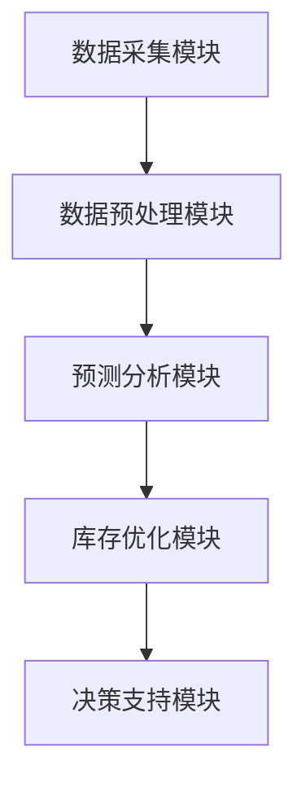

                 

# AI驱动的电商智能库存管理系统

> **关键词**：人工智能、电商、库存管理、机器学习、深度学习、优化算法

> **摘要**：随着电商行业的迅猛发展，库存管理成为影响电商企业运营效率的关键因素。本文介绍了AI驱动的电商智能库存管理系统，探讨了其核心概念、技术基础、实现方法以及实际应用案例，并对其未来发展进行了展望。通过本文，读者可以全面了解AI技术在电商库存管理中的潜力与应用。

## 第一部分：AI驱动的电商智能库存管理系统概述

### 第1章：AI驱动的电商智能库存管理系统概述

#### 1.1. AI在电商领域的应用背景

##### 1.1.1. 电商行业的发展与挑战

近年来，随着互联网技术的飞速发展，电商行业经历了爆发式的增长。据统计，全球电商市场规模已经超过数万亿美元，成为传统零售业的有力竞争对手。然而，电商行业也面临着一系列挑战，其中之一便是库存管理。

电商库存管理涉及商品采购、存储、配送等多个环节，这些环节的效率和准确性对电商企业的运营至关重要。传统的库存管理方法往往依赖于人工经验和简单的统计分析，存在以下问题：

- 库存量不足：可能导致订单无法及时完成，影响客户满意度。
- 库存量过剩：可能导致库存积压，占用资金和仓储空间，增加企业成本。

为了应对这些挑战，电商企业需要一种更加智能、高效的库存管理方法，从而提高运营效率，降低成本。

##### 1.1.2. AI技术为电商带来的变革

人工智能（AI）技术的发展为电商行业带来了前所未有的机遇。AI技术，特别是机器学习、深度学习和优化算法，可以在以下几个方面为电商库存管理带来变革：

- 数据分析：AI技术可以对海量数据进行分析，挖掘出有价值的信息，帮助电商企业优化库存策略。
- 预测分析：基于历史数据，AI技术可以预测未来的需求趋势，从而指导电商企业合理调整库存水平。
- 自动化：AI技术可以实现库存管理的自动化，减少人工干预，提高管理效率。

##### 1.1.3. 智能库存管理系统的核心作用

智能库存管理系统是电商企业实现高效库存管理的关键工具。它通过引入AI技术，实现对库存数据的全面分析和智能预测，从而帮助企业：

- 减少库存积压：通过预测需求，避免过度采购和库存积压。
- 提高订单交付速度：通过优化库存分布和配送策略，提高订单交付速度。
- 降低运营成本：通过自动化和精细化管理，降低库存管理的成本。

#### 1.2. 智能库存管理系统核心概念

##### 1.2.1. 库存管理的定义与重要性

库存管理是指对商品存储、配送、销售和回收等环节进行规划、控制和优化的过程。在电商企业中，库存管理是确保商品能够及时交付给客户的关键环节，具有以下重要性：

- 确保订单交付：良好的库存管理可以确保商品在客户下单后能够及时配送到客户手中，提高客户满意度。
- 优化库存水平：通过合理的库存管理，可以减少库存积压，降低库存成本，提高资金利用率。
- 支持供应链协同：库存管理是供应链管理的重要组成部分，良好的库存管理可以促进供应链各方协同工作，提高整个供应链的效率。

##### 1.2.2. 智能库存管理系统的组成

智能库存管理系统通常由以下几个核心模块组成：

- 数据采集与处理：收集与库存相关的数据，并进行清洗、转换和整合。
- 预测分析：基于历史数据和算法模型，预测未来的需求趋势。
- 库存优化：根据预测结果，优化库存水平和库存分布。
- 决策支持：为库存管理人员提供决策建议，支持库存管理决策。

##### 1.2.3. 智能库存管理系统与传统库存管理的区别

传统库存管理主要依赖于人工经验和简单的统计分析，而智能库存管理系统则引入了AI技术，具有以下区别：

- 数据驱动：智能库存管理系统通过收集和处理大量数据，实现数据驱动决策，而传统库存管理主要依靠经验判断。
- 预测能力：智能库存管理系统利用预测分析技术，提前预测未来的需求变化，而传统库存管理缺乏对需求变化的预测能力。
- 自动化：智能库存管理系统可以实现库存管理的自动化，减少人工干预，而传统库存管理主要依赖于人工操作。

#### 1.3. AI驱动的智能库存管理系统架构

##### 1.3.1. 系统架构概述

AI驱动的智能库存管理系统通常采用分布式架构，包括以下几个关键组成部分：

- 数据采集模块：负责收集与库存相关的数据，如采购订单、销售订单、库存水平等。
- 数据预处理模块：对采集到的数据进行清洗、转换和整合，为后续分析提供高质量的数据。
- 预测分析模块：利用机器学习算法和深度学习模型，对历史数据进行分析和预测，生成库存需求预测结果。
- 库存优化模块：根据预测结果，优化库存水平和库存分布，以实现库存的最优化管理。
- 决策支持模块：为库存管理人员提供决策建议，支持库存管理决策。

##### 1.3.2. 数据采集与预处理

数据采集与预处理是智能库存管理系统的基础。数据采集模块负责从不同的数据源收集与库存相关的数据，如ERP系统、销售系统、物流系统等。数据预处理模块则对采集到的数据进行清洗、转换和整合，以确保数据的准确性和一致性。

数据清洗包括以下步骤：

- 去除重复数据：避免重复数据对分析结果的影响。
- 数据转换：将不同数据源的数据格式统一，如将销售订单的文本数据转换为结构化数据。
- 数据归一化：将不同单位的数据进行归一化处理，以便于后续分析。

##### 1.3.3. 模型训练与优化

模型训练与优化是智能库存管理系统的核心。预测分析模块利用机器学习算法和深度学习模型，对历史数据进行分析和预测。常用的机器学习算法包括线性回归、决策树、随机森林、支持向量机等；深度学习模型包括卷积神经网络（CNN）、循环神经网络（RNN）、长短期记忆网络（LSTM）等。

模型训练的过程包括以下步骤：

- 数据集划分：将历史数据划分为训练集、验证集和测试集，用于训练、验证和测试模型。
- 模型选择：选择合适的机器学习算法或深度学习模型，进行训练。
- 模型优化：通过调整模型参数，如学习率、批量大小等，优化模型性能。

##### 1.3.4. 预测与决策支持

预测与决策支持是智能库存管理系统的关键功能。根据预测结果，库存优化模块可以自动调整库存水平和库存分布，以满足未来需求。决策支持模块则为库存管理人员提供决策建议，帮助他们制定更加科学的库存管理策略。

预测与决策支持的过程包括以下步骤：

- 预测结果生成：利用训练好的模型，对未来的库存需求进行预测。
- 库存优化：根据预测结果，调整库存水平和库存分布，以实现库存的最优化管理。
- 决策建议：为库存管理人员提供决策建议，如采购建议、补货建议等。

#### 1.4. AI驱动的智能库存管理系统发展现状与趋势

##### 1.4.1. 国内外发展现状对比

AI驱动的智能库存管理系统在国内外电商企业中得到了广泛应用。国内电商巨头如阿里巴巴、京东等已经成功应用了智能库存管理系统，取得了显著的运营效益。国外电商巨头如亚马逊、eBay等也积极推进智能库存管理系统的研究与应用。

在技术方面，国内外企业在AI技术的应用上存在一定的差距。国内企业更注重机器学习和深度学习算法的研究与应用，而国外企业则更注重优化算法和自动化技术的研发。

##### 1.4.2. 技术挑战与发展方向

尽管AI驱动的智能库存管理系统取得了显著成果，但仍然面临一些技术挑战：

- 数据质量：数据质量对预测结果的影响至关重要。如何保证数据的质量和准确性，是智能库存管理系统发展的重要问题。
- 模型泛化能力：如何提高模型的泛化能力，使其在不同场景下都能保持良好的性能，是智能库存管理系统发展的重要方向。
- 实时性：智能库存管理系统需要具备实时预测和决策能力，以应对电商行业快速变化的需求。

未来，AI驱动的智能库存管理系统将朝着以下方向发展：

- 数据挖掘与智能分析：通过大数据技术和智能分析方法，挖掘出更多有价值的信息，指导库存管理决策。
- 自动化与智能化：推动库存管理的自动化和智能化，减少人工干预，提高管理效率。
- 生态协同：推动电商企业内部以及与其他企业之间的协同，实现库存管理的生态化发展。

##### 1.4.3. 行业应用案例分享

以下是一些AI驱动的智能库存管理系统在电商行业的应用案例：

- 阿里巴巴：阿里巴巴利用智能库存管理系统，实现了库存管理的自动化和智能化，显著提高了订单交付速度和客户满意度。
- 京东：京东通过智能库存管理系统，实现了库存水平的精准预测和优化，降低了库存成本，提高了资金利用率。
- 亚马逊：亚马逊利用智能库存管理系统，实现了全球范围内的库存优化和配送策略优化，提高了物流效率和客户体验。

## 第二部分：AI驱动的电商智能库存管理技术基础

### 第2章：AI驱动的电商智能库存管理技术基础

#### 2.1. 数据分析技术在智能库存管理系统中的应用

数据分析技术是AI驱动的电商智能库存管理系统的核心基础。通过数据分析，可以从海量数据中提取有价值的信息，为库存管理提供科学依据。以下将介绍数据分析技术在智能库存管理系统中的应用：

##### 2.1.1. 数据采集与存储

数据采集是数据分析的第一步。在智能库存管理系统中，需要从多个数据源采集与库存相关的数据，如销售订单、采购订单、库存记录、物流信息等。这些数据可以存储在关系型数据库、NoSQL数据库或分布式存储系统中。

数据采集的关键技术包括：

- 数据接入：通过API、日志收集、网络爬虫等方式，将数据从不同的数据源接入到系统中。
- 数据清洗：对采集到的数据进行清洗、去重、去噪声等处理，确保数据的准确性和一致性。

##### 2.1.2. 数据清洗与预处理

数据清洗与预处理是数据分析的重要环节。通过数据清洗与预处理，可以消除数据中的噪声和异常，提高数据质量，为后续分析提供可靠的数据基础。

数据清洗与预处理的步骤包括：

- 数据清洗：去除重复数据、缺失数据、异常数据等，保证数据的一致性和准确性。
- 数据转换：将不同数据源的数据格式进行转换，确保数据能够统一处理。
- 数据归一化：将不同单位的数据进行归一化处理，便于数据分析和比较。

##### 2.1.3. 数据分析技术简介

数据分析技术包括统计分析和数据挖掘两大类。在智能库存管理系统中，数据分析技术用于挖掘数据中的潜在信息和规律，为库存管理提供决策支持。

- 统计分析：通过描述性统计、相关性分析、回归分析等方法，对数据进行统计分析，发现数据之间的规律和关系。
- 数据挖掘：通过机器学习、深度学习等技术，对大量数据进行挖掘，发现数据中的隐藏模式和信息。

常见的数据挖掘方法包括：

- 朴素贝叶斯分类器：用于分类问题，通过计算先验概率和条件概率，预测新数据的类别。
- 决策树：用于分类和回归问题，通过划分特征空间，构建决策树模型，实现数据的分类和预测。
- 支持向量机：用于分类问题，通过找到一个最佳的超平面，将不同类别的数据分隔开来。
- 集成学习方法：通过组合多个基本模型，提高模型的预测性能和泛化能力。

#### 2.2. 机器学习与深度学习算法原理

机器学习与深度学习是智能库存管理系统中的核心技术。通过机器学习与深度学习算法，可以从历史数据中学习规律，预测未来的需求趋势，为库存管理提供决策支持。

##### 2.2.1. 机器学习基础

机器学习是一种人工智能技术，通过从数据中学习规律，实现预测和分类。在智能库存管理系统中，机器学习算法用于预测未来的库存需求、优化库存水平等。

- 有监督学习：在有监督学习中，输入数据和输出数据都是已知的，通过学习输入和输出之间的关系，预测新的输入数据对应的输出。
- 无监督学习：在无监督学习中，输入数据没有对应的输出数据，通过学习数据中的潜在结构和规律，实现聚类、降维等任务。

常见的机器学习算法包括：

- 线性回归：用于回归问题，通过建立线性模型，预测新数据的连续值。
- 逻辑回归：用于分类问题，通过建立逻辑回归模型，预测新数据的类别。
- 决策树：用于分类和回归问题，通过划分特征空间，构建决策树模型，实现数据的分类和预测。
- 随机森林：通过组合多个决策树模型，提高模型的预测性能和泛化能力。

##### 2.2.2. 深度学习算法原理

深度学习是机器学习的一个分支，通过多层神经网络，对大量数据进行学习，实现复杂的非线性映射。在智能库存管理系统中，深度学习算法可以用于预测未来的库存需求、优化库存水平等。

- 神经网络：神经网络是由多个神经元组成的计算模型，通过学习输入和输出之间的关系，实现预测和分类。
- 卷积神经网络（CNN）：通过卷积层、池化层等结构，对图像等数据进行处理，实现图像分类、目标检测等任务。
- 循环神经网络（RNN）：通过循环结构，处理序列数据，实现语音识别、自然语言处理等任务。
- 长短期记忆网络（LSTM）：通过记忆单元，对长序列数据进行建模，解决RNN的梯度消失和梯度爆炸问题。

##### 2.2.3. 机器学习与深度学习在库存管理中的应用

机器学习与深度学习算法在库存管理中具有广泛的应用：

- 需求预测：通过机器学习与深度学习算法，对历史销售数据进行分析，预测未来的库存需求，为采购和库存管理提供依据。
- 库存优化：通过优化算法，根据需求预测结果，优化库存水平和库存分布，降低库存成本，提高资金利用率。
- 库存分配：通过机器学习与深度学习算法，对仓库库存进行分配，实现库存的最优配置，提高仓库利用率。

#### 2.3. 优化算法在智能库存管理中的应用

优化算法是智能库存管理系统中重要的组成部分。通过优化算法，可以找到最优的库存策略，实现库存的最优化管理。

##### 2.3.1. 线性规划算法

线性规划是一种数学优化方法，通过建立线性目标函数和线性约束条件，求解最优解。在智能库存管理系统中，线性规划算法可以用于优化库存水平和库存分布。

线性规划的基本步骤如下：

- 建立线性目标函数：定义需要优化的目标，如最小化库存成本或最大化订单交付速度。
- 建立线性约束条件：定义库存管理中需要满足的限制条件，如库存容量限制、采购限制、配送限制等。
- 求解线性规划问题：利用线性规划求解算法，求解最优解。

常见的线性规划求解算法包括单纯形法、内点法等。

##### 2.3.2. 非线性规划算法

非线性规划是线性规划的扩展，通过建立非线性目标函数和线性或非线性约束条件，求解最优解。在智能库存管理系统中，非线性规划算法可以用于更复杂的库存优化问题。

非线性规划的基本步骤如下：

- 建立非线性目标函数：定义需要优化的目标，如最小化库存成本或最大化订单交付速度。
- 建立非线性约束条件：定义库存管理中需要满足的限制条件，如库存容量限制、采购限制、配送限制等。
- 求解非线性规划问题：利用非线性规划求解算法，求解最优解。

常见的非线性规划求解算法包括梯度下降法、牛顿法、拟牛顿法等。

##### 2.3.3. 优化算法在库存优化中的实际应用

优化算法在智能库存管理中具有广泛的应用：

- 库存水平优化：通过优化算法，确定最优的库存水平，实现库存成本和订单交付速度的最优化。
- 库存分布优化：通过优化算法，确定最优的库存分布策略，实现仓库利用率和配送效率的最优化。
- 库存周期优化：通过优化算法，确定最优的库存周期，实现库存周转率和资金利用率的最优化。

#### 2.4. 自然语言处理技术简介

自然语言处理（NLP）是人工智能的一个重要分支，旨在使计算机能够理解、生成和处理人类语言。在智能库存管理系统中，NLP技术可以用于处理文本数据，提取有价值的信息，为库存管理提供决策支持。

##### 2.4.1. 自然语言处理基础

自然语言处理主要包括以下几个核心任务：

- 文本分类：将文本数据分类到预定义的类别中，如商品类别、用户评论等。
- 命名实体识别：识别文本中的特定实体，如人名、地名、组织名等。
- 语义分析：理解文本中的语义关系，如词义消歧、语义角色标注等。

常见的NLP工具和技术包括：

- 词袋模型：将文本表示为词的集合，用于文本分类和文本相似度计算。
- 递归神经网络（RNN）：通过递归结构，处理序列数据，实现文本分类和序列标注。
- 卷积神经网络（CNN）：通过卷积操作，提取文本中的特征，实现文本分类和语义分析。
- 长短期记忆网络（LSTM）：通过记忆单元，对长序列数据进行建模，实现文本分类和序列标注。

##### 2.4.2. 语言模型

语言模型是NLP中的核心组件，用于对文本进行建模，预测下一个单词或字符。在智能库存管理系统中，语言模型可以用于处理商品描述、用户评论等文本数据。

- n-gram模型：基于词的n元组统计模型，通过统计词的历史出现频率，预测下一个单词。
- 递归神经网络（RNN）：通过递归结构，对文本序列进行建模，预测下一个单词或字符。
- 长短期记忆网络（LSTM）：通过记忆单元，对长序列文本进行建模，实现更准确的预测。

##### 2.4.3. 命名实体识别

命名实体识别是NLP中的重要任务，用于识别文本中的特定实体，如人名、地名、组织名等。在智能库存管理系统中，命名实体识别可以用于提取商品信息、用户信息等，为库存管理提供数据支持。

- 基于规则的方法：通过定义一系列规则，识别文本中的命名实体。
- 基于统计的方法：通过统计模型，如条件随机场（CRF），识别文本中的命名实体。
- 基于深度学习的方法：通过深度学习模型，如卷积神经网络（CNN）和递归神经网络（RNN），识别文本中的命名实体。

## 第三部分：AI驱动的电商智能库存管理系统实现

### 第3章：智能库存管理系统的设计与实现

#### 3.1. 系统需求分析

系统需求分析是智能库存管理系统设计与实现的第一步，通过分析系统的功能需求和非功能需求，明确系统的总体架构和关键技术。

##### 3.1.1. 功能需求分析

智能库存管理系统的主要功能需求包括：

- 数据采集：从不同的数据源采集与库存相关的数据，如销售订单、采购订单、库存记录等。
- 数据预处理：对采集到的数据进行分析、清洗和转换，为后续分析提供高质量的数据。
- 预测分析：利用机器学习算法和深度学习模型，对历史数据进行分析和预测，生成库存需求预测结果。
- 库存优化：根据预测结果，优化库存水平和库存分布，以实现库存的最优化管理。
- 决策支持：为库存管理人员提供决策建议，如采购建议、补货建议等。

##### 3.1.2. 非功能需求分析

智能库存管理系统的非功能需求包括：

- 可扩展性：系统应具有良好的可扩展性，能够支持海量数据和高并发处理。
- 可靠性：系统应具备较高的可靠性，确保数据的安全性和系统的稳定性。
- 可维护性：系统应具有良好的可维护性，便于后期维护和升级。
- 易用性：系统应提供友好的用户界面和易用的操作流程，降低用户的学习成本。

##### 3.1.3. 系统总体架构设计

智能库存管理系统采用分布式架构，主要包括以下模块：

- 数据采集模块：负责从不同的数据源采集与库存相关的数据。
- 数据预处理模块：负责对采集到的数据进行分析、清洗和转换。
- 预测分析模块：负责利用机器学习算法和深度学习模型进行预测分析。
- 库存优化模块：负责根据预测结果，优化库存水平和库存分布。
- 决策支持模块：负责为库存管理人员提供决策建议。

系统总体架构设计如图3.1所示。

#### 3.2. 数据库设计与实现

数据库设计是智能库存管理系统实现的重要环节，通过合理设计数据库结构，可以确保数据的高效存储和快速访问。

##### 3.2.1. 数据库设计原则

数据库设计应遵循以下原则：

- 实用性：数据库应满足系统需求，支持数据采集、预

