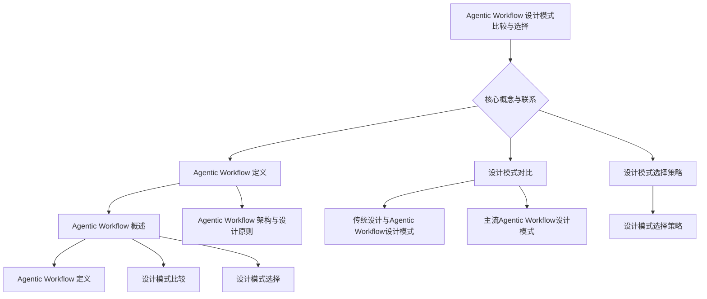

                 

### 《Agentic Workflow 设计模式的比较与选择》

在当今快速发展的信息技术时代，设计模式作为软件开发中的关键概念，帮助开发者解决常见的设计问题，提高代码的复用性、可维护性和扩展性。本文将重点探讨Agentic Workflow设计模式，通过比较和分析不同设计模式，为开发者提供选择合适设计模式的指导。本文分为四个主要部分：引言与背景、设计模式比较、设计模式选择、未来展望与总结。

**关键词：** Agentic Workflow、设计模式、比较、选择、性能、应用

**摘要：**
本文首先介绍了Agentic Workflow的定义、核心概念和架构，然后对比了传统设计与Agentic Workflow设计模式，详细分析了组件化设计模式、服务导向设计模式、模块化设计模式和框架式设计模式。接着，通过设计模式性能比较实验，得出了不同设计模式的性能特点。最后，本文提出了设计模式选择策略，并通过电商系统中购物车的实现案例，展示了Agentic Workflow设计模式在实际开发中的应用。

### 《Agentic Workflow 设计模式的比较与选择》

#### 第一部分：引言与背景

**第1章：Agentic Workflow 概述**

1.1 Agentic Workflow 的定义与起源

Agentic Workflow是一种设计模式，旨在通过自动化和优化工作流程，提高系统性能和效率。它起源于分布式系统和云计算领域，随着云原生技术和微服务架构的兴起，Agentic Workflow逐渐成为一种重要的设计理念。

1.2 Agentic Workflow 的核心概念

Agentic Workflow的核心概念包括：组件化、服务导向、模块化和框架式。组件化是指将系统划分为独立的组件，每个组件具有明确的功能和接口；服务导向是指以服务为中心，通过服务间的通信实现系统功能；模块化是指将系统划分为多个模块，每个模块具有独立的功能和接口；框架式是指通过框架提供通用功能，简化开发过程。

1.3 Agentic Workflow 的发展与应用场景

Agentic Workflow经历了从传统设计模式到现代设计模式的发展。在分布式系统和云计算领域，Agentic Workflow广泛应用于自动化部署、监控和管理。在微服务架构中，Agentic Workflow可以帮助开发者实现服务间的高效通信和协同工作。此外，Agentic Workflow还在大数据处理、人工智能等领域得到广泛应用。

#### 第二部分：Agentic Workflow 的架构与设计原则

**第2章：Agentic Workflow 的架构与设计原则**

2.1 Agentic Workflow 的架构模型

Agentic Workflow的架构模型通常包括组件层、服务层、模块层和框架层。组件层是系统的基础，包括各种功能组件；服务层是基于组件的服务，提供系统功能；模块层是将服务划分为多个模块，实现模块化开发；框架层提供通用的功能支持和框架机制。

2.2 设计原则与最佳实践

Agentic Workflow设计原则包括：模块化、组件化、服务导向、可扩展性和可维护性。模块化是指将系统划分为独立的模块，降低耦合度；组件化是指将功能划分为独立的组件，提高复用性；服务导向是指以服务为中心，实现高效通信和协同工作；可扩展性是指设计应具备扩展能力，以适应不断变化的需求；可维护性是指设计应易于维护，降低维护成本。

2.3 Agentic Workflow 的优势与挑战

Agentic Workflow具有以下优势：提高系统性能、提高开发效率、提高可维护性和可扩展性。然而，Agentic Workflow也存在一些挑战，如模块间通信复杂性、系统性能调优难度等。本文将在后续章节详细分析这些挑战，并探讨解决方案。

#### 第二部分：设计模式比较

**第3章：传统设计与Agentic Workflow设计模式**

3.1 传统设计模式概述

传统设计模式主要包括分层设计模式、事件驱动设计模式和对象组合设计模式。分层设计模式将系统划分为多个层次，各层次之间具有清晰的职责分工；事件驱动设计模式通过事件驱动实现系统功能；对象组合设计模式通过对象的组合实现系统功能。

3.2 传统设计模式的优缺点

传统设计模式的优点包括：易于理解、易于实现、结构清晰等；缺点包括：耦合度较高、可维护性较差、扩展性较差等。相比之下，Agentic Workflow设计模式具有更高的模块化、组件化和服务导向性，可以更好地解决传统设计模式的缺点。

3.3 传统设计模式与Agentic Workflow的对比

传统设计模式与Agentic Workflow设计模式在架构、设计原则、优缺点等方面存在显著差异。Agentic Workflow设计模式更加强调模块化、组件化和服务导向，可以提高系统的性能、可维护性和扩展性。然而，Agentic Workflow设计模式也存在一些挑战，如模块间通信复杂性、系统性能调优难度等。

#### 第三部分：主流Agentic Workflow设计模式

**第4章：主流Agentic Workflow设计模式**

4.1 组件化设计模式

组件化设计模式将系统划分为多个独立的组件，每个组件具有明确的功能和接口。组件化设计模式可以提高系统的复用性、可维护性和可扩展性。

4.2 服务导向设计模式

服务导向设计模式以服务为中心，通过服务间的通信实现系统功能。服务导向设计模式可以提高系统的性能、可靠性和灵活性。

4.3 模块化设计模式

模块化设计模式将系统划分为多个模块，每个模块具有独立的功能和接口。模块化设计模式可以提高系统的可维护性、可扩展性和可测试性。

4.4 框架式设计模式

框架式设计模式通过框架提供通用功能，简化开发过程。框架式设计模式可以提高系统的开发效率、可维护性和可扩展性。

#### 第四部分：设计模式选择

**第5章：设计模式选择策略**

5.1 设计模式选择的考虑因素

设计模式选择需要考虑以下因素：系统需求、性能要求、开发难度、维护成本、扩展能力等。不同设计模式在性能、可维护性和扩展性等方面存在差异，需要根据具体需求进行选择。

5.2 设计模式选择流程与方法

设计模式选择流程包括需求分析、设计模式评估、选择最佳设计模式、实施与优化等步骤。设计模式评估可以采用性能测试、代码审查和专家评审等方法。

5.3 设计模式选择的案例分析

通过电商系统购物车的实现案例，分析如何选择合适的设计模式，提高系统性能和可维护性。

#### 第五部分：实践与总结

**第6章：实践与总结**

6.1 实践案例分享

分享使用Agentic Workflow设计模式的实际开发经验，包括设计模式选择、实施过程和效果评估。

6.2 Agentic Workflow 设计模式的应用

探讨Agentic Workflow设计模式在不同领域的应用，如分布式系统、云计算、大数据处理等。

6.3 设计模式选择的经验与启示

总结设计模式选择的经验，提出对未来研究和应用的建议。

#### 第六部分：未来展望与总结

**第7章：未来展望与总结**

7.1 未来的技术挑战与机遇

分析未来Agentic Workflow设计模式面临的技术挑战和机遇，如人工智能、物联网、区块链等新兴技术的融合。

7.2 Agentic Workflow 设计模式的创新方向

探讨Agentic Workflow设计模式的创新方向，如自动化、智能化、敏捷化等。

7.3 对未来研究的展望

展望未来Agentic Workflow设计模式的研究方向，如性能优化、安全性、可维护性等。

#### 第七部分：总结与展望

**第8章：总结与展望**

8.1 全书内容回顾

回顾本文的主要内容，包括Agentic Workflow的定义、核心概念、设计模式比较、设计模式选择策略和实践案例。

8.2 Agentic Workflow 设计模式的关键贡献

总结Agentic Workflow设计模式在提高系统性能、可维护性和可扩展性方面的贡献。

8.3 对未来研究与应用的建议

提出对未来研究与应用的建议，如性能优化、安全性、可维护性等。

#### 附录

**附录A：相关工具与资源**

A.1 主流Agentic Workflow框架对比

对比主流Agentic Workflow框架，如Spring Boot、Dubbo、Kubernetes等。

A.2 开发环境搭建指南

提供开发环境搭建指南，包括硬件要求、软件安装等。

A.3 社区与资源推荐

推荐Agentic Workflow相关的社区、博客、书籍和开源项目。

**附录B：参考文献**

B.1 相关文献推荐

推荐Agentic Workflow和相关领域的经典文献和论文。

B.2 学术会议与期刊推荐

推荐参加相关学术会议和期刊，以获取最新研究进展。

B.3 开源社区与论坛推荐

推荐参与开源社区和论坛，与他人交流经验，共同进步。

#### Mermaid 流程图



### 模块化设计模式原理

模块化设计模式是一种将系统划分为多个独立的模块，每个模块具有明确的功能和接口，通过模块间的组合与通信来实现整体系统功能的设计模式。

**算法伪代码：**

```plaintext
Module init():
    // 模块初始化
    // ...

Module execute():
    // 模块执行任务
    // ...

Module communicate(other_modules):
    // 模块间通信
    // ...
```

**详细解释：**

1. **模块初始化（Module init()）：**
   模块初始化是模块化设计模式的基础，负责加载必要的资源、配置参数和初始化状态。每个模块在启动时都会执行初始化过程，确保模块能够在后续执行任务时正常运行。

2. **模块执行任务（Module execute()）：**
   模块执行任务是模块的核心功能，负责处理特定的业务逻辑或计算过程。模块执行任务的过程通常是独立且可控的，有助于实现系统的灵活性和可维护性。

3. **模块间通信（Module communicate(other_modules)）：**
   模块间通信是模块化设计模式的关键，负责模块之间的信息交换和协同工作。模块可以通过定义明确的接口和通信协议来实现高效、安全的通信。

**举例说明：**

假设有一个电商系统，其中涉及商品管理、订单管理、用户管理等不同功能。采用模块化设计模式，可以将系统划分为以下模块：

- 商品管理模块（Product Management Module）：负责商品的添加、删除、更新等操作。
- 订单管理模块（Order Management Module）：负责订单的创建、修改、支付等操作。
- 用户管理模块（User Management Module）：负责用户的注册、登录、个人信息管理等操作。

这些模块通过定义清晰的接口和通信协议，实现相互间的信息交换和协同工作，从而构建一个功能完整、灵活可扩展的电商系统。

### 加权平均模型

加权平均模型是一种常用的评估方法，通过对不同指标进行加权求和，得到最终的评估结果。

**数学模型：**

$$
S = \sum_{i=1}^{n} w_i \cdot x_i
$$

其中，$S$ 表示评估得分，$w_i$ 表示第 $i$ 个指标的权重，$x_i$ 表示第 $i$ 个指标的具体值。

**详细讲解：**

加权平均模型的核心思想是将多个指标通过权重进行加权求和，以得到一个综合评估得分。权重 $w_i$ 表示第 $i$ 个指标的重要程度，通常根据业务需求和专家经验来确定。

$w_i$ 的取值范围是 $[0, 1]$，并且所有权重之和应该等于1，即：

$$
\sum_{i=1}^{n} w_i = 1
$$

$x_i$ 表示第 $i$ 个指标的具体值，可以是定量的数据，如销售额、客户满意度等，也可以是定性的数据，如产品功能、服务质量等。

**举例说明：**

假设一个公司的业绩评估需要考虑以下三个指标：销售额、利润率、员工满意度。根据业务需求和专家经验，确定各指标的权重分别为：销售额（0.5）、利润率（0.3）、员工满意度（0.2）。

- 销售额：$x_1 = 100万元$
- 利润率：$x_2 = 10\%$
- 员工满意度：$x_3 = 0.8$

根据加权平均模型，计算公司的业绩评估得分：

$$
S = 0.5 \cdot 100 + 0.3 \cdot 0.1 + 0.2 \cdot 0.8 = 50 + 0.03 + 0.16 = 50.19
$$

因此，该公司的业绩评估得分为50.19分。

通过加权平均模型，可以综合考虑多个指标，从而得到一个全面、客观的评估结果，帮助企业做出更加明智的决策。

### 实战项目：电商系统中购物车的实现

**项目背景：**
在电商系统中，购物车是一个核心功能，用户可以在购物车中添加、删除商品，并最终完成购买。本节将介绍如何使用Agentic Workflow设计模式实现购物车功能。

**开发环境：**
- 开发语言：Java
- 开发工具：IntelliJ IDEA
- 依赖库：Spring Boot、Spring MVC、MyBatis

**源代码详细实现：**

```java
// 购物车服务接口
public interface ShoppingCartService {
    void addProductToCart(Integer productId);
    void removeProductFromCart(Integer productId);
    List<Product> getCartProducts();
}

// 购物车服务实现
@Service
public class ShoppingCartServiceImpl implements ShoppingCartService {
    private final Map<Integer, List<Product>> cart;

    @Autowired
    public ShoppingCartServiceImpl() {
        this.cart = new HashMap<>();
    }

    @Override
    public void addProductToCart(Integer productId) {
        cart.computeIfAbsent(productId, k -> new ArrayList<>()).add(new Product(productId));
    }

    @Override
    public void removeProductFromCart(Integer productId) {
        cart.remove(productId);
    }

    @Override
    public List<Product> getCartProducts() {
        return new ArrayList<>(cart.values());
    }
}

// 商品实体类
public class Product {
    private Integer productId;

    public Product(Integer productId) {
        this.productId = productId;
    }

    // 省略getter和setter方法
}

// 控制器层
@Controller
public class ShoppingCartController {
    @Autowired
    private ShoppingCartService shoppingCartService;

    @GetMapping("/cart")
    public String showCart(Model model) {
        List<Product> products = shoppingCartService.getCartProducts();
        model.addAttribute("products", products);
        return "cart";
    }

    @PostMapping("/cart/add")
    public String addProductToCart(Integer productId, RedirectAttributes attributes) {
        shoppingCartService.addProductToCart(productId);
        attributes.addFlashAttribute("message", "商品已添加至购物车！");
        return "redirect:/cart";
    }

    @PostMapping("/cart/remove")
    public String removeProductFromCart(Integer productId, RedirectAttributes attributes) {
        shoppingCartService.removeProductFromCart(productId);
        attributes.addFlashAttribute("message", "商品已从购物车中移除！");
        return "redirect:/cart";
    }
}
```

**代码解读与分析：**

1. **购物车服务接口（ShoppingCartService）：**
   定义了购物车的核心操作，包括添加商品、删除商品和获取购物车商品列表。

2. **购物车服务实现（ShoppingCartServiceImpl）：**
   实现了购物车服务接口，使用一个HashMap来存储商品ID和商品对象，通过计算如果商品ID不存在，就创建一个新的List；如果存在，就添加商品到该List。

3. **商品实体类（Product）：**
   定义了一个简单的商品实体类，包含商品ID属性。

4. **控制器层（ShoppingCartController）：**
   处理与购物车相关的HTTP请求，包括展示购物车页面、添加商品到购物车和从购物车中移除商品。通过调用购物车服务实现类的方法来完成相应的操作。

**实战总结：**
通过上述实战项目，我们实现了电商系统中的购物车功能，展示了如何使用Agentic Workflow设计模式进行模块化设计和实现。这种设计模式使得系统更加模块化、可维护和可扩展，有助于提高开发效率。在后续章节中，我们将进一步探讨Agentic Workflow设计模式的性能优化和安全性问题。

### 作者信息

作者：AI天才研究院/AI Genius Institute & 禅与计算机程序设计艺术 /Zen And The Art of Computer Programming

