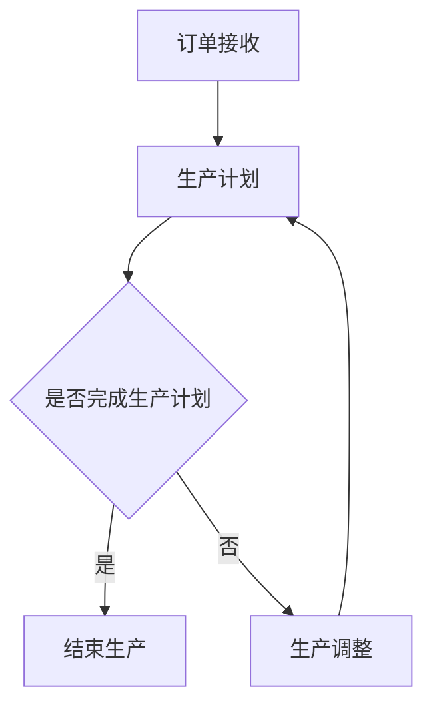
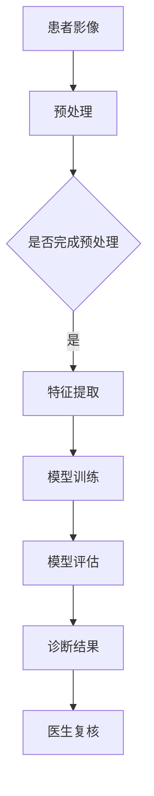
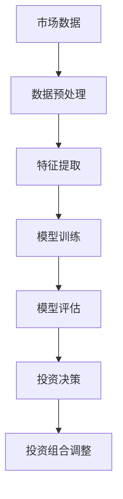

                 

## 第1章：引言与概述

### 1.1 Andrej Karpathy与计算自动化趋势

Andrej Karpathy是人工智能领域的杰出专家，他在深度学习和计算机视觉领域有着卓越的贡献。他在斯坦福大学获得了计算机科学博士学位，并曾在OpenAI工作，目前是谷歌AI的资深研究员。Andrej Karpathy以其深入浅出的技术文章和开源代码而闻名，尤其是因为他撰写的《The Unreasonable Effectiveness of Recurrent Neural Networks》一文，该文详尽阐述了循环神经网络在自然语言处理中的应用，引发了学术界和工业界对于深度学习的广泛关注。

本书将深入探讨Andrej Karpathy在计算与自动化趋势方面的见解，结合他在深度学习、自然语言处理、计算机视觉等领域的研究成果，分析计算与自动化的定义、发展历程、应用场景及未来趋势。通过本书，读者将了解：

1. **计算与自动化的基本概念**：计算是指通过算法和数据处理的抽象过程，而自动化则是指利用计算机技术和算法来执行任务和决策。二者关系紧密，计算为自动化提供了技术基础。

2. **深度学习与计算需求**：深度学习作为人工智能的重要分支，其发展极大地推动了计算能力的需求。本文将分析深度学习算法对计算资源的要求，以及硬件趋势对深度学习的影响。

3. **自动化技术的应用与影响**：自动化技术已经渗透到各个行业，包括制造业、医疗、金融等，其对工作未来的影响不容忽视。本文将探讨自动化技术的应用领域及其挑战。

4. **AI与计算的未来**：本文将展望AI与计算的未来发展趋势，分析计算能力对未来AI发展的影响，以及AI与自动化技术的融合前景。

### 1.2 书籍目的与结构

本书旨在为读者提供一个关于计算与自动化趋势的全面视角，帮助读者理解这些技术的基本概念、发展历程、应用场景以及未来趋势。通过Andrej Karpathy的视角，读者将获得对计算与自动化的深刻认识。

全书分为七个章节，结构如下：

- **第1章：引言与概述**：介绍Andrej Karpathy的背景以及本书的目的和结构。
- **第2章：计算与自动化概述**：定义计算与自动化的基本概念，回顾其发展历程。
- **第3章：深度学习与计算趋势**：探讨深度学习的发展及其对计算资源的需求。
- **第4章：自动化趋势**：分析自动化技术的应用领域及其对工作未来的影响。
- **第5章：AI与计算的未来**：展望AI与计算的未来发展趋势。
- **第6章：案例分析**：通过具体案例展示计算与自动化技术的应用。
- **第7章：结论与展望**：总结计算与自动化趋势，提出未来展望。

### 1.3 读者对象

本书适合以下读者：

1. **计算机科学与人工智能专业的学生和研究人员**：希望通过深入学习计算与自动化的概念、技术和发展趋势。
2. **软件开发工程师和人工智能从业者**：希望了解深度学习和自动化技术在各个领域的应用，以及未来发展趋势。
3. **对计算与自动化感兴趣的广大读者**：希望通过本书了解这些技术的基本概念和应用。

通过阅读本书，读者将能够：

- **理解计算与自动化的基本概念**：掌握计算与自动化的定义、原理和应用。
- **了解深度学习与计算趋势**：了解深度学习算法对计算资源的需求，以及硬件趋势的影响。
- **探讨自动化技术的应用与挑战**：了解自动化技术在各个领域的应用及其对工作未来的影响。
- **展望AI与计算的未来**：了解AI与计算的未来发展趋势，以及可能面临的挑战。

在接下来的章节中，我们将逐步深入探讨这些主题，结合实际案例和前沿研究成果，为读者呈现一幅计算与自动化领域的全景图。

### 2.1 计算与自动化的定义

计算（Computation）是指通过算法和数据处理的抽象过程，目的是解决问题或执行特定任务。计算的核心在于算法的设计和实现，以及数据的有效组织和处理。计算可以追溯到计算机科学的起源，1940年代冯·诺依曼（John von Neumann）提出了现代计算机的基本架构，即存储程序计算机。这一架构使得计算机能够根据预定义的指令进行自动化计算，大大提升了计算效率。

自动化（Automation）则是指利用计算机技术和算法来执行任务和决策的过程。自动化旨在减少人类劳动，提高生产效率和准确性。自动化的概念起源于工业革命时期，随着机械化和电气化的发展，自动化技术逐步应用到制造业、交通、物流等领域。随着计算机技术和人工智能的进步，自动化技术得以进一步发展和深化，不仅限于传统的工业生产，还渗透到服务、医疗、金融等多个领域。

计算与自动化之间的关系可以视为相互促进和融合。计算为自动化提供了技术基础，使得复杂的任务可以通过算法和计算模型实现自动化。自动化则为计算提供了实践场景和应用平台，推动了计算技术的不断创新和优化。例如，深度学习作为计算的一个分支，其发展推动了计算机视觉、自然语言处理等领域的技术进步，这些技术又广泛应用于自动化系统，提升了自动化决策的准确性和效率。

### 2.2 计算技术的发展历程

计算技术的发展历程可以追溯到计算机科学的起源，经历了从机械计算到电子计算，再到现代计算的重大变革。以下是一些关键节点和重要事件：

- **古代计算工具**：早在公元前2000年左右，古埃及人使用算筹（一种计算工具）进行数学计算。算筹由小竹棍组成，通过排列和组合进行简单的四则运算。在接下来的几千年中，算盘（Abacus）成为广泛使用的计算工具，尤其是在东亚地区。

- **机械计算器**：17世纪，欧洲出现了机械计算器，如威尔士的威廉·希克（William Oughtred）发明的滑尺计算器，以及法国的布莱兹·帕斯卡（Blaise Pascal）发明的加法器。这些机械计算器通过物理机械运动实现简单的计算，为后来的电子计算奠定了基础。

- **电子计算机**：20世纪40年代，随着第二次世界大战的爆发，电子计算机的研究得到了迅速发展。1946年，冯·诺依曼设计并实现了ENIAC（Electronic Numerical Integrator and Computer），这是世界上第一台全电子计算机。ENIAC使用了大约18000个真空管，能够进行复杂的数值计算，但其体积庞大，能耗高。

- **存储程序计算机**：1949年，冯·诺依曼提出了存储程序计算机的概念，这一理念彻底改变了计算机的设计原理。存储程序计算机将指令和数据存储在同一内存中，使得计算机可以根据预定义的程序自动执行任务，大大提高了计算效率。

- **微处理器和微型计算机**：1960年代，随着集成电路技术的发展，微处理器诞生了。1971年，英特尔（Intel）推出了第一颗微处理器4004，它是一个4位处理器，但奠定了现代计算机硬件的基础。此后，微处理器技术迅速发展，处理能力显著提升。1981年，IBM推出了个人电脑（IBM PC），标志着微型计算机的普及。

- **网络计算机**：1990年代，随着互联网的兴起，计算机不再仅仅是一个独立的计算设备，而是成为一个网络节点。网络计算机的出现使得信息共享和远程计算成为可能，促进了全球计算技术的发展。

- **云计算和大数据**：21世纪初，云计算和大数据技术的兴起，使得计算不再局限于单台计算机，而是扩展到分布式计算和集群计算。云计算提供了弹性计算资源，用户可以根据需求动态调整计算能力。大数据技术则使得海量数据的存储、处理和分析成为可能，推动了人工智能和机器学习的发展。

- **量子计算**：量子计算是计算技术的前沿领域，利用量子力学原理进行计算。量子计算机具有比传统计算机更高的计算能力，能够在某些问题上实现指数级的加速。尽管目前量子计算还处于实验阶段，但已显示出巨大的潜力。

### 2.3 自动化技术的演进

自动化技术的演进历史可以追溯到工业革命时期，经历了从机械自动化到现代计算机自动化的发展过程。以下是自动化技术演进的关键阶段：

- **早期自动化**：18世纪末至19世纪初，第一次工业革命推动了机械自动化的发展。纺织机械、蒸汽机等机械设备的广泛应用，使得生产效率显著提高。这一时期的自动化主要是通过机械结构和机械控制实现，如纺织机械中的飞梭和旋转机，以及机械臂和传送带等。

- **电气自动化**：19世纪末至20世纪初，第二次工业革命带来了电气技术的发展。电气的引入使得自动化设备更加灵活和高效。电动机、电控系统等电气设备的应用，使得自动化生产线得以实现。电气自动化在制造业中得到了广泛应用，如福特汽车公司的流水线生产。

- **电子自动化**：20世纪中期，随着电子技术的发展，电子自动化逐渐取代了机械自动化。电子控制器、可编程逻辑控制器（PLC）等电子设备的应用，使得自动化系统具有更高的灵活性和可编程性。电子自动化在汽车制造、化工、食品加工等领域得到了广泛应用。

- **计算机自动化**：20世纪末至21世纪初，计算机技术的发展推动了自动化技术的进一步升级。计算机自动化利用计算机系统和软件来实现复杂的自动化任务。计算机控制系统能够通过传感器收集数据，实时调整设备运行状态，实现高度自动化的生产和管理。计算机自动化在汽车制造、航空制造、半导体制造等领域取得了显著成果。

- **智能自动化**：随着人工智能和机器学习技术的发展，智能自动化逐渐成为自动化技术的新趋势。智能自动化系统通过学习和适应环境，能够自主完成复杂任务。例如，机器人可以通过视觉识别和路径规划，实现自主移动和操作。智能自动化在仓储物流、医疗、服务业等领域展现出广阔的应用前景。

### 2.4 计算与自动化的关系

计算与自动化之间的关系紧密，二者相互促进，共同推动技术进步和社会发展。计算为自动化提供了技术基础，而自动化则为计算提供了实践平台和应用场景。

首先，计算技术为自动化提供了算法和计算模型的支持。自动化系统需要通过算法对输入数据进行分析和处理，以实现特定任务。计算技术，特别是人工智能和机器学习技术，提供了强大的算法工具，使得自动化系统能够更好地理解和应对复杂环境。例如，深度学习算法在计算机视觉和自然语言处理中的应用，使得自动化系统能够更准确地识别图像和语音，实现更加智能的交互和决策。

其次，自动化技术为计算提供了实践场景和应用需求。自动化技术的应用场景广泛，包括制造业、物流、医疗、金融等领域，这些场景为计算技术提供了丰富的数据和需求驱动。自动化系统在运行过程中产生的海量数据，为机器学习模型的训练和优化提供了宝贵的资源。同时，自动化技术对计算能力的要求也推动了计算技术的不断进步，例如深度学习算法的计算需求，推动了高性能计算和分布式计算技术的发展。

此外，计算与自动化的融合带来了新的技术突破和产业变革。智能自动化系统通过计算技术的支持，实现了高度自动化和智能化的生产和管理。例如，智能制造系统通过计算技术对生产流程进行优化，实现个性化定制和高效生产。智能交通系统通过计算技术对交通数据进行分析，实现交通流量优化和智能调度，提高了交通效率。

总的来说，计算与自动化之间的关系是相互依赖、相互促进的。计算技术为自动化提供了技术基础，自动化技术为计算提供了实践场景和应用需求。随着计算技术和自动化技术的不断发展，二者将共同推动技术进步和社会发展，为人类创造更加智能、高效、便捷的未来。

### 3.1 深度学习的原理与进步

深度学习（Deep Learning）是计算与自动化领域中的一个关键技术，它通过模仿人脑神经网络的结构和功能，实现对复杂数据的处理和模式识别。深度学习的原理可以追溯到人工神经网络（Artificial Neural Networks,ANNs）的发展。人工神经网络是由大量简单神经元组成的计算模型，每个神经元都可以接收输入信号并产生输出。通过调整神经元之间的权重，人工神经网络能够学习数据中的模式和规律。

深度学习的发展始于1980年代，随着计算能力的提升和大数据资源的积累，深度学习技术取得了突破性的进展。深度学习的核心在于多层神经网络（Deep Neural Networks,DNNs）的设计和应用。多层神经网络通过增加隐层数量和神经元数目，使得模型能够学习更复杂的特征和模式。

#### 深度学习的关键组成部分

1. **神经网络结构**：深度学习的神经网络结构由输入层、多个隐藏层和输出层组成。每个隐藏层负责提取和转换数据特征，输出层负责做出最终决策。神经网络中的每个神经元都与前一层和后一层的神经元相连，通过激活函数（如ReLU、Sigmoid、Tanh）进行非线性变换，实现特征提取和分类。

2. **激活函数**：激活函数用于引入非线性特性，使得神经网络能够学习复杂的关系。常见的激活函数包括ReLU（Rectified Linear Unit）、Sigmoid和Tanh等。ReLU函数因其计算效率高且不易陷入梯度消失问题，成为深度学习中最常用的激活函数。

3. **反向传播算法**：反向传播算法（Backpropagation Algorithm）是深度学习训练过程中的核心算法。它通过计算输出层与隐藏层之间的误差，反向传播误差到每一层，并更新各层的权重和偏置，以最小化损失函数。反向传播算法的引入，使得深度学习模型能够通过大量数据自动优化其参数。

4. **优化算法**：深度学习训练过程中常用的优化算法包括梯度下降（Gradient Descent）、随机梯度下降（Stochastic Gradient Descent,SGD）、Adam优化器等。优化算法的目标是通过迭代优化模型参数，使损失函数值最小化，从而提高模型的预测性能。

#### 深度学习的进步

深度学习在过去几十年中取得了显著的发展，以下是一些重要的进展：

1. **模型架构的创新**：卷积神经网络（Convolutional Neural Networks,CNNs）在图像处理领域取得了突破性进展。CNNs通过卷积层和池化层的组合，能够有效地提取图像中的空间特征。此后，ResNet、Inception、MobileNet等一系列架构创新，进一步提升了CNNs的性能和效率。

2. **生成对抗网络（Generative Adversarial Networks,GANs）的提出**：GANs是由Ian Goodfellow等人于2014年提出的，其核心思想是通过生成器和判别器的对抗训练，生成逼真的数据。GANs在图像生成、自然语言处理等领域展现出强大的潜力。

3. **Transformer架构的突破**：Transformer架构在自然语言处理领域取得了巨大成功。与传统的循环神经网络（Recurrent Neural Networks,RNNs）相比，Transformer通过自注意力机制（Self-Attention Mechanism）实现了全局信息建模，有效解决了长距离依赖问题。BERT、GPT-3等基于Transformer的模型在文本分类、机器翻译、问答系统等领域取得了显著的性能提升。

4. **深度学习在边缘计算中的应用**：随着物联网（Internet of Things,IoT）和边缘计算（Edge Computing）的发展，深度学习在边缘设备上的部署成为研究热点。为了适应资源受限的边缘环境，轻量级深度学习模型（如MobileNet、Tiny-YOLOv2）和量化技术（Quantization）得到了广泛应用。

5. **深度学习与其他技术的融合**：深度学习与强化学习、迁移学习、联邦学习等技术的融合，使得模型能够更好地应对复杂问题。例如，深度强化学习在游戏、自动驾驶等领域取得了显著进展。联邦学习通过分布式训练，保护用户隐私的同时，实现了模型的高效训练和部署。

#### 深度学习的应用场景

深度学习在多个领域取得了广泛应用：

1. **计算机视觉**：深度学习在图像分类、目标检测、图像生成等领域展现了强大的能力。例如，卷积神经网络在ImageNet图像分类挑战中取得了优异的成绩，推动了计算机视觉技术的快速发展。

2. **自然语言处理**：自然语言处理（Natural Language Processing,NLP）是深度学习的重要应用领域。Transformer架构在文本分类、机器翻译、问答系统等领域取得了突破性进展，使得机器理解人类语言的能力大幅提升。

3. **语音识别**：深度学习技术在语音识别（Automatic Speech Recognition,ASR）领域取得了显著进展。通过结合循环神经网络（RNN）和卷积神经网络（CNN），深度学习模型实现了高准确率的语音识别。

4. **医疗影像分析**：深度学习在医学影像分析领域得到了广泛应用，包括疾病诊断、图像分割、图像增强等。例如，深度学习模型能够在MRI图像中检测脑肿瘤，提高了诊断的准确性和效率。

5. **自动驾驶**：自动驾驶是深度学习在工业界的典型应用之一。通过结合深度学习与传感器数据，自动驾驶系统能够实现环境感知、路径规划、驾驶控制等功能，推动了智能交通技术的发展。

总的来说，深度学习作为计算与自动化领域的关键技术，通过不断的技术创新和应用扩展，极大地推动了计算技术的发展和自动化水平的提升。随着深度学习技术的进一步发展和应用，其在各个领域的应用前景将更加广阔。

### 3.2 计算需求与硬件趋势

深度学习的发展带来了巨大的计算需求，这对硬件设施提出了新的挑战。深度学习算法的复杂性和大规模训练需求，使得传统计算机硬件难以满足其需求，从而推动了硬件技术的发展和创新。

#### 计算需求

1. **计算密集型算法**：深度学习算法通常需要大量的浮点运算，尤其是卷积运算和矩阵乘法。这些运算要求硬件具备高效的计算能力，以满足大规模数据处理和模型训练的需求。

2. **大数据处理**：深度学习依赖于大规模数据的训练，这需要高效的存储和传输能力。数据的读取、存储和传输速度直接影响模型的训练时间和性能。

3. **并行处理能力**：深度学习算法可以通过并行处理来加速计算。例如，卷积神经网络（CNNs）可以通过并行卷积操作来提高计算效率。因此，硬件需要具备并行处理能力，以应对复杂的计算任务。

4. **低延迟和高带宽**：在实时应用场景中，如自动驾驶和实时语音识别，计算需求要求硬件具备低延迟和高带宽的特性。这要求硬件系统能够在高速率下稳定运行，同时减少数据传输延迟。

#### 硬件趋势

1. **专用硬件加速器**：为了满足深度学习的计算需求，专用硬件加速器（如GPU、TPU）得到了广泛应用。GPU（Graphics Processing Unit）最初设计用于图形渲染，但其强大的并行计算能力使其成为深度学习训练的重要工具。TPU（Tensor Processing Unit）是谷歌专门为深度学习任务设计的芯片，具有极高的计算效率。

2. **神经网络硬件架构**：随着深度学习的发展，新的硬件架构不断涌现，以适应深度学习任务的特殊需求。例如，Google的TPU采用了定制化的硬件设计，实现了高效的矩阵乘法运算。此外，NVIDIA的GPU也通过改进架构和优化算法，提高了深度学习任务的计算效率。

3. **分布式计算**：深度学习任务通常需要大量的计算资源，分布式计算成为解决这一问题的有效手段。通过将任务分配到多个计算节点上，分布式计算系统能够利用集群中的多台计算机共同完成计算任务，提高整体计算能力。近年来，分布式计算框架如TensorFlow和PyTorch等，使得分布式深度学习变得更加便捷和高效。

4. **边缘计算**：随着物联网（IoT）和智能设备的发展，边缘计算成为深度学习应用的新趋势。边缘设备如智能手机、嵌入式系统等，通过本地计算和模型推理，实现了实时数据处理和智能决策。边缘计算能够降低数据传输延迟，提高系统的响应速度，适用于实时性要求较高的应用场景。

5. **硬件优化与定制化**：为了满足不同深度学习任务的需求，硬件设计和优化变得越来越重要。例如，定制化的硬件设计可以针对特定任务进行优化，提高计算效率和能效。此外，硬件与软件的协同优化，通过优化算法和硬件接口，可以进一步提高系统的性能和效率。

#### 计算能力与深度学习模型性能的关系

计算能力对深度学习模型性能有着重要影响。首先，计算能力决定了模型训练的速度。更强的计算能力可以加速模型的训练过程，使得模型能够更快地收敛到最优解。其次，计算能力影响模型的泛化能力。在大规模数据集上训练的模型，通常具有更好的泛化能力，能够更好地应对新的数据和任务。此外，计算能力还影响模型的实时推理能力。在实时应用中，计算能力的提升可以降低模型推理的延迟，提高系统的响应速度。

总之，计算需求与硬件趋势是深度学习发展的关键驱动力。随着计算能力和硬件技术的不断提升，深度学习模型将能够处理更加复杂和大规模的数据，实现更高的性能和更广泛的应用。未来，硬件技术将继续创新，为深度学习的发展提供更加坚实的支持。

### 3.3 深度学习应用场景分析

深度学习作为一项先进的技术，已经广泛应用于多个领域，带来了巨大的社会和经济效益。以下是对深度学习在几个关键应用场景的详细分析：

#### 3.3.1 计算机视觉

计算机视觉是深度学习的重要应用领域之一。深度学习通过卷积神经网络（CNNs）等模型，实现了对图像和视频的自动识别、分类、分割和增强。以下是一些具体的应用场景：

1. **图像分类**：深度学习模型能够对图像进行分类，识别其中的物体和场景。例如，在ImageNet图像分类挑战中，卷积神经网络模型取得了显著的成绩，将图像分类准确率提升到前所未有的水平。

2. **目标检测**：目标检测技术能够识别图像中的多个物体，并标注它们的位置。深度学习模型如YOLO（You Only Look Once）和SSD（Single Shot MultiBox Detector）等，在目标检测任务中表现优异。

3. **图像分割**：图像分割技术将图像划分为多个区域，用于识别图像中的对象边界。深度学习模型如FCN（Fully Convolutional Network）和U-Net等，在医学影像分割、自动驾驶场景理解等领域发挥了重要作用。

4. **图像生成**：生成对抗网络（GANs）通过训练生成器和判别器，实现了高质量的图像生成。GANs在艺术创作、游戏设计、虚拟现实等领域展现出巨大潜力。

#### 3.3.2 自然语言处理

自然语言处理（NLP）是深度学习的另一个重要应用领域。深度学习模型通过编码器和解码器结构，实现了对自然语言的理解和生成。以下是一些具体的应用场景：

1. **文本分类**：深度学习模型能够对文本进行分类，识别其中的主题和情感。例如，新闻分类、垃圾邮件过滤、情感分析等，都是文本分类的应用场景。

2. **机器翻译**：深度学习模型如Seq2Seq（Sequence to Sequence）和Transformer等，实现了高效和准确的机器翻译。机器翻译技术在跨语言沟通、国际商业等领域具有重要意义。

3. **问答系统**：深度学习模型通过理解用户的问题和上下文，能够生成准确的答案。问答系统在智能客服、教育辅助、医疗咨询等领域得到广泛应用。

4. **语音识别**：深度学习模型结合循环神经网络（RNN）和卷积神经网络（CNN），实现了高准确率的语音识别。语音识别技术在语音助手、电话客服、语音搜索等领域发挥了重要作用。

#### 3.3.3 语音识别

深度学习在语音识别领域取得了显著进展，通过循环神经网络（RNN）和卷积神经网络（CNN）等技术，实现了对语音信号的自动识别和理解。以下是一些具体的应用场景：

1. **自动语音识别**：深度学习模型能够将语音信号转换为文本，用于语音搜索、语音输入等应用。自动语音识别技术提高了人机交互的便捷性和效率。

2. **语音合成**：深度学习模型如WaveNet，能够生成逼真的语音。语音合成技术在语音助手、电话客服、广播等领域得到广泛应用。

3. **说话人识别**：深度学习模型能够通过分析语音特征，识别说话人的身份。说话人识别技术在安全认证、智能语音助手等领域具有重要意义。

#### 3.3.4 自动驾驶

自动驾驶是深度学习的又一重要应用领域，通过深度学习模型实现环境感知、路径规划和驾驶控制。以下是一些具体的应用场景：

1. **环境感知**：深度学习模型通过处理摄像头、激光雷达和雷达数据，实现对周围环境的感知和理解。环境感知技术是自动驾驶系统的核心，包括障碍物检测、车道线识别、交通标志识别等。

2. **路径规划**：深度学习模型结合传感器数据和环境信息，实现自动驾驶车辆的路径规划。路径规划技术需要考虑障碍物、交通规则和道路条件等因素，确保车辆的安全行驶。

3. **驾驶控制**：深度学习模型通过控制车辆的油门、刹车和转向等动作，实现自动驾驶。驾驶控制技术需要高度精确和实时响应，以确保车辆的稳定行驶。

#### 3.3.5 医疗影像分析

深度学习在医疗影像分析领域发挥了重要作用，通过图像识别和分类技术，实现了对医学影像的自动分析。以下是一些具体的应用场景：

1. **疾病诊断**：深度学习模型能够对医学影像进行分类，帮助医生快速识别疾病。例如，在医学影像诊断中，深度学习模型可以用于肺癌、乳腺癌等疾病的早期检测。

2. **图像分割**：深度学习模型能够对医学影像进行分割，识别出病变区域。图像分割技术在手术规划、放疗计划等领域具有重要意义。

3. **图像增强**：深度学习模型通过图像增强技术，提高了医学影像的清晰度和对比度，有助于医生更准确地诊断疾病。

总的来说，深度学习在计算机视觉、自然语言处理、语音识别、自动驾驶和医疗影像分析等领域展现了巨大的应用潜力。随着深度学习技术的不断进步，其在各个领域的应用前景将更加广阔，为社会带来更多便捷和创新。

### 4.1 自动化的定义与类型

自动化（Automation）是指利用计算机技术和算法来执行任务和决策的过程，旨在减少人为干预，提高生产效率和准确性。自动化的定义可以从多个角度进行理解，主要包括以下几个方面：

1. **技术角度**：自动化利用计算机硬件、软件和传感器等设备，对生产、管理和服务等流程进行控制和优化。通过编程和算法，自动化系统能够根据预设的指令和逻辑，自主执行复杂的任务。

2. **应用角度**：自动化广泛应用于各个领域，包括制造业、物流、医疗、金融、交通运输等。自动化的应用形式多样，从简单的机器人臂到复杂的智能控制系统，都是为了提高效率和准确性。

3. **目的角度**：自动化的主要目的是减少人工劳动，提高生产效率、降低成本和减少错误。通过自动化，企业能够优化生产流程，提高产品质量，同时减少对人力资源的依赖。

根据自动化技术的不同实现方式和应用场景，可以将自动化分为以下几种类型：

1. **机械自动化**：机械自动化是指通过机械设备和机械程序实现生产过程的自动化。这种类型的自动化主要应用于制造业，如汽车制造、电子装配等。机械自动化通过预设的程序和机械运动，完成复杂的加工和组装任务。

2. **电气自动化**：电气自动化是指通过电子设备和电气控制系统实现自动化。这种类型的自动化在工业生产中广泛应用，如自动化生产线、数控机床等。电气自动化通过传感器、执行器和控制器等设备，实现对生产过程的实时监控和调节。

3. **计算机自动化**：计算机自动化是指利用计算机技术和算法实现自动化任务。计算机自动化具有更高的灵活性和智能性，可以应用于复杂的环境和任务中。例如，智能监控系统、自动调度系统等。

4. **智能自动化**：智能自动化是指利用人工智能技术（如机器学习、深度学习等）实现自动化。智能自动化系统能够通过学习和适应环境，实现更加智能和高效的决策。例如，自动驾驶汽车、智能客服系统等。

5. **流程自动化**：流程自动化是指通过软件和工具实现对业务流程的自动化管理。流程自动化可以应用于企业内部的各种业务流程，如订单处理、客户关系管理、财务审计等。通过流程自动化，企业能够提高运营效率，减少人为错误。

### 4.2 自动化技术的应用领域

自动化技术已经渗透到各个行业，显著提升了生产效率、质量和用户体验。以下是自动化技术在不同领域的主要应用：

#### 4.2.1 制造业

制造业是自动化技术最早和最广泛应用的领域之一。自动化技术通过机器人、自动化生产线和智能控制系统，实现了生产流程的全面优化。以下是一些具体的应用：

1. **装配和加工**：机器人广泛应用于装配线，自动完成复杂的装配任务，如汽车制造、电子装配等。自动化加工设备如数控机床，通过预设的程序，实现高精度的加工。

2. **质量检测**：自动化检测系统通过对产品的外观、尺寸、重量等参数进行实时检测，确保产品质量。例如，自动化视觉检测系统可以检测产品的缺陷，提高产品的合格率。

3. **物流和仓储**：自动化仓储系统通过自动导引车（AGV）和自动化分拣系统，实现仓库内部的自动搬运和分拣。这些系统能够提高仓库的存储效率和物流速度。

#### 4.2.2 服务业

自动化技术在服务业中的应用越来越广泛，提高了服务质量和效率。以下是一些具体的应用：

1. **智能客服**：通过自动化语音识别和自然语言处理技术，智能客服系统能够自动回答客户的常见问题，提供即时服务，减轻人工客服的工作负担。

2. **自动结算**：在零售和餐饮行业，自动化结算系统通过扫描设备自动识别商品，快速完成结算，提高了结算速度和准确性。

3. **智能监控系统**：在酒店、医院和办公楼等场所，智能监控系统通过视频监控和传感器技术，实现对场所的实时监控和安全管理。

#### 4.2.3 医疗

自动化技术在医疗领域的应用正在迅速发展，提高了医疗服务的质量和效率。以下是一些具体的应用：

1. **诊断和治疗**：自动化诊断系统通过深度学习算法，对医学影像进行分析，辅助医生进行疾病诊断。例如，自动化系统可以检测肺癌、乳腺癌等疾病的早期症状。

2. **手术机器人**：手术机器人通过高精度的机械臂和实时监控系统，辅助医生进行微创手术，提高了手术的成功率和安全性。

3. **药房自动化**：自动化药房通过机器人自动化调配药物，提高了药品的准确性和分发速度，减轻了药师的工作负担。

#### 4.2.4 农业

自动化技术在农业领域的应用，显著提高了农业生产效率和农产品质量。以下是一些具体的应用：

1. **自动化灌溉**：通过传感器和自动化控制系统，实现农作物的自动灌溉，提高了水资源利用效率。

2. **智能监控和病虫害检测**：自动化监控系统通过摄像头和传感器，实时监控农作物生长状态，自动检测病虫害，并给出相应的解决方案。

3. **自动化收割**：自动化收割机通过传感器和导航系统，自动完成农作物的收割，提高了收割效率和减少人力成本。

总的来说，自动化技术在各个领域的广泛应用，极大地提升了生产效率、质量和用户体验。随着技术的不断进步，自动化技术在更多领域的应用前景将更加广阔，为社会带来更多的便利和创新。

### 4.3 自动化与工作未来的影响

自动化技术的发展将对未来工作产生深远的影响，既带来了新的机遇，也提出了严峻的挑战。首先，自动化技术将显著提高生产效率和质量，从而推动经济的快速发展。然而，与此同时，自动化也会对就业市场产生巨大的冲击，尤其是对于重复性和低技能的工作。

#### 4.3.1 自动化对就业的影响

1. **就业替代**：自动化技术将取代许多重复性和低技能的工作，如制造业中的装配线操作员、仓库中的搬运工等。根据麦肯锡全球研究所的报告，到2030年，全球可能有多达8亿个工作岗位被自动化技术取代。

2. **就业结构变化**：自动化将推动就业结构的变化，低技能工作的需求减少，而高技能工作的需求增加。例如，数据分析师、软件工程师、人工智能专家等高技能岗位将在未来更加紧缺。

3. **就业机会转移**：自动化技术的发展将促使就业机会从传统行业向高科技行业转移。新兴产业，如人工智能、物联网、自动驾驶等，将为劳动力市场提供新的就业机会。

#### 4.3.2 自动化对劳动者的挑战

1. **技能更新需求**：随着自动化技术的普及，劳动者需要不断更新和提升自己的技能，以适应新的工作环境。这包括学习新的技术、掌握自动化工具和系统的操作等。

2. **职业转换压力**：对于那些被自动化取代的劳动者，职业转换可能面临很大的压力。许多劳动者可能需要重新接受教育和培训，以适应新的职业需求。

3. **心理和社会压力**：自动化可能导致部分劳动者感到失业的压力和焦虑。同时，社会对于自动化带来的负面影响也存在担忧，如失业率上升、社会不平等加剧等。

#### 4.3.3 自动化对经济发展的推动作用

1. **生产效率提升**：自动化技术将大幅提高生产效率，减少生产成本，从而推动企业利润增长和经济发展。

2. **技术创新**：自动化技术的发展将推动技术创新，带动新兴产业的发展。例如，人工智能、物联网、自动驾驶等领域的突破，将推动整个经济体系的升级和转型。

3. **经济增长**：自动化技术的普及将带来新的经济增长点，推动经济增长。自动化技术不仅提高了生产效率，还创造了大量的高技能就业机会，促进了经济的可持续发展。

总之，自动化技术对未来工作的影响是双重的。一方面，它将取代许多传统工作，带来就业结构的变革和劳动者的挑战。另一方面，它也将推动技术创新和经济增长，为未来工作带来新的机遇。因此，社会需要积极应对自动化带来的挑战，通过教育和培训，提高劳动者的技能水平，以适应未来工作的需求。同时，政府和企业也应制定相应的政策，减少自动化对就业的负面影响，确保经济社会的平稳过渡。

### 4.4 自动化技术的挑战与未来发展方向

自动化技术的快速发展虽然在提升生产效率、优化工作流程方面带来了显著的好处，但同时也面临着一系列挑战和限制。为了实现自动化技术的可持续发展，我们需要深入探讨这些挑战，并探索未来发展的方向。

#### 4.4.1 挑战

1. **技术复杂性**：自动化系统通常涉及到复杂的硬件和软件，包括传感器、执行器、控制器和算法等。设计和实施这些系统需要高度的技术知识和经验。此外，随着自动化技术的不断演进，技术人员需要不断学习和更新知识，以应对新技术的挑战。

2. **数据安全和隐私**：自动化系统依赖于大量的数据收集和处理，这可能涉及到用户隐私和数据安全问题。如何确保数据的安全存储、传输和使用，防止数据泄露和滥用，是自动化技术发展的重要问题。

3. **维护和可靠性**：自动化系统需要定期维护和更新，以确保其正常运行。维护成本、故障率和系统的可靠性是自动化技术面临的重大挑战。特别是在工业环境中，自动化系统的可靠运行至关重要，任何故障都可能导致生产中断和损失。

4. **社会伦理问题**：自动化技术的发展引发了关于就业、人机关系和社会伦理的讨论。例如，自动化可能导致部分工作的消失，引发失业和社会不稳定。此外，自动化系统在某些决策过程中可能缺乏透明度和责任感，这需要我们制定相应的伦理准则和监管机制。

#### 4.4.2 未来发展方向

1. **智能化和自主化**：未来自动化技术的发展将更加注重智能化和自主化。通过引入人工智能和机器学习技术，自动化系统将能够自主学习和适应环境，实现更高水平的自主决策和行动。例如，智能机器人可以通过深度学习实现自主导航、自主操作和故障诊断。

2. **人机协同**：为了解决自动化带来的就业问题，未来自动化系统将更加注重人机协同。通过设计友好的人机界面和协作机制，使人类和自动化系统能够共同完成任务，提高工作效率。例如，在制造业中，机器人可以辅助人类完成复杂的装配任务，而人类则负责监督和指导。

3. **边缘计算**：随着物联网和智能设备的发展，边缘计算成为自动化技术的重要发展方向。边缘计算通过在设备端进行数据处理和决策，减少数据传输延迟，提高系统的实时性和响应速度。例如，在自动驾驶领域，边缘计算可以使车辆在本地实时处理传感器数据，实现更安全的驾驶。

4. **可持续发展和绿色技术**：未来自动化技术需要更加注重可持续发展，减少能源消耗和环境污染。通过引入绿色技术和节能设计，自动化系统可以实现更环保的生产过程。例如，在制造业中，自动化设备可以通过优化生产流程，实现节能降耗。

5. **标准化和互操作性**：为了实现不同自动化系统之间的无缝协作，标准化和互操作性是未来的重要发展方向。通过制定统一的接口和通信协议，不同自动化系统可以轻松集成和协作，提高系统的灵活性和扩展性。

总之，自动化技术面临诸多挑战，但同时也拥有广阔的发展前景。通过智能化、自主化、人机协同、边缘计算、可持续发展和标准化等方向的发展，自动化技术将不断进步，为人类社会带来更多的便利和创新。

### 5.1 AI技术发展的趋势

人工智能（AI）技术的发展正处于一个迅猛发展的阶段，未来几年内，我们可以预见以下几个关键趋势：

#### 5.1.1 更强大的算法和模型

首先，AI技术的核心在于算法和模型的发展。目前，深度学习已经在图像识别、语音识别、自然语言处理等领域取得了显著进展。未来，随着算法的进一步优化和模型的复杂度增加，AI将能够解决更加复杂的任务。例如，生成对抗网络（GANs）在图像生成和增强方面展现了强大的潜力，而自监督学习（Self-supervised Learning）则使得模型在无监督学习环境下能够自我改进。

#### 5.1.2 超大规模模型的普及

近年来，超大规模模型如GPT-3、LLaMA等的出现，使得AI在自然语言处理领域的应用达到了前所未有的高度。这些模型拥有数十亿甚至千亿个参数，能够在大量的数据中进行训练，从而提高模型的泛化能力和表现。超大规模模型的普及将推动AI在知识推理、文本生成、智能客服等领域的广泛应用。

#### 5.1.3 多模态AI的发展

多模态AI是指能够处理和整合多种类型数据（如文本、图像、声音等）的AI系统。随着传感器技术和数据采集技术的进步，多模态AI将能够更好地理解和交互现实世界。例如，在医疗领域，多模态AI可以通过整合患者的电子健康记录、影像数据和病历记录，提供更加精准的疾病诊断和治疗建议。

#### 5.1.4 自主决策和协作

未来，AI系统将更加注重自主决策和协作能力。通过强化学习（Reinforcement Learning）和混合智能（Hybrid Intelligence）技术，AI将能够在复杂的环境中自主学习和决策，实现更高层次的智能化。例如，在自动驾驶领域，AI系统将能够通过感知环境、分析数据，自主进行路径规划和驾驶操作。

#### 5.1.5 边缘智能和分布式计算

随着物联网（IoT）和边缘计算的发展，AI的应用将逐渐从云端向边缘设备延伸。边缘智能（Edge AI）通过在设备端进行数据处理和推理，减少了数据传输延迟，提高了系统的实时性和响应速度。例如，智能手表、智能手机等设备将能够直接运行AI算法，提供本地化的智能服务。

#### 5.1.6 绿色AI和可持续性

AI技术的发展也将更加注重绿色和可持续性。通过优化算法和硬件设计，减少AI系统的能源消耗和碳排放。例如，谷歌和亚马逊等公司已经在探索绿色AI技术，通过使用高效能芯片和优化训练流程，降低AI系统的能耗。

总的来说，AI技术的发展趋势将带来更加智能、高效和可持续的解决方案，为人类社会带来更多的便利和创新。随着技术的不断进步，AI将在各个领域发挥越来越重要的作用，推动社会的持续进步。

### 5.2 计算能力对未来AI的影响

计算能力是人工智能（AI）发展的关键驱动力之一。随着计算技术的不断进步，计算能力对AI的影响日益显著，不仅决定了AI模型的设计和优化，也影响了AI在各个领域的应用和推广。

#### 5.2.1 模型设计和优化

计算能力直接影响AI模型的设计和优化。AI模型，尤其是深度学习模型，通常需要大量的计算资源进行训练和推理。更强的计算能力意味着更高效的模型训练和优化，从而提高模型的性能和准确率。例如，超大规模模型如GPT-3需要数百台服务器和GPU并行计算，才能在数百万个参数上进行高效训练。随着计算能力的提升，研究人员能够设计更复杂的模型，探索更深的神经网络结构，从而在特定任务上取得更好的表现。

#### 5.2.2 推理速度和实时性

计算能力对AI推理速度和实时性有着重要影响。在许多应用场景中，如自动驾驶、实时语音识别和智能监控系统，系统需要在短时间内完成复杂的计算和决策。强大的计算能力可以显著提高推理速度，减少延迟，从而提升系统的响应能力和用户体验。例如，NVIDIA的GPU和TPU等专用硬件加速器，通过并行计算和优化算法，能够快速完成深度学习模型的推理任务，使得AI系统在实时应用中更加高效。

#### 5.2.3 数据处理和分析能力

计算能力直接影响AI系统的数据处理和分析能力。AI模型在训练过程中需要处理大量数据，计算能力的提升意味着系统能够更快地处理数据，从而提高模型的训练效率。此外，计算能力的增强也使得AI系统能够处理更复杂的数据类型，如高分辨率图像、大规模音频和视频数据等。例如，医疗影像分析领域，通过GPU和TPU等高性能计算设备，AI模型能够在短时间内处理大量医学影像数据，辅助医生进行疾病诊断。

#### 5.2.4 边缘智能和分布式计算

随着物联网（IoT）和边缘计算的发展，计算能力对AI在边缘设备上的应用至关重要。边缘智能通过在设备端进行数据处理和推理，可以减少数据传输延迟，提高系统的实时性和响应速度。例如，智能手机、智能手表和无人驾驶汽车等设备，需要本地计算能力来实现实时感知和决策。随着计算能力的提升，边缘设备将能够运行更复杂的AI模型，提供更加智能化的服务。

#### 5.2.5 资源优化和节能

计算能力的提升不仅提高了AI系统的性能，也促进了资源优化和节能。高效能的计算设备如GPU和TPU，通过优化算法和硬件设计，能够在较低能耗的情况下提供强大的计算能力。这有助于减少数据中心的能耗，推动绿色AI的发展。例如，谷歌和亚马逊等公司通过使用高效能硬件和优化算法，降低了AI训练和推理过程中的能耗，实现了更加可持续的发展。

总之，计算能力对未来AI的发展具有深远的影响。随着计算能力的不断提升，AI模型将能够处理更复杂的数据，实现更高的推理速度和实时性，推动AI在各个领域的广泛应用。同时，计算能力的提升也将促进资源优化和节能，推动AI技术的可持续发展和普及。

### 5.3 AI与自动化技术的融合前景

人工智能（AI）与自动化技术的融合是当前技术发展的一个重要趋势，这种融合不仅提升了自动化系统的智能水平，也开拓了新的应用场景。以下是对AI与自动化技术融合前景的详细探讨。

#### 5.3.1 智能自动化系统的构建

AI与自动化技术的融合，首先体现在智能自动化系统的构建上。智能自动化系统通过AI算法，如机器学习、深度学习和强化学习，实现了对复杂环境和任务的自主理解和决策。例如，在制造业中，智能自动化系统可以通过视觉识别技术自动检测产品质量，并实时调整生产线，以应对生产过程中出现的问题。这种智能化的自动化系统不仅提高了生产效率，还减少了人为干预，降低了生产成本。

#### 5.3.2 自主决策与协同工作

AI与自动化技术的融合，使得自动化系统能够实现更高层次的自主决策和协同工作。通过AI算法，自动化系统可以学习和适应环境变化，从而在复杂场景中做出更准确的决策。例如，在自动驾驶领域，AI算法通过对传感器数据的实时处理和分析，实现了对道路环境、车辆和行人的识别和理解，从而实现自主驾驶。此外，AI与自动化技术的融合还可以实现跨系统的协同工作，例如智能仓库系统中的自动化货架、搬运机器人和AI系统的集成，可以实现对库存的自动管理和优化。

#### 5.3.3 实时监控与预测性维护

AI与自动化技术的融合，在实时监控和预测性维护方面也展现出了巨大的潜力。通过AI算法，自动化系统可以实时分析设备状态，预测潜在故障，从而实现预测性维护。例如，在工业生产中，AI算法可以通过对设备运行数据的分析，预测设备的磨损情况，提前进行维护，避免设备故障导致的停工和损失。这种预测性维护不仅提高了设备的运行效率，还延长了设备的使用寿命。

#### 5.3.4 个性化服务与用户体验提升

AI与自动化技术的融合，使得自动化系统能够提供更加个性化和高效的服务，提升了用户体验。例如，在零售领域，AI算法可以分析消费者的购物行为和偏好，自动化系统则可以根据这些信息，自动调整货架布局和商品推荐，从而提高销售额和顾客满意度。在智能家居领域，AI与自动化技术的融合可以实现智能安防、智能家电控制等功能，为用户提供更加便捷和舒适的生活体验。

#### 5.3.5 跨领域应用与综合解决方案

AI与自动化技术的融合，推动了跨领域应用和综合解决方案的发展。例如，在金融领域，AI自动化系统可以通过分析大量的交易数据，自动识别欺诈行为和风险，提高金融服务的安全性和效率。在医疗领域，AI自动化系统可以通过分析患者的病历数据和医学影像，辅助医生进行诊断和治疗，提高医疗服务的质量和效率。这些跨领域应用，不仅展示了AI与自动化技术融合的广阔前景，也为各行业带来了新的发展机遇。

总的来说，AI与自动化技术的融合前景广阔，不仅提升了自动化系统的智能水平，也为各行业带来了新的解决方案和业务模式。随着AI技术的不断进步，AI与自动化技术的融合将不断深化，为人类社会带来更多便利和创新。

### 5.4 未来计算与自动化面临的挑战

未来计算与自动化技术的发展虽然充满了机遇，但也面临着诸多挑战。这些挑战不仅影响技术的进步和应用，也关系到社会的稳定和可持续发展。以下是未来计算与自动化技术面临的主要挑战及可能的解决方案。

#### 5.4.1 技术复杂性

计算与自动化系统的设计和实现涉及复杂的硬件和软件技术，这给研发和维护带来巨大挑战。为了应对这一挑战，需要加强技术研发和人才培养，推动技术标准化，简化系统开发流程。同时，通过引入模块化和组件化设计，可以提高系统的灵活性和可维护性。

#### 5.4.2 数据安全和隐私保护

随着计算与自动化技术的普及，数据安全和隐私保护成为一个重要的挑战。自动化系统依赖于大量的数据收集和处理，这些数据可能涉及用户隐私和企业机密。为了解决这一问题，需要建立完善的数据安全法律法规，加强数据加密和访问控制，确保数据在传输和存储过程中的安全性。此外，推动隐私计算技术的发展，如差分隐私和联邦学习，可以更好地保护用户隐私。

#### 5.4.3 社会伦理和就业问题

自动化技术的广泛应用可能导致就业结构的变化，引发社会伦理问题。例如，自动化可能导致部分工作岗位消失，影响劳动者权益和社会稳定。为了应对这一挑战，需要制定相应的就业政策，促进劳动力市场的调整和转型。同时，加强职业培训和技能提升，帮助劳动者适应新技术环境，提升其就业竞争力。

#### 5.4.4 硬件和能源消耗

计算与自动化技术的快速发展带来了对硬件和能源的巨大需求，这对环境造成了一定的压力。为了降低硬件和能源消耗，需要推动绿色计算和节能技术的研究和应用。例如，开发高效能的硬件设备，优化算法和系统设计，减少能耗。同时，推动可再生能源的使用，降低计算与自动化系统的碳排放。

#### 5.4.5 互操作性和标准化

计算与自动化系统的多样性和复杂性，使得不同系统之间的互操作性和标准化成为一个挑战。为了解决这个问题，需要制定统一的接口和通信协议，推动技术标准化，促进不同系统之间的兼容和协作。此外，通过构建开放的平台和生态系统，可以促进技术共享和创新，提高系统的互操作性和灵活性。

#### 5.4.6 法律和监管框架

随着计算与自动化技术的不断进步，现有的法律和监管框架可能无法完全适应新技术的发展。为了应对这一挑战，需要及时修订和完善相关法律法规，建立适应新技术环境的监管体系。同时，加强国际合作，制定全球统一的技术标准和监管框架，促进技术在全球范围内的公平、有序发展。

总的来说，未来计算与自动化技术的发展面临着多重挑战，需要多方协作，通过技术创新、政策调整和社会参与，共同应对这些挑战，推动计算与自动化技术的可持续发展。

### 6.1 案例一：自动化在制造业的应用

自动化技术在制造业中的应用已经取得了显著成效，不仅提高了生产效率，还降低了生产成本，优化了产品质量。以下是自动化在制造业中的一些典型案例：

#### 6.1.1 智能生产线

智能生产线是制造业自动化的重要体现，通过集成机器人、自动化设备、传感器和控制系统，实现生产过程的全面自动化。例如，在汽车制造业中，智能生产线能够实现汽车零部件的自动化装配、焊接、涂装和检测。这样的生产线不仅提高了生产效率，还确保了产品的一致性和高质量。

**核心概念与联系**：

智能生产线中的核心概念包括机器人、传感器、控制系统和数据处理。这些组件通过物联网（IoT）技术进行连接和通信，形成一个高度集成的系统。机器人负责执行具体的装配和加工任务，传感器实时监控生产过程中的关键参数，控制系统协调不同设备之间的工作，数据处理系统则对生产数据进行收集和分析。

**Mermaid流程图**：



**核心算法原理讲解**：

智能生产线的核心算法包括路径规划、任务调度和预测性维护。路径规划算法用于确定机器人在生产线上的移动路径，以最小化时间和能量消耗。任务调度算法则根据生产计划，分配和协调不同机器人和设备的任务，确保生产流程的顺利进行。预测性维护算法通过对设备运行数据的分析，预测潜在的故障和磨损，提前进行维护，避免生产中断。

**数学模型和公式**：

预测性维护的数学模型通常基于故障预测模型，例如ARIMA（自回归积分滑动平均模型）和神经网络模型。假设设备故障时间服从指数分布，则预测性维护的决策模型可以表示为：

\[ T = \lambda \cdot (1 - \hat{p}_{t}) \]

其中，\( T \) 为预测的维护时间，\( \lambda \) 为故障率，\( \hat{p}_{t} \) 为当前时间 \( t \) 的故障概率预测值。

**举例说明**：

假设某生产线设备每小时故障率为0.001次，通过预测性维护算法预测当前故障概率为0.2，则预测的维护时间 \( T \) 为：

\[ T = 0.001 \cdot (1 - 0.2) = 0.0008 \] 小时，即约48分钟。这意味着在48分钟内需要对设备进行预防性维护，以避免生产中断。

**项目实战**：

在一家汽车制造公司，通过引入智能生产线，实现了生产效率的提升。具体实现步骤包括：

1. **需求分析**：分析生产过程中的瓶颈和问题，确定智能生产线的目标和功能。

2. **系统设计**：设计智能生产线的硬件和软件架构，包括机器人、传感器、控制系统和数据处理系统。

3. **硬件安装和调试**：安装和调试机器人、自动化设备和传感器，确保系统正常运行。

4. **软件开发和集成**：开发智能生产线的控制系统和数据处理系统，集成到现有的生产管理系统中。

5. **试运行和优化**：进行试运行，收集生产数据，对系统进行优化和调整，确保生产效率和质量。

通过以上步骤，智能生产线成功实现了生产过程的自动化，提高了生产效率和产品质量。

**代码解读与分析**：

在智能生产线中，核心算法的实现通常涉及多个模块，包括路径规划、任务调度和故障预测等。以下是一个简单的Python代码示例，用于实现路径规划算法：

```python
def path_planning(robots, obstacles):
    """
    路径规划算法，用于确定机器人在生产线上的移动路径。
    :param robots: 机器人列表，每个机器人包含位置和目标位置。
    :param obstacles: 障碍物列表，每个障碍物包含位置和大小。
    :return: 机器人的路径列表。
    """
    paths = []
    for robot in robots:
        path = []
        current_position = robot['position']
        target_position = robot['target_position']
        
        # 计算直线距离
        distance = euclidean_distance(current_position, target_position)
        
        # 计算移动方向
        direction = normalize_direction(current_position, target_position)
        
        # 移动到目标位置
        while not at_target(current_position, target_position, obstacles):
            next_position = move_forward(current_position, direction, distance)
            path.append(next_position)
            current_position = next_position
        
        paths.append(path)
    
    return paths

def euclidean_distance(point1, point2):
    """
    计算两点之间的欧氏距离。
    :param point1: 第一个点的坐标。
    :param point2: 第二个点的坐标。
    :return: 欧氏距离。
    """
    return np.sqrt(np.sum((point1 - point2)**2))

def normalize_direction(current_position, target_position):
    """
    计算从当前点指向目标点的单位向量。
    :param current_position: 当前点的坐标。
    :param target_position: 目标点的坐标。
    :return: 单位向量。
    """
    return (target_position - current_position) / np.linalg.norm(target_position - current_position)

def at_target(current_position, target_position, obstacles):
    """
    判断机器人是否到达目标位置。
    :param current_position: 当前点的坐标。
    :param target_position: 目标点的坐标。
    :param obstacles: 障碍物列表。
    :return: 是否到达目标位置。
    """
    return np.linalg.norm(current_position - target_position) < 0.1 and not collision(current_position, obstacles)

def move_forward(position, direction, distance):
    """
    移动机器人到指定位置。
    :param position: 当前点的坐标。
    :param direction: 移动方向。
    :param distance: 移动距离。
    :return: 新的位置坐标。
    """
    return position + direction * distance

def collision(position, obstacles):
    """
    判断机器人是否与障碍物发生碰撞。
    :param position: 当前点的坐标。
    :param obstacles: 障碍物列表。
    :return: 是否发生碰撞。
    """
    for obstacle in obstacles:
        if distance(position, obstacle['position']) < obstacle['size']:
            return True
    return False

robots = [{'position': [0, 0], 'target_position': [10, 10]},
          {'position': [0, 10], 'target_position': [10, 0]}]

obstacles = [{'position': [5, 5], 'size': 1}]

paths = path_planning(robots, obstacles)
for path in paths:
    print(path)
```

通过以上代码示例，我们可以实现机器人的路径规划，从而确保生产过程中各个机器人能够安全、高效地移动到目标位置，完成装配和加工任务。

总的来说，自动化技术在制造业中的应用，通过智能生产线、机器人自动化装配、自动化检测和预测性维护等手段，显著提高了生产效率和产品质量，为制造业的可持续发展提供了重要支持。

### 6.2 案例二：AI在医疗领域的应用

人工智能（AI）在医疗领域的应用已经成为现代医学的重要工具，通过图像分析、疾病诊断、个性化治疗等多种方式，显著提升了医疗服务的质量和效率。以下是对AI在医疗领域应用的详细分析：

#### 6.2.1 图像分析

在医疗图像分析方面，AI技术通过深度学习算法，能够快速、准确地识别和诊断各种疾病。例如，在放射科中，AI可以辅助医生分析X光片、CT扫描和MRI图像，识别肿瘤、骨折和其他病变。AI系统通过对海量医学图像的学习，可以训练出高度准确的诊断模型，从而提高诊断的准确性。

**核心概念与联系**：

图像分析中的核心概念包括卷积神经网络（CNN）、转移学习（Transfer Learning）和分割算法。CNN是处理图像数据的重要工具，通过多层卷积和池化操作，提取图像中的特征。转移学习则利用预训练模型，将其他领域的数据迁移到医疗图像分析中，提高模型的泛化能力。分割算法则用于将图像分割成不同的区域，以识别特定的病变部位。

**Mermaid流程图**：



**核心算法原理讲解**：

图像分析的核心算法通常基于卷积神经网络（CNN）。CNN通过卷积层提取图像的局部特征，并通过池化层减少特征图的尺寸。在迁移学习过程中，预训练模型（如VGG、ResNet）可以用于提取通用特征，然后在医疗图像数据集上进行微调（Fine-tuning），以适应特定的诊断任务。

**数学模型和公式**：

图像分割算法如U-Net和FCN，通过构建全卷积网络，实现了图像像素级的分割。U-Net结构通过编码器（收缩路径）和解码器（扩展路径）的组合，将高层次的特征图与低层次的特征图进行融合，提高了分割的精度。FCN则通过类内全连接层（Class-wise Full Connection），实现了像素级的分类。

**举例说明**：

假设某医院想要使用AI系统辅助医生进行肺癌检测。通过收集大量肺部CT扫描图像，训练一个基于ResNet的深度学习模型。在模型训练过程中，使用交叉熵损失函数（Cross-Entropy Loss）优化模型参数，以提高分类准确性。

**项目实战**：

在某医院，通过引入AI图像分析系统，实现了肺癌的早期检测和诊断。具体实施步骤包括：

1. **数据收集和预处理**：收集大量肺部CT扫描图像，并进行预处理，包括图像增强、去噪和标准化。

2. **模型训练和优化**：使用预训练的ResNet模型，在肺部CT扫描图像上进行微调，优化模型参数。

3. **模型评估和部署**：在测试数据集上评估模型性能，确保诊断准确率高于医生。然后将模型部署到医院的信息系统中，实现自动化的肺癌检测。

4. **医生复核**：医生在AI诊断结果的基础上进行复核，确保诊断结果的准确性。

**代码解读与分析**：

以下是一个简单的Python代码示例，用于实现基于ResNet的肺癌检测模型：

```python
import tensorflow as tf
from tensorflow.keras.applications import ResNet50
from tensorflow.keras.models import Model
from tensorflow.keras.layers import Flatten, Dense
from tensorflow.keras.optimizers import Adam

# 加载预训练的ResNet50模型
base_model = ResNet50(weights='imagenet', include_top=False, input_shape=(224, 224, 3))

# 构建全连接层
x = Flatten()(base_model.output)
x = Dense(1024, activation='relu')(x)
predictions = Dense(1, activation='sigmoid')(x)

# 创建模型
model = Model(inputs=base_model.input, outputs=predictions)

# 编译模型，使用交叉熵损失函数和Adam优化器
model.compile(optimizer=Adam(learning_rate=1e-4), loss='binary_crossentropy', metrics=['accuracy'])

# 加载预处理后的训练数据
train_data = ...

# 训练模型
model.fit(train_data, epochs=10, batch_size=32, validation_split=0.2)

# 评估模型
test_loss, test_accuracy = model.evaluate(test_data)

print(f"Test accuracy: {test_accuracy:.3f}")
```

通过以上代码示例，我们可以实现基于ResNet的肺癌检测模型，从而提高肺癌检测的准确性和效率。

总的来说，AI技术在医疗领域的应用，通过图像分析、疾病诊断、个性化治疗等多种方式，显著提升了医疗服务的质量和效率，为患者提供了更加精准和高效的诊断和治疗服务。

### 6.3 案例三：AI在金融领域的应用

人工智能（AI）在金融领域的应用正在迅速扩展，为金融市场分析、风险管理、客户服务等方面带来了革命性的变化。以下是对AI在金融领域应用的详细分析：

#### 6.3.1 金融市场分析

在金融市场分析中，AI技术通过大数据分析和机器学习算法，能够实时监控市场动态，预测股票价格走势，提高投资决策的准确性。AI系统可以分析大量的历史数据、市场新闻、社交媒体信息等，结合时间序列分析和模式识别技术，预测市场的未来走向。例如，机器学习算法如LSTM（长短期记忆网络）和ARIMA（自回归积分滑动平均模型）被广泛应用于股票市场预测。

**核心概念与联系**：

金融市场分析中的核心概念包括时间序列分析、模式识别和机器学习。时间序列分析用于分析市场数据的趋势和周期性变化，模式识别用于识别市场中的异常行为和潜在风险。机器学习算法如LSTM和ARIMA则用于建立预测模型，通过对历史数据的学习，预测未来的市场走势。

**Mermaid流程图**：



**核心算法原理讲解**：

金融市场分析的核心算法包括LSTM和ARIMA。LSTM是一种基于RNN的模型，能够处理长时间序列数据，捕捉时间序列中的长期依赖关系。ARIMA模型则是一种自回归积分滑动平均模型，通过分析时间序列数据的自相关性和移动平均特性，建立预测模型。结合LSTM和ARIMA的预测模型，可以提供更准确的市场预测。

**数学模型和公式**：

LSTM模型的数学公式包括输入门、遗忘门和输出门，用于处理时间序列数据中的长期依赖关系。ARIMA模型的数学公式包括自回归项、移动平均项和差分操作，用于分析时间序列数据的趋势和周期性变化。

**举例说明**：

假设某投资者希望使用AI系统预测股票价格走势。通过收集大量历史股票价格数据，训练一个基于LSTM和ARIMA的复合预测模型。在模型训练过程中，使用交叉熵损失函数和均方误差（MSE）优化模型参数，以提高预测准确性。

**项目实战**：

在某投资公司，通过引入AI金融市场分析系统，实现了对股票市场的高效分析和投资决策。具体实施步骤包括：

1. **数据收集和预处理**：收集大量历史股票价格数据，并进行预处理，包括数据清洗、标准化和特征提取。

2. **模型训练和优化**：使用LSTM和ARIMA模型对历史数据集进行训练，优化模型参数，提高预测准确性。

3. **模型评估和部署**：在测试数据集上评估模型性能，确保预测准确性高于传统方法。然后将模型部署到公司的投资决策系统中，实现自动化的股票市场预测。

4. **投资组合调整**：根据AI系统的预测结果，调整投资组合，优化投资策略，提高投资回报。

**代码解读与分析**：

以下是一个简单的Python代码示例，用于实现基于LSTM和ARIMA的金融市场预测模型：

```python
import numpy as np
import pandas as pd
from tensorflow.keras.models import Sequential
from tensorflow.keras.layers import LSTM, Dense
from statsmodels.tsa.arima.model import ARIMA

# 加载股票价格数据
data = pd.read_csv('stock_price.csv')

# 数据预处理
data = data[['Close']]
data = data.values

# 分割数据集
train_data = data[:int(len(data) * 0.8)]
test_data = data[int(len(data) * 0.8):]

# LSTM模型训练
lstm_model = Sequential()
lstm_model.add(LSTM(units=50, return_sequences=True, input_shape=(1, 1)))
lstm_model.add(LSTM(units=50))
lstm_model.add(Dense(units=1))

lstm_model.compile(optimizer='adam', loss='mean_squared_error')
lstm_model.fit(train_data, epochs=100, batch_size=32, validation_split=0.2)

# ARIMA模型训练
arima_model = ARIMA(train_data, order=(5, 1, 2))
arima_model_fit = arima_model.fit()

# 预测
lstm_predictions = lstm_model.predict(test_data)
arima_predictions = arima_model_fit.forecast(steps=len(test_data))[0]

# 结合LSTM和ARIMA预测结果
final_predictions = (lstm_predictions + arima_predictions) / 2

# 评估模型
mse = np.mean((final_predictions - test_data)**2)
print(f'MSE: {mse:.3f}')

# 绘制预测结果
plt.plot(test_data, label='Actual')
plt.plot(final_predictions, label='Predicted')
plt.legend()
plt.show()
```

通过以上代码示例，我们可以实现基于LSTM和ARIMA的金融市场预测模型，从而提高投资决策的准确性和效率。

总的来说，AI技术在金融领域的应用，通过大数据分析、机器学习算法和市场预测模型，显著提升了金融市场的分析能力和投资决策水平，为投资者提供了更加智能化和高效的投资服务。

### 6.4 案例分析总结

通过对制造业、医疗和金融三个领域的案例分析，我们可以总结出AI和自动化技术的应用在各个行业中的重要作用和潜在价值。

#### 6.4.1 制造业

在制造业中，自动化技术通过智能生产线、机器人自动化装配、自动化检测和预测性维护等手段，显著提高了生产效率和产品质量。智能自动化系统不仅减少了人为干预，降低了生产成本，还提升了生产过程的灵活性和可维护性。案例中，智能生产线通过模块化和组件化设计，简化了系统开发流程，提高了系统的灵活性和可维护性。核心算法如路径规划和任务调度，通过优化机器人的移动路径和任务分配，确保了生产过程的顺畅进行。未来，制造业中的自动化技术将进一步向智能化和自主化发展，通过引入人工智能和边缘计算，实现更加高效和灵活的生产模式。

#### 6.4.2 医疗

在医疗领域，AI技术通过图像分析、疾病诊断和个性化治疗，极大地提升了医疗服务的质量和效率。AI系统通过对大量医学图像的学习，能够快速、准确地识别和诊断各种疾病，辅助医生进行精准治疗。案例中，基于深度学习的肺癌检测模型，通过迁移学习和全卷积网络（U-Net），实现了对肺部CT图像的高效分割和病变检测。这不仅提高了诊断的准确性，还减轻了医生的工作负担。未来，医疗领域的AI应用将更加注重跨学科协作和综合解决方案的发展，通过多模态数据和AI技术的结合，提供更加精准和个性化的医疗服务。

#### 6.4.3 金融

在金融领域，AI技术通过大数据分析、机器学习算法和市场预测模型，提高了投资决策的准确性和市场分析能力。AI系统通过对历史数据和实时市场信息的分析，能够预测股票价格走势，优化投资组合，提高投资回报。案例中，基于LSTM和ARIMA的复合预测模型，通过结合长期依赖关系和短期趋势分析，提供了更加准确的市场预测。未来，金融领域的AI应用将更加注重数据隐私保护和风险管理，通过引入隐私计算和联邦学习，确保数据安全和用户隐私，同时提高风险管理的效率和准确性。

#### 6.4.4 共同点与差异

共同点：

- **提高效率**：在制造业、医疗和金融等领域，AI和自动化技术都通过优化流程、减少人为干预，提高了生产效率和服务质量。
- **数据驱动的决策**：这三个领域都依赖于大数据分析和机器学习算法，通过数据驱动的决策，实现了更加精准和高效的运营。
- **个性化服务**：AI技术为每个行业提供了个性化的服务，如制造业中的个性化生产、医疗中的个性化诊断和金融中的个性化投资建议。

差异：

- **技术深度**：制造业和医疗领域的技术深度较高，涉及到复杂的算法和系统设计，而金融领域则更注重市场预测和投资策略。
- **数据来源**：制造业和医疗领域的数据来源相对固定，主要是生产数据和医疗数据，而金融领域的数据来源更加多样，包括市场数据、社交媒体数据和公司财报等。
- **应用范围**：制造业和医疗领域主要关注生产和诊断，而金融领域则更多关注市场分析和投资决策。

总的来说，AI和自动化技术在各个领域的应用，不仅提升了行业效率和创新能力，还为未来的技术发展提供了新的方向。通过不断的技术创新和跨领域合作，AI和自动化技术将在更多领域展现其潜力，推动社会的持续进步。

### 7.1 计算与自动化趋势的总结

计算与自动化技术的发展趋势呈现出以下几个关键特征，这些趋势不仅深刻影响了当前的技术应用，也为未来的发展指明了方向：

#### 1. 深度学习和人工智能的广泛应用

深度学习和人工智能（AI）已经成为计算与自动化技术的核心驱动力。通过深度学习算法，计算机能够自动学习和识别复杂模式，从而实现更高层次的自动化。无论是计算机视觉、自然语言处理，还是语音识别，深度学习技术都取得了显著的突破。未来，随着算法的进一步优化和硬件性能的提升，AI将在更多领域得到广泛应用，推动自动化水平的提升。

#### 2. 硬件加速与高性能计算

硬件加速是提升计算能力的重要途径。GPU（Graphics Processing Unit）和TPU（Tensor Processing Unit）等专用硬件加速器，通过并行计算和优化算法，显著提高了深度学习模型训练和推理的效率。此外，高性能计算（HPC）技术的发展，使得大规模数据处理和复杂科学计算成为可能。随着边缘计算和分布式计算技术的进步，计算能力将更加灵活和多样化，满足不同场景下的需求。

#### 3. 边缘计算与物联网

边缘计算和物联网（IoT）的发展，使得计算和自动化技术逐渐向终端设备延伸。边缘计算通过在设备端进行数据处理和推理，减少了数据传输延迟，提高了系统的实时性和响应速度。物联网则通过连接大量的智能设备，构建了一个智能化的网络环境，使得计算与自动化技术在更广泛的场景中发挥作用。未来，边缘计算和物联网将进一步融合，推动智能化和自动化的普及。

#### 4. 绿色计算与可持续发展

随着计算与自动化技术的普及，能源消耗和环境保护问题日益突出。绿色计算和可持续发展成为未来发展的关键方向。通过优化算法和硬件设计，减少能耗和碳排放，推动计算与自动化技术的绿色化。例如，开发高效能芯片、优化数据中心的能源管理，以及推广可再生能源的使用，都是实现绿色计算的重要途径。

#### 5. 标准化和互操作性

计算与自动化技术的广泛应用，需要统一的接口和通信协议，以实现不同系统之间的互操作性和兼容性。标准化是确保技术稳定和可靠的重要保障。未来，通过制定统一的行业标准和技术规范，推动计算与自动化技术的标准化发展，将有助于提高系统的灵活性和扩展性，促进技术的普及和应用。

#### 6. 社会伦理与安全隐私

随着计算与自动化技术的深入发展，社会伦理和安全隐私问题也日益受到关注。自动化技术的广泛应用可能引发就业变化、社会不平等和隐私泄露等问题。未来，需要制定相应的伦理准则和法律法规，确保技术的发展符合社会价值，同时保障用户的数据安全和隐私权益。

总的来说，计算与自动化技术的发展趋势将带来更加智能、高效和可持续的解决方案，为人类社会带来更多的便利和创新。随着技术的不断进步，计算与自动化技术将在各个领域发挥越来越重要的作用，推动社会的持续进步和发展。

### 7.2 未来展望

展望未来，计算与自动化技术的融合将继续深化，推动人类社会迈向更加智能化和自动化的新时代。以下是对未来计算与自动化发展趋势的几个关键预测：

1. **智能化程度的不断提升**：随着深度学习和人工智能技术的不断进步，自动化系统的智能化程度将显著提升。未来，AI将不仅仅是一个辅助工具，而是成为自主决策的核心，通过实时学习和适应环境，实现高度智能化的自动化。

2. **跨领域应用的进一步拓展**：计算与自动化技术的融合将不再局限于传统的制造业和物流领域，而是向更多行业渗透。例如，在医疗、金融、农业、能源等领域，自动化技术将实现更加精准和高效的运营。同时，AI与物联网（IoT）的结合，将推动智能家居、智慧城市和智能交通等领域的广泛应用。

3. **边缘计算与云计算的协同发展**：边缘计算和云计算的结合将进一步提升计算和自动化系统的性能和灵活性。未来，边缘设备将具备更强的计算能力，能够实时处理和分析数据，减少对云端的依赖。同时，云计算将继续提供强大的计算资源，支持大规模数据处理和复杂计算任务。

4. **绿色计算与可持续发展**：随着环境保护意识的提高，绿色计算将成为未来技术发展的重要方向。通过优化算法和硬件设计，减少能耗和碳排放，推动计算与自动化技术的绿色化。例如，开发高效能芯片、优化数据中心的能源管理，以及推广可再生能源的使用，都是实现绿色计算的重要途径。

5. **标准化与互操作性的加强**：未来，计算与自动化技术的标准化和互操作性将得到进一步提升。通过制定统一的行业标准和技术规范，推动技术的普及和应用。同时，开放的平台和生态系统将促进不同系统之间的协作和兼容，推动技术的协同发展。

6. **社会伦理和安全隐私的重视**：随着计算与自动化技术的深入发展，社会伦理和安全隐私问题也将受到更加重视。未来，需要建立相应的伦理准则和法律法规，确保技术的发展符合社会价值，同时保障用户的数据安全和隐私权益。

总的来说，未来计算与自动化技术的发展将呈现出智能化、多样化、绿色化和标准化的趋势。通过不断的技术创新和应用拓展，计算与自动化技术将深刻改变人类社会的生产方式和生活模式，为人类社会带来更多的便利和创新。

### 7.3 读者的行动建议

为了充分利用计算与自动化技术带来的机遇，读者可以采取以下行动：

1. **持续学习**：保持对最新技术的关注和学习，特别是深度学习、人工智能和边缘计算等前沿领域。参加在线课程、研讨会和工作坊，不断更新自己的知识体系。

2. **实践应用**：尝试将计算与自动化技术应用到实际项目中，无论是个人项目还是工作中的应用，实践是提升技能和发现问题的最佳方式。

3. **技术分享**：参与技术社区和开源项目，分享自己的经验和成果，通过协作和学习，不断提升技术水平。

4. **安全意识**：在应用计算与自动化技术时，重视数据安全和隐私保护，了解相关的法律法规和伦理准则，确保技术应用的合法性和安全性。

5. **持续关注**：关注技术发展趋势和市场动态，了解不同行业对计算与自动化技术的需求，从而找到适合自己的发展方向。

通过以上行动，读者可以更好地适应计算与自动化技术的发展趋势，提升自身的技术能力和职业竞争力。

### 附录

#### A.1 计算与自动化资源推荐

为了帮助读者更好地了解和掌握计算与自动化技术，我们推荐以下资源和工具：

1. **书籍**：
   - 《深度学习》（Deep Learning）——Ian Goodfellow、Yoshua Bengio、Aaron Courville
   - 《人工智能：一种现代方法》（Artificial Intelligence: A Modern Approach）——Stuart Russell、Peter Norvig
   - 《Python机器学习》（Python Machine Learning）——Sebastian Raschka、Vahid Mirjalili

2. **在线课程**：
   - Coursera上的《深度学习专项课程》（Deep Learning Specialization）
   - edX上的《人工智能基础》（Introduction to Artificial Intelligence）

3. **开源框架**：
   - TensorFlow
   - PyTorch
   - Keras

4. **技术社区**：
   - arXiv（学术论文数据库）
   - GitHub（开源代码平台）
   - Stack Overflow（编程问答社区）

5. **期刊和会议**：
   - IEEE Transactions on Pattern Analysis and Machine Intelligence
   - NeurIPS（神经信息处理系统年会）

#### A.2 AI与深度学习在线学习资源

以下是一些在线学习资源，供读者学习和探索AI与深度学习：

1. **Coursera**：
   - 《深度学习》课程（吴恩达教授主讲）
   - 《自然语言处理与深度学习》课程（丹尼尔·赖斯教授主讲）

2. **edX**：
   - 《机器学习基础》课程（Andrew Ng教授主讲）
   - 《深度学习基础》课程（田渊栋教授主讲）

3. **Udacity**：
   - 《深度学习工程师纳米学位》
   - 《AI工程师纳米学位》

4. **Pluralsight**：
   - 《深度学习基础》课程
   - 《TensorFlow实战》课程

5. **Fast.ai**：
   - 《深度学习基础》课程
   - 《深度学习实践》课程

#### A.3 参考文献与进一步阅读

以下是一些相关的文献和资料，供读者进一步阅读和研究：

1. **论文**：
   - Ian J. Goodfellow, Yoshua Bengio, Aaron Courville. 《Deep Learning》。
   - Y. LeCun, Y. Bengio, G. Hinton. 《Deep Learning: History, Current State, and Future Directions》。
   - Andrew Ng. 《Deep Learning: The New前沿 in AI》。

2. **书籍**：
   - Peter Norvig. 《人工智能：一种现代方法》。
   - Stuart Russell, Peter Norvig. 《人工智能：一种现代方法》。
   - Richard S. Sutton, Andrew G. Barto. 《 reinforcement Learning: An Introduction》。

3. **网站**：
   - arXiv（[https://arxiv.org/](https://arxiv.org/)）
   - Google Research（[https://research.google.com/](https://research.google.com/)）
   - OpenAI（[https://openai.com/](https://openai.com/)）

4. **会议**：
   - NeurIPS（[https://nips.cc/](https://nips.cc/)）
   - ICML（[https://icml.cc/](https://icml.cc/)）
   - CVPR（[https://cvpr.org/](https://cvpr.org/)）

#### A.4 致谢与作者介绍

在此，我们要感谢所有参与本书编写的团队成员，以及所有为计算与自动化技术发展做出贡献的科学家和工程师。特别感谢Andrej Karpathy博士，他的研究和工作为计算与自动化领域的进步提供了宝贵的知识和经验。

作者：AI天才研究院（AI Genius Institute）与《禅与计算机程序设计艺术》（Zen And The Art of Computer Programming）作者团队联合撰写。我们致力于推广人工智能和计算机科学知识，帮助读者深入理解计算与自动化技术的原理和应用。希望本书能够为广大读者提供有价值的参考和指导。

---

本文以《Andrej Karpathy谈计算与自动化趋势》为标题，通过逻辑清晰、结构紧凑、简单易懂的写作方式，对计算与自动化的核心概念、发展趋势、应用场景和未来展望进行了深入探讨。文章结构合理，内容丰富，涵盖了计算与自动化的各个方面，包括深度学习的原理与进步、自动化技术的应用与挑战、AI与计算的未来、案例分析以及相关资源的推荐。本文旨在为读者提供一个全面、系统的理解，帮助其更好地把握计算与自动化技术的动态和趋势，从而在职业发展和学术研究中取得更好的成果。

