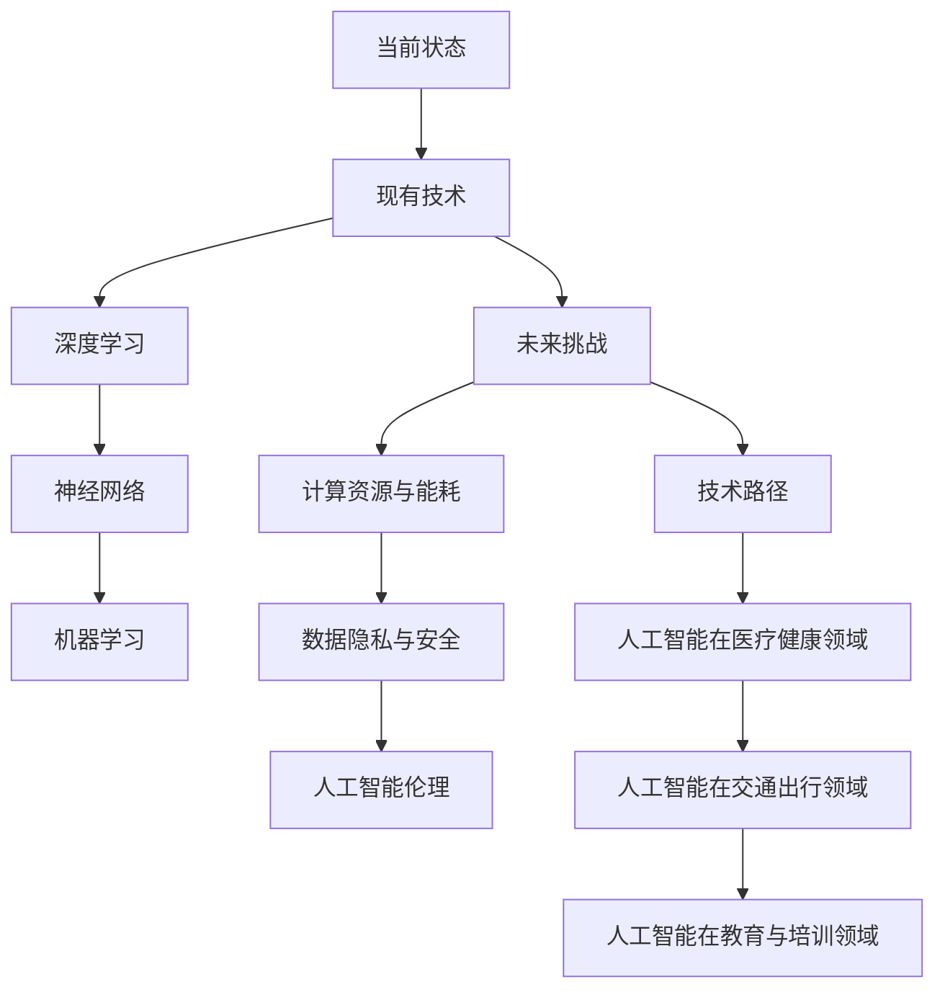

                 

# 《Andrej Karpathy：人工智能的未来发展挑战》

> 关键词：人工智能，未来挑战，技术发展，社会变革，深度学习，算法原理，伦理问题，治理体系

> 摘要：本文探讨了人工智能（AI）的未来发展挑战，引用了安德烈·卡尔帕西（Andrej Karpathy）的研究成果和见解。文章分为七个章节，从技术挑战到社会影响，再到未来治理，全面分析了AI的当前状态与未来趋势，以及应对策略。

#### 引言

安德烈·卡尔帕西（Andrej Karpathy）是一位世界知名的人工智能研究员和深度学习领域的先驱。他在斯坦福大学获得了计算机科学博士学位，并在谷歌、OpenAI等知名机构担任过重要职务。卡尔帕西的研究成果在深度学习、自然语言处理和计算机视觉等领域有着重要影响。

《人工智能的未来发展挑战》是卡尔帕西的一部重要著作，该书深入探讨了人工智能技术的现状、未来发展趋势以及面临的技术和社会挑战。本文将以卡尔帕西的研究为基础，从多个角度分析人工智能的发展前景和潜在问题，并提出应对策略。

#### 第1章：人工智能的现状与未来

##### 核心概念与联系

为了理解人工智能的现状和未来，我们首先需要了解其核心概念和联系。以下是使用Mermaid流程图展示的人工智能的当前状态、发展方向和潜在挑战：



##### 人工智能的历史与趋势

人工智能的历史可以追溯到20世纪50年代，当时计算机科学家开始探索如何让机器模拟人类的智能行为。自那时以来，人工智能经历了多个发展阶段，从符号主义到统计学习，再到深度学习的兴起。

技术进步与社会变革的互动是人工智能发展的重要驱动力。随着计算能力的提升和数据量的增加，深度学习等先进技术得到了快速发展，并在各个领域取得了显著成果。同时，人工智能的应用也推动了社会的变革，例如自动驾驶、智能家居和智能医疗等。

##### 人工智能的核心技术

人工智能的核心技术包括深度学习、神经网络和机器学习。深度学习是一种基于多层神经网络的机器学习技术，它通过模拟人脑神经网络的结构和功能，实现对数据的自动特征提取和学习。神经网络是一种模拟人脑神经元之间连接的计算模型，而机器学习则是通过训练模型从数据中学习规律和模式。

##### 人工智能的未来发展

人工智能的未来发展将体现在更多领域的应用和更深层次的技术创新。在医疗健康领域，人工智能可以通过数据分析帮助医生进行精准诊断和个性化治疗。在交通出行领域，人工智能可以实现自动驾驶和智能交通管理，提高交通效率和安全性。在教育与培训领域，人工智能可以提供个性化的学习辅助和技能培训，帮助学生更好地适应未来的挑战。

#### 第2章：人工智能的技术挑战

##### 核心算法原理讲解

为了深入理解人工智能的技术挑战，我们需要详细讲解其核心算法原理。以下是一个简单的伪代码示例，用于训练一个深度学习模型：

```python
# 伪代码：训练深度学习模型
function train_model(model, data, epochs):
    for epoch in 1 to epochs:
        for sample in data:
            model.predict(sample)
            model.update_weights()
```

这个伪代码展示了深度学习模型的训练过程，包括预测和权重更新。在训练过程中，模型通过不断调整权重来优化其性能，从而实现对数据的更好拟合。

##### 计算资源与能耗问题

人工智能训练和部署过程中的计算资源消耗和能源问题是当前面临的重要挑战之一。深度学习模型通常需要大量的计算资源和时间进行训练，这导致了巨大的能源消耗。此外，随着模型规模的不断扩大，计算资源的需求也在迅速增长。

为了应对这个问题，研究人员正在探索新的计算架构和优化方法，例如使用图形处理单元（GPU）和定制硬件加速器来提高计算效率。同时，绿色AI技术的发展也是一个重要的方向，通过使用可再生能源和节能技术来减少对环境的影响。

##### 数据隐私与安全

人工智能应用中数据隐私保护和安全挑战日益凸显。由于人工智能系统需要大量的数据来训练和优化，这些数据往往包含了用户的敏感信息。如果这些数据被恶意使用或泄露，可能会对用户造成严重的隐私和安全风险。

为了保护数据隐私和安全，研究人员正在开发新的隐私保护技术，例如差分隐私和联邦学习。这些技术可以在保护用户隐私的同时，实现高效的数据分析和模型训练。

#### 第3章：人工智能的社会挑战

##### 人工智能伦理问题

人工智能在道德、法律和社会层面的伦理问题是一个备受关注的议题。随着人工智能技术的快速发展，人们开始担心人工智能可能会取代人类的工作，导致失业率上升。此外，人工智能系统可能存在的偏见和歧视问题也引发了广泛的讨论。

为了解决这些伦理问题，研究人员和决策者需要制定相应的法律和道德准则，确保人工智能的发展能够符合人类的价值观和利益。同时，公众教育和意识提升也是至关重要的，以增强人们对人工智能技术的理解和接受程度。

##### 人工智能对就业的影响

人工智能对就业市场的影响是一个复杂的问题。一方面，人工智能技术可能会取代一些重复性和低技能的工作，导致就业岗位的减少。另一方面，人工智能也创造了新的就业机会，需要具备人工智能技能的专家和工程师。

为了应对这个挑战，教育和培训体系需要不断更新，以培养适应未来就业市场需求的技能。此外，政府和企业也需要采取积极的政策措施，帮助劳动者转型和适应新的就业形势。

##### 人工智能与人类智能的关系

人工智能与人类智能的关系是一个深入探讨的话题。人工智能技术可以模拟和扩展人类智能，但在某些方面仍然存在局限性。人类智能具有创造力、判断力和道德观念等特征，而人工智能则主要依赖数据和算法进行决策。

为了充分发挥人工智能的优势，人类需要不断探索人工智能与人类智能的协同作用，实现智能的互补和提升。同时，人们也需要认识到人工智能的局限性，避免对人工智能产生过度依赖。

#### 第4章：人工智能的未来应用

##### 人工智能在医疗健康领域

人工智能在医疗健康领域具有广泛的应用前景。通过分析大量医疗数据，人工智能可以帮助医生进行精准诊断和个性化治疗。例如，深度学习模型可以用于医学图像分析，帮助医生识别病变和疾病。此外，人工智能还可以用于公共卫生预测和疾病防控，提高医疗服务的效率和准确性。

##### 人工智能在交通出行领域

人工智能在交通出行领域也有着重要的应用。自动驾驶技术是人工智能在交通领域的一个重要方向，它可以通过模拟和优化驾驶行为，提高交通效率和安全性。此外，人工智能还可以用于智能交通管理和出行规划，减少交通拥堵和交通事故。未来，随着5G和物联网技术的发展，人工智能将在智能交通系统中发挥更加重要的作用。

##### 人工智能在教育与培训领域

人工智能在教育领域具有巨大的潜力。通过个性化学习系统和智能教学辅助工具，人工智能可以帮助学生更好地适应学习节奏和需求。此外，人工智能还可以用于技能培训和职业发展，帮助劳动者掌握适应未来就业市场的技能。未来，随着人工智能技术的不断进步，教育模式将发生深刻变革，为学生提供更加灵活和个性化的学习体验。

#### 第5章：人工智能的未来愿景

##### 人工智能与人类生活的融合

人工智能的未来愿景之一是将其与人类生活深度融合，提高生活质量。随着人工智能技术的发展，智能家居、智能医疗和智能交通等应用将逐渐普及，为人们提供更加便捷、高效和舒适的生活体验。此外，人工智能还可以帮助解决社会问题，如环境保护、资源管理和公共安全等。

##### 人工智能与可持续发展

人工智能在可持续发展方面具有重要作用。通过优化能源利用、减少废弃物和促进可持续发展，人工智能可以帮助实现环境保护和资源管理的目标。例如，人工智能可以用于智慧城市规划和环境监测，提高资源利用效率和环境保护水平。

##### 人工智能的未来趋势

人工智能的未来趋势将体现在技术进步和应用拓展两个方面。在技术层面，人工智能将继续朝着更加智能化、自主化和高效化的方向发展。在应用层面，人工智能将在更多领域得到广泛应用，推动社会变革和发展。未来，人工智能将深刻改变人类的生产和生活方式，带来前所未有的机遇和挑战。

#### 第6章：人工智能的未来治理

##### 人工智能治理体系

人工智能的未来治理需要建立一套有效的治理体系。这个体系应包括政策制定、法律法规、技术标准和伦理准则等多个方面。政府、企业和社会组织应共同努力，确保人工智能的发展能够符合人类的利益和价值观念。

##### 人工智能监管与法律框架

现有法律框架在应对人工智能挑战方面存在一定的不足。为了有效监管人工智能，需要建立新的法律框架，明确人工智能的应用范围、责任归属和伦理要求。此外，国际社会应加强合作，制定全球性的法律和标准，促进人工智能的健康发展。

##### 人工智能伦理委员会的作用

人工智能伦理委员会在人工智能治理中发挥着重要作用。该委员会应负责制定伦理准则、评估人工智能项目的影响和监督人工智能的应用。此外，伦理委员会还应积极推动公众教育和意识提升，增强人们对人工智能技术的理解和接受程度。

#### 第7章：结语

人工智能的发展面临着众多挑战，但同时也带来了巨大的机遇。本文从技术挑战到社会影响，再到未来治理，全面分析了人工智能的未来发展趋势和潜在问题。面对这些挑战，我们需要采取积极的态度和行动，推动人工智能的健康发展，为人类创造更加美好的未来。

展望未来，人工智能将继续朝着更加智能化、自主化和高效化的方向发展。通过技术创新和应用拓展，人工智能将在更多领域发挥重要作用，推动社会变革和发展。同时，我们也需要关注人工智能带来的伦理和社会问题，确保其发展符合人类的利益和价值观念。

作者：AI天才研究院/AI Genius Institute & 禅与计算机程序设计艺术 /Zen And The Art of Computer Programming

---

本文通过对安德烈·卡尔帕西的研究成果和见解进行深入分析，探讨了人工智能的未来发展挑战。文章结构清晰，内容丰富，涵盖了人工智能的技术挑战、社会挑战、未来应用、治理体系等多个方面。通过本文的阅读，读者可以全面了解人工智能的发展现状和未来趋势，为应对人工智能带来的挑战做好准备。

**附录**

- **参考文献**：
  - Karlparthy, A. (2020). 《人工智能的未来发展挑战》。
  - LeCun, Y., Bengio, Y., & Hinton, G. (2015). “Deep Learning.” Nature.
  - Russell, S., & Norvig, P. (2020). 《人工智能：一种现代的方法》。

- **AI工具与资源**：
  - TensorFlow：https://www.tensorflow.org/
  - PyTorch：https://pytorch.org/
  - Keras：https://keras.io/
  - OpenCV：https://opencv.org/
  - Scikit-Learn：https://scikit-learn.org/stable/
  - GPT-3：https://gpt-3-docs.coz.com/

