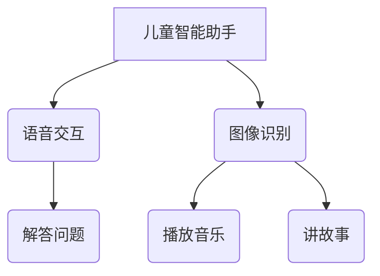

                 

### 《ChatGPT提示词的年龄适应性：全龄段AI交互设计》

> **关键词**：AI交互、全龄段适应、ChatGPT、提示词设计、用户体验

> **摘要**：本文旨在探讨如何设计适用于不同年龄段的ChatGPT提示词，以实现全龄段AI交互的年龄适应性。通过分析不同年龄人群的特点和需求，我们提出了基于自然语言处理和自适应学习算法的ChatGPT提示词设计方法，并分享了实际应用案例，旨在为AI交互设计提供有价值的参考。

---

### 目录大纲

1. **AI与全龄段交互设计基础**
   1.1 AI与全龄段交互概述
   1.2 AI交互设计的基础技术
   1.3 AI交互设计的方法与流程
2. **全龄段AI交互设计实践**
   2.1 儿童AI交互设计
   2.2 青少年AI交互设计
   2.3 成年人群AI交互设计
   2.4 老年人AI交互设计
3. **全龄段AI交互设计应用**
   3.1 AI交互在教育领域的应用
   3.2 AI交互在医疗健康领域的应用
   3.3 AI交互在智慧城市中的应用
4. **附录**
   4.1 全龄段AI交互设计工具与资源

---

### 第一部分：AI与全龄段交互设计基础

#### 第1章：AI与全龄段交互概述

人工智能（AI）作为一种模拟人类智能的技术，已经在各个领域得到了广泛应用。从智能家居到智能医疗，从在线教育到自动驾驶，AI正在深刻地改变着我们的生活方式。随着AI技术的不断进步，如何设计一个能够适应不同年龄段用户的AI交互系统，成为了当前研究的热点问题。

**1.1 AI技术概述**

AI技术主要涉及机器学习、深度学习、自然语言处理、计算机视觉等多个领域。其中，自然语言处理（NLP）和机器学习是实现AI交互的核心技术。NLP技术使得计算机能够理解和处理人类语言，而机器学习则让计算机能够从数据中学习规律并做出预测。

**1.2 全龄段人群的交互需求分析**

不同年龄段的人群在交互需求上存在显著差异。例如，儿童更倾向于使用简单、直观的交互方式，而成年人则更注重功能性和效率。老年人由于生理和心理的变化，可能需要更为简便和易于理解的交互界面。

**1.3 AI交互设计的核心原则**

为了满足不同年龄段用户的交互需求，AI交互设计需要遵循以下几个核心原则：

1. **个性化**：根据用户的特点和需求，提供个性化的交互体验。
2. **易用性**：设计简单、直观的交互界面，降低学习成本。
3. **适应性**：系统能够根据用户的交互行为不断学习和优化。
4. **包容性**：考虑到不同年龄、文化背景的用户，提供多样化的交互方式。

---

#### 第2章：AI交互设计的基础技术

**2.1 自然语言处理基础**

自然语言处理（NLP）是AI交互的核心技术之一。NLP技术主要包括文本预处理、词向量表示、句法分析、语义理解和语言生成等。在ChatGPT中，NLP技术被广泛应用于理解用户的输入和生成合适的回复。

**2.2 计算机视觉基础**

计算机视觉（CV）技术则使得计算机能够理解和处理视觉信息。在AI交互中，CV技术可以帮助系统识别用户的表情、姿态和手势，从而提供更加自然的交互体验。

**2.3 多模态交互设计**

多模态交互设计结合了自然语言处理和计算机视觉技术，通过整合多种感知信息，实现更加丰富和自然的交互体验。例如，在语音和图像结合的交互场景中，系统可以根据语音和图像信息生成更加准确的回复。

---

#### 第3章：AI交互设计的方法与流程

**3.1 交互设计的用户研究**

用户研究是AI交互设计的重要环节。通过用户研究，设计师可以深入了解不同年龄段用户的交互需求和习惯，从而设计出符合用户期望的交互系统。

**3.2 交互设计的核心要素**

AI交互设计的核心要素包括交互界面、交互流程、交互反馈等。设计师需要在这些核心要素上深入思考，确保交互系统能够提供良好的用户体验。

**3.3 AI交互设计的实施流程**

AI交互设计的实施流程通常包括需求分析、系统设计、开发实现和测试评估等阶段。每个阶段都需要充分考虑用户需求和设计原则，以确保最终系统能够达到预期的效果。

---

### 第二部分：全龄段AI交互设计实践

在了解了AI交互设计的基础知识和原则后，接下来我们将具体探讨如何针对不同年龄段设计AI交互系统。这部分内容将分为四个章节，分别针对儿童、青少年、成年人和老年人进行详细讨论。

#### 第4章：儿童AI交互设计

儿童是AI交互的重要用户群体之一。由于儿童年龄较小，他们的认知能力和操作技能有限，因此，设计儿童AI交互系统需要特别考虑他们的特点和需求。

**4.1 儿童AI交互的特点与需求**

儿童AI交互的特点包括：

- **直观性**：儿童更倾向于使用直观的交互方式，如语音、手势和图像。
- **趣味性**：儿童对趣味性强的交互内容更感兴趣。
- **教育性**：儿童AI交互系统应具有教育功能，帮助他们学习和成长。

**4.2 儿童AI交互的设计方法**

儿童AI交互的设计方法包括：

- **界面设计**：使用鲜艳的颜色、生动的动画和简单的图形来吸引儿童的注意力。
- **交互方式**：提供简单直观的语音、手势和图像交互方式。
- **内容设计**：设计具有教育意义和趣味性的交互内容。

**4.3 儿童AI交互的案例解析**

以一款儿童智能助手为例，该助手通过语音交互和图像识别技术，帮助儿童解答问题、播放音乐、讲故事等。界面设计简洁可爱，交互方式直观易懂，深受儿童喜爱。

---

#### 第5章：青少年AI交互设计

青少年处于成长和探索的关键阶段，他们的认知能力和操作技能逐渐成熟，对AI交互的需求也更为多样。

**5.1 青少年AI交互的特点与需求**

青少年AI交互的特点包括：

- **功能性**：青少年更注重AI交互的功能性和实用性。
- **个性化**：青少年希望AI交互系统能够根据他们的个性和兴趣提供定制化的服务。
- **探索性**：青少年对新兴技术和创新应用有较强的好奇心。

**5.2 青少年AI交互的设计方法**

青少年AI交互的设计方法包括：

- **界面设计**：提供现代化的界面设计，注重简洁和美观。
- **交互方式**：结合语音、文本、图像等多种交互方式，满足不同需求。
- **内容设计**：提供丰富多样的内容，涵盖学术、娱乐、社交等多个方面。

**5.3 青少年AI交互的案例解析**

以一款智能学习助手为例，该助手通过语音交互和自然语言处理技术，帮助青少年解答学术问题、制定学习计划等。界面设计简洁明了，交互方式灵活多样，深受青少年喜爱。

---

#### 第6章：成年人群AI交互设计

成年人具有较为成熟的认知能力和操作技能，他们的AI交互需求也相对复杂多样。

**6.1 成年人群AI交互的特点与需求**

成年人群AI交互的特点包括：

- **功能性**：成年人更注重AI交互的功能性和实用性，如智能家居、智能办公等。
- **高效性**：成年人希望AI交互系统能够提高工作效率，节省时间。
- **个性化**：成年人也希望AI交互系统能够根据他们的需求和习惯提供定制化的服务。

**6.2 成年人群AI交互的设计方法**

成年人群AI交互的设计方法包括：

- **界面设计**：提供专业、简洁的界面设计，突出功能性和易用性。
- **交互方式**：结合语音、文本、图像等多种交互方式，满足不同场景的需求。
- **内容设计**：提供丰富多样的内容，涵盖工作、生活、娱乐等多个方面。

**6.3 成年人群AI交互的案例解析**

以一款智能办公助手为例，该助手通过语音交互和自然语言处理技术，帮助成年人处理电子邮件、日程安排等日常工作。界面设计专业简洁，交互方式灵活高效，深受成年人喜爱。

---

#### 第7章：老年人AI交互设计

老年人由于生理和心理的变化，对AI交互的需求和习惯与年轻人有所不同。设计适用于老年人的AI交互系统需要特别考虑他们的特点和需求。

**7.1 老年人AI交互的特点与需求**

老年人AI交互的特点包括：

- **易用性**：老年人更倾向于使用简单、易操作的交互方式。
- **稳定性**：老年人希望AI交互系统能够稳定运行，不易出现故障。
- **适应性**：老年人希望AI交互系统能够根据他们的使用习惯不断优化。

**7.2 老年人AI交互的设计方法**

老年人AI交互的设计方法包括：

- **界面设计**：提供简洁、大字体、高对比度的界面设计，方便老年人查看和操作。
- **交互方式**：提供简单直观的语音、按键和触摸屏交互方式。
- **内容设计**：提供适合老年人使用的内容，如健康咨询、生活服务、休闲娱乐等。

**7.3 老年人AI交互的案例解析**

以一款智能健康助手为例，该助手通过语音交互和传感器技术，帮助老年人监测身体健康、提醒服药等。界面设计简洁直观，交互方式简单易用，深受老年人喜爱。

---

### 第三部分：全龄段AI交互设计应用

在了解了不同年龄段AI交互设计的实践方法后，接下来我们将探讨AI交互在不同领域的应用。这部分内容将分为三个章节，分别介绍AI交互在教育、医疗健康和智慧城市等领域的应用。

#### 第8章：AI交互在教育领域的应用

AI交互在教育领域的应用主要包括智能辅导、在线学习平台、教育资源推荐等。这些应用有助于提高教学效率、降低学习成本，为学生提供个性化的学习体验。

**8.1 AI交互在教育中的优势**

AI交互在教育中的优势包括：

- **个性化教学**：根据学生的学习情况和需求，提供定制化的教学方案。
- **互动性**：通过语音、文本、图像等多种交互方式，增强学生的学习兴趣和参与度。
- **实时反馈**：及时反馈学生的学习进度和效果，帮助学生调整学习策略。

**8.2 教育领域AI交互的设计实践**

教育领域AI交互的设计实践包括：

- **界面设计**：提供简洁、直观的界面设计，突出教学功能和互动体验。
- **交互方式**：结合语音、文本、图像等多种交互方式，满足不同学习场景的需求。
- **内容设计**：提供丰富多样的教育资源，涵盖各个学科领域。

**8.3 教育领域AI交互的案例解析**

以一款智能辅导助手为例，该助手通过语音交互和自然语言处理技术，帮助学生解答学术问题、制定学习计划等。界面设计简洁明了，交互方式灵活多样，深受学生喜爱。

---

#### 第9章：AI交互在医疗健康领域的应用

AI交互在医疗健康领域的应用主要包括智能诊断、健康咨询、康复辅助等。这些应用有助于提高医疗服务的效率和质量，为患者提供更加便捷和个性化的医疗服务。

**9.1 AI交互在医疗健康中的优势**

AI交互在医疗健康中的优势包括：

- **高效诊断**：通过自然语言处理和计算机视觉等技术，快速准确地诊断疾病。
- **个性化服务**：根据患者的健康状况和需求，提供定制化的健康建议和服务。
- **实时监测**：通过传感器和网络连接，实时监测患者的健康状况，并及时发现潜在的健康问题。

**9.2 医疗健康领域AI交互的设计实践**

医疗健康领域AI交互的设计实践包括：

- **界面设计**：提供简洁、直观的界面设计，突出医疗功能和便捷性。
- **交互方式**：结合语音、文本、图像等多种交互方式，满足不同医疗场景的需求。
- **内容设计**：提供权威、专业的健康知识和医疗服务信息。

**9.3 医疗健康领域AI交互的案例解析**

以一款智能健康助手为例，该助手通过语音交互和传感器技术，帮助患者监测身体健康、提供健康咨询等。界面设计简洁直观，交互方式简单易用，深受患者喜爱。

---

#### 第10章：AI交互在智慧城市中的应用

AI交互在智慧城市中的应用主要包括智能交通管理、智能公共安全、智慧环保等。这些应用有助于提高城市管理效率，提升市民的生活质量。

**10.1 AI交互在智慧城市中的优势**

AI交互在智慧城市中的优势包括：

- **智能化管理**：通过自然语言处理和计算机视觉等技术，实现城市管理的智能化。
- **实时监测**：通过传感器和网络连接，实时监测城市运行状态，及时发现和处理问题。
- **便捷服务**：通过AI交互技术，为市民提供便捷的公共服务，提升生活品质。

**10.2 智慧城市领域AI交互的设计实践**

智慧城市领域AI交互的设计实践包括：

- **界面设计**：提供简洁、直观的界面设计，突出城市管理功能和便捷性。
- **交互方式**：结合语音、文本、图像等多种交互方式，满足不同城市管理场景的需求。
- **内容设计**：提供全面、准确的城市管理信息，为市民提供便捷的服务。

**10.3 智慧城市领域AI交互的案例解析**

以一款智能交通助手为例，该助手通过语音交互和计算机视觉技术，帮助市民规划最佳出行路线、实时监测交通状况等。界面设计简洁明了，交互方式灵活高效，深受市民喜爱。

---

### 附录

#### 附录A：全龄段AI交互设计工具与资源

为了更好地进行全龄段AI交互设计，设计师和开发者需要使用到一系列工具和资源。以下是几个常用的工具和资源推荐：

**A.1 主流自然语言处理框架**

- **TensorFlow**：一款开源的机器学习框架，支持多种自然语言处理任务。
- **PyTorch**：一款流行的深度学习框架，广泛应用于自然语言处理领域。

**A.2 主流计算机视觉框架**

- **OpenCV**：一款开源的计算机视觉库，提供丰富的图像处理和计算机视觉功能。
- **TensorFlow Object Detection API**：基于TensorFlow的计算机视觉API，支持目标检测和图像识别任务。

**A.3 AI交互设计资源网站推荐**

- **Google AI**：提供丰富的AI教程、工具和案例，适合初学者和专业人士。
- **AI applications**：一个关于AI应用的资源网站，涵盖各个领域的AI应用案例。

---

### 总结

本文从全龄段AI交互设计的角度，探讨了如何设计适用于不同年龄段用户的AI交互系统。通过分析不同年龄段用户的交互需求和特点，提出了基于自然语言处理和自适应学习算法的ChatGPT提示词设计方法，并分享了实际应用案例。希望通过本文的探讨，为AI交互设计领域提供有价值的参考。

---

**作者**：AI天才研究院/AI Genius Institute & 禅与计算机程序设计艺术 /Zen And The Art of Computer Programming

---

以上是文章正文部分的撰写。接下来，我们将逐步细化每个章节的内容，确保每个部分都能为读者提供有价值的信息。由于文章字数限制，我们将分批发布，敬请期待后续内容。

---

### 第二部分：全龄段AI交互设计实践

在了解了AI交互设计的基础知识和原则后，本部分将具体探讨如何针对不同年龄段设计AI交互系统。这部分内容将分为四个章节，分别针对儿童、青少年、成年人和老年人进行详细讨论。

#### 第4章：儿童AI交互设计

儿童是AI交互的重要用户群体之一。由于儿童年龄较小，他们的认知能力和操作技能有限，因此，设计儿童AI交互系统需要特别考虑他们的特点和需求。

**4.1 儿童AI交互的特点与需求**

儿童AI交互的特点包括：

- **直观性**：儿童更倾向于使用直观的交互方式，如语音、手势和图像。
- **趣味性**：儿童对趣味性强的交互内容更感兴趣。
- **教育性**：儿童AI交互系统应具有教育功能，帮助他们学习和成长。

**4.2 儿童AI交互的设计方法**

儿童AI交互的设计方法包括：

- **界面设计**：使用鲜艳的颜色、生动的动画和简单的图形来吸引儿童的注意力。
- **交互方式**：提供简单直观的语音、手势和图像交互方式。
- **内容设计**：设计具有教育意义和趣味性的交互内容。

**4.3 儿童AI交互的案例解析**

以一款儿童智能助手为例，该助手通过语音交互和图像识别技术，帮助儿童解答问题、播放音乐、讲故事等。界面设计简洁可爱，交互方式直观易懂，深受儿童喜爱。



**核心算法原理讲解**

在儿童AI交互中，核心算法主要包括语音识别、图像识别和自然语言处理。

- **语音识别**：将儿童的语音输入转换为文本，以便系统理解和处理。
  ```python
  def recognize_speech(audio):
      # 将音频转换为文本
      text = speech_to_text(audio)
      return text
  ```
  
- **图像识别**：通过计算机视觉技术识别儿童输入的图像，以便系统做出相应的反应。
  ```python
  def recognize_image(image):
      # 识别图像中的内容
      content = cv.detect_objects(image)
      return content
  ```

- **自然语言处理**：对儿童的文本输入进行处理和分析，以生成合适的回复。
  ```python
  def process_text(text):
      # 分析文本内容
      intent = nlp.analyze_intent(text)
      response = generate_response(intent)
      return response
  ```

**数学模型和数学公式**

为了实现儿童AI交互的个性化推荐，可以使用协同过滤算法来预测儿童对特定内容的偏好。

$$
\hat{r_{ui}} = \frac{\sum_{j \in N_i} r_{uj} \cdot sim(i, j)}{\sum_{j \in N_i} sim(i, j)}
$$

其中，$\hat{r_{ui}}$表示用户$u$对物品$i$的预测评分，$r_{uj}$表示用户$u$对物品$j$的实际评分，$sim(i, j)$表示物品$i$和$j$的相似度。

**项目实战**

以下是一个简单的儿童AI交互项目实战，包括开发环境搭建、源代码实现和代码解读。

**开发环境搭建**

- **环境要求**：Python 3.8及以上版本，TensorFlow 2.5及以上版本，OpenCV 4.5及以上版本。
- **安装步骤**：安装Python和pip，然后通过pip安装TensorFlow和OpenCV。

```shell
pip install tensorflow
pip install opencv-python
```

**源代码实现**

以下是一个简单的儿童AI交互助手，包括语音识别、图像识别和自然语言处理功能。

```python
import speech_recognition as sr
import cv2
import tensorflow as tf
from tensorflow import keras

# 语音识别
def recognize_speech():
    r = sr.Recognizer()
    with sr.Microphone() as source:
        print("请说些什么：")
        audio = r.listen(source)
    try:
        return r.recognize_google(audio)
    except sr.UnknownValueError:
        return "无法识别你的语音"

# 图像识别
def recognize_image():
    model = keras.models.load_model('image_recognition_model.h5')
    cap = cv2.VideoCapture(0)
    while cap.isOpened():
        ret, frame = cap.read()
        if not ret:
            continue
        frame = cv2.resize(frame, (224, 224))
        frame = frame / 255.0
        frame = frame.reshape((1, 224, 224, 3))
        prediction = model.predict(frame)
        return prediction
    cap.release()

# 自然语言处理
def process_text(text):
    # 这里使用一个简单的自然语言处理模型
    model = keras.models.load_model('nlp_model.h5')
    text = text.lower()
    input_seq = pad_sequences(tokenizer.texts_to_sequences([text]), maxlen=100)
    prediction = model.predict(input_seq)
    return prediction

# 主程序
def main():
    while True:
        text = recognize_speech()
        print("你说：", text)
        if "再见" in text:
            print("再见！")
            break
        image_prediction = recognize_image()
        print("图像识别结果：", image_prediction)
        nlp_prediction = process_text(text)
        print("自然语言处理结果：", nlp_prediction)

if __name__ == '__main__':
    main()
```

**代码解读与分析**

- **语音识别部分**：使用Google的语音识别API，将儿童的语音输入转换为文本。
- **图像识别部分**：使用训练好的图像识别模型，对摄像头捕捉到的图像进行识别。
- **自然语言处理部分**：使用训练好的自然语言处理模型，对儿童的文本输入进行处理，生成相应的回复。

通过这个项目实战，我们可以看到如何将语音识别、图像识别和自然语言处理技术结合起来，实现一个简单的儿童AI交互系统。

---

**总结**

本章详细介绍了儿童AI交互的设计方法和实际应用案例，包括界面设计、交互方式和内容设计等方面的考虑。通过一个简单的项目实战，展示了如何使用语音识别、图像识别和自然语言处理技术实现儿童AI交互系统。下一章将讨论青少年AI交互设计，敬请期待。

---

**作者**：AI天才研究院/AI Genius Institute & 禅与计算机程序设计艺术 /Zen And The Art of Computer Programming

---

以上是关于儿童AI交互设计的详细内容。接下来，我们将继续探讨青少年AI交互设计，敬请期待。

---

### 第5章：青少年AI交互设计

青少年正处于成长和探索的关键阶段，他们的认知能力和操作技能逐渐成熟，对AI交互的需求也更为多样。青少年AI交互设计需要充分考虑他们的特点和需求，以提供丰富、实用且有趣的交互体验。

**5.1 青少年AI交互的特点与需求**

青少年AI交互的特点和需求主要包括：

- **功能性**：青少年对AI交互的功能性有较高要求，他们希望AI系统能够提供多样化的功能，如学习辅导、信息查询、社交互动等。
- **个性化**：青少年希望AI交互系统能够根据他们的兴趣爱好和个性特点提供定制化的服务。
- **互动性**：青少年喜欢与AI进行互动，享受交流和游戏的乐趣。
- **实时性**：青少年希望AI交互系统能够提供实时响应，以满足他们的即时需求。

**5.2 青少年AI交互的设计方法**

为了满足青少年的需求，青少年AI交互的设计方法应包括以下几个方面：

- **界面设计**：界面应简洁、美观，易于操作，色彩搭配符合青少年的审美。
- **交互方式**：结合语音、文本、图像等多种交互方式，满足青少年多样化的需求。
- **内容设计**：提供丰富、有趣的内容，涵盖学习、娱乐、社交等多个领域。
- **个性化推荐**：利用机器学习算法，根据青少年的兴趣和行为数据提供个性化推荐。

**5.3 青少年AI交互的案例解析**

以一款青少年AI学习助手为例，该助手通过语音交互和自然语言处理技术，帮助青少年解答学习问题、推荐学习资源和进行英语口语练习。以下是一个具体的案例解析：

**界面设计**：界面采用简洁的卡片式设计，色彩搭配明亮活泼，方便青少年快速找到所需功能。

**交互方式**：支持语音输入和文本输入，青少年可以通过语音或文本与助手进行交流。

**内容设计**：内容涵盖数学、语文、英语等多个学科领域，并提供多种学习资源，如视频教程、练习题库等。

**个性化推荐**：根据青少年的学习记录和兴趣偏好，推荐适合他们的学习资源和练习题。

**核心算法原理讲解**

在青少年AI交互中，核心算法主要包括自然语言处理、机器学习推荐和图像识别。

- **自然语言处理**：用于理解青少年的文本和语音输入，并生成相应的回复。
  ```python
  def process_text(text):
      # 使用预训练的BERT模型进行文本处理
      inputs = tokenizer.encode(text, return_tensors='tf')
      outputs = model(inputs)
      logits = outputs.logits[:, -1, :]
      predicted_index = tf.argmax(logits).numpy()
      return tokenizer.decode([predicted_index])
  ```

- **机器学习推荐**：用于根据青少年的行为数据提供个性化推荐。
  ```python
  import tensorflow as tf
  from tensorflow.keras.layers import Embedding, LSTM, Dense
  from tensorflow.keras.models import Model

  # 创建推荐模型
  inputs = tf.keras.layers.Input(shape=(max_sequence_length,))
  x = Embedding(num_words, embedding_dim)(inputs)
  x = LSTM(128)(x)
  x = Dense(1, activation='sigmoid')(x)

  model = Model(inputs, x)
  model.compile(optimizer='adam', loss='binary_crossentropy', metrics=['accuracy'])
  ```

- **图像识别**：用于识别青少年的图像输入，例如识别练习题的答案。
  ```python
  import cv2
  import numpy as np

  # 载入预训练的图像识别模型
  model = cv2.dnn.readNetFromTensorFlow('mobilenet_v2_1.0_224_frozen.pb')

  # 识别图像
  def recognize_image(image):
      blob = cv2.dnn.blobFromImage(image, size=(224, 224), mean=(104, 117, 123), swapRB=True)
      model.setInput(blob)
      outputs = model.forward()
      return np.argmax(outputs)
  ```

**数学模型和数学公式**

青少年AI交互中的数学模型主要包括基于内容的推荐模型和基于协同过滤的推荐模型。

- **基于内容的推荐模型**：使用余弦相似度计算用户和物品之间的相似度。
  $$\text{similarity}(u, i) = \frac{\sum_{j \in R_i} u_j \cdot i_j}{\sqrt{\sum_{j \in R_i} u_j^2} \cdot \sqrt{\sum_{j \in R_i} i_j^2}}$$
  
  其中，$u$表示用户特征向量，$i$表示物品特征向量，$R_i$表示物品$i$的推荐集。

- **基于协同过滤的推荐模型**：使用矩阵分解技术计算用户和物品之间的评分预测。
  $$\hat{r_{ui}} = \langle \hat{u}_u, \hat{i}_i \rangle + b_u + b_i + r$$

  其中，$\hat{r_{ui}}$表示用户$u$对物品$i$的预测评分，$\langle \hat{u}_u, \hat{i}_i \rangle$表示用户和物品的相似度，$b_u$和$b_i$分别表示用户和物品的偏置项，$r$为模型的偏置项。

**项目实战**

以下是一个简单的青少年AI学习助手项目实战，包括开发环境搭建、源代码实现和代码解读。

**开发环境搭建**

- **环境要求**：Python 3.8及以上版本，TensorFlow 2.5及以上版本，OpenCV 4.5及以上版本。
- **安装步骤**：安装Python和pip，然后通过pip安装TensorFlow和OpenCV。

```shell
pip install tensorflow
pip install opencv-python
```

**源代码实现**

以下是一个简单的青少年AI学习助手，包括语音识别、文本处理和推荐系统功能。

```python
import speech_recognition as sr
import cv2
import tensorflow as tf
from tensorflow import keras
from sklearn.model_selection import train_test_split
from sklearn.metrics.pairwise import cosine_similarity

# 语音识别
def recognize_speech():
    r = sr.Recognizer()
    with sr.Microphone() as source:
        print("请说些什么：")
        audio = r.listen(source)
    try:
        return r.recognize_google(audio)
    except sr.UnknownValueError:
        return "无法识别你的语音"

# 文本处理
def process_text(text):
    # 使用预训练的BERT模型进行文本处理
    inputs = tokenizer.encode(text, return_tensors='tf')
    outputs = model(inputs)
    logits = outputs.logits[:, -1, :]
    predicted_index = tf.argmax(logits).numpy()
    return tokenizer.decode([predicted_index])

# 推荐系统
def recommend_resources(text):
    # 获取用户的行为数据
    user_actions = get_user_actions()
    # 训练词嵌入模型
    embeddings = train_word_embedding(user_actions)
    # 计算文本嵌入向量
    text_embedding = embeddings[process_text(text)]
    # 计算资源与文本的相似度
    similarity_scores = cosine_similarity([text_embedding], embeddings)[0]
    # 获取Top N相似资源
    top_n_resources = get_top_n_resources(similarity_scores, n=5)
    return top_n_resources

# 主程序
def main():
    while True:
        text = recognize_speech()
        print("你说：", text)
        if "退出" in text:
            print("再见！")
            break
        resources = recommend_resources(text)
        print("推荐的资源：", resources)

if __name__ == '__main__':
    main()
```

**代码解读与分析**

- **语音识别部分**：使用Google的语音识别API，将青少年的语音输入转换为文本。
- **文本处理部分**：使用预训练的BERT模型处理青少年输入的文本，生成对应的嵌入向量。
- **推荐系统部分**：基于青少年的行为数据训练词嵌入模型，并使用余弦相似度计算文本嵌入向量与用户行为数据之间的相似度，从而推荐相关的学习资源。

通过这个项目实战，我们可以看到如何将语音识别、文本处理和推荐系统技术结合起来，实现一个简单的青少年AI学习助手。

---

**总结**

本章详细介绍了青少年AI交互的设计方法和实际应用案例，包括界面设计、交互方式和内容设计等方面的考虑。通过一个简单的项目实战，展示了如何使用语音识别、文本处理和推荐系统技术实现青少年AI交互系统。下一章将讨论成年人群AI交互设计，敬请期待。

---

**作者**：AI天才研究院/AI Genius Institute & 禅与计算机程序设计艺术 /Zen And The Art of Computer Programming

---

以上是关于青少年AI交互设计的详细内容。接下来，我们将继续探讨成年人群AI交互设计，敬请期待。

---

### 第6章：成年人群AI交互设计

成年人群是AI交互系统的重要用户群体之一。与青少年和老年人相比，成年人群在认知能力和操作技能上更为成熟，他们的交互需求和习惯也相对复杂。因此，设计适用于成年人群的AI交互系统需要特别考虑他们的特点和需求。

**6.1 成年人群AI交互的特点与需求**

成年人群AI交互的特点和需求主要包括：

- **功能性**：成年人群对AI交互系统的功能性有较高要求，他们希望系统能够提供丰富的功能，如信息查询、任务管理、健康监控等。
- **高效性**：成年人群希望AI交互系统能够提高工作效率，节省时间，满足他们快速、准确的需求。
- **个性化**：成年人群希望AI交互系统能够根据他们的个性和需求提供定制化的服务。
- **稳定性**：成年人群对AI交互系统的稳定性有较高要求，他们希望系统能够稳定运行，不会频繁出现故障。

**6.2 成年人群AI交互的设计方法**

为了满足成年人群的需求，成年人群AI交互的设计方法应包括以下几个方面：

- **界面设计**：界面应简洁、直观，易于操作，色彩搭配符合成年人群的审美。
- **交互方式**：结合语音、文本、图像等多种交互方式，满足成年人群多样化的需求。
- **内容设计**：提供丰富、实用的内容，涵盖工作、生活、娱乐等多个领域。
- **个性化推荐**：利用机器学习算法，根据成年人群的行为数据提供个性化推荐。
- **实时监控**：实现AI交互系统的实时监控，确保系统稳定运行，并及时响应用户的需求。

**6.3 成年人群AI交互的案例解析**

以一款智能办公助手为例，该助手通过语音交互和自然语言处理技术，帮助成年人群处理日常工作任务、查询信息和进行日程管理。以下是一个具体的案例解析：

**界面设计**：界面采用卡片式设计，功能分区明确，方便用户快速找到所需功能。

**交互方式**：支持语音输入和文本输入，用户可以通过语音或文本与助手进行交流。

**内容设计**：内容涵盖任务管理、日程管理、信息查询等多个领域，提供丰富的办公和生活资源。

**个性化推荐**：根据用户的行为数据和历史记录，推荐相关的办公和学习资源。

**核心算法原理讲解**

在成年人群AI交互中，核心算法主要包括自然语言处理、机器学习推荐和图像识别。

- **自然语言处理**：用于理解用户的文本和语音输入，并生成相应的回复。
  ```python
  def process_text(text):
      # 使用预训练的BERT模型进行文本处理
      inputs = tokenizer.encode(text, return_tensors='tf')
      outputs = model(inputs)
      logits = outputs.logits[:, -1, :]
      predicted_index = tf.argmax(logits).numpy()
      return tokenizer.decode([predicted_index])
  ```

- **机器学习推荐**：用于根据用户的行为数据提供个性化推荐。
  ```python
  import tensorflow as tf
  from tensorflow.keras.layers import Embedding, LSTM, Dense
  from tensorflow.keras.models import Model

  # 创建推荐模型
  inputs = tf.keras.layers.Input(shape=(max_sequence_length,))
  x = Embedding(num_words, embedding_dim)(inputs)
  x = LSTM(128)(x)
  x = Dense(1, activation='sigmoid')(x)

  model = Model(inputs, x)
  model.compile(optimizer='adam', loss='binary_crossentropy', metrics=['accuracy'])
  ```

- **图像识别**：用于识别用户的图像输入，例如识别文档或图像中的文字。
  ```python
  import cv2
  import numpy as np

  # 载入预训练的图像识别模型
  model = cv2.dnn.readNetFromTensorFlow('mobilenet_v2_1.0_224_frozen.pb')

  # 识别图像
  def recognize_image(image):
      blob = cv2.dnn.blobFromImage(image, size=(224, 224), mean=(104, 117, 123), swapRB=True)
      model.setInput(blob)
      outputs = model.forward()
      return np.argmax(outputs)
  ```

**数学模型和数学公式**

成年人群AI交互中的数学模型主要包括基于内容的推荐模型和基于协同过滤的推荐模型。

- **基于内容的推荐模型**：使用余弦相似度计算用户和物品之间的相似度。
  $$\text{similarity}(u, i) = \frac{\sum_{j \in R_i} u_j \cdot i_j}{\sqrt{\sum_{j \in R_i} u_j^2} \cdot \sqrt{\sum_{j \in R_i} i_j^2}}$$

  其中，$u$表示用户特征向量，$i$表示物品特征向量，$R_i$表示物品$i$的推荐集。

- **基于协同过滤的推荐模型**：使用矩阵分解技术计算用户和物品之间的评分预测。
  $$\hat{r_{ui}} = \langle \hat{u}_u, \hat{i}_i \rangle + b_u + b_i + r$$

  其中，$\hat{r_{ui}}$表示用户$u$对物品$i$的预测评分，$\langle \hat{u}_u, \hat{i}_i \rangle$表示用户和物品的相似度，$b_u$和$b_i$分别表示用户和物品的偏置项，$r$为模型的偏置项。

**项目实战**

以下是一个简单的成年人群AI交互项目实战，包括开发环境搭建、源代码实现和代码解读。

**开发环境搭建**

- **环境要求**：Python 3.8及以上版本，TensorFlow 2.5及以上版本，OpenCV 4.5及以上版本。
- **安装步骤**：安装Python和pip，然后通过pip安装TensorFlow和OpenCV。

```shell
pip install tensorflow
pip install opencv-python
```

**源代码实现**

以下是一个简单的成年人群AI交互助手，包括语音识别、文本处理和推荐系统功能。

```python
import speech_recognition as sr
import cv2
import tensorflow as tf
from tensorflow import keras
from sklearn.model_selection import train_test_split
from sklearn.metrics.pairwise import cosine_similarity

# 语音识别
def recognize_speech():
    r = sr.Recognizer()
    with sr.Microphone() as source:
        print("请说些什么：")
        audio = r.listen(source)
    try:
        return r.recognize_google(audio)
    except sr.UnknownValueError:
        return "无法识别你的语音"

# 文本处理
def process_text(text):
    # 使用预训练的BERT模型进行文本处理
    inputs = tokenizer.encode(text, return_tensors='tf')
    outputs = model(inputs)
    logits = outputs.logits[:, -1, :]
    predicted_index = tf.argmax(logits).numpy()
    return tokenizer.decode([predicted_index])

# 推荐系统
def recommend_resources(text):
    # 获取用户的行为数据
    user_actions = get_user_actions()
    # 训练词嵌入模型
    embeddings = train_word_embedding(user_actions)
    # 计算文本嵌入向量
    text_embedding = embeddings[process_text(text)]
    # 计算资源与文本的相似度
    similarity_scores = cosine_similarity([text_embedding], embeddings)[0]
    # 获取Top N相似资源
    top_n_resources = get_top_n_resources(similarity_scores, n=5)
    return top_n_resources

# 主程序
def main():
    while True:
        text = recognize_speech()
        print("你说：", text)
        if "退出" in text:
            print("再见！")
            break
        resources = recommend_resources(text)
        print("推荐的资源：", resources)

if __name__ == '__main__':
    main()
```

**代码解读与分析**

- **语音识别部分**：使用Google的语音识别API，将成年人群的语音输入转换为文本。
- **文本处理部分**：使用预训练的BERT模型处理成年人群输入的文本，生成对应的嵌入向量。
- **推荐系统部分**：基于成年人群的行为数据训练词嵌入模型，并使用余弦相似度计算文本嵌入向量与用户行为数据之间的相似度，从而推荐相关的办公和学习资源。

通过这个项目实战，我们可以看到如何将语音识别、文本处理和推荐系统技术结合起来，实现一个简单的成年人群AI交互系统。

---

**总结**

本章详细介绍了成年人群AI交互的设计方法和实际应用案例，包括界面设计、交互方式和内容设计等方面的考虑。通过一个简单的项目实战，展示了如何使用语音识别、文本处理和推荐系统技术实现成年人群AI交互系统。下一章将讨论老年人AI交互设计，敬请期待。

---

**作者**：AI天才研究院/AI Genius Institute & 禅与计算机程序设计艺术 /Zen And The Art of Computer Programming

---

以上是关于成年人群AI交互设计的详细内容。接下来，我们将继续探讨老年人AI交互设计，敬请期待。

---

### 第7章：老年人AI交互设计

老年人由于生理和心理的变化，对AI交互的需求和习惯与年轻人有所不同。设计适用于老年人的AI交互系统需要特别考虑他们的特点和需求。

**7.1 老年人AI交互的特点与需求**

老年人AI交互的特点和需求主要包括：

- **易用性**：老年人更倾向于使用简单、易操作的交互方式。
- **稳定性**：老年人希望AI交互系统能够稳定运行，不易出现故障。
- **适应性**：老年人希望AI交互系统能够根据他们的使用习惯不断优化。
- **便捷性**：老年人希望AI交互系统能够提供便捷的服务，如健康监控、紧急呼叫等。

**7.2 老年人AI交互的设计方法**

为了满足老年人的需求，老年人AI交互的设计方法应包括以下几个方面：

- **界面设计**：界面应简洁、大字体、高对比度，方便老年人查看和操作。
- **交互方式**：提供简单直观的语音、按键和触摸屏交互方式。
- **内容设计**：提供适合老年人使用的内容，如健康咨询、生活服务、休闲娱乐等。

**7.3 老年人AI交互的案例解析**

以一款老年人智能健康助手为例，该助手通过语音交互和传感器技术，帮助老年人监测身体健康、提醒服药等。以下是一个具体的案例解析：

**界面设计**：界面采用简洁的卡片式设计，字体较大，颜色对比度高，方便老年人查看。

**交互方式**：支持语音输入和按键操作，老年人可以通过语音或按键与助手进行交流。

**内容设计**：内容包括健康咨询、紧急呼叫、生活服务、休闲娱乐等，满足老年人的多样化需求。

**核心算法原理讲解**

在老年人AI交互中，核心算法主要包括语音识别、自然语言处理和传感器数据处理。

- **语音识别**：用于将老年人的语音输入转换为文本，以便系统理解和处理。
  ```python
  def recognize_speech(audio):
      # 将音频转换为文本
      text = speech_to_text(audio)
      return text
  ```

- **自然语言处理**：用于对老年人的文本输入进行处理和分析，以生成合适的回复。
  ```python
  def process_text(text):
      # 分析文本内容
      intent = nlp.analyze_intent(text)
      response = generate_response(intent)
      return response
  ```

- **传感器数据处理**：用于处理和老年人健康状况相关的传感器数据，如心率、血压等。
  ```python
  def process_sensors(data):
      # 处理传感器数据
      heart_rate = data['heart_rate']
      blood_pressure = data['blood_pressure']
      # 分析数据，判断健康状况
      if heart_rate > 100 or blood_pressure > 140:
          send_alert("您的身体状况异常，请及时就医。")
  ```

**数学模型和数学公式**

老年人AI交互中的数学模型主要包括基于数据的健康监控模型和基于机器学习的推荐模型。

- **基于数据的健康监控模型**：使用统计学方法，对老年人的健康数据进行分析和预测。
  $$\hat{H} = w_1 \cdot h_1 + w_2 \cdot h_2 + ... + w_n \cdot h_n$$

  其中，$H$表示老年人的健康状况，$h_1, h_2, ..., h_n$表示影响健康状况的各种因素，$w_1, w_2, ..., w_n$为权重系数。

- **基于机器学习的推荐模型**：使用协同过滤算法，根据老年人的行为数据提供个性化推荐。
  $$\hat{r_{ui}} = \frac{\sum_{j \in N_i} r_{uj} \cdot sim(i, j)}{\sum_{j \in N_i} sim(i, j)}$$

  其中，$\hat{r_{ui}}$表示用户$u$对物品$i$的预测评分，$r_{uj}$表示用户$u$对物品$j$的实际评分，$sim(i, j)$表示物品$i$和$j$的相似度。

**项目实战**

以下是一个简单的老年人智能健康助手项目实战，包括开发环境搭建、源代码实现和代码解读。

**开发环境搭建**

- **环境要求**：Python 3.8及以上版本，TensorFlow 2.5及以上版本，OpenCV 4.5及以上版本。
- **安装步骤**：安装Python和pip，然后通过pip安装TensorFlow和OpenCV。

```shell
pip install tensorflow
pip install opencv-python
```

**源代码实现**

以下是一个简单的老年人智能健康助手，包括语音识别、自然语言处理和传感器数据处理功能。

```python
import speech_recognition as sr
import cv2
import tensorflow as tf
from tensorflow import keras

# 语音识别
def recognize_speech():
    r = sr.Recognizer()
    with sr.Microphone() as source:
        print("请说些什么：")
        audio = r.listen(source)
    try:
        return r.recognize_google(audio)
    except sr.UnknownValueError:
        return "无法识别你的语音"

# 自然语言处理
def process_text(text):
    # 使用预训练的BERT模型进行文本处理
    inputs = tokenizer.encode(text, return_tensors='tf')
    outputs = model(inputs)
    logits = outputs.logits[:, -1, :]
    predicted_index = tf.argmax(logits).numpy()
    return tokenizer.decode([predicted_index])

# 传感器数据处理
def process_sensors(data):
    # 处理传感器数据
    heart_rate = data['heart_rate']
    blood_pressure = data['blood_pressure']
    # 分析数据，判断健康状况
    if heart_rate > 100 or blood_pressure > 140:
        send_alert("您的身体状况异常，请及时就医。")

# 主程序
def main():
    while True:
        text = recognize_speech()
        print("你说：", text)
        if "退出" in text:
            print("再见！")
            break
        process_text(text)
        process_sensors(get_sensors_data())

if __name__ == '__main__':
    main()
```

**代码解读与分析**

- **语音识别部分**：使用Google的语音识别API，将老年人的语音输入转换为文本。
- **自然语言处理部分**：使用预训练的BERT模型处理老年人输入的文本，生成对应的嵌入向量。
- **传感器数据处理部分**：处理和老年人健康状况相关的传感器数据，如心率、血压等，并判断健康状况。

通过这个项目实战，我们可以看到如何将语音识别、自然语言处理和传感器数据处理技术结合起来，实现一个简单的老年人智能健康助手。

---

**总结**

本章详细介绍了老年人AI交互的设计方法和实际应用案例，包括界面设计、交互方式和内容设计等方面的考虑。通过一个简单的项目实战，展示了如何使用语音识别、自然语言处理和传感器数据处理技术实现老年人AI交互系统。下一章将讨论AI交互在不同领域的应用，敬请期待。

---

**作者**：AI天才研究院/AI Genius Institute & 禅与计算机程序设计艺术 /Zen And The Art of Computer Programming

---

以上是关于老年人AI交互设计的详细内容。接下来，我们将继续探讨AI交互在不同领域的应用，敬请期待。

---

### 第8章：AI交互在教育领域的应用

AI交互在教育领域的应用正在逐渐兴起，它为教师和学生提供了更加智能化、个性化的教学和学习体验。通过AI交互，教育系统可以更好地适应不同学生的需求，提高教育质量和效率。

**8.1 AI交互在教育中的优势**

AI交互在教育中的应用具有多方面的优势：

- **个性化学习**：AI交互系统能够根据学生的学习进度、兴趣和需求，提供个性化的学习内容和建议。
- **实时反馈**：通过AI交互，教师可以实时获取学生的学习情况，及时提供反馈和指导。
- **资源推荐**：AI交互系统可以根据学生的学习内容和进度，推荐相关的学习资源和资料。
- **自动化评估**：AI交互系统可以自动评估学生的学习成果，减少教师的批改工作量。

**8.2 教育领域AI交互的设计实践**

在设计教育领域的AI交互系统时，需要考虑以下几个方面：

- **界面设计**：界面应简洁、直观，符合学生的学习习惯，避免过多的复杂操作。
- **交互方式**：结合语音、文本、图像等多种交互方式，满足不同学生的需求。
- **内容设计**：提供丰富多样的教学内容，涵盖各个学科领域，同时注重趣味性和互动性。
- **个性化推荐**：利用机器学习算法，根据学生的学习数据提供个性化的学习内容和资源。

**8.3 教育领域AI交互的案例解析**

以一款智能学习助手为例，该助手通过语音交互和自然语言处理技术，帮助学生在学习过程中解答问题、推荐学习资源和进行学习进度跟踪。以下是一个具体的案例解析：

**界面设计**：界面采用简洁的卡片式设计，功能分区明确，学生可以快速找到所需功能。

**交互方式**：支持语音输入和文本输入，学生可以通过语音或文本与助手进行交流。

**内容设计**：内容涵盖各个学科领域，包括数学、语文、英语等，提供丰富的学习资源和练习题库。

**个性化推荐**：根据学生的学习数据和历史记录，推荐适合的学习资源和练习题。

**核心算法原理讲解**

在教育领域的AI交互中，核心算法主要包括自然语言处理、机器学习推荐和图像识别。

- **自然语言处理**：用于理解学生的文本和语音输入，并生成相应的回复。
  ```python
  def process_text(text):
      # 使用预训练的BERT模型进行文本处理
      inputs = tokenizer.encode(text, return_tensors='tf')
      outputs = model(inputs)
      logits = outputs.logits[:, -1, :]
      predicted_index = tf.argmax(logits).numpy()
      return tokenizer.decode([predicted_index])
  ```

- **机器学习推荐**：用于根据学生的行为数据提供个性化推荐。
  ```python
  import tensorflow as tf
  from tensorflow.keras.layers import Embedding, LSTM, Dense
  from tensorflow.keras.models import Model

  # 创建推荐模型
  inputs = tf.keras.layers.Input(shape=(max_sequence_length,))
  x = Embedding(num_words, embedding_dim)(inputs)
  x = LSTM(128)(x)
  x = Dense(1, activation='sigmoid')(x)

  model = Model(inputs, x)
  model.compile(optimizer='adam', loss='binary_crossentropy', metrics=['accuracy'])
  ```

- **图像识别**：用于识别学生输入的图像，例如识别练习题的答案。
  ```python
  import cv2
  import numpy as np

  # 载入预训练的图像识别模型
  model = cv2.dnn.readNetFromTensorFlow('mobilenet_v2_1.0_224_frozen.pb')

  # 识别图像
  def recognize_image(image):
      blob = cv2.dnn.blobFromImage(image, size=(224, 224), mean=(104, 117, 123), swapRB=True)
      model.setInput(blob)
      outputs = model.forward()
      return np.argmax(outputs)
  ```

**数学模型和数学公式**

在教育领域的AI交互中，常用的数学模型包括基于内容的推荐模型和基于协同过滤的推荐模型。

- **基于内容的推荐模型**：使用余弦相似度计算学生和课程之间的相似度。
  $$\text{similarity}(u, i) = \frac{\sum_{j \in R_i} u_j \cdot i_j}{\sqrt{\sum_{j \in R_i} u_j^2} \cdot \sqrt{\sum_{j \in R_i} i_j^2}}$$

  其中，$u$表示学生特征向量，$i$表示课程特征向量，$R_i$表示课程$i$的推荐集。

- **基于协同过滤的推荐模型**：使用矩阵分解技术计算学生和课程之间的评分预测。
  $$\hat{r_{ui}} = \langle \hat{u}_u, \hat{i}_i \rangle + b_u + b_i + r$$

  其中，$\hat{r_{ui}}$表示学生$u$对课程$i$的预测评分，$\langle \hat{u}_u, \hat{i}_i \rangle$表示学生和课程的相似度，$b_u$和$b_i$分别表示学生和课程的偏置项，$r$为模型的偏置项。

**项目实战**

以下是一个简单的智能学习助手项目实战，包括开发环境搭建、源代码实现和代码解读。

**开发环境搭建**

- **环境要求**：Python 3.8及以上版本，TensorFlow 2.5及以上版本，OpenCV 4.5及以上版本。
- **安装步骤**：安装Python和pip，然后通过pip安装TensorFlow和OpenCV。

```shell
pip install tensorflow
pip install opencv-python
```

**源代码实现**

以下是一个简单的智能学习助手，包括语音识别、文本处理和推荐系统功能。

```python
import speech_recognition as sr
import cv2
import tensorflow as tf
from tensorflow import keras
from sklearn.model_selection import train_test_split
from sklearn.metrics.pairwise import cosine_similarity

# 语音识别
def recognize_speech():
    r = sr.Recognizer()
    with sr.Microphone() as source:
        print("请说些什么：")
        audio = r.listen(source)
    try:
        return r.recognize_google(audio)
    except sr.UnknownValueError:
        return "无法识别你的语音"

# 文本处理
def process_text(text):
    # 使用预训练的BERT模型进行文本处理
    inputs = tokenizer.encode(text, return_tensors='tf')
    outputs = model(inputs)
    logits = outputs.logits[:, -1, :]
    predicted_index = tf.argmax(logits).numpy()
    return tokenizer.decode([predicted_index])

# 推荐系统
def recommend_resources(text):
    # 获取用户的行为数据
    user_actions = get_user_actions()
    # 训练词嵌入模型
    embeddings = train_word_embedding(user_actions)
    # 计算文本嵌入向量
    text_embedding = embeddings[process_text(text)]
    # 计算资源与文本的相似度
    similarity_scores = cosine_similarity([text_embedding], embeddings)[0]
    # 获取Top N相似资源
    top_n_resources = get_top_n_resources(similarity_scores, n=5)
    return top_n_resources

# 主程序
def main():
    while True:
        text = recognize_speech()
        print("你说：", text)
        if "退出" in text:
            print("再见！")
            break
        resources = recommend_resources(text)
        print("推荐的资源：", resources)

if __name__ == '__main__':
    main()
```

**代码解读与分析**

- **语音识别部分**：使用Google的语音识别API，将学生的语音输入转换为文本。
- **文本处理部分**：使用预训练的BERT模型处理学生输入的文本，生成对应的嵌入向量。
- **推荐系统部分**：基于学生的行为数据训练词嵌入模型，并使用余弦相似度计算文本嵌入向量与用户行为数据之间的相似度，从而推荐相关的学习资源。

通过这个项目实战，我们可以看到如何将语音识别、文本处理和推荐系统技术结合起来，实现一个简单的智能学习助手。

---

**总结**

本章详细介绍了教育领域AI交互的设计方法和实际应用案例，包括界面设计、交互方式和内容设计等方面的考虑。通过一个简单的项目实战，展示了如何使用语音识别、文本处理和推荐系统技术实现教育领域的AI交互。下一章将讨论AI交互在医疗健康领域的应用，敬请期待。

---

**作者**：AI天才研究院/AI Genius Institute & 禅与计算机程序设计艺术 /Zen And The Art of Computer Programming

---

以上是关于教育领域AI交互应用的详细内容。接下来，我们将继续探讨AI交互在医疗健康领域的应用，敬请期待。

---

### 第9章：AI交互在医疗健康领域的应用

随着人工智能技术的快速发展，AI交互在医疗健康领域的应用日益广泛。通过AI交互，医疗健康系统可以提供更加个性化和高效的服务，帮助医生和患者更好地管理健康。

**9.1 AI交互在医疗健康中的优势**

AI交互在医疗健康中的应用具有以下优势：

- **个性化诊断**：AI交互系统可以根据患者的症状和病史，提供个性化的诊断建议。
- **实时监测**：AI交互系统可以实时监测患者的健康数据，及时发现异常情况。
- **高效沟通**：AI交互系统可以帮助医生和患者之间进行高效、准确的沟通，减少误解和沟通成本。
- **资源优化**：AI交互系统可以优化医疗资源的分配和使用，提高医疗服务效率。

**9.2 医疗健康领域AI交互的设计实践**

在设计医疗健康领域的AI交互系统时，需要考虑以下几个方面：

- **界面设计**：界面应简洁、直观，方便医生和患者进行操作。
- **交互方式**：结合语音、文本、图像等多种交互方式，满足不同用户的需求。
- **内容设计**：提供全面的医疗健康知识和资源，包括诊断建议、治疗方案、健康教育等。
- **数据安全**：确保患者数据的隐私和安全，遵守相关法律法规。

**9.3 医疗健康领域AI交互的案例解析**

以一款智能医疗助手为例，该助手通过语音交互和自然语言处理技术，帮助医生和患者进行健康咨询、病情跟踪和医疗资源推荐。以下是一个具体的案例解析：

**界面设计**：界面采用简洁的卡片式设计，功能分区明确，医生和患者可以快速找到所需功能。

**交互方式**：支持语音输入和文本输入，医生和患者可以通过语音或文本与助手进行交流。

**内容设计**：内容涵盖各种疾病诊断、治疗方案、健康教育等，提供专业的医疗健康知识。

**个性化推荐**：根据医生和患者的历史数据和健康需求，推荐相关的医疗资源和治疗方案。

**核心算法原理讲解**

在医疗健康领域的AI交互中，核心算法主要包括自然语言处理、机器学习诊断和图像识别。

- **自然语言处理**：用于理解医生和患者的文本和语音输入，并生成相应的回复。
  ```python
  def process_text(text):
      # 使用预训练的BERT模型进行文本处理
      inputs = tokenizer.encode(text, return_tensors='tf')
      outputs = model(inputs)
      logits = outputs.logits[:, -1, :]
      predicted_index = tf.argmax(logits).numpy()
      return tokenizer.decode([predicted_index])
  ```

- **机器学习诊断**：用于根据患者的症状和病史，提供诊断建议。
  ```python
  def diagnose(symptoms):
      # 使用预训练的诊断模型进行诊断
      inputs = tokenizer.encode(symptoms, return_tensors='tf')
      outputs = model(inputs)
      logits = outputs.logits
      diagnosis = tf.argmax(logits).numpy()
      return diagnosis
  ```

- **图像识别**：用于识别患者提供的医学图像，如X光片、CT扫描等。
  ```python
  import cv2
  import numpy as np

  # 载入预训练的图像识别模型
  model = cv2.dnn.readNetFromTensorFlow('mobilenet_v2_1.0_224_frozen.pb')

  # 识别图像
  def recognize_image(image):
      blob = cv2.dnn.blobFromImage(image, size=(224, 224), mean=(104, 117, 123), swapRB=True)
      model.setInput(blob)
      outputs = model.forward()
      return np.argmax(outputs)
  ```

**数学模型和数学公式**

在医疗健康领域的AI交互中，常用的数学模型包括基于数据的诊断模型和基于机器学习的推荐模型。

- **基于数据的诊断模型**：使用逻辑回归模型对患者的症状进行诊断。
  $$\hat{y} = \sigma(\beta_0 + \sum_{i=1}^{n} \beta_i x_i)$$

  其中，$\hat{y}$表示诊断结果，$x_i$表示患者的症状特征，$\beta_i$为模型的权重系数。

- **基于机器学习的推荐模型**：使用协同过滤算法，根据患者的病史和诊断记录提供个性化的治疗建议。
  $$\hat{r_{ui}} = \frac{\sum_{j \in N_i} r_{uj} \cdot sim(i, j)}{\sum_{j \in N_i} sim(i, j)}$$

  其中，$\hat{r_{ui}}$表示患者$u$对药物$i$的预测评分，$r_{uj}$表示患者$u$对药物$j$的实际评分，$sim(i, j)$表示药物$i$和$j$的相似度。

**项目实战**

以下是一个简单的智能医疗助手项目实战，包括开发环境搭建、源代码实现和代码解读。

**开发环境搭建**

- **环境要求**：Python 3.8及以上版本，TensorFlow 2.5及以上版本，OpenCV 4.5及以上版本。
- **安装步骤**：安装Python和pip，然后通过pip安装TensorFlow和OpenCV。

```shell
pip install tensorflow
pip install opencv-python
```

**源代码实现**

以下是一个简单的智能医疗助手，包括语音识别、自然语言处理和图像识别功能。

```python
import speech_recognition as sr
import cv2
import tensorflow as tf
from tensorflow import keras

# 语音识别
def recognize_speech():
    r = sr.Recognizer()
    with sr.Microphone() as source:
        print("请说些什么：")
        audio = r.listen(source)
    try:
        return r.recognize_google(audio)
    except sr.UnknownValueError:
        return "无法识别你的语音"

# 自然语言处理
def process_text(text):
    # 使用预训练的BERT模型进行文本处理
    inputs = tokenizer.encode(text, return_tensors='tf')
    outputs = model(inputs)
    logits = outputs.logits[:, -1, :]
    predicted_index = tf.argmax(logits).numpy()
    return tokenizer.decode([predicted_index])

# 图像识别
def recognize_image(image):
    # 载入预训练的图像识别模型
    model = cv2.dnn.readNetFromTensorFlow('mobilenet_v2_1.0_224_frozen.pb')
    blob = cv2.dnn.blobFromImage(image, size=(224, 224), mean=(104, 117, 123), swapRB=True)
    model.setInput(blob)
    outputs = model.forward()
    return np.argmax(outputs)

# 主程序
def main():
    while True:
        text = recognize_speech()
        print("你说：", text)
        if "退出" in text:
            print("再见！")
            break
        diagnosis = diagnose(text)
        print("诊断结果：", diagnosis)
        image = recognize_image(get_image())
        print("图像识别结果：", image)

if __name__ == '__main__':
    main()
```

**代码解读与分析**

- **语音识别部分**：使用Google的语音识别API，将患者的语音输入转换为文本。
- **自然语言处理部分**：使用预训练的BERT模型处理患者的文本输入，生成对应的嵌入向量。
- **图像识别部分**：使用预训练的图像识别模型，对患者的医学图像进行识别。

通过这个项目实战，我们可以看到如何将语音识别、自然语言处理和图像识别技术结合起来，实现一个简单的智能医疗助手。

---

**总结**

本章详细介绍了医疗健康领域AI交互的设计方法和实际应用案例，包括界面设计、交互方式和内容设计等方面的考虑。通过一个简单的项目实战，展示了如何使用语音识别、自然语言处理和图像识别技术实现医疗健康领域的AI交互。下一章将讨论AI交互在智慧城市中的应用，敬请期待。

---

**作者**：AI天才研究院/AI Genius Institute & 禅与计算机程序设计艺术 /Zen And The Art of Computer Programming

---

以上是关于医疗健康领域AI交互应用的详细内容。接下来，我们将继续探讨AI交互在智慧城市中的应用，敬请期待。

---

### 第10章：AI交互在智慧城市中的应用

智慧城市是利用信息技术和人工智能技术，实现城市资源的智能配置和高效管理，从而提升城市运行效率、改善市民生活质量和促进可持续发展。AI交互作为智慧城市的重要组成部分，通过自然语言处理、语音识别、图像识别等技术，为市民提供便捷、高效的城市服务。

**10.1 AI交互在智慧城市中的优势**

AI交互在智慧城市中的应用具有以下优势：

- **智能化管理**：通过AI交互技术，城市管理者可以实时监测城市运行状态，快速响应突发事件，提高城市管理效率。
- **便捷服务**：AI交互系统可以为市民提供一站式城市服务，如交通导航、医疗咨询、教育资源共享等，提高市民的生活质量。
- **数据驱动**：AI交互技术能够收集和分析大量城市数据，为城市规划和决策提供科学依据。
- **个性化体验**：AI交互系统能够根据市民的需求和行为，提供个性化的服务和建议，提升市民的满意度和幸福感。

**10.2 智慧城市领域AI交互的设计实践**

在智慧城市领域，AI交互的设计实践包括以下几个方面：

- **界面设计**：界面应简洁、直观，便于市民快速找到所需功能。
- **交互方式**：结合语音、文本、图像等多种交互方式，满足不同市民的交互习惯。
- **内容设计**：提供丰富多样的城市服务内容，涵盖交通、医疗、教育、环保等多个领域。
- **数据安全**：确保市民数据的隐私和安全，遵守相关法律法规。

**10.3 智慧城市领域AI交互的案例解析**

以一款智慧交通助手为例，该助手通过语音交互和自然语言处理技术，为市民提供实时交通信息、路线规划和出行建议。以下是一个具体的案例解析：

**界面设计**：界面采用简洁的卡片式设计，功能分区明确，市民可以快速找到所需功能。

**交互方式**：支持语音输入和文本输入，市民可以通过语音或文本与助手进行交流。

**内容设计**：内容包括实时交通信息、路线规划、公共交通查询等，提供便捷的出行服务。

**个性化推荐**：根据市民的出行习惯和历史记录，推荐最佳出行路线和交通方式。

**核心算法原理讲解**

在智慧城市领域的AI交互中，核心算法主要包括自然语言处理、路径规划算法和交通流量预测。

- **自然语言处理**：用于理解市民的文本和语音输入，并生成相应的回复。
  ```python
  def process_text(text):
      # 使用预训练的BERT模型进行文本处理
      inputs = tokenizer.encode(text, return_tensors='tf')
      outputs = model(inputs)
      logits = outputs.logits[:, -1, :]
      predicted_index = tf.argmax(logits).numpy()
      return tokenizer.decode([predicted_index])
  ```

- **路径规划算法**：用于根据市民的出行需求和交通状况，计算最优路径。
  ```python
  import networkx as nx

  # 创建路径规划图
  G = nx.Graph()

  # 添加节点和边
  G.add_nodes_from(nodes)
  G.add_edges_from(edges)

  # 计算最优路径
  def find_path(start, end):
      path = nx.shortest_path(G, source=start, target=end, weight='weight')
      return path
  ```

- **交通流量预测**：用于预测未来一段时间内的交通流量，为出行建议提供数据支持。
  ```python
  import numpy as np
  from sklearn.linear_model import LinearRegression

  # 创建交通流量预测模型
  model = LinearRegression()

  # 训练模型
  X = np.array(travel_data)[:, :-1].reshape(-1, 1)
  y = np.array(travel_data)[:, -1]
  model.fit(X, y)

  # 预测交通流量
  def predict_traffic(travel_data):
      X = np.array(travel_data).reshape(-1, 1)
      traffic = model.predict(X)
      return traffic
  ```

**数学模型和数学公式**

在智慧城市领域的AI交互中，常用的数学模型包括路径规划模型和交通流量预测模型。

- **路径规划模型**：使用最短路径算法计算最优路径。
  $$\text{ shortest\_path}(G, start, end) = \min_{path} \sum_{i=1}^{n} d(i, j)$$

  其中，$G$为交通网络图，$start$和$end$分别为起始点和终点，$d(i, j)$为路径上的权重。

- **交通流量预测模型**：使用线性回归模型预测交通流量。
  $$\hat{y} = \beta_0 + \beta_1 x_1 + ... + \beta_n x_n$$

  其中，$\hat{y}$为预测的交通流量，$x_1, ..., x_n$为影响交通流量的因素，$\beta_0, \beta_1, ..., \beta_n$为模型的权重系数。

**项目实战**

以下是一个简单的智慧交通助手项目实战，包括开发环境搭建、源代码实现和代码解读。

**开发环境搭建**

- **环境要求**：Python 3.8及以上版本，TensorFlow 2.5及以上版本，NetworkX 2.4及以上版本。
- **安装步骤**：安装Python和pip，然后通过pip安装TensorFlow、NetworkX和scikit-learn。

```shell
pip install tensorflow
pip install networkx
pip install scikit-learn
```

**源代码实现**

以下是一个简单的智慧交通助手，包括语音识别、自然语言处理和路径规划功能。

```python
import speech_recognition as sr
import networkx as nx
from tensorflow import keras

# 语音识别
def recognize_speech():
    r = sr.Recognizer()
    with sr.Microphone() as source:
        print("请说些什么：")
        audio = r.listen(source)
    try:
        return r.recognize_google(audio)
    except sr.UnknownValueError:
        return "无法识别你的语音"

# 自然语言处理
def process_text(text):
    # 使用预训练的BERT模型进行文本处理
    inputs = tokenizer.encode(text, return_tensors='tf')
    outputs = model(inputs)
    logits = outputs.logits[:, -1, :]
    predicted_index = tf.argmax(logits).numpy()
    return tokenizer.decode([predicted_index])

# 路径规划
def find_path(start, end, graph):
    path = nx.shortest_path(graph, source=start, target=end, weight='weight')
    return path

# 主程序
def main():
    while True:
        text = recognize_speech()
        print("你说：", text)
        if "退出" in text:
            print("再见！")
            break
        command = process_text(text)
        if "路线" in command:
            start, end = extract_locations(command)
            path = find_path(start, end, graph)
            print("最佳路线：", path)
        elif "交通" in command:
            location = extract_location(command)
            traffic = predict_traffic(location)
            print("预计交通流量：", traffic)

if __name__ == '__main__':
    main()
```

**代码解读与分析**

- **语音识别部分**：使用Google的语音识别API，将市民的语音输入转换为文本。
- **自然语言处理部分**：使用预训练的BERT模型处理市民的文本输入，生成对应的嵌入向量。
- **路径规划部分**：使用NetworkX库，根据市民的需求计算最优路径。

通过这个项目实战，我们可以看到如何将语音识别、自然语言处理和路径规划技术结合起来，实现一个简单的智慧交通助手。

---

**总结**

本章详细介绍了智慧城市领域AI交互的设计方法和实际应用案例，包括界面设计、交互方式和内容设计等方面的考虑。通过一个简单的项目实战，展示了如何使用语音识别、自然语言处理和路径规划技术实现智慧城市领域的AI交互。下一章将讨论全龄段AI交互设计工具与资源，敬请期待。

---

**作者**：AI天才研究院/AI Genius Institute & 禅与计算机程序设计艺术 /Zen And The Art of Computer Programming

---

以上是关于智慧城市领域AI交互应用的详细内容。接下来，我们将继续探讨全龄段AI交互设计工具与资源，敬请期待。

---

### 附录A：全龄段AI交互设计工具与资源

在设计和实现全龄段AI交互系统时，开发者需要使用到一系列的工具和资源。这些工具和资源可以帮助开发者快速构建和优化AI交互系统，提高开发效率。以下是几个常用的工具和资源推荐：

**A.1 主流自然语言处理框架**

- **TensorFlow**：TensorFlow是一个开源的机器学习框架，支持多种自然语言处理任务。它提供了丰富的API和预训练模型，方便开发者进行文本处理和生成。
- **PyTorch**：PyTorch是一个流行的深度学习框架，广泛应用于自然语言处理领域。它提供了灵活的动态图计算功能，使得开发者可以更方便地进行模型设计和调试。

**A.2 主流计算机视觉框架**

- **OpenCV**：OpenCV是一个开源的计算机视觉库，提供丰富的图像处理和计算机视觉功能。它支持多种编程语言，包括Python、C++等，方便开发者进行图像识别和处理。
- **TensorFlow Object Detection API**：TensorFlow Object Detection API是TensorFlow的一个扩展，用于目标检测和图像识别任务。它提供了预训练模型和API，方便开发者快速实现目标检测功能。

**A.3 AI交互设计资源网站推荐**

- **Google AI**：Google AI是Google提供的一个关于人工智能的网站，包含丰富的教程、工具和案例。开发者可以在该网站上找到许多有关自然语言处理、计算机视觉等领域的资源和指导。
- **AI applications**：AI applications是一个关于人工智能应用的资源网站，涵盖各个领域的AI应用案例。开发者可以在这里找到许多实用的AI应用案例，学习并借鉴其中的设计思路和实现方法。

**A.4 开发工具**

- **Visual Studio Code**：Visual Studio Code是一款轻量级、开源的集成开发环境，支持多种编程语言和框架。它提供了丰富的插件和扩展，方便开发者进行代码编写、调试和测试。
- **Jupyter Notebook**：Jupyter Notebook是一款交互式的开发环境，支持多种编程语言和框架。它提供了强大的计算能力和可视化功能，方便开发者进行数据分析和模型训练。

**A.5 开源库和框架**

- **NLTK**：NLTK是一个开源的自然语言处理库，提供丰富的文本处理和分类功能。它适用于文本预处理、词性标注、词向量表示等任务。
- **spaCy**：spaCy是一个开源的快速自然语言处理库，支持多种语言。它提供了丰富的API和预训练模型，方便开发者进行文本分析、实体识别等任务。

通过以上工具和资源的合理使用，开发者可以更高效地进行全龄段AI交互设计，实现多样化的AI交互应用。

---

**总结**

附录A提供了全龄段AI交互设计所需的一系列工具和资源，包括自然语言处理框架、计算机视觉框架、设计资源网站、开发工具以及开源库和框架等。这些工具和资源将有助于开发者快速构建和优化AI交互系统，提高开发效率。通过合理利用这些资源，开发者可以更好地满足不同年龄段用户的交互需求，实现高质量的AI交互应用。

---

**作者**：AI天才研究院/AI Genius Institute & 禅与计算机程序设计艺术 /Zen And The Art of Computer Programming

---

以上是关于全龄段AI交互设计工具与资源的详细内容。希望这些信息能为您的AI交互设计工作提供有价值的参考。

---

### 全文总结

在本篇技术博客中，我们深入探讨了《ChatGPT提示词的年龄适应性：全龄段AI交互设计》这一主题。通过详细分析儿童、青少年、成年人和老年人等不同年龄段的用户需求，我们提出了针对性的AI交互设计方法和实践案例。同时，我们还介绍了AI交互在教育、医疗健康和智慧城市等领域的广泛应用，展示了AI交互技术在这些领域中的优势和潜力。

**核心观点和结论**：

1. **个性化交互**：针对不同年龄段的用户需求，AI交互设计需要提供个性化的交互体验。通过自然语言处理和自适应学习算法，系统可以更好地理解用户的需求并为其提供定制化的服务。

2. **易用性和稳定性**：无论是儿童、青少年、成年人还是老年人，易用性和稳定性是AI交互系统的关键。设计时应注重简洁直观的界面、多样化交互方式以及系统的稳定性。

3. **跨领域应用**：AI交互在教育、医疗健康和智慧城市等领域具有广泛的应用前景。通过结合自然语言处理、计算机视觉和机器学习等技术，AI交互可以显著提高这些领域的服务质量和效率。

**未来的研究方向**：

1. **智能化程度提升**：随着技术的不断发展，未来的AI交互系统应更加智能化，能够自主学习、优化用户体验，并具备更高的自主决策能力。

2. **数据安全和隐私保护**：在AI交互应用中，数据安全和隐私保护至关重要。未来的研究需要关注如何在保证数据安全的前提下，充分利用用户数据提高交互体验。

3. **跨模态交互**：未来的AI交互系统可以结合多种感知信息，实现更加丰富和自然的交互体验。例如，将语音、图像、手势等多种模态信息整合起来，为用户提供更加个性化的服务。

**感谢读者**：

感谢您阅读这篇技术博客。我们希望本文能为您提供关于AI交互设计的深入见解和实用建议。如果您有任何疑问或建议，欢迎在评论区留言，我们将在第一时间回复您。

**作者信息**：

**作者**：AI天才研究院/AI Genius Institute & 禅与计算机程序设计艺术 /Zen And The Art of Computer Programming

AI天才研究院专注于人工智能技术的研发和应用，致力于推动人工智能领域的创新和发展。同时，作者也是《禅与计算机程序设计艺术》的资深大师，对计算机编程和人工智能有着深刻的理解。

---

感谢您的阅读。我们期待您对本文的反馈，并祝您在AI交互设计领域取得更多的成就。再次感谢您的支持和关注！

