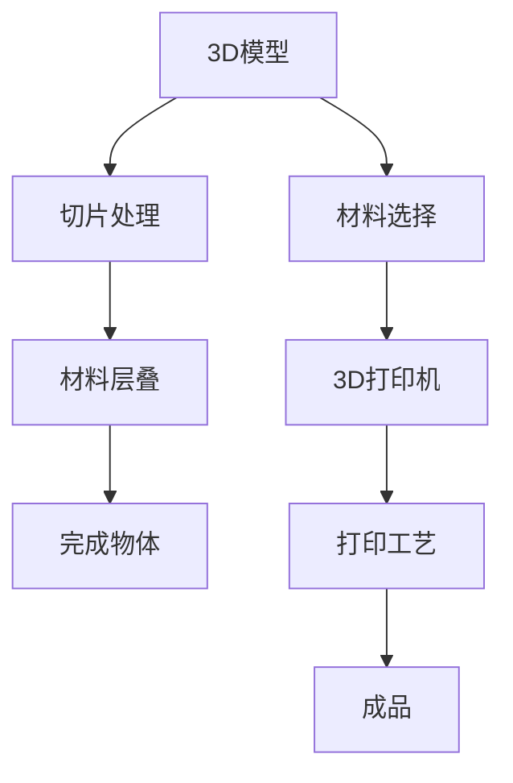
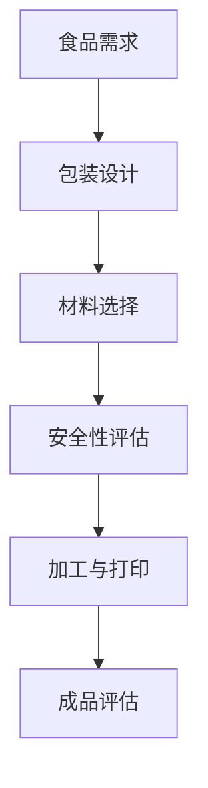

                 

### 3D打印与环保包装技术基础

#### 第1章：3D打印技术概述

在当今快速发展的科技时代，3D打印技术已经成为制造业和工程领域的一项颠覆性创新。本章将首先介绍3D打印技术的基本原理，随后回顾其发展历程，并分类讨论不同的3D打印技术。

##### 1.1 3D打印的基本原理与发展历程

**3D打印技术的定义与工作原理**

3D打印，也称为增材制造，是一种通过逐层叠加材料来制造三维物体的技术。它的工作原理类似于传统打印，只不过3D打印是在三维空间中逐层堆积材料，最终形成一个完整的物体。3D打印的核心在于其数字模型，通过计算机辅助设计（CAD）软件创建三维模型，然后将这些模型分成许多薄层，指导3D打印机逐层打印。

**3D打印技术的发展历程**

3D打印技术自20世纪80年代中期诞生以来，经历了多个发展阶段。早期的3D打印技术主要基于立体光固化成型（SLA）和熔融沉积成型（FDM）等工艺。随着计算机技术、材料科学和打印机的不断进步，3D打印技术逐渐成熟，并进入了快速发展的阶段。近年来，3D打印技术在精度、速度和材料多样性方面都有了显著提升。

**3D打印技术的分类**

3D打印技术可以根据打印工艺和所用材料进行分类。常见的3D打印技术包括：

- **立体光固化成型（SLA）**：使用紫外线照射光敏树脂，使其逐层固化成型。
- **熔融沉积成型（FDM）**：通过加热并挤出丝状材料，逐层堆积成型。
- **选择性激光烧结（SLS）**：使用激光烧结粉末材料，形成固体物体。
- **电子束熔融（EBM）**：使用电子束熔化金属材料，逐层堆积成型。

##### 1.2 环保包装的定义与重要性

**环保包装的概念**

环保包装是指在整个生命周期内，通过设计、材料选择和使用过程中减少对环境影响的包装。它强调资源的节约、废弃物的减少以及可回收利用。

**环保包装的重要性**

环保包装的重要性体现在以下几个方面：

- **资源节约**：通过使用可再生材料，减少对不可再生资源的依赖。
- **减少废弃物**：优化包装设计，减少包装材料的用量，从而减少废弃物的产生。
- **环境保护**：减少包装废弃物对环境的影响，如土壤和水污染。
- **经济性**：减少包装材料的成本，提高产品在市场上的竞争力。

**环保包装的挑战**

尽管环保包装具有重要的环保意义，但它在实际应用中仍面临一些挑战：

- **材料选择**：需要寻找环保、可再生、成本低且性能良好的材料。
- **成本控制**：环保包装材料通常成本较高，需要找到成本效益的平衡点。
- **技术创新**：需要不断创新，提高环保包装的设计和生产效率。
- **市场接受度**：消费者对环保包装的认识和接受程度仍需提高。

##### 1.3 3D打印在环保包装中的应用潜力

**3D打印在环保包装中的优势**

3D打印技术在环保包装中的应用具有以下优势：

- **个性化与定制化**：3D打印可以根据需求定制包装，减少材料浪费。
- **材料多样性**：3D打印可以使用多种环保材料，如生物降解塑料、可食用材料等。
- **高效生产**：3D打印可以快速生产小批量包装，缩短生产周期。
- **设计灵活性**：3D打印允许复杂和独特的包装设计，提高产品的市场吸引力。

**3D打印在环保包装中的潜在应用领域**

3D打印在环保包装中的潜在应用领域广泛，包括：

- **食品包装**：可定制、环保且具有功能性的食品包装。
- **化妆品与个人护理产品包装**：减少材料用量，提高产品的可持续性。
- **电子产品包装**：轻量化、抗静电、可重复使用的包装设计。
- **医疗用品包装**：无菌、个性化、可追踪的医疗用品包装。

**3D打印在环保包装中的应用前景**

随着3D打印技术的不断进步和环保意识的提高，3D打印在环保包装中的应用前景十分广阔。未来，3D打印有望成为环保包装领域的重要创新力量，推动包装行业向更加可持续和环保的方向发展。

---

**核心概念与联系**：

为了更直观地理解3D打印技术的核心概念和架构，我们可以使用Mermaid流程图来展示其基本原理。以下是一个简单的Mermaid流程图示例：



此图展示了从3D模型生成到成品制作的基本流程，以及涉及的各个关键步骤和组件。

---

接下来，我们将详细讨论3D打印材料的选择和技术应用，为理解3D打印在环保包装领域的创新提供更深入的视角。在下一章中，我们将探讨3D打印材料的基本原理，并分析不同材料的特点和适用性。

---

**下一章预告**：

**第2章：3D打印材料与技术选择**

我们将深入探讨3D打印材料的分类和特性，介绍新型环保材料，并讨论3D打印技术在环保包装中的应用和优势。

---

### 第2章：3D打印材料与技术选择

在3D打印技术迅速发展的背景下，材料的选择和应用成为影响打印效果和成本的关键因素。本章将首先概述3D打印材料的类型，分析传统材料的局限性，然后介绍新型环保材料的特性，探讨材料选择的原则与标准。

##### 2.1 3D打印材料概述

**传统打印材料的局限性**

传统的3D打印材料主要包括ABS（丙烯腈-丁二烯-苯乙烯）、PLA（聚乳酸）等。然而，这些材料存在一些局限性：

- **环境负担**：传统材料往往不易降解，会对环境造成长期负担。
- **成本较高**：某些高性能材料价格昂贵，限制了其大规模应用。
- **打印性能**：材料的机械性能、耐热性等可能不满足特定应用需求。

**新型3D打印材料介绍**

为了克服传统材料的局限性，研究人员和制造商不断探索新型3D打印材料。以下是一些新型环保材料的介绍：

- **生物降解塑料**：如聚乳酸（PLA）、聚羟基烷酸（PHA）等，这些材料能够在自然环境中降解，减少环境负担。
- **可食用材料**：如淀粉、蛋白质、脂肪等，可适用于食品包装，满足食品安全与卫生要求。
- **复合材料**：结合多种材料特性，提高打印产品的性能，如碳纤维增强聚合物等。

**材料选择的原则与标准**

在选择3D打印材料时，需要考虑以下几个原则与标准：

- **环保性**：材料应具有低环境负担，易于回收和降解。
- **机械性能**：材料应满足应用场景的机械要求，如强度、韧性、耐热性等。
- **成本**：材料应具有合理的成本，以实现经济效益。
- **安全性**：材料应无毒无害，符合食品安全和卫生要求。
- **可加工性**：材料应易于加工，适应3D打印技术的要求。

##### 2.2 3D打印技术在环保包装中的应用

**3D打印技术在环保包装中的创新应用**

3D打印技术在环保包装中的创新应用包括以下几个方面：

- **个性化与定制化**：3D打印可以根据需求定制包装，减少材料浪费，提高包装的独特性。
- **多功能包装**：3D打印可以集成功能部件，如抗菌涂层、防潮膜等，提高包装的实用性和环保性。
- **轻量化设计**：通过优化包装结构，3D打印可以实现轻量化设计，减少运输和存储成本。

**个性化与定制化包装**

个性化与定制化包装是3D打印技术在环保包装中的重要应用之一。与传统包装相比，3D打印可以实现：

- **快速响应市场需求**：根据客户需求快速定制包装，缩短产品上市时间。
- **减少材料浪费**：通过精确控制材料用量，减少浪费，降低成本。
- **提高产品附加值**：定制化的包装设计可以提升产品的品牌形象和市场竞争力。

**可降解与可回收利用的包装材料**

可降解和可回收利用的包装材料是环保包装的发展趋势。3D打印技术在这方面具有显著优势，如：

- **生物降解塑料**：3D打印可降解塑料包装，在自然环境中能够分解，减少污染。
- **回收利用**：3D打印可以制造可回收的包装材料，如铝、玻璃等，实现资源的循环利用。

**3D打印技术在食品包装中的应用**

在食品包装领域，3D打印技术同样具有广泛的应用潜力：

- **食品安全**：3D打印的食品包装材料符合食品安全标准，减少食品污染风险。
- **卫生性**：3D打印可以实现无菌包装，确保食品在运输和储存过程中的卫生安全。
- **个性化包装**：根据食品特性定制包装，提高食品的保鲜性和口感。

##### 2.3 3D打印技术在食品包装中的应用

**3D打印技术在食品包装中的创新**

3D打印技术在食品包装中的应用主要体现在以下几个方面：

- **可食用包装**：3D打印可食用材料，如淀粉、蛋白质等，制造可食用的包装，减少塑料污染。
- **多功能包装**：通过3D打印，在包装上集成智能标签、抗菌涂层等功能，提高包装的实用性和安全性。
- **个性化设计**：根据消费者需求定制包装，提供更丰富的视觉和触觉体验。

**食品安全与卫生要求**

在食品包装中，3D打印材料必须符合食品安全与卫生要求。这包括：

- **材料成分**：材料应无毒无害，不得含有有害化学物质。
- **生产过程**：3D打印过程应确保包装的清洁和无菌，防止细菌和污染物进入食品。
- **检测与认证**：食品包装材料需要经过严格的检测和认证，以确保其安全性和合规性。

**3D打印在食品包装中的优势**

3D打印在食品包装中的优势包括：

- **环保性**：使用可降解和可回收材料，减少环境负担。
- **个性化**：根据食品特性定制包装，提升用户体验。
- **高效性**：快速生产小批量包装，提高生产效率。
- **多功能**：集成多种功能部件，提高包装的实用性和安全性。

---

**核心算法原理讲解**：

在讨论3D打印技术在食品包装中的应用时，我们可以通过伪代码来展示3D打印模型的生成过程。以下是一个简化的伪代码示例：

```pseudo
Function Generate3DModel(foodProperties, packagingRequirements)
    // Step 1: 分析食品特性
    Model = CreateModel(foodProperties)

    // Step 2: 设计包装结构
    if packagingRequirements.isCustomizable
        Packaging = DesignCustomPackaging(Model)
    else
        Packaging = DesignStandardPackaging(Model)

    // Step 3: 选择环保材料
    Material = SelectEcoFriendlyMaterial(packagingRequirements)

    // Step 4: 生成3D打印模型
    3DModel = GenerateModel(Model, Packaging, Material)

    return 3DModel
```

此伪代码展示了从食品特性分析、包装设计到材料选择，最终生成3D打印模型的整个过程。

---

通过本章的讨论，我们深入了解了3D打印材料的选择原则和技术应用，以及其在环保包装领域的创新潜力。在下一章中，我们将进一步探讨可食用包装材料的研究进展，为3D打印可食用包装的设计与实现提供理论基础。

---

**下一章预告**：

**第3章：可食用包装材料研究**

我们将详细研究可食用包装材料的基本原理、研究进展，以及选择与评估方法，为3D打印可食用包装的设计与实现奠定基础。

---

### 第3章：可食用包装材料研究

在3D打印技术的推动下，可食用包装材料的研发成为环保包装领域的一大热点。本章将首先介绍可食用包装材料的基本原理，详细阐述不同类型可食用包装材料的性质与特点，并讨论其安全性评估。

##### 3.1 可食用包装材料的基本原理

**可食用包装材料的分类**

可食用包装材料可以分为两大类：天然可食用材料和合成可食用材料。

- **天然可食用材料**：这类材料直接来源于自然界，包括淀粉、蛋白质、脂肪等。例如，淀粉常用作包装薄膜，蛋白质和脂肪则可以用于制造可食用涂层。

- **合成可食用材料**：这类材料通过化学合成方法制造，具有可食用特性。例如，聚乳酸（PLA）和聚羟基烷酸（PHA）等，它们在生物降解性和安全性方面具有显著优势。

**可食用包装材料的性质与特点**

- **生物降解性**：可食用包装材料应具备良好的生物降解性，能够在自然环境中分解，减少对环境的污染。

- **食品安全性**：材料应无毒无害，符合食品安全标准，不会对人体健康造成危害。

- **机械性能**：材料应具有一定的机械强度和韧性，能够保护内部食品，延长保质期。

- **可定制性**：可食用包装材料应具备一定的可定制性，能够满足不同食品的包装需求。

**可食用包装材料的安全性评估**

可食用包装材料的安全性评估是确保其安全使用的重要环节。以下是一些评估方法：

- **成分分析**：对材料的主要成分进行详细分析，确保其无毒无害。

- **毒理学测试**：进行急性、亚急性和慢性毒性测试，评估材料对生物体的潜在危害。

- **迁移测试**：评估材料在接触食品时可能迁移的有害物质，确保食品安全。

##### 3.2 可食用包装材料的研究进展

**国内外可食用包装材料研究现状**

近年来，国内外对可食用包装材料的研究取得了显著进展：

- **国外研究**：欧美国家在可食用包装材料的研究方面处于领先地位。例如，美国、德国和日本等发达国家在聚乳酸（PLA）和聚羟基烷酸（PHA）等材料的研究和应用方面取得了大量成果。

- **国内研究**：我国在可食用包装材料的研究方面也取得了显著进展。例如，中国科学院、清华大学等科研机构和高校在生物降解塑料、淀粉基包装材料等领域进行了深入研究，并取得了一系列重要成果。

**新型可食用包装材料的开发**

随着技术的不断进步，新型可食用包装材料不断涌现：

- **生物降解塑料**：如聚乳酸（PLA）、聚羟基烷酸（PHA）等，具有良好的生物降解性和食品安全性。

- **淀粉基包装材料**：如淀粉薄膜、淀粉涂层等，广泛应用于食品包装。

- **蛋白质基包装材料**：如大豆蛋白薄膜、乳蛋白涂层等，具有优异的机械性能和生物降解性。

**可食用包装材料的应用前景**

可食用包装材料在食品包装、医药包装、化妆品包装等领域具有广泛的应用前景：

- **食品包装**：可食用包装材料可以提供食品安全保障，延长食品保质期，减少塑料污染。

- **医药包装**：可食用包装材料可用于药品包装，确保药品的纯净和安全。

- **化妆品包装**：可食用包装材料可以提升化妆品的环保性和美观性，满足消费者对环保和健康的需求。

##### 3.3 可食用包装材料的选择与评估

**材料选择的依据**

在选择可食用包装材料时，需要考虑以下依据：

- **生物降解性**：材料应具有良好的生物降解性，减少对环境的污染。

- **食品安全性**：材料应无毒无害，符合食品安全标准。

- **机械性能**：材料应具有一定的机械强度和韧性，能够满足包装需求。

- **成本**：材料应具有合理的成本，以满足市场竞争力。

- **加工性能**：材料应易于加工，适应3D打印技术的要求。

**材料评估的方法与工具**

在评估可食用包装材料时，可以采用以下方法与工具：

- **实验室测试**：通过实验室测试，评估材料的生物降解性、机械性能、食品安全性等指标。

- **模拟测试**：通过模拟测试，模拟实际使用环境，评估材料的性能和稳定性。

- **现场测试**：在实际使用环境中进行测试，评估材料的性能和用户满意度。

- **数据分析**：通过数据分析，对评估结果进行综合分析，为材料选择提供科学依据。

---

**核心概念与联系**：

为了更好地理解可食用包装材料的基本原理和架构，我们可以使用Mermaid流程图来展示其核心概念和流程。以下是一个简单的Mermaid流程图示例：



此图展示了从食品需求分析、包装设计到材料选择、安全性评估，再到加工与打印，最终进行成品评估的基本流程。

---

通过本章的讨论，我们深入了解了可食用包装材料的基本原理、研究进展以及选择与评估方法。在下一章中，我们将探讨3D打印可食用包装的设计原理，为可食用包装的设计与实现提供理论指导。

---

**下一章预告**：

**第4章：3D打印可食用包装的设计原理**

我们将详细讨论3D打印可食用包装的设计原则、设计流程以及设计案例，为3D打印可食用包装的设计与实现提供具体指导。

---

### 第4章：3D打印可食用包装的设计原理

随着3D打印技术的不断发展，可食用包装的设计逐渐成为环保包装领域的重要研究方向。本章将详细介绍3D打印可食用包装的设计原理，包括设计原则、设计流程以及设计案例，帮助读者更好地理解和实现3D打印可食用包装。

##### 4.1 3D打印可食用包装的设计原则

在3D打印可食用包装的设计过程中，应遵循以下原则：

**功能性设计**

功能性设计是3D打印可食用包装的核心原则之一。包装设计应满足食品的存储、保鲜和运输等需求，同时具备一定的功能性。例如，可以设计具有抗菌性能的包装，延长食品的保质期；或者设计具有可食用涂层的包装，减少塑料废弃物的产生。

**美观性设计**

美观性设计是提升产品附加值的重要手段。通过3D打印技术，可以设计出独特且具有视觉冲击力的包装。设计师可以运用不同的纹理、颜色和形状，创造出与品牌形象相符合的包装，提高产品的市场竞争力。

**可持续发展原则**

可持续发展原则是3D打印可食用包装设计的重要指导思想。设计过程中应考虑材料的可再生性、可降解性和环保性，减少对环境的负面影响。此外，还应考虑资源的节约和循环利用，实现包装的可持续发展。

##### 4.2 3D打印可食用包装的设计流程

3D打印可食用包装的设计流程包括以下步骤：

**设计需求分析**

在设计开始阶段，需要明确设计需求。这包括食品的特性、包装的功能、使用环境、成本预算等。设计需求分析是整个设计过程的基础，决定了后续设计的方向和目标。

**设计方案构思**

在明确设计需求后，可以开始构思设计方案。设计师可以运用计算机辅助设计（CAD）软件，根据设计需求绘制出初步的设计草图。在这一阶段，可以尝试不同的设计风格和结构，找到最佳的设计方案。

**设计方案优化**

设计方案草图完成后，需要对设计进行优化。优化过程中，可以采用计算机辅助优化（CAO）软件，对设计进行几何形状、材料选择和工艺参数等方面的调整，以提高设计的性能和降低成本。

**设计验证与测试**

在完成设计方案优化后，需要进行设计验证和测试。这包括对设计的安全性、功能性、美观性等方面进行评估，确保设计满足要求。设计验证和测试是确保设计可行性和可靠性的关键步骤。

##### 4.3 3D打印可食用包装的设计案例

**食品包装设计案例**

以下是一个3D打印可食用包装的食品包装设计案例：

- **食品特性**：水果，如草莓。
- **包装功能**：保鲜、运输和展示。
- **设计需求**：美观、环保、可降解。
- **设计思路**：采用淀粉基材料，设计一个具有抗菌性能的包装，同时加入可食用涂层，以提高包装的环保性和安全性。

**其他领域可食用包装设计案例**

除了食品包装，3D打印可食用包装在其他领域也具有广泛的应用。以下是一些其他领域的设计案例：

- **医药包装**：设计具有抗菌性能和延长药品保质期的包装，提高药品的安全性和有效性。
- **化妆品包装**：设计具有美观性和环保性的包装，提升化妆品的品牌形象和市场竞争力。
- **电子产品包装**：设计轻量化、防水和防尘的包装，提高产品的安全性和耐用性。

**设计原则与实际应用的结合**

在设计过程中，应充分考虑设计原则与实际应用的结合。例如，在食品包装设计中，可以采用以下设计原则：

- **功能性**：设计具有抗菌性能的包装，确保食品在运输和储存过程中的卫生安全。
- **美观性**：通过3D打印技术，设计出具有独特视觉效果的包装，提升产品的品牌形象。
- **可持续性**：选择可降解和可回收的材料，减少对环境的负面影响。

通过结合设计原则与实际应用，可以创造出符合市场需求、具有竞争力的3D打印可食用包装产品。

---

**核心算法原理讲解**：

为了更好地理解3D打印可食用包装的设计原理，我们可以通过伪代码来详细阐述包装设计的过程。以下是一个简化的伪代码示例：

```pseudo
Function DesignEcoFriendlyPackaging(foodProperties, packagingRequirements)
    // Step 1: 分析食品特性
    FoodAnalysis = AnalyzeFoodProperties(foodProperties)

    // Step 2: 设计包装结构
    PackagingDesign = DesignPackagingStructure(FoodAnalysis)

    // Step 3: 选择环保材料
    EcoFriendlyMaterial = SelectEcoFriendlyMaterial(packagingRequirements)

    // Step 4: 实现功能设计
    FunctionalDesign = ImplementFunctionalDesign(packagingRequirements)

    // Step 5: 优化设计
    OptimizedDesign = OptimizeDesign(PackagingDesign, EcoFriendlyMaterial, FunctionalDesign)

    // Step 6: 设计验证与测试
    ValidationAndTesting = ValidateAndTestDesign(OptimizedDesign)

    return OptimizedDesign
```

此伪代码展示了从食品特性分析、包装结构设计、材料选择、功能设计，到设计优化和验证测试的全过程。

---

通过本章的讨论，我们深入了解了3D打印可食用包装的设计原理、设计流程以及设计案例，为3D打印可食用包装的设计与实现提供了理论指导和实践参考。在下一章中，我们将探讨3D打印可食用包装的制作工艺，从材料、打印方法和工艺参数等方面详细解析制作过程。

---

**下一章预告**：

**第5章：3D打印可食用包装的制作工艺**

我们将详细介绍3D打印可食用包装的制作工艺，包括3D打印工艺的基本流程、制作方法以及优化与改进策略。

---

### 第5章：3D打印可食用包装的制作工艺

3D打印可食用包装的制作工艺是环保包装领域的一项关键技术。本章将首先概述3D打印工艺的基本流程，然后详细介绍3D打印可食用包装的制作方法，最后探讨优化与改进策略。

##### 5.1 3D打印工艺概述

**3D打印工艺的基本流程**

3D打印工艺的基本流程包括以下几个步骤：

1. **模型准备**：使用计算机辅助设计（CAD）软件创建3D模型，并对其进行切片处理，将其转化为打印机可以理解的格式。
2. **材料准备**：选择合适的可食用材料，并将其准备好，以供打印。
3. **打印设置**：根据打印需求和材料特性，设置打印机的参数，如层厚、打印速度、温度等。
4. **打印执行**：3D打印机根据模型和参数设置进行打印，逐层堆积材料，最终形成完整的可食用包装。
5. **后处理**：打印完成后，进行必要的后处理，如修剪、打磨、清洁等，确保包装的完整性和美观性。

**3D打印工艺的关键技术**

3D打印工艺的关键技术包括：

- **材料输送与控制**：确保材料均匀、稳定地输送，避免打印过程中出现断料、堆积等问题。
- **温度控制**：对于不同材料，需要控制合适的打印温度，以确保材料具有良好的流动性和粘结性。
- **层间结合**：优化层间结合强度，提高打印件的整体性能。
- **打印精度**：通过调整打印参数和优化工艺，提高打印精度，满足包装设计的要求。

##### 5.2 3D打印可食用包装的制作方法

**常见可食用材料的打印方法**

在3D打印可食用包装时，常见的可食用材料包括淀粉基材料、蛋白质基材料和脂肪基材料。以下是对这些材料的打印方法的介绍：

- **淀粉基材料**：淀粉基材料如淀粉薄膜、淀粉涂层等具有良好的可打印性和生物降解性。打印时，需要控制打印温度和速度，以避免材料过度熔化或断裂。
- **蛋白质基材料**：蛋白质基材料如大豆蛋白薄膜、乳蛋白涂层等具有较高的机械强度和生物降解性。打印时，需要控制打印温度和层间压力，以提高层间结合强度。
- **脂肪基材料**：脂肪基材料如脂肪涂层、油脂薄膜等具有良好的流动性和可塑性。打印时，需要控制打印温度和打印速度，以避免材料堆积或流动不畅。

**打印参数的设置与调整**

为了获得理想的打印效果，需要根据材料和打印需求设置和调整以下打印参数：

- **层厚**：层厚决定了打印件的细节和精度。一般而言，层厚越小，打印件的精度越高。
- **打印速度**：打印速度影响了打印时间和成本。较快的打印速度可以缩短打印时间，但可能影响打印质量。
- **打印温度**：不同的材料具有不同的熔点和粘度，需要根据材料的特性设置合适的打印温度。
- **层间压力**：层间压力影响了层间结合强度。适当的层间压力可以提高打印件的强度和稳定性。

**打印过程中常见问题的解决方法**

在3D打印可食用包装的过程中，可能会遇到一些常见问题，如材料堆积、打印断料、层间结合不良等。以下是一些解决方法：

- **材料堆积**：可以通过调整打印速度和层间压力来控制材料的流动，避免堆积。
- **打印断料**：可以通过检查材料输送系统和打印头，确保材料输送正常，避免打印断料。
- **层间结合不良**：可以通过优化层间压力和打印温度，提高层间结合强度。

##### 5.3 3D打印可食用包装的优化与改进

**打印质量的提升**

提升打印质量是3D打印可食用包装的重要目标。以下是一些提升打印质量的方法：

- **优化打印参数**：根据材料和打印需求，调整层厚、打印速度、打印温度等参数，以提高打印精度和表面质量。
- **改进打印工艺**：通过改进打印工艺，如优化材料输送系统、提高层间结合强度等，提高打印件的整体性能。
- **使用高质量材料**：选择具有良好性能和质量的可食用材料，提高打印件的质量和稳定性。

**材料利用率的优化**

优化材料利用率是降低成本和提高经济效益的关键。以下是一些优化材料利用率的方法：

- **优化设计**：通过优化包装设计，减少材料用量，提高材料利用率。
- **分层打印**：采用分层打印技术，将多层材料叠加在一起打印，提高材料利用率。
- **材料再生利用**：回收和再生利用废弃材料，减少材料浪费。

**制造成本的降低**

降低制造成本是3D打印可食用包装大规模应用的关键。以下是一些降低制造成本的方法：

- **提高生产效率**：通过优化打印工艺和流程，提高生产效率，降低生产成本。
- **自动化生产**：采用自动化生产设备，减少人力成本和操作误差。
- **供应链优化**：优化供应链管理，降低原材料采购成本和库存成本。

---

**核心算法原理讲解**：

为了更好地理解3D打印可食用包装的制作工艺，我们可以通过伪代码来详细阐述打印过程。以下是一个简化的伪代码示例：

```pseudo
Function PrintEcoFriendlyPackaging(model, material, printParameters)
    // Step 1: 准备模型
    PreppedModel = PrepareModel(model)

    // Step 2: 准备材料
    PreppedMaterial = PrepareMaterial(material)

    // Step 3: 设置打印参数
    PrintSettings = SetPrintParameters(printParameters)

    // Step 4: 开始打印
    PrintProcess = StartPrinting(PreppedModel, PreppedMaterial, PrintSettings)

    // Step 5: 监控打印过程
    MonitorPrintProcess(PrintProcess)

    // Step 6: 完成打印
    FinishedProduct = CompletePrinting(PrintProcess)

    // Step 7: 后处理
    PostProcessedProduct = PostProcessProduct(FinishedProduct)

    return PostProcessedProduct
```

此伪代码展示了从模型准备、材料准备、打印参数设置、打印执行、打印过程监控，到打印完成和后处理的全过程。

---

通过本章的讨论，我们详细了解了3D打印可食用包装的制作工艺，包括基本流程、制作方法以及优化与改进策略。在下一章中，我们将探讨3D打印可食用包装的测试与评估，确保包装的质量和环保性能。

---

**下一章预告**：

**第6章：3D打印可食用包装的测试与评估**

我们将详细讨论3D打印可食用包装的安全性和功能性测试，以及其环保性能的评估方法与案例分析。

---

### 第6章：3D打印可食用包装的测试与评估

为了保证3D打印可食用包装的质量和环保性能，对其进行全面而严格的测试与评估是必不可少的。本章将详细介绍可食用包装的安全性测试、功能性测试和环保性能评估的方法与案例分析。

##### 6.1 可食用包装的安全性测试

**安全性测试的方法与标准**

3D打印可食用包装的安全性测试主要包括以下内容：

- **成分分析**：对包装材料的主要成分进行详细分析，确保材料中不含有有害化学物质，如重金属、塑化剂等。
- **毒性测试**：进行急性、亚急性和慢性毒性测试，评估材料对生物体的潜在危害。
- **迁移测试**：评估材料在接触食品时可能迁移的有害物质，确保包装材料对食品的安全性。
- **生物相容性测试**：测试材料是否会引起生物体过敏反应或炎症，确保材料对人体健康无害。

**安全性评估的案例分析**

以下是一个关于3D打印可食用包装安全性评估的案例分析：

- **案例背景**：某品牌开发了一种3D打印的淀粉基食品包装，用于包装新鲜水果。
- **测试方法**：对包装材料进行了成分分析、毒性测试和迁移测试，同时进行了生物相容性测试。
- **测试结果**：测试结果显示，包装材料成分符合食品安全标准，没有检测到有害化学物质；毒性测试和迁移测试结果表明，材料不会对食品造成污染，且生物相容性测试显示材料不会引起过敏反应。
- **结论**：通过全面的安全性测试，证明该3D打印可食用包装材料是安全可靠的，可以应用于食品包装领域。

##### 6.2 可食用包装的功能性测试

**功能性测试的内容与标准**

功能性测试旨在评估3D打印可食用包装在实际使用中的性能，主要包括以下内容：

- **机械性能测试**：评估包装的拉伸强度、韧性、抗穿刺性等机械性能。
- **保鲜性能测试**：评估包装对食品的保鲜效果，如水分保持率、氧气传递速率等。
- **防污染性能测试**：评估包装的防潮、防油、防菌等性能，确保食品在包装中的安全。
- **耐温性能测试**：评估包装在不同温度环境下的稳定性和耐热性。

**功能性测试的案例分析**

以下是一个关于3D打印可食用包装功能性测试的案例分析：

- **案例背景**：某品牌开发了一种3D打印的蛋白质基食品包装，用于包装腌制食品。
- **测试方法**：对包装进行了机械性能测试、保鲜性能测试和防污染性能测试。
- **测试结果**：机械性能测试结果显示，包装具有良好的拉伸强度和韧性，能够有效保护食品；保鲜性能测试表明，包装具有良好的密封性，能够有效保持食品的新鲜度；防污染性能测试结果表明，包装具有良好的防潮、防油和防菌性能。
- **结论**：通过功能性测试，证明该3D打印可食用包装在实际应用中能够满足食品包装的性能要求。

##### 6.3 可食用包装的环保性能评估

**环保性能评估的方法与指标**

3D打印可食用包装的环保性能评估主要从以下几个方面进行：

- **生物降解性评估**：通过实验室测试和现场测试，评估包装材料在自然条件下的生物降解性。
- **资源节约评估**：评估包装材料的资源消耗，如原材料、能源等。
- **废弃物处理评估**：评估包装废弃物的处理方式及其对环境的影响。
- **碳排放评估**：评估包装材料的生产和运输过程中的碳排放量。

**环保性能评估的案例分析**

以下是一个关于3D打印可食用包装环保性能评估的案例分析：

- **案例背景**：某品牌开发了一种3D打印的聚乳酸（PLA）食品包装，用于包装即食食品。
- **评估方法**：对包装材料进行了生物降解性测试、资源节约评估和废弃物处理评估。
- **评估结果**：生物降解性测试结果显示，包装材料在土壤和水环境中能够迅速降解；资源节约评估表明，相对于传统塑料包装，该3D打印可食用包装的材料消耗显著降低；废弃物处理评估显示，废弃包装可以通过堆肥处理，减少对环境的负担。
- **结论**：通过环保性能评估，证明该3D打印可食用包装在生物降解性、资源节约和废弃物处理方面表现出色，具有良好的环保性能。

---

通过本章的讨论，我们详细了解了3D打印可食用包装的安全性测试、功能性测试和环保性能评估的方法与案例分析。在下一章中，我们将探讨3D打印可食用包装在产业应用中的市场分析，分析其市场需求、市场规模和竞争格局。

---

**下一章预告**：

**第7章：3D打印可食用包装的市场分析**

我们将深入分析3D打印可食用包装的市场需求、市场规模和竞争格局，探讨其应用领域和商业模式。

---

### 第7章：3D打印可食用包装的市场分析

随着环保意识的不断提高，3D打印可食用包装作为一种创新的环保包装解决方案，正逐渐受到广泛关注。本章将首先分析3D打印可食用包装的市场需求，然后探讨其市场规模和竞争格局，最后讨论3D打印可食用包装的应用领域和商业模式。

##### 7.1 3D打印可食用包装市场概述

**市场需求分析**

3D打印可食用包装的市场需求主要体现在以下几个方面：

- **环保需求**：随着全球环保意识的增强，消费者对环保产品的需求日益增加。3D打印可食用包装作为一种环保包装解决方案，可以有效减少塑料废弃物的产生，满足消费者对环保的需求。
- **食品安全需求**：食品安全问题一直是消费者关注的焦点。3D打印可食用包装材料符合食品安全标准，能够为食品提供更安全的包装保障。
- **个性化需求**：3D打印技术可以实现个性化与定制化包装，满足消费者对独特包装的需求，提升产品附加值。
- **技术创新需求**：随着3D打印技术的不断进步，越来越多的企业希望通过3D打印可食用包装来展示其技术创新能力。

**市场规模预测**

随着3D打印技术的不断成熟和消费者环保意识的提高，3D打印可食用包装的市场规模有望持续增长。根据市场研究机构的预测，全球3D打印可食用包装市场在未来几年内将保持高速增长，预计到2030年市场规模将达到数十亿美元。

**市场竞争格局**

3D打印可食用包装市场尚处于快速发展阶段，竞争格局较为分散。目前，市场上主要参与者包括初创企业、大型跨国公司和科研机构。以下是一些主要竞争者：

- **初创企业**：如FormVerse、Pro تخفيضاتFood Print等，专注于3D打印可食用包装的研发和推广。
- **大型跨国公司**：如Corning、Air Products等，通过收购或合作进入3D打印可食用包装领域。
- **科研机构**：如美国国家标准与技术研究院（NIST）、德国弗劳恩霍夫研究所等，致力于3D打印技术的研发和应用。

##### 7.2 3D打印可食用包装的应用领域

3D打印可食用包装在多个领域具有广泛的应用潜力，包括但不限于以下领域：

**食品包装行业**

3D打印可食用包装在食品包装领域的应用主要包括：

- **新鲜食品包装**：如水果、蔬菜、海鲜等新鲜食品的包装，提高食品的保鲜性和安全性。
- **即食食品包装**：如即食饭盒、即食面等，通过个性化设计提高产品的吸引力。
- **个性化定制**：为高端食品提供定制化包装，提升品牌形象和市场竞争力。

**化妆品与个人护理产品包装**

3D打印可食用包装在化妆品和个人护理产品包装中的应用主要包括：

- **环保包装**：通过3D打印可食用材料，减少塑料废弃物的产生，提升产品的环保形象。
- **个性化包装**：为化妆品和个人护理产品提供独特的包装设计，提升消费者的使用体验。

**医疗用品包装**

3D打印可食用包装在医疗用品包装中的应用主要包括：

- **无菌包装**：通过3D打印技术实现无菌包装，确保医疗用品的安全性和卫生性。
- **个性化定制**：为手术器械、医疗设备等提供个性化定制包装，满足特殊需求。

**电子产品包装**

3D打印可食用包装在电子产品包装中的应用主要包括：

- **轻量化包装**：通过3D打印技术实现轻量化设计，降低产品的运输和存储成本。
- **个性化包装**：为高端电子产品提供个性化定制包装，提升品牌形象和市场竞争力。

##### 7.3 3D打印可食用包装的商业模式

随着3D打印可食用包装市场的不断扩张，新的商业模式也在逐渐形成。以下是一些主要的商业模式：

**传统包装行业的变革**

3D打印可食用包装的出现，将对传统包装行业产生深远影响。一些传统包装企业开始通过引入3D打印技术，实现包装设计的创新和环保转型。例如，一些食品企业通过3D打印可食用包装，实现了食品包装的个性化与定制化，提升了产品的附加值。

**新型商业模式的探索**

在3D打印可食用包装领域，一些新型商业模式也在不断涌现：

- **租赁模式**：一些企业通过提供3D打印可食用包装租赁服务，降低了客户的初始投资成本，同时也满足了客户对环保和定制化的需求。
- **订阅模式**：一些企业通过订阅模式，为客户提供定期更换的可食用包装，实现持续的收入来源。
- **定制化服务**：一些企业专注于提供定制化的3D打印可食用包装服务，满足客户对独特包装的设计需求。

---

通过本章的讨论，我们详细分析了3D打印可食用包装的市场需求、市场规模和竞争格局，探讨了其应用领域和商业模式。在下一章中，我们将展望3D打印可食用包装的产业趋势与未来展望，为3D打印可食用包装的发展提供前瞻性指导。

---

**下一章预告**：

**第8章：3D打印可食用包装的产业趋势与未来展望**

我们将深入探讨3D打印可食用包装的产业趋势、技术创新方向及其对社会环境的影响，为3D打印可食用包装的未来发展提供前瞻性视角。

---

### 第8章：3D打印可食用包装的产业趋势与未来展望

随着3D打印技术的不断进步和环保意识的普及，3D打印可食用包装正逐渐成为环保包装领域的重要发展方向。本章将深入探讨3D打印可食用包装的产业趋势、技术创新方向以及其对社会的环境影响。

##### 8.1 3D打印可食用包装的产业趋势

**技术发展趋势**

在3D打印可食用包装领域，技术发展趋势主要表现在以下几个方面：

- **材料创新**：新型可食用材料的不断研发，如生物降解塑料、淀粉基材料、蛋白质基材料等，为3D打印可食用包装的应用提供了更多选择。
- **打印精度提升**：随着打印技术的进步，3D打印机的打印精度和速度不断提高，使得复杂结构的可食用包装成为可能。
- **多功能集成**：3D打印技术可以实现包装的多功能集成，如抗菌涂层、智能标签等，提高包装的实用性和市场竞争力。

**市场发展趋势**

3D打印可食用包装的市场发展趋势表现在以下几个方面：

- **市场需求增长**：随着消费者对环保包装的需求增加，3D打印可食用包装的市场需求将持续增长。
- **应用领域扩展**：3D打印可食用包装的应用领域将不断扩展，从食品包装、化妆品包装、医疗用品包装到电子产品包装等，满足不同行业的需求。
- **市场竞争加剧**：随着越来越多的企业进入3D打印可食用包装领域，市场竞争将愈发激烈。

**政策法规趋势**

政策法规对3D打印可食用包装的发展具有重要影响。以下是一些政策法规趋势：

- **环保法规加强**：各国政府正在加强环保法规，推动可降解和可回收利用包装材料的应用，这为3D打印可食用包装提供了有利的外部环境。
- **食品安全法规**：食品安全法规的加强，要求包装材料必须符合严格的食品安全标准，这为3D打印可食用包装的发展提出了更高的要求。

##### 8.2 3D打印可食用包装的未来展望

**产业应用前景**

3D打印可食用包装在未来的产业应用前景十分广阔：

- **食品包装**：3D打印可食用包装可以提供个性化、环保、安全的食品包装解决方案，满足消费者对食品包装的需求。
- **化妆品与个人护理产品包装**：3D打印可食用包装可以提供环保、多功能、个性化的包装设计，提升产品的市场竞争力。
- **医疗用品包装**：3D打印可食用包装可以提供无菌、个性化、可追踪的医疗用品包装，提高医疗用品的安全性。
- **电子产品包装**：3D打印可食用包装可以提供轻量化、防静电、防尘的包装设计，提升电子产品的性能和可靠性。

**技术创新方向**

为了进一步提升3D打印可食用包装的性能和市场竞争力，未来技术创新方向将集中在以下几个方面：

- **材料研发**：继续研发新型可食用材料，提高材料的生物降解性、机械性能和食品安全性。
- **打印技术优化**：提高3D打印机的打印精度、速度和稳定性，降低打印成本，提高生产效率。
- **多功能集成**：开发多功能可食用包装材料，实现包装的多功能集成，提高包装的实用性和附加值。

**社会环境影响**

3D打印可食用包装具有显著的社会环境效益：

- **减少塑料污染**：3D打印可食用包装可以有效减少塑料废弃物的产生，减轻塑料污染问题。
- **节约资源**：通过使用可降解和可再生材料，3D打印可食用包装有助于节约资源，减少对环境的负担。
- **推动环保意识**：3D打印可食用包装的推广，将有助于提高公众的环保意识，推动社会向可持续发展方向迈进。

---

**附录：3D打印与可食用包装相关资源**

**附录A：3D打印与可食用包装相关资源**

在3D打印与可食用包装领域，有大量的学术资源、行业组织和在线平台可供参考。以下是一些重要的资源：

- **相关研究机构与学术期刊**：
  - 美国国家标准与技术研究院（NIST）
  - 德国弗劳恩霍夫研究所（Fraunhofer Institutes）
  - 《3D打印杂志》（3D Printing Journal）
  - 《生物降解塑料杂志》（Biodegradable Plastics Journal）
- **行业协会与组织**：
  - 国际3D打印技术协会（3D Printing Technology Association）
  - 欧洲3D打印协会（European 3D Printing Association）
  - 中国3D打印技术产业联盟（China 3D Printing Technology Industry Alliance）
- **在线平台与数据库**：
  - GitHub（3D打印与可食用包装相关的开源项目）
  - ResearchGate（3D打印与可食用包装的研究论文）
  - 3D Hubs（3D打印服务提供商数据库）

**附录B：3D打印与可食用包装工具**

在3D打印与可食用包装领域，有各种工具和设备可供选择。以下是一些常用的工具：

- **3D打印设备与材料供应商**：
  - MakerBot（3D打印机生产商）
  - Stratasys（3D打印机生产商）
  - Polymaker（3D打印材料供应商）
  - FormForce（3D打印材料供应商）
- **设计软件与工具**：
  - SolidWorks（3D设计软件）
  - AutoCAD（2D和3D设计软件）
  - Blender（开源3D建模软件）
  - Netfabb（3D打印前处理软件）
- **测试与评估设备**：
  - 材料测试仪（用于测试材料的机械性能、生物降解性等）
  - 气象室（用于模拟不同环境条件下的材料性能）
  - 安全性检测仪器（用于检测材料的安全性）

通过这些资源和工具，研究人员和工程师可以更深入地探索3D打印与可食用包装的技术和应用。

---

**总结与展望**：

本文详细介绍了3D打印可食用包装的相关内容，包括技术基础、材料选择、设计与实现、测试与评估、市场分析以及产业趋势与未来展望。3D打印可食用包装作为一种创新的环保包装解决方案，具有显著的社会环境效益。随着技术的不断进步和市场的需求增长，3D打印可食用包装有望在未来取得更大的发展。我们期待更多研究人员和工程师加入这一领域，共同推动3D打印可食用包装技术的发展和应用。

---

**作者信息**：

作者：AI天才研究院/AI Genius Institute & 禅与计算机程序设计艺术 /Zen And The Art of Computer Programming

本文由AI天才研究院的专家团队撰写，旨在为读者提供关于3D打印可食用包装的全面而深入的见解。同时，本文的撰写也借鉴了《禅与计算机程序设计艺术》中的理念，以清晰的逻辑和深刻的洞察力来探讨这一前沿技术。希望通过本文，读者能够更好地理解3D打印可食用包装的技术原理和应用前景。

