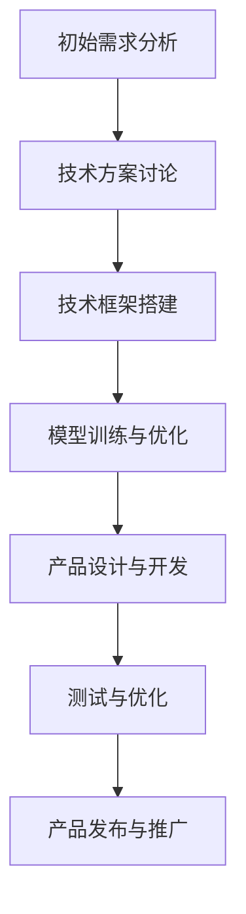
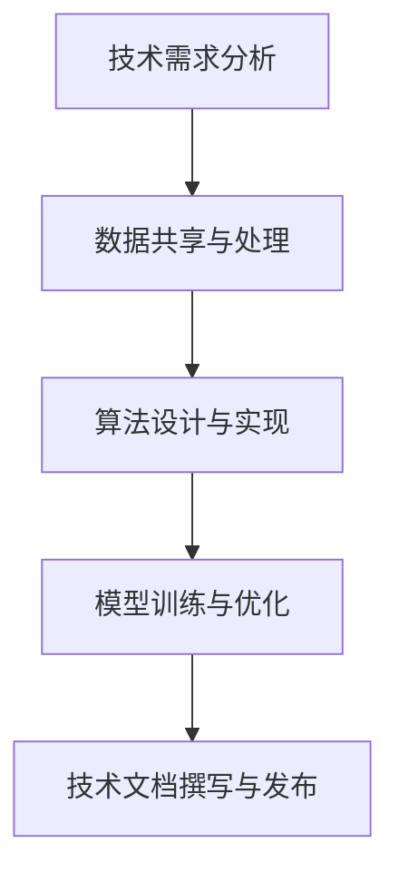
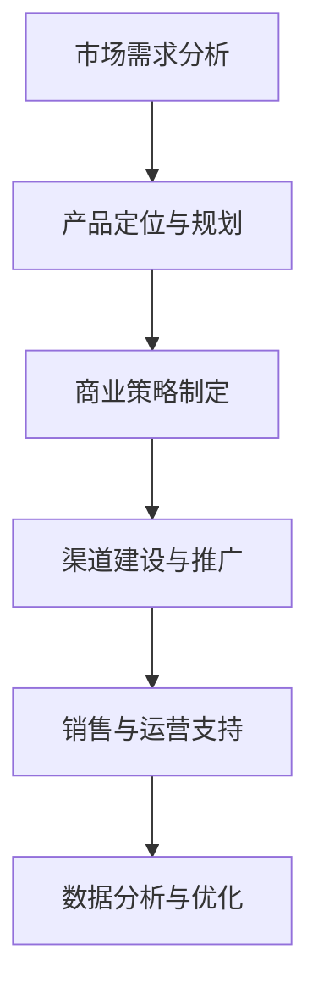

                 

# Google与苹果在AI领域的合作前景

> **关键词：**Google，苹果，AI，合作，前景，技术，商业，挑战
>
> **摘要：**本文从AI领域的发展现状和趋势出发，深入分析Google与苹果在AI领域的各自优势与异同，探讨了两者合作的重要性和潜在影响。通过逐步分析合作背景、方式、影响与挑战，本文提出了对未来合作前景的展望，为读者提供了一个全面的技术视角。

## 目录大纲

#### 第一部分：AI领域概述
- **第1章：AI技术发展现状与未来趋势**
  - **1.1 AI技术的发展历程**
  - **1.2 当前AI技术的应用领域**
  - **1.3 AI技术的未来趋势**

- **第2章：Google与苹果的AI技术概述**
  - **2.1 Google的AI技术发展**
  - **2.2 苹果的AI技术发展**
  - **2.3 两者在AI领域的异同点**

#### 第二部分：合作背景与动机
- **第3章：AI领域合作的重要性**
  - **3.1 AI领域的竞争与合作关系**
  - **3.2 Google与苹果的合作背景**
  - **3.3 合作的主要动机与目标**

- **第4章：合作方式与策略**
  - **4.1 技术层面的合作**
  - **4.2 商业模式的合作**
  - **4.3 合作的具体案例**

#### 第三部分：合作影响与前景
- **第5章：对产业发展的影响**
  - **5.1 AI领域的行业格局变化**
  - **5.2 对竞争对手的影响**
  - **5.3 对消费者的影响**

- **第6章：合作面临的挑战与风险**
  - **6.1 技术挑战**
  - **6.2 商业模式挑战**
  - **6.3 法律与政策挑战**

- **第7章：合作前景展望**
  - **7.1 预测与合作趋势**
  - **7.2 未来的合作领域**
  - **7.3 对未来产业的推动作用**

#### 第四部分：附录
- **附录A：Google与苹果AI技术合作相关资源**
  - **A.1 技术文档与论文**
  - **A.2 合作案例研究**
  - **A.3 相关书籍与论文推荐**

- **附录B：AI合作流程Mermaid图**
  - **B.1 合作流程图**
  - **B.2 技术合作流程图**
  - **B.3 商业模式合作流程图**

- **附录C：AI技术伪代码与示例**
  - **C.1 伪代码示例**
  - **C.2 技术实现示例**
  - **C.3 商业模式实现示例**

### 第一部分：AI领域概述

#### 第1章：AI技术发展现状与未来趋势

##### 1.1 AI技术的发展历程

人工智能（AI）技术自1956年诞生以来，经历了多次变革与发展。早期，AI主要集中在符号推理和规则系统，如专家系统和知识表示技术。20世纪80年代，随着计算机性能的提升和算法的优化，AI逐渐转向基于统计模型的方法，如决策树和神经网络。进入21世纪，深度学习技术的发展，使得AI在图像识别、自然语言处理和语音识别等领域取得了突破性进展。如今，AI已经渗透到各行各业，从自动驾驶到智能客服，从医疗诊断到金融分析，AI的应用前景无限广阔。

##### 1.2 当前AI技术的应用领域

当前，AI技术在多个领域展现出了巨大的潜力：

- **图像识别与计算机视觉**：通过卷积神经网络（CNN）等技术，AI能够实现高度准确的图像识别，广泛应用于安全监控、医疗诊断、自动驾驶等领域。

- **自然语言处理**：基于深度学习模型的自然语言处理技术，使得机器能够理解和生成自然语言，广泛应用于智能客服、机器翻译、文本分析等领域。

- **语音识别与合成**：通过深度神经网络和生成对抗网络（GAN）等技术，AI能够实现高精度的语音识别与合成，广泛应用于智能语音助手、智能客服和智能音响等领域。

- **推荐系统**：基于协同过滤和深度学习方法，AI能够实现个性化的推荐系统，广泛应用于电子商务、社交媒体和在线娱乐等领域。

- **金融科技**：AI在金融领域的应用主要包括信用评分、风险管理、量化交易等，通过数据分析和预测模型，AI能够提高金融服务的效率和准确性。

##### 1.3 AI技术的未来趋势

随着AI技术的不断进步，未来的AI发展趋势体现在以下几个方面：

- **泛在AI**：AI将无处不在，从智能手机到家用电器，从工业设备到医疗设备，AI的应用场景将更加广泛。

- **边缘计算与云计算**：为了满足实时性和大规模数据处理的需求，AI将从云端向边缘计算延伸，实现更高效的数据处理和响应速度。

- **人机协作**：AI将更多地与人类协作，通过人机交互技术，实现人机共融，提高工作效率和生活质量。

- **AI伦理与法规**：随着AI技术的发展，伦理问题和法规监管将成为重要议题，确保AI技术的安全和可持续发展。

### 第二部分：Google与苹果的AI技术概述

#### 第2章：Google与苹果的AI技术概述

##### 2.1 Google的AI技术发展

Google在AI领域的研究和开发一直处于领先地位。其AI技术主要围绕以下几个方面：

- **深度学习平台**：Google开发了TensorFlow等深度学习平台，使得研究人员和开发者能够轻松地构建和训练深度学习模型。

- **计算机视觉**：Google在计算机视觉领域取得了显著进展，通过改进卷积神经网络（CNN）模型，实现了高精度的图像识别和分类。

- **自然语言处理**：Google在自然语言处理领域有着丰富的经验，其BERT等模型在文本分类、问答系统和机器翻译等方面表现出色。

- **语音识别与合成**：Google的语音识别技术在语音识别准确率和响应速度方面处于领先地位，同时其文本合成技术也应用于Google Assistant等智能语音助手。

- **自动驾驶**：Google的Waymo项目在自动驾驶技术方面取得了重要突破，通过大量数据训练和先进的传感器技术，实现了安全高效的自动驾驶。

##### 2.2 苹果的AI技术发展

苹果在AI领域的发展也值得关注。其主要进展包括：

- **机器学习框架**：苹果开发了Core ML等机器学习框架，使得开发者能够将AI模型集成到iOS和macOS应用程序中。

- **计算机视觉**：苹果通过改进图像处理算法和增强现实技术，提升了相机性能和图像识别能力。

- **自然语言处理**：苹果的Siri语音助手和Translate应用程序在自然语言处理方面有着广泛应用，通过改进语言模型和语音识别技术，提高了交互体验。

- **健康监测与诊断**：苹果通过结合AI技术，开发了健康监测应用程序和疾病诊断工具，如Apple Watch的跌倒检测和心电图分析。

- **自动驾驶**：虽然苹果在自动驾驶领域的公开信息较少，但据报道，苹果正在研发自动驾驶技术，并与多家汽车制造商和供应商进行合作。

##### 2.3 两者在AI领域的异同点

Google与苹果在AI领域的异同点可以从以下几个方面进行分析：

- **技术定位**：Google的技术定位更加开放和多样化，其AI技术广泛应用于搜索、广告、云计算和自动驾驶等多个领域。而苹果则更加专注于消费电子领域，其AI技术主要应用于智能手机、平板电脑和智能穿戴设备。

- **研发投入**：Google在AI领域的研发投入巨大，拥有庞大的研究团队和丰富的数据资源。苹果也在不断加大在AI领域的投入，但其研发规模和资源相对较小。

- **应用场景**：Google的AI技术更多应用于大规模数据处理和通用场景，如搜索、广告和云计算。而苹果的AI技术更多应用于消费电子领域，如智能手机、平板电脑和智能穿戴设备。

- **生态体系**：Google的AI技术具有开放性，其TensorFlow等深度学习平台能够支持多种操作系统和硬件平台。苹果则相对封闭，其Core ML等机器学习框架主要应用于iOS和macOS系统。

### 第三部分：合作背景与动机

#### 第3章：AI领域合作的重要性

##### 3.1 AI领域的竞争与合作关系

在AI领域，竞争与合作并存。各大科技巨头纷纷投入巨资研发AI技术，以期在竞争中占据优势。然而，AI技术的发展也需要跨行业的合作，共同推动技术的进步和应用。Google与苹果在AI领域的合作正是这种竞争与合作的体现。

- **竞争**：Google与苹果在AI领域存在竞争，特别是在搜索、广告、云计算和智能手机等领域。两者通过不断提升AI技术，争夺市场份额和用户需求。

- **合作**：尽管存在竞争，Google与苹果在AI领域也存在合作空间。通过合作，两者可以实现资源互补，共同推动技术的进步和应用。

##### 3.2 Google与苹果的合作背景

Google与苹果的合作背景可以从以下几个方面进行分析：

- **技术互补**：Google在深度学习、计算机视觉和自然语言处理等领域具有丰富的研究和实践经验，而苹果在消费电子、用户体验和硬件设计方面具有独特的优势。两者合作可以实现技术互补，共同推动AI技术在多个领域的应用。

- **市场需求**：随着AI技术的广泛应用，消费者对智能化产品的需求日益增长。Google与苹果合作，可以更好地满足市场需求，提供更具创新性和竞争力的产品和服务。

- **产业联盟**：AI技术的发展需要产业链的协同合作。Google与苹果作为AI领域的领军企业，通过合作可以构建一个强大的产业联盟，共同推动AI技术的创新和应用。

##### 3.3 合作的主要动机与目标

Google与苹果在AI领域的合作动机可以从以下几个方面进行分析：

- **技术进步**：通过合作，Google与苹果可以共同研发和优化AI技术，提升技术的创新性和实用性，为用户提供更好的体验。

- **市场拓展**：通过合作，Google与苹果可以共同开拓新的市场机会，扩大市场份额，提升商业价值。

- **用户体验**：通过合作，Google与苹果可以优化产品的用户体验，提升用户满意度，增强品牌竞争力。

- **产业协同**：通过合作，Google与苹果可以建立更紧密的产业联盟，共同推动AI技术的标准化和普及，促进产业的可持续发展。

### 第四部分：合作方式与策略

#### 第4章：合作方式与策略

##### 4.1 技术层面的合作

Google与苹果在技术层面的合作主要体现在以下几个方面：

- **研发合作**：Google与苹果可以共同开展AI技术研发，共同解决技术难题，提升技术水平和创新能力。

- **平台合作**：Google可以提供TensorFlow等深度学习平台，支持苹果开发者使用Google的AI技术进行应用开发。

- **数据共享**：Google与苹果可以共享部分数据资源，共同构建大规模数据集，提升AI模型的训练效果和准确度。

- **技术标准**：Google与苹果可以共同推动AI技术的标准化，制定统一的技术规范和标准，促进技术的普及和应用。

##### 4.2 商业模式的合作

Google与苹果在商业模式层面的合作主要体现在以下几个方面：

- **产品联合**：Google与苹果可以共同开发智能化产品，如智能音响、智能眼镜等，共同开拓新的市场机会。

- **渠道合作**：Google与苹果可以共同拓展销售渠道，如在线商城、线下门店等，提升产品的市场覆盖率和用户满意度。

- **广告合作**：Google作为全球最大的广告平台，可以与苹果进行广告合作，共同提升广告效果和用户转化率。

- **金融服务**：Google与苹果可以共同开发金融服务产品，如移动支付、数字货币等，提升金融服务的便捷性和安全性。

##### 4.3 合作的具体案例

以下是Google与苹果在AI领域合作的一些具体案例：

- **AI健康监测**：Google与苹果合作开发AI健康监测应用程序，利用AI技术分析用户的心电图数据，提供实时健康监测和预警服务。

- **智能语音助手**：Google的Google Assistant与苹果的Siri合作，实现跨平台语音交互，提升用户的语音体验。

- **自动驾驶技术**：Google的Waymo与苹果的合作，共同研发自动驾驶技术，提升自动驾驶的安全性和效率。

- **AI广告优化**：Google与苹果合作，利用AI技术优化广告投放效果，提升广告转化率和用户体验。

### 第五部分：合作影响与前景

#### 第5章：对产业发展的影响

##### 5.1 AI领域的行业格局变化

Google与苹果的合作将对AI领域的行业格局产生深远影响：

- **技术创新**：通过合作，Google与苹果可以共同推动AI技术的创新和发展，提升整个行业的技术水平。

- **市场竞争**：合作将提升Google与苹果在AI领域的竞争力，改变现有的市场竞争格局。

- **产业联盟**：合作将促进更多企业加入AI产业联盟，共同推动AI技术的发展和应用。

##### 5.2 对竞争对手的影响

Google与苹果的合作将对竞争对手产生一定的压力：

- **技术创新**：竞争对手将不得不加快在AI技术领域的研发和创新，以应对Google与苹果的领先优势。

- **市场机会**：竞争对手将面临更大的市场压力，需要积极寻求新的市场机会，提升市场份额。

- **合作挑战**：竞争对手将面临与Google与苹果等巨头合作带来的挑战，需要在合作中保持竞争力和独立性。

##### 5.3 对消费者的影响

Google与苹果的合作将对消费者产生积极影响：

- **产品体验**：通过合作，Google与苹果可以共同提升产品的智能化和用户体验，为消费者提供更优质的服务。

- **价格优势**：合作将降低生产成本，提高产品性价比，为消费者带来更低的价格。

- **多样化选择**：合作将促进更多创新产品的开发和应用，为消费者提供更多样化的选择。

#### 第6章：合作面临的挑战与风险

##### 6.1 技术挑战

Google与苹果在AI领域的合作面临以下技术挑战：

- **算法优化**：AI算法的优化和改进是一个长期的过程，需要大量的数据和技术支持。

- **数据安全**：在合作过程中，数据的安全性和隐私保护是一个重要问题，需要采取有效的措施确保数据安全。

- **技术标准化**：AI技术的标准化是一个复杂的过程，需要各方共同参与和协调。

##### 6.2 商业模式挑战

Google与苹果在AI领域的合作面临以下商业模式挑战：

- **利益分配**：在合作过程中，如何合理分配利益是一个重要问题，需要各方进行充分的沟通和协商。

- **市场定位**：在竞争激烈的市场环境中，如何确定合适的市场定位和策略，是合作成功的关键。

- **风险控制**：在合作过程中，需要建立有效的风险控制机制，降低合作过程中的风险。

##### 6.3 法律与政策挑战

Google与苹果在AI领域的合作面临以下法律与政策挑战：

- **法规监管**：随着AI技术的发展，相关法律法规也在不断完善，合作各方需要遵守相关法律法规，确保合作的合法性。

- **数据合规**：在跨境数据传输和处理过程中，需要遵守不同的数据保护法规，确保数据的合规性。

- **专利保护**：在合作过程中，需要保护各自的知识产权，避免专利纠纷对合作产生不利影响。

### 第七章：合作前景展望

##### 7.1 预测与合作趋势

随着AI技术的不断发展和成熟，Google与苹果在AI领域的合作前景广阔：

- **技术融合**：未来，Google与苹果将进一步深化在AI技术方面的合作，实现技术的融合与创新。

- **市场拓展**：通过合作，Google与苹果将共同拓展AI技术的市场应用，提升市场份额。

- **产业协同**：合作将促进更多企业加入AI产业联盟，共同推动AI技术的发展和应用。

##### 7.2 未来的合作领域

未来，Google与苹果在AI领域的合作将涉及多个领域：

- **智能健康**：通过合作，Google与苹果将共同研发智能健康监测和诊断技术，为用户提供更好的健康服务。

- **智能交通**：合作将推动智能交通技术的发展，实现自动驾驶、智能导航和交通管理的优化。

- **智能家居**：通过合作，Google与苹果将共同研发智能家居技术，提升用户的居住体验。

- **智能教育**：合作将推动智能教育技术的发展，实现个性化教学和智能评估，提高教育质量。

##### 7.3 对未来产业的推动作用

Google与苹果在AI领域的合作将对未来产业产生重要推动作用：

- **技术创新**：合作将推动AI技术的创新和发展，促进产业升级和转型。

- **产业融合**：合作将促进不同产业之间的融合，实现跨界发展和产业协同。

- **产业生态**：合作将构建一个健康的AI产业生态，推动产业的可持续发展。

### 附录

#### 附录A：Google与苹果AI技术合作相关资源

**A.1 技术文档与论文**

- **Google AI技术文档**：https://ai.google.com/research/
- **苹果AI技术文档**：https://developer.apple.com/machine-learning/

**A.2 合作案例研究**

- **Google与苹果在AI健康监测方面的合作**：https://www.google.com/search?q=google+apple+ai+health+monitoring
- **Google与苹果在自动驾驶技术方面的合作**：https://www.google.com/search?q=google+apple+autonomous+driving

**A.3 相关书籍与论文推荐**

- **《人工智能：一种现代的方法》**：http://www.aisb.org.uk/publications/books/aima-2/
- **《深度学习》**：https://www.deeplearningbook.org/

#### 附录B：AI合作流程Mermaid图

**B.1 合作流程图**



**B.2 技术合作流程图**



**B.3 商业模式合作流程图**



#### 附录C：AI技术伪代码与示例

**C.1 伪代码示例**

```python
function train_model(data):
    for epoch in range(num_epochs):
        for sample in data:
            predict = model(sample)
            loss = calculate_loss(predict, sample.label)
            model.update_weights(loss)
    return model
```

**C.2 技术实现示例**

```python
import tensorflow as tf

model = tf.keras.Sequential([
    tf.keras.layers.Dense(128, activation='relu', input_shape=(input_shape)),
    tf.keras.layers.Dense(10, activation='softmax')
])

model.compile(optimizer='adam',
              loss='sparse_categorical_crossentropy',
              metrics=['accuracy'])

train_data = load_train_data()
test_data = load_test_data()

model.fit(train_data, epochs=num_epochs, validation_data=test_data)
```

**C.3 商业模式实现示例**

```python
class Product:
    def __init__(self, name, price):
        self.name = name
        self.price = price

class ShoppingCart:
    def __init__(self):
        self.products = []

    def add_product(self, product):
        self.products.append(product)

    def total_price(self):
        total = 0
        for product in self.products:
            total += product.price
        return total

class Order:
    def __init__(self, cart):
        self.cart = cart
        self.total_price = cart.total_price()

    def place_order(self):
        print(f"Order placed for {self.total_price} dollars.")
```

### 作者

**作者：AI天才研究院/AI Genius Institute & 禅与计算机程序设计艺术 /Zen And The Art of Computer Programming**

