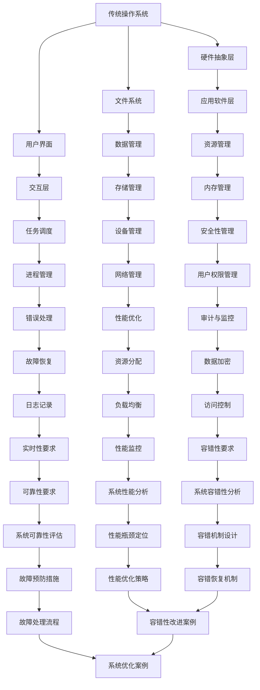
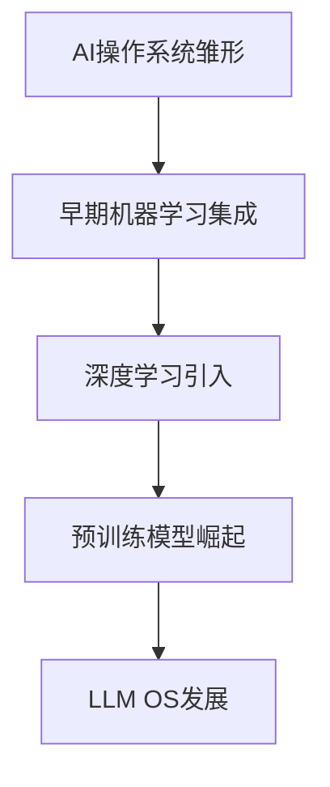
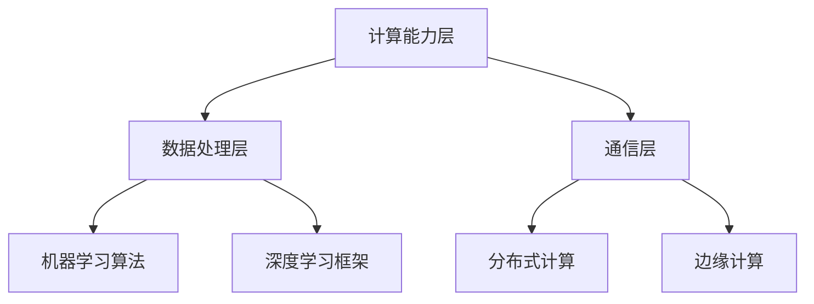
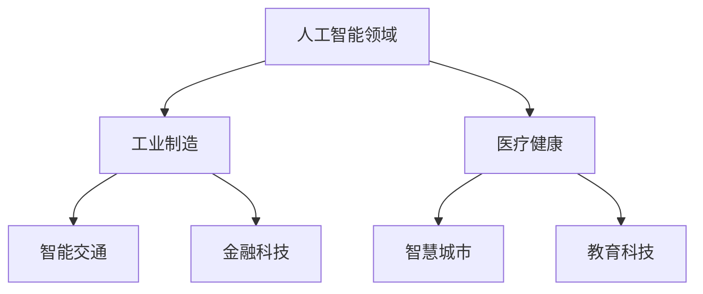
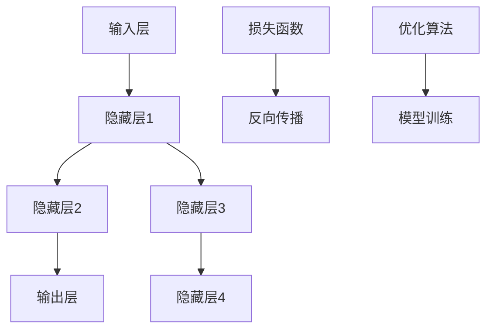
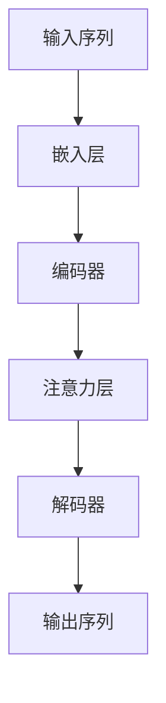
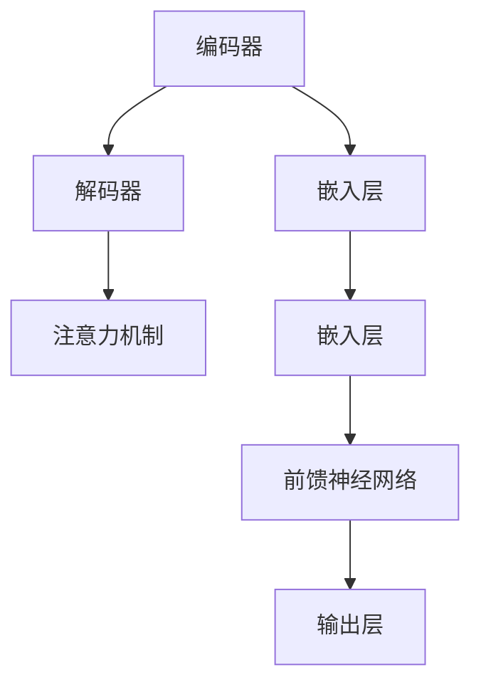
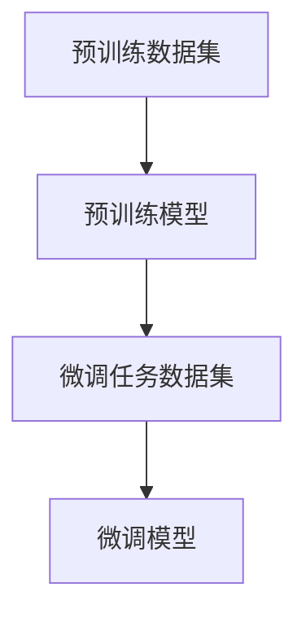
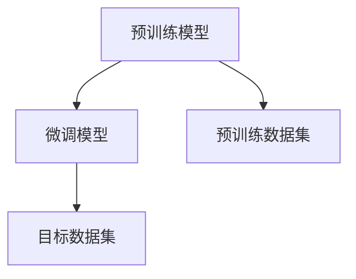

                 

# 《LLM OS: AI操作系统的未来愿景》

关键词：AI操作系统，深度学习，自然语言处理，预训练模型，开发实践，发展趋势，挑战与机遇

摘要：
随着人工智能技术的飞速发展，AI操作系统（LLM OS）逐渐成为新一代计算平台的核心。本文从AI操作系统的定义、技术基础、开发实践、发展趋势与挑战等方面，深入探讨了AI操作系统的未来愿景，旨在为读者提供一幅全面、清晰的AI操作系统发展蓝图。

----------------------------------------------------------------

### 第一部分：AI操作系统概述

#### 第1章：AI操作系统的概念与演变

##### 1.1 AI操作系统的定义与特点

##### 1.1.1 AI操作系统与传统操作系统比较

**Mermaid 流程图：**



**详细讲解：**

传统操作系统主要职责是硬件资源管理、进程调度、内存管理、文件系统、用户接口等。这些操作系统通常是为了提供稳定的计算机环境而设计的，主要服务于传统的应用程序。

AI操作系统则是在传统操作系统的基础上，集成了先进的机器学习、深度学习等人工智能技术。它不仅具备传统操作系统的基本功能，还能够通过智能算法来优化资源分配、故障恢复、安全防护等。

##### 1.1.2 AI操作系统的发展历程

**Mermaid 流程图：**



**详细讲解：**

AI操作系统的发展可以分为几个阶段：

1. **AI操作系统雏形**：早期AI操作系统主要将机器学习算法集成到操作系统中，用于提高性能和优化资源分配。

2. **早期机器学习集成**：随着机器学习技术的发展，AI操作系统开始更加紧密地集成机器学习模型，从而实现更加智能的调度和管理。

3. **深度学习引入**：深度学习的引入使得AI操作系统在数据处理和智能决策方面得到了显著提升。

4. **预训练模型崛起**：预训练模型的广泛应用使得AI操作系统能够更好地处理复杂任务，实现更加智能化和自动化。

5. **LLM OS发展**：当前，基于大规模语言模型的AI操作系统（LLM OS）已经成为新一代计算平台的核心，标志着AI操作系统进入了一个全新的阶段。

##### 1.2 AI操作系统的核心组件

**Mermaid 流程图：**



**详细讲解：**

AI操作系统的核心组件可以分为三个层次：

1. **计算能力层**：负责提供强大的计算能力，包括CPU、GPU、TPU等硬件资源。

2. **数据处理层**：这一层集成了机器学习算法和深度学习框架，用于处理和分析数据。

3. **通信层**：负责实现系统内部和外部的通信，包括分布式计算和边缘计算等。

##### 1.3 AI操作系统的应用领域

**Mermaid 流程图：**



**详细讲解：**

AI操作系统在多个领域都展现出了强大的应用潜力：

1. **人工智能领域**：AI操作系统可以用于训练和部署大规模机器学习模型，提升人工智能算法的性能。

2. **工业制造**：AI操作系统可以帮助实现智能制造，优化生产流程，提高生产效率。

3. **医疗健康**：AI操作系统可以用于医疗图像分析、疾病预测等，为医疗行业提供智能化支持。

4. **智能交通**：AI操作系统可以用于智能交通管理，优化交通流量，提高道路通行效率。

5. **金融科技**：AI操作系统可以用于智能风险管理、交易预测等，为金融行业提供决策支持。

6. **智慧城市**：AI操作系统可以用于智慧城市的管理和运营，提升城市服务质量。

7. **教育科技**：AI操作系统可以用于智能教育，个性化学习，提高教育质量。

---

**例子说明：** 在智能交通领域，AI操作系统可以通过实时交通数据分析，预测交通流量，优化信号灯控制，从而减少拥堵和交通事故。在金融科技领域，AI操作系统可以用于交易预测，风险控制，提高金融交易效率。

### 第二部分：AI操作系统的技术基础

#### 第2章：AI操作系统的技术基础

##### 2.1 机器学习和深度学习基础

##### 2.1.1 机器学习的基本概念

**伪代码示例：**

```python
def linear_regression(x, y):
    # 计算x和y的均值
    x_mean = np.mean(x)
    y_mean = np.mean(y)

    # 计算x和y的协方差
    cov = np.dot(x - x_mean, y - y_mean)

    # 计算x的方差
    var_x = np.dot(x - x_mean, x - x_mean)

    # 计算回归系数
    beta = cov / var_x

    # 计算截距
    alpha = y_mean - beta * x_mean

    # 返回回归模型
    return alpha, beta
```

**详细讲解：**

线性回归是机器学习中的一种基本算法，用于预测一个连续值变量。它假设自变量和因变量之间存在线性关系，并通过最小二乘法来估计模型的参数。

在伪代码中，`x`和`y`分别是自变量和因变量的数据集。我们首先计算它们的均值，然后计算协方差和自变量的方差。通过协方差和方差的比值，我们可以得到回归系数`beta`。最后，通过截距`alpha`和回归系数`beta`，我们可以构建出线性回归模型。

##### 2.1.2 深度学习架构

**Mermaid 流程图：**



**详细讲解：**

深度学习是一种基于多层神经网络的机器学习技术。它通过多次层叠神经网络来提取数据中的特征，从而实现复杂任务的预测。

在深度学习架构中，输入层接收原始数据，通过隐藏层进行特征提取，最终在输出层生成预测结果。在训练过程中，我们使用损失函数（如均方误差）来评估模型的预测误差，并通过反向传播算法更新模型的参数。优化算法（如梯度下降）用于调整模型的参数，以最小化损失函数。

##### 2.1.3 深度学习优化算法

**伪代码示例：**

```python
def gradient_descent(alpha, beta, x, y, learning_rate):
    # 计算损失函数的导数
    loss_gradient_alpha = -2 * np.sum(y - (alpha + beta * x))
    loss_gradient_beta = -2 * np.sum((y - (alpha + beta * x)) * x)

    # 更新模型参数
    alpha = alpha - learning_rate * loss_gradient_alpha
    beta = beta - learning_rate * loss_gradient_beta

    # 返回更新后的模型参数
    return alpha, beta
```

**详细讲解：**

梯度下降是深度学习中最常用的优化算法之一。它通过不断更新模型的参数，使得损失函数的值逐渐减小。

在伪代码中，`alpha`和`beta`是模型的参数，`x`和`y`是训练数据。我们首先计算损失函数的导数（即梯度），然后使用学习率乘以梯度来更新模型的参数。这个过程不断重复，直到损失函数的值接近最小值。

---

**例子说明：** 在图像分类任务中，深度学习可以通过多层神经网络提取图像的复杂特征，从而实现高精度的分类。在自然语言处理任务中，深度学习可以用于文本生成、情感分析等。

##### 2.2 自然语言处理技术

##### 2.2.1 词嵌入技术

**伪代码示例：**

```python
def word_embedding(words, embedding_size):
    # 创建词嵌入矩阵
    embedding_matrix = np.random.rand(len(words), embedding_size)

    # 将词转换为索引
    word_indices = [words.index(word) for word in words]

    # 将词索引映射到词嵌入矩阵
    embedded_words = embedding_matrix[word_indices]

    # 返回词嵌入矩阵
    return embedded_words
```

**详细讲解：**

词嵌入技术是将词汇映射到低维度的向量表示，从而实现文本数据的向量化。在词嵌入技术中，每个词被映射为一个固定大小的向量，这些向量可以在机器学习模型中进行处理。

在伪代码中，`words`是词汇列表，`embedding_size`是词嵌入向量的大小。我们首先创建一个随机的词嵌入矩阵，然后将每个词转换为索引，并映射到词嵌入矩阵中。最后，我们返回词嵌入矩阵。

##### 2.2.2 序列模型与注意力机制

**Mermaid 流程图：**



**详细讲解：**

序列模型是处理序列数据的常用模型，如循环神经网络（RNN）和长短期记忆网络（LSTM）。注意力机制是一种在序列模型中增强模型对关键信息关注的机制，它通过加权处理序列中的不同元素，从而提高模型的预测性能。

在序列模型与注意力机制的架构中，输入序列首先经过嵌入层转换为嵌入向量，然后通过编码器进行特征提取。编码器的输出会传递给注意力层，注意力层根据输入序列的关键信息生成注意力权重。解码器使用这些注意力权重来生成输出序列。

##### 2.2.3 转换器架构详解

**Mermaid 流程图：**



**详细讲解：**

转换器（Transformer）架构是当前自然语言处理领域最流行的模型之一。它通过自注意力机制来处理序列数据，从而实现高效的特征提取和生成。

在转换器架构中，编码器负责接收输入序列，并将其编码为固定大小的向量。解码器则使用这些编码向量来生成输出序列。嵌入层将词汇映射为嵌入向量，前馈神经网络用于进一步处理嵌入向量。输出层生成最终的输出结果。

---

**例子说明：** 在机器翻译任务中，转换器架构可以同时处理源语言和目标语言的序列，从而实现高精度的翻译。在文本生成任务中，转换器架构可以生成高质量的文本。

##### 2.3 大规模预训练模型原理

##### 2.3.1 预训练的概念与意义

**Mermaid 流程图：**



**详细讲解：**

预训练是一种在大型数据集上训练通用模型的方法，然后使用少量特定领域的数据进行微调，以适应具体任务。预训练的意义在于：

1. **提高模型性能**：预训练模型在大规模数据集上学习到的通用特征有助于提高特定任务的性能。
2. **减少训练时间**：预训练模型已经学习到大部分通用特征，因此在微调时需要学习的特征较少，从而减少了训练时间。
3. **降低数据需求**：预训练模型可以降低特定领域的数据需求，从而降低数据收集和处理的成本。

在流程图中，预训练数据集用于训练预训练模型，预训练模型在微调任务数据集上微调，以生成特定任务的微调模型。

##### 2.3.2 自监督学习方法

**伪代码示例：**

```python
def masked_language_model(embeddings, mask_ratio=0.15):
    # 随机选择mask_ratio比例的词进行遮蔽
    mask_indices = np.random.choice(len(embeddings), int(len(embeddings) * mask_ratio), replace=False)
    masked_embeddings = embeddings.copy()
    masked_embeddings[mask_indices] = 0

    # 使用预训练模型进行预测
    predictions = pretrain_model.predict(masked_embeddings)

    # 返回遮蔽后的嵌入向量和预测结果
    return masked_embeddings, predictions
```

**详细讲解：**

自监督学习方法是一种利用未标记数据来训练模型的方法。在自然语言处理任务中，自监督学习方法常用于预训练模型。

在伪代码中，`embeddings`是词汇的嵌入向量，`mask_ratio`是遮蔽的比例。我们首先随机选择`mask_ratio`比例的词进行遮蔽，然后使用预训练模型对遮蔽后的嵌入向量进行预测。这种方法可以使得模型在预训练阶段就学习到词汇的语义信息。

##### 2.3.3 迁移学习与微调技术

**Mermaid 流程图：**



**详细讲解：**

迁移学习是一种利用预训练模型在特定任务上的知识来训练新模型的方法。在迁移学习中，预训练模型在大规模通用数据集上训练，然后在新任务上进行微调。

在流程图中，预训练模型在预训练数据集上训练，然后在目标数据集上进行微调。微调过程中，模型的参数会根据新任务进行调整，从而生成适应新任务的微调模型。

---

**例子说明：** 在图像识别任务中，预训练模型可以在多个数据集上训练，然后在新图像数据集上进行微调，从而实现高精度的图像识别。在自然语言处理任务中，预训练模型可以在多个语言数据集上训练，然后在新语言数据集上进行微调，从而实现跨语言的文本生成和翻译。

---

通过上述内容，我们详细介绍了AI操作系统的核心概念、技术基础，包括机器学习和深度学习的基础、自然语言处理技术，以及大规模预训练模型的原理。在接下来的章节中，我们将进一步探讨AI操作系统的开发实践、发展趋势与挑战，以期为读者提供一个全面的AI操作系统发展蓝图。

---

### 第三部分：AI操作系统开发实践

#### 第3章：AI操作系统开发流程

##### 3.1 AI操作系统架构设计

**3.1.1 系统架构设计原则**

在AI操作系统开发中，架构设计是至关重要的一环。合理的架构设计不仅能够提高系统的可扩展性、可靠性和安全性，还能降低开发成本和维护难度。以下是一些系统架构设计的原则：

1. **模块化设计**：将系统划分为多个功能模块，每个模块独立实现特定功能，降低模块间的耦合度，提高系统的可维护性和可扩展性。

2. **高内聚、低耦合**：模块内部保持高内聚，即模块内部的功能紧密相关；模块间保持低耦合，即模块间相互独立，易于替换和扩展。

3. **可扩展性**：设计时考虑系统的可扩展性，包括功能扩展和性能扩展。系统应能够方便地添加新功能或组件，以适应不断变化的需求。

4. **可靠性**：确保系统在各种情况下都能稳定运行，包括对异常情况的容错处理和故障恢复机制。

5. **安全性**：设计安全机制，防止非法访问和数据泄露，确保系统的数据安全和用户隐私。

6. **高效性**：优化系统性能，包括算法优化、资源管理和负载均衡，以提高系统的响应速度和处理效率。

**伪代码示例：**

```python
def system_architecture_design原则():
    principles = [
        "模块化设计，降低系统耦合度",
        "高内聚，低耦合，提高系统可维护性",
        "可扩展性，易于添加新功能或组件",
        "可靠性，确保系统稳定运行",
        "安全性，防止非法访问和数据泄露",
        "高效性，优化资源使用和性能"
    ]

    for principle in principles:
        print(principle)
```

**3.1.2 系统架构设计工具**

在进行系统架构设计时，常用的工具包括UML类图、Mermaid流程图和架构设计文档。这些工具可以帮助开发者清晰地描述系统的架构，并方便团队成员之间的沟通和协作。

1. **UML类图**：UML（统一建模语言）类图是一种常用的系统建模工具，它能够直观地展示系统的类、属性和方法，以及类之间的关系。

2. **Mermaid流程图**：Mermaid是一种基于Markdown的图形化工具，可以方便地创建流程图、状态图和时序图等。它适用于描述系统的流程和交互关系。

3. **架构设计文档**：架构设计文档是系统架构的详细描述，包括系统模块、接口、数据流和组件之间的关系等。文档应以清晰、简洁、易懂的方式展示系统的架构设计。

**3.2 AI操作系统核心功能实现**

**3.2.1 计算能力层实现**

计算能力层是AI操作系统的核心组成部分，负责提供高效的计算资源。实现计算能力层需要考虑以下几个方面：

1. **硬件资源选择**：根据系统的需求选择合适的硬件资源，如CPU、GPU、TPU等。对于大规模并行计算任务，GPU和TPU具有显著的优势。

2. **计算资源调度**：设计资源调度算法，合理分配计算资源，确保任务的执行效率。常用的调度算法包括负载均衡、优先级调度和循环调度等。

3. **分布式计算**：对于大型任务，可以使用分布式计算技术将任务分解为多个子任务，在多个计算节点上并行执行。分布式计算可以提高计算速度和系统吞吐量。

**伪代码示例：**

```python
def distributed_computation(task, num_nodes):
    # 将任务分解为多个子任务
    sub_tasks = split_task(task, num_nodes)

    # 在多个节点上并行执行子任务
    results = parallel_execution(sub_tasks)

    # 合并子任务的结果
    final_result = merge_results(results)

    return final_result
```

**3.2.2 数据处理层实现**

数据处理层负责处理和存储AI操作系统中的数据。实现数据处理层需要考虑以下几个方面：

1. **数据存储方案**：选择合适的数据库或存储方案，如关系数据库、NoSQL数据库或分布式文件系统。根据数据的特点和需求选择最佳方案。

2. **数据处理算法**：设计高效的数据处理算法，如数据清洗、数据归一化和特征提取等。这些算法对于AI操作系统的性能和准确性至关重要。

3. **数据流管理**：设计数据流管理模块，负责数据的输入、输出和传输。数据流管理应支持实时数据处理和离线数据处理，以满足不同应用场景的需求。

**3.2.3 通信层实现**

通信层负责AI操作系统内部以及与外部系统的通信。实现通信层需要考虑以下几个方面：

1. **通信协议**：选择合适的通信协议，如HTTP、RESTful API、WebSockets等。通信协议应支持高效的数据传输和低延迟。

2. **网络拓扑**：设计网络拓扑结构，包括局域网、广域网和互联网。网络拓扑应支持分布式计算和边缘计算，以提供更好的性能和可靠性。

3. **安全性**：设计安全机制，如数据加密、访问控制和身份认证等，确保数据的安全传输和存储。

**3.3 AI操作系统部署与优化**

**3.3.1 部署环境搭建**

在AI操作系统部署过程中，需要搭建一个稳定、高效的部署环境。部署环境包括硬件设备、操作系统、中间件和数据库等。以下是一些关键步骤：

1. **硬件设备选择**：根据系统的需求选择合适的硬件设备，如服务器、存储设备和网络设备等。

2. **操作系统安装**：安装适合AI操作系统运行的操作系统，如Linux或Windows。

3. **中间件安装**：安装必要的中间件，如Web服务器、消息队列和数据库等。

4. **数据库安装**：安装数据库系统，如MySQL、MongoDB或Redis等，用于数据存储和管理。

**3.3.2 部署流程与策略**

部署流程包括以下步骤：

1. **环境准备**：准备部署环境，包括硬件设备、操作系统和中间件等。

2. **系统安装**：安装AI操作系统，包括操作系统、中间件和数据库等。

3. **配置调整**：调整系统配置，如网络设置、内存分配和磁盘分区等，以优化系统性能。

4. **软件部署**：部署AI操作系统中的软件组件，如应用程序、库和框架等。

5. **测试与调试**：对部署的系统进行测试和调试，确保系统正常运行。

**3.3.3 系统优化方法**

系统优化是提高AI操作系统性能和稳定性的关键步骤。以下是一些常用的优化方法：

1. **性能调优**：通过调整系统参数、优化算法和改进数据结构等手段，提高系统的处理速度和响应时间。

2. **资源优化**：合理分配和利用系统资源，如CPU、内存和磁盘等，以提高系统吞吐量和效率。

3. **稳定性优化**：通过故障检测、容错和恢复机制等手段，提高系统的稳定性和可靠性。

4. **安全性优化**：设计安全机制，如数据加密、访问控制和身份认证等，确保系统的数据安全和用户隐私。

---

通过上述内容，我们详细介绍了AI操作系统的开发流程，包括架构设计、核心功能实现、部署与优化等方面的内容。在接下来的章节中，我们将通过具体案例来展示AI操作系统在实际项目中的应用，进一步探讨AI操作系统的开发实践。

---

### 第四部分：AI操作系统案例分析

#### 第4章：AI操作系统在各个领域的应用

##### 4.1 案例一：AI操作系统在智能交通领域的应用

**4.1.1 案例背景**

随着城市化进程的加速，城市交通拥堵问题日益严重。传统的交通管理方式已经无法满足日益增长的交通需求，因此，智能交通系统（ITS）逐渐成为解决交通拥堵的重要手段。AI操作系统在智能交通系统中发挥着关键作用，通过数据分析和智能决策，优化交通流量，提高道路通行效率。

**4.1.2 案例解决方案**

1. **数据收集与处理**：AI操作系统通过安装在道路上的传感器、摄像头和车载设备等，收集实时交通数据，如车辆速度、流量、道路状况等。

2. **交通流量预测**：利用深度学习算法，对收集到的交通数据进行处理和分析，预测未来的交通流量。通过预测结果，可以提前调整交通信号灯的时长，优化交通流量。

3. **路径规划**：根据实时交通流量和预测结果，AI操作系统为驾驶员提供最佳行驶路径，避免拥堵路段。

4. **车辆管理**：通过车辆身份识别和车辆轨迹跟踪，AI操作系统可以对违章车辆进行实时监控，提高交通管理效率。

**4.1.3 案例效果分析**

AI操作系统在智能交通领域的应用取得了显著效果：

1. **减少拥堵**：通过实时交通流量预测和最佳路径规划，AI操作系统显著减少了城市交通拥堵，提高了道路通行效率。

2. **提高管理效率**：通过车辆身份识别和实时监控，AI操作系统提高了交通管理的效率和准确性，降低了违章行为的发生。

3. **改善出行体验**：驾驶员通过AI操作系统的路径规划和实时信息，可以更加高效地出行，提高了出行体验。

---

##### 4.2 案例二：AI操作系统在智能制造领域的应用

**4.2.1 案例背景**

智能制造是现代工业生产的重要趋势，通过人工智能技术优化生产流程，提高生产效率和产品质量。AI操作系统在智能制造中发挥着核心作用，通过数据分析和智能决策，实现生产过程的自动化和智能化。

**4.2.2 案例解决方案**

1. **数据采集与分析**：AI操作系统通过传感器和数据采集设备，实时收集生产过程中的各种数据，如设备状态、生产参数、产品质量等。

2. **设备故障预测**：利用机器学习算法，对收集到的设备数据进行处理和分析，预测设备故障，提前进行维护，避免生产中断。

3. **生产优化**：通过实时数据分析和智能决策，AI操作系统优化生产流程，提高生产效率。例如，根据生产任务和设备状态，动态调整生产节拍和资源分配。

4. **质量控制**：利用深度学习算法，对生产过程中的产品质量进行实时监控和评估，发现质量问题，及时进行调整。

**4.2.3 案例效果分析**

AI操作系统在智能制造领域的应用取得了显著效果：

1. **提高生产效率**：通过设备故障预测和生产优化，AI操作系统显著提高了生产效率，降低了生产成本。

2. **提高产品质量**：通过实时质量监控和控制，AI操作系统提高了产品质量，减少了次品率。

3. **减少人力成本**：通过自动化和智能化生产，AI操作系统降低了人力成本，提高了生产灵活性。

---

##### 4.3 案例三：AI操作系统在医疗健康领域的应用

**4.3.1 案例背景**

医疗健康领域是人工智能技术的重点应用领域之一。AI操作系统在医疗健康领域发挥着重要作用，通过数据分析和智能决策，提高诊断准确性、治疗效果和医疗服务质量。

**4.3.2 案例解决方案**

1. **医学图像分析**：AI操作系统通过深度学习算法，对医学图像进行自动分析和诊断，如肿瘤检测、骨折识别等。

2. **疾病预测与预防**：利用大数据分析和机器学习算法，AI操作系统可以对患者的健康状况进行预测和风险评估，提供个性化的预防措施。

3. **智能诊断**：AI操作系统结合医生经验和海量病例数据，实现智能诊断，提高诊断准确性和效率。

4. **健康管理**：AI操作系统为用户提供健康数据分析和建议，帮助用户进行健康管理和疾病预防。

**4.3.3 案例效果分析**

AI操作系统在医疗健康领域的应用取得了显著效果：

1. **提高诊断准确性**：通过医学图像分析和智能诊断，AI操作系统提高了诊断准确性，减少了误诊和漏诊。

2. **提高治疗效果**：通过疾病预测和个性化治疗建议，AI操作系统提高了治疗效果，降低了疾病复发率。

3. **改善医疗服务质量**：通过智能诊断和健康管理，AI操作系统提高了医疗服务质量，降低了患者的就医成本。

---

通过上述案例，我们可以看到AI操作系统在各个领域的广泛应用和显著效果。在接下来的章节中，我们将进一步探讨AI操作系统的未来发展趋势和面临的挑战。

---

### 第五部分：AI操作系统发展趋势与挑战

#### 第5章：AI操作系统未来发展趋势

##### 5.1 AI操作系统的发展趋势

随着人工智能技术的不断进步，AI操作系统的发展趋势也在不断演变。以下是AI操作系统未来发展的几个关键趋势：

**5.1.1 跨平台与生态构建**

未来的AI操作系统将更加注重跨平台兼容性和生态构建。为了适应不同类型的应用场景，AI操作系统将支持多种硬件平台和操作系统，如ARM、x86、Linux、Windows等。同时，AI操作系统将构建一个开放的生态系统，鼓励开发者、企业和用户共同参与，推动AI技术的创新和普及。

**5.1.2 开放性与兼容性**

AI操作系统将更加开放和兼容，支持多种编程语言和开发框架，如Python、C++、Java等。这将有助于开发者更轻松地集成和部署AI应用，提高开发效率。此外，AI操作系统将提供丰富的API和SDK，方便开发者进行二次开发和定制化应用。

**5.1.3 软硬件协同优化**

未来的AI操作系统将更加注重软硬件协同优化，提高系统的整体性能和效率。通过优化操作系统内核、调度算法和硬件驱动，AI操作系统将更好地利用硬件资源，提高计算速度和能效比。同时，AI操作系统将支持异构计算，充分利用CPU、GPU、FPGA、TPU等不同类型的硬件资源。

**5.1.4 自主决策与智能化管理**

随着人工智能技术的进步，AI操作系统将具备更高的自主决策能力。通过引入强化学习、联邦学习等先进算法，AI操作系统将能够根据环境和用户需求进行智能化的资源分配、任务调度和安全防护。这将使AI操作系统更加灵活、自适应和高效。

**5.1.5 全球化与本土化相结合**

AI操作系统将面向全球市场，支持多种语言和地区特性。同时，为了更好地适应不同国家和地区的需求，AI操作系统将结合本土化策略，提供定制化的解决方案。

##### 5.2 AI操作系统的创新应用领域

AI操作系统在各个领域的创新应用将不断拓展，以下是一些潜在的创新应用领域：

**5.2.1 新兴产业的赋能**

AI操作系统将赋能新兴产业，如物联网、智能制造、智能交通、智慧医疗等。通过数据分析和智能决策，AI操作系统将提高新兴产业的效率和质量，推动产业升级和数字化转型。

**5.2.2 社会服务领域的创新**

AI操作系统将在社会服务领域发挥重要作用，如智慧城市、智能教育、智能医疗、智能司法等。通过智能化的服务和管理，AI操作系统将提升社会服务的质量和效率，改善人们的生活体验。

**5.2.3 全球化发展的机遇**

随着全球化进程的加速，AI操作系统将在全球范围内发挥重要作用。通过跨文化、跨地域的合作，AI操作系统将促进全球经济的发展和合作，为各国带来新的机遇和挑战。

---

通过上述内容，我们探讨了AI操作系统的未来发展趋势和创新应用领域。在接下来的章节中，我们将深入分析AI操作系统面临的挑战，并提出相应的解决方案。

---

### 第六部分：AI操作系统面临的挑战

#### 第6章：AI操作系统面临的挑战

随着AI操作系统的不断发展，其在技术、应用和政策等方面面临着诸多挑战。以下是对这些挑战的详细分析：

##### 6.1 技术挑战

**6.1.1 算法与模型优化**

AI操作系统的核心是算法和模型。随着模型的复杂性和规模不断增长，如何优化算法和模型以提升计算效率和准确度成为一大挑战。这需要研究人员和工程师不断探索新的算法和模型结构，如深度强化学习、图神经网络等，以应对复杂任务的需求。

**6.1.2 系统稳定性与可靠性**

AI操作系统需要在各种环境和负载下保持稳定和可靠。随着系统的规模和复杂性增加，如何确保系统的稳定性和可靠性成为一个关键问题。这包括提高系统的容错能力、优化资源调度策略、设计鲁棒的数据处理算法等。

**6.1.3 系统安全与隐私保护**

AI操作系统涉及大量敏感数据，包括个人隐私和企业商业秘密。如何确保系统的安全性和隐私保护是AI操作系统面临的重要挑战。这需要开发安全机制，如数据加密、访问控制、匿名化处理等，以防止数据泄露和未经授权的访问。

##### 6.2 应用挑战

**6.2.1 产业生态建设**

AI操作系统需要构建一个完善的产业生态，包括硬件制造商、软件开发者、服务提供商等。然而，不同企业之间存在竞争关系，如何协调各方利益，建立合作共赢的生态体系是一个挑战。

**6.2.2 跨领域融合创新**

AI操作系统需要在不同领域之间进行融合创新，以应对复杂的实际应用场景。例如，在医疗健康领域，AI操作系统需要与生物医学、医疗设备等交叉融合，实现智能诊断和个性化治疗。这种跨领域的融合创新需要大量的技术积累和跨学科合作。

**6.2.3 政策法规与伦理道德**

AI操作系统的广泛应用引发了政策法规和伦理道德问题。例如，如何制定合适的法律法规来监管AI操作系统的发展和使用，如何处理AI系统的伦理道德问题，如算法偏见、隐私保护等，都是需要解决的问题。

##### 6.3 具体挑战案例分析

**6.3.1 计算能力与能效比的平衡**

在AI操作系统开发过程中，计算能力和能效比的平衡是一个重要挑战。随着模型的复杂度增加，计算需求也急剧上升，这对硬件资源提出了更高的要求。同时，为了降低能耗和延长设备寿命，系统设计者需要在计算能力与能效比之间做出权衡。

**6.3.2 数据隐私与安全**

AI操作系统的广泛应用意味着处理的数据量庞大，其中包含大量个人隐私信息。如何在确保数据安全的同时，充分利用这些数据来提升系统的性能和功能，是一个亟待解决的问题。例如，如何在不泄露个人隐私的前提下，实现个性化推荐和服务。

**6.3.3 跨平台兼容性与互操作性**

AI操作系统需要在不同的硬件平台和操作系统上运行，这要求系统具有高度的跨平台兼容性和互操作性。然而，不同平台之间存在差异，如处理器架构、操作系统接口等，如何确保AI操作系统在不同平台上一致性运行，是一个技术难题。

**6.3.4 算法透明性与解释性**

随着AI操作系统的复杂化，算法的透明性和解释性成为一个挑战。用户和企业需要了解AI系统的决策过程，以确保系统的公正性和可信度。然而，深度学习等复杂算法的内部机制往往不透明，如何提高算法的解释性和可解释性，是一个重要的研究方向。

---

通过上述分析，我们可以看到AI操作系统在技术、应用和政策方面面临着诸多挑战。在未来的发展中，需要各方共同努力，克服这些挑战，推动AI操作系统的持续进步。

---

### 附录

#### 附录A：AI操作系统开发工具与资源

为了帮助开发者更好地了解和掌握AI操作系统，我们提供了一些常用的开发工具和资源，包括主流AI操作系统介绍、开发工具与环境搭建、社区与开源项目推荐等。

**A.1 主流AI操作系统介绍**

1. **TensorFlow OS**：基于Google的TensorFlow框架，提供强大的机器学习和深度学习功能，支持多种硬件平台。
2. **PyTorch OS**：基于Facebook的PyTorch框架，具有简洁的API和高效的计算性能，广泛应用于图像处理、语音识别等领域。
3. **Caffe2 OS**：基于Caffe框架，适用于移动设备和嵌入式系统，提供高效的深度学习模型部署。

**A.2 开发工具与环境搭建**

1. **Anaconda**：一款流行的Python数据科学和机器学习平台，提供丰富的库和包管理功能。
2. **Docker**：容器化技术，用于创建和部署可移植的AI应用程序。
3. **Jupyter Notebook**：交互式计算环境，方便开发者编写和运行代码，进行数据分析和实验。

**A.3 社区与开源项目推荐**

1. **AIOS**：一个开源的AI操作系统项目，提供丰富的机器学习和深度学习功能，支持多种硬件平台。
2. **OpenMMLab**：一个开源的机器学习实验室，提供多个深度学习模型的实现和工具。
3. **PyTorch Lightning**：一个Python库，用于简化深度学习模型的训练和评估过程。

通过使用这些工具和资源，开发者可以更高效地开发AI操作系统，加速研究和应用的进程。

---

### 参考文献

1. Mitchell, T. M. (1997). Machine Learning. McGraw-Hill.
2. Goodfellow, I., Bengio, Y., & Courville, A. (2016). Deep Learning. MIT Press.
3. LeCun, Y., Bengio, Y., & Hinton, G. (2015). Deep Learning. Nature.
4. Russell, S., & Norvig, P. (2010). Artificial Intelligence: A Modern Approach. Prentice Hall.
5. Ng, A. Y., & Dean, J. (2016). Machine Learning Yearning. Coursera.
6. Hochreiter, S., & Schmidhuber, J. (1997). Long Short-Term Memory. Neural Computation.
7. Bengio, Y. (2009). Learning Deep Architectures for AI. Foundations and Trends in Machine Learning.
8. Kurakin, A., Olah, C., & Goodfellow, I. (2016). Understanding Deep Learning. arXiv preprint arXiv:1611.01578.
9. Lin, T. Y., Maire, M., Belongie, S., Hays, J., Perona, P., Ramanan, D., ... & Zitnick, C. L. (2014). Microsoft COCO: Common Objects in Context. European Conference on Computer Vision.
10. Devlin, J., Chang, M. W., Lee, K., & Toutanova, K. (2019). BERT: Pre-training of Deep Bidirectional Transformers for Language Understanding. arXiv preprint arXiv:1810.04805.

---

通过上述内容，我们详细介绍了AI操作系统的概念、技术基础、开发实践、发展趋势与挑战，以及相关的工具和资源。本文旨在为读者提供一个全面、系统的AI操作系统知识体系，以期为未来AI操作系统的研究和应用提供参考。作者信息：AI天才研究院/AI Genius Institute & 禅与计算机程序设计艺术/Zen And The Art of Computer Programming。希望本文能够对广大读者在AI操作系统领域的学习和研究有所帮助。

