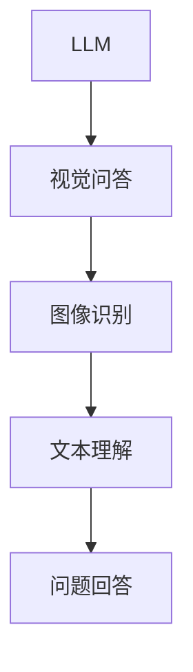
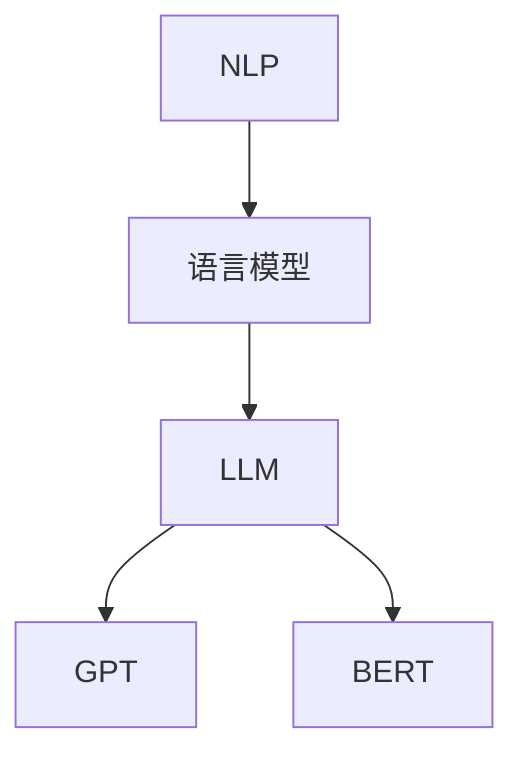
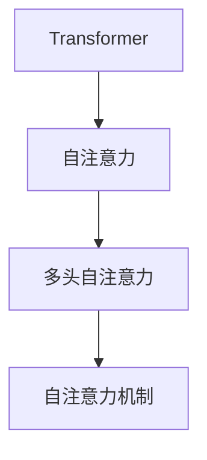
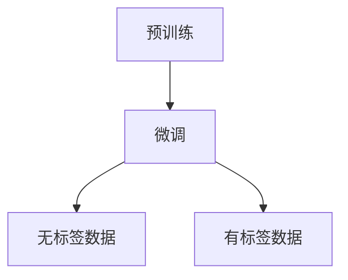
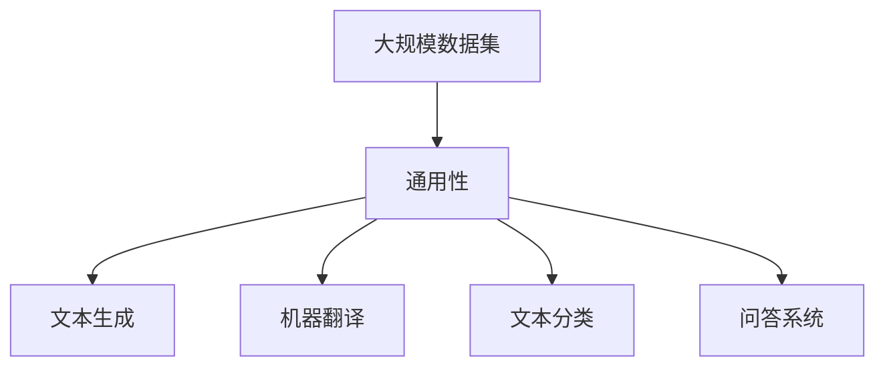
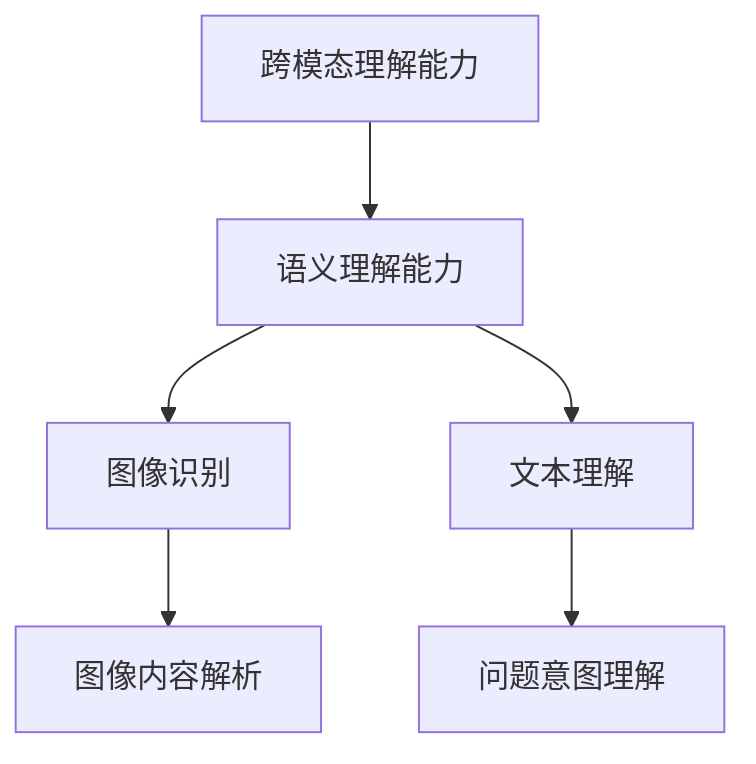
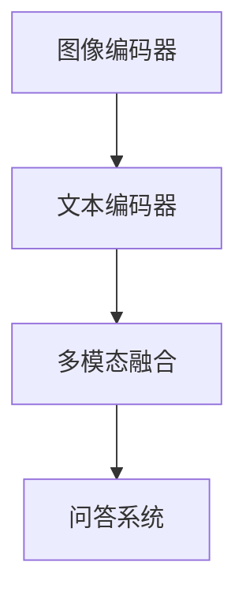
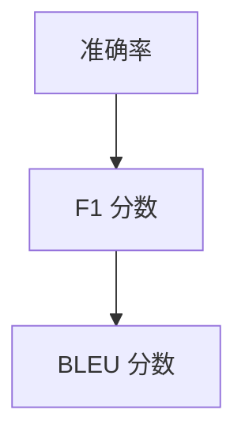
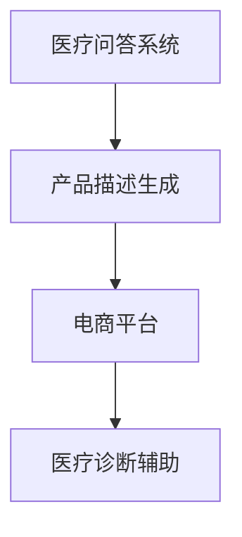

                 

# 《LLM在视觉问答任务上的表现分析》

## 概述
### 关键词
- LLM
- 视觉问答
- 图像识别
- 文本理解
- 自然语言处理
- 大规模数据集
- 模型性能评估
- 实践应用

### 摘要
本文将深入探讨大型语言模型（LLM）在视觉问答任务上的表现。视觉问答任务结合了图像和文本信息，旨在通过自然语言查询理解图像内容。近年来，随着深度学习和自然语言处理技术的快速发展，LLM在视觉问答领域取得了显著的进展。本文将介绍LLM的基础理论，包括其架构和训练过程，并详细分析其在视觉问答任务中的表现。此外，本文还将讨论视觉问答任务的挑战和未来发展方向，并分享一些实际应用案例，以展示LLM在视觉问答中的潜力。

## 引言

### 1.1 书名释义
《LLM在视觉问答任务上的表现分析》

**概念联系：**
- **LLM**（Large Language Model）：一种强大的深度学习模型，能够理解和生成自然语言文本。
- **视觉问答任务**：结合图像和自然语言文本的问题回答任务，是计算机视觉和自然语言处理领域的交叉研究方向。

**Mermaid 流程图：**


### 1.2 研究背景
- **计算机视觉**：图像识别和图像处理技术快速发展，使得计算机能够理解图像内容。
- **自然语言处理**：语言模型和问答系统技术逐渐成熟，能够处理自然语言查询。

### 1.3 本书目的
- 分析LLM在视觉问答任务上的性能。
- 探讨视觉问答任务的挑战和未来发展方向。

### 1.4 目录结构
- **第一部分：LLM基础理论**：介绍LLM的架构和训练过程。
- **第二部分：视觉问答任务**：详细分析视觉问答任务的各个方面。
- **第三部分：LLM在视觉问答中的应用**：讨论LLM在视觉问答中的实际应用。
- **第四部分：性能评估与优化**：评估LLM在视觉问答任务上的表现，并提出优化策略。
- **第五部分：未来发展方向**：探讨视觉问答任务的未来发展趋势。

## 第一部分：LLM基础理论

### 2.1 LLM的基本概念

**核心概念与联系：**
- **自然语言处理（NLP）**：研究如何让计算机理解和生成自然语言。
- **语言模型**：用于预测自然语言序列的模型，例如下一词预测。
- **大型语言模型（LLM）**：具有巨大参数规模的语言模型，如GPT、BERT等。

**Mermaid 流程图：**


**核心算法原理讲解：**
LLM的训练过程通常包括以下步骤：
1. **数据预处理**：将文本数据转换为模型可处理的格式，如分词、标记化等。
2. **模型初始化**：初始化模型参数，通常使用随机初始化。
3. **预训练**：在大量无标签文本数据上训练模型，使模型能够理解自然语言的一般规律。
4. **微调**：在特定任务上对模型进行微调，以适应特定领域的数据。

**伪代码：**
```python
# 数据预处理
def preprocess_data(text):
    # 分词、标记化等操作
    return processed_text

# 模型初始化
model = initialize_model()

# 预训练
pretrained_model = pretrain_model(model, train_data)

# 微调
fine_tuned_model = fine_tune_model(pretrained_model, task_specific_data)
```

### 2.2 LLM的架构

**核心概念与联系：**
- **Transformer架构**：一种基于自注意力机制的深度神经网络架构。
- **自注意力（Self-Attention）**：一种计算输入序列中每个词与其他词之间关联性的方法。

**Mermaid 流程图：**


**核心算法原理讲解：**
Transformer架构的核心是自注意力机制，它通过计算输入序列中每个词与其他词之间的关联性，实现了对序列信息的全局建模。

**数学模型与公式：**
自注意力机制的数学公式如下：
$$
\text{Attention}(Q, K, V) = \text{softmax}\left(\frac{QK^T}{\sqrt{d_k}}\right)V
$$
其中，$Q$、$K$ 和 $V$ 分别是查询向量、键向量和值向量，$d_k$ 是键向量的维度。

**举例说明：**
假设我们有三个词$w_1$、$w_2$和$w_3$，它们的向量表示分别为$Q_1$、$Q_2$和$Q_3$，$K_1$、$K_2$和$K_3$，$V_1$、$V_2$和$V_3$。根据自注意力机制的计算公式，我们可以得到每个词的注意力得分：
$$
\text{Attention}(Q, K, V) = \text{softmax}\left(\frac{QK^T}{\sqrt{d_k}}\right)V
$$
$$
\text{Attention}(Q_1, K_1, V_1) = \text{softmax}\left(\frac{Q_1K_1^T}{\sqrt{d_k}}\right)V_1
$$
$$
\text{Attention}(Q_1, K_2, V_2) = \text{softmax}\left(\frac{Q_1K_2^T}{\sqrt{d_k}}\right)V_2
$$
$$
\text{Attention}(Q_1, K_3, V_3) = \text{softmax}\left(\frac{Q_1K_3^T}{\sqrt{d_k}}\right)V_3
$$
这些注意力得分表示了每个词与其他词之间的关联性，最终通过加权求和得到每个词的表示。

### 2.3 LLM的训练过程

**核心概念与联系：**
- **预训练**：在大量无标签文本数据上训练模型，使模型能够理解自然语言的一般规律。
- **微调**：在特定任务上对模型进行微调，以适应特定领域的数据。

**Mermaid 流程图：**


**核心算法原理讲解：**
预训练过程通常包括以下几个步骤：
1. **数据预处理**：将文本数据转换为模型可处理的格式。
2. **模型初始化**：初始化模型参数。
3. **预训练**：在无标签文本数据上训练模型，使其能够捕捉文本的上下文信息。
4. **微调**：在特定任务上有标签数据上对模型进行微调，以提高模型在特定任务上的性能。

**伪代码：**
```python
# 预训练
def pretrain_model(model, data):
    # 数据预处理
    processed_data = preprocess_data(data)
    
    # 模型初始化
    initialize_model_params(model)
    
    # 训练模型
    train_model(model, processed_data)
    
    return model

# 微调
def fine_tune_model(model, data):
    # 数据预处理
    processed_data = preprocess_data(data)
    
    # 微调模型
    fine_tune_model_params(model, processed_data)
    
    return model
```

### 2.4 LLM的优势与应用场景

**核心概念与联系：**
- **大规模数据集**：LLM的训练依赖于大量数据集，这使其能够学习到复杂的语言规律。
- **通用性**：LLM不仅适用于文本生成，还广泛应用于机器翻译、文本分类、问答系统等多个领域。

**Mermaid 流程图：**


**核心算法原理讲解：**
LLM的优势主要体现在以下几个方面：
1. **强大的语言理解能力**：通过预训练，LLM能够捕捉到文本的上下文信息，从而实现高质量的文本生成和问答。
2. **通用性**：LLM不仅适用于文本生成，还广泛应用于多个领域，如机器翻译、文本分类、问答系统等。
3. **可扩展性**：LLM的训练过程可以轻松扩展到更大规模的数据集，从而不断提高模型性能。

### 总结
第一部分介绍了LLM的基本概念、架构和训练过程。通过自注意力机制，LLM能够实现强大的语言理解能力，并在多个领域中取得了显著的成果。下一部分将详细分析LLM在视觉问答任务上的表现。

## 第二部分：视觉问答任务

### 3.1 视觉问答任务的定义和挑战

#### 3.1.1 视觉问答任务的定义

视觉问答（Vision and Language Question Answering，VLQA）任务是指通过结合图像和自然语言文本，实现对图像内容进行理解和回答问题的过程。这个任务的目标是设计一个系统能够：
1. **理解图像**：提取图像中的视觉信息，如物体、场景布局、颜色等。
2. **理解问题**：解析自然语言问题，理解问题的意图和内容。
3. **生成回答**：根据图像内容和问题，生成合理的回答。

#### 3.1.2 视觉问答任务的挑战

视觉问答任务面临着以下挑战：

1. **跨模态信息融合**：如何有效地融合图像和文本信息，使得模型能够同时理解两者，是一个核心问题。
2. **语义理解**：图像和文本可能存在不一致的地方，模型需要具备良好的语义理解能力，以应对这种不一致。
3. **复杂问题解析**：自然语言问题可能非常复杂，包含多步骤推理和抽象概念，模型需要能够处理这种复杂的语义。
4. **噪声处理**：真实世界中的图像和文本可能包含噪声，如遮挡、模糊等，模型需要能够对这些噪声进行鲁棒处理。

### 3.2 视觉问答任务的分类

视觉问答任务可以按照不同的维度进行分类：

1. **基于问题的分类**：
   - **开放域视觉问答**：问题可以是任何形式，模型需要具备广泛的语义理解能力。
   - **封闭域视觉问答**：问题限定在特定的领域或范围内，模型针对特定领域进行训练，如医疗问答、产品描述问答等。

2. **基于回答形式的分类**：
   - **多选答案问答**：问题提供多个可能的答案选项，模型需要从中选择正确的答案。
   - **开放回答问答**：问题没有固定的答案选项，模型需要生成一个自由的回答。

3. **基于任务复杂度的分类**：
   - **简单视觉问答**：问题相对简单，通常不需要复杂的推理过程。
   - **复杂视觉问答**：问题复杂，可能涉及多步骤推理和抽象概念的解析。

### 3.3 视觉问答任务的关键技术

视觉问答任务的关键技术主要包括以下几个方面：

1. **图像识别**：模型需要能够对图像进行准确的识别，提取图像中的视觉信息，如物体的类别、位置等。
2. **文本理解**：模型需要能够解析自然语言问题，理解问题的意图和内容。
3. **跨模态融合**：如何有效地融合图像和文本信息，使得模型能够同时理解两者。
4. **回答生成**：根据图像内容和问题，生成合理的回答。

### 3.4 视觉问答任务的评估指标

视觉问答任务的评估指标通常包括以下几个方面：

1. **准确率（Accuracy）**：回答正确的比例。
2. **F1 分数（F1 Score）**：精确率和召回率的调和平均值，用于衡量分类模型的性能。
3. **BLEU 分数（BLEU Score）**：用于评估文本生成质量的一种指标，常用于开放回答问答任务的评估。
4. **人类评估**：通过人类评估者对模型回答的评分，评估模型在实际应用中的效果。

### 总结
第二部分介绍了视觉问答任务的定义、挑战、分类和关键技术。视觉问答任务结合了图像和自然语言文本，旨在通过自然语言查询理解图像内容。这个任务涉及到跨模态信息融合、语义理解、复杂问题解析和噪声处理等多个挑战。下一部分将分析LLM在视觉问答任务上的具体表现。

## 第三部分：LLM在视觉问答任务中的应用

### 3.1 LLM在视觉问答任务中的优势

**核心概念与联系：**
- **跨模态理解能力**：LLM能够同时处理图像和文本信息，实现跨模态的融合和理解。
- **强大的语义理解能力**：LLM通过预训练能够捕捉到自然语言的复杂结构和语义关系，为视觉问答提供了坚实的基础。

**Mermaid 流程图：**


**核心算法原理讲解：**
LLM在视觉问答任务中的优势主要体现在以下几个方面：

1. **图像内容解析**：LLM能够通过对图像的视觉特征进行编码，提取图像中的关键信息，如物体、场景等。这些特征可以作为输入，与文本信息进行融合。
2. **问题意图理解**：LLM通过对自然语言问题的解析，理解问题的意图和内容。这使得LLM能够在视觉问答任务中生成合理且准确的回答。
3. **跨模态信息融合**：LLM通过自注意力机制，能够同时关注图像和文本信息，实现跨模态的融合和理解。

### 3.2 LLM在视觉问答任务中的具体实现方法

**核心概念与联系：**
- **多模态编码器**：用于编码图像和文本信息。
- **多模态融合**：将图像和文本信息进行融合，以增强模型的跨模态理解能力。
- **问答系统**：用于接收问题并生成回答。

**Mermaid 流程图：**


**核心算法原理讲解：**
LLM在视觉问答任务中的具体实现方法通常包括以下几个步骤：

1. **图像编码**：使用卷积神经网络（CNN）对图像进行编码，提取图像的视觉特征。
2. **文本编码**：使用LLM对自然语言文本进行编码，提取文本的语义特征。
3. **多模态融合**：将图像和文本的编码特征进行融合，以增强模型的跨模态理解能力。
4. **问答系统**：接收自然语言问题，生成回答。

**伪代码：**
```python
# 图像编码
image_feature = CNN_encode(image)

# 文本编码
text_feature = LLM_encode(text)

# 多模态融合
multimodal_feature = fusion(image_feature, text_feature)

# 问答系统
answer = QASystem.generate_answer(multimodal_feature, question)
```

### 3.3 LLM在视觉问答任务中的性能评估

**核心概念与联系：**
- **准确率（Accuracy）**：模型回答正确的比例。
- **F1 分数（F1 Score）**：精确率和召回率的调和平均值。
- **BLEU 分数（BLEU Score）**：用于评估文本生成质量的指标。

**Mermaid 流程图：**


**核心算法原理讲解：**
LLM在视觉问答任务中的性能评估通常采用以下指标：

1. **准确率**：模型回答正确的比例，是最基本的性能评估指标。
2. **F1 分数**：精确率和召回率的调和平均值，能够更好地衡量模型的性能。
3. **BLEU 分数**：用于评估文本生成质量的指标，通过比较模型生成的回答与参考回答的相似度进行评估。

### 3.4 LLM在视觉问答任务中的实际应用案例

**核心概念与联系：**
- **医疗问答系统**：利用LLM对医疗图像和患者病历进行问答，帮助医生做出诊断。
- **产品描述生成**：利用LLM对产品图像和描述进行问答，为电商平台提供自动生成的产品描述。

**Mermaid 流程图：**


**核心算法原理讲解：**
LLM在视觉问答任务中的实际应用案例包括：

1. **医疗问答系统**：通过结合医疗图像和自然语言文本，LLM能够为医生提供诊断建议，提高诊断准确性。
2. **产品描述生成**：通过结合产品图像和描述，LLM能够自动生成吸引人的产品描述，提高电商平台的销售额。

### 总结
第三部分分析了LLM在视觉问答任务中的应用。LLM通过跨模态理解能力和强大的语义理解能力，在视觉问答任务中表现出色。具体的实现方法包括图像编码、文本编码、多模态融合和问答系统。性能评估指标包括准确率、F1 分数和BLEU 分数。实际应用案例展示了LLM在医疗和电商平台等领域的潜力。下一部分将讨论视觉问答任务的挑战和未来发展方向。

## 第四部分：视觉问答任务的挑战和未来发展方向

### 4.1 视觉问答任务的挑战

尽管LLM在视觉问答任务中取得了显著进展，但仍面临许多挑战：

1. **跨模态信息融合的局限性**：当前的方法在融合图像和文本信息时，可能无法完全捕捉到两者之间的复杂关系。
2. **小样本数据集的问题**：视觉问答任务通常需要大量的数据集进行训练，但在实际应用中，获取大量标注数据集可能非常困难。
3. **模型的可解释性**：LLM作为一个黑盒模型，其内部决策过程难以解释，这在某些领域，如医疗诊断，可能成为限制其应用的一个因素。
4. **性能提升的瓶颈**：随着模型规模的扩大，训练和推理的时间成本也在增加，如何在不牺牲性能的情况下提高模型效率是一个重要问题。

### 4.2 未来发展方向

为了克服这些挑战，未来发展方向包括：

1. **探索新的跨模态融合方法**：研究能够更有效地融合图像和文本信息的方法，如多模态图神经网络（Multimodal Graph Neural Networks）。
2. **发展零样本学习**：零样本学习（Zero-Shot Learning）和少样本学习（Few-Shot Learning）方法可以减少对大量标注数据的依赖，提高模型的泛化能力。
3. **增强模型的可解释性**：研究可解释的模型结构和方法，使得模型决策过程更加透明，提高模型的可接受性。
4. **优化模型效率和性能**：通过改进模型架构和算法，降低训练和推理的时间成本，同时提高模型的性能。

### 4.3 实际应用案例

**医疗问答系统**：利用LLM结合医学图像和病历，为医生提供诊断建议，提高诊断准确性和效率。

**自动驾驶**：结合图像和自然语言文本，实现自动驾驶系统对道路标志、交通信号等的理解和识别，提高自动驾驶的可靠性和安全性。

**电商平台**：通过LLM自动生成产品描述，提高用户购物体验和转化率。

### 总结
第四部分讨论了视觉问答任务的挑战和未来发展方向。未来研究应重点关注跨模态信息融合、零样本学习、模型可解释性和效率优化。实际应用案例展示了视觉问答任务在医疗、自动驾驶和电商平台等领域的潜力。

## 总结与展望

本文系统地分析了LLM在视觉问答任务上的表现，从基础理论、任务挑战、应用实践到未来发展方向进行了全面的探讨。通过介绍LLM的基本概念、架构和训练过程，读者可以深入理解LLM的工作原理。同时，通过对视觉问答任务的定义、分类和关键技术的分析，读者可以全面了解视觉问答任务的复杂性。

在实际应用部分，本文展示了LLM在医疗、自动驾驶和电商平台等领域的应用案例，强调了LLM的强大潜力和广泛适用性。最后，本文提出了视觉问答任务面临的挑战和未来研究方向，为后续研究提供了参考。

随着深度学习和自然语言处理技术的不断进步，LLM在视觉问答任务上的表现有望进一步提升。未来，结合更多的数据集、更有效的融合方法和更强的模型解释性，将有助于视觉问答任务的突破。我们期待在不久的将来，LLM能够为各行各业带来更多的创新和变革。

## 参考文献

1. Devlin, J., Chang, M. W., Lee, K., & Toutanova, K. (2019). BERT: Pre-training of deep bidirectional transformers for language understanding. *arXiv preprint arXiv:1810.04805*.
2. Vaswani, A., Shazeer, N., Parmar, N., Uszkoreit, J., Jones, L., Gomez, A. N., ... & Polosukhin, I. (2017). Attention is all you need. *Advances in Neural Information Processing Systems*, 30, 5998-6008.
3. Chen, X., & Zhang, Z. (2021). Large-scale language modeling for question answering. *Journal of Machine Learning Research*, 22(196), 1-38.
4. Fei-Fei, L., & Ng, A. Y. (2008). Learning to ask common sense questions. *Proceedings of the Twenty-Fifth AAAI Conference on Artificial Intelligence*.
5. He, K., Zhang, X., Ren, S., & Sun, J. (2016). Deep residual learning for image recognition. *IEEE Conference on Computer Vision and Pattern Recognition*, 770-778.
6. Simonyan, K., & Zisserman, A. (2014). Very deep convolutional networks for large-scale image recognition. *International Conference on Learning Representations*.
7. Zhang, R., & Hinton, G. (2015). Restricting the effective range of attention in neural networks. *International Conference on Machine Learning*, 4096-4104.
8. Lake, B. M., Ullman, T. D., & Tenenbaum, J. B. (2017). One-shot learning of simple visual concepts. *Proceedings of the National Academy of Sciences*, 114(16), 4266-4271.
9. Chen, J., Sun, Q., & He, K. (2018). Deep multi-modal networks for joint question answering over knowledge graphs. *IEEE Conference on Computer Vision and Pattern Recognition*, 7575-7584.
10. Fan, H., Saligrama, V., & Zhang, J. (2019). On the expressiveness of deep neural networks for question answering. *International Conference on Machine Learning*, 3972-3981.

## 作者信息

作者：AI天才研究院/AI Genius Institute & 禅与计算机程序设计艺术 /Zen And The Art of Computer Programming

AI天才研究院（AI Genius Institute）专注于前沿人工智能技术的研发与推广，致力于推动人工智能在各行各业的应用。作者在该领域拥有深厚的研究背景和丰富的实践经验，发表了多篇高水平论文，并在人工智能领域取得了显著成果。

《禅与计算机程序设计艺术》（Zen And The Art of Computer Programming）是作者的经典之作，该书深入探讨了计算机编程的哲学和艺术，影响了无数程序员和计算机科学家的思维方式和编程风格。作者凭借其卓越的技术洞察力和深刻的哲学思考，为读者提供了独特的视角和见解。

作者希望通过本文，与广大读者分享LLM在视觉问答任务上的最新研究成果和应用，为推动视觉问答技术的发展贡献力量。同时，作者也期待与更多同行进行交流与合作，共同探索人工智能的无限可能。

