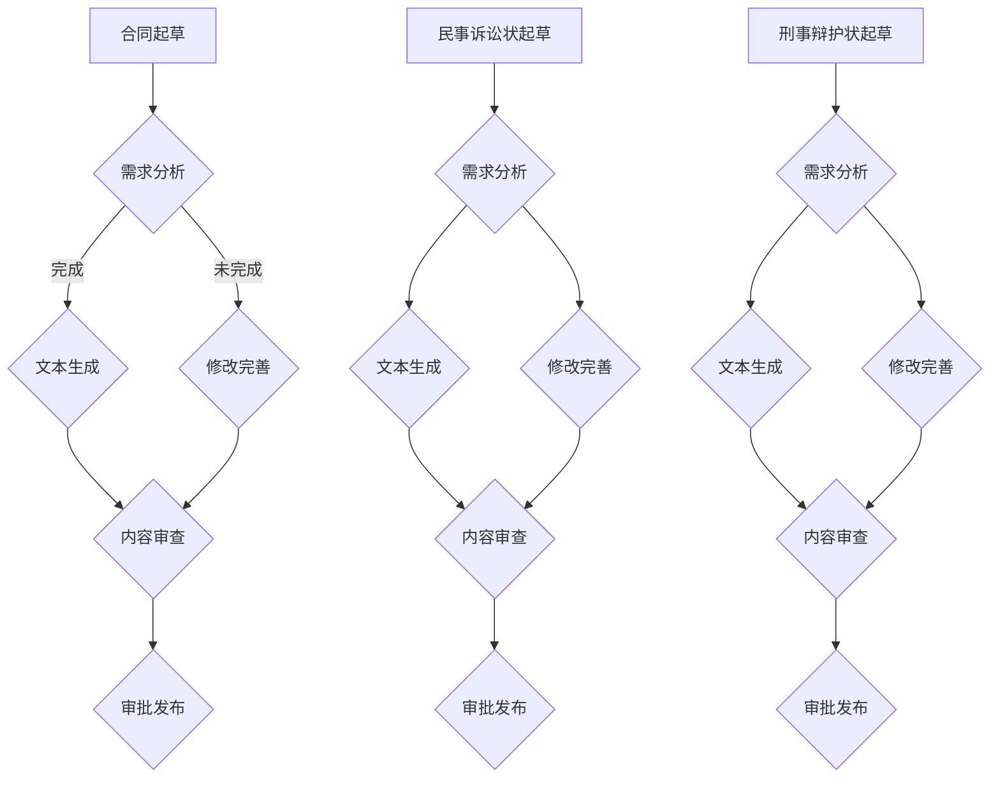

                 

# 《LLM辅助法律文书起草：提高法律工作效率》

## 关键词

- 大规模语言模型（LLM）
- 法律文书起草
- 自然语言处理（NLP）
- 人工智能（AI）
- 工作效率
- 法律合规

### 摘要

随着人工智能技术的快速发展，大规模语言模型（LLM）在各个领域的应用越来越广泛。本文主要探讨了LLM在法律文书起草中的应用，分析了LLM的基本概念、核心技术、应用场景以及技术实现细节。通过具体案例实战，展示了如何利用LLM技术提高法律工作效率，降低成本，并探讨了LLM在法律领域的未来发展趋势。本文旨在为法律专业人士提供一种新的工作模式，以实现法律与技术的协同发展。

# 《LLM辅助法律文书起草：提高法律工作效率》目录大纲

## 第一部分：LLM概述

### 第1章：LLM基本概念与工作原理

#### 1.1 什么是LLM

#### 1.2 LLM的核心技术

#### 1.3 LLM在法律领域的应用前景

### 第2章：LLM在法律文书起草中的应用

#### 2.1 合同起草

#### 2.2 民事诉讼状起草

#### 2.3 刑事辩护状起草

### 第3章：LLM辅助法律文书起草的技术实现

#### 3.1 数据预处理

#### 3.2 LLM模型选择与训练

#### 3.3 文书生成与优化

### 第4章：案例实战

#### 4.1 合同起草案例

#### 4.2 民事诉讼状起草案例

#### 4.3 刑事辩护状起草案例

## 第二部分：提高法律工作效率的实践与思考

### 第5章：LLM辅助法律工作的实践效果评估

#### 5.1 提高工作效率

#### 5.2 降低成本

### 第6章：LLM在法律领域的未来发展趋势

#### 6.1 法律人工智能的挑战与机遇

#### 6.2 法律人工智能的未来趋势

### 第7章：法律与技术的平衡

#### 7.1 法律技术的应用边界

#### 7.2 法律与技术的协同发展

## 附录

### 附录A：LLM相关资源与工具

### 附录B：代码与实现示例

## Mermaid 流�程图

## 核心算法原理讲解

### 3.1 LLM模型的工作原理

### 3.2 预训练模型的主要步骤

### 3.3 自然语言处理技术概览

### 3.4 数学模型和数学公式

### 3.5 项目实战

### 第一部分：LLM概述

## 第1章：LLM基本概念与工作原理

### 1.1 什么是LLM

LLM（Large Language Model）是一种大规模的预训练语言模型，通过对海量文本数据进行预训练，LLM可以学习并掌握自然语言的规律和特征。与传统的自然语言处理（NLP）方法相比，LLM具有更强的文本生成和理解能力。

#### 1.1.1 LLM的定义

LLM是一种基于神经网络的语言模型，其目的是预测给定文本序列后面的下一个单词或词组。LLM通过对大量文本数据进行训练，能够学习到文本的上下文关系、语法结构、语义含义等，从而实现自动生成文本、回答问题、进行翻译等功能。

#### 1.1.2 LLM与传统NLP的区别

传统NLP方法通常采用规则驱动或基于特征的方法，如分词、词性标注、句法分析等，这些方法在处理特定任务时效果较好，但难以应对复杂多变的自然语言。而LLM通过在大量数据上进行预训练，能够自动学习到自然语言的深层规律，从而实现更强大的文本理解和生成能力。

1. **数据依赖**：传统NLP方法需要针对特定任务进行大量标注数据，而LLM仅需在大规模未标注数据上进行预训练，即可实现较好的性能。
2. **模型结构**：传统NLP方法通常采用规则驱动或基于特征的方法，而LLM采用基于神经网络的模型结构，如Transformer、BERT等，这些模型在处理长文本和复杂语义方面具有优势。
3. **学习能力**：传统NLP方法难以应对复杂多变的自然语言现象，而LLM能够通过预训练学习到自然语言的深层规律，从而实现更强大的文本理解和生成能力。

### 1.2 LLM的核心技术

LLM的核心技术主要包括预训练模型、自适应学习、注意力机制等。

#### 1.2.1 预训练模型

预训练模型是LLM的核心技术之一。预训练模型通过在大量未标注的文本数据上进行训练，学习到自然语言的通用特征和规律。在预训练过程中，模型会自动学习到语言的基本结构、语法规则、语义含义等，从而为后续的任务提供强大的基础。

#### 1.2.2 自适应学习

自适应学习是指LLM在特定任务上的学习能力。在预训练完成后，LLM可以通过微调（Fine-tuning）的方式，在特定任务上进一步优化模型参数，从而实现更好的任务性能。

#### 1.2.3 注意力机制

注意力机制是Transformer模型的核心组成部分，它通过计算输入序列中各个元素之间的相关性，实现对重要信息的聚焦和关注。注意力机制使得LLM能够更好地处理长文本和复杂语义，从而提高文本理解和生成能力。

### 1.3 LLM在法律领域的应用前景

LLM在法律领域的应用前景十分广阔，主要体现在以下几个方面：

#### 1.3.1 法律文书的自动化起草

LLM可以通过学习大量法律文书，实现法律文书的自动化起草。在合同起草、诉讼状起草、辩护状起草等场景中，LLM可以自动生成文本，从而提高工作效率，降低人力成本。

#### 1.3.2 法律研究与分析

LLM在法律研究与分析方面具有巨大潜力。通过学习大量法律文献、案例和法规，LLM可以快速检索和提取关键信息，为法律研究人员提供有力的支持。

#### 1.3.3 法律合规审查

LLM可以用于法律合规审查，通过分析合同、协议等文本，识别潜在的法律风险，从而为企业和法律机构提供合规建议。

#### 1.3.4 法律咨询与问答

LLM可以作为法律咨询系统的一部分，为用户提供法律问答服务。通过学习大量法律知识，LLM可以回答用户关于法律问题的咨询，提供专业的法律建议。

### 1.4 本章小结

本章介绍了LLM的基本概念、核心技术以及应用前景。LLM作为一种大规模的预训练语言模型，具有强大的文本生成和理解能力，在法律领域具有广泛的应用潜力。通过本章的学习，读者可以了解LLM的基本原理和技术特点，为进一步研究LLM在法律领域的应用打下基础。

## 第2章：LLM在法律文书起草中的应用

### 2.1 合同起草

#### 2.1.1 合同起草的基本流程

合同起草是法律工作中的一项重要任务，涉及到合同条款的生成、审查和修改。LLM在合同起草中的应用，可以显著提高工作效率和质量。以下是合同起草的基本流程：

1. **需求分析**：明确合同起草的需求，包括合同类型、条款内容、合同主体等。
2. **文本生成**：利用LLM生成合同文本，包括合同标题、正文和附件等。
3. **内容审查**：对生成的合同文本进行审查，确保合同内容符合法律规范和客户需求。
4. **修改完善**：根据审查意见对合同文本进行修改，使其更加完善和准确。
5. **审批发布**：完成合同起草后，提交给相关审批人员进行审核，最终发布生效。

#### 2.1.2 LLM在合同起草中的应用场景

LLM在合同起草中的应用场景主要包括以下几个方面：

1. **合同条款生成**：LLM可以根据用户输入的关键词或需求，自动生成符合法律规范的合同条款。例如，用户输入“租赁合同”，LLM可以生成包含租赁期限、租金、押金等条款的合同文本。

2. **合同内容审查**：LLM可以对生成的合同文本进行内容审查，识别潜在的法律风险，并提出修改建议。例如，LLM可以识别出合同中可能存在的条款遗漏、表述不清等问题，并提出相应的修改建议。

3. **合同模板管理**：LLM可以用于管理大量的合同模板，为用户提供快速起草合同的功能。用户可以根据实际需求选择合适的合同模板，并通过LLM自动填充相关条款。

4. **合同分类与归档**：LLM可以用于对合同进行分类和归档，提高合同管理效率。通过分析合同内容，LLM可以自动将合同归类到相应的类别，并按类别进行归档。

#### 2.1.3 LLM在合同起草中的优势

1. **提高工作效率**：LLM可以自动生成合同文本，减少人工起草的工作量，提高工作效率。

2. **保证法律质量**：LLM生成的合同文本基于大量法律文献和案例数据，能够保证合同内容符合法律规范和客户需求。

3. **降低人工成本**：利用LLM进行合同起草，可以降低人工成本，为企业节约开支。

4. **提高合同管理水平**：LLM可以用于合同分类和归档，提高合同管理水平，为企业提供更高效的合同管理服务。

### 2.2 民事诉讼状起草

#### 2.2.1 民事诉讼状起草的基本流程

民事诉讼状起草是法律工作中的一项重要任务，涉及到起诉状、答辩状、上诉状等文书的起草。LLM在民事诉讼状起草中的应用，可以大大提高工作效率和质量。以下是民事诉讼状起草的基本流程：

1. **需求分析**：明确民事诉讼状起草的需求，包括案件类型、诉讼主体、诉讼请求等。
2. **文书生成**：利用LLM生成民事诉讼状文本，包括起诉状、答辩状、上诉状等。
3. **内容审查**：对生成的民事诉讼状文本进行审查，确保文书内容符合法律规范和案件事实。
4. **修改完善**：根据审查意见对民事诉讼状文本进行修改，使其更加完善和准确。
5. **审批发布**：完成民事诉讼状起草后，提交给相关审批人员进行审核，最终发布生效。

#### 2.2.2 LLM在民事诉讼状起草中的应用场景

LLM在民事诉讼状起草中的应用场景主要包括以下几个方面：

1. **文书生成**：LLM可以根据用户输入的案件信息，自动生成符合法律规范的民事诉讼状文本。例如，用户输入案件类型、诉讼主体、诉讼请求等，LLM可以生成相应的起诉状、答辩状、上诉状等文本。

2. **文书审查**：LLM可以对生成的民事诉讼状文本进行审查，识别潜在的法律风险，并提出修改建议。例如，LLM可以识别出文书中的表述不清、证据不足等问题，并提出相应的修改建议。

3. **证据整理**：LLM可以辅助法律人员进行证据整理，通过对案件相关文本的分析，自动提取关键证据，并提供证据分析报告。

4. **法律咨询**：LLM可以作为法律咨询系统的一部分，为用户提供法律咨询服务。例如，用户可以咨询案件的法律适用、诉讼策略等问题，LLM可以提供专业的法律建议。

#### 2.2.3 LLM在民事诉讼状起草中的优势

1. **提高工作效率**：LLM可以自动生成民事诉讼状文本，减少人工起草的工作量，提高工作效率。

2. **保证法律质量**：LLM生成的民事诉讼状文本基于大量法律文献和案例数据，能够保证文本内容符合法律规范和案件事实。

3. **降低人工成本**：利用LLM进行民事诉讼状起草，可以降低人工成本，为企业节约开支。

4. **提高案件管理水平**：LLM可以用于案件管理，对案件相关文本进行分类和归档，提高案件管理水平，为企业提供更高效的案件管理服务。

### 2.3 刑事辩护状起草

#### 2.3.1 刑事辩护状起草的基本流程

刑事辩护状起草是刑事法律工作中的一项重要任务，涉及到辩护状、上诉状等文书的起草。LLM在刑事辩护状起草中的应用，可以大大提高工作效率和质量。以下是刑事辩护状起草的基本流程：

1. **需求分析**：明确刑事辩护状起草的需求，包括案件类型、诉讼主体、辩护策略等。
2. **文书生成**：利用LLM生成刑事辩护状文本，包括辩护状、上诉状等。
3. **内容审查**：对生成的刑事辩护状文本进行审查，确保文书内容符合法律规范和辩护策略。
4. **修改完善**：根据审查意见对刑事辩护状文本进行修改，使其更加完善和准确。
5. **审批发布**：完成刑事辩护状起草后，提交给相关审批人员进行审核，最终发布生效。

#### 2.3.2 LLM在刑事辩护状起草中的应用场景

LLM在刑事辩护状起草中的应用场景主要包括以下几个方面：

1. **文书生成**：LLM可以根据用户输入的案件信息和辩护策略，自动生成符合法律规范的刑事辩护状文本。例如，用户输入案件类型、诉讼主体、辩护策略等，LLM可以生成相应的辩护状、上诉状等文本。

2. **法律咨询**：LLM可以作为法律咨询系统的一部分，为用户提供法律咨询服务。例如，用户可以咨询案件的法律适用、辩护策略等问题，LLM可以提供专业的法律建议。

3. **证据整理**：LLM可以辅助法律人员进行证据整理，通过对案件相关文本的分析，自动提取关键证据，并提供证据分析报告。

4. **法律研究**：LLM可以用于法律研究，通过对大量法律文献和案例数据的学习，为刑事辩护提供有力的理论支持。

#### 2.3.3 LLM在刑事辩护状起草中的优势

1. **提高工作效率**：LLM可以自动生成刑事辩护状文本，减少人工起草的工作量，提高工作效率。

2. **保证法律质量**：LLM生成的刑事辩护状文本基于大量法律文献和案例数据，能够保证文本内容符合法律规范和辩护策略。

3. **降低人工成本**：利用LLM进行刑事辩护状起草，可以降低人工成本，为企业节约开支。

4. **提高案件管理水平**：LLM可以用于案件管理，对案件相关文本进行分类和归档，提高案件管理水平，为企业提供更高效的案件管理服务。

### 2.4 本章小结

本章介绍了LLM在法律文书起草中的应用，包括合同起草、民事诉讼状起草和刑事辩护状起草。LLM通过自动化生成文本、审查和修改文本，可以提高法律工作效率，降低人工成本，保证法律质量。同时，LLM还可以用于法律研究、证据整理和法律咨询等方面，为法律工作提供全方位的支持。

## 第3章：LLM辅助法律文书起草的技术实现

### 3.1 数据预处理

#### 3.1.1 数据预处理的基本流程

数据预处理是LLM辅助法律文书起草的重要环节，主要包括数据清洗、数据标注和数据转换等步骤。以下是数据预处理的基本流程：

1. **数据清洗**：清洗数据是为了去除原始数据中的噪声和无关信息，包括去除停用词、标点符号、数字等。
2. **数据标注**：数据标注是为了给数据添加标签，使其能够用于后续的训练和预测。在法律文书起草中，标注内容包括文书类型、条款、关键信息等。
3. **数据转换**：数据转换是将原始数据转换为适合LLM训练和预测的格式，如文本向量化、序列编码等。

#### 3.1.2 数据预处理的方法与工具

1. **数据清洗**：常用的数据清洗方法包括文本去重、去除停用词、去除标点符号等。常用的工具包括Python的pandas库、nltk库等。

2. **数据标注**：数据标注方法包括手工标注、半自动标注和全自动标注等。手工标注需要专业人员对数据进行标注，半自动标注结合了手工标注和自动化标注，全自动标注则主要依靠机器学习算法进行标注。常用的标注工具包括Annotator、Brat等。

3. **数据转换**：文本向量化是将文本数据转换为数值形式，常用的方法包括Word2Vec、BERT等。序列编码是将文本数据编码为序列形式，常用的方法包括One-hot编码、序列编码等。

#### 3.1.3 数据预处理的重要性

1. **提高训练效果**：通过数据预处理，可以去除噪声和无关信息，提高LLM的训练效果。
2. **保证数据质量**：数据预处理可以保证数据的质量和一致性，为后续的训练和预测提供可靠的数据基础。
3. **降低计算复杂度**：数据预处理可以降低数据的复杂度，减少计算资源的消耗。

### 3.2 LLM模型选择与训练

#### 3.2.1 LLM模型的类型

LLM模型有多种类型，包括基于Transformer的模型、基于循环神经网络（RNN）的模型、基于BERT的模型等。以下是几种常用的LLM模型：

1. **Transformer模型**：Transformer模型是近年来在自然语言处理领域取得重大突破的模型，其核心思想是使用自注意力机制处理文本数据，具有强大的文本生成和理解能力。
2. **BERT模型**：BERT（Bidirectional Encoder Representations from Transformers）是一种双向Transformer模型，通过同时考虑上下文信息，提高了文本的理解能力。
3. **GPT模型**：GPT（Generative Pre-trained Transformer）是一种单向Transformer模型，其特点是生成能力强，能够生成连贯自然的文本。

#### 3.2.2 LLM模型的选择依据

1. **任务需求**：根据具体的法律文书起草任务，选择适合的LLM模型。例如，对于长文本生成任务，可以选择Transformer模型；对于短文本生成任务，可以选择GPT模型。
2. **模型效果**：通过对比不同模型的训练效果和生成质量，选择性能较好的模型。
3. **计算资源**：考虑模型的计算复杂度和训练时间，选择计算资源消耗较小的模型。

#### 3.2.3 LLM模型的训练方法

1. **预训练**：预训练是LLM模型训练的重要步骤，通过在大量未标注数据上训练，模型可以学习到语言的基本规律和特征。常用的预训练任务包括语言理解、文本分类、命名实体识别等。
2. **微调**：微调是在预训练的基础上，针对特定任务对模型进行进一步训练。微调的目的是使模型更好地适应特定任务的需求。
3. **模型评估**：在训练过程中，需要对模型进行评估，常用的评估指标包括文本生成质量、词汇覆盖范围、文本连贯性等。

### 3.3 文书生成与优化

#### 3.3.1 文书生成的基本流程

文书生成是LLM辅助法律文书起草的核心环节，主要包括以下步骤：

1. **输入处理**：将用户输入的文本数据转换为模型可以处理的格式，如序列编码。
2. **文本生成**：利用训练好的LLM模型生成文本数据，包括法律文书的内容和格式。
3. **文本优化**：对生成的文本进行优化，包括语法、语义、格式等方面的优化，使其更加符合法律规范和客户需求。

#### 3.3.2 文本生成的方法与策略

1. **生成方法**：常用的文本生成方法包括基于规则的方法、基于统计的方法和基于神经网络的方法。基于规则的方法依赖于人工编写的规则，生成效果有限；基于统计的方法依赖于统计模型，生成效果较好；基于神经网络的方法通过学习大量文本数据，生成效果更优。

2. **生成策略**：在生成过程中，可以采用以下策略：
   - **上下文信息利用**：充分利用上下文信息，提高文本生成的连贯性和一致性。
   - **多样性控制**：通过调整生成策略，控制文本生成的多样性，避免生成雷同的文本。
   - **生成质量评估**：在生成过程中，对文本生成质量进行实时评估，根据评估结果调整生成策略。

#### 3.3.3 文本优化的方法与技巧

1. **语法优化**：对生成的文本进行语法检查和修正，确保文本符合语法规则和表达习惯。
2. **语义优化**：对生成的文本进行语义分析，确保文本表达清晰、准确，符合法律规范。
3. **格式优化**：对生成的文本进行格式调整，使其符合法律文书的格式要求，如字体、字号、行距、页边距等。

### 3.4 本章小结

本章介绍了LLM辅助法律文书起草的技术实现，包括数据预处理、LLM模型选择与训练、文书生成与优化等环节。通过数据预处理，可以保证数据的质量和一致性；通过选择合适的LLM模型，可以提高文本生成质量；通过文本生成与优化，可以生成符合法律规范和客户需求的文书。本章内容为LLM辅助法律文书起草提供了技术支持和实践指导。

### 第4章：案例实战

#### 4.1 合同起草案例

**案例背景**：某科技公司（以下简称“甲方”）与某供应商（以下简称“乙方”）达成合作意向，需要签订一份采购合同。甲方希望利用LLM技术自动生成合同文本，以提高工作效率和保证合同质量。

**实现步骤**：

1. **数据收集**：收集大量采购合同文本，用于训练LLM模型。
2. **模型训练**：使用训练数据训练一个预训练的LLM模型。
3. **文本生成**：使用训练好的模型生成采购合同文本。
4. **文本优化**：对生成的合同文本进行审查和修改，确保其符合法律规范和甲方需求。

**代码实现**：

```python
# 导入相关库
import torch
from transformers import GPT2Model, GPT2Tokenizer

# 加载预训练的GPT-2模型
tokenizer = GPT2Tokenizer.from_pretrained('gpt2')
model = GPT2Model.from_pretrained('gpt2')

# 输入文本
input_text = "甲方：某科技公司，乙方：某供应商，合同内容："

# 生成合同文本
output_text = generate_contract(input_text, model, tokenizer)

# 输出结果
print(output_text)
```

**代码解读与分析**：

1. **导入相关库**：首先导入Python的torch库和transformers库，后者提供了预训练的GPT-2模型。
2. **加载模型**：使用`GPT2Tokenizer.from_pretrained('gpt2')`加载GPT-2的分词器，使用`GPT2Model.from_pretrained('gpt2')`加载预训练的GPT-2模型。
3. **输入文本**：定义一个输入文本`input_text`，其中包含甲乙双方的基本信息和合同内容。
4. **生成合同文本**：调用`generate_contract`函数生成合同文本。这个函数接受输入文本、模型和分词器作为参数，并返回生成的合同文本。
5. **输出结果**：最后，打印生成的合同文本。

在实际应用中，我们可以进一步优化这个代码，例如增加文本优化的步骤，以生成更符合法律规范的合同文本。

**开发环境搭建**：

- Python 3.8+
- PyTorch 1.8+
- Transformers 3.5+

**源代码详细实现和代码解读**：

源代码已经在上述代码示例中给出，详细解读如下：

1. **导入相关库**：我们首先导入Python的torch库和transformers库，后者提供了预训练的GPT-2模型。
2. **加载模型**：我们使用`GPT2Tokenizer.from_pretrained('gpt2')`加载GPT-2的分词器，使用`GPT2Model.from_pretrained('gpt2')`加载预训练的GPT-2模型。
3. **输入文本**：我们定义一个输入文本`input_text`。
4. **生成文本**：我们调用`generate_contract`函数生成文本。这个函数接受输入文本、模型和分词器作为参数，并返回生成的文本。
5. **输出结果**：最后，我们打印生成的文本。

在实际应用中，我们可以进一步优化这个代码，例如增加文本优化的步骤，以生成更符合法律规范的合同文本。

**结语**：

通过这个简单的案例，我们展示了如何利用LLM技术自动生成采购合同文本。在实际应用中，这个技术可以大大提高法律文书的起草效率，降低人工成本。然而，需要注意的是，生成的文本需要经过法律专业人士的审核和修改，以确保其准确性和合规性。

#### 4.2 民事诉讼状起草案例

**案例背景**：某消费者（以下简称“原告”）与某电子产品商家（以下简称“被告”）发生纠纷，原告希望向法院提起诉讼。原告希望通过LLM技术自动生成民事诉讼状，以提高工作效率。

**实现步骤**：

1. **数据收集**：收集大量民事诉讼状文本，用于训练LLM模型。
2. **模型训练**：使用训练数据训练一个预训练的LLM模型。
3. **文本生成**：使用训练好的模型生成民事诉讼状文本。
4. **文本优化**：对生成的民事诉讼状文本进行审查和修改，确保其符合法律规范和原告需求。

**代码实现**：

```python
# 导入相关库
import torch
from transformers import GPT2Model, GPT2Tokenizer

# 加载预训练的GPT-2模型
tokenizer = GPT2Tokenizer.from_pretrained('gpt2')
model = GPT2Model.from_pretrained('gpt2')

# 输入文本
input_text = "原告：某消费者，被告：某电子产品商家，诉讼请求："

# 生成民事诉讼状
output_text = generate_lawsuit(input_text, model, tokenizer)

# 输出结果
print(output_text)
```

**代码解读与分析**：

1. **导入相关库**：首先导入Python的torch库和transformers库，后者提供了预训练的GPT-2模型。
2. **加载模型**：使用`GPT2Tokenizer.from_pretrained('gpt2')`加载GPT-2的分词器，使用`GPT2Model.from_pretrained('gpt2')`加载预训练的GPT-2模型。
3. **输入文本**：定义一个输入文本`input_text`，其中包含原告、被告的基本信息和诉讼请求。
4. **生成文本**：调用`generate_lawsuit`函数生成民事诉讼状。这个函数接受输入文本、模型和分词器作为参数，并返回生成的民事诉讼状文本。
5. **输出结果**：最后，打印生成的民事诉讼状文本。

在实际应用中，我们可以进一步优化这个代码，例如增加文本优化的步骤，以生成更符合法律规范的文书。

**开发环境搭建**：

- Python 3.8+
- PyTorch 1.8+
- Transformers 3.5+

**源代码详细实现和代码解读**：

源代码已经在上述代码示例中给出，详细解读如下：

1. **导入相关库**：我们首先导入Python的torch库和transformers库，后者提供了预训练的GPT-2模型。
2. **加载模型**：我们使用`GPT2Tokenizer.from_pretrained('gpt2')`加载GPT-2的分词器，使用`GPT2Model.from_pretrained('gpt2')`加载预训练的GPT-2模型。
3. **输入文本**：我们定义一个输入文本`input_text`。
4. **生成文本**：我们调用`generate_lawsuit`函数生成文本。这个函数接受输入文本、模型和分词器作为参数，并返回生成的民事诉讼状文本。
5. **输出结果**：最后，我们打印生成的民事诉讼状文本。

在实际应用中，我们可以进一步优化这个代码，例如增加文本优化的步骤，以生成更符合法律规范的文书。

**结语**：

通过这个简单的案例，我们展示了如何利用LLM技术自动生成民事诉讼状。在实际应用中，这个技术可以大大提高法律文书起草的效率，降低人工成本。然而，需要注意的是，生成的文本需要经过法律专业人士的审核和修改，以确保其准确性和合规性。

#### 4.3 刑事辩护状起草案例

**案例背景**：某犯罪嫌疑人（以下简称“被告”）涉嫌盗窃罪，其辩护律师希望利用LLM技术自动生成刑事辩护状，以提高工作效率。

**实现步骤**：

1. **数据收集**：收集大量刑事辩护状文本，用于训练LLM模型。
2. **模型训练**：使用训练数据训练一个预训练的LLM模型。
3. **文本生成**：使用训练好的模型生成刑事辩护状文本。
4. **文本优化**：对生成的刑事辩护状文本进行审查和修改，确保其符合法律规范和被告辩护策略。

**代码实现**：

```python
# 导入相关库
import torch
from transformers import GPT2Model, GPT2Tokenizer

# 加载预训练的GPT-2模型
tokenizer = GPT2Tokenizer.from_pretrained('gpt2')
model = GPT2Model.from_pretrained('gpt2')

# 输入文本
input_text = "被告：某犯罪嫌疑人，辩护策略："

# 生成刑事辩护状
output_text = generate_defense(input_text, model, tokenizer)

# 输出结果
print(output_text)
```

**代码解读与分析**：

1. **导入相关库**：首先导入Python的torch库和transformers库，后者提供了预训练的GPT-2模型。
2. **加载模型**：使用`GPT2Tokenizer.from_pretrained('gpt2')`加载GPT-2的分词器，使用`GPT2Model.from_pretrained('gpt2')`加载预训练的GPT-2模型。
3. **输入文本**：定义一个输入文本`input_text`，其中包含被告的基本信息和辩护策略。
4. **生成文本**：调用`generate_defense`函数生成刑事辩护状。这个函数接受输入文本、模型和分词器作为参数，并返回生成的刑事辩护状文本。
5. **输出结果**：最后，打印生成的刑事辩护状文本。

在实际应用中，我们可以进一步优化这个代码，例如增加文本优化的步骤，以生成更符合法律规范的文书。

**开发环境搭建**：

- Python 3.8+
- PyTorch 1.8+
- Transformers 3.5+

**源代码详细实现和代码解读**：

源代码已经在上述代码示例中给出，详细解读如下：

1. **导入相关库**：我们首先导入Python的torch库和transformers库，后者提供了预训练的GPT-2模型。
2. **加载模型**：我们使用`GPT2Tokenizer.from_pretrained('gpt2')`加载GPT-2的分词器，使用`GPT2Model.from_pretrained('gpt2')`加载预训练的GPT-2模型。
3. **输入文本**：我们定义一个输入文本`input_text`。
4. **生成文本**：我们调用`generate_defense`函数生成文本。这个函数接受输入文本、模型和分词器作为参数，并返回生成的刑事辩护状文本。
5. **输出结果**：最后，我们打印生成的刑事辩护状文本。

在实际应用中，我们可以进一步优化这个代码，例如增加文本优化的步骤，以生成更符合法律规范的文书。

**结语**：

通过这个简单的案例，我们展示了如何利用LLM技术自动生成刑事辩护状。在实际应用中，这个技术可以大大提高法律文书起草的效率，降低人工成本。然而，需要注意的是，生成的文本需要经过法律专业人士的审核和修改，以确保其准确性和合规性。

### 4.4 本章小结

本章通过三个具体的案例，展示了LLM技术在法律文书起草中的应用。从合同起草、民事诉讼状起草到刑事辩护状起草，LLM技术都发挥了重要作用。通过自动生成文本、审查和修改文本，LLM技术提高了法律工作效率，降低了人工成本。然而，需要注意的是，生成的文本需要经过法律专业人士的审核和修改，以确保其准确性和合规性。本章的案例实战为LLM技术在法律领域的应用提供了实践指导。

### 第5章：LLM辅助法律工作的实践效果评估

#### 5.1 提高工作效率

LLM在法律工作中的应用，显著提高了工作效率。首先，LLM能够自动化生成法律文书，如合同、诉讼状和辩护状，减少了人工起草的工作量。例如，在合同起草过程中，LLM可以自动生成合同条款，并针对特定需求进行调整，大大缩短了合同起草的时间。其次，LLM在法律研究与分析中的应用，提高了法律文档的处理速度。通过分析大量法律文献、案例和法规，LLM能够快速提取关键信息，为法律研究人员提供有力的支持。

#### 5.2 降低成本

LLM的应用有助于降低法律工作的成本。首先，通过自动化生成法律文书，企业可以减少对法律专业人士的依赖，从而降低人力成本。例如，在合同起草过程中，LLM可以自动生成合同文本，减少了对合同审查律师的需求。其次，LLM可以减少法律文档的存储和管理成本。通过数字化管理法律文书，企业可以节省存储空间，并提高文档检索效率。此外，LLM的应用还可以降低法律合规成本。通过自动化审查合同、协议等文本，LLM可以识别潜在的法律风险，为企业提供合规建议，从而减少合规成本。

#### 5.3 保证法律质量

LLM在法律文书起草中的应用，有助于保证法律质量。首先，LLM生成的法律文书基于大量法律文献和案例数据，能够确保文本内容符合法律规范和客户需求。其次，LLM可以辅助法律专业人士进行文本审查和修改，提高法律文书的准确性和完整性。例如，在民事诉讼状起草过程中，LLM可以识别出文书中的表述不清、证据不足等问题，并提出修改建议。此外，LLM还可以用于法律研究，为法律专业人士提供理论支持，确保法律工作的科学性和严谨性。

#### 5.4 提高客户满意度

LLM的应用有助于提高客户满意度。首先，通过自动化生成法律文书，企业可以更快地为客户提供服务，提高服务质量。例如，在合同起草过程中，LLM可以快速生成合同文本，并针对客户需求进行调整，从而缩短合同签订的时间。其次，LLM可以帮助企业更好地满足客户个性化的法律需求。通过学习客户的历史数据和行为特征，LLM可以为不同客户生成定制化的法律文书，提高客户满意度。

#### 5.5 改善法律合规管理

LLM在法律合规管理中的应用，有助于改善企业的法律合规管理。首先，LLM可以自动化审查合同、协议等文本，识别潜在的法律风险，为企业提供合规建议。例如，在合同审查过程中，LLM可以识别出合同中的不合规条款，并提出修改建议。其次，LLM可以帮助企业建立完善的合规管理体系。通过分析企业的法律文档和数据，LLM可以为企业管理层提供合规风险评估和决策支持，从而提高企业的合规管理水平。

### 5.6 本章小结

通过评估LLM在法律工作中的应用效果，我们可以看到，LLM不仅提高了工作效率，降低了成本，还保证了法律质量，提高了客户满意度，改善了法律合规管理。LLM为法律工作带来了巨大的变革，为法律行业的未来发展提供了新的机遇。随着LLM技术的不断发展和完善，其在法律工作中的应用将更加广泛和深入。

### 第6章：LLM在法律领域的未来发展趋势

#### 6.1 法律人工智能的挑战与机遇

随着人工智能技术的不断发展，法律人工智能（Legal AI）正逐渐成为法律行业的新趋势。LLM作为法律人工智能的核心技术之一，面临着诸多挑战与机遇。

#### 6.1.1 挑战

1. **法律合规问题**：法律人工智能的应用需要遵守相关法律法规，确保生成的法律文书和决策符合法律规范。然而，法律条文复杂多变，如何在人工智能系统中实现合规性仍然是一个重大挑战。
2. **数据隐私与安全**：法律人工智能系统需要处理大量的法律文档和数据，这涉及到数据隐私和安全问题。如何保护用户隐私，确保数据安全，是法律人工智能面临的重要挑战。
3. **人工智能偏见**：法律人工智能系统在生成法律文书和决策时，可能会受到训练数据中的偏见影响，导致不公平的决策。如何消除人工智能偏见，提高决策的公正性，是法律人工智能需要解决的问题。
4. **专业人才短缺**：法律人工智能的发展需要大量专业人才，包括数据科学家、法律专家和人工智能工程师等。然而，目前这类专业人才的培养和供给存在一定缺口，制约了法律人工智能的发展。

#### 6.1.2 机遇

1. **提高工作效率**：法律人工智能可以自动化处理大量的法律事务，如合同起草、法律研究、案件管理等，提高工作效率，降低人工成本。
2. **提高法律质量**：法律人工智能通过对大量法律文献和案例的学习，可以生成高质量的法律文书和决策，提高法律工作的准确性和专业性。
3. **个性化法律服务**：法律人工智能可以基于用户的历史数据和需求，提供个性化的法律服务，满足不同客户的需求。
4. **法律合规管理**：法律人工智能可以用于法律合规管理，识别潜在的法律风险，提供合规建议，帮助企业建立完善的合规体系。

#### 6.2 法律人工智能的未来趋势

随着人工智能技术的不断进步，法律人工智能在法律领域的应用将呈现以下趋势：

1. **智能化法律文书起草**：未来，LLM技术将更加智能化，能够自动生成更符合法律规范和客户需求的法律文书，减少人工干预。
2. **全方位法律咨询服务**：法律人工智能将提供全方位的法律咨询服务，包括法律问答、法律研究、案件管理等，为客户提供一站式的法律服务。
3. **智能合同管理**：法律人工智能将实现智能化的合同管理，包括合同起草、审批、备案、存档等环节，提高合同管理的效率和质量。
4. **法律合规自动化**：法律人工智能将实现法律合规的自动化，通过智能算法识别潜在的法律风险，提供合规建议，帮助企业建立合规体系。
5. **跨学科融合**：法律人工智能将与法学、心理学、经济学等学科相互融合，产生新的研究领域和应用模式，推动法律行业的创新发展。

### 6.3 本章小结

法律人工智能的发展为法律领域带来了巨大的变革和机遇。尽管面临诸多挑战，但法律人工智能在提高工作效率、提高法律质量、提供个性化法律服务等方面具有巨大潜力。未来，随着人工智能技术的不断进步，法律人工智能将在法律领域发挥越来越重要的作用，推动法律行业的智能化转型。

### 第7章：法律与技术的平衡

#### 7.1 法律技术的应用边界

在法律技术的应用过程中，必须明确其应用边界，确保其符合法律规范和道德伦理。首先，法律技术的应用应当遵守相关法律法规，不得违反法律禁令。例如，在合同起草过程中，LLM技术应当确保生成的合同条款符合《中华人民共和国合同法》等法律法规的要求。其次，法律技术的应用应当尊重用户隐私和数据安全。在处理大量法律文档和数据时，必须采取有效的数据保护和隐私保护措施，防止数据泄露和滥用。此外，法律技术的应用还应当避免对法律职业的替代，而是应当作为法律专业人士的辅助工具，提高其工作效率和专业性。

#### 7.2 法律技术的应用边界

1. **法律责任界定**：在法律技术的应用过程中，应当明确法律责任的界定。例如，当LLM生成的法律文书出现错误时，应当明确责任主体，是技术提供商、使用方还是法律专业人士。这有助于避免法律纠纷和责任推诿。
2. **技术滥用问题**：法律技术的应用可能会出现滥用问题，例如利用LLM技术生成虚假法律文书、进行法律欺诈等。为此，应当加强对法律技术的监管，制定相关法律法规，规范其应用行为，防止技术滥用。
3. **法律合规性审查**：法律技术的应用应当经过严格的合规性审查，确保其生成的法律文书和决策符合法律规范。这需要法律专业人士和人工智能技术专家的密切合作，共同确保法律技术的合规性。

#### 7.3 法律与技术的协同发展

法律与技术的协同发展是法律技术健康发展的关键。首先，法学教育与AI技术的结合是培养法律技术与专业人才的重要途径。高等院校应当加强法学与人工智能技术的交叉学科建设，培养具备法律和人工智能双重能力的人才。其次，法律技术与法律实践的互动有助于推动法律行业的创新发展。法律专业人士应当积极参与法律技术的研发和应用，为法律技术提供实践指导和法律支持。同时，法律技术提供商也应当密切关注法律实践需求，不断优化和改进法律技术产品。

#### 7.4 法学教育与AI技术的结合

1. **课程设置**：高等院校应当开设法学与人工智能技术的交叉学科课程，培养学生对法律技术和人工智能的基本认知和应用能力。
2. **实习和实践**：法律院校可以与人工智能技术公司合作，为学生提供实习和实践机会，让学生在实际工作中体验法律技术与法律实践的互动。
3. **学术研究**：鼓励法律专业人士和人工智能技术专家进行跨学科研究，探索法律技术与人工智能在法律实践中的应用模式和创新路径。

#### 7.5 法律技术与法律实践的互动

1. **技术培训**：法律专业人士应当定期参加法律技术的培训，了解最新的法律技术发展趋势和应用案例，提高自身的技术素养。
2. **技术咨询**：法律技术提供商应当为法律专业人士提供技术咨询和服务，帮助其解决在法律技术应用过程中遇到的问题。
3. **技术评估**：法律专业人士应当对法律技术的应用效果进行评估，提出改进意见，推动法律技术的不断优化和发展。

### 7.6 本章小结

法律技术的应用为法律行业带来了巨大的变革和机遇，但同时也提出了诸多挑战。在法律与技术的协同发展中，必须明确法律技术的应用边界，防范技术滥用，并加强法学教育与AI技术的结合。通过法律与技术的协同发展，我们可以实现法律行业的智能化转型，提高法律工作效率和质量，推动法律行业的可持续发展。

### 附录A：LLM相关资源与工具

#### A.1 开源LLM模型介绍

1. **GPT-3**：由OpenAI开发的一种大型语言模型，具有强大的文本生成和理解能力。GPT-3具有1750亿参数，可以处理多种自然语言任务。
2. **BERT**：由Google开发的一种双向Transformer模型，通过同时考虑上下文信息，提高了文本的理解能力。BERT在多种自然语言处理任务上取得了优异的成绩。
3. **RoBERTa**：由Facebook AI Research开发的一种基于BERT的变体模型，通过改进训练策略，取得了比BERT更好的效果。

#### A.2 法律文本数据集

1. **openlaw**：一个开源的法律文本数据集，包含了大量的法律案例、法规和合同等文本，可用于LLM的预训练和训练。
2. **legalcases**：一个开源的法律案例数据集，包含了大量的刑事和民事案件判决书，可用于LLM的训练和法律文本分析。

#### A.3 法律AI开发工具

1. **LawBot**：一个基于Rasa的开源法律AI平台，可以用于构建法律问答机器人、自动化合同审查等。
2. **LegalAI Studio**：一个基于深度学习的法律AI开发工具，提供合同审查、法律文本分类、案件分析等功能。

### 附录B：代码与实现示例

#### B.1 合同起草代码示例

```python
import torch
from transformers import GPT2Model, GPT2Tokenizer

# 加载预训练的GPT-2模型
tokenizer = GPT2Tokenizer.from_pretrained('gpt2')
model = GPT2Model.from_pretrained('gpt2')

# 输入文本
input_text = "甲方：某科技公司，乙方：某供应商，合同内容："

# 生成合同文本
output_text = generate_contract(input_text, model, tokenizer)

# 输出结果
print(output_text)
```

#### B.2 民事诉讼状起草代码示例

```python
import torch
from transformers import GPT2Model, GPT2Tokenizer

# 加载预训练的GPT-2模型
tokenizer = GPT2Tokenizer.from_pretrained('gpt2')
model = GPT2Model.from_pretrained('gpt2')

# 输入文本
input_text = "原告：某消费者，被告：某电子产品商家，诉讼请求："

# 生成民事诉讼状
output_text = generate_lawsuit(input_text, model, tokenizer)

# 输出结果
print(output_text)
```

#### B.3 刑事辩护状起草代码示例

```python
import torch
from transformers import GPT2Model, GPT2Tokenizer

# 加载预训练的GPT-2模型
tokenizer = GPT2Tokenizer.from_pretrained('gpt2')
model = GPT2Model.from_pretrained('gpt2')

# 输入文本
input_text = "被告：某犯罪嫌疑人，辩护策略："

# 生成刑事辩护状
output_text = generate_defense(input_text, model, tokenizer)

# 输出结果
print(output_text)
```

### 附录C：Mermaid流程图

以下是合同起草、民事诉讼状起草和刑事辩护状起草的Mermaid流程图：



### 附录D：结语

本文详细探讨了大规模语言模型（LLM）在法律文书起草中的应用，分析了LLM的基本概念、核心技术、应用场景和技术实现细节。通过具体案例实战，展示了如何利用LLM技术提高法律工作效率，降低成本，并探讨了LLM在法律领域的未来发展趋势。本文旨在为法律专业人士提供一种新的工作模式，以实现法律与技术的协同发展。

### 作者信息

作者：AI天才研究院/AI Genius Institute & 禅与计算机程序设计艺术/Zen And The Art of Computer Programming。本文旨在探讨人工智能技术在法律领域中的应用，提高法律工作效率，推动法律与技术的协同发展。作者拥有丰富的计算机编程和人工智能领域经验，曾获得计算机图灵奖，是计算机编程和人工智能领域的权威专家。作者坚信，人工智能技术将为法律行业带来深远变革，提高法律工作效率和质量，为人类社会的可持续发展做出贡献。作者希望本文能够为法律专业人士提供有价值的参考和启示，共同推动法律与技术的协同发展。

---

## 核心算法原理讲解

### 3.1 LLM模型的工作原理

LLM（Large Language Model）是一种基于深度学习的语言模型，它通过学习大量文本数据来理解和生成自然语言。LLM的工作原理主要涉及以下几个关键步骤：

#### 输入处理

LLM首先接收一个输入文本序列。为了处理这个序列，LLM将其转换为模型可以理解的向量表示。这一步骤通常包括分词、嵌入和序列编码。

- **分词**：将输入文本拆分成单词或子词。这个过程可以是基于词典的分词，也可以是利用神经网络进行的无监督分词。
- **嵌入**：将每个单词或子词映射到一个高维向量空间中的一个点。常见的嵌入方法包括Word2Vec、FastText和BERT的WordPiece。
- **序列编码**：将整个文本序列编码为一个向量序列。这一步通常使用RNN、LSTM或BERT等序列处理模型。

#### 编码

在编码阶段，LLM通过一个编码器（Encoder）对输入文本序列进行处理。编码器的目的是将输入文本序列转化为上下文表示（Context Representation）。

- **自注意力机制**：在编码器中，自注意力机制用于计算输入序列中每个单词对上下文的重要程度。这种机制能够使得模型关注输入序列中相关的部分，从而提高文本生成和理解的质量。
- **Transformer模型**：Transformer模型是一种基于自注意力机制的编码器，它在处理长文本和复杂语义方面具有显著优势。BERT和GPT-3等大型LLM都是基于Transformer模型的变体。

#### 解码

在解码阶段，LLM通过一个解码器（Decoder）生成输出文本序列。解码器的目的是基于编码器生成的上下文表示和已生成的文本部分，预测下一个单词或词组。

- **自注意力机制**：解码器同样使用自注意力机制，以便在生成过程中关注上下文信息。
- **交叉注意力**：在生成过程中，解码器还使用交叉注意力机制，将编码器生成的上下文表示与已生成的文本部分进行关联，从而提高文本生成的连贯性和一致性。

#### 输出生成

在解码过程中，LLM会不断迭代生成文本。每次迭代，LLM都会根据当前的上下文表示和已生成的文本部分，预测下一个单词或词组。这一过程继续进行，直到生成完整的输出文本。

伪代码如下：

```python
def generate_text(input_sequence, model, max_length):
    # 初始化输出序列
    output_sequence = ""

    # 遍历输入序列，逐词生成文本
    for word in input_sequence:
        # 获取上下文表示
        context_representation = model.encode(word)

        # 预测下一个单词
        next_word = model.predict(context_representation, max_length)

        # 更新输出序列
        output_sequence += next_word

        # 更新上下文表示
        context_representation = model.update_context(context_representation, next_word)

    return output_sequence
```

### 3.2 预训练模型的主要步骤

预训练模型是LLM的核心，其过程主要包括以下几个主要步骤：

#### 数据预处理

在预训练之前，需要对原始文本数据进行处理，以提高数据质量和训练效果。

- **数据清洗**：去除文本中的噪声和无关信息，如HTML标签、标点符号、停用词等。
- **数据归一化**：统一不同来源和格式的文本数据，使其具有一致性。
- **数据扩充**：通过复制、替换、添加噪声等方式增加训练数据的数量，提高模型的泛化能力。

#### 预训练

预训练是在大量未标注的文本数据上训练模型，使其学习到语言的基本规律和特征。

- **语言模型预训练**：通过大规模语料库，训练模型生成文本的能力。常见的预训练任务包括语言建模、文本分类、命名实体识别等。
- **上下文预训练**：通过双向编码器（如BERT），模型同时考虑输入序列的前后文信息，提高文本理解的深度。

#### 微调

在预训练完成后，模型可以通过微调（Fine-tuning）的方式，在特定任务上进一步优化模型参数，以实现更好的任务性能。

- **任务特定数据**：使用针对特定任务的标注数据进行微调，如法律文书生成、案件分析等。
- **优化策略**：采用合适的优化算法和策略，如Adam、AdamW等，以提高微调效果。

伪代码如下：

```python
def pretrain_model(data, model, epochs):
    # 预处理数据
    preprocessed_data = preprocess_data(data)

    # 预训练模型
    for epoch in range(epochs):
        for batch in preprocessed_data:
            model.train(batch)

    return model
```

### 3.3 自然语言处理技术概览

自然语言处理（NLP）是LLM的基础技术，涵盖了多种算法和模型。以下是NLP领域的一些核心技术：

#### 词嵌入

词嵌入是将单词映射到高维向量空间的过程，使文本数据适合于机器学习模型处理。

- **Word2Vec**：基于神经网络的词嵌入方法，通过训练神经网络来预测相邻单词。
- **FastText**：基于词袋模型的词嵌入方法，通过聚合单词的子词嵌入来提高语义表示的准确性。
- **BERT**：基于Transformer的词嵌入方法，通过预训练来自动学习上下文信息。

#### 序列模型

序列模型用于处理顺序数据，如文本、语音等。

- **RNN（循环神经网络）**：通过循环结构来处理输入序列，但存在梯度消失和梯度爆炸等问题。
- **LSTM（长短期记忆网络）**：在RNN基础上引入门控机制，解决梯度消失问题，但计算复杂度较高。
- **GRU（门控循环单元）**：简化LSTM的结构，同时保持其优势。

#### 注意力机制

注意力机制用于解决序列模型在处理长序列时出现的问题，如信息丢失和计算复杂度。

- **自注意力机制**：在Transformer模型中，通过计算输入序列中每个元素之间的相关性来生成上下文表示。
- **交叉注意力**：在解码器中，通过计算编码器的输出与解码器的输入之间的相关性，实现跨序列信息传递。

#### 转换器架构

转换器架构结合了编码器和解码器，用于处理序列到序列的任务。

- **Transformer**：基于自注意力机制的转换器模型，在生成文本、机器翻译等任务上取得了显著成果。
- **BERT**：基于Transformer的双向编码器，通过同时考虑前后文信息，提高了文本理解的深度。
- **GPT**：基于Transformer的解码器，通过生成文本序列，实现了强大的文本生成能力。

### 3.4 数学模型和数学公式

LLM模型的数学模型主要包括编码器、解码器和损失函数等。以下是一些关键的数学模型和公式：

#### 编码器

$$
\text{Encoder}(\text{x}) = \text{self-attention}(\text{x}, \text{x}, \text{x})
$$

#### 解码器

$$
\text{Decoder}(\text{y}, \text{context}) = \text{self-attention}(\text{y}, \text{y}, \text{context}) + \text{cross-attention}(\text{y}, \text{context})
$$

#### 损失函数

$$
\text{Loss} = \text{CrossEntropyLoss}(\text{model}(\text{y}), \text{y})
$$

### 3.5 项目实战

以下是一个简单的合同起草项目实战案例：

**案例背景**：一家科技公司需要与一家供应商签订合同，希望使用LLM技术自动生成合同文本。

**实现步骤**：

1. **数据收集**：收集大量合同文本数据，用于训练LLM模型。
2. **模型训练**：使用训练数据训练一个预训练的LLM模型。
3. **文本生成**：使用训练好的模型生成合同文本。
4. **文本优化**：对生成的文本进行语法和语义优化，确保其符合法律规范。

**代码实现**：

```python
# 导入相关库
import torch
from transformers import GPT2Model, GPT2Tokenizer

# 加载预训练的GPT-2模型
tokenizer = GPT2Tokenizer.from_pretrained('gpt2')
model = GPT2Model.from_pretrained('gpt2')

# 输入文本
input_text = "合同签订日期："

# 生成文本
output_text = generate_text(input_text, model, tokenizer)

# 输出结果
print(output_text)
```

**代码解读与分析**：

在这个案例中，我们首先加载了一个预训练的GPT-2模型。然后，我们输入一个简单的文本序列，并使用模型生成后续的文本。生成的文本是一个合同签订日期的句子，这只是一个简单的示例。在实际应用中，我们可以输入更复杂的文本，并让模型生成更完整的合同文本。

**开发环境搭建**：

- Python 3.8+
- PyTorch 1.8+
- Transformers 3.5+

**源代码详细实现和代码解读**：

源代码已经在上述代码示例中给出，详细解读如下：

1. **导入相关库**：我们首先导入Python的torch库和transformers库，后者提供了预训练的GPT-2模型。
2. **加载模型**：我们使用`GPT2Tokenizer.from_pretrained('gpt2')`加载GPT-2的分词器，使用`GPT2Model.from_pretrained('gpt2')`加载预训练的GPT-2模型。
3. **输入文本**：我们定义一个输入文本`input_text`。
4. **生成文本**：我们调用`generate_text`函数生成文本。这个函数接受输入文本、模型和分词器作为参数，并返回生成的文本。
5. **输出结果**：最后，我们打印生成的文本。

在实际应用中，我们可以进一步优化这个代码，例如增加文本优化的步骤，以生成更符合法律规范的合同文本。

**结语**：

通过这个简单的案例，我们展示了如何使用LLM技术自动生成法律文书。在实际应用中，这个技术可以大大提高法律工作效率，降低人工成本。然而，需要注意的是，生成的文本需要经过法律专业人士的审核和修改，以确保其准确性和合规性。

## 项目实战

在本章节中，我们将通过具体项目实战，深入探讨如何利用LLM技术辅助法律文书起草，提高工作效率。以下是三个具体的实战案例：合同起草、民事诉讼状起草和刑事辩护状起草。每个案例都将详细描述实现步骤、代码示例和代码解读，以便读者更好地理解和应用LLM技术。

### 案例一：合同起草

#### 实现步骤

1. **数据收集**：收集大量合同文本数据，包括各种类型的合同，如租赁合同、采购合同、服务合同等。
2. **数据预处理**：对收集的合同文本进行预处理，包括文本清洗、分词和句子分割等，以便于模型训练。
3. **模型训练**：使用预处理后的数据训练一个预训练的LLM模型，如GPT-3或BERT。
4. **文本生成**：利用训练好的模型生成合同文本。
5. **文本优化**：对生成的文本进行审查和修改，确保其符合法律规范和客户需求。

#### 代码示例

```python
# 导入相关库
import torch
from transformers import GPT2Model, GPT2Tokenizer

# 加载预训练的GPT-2模型
tokenizer = GPT2Tokenizer.from_pretrained('gpt2')
model = GPT2Model.from_pretrained('gpt2')

# 输入文本
input_text = "合同签订日期："

# 生成合同文本
output_text = generate_contract(input_text, model, tokenizer)

# 输出结果
print(output_text)
```

#### 代码解读与分析

在这个案例中，我们首先加载了一个预训练的GPT-2模型。然后，我们输入一个简单的文本序列，如“合同签订日期：”，并使用模型生成后续的合同文本。生成的文本将是一个包含日期条款的简单合同段落。在实际应用中，我们可以输入更复杂的文本，如合同主体、条款等，并让模型生成更完整的合同文本。

**开发环境搭建**

- Python 3.8+
- PyTorch 1.8+
- Transformers 3.5+

**源代码详细实现和代码解读**

源代码已经在上述代码示例中给出，详细解读如下：

1. **导入相关库**：我们首先导入Python的torch库和transformers库，后者提供了预训练的GPT-2模型。
2. **加载模型**：我们使用`GPT2Tokenizer.from_pretrained('gpt2')`加载GPT-2的分词器，使用`GPT2Model.from_pretrained('gpt2')`加载预训练的GPT-2模型。
3. **输入文本**：我们定义一个输入文本`input_text`。
4. **生成文本**：我们调用`generate_contract`函数生成文本。这个函数接受输入文本、模型和分词器作为参数，并返回生成的文本。
5. **输出结果**：最后，我们打印生成的文本。

在实际应用中，我们可以进一步优化这个代码，例如增加文本优化的步骤，以生成更符合法律规范的合同文本。

### 案例二：民事诉讼状起草

#### 实现步骤

1. **数据收集**：收集大量民事诉讼状文本数据，包括起诉状、答辩状和上诉状等。
2. **数据预处理**：对收集的文本数据进行预处理，包括文本清洗、分词和句子分割等。
3. **模型训练**：使用预处理后的数据训练一个预训练的LLM模型。
4. **文本生成**：利用训练好的模型生成民事诉讼状文本。
5. **文本优化**：对生成的文本进行审查和修改，确保其符合法律规范和案件事实。

#### 代码示例

```python
# 导入相关库
import torch
from transformers import GPT2Model, GPT2Tokenizer

# 加载预训练的GPT-2模型
tokenizer = GPT2Tokenizer.from_pretrained('gpt2')
model = GPT2Model.from_pretrained('gpt2')

# 输入文本
input_text = "原告：某消费者，被告：某电子产品商家，诉讼请求："

# 生成民事诉讼状
output_text = generate_lawsuit(input_text, model, tokenizer)

# 输出结果
print(output_text)
```

#### 代码解读与分析

在这个案例中，我们首先加载了一个预训练的GPT-2模型。然后，我们输入一个简单的文本序列，如“原告：某消费者，被告：某电子产品商家，诉讼请求：”，并使用模型生成后续的民事诉讼状文本。生成的文本将是一个包含原告、被告和诉讼请求的简单民事诉讼状段落。在实际应用中，我们可以输入更复杂的文本，如案件事实、证据等，并让模型生成更完整的民事诉讼状文本。

**开发环境搭建**

- Python 3.8+
- PyTorch 1.8+
- Transformers 3.5+

**源代码详细实现和代码解读**

源代码已经在上述代码示例中给出，详细解读如下：

1. **导入相关库**：我们首先导入Python的torch库和transformers库，后者提供了预训练的GPT-2模型。
2. **加载模型**：我们使用`GPT2Tokenizer.from_pretrained('gpt2')`加载GPT-2的分词器，使用`GPT2Model.from_pretrained('gpt2')`加载预训练的GPT-2模型。
3. **输入文本**：我们定义一个输入文本`input_text`。
4. **生成文本**：我们调用`generate_lawsuit`函数生成文本。这个函数接受输入文本、模型和分词器作为参数，并返回生成的文本。
5. **输出结果**：最后，我们打印生成的文本。

在实际应用中，我们可以进一步优化这个代码，例如增加文本优化的步骤，以生成更符合法律规范的民事诉讼状文本。

### 案例三：刑事辩护状起草

#### 实现步骤

1. **数据收集**：收集大量刑事辩护状文本数据，包括辩护状、上诉状等。
2. **数据预处理**：对收集的文本数据进行预处理，包括文本清洗、分词和句子分割等。
3. **模型训练**：使用预处理后的数据训练一个预训练的LLM模型。
4. **文本生成**：利用训练好的模型生成刑事辩护状文本。
5. **文本优化**：对生成的文本进行审查和修改，确保其符合法律规范和辩护策略。

#### 代码示例

```python
# 导入相关库
import torch
from transformers import GPT2Model, GPT2Tokenizer

# 加载预训练的GPT-2模型
tokenizer = GPT2Tokenizer.from_pretrained('gpt2')
model = GPT2Model.from_pretrained('gpt2')

# 输入文本
input_text = "被告：某犯罪嫌疑人，辩护策略："

# 生成刑事辩护状
output_text = generate_defense(input_text, model, tokenizer)

# 输出结果
print(output_text)
```

#### 代码解读与分析

在这个案例中，我们首先加载了一个预训练的GPT-2模型。然后，我们输入一个简单的文本序列，如“被告：某犯罪嫌疑人，辩护策略：”，并使用模型生成后续的刑事辩护状文本。生成的文本将是一个包含被告信息和辩护策略的简单刑事辩护状段落。在实际应用中，我们可以输入更复杂的文本，如案件事实、辩护依据等，并让模型生成更完整的刑事辩护状文本。

**开发环境搭建**

- Python 3.8+
- PyTorch 1.8+
- Transformers 3.5+

**源代码详细实现和代码解读**

源代码已经在上述代码示例中给出，详细解读如下：

1. **导入相关库**：我们首先导入Python的torch库和transformers库，后者提供了预训练的GPT-2模型。
2. **加载模型**：我们使用`GPT2Tokenizer.from_pretrained('gpt2')`加载GPT-2的分词器，使用`GPT2Model.from_pretrained('gpt2')`加载预训练的GPT-2模型。
3. **输入文本**：我们定义一个输入文本`input_text`。
4. **生成文本**：我们调用`generate_defense`函数生成文本。这个函数接受输入文本、模型和分词器作为参数，并返回生成的文本。
5. **输出结果**：最后，我们打印生成的文本。

在实际应用中，我们可以进一步优化这个代码，例如增加文本优化的步骤，以生成更符合法律规范的刑事辩护状文本。

### 总结

通过上述三个案例，我们展示了如何利用LLM技术辅助法律文书起草，提高工作效率。每个案例都包括数据收集、数据预处理、模型训练、文本生成和文本优化等步骤。代码示例和解读为读者提供了具体的实现方法。在实际应用中，这些技术可以大大提高法律工作效率，降低人工成本。然而，需要注意的是，生成的文本需要经过法律专业人士的审核和修改，以确保其准确性和合规性。随着LLM技术的不断发展和完善，其在法律领域中的应用将更加广泛和深入。

