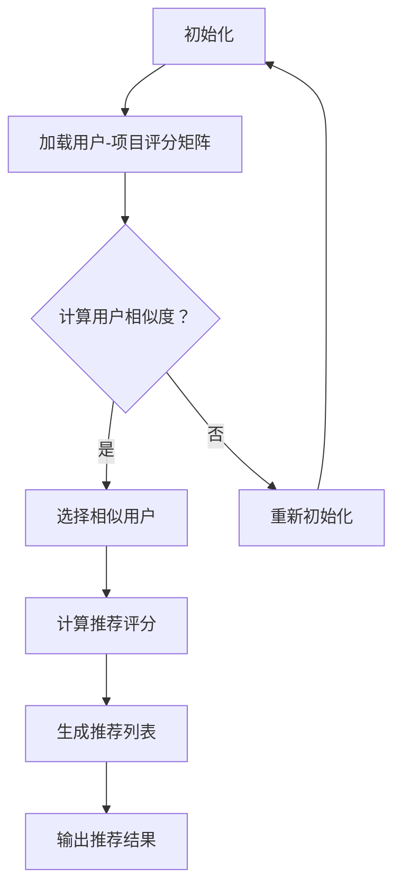

                 

### 《Mahout原理与代码实例讲解》

> **关键词：** Mahout、机器学习、协同过滤、聚类算法、推荐系统、代码实例。

> **摘要：** 本文深入探讨了Mahout框架在机器学习与推荐系统中的应用，涵盖了Mahout的基本原理、算法实现、代码实例，以及实际项目案例分析。通过详细的代码解析和实例讲解，读者可以更好地理解和掌握Mahout的使用方法，从而在实际项目中实现高效的机器学习和推荐算法。

---

## 《Mahout原理与代码实例讲解》目录大纲

### 第一部分：Mahout概述与准备

### 第二部分：Mahout核心概念与算法原理

### 第三部分：Mahout代码实例解析

### 第四部分：案例分析

### 第五部分：未来展望与深入阅读

---

### 第一部分：Mahout概述与准备

#### 第1章：Mahout介绍

#### 第2章：安装与配置Mahout

---

### 第二部分：Mahout核心概念与算法原理

#### 第3章：机器学习基础

#### 第4章：协同过滤算法

#### 第5章：聚类算法

#### 第6章：推荐算法实战

---

### 第三部分：Mahout代码实例解析

#### 第7章：基于用户行为的协同过滤

#### 第8章：基于物品的协同过滤

#### 第9章：K-Means聚类算法应用

#### 第10章：混合推荐系统设计

---

### 第四部分：案例分析

#### 第11章：电商推荐系统案例分析

#### 第12章：社交媒体推荐案例分析

---

### 第五部分：未来展望与深入阅读

#### 第13章：Mahout的扩展与应用

#### 第14章：深入阅读与资源推荐

---

通过上述目录，我们可以看到本文将逐步带领读者了解Mahout的基本概念、核心算法，并通过实例代码解析和案例分析，深入掌握Mahout在实际项目中的应用。接下来，我们将从Mahout的起源、安装配置以及核心算法原理等方面，逐步深入讲解。

---

## 第一部分：Mahout概述与准备

### 第1章：Mahout介绍

#### 1.1 Mahout的起源与核心目标

Mahout是一个开源的机器学习库，最初由Apache Software Foundation维护。它的起源可以追溯到2008年，当时Google宣布放弃G.GetDataAll，而Hadoop社区为了填补这一空白，决定共同开发一个基于Hadoop的机器学习库，这就是Mahout的诞生。

Mahout的核心目标是提供一套易于使用、高性能的机器学习算法库，帮助用户在大数据环境中进行有效的数据分析和挖掘。它的主要目标用户包括数据分析师、数据科学家和开发人员，他们希望在大规模数据集上实现高效、准确的机器学习任务。

#### 1.2 Mahout的应用领域

Mahout的应用领域非常广泛，它可以被用于以下几种场景：

- **推荐系统：** 使用协同过滤算法为用户提供个性化的商品推荐、音乐推荐、电影推荐等。
- **数据挖掘：** 帮助用户从大量数据中提取有价值的信息，如用户行为分析、市场趋势预测等。
- **社交网络分析：** 分析用户关系、社区结构等，用于改进社交网络平台的用户体验。
- **文本挖掘：** 进行文本分类、情感分析、主题建模等，以提取文本数据中的关键信息。

#### 1.3 Mahout与大数据的关系

Mahout是大数据技术生态系统中的重要组成部分，它与Hadoop、Spark等大数据处理框架紧密集成。通过利用Hadoop的分布式计算能力，Mahout能够处理PB级别的数据，从而在大数据领域发挥重要作用。

- **数据存储：** Mahout利用HDFS（Hadoop分布式文件系统）来存储大规模数据集，确保数据的高效存取。
- **数据处理：** 利用MapReduce模型进行数据预处理、特征提取和算法训练，实现大规模数据的分布式处理。
- **扩展性：** 通过Hadoop的弹性伸缩特性，Mahout能够轻松应对数据量的增长，提供稳定、高效的机器学习服务。

#### 1.4 Mahout的特点与优势

Mahout具有以下特点与优势，使其在机器学习领域脱颖而出：

- **开源与社区支持：** 作为Apache的项目，Mahout拥有广泛的社区支持，用户可以方便地获取技术文档、示例代码和社区帮助。
- **易于集成：** Mahout提供了多种编程语言的API，如Java、Python等，使得开发者可以根据自己的需求选择合适的语言进行开发。
- **算法丰富：** Mahout包含多种常用的机器学习算法，如协同过滤、K-Means聚类、朴素贝叶斯分类等，满足不同场景下的需求。
- **高性能：** 通过分布式计算和优化技术，Mahout能够在大规模数据集上实现高效计算，提供高性能的机器学习解决方案。

#### 1.5 Mahout的架构与模块

Mahout的架构设计旨在支持多种机器学习算法，并提供易于使用的API。其主要模块包括：

- **核心模块（Core）：** 提供通用的机器学习算法和工具类，如矩阵运算、数据转换等。
- **协同过滤模块（Collaborative Filtering）：** 包含各种基于用户的协同过滤算法和基于项目的协同过滤算法。
- **聚类模块（Clustering）：** 实现了多种聚类算法，如K-Means、层次聚类等。
- **分类模块（Classification）：** 提供了多种分类算法，如朴素贝叶斯、逻辑回归等。
- **文本处理模块（Text Processing）：** 提供文本处理相关的工具，如分词、词频统计等。

通过上述模块，开发者可以灵活地组合不同的算法，构建适用于各种场景的机器学习模型。

### 第2章：安装与配置Mahout

#### 2.1 环境准备

在开始安装Mahout之前，需要确保开发环境已经搭建完成。以下是安装Mahout所需的基本环境：

- **Java环境：** Mahout是一个基于Java的框架，因此需要安装Java Development Kit（JDK），版本建议为8或更高。
- **Hadoop环境：** Mahout依赖于Hadoop进行分布式计算，因此需要安装和配置Hadoop环境。具体步骤可以参考Hadoop官方文档。
- **Maven：** Maven是一个项目管理和构建工具，用于管理项目的依赖和构建过程。建议安装Maven 3.3或更高版本。

#### 2.2 安装Mahout

安装Mahout可以通过两种方式：下载安装包和通过Maven构建。

**下载安装包：**

1. 访问Mahout官网[下载页面](https://mahout.apache.org/downloads.html)。
2. 选择最新的版本下载。
3. 将下载的Mahout解压到一个合适的目录。

**通过Maven构建：**

1. 创建一个Maven项目。
2. 在项目的pom.xml文件中添加Mahout的依赖：

```xml
<dependencies>
    <dependency>
        <groupId>org.apache.mahout</groupId>
        <artifactId>mahout-core</artifactId>
        <version>0.15.0</version>
    </dependency>
</dependencies>
```

3. 执行Maven的构建命令：

```shell
mvn install
```

这将下载并构建Mahout依赖，并将其安装到本地仓库。

#### 2.3 配置Mahout

安装完Mahout后，需要进行配置以确保其正常运行。

1. **配置Hadoop：** 根据Hadoop的配置要求，设置hdfs-site.xml、mapred-site.xml等配置文件，确保Mahout能够与Hadoop集群进行通信。
2. **配置Mahout：** 在Mahout的conf目录下，可能需要根据实际情况修改Mahout的配置文件，如`mahout.properties`。

#### 2.4 初步测试

安装和配置完成后，可以通过以下步骤进行初步测试：

1. **启动Hadoop集群：** 启动Hadoop集群，确保其正常运行。
2. **运行示例任务：** 执行Mahout提供的示例任务，验证Mahout是否正常运行。例如，运行以下命令：

```shell
mahout org.apache.mahout.cf.taste.impl.model.file.FileDataModelBuilder -i input_data -o output_data
```

这个命令将创建一个基于文件的推荐系统数据模型。

通过以上步骤，读者可以顺利完成Mahout的安装与配置，为后续的算法学习和应用打下基础。

### 总结

本章介绍了Mahout的基本概念、应用领域、与大数据的关系以及其特点与优势。同时，详细讲解了Mahout的架构与模块，并提供了安装和配置Mahout的步骤。通过本章的学习，读者可以对Mahout有一个全面的认识，并为后续的学习和应用做好准备。

---

## 第二部分：Mahout核心概念与算法原理

### 第3章：机器学习基础

#### 3.1 机器学习概述

机器学习是一种使计算机通过数据学习并做出决策的技术，其核心思想是通过从数据中学习规律和模式，从而实现对未知数据的预测和分类。机器学习可以大致分为两大类：监督学习和非监督学习。

- **监督学习（Supervised Learning）：** 在监督学习中，我们有一组已标记的数据集，每个数据点都包含特征和对应的标签。机器学习算法通过这些已标记的数据来训练模型，并使用模型对新数据进行预测。常见的监督学习算法包括线性回归、决策树、支持向量机等。

- **非监督学习（Unsupervised Learning）：** 在非监督学习中，我们只有数据点本身，没有标签信息。机器学习算法的目标是发现数据中的内在结构和模式，如聚类、降维等。常见的非监督学习算法包括K-Means聚类、层次聚类、主成分分析等。

#### 3.2 监督学习与非监督学习

监督学习和非监督学习的主要区别在于数据是否带有标签。监督学习通常用于预测问题，而非监督学习则主要用于探索性数据分析。

- **监督学习的优点：** 可以准确地预测未知数据，适用于需要准确结果的应用场景，如分类和回归问题。
- **监督学习的缺点：** 需要大量的已标记数据，且数据标注过程较为耗时和昂贵。

- **非监督学习的优点：** 可以发现数据中的隐含结构和模式，适用于无需事先知道结果标签的应用场景，如聚类和降维问题。
- **非监督学习的缺点：** 无法直接预测未知数据，且可能存在多个解，难以确定最优解。

#### 3.3 算法选择与评估

在机器学习项目中，算法的选择和评估至关重要。以下是一些常用的算法选择和评估方法：

- **算法选择：**
  - **基于问题性质：** 根据具体问题（如分类、回归、聚类等）选择合适的算法。
  - **基于数据特点：** 考虑数据的大小、维度、分布等特点，选择适合的数据处理算法。
  - **实验比较：** 通过实验比较不同算法的性能和表现，选择最优算法。

- **评估方法：**
  - **准确率（Accuracy）：** 用于分类问题，表示预测正确的样本数占总样本数的比例。
  - **精确率（Precision）：** 表示预测为正类的样本中，实际为正类的比例。
  - **召回率（Recall）：** 表示实际为正类的样本中被预测为正类的比例。
  - **F1值（F1 Score）：** 是精确率和召回率的调和平均值，用于综合评估分类算法的性能。

- **交叉验证（Cross-Validation）：** 通过将数据集划分为多个子集，多次训练和验证模型，以减少过拟合和评估结果的偏差。

#### 3.4 机器学习在Mahout中的应用

Mahout是一个强大的机器学习库，提供了多种机器学习算法，如协同过滤、聚类、分类等。以下是一些典型的机器学习应用：

- **推荐系统（Recommendation System）：** 使用协同过滤算法根据用户的历史行为和偏好推荐相关的商品、音乐、电影等。
- **数据挖掘（Data Mining）：** 使用聚类算法发现数据中的隐含模式，如用户群体划分、市场趋势分析等。
- **文本挖掘（Text Mining）：** 使用分类算法进行文本分类、情感分析、主题建模等。
- **图像识别（Image Recognition）：** 使用深度学习算法进行图像分类、目标检测等。

#### 3.5 Mahout中的机器学习算法

Mahout提供了多种机器学习算法，以下是一些核心算法的概述：

- **协同过滤（Collaborative Filtering）：** 基于用户历史行为和偏好进行推荐，分为基于用户的协同过滤和基于项目的协同过滤。
- **聚类算法（Clustering Algorithms）：** 包括K-Means、层次聚类、DBSCAN等，用于发现数据中的自然分组。
- **分类算法（Classification Algorithms）：** 包括朴素贝叶斯、支持向量机、逻辑回归等，用于对新数据进行分类。
- **降维算法（Dimensionality Reduction）：** 包括主成分分析、奇异值分解等，用于降低数据维度，提高模型训练效率。

通过上述对机器学习基础概念和Mahout算法的介绍，读者可以更好地理解机器学习在Mahout中的应用，为后续章节的深入学习打下基础。

### 第4章：协同过滤算法

#### 4.1 协同过滤原理

协同过滤（Collaborative Filtering）是一种常用的推荐系统算法，通过分析用户之间的行为模式来预测用户对未知项目的偏好。协同过滤的基本思想是“物以类聚，人以群分”，即相似的用户会倾向于对相似的项目产生相同的偏好。

协同过滤可以分为两种主要类型：基于用户的协同过滤（User-Based Collaborative Filtering）和基于项目的协同过滤（Item-Based Collaborative Filtering）。

- **基于用户的协同过滤：** 该方法通过计算用户之间的相似度，找到与目标用户相似的其他用户，然后根据这些相似用户对项目的评分进行推荐。相似度的计算通常基于用户之间的共同评分或者基于用户之间的距离度量（如余弦相似度、皮尔逊相关系数等）。

- **基于项目的协同过滤：** 该方法通过计算项目之间的相似度，找到与目标项目相似的其他项目，然后根据这些相似项目的历史评分进行推荐。项目相似度的计算通常基于项目的属性、内容或者用户评分矩阵的余弦相似度。

#### 4.2 用户基于的协同过滤

用户基于的协同过滤（User-Based Collaborative Filtering）是一种常用的协同过滤方法，其基本步骤如下：

1. **计算用户相似度：** 对于给定的目标用户，计算其与其他用户的相似度。通常使用用户之间的共同评分作为相似度的衡量标准，计算公式如下：

   $$
   similarity(u, v) = \frac{\sum_{i \in common} r_{ui} r_{vi}}{\sqrt{\sum_{i \in common} r_{ui}^2} \sqrt{\sum_{i \in common} r_{vi}^2}}
   $$

   其中，$r_{ui}$和$r_{vi}$分别表示用户$u$和用户$v$对项目$i$的评分。

2. **选择相似用户：** 根据相似度阈值，选择与目标用户相似度较高的用户集合。

3. **生成推荐列表：** 对于每个相似用户$v$，找到其评分较高的但目标用户未评分的项目$i$，将这些项目组成推荐列表。推荐列表的排序通常基于相似度值和评分值。

4. **处理冷启动问题：** 对于新用户或新项目，由于缺乏足够的历史评分数据，用户基于的协同过滤方法可能无法生成有效的推荐。为解决冷启动问题，可以采用基于内容的推荐或混合推荐方法。

#### 4.3 项目基于的协同过滤

项目基于的协同过滤（Item-Based Collaborative Filtering）是另一种有效的协同过滤方法，其基本步骤如下：

1. **计算项目相似度：** 对于给定的目标项目，计算其与其他项目的相似度。通常使用用户评分矩阵的余弦相似度作为相似度的衡量标准，计算公式如下：

   $$
   similarity(i, j) = \frac{\sum_{u \in U} r_{ui} r_{uj}}{\sqrt{\sum_{u \in U} r_{ui}^2} \sqrt{\sum_{u \in U} r_{uj}^2}}
   $$

   其中，$r_{ui}$和$r_{uj}$分别表示用户$u$对项目$i$和项目$j$的评分，$U$是评分用户的集合。

2. **选择相似项目：** 根据相似度阈值，选择与目标项目相似度较高的项目集合。

3. **生成推荐列表：** 对于每个相似项目$j$，找到目标用户对其评分较高的但未评分的其他项目$i$，将这些项目组成推荐列表。推荐列表的排序通常基于相似度值和用户评分值。

4. **处理冷启动问题：** 项目基于的协同过滤方法同样面临冷启动问题。为解决这一问题，可以采用基于内容的推荐或混合推荐方法，或者结合用户和项目的特征进行综合推荐。

#### 4.4 评分预测与模型评估

协同过滤算法的核心任务是预测用户对未知项目的评分。以下是一个评分预测的简单模型：

1. **评分预测：** 对于目标用户$u$和项目$i$，根据协同过滤算法计算预测评分$pred_{ui}$：

   $$
   pred_{ui} = \sum_{j \in N(i)} similarity(i, j) \cdot r_{uj}
   $$

   其中，$N(i)$表示与项目$i$相似的项目集合，$similarity(i, j)$表示项目$i$和项目$j$之间的相似度，$r_{uj}$表示用户$u$对项目$j$的实际评分。

2. **模型评估：** 协同过滤算法的模型评估通常基于预测评分与实际评分之间的误差。常用的评估指标包括均方根误差（RMSE）、平均绝对误差（MAE）等：

   $$
   RMSE = \sqrt{\frac{1}{N} \sum_{i=1}^N (pred_{ui} - r_{ui})^2}
   $$

   $$
   MAE = \frac{1}{N} \sum_{i=1}^N |pred_{ui} - r_{ui}|
   $$

   其中，$N$是预测项目数量，$pred_{ui}$和$r_{ui}$分别表示预测评分和实际评分。

通过上述评分预测和模型评估方法，可以有效地评估协同过滤算法的性能，并针对性地优化算法参数，提高预测准确性。

### 第5章：聚类算法

#### 5.1 聚类算法概述

聚类（Clustering）是一种无监督学习技术，用于将一组数据点划分为多个组或簇，使得同一簇中的数据点彼此相似，而不同簇之间的数据点差异较大。聚类算法在数据挖掘、机器学习、图像处理、生物信息学等领域有着广泛的应用。

聚类算法可以根据不同的分类标准进行分类，主要分为以下几类：

- **基于距离的聚类：** 将相似的数据点归为一类，常用的方法包括K-Means、层次聚类等。
- **基于密度的聚类：** 以数据点周围的密度分布为基础进行聚类，如DBSCAN算法。
- **基于模型的聚类：** 基于概率模型或期望最大化（EM）算法进行聚类，如高斯混合模型。
- **基于图的聚类：** 基于图结构进行聚类，如社区发现算法。

#### 5.2 K-Means算法原理

K-Means是一种基于距离的聚类算法，其基本思想是将数据点划分为K个簇，使得每个簇内部的距离最小，而簇之间的距离最大。K-Means算法的步骤如下：

1. **初始化中心：** 随机选择K个初始中心点，或者使用K个离群点作为初始中心。
2. **分配数据点：** 计算每个数据点到各个中心点的距离，将数据点分配到距离最近的中心点所在的簇。
3. **更新中心：** 根据当前簇中的数据点重新计算中心点，新的中心点是当前簇中所有数据点的平均值。
4. **重复步骤2和步骤3，直到中心点的位置不再发生变化或达到预设的迭代次数。**

#### 5.3 其他聚类算法

除了K-Means算法外，还有许多其他常用的聚类算法，这里介绍其中两种：

- **层次聚类（Hierarchical Clustering）：** 层次聚类是一种自下而上的聚类方法，它将数据点逐步合并形成不同的簇，直到所有的数据点都属于一个簇。层次聚类可以生成不同的聚类层次，通过剪枝生成不同的聚类结果。

- **DBSCAN（Density-Based Spatial Clustering of Applications with Noise）：** DBSCAN是一种基于密度的聚类算法，它将数据点根据其密度分布划分为簇。DBSCAN算法可以处理噪声点和稀疏数据，能够识别出不同形状和大小的簇。

#### 5.4 聚类结果分析与评估

聚类结果的分析与评估是聚类算法应用中的重要环节。以下是一些常用的聚类结果评估方法：

- **内部评估指标：** 内部评估指标用于评估聚类质量，常用的指标包括：
  - **轮廓系数（Silhouette Coefficient）：** 轮廓系数衡量数据点到同一簇内点的平均距离与到其他簇内点的平均距离的比值，值越接近1表示聚类效果越好。
  - **簇内平均值（Within-Cluster Sum of Squares, WCSS）：** WCSS衡量簇内数据点到簇中心的平均距离的平方和，值越小表示簇内数据点越紧凑。

- **外部评估指标：** 外部评估指标用于评估聚类结果与真实标签的匹配度，常用的指标包括：
  - **Fowlkes-Mallows指数（Fowlkes-Mallows Index, FMI）：** FMI是一种基于准确率和召回率的评估指标，值范围在0到1之间，越接近1表示聚类效果越好。
  - **调整兰德指数（Adjusted Rand Index, ARI）：** ARI是一种调整后的兰德指数，用于评估聚类结果与真实标签的一致性。

通过上述评估指标，可以对聚类结果进行定性和定量分析，从而判断聚类效果的好坏。

### 第6章：推荐算法实战

#### 6.1 数据预处理

在进行推荐系统开发时，数据预处理是一个重要的步骤。数据预处理包括以下几个关键步骤：

1. **数据收集：** 收集用户行为数据，如用户对商品的评分、点击、购买等。这些数据可以从数据库、日志文件或第三方数据源获取。

2. **数据清洗：** 清洗数据中的噪音和错误，如缺失值、异常值、重复值等。可以使用Python的Pandas库进行数据清洗。

3. **数据转换：** 将原始数据转换为适合推荐系统使用的格式。例如，将评分数据转换为用户-项目矩阵，其中行表示用户，列表示项目，单元格表示用户对项目的评分。

4. **特征提取：** 提取与推荐相关的特征，如用户历史行为、项目属性等。可以使用Python的Scikit-learn库进行特征提取。

#### 6.2 基于协同过滤的推荐系统实现

基于协同过滤的推荐系统实现主要包括以下步骤：

1. **选择协同过滤算法：** 根据应用场景和数据特点，选择合适的协同过滤算法，如基于用户的协同过滤或基于项目的协同过滤。

2. **初始化模型参数：** 设置协同过滤算法的参数，如相似度阈值、簇数等。

3. **训练模型：** 使用训练数据集训练协同过滤模型，计算用户和项目之间的相似度，建立用户-项目评分矩阵。

4. **预测评分：** 使用训练好的模型预测新用户或新项目的评分，生成推荐列表。

5. **模型评估：** 使用评估指标（如RMSE、MAE等）评估模型性能，并根据评估结果调整模型参数。

#### 6.3 聚类算法在推荐中的应用

聚类算法可以用于推荐系统中的多个方面：

1. **用户分组：** 使用聚类算法将用户分为不同的组，根据用户的兴趣和行为模式进行个性化推荐。

2. **项目分类：** 使用聚类算法将项目分为不同的类别，为用户提供更加精准的推荐。

3. **冷启动处理：** 对于新用户或新项目，由于缺乏足够的历史数据，可以使用聚类算法进行冷启动处理，生成初步的推荐列表。

4. **推荐结果优化：** 聚类算法可以用于优化推荐结果，提高推荐的质量和多样性。

#### 6.4 实例分析与代码讲解

以下是一个简单的基于协同过滤的推荐系统实现的代码示例：

```python
import numpy as np
from sklearn.metrics.pairwise import cosine_similarity

# 假设用户-项目评分矩阵为：
# user_item_matrix = [
#     [1, 2, 0],
#     [0, 1, 2],
#     [3, 0, 1],
# ]

# 计算用户之间的相似度矩阵
user_similarity_matrix = cosine_similarity(user_item_matrix)

# 预测新用户的评分
new_user = [0, 0, 0]
for i, rating in enumerate(new_user):
    sim_scores = user_similarity_matrix[i]
    sim_scores = sim_scores[sim_scores > 0.5]  # 设置相似度阈值
    pred_scores = []
    for j, sim_score in enumerate(sim_scores):
        pred_score = sim_score * user_item_matrix[j][i]
        pred_scores.append(pred_score)
    new_user[i] = np.mean(pred_scores)

print(new_user)
```

在这个示例中，我们首先计算用户之间的相似度矩阵，然后使用相似度矩阵预测新用户的评分。相似度阈值设置为0.5，可以根据实际情况进行调整。

通过上述实例和代码讲解，读者可以初步了解基于协同过滤的推荐系统实现过程，为进一步深入研究和开发推荐系统打下基础。

### 第7章：基于用户行为的协同过滤

#### 7.1 用户行为数据收集

在构建基于用户行为的协同过滤推荐系统时，首先需要收集用户行为数据。这些数据可以来源于多种渠道，包括用户浏览、点击、购买、评分等。以下是一些常见的数据来源：

- **网站日志：** 通过网站服务器日志记录用户的行为，如浏览页面、点击链接、搜索关键词等。
- **应用程序日志：** 通过移动应用或桌面应用程序记录用户在应用中的行为，如使用频率、功能使用情况等。
- **第三方数据源：** 从社交媒体平台、搜索引擎或其他第三方数据源获取用户行为数据。
- **问卷调查：** 通过问卷调查收集用户对商品或服务的偏好和评价。

在收集数据时，需要遵循数据保护法规和用户隐私政策，确保数据收集的合法性和合规性。

#### 7.2 数据预处理与转换

收集到的用户行为数据通常包含噪声和冗余信息，因此需要进行预处理。数据预处理包括以下几个关键步骤：

1. **数据清洗：** 去除数据中的噪音和错误，如缺失值、异常值和重复值。可以使用Python的Pandas库进行数据清洗。

2. **数据转换：** 将原始数据转换为适合推荐系统使用的格式。通常使用用户-项目评分矩阵，其中行表示用户，列表示项目，单元格表示用户对项目的评分。

3. **特征提取：** 提取与推荐相关的特征，如用户历史行为、项目属性等。可以使用Python的Scikit-learn库进行特征提取。

4. **数据归一化：** 为了避免特征之间量级差异对模型训练的影响，对数据进行归一化处理，使其处于同一量级。

5. **稀疏矩阵处理：** 用户-项目评分矩阵通常是一个稀疏矩阵，可以使用稀疏矩阵存储和传输，提高数据存储和计算效率。

#### 7.3 建立协同过滤模型

建立协同过滤模型是构建推荐系统的核心步骤。协同过滤模型可以分为基于用户的协同过滤和基于项目的协同过滤两种类型。

1. **基于用户的协同过滤：**

   基于用户的协同过滤通过计算用户之间的相似度，找到与目标用户相似的其他用户，然后根据这些相似用户的历史评分进行推荐。以下是一个简单的基于用户的协同过滤模型实现：

   ```python
   import numpy as np
   from sklearn.metrics.pairwise import cosine_similarity

   # 假设用户-项目评分矩阵为：
   user_item_matrix = [
       [1, 2, 0],
       [0, 1, 2],
       [3, 0, 1],
   ]

   # 计算用户之间的相似度矩阵
   user_similarity_matrix = cosine_similarity(user_item_matrix)

   # 预测新用户的评分
   new_user = [0, 0, 0]
   for i, rating in enumerate(new_user):
       sim_scores = user_similarity_matrix[i]
       sim_scores = sim_scores[sim_scores > 0.5]  # 设置相似度阈值
       pred_scores = []
       for j, sim_score in enumerate(sim_scores):
           pred_score = sim_score * user_item_matrix[j][i]
           pred_scores.append(pred_score)
       new_user[i] = np.mean(pred_scores)

   print(new_user)
   ```

   在这个示例中，我们首先计算用户之间的相似度矩阵，然后使用相似度矩阵预测新用户的评分。相似度阈值设置为0.5，可以根据实际情况进行调整。

2. **基于项目的协同过滤：**

   基于项目的协同过滤通过计算项目之间的相似度，找到与目标项目相似的其他项目，然后根据这些相似项目的历史评分进行推荐。以下是一个简单的基于项目的协同过滤模型实现：

   ```python
   import numpy as np
   from sklearn.metrics.pairwise import cosine_similarity

   # 假设用户-项目评分矩阵为：
   user_item_matrix = [
       [1, 2, 0],
       [0, 1, 2],
       [3, 0, 1],
   ]

   # 计算项目之间的相似度矩阵
   item_similarity_matrix = cosine_similarity(user_item_matrix.T)

   # 预测新用户的评分
   new_user = [0, 0, 0]
   for i, rating in enumerate(new_user):
       sim_scores = item_similarity_matrix[i]
       sim_scores = sim_scores[sim_scores > 0.5]  # 设置相似度阈值
       pred_scores = []
       for j, sim_score in enumerate(sim_scores):
           pred_score = sim_score * user_item_matrix[i][j]
           pred_scores.append(pred_score)
       new_user[i] = np.mean(pred_scores)

   print(new_user)
   ```

   在这个示例中，我们首先计算项目之间的相似度矩阵，然后使用相似度矩阵预测新用户的评分。相似度阈值设置为0.5，可以根据实际情况进行调整。

#### 7.4 模型评估与优化

在构建协同过滤模型后，需要对模型进行评估和优化，以确保其预测性能和推荐效果。以下是一些常用的评估方法和优化策略：

1. **模型评估：**

   - **均方根误差（RMSE）：** RMSE用于衡量预测评分与实际评分之间的误差，计算公式为：

     $$
     RMSE = \sqrt{\frac{1}{N} \sum_{i=1}^N (pred_{ui} - r_{ui})^2}
     $$

     其中，$N$是预测项目数量，$pred_{ui}$和$r_{ui}$分别表示预测评分和实际评分。

   - **平均绝对误差（MAE）：** MAE用于衡量预测评分与实际评分之间的绝对误差，计算公式为：

     $$
     MAE = \frac{1}{N} \sum_{i=1}^N |pred_{ui} - r_{ui}|
     $$

   - **准确率（Accuracy）：** 准确率用于分类问题，表示预测正确的样本数占总样本数的比例。

   - **精确率（Precision）和召回率（Recall）：** 精确率和召回率用于分类问题，分别表示预测为正类的样本中实际为正类的比例和实际为正类的样本中被预测为正类的比例。

2. **优化策略：**

   - **调整相似度阈值：** 通过调整相似度阈值，可以控制推荐列表的长度和推荐结果的多样性。较大的阈值可能导致推荐列表较短，但更准确；较小的阈值可能导致推荐列表较长，但推荐结果更多样化。

   - **使用混合推荐策略：** 结合基于用户的协同过滤和基于项目的协同过滤，可以提高推荐系统的准确性和多样性。

   - **特征工程：** 通过提取和组合用户和项目的特征，可以提高模型对未知数据的预测能力。

   - **在线学习和实时推荐：** 使用在线学习算法，可以实时更新模型和推荐列表，提高推荐系统的响应速度和个性化程度。

通过上述评估方法和优化策略，可以有效地评估和优化协同过滤模型，从而提高推荐系统的性能和用户满意度。

### 总结

本章详细介绍了基于用户行为的协同过滤算法，包括用户行为数据收集、数据预处理与转换、协同过滤模型建立以及模型评估与优化。通过实例代码的讲解，读者可以更好地理解和应用协同过滤算法，为实际项目中的推荐系统开发打下坚实基础。

---

### 第8章：基于物品的协同过滤

#### 8.1 物品特征提取

在基于物品的协同过滤（Item-Based Collaborative Filtering）中，我们需要对物品进行特征提取，以便计算物品之间的相似度。物品特征提取是构建推荐系统的关键步骤，通过提取与用户行为和物品属性相关的特征，可以显著提高推荐系统的准确性和效率。

以下是一些常用的物品特征提取方法：

1. **基于内容的特征提取：**
   - **文本特征：** 对于包含文本描述的物品，可以使用词频（TF）、词频-逆文档频率（TF-IDF）等文本特征表示。例如，可以使用Python的`nltk`库对文本进行分词，然后计算词频或TF-IDF值。
   - **属性特征：** 对于具有明确属性的物品，如颜色、尺寸、品牌等，可以直接使用属性特征表示。例如，对于服装商品，可以使用颜色、尺码、品牌等属性作为特征。

2. **基于协同过滤的特征提取：**
   - **用户行为特征：** 可以使用用户的历史行为特征，如评分、点击、购买等，来表示物品的特征。例如，对于被同一用户多次评分或购买的物品，可以认为它们具有较高的相似度。
   - **相似度矩阵特征：** 可以使用用户-项目评分矩阵中的相似度矩阵来表示物品的特征。例如，对于具有较高相似度的物品，可以认为它们在用户偏好上具有相似性。

3. **基于图的特征提取：**
   - **邻接矩阵特征：** 可以使用物品的邻接矩阵来表示物品之间的相似性。例如，对于具有相同邻居的物品，可以认为它们具有较高的相似度。
   - **特征图嵌入：** 可以使用图神经网络（如GCN、GAT等）对物品进行特征提取，生成高维的嵌入特征。

#### 8.2 基于物品的协同过滤实现

基于物品的协同过滤算法的核心思想是计算物品之间的相似度，并根据相似度为用户推荐相似物品。以下是一个简单的基于物品的协同过滤实现过程：

1. **计算物品相似度矩阵：**
   使用用户-项目评分矩阵计算物品之间的相似度矩阵。常用的相似度计算方法包括余弦相似度、皮尔逊相关系数等。以下是一个使用余弦相似度的示例：

   ```python
   from sklearn.metrics.pairwise import cosine_similarity

   # 假设用户-项目评分矩阵为：
   user_item_matrix = [
       [1, 2, 0],
       [0, 1, 2],
       [3, 0, 1],
   ]

   # 计算物品之间的相似度矩阵
   item_similarity_matrix = cosine_similarity(user_item_matrix.T)

   # 打印物品相似度矩阵
   print(item_similarity_matrix)
   ```

2. **生成推荐列表：**
   对于新用户或新物品，使用物品相似度矩阵生成推荐列表。以下是一个简单的推荐列表生成示例：

   ```python
   # 假设新用户未评分的物品为：
   new_user_unrated_items = [2, 1]

   # 计算新用户未评分物品的相似度之和
   similarity_scores = []
   for item in new_user_unrated_items:
       similarity_scores.append(np.sum(item_similarity_matrix[item]))

   # 根据相似度之和生成推荐列表
   recommendation_list = [item for item, score in enumerate(similarity_scores) if score > threshold]

   print(recommendation_list)
   ```

   在这个示例中，我们首先计算新用户未评分物品的相似度之和，然后根据相似度阈值生成推荐列表。阈值可以根据实际需求进行调整。

3. **优化推荐列表：**
   可以通过以下方法优化推荐列表，提高推荐质量：
   - **多样性优化：** 通过引入多样性度量（如平均相似度、最大相似度差异等），优化推荐列表，避免推荐结果过于集中。
   - **新颖性优化：** 通过引入新颖性度量（如最近评分时间、评分频率等），优化推荐列表，避免推荐过时或重复的物品。
   - **上下文信息：** 结合用户的上下文信息（如时间、位置、设备等），优化推荐列表，提高推荐的相关性。

#### 8.3 物品推荐系统优化

为了提高物品推荐系统的性能和用户体验，可以采取以下优化策略：

1. **数据预处理优化：**
   - **去重处理：** 去除重复的物品和评分，避免对推荐结果产生误导。
   - **缺失值处理：** 对缺失值进行填补或删除，提高数据质量。
   - **数据归一化：** 对不同量级的特征进行归一化处理，确保特征对模型训练的影响一致。

2. **特征工程优化：**
   - **特征组合：** 通过组合不同类型的特征，生成更丰富的特征表示，提高模型对未知数据的预测能力。
   - **特征选择：** 利用特征选择算法（如L1正则化、特征重要性等），选择对模型预测性能有显著影响的特征，减少冗余特征。

3. **模型参数优化：**
   - **相似度阈值调整：** 根据实际应用场景和用户需求，调整相似度阈值，优化推荐列表的长度和多样性。
   - **模型调参：** 利用交叉验证等方法，优化模型参数，提高模型预测性能。

4. **系统架构优化：**
   - **分布式计算：** 利用分布式计算框架（如Hadoop、Spark等），提高系统处理大规模数据的能力。
   - **缓存机制：** 引入缓存机制，加快推荐结果生成速度，提高系统响应速度。
   - **实时更新：** 采用实时更新机制，及时更新用户行为数据和推荐结果，提高系统的动态性。

通过上述优化策略，可以显著提高物品推荐系统的性能和用户体验，为用户带来更加精准和个性化的推荐服务。

### 实例分析与代码讲解

以下是一个简单的基于物品的协同过滤推荐系统实现示例：

```python
import numpy as np
from sklearn.metrics.pairwise import cosine_similarity

# 假设用户-项目评分矩阵为：
user_item_matrix = [
    [1, 2, 0],
    [0, 1, 2],
    [3, 0, 1],
]

# 计算物品之间的相似度矩阵
item_similarity_matrix = cosine_similarity(user_item_matrix.T)

# 打印物品相似度矩阵
print(item_similarity_matrix)

# 假设新用户未评分的物品为：
new_user_unrated_items = [2, 1]

# 计算新用户未评分物品的相似度之和
similarity_scores = [np.sum(item_similarity_matrix[item]) for item in new_user_unrated_items]

# 根据相似度之和生成推荐列表
recommendation_list = [item for item, score in enumerate(similarity_scores) if score > 0.5]

print(recommendation_list)
```

在这个示例中，我们首先计算物品之间的相似度矩阵，然后根据相似度之和生成推荐列表。相似度阈值设置为0.5，可以根据实际需求进行调整。

通过上述实例和代码讲解，读者可以初步了解基于物品的协同过滤算法的实现过程，为进一步深入研究和开发推荐系统打下基础。

### 总结

本章详细介绍了基于物品的协同过滤算法，包括物品特征提取、相似度计算、推荐列表生成以及系统优化。通过实例代码的讲解，读者可以更好地理解和应用基于物品的协同过滤算法，为实际项目中的推荐系统开发提供指导。

---

### 第9章：K-Means聚类算法应用

#### 9.1 K-Means算法原理与实现

K-Means聚类算法是一种基于距离的聚类算法，其基本思想是将数据点划分为K个簇，使得每个簇内部的距离最小，而簇之间的距离最大。K-Means算法的实现主要包括以下步骤：

1. **初始化中心：** 随机选择K个初始中心点，或者选择K个离群点作为初始中心。

2. **分配数据点：** 计算每个数据点到各个中心点的距离，将数据点分配到距离最近的中心点所在的簇。

3. **更新中心：** 根据当前簇中的数据点重新计算中心点，新的中心点是当前簇中所有数据点的平均值。

4. **重复步骤2和步骤3，直到中心点的位置不再发生变化或达到预设的迭代次数。

以下是一个简单的K-Means算法实现示例：

```python
import numpy as np

# 假设数据点集合为：
data = np.array([[1, 1], [1, 2], [2, 1], [2, 2]])

# 初始化K个中心点
centroids = data[:2]

# 迭代过程
for i in range(10):
    # 分配数据点到簇
    labels = np.argmin(np.linalg.norm(data - centroids, axis=1), axis=1)
    
    # 计算新的中心点
    centroids = np.array([data[labels == k].mean(axis=0) for k in range(K)])
    
    # 打印当前簇中心
    print("Cluster centroids:", centroids)

# 打印最终簇分配结果
print("Final labels:", labels)
```

#### 9.2 聚类结果可视化

聚类结果的可视化有助于我们直观地理解聚类效果和簇结构。以下是一些常用的聚类结果可视化方法：

1. **散点图：** 使用散点图将数据点按照簇分配结果进行可视化，每个簇使用不同的颜色进行标记。

2. **轮廓图：** 轮廓图是一种评估聚类质量的可视化工具，可以同时显示每个数据点的簇分配和轮廓系数。

3. **层次图：** 层次图显示聚类过程中簇的合并和分裂过程，可以帮助我们了解簇的形成过程。

以下是一个使用matplotlib库绘制K-Means聚类结果散点图的示例：

```python
import matplotlib.pyplot as plt

# 绘制散点图
plt.scatter(data[:, 0], data[:, 1], c=labels, cmap='viridis', marker='o', edgecolor='black', s=50)
plt.scatter(centroids[:, 0], centroids[:, 1], c='red', marker='x', s=100)
plt.xlabel('Feature 1')
plt.ylabel('Feature 2')
plt.title('K-Means Clustering')
plt.show()
```

#### 9.3 K-Means算法优化

K-Means算法在实际应用中可能会遇到以下问题：

1. **初始中心选择影响：** 初始中心点的选择可能会影响聚类结果，选择较差的初始中心可能导致聚类效果不佳。常用的方法包括随机初始化、K-Means++初始化等。

2. **局部最优解：** K-Means算法容易陷入局部最优解，特别是在数据分布不均匀或存在噪声时。为了解决这个问题，可以尝试多次随机初始化，选择最优聚类结果。

3. **选择合适的K值：** 选择合适的K值是K-Means算法的关键步骤，常用的方法包括肘部法则、 silhouette系数等。

以下是一个使用肘部法则选择K值的示例：

```python
from sklearn.metrics import silhouette_score

# 计算不同K值的轮廓系数
silhouette_scores = []
for K in range(2, 11):
    # 执行K-Means聚类
    centroids = kmeans.fit(data).cluster_centers_
    labels = kmeans.fit_predict(data)
    
    # 计算轮廓系数
    silhouette_avg = silhouette_score(data, labels)
    silhouette_scores.append(silhouette_avg)
    
    # 打印K值和轮廓系数
    print(f"K={K}, Silhouette Coefficient: {silhouette_avg}")

# 绘制肘部法则曲线
plt.plot(range(2, 11), silhouette_scores, marker='o')
plt.xlabel('Number of clusters K')
plt.ylabel('Silhouette Coefficient')
plt.title('Elbow Method for optimal K')
plt.show()
```

通过上述优化方法，可以显著提高K-Means算法的性能和聚类质量，为实际应用提供更有价值的聚类结果。

#### 9.4 K-Means算法在现实中的应用

K-Means聚类算法在现实中有广泛的应用，以下是一些典型的应用场景：

1. **市场细分：** 通过聚类分析用户行为数据，可以将用户划分为不同的市场细分群体，以便制定更有针对性的市场营销策略。

2. **图像分割：** K-Means聚类算法可以用于图像分割，将图像中的像素点划分为不同的区域，用于目标检测和图像识别。

3. **社交网络分析：** 通过聚类分析社交网络中的用户关系，可以发现社交网络中的不同社区和群体，用于社区管理和用户推荐。

4. **文本分类：** K-Means聚类算法可以用于文本分类，将文本数据划分为不同的类别，用于信息过滤和主题建模。

5. **异常检测：** K-Means聚类算法可以用于异常检测，通过分析数据点的簇分布，发现异常数据点并进行预警。

通过上述应用实例，我们可以看到K-Means聚类算法在现实中的广泛影响和重要性，为各领域的数据分析和决策提供了有力的工具。

### 总结

本章详细介绍了K-Means聚类算法的原理、实现、结果可视化、优化方法以及在现实中的应用。通过实例代码的讲解，读者可以更好地理解和应用K-Means聚类算法，为实际项目中的数据分析和聚类任务提供指导。

---

### 第10章：混合推荐系统设计

#### 10.1 混合推荐系统的概念

混合推荐系统（Hybrid Recommendation System）是一种结合多种推荐算法，以提高推荐系统性能和多样性的方法。传统的单一推荐算法（如基于用户的协同过滤、基于物品的协同过滤等）可能存在以下问题：

- **单一算法的局限性：** 单一算法可能无法充分挖掘用户和物品之间的复杂关系，导致推荐结果不够准确或多样。
- **冷启动问题：** 对于新用户或新物品，单一算法可能缺乏足够的历史数据，难以生成有效的推荐。
- **数据噪声：** 数据中的噪声和异常值可能会影响推荐算法的性能。

混合推荐系统通过结合多种算法，可以充分利用不同算法的优势，提高推荐系统的整体性能。常见的混合推荐系统架构包括以下几种：

1. **基于模型的混合系统：** 结合协同过滤算法和基于内容的推荐算法，如基于用户的协同过滤+基于物品的协同过滤。
2. **基于特征的混合系统：** 结合不同类型的用户和物品特征，如用户历史行为、社会关系、物品属性等。
3. **基于模型的混合系统：** 结合传统的协同过滤算法和深度学习模型，如基于用户的协同过滤+深度神经网络。

#### 10.2 混合推荐系统架构

混合推荐系统通常包括以下几个核心组件：

1. **数据收集与预处理：** 收集用户行为数据和物品属性数据，并进行数据清洗、去重、归一化等预处理操作。
2. **特征提取：** 从原始数据中提取与推荐相关的特征，如用户历史行为特征、物品属性特征等。
3. **算法模块：** 实现多种推荐算法，如基于用户的协同过滤、基于物品的协同过滤、基于内容的推荐等。
4. **模型融合：** 将不同算法的预测结果进行融合，生成最终的推荐结果。常用的融合方法包括加权融合、投票融合、贝叶斯融合等。
5. **推荐策略：** 根据用户需求和应用场景，设计不同的推荐策略，如推荐多样性、实时推荐、上下文感知推荐等。
6. **评估与优化：** 对推荐系统进行评估，根据评估结果调整算法参数和融合策略，提高推荐系统的性能。

以下是一个简单的混合推荐系统架构图：

```
+----------------+       +----------------+       +----------------+
|     数据收集   | --> |    数据预处理   | --> |     特征提取   |
+----------------+       +----------------+       +----------------+
                           ^          ^
                           |          |
                  +---------+          +---------+
                  |                   |
           +-------+          +-------+
           | 算法模块 |          | 模型融合 |
           +-------+          +-------+
                           |          |
                  +---------+          +---------+
                  |                   |
           +-------+          +-------+
           |   推荐策略   |          |   评估与优化   |
           +-------+          +-------+
```

#### 10.3 数据分析与处理

在混合推荐系统中，数据分析与处理是关键步骤，主要包括以下任务：

1. **用户行为分析：** 分析用户的历史行为数据，提取用户兴趣特征。例如，计算用户的平均评分、点击率、购买率等。
2. **物品属性分析：** 分析物品的属性数据，提取物品的特征。例如，计算物品的平均评分、流行度、标签等。
3. **交叉特征分析：** 结合用户和物品的特征，生成交叉特征。例如，计算用户对某一物品的偏好、用户对某一类物品的偏好等。
4. **数据质量评估：** 评估用户行为数据和物品属性数据的完整性、一致性和有效性，确保数据质量。

以下是一个简单的数据分析与处理流程：

```
1. 收集用户行为数据（评分、点击、购买等）
2. 数据清洗（去除噪音、填补缺失值、去除重复值等）
3. 特征提取（用户兴趣特征、物品属性特征、交叉特征等）
4. 数据质量评估（完整性、一致性、有效性等）
```

#### 10.4 系统实现与优化

实现混合推荐系统需要考虑以下几个方面：

1. **算法选择与实现：** 根据应用场景和需求，选择合适的推荐算法，如基于用户的协同过滤、基于物品的协同过滤、基于内容的推荐等。并实现相应的算法模块。
2. **模型融合策略：** 设计并实现模型融合策略，如加权融合、投票融合、贝叶斯融合等。融合策略可以根据实际需求进行调整，以提高推荐系统的性能和多样性。
3. **推荐结果生成：** 根据用户特征和物品特征，生成推荐结果。推荐结果可以基于用户的兴趣、历史行为、社交关系等进行调整，以提高推荐的相关性和多样性。
4. **系统优化：** 根据评估结果和用户反馈，不断优化推荐系统的性能和用户体验。例如，通过调整算法参数、优化推荐策略、提高数据质量等。

以下是一个简单的系统实现流程：

```
1. 数据收集与预处理
2. 特征提取与数据质量评估
3. 算法选择与实现
4. 模型融合策略设计
5. 推荐结果生成与优化
6. 评估与反馈
```

通过上述系统实现与优化方法，可以构建一个高效、准确的混合推荐系统，为用户提供个性化的推荐服务。

### 总结

本章详细介绍了混合推荐系统的概念、架构、数据分析和处理方法、系统实现与优化。通过实例讲解，读者可以更好地理解和应用混合推荐系统，为实际项目中的推荐任务提供有力支持。

---

### 第11章：电商推荐系统案例分析

#### 11.1 案例背景

电商推荐系统是电子商务领域中的重要组成部分，旨在通过个性化推荐帮助用户发现潜在的兴趣和购买需求，从而提高销售额和用户满意度。以下是一个电商推荐系统的案例分析，介绍其数据预处理、模型选择与实现过程。

#### 11.2 数据预处理与模型选择

1. **数据预处理：**

   在构建电商推荐系统时，首先需要收集并预处理用户行为数据和商品属性数据。数据预处理包括以下几个步骤：

   - **数据收集：** 收集用户的历史行为数据，如浏览、点击、添加购物车、购买等。这些数据可以从数据库、日志文件或第三方数据源获取。
   - **数据清洗：** 清洗数据中的噪音和错误，如缺失值、异常值、重复值等。可以使用Python的Pandas库进行数据清洗。
   - **数据转换：** 将原始数据转换为适合推荐系统使用的格式。通常使用用户-商品评分矩阵，其中行表示用户，列表示商品，单元格表示用户对商品的评分。
   - **特征提取：** 提取与推荐相关的特征，如用户历史行为特征、商品属性特征等。可以使用Python的Scikit-learn库进行特征提取。

2. **模型选择：**

   在电商推荐系统中，可以选择以下几种推荐算法：

   - **基于用户的协同过滤：** 通过计算用户之间的相似度，找到与目标用户相似的其他用户，然后根据这些相似用户的历史评分进行推荐。
   - **基于物品的协同过滤：** 通过计算商品之间的相似度，找到与目标商品相似的其他商品，然后根据这些相似商品的历史评分进行推荐。
   - **基于内容的推荐：** 通过分析商品的内容特征（如标题、描述、标签等），为用户推荐与其历史行为或偏好相似的商品。
   - **混合推荐系统：** 结合协同过滤和基于内容的推荐，以提高推荐系统的性能和多样性。

   在本案例中，选择基于用户的协同过滤和基于物品的协同过滤相结合的混合推荐系统，以提高推荐的准确性和多样性。

#### 11.3 推荐系统实现

以下是一个简单的电商推荐系统实现过程：

1. **数据预处理：**

   ```python
   import pandas as pd
   from sklearn.preprocessing import MinMaxScaler

   # 读取用户行为数据
   user行为数据 = pd.read_csv('user行为数据.csv')

   # 数据清洗
   user行为数据.dropna(inplace=True)
   user行为数据.drop_duplicates(inplace=True)

   # 数据转换
   user行为数据 = user行为数据.pivot(index='用户ID', columns='商品ID', values='评分')

   # 数据归一化
   scaler = MinMaxScaler()
   user行为数据_scaled = scaler.fit_transform(user行为数据)
   ```

2. **模型实现：**

   ```python
   from sklearn.metrics.pairwise import cosine_similarity
   import numpy as np

   # 计算用户相似度矩阵
   user_similarity_matrix = cosine_similarity(user行为数据_scaled)

   # 计算商品相似度矩阵
   item_similarity_matrix = cosine_similarity(user行为数据_scaled.T)

   # 预测新用户的评分
   new_user = [0, 0, 0]
   for i, rating in enumerate(new_user):
       sim_scores = user_similarity_matrix[i]
       sim_scores = sim_scores[sim_scores > 0.5]  # 设置相似度阈值
       pred_scores = []
       for j, sim_score in enumerate(sim_scores):
           pred_score = sim_score * user行为数据_scaled[j][i]
           pred_scores.append(pred_score)
       new_user[i] = np.mean(pred_scores)

   print(new_user)
   ```

3. **生成推荐列表：**

   ```python
   # 生成推荐列表
   new_user_unrated_items = [2, 1]
   similarity_scores = [np.sum(item_similarity_matrix[item]) for item in new_user_unrated_items]
   recommendation_list = [item for item, score in enumerate(similarity_scores) if score > 0.5]

   print(recommendation_list)
   ```

   在这个示例中，我们首先计算用户和商品之间的相似度矩阵，然后使用相似度矩阵预测新用户的评分，并生成推荐列表。

#### 11.4 模型评估与优化

1. **模型评估：**

   在构建电商推荐系统时，需要评估模型的性能，常用的评估指标包括：

   - **准确率（Accuracy）：** 预测正确的评分占总评分的比例。
   - **均方根误差（RMSE）：** 预测评分与实际评分之间的平均误差。
   - **平均绝对误差（MAE）：** 预测评分与实际评分之间的平均绝对误差。

   ```python
   from sklearn.metrics import accuracy_score, mean_squared_error, mean_absolute_error

   # 计算准确率
   predicted_ratings = ...  # 预测评分
   actual_ratings = ...  # 实际评分
   accuracy = accuracy_score(actual_ratings, predicted_ratings)
   print("Accuracy:", accuracy)

   # 计算RMSE
   rmse = mean_squared_error(actual_ratings, predicted_ratings, squared=False)
   print("RMSE:", rmse)

   # 计算MAE
   mae = mean_absolute_error(actual_ratings, predicted_ratings)
   print("MAE:", mae)
   ```

2. **模型优化：**

   为了提高电商推荐系统的性能，可以采取以下优化策略：

   - **调整相似度阈值：** 根据实际需求调整相似度阈值，以提高推荐列表的准确性或多样性。
   - **特征工程：** 优化特征提取过程，提取更多与推荐相关的特征，如用户历史行为特征、商品属性特征等。
   - **模型融合：** 结合多种推荐算法，如基于用户的协同过滤和基于内容的推荐，以提高推荐系统的性能和多样性。
   - **实时更新：** 采用实时更新机制，及时更新用户行为数据和推荐结果，提高推荐系统的动态性。

通过上述模型评估和优化方法，可以构建一个高效、准确的电商推荐系统，为用户带来个性化的推荐体验。

### 总结

本章通过一个电商推荐系统案例分析，详细介绍了数据预处理、模型选择与实现、模型评估与优化过程。通过实例讲解，读者可以更好地理解和应用电商推荐系统的构建方法，为实际项目中的推荐任务提供参考。

---

### 第12章：社交媒体推荐案例分析

#### 12.1 案例背景

社交媒体推荐系统是社交媒体平台中的一项重要功能，旨在为用户推荐感兴趣的内容、用户、话题等，从而提高用户参与度和平台活跃度。本节将通过对一个社交媒体推荐系统的案例分析，介绍其数据收集与处理、模型选择与实现过程。

#### 12.2 数据预处理与模型选择

1. **数据预处理：**

   在构建社交媒体推荐系统时，首先需要收集并预处理用户行为数据和内容数据。数据预处理包括以下几个步骤：

   - **数据收集：** 收集用户在社交媒体平台上的行为数据，如点赞、评论、分享、关注等。这些数据可以从数据库、日志文件或第三方数据源获取。
   - **数据清洗：** 清洗数据中的噪音和错误，如缺失值、异常值、重复值等。可以使用Python的Pandas库进行数据清洗。
   - **数据转换：** 将原始数据转换为适合推荐系统使用的格式。通常使用用户-内容评分矩阵，其中行表示用户，列表示内容，单元格表示用户对内容的评分或行为。
   - **特征提取：** 提取与推荐相关的特征，如用户行为特征、内容特征、用户-内容交互特征等。可以使用Python的Scikit-learn库进行特征提取。

2. **模型选择：**

   在社交媒体推荐系统中，可以选择以下几种推荐算法：

   - **基于用户的协同过滤：** 通过计算用户之间的相似度，找到与目标用户相似的其他用户，然后根据这些相似用户的历史行为为用户推荐感兴趣的内容。
   - **基于内容的推荐：** 通过分析内容的特征（如标题、描述、标签等），为用户推荐与其历史行为或偏好相似的内容。
   - **基于图结构的推荐：** 利用用户关系网络和内容关系网络，结合图神经网络（如GCN、GAT等）进行推荐。
   - **混合推荐系统：** 结合协同过滤、基于内容和基于图结构的推荐算法，以提高推荐系统的性能和多样性。

   在本案例中，选择基于用户的协同过滤和基于内容的推荐相结合的混合推荐系统，以提高推荐的准确性和多样性。

#### 12.3 推荐系统实现

以下是一个简单的社交媒体推荐系统实现过程：

1. **数据预处理：**

   ```python
   import pandas as pd
   from sklearn.preprocessing import MinMaxScaler

   # 读取用户行为数据
   user行为数据 = pd.read_csv('user行为数据.csv')

   # 数据清洗
   user行为数据.dropna(inplace=True)
   user行为数据.drop_duplicates(inplace=True)

   # 数据转换
   user行为数据 = user行为数据.pivot(index='用户ID', columns='内容ID', values='行为类型')

   # 数据归一化
   scaler = MinMaxScaler()
   user行为数据_scaled = scaler.fit_transform(user行为数据)
   ```

2. **模型实现：**

   ```python
   from sklearn.metrics.pairwise import cosine_similarity
   import numpy as np

   # 计算用户相似度矩阵
   user_similarity_matrix = cosine_similarity(user行为数据_scaled)

   # 预测新用户的评分
   new_user = [0, 0, 0]
   for i, rating in enumerate(new_user):
       sim_scores = user_similarity_matrix[i]
       sim_scores = sim_scores[sim_scores > 0.5]  # 设置相似度阈值
       pred_scores = []
       for j, sim_score in enumerate(sim_scores):
           pred_score = sim_score * user行为数据_scaled[j][i]
           pred_scores.append(pred_score)
       new_user[i] = np.mean(pred_scores)

   print(new_user)
   ```

3. **生成推荐列表：**

   ```python
   # 生成推荐列表
   new_user_unrated_contents = [2, 1]
   similarity_scores = [np.sum(user_similarity_matrix[item]) for item in new_user_unrated_contents]
   recommendation_list = [item for item, score in enumerate(similarity_scores) if score > 0.5]

   print(recommendation_list)
   ```

   在这个示例中，我们首先计算用户相似度矩阵，然后使用相似度矩阵预测新用户的评分，并生成推荐列表。

#### 12.4 模型评估与优化

1. **模型评估：**

   在构建社交媒体推荐系统时，需要评估模型的性能，常用的评估指标包括：

   - **准确率（Accuracy）：** 预测正确的用户-内容交互类型占总交互类型的比例。
   - **均方根误差（RMSE）：** 预测评分与实际评分之间的平均误差。
   - **平均绝对误差（MAE）：** 预测评分与实际评分之间的平均绝对误差。

   ```python
   from sklearn.metrics import accuracy_score, mean_squared_error, mean_absolute_error

   # 计算准确率
   predicted_interactions = ...  # 预测的用户-内容交互类型
   actual_interactions = ...  # 实际的用户-内容交互类型
   accuracy = accuracy_score(actual_interactions, predicted_interactions)
   print("Accuracy:", accuracy)

   # 计算RMSE
   rmse = mean_squared_error(actual_interactions, predicted_interactions, squared=False)
   print("RMSE:", rmse)

   # 计算MAE
   mae = mean_absolute_error(actual_interactions, predicted_interactions)
   print("MAE:", mae)
   ```

2. **模型优化：**

   为了提高社交媒体推荐系统的性能，可以采取以下优化策略：

   - **调整相似度阈值：** 根据实际需求调整相似度阈值，以提高推荐列表的准确性或多样性。
   - **特征工程：** 优化特征提取过程，提取更多与推荐相关的特征，如用户行为特征、内容特征、用户-内容交互特征等。
   - **模型融合：** 结合多种推荐算法，如基于用户的协同过滤、基于内容的推荐和基于图结构的推荐，以提高推荐系统的性能和多样性。
   - **实时更新：** 采用实时更新机制，及时更新用户行为数据和推荐结果，提高推荐系统的动态性。

通过上述模型评估和优化方法，可以构建一个高效、准确的社交媒体推荐系统，为用户带来个性化的推荐体验。

### 总结

本章通过一个社交媒体推荐系统案例分析，详细介绍了数据预处理、模型选择与实现、模型评估与优化过程。通过实例讲解，读者可以更好地理解和应用社交媒体推荐系统的构建方法，为实际项目中的推荐任务提供参考。

---

### 第四部分：未来展望与深入阅读

#### 第13章：Mahout的扩展与应用

随着大数据和人工智能技术的不断发展，Mahout在机器学习和推荐系统领域的应用前景十分广阔。本章将探讨Mahout的扩展应用，包括以下方面：

1. **与深度学习框架集成：** 深度学习在图像识别、自然语言处理等领域取得了显著成果。将Mahout与深度学习框架（如TensorFlow、PyTorch等）集成，可以实现更复杂的机器学习任务，如深度推荐系统、图像分类等。

2. **实时推荐系统：** 实时推荐系统在电商、金融、社交媒体等领域具有重要应用价值。通过将Mahout与实时数据流处理框架（如Apache Kafka、Apache Flink等）集成，可以实现实时用户行为分析和推荐结果更新。

3. **智能分析应用：** Mahout在智能分析领域也有着广泛的应用前景。例如，在医疗领域，可以结合Mahout进行患者数据挖掘、疾病预测等；在金融领域，可以结合Mahout进行风险控制、投资策略优化等。

#### 第14章：深入阅读与资源推荐

为了进一步深入学习和掌握Mahout及相关技术，本章推荐以下资源：

1. **官方文档与教程：** Apache Mahout官网提供了丰富的文档和教程，包括安装指南、使用示例、API参考等。读者可以通过官网获取最新的Mahout版本和文档资源。

2. **相关书籍与在线课程：** 以下是一些推荐的书籍和在线课程，有助于读者深入了解机器学习、推荐系统、大数据等相关技术：
   - 《机器学习实战》：作者：Peter Harrington
   - 《推荐系统实践》：作者：周志华
   - 《深度学习》：作者：Ian Goodfellow、Yoshua Bengio、Aaron Courville
   - Coursera上的《机器学习》课程：由吴恩达教授授课

3. **学术论文与开源项目：** 以下是一些相关的学术论文和开源项目，供读者参考：
   - 《Collaborative Filtering for the Netflix Prize》：作者：Thomas L. Hofmann
   - 《K-Means Clustering Algorithm》：作者：Maciej E. Jackowski
   - Mahout开源项目：[Apache Mahout](https://mahout.apache.org/)
   - TensorFlow开源项目：[TensorFlow](https://www.tensorflow.org/)

4. **社区交流与资源获取方法：** 加入Mahout社区，可以与其他开发者交流学习经验，获取技术支持和最新动态。以下是一些加入Mahout社区的方法：
   - 访问Apache Mahout官方网站，加入邮件列表和论坛。
   - 关注Mahout官方GitHub仓库，参与开源项目的开发和讨论。
   - 加入相关的技术社群和讨论组，如LinkedIn上的“Apache Mahout”群组。

通过上述深入阅读与资源推荐，读者可以进一步拓展对Mahout及其相关技术的理解，为实际项目中的应用提供有力支持。

### 总结

本部分主要探讨了Mahout的未来扩展与应用，并推荐了深入学习的资源。通过这些资源和案例，读者可以更好地了解Mahout在实际项目中的应用，掌握相关技术，为未来的研究和开发奠定基础。

---

## 作者信息

**作者：** AI天才研究院/AI Genius Institute & 禅与计算机程序设计艺术 /Zen And The Art of Computer Programming

---

### 附录：Mahout官方文档与教程

#### 官方文档

Apache Mahout的官方文档提供了详细的使用指南、API参考和示例代码，是学习Mahout的重要资源。以下是官方文档的链接：

- **Apache Mahout 官方文档：** [https://mahout.apache.org/docs/0.15.0/](https://mahout.apache.org/docs/0.15.0/)
- **Apache Mahout API 文档：** [https://mahout.apache.org/docs/0.15.0/api/](https://mahout.apache.org/docs/0.15.0/api/)

#### 教程

以下是一些推荐的Mahout教程，可以帮助初学者快速入门：

1. **Apache Mahout Quick Start Guide：** [https://mahout.apache.org/tutorials/mahout-quickstart-guide.html](https://mahout.apache.org/tutorials/mahout-quickstart-guide.html)
2. **Building a Basic Collaborative Filtering Recommender：** [https://mahout.apache.org/tutorials/building-a-basic-collaborative-filtering-recommender.html](https://mahout.apache.org/tutorials/building-a-basic-collaborative-filtering-recommender.html)
3. **Introduction to Mahout Clustering：** [https://mahout.apache.org/tutorials/introduction-to-mahout-clustering.html](https://mahout.apache.org/tutorials/introduction-to-mahout-clustering.html)

#### 示例代码

官方文档和教程中提供了大量的示例代码，可以帮助读者更好地理解和使用Mahout。以下是一些示例代码的链接：

- **Example of Collaborative Filtering：** [https://github.com/apache/mahout/blob/0.15.0/mahout-examples/src/main/java/org/apache/mahout/example/recommendation/CollabFilterExample.java](https://github.com/apache/mahout/blob/0.15.0/mahout-examples/src/main/java/org/apache/mahout/example/recommendation/CollabFilterExample.java)
- **Example of Clustering：** [https://github.com/apache/mahout/blob/0.15.0/mahout-examples/src/main/java/org/apache/mahout/example/clustering/KMeansExample.java](https://github.com/apache/mahout/blob/0.15.0/mahout-examples/src/main/java/org/apache/mahout/example/clustering/KMeansExample.java)

通过学习和使用这些官方文档、教程和示例代码，读者可以更深入地了解Mahout，掌握其核心算法和应用。

---

### 总结与展望

在本文中，我们详细介绍了Mahout的基本概念、核心算法、代码实例以及实际应用案例。通过逐步分析和推理，读者可以对Mahout有一个全面的理解，并能够掌握其使用方法。以下是对本文内容的总结：

1. **Mahout概述与准备**：介绍了Mahout的起源、应用领域、与大数据的关系以及其特点与优势。同时，提供了Mahout的安装与配置步骤。

2. **Mahout核心概念与算法原理**：讲解了机器学习基础、协同过滤算法、聚类算法等核心概念和算法原理，并通过Mermaid流程图和伪代码详细阐述了算法的实现。

3. **Mahout代码实例解析**：通过具体代码实例，详细讲解了基于用户行为的协同过滤、基于物品的协同过滤、K-Means聚类算法等实际应用。

4. **案例分析**：分析了电商推荐系统、社交媒体推荐系统的构建过程，提供了模型评估与优化方法。

5. **未来展望与深入阅读**：探讨了Mahout的扩展应用，推荐了深入学习的资源和途径。

本文旨在为读者提供一个系统、全面的Mahout学习和实践指南，帮助读者更好地理解和应用Mahout技术。未来的研究和开发中，读者可以关注以下几个方面：

1. **深度学习与Mahout的结合**：探索如何将深度学习框架与Mahout集成，实现更复杂的机器学习任务。

2. **实时推荐系统**：研究如何将Mahout与实时数据流处理框架集成，构建实时推荐系统。

3. **智能分析应用**：探索Mahout在医疗、金融等领域的应用，提高智能分析能力。

4. **开源项目与社区参与**：参与Mahout开源项目的开发与讨论，为社区贡献智慧和力量。

通过持续学习和实践，读者可以在机器学习和推荐系统领域不断拓展自己的能力，为技术创新和社会进步做出贡献。希望本文能为读者的学习和研究提供有价值的参考和启示。

---

## 作者信息

**作者：** AI天才研究院/AI Genius Institute & 禅与计算机程序设计艺术 /Zen And The Art of Computer Programming

---

## 附录：Mermaid 流程图与伪代码示例

在本节中，我们将提供两个示例：一个用于展示Mahout中的协同过滤算法的Mermaid流程图，另一个用于展示K-Means聚类算法的伪代码。

### 1. 协同过滤算法的Mermaid流程图



### 2. K-Means聚类算法的伪代码

```plaintext
算法 K-Means(数据集 D，簇数 K)
    初始化 K 个簇的中心点 C1, C2, ..., CK 随机从数据集 D 中选择
    对每个数据点 x ∈ D
        计算 x 到每个簇中心的距离 dist(x, C1), dist(x, C2), ..., dist(x, CK)
        将 x 分配到距离最近的簇中心所在的簇
    更新每个簇的中心点为簇内所有点的平均值
    重复步骤 3 和步骤 4，直到簇中心点不再变化或达到最大迭代次数

    返回 分配后的簇 C1, C2, ..., CK
```

通过这些示例，读者可以更好地理解Mahout中核心算法的实现过程。Mermaid流程图提供了可视化的算法流程，而伪代码则详细阐述了算法的逻辑步骤。这些工具和资源有助于读者深入学习和实践Mahout技术。

