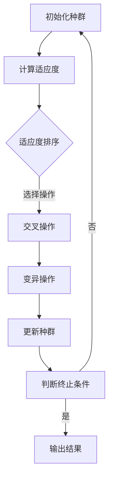

                 

# 《Python机器学习实战：实现与优化遗传算法》

## 关键词
Python，机器学习，遗传算法，实现，优化，实战，特征选择，神经网络模型优化。

## 摘要
本文将带领读者深入探讨Python中的机器学习与遗传算法的结合，旨在通过一系列实战案例，展示如何实现和优化遗传算法，并在特征选择和神经网络模型优化等应用场景中取得显著成效。文章将从预备知识开始，逐步讲解遗传算法的基本原理、实现方法、优化技巧，并通过具体案例展示其实际应用价值。

## 目录大纲

### 第一部分：预备知识

### 第二部分：遗传算法原理与实现

### 第三部分：遗传算法优化实现与实战

### 第四部分：遗传算法应用拓展

### 附录

## 第一部分：预备知识

### 第1章：机器学习与遗传算法概述

#### 1.1 机器学习基本概念
机器学习是人工智能的一个重要分支，它通过构建能够从数据中学习规律和模式的算法，使计算机具备自主改进和优化的能力。机器学习可以分为监督学习、无监督学习和强化学习三大类。

#### 1.2 遗传算法基础
遗传算法是一种模拟自然界生物进化过程的优化算法，它通过模拟遗传、自然选择和适者生存等过程来寻找最优解。遗传算法的核心操作包括选择、交叉、变异和适应度评估。

#### 1.3 机器学习与遗传算法的联系
遗传算法在机器学习中有着广泛的应用，尤其是在特征选择、模型优化等方面。遗传算法能够有效地处理复杂的优化问题，并具有强大的全局搜索能力。

### 第2章：Python编程基础

#### 2.1 Python环境搭建
Python是一种广泛使用的高级编程语言，其简洁的语法和丰富的库资源使其成为机器学习领域的首选语言。本节将介绍Python的安装和环境配置。

#### 2.2 Python基础语法
Python的基础语法包括变量、数据类型、控制结构、函数等。掌握这些基础语法是进行Python编程的前提。

#### 2.3 数据结构与算法基础
Python中的数据结构包括列表、元组、字典和集合等。算法基础则包括排序算法、搜索算法等，这些基础对于实现遗传算法至关重要。

## 第二部分：遗传算法原理与实现

### 第3章：遗传算法基本原理

#### 3.1 遗传算法概述
遗传算法的原理是基于自然选择和遗传学的基本原理，通过迭代进化寻找最优解。本节将介绍遗传算法的基本概念和运作机制。

#### 3.2 遗传算法的遗传操作
遗传操作包括选择、交叉、变异等。选择操作用于从当前种群中选择优秀的个体；交叉操作用于生成新的个体；变异操作用于引入随机性，防止算法陷入局部最优。

#### 3.3 遗传算法的适应度函数
适应度函数是遗传算法的核心，它用于评估个体的优劣。通过适应度函数，算法能够选择出适应度更高的个体进行繁殖。

#### 3.4 遗传算法的变异与交叉
变异和交叉是遗传算法的两个重要操作。变异能够增加种群的多样性，防止算法过早收敛；交叉则能够快速提高种群的整体适应度。

### 第4章：遗传算法在优化问题中的应用

#### 4.1 优化问题概述
优化问题是寻找函数在给定区域内的最优值。遗传算法由于其全局搜索能力和鲁棒性，非常适合解决优化问题。

#### 4.2 遗传算法求解旅行商问题
旅行商问题（TSP）是一个经典的组合优化问题，遗传算法通过模拟自然界中的生物进化，有效解决了TSP问题。

#### 4.3 遗传算法求解背包问题
背包问题是一个常见的优化问题，遗传算法能够高效地找到背包的最大价值。

### 第5章：遗传算法在机器学习中的应用

#### 5.1 遗传算法在特征选择中的应用
特征选择是机器学习中的一个重要步骤，遗传算法能够自动选择出对分类或回归任务最重要的特征。

#### 5.2 遗传算法在模型选择中的应用
遗传算法能够帮助选择最适合给定数据的机器学习模型，提高模型的泛化能力。

#### 5.3 遗传算法在模型优化中的应用
遗传算法能够对机器学习模型进行优化，提高模型的性能和准确度。

## 第三部分：遗传算法优化实现与实战

### 第6章：遗传算法优化实现

#### 6.1 伪代码实现
遗传算法的伪代码是实现该算法的基础，通过伪代码，我们可以清晰地理解遗传算法的运作流程。

#### 6.2 Python实现
在Python中，我们可以利用内置的库（如NumPy、Pandas）和第三方库（如DEAP）来实现遗传算法。

#### 6.3 性能分析与优化
通过性能分析，我们可以评估遗传算法在不同问题上的效果，并采取相应的优化措施。

### 第7章：遗传算法实战项目

#### 7.1 项目介绍
本节将介绍一个具体的遗传算法应用项目，该项目将展示如何使用遗传算法解决实际问题。

#### 7.2 数据预处理
在应用遗传算法之前，数据预处理是必不可少的步骤，它能够提高算法的效率和效果。

#### 7.3 遗传算法实现
在本项目中，我们将详细讲解遗传算法的实现过程，包括选择、交叉、变异等操作的实现。

#### 7.4 结果分析与评估
通过对项目结果的深入分析，我们可以评估遗传算法在实际应用中的性能和效果。

#### 7.5 项目总结与展望
在本节的最后，我们将对项目进行总结，并展望遗传算法在未来的发展方向。

## 第四部分：遗传算法应用拓展

### 第8章：遗传算法与其他算法的融合

#### 8.1 遗传算法与模拟退火算法融合
模拟退火算法和遗传算法都是基于概率的搜索算法，它们的融合能够进一步提高搜索效率和效果。

#### 8.2 遗传算法与粒子群算法融合
粒子群优化算法和遗传算法在搜索策略上有许多相似之处，它们的融合能够发挥各自的优势。

#### 8.3 遗传算法与深度学习融合
深度学习和遗传算法的结合能够解决传统深度学习难以处理的问题，如超参数优化等。

### 第9章：遗传算法在复杂数据分析中的应用

#### 9.1 遗传算法在文本分类中的应用
文本分类是自然语言处理中的一个重要任务，遗传算法能够有效地提高分类准确率。

#### 9.2 遗传算法在图像识别中的应用
图像识别是计算机视觉的一个重要分支，遗传算法能够帮助提高图像识别的准确度。

#### 9.3 遗传算法在推荐系统中的应用
推荐系统是电子商务和社交媒体中的重要应用，遗传算法能够优化推荐算法，提高用户满意度。

### 第10章：遗传算法的前沿趋势与应用

#### 10.1 遗传算法在智能交通系统中的应用
智能交通系统是现代社会的一个重要发展方向，遗传算法能够帮助优化交通流，提高交通效率。

#### 10.2 遗传算法在生物信息学中的应用
生物信息学是生物科学与信息技术的交叉领域，遗传算法在基因组分析、药物设计等方面有着广泛的应用。

#### 10.3 遗传算法在游戏开发中的应用
游戏开发中，遗传算法可以用于角色生成、关卡设计等，提高游戏的可玩性和创新性。

## 附录

### 附录A：遗传算法相关资源与工具
本附录将介绍一些常用的遗传算法相关资源和工具，包括书籍、在线课程、开源库等。

### 附录B：代码实现与数据集
本附录将提供遗传算法的实际代码实现和数据集，方便读者学习和实践。

### 附录C：常见问题解答与拓展阅读
本附录将回答读者在学习和应用遗传算法过程中常见的问题，并提供拓展阅读资源。

## 流程图：遗传算法流程



## 伪代码：遗传算法伪代码实现

```
初始化种群(Population)
评价适应度(Fitness Function)
重复以下步骤直到终止条件满足：
选择操作(Selection)
交叉操作(Crossover)
变异操作(Mutation)
更新种群(Update Population)
判断是否满足终止条件，如果是，输出结果；否则，继续循环。
```

## 数学模型：适应度函数

$$
Fitness(Fitness Function) = f(\text{解决方案})
$$

## 数学公式：交叉率与变异率

$$
Crossover Rate = \frac{1}{2}(1 - \frac{Fitness}{Max Fitness})
Mutation Rate = \frac{1}{2}(1 - \frac{Fitness}{Max Fitness})
$$

### 实战1：使用遗传算法进行特征选择

#### 数据预处理

在开始使用遗传算法进行特征选择之前，我们需要对数据进行预处理。这包括数据清洗、数据转换和数据标准化等步骤。以下是一个简单的数据预处理流程：

```
1. 数据清洗：删除缺失值和异常值。
2. 数据转换：将类别型数据转换为数值型数据。
3. 数据标准化：将数据缩放到相同的范围，以便于算法处理。
```

#### 遗传算法实现

在遗传算法中，我们需要定义以下几个关键组件：

1. **个体编码**：每个个体代表一组特征，我们使用二进制编码或实值编码来表示个体。
2. **适应度函数**：适应度函数用于评估个体的优劣，可以选择基于信息增益、卡方检验等指标。
3. **选择操作**：选择操作用于选择适应度较高的个体作为父代。
4. **交叉操作**：交叉操作用于生成新的个体，通过组合两个父代的特征。
5. **变异操作**：变异操作用于增加种群的多样性，防止算法陷入局部最优。
6. **更新种群**：根据选择、交叉和变异操作更新种群。

以下是一个简单的遗传算法实现流程：

```
1. 初始化种群：随机生成一定数量的初始个体。
2. 计算适应度：计算每个个体的适应度。
3. 选择操作：根据适应度选择优秀的个体作为父代。
4. 交叉操作：使用交叉率进行交叉操作，生成新的个体。
5. 变异操作：使用变异率进行变异操作。
6. 更新种群：将新生成的个体加入种群，替换掉部分旧的个体。
7. 判断终止条件：如果满足终止条件（如达到最大迭代次数或适应度达到阈值），则输出结果；否则，返回第2步。
```

#### 结果分析与评估

在完成遗传算法的特征选择后，我们需要对结果进行分析和评估。这包括：

1. **特征重要性分析**：分析每个特征的重要性，筛选出对模型影响较大的特征。
2. **模型性能评估**：使用选定的特征重新训练模型，评估模型的性能，如准确率、召回率等。
3. **模型泛化能力评估**：使用交叉验证或测试集评估模型的泛化能力。

### 实战2：使用遗传算法优化神经网络模型

#### 数据预处理

与特征选择类似，在优化神经网络模型之前，我们也需要对数据进行预处理。这包括：

1. **数据清洗**：去除缺失值和异常值。
2. **数据转换**：将类别型数据转换为数值型数据。
3. **数据标准化**：将数据缩放到相同的范围。

#### 神经网络模型构建

构建神经网络模型是遗传算法优化的前提。我们需要定义以下关键组件：

1. **输入层**：接收预处理后的数据。
2. **隐藏层**：定义网络的层数和每层的神经元数量。
3. **输出层**：产生预测结果。

以下是一个简单的神经网络模型构建流程：

```
1. 定义输入层：根据数据特征的数量确定输入层的神经元数量。
2. 定义隐藏层：根据经验或实验确定隐藏层的层数和每层的神经元数量。
3. 定义输出层：根据预测任务确定输出层的神经元数量。
4. 激活函数：选择适当的激活函数，如ReLU、Sigmoid或Tanh。
5. 损失函数：选择适当的损失函数，如均方误差（MSE）或交叉熵（Cross-Entropy）。
6. 优化器：选择适当的优化器，如SGD、Adam或RMSprop。
```

#### 遗传算法优化

在构建好神经网络模型后，我们可以使用遗传算法对其进行优化。遗传算法优化的关键组件包括：

1. **个体编码**：每个个体代表一组模型参数，我们使用实值编码来表示个体。
2. **适应度函数**：适应度函数用于评估个体的优劣，可以选择基于模型性能（如准确率）或损失函数值。
3. **选择操作**：选择操作用于选择适应度较高的个体作为父代。
4. **交叉操作**：交叉操作用于生成新的个体，通过组合两个父代的参数。
5. **变异操作**：变异操作用于增加种群的多样性，防止算法陷入局部最优。
6. **更新种群**：根据选择、交叉和变异操作更新种群。

以下是一个简单的遗传算法优化流程：

```
1. 初始化种群：随机生成一定数量的初始个体。
2. 计算适应度：计算每个个体的适应度。
3. 选择操作：根据适应度选择优秀的个体作为父代。
4. 交叉操作：使用交叉率进行交叉操作，生成新的个体。
5. 变异操作：使用变异率进行变异操作。
6. 更新种群：将新生成的个体加入种群，替换掉部分旧的个体。
7. 训练模型：使用新的参数训练神经网络模型。
8. 判断终止条件：如果满足终止条件（如达到最大迭代次数或适应度达到阈值），则输出结果；否则，返回第2步。
```

#### 结果分析与评估

在完成遗传算法优化后，我们需要对结果进行分析和评估。这包括：

1. **模型性能评估**：使用选定的参数重新训练模型，评估模型的性能。
2. **模型泛化能力评估**：使用交叉验证或测试集评估模型的泛化能力。
3. **对比分析**：将遗传算法优化前后的模型性能进行对比分析。

## 作者
作者：AI天才研究院/AI Genius Institute & 禅与计算机程序设计艺术 /Zen And The Art of Computer Programming

## 结语
本文通过详细讲解和实战案例，展示了Python中机器学习与遗传算法的结合应用。遗传算法在特征选择、模型优化等领域展现了强大的优势，同时也面临着性能优化和算法融合等挑战。未来，遗传算法在人工智能领域的应用前景将更加广阔。

---

文章标题：《Python机器学习实战：实现与优化遗传算法》

文章关键词：Python，机器学习，遗传算法，实现，优化，实战，特征选择，神经网络模型优化。

文章摘要：本文深入探讨了Python中的机器学习与遗传算法的结合，通过一系列实战案例，展示了如何实现和优化遗传算法，并在特征选择和神经网络模型优化等应用场景中取得显著成效。文章涵盖了遗传算法的基本原理、Python编程基础、优化实现和实战应用，旨在为读者提供全面、实用的技术指南。

