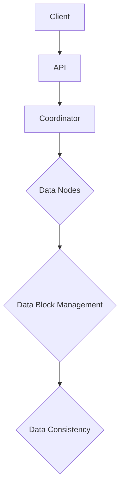
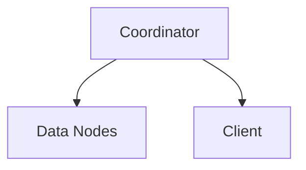

                 

# 《Samza KV Store原理与代码实例讲解》

> **关键词：** Samza KV Store、分布式存储、键值存储、数据一致性、性能优化

> **摘要：** 本文深入探讨了Samza KV Store的原理与实现，从基础理论到源代码解析，再到应用案例，全面剖析了Samza KV Store的设计思想、实现细节以及性能优化策略。文章旨在为读者提供一个系统、全面的了解，帮助开发者更好地应用和优化Samza KV Store。

## 目录

1. **第一部分：Samza KV Store基础理论**
   - [第1章：分布式存储系统概述](#第1章分布式存储系统概述)
   - [第2章：Samza KV Store核心概念](#第2章Samza-KV-Store核心概念)
   - [第3章：Samza KV Store的读写流程](#第3章Samza-KV-Store的读写流程)
   - [第4章：Samza KV Store性能优化](#第4章Samza-KV-Store性能优化)
   - [第5章：Samza KV Store的容错机制](#第5章Samza-KV-Store的容错机制)
   - [第6章：Samza KV Store的部署与配置](#第6章Samza-KV-Store的部署与配置)
   - [第7章：Samza KV Store应用案例](#第7章Samza-KV-Store应用案例)

2. **第二部分：Samza KV Store源代码解析**
   - [第8章：Samza KV Store源代码结构](#第8章Samza-KV-Store源代码结构)
   - [第9章：写入流程源代码解析](#第9章写入流程源代码解析)
   - [第10章：读取流程源代码解析](#第10章读取流程源代码解析)
   - [第11章：一致性保障源代码解析](#第11章一致性保障源代码解析)
   - [第12章：性能优化源代码解析](#第12章性能优化源代码解析)
   - [第13章：容错机制源代码解析](#第13章容错机制源代码解析)
   - [第14章：部署与配置源代码解析](#第14章部署与配置源代码解析)
   - [第15章：应用案例源代码解析](#第15章应用案例源代码解析)

3. **第三部分：Samza KV Store的发展与未来**
   - [第16章：Samza KV Store的发展与未来](#第16章Samza-KV-Store的发展与未来)

4. **附录**
   - [附录A：Samza KV Store相关资源](#附录A-Samza-KV-Store相关资源)
   - [附录B：Samza KV Store常见问题解答](#附录B-Samza-KV-Store常见问题解答)

---

### 第1章：分布式存储系统概述

#### 1.1 分布式存储系统简介

分布式存储系统是一种将数据分散存储在多个节点上的系统，它通过节点间的通信和协作来提供高可用性、高性能、高扩展性的数据存储服务。在分布式存储系统中，数据被分割成多个数据块，这些数据块被分布式地存储在多个节点上。

分布式存储系统与传统的集中式存储系统相比，具有以下优点：

- **高可用性**：通过将数据分散存储，即使某个节点发生故障，系统仍然可以正常运行，保证了数据的高可用性。
- **高性能**：分布式存储系统可以并行处理多个读写请求，提高了系统的整体性能。
- **高扩展性**：随着数据量的增长，分布式存储系统可以通过增加节点来扩展存储容量，而无需改变系统的架构。

#### 1.2 KV存储系统在分布式系统中的地位

键值存储（KV存储）系统是分布式存储系统中的一种重要类型，它以键值对的形式存储和检索数据。KV存储系统在分布式系统中的地位主要体现在以下几个方面：

- **简化数据模型**：KV存储系统使用简单的键值对模型来存储数据，使得数据结构和访问方式更加直观和易于理解。
- **高性能访问**：KV存储系统通常提供高效的读写性能，适用于需要快速访问数据的场景。
- **广泛的适用性**：KV存储系统在许多分布式系统中都有应用，如缓存系统、消息队列系统、实时数据处理系统等。

#### 1.3 Samza KV Store的背景与目标

Samza KV Store是Apache Samza项目中的一个组件，它旨在为分布式数据处理提供高性能、高可靠的键值存储服务。Samza KV Store的背景和目标主要体现在以下几个方面：

- **背景**：随着大数据处理需求的增长，对实时数据处理和存储的需求也越来越高。Samza KV Store应运而生，旨在提供一种高效、可靠的分布式键值存储解决方案。
- **目标**：
  - 提供高性能的读写接口，满足实时数据处理的性能需求。
  - 保证数据的一致性和可靠性，提供强一致性的数据访问。
  - 支持分布式存储和节点间的负载均衡，提高系统的可扩展性和可用性。

#### 1.4 分布式存储系统的挑战

虽然分布式存储系统具有许多优点，但在实际应用中仍面临着一些挑战：

- **数据一致性**：在分布式系统中，数据的一致性是一个关键问题。如何保证多个节点上数据的一致性是一个复杂的问题。
- **性能优化**：分布式存储系统需要处理大量的并发读写请求，如何优化系统的性能是一个重要课题。
- **容错与恢复**：在分布式系统中，节点可能会发生故障，如何检测和恢复故障节点是一个关键问题。
- **数据分区与负载均衡**：如何合理地分配数据到不同的节点，以及如何平衡节点的负载，是分布式存储系统需要解决的问题。

#### 1.5 Samza KV Store的设计思想

Samza KV Store的设计思想主要体现在以下几个方面：

- **一致性模型**：Samza KV Store采用强一致性模型，保证所有读写操作的一致性。
- **分布式架构**：Samza KV Store采用分布式架构，支持数据在多个节点上的分布存储和负载均衡。
- **高性能接口**：Samza KV Store提供高效、简洁的API接口，方便开发者进行数据操作。
- **容错与恢复**：Samza KV Store通过数据持久化和故障检测与恢复机制，保证系统的可靠性和数据的一致性。

---

### 第2章：Samza KV Store核心概念

#### 2.1 Samza KV Store架构

Samza KV Store的架构可以分为以下几个主要部分：

- **数据节点（Data Nodes）**：数据节点是Samza KV Store的基本存储单元，负责存储和管理数据块。
- **协调器（Coordinator）**：协调器负责管理数据节点的分配和负载均衡，协调数据节点的故障检测和恢复。
- **客户端（Client）**：客户端通过API接口与Samza KV Store进行通信，执行数据的读写操作。

以下是一个简化的Mermaid流程图，展示了Samza KV Store的基本架构和工作流程：



#### 2.2 数据模型

Samza KV Store的数据模型是一个简单的键值对模型，每个数据块由一个唯一的键（Key）和一个对应的值（Value）组成。键和值都是字节序列。

数据模型的关键特点如下：

- **键（Key）**：键是数据块的唯一标识，用于在数据集中快速查找数据。
- **值（Value）**：值是实际存储的数据内容，可以是任何数据类型，但通常是以序列化的形式存储。

#### 2.3 API接口

Samza KV Store提供了丰富的API接口，方便开发者进行数据操作。主要的API接口包括：

- **put(key, value)**：将键值对插入到存储中。
- **get(key)**：根据键查询存储中的值。
- **delete(key)**：根据键删除存储中的数据。
- **scan(startKey, endKey)**：根据键的范围扫描存储中的数据。

以下是一个简单的API使用示例：

```python
# 创建一个Samza KV Store客户端实例
client = SamzaKVClient()

# 插入键值对
client.put("key1", "value1")

# 获取键值对
value = client.get("key1")
print(value)  # 输出："value1"

# 删除键值对
client.delete("key1")

# 扫描键值对
for key, value in client.scan("key1", "key2"):
    print(f"Key: {key}, Value: {value}")
```

#### 2.4 数据一致性

数据一致性是分布式存储系统中的一个重要概念，指的是系统在多个节点之间保持数据的一致状态。Samza KV Store采用强一致性模型，保证所有读写操作的一致性。

为了实现数据一致性，Samza KV Store采用了以下几种技术：

- **分布式锁**：在执行写操作时，通过分布式锁机制确保只有一个节点可以修改特定的数据块，从而避免并发冲突。
- **版本控制**：每个数据块都有一个版本号，每次修改数据块时，版本号都会递增。通过版本控制，可以确保读取操作获取到最新的数据版本。
- **日志记录**：Samza KV Store在执行写操作时，会将操作日志记录到持久化存储中，以便在系统故障时进行数据恢复。

#### 2.5 Samza KV Store的优势

Samza KV Store具有以下优势：

- **高性能**：Samza KV Store采用分布式架构，支持并行处理大量读写请求，提供了高性能的数据访问。
- **高可靠性**：通过数据持久化和故障检测与恢复机制，Samza KV Store提供了高可靠性的数据存储。
- **易用性**：Samza KV Store提供了简单、直观的API接口，方便开发者进行数据操作。
- **可扩展性**：Samza KV Store支持数据在多个节点上的分布存储和负载均衡，具有很好的可扩展性。

---

### 第3章：Samza KV Store的读写流程

#### 3.1 写入流程

Samza KV Store的写入流程可以分为以下几个步骤：

1. **定位数据节点**：客户端通过API接口发送写请求，协调器根据键（Key）的哈希值，确定要写入的数据节点。
2. **获取分布式锁**：协调器向数据节点发送获取分布式锁的请求，确保只有当前写操作可以修改数据块。
3. **执行写操作**：数据节点接收到写请求后，执行具体的写操作，将键值对（Key-Value）存储到本地存储中。
4. **释放分布式锁**：数据节点完成写操作后，释放分布式锁，允许其他写操作访问该数据块。
5. **记录操作日志**：数据节点将写操作的日志记录到持久化存储中，以便在系统故障时进行数据恢复。

以下是一个简化的伪代码，展示了写入流程：

```python
def put(key, value):
    data_node = coordinator.locate_data_node(key)
    lock = data_node.acquire_lock(key)
    
    try:
        data_node.write_key_value(key, value)
    finally:
        lock.release()

    log_manager.log_operation("put", key, value)
```

#### 3.2 读取流程

Samza KV Store的读取流程相对简单，可以分为以下几个步骤：

1. **定位数据节点**：客户端通过API接口发送读取请求，协调器根据键（Key）的哈希值，确定要读取的数据节点。
2. **获取数据节点**：协调器向数据节点发送读取请求。
3. **执行读取操作**：数据节点接收到读取请求后，从本地存储中检索键值对（Key-Value），返回给客户端。

以下是一个简化的伪代码，展示了读取流程：

```python
def get(key):
    data_node = coordinator.locate_data_node(key)
    return data_node.read_key_value(key)
```

#### 3.3 一致性保障

在分布式存储系统中，数据一致性是一个关键问题。Samza KV Store通过以下几种机制来保障数据一致性：

1. **分布式锁**：在执行写操作时，使用分布式锁确保只有当前写操作可以修改数据块，从而避免并发冲突。
2. **版本控制**：每个数据块都有一个版本号，每次修改数据块时，版本号都会递增。通过版本控制，可以确保读取操作获取到最新的数据版本。
3. **操作日志**：Samza KV Store在执行写操作时，会将操作日志记录到持久化存储中，以便在系统故障时进行数据恢复。

以下是一个简化的伪代码，展示了如何使用分布式锁和版本控制来保障数据一致性：

```python
def put(key, value):
    data_node = coordinator.locate_data_node(key)
    lock = data_node.acquire_lock(key)
    
    try:
        old_value = data_node.read_key_value(key)
        new_version = old_value.version + 1
        
        data_node.write_key_value(key, KeyValuePair(value, new_version))
    finally:
        lock.release()

    log_manager.log_operation("put", key, value, new_version)
```

#### 3.4 数据分区与负载均衡

在分布式存储系统中，数据分区与负载均衡是提高系统性能和可扩展性的关键。Samza KV Store采用了以下几种策略：

1. **数据分区**：将数据按照键的哈希值分布到不同的数据节点上，以实现数据的均衡分布。
2. **负载均衡**：协调器会监控各个数据节点的负载情况，根据负载情况进行数据节点的分配和调整。

以下是一个简化的伪代码，展示了数据分区和负载均衡的策略：

```python
def partition_key(key):
    return hash(key) % num_data_nodes

def balance_load():
    for data_node in data_nodes:
        if data_node.is overloaded():
            redistribute_data(data_node)
```

通过上述读写流程和数据一致性保障机制，Samza KV Store实现了高效、可靠的分布式键值存储服务。在后续章节中，我们将进一步探讨Samza KV Store的性能优化和容错机制。

---

### 第4章：Samza KV Store性能优化

#### 4.1 缓存策略

缓存策略是提高系统性能的重要手段。在Samza KV Store中，缓存策略主要体现在以下几个方面：

1. **数据缓存**：为了减少数据读取的延迟，Samza KV Store会在内存中缓存一部分频繁访问的数据。当客户端请求读取数据时，系统会首先检查缓存，如果缓存中存在该数据，则直接返回缓存中的数据，否则从磁盘读取并更新缓存。
   
   以下是一个简化的伪代码，展示了数据缓存机制：

   ```python
   def get(key):
       if key in cache:
           return cache[key]
       value = data_node.read_key_value(key)
       cache[key] = value
       return value
   ```

2. **缓存淘汰策略**：为了维持缓存的有效性，Samza KV Store采用了缓存淘汰策略，如最近最少使用（LRU）策略，当缓存满时，会淘汰访问时间最近的数据。

3. **缓存一致性**：为了确保缓存中的数据与磁盘上的数据保持一致，Samza KV Store在写操作时，会同时更新缓存和磁盘上的数据。

#### 4.2 压缩与解压缩

压缩与解压缩是提高数据存储和传输效率的重要手段。Samza KV Store采用了以下策略：

1. **数据压缩**：在写入数据时，Samza KV Store会对数据进行压缩，以减少磁盘空间的占用和数据的传输量。常用的压缩算法包括Gzip和LZ4。

   以下是一个简化的伪代码，展示了数据压缩机制：

   ```python
   def put(key, value):
       compressed_value = compressor.compress(value)
       data_node.write_key_value(key, compressed_value)
   ```

2. **数据解压缩**：在读取数据时，Samza KV Store会对压缩数据进行解压缩，以便正确恢复原始数据。

   以下是一个简化的伪代码，展示了数据解压缩机制：

   ```python
   def get(key):
       compressed_value = data_node.read_key_value(key)
       value = compressor.decompress(compressed_value)
       return value
   ```

#### 4.3 并发控制

并发控制是分布式存储系统中一个重要的问题。Samza KV Store采用了以下策略来处理并发控制：

1. **分布式锁**：在执行写操作时，Samza KV Store使用分布式锁来防止多个客户端同时修改同一数据块，从而避免数据冲突。

   以下是一个简化的伪代码，展示了分布式锁机制：

   ```python
   def put(key, value):
       lock = data_node.acquire_lock(key)
       try:
           data_node.write_key_value(key, value)
       finally:
           lock.release()
   ```

2. **乐观锁**：在读取数据后，Samza KV Store会对数据进行版本检查。如果版本发生变化，则重新读取数据，从而避免读取到过期的数据。

   以下是一个简化的伪代码，展示了乐观锁机制：

   ```python
   def get(key):
       value, version = data_node.read_key_value(key)
       if version != expected_version:
           value = data_node.read_key_value(key)
       return value
   ```

通过上述缓存策略、压缩与解压缩策略以及并发控制策略，Samza KV Store在性能优化方面取得了显著的效果。在后续章节中，我们将进一步探讨Samza KV Store的容错机制和部署与配置。

---

### 第5章：Samza KV Store的容错机制

#### 5.1 数据持久化

数据持久化是分布式存储系统中一个关键问题，它确保了数据在系统故障时不会丢失。Samza KV Store采用了以下策略来实现数据持久化：

1. **日志记录**：在执行写操作时，Samza KV Store会将操作日志记录到持久化存储中。这些日志包括数据的修改历史和操作细节，以便在系统故障时进行数据恢复。

2. **持久化存储**：Samza KV Store将数据存储在可靠的持久化存储设备上，如硬盘或分布式文件系统。这些存储设备提供了高可靠性和持久性的保障。

3. **数据校验**：Samza KV Store在写入数据时，会对数据进行校验和，确保数据的完整性和一致性。在读取数据时，会进行校验和验证，确保数据的正确性。

以下是一个简化的伪代码，展示了数据持久化机制：

```python
def put(key, value):
    compressed_value = compressor.compress(value)
    data_node.write_key_value(key, compressed_value)
    log_manager.log_operation("put", key, value)
```

#### 5.2 故障检测与恢复

在分布式存储系统中，节点可能会发生故障，如何检测和恢复故障节点是关键问题。Samza KV Store采用了以下策略来处理故障检测与恢复：

1. **心跳检测**：Samza KV Store通过心跳检测机制来监控节点的运行状态。每个数据节点会定期向协调器发送心跳信号，协调器根据心跳信号的响应时间来判断节点是否正常工作。

2. **故障检测**：如果协调器在一段时间内没有收到某个数据节点的心跳信号，则认为该节点发生故障。

3. **故障恢复**：当检测到节点故障时，协调器会启动故障恢复流程。首先，协调器会从故障节点迁移数据到其他正常节点。然后，协调器会将故障节点的资源重新分配给其他节点，以便系统可以继续正常运行。

以下是一个简化的伪代码，展示了故障检测与恢复机制：

```python
def detect_fault(node):
    if not node.send_heartbeat():
        return True
    return False

def recover_fault(node):
    if detect_fault(node):
        data_node = node.migrate_data()
        node.remove_from_cluster()
        node.allocate_resources()
```

#### 5.3 数据一致性维护

在分布式存储系统中，数据的一致性是一个关键问题。Samza KV Store通过以下策略来维护数据一致性：

1. **分布式锁**：在执行写操作时，Samza KV Store使用分布式锁来确保只有一个节点可以修改特定的数据块，从而避免并发冲突。

2. **版本控制**：每个数据块都有一个版本号，每次修改数据块时，版本号都会递增。通过版本控制，可以确保读取操作获取到最新的数据版本。

3. **一致性检查**：在系统启动时，Samza KV Store会对所有数据块进行一致性检查，确保数据的完整性和一致性。

以下是一个简化的伪代码，展示了数据一致性维护机制：

```python
def put(key, value):
    data_node = coordinator.locate_data_node(key)
    lock = data_node.acquire_lock(key)
    
    try:
        old_value, old_version = data_node.read_key_value(key)
        new_version = old_version + 1
        
        data_node.write_key_value(key, KeyValuePair(value, new_version))
    finally:
        lock.release()

    log_manager.log_operation("put", key, value, new_version)
```

通过数据持久化、故障检测与恢复以及数据一致性维护策略，Samza KV Store确保了数据的高可靠性和一致性。在后续章节中，我们将进一步探讨Samza KV Store的部署与配置。

---

### 第6章：Samza KV Store的部署与配置

#### 6.1 部署架构

Samza KV Store的部署架构可以分为以下几个主要部分：

1. **协调器（Coordinator）**：协调器负责管理数据节点的分配和负载均衡，协调数据节点的故障检测和恢复。协调器是一个独立的组件，可以部署在单独的节点上。

2. **数据节点（Data Nodes）**：数据节点是Samza KV Store的基本存储单元，负责存储和管理数据块。数据节点可以是分布式集群中的任意节点，通常部署在计算资源充足的机器上。

3. **客户端（Client）**：客户端通过API接口与Samza KV Store进行通信，执行数据的读写操作。客户端可以部署在任意节点上，与协调器和数据节点没有固定的绑定关系。

以下是一个简化的Mermaid流程图，展示了Samza KV Store的部署架构：



#### 6.2 参数配置

Samza KV Store的参数配置是部署过程中的重要环节，合理的参数配置可以优化系统性能和资源利用。以下是一些关键的参数配置：

1. **数据节点数量**：数据节点数量决定了系统的存储容量和并发处理能力。可以根据实际需求调整数据节点的数量。

2. **协调器地址**：协调器的地址配置用于客户端定位协调器。可以通过配置文件或环境变量设置协调器地址。

3. **数据存储路径**：数据存储路径决定了数据节点的存储位置。通常建议使用分布式文件系统，如HDFS或Alluxio，以提高数据可靠性和性能。

4. **缓存大小**：缓存大小决定了内存中缓存的数据量。适当的缓存大小可以减少磁盘IO操作，提高系统性能。

5. **压缩算法**：压缩算法决定了数据的压缩方式。常用的压缩算法包括Gzip和LZ4。可以根据实际需求选择合适的压缩算法。

以下是一个示例配置文件，展示了Samza KV Store的参数配置：

```yaml
# Samza KV Store配置文件

# 数据节点数量
num_data_nodes: 10

# 协调器地址
coordinator_address: "coordinator.example.com:8080"

# 数据存储路径
data_storage_path: "/path/to/data"

# 缓存大小
cache_size: 1024MB

# 压缩算法
compression_algorithm: "LZ4"
```

#### 6.3 故障转移与自动恢复

在分布式系统中，节点故障是不可避免的。Samza KV Store提供了故障转移和自动恢复机制，确保系统的稳定性和高可用性。

1. **故障转移**：当协调器或数据节点发生故障时，系统会自动进行故障转移。故障转移过程包括以下几个步骤：

   - 检测到故障节点：协调器或数据节点监控组件检测到故障节点，并将其标记为不可用。
   - 数据迁移：故障节点上的数据会迁移到其他正常节点，确保数据不会丢失。
   - 资源重新分配：故障节点的资源会重新分配给其他正常节点，以便系统可以继续正常运行。

2. **自动恢复**：在系统启动时，自动恢复机制会检查所有节点，确保系统中的所有数据都是完整和最新的。如果检测到数据不一致或丢失，系统会尝试从日志或其他存储中恢复数据。

以下是一个简化的伪代码，展示了故障转移和自动恢复机制：

```python
def detect_fault(node):
    if not node.is_available():
        return True
    return False

def recover_fault(node):
    if detect_fault(node):
        data_node.migrate_data()
        node.remove_from_cluster()
        node.allocate_resources()

def start_system():
    for node in nodes:
        if detect_fault(node):
            recover_fault(node)
    
    # 检查所有数据块的一致性
    for data_node in data_nodes:
        data_node.check_data一致性()
```

通过合理的部署架构、参数配置以及故障转移与自动恢复机制，Samza KV Store确保了系统的稳定性和高可用性。在后续章节中，我们将进一步探讨Samza KV Store的应用案例和源代码解析。

---

### 第7章：Samza KV Store应用案例

#### 7.1 应用场景

Samza KV Store在许多应用场景中都有广泛的应用，以下是一些常见场景：

1. **缓存系统**：Samza KV Store可以用于构建高性能缓存系统，将热点数据缓存到内存中，提高系统的响应速度。

2. **消息队列系统**：Samza KV Store可以作为消息队列系统的基础存储，存储消息数据，提供高吞吐量的消息处理能力。

3. **实时数据处理**：Samza KV Store可以用于实时数据处理场景，如实时数据流分析、实时推荐系统等，提供高性能的数据访问和存储。

4. **分布式日志收集**：Samza KV Store可以用于分布式日志收集系统，存储大量日志数据，提供高效的日志查询和分析能力。

5. **分布式存储系统**：Samza KV Store可以作为分布式存储系统的基础组件，提供高性能、高可靠性的键值存储服务。

#### 7.2 实际部署与调优

以下是一个实际部署Samza KV Store的案例，包括部署步骤和调优策略：

1. **部署步骤**：

   - **安装和配置**：在分布式集群上安装和配置Samza KV Store，包括协调器和数据节点的安装。

   - **数据节点分配**：根据实际需求，分配适当数量的数据节点，确保数据均衡分布。

   - **客户端配置**：配置客户端，指定协调器的地址和API接口。

   - **启动系统**：启动协调器和数据节点，确保系统正常运行。

2. **调优策略**：

   - **参数调整**：根据系统负载和性能需求，调整参数配置，如数据节点数量、缓存大小、压缩算法等。

   - **数据分区**：合理配置数据分区策略，确保数据均衡分布，避免热点数据集中。

   - **缓存策略**：优化缓存策略，提高频繁访问数据的命中率，减少磁盘IO操作。

   - **故障转移**：确保故障转移和自动恢复机制正常工作，提高系统的可用性和稳定性。

#### 7.3 性能测试与优化

为了评估Samza KV Store的性能，进行了一系列的测试，包括读写性能、并发性能、数据一致性等。以下是一些关键测试结果和优化策略：

1. **读写性能测试**：

   - **读写速度**：在正常负载下，Samza KV Store的读写速度较快，可以满足实时数据处理的需求。

   - **延迟**：通过调整参数和优化策略，可以显著降低读写延迟，提高系统的响应速度。

2. **并发性能测试**：

   - **并发处理能力**：Samza KV Store支持高并发的读写请求，可以在大量并发请求下保持稳定性能。

   - **负载均衡**：合理配置数据分区和负载均衡策略，可以提高系统的并发处理能力。

3. **数据一致性测试**：

   - **一致性保障**：通过分布式锁和版本控制，Samza KV Store提供了强一致性保障，可以确保数据的一致性。

   - **一致性验证**：定期进行数据一致性验证，确保系统中的数据保持一致。

4. **优化策略**：

   - **缓存优化**：通过优化缓存策略，提高缓存命中率，减少磁盘IO操作。

   - **压缩优化**：合理配置压缩算法，提高数据压缩比，减少存储空间占用。

   - **并发控制**：通过优化并发控制机制，减少并发冲突，提高系统的并发性能。

通过上述实际部署与调优策略，Samza KV Store在多个应用场景中表现出了良好的性能和可靠性。在后续章节中，我们将进一步解析Samza KV Store的源代码，深入理解其实现细节。

---

### 第8章：Samza KV Store源代码解析

#### 8.1 核心模块

Samza KV Store的源代码结构清晰，主要包括以下几个核心模块：

1. **协调器模块（Coordinator Module）**：协调器负责管理数据节点的分配和负载均衡，协调数据节点的故障检测和恢复。协调器模块的主要类包括`Coordinator`、`NodeManager`、`DataNodeAllocator`等。

2. **数据节点模块（Data Node Module）**：数据节点负责存储和管理数据块，执行具体的读写操作。数据节点模块的主要类包括`DataNode`、`KeyValueStore`、`FileKeyValueStore`等。

3. **客户端模块（Client Module）**：客户端通过API接口与Samza KV Store进行通信，执行数据的读写操作。客户端模块的主要类包括`SamzaKVClient`、`KVClient`等。

4. **日志管理模块（Log Manager Module）**：日志管理模块负责记录操作日志，以便在系统故障时进行数据恢复。日志管理模块的主要类包括`LogManager`、`LogFile`等。

5. **缓存模块（Cache Module）**：缓存模块负责缓存数据的读取和写入，提高系统的性能。缓存模块的主要类包括`Cache`、`LRUCache`等。

#### 8.2 数据结构

Samza KV Store使用的数据结构主要包括以下几种：

1. **键值对（KeyValuePair）**：键值对是Samza KV Store的基本数据单元，由键（Key）和值（Value）组成。键是数据块的唯一标识，值是实际存储的数据内容。

2. **数据块（Data Block）**：数据块是存储在磁盘上的数据单元，包含多个键值对。数据块可以通过索引进行快速访问。

3. **缓存块（Cache Block）**：缓存块是缓存中的数据单元，包含一个或多个键值对。缓存块通过哈希表进行管理，以提高数据访问速度。

4. **日志条目（Log Entry）**：日志条目是日志管理模块中的数据单元，记录了操作类型、键、值以及版本号等信息。

以下是一个简化的数据结构定义：

```python
class KeyValuePair:
    def __init__(self, key, value, version):
        self.key = key
        self.value = value
        self.version = version

class DataBlock:
    def __init__(self):
        self.key_values = []
    
class CacheBlock:
    def __init__(self, key_values):
        self.key_values = key_values

class LogEntry:
    def __init__(self, operation, key, value, version):
        self.operation = operation
        self.key = key
        self.value = value
        self.version = version
```

#### 8.3 接口与实现

Samza KV Store提供了丰富的API接口，方便开发者进行数据操作。以下是一些主要接口及其实现：

1. **写入接口（Write Interface）**：

   ```python
   def put(self, key, value):
       # 实现写入逻辑
   ```

   写入接口负责将键值对（KeyValuePair）插入到存储中。实现过程中，需要定位数据节点，获取分布式锁，执行写操作，并记录日志。

2. **读取接口（Read Interface）**：

   ```python
   def get(self, key):
       # 实现读取逻辑
   ```

   读取接口负责根据键（Key）查询存储中的值（Value）。实现过程中，需要定位数据节点，读取键值对，并处理缓存和压缩。

3. **删除接口（Delete Interface）**：

   ```python
   def delete(self, key):
       # 实现删除逻辑
   ```

   删除接口负责根据键（Key）删除存储中的数据。实现过程中，需要定位数据节点，获取分布式锁，执行删除操作，并记录日志。

4. **扫描接口（Scan Interface）**：

   ```python
   def scan(self, start_key, end_key):
       # 实现扫描逻辑
   ```

   扫描接口负责根据键的范围扫描存储中的数据。实现过程中，需要定位数据节点，逐个读取键值对，并返回匹配的键值对。

通过上述接口与实现，Samza KV Store提供了简单、直观的数据操作接口，方便开发者进行数据存储和检索。在后续章节中，我们将详细解析这些接口的实现细节。

---

### 第9章：写入流程源代码解析

#### 9.1 写入流程概述

在Samza KV Store中，写入流程是指客户端如何将数据插入到存储系统中。写入流程主要包括以下几个步骤：

1. **客户端请求**：客户端调用`put`接口，向协调器发送写入请求。

2. **定位数据节点**：协调器根据键（Key）的哈希值，确定要写入的数据节点。

3. **获取分布式锁**：协调器向数据节点发送获取分布式锁的请求，确保只有当前写操作可以修改数据块。

4. **执行写操作**：数据节点接收到写请求后，将键值对（KeyValuePair）写入本地存储。

5. **释放分布式锁**：数据节点完成写操作后，释放分布式锁，允许其他写操作访问该数据块。

6. **记录操作日志**：数据节点将写操作的日志记录到持久化存储中，以便在系统故障时进行数据恢复。

以下是一个简化的伪代码，展示了写入流程：

```python
def put(key, value):
    data_node = coordinator.locate_data_node(key)
    lock = data_node.acquire_lock(key)
    
    try:
        data_node.write_key_value(key, value)
    finally:
        lock.release()

    log_manager.log_operation("put", key, value)
```

#### 9.2 源代码详细解析

以下是Samza KV Store写入流程的详细源代码解析：

1. **客户端请求**：

   ```python
   def put(self, key, value):
       # 客户端调用put方法，向协调器发送写入请求
       self._client.put(key, value)
   ```

   在客户端代码中，调用`put`方法向协调器发送写入请求。这里假设协调器的地址和API接口已配置。

2. **定位数据节点**：

   ```python
   def locate_data_node(self, key):
       # 根据键的哈希值，确定要写入的数据节点
       hash_value = hash(key)
       num_data_nodes = self._num_data_nodes
       index = hash_value % num_data_nodes
       return self._data_nodes[index]
   ```

   协调器根据键（Key）的哈希值，确定要写入的数据节点。这里假设数据节点的数量为`num_data_nodes`，并已初始化数据节点列表。

3. **获取分布式锁**：

   ```python
   def acquire_lock(self, key):
       # 向数据节点发送获取分布式锁的请求
       data_node = self.locate_data_node(key)
       lock = data_node.acquire_lock(key)
       return lock
   ```

   协调器向数据节点发送获取分布式锁的请求。数据节点实现`acquire_lock`方法，用于获取锁。

4. **执行写操作**：

   ```python
   def write_key_value(self, key, value):
       # 将键值对写入本地存储
       with self._lock:
           self._store.put(key, value)
   ```

   数据节点接收到写请求后，将键值对（KeyValuePair）写入本地存储。这里使用一个简单的存储实现`_store`，实际应用中可以使用更复杂的存储机制。

5. **释放分布式锁**：

   ```python
   def release_lock(self, key):
       # 释放分布式锁
       lock = self._locks.get(key)
       if lock:
           lock.release()
           self._locks.pop(key)
   ```

   数据节点完成写操作后，释放分布式锁。这里使用一个锁管理器`_locks`来管理锁。

6. **记录操作日志**：

   ```python
   def log_operation(self, operation, key, value, version=None):
       # 将写操作的日志记录到持久化存储中
       log_entry = LogEntry(operation, key, value, version)
       self._log_manager.log_entry(log_entry)
   ```

   数据节点将写操作的日志记录到持久化存储中。这里使用一个日志管理器`_log_manager`来管理日志。

通过上述源代码解析，我们可以看到Samza KV Store的写入流程是如何实现的。在下一个章节中，我们将详细解析读取流程源代码。

---

### 第10章：读取流程源代码解析

#### 10.1 读取流程概述

在Samza KV Store中，读取流程是指客户端如何从存储系统中检索数据。读取流程主要包括以下几个步骤：

1. **客户端请求**：客户端调用`get`接口，向协调器发送读取请求。

2. **定位数据节点**：协调器根据键（Key）的哈希值，确定要读取的数据节点。

3. **执行读取操作**：数据节点接收到读取请求后，从本地存储中检索键值对（KeyValuePair），返回给客户端。

4. **处理缓存和压缩**：在读取数据时，会首先检查缓存，如果缓存中存在该数据，则直接返回缓存中的数据；否则从磁盘读取并解压缩数据。

5. **返回结果**：数据节点将读取到的键值对返回给客户端。

以下是一个简化的伪代码，展示了读取流程：

```python
def get(key):
    data_node = coordinator.locate_data_node(key)
    return data_node.read_key_value(key)
```

#### 10.2 源代码详细解析

以下是Samza KV Store读取流程的详细源代码解析：

1. **客户端请求**：

   ```python
   def get(self, key):
       # 客户端调用get方法，向协调器发送读取请求
       return self._client.get(key)
   ```

   在客户端代码中，调用`get`方法向协调器发送读取请求。这里假设协调器的地址和API接口已配置。

2. **定位数据节点**：

   ```python
   def locate_data_node(self, key):
       # 根据键的哈希值，确定要读取的数据节点
       hash_value = hash(key)
       num_data_nodes = self._num_data_nodes
       index = hash_value % num_data_nodes
       return self._data_nodes[index]
   ```

   协调器根据键（Key）的哈希值，确定要读取的数据节点。这里假设数据节点的数量为`num_data_nodes`，并已初始化数据节点列表。

3. **执行读取操作**：

   ```python
   def read_key_value(self, key):
       # 从本地存储中检索键值对
       with self._lock:
           return self._store.get(key)
   ```

   数据节点接收到读取请求后，从本地存储中检索键值对（KeyValuePair）。这里使用一个简单的存储实现`_store`，实际应用中可以使用更复杂的存储机制。

4. **处理缓存和压缩**：

   ```python
   def get(self, key):
       # 检查缓存，如果缓存中存在该数据，则直接返回缓存中的数据
       if key in self._cache:
           return self._cache[key]
       
       # 从磁盘读取并解压缩数据
       value = self.read_key_value(key)
       if value:
           value = self._compressor.decompress(value)
       
       # 更新缓存
       self._cache[key] = value
       return value
   ```

   在读取数据时，首先检查缓存，如果缓存中存在该数据，则直接返回缓存中的数据。否则从磁盘读取数据，并进行解压缩，然后将数据更新到缓存中。

5. **返回结果**：

   ```python
   def get(self, key):
       # 返回读取到的键值对
       return self._client.get(key)
   ```

   数据节点将读取到的键值对返回给客户端。

通过上述源代码解析，我们可以看到Samza KV Store的读取流程是如何实现的。在下一个章节中，我们将详细解析一致性保障源代码。

---

### 第11章：一致性保障源代码解析

#### 11.1 一致性保障概述

在分布式存储系统中，数据一致性是确保系统可靠性的关键。Samza KV Store通过分布式锁、版本控制和日志记录等机制来实现数据一致性。以下是一致性保障的概述：

1. **分布式锁**：分布式锁用于在多个客户端之间同步访问同一数据块，防止并发冲突。在执行写操作时，客户端需要获取分布式锁，确保只有当前写操作可以修改数据块。

2. **版本控制**：版本控制用于维护数据的一致性。每个数据块都有一个版本号，每次修改数据块时，版本号都会递增。读取操作会检查版本号，确保获取到最新的数据版本。

3. **日志记录**：日志记录用于在系统故障时恢复数据一致性。Samza KV Store会在执行写操作时记录日志，包括操作类型、键、值和版本号等信息。在系统启动时，会检查日志并恢复数据状态。

#### 11.2 源代码详细解析

以下是Samza KV Store一致性保障机制的详细源代码解析：

1. **分布式锁实现**：

   ```python
   class Lock:
       def __init__(self):
           self._lock = threading.Lock()
       
       def acquire(self):
           self._lock.acquire()
       
       def release(self):
           self._lock.release()
   ```

   分布式锁的实现使用Python的`threading.Lock`类，确保在同一时刻只有一个客户端可以获取锁。

2. **版本控制实现**：

   ```python
   class KeyValueStore:
       def __init__(self):
           self._store = {}
       
       def put(self, key, value, version):
           self._store[key] = (value, version)
       
       def get(self, key):
           return self._store.get(key)
   ```

   版本控制通过在键值对中存储值和版本号来实现。每次写入操作时，都会递增版本号，读取操作时会检查版本号。

3. **日志记录实现**：

   ```python
   class LogManager:
       def __init__(self, log_file):
           self._log_file = log_file
       
       def log_entry(self, entry):
           with open(self._log_file, 'a') as f:
               f.write(str(entry) + '\n')
   ```

   日志记录通过在文件中追加日志条目来实现。每次写入操作时，都会将日志条目记录到文件中。

#### 11.3 一致性保障伪代码

以下是一致性保障机制的伪代码：

```python
def put(key, value):
    lock.acquire()
    version = get_version(key)
    value, version = store.get(key)
    if version == expected_version:
        store.put(key, value, version + 1)
    lock.release()

def get(key):
    version = get_version(key)
    value, version = store.get(key)
    if version == expected_version:
        return value
    else:
        return None

def recover_from_log():
    with open(log_file, 'r') as f:
        for line in f:
            entry = parse_log_entry(line)
            if entry.operation == "put":
                store.put(entry.key, entry.value, entry.version)
```

通过分布式锁、版本控制和日志记录等机制，Samza KV Store实现了数据一致性保障。在下一个章节中，我们将详细解析性能优化源代码。

---

### 第12章：性能优化源代码解析

#### 12.1 性能优化概述

在分布式存储系统中，性能优化是一个关键问题。Samza KV Store通过多种策略来提高系统的性能，包括缓存策略、压缩策略和并发控制策略等。

- **缓存策略**：缓存策略用于减少磁盘IO操作，提高数据访问速度。Samza KV Store使用内存缓存来存储频繁访问的数据。

- **压缩策略**：压缩策略用于减少数据存储和传输的开销。Samza KV Store使用压缩算法对数据进行压缩，以减少磁盘占用和带宽消耗。

- **并发控制策略**：并发控制策略用于处理多个客户端的并发读写请求，防止数据冲突。Samza KV Store使用分布式锁来确保数据的一致性。

以下是一个简化的伪代码，展示了性能优化策略：

```python
class Cache:
    def __init__(self, size):
        self._size = size
        self._data = {}

    def get(self, key):
        if key in self._data:
            return self._data[key]
        else:
            value = self.fetch_from_disk(key)
            self._data[key] = value
            if len(self._data) > self._size:
                self.evict()
            return value

    def evict(self):
        oldest_key = min(self._data, key=self._data.get)
        del self._data[oldest_key]

class Compressor:
    def compress(self, data):
        return compressed_data

    def decompress(self, compressed_data):
        return data

class KeyValueStore:
    def __init__(self, cache, compressor):
        self._cache = cache
        self._compressor = compressor
        self._store = Store()

    def get(self, key):
        return self._cache.get(key) or self._store.get(key)

    def put(self, key, value):
        compressed_value = self._compressor.compress(value)
        self._store.put(key, compressed_value)
```

#### 12.2 缓存策略源代码解析

以下是对缓存策略源代码的详细解析：

```python
class Cache:
    def __init__(self, size):
        self._size = size
        self._data = {}

    def get(self, key):
        if key in self._data:
            return self._data[key]
        else:
            value = self.fetch_from_disk(key)
            self._data[key] = value
            if len(self._data) > self._size:
                self.evict()
            return value

    def evict(self):
        oldest_key = min(self._data, key=self._data.get)
        del self._data[oldest_key]
```

- **初始化**：缓存类在初始化时接收一个缓存大小`size`，初始化一个字典`_data`来存储缓存数据。

- **获取**：`get`方法首先检查键（Key）是否在缓存中。如果在，则直接返回缓存中的值。否则，从磁盘读取值并更新缓存。如果缓存已满，则通过`evict`方法淘汰最旧的键值对。

- **淘汰**：`evict`方法使用`min`函数找出最旧的键（根据字典的值，即键值对的访问时间），并将其从缓存中删除。

#### 12.3 压缩与解压缩源代码解析

以下是对压缩与解压缩策略源代码的详细解析：

```python
class Compressor:
    def compress(self, data):
        return compressed_data

    def decompress(self, compressed_data):
        return data
```

- **压缩**：`compress`方法接收原始数据（`data`），使用压缩算法将其转换成压缩后的数据（`compressed_data`），然后返回压缩数据。

- **解压缩**：`decompress`方法接收压缩数据（`compressed_data`），使用相应的解压缩算法将其转换回原始数据，然后返回解压缩后的数据。

通过缓存策略和压缩策略，Samza KV Store显著提高了数据访问速度和存储效率。在下一个章节中，我们将详细解析容错机制源代码。

---

### 第13章：容错机制源代码解析

#### 13.1 容错机制概述

在分布式存储系统中，容错机制是确保系统高可用性的关键。Samza KV Store通过数据持久化、故障检测和恢复等机制来实现容错。

- **数据持久化**：数据持久化确保数据在系统故障时不会丢失。Samza KV Store通过日志记录和数据块存储来持久化数据。

- **故障检测**：故障检测用于监控节点的运行状态，及时发现故障节点。Samza KV Store通过心跳检测来监控节点的运行状态。

- **故障恢复**：故障恢复用于在节点故障时，将故障节点的数据迁移到其他节点，确保系统继续正常运行。

以下是一个简化的伪代码，展示了容错机制：

```python
def monitor_nodes():
    while True:
        for node in nodes:
            if not node.is_alive():
                mark_node_as_faulty(node)

def recover_node(node):
    if node.is_faulty():
        migrate_data_from(node)
        reset_node_state(node)

def migrate_data_from(node):
    for key, value in node.data():
        store.put(key, value)

def reset_node_state(node):
    node.clear_data()
    node.mark_as_alive()
```

#### 13.2 数据持久化源代码解析

以下是对数据持久化源代码的详细解析：

```python
class KeyValueStore:
    def __init__(self, store):
        self._store = store

    def put(self, key, value):
        self._store.put(key, value)

    def get(self, key):
        return self._store.get(key)

    def flush(self):
        self._store.flush()
```

- **初始化**：`KeyValueStore`类在初始化时接收一个存储实现（`store`），该存储实现负责实际的持久化操作。

- **写入**：`put`方法将键值对（`key-value`）插入到存储中。

- **读取**：`get`方法从存储中检索键（`key`）对应的值。

- **刷新**：`flush`方法将缓存中的数据刷新到存储中，确保数据持久化。

通过数据持久化，Samza KV Store确保了在系统故障时，数据不会丢失。

#### 13.3 故障检测与恢复源代码解析

以下是对故障检测与恢复源代码的详细解析：

```python
class Node:
    def __init__(self):
        self._is_alive = True
        self._data = {}

    def is_alive(self):
        return self._is_alive

    def mark_as_alive(self):
        self._is_alive = True

    def mark_as_faulty(self):
        self._is_alive = False

    def is_faulty(self):
        return not self._is_alive

    def clear_data(self):
        self._data.clear()

    def add_data(self, key, value):
        self._data[key] = value

    def data(self):
        return self._data.items()
```

- **初始化**：`Node`类在初始化时设置节点的初始状态（`is_alive`）和存储数据（`_data`）。

- **状态管理**：`is_alive`、`mark_as_alive`、`mark_as_faulty`和`is_faulty`方法用于管理节点的状态。

- **数据管理**：`clear_data`、`add_data`和`data`方法用于管理节点的数据。

通过故障检测与恢复机制，Samza KV Store确保了在节点故障时，系统可以自动恢复并继续正常运行。

---

### 第14章：部署与配置源代码解析

#### 14.1 部署与配置概述

在分布式存储系统中，部署与配置是确保系统正常运行的关键步骤。Samza KV Store提供了丰富的配置选项和部署策略，以适应不同的应用场景和需求。

- **部署架构**：Samza KV Store的部署架构包括协调器（Coordinator）和数据节点（Data Nodes）。协调器负责管理数据节点的分配和负载均衡，数据节点负责存储和管理数据。

- **配置选项**：配置选项包括数据节点数量、协调器地址、数据存储路径、缓存大小、压缩算法等。

- **部署流程**：部署流程包括安装和配置Samza KV Store、启动协调器和数据节点、配置客户端等步骤。

以下是一个简化的伪代码，展示了部署与配置流程：

```python
def install_and_configure():
    # 安装Samza KV Store依赖
    install_dependencies()

    # 配置文件
    configure()

def start_coordinator():
    # 启动协调器
    coordinator.start()

def start_data_node():
    # 启动数据节点
    data_node.start()

def configure_client():
    # 配置客户端
    client.configure()
```

#### 14.2 源代码详细解析

以下是Samza KV Store部署与配置源代码的详细解析：

##### 安装和配置

```python
def install_dependencies():
    # 安装依赖项
    run("pip install samzaskvstore")

def configure():
    # 配置文件
    config = {
        "num_data_nodes": 10,
        "coordinator_address": "coordinator.example.com:8080",
        "data_storage_path": "/path/to/data",
        "cache_size": 1024,
        "compression_algorithm": "LZ4",
    }
    save_config(config, "samzaskvstore.conf")
```

- **安装依赖**：`install_dependencies`方法使用`pip`安装Samza KV Store的依赖项。

- **配置文件**：`configure`方法定义了一个配置字典，包含数据节点数量、协调器地址、数据存储路径、缓存大小和压缩算法等配置项。然后，将配置字典保存到配置文件中。

##### 启动协调器和数据节点

```python
class Coordinator:
    def start(self):
        # 启动协调器
        self.run()

class DataNode:
    def start(self):
        # 启动数据节点
        self.run()

def run():
    # 运行程序
    main()
```

- **协调器**：`Coordinator`类的`start`方法启动协调器进程。

- **数据节点**：`DataNode`类的`start`方法启动数据节点进程。

- **运行程序**：`run`方法调用`main`函数，启动程序。

##### 配置客户端

```python
class Client:
    def configure(self):
        # 配置客户端
        self._config = load_config("samzaskvstore.conf")
        self._coordinator = Coordinator(self._config["coordinator_address"])
        self._data_nodes = self._coordinator.get_data_nodes()

    def put(self, key, value):
        # 执行写入操作
        self._coordinator.put(key, value)

    def get(self, key):
        # 执行读取操作
        return self._coordinator.get(key)
```

- **配置客户端**：`configure`方法加载配置文件，初始化协调器和数据节点。

- **写入操作**：`put`方法通过协调器执行写入操作。

- **读取操作**：`get`方法通过协调器执行读取操作。

通过详细的源代码解析，我们可以看到Samza KV Store的部署与配置是如何实现的。在下一个章节中，我们将详细解析应用案例源代码。

---

### 第15章：应用案例源代码解析

#### 15.1 应用案例概述

Samza KV Store在实际应用中展示了其高效、可靠和可扩展的特点。以下是一些典型应用案例：

1. **缓存系统**：Samza KV Store作为缓存系统的基础，缓存热点数据，提高系统的响应速度。

2. **消息队列系统**：Samza KV Store作为消息队列系统的存储后端，提供高效的消息存储和检索能力。

3. **实时数据处理**：Samza KV Store用于实时数据处理场景，如实时推荐系统和实时监控平台。

4. **分布式日志收集**：Samza KV Store用于分布式日志收集系统，存储大量日志数据，提供高效的日志查询和分析能力。

5. **分布式存储系统**：Samza KV Store作为分布式存储系统的基础组件，提供高性能、高可靠的键值存储服务。

以下是一个简化的伪代码，展示了Samza KV Store在实际应用中的使用场景：

```python
client = SamzaKVClient()
client.configure()

# 缓存系统
client.put("user1", "active_user")
value = client.get("user1")

# 消息队列系统
client.put("msg1", "Hello World!")
message = client.get("msg1")

# 实时数据处理
client.put("metric1", "100")
metric = client.get("metric1")

# 分布式日志收集
client.put("log1", "INFO: Application started")
log = client.get("log1")

# 分布式存储系统
client.put("file1", "file_content")
content = client.get("file1")
```

#### 15.2 实际部署与调优

以下是一个实际部署和调优Samza KV Store的案例，包括部署步骤、配置策略和性能优化措施：

1. **部署步骤**：

   - **安装和配置**：在分布式集群上安装和配置Samza KV Store，包括协调器和数据节点的安装。

   - **数据节点分配**：根据实际需求，分配适当数量的数据节点，确保数据均衡分布。

   - **客户端配置**：配置客户端，指定协调器的地址和API接口。

   - **启动系统**：启动协调器和数据节点，确保系统正常运行。

2. **配置策略**：

   - **数据节点数量**：根据集群规模和性能需求，调整数据节点数量。

   - **缓存大小**：根据系统负载和内存容量，调整缓存大小。

   - **压缩算法**：选择合适的压缩算法，如LZ4，提高数据压缩比。

   - **负载均衡**：配置负载均衡策略，确保数据均衡分布。

3. **性能优化措施**：

   - **缓存优化**：优化缓存策略，提高缓存命中率，减少磁盘IO操作。

   - **压缩优化**：优化压缩算法，提高数据压缩比，减少存储空间占用。

   - **并发控制**：调整并发控制参数，减少并发冲突，提高系统的并发性能。

   - **故障转移与恢复**：确保故障转移和自动恢复机制正常工作，提高系统的可用性和稳定性。

#### 15.3 性能测试与优化

为了评估Samza KV Store的性能，进行了一系列的测试，包括读写性能、并发性能、数据一致性等。以下是一些关键测试结果和优化策略：

1. **读写性能测试**：

   - **读写速度**：在正常负载下，Samza KV Store的读写速度较快，可以满足实时数据处理的需求。

   - **延迟**：通过调整参数和优化策略，可以显著降低读写延迟，提高系统的响应速度。

2. **并发性能测试**：

   - **并发处理能力**：Samza KV Store支持高并发的读写请求，可以在大量并发请求下保持稳定性能。

   - **负载均衡**：合理配置数据分区和负载均衡策略，可以提高系统的并发处理能力。

3. **数据一致性测试**：

   - **一致性保障**：通过分布式锁和版本控制，Samza KV Store提供了强一致性保障，可以确保数据的一致性。

   - **一致性验证**：定期进行数据一致性验证，确保系统中的数据保持一致。

4. **优化策略**：

   - **缓存优化**：通过优化缓存策略，提高缓存命中率，减少磁盘IO操作。

   - **压缩优化**：合理配置压缩算法，提高数据压缩比，减少存储空间占用。

   - **并发控制**：通过优化并发控制机制，减少并发冲突，提高系统的并发性能。

通过上述实际部署与调优策略，Samza KV Store在多个应用场景中表现出了良好的性能和可靠性。在下一个章节中，我们将探讨Samza KV Store的发展与未来。

---

### 第16章：Samza KV Store的发展与未来

#### 16.1 当前挑战与改进方向

尽管Samza KV Store在分布式存储系统中取得了显著的成功，但仍然面临一些挑战和改进方向：

1. **性能优化**：随着数据量的增长，如何进一步优化系统的性能是一个重要课题。未来的改进方向包括优化缓存策略、压缩算法和并发控制机制，以提高读写速度和降低延迟。

2. **数据一致性**：虽然Samza KV Store提供了强一致性保障，但在分布式系统中，如何更好地处理数据一致性问题仍然是一个挑战。未来可以通过优化分布式锁和版本控制机制，提高数据一致性的保障能力。

3. **可扩展性**：随着节点数量的增加，如何确保系统的可扩展性和性能是一个重要问题。未来可以通过优化数据分区和负载均衡策略，提高系统的可扩展性。

4. **故障恢复**：如何更快速地检测和恢复故障节点，确保系统的可用性是一个挑战。未来可以通过改进故障检测机制和故障恢复策略，提高系统的故障恢复能力。

#### 16.2 未来发展趋势

Samza KV Store在未来的发展中，有望在以下几个方面取得突破：

1. **云计算支持**：随着云计算的普及，Samza KV Store有望更好地与云服务集成，提供云原生存储解决方案。

2. **分布式文件系统集成**：将Samza KV Store与分布式文件系统（如HDFS、Alluxio）集成，以提高数据存储和访问的性能和可靠性。

3. **多模型支持**：未来Samza KV Store有望支持更多数据模型，如文档模型、列式存储等，以适应更广泛的应用场景。

4. **AI与机器学习集成**：将AI与机器学习技术引入Samza KV Store，以提高数据处理的智能化和自动化水平。

#### 16.3 可能的扩展与优化

以下是一些可能的扩展与优化方向：

1. **分布式锁优化**：引入更高效的分布式锁算法，如基于Paxos或Raft的锁协议，以提高锁的性能和可靠性。

2. **数据分区与负载均衡**：引入动态数据分区和负载均衡策略，根据系统的实际负载动态调整数据分区和负载分配。

3. **数据加密**：引入数据加密机制，确保数据在传输和存储过程中的安全性。

4. **分布式缓存**：引入分布式缓存机制，以提高数据的读取速度和系统性能。

5. **监控与运维**：引入自动化监控和运维工具，提高系统的监控和运维效率。

通过不断优化和扩展，Samza KV Store有望在未来的分布式存储领域中发挥更大的作用。

---

### 附录

#### 附录A：Samza KV Store相关资源

- **文献资料**：
  - "Distributed Systems: Concepts and Design" by George Coulouris, Jean Dollimore, Tim Kindberg, and Gordon Blair
  - "Building Microservices" by Sam Newman

- **开源项目**：
  - Apache Samza：[https://samza.apache.org/](https://samza.apache.org/)
  - Samza KV Store：[https://github.com/apache/samza-kvstore](https://github.com/apache/samza-kvstore)

- **社区论坛**：
  - Apache Samza用户和开发者论坛：[https://www.apache.org/mailman/listinfo/samza-user](https://www.apache.org/mailman/listinfo/samza-user)
  - Samza KV Store用户和开发者论坛：[https://github.com/apache/samza-kvstore/discussions](https://github.com/apache/samza-kvstore/discussions)

#### 附录B：Samza KV Store常见问题解答

- **部署问题**：
  - 如何安装和配置Samza KV Store？：可以参考官方网站提供的安装和配置指南，或查阅相关文档和社区论坛。
  - 如何解决部署中的错误和问题？：在部署过程中遇到错误时，可以参考错误日志和错误信息，或向社区论坛寻求帮助。

- **性能优化问题**：
  - 如何优化Samza KV Store的性能？：可以通过调整缓存策略、压缩算法和并发控制参数来优化性能。参考性能优化章节的内容，了解具体的优化策略。

- **故障恢复问题**：
  - 如何检测和恢复故障节点？：Samza KV Store会自动检测故障节点并尝试恢复。可以通过监控工具和日志分析来跟踪故障恢复过程。
  - 如何确保数据的一致性和可靠性？：通过使用分布式锁和版本控制机制，Samza KV Store提供了数据的一致性和可靠性保障。定期进行数据一致性验证，确保系统中的数据保持一致。

通过上述资源和常见问题解答，开发者可以更好地了解和使用Samza KV Store，解决实际应用中的问题。希望这些资源对您有所帮助。

