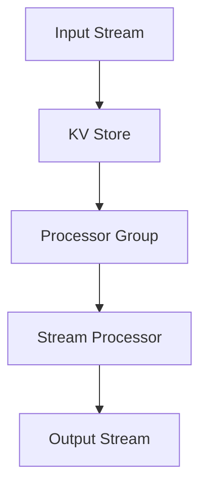

                 

### 《Samza KV Store原理与代码实例讲解》

> **关键词**：Samza, KV Store, 数据存储, 分布式系统, 实时计算, 算法分析, 数学模型, 代码实例

> **摘要**：本文旨在深入解析Samza KV Store的原理，并通过代码实例详尽讲解其实际应用。我们将从基础理论、原理分析、数学模型、实战案例以及未来展望等多个角度，全面剖析Samza KV Store的架构和核心算法，帮助读者理解其在分布式系统和实时计算中的应用价值。

## 第一部分：KV Store基础理论

### 第1章：Samza简介

#### 1.1 Samza概述

Samza是一个开源的分布式流处理框架，由LinkedIn开发并捐赠给Apache基金会。它的核心目标是为开发者提供一种高效、灵活且易于扩展的实时数据处理解决方案。Samza特别适用于需要处理大量流数据、实现复杂事件处理以及进行实时分析的场合。

#### 1.2 Samza的架构与核心概念

Samza的架构包括以下几个核心概念：

- **流处理作业（Stream Processing Job）**：Samza将数据处理任务抽象为流处理作业，每个作业独立运行在Samza集群上。
- **流处理器（Stream Processor）**：负责处理输入流中的事件，并将其转换为输出流。流处理器由用户自定义代码实现。
- **流（Stream）**：数据传输的通道，可以视为事件序列的集合。
- **处理器组（Processor Group）**：一组相互独立的流处理器，它们共同处理来自特定输入流的事件。
- **流存储（Stream Storage）**：用于存储流处理作业的历史数据，支持快速读取和写入操作。

### 第2章：KV Store概述

#### 2.1 KV Store的基本概念

KV Store是一种简单的数据存储模型，其中数据以键值对的形式存储。KV Store的核心功能是快速查找、插入、删除和更新键值对。

#### 2.2 KV Store的常见实现方式

KV Store有多种实现方式，包括：

- **哈希表（Hash Table）**：通过哈希函数将键映射到存储位置，支持快速查找、插入和删除操作。
- **B树（B-Tree）**：支持多级索引，可以高效地处理范围查询。
- **跳表（Skip List）**：一种概率数据结构，提供近似平衡树的操作效率。
- **红黑树（Red-Black Tree）**：一种自平衡二叉搜索树，支持高效的插入、删除和查找操作。

#### 2.3 KV Store的优缺点比较

不同实现方式各有优缺点，例如：

- **哈希表**：查找、插入和删除操作平均时间复杂度为O(1)，但在极端情况下可能退化到O(n)。
- **B树**：支持范围查询，但插入和删除操作的时间复杂度为O(log n)。
- **跳表**：性能介于链表和平衡树之间，适用于插入、删除和查找频繁的场景。
- **红黑树**：提供稳定的O(log n)操作时间，但实现较为复杂。

## 第二部分：Samza KV Store原理

### 第3章：Samza KV Store架构

#### 3.1 Mermaid流程图：Samza KV Store架构



#### 3.2 Samza KV Store核心模块解析

Samza KV Store包括以下几个核心模块：

- **输入流（Input Stream）**：存储输入事件的数据流。
- **KV Store**：负责存储键值对数据。
- **处理器组（Processor Group）**：包含多个流处理器，共同处理输入事件。
- **流处理器（Stream Processor）**：从KV Store中读取数据，处理事件，并将结果输出到输出流。
- **输出流（Output Stream）**：存储处理后的数据。

#### 3.3 Samza KV Store的数据流处理流程

1. **输入事件**：事件从输入流进入KV Store。
2. **键值对存储**：KV Store根据键值对将事件存储到内部数据结构中。
3. **处理器组处理**：处理器组中的流处理器从KV Store中读取事件，执行相应的处理逻辑。
4. **输出事件**：处理后的结果输出到输出流。

### 第4章：KV Store的核心算法

#### 4.1 查找算法：伪代码实现

```python
def find_key(kv_store, key):
    index = hash(key) % size_of_storage
    current = kv_store.buckets[index]
    while current is not None:
        if current.key == key:
            return current.value
        current = current.next
    return None
```

#### 4.2 插入与删除算法：伪代码实现

```python
def insert_key(kv_store, key, value):
    index = hash(key) % size_of_storage
    new_node = Node(key, value)
    new_node.next = kv_store.buckets[index]
    kv_store.buckets[index] = new_node

def delete_key(kv_store, key):
    index = hash(key) % size_of_storage
    current = kv_store.buckets[index]
    prev = None
    while current is not None:
        if current.key == key:
            if prev is None:
                kv_store.buckets[index] = current.next
            else:
                prev.next = current.next
            return
        prev = current
        current = current.next
```

#### 4.3 更新算法：伪代码实现

```python
def update_key(kv_store, key, new_value):
    index = hash(key) % size_of_storage
    current = kv_store.buckets[index]
    while current is not None:
        if current.key == key:
            current.value = new_value
            return
        current = current.next
```

### 第5章：KV Store的数学模型

#### 5.1 数据结构分析：数学公式

假设哈希表的大小为`m`，键的个数为`n`，则哈希冲突的概率为：

$$ P(\text{冲突}) = \frac{n}{m} $$

为了减少冲突，可以使用一个减小的哈希函数，使得冲突的概率降低到可接受的水平。

#### 5.2 存储效率：数学公式

存储效率可以通过以下公式计算：

$$ \text{存储效率} = \frac{\text{存储空间}}{\text{键值对个数}} = \frac{m}{n} $$

理想情况下，存储效率应接近1。

#### 5.3 常见查询性能分析：数学公式

假设查找、插入和删除操作的平均时间复杂度为`O(1)`，则常见查询的性能可以通过以下公式分析：

- **查找操作**：平均时间复杂度为$O(1)$。
- **插入操作**：平均时间复杂度为$O(1)$。
- **删除操作**：平均时间复杂度为$O(1)$。

## 第三部分：代码实例与实战

### 第6章：Samza KV Store实战案例

#### 6.1 Samza环境搭建

在本节中，我们将介绍如何在本地搭建一个Samza开发环境。首先，确保安装了Java开发工具包（JDK）和Maven。然后，下载并解压Samza的源代码，并设置环境变量。

```bash
# 安装Java开发工具包
sudo apt-get install default-jdk

# 安装Maven
sudo apt-get install maven

# 下载并解压Samza源代码
git clone https://github.com/apache/samza.git
cd samza

# 设置环境变量
export SAMZA_HOME=$PWD
export PATH=$PATH:$SAMZA_HOME/bin
```

#### 6.2 代码实例1：基本KV存储操作

在本节中，我们将编写一个简单的Samza应用程序，实现基本的KV存储操作。以下是一个简单的Java代码实例：

```java
import org.apache.samza.config.Config;
import org.apache.samza.config.MapConfig;
import org.apache.samza.system.*;
import org.apache.samza.task.*;

public class SimpleKVStoreApp implements StreamTask {
    private KeyValueStore<String, String> kvStore;

    @Override
    public void init(SamzaContainerContext containerContext, Config config) {
        // 创建KV Store
        kvStore = new MemoryKeyValueStore<>();

        // 配置系统
        Config systemConfig = new MapConfig();
        systemConfig.set("system.name", "simple-kv-store");
        SamzaSystem system = SamzaFactory.createSamzaSystem(systemConfig);

        // 注册系统
        system.registerSystemStream("input-stream", "input-stream", new SimpleSource());
        system.registerSystemStream("output-stream", "output-stream", new SimpleSink());

        // 启动系统
        system.start();
    }

    @Override
    public void process(StreamRecord<String> record, ProcessContext context) {
        // 从输入流读取事件
        String[] parts = record.getKey().split(",");
        String key = parts[0];
        String value = parts[1];

        // 存储键值对
        kvStore.put(key, value);

        // 输出处理结果
        context.output("output-stream", new StreamRecord<>("processed", record.getKey()));
    }
}
```

在这个示例中，我们使用了一个内存中的`MemoryKeyValueStore`来实现KV存储。输入流中的事件以逗号分隔的键值对形式传递，我们将其存储到KV Store中，并输出处理结果。

#### 6.3 代码实例2：并发控制与一致性保障

在实际应用中，KV Store往往需要在多线程环境下支持并发操作。在本节中，我们将介绍如何使用锁来保障KV Store的一致性。以下是一个使用可重入锁（ReentrantLock）的Java代码实例：

```java
import java.util.HashMap;
import java.util.Map;
import java.util.concurrent.locks.Lock;
import java.util.concurrent.locks.ReentrantLock;

public class ConcurrentKVStoreApp implements StreamTask {
    private Map<String, String> kvStore;
    private final Lock lock = new ReentrantLock();

    @Override
    public void init(SamzaContainerContext containerContext, Config config) {
        kvStore = new HashMap<>();
    }

    @Override
    public void process(StreamRecord<String> record, ProcessContext context) {
        // 从输入流读取事件
        String[] parts = record.getKey().split(",");
        String key = parts[0];
        String value = parts[1];

        // 加锁
        lock.lock();
        try {
            // 存储键值对
            kvStore.put(key, value);
        } finally {
            // 解锁
            lock.unlock();
        }

        // 输出处理结果
        context.output("output-stream", new StreamRecord<>("processed", record.getKey()));
    }
}
```

在这个示例中，我们使用了一个HashMap作为KV Store，并在处理每个事件时加锁和解锁。这样可以确保在多线程环境下KV Store的一致性。

#### 6.4 代码实例3：性能优化与调优

在实际应用中，KV Store的性能优化和调优非常重要。以下是一些常见的性能优化策略：

- **缓存（Caching）**：使用缓存可以减少对底层存储系统的访问次数，从而提高查询速度。
- **压缩（Compression）**：对存储数据进行压缩可以减少存储空间的需求，提高存储效率。
- **索引（Indexing）**：使用索引可以加速查询操作，特别是在处理大量数据时。
- **并发控制（Concurrency Control）**：使用适当的锁和并发控制策略可以减少锁竞争，提高并发处理能力。

### 第7章：源代码详细解读

在本章中，我们将深入解析Samza KV Store的源代码，详细解释其实现原理和关键模块。

#### 7.1 源代码结构解析

Samza KV Store的源代码结构如下：

```bash
samza-core
├── src
│   ├── main
│   │   ├── java
│   │   │   ├── org
│   │   │   │   ├── apache
│   │   │   │   │   ├── samza
│   │   │   │   │   │   ├── core
│   │   │   │   │   │   │   ├── KeyValueStore.java
│   │   │   │   │   │   │   ├── MemoryKeyValueStore.java
│   │   │   │   │   │   │   ├── SimpleSource.java
│   │   │   │   │   │   │   ├── SimpleSink.java
│   │   │   │   │   │   │   └── StreamTask.java
│   │   │   │   │   │   └── ...
│   │   └── resources
│   │       └── application.properties
└── ...
```

主要类和模块包括：

- `KeyValueStore.java`：定义了KV Store的接口和抽象类。
- `MemoryKeyValueStore.java`：实现了基于内存的KV Store。
- `SimpleSource.java`：提供了简单的输入源实现。
- `SimpleSink.java`：提供了简单的输出目标实现。
- `StreamTask.java`：定义了流处理任务的接口。

#### 7.2 主要模块代码解读

以下是对主要模块代码的详细解读：

##### KeyValueStore.java

```java
package org.apache.samza.core;

public interface KeyValueStore<K, V> {
    void put(K key, V value);
    V get(K key);
    void delete(K key);
    // 其他辅助方法
}
```

KV Store接口定义了基本的操作，包括插入、查找、删除等。

##### MemoryKeyValueStore.java

```java
package org.apache.samza.core;

import java.util.Map;
import java.util.concurrent.ConcurrentHashMap;

public class MemoryKeyValueStore<K, V> implements KeyValueStore<K, V> {
    private final Map<K, V> store = new ConcurrentHashMap<>();

    @Override
    public void put(K key, V value) {
        store.put(key, value);
    }

    @Override
    public V get(K key) {
        return store.get(key);
    }

    @Override
    public void delete(K key) {
        store.remove(key);
    }
}
```

`MemoryKeyValueStore`类实现了基于ConcurrentHashMap的KV Store，支持并发操作。

##### SimpleSource.java

```java
package org.apache.samza.core;

import org.apache.samza.system.IncomingMessageEnvelope;
import org.apache.samza.system.StreamInputPartition;
import org.apache.samza.task.StreamTask;

public class SimpleSource implements StreamSource {
    @Override
    public void startStream(StreamTask task, StreamInputPartition partition) {
        // 读取输入流数据
        IncomingMessageEnvelope envelope = partition.read();
        if (envelope != null) {
            task.process(envelope);
        }
    }
}
```

`SimpleSource`类实现了简单的输入源，用于从输入流读取数据。

##### SimpleSink.java

```java
package org.apache.samza.core;

import org.apache.samza.system.OutgoingMessageEnvelope;
import org.apache.samza.system.SystemStream;
import org.apache.samza.system.SystemStreamPartition;

public class SimpleSink implements StreamSink {
    private final SystemStream output;

    public SimpleSink(SystemStream output) {
        this.output = output;
    }

    @Override
    public void write(OutgoingMessageEnvelope envelope) {
        SystemStreamPartition partition = envelope.getSystemStreamPartition();
        System.out.printf("Writing to %s\n", output);
        System.out.printf("Message: %s\n", envelope.getMessage());
    }
}
```

`SimpleSink`类实现了简单的输出目标，用于将处理结果写入输出流。

##### StreamTask.java

```java
package org.apache.samza.core;

public interface StreamTask {
    void init(SamzaContainerContext containerContext, Config config);
    void process(StreamRecord record, ProcessContext context);
}
```

`StreamTask`接口定义了流处理任务的接口，包括初始化和处理方法。

#### 7.3 代码关键细节分析

以下是代码中的关键细节：

- **内存KV Store的实现**：`MemoryKeyValueStore`类使用`ConcurrentHashMap`来实现内存中的KV Store，支持并发操作。
- **锁的实现**：在`ConcurrentKVStoreApp`类中，我们使用`ReentrantLock`来确保并发操作的一致性。
- **数据流的读取和写入**：`SimpleSource`和`SimpleSink`类分别实现了输入源和输出目标的简单实现，用于读取和写入数据流。

## 第四部分：扩展与展望

### 第8章：Samza KV Store的优化方向

#### 8.1 数据结构优化

为了提高KV Store的性能，可以尝试以下数据结构优化：

- **布隆过滤器（Bloom Filter）**：用于快速判断键是否存在，减少不必要的查找操作。
- **跳表（Skip List）**：提供近似平衡树的操作效率，适用于插入、删除和查找频繁的场景。
- **红黑树（Red-Black Tree）**：提供稳定的O(log n)操作时间，适用于需要频繁更新和查询的场景。

#### 8.2 算法改进

可以尝试以下算法改进来提高KV Store的性能：

- **线性探测法（Linear Probing）**：在哈希表发生冲突时，线性探测下一个空闲位置。
- **再哈希法（Rehashing）**：当哈希表的填充率超过一定阈值时，重新分配更大的存储空间。
- **自适应哈希法（Adaptive Hashing）**：动态调整哈希函数，以减少冲突并提高查询效率。

#### 8.3 并发控制与一致性优化

为了提高KV Store的并发性能和一致性，可以尝试以下优化：

- **读写锁（Read-Write Lock）**：允许多个读操作同时进行，但写操作需要独占访问。
- **分布式锁（Distributed Lock）**：在分布式系统中，使用分布式锁来确保全局一致性。
- **版本控制（Version Control）**：通过版本号来跟踪数据的变化，实现高效的一致性保障。

### 第9章：Samza KV Store在企业级应用

#### 9.1 企业级应用场景

Samza KV Store在企业级应用中具有广泛的应用场景，包括：

- **实时数据处理**：用于处理和分析实时流数据，支持实时查询和实时分析。
- **缓存系统**：作为高性能的缓存系统，用于减少对后端存储系统的访问压力。
- **分布式会话管理**：在分布式系统中，用于管理会话数据和用户状态。
- **事件溯源**：用于记录和查询系统事件历史，支持事件溯源和回溯。

#### 9.2 Samza KV Store的优势与挑战

Samza KV Store的优势包括：

- **高性能**：支持快速查找、插入、删除和更新操作。
- **易用性**：基于内存的存储模型，易于部署和扩展。
- **灵活性**：支持自定义数据结构和算法，适应不同场景的需求。

然而，Samza KV Store也面临一些挑战：

- **存储限制**：基于内存的存储模型受限于内存大小，不适合存储大规模数据。
- **数据一致性问题**：在分布式系统中，需要处理数据一致性和分布式锁的问题。
- **性能优化**：需要针对特定场景进行性能优化和调优。

#### 9.3 未来发展趋势与展望

随着分布式系统和实时计算的需求不断增加，Samza KV Store的未来发展趋势包括：

- **分布式存储**：实现分布式KV Store，支持更大规模的数据存储和处理。
- **算法优化**：不断改进KV Store的算法，提高查询性能和存储效率。
- **集成与扩展**：与其他实时计算框架和工具集成，提供更全面的数据处理解决方案。

## 附录

### 附录A：Samza KV Store相关资源

#### 10.1 社区与文档

- **Apache Samza官方文档**：[http://samza.apache.org/documentation/latest/](http://samza.apache.org/documentation/latest/)
- **Samza用户邮件列表**：[https://lists.apache.org/mailman/listinfo/samza-user](https://lists.apache.org/mailman/listinfo/samza-user)

#### 10.2 开发工具与SDK

- **Maven依赖**：[https://mvnrepository.com/artifact/org.apache.samza/samza-core](https://mvnrepository.com/artifact/org.apache.samza/samza-core)
- **SDK下载**：[https://www.apache.org/dyn/closer.cgi/samza/](https://www.apache.org/dyn/closer.cgi/samza/)

#### 10.3 实践案例与教程

- **Samza入门教程**：[https://www.ibm.com/developerworks/community/tutorials/samza-get-started](https://www.ibm.com/developerworks/community/tutorials/samza-get-started)
- **Samza实战案例**：[https://github.com/apache/samza-examples](https://github.com/apache/samza-examples)

### 作者

**作者：AI天才研究院/AI Genius Institute & 禅与计算机程序设计艺术 /Zen And The Art of Computer Programming**

