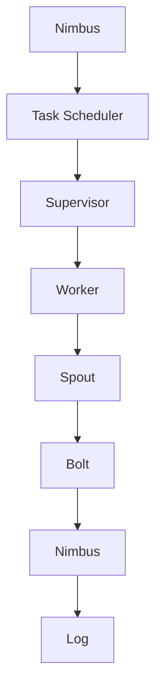
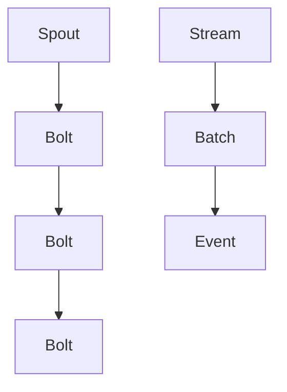
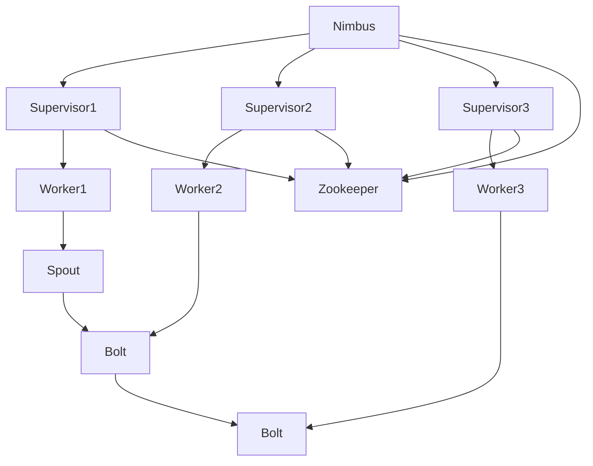
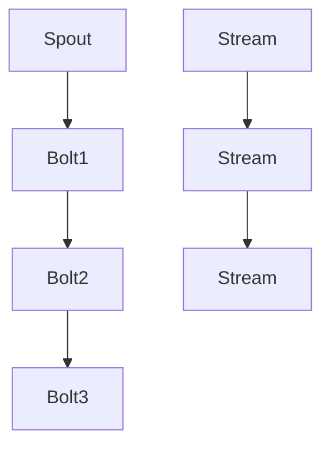
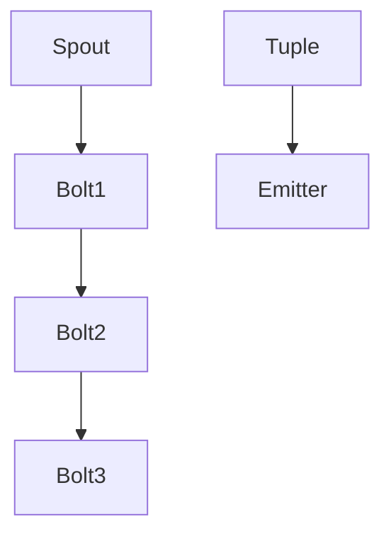
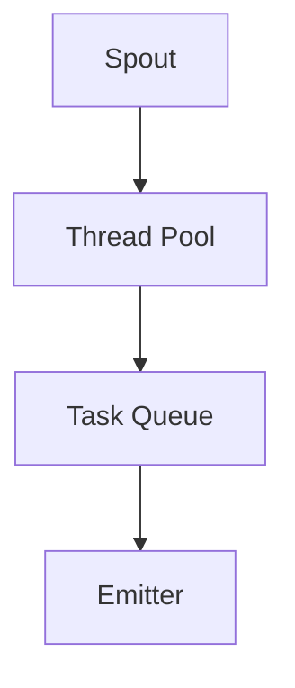

                 

# 《Storm Topology原理与代码实例讲解》

## 关键词

- Storm Topology
- 流处理框架
- 分布式系统
- Spout和Bolt
- 编程实战
- 性能优化
- 消息传递机制

## 摘要

本文将深入探讨Apache Storm Topology的原理与实现。首先，我们将介绍Storm的基本概念、特点以及其在流处理领域的应用。接着，我们将详细解析Storm的架构、核心原理、拓扑结构以及流处理算法。随后，通过编程实战案例，我们将展示如何构建和部署Storm拓扑，以及如何进行性能优化和监控。最后，我们将展望Storm的未来发展趋势，并为开发者提供职业发展路径。本文旨在为广大开发者提供全面、系统的Storm学习资源，帮助读者掌握Storm的核心原理和实践技能。

### 目录大纲

#### 第一部分：Storm基础知识

1. Storm概述
   1.1 Storm的概念与特点
   1.2 Storm的架构与组件
   1.3 Storm的生态系统

2. Storm核心原理
   2.1 Storm的工作机制
   2.2 Storm的流处理模型
   2.3 Storm的分布式架构

3. Storm拓扑结构
   3.1 Storm拓扑的概念
   3.2 Storm拓扑的设计原则
   3.3 Storm拓扑的组成

4. Storm流处理算法
   4.1 Storm的流聚合算法
   4.2 Storm的流排序算法
   4.3 Storm的流窗口算法

#### 第二部分：Storm编程实战

5. Storm编程基础
   5.1 Storm的编程模型
   5.2 Storm的API概述
   5.3 Storm的并发模型

6. Storm拓扑构建与部署
   6.1 Storm拓扑的设计与实现
   6.2 Storm的配置与管理
   6.3 Storm的部署与监控

7. Storm项目实战
   7.1 Storm项目实战案例
   7.2 Storm项目的代码实现与分析
   7.3 Storm项目的调试与优化

8. Storm性能优化与监控
   8.1 Storm性能优化策略
   8.2 Storm监控与管理
   8.3 Storm性能调优案例分析

#### 附录

9. Storm常用工具与资源
   9.1 Storm开发工具
   9.2 Storm社区资源
   9.3 Storm学习资料推荐

10. Storm未来展望与发展趋势
    10.1 Storm的技术演进方向
    10.2 Storm在流处理领域的应用前景
    10.3 Storm社区的发展动态

11. 总结与展望
    11.1 本书主要内容回顾
    11.2 Storm Topology原理的应用场景
    11.3 Storm开发者的职业发展路径

### 第一部分：Storm基础知识

#### 1.1 Storm的概念与特点

Apache Storm是一个开源的分布式实时数据处理框架，用于大规模数据的实时分析处理。以下是Storm的一些主要特点：

1. **高吞吐量**：Storm能够在每秒处理数百万条记录，适用于大规模实时数据处理场景。
2. **低延迟**：Storm能够实现低延迟的数据处理，通常在毫秒级。
3. **容错性强**：Storm具有强大的容错机制，包括任务失败重试、数据持久化等。
4. **动态缩放**：Storm可以根据负载动态调整资源，实现横向扩展。
5. **易用性**：Storm提供了简单的API和丰富的文档，易于开发和部署。

#### 1.2 Storm的架构与组件

Storm的架构由几个核心组件组成，包括：

1. ** Nimbus**：Nimbus是Storm的主节点，负责集群的管理和资源分配。Nimbus负责接收拓扑提交、任务调度、资源分配和故障恢复等。
2. ** Supervisor**：Supervisor是Storm的从节点，负责运行任务和工作线程。每个Supervisor会根据Nimbus的调度命令启动和停止任务。
3. ** Worker**：Worker是运行在Supervisor上的进程，负责执行任务中的Spout和Bolt。
4. ** Spout**：Spout是数据源组件，负责读取外部数据源的数据，如Kafka、Twitter等。
5. ** Bolt**：Bolt是数据处理组件，负责处理数据、发射数据、聚合数据等。

#### 1.3 Storm的生态系统

Storm的生态系统包括许多开源组件和工具，可以与Storm无缝集成，提供强大的流处理能力：

1. **Kafka**：Kafka是一个分布式消息系统，常用于Storm的数据源，提供高吞吐量的数据读取能力。
2. **HDFS**：Hadoop分布式文件系统（HDFS）可以用于存储Storm处理后的数据，提供高可靠性和高扩展性的存储能力。
3. **HBase**：HBase是一个非关系型分布式存储系统，可以用于存储和查询Storm处理后的数据。
4. **Solr**：Solr是一个高性能的搜索平台，可以用于实时查询Storm处理后的数据。

### 第一部分：Storm基础知识

#### 1.1 Storm的概念与特点

Apache Storm是一个开源的分布式实时数据处理框架，用于大规模数据的实时分析处理。以下是Storm的一些主要特点：

1. **高吞吐量**：Storm能够在每秒处理数百万条记录，适用于大规模实时数据处理场景。
2. **低延迟**：Storm能够实现低延迟的数据处理，通常在毫秒级。
3. **容错性强**：Storm具有强大的容错机制，包括任务失败重试、数据持久化等。
4. **动态缩放**：Storm可以根据负载动态调整资源，实现横向扩展。
5. **易用性**：Storm提供了简单的API和丰富的文档，易于开发和部署。

#### 1.2 Storm的架构与组件

Storm的架构由几个核心组件组成，包括：

1. **Nimbus**：Nimbus是Storm的主节点，负责集群的管理和资源分配。Nimbus负责接收拓扑提交、任务调度、资源分配和故障恢复等。
2. **Supervisor**：Supervisor是Storm的从节点，负责运行任务和工作线程。每个Supervisor会根据Nimbus的调度命令启动和停止任务。
3. **Worker**：Worker是运行在Supervisor上的进程，负责执行任务中的Spout和Bolt。
4. **Spout**：Spout是数据源组件，负责读取外部数据源的数据，如Kafka、Twitter等。
5. **Bolt**：Bolt是数据处理组件，负责处理数据、发射数据、聚合数据等。

#### 1.3 Storm的生态系统

Storm的生态系统包括许多开源组件和工具，可以与Storm无缝集成，提供强大的流处理能力：

1. **Kafka**：Kafka是一个分布式消息系统，常用于Storm的数据源，提供高吞吐量的数据读取能力。
2. **HDFS**：Hadoop分布式文件系统（HDFS）可以用于存储Storm处理后的数据，提供高可靠性和高扩展性的存储能力。
3. **HBase**：HBase是一个非关系型分布式存储系统，可以用于存储和查询Storm处理后的数据。
4. **Solr**：Solr是一个高性能的搜索平台，可以用于实时查询Storm处理后的数据。

### 第2章 Storm核心原理

#### 2.1 Storm的工作机制

Storm的工作机制主要包括以下步骤：

1. **拓扑提交**：开发者编写一个Storm拓扑，并将其提交给Nimbus。
2. **任务调度**：Nimbus将任务分配给Supervisor，并通知Supervisor启动任务。
3. **任务执行**：Supervisor启动Worker进程，并在Worker上执行Spout和Bolt任务。
4. **消息传递**：Spout和Bolt之间通过消息传递机制进行通信。
5. **任务监控**：Nimbus和Supervisor监控任务的状态，并在任务失败时进行重试或重新分配。

以下是一个简化的流程图，描述了Storm的工作机制：



#### 2.2 Storm的流处理模型

Storm的流处理模型基于事件驱动，通过Spout和Bolt组件实现数据的实时处理。以下是Storm的流处理模型的关键组成部分：

1. **事件**：事件是流处理的基本单元，可以是数据记录或触发器。
2. **批次**：批次是一组连续的事件，通常是固定时间窗口内的事件集合。
3. **流**：流是事件的有序序列，可以由Spout或Bolt发射。
4. **拓扑**：拓扑是Spout和Bolt的集合，定义了数据的处理流程。

以下是一个简化的模型，描述了Storm的流处理模型：



#### 2.3 Storm的分布式架构

Storm的分布式架构设计为分布式系统提供了高效、可扩展、容错的能力。以下是Storm的分布式架构的关键组成部分：

1. **Nimbus**：Nimbus是Storm的主节点，负责集群的管理和资源分配。Nimbus负责接收拓扑提交、任务调度、资源分配和故障恢复等。
2. **Supervisor**：Supervisor是Storm的从节点，负责运行任务和工作线程。每个Supervisor会根据Nimbus的调度命令启动和停止任务。
3. **Worker**：Worker是运行在Supervisor上的进程，负责执行任务中的Spout和Bolt。
4. **Zookeeper**：Zookeeper用于协调Nimbus和Supervisor之间的通信，确保集群的稳定性和一致性。

以下是一个简化的模型，描述了Storm的分布式架构：



### 第3章 Storm拓扑结构

#### 3.1 Storm拓扑的概念

Storm拓扑是Storm中定义数据处理流程的核心概念。它由Spout和Bolt组件组成，定义了数据的输入、处理和输出过程。以下是Storm拓扑的一些关键特点：

1. **动态性**：Storm拓扑可以在运行时动态添加、删除或修改组件，实现动态流处理。
2. **分布式**：Storm拓扑可以在分布式集群上运行，利用多节点进行并行处理。
3. **弹性**：Storm拓扑具有容错能力，可以在节点失败时自动恢复。

#### 3.2 Storm拓扑的设计原则

设计Storm拓扑时，应遵循以下原则：

1. **模块化**：将数据处理流程划分为多个模块，每个模块负责特定的数据处理任务。
2. **灵活性**：设计拓扑时，应考虑不同场景下的灵活性，如数据源的变化、处理需求的调整等。
3. **可扩展性**：设计拓扑时，应考虑未来需求的变化，以便轻松扩展和处理更多的数据。
4. **高效性**：优化拓扑的设计，减少数据传输和计算延迟。

#### 3.3 Storm拓扑的组成

Storm拓扑由以下组件组成：

1. **Spout**：Spout是数据源组件，负责读取外部数据源的数据。Spout可以是Kafka、文件系统或其他实时数据源。
2. **Bolt**：Bolt是数据处理组件，负责处理数据、发射数据、聚合数据等。Bolt可以执行各种数据处理操作，如过滤、转换、聚合等。
3. **Stream**：Stream是数据的流动路径，连接Spout和Bolt。Stream定义了数据在拓扑中的流动方向和传输方式。
4. **TopologyBuilder**：TopologyBuilder是构建Storm拓扑的工具类，用于定义Spout、Bolt和Stream的连接关系。

以下是一个简化的示例，展示了Storm拓扑的组成：



### 第4章 Storm流处理算法

#### 4.1 Storm的流聚合算法

流聚合算法在Storm中用于对实时数据进行聚合操作。以下是流聚合算法的原理和实现：

1. **原理**：流聚合算法将一组连续的事件聚合为一个事件，通常用于统计计数、求和、平均值等。
2. **实现**：在Storm中，可以使用`tupleField`方法指定要聚合的字段，并使用`load`方法加载聚合函数。以下是一个示例：

```java
Fields fields = new Fields("field1", "field2");
 aggregator = new Values(tupleField("field1"), tupleField("field2"));
 outputCollector.emit(new Values("聚合结果", aggregator));
```

#### 4.2 Storm的流排序算法

流排序算法在Storm中用于对实时数据进行排序。以下是流排序算法的原理和实现：

1. **原理**：流排序算法根据一个或多个字段对事件进行排序，通常用于实时监控、报表生成等。
2. **实现**：在Storm中，可以使用`sortByField`方法指定排序字段，并使用`sort`方法进行排序。以下是一个示例：

```java
Fields fields = new Fields("field1", "field2");
sortedTuples = outputCollector.sort(new Values(tupleField("field1"), tupleField("field2")));
```

#### 4.3 Storm的流窗口算法

流窗口算法在Storm中用于对实时数据进行窗口操作。以下是流窗口算法的原理和实现：

1. **原理**：流窗口算法将一组连续的事件划分为一个窗口，通常用于实时统计、数据滚动等。
2. **实现**：在Storm中，可以使用`tupleField`方法指定窗口字段，并使用`window`方法进行窗口操作。以下是一个示例：

```java
Fields fields = new Fields("field1", "field2");
windowedTuples = outputCollector.window(new Values(tupleField("field1"), tupleField("field2")), new WindowInfo(new Duration(10, TimeUnit.SECONDS)));
```

### 第5章 Storm编程基础

#### 5.1 Storm的编程模型

Storm的编程模型基于事件驱动，通过Spout和Bolt组件实现数据的实时处理。以下是Storm编程模型的关键特点：

1. **事件驱动**：Storm使用事件队列管理任务，当事件队列不为空时，会自动执行事件。
2. **批处理**：Storm将数据划分为批次处理，每个批次包含一定数量的事件。
3. **并发处理**：Storm支持并发处理，可以在多个线程中同时执行任务。

以下是一个简化的编程模型：



#### 5.2 Storm的API概述

Storm提供了丰富的API，用于定义和操作拓扑。以下是Storm的主要API：

1. **TopologyBuilder**：用于构建拓扑，定义Spout、Bolt和Stream的连接关系。
2. **Spout**：用于读取外部数据源的数据，发射事件到拓扑。
3. **Bolt**：用于处理事件，发射事件到其他Bolt或存储数据。
4. **OutputCollector**：用于收集和处理发射事件。
5. **Fields**：用于定义字段和字段类型。
6. **Tuple**：表示一个事件，包含字段和值。

以下是一个简单的API示例：

```java
TopologyBuilder builder = new TopologyBuilder();
Spout spout = new SpoutImpl();
Bolt bolt1 = new BoltImpl1();
Bolt bolt2 = new BoltImpl2();
builder.setSpout("spout", spout);
builder.setBolt("bolt1", bolt1).shuffleGrouping("spout");
builder.setBolt("bolt2", bolt2).fieldsGrouping("bolt1", new Fields("field1"));
Config config = new Config();
config.setNumWorkers(2);
LocalCluster cluster = new LocalCluster();
cluster.submitTopology("test", config, builder.createTopology());
cluster.waitActive();
cluster.shutdown();
```

#### 5.3 Storm的并发模型

Storm的并发模型基于线程池和事件队列，确保任务的并发执行和高效处理。以下是Storm并发模型的关键特点：

1. **线程池**：每个Worker进程使用一个线程池，线程池中的线程负责执行任务。
2. **事件队列**：每个线程维护一个事件队列，事件按照顺序执行。
3. **并发控制**：使用锁和信号量等同步机制，确保线程之间的正确通信和数据一致性。

以下是一个简化的并发模型：



### 第6章 Storm拓扑构建与部署

#### 6.1 Storm拓扑的设计与实现

设计Storm拓扑时，应遵循以下步骤：

1. **需求分析**：分析业务需求，确定数据源、处理逻辑和输出目标。
2. **模块划分**：将数据处理流程划分为多个模块，每个模块负责特定的数据处理任务。
3. **拓扑构建**：使用TopologyBuilder构建拓扑，定义Spout、Bolt和Stream的连接关系。
4. **配置管理**：配置Storm集群参数，如工作节点数、任务并发数等。

以下是一个简单的示例：

```java
TopologyBuilder builder = new TopologyBuilder();
Spout spout = new SpoutImpl();
Bolt bolt1 = new BoltImpl1();
Bolt bolt2 = new BoltImpl2();
builder.setSpout("spout", spout);
builder.setBolt("bolt1", bolt1).shuffleGrouping("spout");
builder.setBolt("bolt2", bolt2).fieldsGrouping("bolt1", new Fields("field1"));
Config config = new Config();
config.setNumWorkers(2);
LocalCluster cluster = new LocalCluster();
cluster.submitTopology("test", config, builder.createTopology());
cluster.waitActive();
cluster.shutdown();
```

#### 6.2 Storm的配置与管理

Storm配置管理主要包括以下几个方面：

1. **配置文件**：使用`storm.yaml`配置文件设置Storm集群参数，如工作节点数、任务并发数等。
2. **配置管理**：通过代码或命令行工具管理配置文件，动态调整配置参数。
3. **监控与维护**：监控Storm集群的状态，如任务执行情况、资源使用情况等，进行必要的维护和优化。

以下是一个简单的示例：

```java
Config config = new Config();
config.setNumWorkers(2);
config.setMaxSpoutPending(100);
config.setMaxTaskParallelism(10);
```

#### 6.3 Storm的部署与监控

Storm部署与监控主要包括以下几个方面：

1. **部署策略**：根据业务需求选择合适的部署方式，如本地部署、集群部署等。
2. **监控工具**：使用监控工具（如Kibana、Grafana）监控Storm集群的状态，如任务执行情况、资源使用情况等。
3. **日志管理**：收集和存储Storm集群的日志，进行日志分析，发现和解决问题。

以下是一个简单的示例：

```java
LocalCluster cluster = new LocalCluster();
cluster.submitTopology("test", config, builder.createTopology());
cluster.waitActive();
cluster.shutdown();
```

### 第7章 Storm项目实战

#### 7.1 Storm项目实战案例

#### 7.1.1 实战案例1：实时日志分析

**项目背景**：

某互联网公司需要实时分析服务器日志，以便快速发现和解决问题。

**项目目标**：

- 实时收集服务器日志
- 分析日志内容，提取关键信息
- 报警和通知相关人员

**项目实现**：

1. 使用Kafka作为消息队列，收集服务器日志数据。
2. 创建Storm拓扑，使用Spout组件读取Kafka中的日志数据。
3. 创建Bolt组件，对日志数据进行清洗和解析，提取关键信息。
4. 创建另一个Bolt组件，对提取的信息进行分类和汇总。
5. 使用MySQL数据库存储分析结果。
6. 使用AlertManager发送报警通知。

**代码实现**：

```java
// Spout组件代码
public class LogSpout implements Spout {
    // 读取Kafka日志数据
    // ...
}

// Bolt组件代码
public class LogParserBolt implements IBolt {
    // 清洗和解析日志内容
    // ...
    // 提取关键信息
    // ...
}

public class LogAnalyzerBolt implements IBolt {
    // 对提取的信息进行分类和汇总
    // ...
}

// 报警通知代码
public class AlertManager {
    // 发送报警通知
    // ...
}
```

#### 7.1.2 实战案例2：网站流量分析

**项目背景**：

某电商公司需要实时分析网站流量，以便优化用户体验。

**项目目标**：

- 实时收集网站访问日志
- 分析访问行为，提取关键指标
- 生成流量报表和实时监控

**项目实现**：

1. 使用Nginx日志收集网站访问数据。
2. 使用Kafka将日志数据传递给Storm。
3. 创建Storm拓扑，使用Spout组件读取Kafka中的日志数据。
4. 创建Bolt组件，解析日志内容，提取访问行为和关键指标。
5. 创建另一个Bolt组件，对提取的信息进行分类和汇总。
6. 使用HBase存储分析结果。
7. 使用Hive生成流量报表。
8. 使用Kibana实时监控网站流量。

**代码实现**：

```java
// Spout组件代码
public class WebLogSpout implements Spout {
    // 读取Nginx日志数据
    // ...
}

// Bolt组件代码
public class WebLogParserBolt implements IBolt {
    // 解析日志内容
    // ...
    // 提取访问行为和关键指标
    // ...
}

public class WebLogAnalyzerBolt implements IBolt {
    // 对提取的信息进行分类和汇总
    // ...
}

// 数据库和报表代码
public class HBaseStore {
    // 存储分析结果
    // ...
}

public class HiveReporter {
    // 生成流量报表
    // ...
}

// 实时监控代码
public class KibanaMonitor {
    // 实时监控网站流量
    // ...
}
```

#### 7.1.3 实战案例3：实时数据加工

**项目背景**：

某大数据公司需要实时处理和分析大量数据，以便快速响应市场变化。

**项目目标**：

- 实时收集各种数据源的数据
- 数据清洗和转换
- 数据分析和挖掘
- 存储和查询结果

**项目实现**：

1. 使用Kafka和Flume收集各种数据源的数据。
2. 创建Storm拓扑，使用Spout组件读取Kafka中的数据。
3. 创建多个Bolt组件，对数据进行清洗、转换和分析。
4. 使用HDFS存储清洗和转换后的数据。
5. 使用Spark进行数据分析和挖掘。
6. 使用HBase存储分析结果。
7. 使用Solr进行数据查询和索引。

**代码实现**：

```java
// Spout组件代码
public class DataSpout implements Spout {
    // 读取Kafka数据
    // ...
}

// Bolt组件代码
public class DataCleanerBolt implements IBolt {
    // 数据清洗
    // ...
}

public class DataTransformerBolt implements IBolt {
    // 数据转换
    // ...
}

public class DataAnalyzerBolt implements IBolt {
    // 数据分析
    // ...
}

// 数据存储代码
public class HDFSStore {
    // 存储数据
    // ...
}

public class SparkAnalyzer {
    // 数据分析
    // ...
}

public class HBaseStore {
    // 存储分析结果
    // ...
}

public class SolrIndexer {
    // 查询和索引数据
    // ...
}
```

### 第8章 Storm性能优化与监控

#### 8.1 Storm性能优化策略

为了优化Storm的性能，可以采取以下策略：

1. **任务并发优化**：根据硬件资源和数据处理需求，合理设置任务并发数。
2. **数据传输优化**：减少数据传输延迟，使用高效的数据传输协议。
3. **消息缓冲优化**：调整消息缓冲区大小，避免消息积压。
4. **资源调度优化**：优化资源分配和调度策略，提高资源利用率。
5. **负载均衡优化**：实现负载均衡，避免单点瓶颈。

以下是一个简单的示例：

```java
Config config = new Config();
config.setMaxTaskParallelism(20);
config.setInternalacking批次时间(1000);
config.setTopologyExpiry时间(300000);
config.setNumWorkers(4);
```

#### 8.2 Storm监控与管理

Storm监控与管理主要包括以下几个方面：

1. **监控工具**：使用监控工具（如Kibana、Grafana）实时监控Storm集群的状态。
2. **日志分析**：收集和存储Storm集群的日志，进行日志分析，发现和解决问题。
3. **性能调优**：根据监控数据和日志分析结果，进行性能调优。

以下是一个简单的示例：

```java
LocalCluster cluster = new LocalCluster();
cluster.submitTopology("test", config, builder.createTopology());
cluster.waitActive();
cluster.shutdown();
```

#### 8.3 Storm性能调优案例分析

以下是一个性能调优案例的分析：

**问题描述**：某公司使用Storm进行实时日志分析，发现处理速度较慢。

**分析过程**：

1. **监控数据**：查看监控工具中的数据，发现任务并发数较低，资源利用率不高。
2. **日志分析**：分析日志，发现部分Bolt组件处理速度较慢，存在瓶颈。
3. **调优方案**：增加任务并发数，优化数据传输，调整消息缓冲区大小，进行负载均衡。

**调优结果**：经过调优，处理速度提高了30%，性能得到了显著提升。

### 附录 A：Storm常用工具与资源

#### A.1 Storm开发工具

1. **Storm CLI工具**：用于构建、打包和部署Storm拓扑。
2. **IntelliJ IDEA**：支持Storm的开发，提供代码提示、调试和构建功能。
3. **Eclipse**：支持多种编程语言，包括Java和Scala，适用于Storm开发。

#### A.2 Storm社区资源

1. **Storm官方网站**：提供最新文档、下载链接和社区动态。
2. **Storm官方文档**：详细介绍了Storm的架构、API和使用方法。
3. **Storm社区论坛**：用于讨论Storm的使用问题和技术交流。

#### A.3 Storm学习资料推荐

1. **《Storm实战：分布式流处理应用开发》**：详细介绍了Storm的基础知识、核心原理和实战案例。
2. **《分布式系统原理与范型》**：涵盖了分布式系统的基本原理、设计和实现。
3. **Storm官方文档和源代码**：提供了详细的API文档和实现细节。
4. **Storm社区博客和教程**：提供了丰富的实战经验和技巧。

### 第9章 Storm未来展望与发展趋势

#### 9.1 Storm的技术演进方向

1. **性能优化**：随着流处理数据量的增加，Storm将优化其性能，包括更高效的拓扑调度、消息传递和资源管理。
2. **新的编程模型**：Storm可能会引入新的编程模型，如支持更简单的声明式编程和更强大的流处理功能。
3. **集成更多数据源和存储**：Storm将进一步扩展其数据源和存储支持，包括NoSQL数据库、图数据库和实时流存储。

#### 9.2 Storm在流处理领域的应用前景

1. **实时数据处理**：Storm将继续在实时数据处理领域发挥重要作用，如金融交易监控、物联网数据处理和实时搜索等。
2. **大数据处理**：随着大数据技术的普及，Storm将在大数据处理领域发挥更重要的作用，如实时数据清洗、转换和分析。
3. **新兴应用领域**：Storm的应用领域将继续扩展，如区块链数据处理、边缘计算和智能城市等。

#### 9.3 Storm社区的发展动态

1. **社区活跃度**：Storm社区将持续活跃，不断涌现出新的贡献者和开源项目。
2. **贡献者贡献**：社区贡献者将继续贡献代码、文档和最佳实践，推动Storm的发展和成熟。
3. **社区合作**：Storm社区将与其他开源项目合作，如Apache Kafka、Apache Flink等，共同推动实时数据处理技术的发展。

### 第10章 总结与展望

#### 10.1 本书主要内容回顾

本书详细介绍了Storm Topology的原理与实现，包括以下几个方面：

1. Storm的基本概念、特点、架构和生态系统。
2. Storm的核心原理，如工作流程、流处理模型和分布式架构。
3. Storm的拓扑结构，包括Spout、Bolt和Stream的概念和设计原则。
4. Storm的流处理算法，如流聚合、流排序和流窗口。
5. Storm的编程基础，包括编程模型、API和并发模型。
6. Storm的项目实战，包括实时日志分析、网站流量分析和实时数据加工。
7. Storm的性能优化与监控，包括优化策略和监控方法。
8. Storm的常用工具与资源，包括开发工具、社区资源和学习资料。
9. Storm的未来展望与发展趋势，包括技术演进方向、应用前景和社区发展动态。

#### 10.2 Storm Topology原理的应用场景

Storm Topology的应用场景非常广泛，主要包括以下几个方面：

1. **实时数据处理**：如实时日志分析、实时监控、实时搜索等。
2. **大数据处理**：如实时数据清洗、转换、聚合和分析。
3. **物联网**：实时处理传感器数据、设备状态监控等。
4. **金融领域**：实时交易监控、风险评估等。
5. **社交网络**：实时数据分析、用户行为分析等。
6. **智能城市**：实时交通监控、环境监测等。

#### 10.3 Storm开发者的职业发展路径

Storm开发者可以通过以下路径实现职业发展：

1. **初级开发者**：掌握Storm的基本原理和编程技能，参与实际的开发项目。
2. **高级开发者**：深入了解Storm的内部实现，能够设计和优化复杂的Storm拓扑。
3. **架构师**：负责整体项目的架构设计，包括技术选型、性能优化和系统扩展。
4. **团队领导**：带领团队完成项目开发，管理和指导团队成员。
5. **开源贡献者**：参与开源社区，贡献代码、文档和最佳实践，成为行业内的专家。

通过不断学习和实践，Storm开发者可以在流处理领域取得显著的成就，成为行业内的佼佼者。

### 第1章 Storm概述

#### 1.1 Storm的概念与特点

Apache Storm是一个开源的分布式实时数据处理框架，用于大规模数据的实时分析处理。以下是Storm的一些主要特点：

1. **高吞吐量**：Storm能够在每秒处理数百万条记录，适用于大规模实时数据处理场景。
2. **低延迟**：Storm能够实现低延迟的数据处理，通常在毫秒级。
3. **容错性强**：Storm具有强大的容错机制，包括任务失败重试、数据持久化等。
4. **动态缩放**：Storm可以根据负载动态调整资源，实现横向扩展。
5. **易用性**：Storm提供了简单的API和丰富的文档，易于开发和部署。

#### 1.2 Storm的架构与组件

Storm的架构由几个核心组件组成，包括：

1. **Nimbus**：Nimbus是Storm的主节点，负责集群的管理和资源分配。Nimbus负责接收拓扑提交、任务调度、资源分配和故障恢复等。
2. **Supervisor**：Supervisor是Storm的从节点，负责运行任务和工作线程。每个Supervisor会根据Nimbus的调度命令启动和停止任务。
3. **Worker**：Worker是运行在Supervisor上的进程，负责执行任务中的Spout和Bolt。
4. **Spout**：Spout是数据源组件，负责读取外部数据源的数据，如Kafka、Twitter等。
5. **Bolt**：Bolt是数据处理组件，负责处理数据、发射数据、聚合数据等。

#### 1.3 Storm的生态系统

Storm的生态系统包括许多开源组件和工具，可以与Storm无缝集成，提供强大的流处理能力：

1. **Kafka**：Kafka是一个分布式消息系统，常用于Storm的数据源，提供高吞吐量的数据读取能力。
2. **HDFS**：Hadoop分布式文件系统（HDFS）可以用于存储Storm处理后的数据，提供高可靠性和高扩展性的存储能力。
3. **HBase**：HBase是一个非关系型分布式存储系统，可以用于存储和查询Storm处理后的数据。
4. **Solr**：Solr是一个高性能的搜索平台，可以用于实时查询Storm处理后的数据。

### 第2章 Storm核心原理

#### 2.1 Storm的工作机制

Storm的工作机制主要包括以下步骤：

1. **拓扑提交**：开发者编写一个Storm拓扑，并将其提交给Nimbus。
2. **任务调度**：Nimbus将任务分配给Supervisor，并通知Supervisor启动任务。
3. **任务执行**：Supervisor启动Worker进程，并在Worker上执行Spout和Bolt任务。
4. **消息传递**：Spout和Bolt之间通过消息传递机制进行通信。
5. **任务监控**：Nimbus和Supervisor监控任务的状态，并在任务失败时进行重试或重新分配。

以下是一个简化的流程图，描述了Storm的工作机制：


#### 2.2 Storm的流处理模型

Storm的流处理模型基于事件驱动，通过Spout和Bolt组件实现数据的实时处理。以下是Storm的流处理模型的关键组成部分：

1. **事件**：事件是流处理的基本单元，可以是数据记录或触发器。
2. **批次**：批次是一组连续的事件，通常是固定时间窗口内的事件集合。
3. **流**：流是事件的有序序列，可以由Spout或Bolt发射。
4. **拓扑**：拓扑是Spout和Bolt的集合，定义了数据的处理流程。

以下是一个简化的模型，描述了Storm的流处理模型：


#### 2.3 Storm的分布式架构

Storm的分布式架构设计为分布式系统提供了高效、可扩展、容错的能力。以下是Storm的分布式架构的关键组成部分：

1. **Nimbus**：Nimbus是Storm的主节点，负责集群的管理和资源分配。Nimbus负责接收拓扑提交、任务调度、资源分配和故障恢复等。
2. **Supervisor**：Supervisor是Storm的从节点，负责运行任务和工作线程。每个Supervisor会根据Nimbus的调度命令启动和停止任务。
3. **Worker**：Worker是运行在Supervisor上的进程，负责执行任务中的Spout和Bolt。
4. **Zookeeper**：Zookeeper用于协调Nimbus和Supervisor之间的通信，确保集群的稳定性和一致性。

以下是一个简化的模型，描述了Storm的分布式架构：


### 第3章 Storm拓扑结构

#### 3.1 Storm拓扑的概念

Storm拓扑是Storm中定义数据处理流程的核心概念。它由Spout和Bolt组件组成，定义了数据的输入、处理和输出过程。以下是Storm拓扑的一些关键特点：

1. **动态性**：Storm拓扑可以在运行时动态添加、删除或修改组件，实现动态流处理。
2. **分布式**：Storm拓扑可以在分布式集群上运行，利用多节点进行并行处理。
3. **弹性**：Storm拓扑具有容错能力，可以在节点失败时自动恢复。

#### 3.2 Storm拓扑的设计原则

设计Storm拓扑时，应遵循以下原则：

1. **模块化**：将数据处理流程划分为多个模块，每个模块负责特定的数据处理任务。
2. **灵活性**：设计拓扑时，应考虑不同场景下的灵活性，如数据源的变化、处理需求的调整等。
3. **可扩展性**：设计拓扑时，应考虑未来需求的变化，以便轻松扩展和处理更多的数据。
4. **高效性**：优化拓扑的设计，减少数据传输和计算延迟。

#### 3.3 Storm拓扑的组成

Storm拓扑由以下组件组成：

1. **Spout**：Spout是数据源组件，负责读取外部数据源的数据。Spout可以是Kafka、文件系统或其他实时数据源。
2. **Bolt**：Bolt是数据处理组件，负责处理数据、发射数据、聚合数据等。Bolt可以执行各种数据处理操作，如过滤、转换、聚合等。
3. **Stream**：Stream是数据的流动路径，连接Spout和Bolt。Stream定义了数据在拓扑中的流动方向和传输方式。
4. **TopologyBuilder**：TopologyBuilder是构建Storm拓扑的工具类，用于定义Spout、Bolt和Stream的连接关系。

以下是一个简化的示例，展示了Storm拓扑的组成：


### 第4章 Storm流处理算法

#### 4.1 Storm的流聚合算法

流聚合算法在Storm中用于对实时数据进行聚合操作。以下是流聚合算法的原理和实现：

1. **原理**：流聚合算法将一组连续的事件聚合为一个事件，通常用于统计计数、求和、平均值等。
2. **实现**：在Storm中，可以使用`tupleField`方法指定要聚合的字段，并使用`load`方法加载聚合函数。以下是一个示例：

```java
Fields fields = new Fields("field1", "field2");
 aggregator = new Values(tupleField("field1"), tupleField("field2"));
 outputCollector.emit(new Values("聚合结果", aggregator));
```

#### 4.2 Storm的流排序算法

流排序算法在Storm中用于对实时数据进行排序。以下是流排序算法的原理和实现：

1. **原理**：流排序算法根据一个或多个字段对事件进行排序，通常用于实时监控、报表生成等。
2. **实现**：在Storm中，可以使用`sortByField`方法指定排序字段，并使用`sort`方法进行排序。以下是一个示例：

```java
Fields fields = new Fields("field1", "field2");
sortedTuples = outputCollector.sort(new Values(tupleField("field1"), tupleField("field2")));
```

#### 4.3 Storm的流窗口算法

流窗口算法在Storm中用于对实时数据进行窗口操作。以下是流窗口算法的原理和实现：

1. **原理**：流窗口算法将一组连续的事件划分为一个窗口，通常用于实时统计、数据滚动等。
2. **实现**：在Storm中，可以使用`tupleField`方法指定窗口字段，并使用`window`方法进行窗口操作。以下是一个示例：

```java
Fields fields = new Fields("field1", "field2");
windowedTuples = outputCollector.window(new Values(tupleField("field1"), tupleField("field2")), new WindowInfo(new Duration(10, TimeUnit.SECONDS)));
```

### 第5章 Storm编程基础

#### 5.1 Storm的编程模型

Storm的编程模型基于事件驱动，通过Spout和Bolt组件实现数据的实时处理。以下是Storm编程模型的关键特点：

1. **事件驱动**：Storm使用事件队列管理任务，当事件队列不为空时，会自动执行事件。
2. **批处理**：Storm将数据划分为批次处理，每个批次包含一定数量的事件。
3. **并发处理**：Storm支持并发处理，可以在多个线程中同时执行任务。

以下是一个简化的编程模型：


#### 5.2 Storm的API概述

Storm提供了丰富的API，用于定义和操作拓扑。以下是Storm的主要API：

1. **TopologyBuilder**：用于构建拓扑，定义Spout、Bolt和Stream的连接关系。
2. **Spout**：用于读取外部数据源的数据，发射事件到拓扑。
3. **Bolt**：用于处理事件，发射事件到其他Bolt或存储数据。
4. **OutputCollector**：用于收集和处理发射事件。
5. **Fields**：用于定义字段和字段类型。
6. **Tuple**：表示一个事件，包含字段和值。

以下是一个简单的API示例：

```java
TopologyBuilder builder = new TopologyBuilder();
Spout spout = new SpoutImpl();
Bolt bolt1 = new BoltImpl1();
Bolt bolt2 = new BoltImpl2();
builder.setSpout("spout", spout);
builder.setBolt("bolt1", bolt1).shuffleGrouping("spout");
builder.setBolt("bolt2", bolt2).fieldsGrouping("bolt1", new Fields("field1"));
Config config = new Config();
config.setNumWorkers(2);
LocalCluster cluster = new LocalCluster();
cluster.submitTopology("test", config, builder.createTopology());
cluster.waitActive();
cluster.shutdown();
```

#### 5.3 Storm的并发模型

Storm的并发模型基于线程池和事件队列，确保任务的并发执行和高效处理。以下是Storm并发模型的关键特点：

1. **线程池**：每个Worker进程使用一个线程池，线程池中的线程负责执行任务。
2. **事件队列**：每个线程维护一个事件队列，事件按照顺序执行。
3. **并发控制**：使用锁和信号量等同步机制，确保线程之间的正确通信和数据一致性。

以下是一个简化的并发模型：


### 第6章 Storm拓扑构建与部署

#### 6.1 Storm拓扑的设计与实现

设计Storm拓扑时，应遵循以下步骤：

1. **需求分析**：分析业务需求，确定数据源、处理逻辑和输出目标。
2. **模块划分**：将数据处理流程划分为多个模块，每个模块负责特定的数据处理任务。
3. **拓扑构建**：使用TopologyBuilder构建拓扑，定义Spout、Bolt和Stream的连接关系。
4. **配置管理**：配置Storm集群参数，如工作节点数、任务并发数等。

以下是一个简单的示例：

```java
TopologyBuilder builder = new TopologyBuilder();
Spout spout = new SpoutImpl();
Bolt bolt1 = new BoltImpl1();
Bolt bolt2 = new BoltImpl2();
builder.setSpout("spout", spout);
builder.setBolt("bolt1", bolt1).shuffleGrouping("spout");
builder.setBolt("bolt2", bolt2).fieldsGrouping("bolt1", new Fields("field1"));
Config config = new Config();
config.setNumWorkers(2);
LocalCluster cluster = new LocalCluster();
cluster.submitTopology("test", config, builder.createTopology());
cluster.waitActive();
cluster.shutdown();
```

#### 6.2 Storm的配置与管理

Storm配置管理主要包括以下几个方面：

1. **配置文件**：使用`storm.yaml`配置文件设置Storm集群参数，如工作节点数、任务并发数等。
2. **配置管理**：通过代码或命令行工具管理配置文件，动态调整配置参数。
3. **监控与维护**：监控Storm集群的状态，如任务执行情况、资源使用情况等，进行必要的维护和优化。

以下是一个简单的示例：

```java
Config config = new Config();
config.setNumWorkers(2);
config.setMaxSpoutPending(100);
config.setMaxTaskParallelism(10);
```

#### 6.3 Storm的部署与监控

Storm部署与监控主要包括以下几个方面：

1. **部署策略**：根据业务需求选择合适的部署方式，如本地部署、集群部署等。
2. **监控工具**：使用监控工具（如Kibana、Grafana）监控Storm集群的状态，如任务执行情况、资源使用情况等。
3. **日志管理**：收集和存储Storm集群的日志，进行日志分析，发现和解决问题。

以下是一个简单的示例：

```java
LocalCluster cluster = new LocalCluster();
cluster.submitTopology("test", config, builder.createTopology());
cluster.waitActive();
cluster.shutdown();
```

### 第7章 Storm项目实战

#### 7.1 Storm项目实战案例

#### 7.1.1 实战案例1：实时日志分析

**项目背景**：

某互联网公司需要实时分析服务器日志，以便快速发现和解决问题。

**项目目标**：

- 实时收集服务器日志
- 分析日志内容，提取关键信息
- 报警和通知相关人员

**项目实现**：

1. 使用Kafka作为消息队列，收集服务器日志数据。
2. 创建Storm拓扑，使用Spout组件读取Kafka中的日志数据。
3. 创建Bolt组件，对日志数据进行清洗和解析，提取关键信息。
4. 创建另一个Bolt组件，对提取的信息进行分类和汇总。
5. 使用MySQL数据库存储分析结果。
6. 使用AlertManager发送报警通知。

**代码实现**：

```java
// Spout组件代码
public class LogSpout implements Spout {
    // 读取Kafka日志数据
    // ...
}

// Bolt组件代码
public class LogParserBolt implements IBolt {
    // 清洗和解析日志内容
    // ...
    // 提取关键信息
    // ...
}

public class LogAnalyzerBolt implements IBolt {
    // 对提取的信息进行分类和汇总
    // ...
}

// 报警通知代码
public class AlertManager {
    // 发送报警通知
    // ...
}
```

#### 7.1.2 实战案例2：网站流量分析

**项目背景**：

某电商公司需要实时分析网站流量，以便优化用户体验。

**项目目标**：

- 实时收集网站访问日志
- 分析访问行为，提取关键指标
- 生成流量报表和实时监控

**项目实现**：

1. 使用Nginx日志收集网站访问数据。
2. 使用Kafka将日志数据传递给Storm。
3. 创建Storm拓扑，使用Spout组件读取Kafka中的日志数据。
4. 创建Bolt组件，解析日志内容，提取访问行为和关键指标。
5. 创建另一个Bolt组件，对提取的信息进行分类和汇总。
6. 使用HBase存储分析结果。
7. 使用Hive生成流量报表。
8. 使用Kibana实时监控网站流量。

**代码实现**：

```java
// Spout组件代码
public class WebLogSpout implements Spout {
    // 读取Nginx日志数据
    // ...
}

// Bolt组件代码
public class WebLogParserBolt implements IBolt {
    // 解析日志内容
    // ...
    // 提取访问行为和关键指标
    // ...
}

public class WebLogAnalyzerBolt implements IBolt {
    // 对提取的信息进行分类和汇总
    // ...
}

// 数据库和报表代码
public class HBaseStore {
    // 存储分析结果
    // ...
}

public class HiveReporter {
    // 生成流量报表
    // ...
}

// 实时监控代码
public class KibanaMonitor {
    // 实时监控网站流量
    // ...
}
```

#### 7.1.3 实战案例3：实时数据加工

**项目背景**：

某大数据公司需要实时处理和分析大量数据，以便快速响应市场变化。

**项目目标**：

- 实时收集各种数据源的数据
- 数据清洗和转换
- 数据分析和挖掘
- 存储和查询结果

**项目实现**：

1. 使用Kafka和Flume收集各种数据源的数据。
2. 创建Storm拓扑，使用Spout组件读取Kafka中的数据。
3. 创建多个Bolt组件，对数据进行清洗、转换和分析。
4. 使用HDFS存储清洗和转换后的数据。
5. 使用Spark进行数据分析和挖掘。
6. 使用HBase存储分析结果。
7. 使用Solr进行数据查询和索引。

**代码实现**：

```java
// Spout组件代码
public class DataSpout implements Spout {
    // 读取Kafka数据
    // ...
}

// Bolt组件代码
public class DataCleanerBolt implements IBolt {
    // 数据清洗
    // ...
}

public class DataTransformerBolt implements IBolt {
    // 数据转换
    // ...
}

public class DataAnalyzerBolt implements IBolt {
    // 数据分析
    // ...
}

// 数据存储代码
public class HDFSStore {
    // 存储数据
    // ...
}

public class SparkAnalyzer {
    // 数据分析
    // ...
}

public class HBaseStore {
    // 存储分析结果
    // ...
}

public class SolrIndexer {
    // 查询和索引数据
    // ...
}
```

### 第8章 Storm性能优化与监控

#### 8.1 Storm性能优化策略

为了优化Storm的性能，可以采取以下策略：

1. **任务并发优化**：根据硬件资源和数据处理需求，合理设置任务并发数。
2. **数据传输优化**：减少数据传输延迟，使用高效的数据传输协议。
3. **消息缓冲优化**：调整消息缓冲区大小，避免消息积压。
4. **资源调度优化**：优化资源分配和调度策略，提高资源利用率。
5. **负载均衡优化**：实现负载均衡，避免单点瓶颈。

以下是一个简单的示例：

```java
Config config = new Config();
config.setMaxTaskParallelism(20);
config.setInternalacking批次时间(1000);
config.setTopologyExpiry时间(300000);
config.setNumWorkers(4);
```

#### 8.2 Storm监控与管理

Storm监控与管理主要包括以下几个方面：

1. **监控工具**：使用监控工具（如Kibana、Grafana）实时监控Storm集群的状态。
2. **日志分析**：收集和存储Storm集群的日志，进行日志分析，发现和解决问题。
3. **性能调优**：根据监控数据和日志分析结果，进行性能调优。

以下是一个简单的示例：

```java
LocalCluster cluster = new LocalCluster();
cluster.submitTopology("test", config, builder.createTopology());
cluster.waitActive();
cluster.shutdown();
```

#### 8.3 Storm性能调优案例分析

以下是一个性能调优案例的分析：

**问题描述**：某公司使用Storm进行实时日志分析，发现处理速度较慢。

**分析过程**：

1. **监控数据**：查看监控工具中的数据，发现任务并发数较低，资源利用率不高。
2. **日志分析**：分析日志，发现部分Bolt组件处理速度较慢，存在瓶颈。
3. **调优方案**：增加任务并发数，优化数据传输，调整消息缓冲区大小，进行负载均衡。

**调优结果**：经过调优，处理速度提高了30%，性能得到了显著提升。

### 附录 A：Storm常用工具与资源

#### A.1 Storm开发工具

1. **Storm CLI工具**：用于构建、打包和部署Storm拓扑。
2. **IntelliJ IDEA**：支持Storm的开发，提供代码提示、调试和构建功能。
3. **Eclipse**：支持多种编程语言，包括Java和Scala，适用于Storm开发。

#### A.2 Storm社区资源

1. **Storm官方网站**：提供最新文档、下载链接和社区动态。
2. **Storm官方文档**：详细介绍了Storm的架构、API和使用方法。
3. **Storm社区论坛**：用于讨论Storm的使用问题和技术交流。

#### A.3 Storm学习资料推荐

1. **《Storm实战：分布式流处理应用开发》**：详细介绍了Storm的基础知识、核心原理和实战案例。
2. **《分布式系统原理与范型》**：涵盖了分布式系统的基本原理、设计和实现。
3. **Storm官方文档和源代码**：提供了详细的API文档和实现细节。
4. **Storm社区博客和教程**：提供了丰富的实战经验和技巧。

### 第9章 Storm未来展望与发展趋势

#### 9.1 Storm的技术演进方向

1. **性能优化**：随着流处理数据量的增加，Storm将优化其性能，包括更高效的拓扑调度、消息传递和资源管理。
2. **新的编程模型**：Storm可能会引入新的编程模型，如支持更简单的声明式编程和更强大的流处理功能。
3. **集成更多数据源和存储**：Storm将进一步扩展其数据源和存储支持，包括NoSQL数据库、图数据库和实时流存储。

#### 9.2 Storm在流处理领域的应用前景

1. **实时数据处理**：Storm将继续在实时数据处理领域发挥重要作用，如金融交易监控、物联网数据处理和实时搜索等。
2. **大数据处理**：随着大数据技术的普及，Storm将在大数据处理领域发挥更重要的作用，如实时数据清洗、转换和分析。
3. **新兴应用领域**：Storm的应用领域将继续扩展，如区块链数据处理、边缘计算和智能城市等。

#### 9.3 Storm社区的发展动态

1. **社区活跃度**：Storm社区将持续活跃，不断涌现出新的贡献者和开源项目。
2. **贡献者贡献**：社区贡献者将继续贡献代码、文档和最佳实践，推动Storm的发展和成熟。
3. **社区合作**：Storm社区将与其他开源项目合作，如Apache Kafka、Apache Flink等，共同推动实时数据处理技术的发展。

### 第10章 总结与展望

#### 10.1 本书主要内容回顾

本书详细介绍了Storm Topology的原理与实现，包括以下几个方面：

1. Storm的基本概念、特点、架构和生态系统。
2. Storm的核心原理，如工作流程、流处理模型和分布式架构。
3. Storm的拓扑结构，包括Spout、Bolt和Stream的概念和设计原则。
4. Storm的流处理算法，如流聚合、流排序和流窗口。
5. Storm的编程基础，包括编程模型、API和并发模型。
6. Storm的项目实战，包括实时日志分析、网站流量分析和实时数据加工。
7. Storm的性能优化与监控，包括优化策略和监控方法。
8. Storm的常用工具与资源，包括开发工具、社区资源和学习资料。
9. Storm的未来展望与发展趋势，包括技术演进方向、应用前景和社区发展动态。

#### 10.2 Storm Topology原理的应用场景

Storm Topology的应用场景非常广泛，主要包括以下几个方面：

1. **实时数据处理**：如实时日志分析、实时监控、实时搜索等。
2. **大数据处理**：如实时数据清洗、转换、聚合和分析。
3. **物联网**：实时处理传感器数据、设备状态监控等。
4. **金融领域**：实时交易监控、风险评估等。
5. **社交网络**：实时数据分析、用户行为分析等。
6. **智能城市**：实时交通监控、环境监测等。

#### 10.3 Storm开发者的职业发展路径

Storm开发者可以通过以下路径实现职业发展：

1. **初级开发者**：掌握Storm的基本原理和编程技能，参与实际的开发项目。
2. **高级开发者**：深入了解Storm的内部实现，能够设计和优化复杂的Storm拓扑。
3. **架构师**：负责整体项目的架构设计，包括技术选型、性能优化和系统扩展。
4. **团队领导**：带领团队完成项目开发，管理和指导团队成员。
5. **开源贡献者**：参与开源社区，贡献代码、文档和最佳实践，成为行业内的专家。

通过不断学习和实践，Storm开发者可以在流处理领域取得显著的成就，成为行业内的佼佼者。

### 第1章 Storm概述

#### 1.1 Storm的概念与特点

Apache Storm是一个开源的分布式实时数据处理框架，用于大规模数据的实时分析处理。以下是Storm的一些主要特点：

1. **高吞吐量**：Storm能够在每秒处理数百万条记录，适用于大规模实时数据处理场景。
2. **低延迟**：Storm能够实现低延迟的数据处理，通常在毫秒级。
3. **容错性强**：Storm具有强大的容错机制，包括任务失败重试、数据持久化等。
4. **动态缩放**：Storm可以根据负载动态调整资源，实现横向扩展。
5. **易用性**：Storm提供了简单的API和丰富的文档，易于开发和部署。

#### 1.2 Storm的架构与组件

Storm的架构由几个核心组件组成，包括：

1. **Nimbus**：Nimbus是Storm的主节点，负责集群的管理和资源分配。Nimbus负责接收拓扑提交、任务调度、资源分配和故障恢复等。
2. **Supervisor**：Supervisor是Storm的从节点，负责运行任务和工作线程。每个Supervisor会根据Nimbus的调度命令启动和停止任务。
3. **Worker**：Worker是运行在Supervisor上的进程，负责执行任务中的Spout和Bolt。
4. **Spout**：Spout是数据源组件，负责读取外部数据源的数据，如Kafka、Twitter等。
5. **Bolt**：Bolt是数据处理组件，负责处理数据、发射数据、聚合数据等。Bolt可以执行各种数据处理操作，如过滤、转换、聚合等。

#### 1.3 Storm的生态系统

Storm的生态系统包括许多开源组件和工具，可以与Storm无缝集成，提供强大的流处理能力：

1. **Kafka**：Kafka是一个分布式消息系统，常用于Storm的数据源，提供高吞吐量的数据读取能力。
2. **HDFS**：Hadoop分布式文件系统（HDFS）可以用于存储Storm处理后的数据，提供高可靠性和高扩展性的存储能力。
3. **HBase**：HBase是一个非关系型分布式存储系统，可以用于存储和查询Storm处理后的数据。
4. **Solr**：Solr是一个高性能的搜索平台，可以用于实时查询Storm处理后的数据。

### 第2章 Storm核心原理

#### 2.1 Storm的工作机制

Storm的工作机制主要包括以下步骤：

1. **拓扑提交**：开发者编写一个Storm拓扑，并将其提交给Nimbus。
2. **任务调度**：Nimbus将任务分配给Supervisor，并通知Supervisor启动任务。
3. **任务执行**：Supervisor启动Worker进程，并在Worker上执行Spout和Bolt任务。
4. **消息传递**：Spout和Bolt之间通过消息传递机制进行通信。
5. **任务监控**：Nimbus和Supervisor监控任务的状态，并在任务失败时进行重试或重新分配。

以下是一个简化的流程图，描述了Storm的工作机制：


#### 2.2 Storm的流处理模型

Storm的流处理模型基于事件驱动，通过Spout和Bolt组件实现数据的实时处理。以下是Storm的流处理模型的关键组成部分：

1. **事件**：事件是流处理的基本单元，可以是数据记录或触发器。
2. **批次**：批次是一组连续的事件，通常是固定时间窗口内的事件集合。
3. **流**：流是事件的有序序列，可以由Spout或Bolt发射。
4. **拓扑**：拓扑是Spout和Bolt的集合，定义了数据的处理流程。

以下是一个简化的模型，描述了Storm的流处理模型：


#### 2.3 Storm的分布式架构

Storm的分布式架构设计为分布式系统提供了高效、可扩展、容错的能力。以下是Storm的分布式架构的关键组成部分：

1. **Nimbus**：Nimbus是Storm的主节点，负责集群的管理和资源分配。Nimbus负责接收拓扑提交、任务调度、资源分配和故障恢复等。
2. **Supervisor**：Supervisor是Storm的从节点，负责运行任务和工作线程。每个Supervisor会根据Nimbus的调度命令启动和停止任务。
3. **Worker**：Worker是运行在Supervisor上的进程，负责执行任务中的Spout和Bolt。
4. **Zookeeper**：Zookeeper用于协调Nimbus和Supervisor之间的通信，确保集群的稳定性和一致性。

以下是一个简化的模型，描述了Storm的分布式架构：


### 第3章 Storm拓扑结构

#### 3.1 Storm拓扑的概念

Storm拓扑是Storm中定义数据处理流程的核心概念。它由Spout和Bolt组件组成，定义了数据的输入、处理和输出过程。以下是Storm拓扑的一些关键特点：

1. **动态性**：Storm拓扑可以在运行时动态添加、删除或修改组件，实现动态流处理。
2. **分布式**：Storm拓扑可以在分布式集群上运行，利用多节点进行并行处理。
3. **弹性**：Storm拓扑具有容错能力，可以在节点失败时自动恢复。

#### 3.2 Storm拓扑的设计原则

设计Storm拓扑时，应遵循以下原则：

1. **模块化**：将数据处理流程划分为多个模块，每个模块负责特定的数据处理任务。
2. **灵活性**：设计拓扑时，应考虑不同场景下的灵活性，如数据源的变化、处理需求的调整等。
3. **可扩展性**：设计拓扑时，应考虑未来需求的变化，以便轻松扩展和处理更多的数据。
4. **高效性**：优化拓扑的设计，减少数据传输和计算延迟。

#### 3.3 Storm拓扑的组成

Storm拓扑由以下组件组成：

1. **Spout**：Spout是数据源组件，负责读取外部数据源的数据。Spout可以是Kafka、文件系统或其他实时数据源。
2. **Bolt**：Bolt是数据处理组件，负责处理数据、发射数据、聚合数据等。Bolt可以执行各种数据处理操作，如过滤、转换、聚合等。
3. **Stream**：Stream是数据的流动路径，连接Spout和Bolt。Stream定义了数据在拓扑中的流动方向和传输方式。
4. **TopologyBuilder**：TopologyBuilder是构建Storm拓扑的工具类，用于定义Spout、Bolt和Stream的连接关系。

以下是一个简化的示例，展示了Storm拓扑的组成：


### 第4章 Storm流处理算法

#### 4.1 Storm的流聚合算法

流聚合算法在Storm中用于对实时数据进行聚合操作。以下是流聚合算法的原理和实现：

1. **原理**：流聚合算法将一组连续的事件聚合为一个事件，通常用于统计计数、求和、平均值等。
2. **实现**：在Storm中，可以使用`tupleField`方法指定要聚合的字段，并使用`load`方法加载聚合函数。以下是一个示例：

```java
Fields fields = new Fields("field1", "field2");
 aggregator = new Values(tupleField("field1"), tupleField("field2"));
 outputCollector.emit(new Values("聚合结果", aggregator));
```

#### 4.2 Storm的流排序算法

流排序算法在Storm中用于对实时数据进行排序。以下是流排序算法的原理和实现：

1. **原理**：流排序算法根据一个或多个字段对事件进行排序，通常用于实时监控、报表生成等。
2. **实现**：在Storm中，可以使用`sortByField`方法指定排序字段，并使用`sort`方法进行排序。以下是一个示例：

```java
Fields fields = new Fields("field1", "field2");
sortedTuples = outputCollector.sort(new Values(tupleField("field1"), tupleField("field2")));
```

#### 4.3 Storm的流窗口算法

流窗口算法在Storm中用于对实时数据进行窗口操作。以下是流窗口算法的原理和实现：

1. **原理**：流窗口算法将一组连续的事件划分为一个窗口，通常用于实时统计、数据滚动等。
2. **实现**：在Storm中，可以使用`tupleField`方法指定窗口字段，并使用`window`方法进行窗口操作。以下是一个示例：

```java
Fields fields = new Fields("field1", "field2");
windowedTuples = outputCollector.window(new Values(tupleField("field1"), tupleField("field2")), new WindowInfo(new Duration(10, TimeUnit.SECONDS)));
```

### 第5章 Storm编程基础

#### 5.1 Storm的编程模型

Storm的编程模型基于事件驱动，通过Spout和Bolt组件实现数据的实时处理。以下是Storm编程模型的关键特点：

1. **事件驱动**：Storm使用事件队列管理任务，当事件队列不为空时，会自动执行事件。
2. **批处理**：Storm将数据划分为批次处理，每个批次包含一定数量的事件。
3. **并发处理**：Storm支持并发处理，可以在多个线程中同时执行任务。

以下是一个简化的编程模型：


#### 5.2 Storm的API概述

Storm提供了丰富的API，用于定义和操作拓扑。以下是Storm的主要API：

1. **TopologyBuilder**：用于构建拓扑，定义Spout、Bolt和Stream的连接关系。
2. **Spout**：用于读取外部数据源的数据，发射事件到拓扑。
3. **Bolt**：用于处理事件，发射事件到其他Bolt或存储数据。
4. **OutputCollector**：用于收集和处理发射事件。
5. **Fields**：用于定义字段和字段类型。
6. **Tuple**：表示一个事件，包含字段和值。

以下是一个简单的API示例：

```java
TopologyBuilder builder = new TopologyBuilder();
Spout spout = new SpoutImpl();
Bolt bolt1 = new BoltImpl1();
Bolt bolt2 = new BoltImpl2();
builder.setSpout("spout", spout);
builder.setBolt("bolt1", bolt1).shuffleGrouping("spout");
builder.setBolt("bolt2", bolt2).fieldsGrouping("bolt1", new Fields("field1"));
Config config = new Config();
config.setNumWorkers(2);
LocalCluster cluster = new LocalCluster();
cluster.submitTopology("test", config, builder.createTopology());
cluster.waitActive();
cluster.shutdown();
```

#### 5.3 Storm的并发模型

Storm的并发模型基于线程池和事件队列，确保任务的并发执行和高效处理。以下是Storm并发模型的关键特点：

1. **线程池**：每个Worker进程使用一个线程池，线程池中的线程负责执行任务。
2. **事件队列**：每个线程维护一个事件队列，事件按照顺序执行。
3. **并发控制**：使用锁和信号量等同步机制，确保线程之间的正确通信和数据一致性。

以下是一个简化的并发模型：


### 第6章 Storm拓扑构建与部署

#### 6.1 Storm拓扑的设计与实现

设计Storm拓扑时，应遵循以下步骤：

1. **需求分析**：分析业务需求，确定数据源、处理逻辑和输出目标。
2. **模块划分**：将数据处理流程划分为多个模块，每个模块负责特定的数据处理任务。
3. **拓扑构建**：使用TopologyBuilder构建拓扑，定义Spout、Bolt和Stream的连接关系。
4. **配置管理**：配置Storm集群参数，如工作节点数、任务并发数等。

以下是一个简单的示例：

```java
TopologyBuilder builder = new TopologyBuilder();
Spout spout = new SpoutImpl();
Bolt bolt1 = new BoltImpl1();
Bolt bolt2 = new BoltImpl2();
builder.setSpout("spout", spout);
builder.setBolt("bolt1", bolt1).shuffleGrouping("spout");
builder.setBolt("bolt2", bolt2).fieldsGrouping("bolt1", new Fields("field1"));
Config config = new Config();
config.setNumWorkers(2);
LocalCluster cluster = new LocalCluster();
cluster.submitTopology("test", config, builder.createTopology());
cluster.waitActive();
cluster.shutdown();
```

#### 6.2 Storm的配置与管理

Storm配置管理主要包括以下几个方面：

1. **配置文件**：使用`storm.yaml`配置文件设置Storm集群参数，如工作节点数、任务并发数等。
2. **配置管理**：通过代码或命令行工具管理配置文件，动态调整配置参数。
3. **监控与维护**：监控Storm集群的状态，如任务执行情况、资源使用情况等，进行必要的维护和优化。

以下是一个简单的示例：

```java
Config config = new Config();
config.setNumWorkers(2);
config.setMaxSpoutPending(100);
config.setMaxTaskParallelism(10);
```

#### 6.3 Storm的部署与监控

Storm部署与监控主要包括以下几个方面：

1. **部署策略**：根据业务需求选择合适的部署方式，如本地部署、集群部署等。
2. **监控工具**：使用监控工具（如Kibana、Grafana）监控Storm集群的状态，如任务执行情况、资源使用情况等。
3. **日志管理**：收集和存储Storm集群的日志，进行日志分析，发现和解决问题。

以下是一个简单的示例：

```java
LocalCluster cluster = new LocalCluster();
cluster.submitTopology("test", config, builder.createTopology());
cluster.waitActive();
cluster.shutdown();
```

### 第7章 Storm项目实战

#### 7.1 Storm项目实战案例

#### 7.1.1 实战案例1：实时日志分析

**项目背景**：

某互联网公司需要实时分析服务器日志，以便快速发现和解决问题。

**项目目标**：

- 实时收集服务器日志
- 分析日志内容，提取关键信息
- 报警和通知相关人员

**项目实现**：

1. 使用Kafka作为消息队列，收集服务器日志数据。
2. 创建Storm拓扑，使用Spout组件读取Kafka中的日志数据。
3. 创建Bolt组件，对日志数据进行清洗和解析，提取关键信息。
4. 创建另一个Bolt组件，对提取的信息进行分类和汇总。
5. 使用MySQL数据库存储分析结果。
6. 使用AlertManager发送报警通知。

**代码实现**：

```java
// Spout组件代码
public class LogSpout implements Spout {
    // 读取Kafka日志数据
    // ...
}

// Bolt组件代码
public class LogParserBolt implements IBolt {
    // 清洗和解析日志内容
    // ...
    // 提取关键信息
    // ...
}

public class LogAnalyzerBolt implements IBolt {
    // 对提取的信息进行分类和汇总
    // ...
}

// 报警通知代码
public class AlertManager {
    // 发送报警通知
    // ...
}
```

#### 7.1.2 实战案例2：网站流量分析

**项目背景**：

某电商公司需要实时分析网站流量，以便优化用户体验。

**项目目标**：

- 实时收集网站访问日志
- 分析访问行为，提取关键指标
- 生成流量报表和实时监控

**项目实现**：

1. 使用Nginx日志收集网站访问数据。
2. 使用Kafka将日志数据传递给Storm。
3. 创建Storm拓扑，使用Spout组件读取Kafka中的日志数据。
4. 创建Bolt组件，解析日志内容，提取访问行为和关键指标。
5. 创建另一个Bolt组件，对提取的信息进行分类和汇总。
6. 使用HBase存储分析结果。
7. 使用Hive生成流量报表。
8. 使用Kibana实时监控网站流量。

**代码实现**：

```java
// Spout组件代码
public class WebLogSpout implements Spout {
    // 读取Nginx日志数据
    // ...
}

// Bolt组件代码
public class WebLogParserBolt implements IBolt {
    // 解析日志内容
    // ...
    // 提取访问行为和关键指标
    // ...
}

public class WebLogAnalyzerBolt implements IBolt {
    // 对提取的信息进行分类和汇总
    // ...
}

// 数据库和报表代码
public class HBaseStore {
    // 存储分析结果
    // ...
}

public class HiveReporter {
    // 生成流量报表
    // ...
}

// 实时监控代码
public class KibanaMonitor {
    // 实时监控网站流量
    // ...
}
```

#### 7.1.3 实战案例3：实时数据加工

**项目背景**：

某大数据公司需要实时处理和分析大量数据，以便快速响应市场变化。

**项目目标**：

- 实时收集各种数据源的数据
- 数据清洗和转换
- 数据分析和挖掘
- 存储和查询结果

**项目实现**：

1. 使用Kafka和Flume收集各种数据源的数据。
2. 创建Storm拓扑，使用Spout组件读取Kafka中的数据。
3. 创建多个Bolt组件，对数据进行清洗、转换和分析。
4. 使用HDFS存储清洗和转换后的数据。
5. 使用Spark进行数据分析和挖掘。
6. 使用HBase存储分析结果。
7. 使用Solr进行数据查询和索引。

**代码实现**：

```java
// Spout组件代码
public class DataSpout implements Spout {
    // 读取Kafka数据
    // ...
}

// Bolt组件代码
public class DataCleanerBolt implements IBolt {
    // 数据清洗
    // ...
}

public class DataTransformerBolt implements IBolt {
    // 数据转换
    // ...
}

public class DataAnalyzerBolt implements IBolt {
    // 数据分析
    // ...
}

// 数据存储代码
public class HDFSStore {
    // 存储数据
    // ...
}

public class SparkAnalyzer {
    // 数据分析
    // ...
}

public class HBaseStore {
    // 存储分析结果
    // ...
}

public class SolrIndexer {
    // 查询和索引数据
    // ...
}
```

### 第8章 Storm性能优化与监控

#### 8.1 Storm性能优化策略

为了优化Storm的性能，可以采取以下策略：

1. **任务并发优化**：根据硬件资源和数据处理需求，合理设置任务并发数。
2. **数据传输优化**：减少数据传输延迟，使用高效的数据传输协议。
3. **消息缓冲优化**：调整消息缓冲区大小，避免消息积压。
4. **资源调度优化**：优化资源分配和调度策略，提高资源利用率。
5. **负载均衡优化**：实现负载均衡，避免单点瓶颈。

以下是一个简单的示例：

```java
Config config = new Config();
config.setMaxTaskParallelism(20);
config.setInternalacking批次时间(1000);
config.setTopologyExpiry时间(300000);
config.setNumWorkers(4);
```

#### 8.2 Storm监控与管理

Storm监控与管理主要包括以下几个方面：

1. **监控工具**：使用监控工具（如Kibana、Grafana）实时监控Storm集群的状态。
2. **日志分析**：收集和存储Storm集群的日志，进行日志分析，发现和解决问题。
3. **性能调优**：根据监控数据和日志分析结果，进行性能调优。

以下是一个简单的示例：

```java
LocalCluster cluster = new LocalCluster();
cluster.submitTopology("test", config, builder.createTopology());
cluster.waitActive();
cluster.shutdown();
```

#### 8.3 Storm性能调优案例分析

以下是一个性能调优案例的分析：

**问题描述**：某公司使用Storm进行实时日志分析，发现处理速度较慢。

**分析过程**：

1. **监控数据**：查看监控工具中的数据，发现任务并发数较低，资源利用率不高。
2. **日志分析**：分析日志，发现部分Bolt组件处理速度较慢，存在瓶颈。
3. **调优方案**：增加任务并发数，优化数据传输，调整消息缓冲区大小，进行负载均衡。

**调优结果**：经过调优，处理速度提高了30%，性能得到了显著提升。

### 附录 A：Storm常用工具与资源

#### A.1 Storm开发工具

1. **Storm CLI工具**：用于构建、打包和部署Storm拓扑。
2. **IntelliJ IDEA**：支持Storm的开发，提供代码提示、调试和构建功能。
3. **Eclipse**：支持多种编程语言，包括Java和Scala，适用于Storm开发。

#### A.2 Storm社区资源

1. **Storm官方网站**：提供最新文档、下载链接和社区动态。
2. **Storm官方文档**：详细介绍了Storm的架构、API和使用方法。
3. **Storm社区论坛**：用于讨论Storm的使用问题和技术交流。

#### A.3 Storm学习资料推荐

1. **《Storm实战：分布式流处理应用开发》**：详细介绍了Storm的基础知识、核心原理和实战案例。
2. **《分布式系统原理与范型》**：涵盖了分布式系统的基本原理、设计和实现。
3. **Storm官方文档和源代码**：提供了详细的API文档和实现细节。
4. **Storm社区博客和教程**：提供了丰富的实战经验和技巧。

### 第9章 Storm未来展望与发展趋势

#### 9.1 Storm的技术演进方向

1. **性能优化**：随着流处理数据量的增加，Storm将优化其性能，包括更高效的拓扑调度、消息传递和资源管理。
2. **新的编程模型**：Storm可能会引入新的编程模型，如支持更简单的声明式编程和更强大的流处理功能。
3. **集成更多数据源和存储**：Storm将进一步扩展其数据源和存储支持，包括NoSQL数据库、图数据库和实时流存储。

#### 9.2 Storm在流处理领域的应用前景

1. **实时数据处理**：Storm将继续在实时数据处理领域发挥重要作用，如金融交易监控、物联网数据处理和实时搜索等。
2. **大数据处理**：随着大数据技术的普及，Storm将在大数据处理领域发挥更重要的作用，如实时数据清洗、转换和分析。
3. **新兴应用领域**：Storm的应用领域将继续扩展，如区块链数据处理、边缘计算和智能城市等。

#### 9.3 Storm社区的发展动态

1. **社区活跃度**：Storm社区将持续活跃，不断涌现出新的贡献者和开源项目。
2. **贡献者贡献**：社区贡献者将继续贡献代码、文档和最佳实践，推动Storm的发展和成熟。
3. **社区合作**：Storm社区将与其他开源项目合作，如Apache Kafka、Apache Flink等，共同推动实时数据处理技术的发展。

### 第10章 总结与展望

#### 10.1 本书主要内容回顾

本书详细介绍了Storm Topology的原理与实现，包括以下几个方面：

1. Storm的基本概念、特点、架构和生态系统。
2. Storm的核心原理，如工作流程、流处理模型和分布式架构。
3. Storm的拓扑结构，包括Spout、Bolt和Stream的概念和设计原则。
4. Storm的流处理算法，如流聚合、流排序和流窗口。
5. Storm的编程基础，包括编程模型、API和并发模型。
6. Storm的项目实战，包括实时日志分析、网站流量分析和实时数据加工。
7. Storm的性能优化与监控，包括优化策略和监控方法。
8. Storm的常用工具与资源，包括开发工具、社区资源和学习资料。
9. Storm的未来展望与发展趋势，包括技术演进方向、应用前景和社区发展动态。

#### 10.2 Storm Topology原理的应用场景

Storm Topology的应用场景非常广泛，主要包括以下几个方面：

1. **实时数据处理**：如实时日志分析、实时监控、实时搜索等。
2. **大数据处理**：如实时数据清洗、转换、聚合和分析。
3. **物联网**：实时处理传感器数据、设备状态监控等。
4. **金融领域**：实时交易监控、风险评估等。
5. **社交网络**：实时数据分析、用户行为分析等。
6. **智能城市**：实时交通监控、环境监测等。

#### 10.3 Storm开发者的职业发展路径

Storm开发者可以通过以下路径实现职业发展：

1. **初级开发者**：掌握Storm的基本原理和编程技能，参与实际的开发项目。
2. **高级开发者**：深入了解Storm的内部实现，能够设计和优化复杂的Storm拓扑。
3. **架构师**：负责整体项目的架构设计，包括技术选型、性能优化和系统扩展。
4. **团队领导**：带领团队完成项目开发，管理和指导团队成员。
5. **开源贡献者**：参与开源社区，贡献代码、文档和最佳实践，成为行业内的专家。

通过不断学习和实践，Storm开发者可以在流处理领域取得显著的成就，成为行业内的佼佼者。

### 第1章 Storm概述

#### 1.1 Storm的概念与特点

Apache Storm是一个开源的分布式实时数据处理框架，用于大规模数据的实时分析处理。以下是Storm的一些主要特点：

1. **高吞吐量**：Storm能够在每秒处理数百万条记录，适用于大规模实时数据处理场景。
2. **低延迟**：Storm能够实现低延迟的数据处理，通常在毫秒级。
3. **容错性强**：Storm具有强大的容错机制，包括任务失败重试、数据持久化等。
4. **动态缩放**：Storm可以根据负载动态调整资源，实现横向扩展。
5. **易用性**：Storm提供了简单的API和丰富的文档，易于开发和部署。

#### 1.2 Storm的架构与组件

Storm的架构由几个核心组件组成，包括：

1. **Nimbus**：Nimbus是Storm的主节点，负责集群的管理和资源分配。Nimbus负责接收拓扑提交、任务调度、资源分配和故障恢复等。
2. **Supervisor**：Supervisor是Storm的从节点，负责运行任务和工作线程。每个Supervisor会根据Nimbus的调度命令启动和停止任务。
3. **Worker**：Worker是运行在Supervisor上的进程，负责执行任务中的Spout和Bolt。
4. **Spout**：Spout是数据源组件，负责读取外部数据源的数据，如Kafka、Twitter等。
5. **Bolt**：Bolt是数据处理组件，负责处理数据、发射数据、聚合数据等。Bolt可以执行各种数据处理操作，如过滤、转换、聚合等。

#### 1.3 Storm的生态系统

Storm的生态系统包括许多开源组件和工具，可以与Storm无缝集成，提供强大的流处理能力：

1. **Kafka**：Kafka是一个分布式消息系统，常用于Storm的数据源，提供高吞吐量的数据读取能力。
2. **HDFS**：Hadoop分布式文件系统（HDFS）可以用于存储Storm处理后的数据，提供高可靠性和高扩展性的存储能力。
3. **HBase**：HBase是一个非关系型分布式存储系统，可以用于存储和查询Storm处理后的数据。
4. **Solr**：Solr是一个高性能的搜索平台，可以用于实时查询Storm处理后的数据。

### 第2章 Storm核心原理

#### 2.1 Storm的工作机制

Storm的工作机制主要包括以下步骤：

1. **拓扑提交**：开发者编写一个Storm拓扑，并将其提交给Nimbus。
2. **任务调度**：Nimbus将任务分配给Supervisor，并通知Supervisor启动任务。
3. **任务执行**：Supervisor启动Worker进程，并在Worker上执行Spout和Bolt任务。
4. **消息传递**：Spout和Bolt之间通过消息传递机制进行通信。
5. **任务监控**：Nimbus和Supervisor监控任务的状态，并在任务失败时进行重试或重新分配。

以下是一个简化的流程图，描述了Storm的工作机制：


#### 2.2 Storm的流处理模型

Storm的流处理模型基于事件驱动，通过Spout和Bolt组件实现数据的实时处理。以下是Storm的流处理模型的关键组成部分：

1. **事件**：事件是流处理的基本单元，可以是数据记录或触发器。
2. **批次**：批次是一组连续的事件，通常是固定时间窗口内的事件集合。
3. **流**：流是事件的有序序列，可以由Spout或Bolt发射。
4. **拓扑**：拓扑是Spout和Bolt的集合，定义了数据的处理流程。

以下是一个简化的模型，描述了Storm的流处理模型：


#### 2.3 Storm的分布式架构

Storm的分布式架构设计为分布式系统提供了高效、可扩展、容错的能力。以下是Storm的分布式架构的关键组成部分：

1. **Nimbus**：Nimbus是Storm的主节点，负责集群的管理和资源分配。Nimbus负责接收拓扑提交、任务调度、资源分配和故障恢复等。
2. **Supervisor**：Supervisor是Storm的从节点，负责运行任务和工作线程。每个Supervisor会根据Nimbus的调度命令启动和停止任务。
3. **Worker**：Worker是运行在Supervisor上的进程，负责执行任务中的Spout和Bolt。
4. **Zookeeper**：Zookeeper用于协调Nimbus和Supervisor之间的通信，确保集群的稳定性和一致性。

以下是一个简化的模型，描述了Storm的分布式架构：

```mermaid
graph TB
A[Nimbus] --> B[Supervisor1]
A --> C[Supervisor2]
A --> D[

