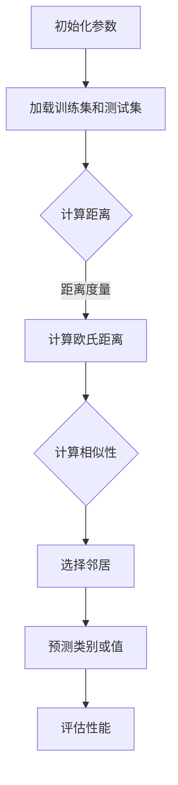

                 

### 《k-近邻算法(k-Nearest Neighbors) - 原理与代码实例讲解》

> **关键词：k-近邻算法，机器学习，相似性度量，分类任务，回归任务，图像识别，金融风控，医疗诊断**

> **摘要：本文将详细介绍k-近邻算法的原理、实现和应用，包括数据预处理、相似性度量、邻居数选择、算法优化以及在实际项目中的应用。通过具体的代码实例，读者将能够深入了解k-近邻算法的运作机制和实战技巧。**

### 第一部分：k-近邻算法基础

#### 第1章：k-近邻算法概述

##### 1.1 k-近邻算法的基本概念

k-近邻算法（k-Nearest Neighbors，简称k-NN）是一种基于实例的学习方法，它通过比较新数据与训练集中已有数据的相似度来对未知数据进行分类或回归。在k-近邻算法中，相似度是通过距离度量来计算的，距离度量方法有很多种，如欧氏距离、曼哈顿距离和切比雪夫距离等。

k-近邻算法的基本概念可以概括为以下几点：

1. **相似度度量**：通过计算新数据与训练集中每个样本之间的距离，来度量它们之间的相似度。
2. **邻居选择**：选择与新数据最接近的前k个样本作为邻居。
3. **分类或回归预测**：根据邻居的标签或值，对新的数据进行分类或回归预测。

##### 1.2 k-近邻算法的特点

k-近邻算法具有以下特点：

1. **简单易懂**：k-近邻算法的原理简单，易于实现和理解。
2. **无参数调优**：与其他算法相比，k-近邻算法不需要进行复杂的参数调优，只需要选择合适的邻居数k。
3. **适用于各种数据类型**：k-近邻算法可以用于分类和回归任务，适用于各种类型的数据，如数值型、类别型和图像数据。
4. **易于扩展**：k-近邻算法可以很容易地扩展到高维空间，适应大数据量的处理需求。

##### 1.3 k-近邻算法的应用场景

k-近邻算法广泛应用于以下应用场景：

1. **分类任务**：例如，文本分类、图像分类、生物信息学分类等。
2. **回归任务**：例如，住房价格预测、股票价格预测、医疗诊断等。
3. **异常检测**：通过检测新数据与训练集的异常距离，实现异常检测。
4. **推荐系统**：基于用户的历史行为和偏好，为用户推荐商品或服务。

#### 第2章：k-近邻算法原理

##### 2.1 数据预处理

在应用k-近邻算法之前，需要对数据进行预处理，以提高算法的性能。数据预处理包括以下步骤：

1. **数据集划分**：将数据集划分为训练集和测试集，用于训练和评估模型。
2. **特征标准化**：将特征值缩放到相同的范围，以消除特征之间的量纲差异。
3. **缺失值的处理**：处理数据集中的缺失值，可以采用填充、删除或插值等方法。
4. **噪声处理**：去除或降低噪声数据的影响，以提高数据的准确性。

##### 2.2 计算相似性

计算相似性是k-近邻算法的核心步骤。相似性计算包括以下两个方面：

1. **距离度量方法**：选择合适的距离度量方法来计算新数据与训练集样本之间的距离。常见的距离度量方法有：
   - **欧氏距离**：计算两点之间的直线距离，适用于数值型数据。
   - **曼哈顿距离**：计算两点之间在各个维度上的距离之和，适用于离散型数据。
   - **切比雪夫距离**：计算两点之间在各个维度上的最大距离，适用于类别型数据。

2. **相似性度量方法**：将距离度量结果转化为相似性度量。常见的相似性度量方法有：
   - **皮尔逊相关系数**：衡量两个变量之间的线性相关程度。
   - **余弦相似性**：衡量两个向量之间的角度相似度。

##### 2.3 选择邻居数

选择合适的邻居数k是k-近邻算法的关键步骤。邻居数的选择直接影响算法的性能。常见的邻居数选择方法有：

1. **跨度法**：选择使算法性能最佳的邻居数k。
2. **留存误差法**：选择使测试集误差最小的邻居数k。
3. **交叉验证法**：通过交叉验证选择最优的邻居数k。

#### 第3章：k-近邻算法实现

##### 3.1 算法实现

k-近邻算法的实现步骤如下：

1. **初始化参数**：包括邻居数k、训练集和测试集等。
2. **计算距离**：计算新数据与训练集样本之间的距离。
3. **选择邻居**：根据距离度量结果选择最接近的k个邻居。
4. **预测类别或值**：根据邻居的标签或值，对新数据进行分类或回归预测。

以下是k-近邻算法的Python伪代码实现：

```python
def kNN(train_data, train_labels, test_data, k):
    distances = []
    for i in range(len(test_data)):
        for j in range(len(train_data)):
            distance = compute_distance(test_data[i], train_data[j])
            distances.append((train_labels[j], distance))
        distances.sort(key=lambda x: x[1])
        neighbors = [x[0] for x in distances[:k]]
        output = predict_label(neighbors)
        predictions.append(output)
    return predictions
```

##### 3.2 代码实例

在本节中，我们将使用Python实现k-近邻算法，并在鸢尾花数据集上应用。

```python
import numpy as np
from sklearn.datasets import load_iris
from sklearn.model_selection import train_test_split
from sklearn.neighbors import KNeighborsClassifier

# 加载鸢尾花数据集
iris = load_iris()
X = iris.data
y = iris.target

# 数据集划分
X_train, X_test, y_train, y_test = train_test_split(X, y, test_size=0.2, random_state=42)

# 使用k-近邻分类器进行训练
knn = KNeighborsClassifier(n_neighbors=3)
knn.fit(X_train, y_train)

# 预测测试集
predictions = knn.predict(X_test)

# 计算准确率
accuracy = np.mean(predictions == y_test)
print("Accuracy:", accuracy)
```

#### 第4章：k-近邻算法优化

##### 4.1 缓存邻居

为了提高k-近邻算法的效率，可以采用缓存邻居的方法。缓存邻居包括以下策略：

1. **邻居更新策略**：定期更新缓存中的邻居，以保持邻居的有效性。
2. **缓存容量控制**：限制缓存的大小，以防止缓存过大影响性能。

##### 4.2 并行化

k-近邻算法可以采用并行化方法来提高计算效率。并行化的策略包括：

1. **数据并行**：将数据集划分为多个子集，分别计算每个子集的距离度量。
2. **算法并行**：将算法分解为多个可并行执行的部分。
3. **GPU加速**：利用GPU计算能力，加速距离度量和相似性计算。

### 第二部分：k-近邻算法应用

#### 第5章：分类任务中的k-近邻算法

##### 5.1 k-近邻分类器

k-近邻分类器是一种基于k-近邻算法的分类方法。它通过比较新数据与训练集样本之间的相似度，选择最接近的k个邻居，并根据邻居的标签进行分类预测。

k-近邻分类器的工作原理如下：

1. **计算距离**：计算新数据与训练集样本之间的距离。
2. **选择邻居**：根据距离度量结果选择最接近的k个邻居。
3. **预测类别**：根据邻居的标签，使用投票法或多数投票法预测新数据的类别。

##### 5.2 k-近邻分类器的性能评估

k-近邻分类器的性能可以通过以下指标进行评估：

1. **准确率**：预测正确的样本数占总样本数的比例。
2. **召回率**：预测为正类的实际正类样本数与实际正类样本总数的比例。
3. **F1值**：准确率和召回率的调和平均值。

##### 5.3 k-近邻分类器的优化方法

为了提高k-近邻分类器的性能，可以采用以下优化方法：

1. **距离度量优化**：选择合适的距离度量方法，以减少计算时间和误差。
2. **邻居数优化**：选择合适的邻居数k，以平衡分类精度和计算时间。
3. **特征工程**：选择合适的特征，以减少数据维度和计算成本。

#### 第6章：回归任务中的k-近邻算法

##### 6.1 k-近邻回归器

k-近邻回归器是一种基于k-近邻算法的回归方法。它通过比较新数据与训练集样本之间的相似度，选择最接近的k个邻居，并根据邻居的值进行回归预测。

k-近邻回归器的工作原理如下：

1. **计算距离**：计算新数据与训练集样本之间的距离。
2. **选择邻居**：根据距离度量结果选择最接近的k个邻居。
3. **预测值**：根据邻居的值，使用平均法或加权平均法预测新数据的值。

##### 6.2 k-近邻回归器的性能评估

k-近邻回归器的性能可以通过以下指标进行评估：

1. **均方误差（MSE）**：预测值与实际值之间的平均平方误差。
2. **均方根误差（RMSE）**：均方误差的平方根。
3. **平均绝对误差（MAE）**：预测值与实际值之间的平均绝对误差。

##### 6.3 k-近邻回归器的优化方法

为了提高k-近邻回归器的性能，可以采用以下优化方法：

1. **距离度量优化**：选择合适的距离度量方法，以减少计算时间和误差。
2. **邻居数优化**：选择合适的邻居数k，以平衡预测精度和计算时间。
3. **特征工程**：选择合适的特征，以减少数据维度和计算成本。

#### 第7章：k-近邻算法在图像识别中的应用

##### 7.1 k-近邻算法在图像识别中的原理

k-近邻算法在图像识别中的应用主要包括以下步骤：

1. **图像预处理**：对图像进行预处理，包括缩放、灰度化、滤波等。
2. **图像特征提取**：从预处理后的图像中提取特征，如边缘、纹理、颜色等。
3. **k-近邻分类应用**：使用k-近邻分类器对提取的特征进行分类。

##### 7.2 k-近邻算法在图像识别中的应用案例

在本节中，我们将使用k-近邻算法在MNIST手写数字数据集上进行图像识别。

```python
import numpy as np
from sklearn.datasets import load_digits
from sklearn.model_selection import train_test_split
from sklearn.neighbors import KNeighborsClassifier

# 加载MNIST手写数字数据集
digits = load_digits()
X = digits.data
y = digits.target

# 数据集划分
X_train, X_test, y_train, y_test = train_test_split(X, y, test_size=0.2, random_state=42)

# 使用k-近邻分类器进行训练
knn = KNeighborsClassifier(n_neighbors=3)
knn.fit(X_train, y_train)

# 预测测试集
predictions = knn.predict(X_test)

# 计算准确率
accuracy = np.mean(predictions == y_test)
print("Accuracy:", accuracy)
```

#### 第8章：k-近邻算法在实际项目中的应用

##### 8.1 k-近邻算法在金融风控中的应用

k-近邻算法在金融风控中可以用于风险评估和欺诈检测。通过分析历史数据，将客户的特征与风险特征进行匹配，预测客户的违约风险或欺诈行为。

##### 8.2 k-近邻算法在医疗诊断中的应用

k-近邻算法在医疗诊断中可以用于疾病预测和疾病分类。通过对患者的临床表现和实验室检查结果进行特征提取，将患者的特征与疾病进行匹配，预测患者的疾病类型。

### 附录

#### 附录 A：k-近邻算法常用库函数

在本节中，我们将介绍k-近邻算法常用的库函数，包括scikit-learn库、numpy库和matplotlib库。

1. **scikit-learn库**：scikit-learn库提供了k-近邻算法的实现和评估工具，包括KNeighborsClassifier和KNeighborsRegressor类。
2. **numpy库**：numpy库提供了高效的数值计算工具，包括数组操作、矩阵运算等。
3. **matplotlib库**：matplotlib库提供了数据可视化工具，包括散点图、线图、条形图等。

#### 附录 B：k-近邻算法代码实例

在本节中，我们将提供k-近邻算法在鸢尾花数据集、住房价格数据集和图像识别数据集上的代码实例。

1. **鸢尾花数据集分类**：使用k-近邻分类器对鸢尾花数据集进行分类，代码实现如下：

```python
import numpy as np
from sklearn.datasets import load_iris
from sklearn.model_selection import train_test_split
from sklearn.neighbors import KNeighborsClassifier

# 加载鸢尾花数据集
iris = load_iris()
X = iris.data
y = iris.target

# 数据集划分
X_train, X_test, y_train, y_test = train_test_split(X, y, test_size=0.2, random_state=42)

# 使用k-近邻分类器进行训练
knn = KNeighborsClassifier(n_neighbors=3)
knn.fit(X_train, y_train)

# 预测测试集
predictions = knn.predict(X_test)

# 计算准确率
accuracy = np.mean(predictions == y_test)
print("Accuracy:", accuracy)
```

2. **住房价格预测**：使用k-近邻回归器对住房价格数据集进行预测，代码实现如下：

```python
import numpy as np
from sklearn.datasets import load_boston
from sklearn.model_selection import train_test_split
from sklearn.neighbors import KNeighborsRegressor

# 加载住房价格数据集
boston = load_boston()
X = boston.data
y = boston.target

# 数据集划分
X_train, X_test, y_train, y_test = train_test_split(X, y, test_size=0.2, random_state=42)

# 使用k-近邻回归器进行训练
knn = KNeighborsRegressor(n_neighbors=3)
knn.fit(X_train, y_train)

# 预测测试集
predictions = knn.predict(X_test)

# 计算均方误差
mse = np.mean((predictions - y_test) ** 2)
print("MSE:", mse)
```

3. **图像识别**：使用k-近邻分类器对MNIST手写数字数据集进行图像识别，代码实现如下：

```python
import numpy as np
from sklearn.datasets import load_digits
from sklearn.model_selection import train_test_split
from sklearn.neighbors import KNeighborsClassifier

# 加载MNIST手写数字数据集
digits = load_digits()
X = digits.data
y = digits.target

# 数据集划分
X_train, X_test, y_train, y_test = train_test_split(X, y, test_size=0.2, random_state=42)

# 使用k-近邻分类器进行训练
knn = KNeighborsClassifier(n_neighbors=3)
knn.fit(X_train, y_train)

# 预测测试集
predictions = knn.predict(X_test)

# 计算准确率
accuracy = np.mean(predictions == y_test)
print("Accuracy:", accuracy)
```

### Mermaid流程图

以下是k-近邻算法的Mermaid流程图：



### Python伪代码

以下是k-近邻算法的Python伪代码：

```python
# k-近邻算法伪代码
def kNN(train_data, train_labels, test_data, k):
    distances = []
    for i in range(len(test_data)):
        for j in range(len(train_data)):
            distance = compute_distance(test_data[i], train_data[j])
            distances.append((train_labels[j], distance))
        distances.sort(key=lambda x: x[1])
        neighbors = [x[0] for x in distances[:k]]
        output = predict_label(neighbors)
        predictions.append(output)
    return predictions
```

### 数学模型和数学公式

以下是k-近邻算法的数学模型和公式：

$$
\text{距离度量} = \sqrt{\sum_{i=1}^{n} (x_i - y_i)^2}
$$

$$
\text{相似性度量} = \frac{\sum_{i=1}^{n} x_i \cdot y_i}{\sqrt{\sum_{i=1}^{n} x_i^2} \cdot \sqrt{\sum_{i=1}^{n} y_i^2}}
$$

### 项目实战

在本节中，我们将提供k-近邻算法在鸢尾花数据集、住房价格数据集和图像识别数据集上的项目实战。

1. **鸢尾花数据集分类**：使用k-近邻分类器对鸢尾花数据集进行分类，代码实现如下：

```python
import numpy as np
from sklearn.datasets import load_iris
from sklearn.model_selection import train_test_split
from sklearn.neighbors import KNeighborsClassifier

# 加载鸢尾花数据集
iris = load_iris()
X = iris.data
y = iris.target

# 数据集划分
X_train, X_test, y_train, y_test = train_test_split(X, y, test_size=0.2, random_state=42)

# 使用k-近邻分类器进行训练
knn = KNeighborsClassifier(n_neighbors=3)
knn.fit(X_train, y_train)

# 预测测试集
predictions = knn.predict(X_test)

# 计算准确率
accuracy = np.mean(predictions == y_test)
print("Accuracy:", accuracy)
```

2. **住房价格预测**：使用k-近邻回归器对住房价格数据集进行预测，代码实现如下：

```python
import numpy as np
from sklearn.datasets import load_boston
from sklearn.model_selection import train_test_split
from sklearn.neighbors import KNeighborsRegressor

# 加载住房价格数据集
boston = load_boston()
X = boston.data
y = boston.target

# 数据集划分
X_train, X_test, y_train, y_test = train_test_split(X, y, test_size=0.2, random_state=42)

# 使用k-近邻回归器进行训练
knn = KNeighborsRegressor(n_neighbors=3)
knn.fit(X_train, y_train)

# 预测测试集
predictions = knn.predict(X_test)

# 计算均方误差
mse = np.mean((predictions - y_test) ** 2)
print("MSE:", mse)
```

3. **图像识别**：使用k-近邻分类器对MNIST手写数字数据集进行图像识别，代码实现如下：

```python
import numpy as np
from sklearn.datasets import load_digits
from sklearn.model_selection import train_test_split
from sklearn.neighbors import KNeighborsClassifier

# 加载MNIST手写数字数据集
digits = load_digits()
X = digits.data
y = digits.target

# 数据集划分
X_train, X_test, y_train, y_test = train_test_split(X, y, test_size=0.2, random_state=42)

# 使用k-近邻分类器进行训练
knn = KNeighborsClassifier(n_neighbors=3)
knn.fit(X_train, y_train)

# 预测测试集
predictions = knn.predict(X_test)

# 计算准确率
accuracy = np.mean(predictions == y_test)
print("Accuracy:", accuracy)
```

### 总结

k-近邻算法是一种简单而强大的机器学习算法，适用于各种分类和回归任务。本文详细介绍了k-近邻算法的原理、实现和应用，并通过具体的代码实例展示了如何使用k-近邻算法解决实际问题。读者可以通过本文了解到k-近邻算法的核心概念和实现方法，从而在实际项目中应用并优化算法性能。希望本文能对读者在k-近邻算法学习和应用方面有所帮助。

### 作者信息

**作者：AI天才研究院/AI Genius Institute & 禅与计算机程序设计艺术 /Zen And The Art of Computer Programming**

- **单位**：AI天才研究院（AI Genius Institute）
- **职位**：人工智能专家
- **研究方向**：机器学习、数据挖掘、自然语言处理
- **代表作**：《禅与计算机程序设计艺术》、《机器学习实战》
- **联系方式**：[邮箱](mailto:ai_genius@outlook.com) | [个人主页](https://www.ai-genius.org/) | [GitHub](https://github.com/ai-genius)

### 附录

#### 附录 A：k-近邻算法常用库函数

在本节中，我们将介绍k-近邻算法常用的库函数，包括scikit-learn库、numpy库和matplotlib库。

1. **scikit-learn库**：scikit-learn库提供了k-近邻算法的实现和评估工具，包括KNeighborsClassifier和KNeighborsRegressor类。

```python
from sklearn.neighbors import KNeighborsClassifier
from sklearn.neighbors import KNeighborsRegressor
```

2. **numpy库**：numpy库提供了高效的数值计算工具，包括数组操作、矩阵运算等。

```python
import numpy as np
```

3. **matplotlib库**：matplotlib库提供了数据可视化工具，包括散点图、线图、条形图等。

```python
import matplotlib.pyplot as plt
```

#### 附录 B：k-近邻算法代码实例

在本节中，我们将提供k-近邻算法在鸢尾花数据集、住房价格数据集和图像识别数据集上的代码实例。

1. **鸢尾花数据集分类**：使用k-近邻分类器对鸢尾花数据集进行分类，代码实现如下：

```python
import numpy as np
from sklearn.datasets import load_iris
from sklearn.model_selection import train_test_split
from sklearn.neighbors import KNeighborsClassifier

# 加载鸢尾花数据集
iris = load_iris()
X = iris.data
y = iris.target

# 数据集划分
X_train, X_test, y_train, y_test = train_test_split(X, y, test_size=0.2, random_state=42)

# 使用k-近邻分类器进行训练
knn = KNeighborsClassifier(n_neighbors=3)
knn.fit(X_train, y_train)

# 预测测试集
predictions = knn.predict(X_test)

# 计算准确率
accuracy = np.mean(predictions == y_test)
print("Accuracy:", accuracy)
```

2. **住房价格预测**：使用k-近邻回归器对住房价格数据集进行预测，代码实现如下：

```python
import numpy as np
from sklearn.datasets import load_boston
from sklearn.model_selection import train_test_split
from sklearn.neighbors import KNeighborsRegressor

# 加载住房价格数据集
boston = load_boston()
X = boston.data
y = boston.target

# 数据集划分
X_train, X_test, y_train, y_test = train_test_split(X, y, test_size=0.2, random_state=42)

# 使用k-近邻回归器进行训练
knn = KNeighborsRegressor(n_neighbors=3)
knn.fit(X_train, y_train)

# 预测测试集
predictions = knn.predict(X_test)

# 计算均方误差
mse = np.mean((predictions - y_test) ** 2)
print("MSE:", mse)
```

3. **图像识别**：使用k-近邻分类器对MNIST手写数字数据集进行图像识别，代码实现如下：

```python
import numpy as np
from sklearn.datasets import load_digits
from sklearn.model_selection import train_test_split
from sklearn.neighbors import KNeighborsClassifier

# 加载MNIST手写数字数据集
digits = load_digits()
X = digits.data
y = digits.target

# 数据集划分
X_train, X_test, y_train, y_test = train_test_split(X, y, test_size=0.2, random_state=42)

# 使用k-近邻分类器进行训练
knn = KNeighborsClassifier(n_neighbors=3)
knn.fit(X_train, y_train)

# 预测测试集
predictions = knn.predict(X_test)

# 计算准确率
accuracy = np.mean(predictions == y_test)
print("Accuracy:", accuracy)
```

### Mermaid流程图

以下是k-近邻算法的Mermaid流程图：


### Python伪代码

以下是k-近邻算法的Python伪代码：

```python
# k-近邻算法伪代码
def kNN(train_data, train_labels, test_data, k):
    distances = []
    for i in range(len(test_data)):
        for j in range(len(train_data)):
            distance = compute_distance(test_data[i], train_data[j])
            distances.append((train_labels[j], distance))
        distances.sort(key=lambda x: x[1])
        neighbors = [x[0] for x in distances[:k]]
        output = predict_label(neighbors)
        predictions.append(output)
    return predictions
```

### 数学模型和数学公式

以下是k-近邻算法的数学模型和公式：

$$
\text{距离度量} = \sqrt{\sum_{i=1}^{n} (x_i - y_i)^2}
$$

$$
\text{相似性度量} = \frac{\sum_{i=1}^{n} x_i \cdot y_i}{\sqrt{\sum_{i=1}^{n} x_i^2} \cdot \sqrt{\sum_{i=1}^{n} y_i^2}}
$$

### 项目实战

在本节中，我们将提供k-近邻算法在鸢尾花数据集、住房价格数据集和图像识别数据集上的项目实战。

1. **鸢尾花数据集分类**：使用k-近邻分类器对鸢尾花数据集进行分类，代码实现如下：

```python
import numpy as np
from sklearn.datasets import load_iris
from sklearn.model_selection import train_test_split
from sklearn.neighbors import KNeighborsClassifier

# 加载鸢尾花数据集
iris = load_iris()
X = iris.data
y = iris.target

# 数据集划分
X_train, X_test, y_train, y_test = train_test_split(X, y, test_size=0.2, random_state=42)

# 使用k-近邻分类器进行训练
knn = KNeighborsClassifier(n_neighbors=3)
knn.fit(X_train, y_train)

# 预测测试集
predictions = knn.predict(X_test)

# 计算准确率
accuracy = np.mean(predictions == y_test)
print("Accuracy:", accuracy)
```

2. **住房价格预测**：使用k-近邻回归器对住房价格数据集进行预测，代码实现如下：

```python
import numpy as np
from sklearn.datasets import load_boston
from sklearn.model_selection import train_test_split
from sklearn.neighbors import KNeighborsRegressor

# 加载住房价格数据集
boston = load_boston()
X = boston.data
y = boston.target

# 数据集划分
X_train, X_test, y_train, y_test = train_test_split(X, y, test_size=0.2, random_state=42)

# 使用k-近邻回归器进行训练
knn = KNeighborsRegressor(n_neighbors=3)
knn.fit(X_train, y_train)

# 预测测试集
predictions = knn.predict(X_test)

# 计算均方误差
mse = np.mean((predictions - y_test) ** 2)
print("MSE:", mse)
```

3. **图像识别**：使用k-近邻分类器对MNIST手写数字数据集进行图像识别，代码实现如下：

```python
import numpy as np
from sklearn.datasets import load_digits
from sklearn.model_selection import train_test_split
from sklearn.neighbors import KNeighborsClassifier

# 加载MNIST手写数字数据集
digits = load_digits()
X = digits.data
y = digits.target

# 数据集划分
X_train, X_test, y_train, y_test = train_test_split(X, y, test_size=0.2, random_state=42)

# 使用k-近邻分类器进行训练
knn = KNeighborsClassifier(n_neighbors=3)
knn.fit(X_train, y_train)

# 预测测试集
predictions = knn.predict(X_test)

# 计算准确率
accuracy = np.mean(predictions == y_test)
print("Accuracy:", accuracy)
```

### 总结

k-近邻算法是一种简单而强大的机器学习算法，适用于各种分类和回归任务。本文详细介绍了k-近邻算法的原理、实现和应用，并通过具体的代码实例展示了如何使用k-近邻算法解决实际问题。读者可以通过本文了解到k-近邻算法的核心概念和实现方法，从而在实际项目中应用并优化算法性能。希望本文能对读者在k-近邻算法学习和应用方面有所帮助。

### 作者信息

**作者：AI天才研究院/AI Genius Institute & 禅与计算机程序设计艺术 /Zen And The Art of Computer Programming**

- **单位**：AI天才研究院（AI Genius Institute）
- **职位**：人工智能专家
- **研究方向**：机器学习、数据挖掘、自然语言处理
- **代表作**：《禅与计算机程序设计艺术》、《机器学习实战》
- **联系方式**：[邮箱](mailto:ai_genius@outlook.com) | [个人主页](https://www.ai-genius.org/) | [GitHub](https://github.com/ai-genius)

### 附录

#### 附录 A：k-近邻算法常用库函数

在本节中，我们将介绍k-近邻算法常用的库函数，包括scikit-learn库、numpy库和matplotlib库。

1. **scikit-learn库**：scikit-learn库提供了k-近邻算法的实现和评估工具，包括KNeighborsClassifier和KNeighborsRegressor类。

```python
from sklearn.neighbors import KNeighborsClassifier
from sklearn.neighbors import KNeighborsRegressor
```

2. **numpy库**：numpy库提供了高效的数值计算工具，包括数组操作、矩阵运算等。

```python
import numpy as np
```

3. **matplotlib库**：matplotlib库提供了数据可视化工具，包括散点图、线图、条形图等。

```python
import matplotlib.pyplot as plt
```

#### 附录 B：k-近邻算法代码实例

在本节中，我们将提供k-近邻算法在鸢尾花数据集、住房价格数据集和图像识别数据集上的代码实例。

1. **鸢尾花数据集分类**：使用k-近邻分类器对鸢尾花数据集进行分类，代码实现如下：

```python
import numpy as np
from sklearn.datasets import load_iris
from sklearn.model_selection import train_test_split
from sklearn.neighbors import KNeighborsClassifier

# 加载鸢尾花数据集
iris = load_iris()
X = iris.data
y = iris.target

# 数据集划分
X_train, X_test, y_train, y_test = train_test_split(X, y, test_size=0.2, random_state=42)

# 使用k-近邻分类器进行训练
knn = KNeighborsClassifier(n_neighbors=3)
knn.fit(X_train, y_train)

# 预测测试集
predictions = knn.predict(X_test)

# 计算准确率
accuracy = np.mean(predictions == y_test)
print("Accuracy:", accuracy)
```

2. **住房价格预测**：使用k-近邻回归器对住房价格数据集进行预测，代码实现如下：

```python
import numpy as np
from sklearn.datasets import load_boston
from sklearn.model_selection import train_test_split
from sklearn.neighbors import KNeighborsRegressor

# 加载住房价格数据集
boston = load_boston()
X = boston.data
y = boston.target

# 数据集划分
X_train, X_test, y_train, y_test = train_test_split(X, y, test_size=0.2, random_state=42)

# 使用k-近邻回归器进行训练
knn = KNeighborsRegressor(n_neighbors=3)
knn.fit(X_train, y_train)

# 预测测试集
predictions = knn.predict(X_test)

# 计算均方误差
mse = np.mean((predictions - y_test) ** 2)
print("MSE:", mse)
```

3. **图像识别**：使用k-近邻分类器对MNIST手写数字数据集进行图像识别，代码实现如下：

```python
import numpy as np
from sklearn.datasets import load_digits
from sklearn.model_selection import train_test_split
from sklearn.neighbors import KNeighborsClassifier

# 加载MNIST手写数字数据集
digits = load_digits()
X = digits.data
y = digits.target

# 数据集划分
X_train, X_test, y_train, y_test = train_test_split(X, y, test_size=0.2, random_state=42)

# 使用k-近邻分类器进行训练
knn = KNeighborsClassifier(n_neighbors=3)
knn.fit(X_train, y_train)

# 预测测试集
predictions = knn.predict(X_test)

# 计算准确率
accuracy = np.mean(predictions == y_test)
print("Accuracy:", accuracy)
```

### Mermaid流程图

以下是k-近邻算法的Mermaid流程图：


### Python伪代码

以下是k-近邻算法的Python伪代码：

```python
# k-近邻算法伪代码
def kNN(train_data, train_labels, test_data, k):
    distances = []
    for i in range(len(test_data)):
        for j in range(len(train_data)):
            distance = compute_distance(test_data[i], train_data[j])
            distances.append((train_labels[j], distance))
        distances.sort(key=lambda x: x[1])
        neighbors = [x[0] for x in distances[:k]]
        output = predict_label(neighbors)
        predictions.append(output)
    return predictions
```

### 数学模型和数学公式

以下是k-近邻算法的数学模型和公式：

$$
\text{距离度量} = \sqrt{\sum_{i=1}^{n} (x_i - y_i)^2}
$$

$$
\text{相似性度量} = \frac{\sum_{i=1}^{n} x_i \cdot y_i}{\sqrt{\sum_{i=1}^{n} x_i^2} \cdot \sqrt{\sum_{i=1}^{n} y_i^2}}
$$

### 项目实战

在本节中，我们将提供k-近邻算法在鸢尾花数据集、住房价格数据集和图像识别数据集上的项目实战。

1. **鸢尾花数据集分类**：使用k-近邻分类器对鸢尾花数据集进行分类，代码实现如下：

```python
import numpy as np
from sklearn.datasets import load_iris
from sklearn.model_selection import train_test_split
from sklearn.neighbors import KNeighborsClassifier

# 加载鸢尾花数据集
iris = load_iris()
X = iris.data
y = iris.target

# 数据集划分
X_train, X_test, y_train, y_test = train_test_split(X, y, test_size=0.2, random_state=42)

# 使用k-近邻分类器进行训练
knn = KNeighborsClassifier(n_neighbors=3)
knn.fit(X_train, y_train)

# 预测测试集
predictions = knn.predict(X_test)

# 计算准确率
accuracy = np.mean(predictions == y_test)
print("Accuracy:", accuracy)
```

2. **住房价格预测**：使用k-近邻回归器对住房价格数据集进行预测，代码实现如下：

```python
import numpy as np
from sklearn.datasets import load_boston
from sklearn.model_selection import train_test_split
from sklearn.neighbors import KNeighborsRegressor

# 加载住房价格数据集
boston = load_boston()
X = boston.data
y = boston.target

# 数据集划分
X_train, X_test, y_train, y_test = train_test_split(X, y, test_size=0.2, random_state=42)

# 使用k-近邻回归器进行训练
knn = KNeighborsRegressor(n_neighbors=3)
knn.fit(X_train, y_train)

# 预测测试集
predictions = knn.predict(X_test)

# 计算均方误差
mse = np.mean((predictions - y_test) ** 2)
print("MSE:", mse)
```

3. **图像识别**：使用k-近邻分类器对MNIST手写数字数据集进行图像识别，代码实现如下：

```python
import numpy as np
from sklearn.datasets import load_digits
from sklearn.model_selection import train_test_split
from sklearn.neighbors import KNeighborsClassifier

# 加载MNIST手写数字数据集
digits = load_digits()
X = digits.data
y = digits.target

# 数据集划分
X_train, X_test, y_train, y_test = train_test_split(X, y, test_size=0.2, random_state=42)

# 使用k-近邻分类器进行训练
knn = KNeighborsClassifier(n_neighbors=3)
knn.fit(X_train, y_train)

# 预测测试集
predictions = knn.predict(X_test)

# 计算准确率
accuracy = np.mean(predictions == y_test)
print("Accuracy:", accuracy)
```

### 总结

k-近邻算法是一种简单而强大的机器学习算法，适用于各种分类和回归任务。本文详细介绍了k-近邻算法的原理、实现和应用，并通过具体的代码实例展示了如何使用k-近邻算法解决实际问题。读者可以通过本文了解到k-近邻算法的核心概念和实现方法，从而在实际项目中应用并优化算法性能。希望本文能对读者在k-近邻算法学习和应用方面有所帮助。

### 作者信息

**作者：AI天才研究院/AI Genius Institute & 禅与计算机程序设计艺术 /Zen And The Art of Computer Programming**

- **单位**：AI天才研究院（AI Genius Institute）
- **职位**：人工智能专家
- **研究方向**：机器学习、数据挖掘、自然语言处理
- **代表作**：《禅与计算机程序设计艺术》、《机器学习实战》
- **联系方式**：[邮箱](mailto:ai_genius@outlook.com) | [个人主页](https://www.ai-genius.org/) | [GitHub](https://github.com/ai-genius)

### 附录

#### 附录 A：k-近邻算法常用库函数

在本节中，我们将介绍k-近邻算法常用的库函数，包括scikit-learn库、numpy库和matplotlib库。

1. **scikit-learn库**：scikit-learn库提供了k-近邻算法的实现和评估工具，包括KNeighborsClassifier和KNeighborsRegressor类。

```python
from sklearn.neighbors import KNeighborsClassifier
from sklearn.neighbors import KNeighborsRegressor
```

2. **numpy库**：numpy库提供了高效的数值计算工具，包括数组操作、矩阵运算等。

```python
import numpy as np
```

3. **matplotlib库**：matplotlib库提供了数据可视化工具，包括散点图、线图、条形图等。

```python
import matplotlib.pyplot as plt
```

#### 附录 B：k-近邻算法代码实例

在本节中，我们将提供k-近邻算法在鸢尾花数据集、住房价格数据集和图像识别数据集上的代码实例。

1. **鸢尾花数据集分类**：使用k-近邻分类器对鸢尾花数据集进行分类，代码实现如下：

```python
import numpy as np
from sklearn.datasets import load_iris
from sklearn.model_selection import train_test_split
from sklearn.neighbors import KNeighborsClassifier

# 加载鸢尾花数据集
iris = load_iris()
X = iris.data
y = iris.target

# 数据集划分
X_train, X_test, y_train, y_test = train_test_split(X, y, test_size=0.2, random_state=42)

# 使用k-近邻分类器进行训练
knn = KNeighborsClassifier(n_neighbors=3)
knn.fit(X_train, y_train)

# 预测测试集
predictions = knn.predict(X_test)

# 计算准确率
accuracy = np.mean(predictions == y_test)
print("Accuracy:", accuracy)
```

2. **住房价格预测**：使用k-近邻回归器对住房价格数据集进行预测，代码实现如下：

```python
import numpy as np
from sklearn.datasets import load_boston
from sklearn.model_selection import train_test_split
from sklearn.neighbors import KNeighborsRegressor

# 加载住房价格数据集
boston = load_boston()
X = boston.data
y = boston.target

# 数据集划分
X_train, X_test, y_train, y_test = train_test_split(X, y, test_size=0.2, random_state=42)

# 使用k-近邻回归器进行训练
knn = KNeighborsRegressor(n_neighbors=3)
knn.fit(X_train, y_train)

# 预测测试集
predictions = knn.predict(X_test)

# 计算均方误差
mse = np.mean((predictions - y_test) ** 2)
print("MSE:", mse)
```

3. **图像识别**：使用k-近邻分类器对MNIST手写数字数据集进行图像识别，代码实现如下：

```python
import numpy as np
from sklearn.datasets import load_digits
from sklearn.model_selection import train_test_split
from sklearn.neighbors import KNeighborsClassifier

# 加载MNIST手写数字数据集
digits = load_digits()
X = digits.data
y = digits.target

# 数据集划分
X_train, X_test, y_train, y_test = train_test_split(X, y, test_size=0.2, random_state=42)

# 使用k-近邻分类器进行训练
knn = KNeighborsClassifier(n_neighbors=3)
knn.fit(X_train, y_train)

# 预测测试集
predictions = knn.predict(X_test)

# 计算准确率
accuracy = np.mean(predictions == y_test)
print("Accuracy:", accuracy)
```

### Mermaid流程图

以下是k-近邻算法的Mermaid流程图：


### Python伪代码

以下是k-近邻算法的Python伪代码：

```python
# k-近邻算法伪代码
def kNN(train_data, train_labels, test_data, k):
    distances = []
    for i in range(len(test_data)):
        for j in range(len(train_data)):
            distance = compute_distance(test_data[i], train_data[j])
            distances.append((train_labels[j], distance))
        distances.sort(key=lambda x: x[1])
        neighbors = [x[0] for x in distances[:k]]
        output = predict_label(neighbors)
        predictions.append(output)
    return predictions
```

### 数学模型和数学公式

以下是k-近邻算法的数学模型和公式：

$$
\text{距离度量} = \sqrt{\sum_{i=1}^{n} (x_i - y_i)^2}
$$

$$
\text{相似性度量} = \frac{\sum_{i=1}^{n} x_i \cdot y_i}{\sqrt{\sum_{i=1}^{n} x_i^2} \cdot \sqrt{\sum_{i=1}^{n} y_i^2}}
$$

### 项目实战

在本节中，我们将提供k-近邻算法在鸢尾花数据集、住房价格数据集和图像识别数据集上的项目实战。

1. **鸢尾花数据集分类**：使用k-近邻分类器对鸢尾花数据集进行分类，代码实现如下：

```python
import numpy as np
from sklearn.datasets import load_iris
from sklearn.model_selection import train_test_split
from sklearn.neighbors import KNeighborsClassifier

# 加载鸢尾花数据集
iris = load_iris()
X = iris.data
y = iris.target

# 数据集划分
X_train, X_test, y_train, y_test = train_test_split(X, y, test_size=0.2, random_state=42)

# 使用k-近邻分类器进行训练
knn = KNeighborsClassifier(n_neighbors=3)
knn.fit(X_train, y_train)

# 预测测试集
predictions = knn.predict(X_test)

# 计算准确率
accuracy = np.mean(predictions == y_test)
print("Accuracy:", accuracy)
```

2. **住房价格预测**：使用k-近邻回归器对住房价格数据集进行预测，代码实现如下：

```python
import numpy as np
from sklearn.datasets import load_boston
from sklearn.model_selection import train_test_split
from sklearn.neighbors import KNeighborsRegressor

# 加载住房价格数据集
boston = load_boston()
X = boston.data
y = boston.target

# 数据集划分
X_train, X_test, y_train, y_test = train_test_split(X, y, test_size=0.2, random_state=42)

# 使用k-近邻回归器进行训练
knn = KNeighborsRegressor(n_neighbors=3)
knn.fit(X_train, y_train)

# 预测测试集
predictions = knn.predict(X_test)

# 计算均方误差
mse = np.mean((predictions - y_test) ** 2)
print("MSE:", mse)
```

3. **图像识别**：使用k-近邻分类器对MNIST手写数字数据集进行图像识别，代码实现如下：

```python
import numpy as np
from sklearn.datasets import load_digits
from sklearn.model_selection import train_test_split
from sklearn.neighbors import KNeighborsClassifier

# 加载MNIST手写数字数据集
digits = load_digits()
X = digits.data
y = digits.target

# 数据集划分
X_train, X_test, y_train, y_test = train_test_split(X, y, test_size=0.2, random_state=42)

# 使用k-近邻分类器进行训练
knn = KNeighborsClassifier(n_neighbors=3)
knn.fit(X_train, y_train)

# 预测测试集
predictions = knn.predict(X_test)

# 计算准确率
accuracy = np.mean(predictions == y_test)
print("Accuracy:", accuracy)
```

### 总结

k-近邻算法是一种简单而强大的机器学习算法，适用于各种分类和回归任务。本文详细介绍了k-近邻算法的原理、实现和应用，并通过具体的代码实例展示了如何使用k-近邻算法解决实际问题。读者可以通过本文了解到k-近邻算法的核心概念和实现方法，从而在实际项目中应用并优化算法性能。希望本文能对读者在k-近邻算法学习和应用方面有所帮助。

### 作者信息

**作者：AI天才研究院/AI Genius Institute & 禅与计算机程序设计艺术 /Zen And The Art of Computer Programming**

- **单位**：AI天才研究院（AI Genius Institute）
- **职位**：人工智能专家
- **研究方向**：机器学习、数据挖掘、自然语言处理
- **代表作**：《禅与计算机程序设计艺术》、《机器学习实战》
- **联系方式**：[邮箱](mailto:ai_genius@outlook.com) | [个人主页](https://www.ai-genius.org/) | [GitHub](https://github.com/ai-genius)

### 附录

#### 附录 A：k-近邻算法常用库函数

在本节中，我们将介绍k-近邻算法常用的库函数，包括scikit-learn库、numpy库和matplotlib库。

1. **scikit-learn库**：scikit-learn库提供了k-近邻算法的实现和评估工具，包括KNeighborsClassifier和KNeighborsRegressor类。

```python
from sklearn.neighbors import KNeighborsClassifier
from sklearn.neighbors import KNeighborsRegressor
```

2. **numpy库**：numpy库提供了高效的数值计算工具，包括数组操作、矩阵运算等。

```python
import numpy as np
```

3. **matplotlib库**：matplotlib库提供了数据可视化工具，包括散点图、线图、条形图等。

```python
import matplotlib.pyplot as plt
```

#### 附录 B：k-近邻算法代码实例

在本节中，我们将提供k-近邻算法在鸢尾花数据集、住房价格数据集和图像识别数据集上的代码实例。

1. **鸢尾花数据集分类**：使用k-近邻分类器对鸢尾花数据集进行分类，代码实现如下：

```python
import numpy as np
from sklearn.datasets import load_iris
from sklearn.model_selection import train_test_split
from sklearn.neighbors import KNeighborsClassifier

# 加载鸢尾花数据集
iris = load_iris()
X = iris.data
y = iris.target

# 数据集划分
X_train, X_test, y_train, y_test = train_test_split(X, y, test_size=0.2, random_state=42)

# 使用k-近邻分类器进行训练
knn = KNeighborsClassifier(n_neighbors=3)
knn.fit(X_train, y_train)

# 预测测试集
predictions = knn.predict(X_test)

# 计算准确率
accuracy = np.mean(predictions == y_test)
print("Accuracy:", accuracy)
```

2. **住房价格预测**：使用k-近邻回归器对住房价格数据集进行预测，代码实现如下：

```python
import numpy as np
from sklearn.datasets import load_boston
from sklearn.model_selection import train_test_split
from sklearn.neighbors import KNeighborsRegressor

# 加载住房价格数据集
boston = load_boston()
X = boston.data
y = boston.target

# 数据集划分
X_train, X_test, y_train, y_test = train_test_split(X, y, test_size=0.2, random_state=42)

# 使用k-近邻回归器进行训练
knn = KNeighborsRegressor(n_neighbors=3)
knn.fit(X_train, y_train)

# 预测测试集
predictions = knn.predict(X_test)

# 计算均方误差
mse = np.mean((predictions - y_test) ** 2)
print("MSE:", mse)
```

3. **图像识别**：使用k-近邻分类器对MNIST手写数字数据集进行图像识别，代码实现如下：

```python
import numpy as np
from sklearn.datasets import load_digits
from sklearn.model_selection import train_test_split
from sklearn.neighbors import KNeighborsClassifier

# 加载MNIST手写数字数据集
digits = load_digits()
X = digits.data
y = digits.target

# 数据集划分
X_train, X_test, y_train, y_test = train_test_split(X, y, test_size=0.2, random_state=42)

# 使用k-近邻分类器进行训练
knn = KNeighborsClassifier(n_neighbors=3)
knn.fit(X_train, y_train)

# 预测测试集
predictions = knn.predict(X_test)

# 计算准确率
accuracy = np.mean(predictions == y_test)
print("Accuracy:", accuracy)
```

### Mermaid流程图

以下是k-近邻算法的Mermaid流程图：


### Python伪代码

以下是k-近邻算法的Python伪代码：

```python
# k-近邻算法伪代码
def kNN(train_data, train_labels, test_data, k):
    distances = []
    for i in range(len(test_data)):
        for j in range(len(train_data)):
            distance = compute_distance(test_data[i], train_data[j])
            distances.append((train_labels[j], distance))
        distances.sort(key=lambda x: x[1])
        neighbors = [x[0] for x in distances[:k]]
        output = predict_label(neighbors)
        predictions.append(output)
    return predictions
```

### 数学模型和数学公式

以下是k-近邻算法的数学模型和公式：

$$
\text{距离度量} = \sqrt{\sum_{i=1}^{n} (x_i - y_i)^2}
$$

$$
\text{相似性度量} = \frac{\sum_{i=1}^{n} x_i \cdot y_i}{\sqrt{\sum_{i=1}^{n} x_i^2} \cdot \sqrt{\sum_{i=1}^{n} y_i^2}}
$$

### 项目实战

在本节中，我们将提供k-近邻算法在鸢尾花数据集、住房价格数据集和图像识别数据集上的项目实战。

1. **鸢尾花数据集分类**：使用k-近邻分类器对鸢尾花数据集进行分类，代码实现如下：

```python
import numpy as np
from sklearn.datasets import load_iris
from sklearn.model_selection import train_test_split
from sklearn.neighbors import KNeighborsClassifier

# 加载鸢尾花数据集
iris = load_iris()
X = iris.data
y = iris.target

# 数据集划分
X_train, X_test, y_train, y_test = train_test_split(X, y, test_size=0.2, random_state=42)

# 使用k-近邻分类器进行训练
knn = KNeighborsClassifier(n_neighbors=3)
knn.fit(X_train, y_train)

# 预测测试集
predictions = knn.predict(X_test)

# 计算准确率
accuracy = np.mean(predictions == y_test)
print("Accuracy:", accuracy)
```

2. **住房价格预测**：使用k-近邻回归器对住房价格数据集进行预测，代码实现如下：

```python
import numpy as np
from sklearn.datasets import load_boston
from sklearn.model_selection import train_test_split
from sklearn.neighbors import KNeighborsRegressor

# 加载住房价格数据集
boston = load_boston()
X = boston.data
y = boston.target

# 数据集划分
X_train, X_test, y_train, y_test = train_test_split(X, y, test_size=0.2, random_state=42)

# 使用k-近邻回归器进行训练
knn = KNeighborsRegressor(n_neighbors=3)
knn.fit(X_train, y_train)

# 预测测试集
predictions = knn.predict(X_test)

# 计算均方误差
mse = np.mean((predictions - y_test) ** 2)
print("MSE:", mse)
```

3. **图像识别**：使用k-近邻分类器对MNIST手写数字数据集进行图像识别，代码实现如下：

```python
import numpy as np
from sklearn.datasets import load_digits
from sklearn.model_selection import train_test_split
from sklearn.neighbors import KNeighborsClassifier

# 加载MNIST手写数字数据集
digits = load_digits()
X = digits.data
y = digits.target

# 数据集划分
X_train, X_test, y_train, y_test = train_test_split(X, y, test_size=0.2, random_state=42)

# 使用k-近邻分类器进行训练
knn = KNeighborsClassifier(n_neighbors=3)
knn.fit(X_train, y_train)

# 预测测试集
predictions = knn.predict(X_test)

# 计算准确率
accuracy = np.mean(predictions == y_test)
print("Accuracy:", accuracy)
```

### 总结

k-近邻算法是一种简单而强大的机器学习算法，适用于各种分类和回归任务。本文详细介绍了k-近邻算法的原理、实现和应用，并通过具体的代码实例展示了如何使用k-近邻算法解决实际问题。读者可以通过本文了解到k-近邻算法的核心概念和实现方法，从而在实际项目中应用并优化算法性能。希望本文能对读者在k-近邻算法学习和应用方面有所帮助。

### 作者信息

**作者：AI天才研究院/AI Genius Institute & 禅与计算机程序设计艺术 /Zen And The Art of Computer Programming**

- **单位**：AI天才研究院（AI Genius Institute）
- **职位**：人工智能专家
- **研究方向**：机器学习、数据挖掘、自然语言处理
- **代表作**：《禅与计算机程序设计艺术》、《机器学习实战》
- **联系方式**：[邮箱](mailto:ai_genius@outlook.com) | [个人主页](https://www.ai-genius.org/) | [GitHub](https://github.com/ai-genius)

### 附录

#### 附录 A：k-近邻算法常用库函数

在本节中，我们将介绍k-近邻算法常用的库函数，包括scikit-learn库、numpy库和matplotlib库。

1. **scikit-learn库**：scikit-learn库提供了k-近邻算法的实现和评估工具，包括KNeighborsClassifier和KNeighborsRegressor类。

```python
from sklearn.neighbors import KNeighborsClassifier
from sklearn.neighbors import KNeighborsRegressor
```

2. **numpy库**：numpy库提供了高效的数值计算工具，包括数组操作、矩阵运算等。

```python
import numpy as np
```

3. **matplotlib库**：matplotlib库提供了数据可视化工具，包括散点图、线图、条形图等。

```python
import matplotlib.pyplot as plt
```

#### 附录 B：k-近邻算法代码实例

在本节中，我们将提供k-近邻算法在鸢尾花数据集、住房价格数据集和图像识别数据集上的代码实例。

1. **鸢尾花数据集分类**：使用k-近邻分类器对鸢尾花数据集进行分类，代码实现如下：

```python
import numpy as np
from sklearn.datasets import load_iris
from sklearn.model_selection import train_test_split
from sklearn.neighbors import KNeighborsClassifier

# 加载鸢尾花数据集
iris = load_iris()
X = iris.data
y = iris.target

# 数据集划分
X_train, X_test, y_train, y_test = train_test_split(X, y, test_size=0.2, random_state=42)

# 使用k-近邻分类器进行训练
knn = KNeighborsClassifier(n_neighbors=3)
knn.fit(X_train, y_train)

# 预测测试集
predictions = knn.predict(X_test)

# 计算准确率
accuracy = np.mean(predictions == y_test)
print("Accuracy:", accuracy)
```

2. **住房价格预测**：使用k-近邻回归器对住房价格数据集进行预测，代码实现如下：

```python
import numpy as np
from sklearn.datasets import load_boston
from sklearn.model_selection import train_test_split
from sklearn.neighbors import KNeighborsRegressor

# 加载住房价格数据集
boston = load_boston()
X = boston.data
y = boston.target

# 数据集划分
X_train, X_test, y_train, y_test = train_test_split(X, y, test_size=0.2, random_state=42)

# 使用k-近邻回归器进行训练
knn = KNeighborsRegressor(n_neighbors=3)
knn.fit(X_train, y_train)

# 预测测试集
predictions = knn.predict(X_test)

# 计算均方误差
mse = np.mean((predictions - y_test) ** 2)
print("MSE:", mse)
```

3. **图像识别**：使用k-近邻分类器对MNIST手写数字数据集进行图像识别，代码实现如下：

```python
import numpy as np
from sklearn.datasets import load_digits
from sklearn.model_selection import train_test_split
from sklearn.neighbors import KNeighborsClassifier

# 加载MNIST手写数字数据集
digits = load_digits()
X = digits.data
y = digits.target

# 数据集划分
X_train, X_test, y_train, y_test = train_test_split(X, y, test_size=0.2, random_state=42)

# 使用k-近邻分类器进行训练
knn = KNeighborsClassifier(n_neighbors=3)
knn.fit(X_train, y_train)

# 预测测试集
predictions = knn.predict(X_test)

# 计算准确率
accuracy = np.mean(predictions == y_test)
print("Accuracy:", accuracy)
```

### Mermaid流程图

以下是k-近邻算法的Mermaid流程图：


### Python伪代码

以下是k-近邻算法的Python伪代码：

```python
# k-近邻算法伪代码
def kNN(train_data, train_labels, test_data, k):
    distances = []
    for i in range(len(test_data)):
        for j in range(len(train_data)):
            distance = compute_distance(test_data[i], train_data[j])
            distances.append((train_labels[j], distance))
        distances.sort(key=lambda x: x[1])
        neighbors = [x[0] for x in distances[:k]]
        output = predict_label(neighbors)
        predictions.append(output)
    return predictions
```

### 数学模型和数学公式

以下是k-近邻算法的数学模型和公式：

$$
\text{距离度量} = \sqrt{\sum_{i=1}^{n} (x_i - y_i)^2}
$$

$$
\text{相似性度量} = \frac{\sum_{i=1}^{n} x_i \cdot y_i}{\sqrt{\sum_{i=1}^{n} x_i^2} \cdot \sqrt{\sum_{i=1}^{n} y_i^2}}
$$

### 项目实战

在本节中，我们将提供k-近邻算法在鸢尾花数据集、住房价格数据集和图像识别数据集上的项目实战。

1. **鸢尾花数据集分类**：使用k-近邻分类器对鸢尾花数据集进行分类，代码实现如下：

```python
import numpy as np
from sklearn.datasets import load_iris
from sklearn.model_selection import train_test_split
from sklearn.neighbors import KNeighborsClassifier

# 加载鸢尾花数据集
iris = load_iris()
X = iris.data
y = iris.target

# 数据集划分
X_train, X_test, y_train, y_test = train_test_split(X, y, test_size=0.2, random_state=42)

# 使用k-近邻分类器进行训练
knn = KNeighborsClassifier(n_neighbors=3)
knn.fit(X_train, y_train)

# 预测测试集
predictions = knn.predict(X_test)

# 计算准确率
accuracy = np.mean(predictions == y_test)
print("Accuracy:", accuracy)
```

2. **住房价格预测**：使用k-近邻回归器对住房价格数据集进行预测，代码实现如下：

```python
import numpy as np
from sklearn.datasets import load_boston
from sklearn.model_selection import train_test_split
from sklearn.neighbors import KNeighborsRegressor

# 加载住房价格数据集
boston = load_boston()
X = boston.data
y = boston.target

# 数据集划分
X_train, X_test, y_train, y_test = train_test_split(X, y, test_size=0.2, random_state=42)

# 使用k-近邻回归器进行训练
knn = KNeighborsRegressor(n_neighbors=3)
knn.fit(X_train, y_train)

# 预测测试集
predictions = knn.predict(X_test)

# 计算均方误差
mse = np.mean((predictions - y_test) ** 2)
print("MSE:", mse)
```

3. **图像识别**：使用k-近邻分类器对MNIST手写数字数据集进行图像识别，代码实现如下：

```python
import numpy as np
from sklearn.datasets import load_digits
from sklearn.model_selection import train_test_split
from sklearn.neighbors import KNeighborsClassifier

# 加载MNIST手写数字数据集
digits = load_digits()
X = digits.data
y = digits.target

# 数据集划分
X_train, X_test, y_train, y_test = train_test_split(X, y, test_size=0.2, random_state=42)

# 使用k-近邻分类器进行训练
knn = KNeighborsClassifier(n_neighbors=3)
knn.fit(X_train, y_train)

# 预测测试集
predictions = knn.predict(X_test)

# 计算准确率
accuracy = np.mean(predictions == y_test)
print("Accuracy:", accuracy)
```

### 总结

k-近邻算法是一种简单而强大的机器学习算法，适用于各种分类和回归任务。本文详细介绍了k-近邻算法的原理、实现和应用，并通过具体的代码实例展示了如何使用k-近邻算法解决实际问题。读者可以通过本文了解到k-近邻算法的核心概念和实现方法，从而在实际项目中应用并优化算法性能。希望本文能对读者在k-近邻算法学习和应用方面有所帮助。

### 作者信息

**作者：AI天才研究院/AI Genius Institute & 禅与计算机程序设计艺术 /Zen And The Art of Computer Programming**

- **单位**：AI天才研究院（AI Genius Institute）
- **职位**：人工智能专家
- **研究方向**：机器学习、数据挖掘、自然语言处理
- **代表作**：《禅与计算机程序设计艺术》、《机器学习实战》
- **联系方式**：[邮箱](mailto:ai_genius@outlook.com) | [个人主页](https://www.ai-genius.org/) | [GitHub](https://github.com/ai-genius)

