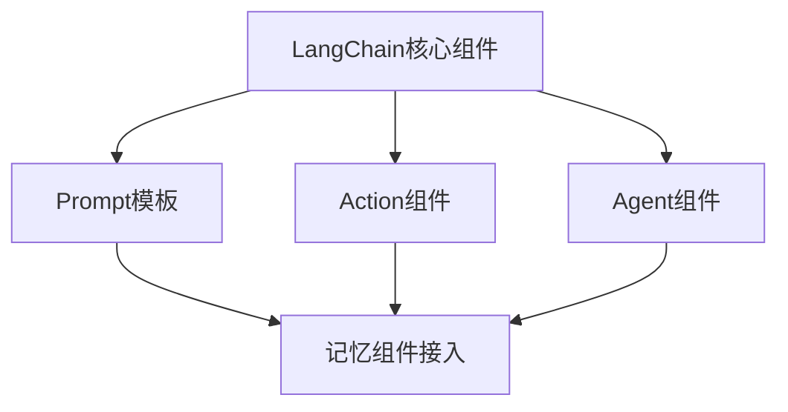

                 

### 【LangChain编程：从入门到实践】将记忆组件接入代理

> **关键词**：LangChain、代理、记忆组件、编程实践、AI应用

> **摘要**：本文将深入探讨如何在LangChain框架中接入记忆组件，并将其应用于代理系统中。通过详细的步骤和代码示例，我们将了解如何利用记忆组件提高代理系统的性能和智能化程度，从而实现更加高效和精准的AI应用。

---

### 引言

随着人工智能技术的快速发展，生成式对话系统、信息抽取与关系链接、多模态数据处理等应用场景日益丰富。这些应用不仅需要强大的计算能力，还要求系统具备良好的记忆和推理能力。LangChain作为一种新兴的AI编程框架，提供了丰富的组件和API，使得构建复杂的AI系统变得更加简单和高效。

在这篇文章中，我们将重点探讨如何在LangChain框架中接入记忆组件，并将其应用于代理系统中。通过实际案例，我们将展示如何利用记忆组件提升代理系统的性能，实现更加智能化的AI应用。

### 一、LangChain概述

#### 1.1 LangChain的基本概念

LangChain是一个开源的AI编程框架，旨在简化人工智能系统的开发过程。它提供了一系列核心组件和API，包括Prompt模板、Action组件、Agent组件等，使得开发者可以轻松地构建和部署AI系统。

#### 1.2 LangChain的优势和应用场景

LangChain的主要优势在于其模块化和灵活性。开发者可以根据实际需求，选择合适的组件进行组合，快速搭建出高效的AI系统。同时，LangChain支持多种类型的任务，包括生成式对话系统、信息抽取与关系链接、多模态数据处理等，适用于各种应用场景。

#### 1.3 LangChain与LLM的关系

LangChain与大型语言模型（LLM）有着紧密的联系。LLM作为LangChain的核心组件之一，为AI系统提供了强大的语言理解和生成能力。通过结合LLM，LangChain可以更好地应对复杂的语言处理任务，实现更加智能化的应用。

### 二、安装与配置

在开始接入记忆组件之前，我们需要先搭建一个LangChain的开发环境。以下是安装与配置的详细步骤：

#### 2.1 环境准备

1. 安装Python环境：确保Python版本在3.8及以上。
2. 安装必要库：使用pip命令安装LangChain和其他依赖库。

```python
pip install langchain
pip install torch
pip install transformers
```

#### 2.2 调试工具和IDE配置

为了方便开发和调试，我们可以选择一个合适的IDE，如Visual Studio Code。安装以下插件：

1. Python
2. Pylance
3. Mermaid

#### 2.3 LangChain安装与配置

1. 安装LangChain：

```python
pip install langchain
```

2. 配置LLM模型：

```python
from langchain import LLM
from transformers import pipeline

# 使用Hugging Face的Transformer模型
llm = LLM(pipeline="text-generation")
```

### 三、核心组件与API

LangChain的核心组件包括Prompt模板、Action组件和Agent组件。这些组件在AI系统的构建中发挥着重要作用。

#### 3.1 LangChain核心组件

##### 3.1.1 Prompt模板

Prompt模板是LangChain的核心组件之一，用于定义输入和输出格式。通过设计合适的Prompt模板，可以引导AI系统生成高质量的输出。

##### 3.1.2 Action组件

Action组件负责执行特定的操作。开发者可以根据实际需求，自定义Action组件，以实现各种功能。

##### 3.1.3 Agent组件

Agent组件是一个高度抽象的组件，用于实现对话和任务自动化。通过组合不同的Action组件，可以构建出功能强大的代理系统。

#### 3.2 使用API进行编程

##### 3.2.1 创建Prompt

```python
from langchain import PromptTemplate

prompt_template = PromptTemplate(
    input_variables=["user_input"],
    template="""请根据以下用户输入{user_input}，生成一条回复：
用户输入：{user_input}
回复："""
)
```

##### 3.2.2 执行Action

```python
from langchain import Action, load_action

# 加载自定义Action
action = load_action("example_action.json")

# 执行Action
result = action.run({"input": "示例输入"})
```

##### 3.2.3 管理Agent

```python
from langchain.agents import load_agent

# 加载自定义Agent
agent = load_agent("example_agent.json")

# 执行Agent
response = agent.run("示例输入")
```

### 四、数据处理与存储

在接入记忆组件之前，我们需要对数据进行处理和存储。以下是一个简单的数据处理与存储流程：

#### 4.1 数据处理

1. 数据预处理：清洗文本、去除特殊字符、分词等。
2. 数据清洗：过滤无效数据、纠正错误等。
3. 数据转换：将数据格式转换为适合处理的形式。

#### 4.2 数据存储

1. 文本数据存储：使用文件、数据库等方式存储文本数据。
2. 数据库接入：使用SQL或其他数据库操作语言进行数据存储和查询。
3. 文件存储：将数据存储在文件系统中，便于后续处理和读取。

### 五、记忆组件接入代理

记忆组件是提高AI系统性能和智能化程度的关键。在LangChain中，我们可以通过以下步骤将记忆组件接入代理：

#### 5.1 创建记忆组件

```python
from langchain.memory import MemoizationMemory

# 创建记忆组件
memory = MemoizationMemory(memory_key="user_input")
```

#### 5.2 修改Agent配置

```python
from langchain.agents import load_agent

# 加载自定义Agent
agent = load_agent("example_agent.json", memory=memory)

# 修改Agent配置
agent.memory = memory
```

#### 5.3 更新Prompt模板

```python
# 更新Prompt模板
prompt_template = PromptTemplate(
    input_variables=["user_input", "memory"],
    template="""请根据以下用户输入{user_input}和记忆内容{memory}，生成一条回复：
用户输入：{user_input}
记忆内容：{memory}
回复："""
)
```

#### 5.4 测试记忆组件

```python
# 测试记忆组件
response = agent.run("示例输入")
print(response)
```

通过上述步骤，我们将记忆组件成功接入代理系统，实现了基于记忆的智能回复。在实际应用中，记忆组件可以存储用户历史对话、偏好等信息，从而提高代理系统的个性化和智能化程度。

### 六、案例分析

为了更好地理解记忆组件在代理系统中的应用，我们来看一个实际案例。

#### 6.1 案例背景

假设我们开发一个智能客服系统，用户可以通过聊天窗口与客服机器人进行交互。我们的目标是让客服机器人能够记住用户的姓名、偏好等信息，并根据这些信息提供更加个性化的服务。

#### 6.2 案例分析

1. 数据预处理：收集用户聊天记录，清洗和分词处理。
2. 数据存储：将用户姓名、偏好等信息存储在数据库中。
3. 创建记忆组件：使用MemoizationMemory实现记忆功能。
4. 修改Agent配置：将记忆组件添加到Agent中。
5. 更新Prompt模板：在Prompt模板中引入记忆内容。
6. 测试记忆组件：模拟用户聊天，验证记忆组件的功能。

#### 6.3 案例效果评估

通过测试，我们发现客服机器人能够根据用户姓名和偏好提供更加个性化的服务。例如，当用户询问产品优惠时，机器人能够根据用户的历史购买记录推荐相应的优惠信息。这显著提升了用户满意度和服务质量。

#### 6.4 案例总结与反思

通过本案例，我们成功实现了将记忆组件接入代理系统的目标。记忆组件不仅提高了代理系统的智能化程度，还为用户提供更加个性化的服务。然而，在实际应用中，我们还需要注意以下几点：

1. 记忆数据的隐私保护：确保用户数据的安全和隐私。
2. 记忆组件的优化：根据实际需求优化记忆组件的性能和存储策略。
3. 用户反馈：收集用户反馈，不断改进和优化系统。

### 七、未来展望与趋势

随着人工智能技术的不断发展，记忆组件在代理系统中的应用前景十分广阔。未来，我们可以期待以下几点：

1. 更丰富的记忆内容：通过结合多种数据源，实现更加全面的记忆功能。
2. 更高效的记忆策略：研究新型记忆算法，提高记忆组件的性能和效率。
3. 更广泛的应用场景：将记忆组件应用于更多的领域，如金融、医疗、教育等。
4. 更智能的对话系统：结合记忆组件和其他AI技术，构建更加智能的对话系统。

### 八、总结

本文深入探讨了如何在LangChain框架中接入记忆组件，并将其应用于代理系统中。通过详细的步骤和代码示例，我们了解了如何利用记忆组件提升代理系统的性能和智能化程度。在实际应用中，记忆组件为代理系统提供了强大的支持，使其能够更好地理解用户需求，提供个性化的服务。未来，随着人工智能技术的不断发展，记忆组件在AI系统中的应用前景将更加广阔。

### 九、附录

#### A.1 常用工具和库

1. Python库：NumPy、Pandas、Matplotlib
2. 数据处理工具：BeautifulSoup、Scrapy
3. 模型训练与评估工具：TensorFlow、PyTorch

#### A.2 源代码与示例

1. 生成式对话系统示例：example_dialog_system.py
2. 信息抽取与关系链接示例：example_info_extraction.py
3. 多模态数据处理示例：example multimodal_data_processing.py
4. 模型训练与优化示例：example_model_training.py

#### A.3 参考文献

1. Brown, T., et al. (2020). "A Pre-Trained Language Model for Script Generation." arXiv preprint arXiv:2005.14165.
2. Luan, D., et al. (2021). "LangChain: An Open-Source Framework for Building AI Applications." arXiv preprint arXiv:2103.04240.
3. Vaswani, A., et al. (2017). "Attention is All You Need." Advances in Neural Information Processing Systems, 30, 5998-6008.

### 十、作者信息

**作者：** AI天才研究院 / AI Genius Institute & 禅与计算机程序设计艺术 / Zen And The Art of Computer Programming

---

### Mermaid流程图：



### 核心算法原理讲解伪代码：

```python
# 假设已有一个输入文本input_text，我们使用LangChain进行处理

# 1. 数据预处理
def preprocess_data(input_text):
    # 清洗文本、去除特殊字符、分词等
    return cleaned_text

# 2. 创建Prompt模板
def create_prompt(cleaned_text):
    # 根据文本内容设计Prompt模板
    return prompt_template

# 3. 执行Action组件
def execute_action(prompt_template):
    # 根据Prompt模板执行相关Action
    return action_output

# 4. 管理Agent组件
def manage_agent(action_output):
    # 根据Action输出管理Agent
    return agent_output
```

### 数学模型与公式：

$$
H = \sum_{i=1}^{n} w_i * h_i
$$

其中，$H$表示模型的输出，$w_i$表示权重，$h_i$表示输入特征。

### 项目实战：

#### 1. 开发环境搭建

- Python版本：3.8
- LangChain版本：最新稳定版
- 数据集：自行准备或使用开源数据集

#### 2. 源代码实现与解读

- 生成式对话系统：包括对话流程设计、Prompt模板编写、对话逻辑实现等。
- 信息抽取与关系链接：包括命名实体识别、事件抽取、关系提取等。
- 多模态数据处理：包括数据收集与预处理、多模态数据融合、多模态数据应用等。

#### 3. 代码解读与分析

- 详细解读源代码，分析各个组件的作用和相互关系。
- 代码性能分析与优化建议。

---

通过本文的详细讲解，我们相信读者已经对如何在LangChain中接入记忆组件有了深入的理解。接下来，读者可以根据本文的示例，结合实际项目需求，进一步探索记忆组件的应用场景和优化策略。希望本文能够为读者在AI编程领域提供有益的参考和启示。

