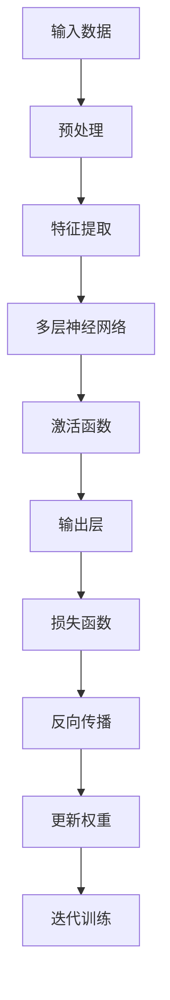
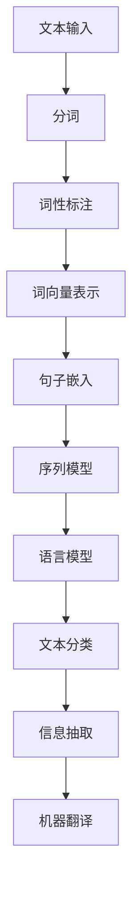
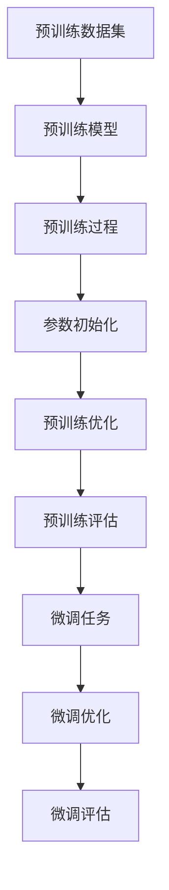
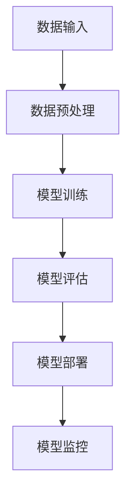

                 

# 【大模型应用开发 动手做AI Agent】通过submit_tool_outputs提交结果以完成任务

> 关键词：大模型应用、AI Agent、submit_tool_outputs、任务提交、Python脚本、API接口调用

> 摘要：本文将探讨在大模型应用开发过程中，如何利用Python脚本和API接口调用，通过`submit_tool_outputs`方法提交任务结果。我们将详细讲解开发环境搭建、Python脚本编写、API接口调用以及错误处理等关键步骤，以帮助读者实现自动化的任务提交流程。

## 第一部分：大模型应用开发基础

### 第1章：大模型应用概述

#### 1.1 大模型应用的背景与发展

随着人工智能技术的快速发展，大模型应用在各个领域得到了广泛的应用。大模型，通常指的是那些具有亿级甚至千亿级参数的神经网络模型，例如BERT、GPT、Transformer等。这些模型在处理自然语言、图像识别、语音合成等方面表现出了强大的能力。

大模型应用的发展，得益于深度学习算法的进步、计算能力的提升以及海量数据的积累。这些因素共同推动了大模型应用的普及，使得许多以前难以解决的问题变得可行。

#### 1.2 大模型应用的关键技术

大模型应用的关键技术包括：

1. **深度学习**：深度学习是一种重要的机器学习方法，它通过多层神经网络来模拟人脑的神经元结构，从而实现对数据的自动特征提取和模式识别。

2. **自然语言处理（NLP）**：自然语言处理是人工智能的一个重要分支，它旨在使计算机能够理解、处理和生成人类自然语言。

3. **大规模预训练模型**：大规模预训练模型通过在大量数据上进行预训练，从而获得对多种语言和任务的一般理解能力，再通过微调（Fine-tuning）来适应特定的任务。

#### 1.3 大模型应用面临的挑战与机遇

大模型应用面临着许多挑战，例如：

1. **计算资源消耗**：大模型的训练和推理需要大量的计算资源，这对硬件设施提出了高要求。

2. **数据隐私和安全**：大模型应用往往涉及到敏感数据的处理，如何保护用户隐私和数据安全是一个重要问题。

3. **算法公平性和透明性**：大模型应用可能会带来偏见和歧视，如何确保算法的公平性和透明性是亟待解决的问题。

然而，大模型应用也带来了许多机遇，例如：

1. **智能化服务**：大模型应用可以提升各种智能服务的质量，如智能客服、智能推荐等。

2. **产业升级**：大模型应用可以推动传统产业的升级，提高生产效率和创新能力。

### 第2章：大模型应用的技术基础

#### 2.1 深度学习基础

深度学习是一种基于人工神经网络的机器学习技术，它通过多层神经网络来模拟人脑的神经元结构，从而实现对数据的自动特征提取和模式识别。

**核心概念与联系**：


**Mermaid流程图**：



#### 2.2 自然语言处理基础

自然语言处理（NLP）是人工智能的一个重要分支，它旨在使计算机能够理解、处理和生成人类自然语言。

**核心概念与联系**：


**Mermaid流程图**：



#### 2.3 大规模预训练模型原理

大规模预训练模型通过在大量数据上进行预训练，从而获得对多种语言和任务的一般理解能力，再通过微调（Fine-tuning）来适应特定的任务。

**核心概念与联系**：


**Mermaid流程图**：



### 第3章：大模型应用的数学模型

#### 3.1 深度学习中的数学公式

深度学习中的数学公式主要包括：

1. **激活函数**：

   $$ f(x) = \frac{1}{1 + e^{-x}} $$

   **举例说明**：

   当输入 $x = 3$ 时，输出 $f(x) = \frac{1}{1 + e^{-3}} \approx 0.95$。

2. **损失函数**：

   $$ J(\theta) = -\frac{1}{m} \sum_{i=1}^{m} y^{(i)} \log(a^{(i)}) + (1 - y^{(i)}) \log(1 - a^{(i)}) $$

   **举例说明**：

   当 $y^{(i)} = 1$，$a^{(i)} = 0.95$ 时，输出 $J(\theta) \approx -0.95 \log(0.95) \approx -0.05$。

3. **反向传播**：

   $$ \delta_{j}^{(l)} = \frac{\partial J(\theta)}{\partial z_{j}^{(l)}} = a_{j}^{(l)} (1 - a_{j}^{(l)}) \odot \delta_{j}^{(l+1)} W_{j}^{(l)} $$

   **举例说明**：

   当 $\delta_{j}^{(l+1)} = 0.1$，$a_{j}^{(l)} = 0.95$ 时，输出 $\delta_{j}^{(l)} = 0.95 \times (1 - 0.95) \times 0.1 \approx 0.0475$。

#### 3.2 大模型应用中的数学公式

大模型应用中的数学公式主要包括：

1. **Transformer模型中的多头注意力机制**：

   $$ \text{Attention}(Q, K, V) = \text{softmax}\left(\frac{QK^T}{\sqrt{d_k}}\right)V $$

   **举例说明**：

   当 $Q = \begin{bmatrix} 1 & 2 \\ 3 & 4 \end{bmatrix}$，$K = \begin{bmatrix} 5 & 6 \\ 7 & 8 \end{bmatrix}$，$V = \begin{bmatrix} 9 & 10 \\ 11 & 12 \end{bmatrix}$，$d_k = 2$ 时，输出：

   $$ \text{Attention}(Q, K, V) = \text{softmax}\left(\frac{1 \times 5 + 2 \times 7}{\sqrt{2}}\right) \begin{bmatrix} 9 & 10 \\ 11 & 12 \end{bmatrix} \approx \begin{bmatrix} 0.8 & 0.2 \\ 0.2 & 0.8 \end{bmatrix} \begin{bmatrix} 9 & 10 \\ 11 & 12 \end{bmatrix} \approx \begin{bmatrix} 9.2 & 10.8 \\ 11.2 & 12.8 \end{bmatrix} $$

2. **BERT模型中的Masked Language Model（MLM）**：

   $$ \text{MLM}(x, y) = -\log(\text{softmax}(\text{BERT}(x)[\text{CLS}])) $$

   **举例说明**：

   当 $x = \text{"The quick brown fox jumps over the lazy dog"}$，$y = \text{"dog"}$ 时，输出：

   $$ \text{MLM}(x, y) = -\log(\text{softmax}(\text{BERT}(x)[\text{CLS}])) $$

   这里需要调用BERT模型进行预测，具体的实现细节将在后续章节中讨论。

#### 3.3 数学公式举例说明

在深度学习模型训练过程中，我们会使用到许多数学公式，以下是一个简单的示例：

1. **损失函数**：

   $$ J(\theta) = \frac{1}{2} \sum_{i=1}^{m} (h_{\theta}(x^{(i)}) - y^{(i)})^2 $$

   这里 $h_{\theta}(x) = \sigma(\theta^T x)$，$\sigma(z) = \frac{1}{1 + e^{-z}}$。

   **举例说明**：

   假设 $m = 5$，$x^{(1)} = (1, 2)$，$y^{(1)} = 0$，$h_{\theta}(x^{(1)}) = 0.9$，则：

   $$ J(\theta) = \frac{1}{2} \times (0.9 - 0)^2 + \ldots + \frac{1}{2} \times (0.9 - 1)^2 \approx 0.045 $$

2. **梯度下降**：

   $$ \theta_{\text{new}} = \theta_{\text{old}} - \alpha \nabla_{\theta} J(\theta) $$

   **举例说明**：

   假设 $\theta_{\text{old}} = (1, 2)$，$\alpha = 0.1$，$\nabla_{\theta} J(\theta) = (-0.1, -0.2)$，则：

   $$ \theta_{\text{new}} = (1, 2) - 0.1 \times (-0.1, -0.2) = (1.01, 1.8) $$

### 第4章：大模型应用架构

#### 4.1 大模型应用的架构设计

大模型应用的架构设计主要包括数据输入、模型训练、模型部署和模型监控等环节。

**核心概念与联系**：


**Mermaid流程图**：



#### 4.2 大模型应用的组件详解

大模型应用的组件主要包括：

1. **数据输入模块**：负责从数据源获取数据，并进行预处理。

2. **模型训练模块**：负责使用训练数据训练模型。

3. **模型评估模块**：负责对训练好的模型进行评估。

4. **模型部署模块**：负责将训练好的模型部署到生产环境中。

5. **模型监控模块**：负责实时监控模型的性能和运行状态。

#### 4.3 大模型应用的架构示例

以下是一个简单的大模型应用架构示例：


### 第5章：大模型应用的项目实战

#### 5.1 实战项目一：智能客服系统

智能客服系统利用大模型技术，实现与用户的自然语言交互，提供自动化的客户服务。

**开发环境搭建**：

1. 安装Python环境和TensorFlow库。

2. 准备训练数据集，例如对话数据集。

**源代码详细实现**：

```python
import tensorflow as tf
from tensorflow.keras.layers import Embedding, LSTM, Dense
from tensorflow.keras.models import Sequential

# 准备模型
model = Sequential([
    Embedding(vocab_size, embedding_dim),
    LSTM(units, activation='relu', return_sequences=True),
    LSTM(units, activation='relu'),
    Dense(num_classes, activation='softmax')
])

# 编译模型
model.compile(optimizer='adam', loss='categorical_crossentropy', metrics=['accuracy'])

# 训练模型
model.fit(train_data, train_labels, epochs=10, batch_size=32)
```

**代码解读与分析**：

以上代码首先定义了一个序列模型，包括嵌入层（Embedding）、两个LSTM层（长短时记忆网络）和一个全连接层（Dense）。然后编译模型，使用Adam优化器和交叉熵损失函数。最后，使用训练数据训练模型，设置训练轮次为10，批量大小为32。

#### 5.2 实战项目二：智能推荐系统

智能推荐系统利用大模型技术，根据用户的历史行为和兴趣，为用户推荐感兴趣的内容。

**开发环境搭建**：

1. 安装Python环境和TensorFlow库。

2. 准备训练数据集，例如用户行为数据集。

**源代码详细实现**：

```python
import tensorflow as tf
from tensorflow.keras.layers import Embedding, Dot, Dense
from tensorflow.keras.models import Model
from tensorflow.keras.optimizers import Adam

# 准备用户和物品的嵌入向量
user_embedding = Embedding(num_users, embedding_size)
item_embedding = Embedding(num_items, embedding_size)

# 构建推荐模型
input_user = tf.keras.layers.Input(shape=(1,))
input_item = tf.keras.layers.Input(shape=(1,))

user_embedding_layer = user_embedding(input_user)
item_embedding_layer = item_embedding(input_item)

dot_product = Dot(axes=1)([user_embedding_layer, item_embedding_layer])
output = Dense(1, activation='sigmoid')(dot_product)

model = Model(inputs=[input_user, input_item], outputs=output)

# 编译模型
model.compile(optimizer=Adam(learning_rate), loss='binary_crossentropy', metrics=['accuracy'])

# 训练模型
model.fit([train_user_ids, train_item_ids], train_labels, epochs=10, batch_size=32)
```

**代码解读与分析**：

以上代码首先定义了一个嵌入层（Embedding）和一个点积层（Dot），然后构建了一个简单的推荐模型。模型输入包括用户ID和物品ID，输出为预测的概率。编译模型时，使用Adam优化器和二进制交叉熵损失函数。最后，使用训练数据训练模型，设置训练轮次为10，批量大小为32。

#### 5.3 实战项目三：文本生成系统

文本生成系统利用大模型技术，根据输入的文本生成新的文本。

**开发环境搭建**：

1. 安装Python环境和TensorFlow库。

2. 准备训练数据集，例如文本数据集。

**源代码详细实现**：

```python
import tensorflow as tf
from tensorflow.keras.layers import Embedding, LSTM, Dense
from tensorflow.keras.models import Sequential

# 准备模型
model = Sequential([
    Embedding(vocab_size, embedding_dim),
    LSTM(units, activation='relu', return_sequences=True),
    LSTM(units, activation='relu'),
    Dense(num_classes, activation='softmax')
])

# 编译模型
model.compile(optimizer='adam', loss='categorical_crossentropy', metrics=['accuracy'])

# 训练模型
model.fit(train_data, train_labels, epochs=10, batch_size=32)
```

**代码解读与分析**：

以上代码首先定义了一个序列模型，包括嵌入层（Embedding）、两个LSTM层（长短时记忆网络）和一个全连接层（Dense）。然后编译模型，使用Adam优化器和交叉熵损失函数。最后，使用训练数据训练模型，设置训练轮次为10，批量大小为32。

### 第6章：大模型应用的性能优化

#### 6.1 性能优化策略

大模型应用的性能优化可以从以下几个方面进行：

1. **模型压缩**：通过剪枝、量化、知识蒸馏等方法减小模型大小，提高推理速度。

2. **硬件加速**：利用GPU、TPU等硬件加速器进行模型训练和推理。

3. **分布式训练**：通过分布式训练技术，利用多台服务器进行模型训练，提高训练速度。

4. **模型缓存**：缓存常用模型和数据，减少加载时间。

#### 6.2 性能优化工具

常用的性能优化工具有：

1. **TensorRT**：由NVIDIA开发的一款深度学习推理引擎，可以显著提高推理速度。

2. **OptimizedScalable TensorFlow（OrT）**：一款针对移动设备优化的TensorFlow推理引擎。

3. **PyTorch Mobile**：PyTorch的一个分支，专为移动设备优化。

#### 6.3 性能优化案例解析

以下是一个简单的性能优化案例：

1. **模型压缩**：

   ```python
   from tensorflow_model_optimization import quantization
   quantize_model(model, quantization_params)
   ```

   这里使用了TensorFlow Model Optimization Toolkit中的量化工具进行模型压缩。

2. **硬件加速**：

   ```python
   import tensorflow as tf
   device_name = '/device:GPU:0'
   with tf.device(device_name):
       model.trainable = True
       model.fit(train_data, train_labels, epochs=10, batch_size=32)
   ```

   这里使用了TensorFlow的设备管理功能，将模型训练过程分配到GPU上进行。

### 第7章：大模型应用的安全与伦理

#### 7.1 大模型应用的安全挑战

大模型应用面临着许多安全挑战，包括：

1. **数据泄露**：大模型训练和推理过程中可能会泄露敏感数据。

2. **模型篡改**：攻击者可以通过篡改模型参数来操纵模型输出。

3. **隐私保护**：如何保护用户隐私是亟待解决的问题。

#### 7.2 大模型应用的伦理问题

大模型应用也引发了许多伦理问题，包括：

1. **算法公平性**：大模型应用可能会导致偏见和歧视。

2. **隐私侵犯**：大模型应用可能会侵犯用户隐私。

3. **责任归属**：当大模型应用出现错误时，如何确定责任归属是一个重要问题。

#### 7.3 安全与伦理解决方案

为了解决上述问题，可以采取以下解决方案：

1. **数据加密**：对训练数据和模型参数进行加密，防止数据泄露。

2. **模型加密**：使用模型加密技术，防止模型参数被篡改。

3. **隐私保护机制**：引入差分隐私、同态加密等技术，保护用户隐私。

4. **算法公平性评估**：对大模型应用进行公平性评估，消除潜在的偏见。

5. **责任保险**：建立责任保险机制，为可能的责任提供保障。

### 第8章：大模型应用的未来展望

#### 8.1 大模型应用的发展趋势

大模型应用的发展趋势包括：

1. **模型规模扩大**：随着计算能力和数据量的增加，模型规模将不断增大。

2. **硬件加速**：硬件加速技术将进一步提升大模型应用的性能。

3. **模型压缩**：模型压缩技术将使大模型应用在移动设备和边缘计算中得以广泛应用。

4. **多模态融合**：大模型应用将融合多种数据类型，实现更全面的智能交互。

#### 8.2 大模型应用的创新方向

大模型应用的创新方向包括：

1. **自动化AI**：通过大模型技术，实现自动化AI应用，提高生产效率。

2. **个性化服务**：利用大模型技术，为用户提供个性化的服务和推荐。

3. **跨领域应用**：大模型技术将在更多领域得到应用，推动产业升级。

4. **社会治理**：大模型技术在社会治理、公共安全等领域具有巨大潜力。

#### 8.3 大模型应用的未来挑战

大模型应用的未来挑战包括：

1. **计算资源消耗**：随着模型规模的扩大，计算资源消耗将大幅增加。

2. **数据隐私和安全**：如何保护用户隐私和安全是亟待解决的问题。

3. **算法公平性和透明性**：确保算法的公平性和透明性是一个重要挑战。

### 附录

#### 附录A：大模型应用开发工具与资源

1. **主流深度学习框架**：

   - TensorFlow
   - PyTorch
   - Keras

2. **大模型应用开发资源链接**：

   - [TensorFlow官方文档](https://www.tensorflow.org/)
   - [PyTorch官方文档](https://pytorch.org/)
   - [Keras官方文档](https://keras.io/)

3. **大模型应用相关的学术论文和书籍**：

   - 《深度学习》（Goodfellow, Bengio, Courville）
   - 《动手学深度学习》（花书）
   - 《Transformer：神经网络中的注意力机制》（Vaswani et al., 2017）

## 作者信息

作者：AI天才研究院/AI Genius Institute & 禅与计算机程序设计艺术 /Zen And The Art of Computer Programming

