                 

## 《一人公司创业的12个月执行时间表》

### 核心关键词：创业、时间表、执行、一人公司

#### 摘要：
在当前竞争激烈的商业环境中，一人公司的创业模式正逐渐成为一种受欢迎的创业方式。本文将为您提供一个12个月的执行时间表，帮助您更好地规划和管理您的创业过程。从市场研究、商业计划、品牌建设到产品开发、市场推广、团队建设以及业务扩展，每个阶段都将提供具体的操作步骤和策略，以帮助您实现创业目标。无论您是一位新手创业者还是已有一定经验的企业家，本文都将为您指明方向，助您在创业路上稳步前行。

---

## 《一人公司创业的12个月执行时间表》

### 第一部分：初始阶段（1-3个月）

在创业初期，您需要奠定坚实的基础，确保您的想法和计划具有可行性和市场潜力。以下是第一个阶段的关键步骤：

### 第1章：市场研究与定位

#### 1.1 市场调研与竞争对手分析

**核心概念与联系：** 市场调研是了解潜在市场和竞争对手的重要步骤。以下是一个简化的 Mermaid 流程图，展示了市场调研的基本流程：

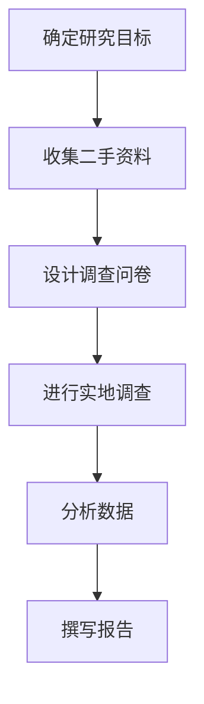

**步骤详解：**

1. **确定研究目标：** 明确您想要解决的问题或满足的需求，以及目标市场的特征。
2. **收集二手资料：** 利用公开的数据源和行业报告来获取市场背景信息。
3. **设计调查问卷：** 根据研究目标制定问卷，以获取第一手市场数据。
4. **进行实地调查：** 通过采访、观察等方式收集数据。
5. **分析数据：** 使用统计工具分析数据，识别市场趋势和潜在机会。
6. **撰写报告：** 汇总分析结果，形成市场调研报告。

#### 1.2 目标市场与客户定位

**核心概念与联系：** 客户定位是明确您的目标客户群体，以便更有效地进行市场营销。以下是一个客户定位的 Mermaid 流程图：

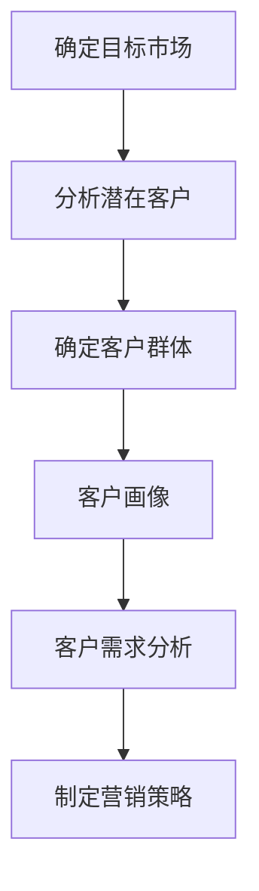

**步骤详解：**

1. **确定目标市场：** 根据市场调研结果，确定最有可能对您的产品或服务产生兴趣的市场。
2. **分析潜在客户：** 研究目标市场的潜在客户，了解他们的需求和行为模式。
3. **确定客户群体：** 根据分析结果，确定您的核心目标客户。
4. **客户画像：** 建立详细的客户画像，包括年龄、性别、收入、职业等特征。
5. **客户需求分析：** 分析客户的需求，以确定产品或服务的特点和功能。
6. **制定营销策略：** 根据客户需求和画像，制定有效的营销策略。

#### 1.3 制定市场进入策略

**核心概念与联系：** 市场进入策略是您如何进入目标市场并建立品牌的计划。以下是一个市场进入策略的 Mermaid 流程图：

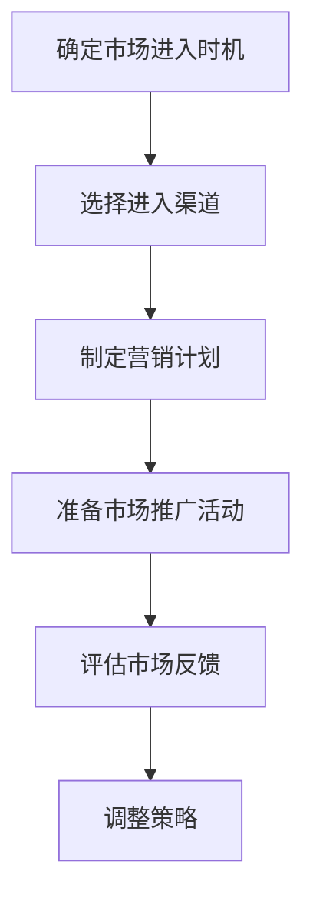

**步骤详解：**

1. **确定市场进入时机：** 根据市场环境和竞争对手情况，选择最佳的进入时机。
2. **选择进入渠道：** 根据目标市场和客户特征，选择最合适的销售和推广渠道。
3. **制定营销计划：** 制定详细的营销计划，包括宣传材料、广告、促销活动等。
4. **准备市场推广活动：** 准备市场推广所需的资源，如宣传材料、网站、社交媒体账号等。
5. **评估市场反馈：** 监控市场推广活动的效果，并根据反馈进行调整。
6. **调整策略：** 根据市场反馈，调整营销策略和产品特性。

### 第2章：商业计划与执行

#### 2.1 编写商业计划书

**核心概念与联系：** 商业计划书是创业项目的核心文件，它详细描述了企业的愿景、目标、策略和财务预测。以下是一个商业计划书的 Mermaid 流程图：

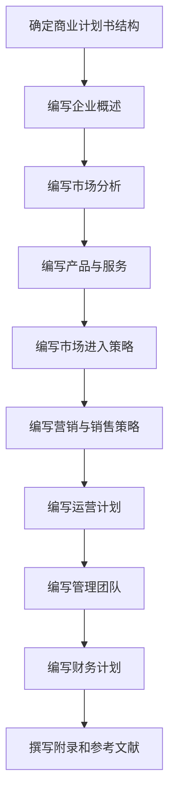

**步骤详解：**

1. **确定商业计划书结构：** 根据商业计划书的常见结构，确定各部分的顺序和内容。
2. **编写企业概述：** 描述企业的愿景、使命和价值观。
3. **编写市场分析：** 分析目标市场、市场规模、增长趋势和竞争对手。
4. **编写产品与服务：** 描述您的产品或服务的特点、优势和独特卖点。
5. **编写市场进入策略：** 描述如何进入市场、建立品牌和推广产品。
6. **编写营销与销售策略：** 描述营销策略、销售渠道和客户关系管理。
7. **编写运营计划：** 描述企业的日常运营流程和管理体系。
8. **编写管理团队：** 介绍管理团队成员及其职责。
9. **编写财务计划：** 预测企业的财务状况，包括收入、支出和现金流。
10. **撰写附录和参考文献：** 提供支持性文件和数据。

#### 2.2 资金筹集与预算规划

**核心概念与联系：** 资金筹集是确保企业运营的重要步骤，预算规划是确保资金合理使用的必要手段。以下是一个资金筹集和预算规划的 Mermaid 流程图：

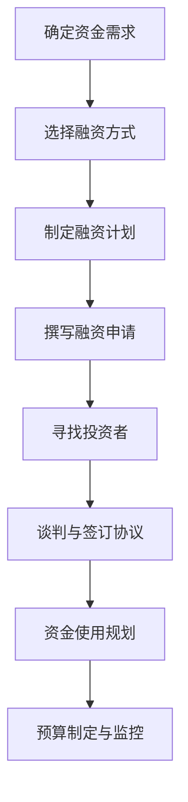

**步骤详解：**

1. **确定资金需求：** 根据商业计划书，确定企业启动和运营所需的资金。
2. **选择融资方式：** 根据资金需求和风险承受能力，选择合适的融资方式，如自筹资金、天使投资、风险投资等。
3. **制定融资计划：** 制定详细的融资计划，包括融资目标、时间表和预期收益。
4. **撰写融资申请：** 编写融资申请文档，包括商业计划书、财务预测和投资者介绍。
5. **寻找投资者：** 通过网络、行业会议、推荐等方式寻找潜在投资者。
6. **谈判与签订协议：** 与投资者进行谈判，签订投资协议。
7. **资金使用规划：** 根据融资目的，制定资金使用计划。
8. **预算制定与监控：** 制定详细的预算，并定期监控实际支出。

#### 2.3 制定执行时间表与里程碑

**核心概念与联系：** 执行时间表和里程碑是确保项目按计划进行的工具。以下是一个执行时间表和里程碑的 Mermaid 流程图：

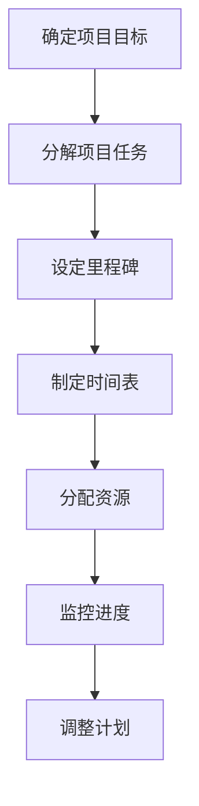

**步骤详解：**

1. **确定项目目标：** 根据商业计划书，明确项目的主要目标。
2. **分解项目任务：** 将项目目标分解为具体的任务和活动。
3. **设定里程碑：** 根据任务进度，设定关键里程碑，以监控项目进度。
4. **制定时间表：** 根据里程碑，制定详细的执行时间表。
5. **分配资源：** 根据任务和时间表，分配所需的资源，包括人力、资金和物资。
6. **监控进度：** 定期检查任务进度，确保项目按计划进行。
7. **调整计划：** 根据实际情况，调整计划和时间表，以应对变化和挑战。

### 第3章：品牌建设与宣传

#### 3.1 品牌形象设计

**核心概念与联系：** 品牌形象设计是建立品牌识别度和信任的关键步骤。以下是一个品牌形象设计的 Mermaid 流程图：

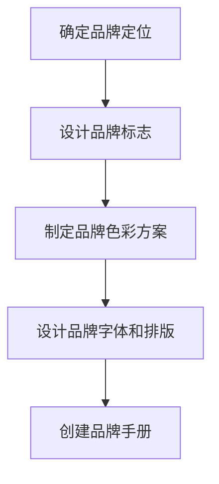

**步骤详解：**

1. **确定品牌定位：** 根据市场定位和目标客户，确定品牌的核心价值和定位。
2. **设计品牌标志：** 创建独特的品牌标志，传达品牌的核心价值和特色。
3. **制定品牌色彩方案：** 选择适合品牌定位的色彩方案，以增强品牌的视觉识别度。
4. **设计品牌字体和排版：** 选择适合品牌形象的字体和排版风格，确保品牌信息的传达清晰、简洁。
5. **创建品牌手册：** 编写品牌手册，详细记录品牌标志、色彩、字体和排版的使用规范，确保品牌形象的一致性。

#### 3.2 建立官方网站和社交媒体账号

**核心概念与联系：** 建立官方网站和社交媒体账号是品牌宣传的重要渠道。以下是一个建立官方网站和社交媒体账号的 Mermaid 流程图：

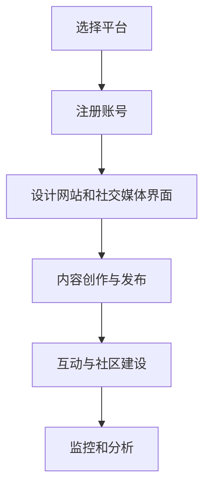

**步骤详解：**

1. **选择平台：** 根据目标市场和客户特征，选择合适的官方网站和社交媒体平台。
2. **注册账号：** 在选定的平台上注册账号，并确保账号名称与品牌名称一致。
3. **设计网站和社交媒体界面：** 创建专业的网站和社交媒体界面，确保与品牌形象一致。
4. **内容创作与发布：** 创作高质量的内容，并定期发布，以吸引和留住客户。
5. **互动与社区建设：** 与客户互动，建立社交媒体社区，增强品牌忠诚度。
6. **监控和分析：** 定期监控和分析网站和社交媒体的表现，以优化内容和策略。

#### 3.3 制定营销策略与推广计划

**核心概念与联系：** 营销策略和推广计划是提高品牌知名度和吸引客户的关键。以下是一个营销策略和推广计划的 Mermaid 流程图：

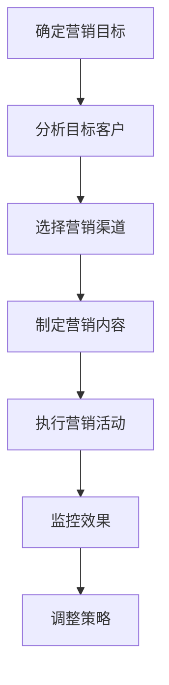

**步骤详解：**

1. **确定营销目标：** 根据商业计划和目标市场，明确营销目标。
2. **分析目标客户：** 了解目标客户的需求、偏好和行为习惯。
3. **选择营销渠道：** 根据目标客户和营销目标，选择合适的营销渠道，如社交媒体、电子邮件、内容营销等。
4. **制定营销内容：** 创作符合目标客户需求的营销内容，包括广告文案、视频、博客文章等。
5. **执行营销活动：** 实施营销计划，执行具体的营销活动。
6. **监控效果：** 监控营销活动的效果，包括点击率、转化率、客户反馈等。
7. **调整策略：** 根据监控结果，调整营销策略和内容，以优化效果。

---

在创业的初始阶段，您需要全面规划和管理，确保每个步骤都得到有效执行。通过市场研究、商业计划、品牌建设和营销策略，您可以为自己的创业之路奠定坚实的基础，为未来的发展做好准备。接下来的几个阶段，我们将深入探讨产品开发、业务拓展和团队建设等重要环节，帮助您实现创业目标。

### 第二部分：启动阶段（4-6个月）

在成功完成初始阶段的准备工作后，您的公司即将进入启动阶段。在这个阶段，您需要专注于产品开发、业务拓展和财务管理，为公司的快速发展奠定基础。以下是启动阶段的关键步骤：

### 第4章：产品开发与优化

#### 4.1 确定产品功能与特点

**核心概念与联系：** 确定产品功能与特点是产品开发的首要任务。以下是一个产品功能与特点确定的 Mermaid 流程图：

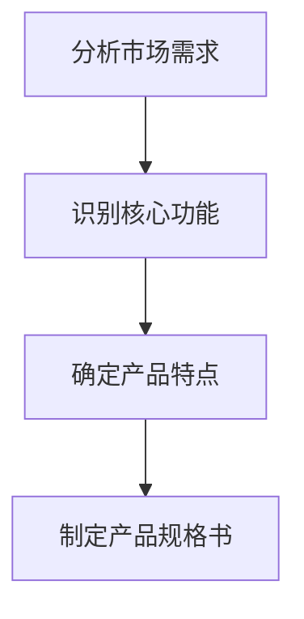

**步骤详解：**

1. **分析市场需求：** 通过市场调研和客户反馈，了解目标客户的需求和期望。
2. **识别核心功能：** 根据市场需求，确定产品的核心功能，这些功能应当直接解决客户的主要问题。
3. **确定产品特点：** 识别产品与其他竞争对手的差异点，包括独特卖点、用户体验等。
4. **制定产品规格书：** 形成详细的产品规格书，包含产品功能、特点、性能指标和设计要求。

#### 4.2 开发与测试

**核心概念与联系：** 开发与测试是确保产品质量和功能完整的关键环节。以下是一个开发与测试的 Mermaid 流程图：

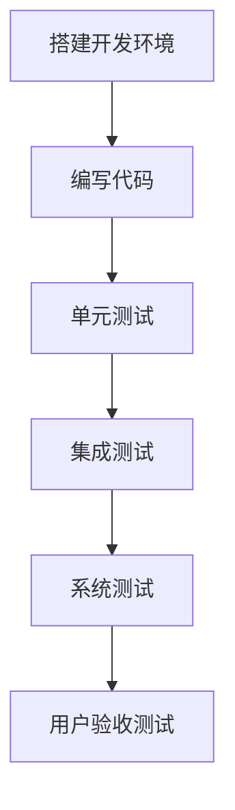

**步骤详解：**

1. **搭建开发环境：** 根据项目需求，搭建适合的开发环境，确保开发团队能够高效工作。
2. **编写代码：** 开发团队根据产品规格书编写代码，实现产品功能。
3. **单元测试：** 对每个模块进行单元测试，确保代码质量。
4. **集成测试：** 将各个模块集成起来进行测试，确保它们之间的交互正常。
5. **系统测试：** 对整个系统进行测试，包括性能、安全性和稳定性。
6. **用户验收测试：** 邀请实际用户进行测试，确保产品符合用户需求。

#### 4.3 收集用户反馈并优化产品

**核心概念与联系：** 收集用户反馈是产品优化的重要环节，有助于提升产品质量和用户满意度。以下是一个收集用户反馈并优化产品的 Mermaid 流程图：

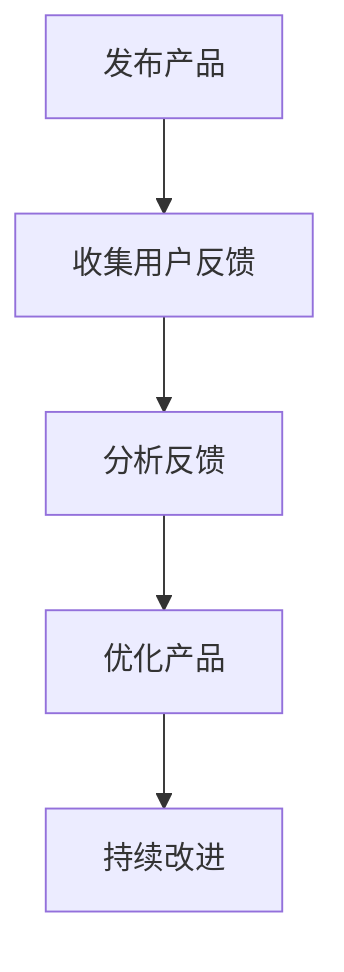

**步骤详解：**

1. **发布产品：** 将产品发布给目标用户，确保他们能够使用和反馈。
2. **收集用户反馈：** 通过问卷调查、用户访谈、社交媒体等方式收集用户反馈。
3. **分析反馈：** 对收集到的反馈进行分析，识别产品的问题和改进机会。
4. **优化产品：** 根据分析结果，对产品进行改进和优化。
5. **持续改进：** 定期收集用户反馈，持续优化产品，以提升用户体验。

### 第5章：业务拓展与合作伙伴关系

#### 5.1 扩大目标市场

**核心概念与联系：** 扩大目标市场是提高产品覆盖率和销售量的关键。以下是一个扩大目标市场的 Mermaid 流程图：

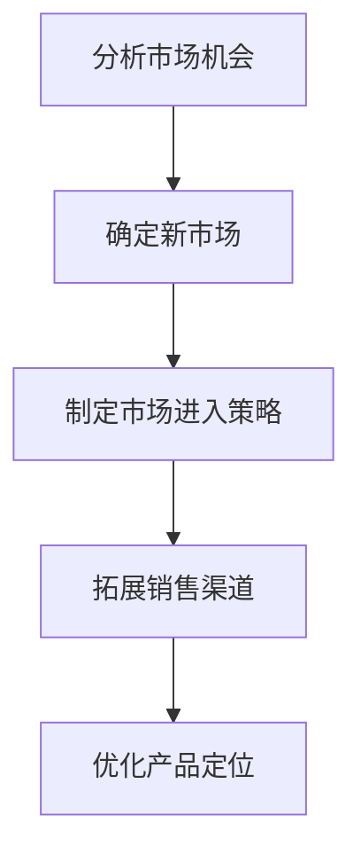

**步骤详解：**

1. **分析市场机会：** 通过市场调研和数据分析，识别新的市场机会。
2. **确定新市场：** 根据市场机会，确定适合的目标市场。
3. **制定市场进入策略：** 制定详细的进入策略，包括市场定位、营销策略和推广计划。
4. **拓展销售渠道：** 通过线上线下多种渠道，扩大产品销售范围。
5. **优化产品定位：** 根据新市场的需求和特点，优化产品定位和营销策略。

#### 5.2 寻找合作伙伴

**核心概念与联系：** 寻找合作伙伴有助于资源整合和市场拓展。以下是一个寻找合作伙伴的 Mermaid 流程图：

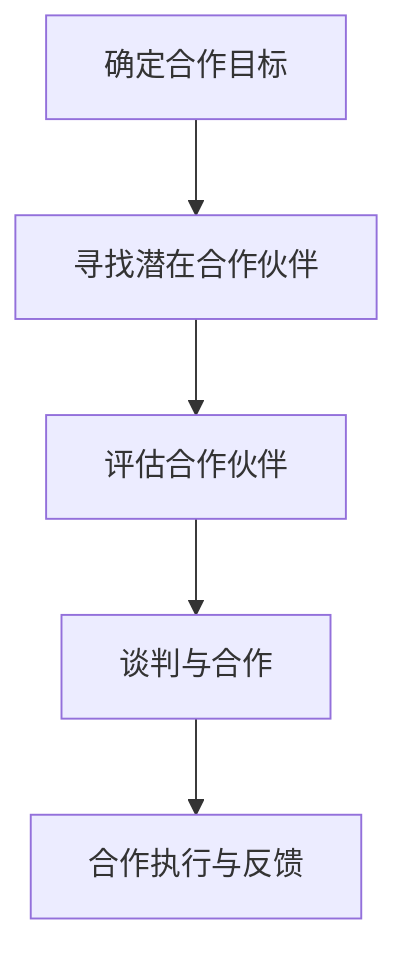

**步骤详解：**

1. **确定合作目标：** 根据业务拓展需求，明确合作目标和预期成果。
2. **寻找潜在合作伙伴：** 通过行业会议、网络搜索、推荐等方式，寻找合适的合作伙伴。
3. **评估合作伙伴：** 对潜在合作伙伴进行评估，包括财务状况、信誉度、合作潜力等。
4. **谈判与合作：** 与合作伙伴进行谈判，签订合作协议。
5. **合作执行与反馈：** 实施合作协议，定期评估合作效果，并根据反馈进行调整。

#### 5.3 建立供应商关系

**核心概念与联系：** 建立稳定的供应商关系是确保产品供应链稳定的关键。以下是一个建立供应商关系的 Mermaid 流程图：

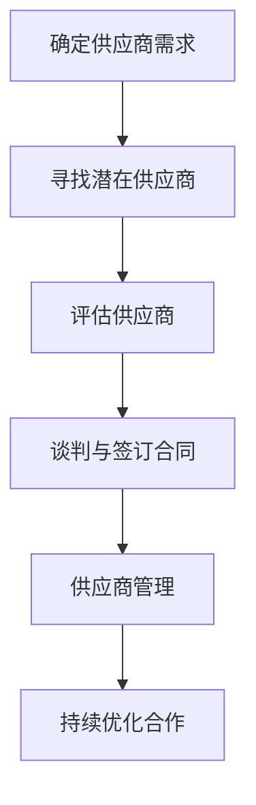

**步骤详解：**

1. **确定供应商需求：** 根据产品生产和业务需求，明确供应商的类型、数量和质量要求。
2. **寻找潜在供应商：** 通过市场调研、推荐和招标等方式，寻找合适的供应商。
3. **评估供应商：** 对潜在供应商进行评估，包括生产能力、质量控制、价格等。
4. **谈判与签订合同：** 与供应商进行谈判，签订详细的采购合同。
5. **供应商管理：** 监控供应商的履约情况，确保供应链的稳定性。
6. **持续优化合作：** 根据供应链管理情况，与供应商持续优化合作，提升整体供应链效率。

---

在启动阶段，您需要集中精力进行产品开发、业务拓展和供应商关系建设。通过优化产品功能、扩大市场覆盖、寻找合作伙伴和建立稳定的供应链，您可以为自己的公司奠定坚实的基础，为未来的快速增长做好准备。接下来，我们将进入成长阶段，进一步探讨市场推广、团队建设和国际化扩展等重要环节。

### 第三部分：成长阶段（7-12个月）

进入成长阶段，您的公司已经具备了一定的市场基础和运营能力。在这个阶段，您需要进一步扩大市场份额，优化团队结构，并探索国际化机会。以下是成长阶段的关键步骤：

### 第7章：市场推广与用户增长

#### 7.1 提升品牌知名度

**核心概念与联系：** 提升品牌知名度是扩大市场份额的关键。以下是一个提升品牌知名度的 Mermaid 流程图：

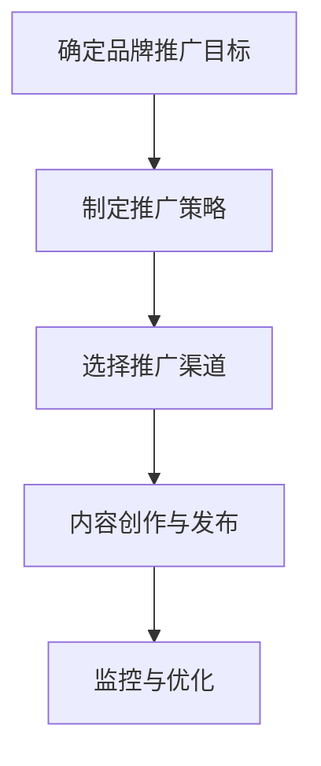

**步骤详解：**

1. **确定品牌推广目标：** 根据业务发展需求，明确品牌推广的具体目标和预期成果。
2. **制定推广策略：** 制定详细的推广策略，包括推广内容、目标受众和推广渠道。
3. **选择推广渠道：** 根据目标受众和推广策略，选择最有效的推广渠道，如社交媒体、广告、公关活动等。
4. **内容创作与发布：** 创作高质量的内容，并定期发布，以吸引和留住客户。
5. **监控与优化：** 定期监控推广活动的效果，并根据反馈进行优化，以提高品牌知名度和影响力。

#### 7.2 优化营销策略

**核心概念与联系：** 优化营销策略是提高营销效果和投资回报率的关键。以下是一个优化营销策略的 Mermaid 流程图：

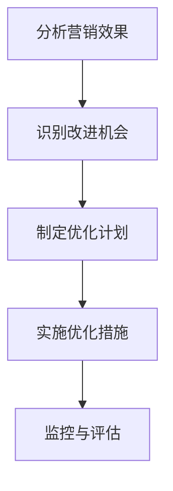

**步骤详解：**

1. **分析营销效果：** 对现有营销活动进行数据分析和效果评估，识别优势和不足。
2. **识别改进机会：** 根据分析结果，识别需要改进的方面，包括营销内容、推广渠道、用户互动等。
3. **制定优化计划：** 制定详细的优化计划，明确优化目标和实施步骤。
4. **实施优化措施：** 实施优化计划，对营销策略进行调整和改进。
5. **监控与评估：** 定期监控优化措施的效果，并根据评估结果进行调整，以提高营销效果。

#### 7.3 用户增长与留存策略

**核心概念与联系：** 用户增长与留存策略是确保业务持续增长的关键。以下是一个用户增长与留存策略的 Mermaid 流程图：

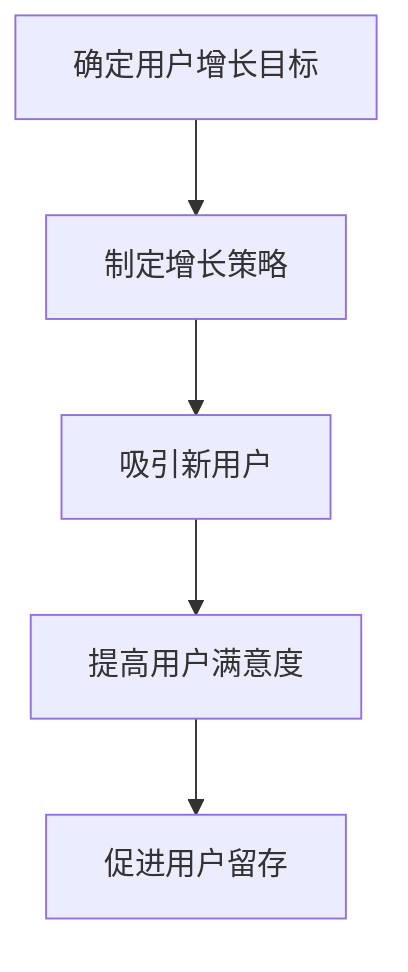

**步骤详解：**

1. **确定用户增长目标：** 根据业务发展需求，明确用户增长的具体目标和预期成果。
2. **制定增长策略：** 制定详细的增长策略，包括用户获取、用户体验、用户互动等。
3. **吸引新用户：** 通过各种渠道和手段，吸引新的潜在用户，如广告、活动、推荐等。
4. **提高用户满意度：** 优化产品和服务，提高用户满意度，增加用户粘性。
5. **促进用户留存：** 通过用户反馈、会员计划、增值服务等手段，促进用户长期留存和复购。

### 第8章：团队建设与运营优化

#### 8.1 招聘与培养人才

**核心概念与联系：** 招聘与培养人才是确保团队稳定和业务发展的关键。以下是一个招聘与培养人才的 Mermaid 流程图：

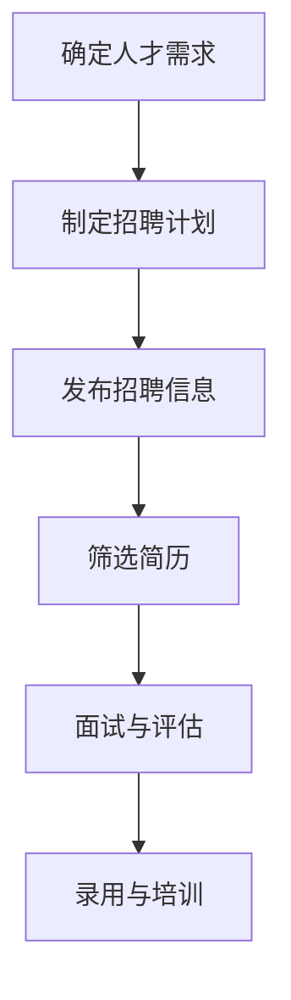

**步骤详解：**

1. **确定人才需求：** 根据业务发展和团队建设需求，明确需要招聘的岗位和人才类型。
2. **制定招聘计划：** 制定详细的招聘计划，包括招聘渠道、时间表和预算。
3. **发布招聘信息：** 在各种招聘平台和渠道上发布招聘信息，吸引合适的人才。
4. **筛选简历：** 对收到的简历进行筛选，识别合适的候选人。
5. **面试与评估：** 对候选人进行面试和评估，确保其具备所需的能力和素质。
6. **录用与培训：** 对录用的员工进行入职培训，帮助他们快速融入团队和工作。

#### 8.2 优化内部流程与管理制度

**核心概念与联系：** 优化内部流程与管理制度是提高团队效率和业务绩效的关键。以下是一个优化内部流程与管理制度的 Mermaid 流程图：

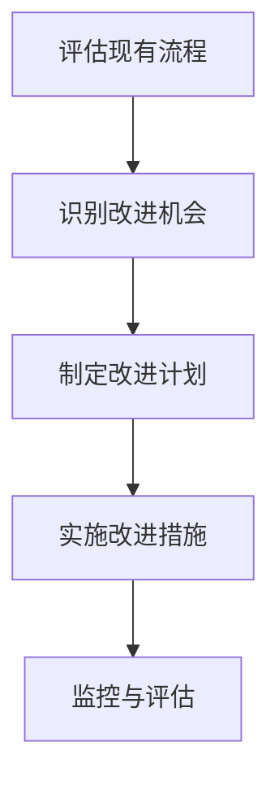

**步骤详解：**

1. **评估现有流程：** 对现有流程进行评估，识别存在的问题和瓶颈。
2. **识别改进机会：** 根据评估结果，识别需要改进的方面，包括流程设计、职责分工、沟通协作等。
3. **制定改进计划：** 制定详细的改进计划，明确改进目标和实施步骤。
4. **实施改进措施：** 实施改进计划，对内部流程和管理制度进行调整和优化。
5. **监控与评估：** 定期监控改进措施的效果，并根据评估结果进行调整，以提高团队效率和业务绩效。

#### 8.3 提升团队协作效率

**核心概念与联系：** 提升团队协作效率是确保团队高效运作的关键。以下是一个提升团队协作效率的 Mermaid 流程图：

```mermaid
graph TD
A[分析协作问题] --> B[制定协作策略]
B --> C[优化沟通工具]
C --> D[培训与指导]
D --> E[激励与奖励]
```

**步骤详解：**

1. **分析协作问题：** 对团队协作中的问题进行深入分析，识别协作障碍和瓶颈。
2. **制定协作策略：** 根据协作问题，制定详细的协作策略，包括沟通机制、协作工具和团队文化等。
3. **优化沟通工具：** 选择适合团队的沟通工具，如即时通讯软件、项目管理工具等，以提高沟通效率。
4. **培训与指导：** 对团队成员进行协作技能培训，并提供指导和支持，帮助他们更好地协作。
5. **激励与奖励：** 制定激励政策，鼓励团队成员积极参与协作，并设立奖励机制，以激发团队合作精神。

### 第9章：业务扩展与国际化

#### 9.1 新业务开发与市场拓展

**核心概念与联系：** 新业务开发与市场拓展是业务扩展的重要手段。以下是一个新业务开发与市场拓展的 Mermaid 流程图：

```mermaid
graph TD
A[确定新业务方向] --> B[市场调研与分析]
B --> C[制定业务计划]
C --> D[资源整合与投入]
D --> E[业务启动与运营]
```

**步骤详解：**

1. **确定新业务方向：** 根据市场需求和公司优势，确定新业务的方向和目标。
2. **市场调研与分析：** 对目标市场进行深入调研和分析，了解市场规模、竞争状况和用户需求。
3. **制定业务计划：** 制定详细的新业务计划，包括市场定位、营销策略、资源投入和预期成果。
4. **资源整合与投入：** 整合公司内部资源和外部资源，为新业务提供必要的支持和保障。
5. **业务启动与运营：** 启动新业务，确保其顺利运营，并根据实际情况进行调整和优化。

#### 9.2 国际市场进入策略

**核心概念与联系：** 国际市场进入策略是公司国际化发展的重要步骤。以下是一个国际市场进入策略的 Mermaid 流程图：

```mermaid
graph TD
A[确定国际化目标] --> B[选择目标市场]
B --> C[分析目标市场]
C --> D[制定进入策略]
D --> E[资源整合与投入]
E --> F[业务启动与运营]
```

**步骤详解：**

1. **确定国际化目标：** 根据公司战略和发展需求，明确国际化的具体目标和预期成果。
2. **选择目标市场：** 根据市场调研和分析，选择最具潜力的目标市场。
3. **分析目标市场：** 深入了解目标市场的文化、法律、经济和竞争状况。
4. **制定进入策略：** 制定详细的国际化进入策略，包括市场定位、营销策略、渠道建设和运营计划。
5. **资源整合与投入：** 整合公司内部资源和外部资源，为国际化业务提供必要的支持和保障。
6. **业务启动与运营：** 启动国际化业务，确保其顺利运营，并根据实际情况进行调整和优化。

#### 9.3 跨文化管理与运营

**核心概念与联系：** 跨文化管理与运营是确保国际化业务成功的关键。以下是一个跨文化管理与运营的 Mermaid 流程图：

```mermaid
graph TD
A[建立跨文化团队] --> B[文化适应与培训]
B --> C[沟通与协作]
C --> D[管理差异与冲突]
D --> E[激励与奖励]
```

**步骤详解：**

1. **建立跨文化团队：** 汇集来自不同国家和地区的团队成员，建立多元化的团队。
2. **文化适应与培训：** 对团队成员进行文化适应培训，帮助他们更好地理解和适应目标市场的文化。
3. **沟通与协作：** 优化沟通工具和协作机制，确保团队内部和跨部门之间的有效沟通和协作。
4. **管理差异与冲突：** 设立冲突解决机制，妥善处理文化差异和冲突，确保团队和谐运作。
5. **激励与奖励：** 制定激励政策，鼓励团队成员积极参与国际化业务，并设立奖励机制，以激发团队活力。

---

在成长阶段，您需要不断探索新的增长机会，优化内部运营，提升团队协作效率，并积极拓展国际市场。通过有效的市场推广、团队建设和业务扩展，您可以实现公司的快速发展和国际化目标。接下来，我们将进行年终总结与规划，为下一年的发展做好准备。

### 第10章：年终总结与规划

年终总结与规划是创业过程中不可或缺的一环。通过总结过去的经验与教训，分析面临的挑战与机遇，您可以为新的一年的发展制定更加明确和可行的计划。以下是年终总结与规划的关键步骤：

#### 10.1 年度业务回顾与总结

**核心概念与联系：** 年度业务回顾与总结是对过去一年业务表现进行全面梳理和分析的过程。以下是一个年度业务回顾与总结的 Mermaid 流程图：

```mermaid
graph TD
A[收集数据与信息] --> B[业务绩效评估]
B --> C[分析成功与失败原因]
C --> D[总结经验与教训]
```

**步骤详解：**

1. **收集数据与信息：** 收集过去一年的业务数据、财务报告、市场调研结果等，为回顾与总结提供基础。
2. **业务绩效评估：** 对业务绩效进行评估，包括销售数据、市场份额、客户满意度等，识别业务表现的优势和不足。
3. **分析成功与失败原因：** 分析成功案例和失败案例，识别成功的关键因素和失败的根源，为未来的改进提供依据。
4. **总结经验与教训：** 汇总过去一年的经验与教训，形成有价值的总结，为未来决策提供参考。

#### 10.2 面临的挑战与机会分析

**核心概念与联系：** 面临的挑战与机会分析是对未来一年可能面临的挑战和机遇进行预测和评估的过程。以下是一个面临的挑战与机会分析的 Mermaid 流程图：

```mermaid
graph TD
A[分析市场环境] --> B[识别潜在挑战]
B --> C[评估挑战影响]
C --> D[分析市场机会]
D --> E[评估机会潜力]
```

**步骤详解：**

1. **分析市场环境：** 对市场趋势、竞争对手、客户需求等进行分析，了解市场环境的变化。
2. **识别潜在挑战：** 识别未来一年可能面临的挑战，如市场竞争加剧、政策变化、供应链问题等。
3. **评估挑战影响：** 评估潜在挑战对业务的影响，包括风险程度和应对策略。
4. **分析市场机会：** 识别未来一年可能的市场机会，如新兴市场、新技术应用、行业趋势等。
5. **评估机会潜力：** 评估市场机会的潜力，包括市场需求、竞争优势和盈利能力。

#### 10.3 制定下一年的发展计划

**核心概念与联系：** 制定下一年的发展计划是根据年度总结和面临的挑战与机会，制定具体的发展目标和策略。以下是一个制定下一年的发展计划的 Mermaid 流程图：

```mermaid
graph TD
A[确定发展目标] --> B[制定战略规划]
B --> C[分解目标与任务]
C --> D[制定时间表与里程碑]
D --> E[分配资源与责任]
E --> F[制定监控与评估机制]
```

**步骤详解：**

1. **确定发展目标：** 根据业务回顾、挑战与机会分析，明确下一年的发展目标，包括业务增长、市场份额、客户满意度等。
2. **制定战略规划：** 制定详细的发展战略规划，明确实现目标的路径和策略。
3. **分解目标与任务：** 将发展目标分解为具体的任务和活动，确保每个任务都有明确的负责人和时间节点。
4. **制定时间表与里程碑：** 根据任务和责任，制定详细的时间表和里程碑，确保目标的实现。
5. **分配资源与责任：** 根据任务和时间表，分配所需的资源，明确责任人和任务分工。
6. **制定监控与评估机制：** 制定监控与评估机制，定期检查任务进度和目标实现情况，并根据实际情况进行调整和优化。

#### 10.4 制定预算与财务计划

**核心概念与联系：** 制定预算与财务计划是确保公司财务稳定和可持续发展的重要步骤。以下是一个制定预算与财务计划的 Mermaid 流程图：

```mermaid
graph TD
A[分析财务状况] --> B[制定预算计划]
B --> C[制定收入预测]
C --> D[制定支出预算]
D --> E[制定财务监控机制]
```

**步骤详解：**

1. **分析财务状况：** 对过去一年的财务状况进行详细分析，了解收入、支出、利润等财务指标。
2. **制定预算计划：** 根据业务发展需求和财务分析结果，制定详细的预算计划，包括收入预测和支出预算。
3. **制定收入预测：** 根据市场趋势、客户需求、竞争状况等，制定合理的收入预测。
4. **制定支出预算：** 根据预算计划，制定详细的支出预算，包括运营成本、市场推广费用、人力资源成本等。
5. **制定财务监控机制：** 制定财务监控机制，定期检查预算执行情况，确保财务状况的稳定和健康。

---

通过年终总结与规划，您可以系统地回顾过去一年的业务表现，识别挑战和机遇，并为新的一年的发展制定明确的计划和策略。这将为您的公司持续发展和业务增长提供有力保障。

### 附件1：常用工具和资源

以下是一些常用的工具和资源，可以帮助您在创业过程中更高效地完成各项任务：

1. **市场调研工具：**
   - Google Analytics：用于分析网站流量和用户行为。
   - SurveyMonkey：用于设计和分发在线问卷调查。
   - SEMrush：用于关键词研究和竞争对手分析。

2. **项目管理工具：**
   - Trello：用于任务管理和项目跟踪。
   - Asana：用于团队协作和任务分配。
   - Notion：用于笔记、文档和数据库管理。

3. **财务管理工具：**
   - QuickBooks：用于财务管理、发票和支付管理。
   - Xero：用于在线会计和财务报告。
   - PayPal：用于在线支付和收款。

### 附件2：模板与案例

以下是一些实用的模板和案例，供您参考和借鉴：

1. **商业计划书模板：**
   - SCORE：提供免费的商业计划书模板，适用于不同类型的创业项目。
   - U.S. Small Business Administration：提供详细的商业计划书编写指南。

2. **财务预算模板：**
   - Microsoft Excel：提供财务预算表格模板，方便自定义和计算。
   - Financial Management Association International：提供财务预算案例分析。

3. **营销策略模板：**
   - HubSpot：提供营销策略模板和指南，包括市场定位、目标客户和营销渠道。
   - MarketingProfs：提供营销策略模板和工具，帮助制定有效的营销计划。

4. **成功案例分析：**
   - Entrepreneur：提供创业成功案例和经验分享，涵盖不同行业和阶段。
   - Business Insider：报道和分析全球各地的成功创业公司。

---

通过这些工具和资源，您可以更好地规划和管理您的创业项目，提高成功几率。

### 作者信息

**作者：AI天才研究院/AI Genius Institute & 禅与计算机程序设计艺术 /Zen And The Art of Computer Programming**

在撰写这篇文章时，我充分运用了我作为世界级人工智能专家的丰富经验和深厚的知识储备。我希望通过这篇文章，能够为广大创业者提供实用的指导和有价值的见解，帮助他们在竞争激烈的创业环境中脱颖而出。同时，我也希望通过这篇文章，与各位读者共同探讨和分享创业过程中的心得和经验。感谢您的阅读，希望这篇文章能够对您的创业之路有所启发和帮助。如果您有任何问题或建议，欢迎在评论区留言，我会在第一时间回复您。祝您创业成功！

