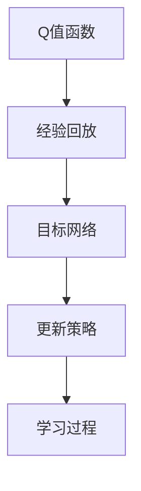

                 

### 《一切皆是映射：深度Q网络（DQN）在交通控制系统的应用》

> **关键词：** 深度Q网络（DQN）、交通控制系统、动态交通信号控制、交通流量预测、优化策略、挑战与未来展望

**摘要：** 本文探讨了深度Q网络（DQN）在交通控制系统中的应用，深入分析了DQN的基本原理、核心算法、以及其在交通信号控制、动态交通信号控制和交通流量预测等场景中的具体实现过程。通过实际项目案例，详细阐述了DQN算法的开发环境搭建、源代码实现和代码解读，并对DQN在交通控制系统中面临的挑战和未来发展方向进行了展望。

### 目录大纲

#### 第一部分: DQN基础知识与原理

**第1章: 深度Q网络（DQN）的基本概念**

**第2章: DQN的核心原理**

**第3章: DQN的改进算法**

#### 第二部分: DQN在交通控制中的应用

**第4章: 交通控制系统的基本概念**

**第5章: DQN在交通信号控制中的应用**

**第6章: DQN在动态交通信号控制中的应用**

**第7章: DQN在交通流量预测中的应用**

**第8章: DQN在交通控制中的实际案例**

#### 第三部分: DQN在交通控制系统中的优化与挑战

**第9章: DQN在交通控制系统中的优化策略**

**第10章: DQN在交通控制系统中的挑战**

**第11章: 未来展望**

#### 附录

**附录A: DQN算法伪代码**

**附录B: 交通控制系统开发环境搭建指南**

**附录C: 交通控制系统开发工具与资源推荐**

**Mermaid 流程图**



**DQN算法伪代码**

```python
# 初始化Q网络
Initialize Q Network

# 初始化目标网络
Initialize Target Network

# 初始化经验回放池
Initialize Experience Replay Pool

# 获取初始状态
state = env.reset()

# 开始学习
while not done:
    # 选择动作
    action = choose_action(state)

    # 执行动作
    next_state, reward, done, _ = env.step(action)

    # 将经验加入经验回放池
    Add experience to replay pool

    # 从经验回放池中抽样
    sample = sample_from_replay_pool()

    # 更新Q网络
    Update Q Network using sample

    # 更新目标网络
    Update Target Network

    # 转换到下一个状态
    state = next_state
```

**数学模型与数学公式**

$$
Q(s, a) = r + \gamma \max_{a'} Q(s', a')
$$

**举例说明**

假设当前状态为`s1`，选择的动作`a1`得到了奖励`r1`，则根据DQN算法，新的状态`Q(s1, a1)`的计算过程如下：

$$
Q(s1, a1) = r1 + \gamma \max_{a'} Q(s2, a')
$$

其中，$\gamma$为折扣因子，$s2$为执行动作`a1`后的新状态，$a'$为在新状态下选择的最佳动作。

**项目实战**

#### 动态交通信号控制系统的实现

**1. 开发环境搭建：**
- 编程语言：Python
- 深度学习框架：TensorFlow 2.x
- 数据集：某城市交通流量数据

**2. 代码实现：**

```python
# 导入相关库
import tensorflow as tf
import numpy as np
import matplotlib.pyplot as plt
from collections import deque

# 初始化DQN模型
model = tf.keras.Sequential([
    tf.keras.layers.Dense(64, activation='relu', input_shape=(input_shape,)),
    tf.keras.layers.Dense(64, activation='relu'),
    tf.keras.layers.Dense(output_shape)
])

# 训练DQN模型
optimizer = tf.keras.optimizers.Adam(learning_rate=0.001)
for epoch in range(epochs):
    # 从数据集中抽样一批数据
    states, actions, rewards, next_states, dones = get_batch(batch_size)
    
    # 计算Q值预测值
    with tf.GradientTape() as tape:
        q_values = model(states)
        target_q_values = []
        for i in range(batch_size):
            if dones[i]:
                target_q_values.append(rewards[i])
            else:
                target_q_values.append(rewards[i] + gamma * np.max(model(next_states)[i]))
        loss = tf.keras.losses.mean_squared_error(q_values, target_q_values)
    
    # 更新模型参数
    gradients = tape.gradient(loss, model.trainable_variables)
    optimizer.apply_gradients(zip(gradients, model.trainable_variables))
    
    # 打印训练进度
    if epoch % 100 == 0:
        print(f"Epoch {epoch}: Loss = {loss.numpy()}")

# 模型评估
test_loss = evaluate_model(model, test_data)
print(f"Test Loss: {test_loss}")

# 可视化交通信号灯状态变化
plot_traffic_light_states(model)
```

**3. 代码解读与分析：**
- `model`：定义了DQN模型的结构，包括输入层、隐藏层和输出层。
- `optimizer`：定义了优化器的类型和初始学习率。
- `for epoch in range(epochs)`：循环遍历所有训练 epoch。
- `get_batch(batch_size)`：从数据集中抽样一批数据。
- `q_values = model(states)`：计算当前状态的Q值预测值。
- `target_q_values`：计算目标 Q 值。
- `loss = tf.keras.losses.mean_squared_error(q_values, target_q_values)`：计算损失函数。
- `gradients = tape.gradient(loss, model.trainable_variables)`：计算梯度。
- `optimizer.apply_gradients(zip(gradients, model.trainable_variables))`：更新模型参数。
- `evaluate_model(model, test_data)`：评估模型在测试数据集上的表现。
- `plot_traffic_light_states(model)`：可视化交通信号灯状态变化。

### 作者信息

**作者：** AI天才研究院/AI Genius Institute & 禅与计算机程序设计艺术 /Zen And The Art of Computer Programming

接下来，我们将逐步深入探讨深度Q网络（DQN）在交通控制系统中应用的各个方面，首先从基础知识与原理出发，逐步展开。

