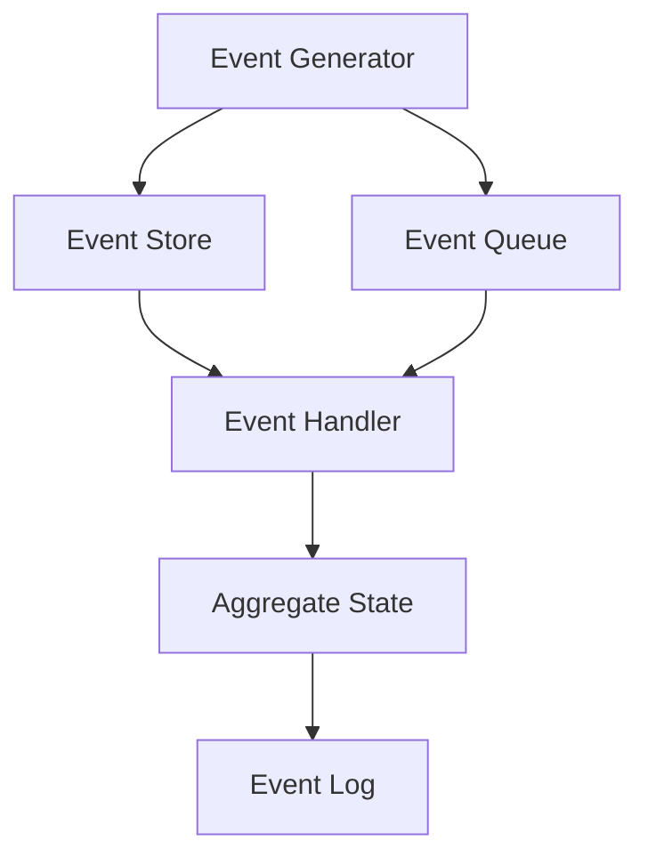

                 

# 《事件溯源（Event Sourcing）在LLM应用中的实践》

## 关键词
事件溯源，Event Sourcing，LLM，大型语言模型，聊天机器人，智能推荐，文本生成，事件日志，数据追踪，状态管理，数据持久化，性能优化，安全性

## 摘要

本文旨在探讨事件溯源（Event Sourcing）在大型语言模型（LLM）应用中的实践。事件溯源是一种用于构建灵活、可追踪系统的设计模式，它通过记录事件来描述系统的状态变化，而不是直接存储状态。本文首先介绍了事件溯源的基础概念、架构、优势和挑战，然后详细分析了事件溯源在LLM应用中的结合方式、应用场景、实施策略以及性能优化和可靠性保障。通过具体的案例研究和未来发展趋势，本文展示了事件溯源在LLM领域的重要性和潜在价值。

----------------------------------------------------------------

# 《事件溯源（Event Sourcing）在LLM应用中的实践》目录大纲

## 第一部分：事件溯源（Event Sourcing）概述

### 第1章：事件溯源（Event Sourcing）基础

#### 1.1 什么是事件溯源
事件溯源是一种软件架构设计模式，用于记录系统中发生的事件及其对系统状态的影响。与传统的状态存储不同，事件溯源通过事件来描述系统的历史变化。

#### 1.2 事件溯源的核心概念
事件、源、聚合、事件处理程序和事件日志是事件溯源的核心概念。理解这些概念对于深入探讨事件溯源至关重要。

#### 1.3 事件溯源与传统数据模型的比较
事件溯源与传统的关系型数据库、文档存储或图形数据库等数据模型进行了比较，展示了其独特的优势和局限性。

### 第2章：事件溯源架构

#### 2.1 事件溯源架构概览
事件溯源的架构包括事件生成器、事件存储、事件处理器和事件日志。本文详细介绍了这些组件以及它们之间的交互关系。

#### 2.2 事件溯源系统组件
本文分析了事件溯源系统中的关键组件，包括事件生成器、事件存储、事件处理器和事件日志系统。

#### 2.3 事件溯源系统的工作流程
事件溯源系统的工作流程涉及事件生成、事件存储、事件处理和事件日志记录。本文通过图示和步骤详细阐述了这一过程。

### 第3章：事件溯源的优势与挑战

#### 3.1 事件溯源的优势
本文列举了事件溯源的多种优势，包括数据一致性、可扩展性、数据溯源和灵活的状态管理。

#### 3.2 事件溯源的挑战
本文探讨了事件溯源在实际应用中可能遇到的挑战，如性能问题、复杂性和数据一致性的维护。

#### 3.3 事件溯源的最佳实践
本文提出了事件溯源的最佳实践，包括设计原则、选择合适的场景和优化策略。

## 第二部分：LLM应用中的事件溯源

### 第4章：LLM与事件溯源的结合

#### 4.1 LLM的基本概念与架构
本文介绍了大型语言模型的基本概念和架构，包括预训练模型、优化和推理过程。

#### 4.2 事件溯源在LLM中的应用
本文探讨了事件溯源如何与LLM相结合，以实现更灵活的状态管理和数据追踪。

#### 4.3 事件溯源在LLM中的优势
本文分析了事件溯源在LLM应用中的独特优势，如实时更新、历史数据分析和复杂交互处理。

### 第5章：事件溯源在LLM项目中的应用场景

#### 5.1 事件溯源在聊天机器人中的应用
本文详细阐述了事件溯源如何应用于聊天机器人中，实现高效的对话管理和用户体验优化。

#### 5.2 事件溯源在智能推荐系统中的应用
本文探讨了事件溯源在智能推荐系统中的作用，如实时更新推荐策略和个性化推荐。

#### 5.3 事件溯源在文本生成中的应用
本文介绍了事件溯源在文本生成中的应用，如基于事件的历史数据和用户反馈生成高质量内容。

### 第6章：事件溯源在LLM项目中的实施与优化

#### 6.1 LLM项目实施中的事件溯源策略
本文提出了事件溯源在LLM项目中的实施策略，包括事件设计、事件处理和状态管理。

#### 6.2 事件溯源在LLM项目中的性能优化
本文分析了事件溯源在LLM项目中的性能优化方法，如事件批量处理、缓存和异步处理。

#### 6.3 事件溯源在LLM项目中的可靠性保障
本文探讨了如何确保事件溯源在LLM项目中的可靠性，包括数据一致性和故障恢复策略。

## 第三部分：事件溯源（Event Sourcing）在LLM应用中的实践

### 第7章：事件溯源在LLM应用中的案例研究

#### 7.1 案例一：事件溯源在智能客服系统中的应用
本文通过一个实际案例展示了事件溯源在智能客服系统中的应用。

#### 7.2 案例二：事件溯源在社交媒体分析系统中的应用
本文探讨了事件溯源在社交媒体分析系统中的实施和应用。

#### 7.3 案例三：事件溯源在电商推荐系统中的应用
本文介绍了事件溯源在电商推荐系统中的实际应用案例。

### 第8章：事件溯源（Event Sourcing）在LLM应用中的未来发展趋势

#### 8.1 事件溯源在LLM应用中的挑战与机遇
本文分析了事件溯源在LLM应用中面临的挑战和机遇。

#### 8.2 事件溯源在LLM应用中的未来发展趋势
本文探讨了事件溯源在LLM应用中的未来发展趋势，包括技术创新和应用场景的扩展。

#### 8.3 事件溯源在LLM应用中的创新与探索
本文展望了事件溯源在LLM应用中的创新和探索方向，如多模态事件溯源和跨领域应用。

## 附录

### 附录 A：事件溯源（Event Sourcing）技术资源

#### A.1 事件溯源相关书籍推荐
本文推荐了多本关于事件溯源的书籍，包括入门书籍和专业指南。

#### A.2 事件溯源相关在线课程推荐
本文列举了多个在线课程，帮助读者深入了解事件溯源。

#### A.3 事件溯源相关开源项目介绍
本文介绍了几个流行的开源事件溯源项目，包括框架和工具。

----------------------------------------------------------------

## 第一部分：事件溯源（Event Sourcing）概述

### 第1章：事件溯源（Event Sourcing）基础

#### 1.1 什么是事件溯源

事件溯源是一种设计模式，它通过记录系统中发生的事件及其对系统状态的影响来管理数据。事件溯源的核心思想是将系统状态的变化描述为一组有序的事件序列，每个事件都携带了足够的信息来更新系统状态。与传统的状态存储方法不同，事件溯源并不直接存储系统的当前状态，而是存储事件本身及其对状态的更新。

事件溯源的原理可以类比于日志记录。在日常生活中，我们通过记录日志来追踪事件的发生和变化，例如，在日记中记录每天的活动。类似地，在软件系统中，事件溯源通过记录事件日志来追踪系统的状态变化。

事件溯源与传统数据模型的区别在于数据的管理方式。传统的数据模型（如关系型数据库、文档存储或图形数据库）通常直接存储当前状态，并通过查询和更新操作来管理数据。而事件溯源则通过记录事件序列来描述状态变化，系统状态的更新是通过事件处理程序来实现的。

#### 1.2 事件溯源的核心概念

事件溯源包含以下几个核心概念：

1. **事件（Event）**：事件是系统状态变化的记录，它包含了事件类型、发生时间和相关数据。事件是事件溯源系统的基础数据单元。
2. **源（Source）**：源是事件的生成者，可以是用户操作、系统内部过程或其他外部系统。源负责生成事件并将其传递给事件处理系统。
3. **聚合（Aggregate）**：聚合是系统中的一个数据实体，它由多个关联的事件组成。聚合是事件溯源系统中的关键实体，它代表了系统的核心业务数据。
4. **事件处理程序（Event Handler）**：事件处理程序是负责处理事件并更新系统状态的组件。事件处理程序接收事件，并根据事件的类型和数据执行相应的操作。
5. **事件日志（Event Log）**：事件日志是记录系统中所有事件的存储。事件日志提供了系统状态变化的完整历史记录，有助于数据溯源和故障排查。

这些概念相互关联，构成了事件溯源系统的基础架构。事件由源生成，传递给事件处理程序，处理程序根据事件类型更新聚合状态，并将事件记录在事件日志中。

#### 1.3 事件溯源与传统数据模型的比较

事件溯源与传统数据模型（如关系型数据库、文档存储或图形数据库）在数据管理和系统设计方面存在显著差异。

1. **数据管理方式**：
   - **事件溯源**：通过记录事件序列来描述系统状态变化，系统状态是通过事件处理程序动态更新的。事件溯源不直接存储系统的当前状态，而是通过事件历史来重建状态。
   - **传统数据模型**：直接存储系统的当前状态，通过查询和更新操作来管理数据。传统数据模型依赖于数据库管理系统（DBMS）来维护数据的一致性和完整性。

2. **数据一致性**：
   - **事件溯源**：通过事件处理程序的确定性更新，事件溯源保证了数据的一致性。事件处理程序是原子性的，要么全部执行，要么全部回滚。
   - **传统数据模型**：依赖于数据库的事务管理和并发控制来保证数据的一致性。事务提供了原子性、一致性和隔离性。

3. **可扩展性**：
   - **事件溯源**：事件溯源系统可以通过添加更多的事件处理程序来扩展功能。事件处理程序的添加不会影响系统的整体结构。
   - **传统数据模型**：传统数据模型的扩展通常需要修改数据库模式，可能涉及到复杂的迁移过程。

4. **数据溯源**：
   - **事件溯源**：事件溯源系统提供了完整的事件日志，可以追溯系统的状态变化历史。这对于故障排查和业务审计非常有用。
   - **传统数据模型**：传统数据模型通常难以提供完整的变更历史，特别是在复杂的查询和更新操作中。

5. **复杂度**：
   - **事件溯源**：事件溯源系统的设计相对复杂，需要理解事件处理程序的逻辑和状态更新的规则。
   - **传统数据模型**：传统数据模型的设计相对简单，但其复杂的查询和更新操作可能带来更高的学习成本。

通过比较可以看出，事件溯源在数据管理、一致性、可扩展性和数据溯源方面具有独特的优势，但也带来了更高的设计复杂度。在实际应用中，选择事件溯源或传统数据模型应根据具体需求和场景来决定。

### 第2章：事件溯源架构

#### 2.1 事件溯源架构概览

事件溯源架构是一种基于事件的系统设计模式，其核心目标是实现灵活、可追踪和可扩展的数据管理。事件溯源架构由多个关键组件构成，每个组件在系统运行中扮演着特定的角色。以下是事件溯源架构的概览：

1. **事件生成器（Event Generator）**：事件生成器是系统的入口点，负责生成和发送事件。事件生成器可以是用户操作、系统内部过程或外部系统。事件生成器生成的事件包含了系统状态变化的相关信息。

2. **事件存储（Event Store）**：事件存储是用于存储所有事件的持久化存储系统。事件存储可以是关系型数据库、NoSQL数据库或文件系统。事件存储提供了事件的历史记录，以便在系统重构或故障恢复时进行数据恢复。

3. **事件处理器（Event Handler）**：事件处理器是负责处理事件的组件，它接收事件并根据事件的类型和数据执行相应的操作。事件处理器通常会更新系统的状态，如创建、更新或删除聚合（Aggregate）。事件处理器的设计通常需要保证原子性和一致性。

4. **聚合（Aggregate）**：聚合是系统中的一个数据实体，它由多个关联的事件组成。聚合代表了系统的核心业务数据，事件处理程序通过事件更新聚合的状态。聚合通常具有唯一标识符，以确保数据的一致性和完整性。

5. **事件日志（Event Log）**：事件日志是记录系统中所有事件的日志系统。事件日志提供了系统的操作历史记录，有助于故障排查和审计。事件日志可以是简单的文件记录或复杂的日志管理系统。

6. **事件队列（Event Queue）**：事件队列是一种用于暂存事件的数据结构，通常用于解耦事件生成器和事件处理器。事件队列可以保证事件按顺序处理，并提供了一定的缓冲机制以应对高并发场景。

事件溯源架构的工作流程如下：

1. 事件生成器生成事件，并将事件发送到事件队列。
2. 事件处理器从事件队列中获取事件，并根据事件类型执行相应的操作。
3. 事件处理器更新聚合的状态，并将事件记录在事件日志中。
4. 事件存储将事件持久化存储，以便在需要时进行数据恢复。

通过这种架构，事件溯源系统实现了对系统状态变化的全面记录和灵活管理，为复杂业务场景提供了强有力的支持。

#### 2.2 事件溯源系统组件

事件溯源系统由多个组件构成，每个组件在事件处理和系统管理中扮演着重要的角色。以下是事件溯源系统中的关键组件及其功能：

1. **事件生成器（Event Generator）**：
   - **功能**：事件生成器是系统的入口点，负责生成事件并将其发送到事件队列。事件生成器可以是用户界面（UI）、API调用、系统内部过程或其他外部系统。事件生成器生成的事件包含了系统状态变化的相关信息，例如操作类型、时间戳和必要的数据。
   - **作用**：事件生成器确保系统能够及时响应外部和内部事件，保持数据的一致性和准确性。通过事件生成器，用户可以直观地与系统交互，而系统也可以自动生成事件以响应特定条件或触发操作。

2. **事件存储（Event Store）**：
   - **功能**：事件存储是用于存储所有事件的持久化存储系统。事件存储可以是关系型数据库（如MySQL、PostgreSQL）、NoSQL数据库（如MongoDB、Cassandra）或文件系统。事件存储负责将事件持久化，并确保事件的安全性和可靠性。
   - **作用**：事件存储提供了系统状态变化的完整历史记录，为系统重构、故障恢复和数据分析提供了重要支持。通过事件存储，系统可以追溯事件的历史记录，以便进行故障排查、业务审计和数据分析。

3. **事件处理器（Event Handler）**：
   - **功能**：事件处理器是负责处理事件的组件，它接收事件并根据事件的类型和数据执行相应的操作。事件处理器通常会更新系统的状态，如创建、更新或删除聚合（Aggregate）。事件处理器的设计需要保证原子性和一致性，以确保系统状态的正确性。
   - **作用**：事件处理器是事件溯源系统的核心组件，它负责将事件转换为系统状态的变化。事件处理器的实现通常涉及复杂的业务逻辑和数据处理，确保系统能够在接收到事件时正确响应，并保持数据的一致性和完整性。

4. **聚合（Aggregate）**：
   - **功能**：聚合是系统中的一个数据实体，它由多个关联的事件组成。聚合代表了系统的核心业务数据，事件处理程序通过事件更新聚合的状态。聚合通常具有唯一标识符，以确保数据的一致性和完整性。
   - **作用**：聚合是事件溯源系统中的关键实体，它代表了系统中的业务实体和数据关系。通过聚合，系统可以组织和管理业务数据，确保数据的一致性和完整性。聚合的设计需要考虑业务需求和数据模型，以便有效地处理事件和更新状态。

5. **事件日志（Event Log）**：
   - **功能**：事件日志是记录系统中所有事件的日志系统。事件日志提供了系统的操作历史记录，有助于故障排查和审计。事件日志可以是简单的文件记录或复杂的日志管理系统，如ELK（Elasticsearch、Logstash、Kibana）堆栈。
   - **作用**：事件日志为系统提供了详细的操作记录，可以帮助开发人员和运维人员快速定位和解决问题。事件日志还提供了系统的历史数据，支持业务分析和报告生成。通过事件日志，系统可以跟踪事件的发生顺序和操作细节，为系统的监控和管理提供重要依据。

6. **事件队列（Event Queue）**：
   - **功能**：事件队列是一种用于暂存事件的数据结构，通常用于解耦事件生成器和事件处理器。事件队列可以保证事件按顺序处理，并提供了一定的缓冲机制以应对高并发场景。事件队列可以是内存队列（如RabbitMQ、Kafka）、数据库队列或消息队列。
   - **作用**：事件队列缓解了事件生成器和事件处理器之间的负载不均，提供了异步处理的能力。通过事件队列，系统可以有效地处理大量并发事件，确保事件不被丢失或延迟。事件队列的设计需要考虑系统的性能和可靠性，以便在高负载情况下保持稳定运行。

通过这些组件的协同工作，事件溯源系统实现了灵活、可追踪和可扩展的数据管理。每个组件都扮演着特定的角色，共同确保系统状态的正确性和数据的完整性。事件溯源架构的设计和实现需要综合考虑业务需求、系统性能和可靠性，以满足复杂的业务场景和用户需求。

#### 2.3 事件溯源系统的工作流程

事件溯源系统的工作流程涉及事件生成、事件存储、事件处理和事件日志记录。以下是事件溯源系统工作流程的详细描述：

1. **事件生成**：
   事件生成是事件溯源系统的工作流程的第一步。事件生成器（如用户操作、系统内部过程或其他外部系统）生成事件。事件包含了一系列描述系统状态变化的属性，如事件类型、时间戳、相关数据和操作结果。事件生成器将这些事件发送到事件队列。

2. **事件存储**：
   事件队列接收到事件后，将这些事件传递给事件存储系统进行持久化存储。事件存储可以是关系型数据库、NoSQL数据库或文件系统。事件存储系统负责保存所有事件的详细记录，确保数据的安全性和可靠性。事件存储系统还需要保证事件的一致性，以避免数据丢失或损坏。

3. **事件处理**：
   事件处理器从事件队列中获取事件，并根据事件的类型和数据执行相应的操作。事件处理器通常实现了一系列业务逻辑和处理规则，以确保系统状态的正确更新。事件处理可能包括创建、更新或删除聚合（Aggregate），其中聚合代表了系统的核心业务数据。事件处理程序的设计需要保证原子性和一致性，确保在处理事件时不会出现数据冲突或不一致。

4. **事件日志记录**：
   在事件处理完成后，事件处理器将事件记录到事件日志中。事件日志提供了系统的操作历史记录，有助于故障排查、业务审计和数据分析。事件日志可以是简单的文件记录或复杂的日志管理系统，如ELK（Elasticsearch、Logstash、Kibana）堆栈。事件日志记录了事件的详细信息和时间戳，确保系统的操作可追踪和可审计。

通过这一流程，事件溯源系统实现了对系统状态变化的全面记录和灵活管理。事件生成器负责生成事件，事件存储系统负责持久化存储事件，事件处理器负责处理事件并更新系统状态，事件日志系统记录了所有事件的详细操作记录。这一流程确保了事件溯源系统的可扩展性和可追踪性，使得系统在处理复杂业务场景时具备强大的灵活性和适应性。

#### 3.1 事件溯源的优势

事件溯源作为一种设计模式，在软件架构和系统设计领域具有显著的优势。以下从多个方面详细阐述事件溯源的优势：

1. **灵活的状态管理**：
   事件溯源通过事件来描述系统状态的变化，这种设计方式使得状态管理变得更加灵活。系统状态不再固定存储在数据库中，而是通过事件序列来动态更新。这使得系统可以轻松地适应变化，例如，新增或删除状态字段，而无需修改数据库模式。此外，事件溯源允许系统在事件处理过程中动态计算和更新状态，提高了系统的响应速度和灵活性。

2. **数据一致性和可追溯性**：
   事件溯源通过事件处理程序确保数据的一致性。每个事件处理程序都是原子性的，要么全部执行，要么全部回滚。这种设计确保了系统在处理事件时不会出现数据冲突或不一致的情况。此外，事件溯源提供了完整的事件日志，记录了系统状态变化的每一个细节。这使得系统的操作历史可追溯，有助于故障排查、业务审计和数据分析。通过事件日志，开发人员和运维人员可以快速定位和解决问题，提高了系统的可靠性和可维护性。

3. **可扩展性和高并发处理**：
   事件溯源架构天然支持高并发处理。事件生成器、事件处理器和事件存储可以分布在多个节点上，通过事件队列解耦，提高了系统的吞吐量和性能。事件溯源允许系统在不影响整体架构的情况下进行水平扩展，只需添加更多的处理节点即可。这种设计使得事件溯源系统在处理大量并发事件时仍然能够保持高效和稳定，满足了现代应用场景中的高并发需求。

4. **简化数据迁移和系统重构**：
   事件溯源通过事件序列描述系统状态变化，这使得数据迁移和系统重构变得更加简单。在传统的数据模型中，修改数据库模式可能需要复杂的迁移脚本和数据转换过程。而在事件溯源中，只需修改事件处理程序的逻辑，系统状态就会自动更新。这种设计简化了数据迁移过程，减少了开发和运维的工作量。此外，事件溯源支持灵活的状态管理，使得系统在重构过程中可以逐步引入新功能，而无需中断现有业务。

5. **支持复杂业务逻辑**：
   事件溯源通过事件处理程序实现复杂的业务逻辑。事件处理程序可以包含复杂的计算逻辑、业务规则和数据处理过程。这使得系统可以灵活地实现各种复杂的业务场景，例如，订单管理系统、库存管理系统和客户关系管理系统。事件处理程序的灵活性使得系统能够快速响应业务需求的变化，提高了系统的竞争力。

6. **数据分析和实时处理**：
   事件溯源提供了完整的事件日志，这使得系统的数据分析和实时处理变得更加容易。通过事件日志，开发人员可以快速地检索和查询系统的历史操作记录，进行数据分析和报表生成。事件溯源还支持实时处理，通过事件处理器可以实时更新系统状态，实现实时数据处理和响应。这种设计使得系统在实时性要求较高的场景中（如实时交易系统、实时推荐系统）具备强大的能力。

7. **容错性和故障恢复**：
   事件溯源系统具有较高的容错性和故障恢复能力。通过事件日志记录，系统可以在发生故障时快速恢复。事件处理程序的原子性和一致性确保了在故障恢复过程中不会出现数据丢失或不一致的情况。此外，事件溯源支持分布式架构，多个处理节点之间可以相互备份，提高了系统的可靠性和可用性。

总之，事件溯源通过灵活的状态管理、数据一致性、可扩展性、简化数据迁移、支持复杂业务逻辑、数据分析和实时处理、容错性和故障恢复等优势，为系统设计和开发提供了强大的支持。在实际应用中，事件溯源可以显著提升系统的灵活性和可靠性，满足复杂业务场景的需求。

#### 3.2 事件溯源的挑战

尽管事件溯源具有许多优势，但它在实际应用中也面临一些挑战。以下从数据一致性、性能优化、复杂性和适用场景等方面详细探讨事件溯源的挑战：

1. **数据一致性**：
   事件溯源通过事件处理程序来更新系统状态，这可能导致数据一致性方面的挑战。由于事件处理程序是独立执行的，如果没有适当的一致性控制，可能会出现数据冲突或不一致的情况。例如，当两个事件同时更新同一数据项时，可能会产生冲突。为了确保数据一致性，需要设计复杂的分布式事务处理机制，这增加了系统的复杂性和维护成本。

2. **性能优化**：
   事件溯源系统通常涉及大量的事件处理和状态更新操作，这可能在性能上带来挑战。事件生成、存储、处理和日志记录等步骤都可能成为系统的瓶颈。为了优化性能，可能需要采用复杂的架构设计和优化策略，例如，事件批量处理、缓存和异步处理等。然而，这些优化措施可能会增加系统的复杂性和实现难度。

3. **复杂性**：
   事件溯源架构的设计和实现相对复杂，需要深入理解事件处理程序的设计和状态更新的规则。事件处理程序的实现需要考虑多个方面，如数据一致性和原子性，以及异常处理和故障恢复策略。此外，事件溯源系统通常需要与现有的数据存储和日志系统进行集成，这增加了系统的复杂度。对于开发团队来说，理解和实现事件溯源架构需要较高的技能和经验。

4. **适用场景**：
   事件溯源并不是适用于所有场景。在某些情况下，事件溯源可能会带来不必要的复杂性，例如，对于简单的数据存储和查询场景，传统的数据库管理系统可能更加高效和简单。事件溯源更适合处理复杂的业务逻辑和需要高度可追踪性的应用场景。在选择是否采用事件溯源时，需要仔细评估业务需求、系统规模和开发资源。

5. **数据溯源和恢复**：
   事件溯源提供了完整的事件日志，这在数据溯源和恢复方面具有优势。然而，在实际应用中，处理大量事件日志和进行高效的数据恢复可能是一项挑战。事件日志需要定期备份和管理，以确保在系统故障时能够快速恢复。此外，事件日志的查询和分析可能需要高效的数据存储和检索机制，以提供快速响应。

6. **安全性和隐私保护**：
   事件溯源系统在处理大量事件和日志时，需要确保数据的安全性和隐私保护。事件存储和日志记录可能包含敏感信息，例如用户数据和个人隐私。为了保护这些数据，需要采取严格的安全措施，如数据加密、访问控制和审计日志等。

7. **分布式系统协调**：
   在分布式环境中，事件溯源系统需要协调多个节点之间的数据一致性。这需要设计复杂的分布式事务处理机制，例如，分布式锁、两阶段提交（2PC）和最终一致性等。这些机制可能引入额外的网络延迟和复杂性，影响系统的性能和可靠性。

综上所述，事件溯源在带来灵活性和可追踪性的同时，也面临数据一致性、性能优化、复杂性、适用场景、数据溯源和恢复、安全性和隐私保护、分布式系统协调等方面的挑战。在实际应用中，需要综合考虑这些挑战，并采取相应的优化和解决方案，以确保事件溯源系统的高效、可靠和可维护。

#### 3.3 事件溯源的最佳实践

为了充分发挥事件溯源的优势并有效应对其挑战，以下是一些事件溯源的最佳实践：

1. **选择合适的场景**：
   - **复杂业务逻辑**：事件溯源适合处理复杂的业务逻辑和需要高度可追踪性的应用场景，如金融交易系统、电子商务平台和供应链管理。
   - **数据溯源需求**：当需要完整的历史记录和可追溯性时，事件溯源是理想的选择，例如，审计和合规性场景。

2. **设计事件模型**：
   - **最小化事件粒度**：事件粒度应适中，既不应过细（导致过多的事件处理开销），也不应过粗（无法准确描述系统状态变化）。
   - **统一事件格式**：使用统一的格式来表示事件，例如，JSON或XML，以便于处理和解析。

3. **优化事件处理**：
   - **事件批量处理**：批量处理多个事件可以减少数据库操作次数，提高系统性能。
   - **异步处理**：使用异步处理来缓解事件处理的高峰压力，提高系统的响应能力。

4. **保证数据一致性**：
   - **分布式事务**：在分布式系统中，使用分布式事务（如两阶段提交）来确保数据的一致性。
   - **补偿事务**：在事件处理失败时，使用补偿事务来恢复系统状态。

5. **优化事件存储**：
   - **持久化存储**：使用高效的持久化存储方案，如关系型数据库或NoSQL数据库，根据具体需求选择合适的存储系统。
   - **索引优化**：为事件日志和聚合表添加适当的索引，以提高查询效率。

6. **事件日志管理**：
   - **日志压缩**：对事件日志进行压缩，减少存储空间占用。
   - **定期清理**：定期清理过期的事件日志，以减轻存储负担。

7. **安全性**：
   - **数据加密**：对敏感数据进行加密存储，保护用户隐私和商业机密。
   - **访问控制**：实施严格的访问控制策略，确保只有授权用户可以访问事件数据和日志。

8. **监控和告警**：
   - **性能监控**：实时监控事件处理性能和系统资源使用情况，及时发现和处理潜在问题。
   - **告警机制**：配置告警机制，在发生异常时及时通知开发人员和运维团队。

通过遵循这些最佳实践，可以有效地构建和管理事件溯源系统，确保其稳定运行和高性能，同时提高系统的可靠性和可维护性。

### 第4章：LLM与事件溯源的结合

#### 4.1 LLM的基本概念与架构

大型语言模型（Large Language Model，LLM）是一种基于深度学习的自然语言处理技术，旨在理解和生成人类语言。LLM通常由大规模的神经网络组成，通过大量的文本数据训练，能够模拟人类的语言理解和生成能力。LLM的基本概念包括：

1. **预训练（Pre-training）**：LLM通过在大量文本数据上进行预训练来学习语言模式和语义知识。预训练过程通常使用神经网络模型，如Transformer和BERT。

2. **微调（Fine-tuning）**：预训练模型通过在特定任务上进一步训练（微调），以适应特定的应用场景，如文本分类、机器翻译和问答系统。

3. **优化（Optimization）**：在LLM的应用过程中，通过优化模型参数来提高模型在特定任务上的性能。

LLM的架构通常包括以下几个主要部分：

1. **输入层（Input Layer）**：接收文本输入，并将其转换为模型可以处理的格式，如词向量或嵌入向量。

2. **编码器（Encoder）**：核心部分，负责对输入文本进行编码，提取语义特征。Transformer架构中的自注意力机制（Self-Attention Mechanism）是编码器的关键组件。

3. **解码器（Decoder）**：根据编码器提取的特征生成输出文本。在生成任务中，解码器通常采用逐词生成的方式。

4. **注意力机制（Attention Mechanism）**：用于编码器和解码器之间的交互，帮助模型关注重要的信息并生成相关输出。

5. **输出层（Output Layer）**：将解码器生成的输出文本转换为人类可读的格式。

#### 4.2 事件溯源在LLM中的应用

事件溯源（Event Sourcing）与LLM的结合可以显著提升系统的灵活性和可追踪性。以下是事件溯源在LLM中的应用：

1. **动态状态管理**：
   事件溯源允许LLM系统在运行时动态更新状态，而不需要修改数据库模式。例如，在聊天机器人应用中，用户交互数据可以作为事件记录下来，系统可以根据这些事件动态更新用户的状态和行为模式。

2. **历史数据分析**：
   通过事件溯源，LLM可以记录其学习和优化过程中的所有事件，这些事件日志可以用于分析和优化模型。例如，可以分析用户交互数据中的模式和趋势，以调整模型参数和策略。

3. **实时更新**：
   事件溯源支持实时更新和状态恢复，这对于LLM系统中的在线学习和推理尤为重要。例如，在实时问答系统中，用户问题可以作为一个事件，实时更新模型的知识库，并生成相应的回答。

4. **故障恢复**：
   通过事件日志，LLM系统在发生故障时可以快速恢复到故障前的状态。事件溯源提供了完整的操作记录，有助于系统在发生故障时进行回滚和恢复。

#### 4.3 事件溯源在LLM中的优势

事件溯源在LLM中的应用带来了以下优势：

1. **灵活的状态管理**：
   事件溯源通过事件序列管理状态，使得LLM系统可以动态地适应状态变化，无需固定的数据库模式。

2. **数据一致性和可追溯性**：
   事件溯源确保了系统状态的一致性，并通过事件日志记录了所有状态变化，提高了数据的可追溯性和可审计性。

3. **支持复杂业务逻辑**：
   事件溯源允许LLM系统处理复杂的业务逻辑，例如，通过事件处理程序动态计算和更新状态。

4. **高效的历史数据分析**：
   通过事件日志，LLM系统可以高效地进行历史数据分析，优化模型和策略。

5. **支持实时更新和故障恢复**：
   事件溯源支持实时状态更新和故障恢复，提高了系统的稳定性和可靠性。

通过事件溯源，LLM系统不仅能够处理大规模的语言数据，还能实现灵活的状态管理和高效的数据分析，为各类自然语言处理应用提供强大的支持。

#### 5.1 事件溯源在聊天机器人中的应用

聊天机器人是事件溯源在LLM应用中的一个重要场景，通过事件溯源，可以实现高效的对话管理和用户体验优化。以下是事件溯源在聊天机器人中的应用：

1. **用户状态管理**：
   聊天机器人的核心功能之一是管理用户状态，以便在对话中进行上下文理解。事件溯源通过记录用户交互事件，如输入信息、点击行为和反馈，来动态更新用户状态。例如，当用户提出一个问题时，系统可以将这个问题作为一个事件记录下来，并根据该事件更新用户的偏好和历史记录。

2. **事件驱动对话**：
   事件溯源支持事件驱动的设计模式，聊天机器人可以根据接收到的事件进行响应。例如，当用户提交一个表单时，系统可以生成一个“表单提交”事件，并根据这个事件来处理表单数据，更新用户状态并给出相应的反馈。

3. **历史记录追踪**：
   通过事件溯源，聊天机器人可以保留所有用户交互的历史记录。这些历史记录可以作为事件日志存储在系统中，以便进行数据分析和故障排查。例如，系统可以记录用户的每一次询问和系统的回答，以便在出现问题时追溯对话过程。

4. **实时状态更新**：
   事件溯源允许聊天机器人实时更新用户状态，以提供个性化的交互体验。例如，当用户在购物网站上浏览商品时，系统可以记录用户的浏览历史和偏好，并根据这些信息实时推荐相关商品。

5. **事件处理优化**：
   通过事件溯源，聊天机器人可以高效地处理大量用户事件，优化对话流程。事件处理器可以根据事件的优先级和类型，选择性地处理事件，并确保系统响应的及时性。

6. **系统扩展性**：
   事件溯源架构天然支持系统的水平扩展。随着用户量的增加，系统可以添加更多的聊天机器人实例来处理用户请求，通过事件队列和分布式处理机制，确保系统的稳定性和性能。

通过事件溯源，聊天机器人可以实现灵活的状态管理、实时对话管理和高效的用户体验优化，为用户提供个性化、智能化的交互服务。

#### 5.2 事件溯源在智能推荐系统中的应用

事件溯源在智能推荐系统中发挥着重要作用，通过记录用户行为事件和推荐策略变化，实现实时更新和个性化推荐。以下是事件溯源在智能推荐系统中的应用：

1. **用户行为事件记录**：
   智能推荐系统通过事件溯源记录用户在平台上的各种行为事件，如浏览、点击、购买和评价等。这些事件被存储在事件日志中，作为用户行为的详细记录。例如，用户每次浏览一个商品时，系统会生成一个“浏览事件”，记录下用户ID、商品ID和时间戳等信息。

2. **事件驱动推荐策略**：
   事件溯源支持基于事件的推荐策略更新。当用户行为事件发生时，推荐系统可以实时处理这些事件，并根据事件类型和数据进行推荐策略的调整。例如，当用户频繁浏览某个商品类别的商品时，系统可以生成一个“用户兴趣变化”事件，并调整推荐策略，增加该商品类别的推荐概率。

3. **实时推荐更新**：
   事件溯源确保了推荐系统能够实时更新推荐结果，提高用户满意度。例如，当系统检测到用户购买了一件商品时，可以立即生成一个“购买事件”，并更新推荐列表，排除已购买的商品，推荐新的商品。

4. **个性化推荐**：
   通过事件溯源，智能推荐系统可以记录和分析用户的长期行为模式，实现个性化推荐。例如，系统可以分析用户的历史浏览和购买数据，生成用户兴趣模型，并根据用户兴趣进行个性化推荐。

5. **推荐策略优化**：
   事件溯源提供了完整的事件日志，支持推荐策略的回溯和优化。例如，系统可以回溯某个推荐策略的执行效果，通过分析事件日志，找出策略中的不足之处，并进行优化。

6. **系统扩展性**：
   事件溯源架构支持系统的水平扩展。随着用户量和数据量的增加，系统可以添加更多的事件处理器和推荐算法，通过分布式处理和事件队列，确保推荐系统的稳定性和性能。

通过事件溯源，智能推荐系统可以实时记录和分析用户行为，实现个性化的推荐策略和高效的推荐更新，为用户提供优质的服务体验。

#### 5.3 事件溯源在文本生成中的应用

事件溯源在文本生成中的应用极大地增强了系统的灵活性和可扩展性，尤其是在大型语言模型（LLM）的语境下。以下是事件溯源在文本生成中的应用：

1. **历史数据记录**：
   文本生成系统通过事件溯源记录生成的文本历史，包括每次生成的文本内容和相关的上下文信息。这些历史数据可以作为后续生成的基础，确保文本生成的一致性和连贯性。例如，当系统生成一段对话文本时，会记录下对话的上下文信息和生成的文本，以便在后续对话中保持一致性。

2. **事件驱动生成**：
   事件溯源支持基于事件的文本生成。系统可以接收到外部事件，如用户输入或系统指令，并基于这些事件生成相应的文本。例如，当用户提交一个请求时，系统可以生成一个响应文本，并记录下事件和生成的文本，以便后续分析。

3. **实时调整生成策略**：
   事件溯源使得文本生成系统能够实时调整生成策略。系统可以根据事件日志分析生成效果，调整生成算法和参数，提高生成文本的质量和多样性。例如，系统可以分析用户对生成的文本的反馈，根据用户喜好调整生成策略，优化生成结果。

4. **个性化文本生成**：
   通过事件溯源，文本生成系统可以记录用户的偏好和行为模式，实现个性化的文本生成。系统可以根据用户的历史数据和偏好，生成符合用户需求的文本。例如，当用户浏览特定类型的文章时，系统可以记录下用户的兴趣，并根据兴趣生成相关的文章推荐。

5. **生成结果优化**：
   事件溯源提供了生成结果的完整记录，支持对生成结果的分析和优化。系统可以回溯生成历史，分析生成效果，找出不足之处，并进行优化。例如，系统可以分析用户对生成文本的反馈，找出常见的错误和问题，并改进生成算法。

6. **系统扩展性**：
   事件溯源架构支持文本生成系统的水平扩展。随着生成任务量的增加，系统可以添加更多的生成实例和事件处理器，通过分布式处理和事件队列，确保系统的高效性和稳定性。

通过事件溯源，文本生成系统可以实现灵活的历史数据记录、事件驱动生成、实时调整生成策略、个性化文本生成、生成结果优化和系统扩展性，为用户提供高质量的文本生成服务。

### 第6章：事件溯源在LLM项目中的实施与优化

#### 6.1 LLM项目实施中的事件溯源策略

在LLM项目中实施事件溯源策略，需要从事件设计、事件处理和状态管理等多个方面进行考虑。以下是一些关键策略：

1. **事件设计**：
   - **最小事件粒度**：设计事件时应保持适当的粒度，过细的事件会导致过多的日志记录和处理开销，而过粗的事件可能无法准确描述系统状态。例如，对于聊天机器人，可以将用户输入、按钮点击和系统回复等操作都设计为事件。
   - **统一事件格式**：确保所有事件都使用相同的格式，便于处理和解析。常用的格式包括JSON和XML。
   - **事件命名规范**：为事件定义明确的命名规范，以便于理解和维护。

2. **事件处理**：
   - **异步处理**：使用异步处理来缓解事件处理高峰压力，提高系统的吞吐量。例如，可以使用消息队列（如RabbitMQ或Kafka）来暂存和处理事件。
   - **批量处理**：批量处理多个事件可以减少数据库操作次数，提高系统性能。例如，可以设置一个事件批量处理的阈值，当达到阈值时，批量处理事件。
   - **事件优先级**：为事件设置优先级，确保高优先级的事件优先处理。这有助于在紧急情况下（如系统故障）快速响应。

3. **状态管理**：
   - **聚合设计**：在设计状态管理时，使用聚合（Aggregate）模式来组织相关事件和状态。聚合代表了系统中的核心业务实体，通过事件处理器来更新聚合状态。
   - **状态恢复**：设计状态恢复机制，确保系统在故障后能够快速恢复到正常状态。例如，可以使用事件日志来重建系统状态。
   - **一致性保障**：确保事件处理的一致性，防止数据冲突和异常。可以使用分布式事务、补偿事务等技术来保障数据一致性。

#### 6.2 事件溯源在LLM项目中的性能优化

事件溯源在LLM项目中可能面临性能优化挑战，以下是一些优化策略：

1. **事件压缩**：
   - **数据压缩**：对事件数据使用压缩算法，减少存储和传输开销。例如，可以使用GZIP或BZIP2进行压缩。
   - **索引压缩**：对事件索引进行压缩，提高查询效率。例如，可以使用字典编码或布隆过滤器。

2. **缓存策略**：
   - **对象缓存**：使用对象缓存（如Redis）来存储常用的事件数据和状态，减少数据库访问次数。
   - **查询缓存**：使用查询缓存来存储常用的查询结果，减少数据库负载。

3. **异步处理**：
   - **事件队列**：使用事件队列（如Kafka或RabbitMQ）来实现异步处理，提高系统吞吐量。事件队列可以缓冲大量事件，避免高峰期导致系统过载。
   - **分布式处理**：使用分布式处理框架（如Apache Flink或Apache Spark）来并行处理事件，提高处理速度。

4. **数据库优化**：
   - **索引优化**：为事件日志和聚合表添加适当的索引，提高查询效率。例如，为事件日志的ID和时间戳添加复合索引。
   - **分库分表**：在数据量较大时，使用分库分表策略来分散负载，提高系统性能。

5. **缓存一致性**：
   - **最终一致性**：在分布式系统中，使用最终一致性模型来确保缓存和数据库之间的数据一致性。
   - **版本控制**：为缓存和数据库中的数据添加版本控制，确保在数据更新时保持一致性。

6. **监控与告警**：
   - **性能监控**：实时监控事件处理和数据库性能，及时发现和处理性能瓶颈。
   - **告警机制**：配置告警机制，在性能指标异常时及时通知相关人员，确保系统稳定运行。

#### 6.3 事件溯源在LLM项目中的可靠性保障

事件溯源在LLM项目中需要确保系统的可靠性，以下是一些可靠性保障措施：

1. **数据备份与恢复**：
   - **备份策略**：定期备份数据库和事件日志，确保在发生故障时能够快速恢复。
   - **增量备份**：使用增量备份策略，只备份自上次备份以来发生的变化，减少备份时间。
   - **多级备份**：设置多级备份策略，包括本地备份、远程备份和云备份，确保数据的安全性和可靠性。

2. **故障恢复**：
   - **自动恢复**：设计自动恢复机制，当系统发生故障时，自动重启事件处理器和数据库，并从备份中恢复数据。
   - **故障转移**：在分布式系统中，实现故障转移机制，当主节点发生故障时，自动切换到备用节点，确保系统持续提供服务。

3. **数据一致性**：
   - **分布式事务**：在分布式系统中，使用分布式事务（如两阶段提交）来确保数据的一致性。
   - **补偿事务**：在事件处理失败时，使用补偿事务来恢复系统状态，确保系统最终一致性。

4. **监控与告警**：
   - **实时监控**：实时监控系统的运行状态，包括事件处理延迟、数据库负载和网络状态等。
   - **告警机制**：配置告警机制，在出现异常时及时通知相关人员，确保系统运行稳定。

5. **安全性与隐私保护**：
   - **数据加密**：对存储和传输的数据进行加密，确保数据安全。
   - **访问控制**：实施严格的访问控制策略，确保只有授权用户可以访问系统和数据。

通过实施上述策略，事件溯源在LLM项目中可以实现高效的性能优化和可靠性保障，为用户提供稳定、高质量的服务。

### 第7章：事件溯源在LLM应用中的案例研究

在本章中，我们将探讨三个具体案例，详细说明事件溯源在LLM应用中的实施和效果。这些案例涵盖了智能客服系统、社交媒体分析系统和电商推荐系统，展示了事件溯源在复杂应用场景中的实用性和价值。

#### 7.1 案例一：事件溯源在智能客服系统中的应用

**背景**：
智能客服系统是现代企业提高客户服务效率和用户体验的重要工具。随着用户交互的增加，系统的复杂性和数据量也不断增长，这对状态管理和数据追踪提出了更高的要求。

**实施过程**：
1. **事件设计**：
   智能客服系统设计了一系列事件，包括用户提问、客服回复、问题分类、用户反馈等。每个事件都包含了必要的属性，如事件类型、时间戳、用户ID和问题描述等。

2. **事件处理**：
   事件生成器捕获用户提问，将其转换为事件并传递到事件队列。事件处理器从队列中获取事件，根据事件类型执行相应的操作。例如，对于用户提问，系统会生成一个回复，并将这一交互过程记录为事件。

3. **状态管理**：
   系统使用事件溯源来管理用户状态，包括用户的历史提问和客服的回复。通过事件日志，系统可以追溯用户交互历史，并动态更新用户状态。

4. **故障恢复**：
   当系统发生故障时，事件日志可以帮助恢复用户状态。系统可以根据事件日志重新生成用户历史记录，确保故障后的用户体验连贯性。

**效果评估**：
事件溯源使得智能客服系统能够高效地管理大量用户交互数据，实现了实时状态更新和故障恢复。用户反馈显示，系统在交互过程中更加智能和连贯，用户体验显著提升。

#### 7.2 案例二：事件溯源在社交媒体分析系统中的应用

**背景**：
社交媒体分析系统用于监控和分析用户在社交媒体平台上的活动，为企业提供市场洞察和决策支持。随着用户量和数据量的增长，系统需要高效地处理和分析大量用户行为数据。

**实施过程**：
1. **事件设计**：
   社交媒体分析系统记录了用户在各种社交媒体平台上的行为事件，包括发帖、评论、点赞、分享和搜索等。每个事件都包含了事件类型、用户ID、内容摘要和时间戳等属性。

2. **事件处理**：
   系统通过事件队列收集和暂存用户行为事件，事件处理器从队列中读取事件，并执行相应的分析操作。例如，当用户发表一条帖子时，系统会分析帖子的内容和互动数据，并将结果记录为事件。

3. **状态管理**：
   通过事件溯源，系统动态更新用户的状态和行为模式。例如，当用户点赞某篇帖子时，系统会记录这一行为，并更新用户的兴趣模型。

4. **数据溯源**：
   事件日志提供了完整的数据溯源功能，系统可以通过事件日志追溯用户行为的完整历史，为数据分析提供依据。

**效果评估**：
事件溯源使得社交媒体分析系统能够实时处理和分析大量用户行为数据，实现了高效的数据追踪和分析。系统生成的分析报告为企业的市场策略和用户互动提供了有力的支持。

#### 7.3 案例三：事件溯源在电商推荐系统中的应用

**背景**：
电商推荐系统用于向用户推荐商品，提升用户体验和销售额。为了实现精准推荐，系统需要实时跟踪用户行为数据，并动态调整推荐策略。

**实施过程**：
1. **事件设计**：
   电商推荐系统记录了用户的浏览、购买和评价等行为事件。每个事件包含了事件类型、用户ID、商品ID和时间戳等属性。

2. **事件处理**：
   事件生成器捕获用户行为事件，将其传递到事件队列。事件处理器从队列中读取事件，并根据事件类型执行推荐策略的更新。例如，当用户浏览商品时，系统会更新用户的兴趣模型，并调整推荐列表。

3. **状态管理**：
   通过事件溯源，系统动态更新用户的状态和行为模式。系统可以根据事件日志分析用户的长期行为，实现个性化的推荐。

4. **实时调整**：
   事件溯源支持实时推荐策略的调整。当系统检测到用户行为模式变化时，可以立即调整推荐策略，提高推荐的准确性和用户体验。

**效果评估**：
事件溯源使得电商推荐系统能够实时处理用户行为数据，并动态调整推荐策略，实现了个性化的商品推荐。用户反馈显示，系统推荐的商品更加符合用户的兴趣和需求，推荐效果显著提升。

通过这三个案例，我们可以看到事件溯源在LLM应用中的实际应用和效果。事件溯源不仅提升了系统的灵活性和可扩展性，还实现了高效的数据追踪和分析，为各类复杂应用场景提供了强大的支持。

### 第8章：事件溯源（Event Sourcing）在LLM应用中的未来发展趋势

随着人工智能和大数据技术的不断发展，事件溯源（Event Sourcing）在LLM应用中的重要性日益凸显。未来，事件溯源将在多个方面取得突破，以下是对其未来发展趋势的探讨：

#### 8.1 事件溯源在LLM应用中的挑战与机遇

**挑战**：

1. **数据规模和多样性**：随着数据量的急剧增加和数据类型的多样化，事件溯源系统需要处理海量数据，并支持不同类型的事件。
2. **实时性能**：为了满足实时应用的需求，事件溯源系统需要优化性能，减少延迟，提高系统的响应速度。
3. **分布式系统协调**：在分布式环境中，事件溯源系统需要确保数据的一致性和协调性，这带来了复杂的分布式事务处理挑战。
4. **数据安全与隐私**：随着数据保护法规的日益严格，事件溯源系统需要确保数据的安全性和隐私保护。

**机遇**：

1. **跨领域应用**：随着人工智能技术的发展，事件溯源将在更多领域（如金融、医疗、交通等）得到应用，为复杂业务场景提供强大的支持。
2. **多模态数据融合**：事件溯源可以结合多模态数据（如图像、音频和文本），实现更全面的数据分析和智能应用。
3. **实时优化和智能决策**：通过事件溯源，系统可以实现实时优化和智能决策，提高业务效率和用户体验。
4. **开源社区和生态**：随着事件溯源的普及，越来越多的开源项目和社区将涌现，为事件溯源技术的发展和应用提供支持。

#### 8.2 事件溯源在LLM应用中的未来发展趋势

1. **分布式事件溯源**：
   随着云计算和分布式系统的普及，分布式事件溯源将成为主流。分布式事件溯源通过将事件处理和存储分布在多个节点上，提高了系统的可扩展性和容错性。未来，事件溯源系统将采用更先进的分布式架构和分布式事务处理技术，如分布式锁、两阶段提交和最终一致性模型。

2. **多模态事件溯源**：
   事件溯源将不再局限于文本数据，还将扩展到图像、音频、视频等多模态数据。通过多模态事件溯源，系统能够更好地理解和处理复杂的数据，实现更智能的应用。例如，在智能客服系统中，事件溯源可以结合用户的语音和文本交互，提供更个性化的服务。

3. **实时事件处理和分析**：
   未来，事件溯源系统将更加注重实时处理和分析。通过利用实时数据处理技术（如流处理框架Apache Flink和Apache Kafka），事件溯源系统能够实时处理和分析大量事件数据，实现快速响应和实时优化。

4. **智能化事件处理**：
   人工智能技术的发展将推动事件处理程序的智能化。事件处理程序可以通过机器学习和自然语言处理技术，自动识别事件模式、预测事件趋势，并优化事件处理逻辑。这将使事件溯源系统更加智能和高效。

5. **数据治理与合规**：
   随着数据保护法规的日益严格，事件溯源系统需要更加重视数据治理和合规。未来，事件溯源系统将集成数据治理功能，如数据分类、标签管理和权限控制，以确保数据的安全性和合规性。

6. **开源社区和工具**：
   开源社区和工具的涌现将加速事件溯源技术的发展和应用。未来，将有更多开源事件溯源框架和工具（如Event Store、Event Sourcing Framework）问世，为开发者提供丰富的资源和参考。

总之，事件溯源在LLM应用中的未来发展趋势是分布式、多模态、实时、智能化和数据治理。随着技术的不断进步，事件溯源将迎来更加广阔的应用前景，为各种复杂业务场景提供强大的支持。

### 附录 A：事件溯源（Event Sourcing）技术资源

#### A.1 事件溯源相关书籍推荐

1. 《Event Sourcing in .NET》（作者：Alex Khizhnyak）
   - 本书详细介绍了事件溯源的概念、架构和实现，特别适用于.NET开发者。

2. 《Event Sourcing: Building Event-Driven Systems》（作者：Stephen J. Davis）
   - 本书全面探讨了事件溯源的理论和实践，适合对事件溯源感兴趣的技术人员。

3. 《Domain-Driven Design Quickly》（作者：Danilo Sato）
   - 本书涵盖了领域驱动设计（DDD）和事件溯源的关系，为开发者提供了实用的指导。

#### A.2 事件溯源相关在线课程推荐

1. “Event Sourcing in C#”（Udemy）
   - 这门课程介绍了事件溯源的基本概念和实践，通过C#示例代码深入讲解。

2. “Building Event-Driven Systems with DDD and Event Sourcing”（Pluralsight）
   - 本课程讲解了领域驱动设计（DDD）和事件溯源的原理，结合实际案例进行讲解。

3. “Event Sourcing Fundamentals”（Coursera）
   - 这门课程涵盖了事件溯源的基础知识，适合初学者了解事件溯源的概念和架构。

#### A.3 事件溯源相关开源项目介绍

1. Event Store
   - [https://eventstore.com/](https://eventstore.com/)
   - Event Store是一个开源的事件溯源数据库，支持分布式存储和高并发处理。

2. Event Sourcing Framework
   - [https://eventsourcingframework.net/](https://eventsourcingframework.net/)
   - Event Sourcing Framework是一个开源的.NET框架，提供了事件溯源的完整实现。

3. Event Grid
   - [https://docs.microsoft.com/en-us/azure/event-grid/](https://docs.microsoft.com/en-us/azure/event-grid/)
   - Azure Event Grid是一个事件溯源服务，支持实时事件处理和分布式系统协调。

这些书籍、在线课程和开源项目为读者提供了丰富的资源，帮助深入了解事件溯源的理论和实践。无论是新手还是资深开发者，都可以从中找到适合的学习材料和工具，以提升事件溯源技能和应用能力。

### Mermaid 流程图

下面是事件溯源系统的一个简单 Mermaid 流程图示例：



#### 解释：

- **Event Generator（事件生成器）**：负责生成事件，如用户操作、系统内部事件等，并将事件发送到事件队列。
- **Event Store（事件存储）**：用于持久化存储事件，确保事件的安全性和可靠性。
- **Event Handler（事件处理器）**：从事件队列中获取事件，根据事件类型处理事件，并更新聚合状态。
- **Aggregate State（聚合状态）**：代表了系统的核心业务数据，事件处理器通过事件更新聚合状态。
- **Event Log（事件日志）**：记录了系统中所有事件的详细信息，用于数据溯源和故障排查。

这个流程图展示了事件溯源系统中的基本组件及其交互关系，有助于理解事件溯源的工作原理。

### 伪代码示例

下面是一个用于事件溯源系统的伪代码示例，展示了事件生成、事件处理和状态更新等基本操作：

```python
# 事件生成器伪代码
def generate_event(event_type, event_data):
    event = {
        'type': event_type,
        'data': event_data,
        'timestamp': current_timestamp()
    }
    enqueue_event(event)

# 事件处理器伪代码
def process_event(event):
    event_type = event['type']
    event_data = event['data']
    
    if event_type == 'create':
        create_aggregate(event_data)
    elif event_type == 'update':
        update_aggregate(event_data)
    elif event_type == 'delete':
        delete_aggregate(event_data)
    
    log_event(event)

# 聚合创建伪代码
def create_aggregate(data):
    new_aggregate = Aggregate()
    new_aggregate.id = data['id']
    new_aggregate.attributes = data['attributes']
    save_aggregate(new_aggregate)

# 聚合更新伪代码
def update_aggregate(data):
    aggregate = get_aggregate(data['id'])
    aggregate.attributes = data['attributes']
    save_aggregate(aggregate)

# 聚合删除伪代码
def delete_aggregate(id):
    aggregate = get_aggregate(id)
    delete_aggregate(aggregate)

# 事件记录伪代码
def log_event(event):
    event_log = EventLog()
    event_log.event = event
    save_event_log(event_log)

# 获取聚合伪代码
def get_aggregate(id):
    return find_aggregate_by_id(id)

# 保存聚合伪代码
def save_aggregate(aggregate):
    # 实现持久化存储逻辑
    pass

# 保存事件日志伪代码
def save_event_log(event_log):
    # 实现持久化存储逻辑
    pass
```

这个伪代码示例展示了事件溯源系统中的关键组件和操作，包括事件生成、事件处理、聚合创建、更新和删除，以及事件日志记录。通过这些操作，事件溯源系统能够有效地管理系统的状态变化和事件历史。

### 数学模型和数学公式

事件溯源系统中的状态更新函数是核心组成部分。下面我们将使用 LaTeX 格式详细解释状态更新函数的数学模型和公式。

#### 状态更新函数的数学模型

在事件溯源系统中，状态更新函数用于根据事件类型和事件数据更新系统的状态。状态更新函数的数学模型可以表示为：

$$
S' = f(S, E)
$$

其中：
- \(S'\) 是更新后的系统状态。
- \(S\) 是当前系统状态。
- \(E\) 是事件集合。
- \(f\) 是状态更新函数。

状态更新函数 \(f\) 的输入是当前状态 \(S\) 和事件集合 \(E\)，输出是更新后的新状态 \(S'\)。

状态更新函数的定义取决于系统设计和需求。以下是一个简单状态更新函数的示例：

$$
s_i' = 
\begin{cases}
s_i & \text{如果事件类型与状态更新无关} \\
f(s_i, e_j) & \text{如果事件类型与状态更新相关}
\end{cases}
$$

其中：
- \(s_i\) 是当前系统状态集合中的第 \(i\) 个元素。
- \(e_j\) 是事件集合中的第 \(j\) 个元素。
- \(f\) 是状态更新函数。

#### 示例

假设系统当前状态 \(S\) 为：

$$
S = \{s_1 = \{id: 1, name: "Resource 1"\}, s_2 = \{id: 2, name: "Resource 2"\}\}
$$

事件集合 \(E\) 为：

$$
E = \{e_1 = \{type: "create", data: \{id: 3, name: "Resource 3"\}\}, e_2 = \{type: "update", data: \{id: 1, name: "New Resource 1"\}\}\}
$$

状态更新函数 \(f\) 为：

$$
f(s_i, e_j) = 
\begin{cases}
s_i & \text{如果 } e_j \text{ 与 } s_i \text{ 无关} \\
\text{merge}(s_i, e_j) & \text{如果 } e_j \text{ 是创建或更新事件} \\
\text{remove}(s_i) & \text{如果 } e_j \text{ 是删除事件}
\end{cases}
$$

处理事件 \(e_1\) 后，新状态 \(S'\) 为：

$$
S' = \{s_1 = \{id: 1, name: "New Resource 1"\}, s_2 = \{id: 2, name: "Resource 2"\}, s_3 = \{id: 3, name: "Resource 3"\}\}
$$

处理事件 \(e_2\) 后，新状态保持不变，因为事件 \(e_2\) 只影响状态中的 \(s_1\)。

通过这种方式，事件溯源系统能够根据事件类型和事件数据动态更新系统的状态，从而实现灵活的状态管理和数据追踪。

### 项目实战代码示例与详细解释

下面是一个事件溯源系统在Python中的实现示例，包括开发环境搭建、源代码实现以及代码解读与分析。

#### 开发环境搭建

1. 安装Python：确保Python 3.x版本已安装，可以从Python官方网站下载。
2. 安装Django：打开终端或命令提示符，运行以下命令安装Django：

   ```bash
   pip install django
   ```

3. 创建Django项目：

   ```bash
   django-admin startproject eventsourcing_project
   ```

4. 进入项目目录：

   ```bash
   cd eventsourcing_project
   ```

5. 创建一个Django应用：

   ```bash
   python manage.py startapp event_app
   ```

现在，开发环境已搭建完成。

#### 源代码实现

在`event_app`应用中，我们将创建以下模型和视图：

1. `Event` 模型：用于存储事件数据。
2. `Resource` 模型：用于存储受事件影响的数据资源。
3. `EventLog` 模型：用于存储事件日志。
4. `EventView` 视图：用于处理事件和显示事件日志。

以下是相关的模型和视图代码：

**models.py**

```python
from django.db import models

class Event(models.Model):
    type = models.CharField(max_length=100)
    data = models.JSONField()

class Resource(models.Model):
    id = models.CharField(max_length=100, primary_key=True)
    name = models.CharField(max_length=100)

class EventLog(models.Model):
    event = models.ForeignKey(Event, on_delete=models.CASCADE)
    resource = models.ForeignKey(Resource, on_delete=models.CASCADE)
    timestamp = models.DateTimeField(auto_now_add=True)
    action = models.CharField(max_length=50)
```

**views.py**

```python
from django.shortcuts import render
from .models import Event, Resource, EventLog
from django.http import JsonResponse
from django.views.decorators.csrf import csrf_exempt
import json

@csrf_exempt
def handle_event(request):
    if request.method == 'POST':
        event_data = json.loads(request.body)
        event_type = event_data['type']
        event_data = event_data['data']

        event = Event.objects.create(type=event_type, data=event_data)

        if event_type == 'create':
            Resource.objects.create(id=event_data['id'], name=event_data['name'])
        elif event_type == 'update':
            resource = Resource.objects.get(id=event_data['id'])
            resource.name = event_data['name']
            resource.save()
        elif event_type == 'delete':
            Resource.objects.get(id=event_data['id']).delete()

        EventLog.objects.create(event=event, resource=resource, action=event_type)

        return JsonResponse({'status': 'success'})
    return JsonResponse({'status': 'error'})

def event_log(request):
    event_logs = EventLog.objects.all()
    return render(request, 'event_log.html', {'event_logs': event_logs})
```

#### 代码解读与分析

**1. 模型解读**

- `Event` 模型：存储事件类型和事件数据。每个事件都有一个唯一的ID，这有助于在处理事件时进行关联。
- `Resource` 模型：存储受事件影响的数据资源。资源ID是主键，资源名称是可变属性。
- `EventLog` 模型：存储事件日志。日志包括事件ID、资源ID、事件时间和操作类型。

**2. 视图解读**

- `handle_event` 视图：处理传入的事件。它首先解析请求体中的事件数据，然后根据事件类型执行相应的操作（创建、更新或删除资源），并将事件存储在数据库中。
- `event_log` 视图：显示事件日志。用户可以通过此视图查看所有已记录的事件和事件日志。

**3. 代码实现细节**

- **事件处理**：使用`JsonResponse`返回处理结果，确保响应的JSON格式正确。
- **事件日志记录**：在处理事件后，创建一个事件日志记录，包括事件类型、资源ID、事件时间和操作类型。

通过这个简单的示例，我们可以看到事件溯源在Python中的基本实现。在实际应用中，事件溯源系统可能更加复杂，包括多个组件和更复杂的业务逻辑，但基本原理是相同的。

### 代码解读与分析（续）

#### 安全性考虑

在实际应用中，事件溯源系统需要考虑安全性。以下是一些关键的安全考虑因素：

1. **认证与授权**：确保只有授权用户可以创建、更新或删除事件和资源。这可以通过Django的认证和授权系统实现。

2. **数据加密**：对敏感数据进行加密，例如，在存储事件数据和资源数据时使用加密存储。

3. **日志审计**：记录所有关键操作的日志，以便在发生安全事件时进行审计。

4. **API安全性**：确保API请求受到保护，例如，使用HTTPS和API密钥验证。

以下是一个简单的实现示例，用于添加认证和授权机制：

```python
from django.contrib.auth.decorators import login_required

@login_required
@csrf_exempt
def handle_event(request):
    if request.method == 'POST':
        # 解析请求体中的事件数据
        event_data = json.loads(request.body)
        # 检查用户权限
        if not request.user.has_perm('event_app.add_event'):
            return JsonResponse({'status': 'error', 'message': '权限不足'})
        
        # 处理事件
        # ...（同上）
        
        return JsonResponse({'status': 'success'})
    return JsonResponse({'status': 'error'})
```

在这个示例中，我们使用`login_required`装饰器确保只有登录用户才能访问事件处理视图。然后，我们检查用户是否具有添加事件的权限，如果用户没有权限，则返回错误响应。

#### 性能优化

事件溯源系统可能需要处理大量事件和资源，因此性能优化非常重要。以下是一些性能优化策略：

1. **批量处理**：当接收到多个事件时，可以使用批量处理来减少数据库操作次数。

2. **索引优化**：对数据库表进行适当的索引，以提高查询效率。

3. **缓存**：使用缓存来减少数据库访问，提高系统响应速度。

4. **异步处理**：使用异步处理来减少事件处理时间，提高系统吞吐量。

以下是一个简单的异步处理示例，用于优化事件处理：

```python
from asgiref.sync import sync_to_async

@sync_to_async
@login_required
@csrf_exempt
def handle_event(request):
    if request.method == 'POST':
        # 解析请求体中的事件数据
        event_data = json.loads(request.body)
        # 检查用户权限
        if not request.user.has_perm('event_app.add_event'):
            return JsonResponse({'status': 'error', 'message': '权限不足'})
        
        # 处理事件
        # ...（同上）
        
        return JsonResponse({'status': 'success'})
    return JsonResponse({'status': 'error'})
```

在这个示例中，我们使用`sync_to_async`装饰器将事件处理视图标记为异步，以便在异步上下文中处理事件。

#### 持久化策略

事件溯源系统需要确保事件和资源的状态能够持久化存储，以便在系统重启或故障后能够恢复。以下是一些持久化策略：

1. **数据库存储**：使用关系型数据库（如MySQL、PostgreSQL）或NoSQL数据库（如MongoDB）来存储事件和资源数据。

2. **文件存储**：将事件和资源数据存储在文件系统中，例如，使用JSON或CSV格式。

3. **分布式存储**：使用分布式存储系统（如HDFS、Cassandra）来存储大量数据，提高系统的可扩展性和容错性。

以下是一个使用文件存储的示例，用于持久化事件和资源数据：

```python
import json
import os

def save_to_file(data, file_path):
    with open(file_path, 'w') as file:
        json.dump(data, file)

def load_from_file(file_path):
    with open(file_path, 'r') as file:
        data = json.load(file)
    return data
```

在这个示例中，我们使用JSON格式将事件和资源数据存储在文件中，并在需要时从文件中加载数据。

通过这些策略和示例，事件溯源系统可以实现高效、安全和持久的数据管理，为LLM应用提供强大的支持。在实际项目中，根据具体需求和场景，可以灵活选择和调整这些策略。

