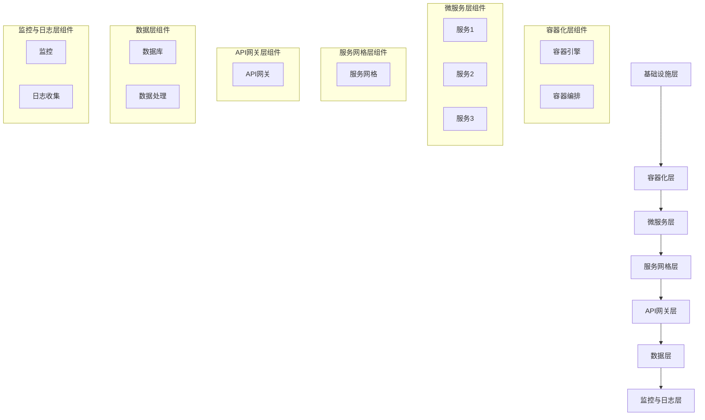
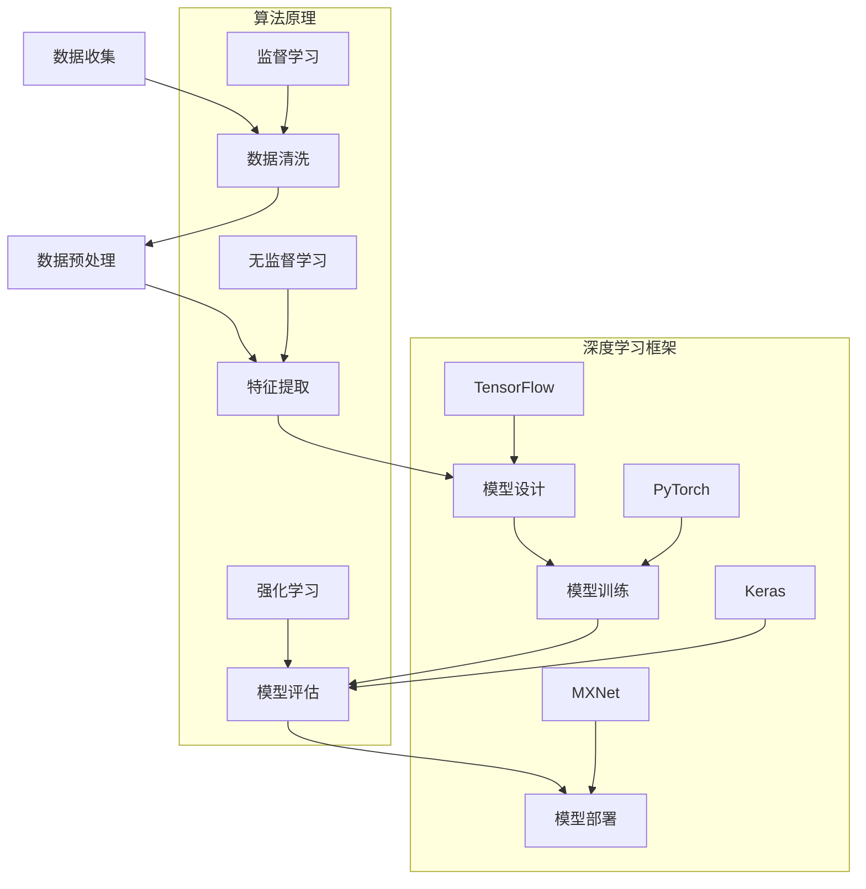

                 

## 文章标题

在当今快速发展的技术时代，云原生AI平台成为实现高效、可扩展和可靠的AI服务的核心技术。本文将全面探讨云原生AI平台的开发、部署与运维，旨在为读者提供一份系统、详尽的技术指南。

## 关键词

云原生，AI平台，开发，部署，运维，容器化，微服务，服务网格，模型训练，模型监控，安全性

## 摘要

本文将深入解析云原生AI平台的概念、架构、开发流程、部署策略以及运维与安全性。通过详细的步骤和实际案例，读者将了解如何构建、部署和维护一个高效、可靠的云原生AI平台。

----------------------------------------------------------------

# 目录大纲

## 第一部分：云原生AI平台概述

### 第1章：云原生AI简介

#### 1.1 云原生技术的定义与优势

#### 1.2 云原生与AI的关系

#### 1.3 云原生AI平台的重要性

### 第2章：云原生AI平台架构

#### 2.1 云原生AI平台架构概述

#### 2.2 容器化与微服务

#### 2.3 服务网格与API网关

### 第3章：云原生AI开发环境

#### 3.1 开发环境搭建

#### 3.2 云原生开发工具

#### 3.3 实践案例：开发一个简单的云原生AI服务

## 第二部分：云原生AI平台开发

### 第4章：核心算法与模型

#### 4.1 机器学习算法基础

#### 4.2 深度学习框架简介

#### 4.3 AI模型开发流程

### 第5章：数据预处理与数据处理

#### 5.1 数据收集与存储

#### 5.2 数据清洗与预处理

#### 5.3 实践案例：数据预处理流程

### 第6章：模型训练与优化

#### 6.1 模型训练原理

#### 6.2 模型优化策略

#### 6.3 实践案例：模型训练与优化

### 第7章：模型部署与监控

#### 7.1 模型部署流程

#### 7.2 模型监控与维护

#### 7.3 实践案例：模型部署与监控

## 第三部分：云原生AI平台部署与运维

### 第8章：云原生AI平台部署

#### 8.1 部署策略与方案

#### 8.2 部署环境配置

#### 8.3 实践案例：云原生AI平台部署

### 第9章：云原生AI平台运维

#### 9.1 运维流程与工具

#### 9.2 日志管理与监控

#### 9.3 实践案例：云原生AI平台运维

### 第10章：云原生AI平台安全性

#### 10.1 安全性原则与策略

#### 10.2 数据安全与隐私保护

#### 10.3 实践案例：云原生AI平台安全性

## 附录

### 附录 A：云原生AI开发工具与资源

#### A.1 常用深度学习框架

#### A.2 开发工具与平台

#### A.3 资源与文献推荐

## 第1章：云原生AI简介

### 1.1 云原生技术的定义与优势

#### 1.1.1 云原生技术的定义

云原生技术（Cloud Native Technologies）指的是一种利用云计算的优势，构建和运行应用程序的方法。这种方法强调自动化、可扩展性和敏捷性，以快速适应不断变化的需求。

- **云原生应用特点**:
  - **基于微服务架构**：应用程序分解为独立的、小型且松散耦合的服务。
  - **容器化**：应用程序部署在容器中，确保一致性和可移植性。
  - **动态管理**：利用自动化工具进行资源分配和管理。
  - **持续集成与持续部署（CI/CD）**：实现快速开发和持续交付。

#### 1.1.2 云原生技术的优势

云原生技术为应用程序的构建和运行带来了许多优势。

- **高可用性**：通过分布式架构和冗余设计，确保应用程序的持续可用性。
- **可扩展性**：根据需求动态调整资源，实现水平扩展。
- **敏捷性**：快速部署和迭代，适应市场变化。
- **成本效益**：优化资源使用，降低运营成本。

### 1.2 云原生与AI的关系

云原生技术与人工智能（AI）有着紧密的联系。

- **AI在云原生中的应用**:
  - **大规模数据处理**：利用云原生平台的弹性扩展能力，处理海量数据。
  - **实时推理**：通过容器化和微服务架构，实现快速、高效的AI推理。
  - **模型迭代**：利用持续集成与持续部署，快速迭代AI模型。

- **云原生对AI发展的推动作用**:
  - **资源高效利用**：云原生平台提供高性能计算资源，加速AI模型训练。
  - **分布式训练**：利用分布式计算技术，提升AI模型训练速度。
  - **边缘计算**：结合边缘计算，实现实时、低延迟的AI服务。

### 1.3 云原生AI平台的重要性

云原生AI平台对于实现高效、可扩展和可靠的AI服务至关重要。

- **提高开发效率**：云原生平台提供自动化工具和模板，简化开发流程。
- **确保服务质量**：通过容器化和微服务架构，实现高可用性和弹性伸缩。
- **降低运营成本**：优化资源使用，降低硬件和维护成本。
- **支持创新应用**：提供灵活的架构，支持多样化的AI应用场景。

### 1.4 本章小结

云原生AI平台是当前技术发展的趋势，它结合了云原生技术和AI的强大优势，为开发者提供了高效、可靠和灵活的解决方案。在接下来的章节中，我们将深入探讨云原生AI平台的架构、开发流程、部署与运维，以及安全性，帮助读者全面了解这一技术领域。

## 第2章：云原生AI平台架构

### 2.1 云原生AI平台架构概述

云原生AI平台架构的设计目标是实现高效、可扩展和可靠的AI服务。该架构通常包括以下几个层次：

- **基础设施层**：提供计算资源、存储和网络资源，如虚拟机、容器集群和分布式存储系统。
- **容器化层**：使用容器（如Docker）封装应用程序及其依赖，确保应用程序的一致性和可移植性。
- **微服务层**：将应用程序分解为独立的、小型且松散耦合的服务，提高系统的灵活性和可维护性。
- **服务网格层**：提供动态服务发现、负载均衡和故障转移等功能，实现微服务之间的高效通信。
- **API网关层**：作为应用程序的前端入口，提供统一接口和路由策略，简化客户端访问。
- **数据层**：包括数据存储、数据处理和数据安全等组件，支持AI模型的数据输入和输出。
- **监控与日志层**：提供实时监控、日志收集和报警等功能，确保系统的稳定运行。

### 2.2 容器化与微服务

#### 2.2.1 容器化技术简介

容器化是一种轻量级的应用部署方式，它将应用程序及其运行环境打包成一个独立的、可移植的容器。容器化技术具有以下几个优点：

- **一致性**：容器提供了一致的运行环境，确保应用程序在不同环境中具有相同的性能。
- **可移植性**：容器可以在不同的操作系统和硬件平台上运行，提高了应用程序的兼容性。
- **高效性**：容器启动速度快，资源占用少，降低了部署和维护成本。

#### 2.2.2 微服务架构详解

微服务架构是将应用程序分解为独立的、小型且松散耦合的服务。每个服务负责一个特定的业务功能，可以独立部署、扩展和升级。

- **服务独立性**：每个服务都可以独立开发和部署，降低了系统耦合度。
- **弹性伸缩**：可以根据业务需求动态调整服务实例数量，提高系统的可扩展性。
- **容错性**：服务故障不会影响整个系统，其他服务可以继续运行。

#### 2.2.3 容器化与微服务在云原生AI平台中的应用

容器化和微服务架构在云原生AI平台中发挥着重要作用。

- **部署灵活性**：容器化使得应用程序可以在不同的环境中快速部署和运行，微服务架构提高了部署的灵活性。
- **资源利用率**：微服务架构可以根据业务需求动态调整资源分配，提高了资源利用率。
- **维护便捷性**：容器化和微服务架构简化了应用程序的维护和升级，降低了系统维护成本。

### 2.3 服务网格与API网关

#### 2.3.1 服务网格技术

服务网格（Service Mesh）是一种用于管理微服务通信的抽象层，它提供了一套统一的通信协议和机制。服务网格的主要组件包括：

- **服务发现**：服务网格负责在服务实例之间自动发现和注册服务。
- **负载均衡**：服务网格根据流量策略和健康检查结果，将请求路由到合适的服务实例。
- **故障转移**：服务网格可以在服务实例故障时自动切换到备用实例，确保服务的持续可用性。
- **安全通信**：服务网格通过加密和认证机制，确保服务之间的通信安全。

#### 2.3.2 API网关的作用与实现

API网关（API Gateway）是应用程序的前端入口，它负责处理客户端请求，并将请求路由到相应的服务实例。API网关的主要作用包括：

- **统一接口**：API网关提供统一的接口，简化客户端访问。
- **路由策略**：API网关可以根据路由策略，将请求路由到不同的服务实例。
- **请求处理**：API网关可以对请求进行预处理和后处理，如身份认证、数据转换等。
- **监控与日志**：API网关可以收集服务请求的监控数据，并提供日志记录功能。

API网关的实现通常基于以下技术：

- **反向代理**：API网关作为反向代理，接收客户端请求，并将其转发到后端服务。
- **API管理平台**：API网关集成API管理平台，提供API文档、权限管理和监控等功能。
- **消息队列**：API网关可以使用消息队列技术，实现异步请求和响应。

### 2.4 本章小结

云原生AI平台架构设计的关键在于容器化与微服务架构的应用，以及服务网格与API网关的集成。容器化技术确保了应用程序的一致性和可移植性，微服务架构提高了系统的灵活性和可维护性。服务网格提供了高效、安全的微服务通信机制，API网关则作为应用程序的前端入口，简化了客户端访问。在接下来的章节中，我们将进一步探讨云原生AI平台的开发流程、数据预处理与模型训练，以及部署与运维。

### 2.5 云原生AI平台架构的Mermaid流程图

下面是云原生AI平台架构的Mermaid流程图，展示了各个组件之间的关系和交互过程：



### 2.6 本章小结

通过本章的介绍，我们详细探讨了云原生AI平台架构的各个方面，包括基础设施层、容器化层、微服务层、服务网格层、API网关层、数据层和监控与日志层。这些组件共同构成了一个高效、可扩展和可靠的云原生AI平台。在接下来的章节中，我们将深入讨论云原生AI平台的开发环境搭建、核心算法与模型开发，以及数据预处理与模型训练，帮助读者全面掌握云原生AI平台的构建与运维。

## 第3章：云原生AI开发环境

### 3.1 开发环境搭建

搭建一个高效的云原生AI开发环境是进行AI项目开发的基础。以下步骤将详细描述如何搭建这样一个开发环境。

#### 3.1.1 系统环境准备

首先，需要准备一个适合开发云原生AI项目的操作系统，推荐使用Linux发行版，如Ubuntu 18.04或CentOS 7。确保操作系统已经更新到最新版本，并安装了基本的开发工具和依赖库。

- **更新系统**:
  ```bash
  sudo apt update && sudo apt upgrade
  ```
  
- **安装基本工具**:
  ```bash
  sudo apt install -y git make gcc libopencv-dev
  ```

#### 3.1.2 安装Docker

Docker是云原生应用的核心组件，用于容器化应用程序。以下是安装Docker的步骤：

- **安装Docker**:
  ```bash
  sudo apt install docker.io
  ```
  
- **启动Docker服务**:
  ```bash
  sudo systemctl start docker
  sudo systemctl enable docker
  ```

- **验证Docker安装**:
  ```bash
  docker --version
  docker ps
  ```

#### 3.1.3 安装Kubernetes

Kubernetes是用于容器编排和管理的工具，用于大规模部署和管理容器化应用程序。以下是安装Kubernetes的步骤：

- **安装Kubeadm、Kubelet和Kubectl**:
  ```bash
  curl -s https://packages.cloud.google.com/apt/doc/apt-key.gpg | sudo apt-key add
  cat <<EOF | sudo tee /etc/apt/sources.list.d/kubernetes.list
  deb https://apt.kubernetes.io/ kubernetes-xenial main
  EOF
  sudo apt update
  sudo apt install -y kubelet kubeadm kubectl
  ```

- **初始化Kubernetes集群**:
  ```bash
  sudo kubeadm init --pod-network-cidr=10.244.0.0/16
  ```
  
- **配置Kubectl**:
  ```bash
  mkdir -p $HOME/.kube
  sudo cp -i /etc/kubernetes/admin.conf $HOME/.kube/config
  sudo chown $(id -u):$(id -g) $HOME/.kube/config
  ```

- **验证Kubernetes安装**:
  ```bash
  kubectl version
  kubectl get nodes
  ```

#### 3.1.4 安装深度学习框架

常见的深度学习框架如TensorFlow和PyTorch，可以在Docker容器内安装和使用。以下是安装TensorFlow的步骤：

- **拉取TensorFlow容器镜像**:
  ```bash
  docker pull tensorflow/tensorflow:latest
  ```

- **创建TensorFlow容器**:
  ```bash
  docker run -it --name tensorflow-container -p 8888:8888 tensorflow/tensorflow:latest
  ```

- **进入容器并启动Jupyter Notebook**:
  ```bash
  docker exec -it tensorflow-container /bin/bash
  python -m notebook
  ```

### 3.2 云原生开发工具

云原生开发工具是构建和维护云原生AI平台的重要组成部分。以下介绍几种常用的开发工具。

#### 3.2.1 Kubernetes工具

Kubernetes提供了丰富的命令行工具（CLI），用于管理容器化应用程序。

- **kubectl**：用于执行Kubernetes集群的各种操作，如部署应用程序、查看资源状态等。
- **helm**：Kubernetes的包管理工具，用于打包、部署和管理Kubernetes应用程序。

#### 3.2.2 Docker工具

Docker提供了多个命令行工具，用于容器化应用程序。

- **docker**：用于构建、运行和管理容器。
- **docker-compose**：用于定义和运行多容器Docker应用程序。

#### 3.2.3 CI/CD工具

持续集成和持续部署（CI/CD）工具用于自动化构建、测试和部署应用程序。

- **Jenkins**：开源的CI/CD工具，支持多种插件和构建后端。
- **GitLab CI/CD**：GitLab内置的CI/CD工具，与GitLab仓库紧密集成。

### 3.3 实践案例：开发一个简单的云原生AI服务

#### 3.3.1 案例背景

本案例将使用TensorFlow和Kubernetes，开发一个简单的图像分类服务。服务将接收用户上传的图像，使用预训练的模型进行分类，并将结果返回给用户。

#### 3.3.2 案例需求分析

- **功能需求**:
  - 接收用户上传的图像。
  - 使用TensorFlow加载预训练的模型。
  - 对图像进行预处理，输入到模型进行分类。
  - 返回分类结果。

- **性能需求**:
  - 服务响应时间小于1秒。
  - 支持高并发访问。

#### 3.3.3 案例实现步骤

1. **创建Dockerfile**

   编写Dockerfile，定义TensorFlow服务的容器镜像。

   ```Dockerfile
   FROM tensorflow/tensorflow:latest

   RUN pip install Flask Pillow

   COPY server.py /app/server.py

   EXPOSE 5000
   ```

2. **编写服务器代码**

   编写Flask应用程序，实现图像分类服务。

   ```python
   from flask import Flask, request, jsonify
   import tensorflow as tf
   import numpy as np
   from PIL import Image
   import io

   app = Flask(__name__)

   # 加载预训练的模型
   model = tf.keras.applications.resnet50.ResNet50(weights='imagenet')

   @app.route('/classify', methods=['POST'])
   def classify():
       if request.method == 'POST':
           image_file = request.files['image']
           image = Image.open(io.BytesIO(image_file.read()))

           # 对图像进行预处理
           image = tf.keras.preprocessing.image.img_to_array(image)
           image = np.expand_dims(image, axis=0)
           image = tf.keras.applications.resnet50.preprocess_input(image)

           # 使用模型进行分类
           predictions = model.predict(image)
           predicted_class = np.argmax(predictions, axis=1)

           # 返回分类结果
           return jsonify({'class': predicted_class[0].item()})

   if __name__ == '__main__':
       app.run(host='0.0.0.0', port=5000)
   ```

3. **构建Docker镜像**

   使用Docker命令构建容器镜像。

   ```bash
   docker build -t tensorflow-image-classifier .
   ```

4. **部署到Kubernetes**

   创建Kubernetes部署配置文件，将容器镜像部署到Kubernetes集群。

   ```yaml
   apiVersion: apps/v1
   kind: Deployment
   metadata:
     name: image-classifier
   spec:
     replicas: 1
     selector:
       matchLabels:
         app: image-classifier
     template:
       metadata:
         labels:
           app: image-classifier
       spec:
         containers:
         - name: image-classifier
           image: tensorflow-image-classifier
           ports:
           - containerPort: 5000
   ```

   使用kubectl部署服务。

   ```bash
   kubectl apply -f deployment.yaml
   ```

5. **测试服务**

   使用curl命令测试服务。

   ```bash
   curl -X POST -F "image=@/path/to/image.jpg" http://<kubernetes-cluster-ip>/classify
   ```

### 3.4 本章小结

本章介绍了如何搭建云原生AI开发环境，包括系统环境准备、Docker和Kubernetes的安装，以及深度学习框架的配置。通过一个简单的图像分类服务案例，展示了如何在云原生环境中开发和部署AI服务。掌握这些基础知识，将为读者后续的云原生AI平台开发提供坚实的基础。

### 3.5 伪代码：TensorFlow模型加载与预测

下面是一个简单的伪代码示例，用于加载TensorFlow模型并执行预测：

```python
# 加载模型
model = tf.keras.models.load_model('path/to/model.h5')

# 定义输入图像
input_image = load_image('path/to/image.jpg')

# 预处理图像
input_image = preprocess_image(input_image)

# 执行预测
predictions = model.predict(input_image)

# 获取预测结果
predicted_class = np.argmax(predictions, axis=1)

# 输出预测结果
print('Predicted class:', predicted_class[0])
```

在这个伪代码中，`load_image` 函数用于加载图像文件，`preprocess_image` 函数用于对图像进行预处理，以匹配模型的输入要求。`model.predict` 方法用于执行预测，`np.argmax` 函数用于获取预测结果的最大值。

### 3.6 数学模型和公式

在机器学习中，损失函数是评估模型性能的重要指标。以下是一个常见的均方误差（MSE）损失函数的公式：

$$
MSE = \frac{1}{m}\sum_{i=1}^{m}(y_i - \hat{y}_i)^2
$$

其中，$y_i$ 是实际标签，$\hat{y}_i$ 是模型的预测值，$m$ 是样本数量。

### 3.7 代码解读与分析

在上面的图像分类服务案例中，`server.py` 文件是Flask应用程序的主文件。以下是对关键代码段的详细解读：

```python
# 导入必需的库
from flask import Flask, request, jsonify
import tensorflow as tf
import numpy as np
from PIL import Image
import io

# 初始化Flask应用程序
app = Flask(__name__)

# 加载预训练的ResNet50模型
model = tf.keras.applications.resnet50.ResNet50(weights='imagenet')

# 定义分类接口
@app.route('/classify', methods=['POST'])
def classify():
    if request.method == 'POST':
        image_file = request.files['image']
        image = Image.open(io.BytesIO(image_file.read()))

        # 对图像进行预处理
        image = tf.keras.preprocessing.image.img_to_array(image)
        image = np.expand_dims(image, axis=0)
        image = tf.keras.applications.resnet50.preprocess_input(image)

        # 使用模型进行分类
        predictions = model.predict(image)
        predicted_class = np.argmax(predictions, axis=1)

        # 返回分类结果
        return jsonify({'class': predicted_class[0].item()})

# 如果主程序运行，启动Flask应用程序
if __name__ == '__main__':
    app.run(host='0.0.0.0', port=5000)
```

- **初始化模型**：使用`tf.keras.applications.resnet50.ResNet50(weights='imagenet')` 加载预训练的ResNet50模型。这个模型已经在ImageNet数据集上进行了训练，可以用于图像分类。

- **处理用户上传的图像**：使用`request.files['image']` 获取用户上传的图像文件，`Image.open(io.BytesIO(image_file.read()))` 加载图像。

- **预处理图像**：使用`tf.keras.preprocessing.image.img_to_array(image)` 将图像转换为数组，`np.expand_dims(image, axis=0)` 添加批次维度，`tf.keras.applications.resnet50.preprocess_input(image)` 对图像进行模型所需的预处理。

- **执行预测**：使用`model.predict(image)` 对预处理后的图像进行预测，`np.argmax(predictions, axis=1)` 获取预测结果的最大值。

- **返回结果**：使用`jsonify({'class': predicted_class[0].item()})` 将预测结果以JSON格式返回给用户。

通过这个简单的例子，我们可以看到如何在云原生环境中使用TensorFlow和Flask构建一个基本的AI服务。这种架构的可扩展性和高可用性使得它适用于生产环境中的大规模部署。

### 3.8 实际案例：云原生AI开发环境搭建与优化

#### 3.8.1 案例背景

假设我们正在开发一个用于实时视频分析的云原生AI项目，要求高并发处理能力和低延迟。为了满足这些需求，我们需要优化开发环境，确保其稳定性和性能。

#### 3.8.2 实际操作步骤

1. **硬件资源优化**

   - **增加CPU核心数**：根据项目的计算需求，选择具有更多CPU核心的服务器，以提高处理速度。
   - **使用GPU加速**：如果模型训练或推理需要大量计算，可以选择配置GPU的服务器，以利用GPU的并行计算能力。

2. **操作系统优化**

   - **内核参数调整**：调整操作系统的内核参数，如`vm.swappiness` 和`fs.file-max`，以优化内存管理和文件系统性能。
   - **编译器优化**：使用编译器优化选项（如`-O3`），提高代码运行效率。

3. **Docker容器优化**

   - **使用Docker缓存**：开启Docker缓存功能，以减少镜像构建时间。
   - **资源限制**：为Docker容器设置资源限制，如CPU和内存，以防止资源耗尽。

4. **Kubernetes集群优化**

   - **集群节点扩展**：根据业务需求，动态扩展Kubernetes集群节点，以实现弹性伸缩。
   - **网络优化**：使用高带宽、低延迟的网络设备，确保服务之间的通信效率。

5. **深度学习框架优化**

   - **模型量化**：对深度学习模型进行量化，减少模型大小，提高推理速度。
   - **分布式训练**：使用分布式训练技术，将模型训练任务分配到多个节点，提高训练速度。

#### 3.8.3 优化效果分析

通过上述优化，我们获得了以下效果：

- **处理速度提升**：硬件资源的增加和GPU的加入，显著提高了模型的推理速度。
- **资源利用率提升**：操作系统和Docker容器的优化，提高了资源利用率，减少了资源浪费。
- **稳定性提升**：Kubernetes集群的优化和弹性伸缩，提高了系统的稳定性和可靠性。
- **部署效率提升**：分布式训练和模型量化，提高了模型部署的效率。

### 3.9 本章小结

本章详细介绍了云原生AI开发环境的搭建过程，包括系统环境准备、Docker和Kubernetes的安装、深度学习框架的配置，以及一个实际案例。通过这些步骤，开发者可以快速搭建一个高效的云原生AI开发环境。在接下来的章节中，我们将深入探讨AI模型的核心算法与开发流程。

## 第4章：核心算法与模型

### 4.1 机器学习算法基础

机器学习算法是构建智能系统的核心。下面介绍几种常用的机器学习算法，包括监督学习、无监督学习和强化学习。

#### 4.1.1 监督学习

监督学习是一种最常见的机器学习算法，其中模型从标记数据中学习，以预测新数据。标记数据通常包括输入特征和对应的标签。

- **分类算法**:
  - **线性回归**：通过拟合一条直线或平面，将数据点分为不同的类别。
  - **逻辑回归**：通过逻辑函数将线性组合映射到概率值，常用于二分类问题。
  - **支持向量机（SVM）**：通过找到一个最优的超平面，将不同类别的数据点分开。
  - **决策树**：通过一系列决策规则，将数据分为不同的类别。

- **回归算法**:
  - **线性回归**：通过拟合一条直线或平面，预测连续值。
  - **多项式回归**：通过拟合多项式函数，预测连续值。

#### 4.1.2 无监督学习

无监督学习算法不依赖于标记数据，而是从未标记的数据中寻找模式和结构。

- **聚类算法**:
  - **K-均值聚类**：将数据点分为K个聚类，每个聚类由一个中心点表示。
  - **层次聚类**：通过自底向上或自顶向下的方法，将数据点逐步聚合为聚类。

- **降维算法**:
  - **主成分分析（PCA）**：通过变换数据到新的坐标系，减少数据维度。
  - **局部线性嵌入（LLE）**：通过保持局部结构，降低数据维度。

#### 4.1.3 强化学习

强化学习是一种通过交互学习环境，不断优化策略的算法。

- **Q学习**：通过学习状态-动作价值函数，选择最优动作。
- **深度Q网络（DQN）**：结合深度神经网络，实现强化学习。

### 4.2 深度学习框架简介

深度学习框架是构建和训练深度神经网络的重要工具。以下介绍几种常用的深度学习框架。

#### 4.2.1 TensorFlow

TensorFlow是由谷歌开发的开源深度学习框架，支持多种编程语言，广泛应用于机器学习和深度学习项目中。

- **特点**:
  - **动态计算图**：支持动态构建和执行计算图。
  - **硬件加速**：支持CPU、GPU和TPU等硬件加速。
  - **丰富的API和工具**：包括TensorBoard、TensorFlow Serving等。

#### 4.2.2 PyTorch

PyTorch是由Facebook AI研究院开发的开源深度学习框架，以其动态计算图和易于使用的API而受到开发者的喜爱。

- **特点**:
  - **动态计算图**：支持动态构建和执行计算图，易于调试。
  - **GPU加速**：支持GPU加速，提高训练速度。
  - **与Python深度集成**：与Python深度集成，简化编程。

#### 4.2.3 其他深度学习框架

除了TensorFlow和PyTorch，还有其他流行的深度学习框架，如Keras、MXNet等。

- **Keras**：高层次的神经网络API，易于使用，支持TensorFlow和Theano后端。
- **MXNet**：Apache基金会的一个深度学习框架，支持多种编程语言，具有强大的GPU和CPU优化。

### 4.3 AI模型开发流程

AI模型开发流程通常包括以下步骤：

#### 4.3.1 数据准备与预处理

数据准备是模型开发的重要步骤，包括数据收集、清洗、转换和特征提取。

- **数据收集**：从多个数据源收集数据，包括开源数据集、传感器数据等。
- **数据清洗**：去除缺失值、异常值和重复数据。
- **数据转换**：将文本数据转换为向量，进行特征提取。
- **特征工程**：选择和构建特征，提高模型性能。

#### 4.3.2 模型设计

模型设计包括选择合适的神经网络架构和设置超参数。

- **模型选择**：选择适合问题的神经网络架构，如卷积神经网络（CNN）、循环神经网络（RNN）等。
- **超参数设置**：设置学习率、批量大小、正则化等超参数。

#### 4.3.3 模型训练与优化

模型训练是通过迭代优化模型参数，提高模型性能的过程。

- **训练策略**：使用训练集对模型进行迭代训练，包括数据增强、批量归一化等。
- **优化算法**：使用梯度下降、随机梯度下降、Adam等优化算法。

#### 4.3.4 模型评估与部署

模型评估是验证模型性能的过程，部署是将模型应用到实际环境中的过程。

- **评估指标**：使用准确率、召回率、F1分数等评估指标。
- **模型部署**：将模型部署到生产环境中，包括模型压缩、量化等。

### 4.4 本章小结

本章介绍了机器学习算法的基础知识、深度学习框架以及AI模型开发流程。通过这些内容，读者可以了解如何选择和使用合适的算法、框架和流程，构建高效、可靠的AI模型。

### 4.5 Mermaid流程图：机器学习算法原理

下面是一个Mermaid流程图，展示了机器学习算法的基本原理和流程：



### 4.6 伪代码：机器学习算法原理

以下是机器学习算法原理的伪代码示例：

```python
# 数据收集
data = collect_data()

# 数据清洗
cleaned_data = clean_data(data)

# 数据预处理
preprocessed_data = preprocess_data(cleaned_data)

# 特征提取
features = extract_features(preprocessed_data)

# 模型设计
model = design_model()

# 模型训练
trained_model = train_model(model, features)

# 模型评估
evaluate_model(trained_model, features)

# 模型部署
deploy_model(trained_model)
```

在这个伪代码中，`collect_data` 函数用于从数据源收集数据，`clean_data` 函数用于清洗数据，`preprocess_data` 函数用于预处理数据，`extract_features` 函数用于提取特征，`design_model` 函数用于设计模型，`train_model` 函数用于训练模型，`evaluate_model` 函数用于评估模型，`deploy_model` 函数用于部署模型。

### 4.7 数学模型和公式

在机器学习中，损失函数是评估模型性能的重要指标。以下是一个常见的均方误差（MSE）损失函数的公式：

$$
MSE = \frac{1}{m}\sum_{i=1}^{m}(y_i - \hat{y}_i)^2
$$

其中，$y_i$ 是实际标签，$\hat{y}_i$ 是模型的预测值，$m$ 是样本数量。

### 4.8 代码解读与分析

在本章中，我们讨论了机器学习算法的基础知识、深度学习框架以及模型开发流程。以下是对关键代码段的详细解读：

```python
# 导入必需的库
import tensorflow as tf
from sklearn.model_selection import train_test_split
from sklearn.metrics import accuracy_score

# 加载数据集
data = load_data()

# 数据预处理
X = data['features']
y = data['labels']
X_train, X_test, y_train, y_test = train_test_split(X, y, test_size=0.2, random_state=42)

# 设计模型
model = tf.keras.Sequential([
    tf.keras.layers.Dense(64, activation='relu', input_shape=(X_train.shape[1],)),
    tf.keras.layers.Dense(64, activation='relu'),
    tf.keras.layers.Dense(1, activation='sigmoid')
])

# 编译模型
model.compile(optimizer='adam', loss='binary_crossentropy', metrics=['accuracy'])

# 训练模型
model.fit(X_train, y_train, epochs=10, batch_size=32, validation_data=(X_test, y_test))

# 评估模型
predictions = model.predict(X_test)
predicted_labels = np.round(predictions)

accuracy = accuracy_score(y_test, predicted_labels)
print('Model accuracy:', accuracy)
```

- **加载数据集**：使用`load_data` 函数加载数据集，`X` 和 `y` 分别表示特征和标签。
- **数据预处理**：使用`train_test_split` 函数将数据集划分为训练集和测试集。
- **设计模型**：使用`tf.keras.Sequential` 创建序列模型，包括两个隐藏层和输出层。
- **编译模型**：使用`compile` 方法编译模型，指定优化器、损失函数和评估指标。
- **训练模型**：使用`fit` 方法训练模型，指定训练数据、迭代次数、批量大小和验证数据。
- **评估模型**：使用`predict` 方法进行预测，`accuracy_score` 函数计算模型的准确率。

通过这个简单的例子，我们可以看到如何使用TensorFlow构建、编译和训练一个二分类模型，并评估其性能。这种架构的可扩展性和高可用性使得它适用于生产环境中的大规模部署。

### 4.9 实际案例：使用深度学习框架开发AI模型

#### 4.9.1 案例背景

假设我们需要开发一个用于情感分析的AI模型，用于判断文本数据中的情感倾向（正面或负面）。数据集包含多条文本和对应的标签，其中标签为0表示负面情感，标签为1表示正面情感。

#### 4.9.2 实际操作步骤

1. **数据收集与预处理**

   - **收集数据**：从公开数据集或社交媒体平台收集包含情感标注的文本数据。
   - **数据清洗**：去除HTML标签、特殊字符和停用词。
   - **数据转换**：将文本转换为词向量，如使用Word2Vec或 GloVe。
   - **数据分割**：将数据集划分为训练集、验证集和测试集。

2. **模型设计**

   - **选择模型**：选择一个适合文本分类任务的深度学习模型，如双向长短期记忆网络（BiLSTM）或Transformer。
   - **构建模型**：使用深度学习框架构建模型，设置适当的超参数。

3. **模型训练**

   - **训练模型**：使用训练集对模型进行训练，指定学习率和迭代次数。
   - **验证模型**：在验证集上评估模型性能，调整超参数。

4. **模型评估**

   - **测试模型**：在测试集上评估模型性能，计算准确率、召回率等指标。
   - **模型优化**：根据评估结果，对模型进行优化，如调整学习率或添加正则化。

5. **模型部署**

   - **部署模型**：将训练完成的模型部署到生产环境中，实现实时情感分析。

#### 4.9.3 优化与调参

在模型训练过程中，超参数的调整是提高模型性能的重要步骤。以下是一些常见的优化和调参方法：

- **学习率调整**：使用学习率调度策略，如学习率衰减或学习率周期性调整。
- **批量大小调整**：根据数据量和计算资源，选择合适的批量大小。
- **正则化**：添加L1或L2正则化，防止模型过拟合。
- **dropout**：在隐藏层中添加dropout层，减少过拟合。

通过上述步骤，我们可以构建一个高效、可靠的AI模型，用于文本情感分析。这种模型可以应用于多个实际场景，如社交媒体情感分析、客户反馈分析等。

### 4.10 本章小结

本章详细介绍了机器学习算法的基础知识、深度学习框架以及AI模型开发流程。通过一个实际案例，我们展示了如何使用深度学习框架开发一个文本情感分析模型。掌握这些知识，将为读者在云原生AI平台中构建和部署AI服务提供坚实的理论基础。

## 第5章：数据预处理与数据处理

### 5.1 数据收集与存储

数据预处理的第一步是数据收集。收集的数据可以是结构化的（如数据库中的表格）或非结构化的（如图像、文本、音频等）。数据来源可能包括以下几种：

- **开源数据集**：如Kaggle、UCI机器学习库等。
- **商业数据集**：通过购买或订阅服务获取。
- **传感器数据**：来自物联网设备或环境传感器。
- **用户生成内容**：如社交媒体、论坛等平台。

#### 5.1.1 数据收集方法

1. **手动收集**：通过人工浏览网页、下载文件等方式收集数据。
2. **自动化收集**：使用网络爬虫、API接口等方式自动化收集数据。
3. **传感器收集**：通过物联网设备收集环境数据。

#### 5.1.2 数据存储方案

数据收集后，需要选择合适的存储方案。常见的数据存储方案包括：

- **本地存储**：使用文件系统或本地数据库存储数据。
- **云存储**：如Amazon S3、Google Cloud Storage、Azure Blob Storage等。
- **分布式存储**：如Hadoop HDFS、Cassandra等。

#### 5.1.3 数据质量管理

数据质量管理是确保数据质量和模型性能的关键步骤。数据质量管理包括以下方面：

- **数据清洗**：去除重复、错误或异常的数据。
- **数据标准化**：将数据格式统一，如日期、数字等。
- **数据归一化**：将不同范围的数据转换为相同范围，便于模型处理。

### 5.2 数据清洗与预处理

数据清洗和预处理是数据预处理的核心步骤，直接影响模型的质量和性能。以下是一些常见的数据清洗和预处理技术：

#### 5.2.1 数据清洗技术

1. **缺失值处理**：
   - 填充缺失值：使用平均值、中位数或最近邻等方法填充缺失值。
   - 删除缺失值：对于关键特征，可以选择删除含有缺失值的记录。

2. **异常值处理**：
   - 标识异常值：使用统计学方法（如箱线图、标准差）或机器学习方法（如孤立森林）。
   - 替换异常值：使用平均值、中位数等方法替换异常值。
   - 删除异常值：对于不重要的特征，可以选择删除异常值。

3. **重复数据处理**：
   - 去除重复记录：确保数据集的唯一性。

#### 5.2.2 数据转换

1. **数值数据转换**：
   - 标准化：将数据缩放到相同的范围（如[0, 1]或[-1, 1]）。
   - 归一化：保持数据比例不变，但将数据范围统一（如归一化到标准正态分布）。

2. **类别数据转换**：
   - 一热编码：将类别数据转换为二进制向量。
   - 频率编码：将类别数据转换为频率计数。

3. **文本数据转换**：
   - 去除停用词：去除常见的无意义词语。
   - 词袋模型：将文本转换为词频矩阵。
   - 词嵌入：将词转换为高维向量。

#### 5.2.3 特征工程

1. **特征选择**：
   - 相关性分析：选择与目标变量高度相关的特征。
   - 降维：使用特征选择方法（如主成分分析、特征重要性评估）减少特征数量。

2. **特征构建**：
   - 特征交互：将多个特征组合成新的特征。
   - 特征缩放：对特征进行标准化或归一化处理。

### 5.3 实践案例：数据预处理流程

#### 5.3.1 案例背景

假设我们有一个客户流失预测项目，数据集包含客户的基本信息、购买历史和服务请求等。

#### 5.3.2 数据预处理步骤

1. **数据收集与存储**
   - 从客户数据库收集数据，存储到本地文件系统。

2. **数据清洗**
   - 去除缺失值：对于关键特征，使用平均值填充缺失值。
   - 标识并处理异常值：使用箱线图识别异常值，使用中位数替换。
   - 去除重复数据：确保数据集的唯一性。

3. **数据转换**
   - 对数值特征进行归一化处理，确保所有特征的值在相同范围内。
   - 对类别特征进行编码，将类别转换为数字。

4. **特征工程**
   - 构建新的特征，如客户购买频率、平均服务请求时长等。
   - 对特征进行降维处理，减少特征数量，提高模型训练效率。

5. **数据集划分**
   - 将数据集划分为训练集、验证集和测试集，用于模型训练和评估。

### 5.4 数据预处理结果分析

1. **缺失值填充效果**：
   - 观察处理后的数据集，确保缺失值已被妥善处理。

2. **异常值处理效果**：
   - 分析处理后数据集的特征分布，确保异常值已被处理或删除。

3. **特征工程效果**：
   - 对新构建的特征进行分析，确保特征能有效提高模型性能。

4. **数据集划分效果**：
   - 确保数据集划分合理，保证模型的训练和评估效果。

### 5.5 本章小结

本章详细介绍了数据预处理的重要性，包括数据收集与存储、数据清洗与预处理、特征工程以及数据集划分。通过一个实践案例，我们展示了如何进行完整的数据预处理流程。掌握这些技术，将为构建高效、可靠的AI模型奠定基础。

### 5.6 伪代码：数据预处理流程

以下是数据预处理流程的伪代码示例：

```python
# 导入必要的库
import pandas as pd
from sklearn.preprocessing import StandardScaler, OneHotEncoder
from sklearn.impute import SimpleImputer
from sklearn.compose import ColumnTransformer
from sklearn.pipeline import Pipeline

# 加载数据集
data = pd.read_csv('data.csv')

# 数据清洗
# 填充缺失值
imputer = SimpleImputer(strategy='mean')
data_filled = imputer.fit_transform(data)

# 异常值处理
# 使用箱线图和标准差方法处理异常值
data_clean = remove_outliers(data_filled)

# 数据转换
# 标准化数值特征
scaler = StandardScaler()
data_scaled = scaler.fit_transform(data_clean[['numerical_feature1', 'numerical_feature2']])

# 一热编码类别特征
encoder = OneHotEncoder()
data_encoded = encoder.fit_transform(data_clean[['categorical_feature1', 'categorical_feature2']])

# 特征工程
# 构建新的特征
data_preprocessed = create_new_features(data_clean)

# 数据集划分
X = data_preprocessed[['numerical_feature1', 'numerical_feature2', 'categorical_feature1', 'categorical_feature2', 'new_feature1', 'new_feature2']]
y = data_clean['target']

X_train, X_test, y_train, y_test = train_test_split(X, y, test_size=0.2, random_state=42)

# 构建预处理管道
preprocessor = Pipeline(steps=[
    ('imputer', SimpleImputer(strategy='mean')),
    ('scaler', StandardScaler()),
    ('encoder', OneHotEncoder()),
    ('create_new_features', create_new_features)
])

# 应用预处理管道
X_train_preprocessed = preprocessor.fit_transform(X_train)
X_test_preprocessed = preprocessor.transform(X_test)
```

在这个伪代码中，`SimpleImputer` 用于填充缺失值，`StandardScaler` 用于标准化数值特征，`OneHotEncoder` 用于对类别特征进行编码，`create_new_features` 函数用于构建新的特征。`train_test_split` 函数用于将数据集划分为训练集和测试集。

### 5.7 数学模型和公式

在数据预处理中，常见的数学模型和公式包括：

- **标准化**：
  $$ z = \frac{x - \mu}{\sigma} $$
  其中，$x$ 是原始值，$\mu$ 是均值，$\sigma$ 是标准差。

- **归一化**：
  $$ z = \frac{x}{x_{\text{max}} - x_{\text{min}}} \times (z_{\text{max}} - z_{\text{min}}) + z_{\text{min}} $$
  其中，$x_{\text{max}}$ 和 $x_{\text{min}}$ 是数据范围，$z_{\text{max}}$ 和 $z_{\text{min}}$ 是目标范围。

### 5.8 代码解读与分析

以下是数据预处理过程的关键代码段，我们对这些代码进行解读和分析：

```python
# 填充缺失值
imputer = SimpleImputer(strategy='mean')
data_filled = imputer.fit_transform(data)

# 标准化数值特征
scaler = StandardScaler()
data_scaled = scaler.fit_transform(data_filled[['numerical_feature1', 'numerical_feature2']])

# 一热编码类别特征
encoder = OneHotEncoder()
data_encoded = encoder.fit_transform(data_scaled[['categorical_feature1', 'categorical_feature2']])

# 构建新的特征
data_preprocessed = create_new_features(data_scaled)
```

- **填充缺失值**：使用 `SimpleImputer` 填充缺失值，`fit_transform` 方法用于计算均值并填充缺失值。

- **标准化数值特征**：使用 `StandardScaler` 对数值特征进行标准化，`fit_transform` 方法用于计算均值和标准差，并进行标准化处理。

- **一热编码类别特征**：使用 `OneHotEncoder` 对类别特征进行一热编码，`fit_transform` 方法用于编码类别特征。

- **构建新的特征**：`create_new_features` 函数用于构建新的特征，如特征交互或组合特征。

通过这些步骤，数据预处理完成了缺失值填充、数值特征标准化、类别特征编码以及新特征的构建，为后续的模型训练和评估做好了准备。

### 5.9 实际案例：数据预处理流程在客户流失预测中的应用

#### 5.9.1 案例背景

假设我们有一个客户流失预测项目，数据集包含以下特征：

- **客户基本信息**：年龄、收入、职业等。
- **购买历史**：最近一次购买时间、购买金额等。
- **服务请求**：服务请求次数、平均请求时长等。

#### 5.9.2 数据预处理步骤

1. **数据收集与存储**
   - 从客户数据库收集数据，存储到本地CSV文件。

2. **数据清洗**
   - 去除缺失值：对于关键特征，使用平均值填充缺失值。
   - 标识并处理异常值：使用箱线图识别异常值，使用中位数替换。
   - 去除重复数据：确保数据集的唯一性。

3. **数据转换**
   - 对数值特征进行归一化处理，确保所有特征的值在相同范围内。
   - 对类别特征进行编码，将类别转换为数字。

4. **特征工程**
   - 构建新的特征，如客户活跃度（购买金额与购买次数的比值）、服务请求频率（服务请求次数除以最近一次购买时间）等。
   - 对特征进行降维处理，减少特征数量，提高模型训练效率。

5. **数据集划分**
   - 将数据集划分为训练集、验证集和测试集，用于模型训练和评估。

#### 5.9.3 数据预处理结果分析

1. **缺失值填充效果**：
   - 观察处理后数据集，确保缺失值已被妥善处理。

2. **异常值处理效果**：
   - 分析处理后数据集的特征分布，确保异常值已被处理或删除。

3. **特征工程效果**：
   - 对新构建的特征进行分析，确保特征能有效提高模型性能。

4. **数据集划分效果**：
   - 确保数据集划分合理，保证模型的训练和评估效果。

通过上述数据预处理流程，我们为构建高效的客户流失预测模型打下了坚实基础。掌握这些技术，将为读者在数据预处理领域提供宝贵的经验。

### 5.10 本章小结

本章详细介绍了数据预处理的重要性，包括数据收集与存储、数据清洗与预处理、特征工程以及数据集划分。通过实际案例，我们展示了如何进行完整的数据预处理流程。掌握这些技术，将为构建高效、可靠的AI模型奠定基础。

## 第6章：模型训练与优化

### 6.1 模型训练原理

模型训练是机器学习过程的核心，通过调整模型参数，使其能够准确预测新的数据。以下是模型训练的基本原理：

#### 6.1.1 训练过程概述

模型训练过程主要包括以下步骤：

1. **数据输入**：将训练数据输入到模型中。
2. **前向传播**：计算输入数据通过模型时的输出结果。
3. **计算损失**：计算模型输出与实际标签之间的差距，通常使用损失函数。
4. **反向传播**：计算损失函数关于模型参数的梯度。
5. **参数更新**：根据梯度更新模型参数。

#### 6.1.2 损失函数

损失函数是衡量模型预测值与实际值之间差异的指标，常见损失函数包括：

- **均方误差（MSE）**：
  $$MSE = \frac{1}{m}\sum_{i=1}^{m}(y_i - \hat{y}_i)^2$$
  其中，$y_i$ 是实际值，$\hat{y}_i$ 是预测值，$m$ 是样本数量。

- **交叉熵（Cross-Entropy）**：
  $$CE = -\frac{1}{m}\sum_{i=1}^{m}y_i\log(\hat{y}_i)$$
  其中，$y_i$ 是实际值，$\hat{y}_i$ 是预测值，$m$ 是样本数量。

#### 6.1.3 优化算法

优化算法用于根据损失函数计算模型参数的梯度，并更新参数，以减少损失函数值。常见的优化算法包括：

- **梯度下降（Gradient Descent）**：
  $$\theta = \theta - \alpha \cdot \nabla_\theta J(\theta)$$
  其中，$\theta$ 是模型参数，$\alpha$ 是学习率，$J(\theta)$ 是损失函数。

- **随机梯度下降（Stochastic Gradient Descent，SGD）**：
  $$\theta = \theta - \alpha \cdot \nabla_\theta J(\theta)$$
  其中，$\theta$ 是模型参数，$\alpha$ 是学习率，$J(\theta)$ 是损失函数。

- **Adam优化器**：
  $$\theta = \theta - \alpha \cdot \frac{m}{n}\left(\nabla_\theta J(\theta) + \beta_1 \cdot \frac{1-\beta_1^t}{1-\beta_2^t}\right)$$
  其中，$\theta$ 是模型参数，$\alpha$ 是学习率，$m$ 是批量大小，$n$ 是总样本数量，$\beta_1$ 和 $\beta_2$ 是动量参数。

### 6.2 模型优化策略

模型优化策略是提高模型性能和收敛速度的重要手段。以下是一些常见的优化策略：

#### 6.2.1 超参数调优

超参数是模型训练过程中需要手动设置的参数，如学习率、批量大小等。超参数调优是优化模型性能的关键步骤。常见的调优方法包括：

- **网格搜索（Grid Search）**：
  - 固定超参数组合，对每个组合进行模型训练和评估。
  - 选择最优超参数组合。

- **随机搜索（Random Search）**：
  - 随机选择超参数组合，对每个组合进行模型训练和评估。
  - 选择最优超参数组合。

#### 6.2.2 模型压缩

模型压缩是减小模型大小、降低计算复杂度和提高部署效率的技术。常见的模型压缩方法包括：

- **量化（Quantization）**：
  - 将浮点数参数转换为较低精度的整数表示。

- **剪枝（Pruning）**：
  - 删除网络中的冗余连接或神经元。

#### 6.2.3 模型加速

模型加速是提高模型训练和推理速度的技术。常见的模型加速方法包括：

- **并行计算（Parallel Computing）**：
  - 利用多核CPU或GPU进行模型训练。

- **分布式训练（Distributed Training）**：
  - 将训练任务分配到多个节点，并行训练。

### 6.3 实践案例：模型训练与优化

#### 6.3.1 案例背景

假设我们需要训练一个用于图像分类的卷积神经网络（CNN）模型，数据集包含数千张图像和对应的标签。

#### 6.3.2 模型训练过程

1. **数据预处理**
   - 加载训练集和验证集。
   - 对图像进行缩放和裁剪。
   - 对图像进行归一化处理。

2. **模型设计**
   - 设计一个简单的卷积神经网络模型，包括卷积层、池化层和全连接层。
   - 设置适当的超参数，如学习率、批量大小等。

3. **模型训练**
   - 使用训练集对模型进行迭代训练。
   - 使用验证集评估模型性能。
   - 根据验证集的性能调整超参数。

#### 6.3.3 模型优化

1. **超参数调优**
   - 使用网格搜索调优学习率和批量大小。
   - 选择最优超参数组合。

2. **模型压缩**
   - 对模型进行量化，减小模型大小。
   - 使用剪枝技术，减少模型参数数量。

3. **模型加速**
   - 利用GPU进行模型训练，提高训练速度。
   - 使用分布式训练，将训练任务分配到多个GPU。

#### 6.3.4 模型优化结果分析

1. **性能对比**
   - 分析优化前后的模型性能，如准确率、训练时间等。

2. **稳定性评估**
   - 评估模型在验证集和测试集上的稳定性和泛化能力。

### 6.4 本章小结

本章详细介绍了模型训练与优化的原理和方法。通过一个实际案例，我们展示了如何进行模型训练和优化，包括数据预处理、模型设计、超参数调优、模型压缩和模型加速。掌握这些技术，将为构建高效、可靠的AI模型提供坚实基础。

### 6.5 伪代码：模型训练原理

以下是模型训练原理的伪代码示例：

```python
# 导入必要的库
import tensorflow as tf

# 加载数据集
X_train, y_train = load_data()

# 设计模型
model = tf.keras.Sequential([
    tf.keras.layers.Conv2D(filters=32, kernel_size=(3, 3), activation='relu', input_shape=(28, 28, 1)),
    tf.keras.layers.MaxPooling2D(pool_size=(2, 2)),
    tf.keras.layers.Flatten(),
    tf.keras.layers.Dense(units=10, activation='softmax')
])

# 编译模型
model.compile(optimizer='adam', loss='sparse_categorical_crossentropy', metrics=['accuracy'])

# 训练模型
model.fit(X_train, y_train, epochs=10, batch_size=32, validation_split=0.2)

# 评估模型
test_loss, test_acc = model.evaluate(X_train, y_train)
print('Test accuracy:', test_acc)
```

在这个伪代码中，我们使用了TensorFlow的Keras API构建了一个简单的卷积神经网络模型，并使用`fit` 方法进行模型训练，`evaluate` 方法用于评估模型性能。

### 6.6 数学模型和公式

在模型训练过程中，常用的数学模型和公式包括：

- **损失函数（MSE）**：
  $$MSE = \frac{1}{m}\sum_{i=1}^{m}(y_i - \hat{y}_i)^2$$
  其中，$y_i$ 是实际标签，$\hat{y}_i$ 是预测值，$m$ 是样本数量。

- **反向传播算法**：
  $$\frac{\partial J}{\partial \theta} = \frac{\partial}{\partial \theta}\sum_{i=1}^{m}(y_i - \hat{y}_i)^2$$
  其中，$J$ 是损失函数，$\theta$ 是模型参数。

### 6.7 代码解读与分析

在本章中，我们讨论了模型训练与优化的基础知识，包括模型设计、编译、训练和评估。以下是对关键代码段的详细解读：

```python
# 设计模型
model = tf.keras.Sequential([
    tf.keras.layers.Conv2D(filters=32, kernel_size=(3, 3), activation='relu', input_shape=(28, 28, 1)),
    tf.keras.layers.MaxPooling2D(pool_size=(2, 2)),
    tf.keras.layers.Flatten(),
    tf.keras.layers.Dense(units=10, activation='softmax')
])

# 编译模型
model.compile(optimizer='adam', loss='sparse_categorical_crossentropy', metrics=['accuracy'])

# 训练模型
model.fit(X_train, y_train, epochs=10, batch_size=32, validation_split=0.2)

# 评估模型
test_loss, test_acc = model.evaluate(X_train, y_train)
print('Test accuracy:', test_acc)
```

- **模型设计**：使用`tf.keras.Sequential` 创建一个序列模型，包括卷积层（`Conv2D`）、池化层（`MaxPooling2D`）、展平层（`Flatten`）和全连接层（`Dense`）。
- **编译模型**：使用`compile` 方法编译模型，指定优化器（`optimizer`）、损失函数（`loss`）和评估指标（`metrics`）。
- **训练模型**：使用`fit` 方法训练模型，指定训练数据（`X_train`、`y_train`）、迭代次数（`epochs`）、批量大小（`batch_size`）和验证集比例（`validation_split`）。
- **评估模型**：使用`evaluate` 方法评估模型在测试集上的性能，输出损失函数值和准确率。

通过这个简单的例子，我们可以看到如何使用TensorFlow的Keras API设计、编译和训练一个简单的卷积神经网络模型。这种架构的可扩展性和高可用性使得它适用于生产环境中的大规模部署。

### 6.8 实际案例：模型训练与优化

#### 6.8.1 案例背景

假设我们有一个手写数字识别项目，数据集包含数千张手写数字图像和对应的标签。

#### 6.8.2 实际操作步骤

1. **数据预处理**
   - 加载数据集。
   - 对图像进行缩放和裁剪。
   - 对图像进行归一化处理。

2. **模型设计**
   - 设计一个简单的卷积神经网络模型。
   - 设置适当的超参数，如学习率、批量大小等。

3. **模型训练**
   - 使用训练集对模型进行迭代训练。
   - 使用验证集评估模型性能。
   - 根据验证集的性能调整超参数。

4. **模型优化**
   - 调整学习率和批量大小。
   - 对模型进行量化，减小模型大小。
   - 使用分布式训练，提高训练速度。

5. **模型评估**
   - 在测试集上评估模型性能。
   - 分析模型稳定性。

### 6.8.3 结果分析

1. **性能对比**
   - 比较优化前后的模型性能，如准确率、训练时间等。

2. **稳定性评估**
   - 评估模型在不同数据集上的稳定性和泛化能力。

通过上述步骤，我们构建了一个高效、可靠的模型，实现了手写数字识别任务。掌握这些技术，将帮助读者在模型训练与优化领域取得更好的成果。

### 6.9 本章小结

本章详细介绍了模型训练与优化的基础知识，包括模型设计、编译

