                 

# 人类感知能力与宇宙本质之间的鸿沟

## 关键词
- 人类感知能力
- 宇宙本质
- 传感器技术
- 天文学
- 量子力学

## 摘要

本文旨在探讨人类感知能力与宇宙本质之间的巨大鸿沟。通过对人类感官系统的局限性和宇宙现象的复杂性的分析，本文揭示了我们在理解宇宙时所面临的挑战。文章首先介绍了人类感官系统的局限性，包括视觉和听觉的局限。接着，文章探讨了宇宙的本质，从宇宙的起源到宇宙的结构与演化。随后，文章对比了人类感知能力和宇宙现象的观测手段，讨论了感知增强技术和新型传感器的开发。最后，文章展望了宇宙探索的未来方向，并探讨了人类感知能力与宇宙联系的意义。通过本文的探讨，我们希望能够更深入地理解人类感知能力与宇宙本质之间的关系。

### 第一部分：引论

#### 1.1 人类感知能力的限制

人类感知能力是人类认知世界的重要基础。然而，我们的感知系统存在着一些固有的局限性，这些局限性在很大程度上制约了我们对宇宙的理解。

##### 1.1.1 人类感官的局限性

人类感官系统的局限性主要体现在视觉和听觉两个方面。

###### 1.1.1.1 视觉

人类的视觉系统具有很高的角分辨率和频率响应。我们的眼睛能够捕捉到大约1角秒的角分辨率，这相当于在100米距离上分辨出2厘米的物体。然而，这种角分辨率在极端暗环境下会大大降低。此外，人类的视觉系统对频率的响应范围大约在4到400赫兹之间。超过这个频率范围的光线，人类是无法感知的。

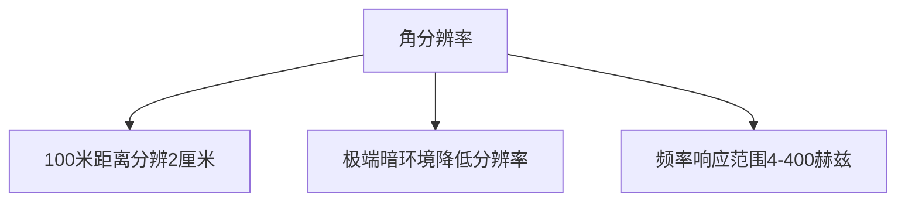

###### 1.1.1.2 听觉

人类的听觉系统对频率的响应范围大约在20赫兹到20千赫兹之间。低于20赫兹的声音称为次声波，高于20千赫兹的声音称为超声波，这些声音人类是无法听到的。此外，人类听觉的声压级响应范围大约在0到130分贝之间。超过这个声压级的声音，会对人类的听力造成损害。

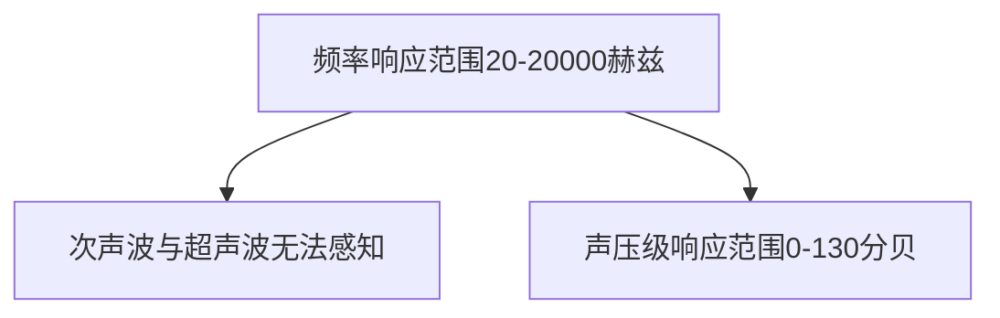

##### 1.1.2 心理因素对感知的影响

除了生理上的局限性，心理因素也会影响我们的感知。一些常见的知觉错觉和认知偏差，如视错觉和确认偏误，都可能会影响我们的判断和认知。

###### 1.1.2.1 知觉错觉

知觉错觉是指人类感知到的物体形态或位置与客观现实不一致的现象。例如，著名的“月光错觉”表明，在夜空中，月亮在接近地平线时看起来比在高空时更大。这种错觉是由于地球大气折射和视角变化造成的。

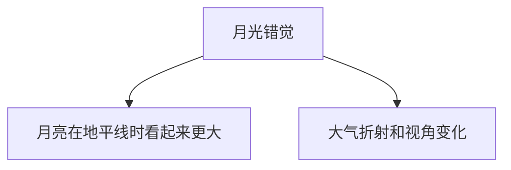

###### 1.1.2.2 认知偏差

认知偏差是指人们在处理信息时，由于各种心理和生理因素而导致的判断和决策偏差。常见的认知偏差包括确认偏误、代表性偏差和锚定效应等。这些偏差会影响我们对信息的理解和处理，从而导致错误的决策。

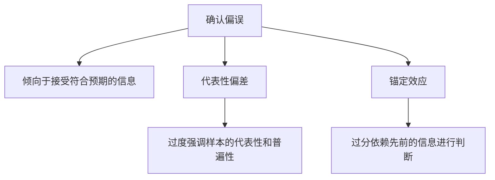

#### 1.2 宇宙本质的探索

宇宙是我们生活的家园，然而，我们对宇宙的了解仍然非常有限。为了探索宇宙的本质，科学家们进行了长期的研究和探索。

##### 1.2.1 宇宙的起源

宇宙的起源一直是科学界关注的焦点。目前，最广泛接受的宇宙起源理论是大爆炸理论。根据这一理论，宇宙在大约138亿年前从一个极其热密的态开始膨胀，并逐渐冷却形成了今天我们所观察到的宇宙。

###### 1.2.1.1 大爆炸理论

大爆炸理论认为，宇宙从一个非常热密的态开始膨胀，这个过程释放出了巨大的能量，导致宇宙的膨胀。随着时间的推移，宇宙逐渐冷却，物质开始形成，星系和恒星也随之诞生。

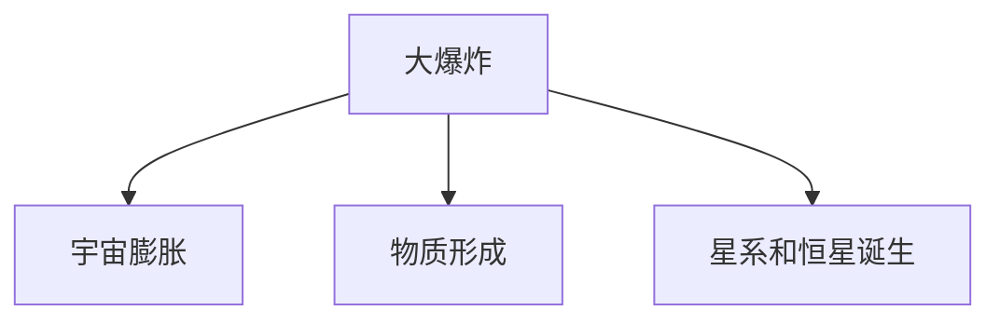

###### 1.2.1.2 大爆炸理论的争议

尽管大爆炸理论得到了广泛的接受，但仍存在一些争议。例如，关于宇宙的初始状态、膨胀速率以及宇宙的最终命运等问题，科学家们仍在进行深入的研究。

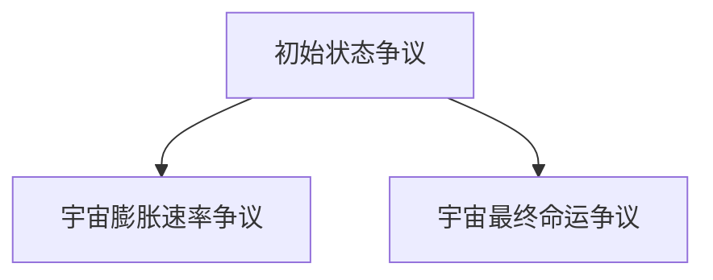

##### 1.2.2 宇宙的结构与演化

宇宙的结构与演化是另一个重要的研究领域。科学家们通过观测和研究，揭示了宇宙中的各种现象，如星系的形成和演化、暗物质和暗能量的作用等。

###### 1.2.2.1 暗物质和暗能量

暗物质和暗能量是宇宙学中两个重要但尚未完全理解的概念。暗物质是宇宙中不发光、不吸收光的物质，它的存在主要通过引力效应来体现。暗能量则是一种推动宇宙加速膨胀的力量，其本质尚未得到明确。

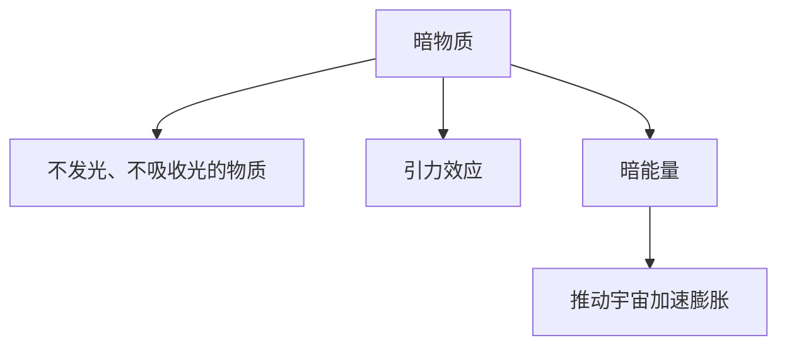

###### 1.2.2.2 星系形成与演化

星系的形成和演化是宇宙学研究的重要内容。科学家们通过观测和模拟，揭示了星系的形成过程、星系内部的动力学过程以及星系的演化历史。

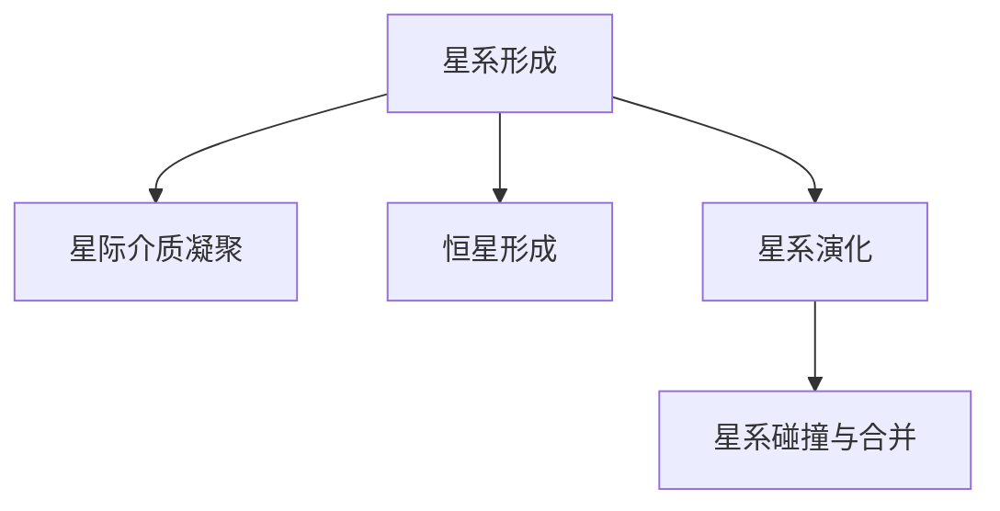

### 第二部分：人类感知与宇宙现象的对比

在对宇宙的探索过程中，人类感知能力的局限性成为了一个重要的挑战。为了克服这些局限，科学家们开发了一系列感知增强技术和新型传感器，从而拓展了我们的感知能力。

#### 2.1 感知能力的拓展

##### 2.1.1 感知增强技术

感知增强技术通过利用计算机、增强现实和虚拟现实等技术，拓展了人类的感知范围和能力。

###### 2.1.1.1 增强现实与虚拟现实

增强现实（AR）和虚拟现实（VR）技术通过在现实世界中叠加或创建虚拟信息，提升了人类的感知体验。AR技术可以将虚拟图像叠加在现实环境中，从而增强我们对现实世界的理解。VR技术则通过创建一个完全虚拟的环境，让用户可以沉浸在虚拟世界中。

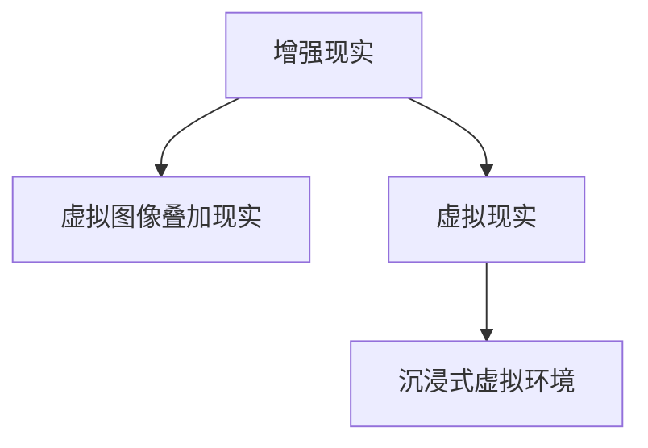

###### 2.1.1.2 遥感技术

遥感技术利用卫星、无人机等设备，从远处获取地球表面的信息。这种技术可以在不直接接触目标物体的情况下，获取大量的地理和环境数据。遥感技术在地质勘探、环境监测、农业等领域有着广泛的应用。

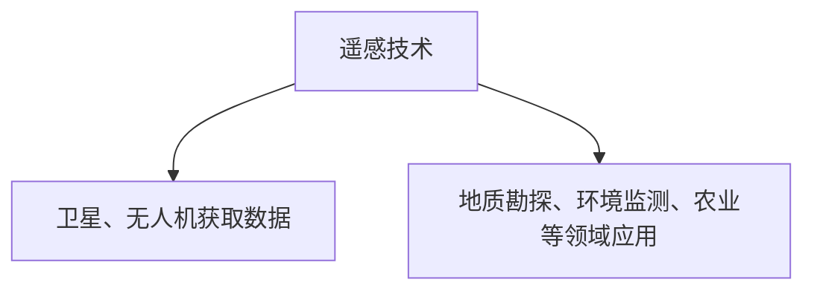

##### 2.1.2 新型传感器的开发

随着科技的进步，科学家们不断开发出新型传感器，以拓展人类的感知能力。

###### 2.1.2.1 量子传感器

量子传感器利用量子效应，具有极高的灵敏度和精度。这种传感器可以用于测量极其微小的物理量，如引力、磁场和温度等。量子传感器在科学研究、航空航天和精密制造等领域有着重要的应用。

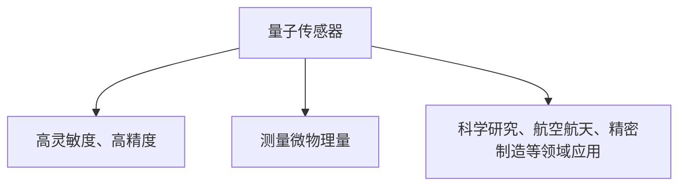

###### 2.1.2.2 热成像技术

热成像技术利用物体发射的红外辐射，生成物体的热图像。这种技术可以用于夜间侦察、医疗诊断、安全监控等领域。

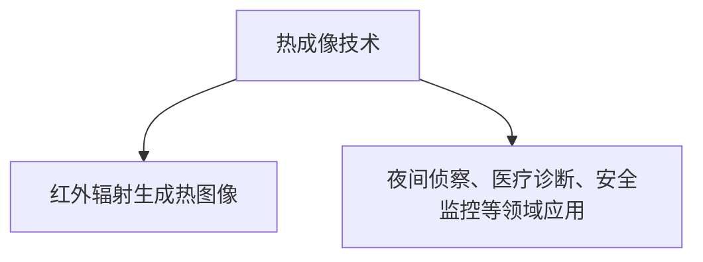

#### 2.2 宇宙现象的理解

为了更好地理解宇宙现象，科学家们利用各种观测手段和技术，从宏观和微观尺度上对宇宙进行研究。

##### 2.2.1 宇宙尺度的观测

宇宙尺度的观测涉及到从地球到宇宙深处的各种观测手段。

###### 2.2.1.1 射电天文学

射电天文学利用射电望远镜，接收宇宙中的无线电信号。这些信号来自于恒星、星系和其他宇宙现象。射电天文学为我们揭示了宇宙的起源和演化过程。

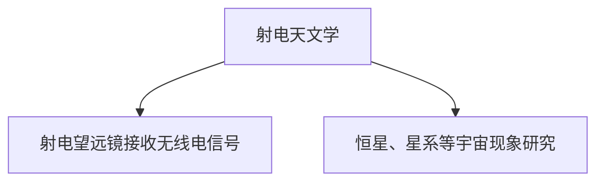

###### 2.2.1.2 光学望远镜

光学望远镜利用光学原理，捕捉宇宙中的光。通过光学望远镜，我们可以观察到恒星、行星、星系和其他天体。

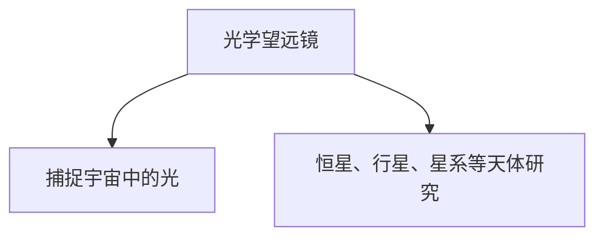

##### 2.2.2 宇宙尺度的模拟

宇宙尺度的模拟利用计算机模拟技术，对宇宙现象进行模拟和预测。

###### 2.2.2.1 数值模拟

数值模拟通过数值方法，求解物理方程，模拟宇宙中的各种现象。这种方法可以用于研究星系形成、黑洞演化等复杂过程。

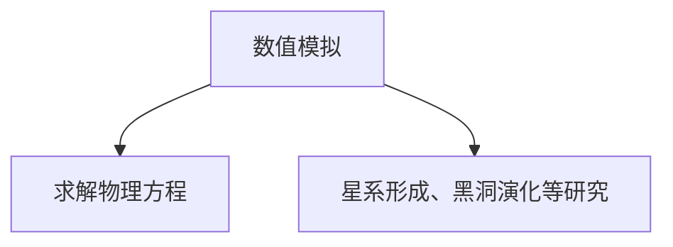

###### 2.2.2.2 蒙特卡洛模拟

蒙特卡洛模拟通过随机采样和概率统计方法，模拟宇宙中的随机过程。这种方法可以用于研究宇宙中的复杂现象，如宇宙微波背景辐射。

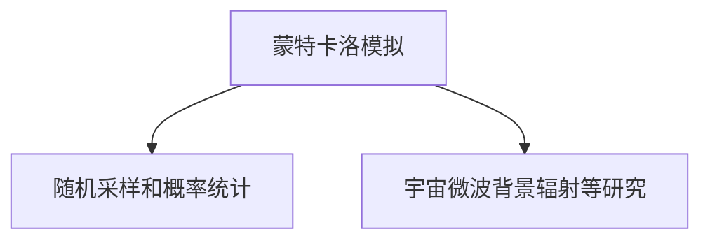

### 第三部分：感知与宇宙联系的探讨

人类感知能力和宇宙现象之间的联系不仅限于我们对宇宙的观测和探索，还涉及到宇宙信息解码和理解的过程。

#### 3.1 人类感知与宇宙信息的解码

宇宙中充满了各种信息，这些信息以电磁波、粒子波等形式传播。为了解码这些信息，人类开发了各种观测手段和技术。

##### 3.1.1 宇宙信息的提取

宇宙信息的提取主要依赖于电磁波和粒子波。

###### 3.1.1.1 电磁波

电磁波是宇宙中最常见的传播媒介。从无线电波、可见光到伽马射线，各种电磁波携带了宇宙中的信息。人类利用射电望远镜、光学望远镜等设备，接收这些电磁波，并将其转换为可理解的数据。

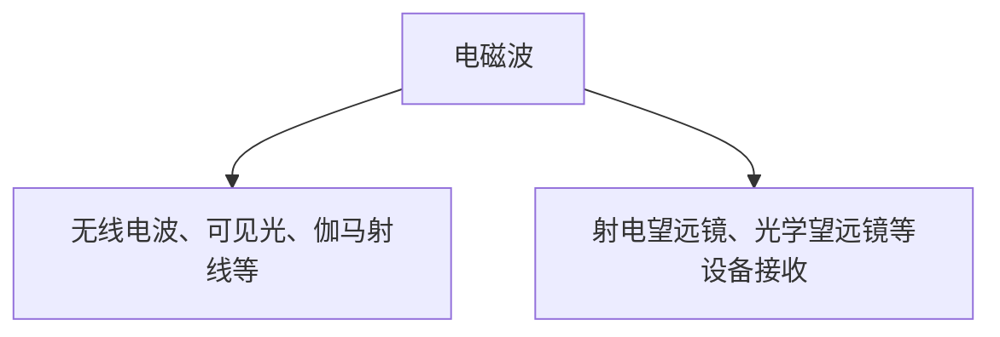

###### 3.1.1.2 粒子波

粒子波包括中微子、光子等基本粒子。这些粒子在宇宙中传播，携带了宇宙深处的信息。科学家们通过探测器，如中微子探测器，捕捉这些粒子波，并将其转换为数据。

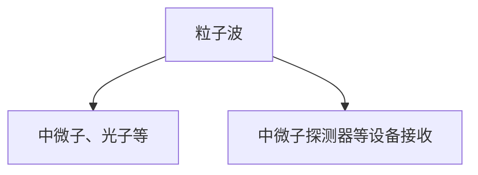

##### 3.1.2 感知与理解的边界

尽管人类开发了各种观测手段和技术，但我们在感知和理解宇宙信息时仍然面临许多挑战。

###### 3.1.2.1 黑洞信息

黑洞是宇宙中最神秘的天体之一。根据理论，黑洞的信息最终会以霍金辐射的形式释放出来。然而，关于黑洞信息的本质和传输机制，科学家们仍在进行深入研究。

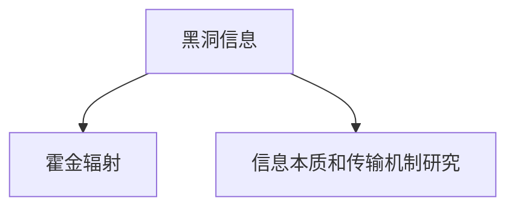

###### 3.1.2.2 量子纠缠

量子纠缠是量子力学中的一种现象，两个量子粒子即使相距很远，它们的量子状态也会保持相关性。量子纠缠在宇宙信息传输中具有潜在的应用价值，但目前关于量子纠缠的理解仍然有限。

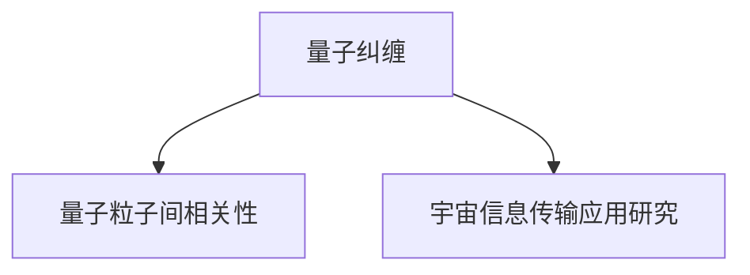

#### 3.2 宇宙探索的未来方向

随着科技的进步，宇宙探索的未来方向将更加光明。我们可以期待在以下几个方面取得突破。

##### 3.2.1 宇宙观测的未来

未来的宇宙观测将依赖于更先进的望远镜和探测器。例如，下一代射电望远镜和光学望远镜将具有更高的角分辨率和频率响应，能够捕捉到更微弱、更遥远的宇宙信号。

```mermaid
graph TD
A[下一代望远镜] --> B[更高角分辨率、频率响应]
A --> C[捕捉更微弱、更遥远的宇宙信号]
```

##### 3.2.2 感知技术的创新

感知技术的创新将继续拓展人类的感知能力。例如，量子传感器和脑机接口等新技术将使人类能够更直接地感知和理解宇宙。

```mermaid
graph TD
A[量子传感器] --> B[高灵敏度、直接感知]
A --> C[脑机接口] --> D[直接大脑控制]
```

### 第四部分：实践与应用

在宇宙探索和研究中，感知技术的应用已经取得了显著成果。以下是一些具体的实践与应用案例。

#### 4.1 感知技术在宇宙研究中的应用

感知技术在宇宙研究中发挥着重要作用，特别是在探测任务和数据分析方面。

##### 4.1.1 探测任务

宇宙探测任务通常需要利用各种感知技术来获取宇宙信息。例如，卡西尼探测器利用雷达和光学仪器，探测了土星及其卫星的详细信息。另外，哈勃空间望远镜通过观测宇宙深处的星系和星云，揭示了宇宙的起源和演化。

```mermaid
graph TD
A[卡西尼探测器] --> B[土星探测]
A --> C[哈勃空间望远镜] --> D[宇宙深处观测]
```

##### 4.1.2 数据分析

宇宙探测任务产生的数据量非常庞大，需要利用感知技术进行分析和处理。例如，科学家们通过分析激光干涉引力波观测站（LIGO）探测到的引力波信号，验证了爱因斯坦的广义相对论。此外，通过分析行星探测器发回的数据，科学家们揭示了行星大气层的结构和成分。

```mermaid
graph TD
A[LIGO探测引力波] --> B[验证广义相对论]
A --> C[行星探测器数据分析] --> D[行星大气层结构研究]
```

#### 4.2 感知技术在宇宙科普教育中的应用

感知技术在宇宙科普教育中也发挥着重要作用，通过互动展览和教育课程，使公众更好地了解宇宙。

##### 4.2.1 科普展览

宇宙科普展览利用增强现实（AR）和虚拟现实（VR）等技术，创造沉浸式的宇宙体验。例如，在宇宙展览中，参观者可以通过VR眼镜进入虚拟宇宙，观察星系和星云，甚至模拟太空飞行。

```mermaid
graph TD
A[宇宙科普展览] --> B[AR、VR技术]
A --> C[沉浸式宇宙体验]
```

##### 4.2.2 教育课程

宇宙科普教育课程通过互动教学和实验，激发学生对宇宙的兴趣和好奇心。例如，在课堂上，教师可以引导学生通过模拟实验，了解星系形成和演化过程。此外，通过在线课程和虚拟实验室，学生可以随时随地进行宇宙学习。

```mermaid
graph TD
A[宇宙科普教育课程] --> B[互动教学、实验]
A --> C[在线课程、虚拟实验室]
```

### 第五部分：总结与展望

在人类感知能力与宇宙本质之间，存在一个巨大的鸿沟。然而，随着科技的不断进步，我们正逐步跨越这个鸿沟，揭示宇宙的奥秘。

#### 5.1 人类感知能力与宇宙本质的关联

人类感知能力与宇宙本质之间存在着密切的关联。通过感知技术，我们能够解码宇宙的信息，理解宇宙的规律。这种关联不仅推动了科学的发展，也深化了我们对宇宙的理解。

```mermaid
graph TD
A[人类感知能力] --> B[宇宙信息解码]
A --> C[宇宙规律理解]
```

#### 5.1.1 总结与展望

在过去的几十年中，人类感知能力取得了显著的进步，特别是在射电天文学、光学望远镜和量子传感器等领域。这些进步使我们能够观测到更遥远的宇宙，揭示宇宙的起源和演化。

未来，随着技术的进一步发展，我们有望实现更高的角分辨率、频率响应和灵敏度。这将使我们能够捕捉到更微弱、更遥远的宇宙信号，揭示宇宙的更多奥秘。

```mermaid
graph TD
A[技术进步] --> B[更高分辨率、频率响应、灵敏度]
A --> C[更遥远、更微弱宇宙信号捕捉]
```

#### 5.1.2 未解之谜

尽管我们已经取得了许多突破，但宇宙仍然充满了未解之谜。例如，关于黑洞的信息传递机制、暗物质和暗能量的本质等，科学家们仍在进行深入研究。

这些未解之谜将激励我们继续探索宇宙，推动科学的发展。在未来，我们有望揭示这些奥秘，填补人类感知能力与宇宙本质之间的鸿沟。

```mermaid
graph TD
A[未解之谜] --> B[黑洞信息传递]
A --> C[暗物质、暗能量本质]
```

#### 5.2 结论

人类感知能力与宇宙本质之间的鸿沟是巨大的，但通过科技的进步，我们正逐步跨越这个鸿沟。未来，我们将继续拓展我们的感知能力，揭示宇宙的奥秘。

这篇文章不仅为我们提供了一个对人类感知能力和宇宙本质之间关联的深入理解，也激发了我们对宇宙探索的热情。让我们继续前行，探索这个无尽的宇宙。

### 作者信息

作者：AI天才研究院/AI Genius Institute & 禅与计算机程序设计艺术 /Zen And The Art of Computer Programming

---

这篇文章通过对人类感知能力和宇宙本质的探讨，揭示了我们在理解宇宙时所面临的挑战和机遇。通过感知增强技术和新型传感器的开发，我们有望跨越人类感知能力的局限，更好地探索和理解宇宙。未来，随着科技的不断进步，我们将能够解码更多宇宙信息，揭示宇宙的奥秘。让我们继续前行，探索这个无尽的宇宙。

