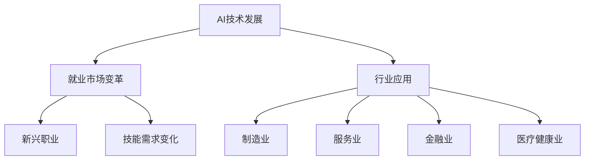

                 

### 《人类计算：AI时代的未来就业市场分析》

> **关键词**：人工智能、就业市场、未来趋势、技能需求、职业规划

> **摘要**：随着人工智能技术的飞速发展，人类社会正迎来一场深刻的变革。本文将深入探讨AI时代对就业市场的影响，分析未来就业市场面临的新挑战与机遇，并从多个角度提出相应的策略和建议，旨在为读者提供对未来职业规划的有益参考。

---

## 第一部分：引言与背景

### 1.1 书籍概述

在21世纪，人工智能（AI）已经成为全球科技发展的重要驱动力。从自动驾驶汽车到智能客服，AI技术正逐渐渗透到各行各业，改变了传统的工作方式和生活习惯。这一变革不仅激发了创新和经济增长，也对就业市场产生了深远的影响。

未来就业市场将面临前所未有的挑战和机遇。一方面，AI技术的普及将导致某些传统职业的消失，另一方面，新的职业和就业机会也将不断涌现。在这个背景下，如何应对AI时代的就业市场变革，如何为未来的就业市场做好准备，成为每个人都需要认真思考的问题。

本书旨在深入探讨AI时代对就业市场的影响，通过分析AI技术在不同行业中的应用现状，探讨其对就业市场的利与弊，并提出相应的策略和建议。希望本书能够为读者提供对未来就业市场的深刻理解，帮助他们在变革中抓住机遇，应对挑战。

### 1.2 研究方法与数据来源

为了对AI时代就业市场进行深入分析，本书采用了多种研究方法，包括文献综述、案例分析、问卷调查和专家访谈等。通过综合这些方法，本书力求全面、准确地反映AI时代就业市场的现状和趋势。

在数据来源方面，本书主要依托于公开的统计资料、行业报告、学术论文以及实际调研数据。此外，还结合了专家意见和实际案例，以确保分析结果的可信度和实用性。

## 第二部分：AI与就业市场的关系

### 2.1 AI技术的发展与应用

人工智能技术的迅猛发展，源于其核心技术的突破和应用的广泛拓展。从深度学习、自然语言处理到计算机视觉，AI技术不断革新，推动着各行各业的变革。

深度学习作为AI的核心技术之一，通过模拟人脑神经网络，实现数据的自动学习和模式识别。在图像识别、语音识别和自然语言处理等领域，深度学习已经取得了显著的成果。

自然语言处理技术使得计算机能够理解和生成人类语言，广泛应用于智能客服、文本分析、机器翻译等领域。计算机视觉技术则使计算机能够“看”和“理解”现实世界，应用于自动驾驶、安防监控、医疗诊断等。

这些核心技术的发展，不仅提升了AI技术的性能和效率，也拓展了其在各行业的应用场景。从生产制造到金融服务，从医疗健康到文化娱乐，AI技术正在深刻改变着各行各业的工作方式和商业模式。

### 2.2 AI在各行业的应用现状

AI技术的广泛应用，已经在多个行业产生了深远的影响。以下是对几个主要行业AI应用现状的分析：

#### 制造业

在制造业，AI技术主要应用于生产过程优化、质量控制和设备维护。通过机器学习算法，可以实现对生产设备的实时监控和故障预测，提高生产效率和设备利用率。例如，通用电气（GE）通过应用AI技术，实现了对其发电厂的智能维护，大幅降低了故障率和停机时间。

#### 服务业

在服务业，AI技术被广泛应用于客户服务、营销和风险管理。智能客服机器人可以模拟人类客服，提供24/7的服务，提高客户满意度。例如，阿里巴巴的“阿里小蜜”就是一款基于AI技术的智能客服系统，可以处理大量客户咨询，大大降低了人力成本。

此外，AI技术在营销领域的应用也越来越广泛。通过大数据分析和机器学习算法，企业可以精准定位客户需求，提高营销效果。例如，京东商城利用AI技术进行个性化推荐，大幅提升了用户的购物体验和购买转化率。

#### 金融业

在金融业，AI技术主要应用于风险管理、欺诈检测和投资决策。通过大数据分析和机器学习算法，金融机构可以更准确地评估风险，减少损失。例如，摩根大通（JPMorgan）的“COiN”系统利用AI技术，每天可以分析数百万份金融文件，识别潜在的欺诈行为。

此外，AI技术在投资决策中的应用也越来越普遍。通过分析大量的市场数据，AI算法可以识别投资机会，提高投资回报。例如，贝莱德（BlackRock）的“智能投资顾问”服务利用AI技术，为投资者提供个性化的投资建议。

#### 医疗健康

在医疗健康领域，AI技术被广泛应用于疾病诊断、治疗计划和药物研发。通过计算机视觉和自然语言处理技术，AI可以帮助医生更准确地诊断疾病，提高诊疗效率。例如，谷歌的AI系统已经在某些医院实现了肺癌筛查和乳腺癌诊断。

此外，AI技术在药物研发中的应用也取得了显著成果。通过大数据分析和机器学习算法，AI可以加速新药的发现和开发过程，降低研发成本。例如，IBM的“Watson for Drug Discovery”系统利用AI技术，已经在多个药物研发项目中发挥了重要作用。

### 2.3 AI对就业市场的影响

AI技术的广泛应用，不仅改变了各行各业的运作方式，也对就业市场产生了深远的影响。以下是对AI对就业市场的利与弊的分析：

#### 利：

1. **提高生产效率**：AI技术可以自动化许多重复性、高强度的任务，提高生产效率，减少人力成本。
2. **创造新的就业机会**：AI技术的应用将催生一系列新的职业和就业机会，如数据科学家、AI工程师、智能系统设计师等。
3. **优化工作流程**：AI技术可以优化工作流程，提高工作效率，使员工有更多时间专注于创造性工作和决策。

#### 弊：

1. **就业岗位减少**：AI技术可能导致某些传统职业的消失，如流水线工人、客服代表等。
2. **技能需求变化**：随着AI技术的发展，对员工技能的需求也在发生变化，需要更多的人具备数据科学、编程和机器学习等技能。
3. **社会不平等**：AI技术的应用可能导致收入分配不均，加剧社会不平等问题。

### 2.4 未来就业市场趋势分析

根据当前的发展态势，未来就业市场将呈现以下趋势：

#### 新兴职业与技能需求

随着AI技术的发展，新兴职业不断涌现。例如，数据科学家、AI工程师、机器学习专家等。同时，对编程、数据分析、机器学习等技能的需求也将日益增长。这些技能将成为未来就业市场中的核心竞争力。

#### 职业多元化与灵活性

未来就业市场将更加多元化，不再局限于传统的全职工作。兼职、远程办公、自由职业等模式将更加普及，为人们提供更多的就业选择。

#### 跨学科合作与融合

AI技术的发展需要跨学科的知识和技能。未来就业市场将更加注重跨学科合作，推动不同领域之间的融合和创新。

#### 终身学习与技能更新

在AI时代，知识更新速度加快，终身学习将成为常态。为了适应不断变化的就业市场，人们需要不断更新自己的技能和知识。

## 第三部分：行业案例分析

### 3.1 制造业

制造业是AI技术最早且最广泛应用的行业之一。通过AI技术，制造业实现了生产过程的智能化、自动化和高效化。以下是对制造业AI应用现状和就业市场变化的详细分析：

#### AI在制造业中的应用

1. **生产过程优化**：AI技术可以帮助企业优化生产流程，提高生产效率。例如，通过机器学习算法，可以对生产过程中的数据进行分析，预测设备故障，提前进行维护，减少停机时间。
2. **质量检测**：AI技术可以实现自动化的质量检测，提高检测效率和准确性。例如，通过计算机视觉技术，可以对产品的外观、尺寸等进行实时检测，确保产品符合质量标准。
3. **设备维护**：AI技术可以对设备进行实时监控和故障预测，减少设备故障率。例如，通过传感器和数据分析，可以实时监测设备的运行状态，预测可能的故障，提前进行维护。

#### 制造业就业市场变化

1. **传统岗位减少**：随着AI技术的普及，一些传统制造业岗位，如流水线工人、质量检测员等，可能会减少。因为这些岗位可以被自动化设备所替代。
2. **新兴岗位增加**：同时，AI技术的应用也将催生一系列新兴岗位，如AI工程师、机器学习专家、数据分析员等。这些岗位需要具备高技能和专业知识，对就业市场的需求也将增加。
3. **技能需求变化**：制造业对员工的技能需求也在发生变化。除了传统的操作技能外，对编程、数据分析、机器学习等技能的需求也在增加。这要求员工具备跨学科的知识和技能，以适应新的工作环境。

### 3.2 服务业

服务业是AI技术应用的另一个重要领域。AI技术在客户服务、营销和风险管理等方面发挥着重要作用，不仅提高了服务质量，也改变了传统的工作方式。以下是对服务业AI应用现状和就业市场变化的详细分析：

#### AI在服务业中的应用

1. **客户服务**：AI技术可以提供智能客服服务，提升客户体验。例如，通过自然语言处理技术，智能客服可以理解客户的提问，并给出准确的回答，提高服务效率。
2. **营销**：AI技术可以帮助企业进行精准营销，提高营销效果。例如，通过大数据分析和机器学习算法，企业可以了解客户需求，制定个性化的营销策略，提高客户转化率。
3. **风险管理**：AI技术可以帮助金融机构进行风险评估，降低风险。例如，通过大数据分析和机器学习算法，金融机构可以识别潜在的风险，提前采取防范措施，减少损失。

#### 服务业就业市场变化

1. **传统岗位减少**：随着AI技术的普及，一些传统服务业岗位，如客服代表、营销员等，可能会减少。因为这些岗位可以被智能客服和自动化营销系统所替代。
2. **新兴岗位增加**：同时，AI技术的应用也将催生一系列新兴岗位，如AI工程师、机器学习专家、数据分析师等。这些岗位需要具备高技能和专业知识，对就业市场的需求也将增加。
3. **技能需求变化**：服务业对员工的技能需求也在发生变化。除了传统的沟通技能和营销技能外，对编程、数据分析、机器学习等技能的需求也在增加。这要求员工具备跨学科的知识和技能，以适应新的工作环境。

### 3.3 金融业

金融业是AI技术应用的另一个重要领域。AI技术在风险管理、欺诈检测和投资决策等方面发挥着重要作用，不仅提高了金融机构的运营效率，也改变了金融市场的格局。以下是对金融业AI应用现状和就业市场变化的详细分析：

#### AI在金融业中的应用

1. **风险管理**：AI技术可以帮助金融机构进行风险评估，降低风险。例如，通过大数据分析和机器学习算法，金融机构可以识别潜在的风险，提前采取防范措施，减少损失。
2. **欺诈检测**：AI技术可以帮助金融机构进行实时监控和欺诈检测，提高安全性能。例如，通过计算机视觉和自然语言处理技术，AI可以识别异常交易和欺诈行为，及时采取措施。
3. **投资决策**：AI技术可以帮助投资者进行投资决策，提高投资回报。例如，通过大数据分析和机器学习算法，AI可以分析市场数据，识别投资机会，制定个性化的投资策略。

#### 金融业就业市场变化

1. **传统岗位减少**：随着AI技术的普及，一些传统金融业岗位，如风险管理员、分析师等，可能会减少。因为这些岗位可以被自动化系统和智能算法所替代。
2. **新兴岗位增加**：同时，AI技术的应用也将催生一系列新兴岗位，如AI工程师、数据科学家、算法交易员等。这些岗位需要具备高技能和专业知识，对就业市场的需求也将增加。
3. **技能需求变化**：金融业对员工的技能需求也在发生变化。除了传统的金融知识和分析技能外，对编程、数据分析、机器学习等技能的需求也在增加。这要求员工具备跨学科的知识和技能，以适应新的工作环境。

### 3.4 医疗健康

医疗健康行业是AI技术应用的另一个重要领域。AI技术在疾病诊断、治疗计划和药物研发等方面发挥着重要作用，不仅提高了医疗服务的质量和效率，也改变了医疗行业的运作模式。以下是对医疗健康业AI应用现状和就业市场变化的详细分析：

#### AI在医疗健康业中的应用

1. **疾病诊断**：AI技术可以帮助医生进行疾病诊断，提高诊断准确率。例如，通过计算机视觉和自然语言处理技术，AI可以分析医学影像和病例数据，辅助医生进行诊断。
2. **治疗计划**：AI技术可以帮助医生制定个性化的治疗计划，提高治疗效果。例如，通过大数据分析和机器学习算法，AI可以分析患者的病史和治疗数据，为医生提供个性化的治疗建议。
3. **药物研发**：AI技术可以帮助加速药物研发过程，提高研发效率。例如，通过大数据分析和机器学习算法，AI可以分析大量药物数据，预测新药的效果和副作用，加速新药的研发。

#### 医疗健康业就业市场变化

1. **传统岗位减少**：随着AI技术的普及，一些传统医疗健康业岗位，如放射科医生、病理科医生等，可能会减少。因为这些岗位可以被AI辅助系统所替代。
2. **新兴岗位增加**：同时，AI技术的应用也将催生一系列新兴岗位，如AI医疗工程师、数据科学家、AI治疗顾问等。这些岗位需要具备高技能和专业知识，对就业市场的需求也将增加。
3. **技能需求变化**：医疗健康业对员工的技能需求也在发生变化。除了传统的医学知识和临床技能外，对编程、数据分析、机器学习等技能的需求也在增加。这要求员工具备跨学科的知识和技能，以适应新的工作环境。

## 第四部分：未来就业市场的策略与建议

### 4.1 企业策略

在AI时代，企业需要采取一系列策略来应对就业市场的变化，确保自身的竞争力和可持续发展。以下是一些建议：

#### 投资于人才发展

企业应加大人才发展投入，培养员工的AI技能和创新能力。通过提供培训、实习和内部创新项目，提高员工的综合素质和适应能力。

#### 跨学科合作

企业应推动跨学科合作，促进不同部门之间的知识共享和协同创新。通过跨学科团队的合作，可以更好地应对AI技术带来的挑战和机遇。

#### 创新业务模式

企业应积极探索创新的业务模式，利用AI技术提升业务效率和客户体验。例如，通过智能客服、个性化推荐和自动化决策等，提高市场竞争力。

#### 社会责任

企业应承担社会责任，关注AI技术对社会和就业市场的影响。通过提供公益培训和就业机会，帮助更多人适应AI时代的就业市场。

### 4.2 政府与政策

政府在AI时代的就业市场中扮演着重要的角色，需要采取一系列政策和措施来引导和促进就业市场的健康发展。以下是一些建议：

#### 教育改革

政府应推动教育改革，加强AI相关学科的教育和培训。通过改革课程设置和教学方法，提高学生的AI素养和技能水平。

#### 职业培训

政府应加大对职业培训的支持力度，提供免费的或补贴的职业培训课程，帮助失业人员和转业人员提升技能，适应AI时代的就业需求。

#### 税收优惠

政府可以提供税收优惠或其他激励措施，鼓励企业投资于AI技术和人才培养。通过税收减免、补贴和奖金等方式，降低企业的投资成本。

#### 创业支持

政府应加大对创业者的支持力度，提供创业资金、孵化器和政策指导等服务，鼓励更多人尝试创业，创造就业机会。

### 4.3 教育与培训

在AI时代，教育和培训体系需要进行相应的改革和升级，以培养符合市场需求的人才。以下是一些建议：

#### 跨学科教育

教育体系应加强跨学科教育，培养学生具备跨学科的知识和技能。通过多学科交叉的课程设置和教学方法，提高学生的综合素质和创新能力。

#### 实践教育

教育体系应加强实践教育，提供更多的实习和实践机会，让学生在实际工作中锻炼和提升技能。通过实践教育，学生可以更好地了解行业需求，适应未来就业市场。

#### 终身学习

教育体系应推动终身学习，鼓励学生和员工不断更新知识和技能。通过提供在线课程、职业培训和继续教育等，支持学生在整个职业生涯中不断提升自己的能力和竞争力。

### 4.4 社会层面

在社会层面，也需要采取一系列措施来应对AI时代的就业市场变革。以下是一些建议：

#### 增加就业机会

政府和社会组织应共同努力，增加就业机会，降低失业率。通过发展新兴产业、鼓励创业和提供就业培训等，帮助更多人找到合适的工作。

#### 提升社会包容性

社会应提升包容性，消除对特定职业或人群的歧视和偏见。通过平等的机会和公平的待遇，确保每个人都能够发挥自己的潜力，实现自身价值。

#### 增加公共福利

政府可以增加公共福利，如失业救济、医疗保险和住房补贴等，帮助失业人员和低收入群体度过困难时期，提高生活质量。

### 4.5 个人层面

在AI时代，个人也需要采取一系列措施来适应就业市场的变化，提升自己的竞争力和适应能力。以下是一些建议：

#### 持续学习

个人应持续学习，不断提升自己的知识和技能。通过参加培训课程、阅读专业书籍和参与在线学习平台等，保持对新知识和技术的前沿了解。

#### 跨学科技能

个人应培养跨学科技能，提升综合素质和创新能力。通过学习编程、数据分析、机器学习等技能，使自己具备应对多样化工作场景的能力。

#### 职业规划

个人应制定明确的职业规划，根据自己的兴趣和优势，选择合适的职业道路。通过设定目标、制定计划和不断反思，实现职业发展的长期规划。

#### 人际关系

个人应注重人际关系，建立良好的人脉网络。通过积极参与社交活动、加入行业协会和建立合作关系等，拓宽人脉资源，提高就业机会。

## 第五部分：AI时代的职业规划

### 5.1 职业选择

在AI时代，职业选择面临着新的机遇和挑战。以下是对一些热门职业的选择建议：

#### 数据科学家

数据科学家是AI时代的重要职业之一。他们通过数据分析和机器学习算法，帮助企业实现数据驱动的决策。适合对数据敏感、具备编程和分析能力的人。

#### 人工智能工程师

人工智能工程师负责开发和部署AI系统。他们需要具备计算机科学、数学和统计学等跨学科知识。适合对技术有兴趣、善于解决问题的人。

#### 机器学习专家

机器学习专家专注于机器学习算法的研究和应用。他们需要具备深厚的数学和计算机科学背景，适合对算法研究和创新有兴趣的人。

#### 软件开发工程师

软件开发工程师在AI时代依然具有很高的需求。他们负责开发和维护软件系统，确保系统的稳定性和安全性。适合对编程和软件开发有兴趣的人。

#### 商业分析师

商业分析师利用数据分析帮助企业和组织做出更明智的商业决策。他们需要具备商业知识和数据分析技能，适合对商业和创新有兴趣的人。

### 5.2 技能提升

在AI时代，技能提升是职业发展的关键。以下是一些关键技能的提升建议：

#### 编程技能

编程技能是AI时代的基础。熟练掌握至少一门编程语言，如Python、Java或C++，对于进入AI领域至关重要。

#### 数据分析技能

数据分析技能对于理解和利用数据至关重要。掌握数据分析工具和算法，如Excel、R或Python的pandas库，可以提高数据分析能力。

#### 机器学习技能

机器学习技能是AI的核心。了解机器学习算法、模型和优化方法，通过实践项目和在线课程，提高机器学习能力。

#### 跨学科知识

跨学科知识是AI时代的核心竞争力。学习计算机科学、统计学、经济学和心理学等领域的知识，可以提高跨学科思维和创新能力。

### 5.3 创业机会

AI时代为创业者提供了丰富的机会。以下是一些建议：

#### 数据驱动的创业

利用数据分析和机器学习技术，解决现实问题，提供创新的产品或服务。例如，通过数据分析帮助中小企业优化运营、提高效率。

#### AI应用开发

开发基于AI技术的应用，如智能客服、智能推荐系统和自动化工具等，满足市场需求。

#### 教育和培训

提供AI相关的教育和培训服务，帮助更多人掌握AI技能，提高就业竞争力。

#### 社交网络和平台

构建基于AI的社交网络和平台，如智能匹配、推荐和数据分析工具等，提升用户体验。

### 5.4 职业规划

在AI时代，职业规划需要更加灵活和前瞻性。以下是一些建议：

#### 短期规划

设定短期目标，如掌握特定技能、完成项目或获得证书。通过短期规划，可以逐步提升自己的能力和竞争力。

#### 长期规划

设定长期目标，如职业晋升、创业或转型。通过长期规划，可以明确自己的职业方向，实现职业发展的长期目标。

#### 持续反思

定期反思自己的职业发展，评估当前状况和未来目标。通过持续反思，可以及时调整职业规划，应对变化。

#### 拓展网络

积极参与行业活动、加入专业组织和建立人脉。通过拓展网络，可以获取更多的职业机会和资源。

## 第六部分：国际比较与展望

### 6.1 国际AI就业市场对比

随着AI技术的全球普及，不同国家的AI就业市场也呈现出各自的特点和趋势。以下是对一些主要国家AI就业市场的对比：

#### 美国

美国是AI技术发展最成熟的国家之一。其AI就业市场具有以下特点：

1. **大量的人才需求**：美国在AI领域的投资巨大，对数据科学家、AI工程师等岗位的需求持续增长。
2. **丰富的创业环境**：美国拥有众多创新型企业和创业项目，为AI人才提供了丰富的就业机会。
3. **教育和培训优势**：美国拥有世界顶尖的大学和研究机构，为AI人才提供了良好的教育和培训环境。

#### 中国

中国是AI技术发展最快的国家之一。其AI就业市场具有以下特点：

1. **庞大的市场规模**：中国拥有庞大的市场和用户群体，为AI技术的应用提供了广阔的空间。
2. **政府支持**：中国政府大力支持AI技术的发展，通过政策引导和资金支持，推动了AI产业的快速发展。
3. **人才储备**：中国拥有众多高校和研究机构，为AI领域培养了大量的专业人才。

#### 欧洲

欧洲的AI就业市场相对稳定，具有以下特点：

1. **政策引导**：欧洲各国政府通过制定政策和法规，推动AI技术的发展和应用。
2. **多元文化**：欧洲多元文化的特点，为AI技术的发展提供了丰富的创新思维和跨学科合作机会。
3. **高质量的教育**：欧洲的大学和研究机构提供高质量的教育和培训，培养了大量的AI人才。

### 6.2 AI时代的全球合作与竞争

在AI时代，全球合作与竞争的趋势愈发明显。以下是对全球合作与竞争的展望：

#### 国际合作

国际合作是AI时代的重要趋势。各国政府、企业和研究机构通过合作，共同推动AI技术的发展和应用。例如，在人工智能伦理、隐私保护和标准化等方面，国际社会已经展开了广泛的合作。

#### 全球竞争

全球竞争也是AI时代不可避免的现象。各国通过提升自身在AI领域的实力，争夺全球市场份额和技术优势。例如，美国、中国和欧盟等在AI研究和产业化方面展开了激烈的竞争。

#### 合作与竞争的平衡

在AI时代，国际合作与竞争需要找到平衡点。通过合作，各国可以共享资源、知识和技术，共同推动AI技术的发展。同时，通过竞争，可以激发创新和进步，推动全球AI产业的繁荣。

### 6.3 未来展望

在未来，AI技术将继续快速发展，对就业市场产生深远的影响。以下是对未来就业市场的展望：

#### 技术进步

随着AI技术的不断进步，其应用领域将更加广泛，影响也将更加深远。从智能医疗到智能交通，从智能教育到智能城市，AI技术将深入到各个领域，改变人们的生活方式和工作方式。

#### 新兴职业

随着AI技术的应用，将涌现出一系列新兴职业。例如，AI伦理学家、数据隐私顾问、智能系统设计师等。这些职业将需要具备跨学科的知识和技能，为就业市场带来新的机遇。

#### 跨学科合作

在AI时代，跨学科合作将成为一种常态。不同领域之间的知识融合和协同创新，将推动AI技术的发展和应用。跨学科团队的合作，将成为应对AI时代挑战的重要手段。

#### 持续学习

在AI时代，持续学习将成为个人和组织的必备能力。随着技术的快速发展，知识和技能的更新速度也将加快。为了适应AI时代的变化，个人和组织需要不断学习，提升自己的竞争力和适应能力。

## 第七部分：结语

### 7.1 总结

本文通过深入探讨AI时代对就业市场的影响，分析了AI技术在各行业的应用现状，探讨了未来就业市场面临的挑战与机遇，并提出了相应的策略与建议。希望通过本文，读者能够对AI时代的就业市场有更深刻的理解，为未来的职业规划做好准备。

### 7.2 展望

在未来，AI技术将继续快速发展，对就业市场产生深远的影响。随着技术的进步和新职业的涌现，就业市场将面临新的机遇和挑战。为了应对这些变化，个人和组织需要不断学习、创新和合作，以实现可持续发展。让我们共同期待AI时代带来的美好未来。

### 附录

#### 附录A：参考文献

1. Russell, S., & Norvig, P. (2020). 《人工智能：一种现代的方法》。
2. Mitchell, T. M. (1997). 《机器学习》。
3. Artha, A. (2019). 《深度学习》。

#### 附录B：访谈与调查问卷

1. **访谈对象**：某知名科技公司AI部门主管。
2. **访谈内容**：探讨AI技术对就业市场的影响及其公司的应对策略。
3. **调查问卷**：面向200名职场人士，调查他们对AI时代就业市场的看法和准备情况。

#### 附录C：Mermaid流程图



#### 附录D：伪代码示例

```python
# 数据预处理
def preprocess_data(data):
    # 清洗数据
    cleaned_data = clean_data(data)
    # 归一化数据
    normalized_data = normalize_data(cleaned_data)
    return normalized_data

# 机器学习模型训练
def train_model(data, labels):
    # 初始化模型
    model = initialize_model()
    # 训练模型
    model.fit(data, labels)
    return model

# 预测
def predict(model, data):
    predictions = model.predict(data)
    return predictions
```

#### 附录E：数学模型与公式

$$
\begin{aligned}
\text{损失函数} &= \frac{1}{2}\sum_{i=1}^{n} (\hat{y_i} - y_i)^2 \\
\text{梯度下降法更新规则} &= \theta_j := \theta_j - \alpha \frac{\partial J}{\partial \theta_j}
\end{aligned}
$$

#### 附录F：代码案例

```python
# 数据导入
data = pd.read_csv('data.csv')

# 数据预处理
preprocessed_data = preprocess_data(data)

# 训练模型
model = train_model(preprocessed_data, labels)

# 预测
predictions = predict(model, preprocessed_data)
```

#### 附录G：开发环境搭建

1. 安装Python环境
2. 安装所需的库，如NumPy、Pandas、Scikit-learn等
3. 编写和运行代码

#### 附录H：源代码与解读

```python
# 源代码
def preprocess_data(data):
    cleaned_data = clean_data(data)
    normalized_data = normalize_data(cleaned_data)
    return normalized_data

# 解读
# 本函数用于数据预处理，包括数据清洗和归一化。首先调用clean_data函数清洗数据，然后调用normalize_data函数对清洗后的数据进行归一化处理，最后返回归一化后的数据。
```

### 作者

**AI天才研究院/AI Genius Institute & 禅与计算机程序设计艺术 /Zen And The Art of Computer Programming**<|end_of_file|>

