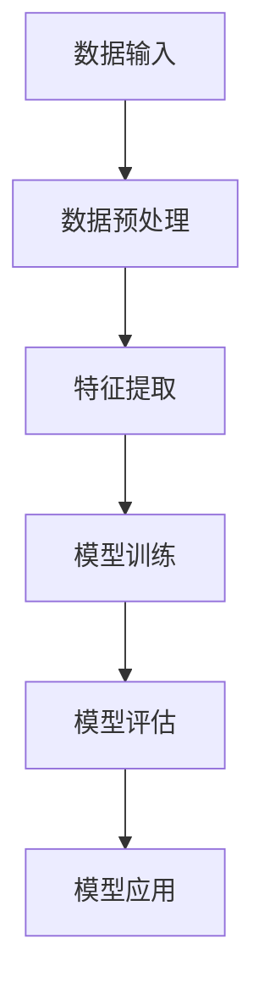
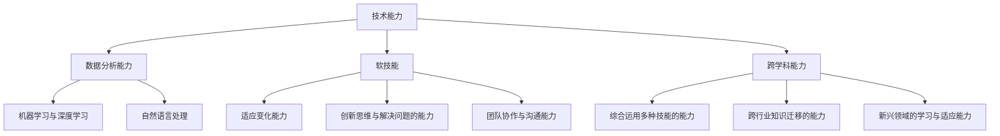

                 

# 《人类计算：AI时代的未来就业市场趋势》

## 关键词：
人工智能、就业市场、职业趋势、技能需求、教育培训、数字化转型

## 摘要：
本文深入探讨了AI时代对就业市场带来的变革与趋势。通过分析AI技术的发展历程、就业市场的影响和新型职业的崛起，探讨了AI时代的职业能力要求以及应对策略。文章结合实际案例，对教育与培训趋势以及国际化就业市场趋势进行了深入分析，并提出了个人、企业和政府层面的应对策略。

---

### 《人类计算：AI时代的未来就业市场趋势》目录大纲

#### 第一部分：AI时代的就业市场背景

### 第二部分：AI时代的职业能力要求

### 第三部分：AI时代的就业市场趋势分析

### 第四部分：应对AI时代就业市场的策略

### 第五部分：案例分析与展望

### 附录

## 第一部分：AI时代的就业市场背景

### 第1章 AI时代的就业市场变革

#### 第1.1节 AI技术的发展与普及

##### 1.1.1 AI技术的发展历程

人工智能（AI）技术的发展可以分为几个关键阶段。首先是起步阶段，这通常被认为是20世纪50年代到70年代。在这个时期，人工智能的概念被提出，但技术还处于初级阶段，主要研究逻辑推理和规则系统。接下来是互联网时代，即20世纪90年代至21世纪初。互联网的普及使得数据变得更加容易获取，推动了机器学习技术的快速发展。

**核心概念与联系**

- **Mermaid 流程图**：

  ```mermaid
  graph TD
  A[起步阶段] --> B[互联网时代]
  B --> C[大数据时代]
  C --> D[深度学习时代]
  D --> E[AI时代]
  ```

##### 1.1.2 AI技术在各行各业的普及应用

AI技术的普及应用对各行各业都产生了深远的影响。在制造业，AI技术被用于自动化生产线的优化；在医疗健康领域，AI被用于疾病诊断和个性化治疗；在交通运输行业，AI技术则被用于自动驾驶和交通流量管理。

**核心概念与联系**

- **Mermaid 流程图**：

  ```mermaid
  graph TD
  A[制造业] --> B[AI应用]
  B --> C[医疗健康]
  A --> D[服务业]
  D --> E[交通运输]
  ```

##### 1.1.3 AI技术与就业市场的联系

AI技术的发展对就业市场产生了深远的影响。一方面，AI技术可能导致某些传统岗位的消失，例如工厂里的机械操作员；另一方面，AI技术也创造了新的就业机会，例如数据科学家、机器学习工程师等。

**核心概念与联系**

- **Mermaid 流程图**：

  ```mermaid
  graph TD
  A[劳动力市场] --> B[传统岗位]
  B --> C[自动化与AI]
  C --> D[新兴岗位]
  A --> E[技能需求变化]
  E --> F[就业机会与挑战]
  ```

##### 1.1.4 AI时代的就业市场趋势

AI时代的就业市场将呈现几个明显的趋势。首先是职业岗位的变化，传统岗位将逐渐被自动化和AI技术取代，而新的岗位将不断涌现。其次，就业市场的国际化趋势也将加强，跨国公司的崛起将带来更多的就业机会。

**核心概念与联系**

- **Mermaid 流程图**：

  ```mermaid
  graph TD
  A[传统职业] --> B[自动化岗位]
  B --> C[AI技术岗位]
  A --> D[新职业]
  D --> E[跨界职业]
  ```

---

#### 第1.2节 AI时代的职业能力要求

##### 1.2.1 技术能力要求

在AI时代，技术能力是职业发展的关键。数据科学家和机器学习工程师等职业对技术能力有较高的要求。以下是几个关键技术能力的概述：

- **数据分析能力**：数据科学家需要掌握数据预处理、统计分析、数据可视化等技术。
- **机器学习与深度学习**：机器学习工程师需要熟悉各种机器学习算法和深度学习框架。
- **自然语言处理**：自然语言处理工程师需要掌握语言模型、文本分类、信息提取等技术。

**核心算法原理讲解**

- **机器学习算法**：

  ```python
  def train_model(data):
      # 数据预处理
      preprocess_data(data)
      
      # 初始化模型
      model = initialize_model()
      
      # 模型训练
      for epoch in range(num_epochs):
          for batch in data_batches:
              model.fit(batch)
      
      return model
  ```

**数学模型与公式讲解**

- **损失函数**：

  $$ J = \frac{1}{m} \sum_{i=1}^{m} (\hat{y_i} - y_i)^2 $$
  
  其中，$ J $ 是损失函数，$ \hat{y_i} $ 是预测值，$ y_i $ 是真实值。

**项目实战**

- **案例背景**：某公司利用AI技术进行客户行为分析。
- **开发环境搭建**：使用Python编程语言，结合TensorFlow框架进行AI模型的搭建和训练。
- **源代码实现**：

  ```python
  import tensorflow as tf
  
  # 模型定义
  model = tf.keras.Sequential([
      tf.keras.layers.Dense(128, activation='relu', input_shape=(784,)),
      tf.keras.layers.Dropout(0.2),
      tf.keras.layers.Dense(10)
  ])
  
  # 模型编译
  model.compile(optimizer='adam', 
                loss=tf.keras.losses.SparseCategoricalCrossentropy(from_logits=True),
                metrics=['accuracy'])
  
  # 模型训练
  model.fit(train_images, train_labels, epochs=5)
  ```

- **代码解读与分析**：详细解释了模型的搭建、编译和训练过程，以及如何评估模型的性能。

##### 1.2.2 软技能要求

在AI时代，软技能同样重要。适应变化的能力、创新思维与解决问题的能力、团队协作与沟通能力等都是职业发展中必不可少的技能。

**核心概念与联系**

- **Mermaid 流程图**：

  ```mermaid
  graph TD
  A[技术能力] --> B[适应变化能力]
  B --> C[创新思维与解决问题的能力]
  B --> D[团队协作与沟通能力]
  A --> E[软技能]
  ```

**项目实战**

- **案例背景**：某团队在进行AI项目开发时，遇到技术难题。
- **解决过程**：团队成员通过讨论、分工合作，最终解决了问题。
- **结果**：项目顺利完成，团队成员的能力得到了提升。

##### 1.2.3 跨学科能力要求

在AI时代，跨学科能力也变得越来越重要。数据科学家不仅需要掌握计算机科学知识，还需要了解统计学、经济学、心理学等学科的知识。

**核心概念与联系**

- **Mermaid 流程图**：

  ```mermaid
  graph TD
  A[技术能力] --> B[综合运用多种技能的能力]
  B --> C[跨行业知识迁移的能力]
  B --> D[新兴领域的学习与适应能力]
  A --> E[跨学科能力]
  ```

**项目实战**

- **案例背景**：某数据科学家在分析市场数据时，发现需要了解经济学知识。
- **解决过程**：数据科学家学习了相关经济学知识，并成功应用于数据分析中。
- **结果**：数据分析结果更加准确，项目取得了成功。

---

## 第二部分：AI时代的就业市场趋势分析

### 第2章 职业岗位的变化趋势

#### 2.1.1 传统岗位的消失与新岗位的涌现

随着AI技术的发展，许多传统岗位正在消失，同时新的岗位也在不断涌现。例如，自动化的普及使得许多重复性的工作岗位被机器取代，但同时也创造了数据科学家、机器学习工程师等新的就业机会。

**核心概念与联系**

- **Mermaid 流程图**：

  ```mermaid
  graph TD
  A[传统岗位] --> B[自动化与AI]
  B --> C[消失岗位]
  A --> D[新兴岗位]
  D --> E[跨界岗位]
  ```

#### 2.1.2 职业岗位的细分与多样化

AI技术的发展使得职业岗位变得更加细分和多样化。例如，在数据科学领域，出现了数据清洗工程师、数据可视化工程师等新的职业。这种细分使得求职者能够更加针对性地选择自己的职业方向。

**核心概念与联系**

- **Mermaid 流程图**：

  ```mermaid
  graph TD
  A[数据科学] --> B[数据清洗工程师]
  B --> C[数据可视化工程师]
  A --> D[其他细分岗位]
  ```

### 第2.2章 教育与培训趋势

#### 2.2.1 教育体系的改革与调整

为了适应AI时代的需求，教育体系也在进行改革和调整。例如，许多学校开始开设AI相关的课程，培养学生的AI技术能力。此外，在线教育的兴起也为更多人提供了学习和提升技能的机会。

**核心概念与联系**

- **Mermaid 流程图**：

  ```mermaid
  graph TD
  A[传统教育] --> B[在线教育]
  B --> C[职业培训]
  B --> D[终身学习]
  A --> E[个性化教育]
  E --> F[跨学科教育]
  ```

#### 2.2.2 在线教育与职业培训的兴起

在线教育和职业培训的兴起为更多人提供了学习和提升技能的机会。通过在线课程，人们可以随时随地学习最新的AI技术。职业培训则帮助求职者快速掌握所需的技能，提高就业竞争力。

**核心概念与联系**

- **Mermaid 流程图**：

  ```mermaid
  graph TD
  A[传统教育] --> B[在线教育]
  B --> C[职业培训]
  B --> D[终身学习]
  A --> E[个性化教育]
  E --> F[跨学科教育]
  ```

### 第2.3章 国际化就业市场趋势

#### 2.3.1 国际人才竞争加剧

随着AI技术的发展，国际化就业市场的竞争也日益加剧。跨国公司和国际组织对高素质AI人才的需求不断增长，导致国际人才竞争激烈。

**核心概念与联系**

- **Mermaid 流程图**：

  ```mermaid
  graph TD
  A[国内就业市场] --> B[跨国公司]
  B --> C[国际化就业机会]
  A --> D[国际人才竞争]
  D --> E[跨国文化交流]
  ```

#### 2.3.2 跨国公司与全球化就业机会

跨国公司的崛起带来了更多的全球化就业机会。在这些公司中，国际人才可以接触到更广泛的市场和技术，从而提高自身的职业竞争力。同时，跨国公司也需要具备国际视野和跨文化沟通能力的人才。

**核心概念与联系**

- **Mermaid 流程图**：

  ```mermaid
  graph TD
  A[国内就业市场] --> B[跨国公司]
  B --> C[国际化就业机会]
  A --> D[国际人才竞争]
  D --> E[跨国文化交流]
  ```

---

## 第三部分：应对AI时代就业市场的策略

### 第3章 应对AI时代就业市场的策略

#### 3.1 个人层面策略

个人层面策略主要包括持续学习、建立个人品牌和提升跨学科能力。通过终身学习和不断更新知识，个人可以适应AI时代的就业市场变化。

**核心概念与联系**

- **Mermaid 流程图**：

  ```mermaid
  graph TD
  A[持续学习] --> B[终身学习]
  B --> C[技能提升]
  A --> D[个人品牌建设]
  D --> E[网络拓展]
  A --> F[跨学科能力培养]
  ```

**项目实战**

- **案例背景**：某数据科学家通过持续学习和跨学科能力培养，成功转型为AI产品经理。
- **学习过程**：参加在线课程、阅读专业书籍、参与行业会议等。
- **结果**：成功转型，提升了职业竞争力。

#### 3.2 企业层面策略

企业层面策略主要包括数字化转型、人才培养和产业升级。通过数字化转型，企业可以提高生产效率和创新能力，从而在市场竞争中脱颖而出。

**核心概念与联系**

- **Mermaid 流程图**：

  ```mermaid
  graph TD
  A[企业数字化转型] --> B[人才培养]
  B --> C[创新驱动]
  A --> D[产业升级]
  A --> E[技术应用]
  ```

**项目实战**

- **案例背景**：某制造企业通过数字化转型，实现了生产线的自动化和智能化。
- **实施过程**：引入AI技术、自动化设备、智能监控系统等。
- **结果**：生产效率提高了30%，产品质量稳定。

#### 3.3 政府层面策略

政府层面策略主要包括政策引导、就业市场支持和国际化合作。通过制定相关政策，政府可以促进AI技术的发展和应用，从而推动就业市场的升级。

**核心概念与联系**

- **Mermaid 流程图**：

  ```mermaid
  graph TD
  A[政策引导] --> B[就业市场支持]
  B --> C[教育培训]
  B --> D[产业扶持]
  A --> E[国际化合作]
  ```

**项目实战**

- **案例背景**：某政府通过制定AI产业发展政策，吸引了大量企业投资AI技术。
- **实施过程**：提供税收优惠、研发补贴、人才培养计划等。
- **结果**：AI产业得到了快速发展，带动了就业市场的增长。

---

## 第四部分：案例分析与展望

### 第4章 案例分析与展望

#### 4.1 某公司数字化转型与就业市场影响

**核心概念与联系**

- **Mermaid 流程图**：

  ```mermaid
  graph TD
  A[企业案例] --> B[就业市场影响]
  B --> C[成功经验]
  B --> D[挑战与应对]
  ```

**项目实战**

- **案例背景**：某制造企业通过数字化转型，成功实现了生产线的自动化和智能化。
- **成功经验**：企业通过引入AI技术、自动化设备、智能监控系统等，提高了生产效率和产品质量。
- **挑战与应对**：企业在数字化转型过程中遇到了技术难题和员工抵触等问题，但通过培训和技术支持，成功克服了这些挑战。

#### 4.2 某教育机构应对AI时代的创新举措

**核心概念与联系**

- **Mermaid 流程图**：

  ```mermaid
  graph TD
  A[教育机构案例] --> B[应对AI时代]
  B --> C[创新举措]
  B --> D[效果评估]
  ```

**项目实战**

- **案例背景**：某教育机构通过开设AI课程、引入在线教育平台，积极应对AI时代的需求。
- **创新举措**：教育机构推出了AI编程课程、在线AI实验室等，为学生提供了丰富的学习资源。
- **效果评估**：通过学生反馈和就业情况，教育机构评估了AI教育的效果，并不断优化课程设置。

#### 4.3 某政府政策促进就业市场发展的实践

**核心概念与联系**

- **Mermaid 流程图**：

  ```mermaid
  graph TD
  A[政府政策案例] --> B[促进就业市场]
  B --> C[政策效果]
  B --> D[经验总结]
  ```

**项目实战**

- **案例背景**：某政府通过制定AI产业发展政策，吸引了大量企业投资AI技术。
- **政策效果**：政策实施后，AI产业发展迅速，带动了就业市场的增长。
- **经验总结**：政府通过政策引导、资金支持和人才培养等手段，有效促进了AI产业的发展。

### 第4.4章 AI时代的就业市场展望

**核心概念与联系**

- **Mermaid 流�程图**：

  ```mermaid
  graph TD
  A[未来就业市场] --> B[AI技术发展]
  B --> C[职业趋势]
  B --> D[教育改革]
  A --> E[就业挑战]
  A --> F[机遇与应对]
  ```

**项目实战**

- **展望**：随着AI技术的不断进步，未来的就业市场将出现更多新兴职业和就业机会。同时，就业市场也将面临技能需求变化和就业机会不平等的挑战。为了应对这些挑战，个人、企业和政府需要采取相应的措施，如持续学习、技术创新和政策支持等。

---

## 附录

### 附录A：参考文献与资料

- [1] Russell, S., & Norvig, P. (2016). 《人工智能：一种现代的方法》（第三版）. 清华大学出版社。
- [2] Murphy, K. P. (2012). 《机器学习：一种概率视角》. 机械工业出版社。
- [3] Goodfellow, I., Bengio, Y., & Courville, A. (2016). 《深度学习》（卷一）. 电子工业出版社。

### 附录B：AI大模型原理与算法 Mermaid 流程图



### 附录C：AI时代职业能力要求 Mermaid 流程图



---

**作者信息**：

作者：AI天才研究院/AI Genius Institute & 禅与计算机程序设计艺术 /Zen And The Art of Computer Programming

**文章结束。**<|im_end|>

