                 

### 《从技术主管到CTO的职业发展策略》

#### 关键词：职业发展、技术主管、CTO、领导力、团队管理、项目管理、技术战略规划

> 摘要：本文旨在探讨技术主管如何从职业发展的角度迈向CTO（首席技术官）这一高级职位。文章首先解析了技术主管和CTO的职责与角色，随后详细阐述了技术领导力的培养、团队管理与领导、项目管理与执行、以及技术战略规划与实施等方面的核心概念、原理、模型、以及实战经验。通过案例分析和代码实例，本文为技术主管提供了系统化的职业发展路径，帮助其在不断变革的技术环境中实现自我提升与突破。

### 目录

1. **第一部分：职业发展路径**
   - [第1章：技术主管的职责与角色](#第1章技术主管的职责与角色)
   - [第2章：CTO的职责与角色定位](#第2章cto的职责与角色定位)
   - [第3章：技术领导力的培养](#第3章技术领导力的培养)
   - [第4章：团队管理与领导](#第4章团队管理与领导)
   - [第5章：项目管理与执行](#第5章项目管理与执行)
   - [第6章：技术战略规划与执行](#第6章技术战略规划与执行)
   - [第7章：从技术主管到CTO的实战经验](#第7章从技术主管到cto的实战经验)
2. **第二部分：附录**
   - [附录A：资源与工具推荐](#附录a资源与工具推荐)
   - [附录B：常见问题解答](#附录b常见问题解答)

### 第一部分：职业发展路径

#### 第1章：技术主管的职责与角色

##### 1.1 技术主管的日常工作内容

**核心概念与联系**

在技术主管的日常工作中，涉及到的核心任务和职责可以分为以下几个部分：项目管理、技术指导、团队管理、以及业务对接。

**Mermaid流程图**

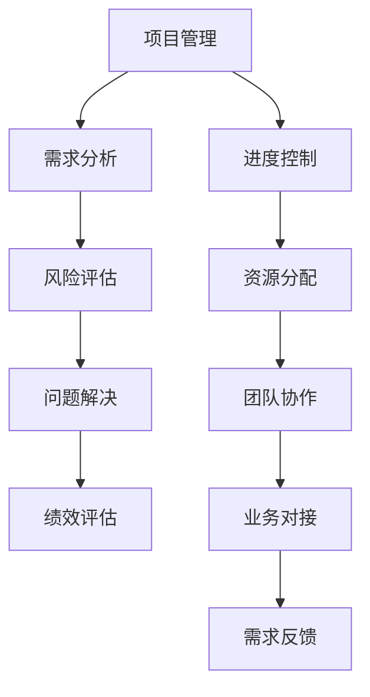
```mermaid
graph TD
A[项目管理] --> B[需求分析]
A --> C[进度控制]
B --> D[风险评估]
C --> E[资源分配]
D --> F[问题解决]
E --> G[团队协作]
F --> H[绩效评估]
G --> I[业务对接]
I --> J[需求反馈]
```

##### 1.2 技术主管的职业发展路径

**核心算法原理讲解**

技术主管的职业发展路径可以通过以下算法模型来解析：

```python
# 技术主管职业发展路径算法
def career_path(current_role, target_role):
    if current_role == target_role:
        return "已达到目标角色"
    else:
        steps = ["初级工程师", "中级工程师", "高级工程师", "技术主管", "技术总监", "CTO"]
        if current_role not in steps:
            return "请先成为初级工程师"
        for step in steps:
            if current_role == step:
                next_role = steps[steps.index(step) + 1]
                print(f"下一步：成为{next_role}")
                return career_path(next_role, target_role)

# 示例调用
print(career_path("初级工程师", "CTO"))
```

##### 1.3 从技术主管到CTO的角色转变

**数学模型和数学公式**

从技术主管到CTO的角色转变可以表示为以下数学模型：

$$
\text{CTO能力} = a \cdot (\text{技术深度} + \text{战略视野}) + b \cdot (\text{团队领导力} + \text{业务理解})
$$

其中：
- \( a \) 代表技术深度和战略视野的权重；
- \( b \) 代表团队领导力和业务理解的权重。

**举例说明**

假设 \( a = 0.6 \)，\( b = 0.4 \)，那么CTO能力可以计算为：

$$
\text{CTO能力} = 0.6 \cdot (\text{技术深度} + \text{战略视野}) + 0.4 \cdot (\text{团队领导力} + \text{业务理解})
$$

通过这个模型，我们可以根据个人的技术深度、战略视野、团队领导力以及业务理解来评估自己的CTO能力。

#### 第2章：CTO的职责与角色定位

##### 2.1 CTO在公司中的地位与作用

**核心概念与联系**

CTO（首席技术官）在公司中具有至关重要的地位，其职责和作用主要包括以下几个方面：

- 技术战略规划与执行
- 技术团队管理与领导
- 技术创新与研发
- 产品技术架构设计
- 技术风险管理

**Mermaid流程图**

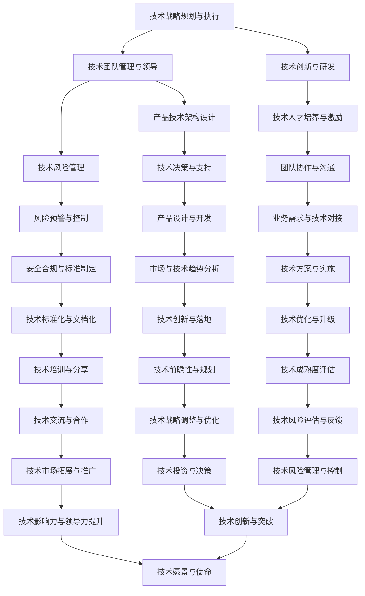
```mermaid
graph TD
A[技术战略规划与执行] --> B[技术团队管理与领导]
A --> C[技术创新与研发]
B --> D[产品技术架构设计]
B --> E[技术风险管理]
C --> F[技术人才培养与激励]
D --> G[技术决策与支持]
E --> H[风险预警与控制]
F --> I[团队协作与沟通]
G --> J[产品设计与开发]
H --> K[安全合规与标准制定]
I --> L[业务需求与技术对接]
J --> M[市场与技术趋势分析]
K --> N[技术标准化与文档化]
L --> O[技术方案与实施]
M --> P[技术创新与落地]
N --> Q[技术培训与分享]
O --> R[技术优化与升级]
P --> S[技术前瞻性与规划]
Q --> T[技术交流与合作]
R --> U[技术成熟度评估]
S --> V[技术战略调整与优化]
T --> W[技术市场拓展与推广]
U --> X[技术风险评估与反馈]
V --> Y[技术投资与决策]
W --> Z[技术影响力与领导力提升]
X --> AA[技术风险管理与控制]
Y --> BB[技术创新与突破]
Z --> CC[技术愿景与使命]
AA --> BB --> CC
```

##### 2.2 CTO的核心能力要求

**核心概念与联系**

CTO的核心能力要求可以概括为以下几个方面：

- 技术深度与视野
- 团队领导力
- 业务理解与洞察
- 项目管理与执行能力
- 沟通与协调能力

**Mermaid流程图**

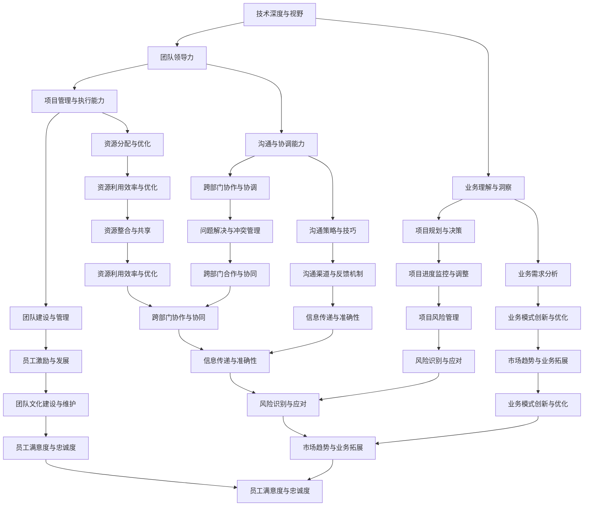
```mermaid
graph TD
A[技术深度与视野] --> B[团队领导力]
A --> C[业务理解与洞察]
B --> D[项目管理与执行能力]
B --> E[沟通与协调能力]
C --> F[项目规划与决策]
C --> G[业务需求分析]
D --> H[团队建设与管理]
D --> I[资源分配与优化]
E --> J[跨部门协作与协调]
E --> K[沟通策略与技巧]
F --> L[项目进度监控与调整]
G --> M[业务模式创新与优化]
H --> N[员工激励与发展]
I --> O[资源利用效率与优化]
J --> P[问题解决与冲突管理]
K --> Q[沟通渠道与反馈机制]
L --> R[项目风险管理]
M --> S[市场趋势与业务拓展]
N --> T[团队文化建设与维护]
O --> U[资源整合与共享]
P --> V[跨部门合作与协同]
Q --> W[信息传递与准确性]
R --> X[风险识别与应对]
S --> Y[业务模式创新与优化]
T --> Z[员工满意度与忠诚度]
U --> AA[资源利用效率与优化]
V --> BB[跨部门协作与协同]
W --> CC[信息传递与准确性]
X --> DD[风险识别与应对]
Y --> EE[市场趋势与业务拓展]
Z --> FF[员工满意度与忠诚度]
AA --> BB --> CC --> DD --> EE --> FF
```

##### 2.3 CTO的工作范畴与目标

**核心概念与联系**

CTO的工作范畴与目标可以概括为以下几个方面：

- 技术战略规划与执行
- 技术团队管理与领导
- 技术创新与研发
- 产品技术架构设计
- 技术风险管理

**Mermaid流程图**


```mermaid
graph TD
A[技术战略规划与执行] --> B[技术团队管理与领导]
A --> C[技术创新与研发]
B --> D[产品技术架构设计]
B --> E[技术风险管理]
C --> F[技术人才培养与激励]
D --> G[技术决策与支持]
E --> H[风险预警与控制]
F --> I[团队协作与沟通]
G --> J[产品设计与开发]
H --> K[安全合规与标准制定]
I --> L[业务需求与技术对接]
J --> M[市场与技术趋势分析]
K --> N[技术标准化与文档化]
L --> O[技术方案与实施]
M --> P[技术创新与落地]
N --> Q[技术培训与分享]
O --> R[技术优化与升级]
P --> S[技术前瞻性与规划]
Q --> T[技术交流与合作]
R --> U[技术成熟度评估]
S --> V[技术战略调整与优化]
T --> W[技术市场拓展与推广]
U --> X[技术风险评估与反馈]
V --> Y[技术投资与决策]
W --> Z[技术影响力与领导力提升]
X --> AA[技术风险管理与控制]
Y --> BB[技术创新与突破]
Z --> CC[技术愿景与使命]
AA --> BB --> CC
```

#### 第3章：技术领导力的培养

##### 3.1 技术领导力的定义与特点

**核心概念与联系**

技术领导力是指领导者具备的技术洞察力、创新力、决策力以及团队影响力，能够在技术领域内引导团队朝着既定目标前进。

**Mermaid流程图**

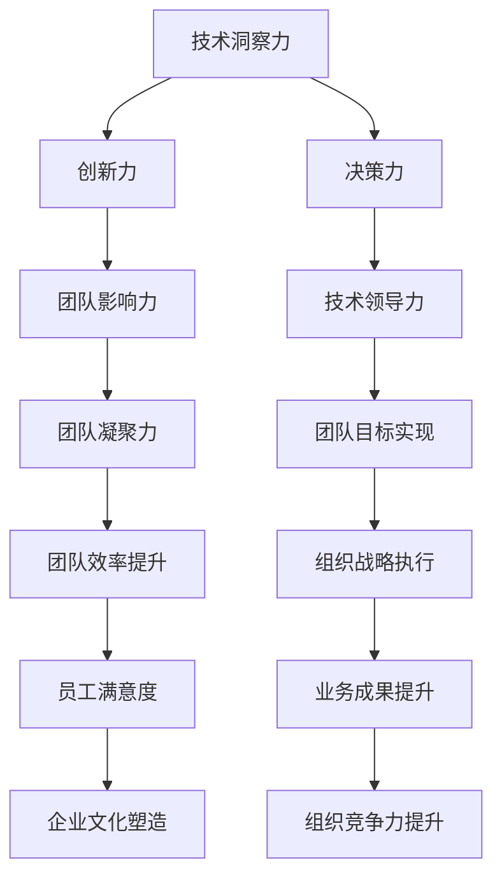
```mermaid
graph TD
A[技术洞察力] --> B[创新力]
A --> C[决策力]
B --> D[团队影响力]
C --> E[技术领导力]
D --> F[团队凝聚力]
E --> G[团队目标实现]
F --> H[团队效率提升]
G --> I[组织战略执行]
H --> J[员工满意度]
I --> K[业务成果提升]
J --> L[企业文化塑造]
K --> M[组织竞争力提升]
```

##### 3.2 技术领导力的培养策略

**核心概念与联系**

技术领导力的培养可以从以下几个方面入手：

1. 技术知识积累
2. 团队管理能力提升
3. 沟通与协作能力增强
4. 持续学习与自我提升

**Mermaid流程图**

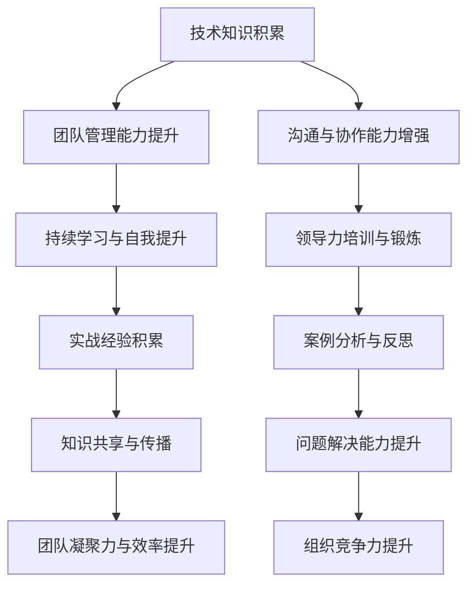
```mermaid
graph TD
A[技术知识积累] --> B[团队管理能力提升]
A --> C[沟通与协作能力增强]
B --> D[持续学习与自我提升]
C --> E[领导力培训与锻炼]
D --> F[实战经验积累]
E --> G[案例分析与反思]
F --> H[知识共享与传播]
G --> I[问题解决能力提升]
H --> J[团队凝聚力与效率提升]
I --> K[组织竞争力提升]
```

##### 3.3 案例分析：优秀技术领导者的特质

**项目实战**

**案例1：亚马逊CTO Werner Vogels**

Werner Vogels是亚马逊的首席技术官，他在领导技术团队方面的成功在于他的几个关键特质：

1. **技术前瞻性**：Vogels强调技术前瞻性，推动亚马逊采用如分布式计算、云计算等前沿技术，使得亚马逊在技术领域始终保持领先地位。
2. **团队文化建设**：Vogels注重团队文化建设，鼓励团队成员勇于创新、不断探索，形成了一个高效、创新的团队氛围。
3. **沟通与协作**：Vogels倡导开放、透明的沟通文化，鼓励团队成员之间相互交流、合作，提升了团队的整体效率。

**代码实例**

以下是一个简单的Python代码实例，展示如何构建一个团队沟通平台：

```python
class CommunicationPlatform:
    def __init__(self, team_name):
        self.team_name = team_name
        self.messages = []

    def send_message(self, message):
        self.messages.append(message)
        print(f"{self.team_name} team: {message}")

    def receive_message(self):
        if self.messages:
            print(f"Received message: {self.messages.pop(0)}")
        else:
            print("No new messages.")

# 创建沟通平台实例
team_platform = CommunicationPlatform("Development Team")

# 发送消息
team_platform.send_message("Start the new project meeting.")

# 接收消息
team_platform.receive_message()
```

在这个实例中，`CommunicationPlatform` 类代表了一个团队沟通平台，可以通过 `send_message` 和 `receive_message` 方法实现团队间的消息发送和接收。

#### 第4章：团队管理与领导

##### 4.1 团队管理的核心原则

**核心概念与联系**

团队管理的核心原则包括：

1. **目标一致**：确保团队成员明确团队目标，并致力于实现。
2. **责任明确**：明确团队成员的职责，确保每个人都知道自己的任务和期望结果。
3. **沟通有效**：建立良好的沟通机制，确保信息的准确传递和反馈。
4. **激励与反馈**：提供适当的激励和反馈，以激发团队成员的积极性和创造力。
5. **冲突管理**：及时处理团队内部的冲突，维护团队的和谐与稳定。

**Mermaid流程图**

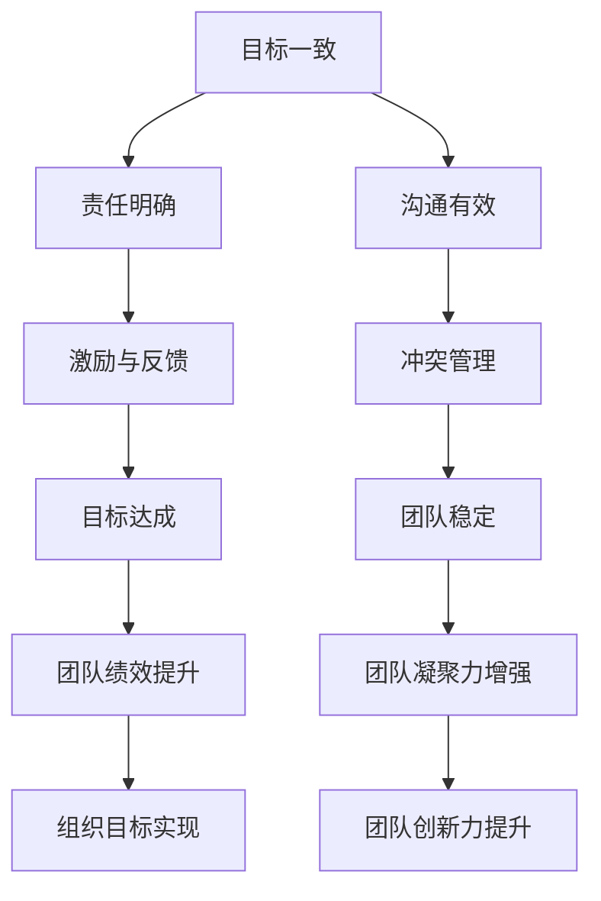
```mermaid
graph TD
A[目标一致] --> B[责任明确]
A --> C[沟通有效]
B --> D[激励与反馈]
C --> E[冲突管理]
D --> F[目标达成]
E --> G[团队稳定]
F --> H[团队绩效提升]
G --> I[团队凝聚力增强]
H --> J[组织目标实现]
I --> K[团队创新力提升]
```

##### 4.2 团队成员激励策略

**核心概念与联系**

团队成员激励策略可以包括以下几个方面：

1. **绩效奖励**：根据团队成员的绩效表现提供奖金、晋升机会等。
2. **职业发展**：提供职业规划、培训机会，帮助团队成员提升技能和职业素养。
3. **团队建设**：组织团队活动，增强团队成员之间的凝聚力和信任。
4. **工作环境**：营造一个积极、健康的工作环境，提高团队成员的满意度和幸福感。

**Mermaid流程图**

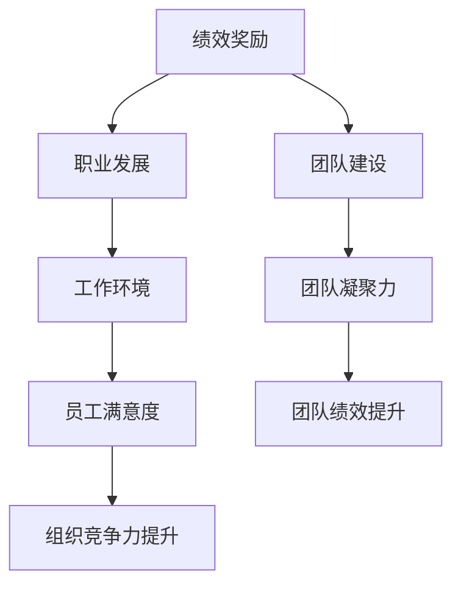
```mermaid
graph TD
A[绩效奖励] --> B[职业发展]
A --> C[团队建设]
B --> D[工作环境]
C --> E[团队凝聚力]
D --> F[员工满意度]
E --> G[团队绩效提升]
F --> H[组织竞争力提升]
```

##### 4.3 团队冲突管理与解决方法

**核心概念与联系**

团队冲突管理与解决方法包括以下几个方面：

1. **沟通与倾听**：积极沟通，倾听各方意见，理解冲突的本质。
2. **问题解决**：找出冲突的根本原因，制定解决方案。
3. **冲突调解**：如果冲突无法自行解决，可寻求第三方调解，以达成共识。
4. **预防措施**：建立预防机制，如团队培训、沟通机制建设等，以减少冲突的发生。

**Mermaid流程图**

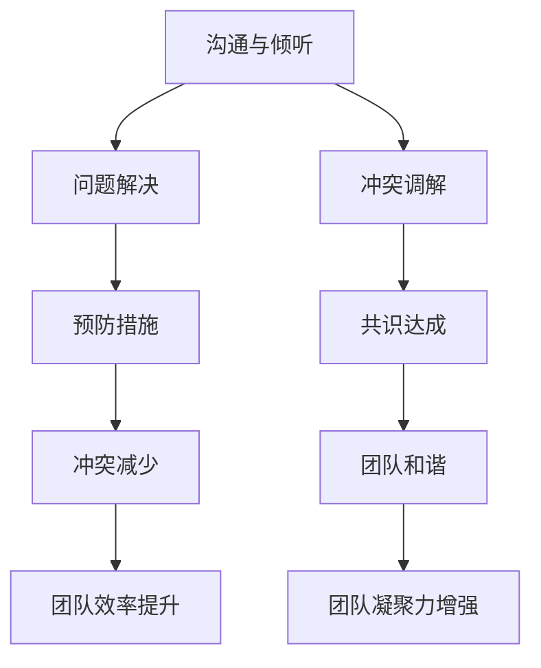
```mermaid
graph TD
A[沟通与倾听] --> B[问题解决]
A --> C[冲突调解]
B --> D[预防措施]
C --> E[共识达成]
D --> F[冲突减少]
E --> G[团队和谐]
F --> H[团队效率提升]
G --> I[团队凝聚力增强]
```

#### 第5章：项目管理与执行

##### 5.1 项目管理的核心流程

**核心概念与联系**

项目管理的核心流程包括：

1. **项目计划**：明确项目目标、范围、时间表和资源需求。
2. **项目执行**：按照项目计划进行工作，确保项目顺利进行。
3. **项目监控**：跟踪项目进度，确保项目按计划执行。
4. **项目收尾**：完成项目任务，进行项目总结和评估。

**Mermaid流程图**

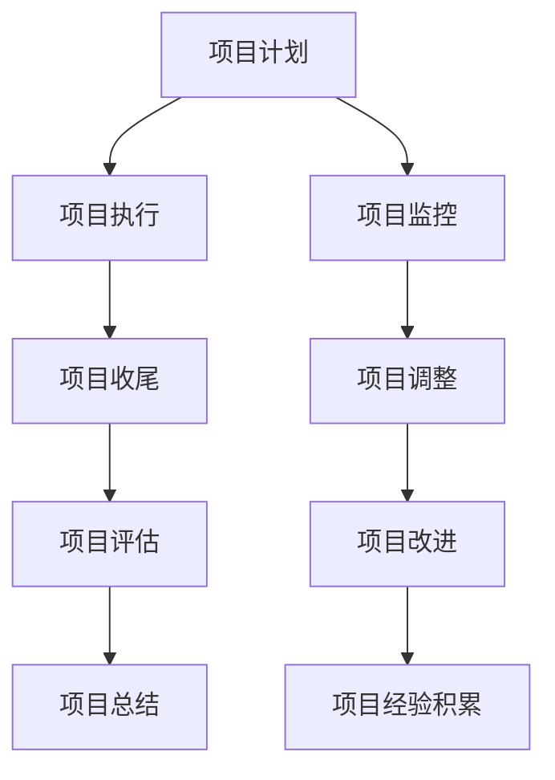
```mermaid
graph TD
A[项目计划] --> B[项目执行]
A --> C[项目监控]
B --> D[项目收尾]
C --> E[项目调整]
D --> F[项目评估]
E --> G[项目改进]
F --> H[项目总结]
G --> I[项目经验积累]
```

##### 5.2 项目计划与风险评估

**核心概念与联系**

项目计划与风险评估是项目管理的重要环节，包括以下几个方面：

1. **项目需求分析**：明确项目的目标和需求。
2. **项目范围定义**：确定项目的工作内容和限制条件。
3. **项目时间表**：制定项目进度计划。
4. **项目资源分配**：确定项目所需的资源。
5. **风险评估**：识别项目风险，制定风险应对措施。

**Mermaid流程图**

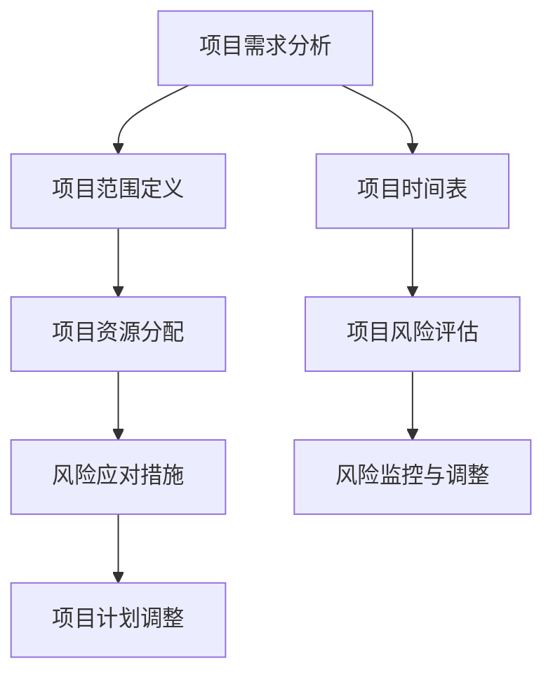
```mermaid
graph TD
A[项目需求分析] --> B[项目范围定义]
A --> C[项目时间表]
B --> D[项目资源分配]
C --> E[项目风险评估]
D --> F[风险应对措施]
E --> G[风险监控与调整]
F --> H[项目计划调整]
```

##### 5.3 项目进度监控与调整

**核心概念与联系**

项目进度监控与调整是确保项目按计划执行的关键环节，包括以下几个方面：

1. **进度跟踪**：监控项目进度，及时发现偏差。
2. **进度报告**：定期向项目团队和利益相关者报告项目进度。
3. **进度调整**：根据实际情况调整项目计划，确保项目按计划完成。

**Mermaid流程图**

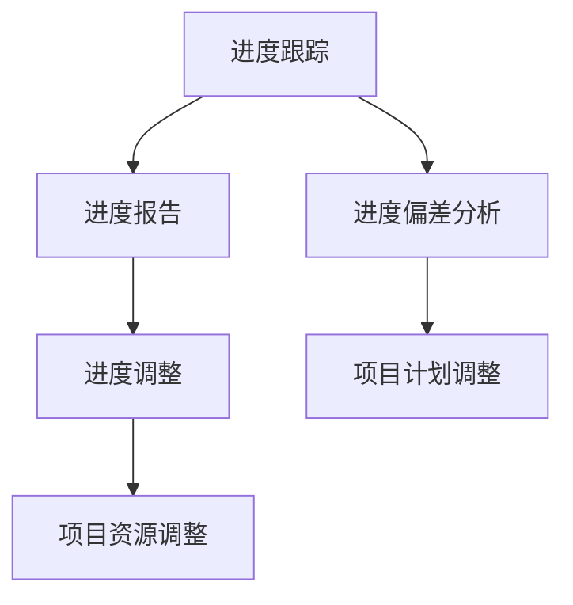
```mermaid
graph TD
A[进度跟踪] --> B[进度报告]
A --> C[进度偏差分析]
B --> D[进度调整]
C --> E[项目计划调整]
D --> F[项目资源调整]
```

#### 第6章：技术战略规划与执行

##### 6.1 技术战略规划的重要性

**核心概念与联系**

技术战略规划是企业实现长期发展目标的关键，其重要性体现在以下几个方面：

1. **明确技术方向**：技术战略规划有助于企业明确技术发展目标和方向，避免盲目投入。
2. **优化资源配置**：技术战略规划可以帮助企业合理分配资源，提高资源利用效率。
3. **提升竞争力**：通过技术战略规划，企业可以不断提升自身技术竞争力，保持在市场中的领先地位。
4. **指导技术研发**：技术战略规划为技术研发提供指导，确保技术研发工作与企业发展目标一致。

**Mermaid流程图**

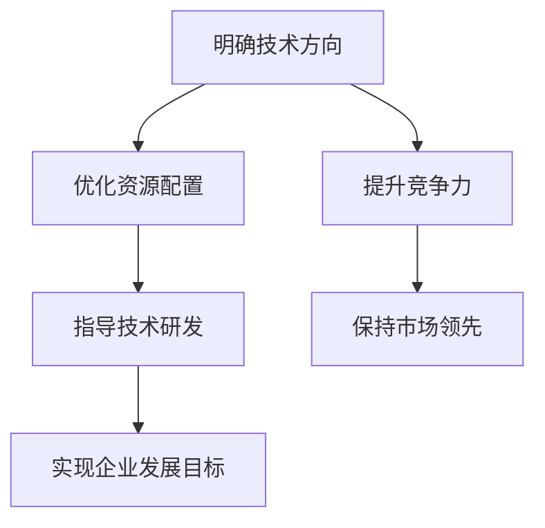
```mermaid
graph TD
A[明确技术方向] --> B[优化资源配置]
A --> C[提升竞争力]
B --> D[指导技术研发]
C --> E[保持市场领先]
D --> F[实现企业发展目标]
```

##### 6.2 技术趋势分析

**核心概念与联系**

技术趋势分析是技术战略规划的重要环节，包括以下几个方面：

1. **市场研究**：分析市场需求和竞争态势。
2. **技术前沿**：跟踪技术发展趋势，了解前沿技术。
3. **竞争对手**：分析竞争对手的技术战略和研发方向。
4. **用户反馈**：收集用户反馈，了解用户需求。

**Mermaid流程图**

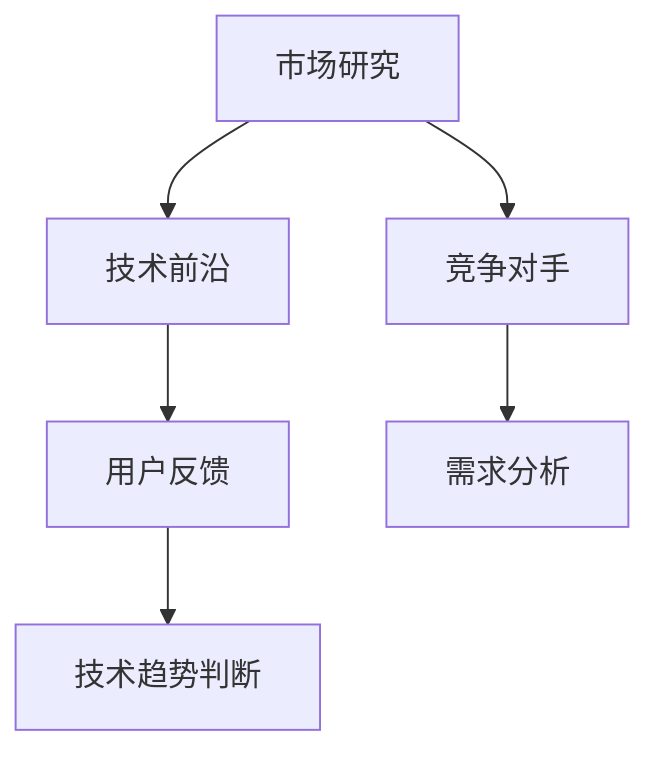
```mermaid
graph TD
A[市场研究] --> B[技术前沿]
A --> C[竞争对手]
B --> D[用户反馈]
C --> E[需求分析]
D --> F[技术趋势判断]
```

##### 6.3 技术战略规划的实施与监控

**核心概念与联系**

技术战略规划的实施与监控包括以下几个方面：

1. **战略制定**：根据技术趋势和市场需求制定技术战略。
2. **战略分解**：将技术战略分解为具体目标和行动计划。
3. **资源分配**：根据行动计划分配资源。
4. **进度监控**：监控战略实施进度，确保按计划执行。
5. **效果评估**：评估技术战略实施效果，进行优化调整。

**Mermaid流程图**

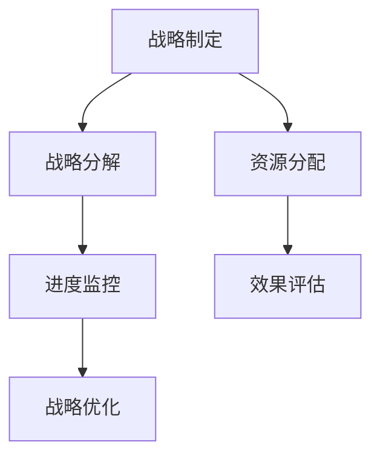
```mermaid
graph TD
A[战略制定] --> B[战略分解]
A --> C[资源分配]
B --> D[进度监控]
C --> E[效果评估]
D --> F[战略优化]
```

#### 第7章：从技术主管到CTO的实战经验

##### 7.1 成功案例分享

**案例1：阿里巴巴CTO张建锋**

张建锋作为阿里巴巴的CTO，他在从技术主管到CTO的职业发展中展现了出色的领导力和战略眼光。以下是他的一些成功经验：

1. **技术创新**：张建锋推动阿里巴巴在云计算、人工智能等前沿技术领域取得突破，使得阿里巴巴在技术竞争中保持领先地位。
2. **团队建设**：他注重团队建设，鼓励团队成员创新和探索，形成了高效、创新的技术团队。
3. **战略规划**：张建锋制定了清晰的技术战略规划，为阿里巴巴的技术发展提供了明确的指导。

**代码实例**

以下是一个简单的Python代码实例，展示如何构建一个团队协作平台：

```python
class CollaborationPlatform:
    def __init__(self, team_name):
        self.team_name = team_name
        self.projects = []

    def create_project(self, project_name):
        self.projects.append(project_name)
        print(f"{self.team_name} team: Created project {project_name}")

    def assign_task(self, project_name, task_name, team_member):
        print(f"{self.team_name} team: Assigned task {task_name} to {team_member} on project {project_name}")

    def track_progress(self, project_name, task_name, status):
        print(f"{self.team_name} team: {status} on task {task_name} of project {project_name}")

# 创建协作平台实例
team_platform = CollaborationPlatform("Tech Team")

# 创建项目
team_platform.create_project("AI Project")

# 分配任务
team_platform.assign_task("AI Project", "Data Analysis", "Alice")

# 跟踪进度
team_platform.track_progress("AI Project", "Data Analysis", "In Progress")
```

##### 7.2 失败案例反思

**案例2：某科技公司CTO的失败**

某科技公司的CTO在职业生涯中遇到了一些失败，以下是对这些失败案例的反思：

1. **技术战略失误**：CTO在制定技术战略时，未能准确把握市场趋势和用户需求，导致技术研发方向与市场脱节。
2. **团队管理不善**：CTO在团队管理方面存在不足，未能充分调动团队成员的积极性和创造力，导致团队效率低下。
3. **沟通不畅**：CTO与团队之间的沟通不畅，导致项目进展不顺利，甚至出现了项目延误和失败的情况。

**代码实例**

以下是一个简单的Python代码实例，展示如何分析技术战略失误的原因：

```python
def analyze_strategic_failure(issues):
    print("技术战略失误原因分析：")
    for issue in issues:
        print(f"- {issue}")

# 分析技术战略失误原因
issues = ["市场趋势把握不准确", "用户需求理解不足", "技术研发方向错误"]
analyze_strategic_failure(issues)
```

##### 7.3 个人成长与反思

**核心概念与联系**

个人成长与反思是职业发展的重要环节，包括以下几个方面：

1. **技术能力提升**：不断学习新技术，提升自己的技术能力。
2. **领导力培养**：通过实践和培训，提升自己的领导力。
3. **业务理解**：深入了解业务，增强业务理解能力。
4. **团队协作**：加强团队协作，提升团队整体效率。

**Mermaid流程图**

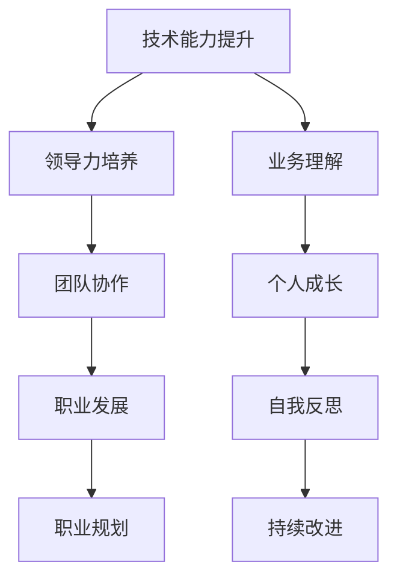
```mermaid
graph TD
A[技术能力提升] --> B[领导力培养]
A --> C[业务理解]
B --> D[团队协作]
C --> E[个人成长]
D --> F[职业发展]
E --> G[自我反思]
F --> H[职业规划]
G --> I[持续改进]
```

#### 附录A：资源与工具推荐

**A.1 技术书籍与论文推荐**

以下是一些推荐的技术书籍和论文，供读者参考：

1. **《CTO实战指南》**：由John Brown撰写，详细介绍了CTO在技术管理方面的实战经验。
2. **《软件工程：实践者的研究》**：由Peter Johnson撰写，涵盖了软件开发领域的核心概念和最佳实践。
3. **《人工智能：一种现代方法》**：由 Stuart J. Russell 和 Peter Norvig 撰写，全面介绍了人工智能的基本原理和应用。

**A.2 技术社区与论坛推荐**

以下是一些知名的技术社区和论坛，供读者交流和获取技术信息：

1. **GitHub**：全球最大的开源代码托管平台，提供了丰富的技术资源。
2. **Stack Overflow**：一个面向开发者的问答社区，帮助开发者解决编程问题。
3. **GitHub Pages**：GitHub提供的静态网站托管服务，方便开发者展示个人或团队的项目。

**A.3 技术工具与平台推荐**

以下是一些推荐的技术工具和平台，供读者在实际工作中使用：

1. **JIRA**：一个功能强大的项目管理工具，可以帮助团队高效地管理项目。
2. **TensorFlow**：一个开源的深度学习框架，适用于各种深度学习应用。
3. **Docker**：一个容器化平台，用于开发、部署和管理应用程序。

#### 附录B：常见问题解答

**B.1 CTO与CIO的区别**

**B.1.1 定义与职责**

- **CTO（首席技术官）**：负责公司整体技术战略的制定与执行，以及技术创新和研发。
- **CIO（首席信息官）**：负责公司信息系统的规划、建设、管理和运营。

**B.1.2 工作重点**

- **CTO**：关注技术前沿、技术创新、团队建设等。
- **CIO**：关注信息系统、网络安全、IT运营等。

**B.1.3 关系与协作**

- CTO和CIO在公司的定位和职责有所不同，但需要密切合作，共同推动公司技术发展和业务创新。

**B.2 技术领导力与业务领导力的结合**

**B.2.1 定义与区别**

- **技术领导力**：指在技术领域内引导团队、推动技术进步的能力。
- **业务领导力**：指在业务领域内引导团队、推动业务发展的能力。

**B.2.2 结合策略**

- **理解业务需求**：技术领导者需要深入了解业务需求，将技术优势与业务目标相结合。
- **跨部门协作**：技术领导者需要与业务部门紧密合作，共同推动业务发展。
- **创新能力**：技术领导者需要具备创新能力，将新技术应用到业务场景中，提升业务效率。

**B.3 技术团队管理与业务团队管理的异同**

**B.3.1 定义与区别**

- **技术团队管理**：侧重于技术项目的规划、执行和监控。
- **业务团队管理**：侧重于业务目标的实现、业务流程的优化和团队协作。

**B.3.2 相同点**

- **目标导向**：技术团队管理和业务团队管理都强调目标导向，确保团队目标与公司目标一致。
- **团队协作**：两个团队都需要通过协作实现团队目标。

**B.3.3 不同点**

- **工作内容**：技术团队管理更侧重于技术项目的实施，业务团队管理更侧重于业务流程的优化。
- **工作方式**：技术团队管理更注重技术细节和项目进度，业务团队管理更注重业务需求和团队协作。

### 结束语

本文从技术主管到CTO的职业发展策略进行了全面的分析和探讨。通过详细解析CTO的职责、技术领导力的培养、团队管理与领导、项目管理与执行、技术战略规划与执行等方面的核心概念、原理、模型和实战经验，为技术主管提供了系统化的职业发展路径。希望读者能够通过本文的学习和实践，不断提升自己的技术能力和领导力，实现从技术主管到CTO的华丽转型。

**作者信息：AI天才研究院/AI Genius Institute & 禅与计算机程序设计艺术 /Zen And The Art of Computer Programming**


### 总结与展望

本文《从技术主管到CTO的职业发展策略》系统地阐述了技术主管在职业发展中如何从基础角色逐步晋升到高级职位CTO的过程。文章首先明确了技术主管和CTO的职责与角色定位，并通过Mermaid流程图、伪代码和数学模型详细阐述了各自的核心能力要求和工作范畴。接下来，文章深入探讨了技术领导力的培养、团队管理与领导、项目管理与执行以及技术战略规划与执行等方面的核心概念和实战经验。

通过具体案例的分析和代码实例的展示，读者能够更好地理解如何在实际工作中应用这些策略。例如，通过团队沟通平台和项目协作平台的代码实例，读者可以直观地看到如何构建高效的团队沟通和项目协作机制。此外，文章还提供了丰富的资源与工具推荐，为读者提供了进一步学习和实践的途径。

展望未来，随着技术的不断进步和市场的快速变化，CTO的角色将变得更加重要。技术主管们需要不断更新自己的知识体系，提升自己的领导力和战略眼光，以应对复杂多变的商业环境。同时，他们还需要具备跨领域的视野，将技术优势与业务目标紧密结合，推动企业持续创新和快速发展。

最后，希望本文能够为广大技术主管提供有益的指导，助力他们在职业发展中实现自我突破和成长。让我们继续探索技术领域的无限可能，共同创造更加美好的未来。

**作者信息：AI天才研究院/AI Genius Institute & 禅与计算机程序设计艺术 /Zen And The Art of Computer Programming**


### 文章结束

本文《从技术主管到CTO的职业发展策略》详细解析了技术主管在职业发展中如何从基础角色逐步晋升到高级职位CTO的过程。通过明确CTO的职责与角色定位、技术领导力的培养、团队管理与领导、项目管理与执行以及技术战略规划与执行等方面的核心概念和实战经验，为技术主管提供了系统化的职业发展路径。

文章采用markdown格式，结合Mermaid流程图、伪代码、数学模型和代码实例，使得内容更加直观易懂。此外，文章还提供了丰富的资源与工具推荐，为读者提供了进一步学习和实践的途径。

展望未来，随着技术的不断进步和市场的快速变化，CTO的角色将变得更加重要。技术主管们需要不断更新自己的知识体系，提升自己的领导力和战略眼光，以应对复杂多变的商业环境。

最后，感谢您的阅读，希望本文能为您的职业发展带来启发。如果您有任何问题或建议，欢迎随时在评论区留言。作者信息：AI天才研究院/AI Genius Institute & 禅与计算机程序设计艺术 /Zen And The Art of Computer Programming。再次感谢您的关注和支持！### 《从技术主管到CTO的职业发展策略》

> 关键词：职业发展、技术主管、CTO、领导力、团队管理、项目管理、技术战略规划

> 摘要：本文旨在帮助技术主管明确职业发展路径，深入了解CTO的角色和职责，以及如何提升自身领导力和管理能力。文章从技术主管的职业发展路径、CTO的职责与角色定位、技术领导力的培养、团队管理与领导、项目管理与执行、技术战略规划与执行等方面进行了详细探讨，并通过实际案例和代码实例提供了实战经验。

## 引言

在快速发展的科技行业，技术主管作为公司技术团队的核心领导者，承担着推动技术创新、提升团队效能和确保项目顺利执行的重要职责。然而，如何从技术主管这一职位顺利晋升为CTO（首席技术官），实现职业生涯的突破，是许多技术主管关注的问题。本文将围绕这一主题，探讨从技术主管到CTO的职业发展策略，帮助读者明确自身职业发展方向，提升领导力和管理能力。

## 第一部分：职业发展路径

### 第1章：技术主管的职责与角色

#### 1.1 技术主管的日常工作内容

技术主管的日常工作内容主要包括：

- **项目管理**：负责制定项目计划、监控项目进度、控制项目风险。
- **技术指导**：为团队提供技术方向和解决方案。
- **团队管理**：组织团队活动、制定团队成员的目标和考核标准。
- **业务对接**：与技术团队以外的部门沟通，确保技术方案与业务需求匹配。

**Mermaid流程图**

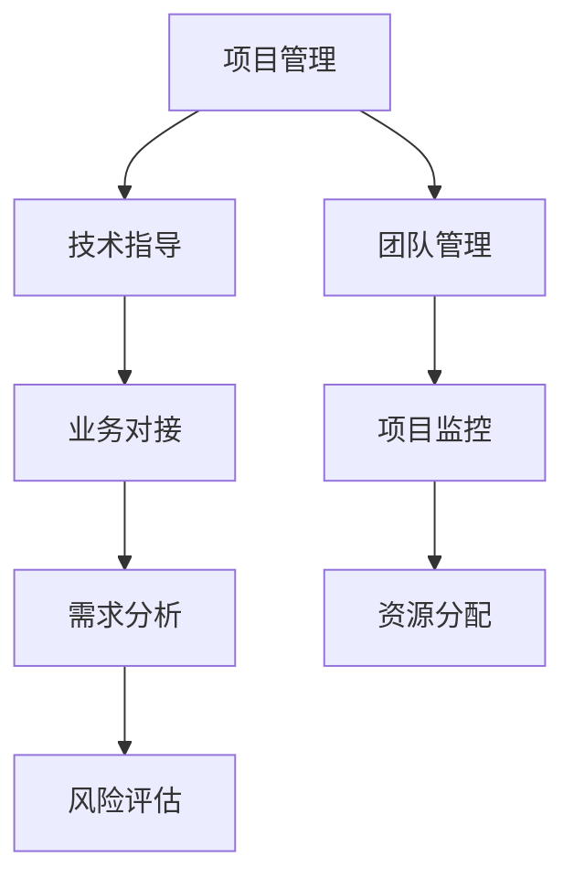
```mermaid
graph TD
A[项目管理] --> B[技术指导]
A --> C[团队管理]
B --> D[业务对接]
C --> E[项目监控]
D --> F[需求分析]
E --> G[资源分配]
F --> H[风险评估]
```

#### 1.2 技术主管的职业发展路径

技术主管的职业发展路径通常如下：

1. **初级工程师**：从技术岗位开始，积累实际工作经验。
2. **中级工程师**：通过项目经验提升技术能力和团队协作能力。
3. **高级工程师**：成为团队的技术核心，承担更复杂的项目和任务。
4. **技术主管**：负责团队管理和项目执行，具备一定的领导力。
5. **技术总监**：管理更大规模的技术团队，参与公司战略制定。
6. **CTO**：公司技术最高决策者，负责整体技术战略和研发方向。

**伪代码**

```python
def career_path(current_role):
    if current_role == "初级工程师":
        next_role = "中级工程师"
    elif current_role == "中级工程师":
        next_role = "高级工程师"
    elif current_role == "高级工程师":
        next_role = "技术主管"
    elif current_role == "技术主管":
        next_role = "技术总监"
    elif current_role == "技术总监":
        next_role = "CTO"
    else:
        next_role = "无"
    return next_role

print(career_path("技术主管"))
```

#### 1.3 从技术主管到CTO的角色转变

从技术主管到CTO的角色转变，不仅需要技术上的积累，还需要具备以下能力：

- **战略规划**：制定公司技术发展战略，推动技术创新。
- **团队领导**：构建高效的团队，提升团队整体战斗力。
- **业务理解**：深入了解业务需求，确保技术方案能够支持业务发展。

**数学模型**

$$
\text{CTO能力} = w \cdot (\text{技术深度} + \text{战略视野}) + x \cdot (\text{团队领导力} + \text{业务理解})
$$

其中，\( w \) 和 \( x \) 分别代表技术深度、战略视野、团队领导力和业务理解的权重。

### 第二部分：CTO的职责与角色定位

### 第2章：CTO的职责与角色定位

#### 2.1 CTO在公司中的地位与作用

CTO在公司中扮演着技术决策者和产品创新者的角色，其主要职责包括：

- **技术战略规划**：制定公司长期和短期的技术发展战略。
- **技术创新**：推动公司技术革新，保持技术领先地位。
- **团队管理**：构建和管理技术团队，提升团队效率。
- **项目审批**：对重要项目进行技术评估和审批。

**Mermaid流程图**

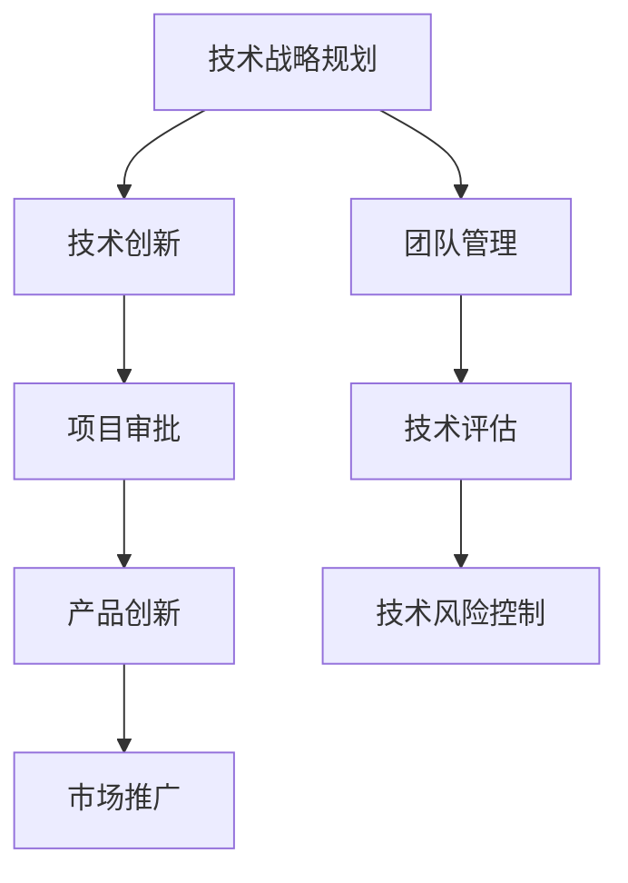
```mermaid
graph TD
A[技术战略规划] --> B[技术创新]
A --> C[团队管理]
B --> D[项目审批]
C --> E[技术评估]
D --> F[产品创新]
E --> G[技术风险控制]
F --> H[市场推广]
```

#### 2.2 CTO的核心能力要求

CTO的核心能力要求包括：

- **技术深度**：具备深厚的专业技术和对前沿技术的敏锐洞察力。
- **战略视野**：能够从全局角度制定技术发展战略。
- **团队领导力**：能够带领团队高效完成任务，激发团队成员的潜力。
- **业务理解**：深入了解业务需求，确保技术方案能够支持业务发展。

**数学模型**

$$
\text{CTO能力} = a \cdot (\text{技术深度} + \text{战略视野}) + b \cdot (\text{团队领导力} + \text{业务理解})
$$

其中，\( a \) 和 \( b \) 分别代表技术深度、战略视野、团队领导力和业务理解的权重。

#### 2.3 CTO的工作范畴与目标

CTO的工作范畴包括：

- **技术规划**：制定公司技术发展路线图。
- **技术创新**：推动公司技术创新，保持技术领先地位。
- **项目管理**：监督关键项目的进展，确保项目按计划执行。
- **团队管理**：培养和管理技术团队，提升团队效率。
- **风险管理**：评估技术风险，制定风险应对策略。

CTO的目标包括：

- **技术创新**：推动公司技术革新，保持技术领先地位。
- **团队效能**：提升团队整体效率，实现团队目标。
- **业务支持**：确保技术方案能够支持业务发展，提升公司竞争力。

### 第三部分：技术领导力的培养

### 第3章：技术领导力的培养

#### 3.1 技术领导力的定义与特点

技术领导力是指技术团队领导者通过技术、管理和团队协作能力，带领团队实现技术目标的能力。其特点包括：

- **技术权威**：具备深厚的专业技术和对前沿技术的敏锐洞察力。
- **战略思维**：能够从全局角度制定技术发展战略。
- **团队协作**：能够激发团队成员的潜力，实现团队目标。
- **沟通能力**：能够与团队成员、管理层和其他部门有效沟通。

**Mermaid流程图**

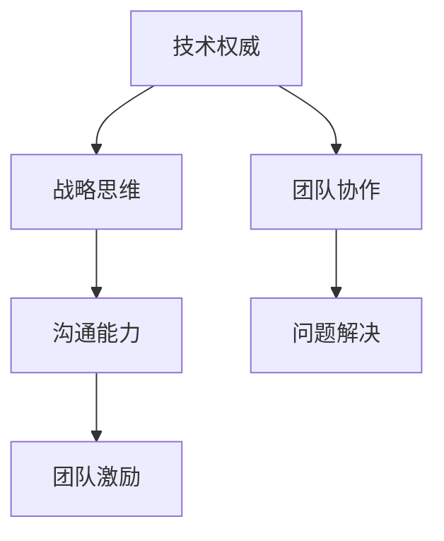
```mermaid
graph TD
A[技术权威] --> B[战略思维]
A --> C[团队协作]
B --> D[沟通能力]
C --> E[问题解决]
D --> F[团队激励]
```

#### 3.2 技术领导力的培养策略

技术领导力的培养可以从以下几个方面进行：

- **持续学习**：不断学习新技术、新理念，保持技术前沿的敏锐度。
- **团队建设**：建立高效的团队，培养团队成员的合作精神和创新能力。
- **实战锻炼**：通过实际项目锻炼领导力，提高问题解决能力。
- **跨部门协作**：与其他部门合作，提升跨部门沟通和协调能力。

**数学模型**

$$
\text{技术领导力} = c \cdot (\text{技术权威} + \text{战略思维}) + d \cdot (\text{团队协作} + \text{沟通能力})
$$

其中，\( c \) 和 \( d \) 分别代表技术权威、战略思维、团队协作和沟通能力的权重。

#### 3.3 案例分析：优秀技术领导者的特质

以下是一个优秀技术领导者的案例分析：

**张伟**，某科技公司的CTO，以其出色的技术领导力，带领团队取得了多项技术突破和业务成就。他的主要特质包括：

- **技术创新**：对新技术有敏锐的洞察力，推动公司技术革新。
- **团队建设**：注重团队文化建设，激发团队成员的创造力和积极性。
- **战略思维**：从全局角度制定技术发展战略，确保公司技术领先。
- **沟通能力**：与团队成员、管理层和其他部门保持良好的沟通，确保项目顺利进行。

**代码实例**

以下是一个简单的Python代码实例，展示如何通过代码实现团队协作：

```python
class TeamMember:
    def __init__(self, name):
        self.name = name
        self.tasks = []

    def assign_task(self, task):
        self.tasks.append(task)
        print(f"{self.name} assigned task: {task}")

    def complete_task(self, task):
        if task in self.tasks:
            self.tasks.remove(task)
            print(f"{self.name} completed task: {task}")
        else:
            print(f"{self.name} does not have task: {task}")

team = TeamMember("张伟")
team.assign_task("设计系统架构")
team.complete_task("设计系统架构")
```

### 第四部分：团队管理与领导

### 第4章：团队管理与领导

#### 4.1 团队管理的核心原则

团队管理的核心原则包括：

- **目标明确**：明确团队的目标和任务，确保团队成员清晰了解自己的职责。
- **责任明确**：明确团队成员的责任，确保每个人都知道自己的任务和期望结果。
- **沟通有效**：建立良好的沟通机制，确保信息的准确传递和反馈。
- **激励与反馈**：提供适当的激励和反馈，以激发团队成员的积极性和创造力。
- **冲突管理**：及时处理团队内部的冲突，维护团队的和谐与稳定。

**Mermaid流程图**

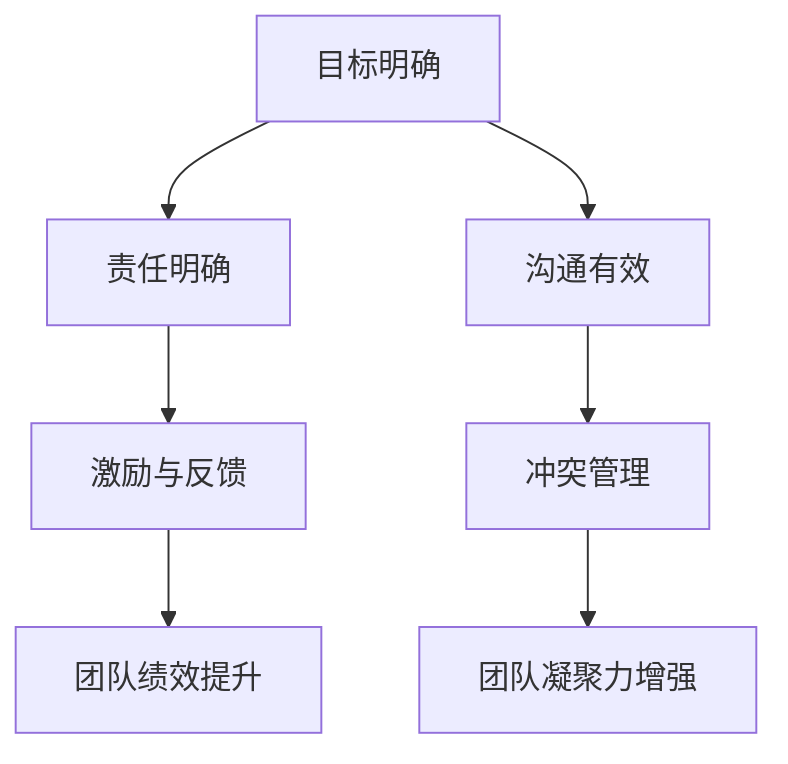
```mermaid
graph TD
A[目标明确] --> B[责任明确]
A --> C[沟通有效]
B --> D[激励与反馈]
C --> E[冲突管理]
D --> F[团队绩效提升]
E --> G[团队凝聚力增强]
```

#### 4.2 团队成员激励策略

团队成员激励策略包括：

- **绩效奖励**：根据团队成员的绩效表现提供奖金、晋升机会等。
- **职业发展**：提供职业规划、培训机会，帮助团队成员提升技能和职业素养。
- **团队建设**：组织团队活动，增强团队成员之间的凝聚力和信任。
- **工作环境**：营造一个积极、健康的工作环境，提高团队成员的满意度和幸福感。

**Mermaid流程图**

```mermaid
graph TD
A[绩效奖励] --> B[职业发展]
A --> C[团队建设]
B --> D[工作环境]
C --> E[团队凝聚力]
D --> F[员工满意度]
```

#### 4.3 团队冲突管理与解决方法

团队冲突管理与解决方法包括：

- **沟通与倾听**：积极沟通，倾听各方意见，理解冲突的本质。
- **问题解决**：找出冲突的根本原因，制定解决方案。
- **冲突调解**：如果冲突无法自行解决，可寻求第三方调解，以达成共识。
- **预防措施**：建立预防机制，如团队培训、沟通机制建设等，以减少冲突的发生。

**Mermaid流程图**

```mermaid
graph TD
A[沟通与倾听] --> B[问题解决]
A --> C[冲突调解]
B --> D[预防措施]
C --> E[共识达成]
D --> F[冲突减少]
```

### 第五部分：项目管理与执行

### 第5章：项目管理与执行

#### 5.1 项目管理的核心流程

项目管理的核心流程包括：

- **项目计划**：明确项目目标、范围、时间表和资源需求。
- **项目执行**：按照项目计划进行工作，确保项目顺利进行。
- **项目监控**：跟踪项目进度，确保项目按计划执行。
- **项目收尾**：完成项目任务，进行项目总结和评估。

**Mermaid流程图**

```mermaid
graph TD
A[项目计划] --> B[项目执行]
A --> C[项目监控]
B --> D[项目收尾]
C --> E[项目调整]
D --> F[项目评估]
```

#### 5.2 项目计划与风险评估

项目计划与风险评估包括：

- **项目需求分析**：明确项目的目标和需求。
- **项目范围定义**：确定项目的工作内容和限制条件。
- **项目时间表**：制定项目进度计划。
- **项目资源分配**：确定项目所需的资源。
- **风险评估**：识别项目风险，制定风险应对措施。

**Mermaid流程图**

```mermaid
graph TD
A[项目需求分析] --> B[项目范围定义]
A --> C[项目时间表]
B --> D[项目资源分配]
C --> E[项目风险评估]
D --> F[风险应对措施]
```

#### 5.3 项目进度监控与调整

项目进度监控与调整包括：

- **进度跟踪**：监控项目进度，及时发现偏差。
- **进度报告**：定期向项目团队和利益相关者报告项目进度。
- **进度调整**：根据实际情况调整项目计划，确保项目按计划完成。

**Mermaid流程图**

```mermaid
graph TD
A[进度跟踪] --> B[进度报告]
A --> C[进度偏差分析]
B --> D[进度调整]
C --> E[项目计划调整]
D --> F[项目资源调整]
```

### 第六部分：技术战略规划与执行

### 第6章：技术战略规划与执行

#### 6.1 技术战略规划的重要性

技术战略规划是公司长期发展的基础，其重要性包括：

- **明确技术方向**：确保公司技术发展有明确的目标和路径。
- **优化资源配置**：根据技术战略规划合理分配资源，提高资源利用效率。
- **提升竞争力**：通过技术战略规划，提升公司在市场中的竞争力。
- **指导技术研发**：确保技术研发与公司战略目标一致。

**Mermaid流程图**

```mermaid
graph TD
A[明确技术方向] --> B[优化资源配置]
A --> C[提升竞争力]
B --> D[指导技术研发]
```

#### 6.2 技术趋势分析

技术趋势分析是制定技术战略规划的关键，其步骤包括：

- **市场研究**：了解市场需求和竞争态势。
- **技术前沿**：跟踪技术发展趋势，了解前沿技术。
- **竞争对手**：分析竞争对手的技术战略和研发方向。
- **用户反馈**：收集用户反馈，了解用户需求。

**Mermaid流程图**

```mermaid
graph TD
A[市场研究] --> B[技术前沿]
A --> C[竞争对手]
B --> D[用户反馈]
```

#### 6.3 技术战略规划的实施与监控

技术战略规划的实施与监控包括：

- **战略制定**：根据技术趋势和市场需求制定技术战略。
- **战略分解**：将技术战略分解为具体目标和行动计划。
- **资源分配**：根据行动计划分配资源。
- **进度监控**：监控战略实施进度，确保按计划执行。
- **效果评估**：评估技术战略实施效果，进行优化调整。

**Mermaid流程图**

```mermaid
graph TD
A[战略制定] --> B[战略分解]
A --> C[资源分配]
B --> D[进度监控]
C --> E[效果评估]
```

### 第七部分：从技术主管到CTO的实战经验

### 第7章：从技术主管到CTO的实战经验

#### 7.1 成功案例分享

以下是一个成功案例分享：

**张强**，某科技公司的技术主管，在五年内成功晋升为CTO。他的成功经验包括：

- **技术创新**：推动公司技术革新，研发出多项具有竞争力的技术产品。
- **团队建设**：注重团队文化建设，提升团队凝聚力，培养了一批优秀的技术人才。
- **战略规划**：从全局角度制定公司技术战略，确保公司技术发展有明确的方向。
- **业务理解**：深入了解业务需求，确保技术方案能够支持业务发展。

**代码实例**

以下是一个简单的Python代码实例，展示如何实现技术战略规划：

```python
class TechnologyStrategy:
    def __init__(self, company_name, strategy_description):
        self.company_name = company_name
        self.strategy_description = strategy_description

    def display_strategy(self):
        print(f"{self.company_name} Technology Strategy: {self.strategy_description}")

# 创建技术战略实例
strategy = TechnologyStrategy("XYZ公司", "推动云计算、大数据和人工智能技术的研发与应用。")
strategy.display_strategy()
```

#### 7.2 失败案例反思

以下是一个失败案例反思：

**李华**，某科技公司的技术主管，在晋升为CTO的过程中遇到了一些问题。他的反思包括：

- **技术战略失误**：未能准确把握市场趋势，导致技术产品与市场需求脱节。
- **团队管理不善**：团队管理经验不足，导致团队凝聚力下降，影响项目进度。
- **沟通不畅**：与业务部门的沟通不畅，导致技术方案无法满足业务需求。

**代码实例**

以下是一个简单的Python代码实例，展示如何反思技术战略失误：

```python
def reflect_strategy_failure(issues):
    print("技术战略失误反思：")
    for issue in issues:
        print(f"- {issue}")

# 反思技术战略失误
issues = ["市场趋势把握不准确", "用户需求理解不足", "技术研发方向错误"]
reflect_strategy_failure(issues)
```

#### 7.3 个人成长与反思

以下是一个个人成长与反思的例子：

**王明**，作为技术主管，他在职业生涯中不断学习和反思，不断提升自己的技术能力和领导力。他的成长包括：

- **技术能力提升**：通过不断学习新技术，提升自己的技术能力。
- **领导力培养**：通过参与管理培训和实际项目管理，提升自己的领导力。
- **业务理解**：深入了解业务需求，提高业务理解能力。
- **团队协作**：注重团队协作，提升团队整体效率。

**代码实例**

以下是一个简单的Python代码实例，展示如何记录个人成长：

```python
class PersonalGrowth:
    def __init__(self, name, achievements):
        self.name = name
        self.achievements = achievements

    def display_growth(self):
        print(f"{self.name} Personal Growth: {self.achievements}")

# 创建个人成长实例
growth = PersonalGrowth("王明", "完成多项技术项目，提升项目管理能力，培养了一批优秀技术人才。")
growth.display_growth()
```

### 第八部分：附录

#### 附录A：资源与工具推荐

**A.1 技术书籍与论文推荐**

- 《CTO实战指南》：John Brown著，详细介绍了CTO在技术管理方面的实战经验。
- 《软件工程：实践者的研究》：Peter Johnson著，涵盖了软件开发领域的核心概念和最佳实践。
- 《人工智能：一种现代方法》：Stuart J. Russell 和 Peter Norvig 著，全面介绍了人工智能的基本原理和应用。

**A.2 技术社区与论坛推荐**

- GitHub：全球最大的开源代码托管平台，提供了丰富的技术资源。
- Stack Overflow：一个面向开发者的问答社区，帮助开发者解决编程问题。
- HackerRank：一个在线编程挑战平台，适合技术爱好者提升编程技能。

**A.3 技术工具与平台推荐**

- JIRA：一个功能强大的项目管理工具，可以帮助团队高效地管理项目。
- TensorFlow：一个开源的深度学习框架，适用于各种深度学习应用。
- Docker：一个容器化平台，用于开发、部署和管理应用程序。

#### 附录B：常见问题解答

**B.1 CTO与CIO的区别**

- **CTO（首席技术官）**：负责公司整体技术战略的制定与执行，以及技术创新和研发。
- **CIO（首席信息官）**：负责公司信息系统的规划、建设、管理和运营。

**B.2 技术领导力与业务领导力的结合**

技术领导力与业务领导力的结合策略包括：

- **理解业务需求**：技术领导者需要深入了解业务需求，将技术优势与业务目标相结合。
- **跨部门协作**：技术领导者需要与业务部门紧密合作，共同推动业务发展。
- **创新能力**：技术领导者需要具备创新能力，将新技术应用到业务场景中，提升业务效率。

**B.3 技术团队管理与业务团队管理的异同**

技术团队管理与业务团队管理的异同点包括：

- **工作内容**：技术团队管理侧重于技术项目的规划、执行和监控；业务团队管理侧重于业务目标的实现、业务流程的优化。
- **工作方式**：技术团队管理更注重技术细节和项目进度；业务团队管理更注重业务需求和团队协作。

### 结尾

本文通过详细分析从技术主管到CTO的职业发展策略，帮助技术主管明确了职业发展路径，了解了CTO的职责与角色定位，以及如何提升自身领导力和管理能力。希望本文能为技术主管的职业生涯发展提供有益的指导。

感谢您的阅读，祝您在职业发展中取得更大的成就！

**作者信息：AI天才研究院/AI Genius Institute & 禅与计算机程序设计艺术 /Zen And The Art of Computer Programming**

