                 

### 从经典控制论到认知控制理论：理解人类如何调控行为与认知

#### 关键词：控制论，认知控制，人类行为，认知调节，神经网络，算法，应用

> **摘要：**
本文探讨了从经典控制论到认知控制理论的演变，重点分析了人类如何通过认知过程来调控行为。通过深入解析控制论的基础概念、方法与应用，以及认知控制理论的核心要素与模型，本文为读者提供了一个全面的理解框架。文章还详细阐述了认知控制理论在行为与认知调节中的实际应用，以及经典控制论与认知控制理论的整合策略。通过这一过程，读者将能够更好地把握人类控制行为与认知的本质。

---

### 《从经典控制论到认知控制理论：理解人类如何调控行为与认知》目录大纲

- **第一部分：经典控制论基础**
  - **第1章：经典控制论概述**
    - **1.1 控制论的基本概念与历史背景**
    - **1.2 控制系统的基本要素**
    - **1.3 控制系统的类型与分类**
  - **第2章：经典控制论的基本原理与方法**
    - **2.1 线性系统的稳定性分析**
      - **2.1.1 稳定性基本概念**
      - **2.1.2 稳定性的判定方法**
      - **2.1.3 稳定性在实际应用中的重要性**
    - **2.2 控制系统的性能指标**
      - **2.2.1 稳态误差**
      - **2.2.2 过度响应**
      - **2.2.3 谐波响应**
    - **2.3 控制系统的设计方法**
      - **2.3.1 经典PID控制**
      - **2.3.2 状态空间设计方法**
      - **2.3.3 线性二次调节器（LQR）**

- **第二部分：认知控制理论**
  - **第3章：认知控制理论概述**
    - **3.1 认知控制理论的基本概念**
    - **3.2 认知控制理论的发展历程**
    - **3.3 认知控制理论的应用领域**
  - **第4章：认知控制理论的核心要素**
    - **4.1 人类的认知过程**
      - **4.1.1 感知与注意力**
      - **4.1.2 记忆与决策**
      - **4.1.3 学习与适应**
    - **4.2 认知控制模型**
      - **4.2.1 双处理系统模型**
      - **4.2.2 工作记忆模型**
      - **4.2.3 多模态整合模型**
    - **4.3 认知控制理论的实验证据**
      - **4.3.1 实验设计与方法**
      - **4.3.2 实验结果与解释**
      - **4.3.3 认知控制理论的挑战与未来方向**

- **第三部分：认知控制理论在行为与认知调节中的应用**
  - **第5章：认知控制理论在行为调节中的应用**
    - **5.1 自我调节**
    - **5.2 冲动控制**
    - **5.3 社交认知**
  - **第6章：认知控制理论在认知调节中的应用**
    - **5.1 认知偏差校正**
    - **5.2 认知负荷管理**
    - **5.3 认知灵活性**

- **第四部分：整合控制论与认知控制理论**
  - **第7章：从经典控制论到认知控制理论的整合**
    - **7.1 经典控制论与认知控制理论的联系**
    - **7.2 整合控制论与认知控制理论的策略**
    - **7.3 未来发展趋势**

- **第五部分：认知控制理论在现实世界中的应用**
  - **第8章：认知控制理论在医疗领域的应用**
  - **第9章：认知控制理论在教育领域的应用**
  - **第10章：认知控制理论在企业管理中的应用**

- **附录**
  - **附录A：相关术语与概念解释**
  - **附录B：参考文献**
  - **附录C：认知控制理论实验设计示例**

---

### 第一部分：经典控制论基础

#### 第1章：经典控制论概述

#### 1.1 控制论的基本概念与历史背景

控制论（Cybernetics）是一门研究动态系统在变化环境下如何实现最优或满意控制的跨学科领域。它由俄国数学家瓦西里·列昂蒂耶夫（Vasily Leontiev）和诺伯特·维纳（Norbert Wiener）在20世纪中叶创立。维纳在1948年出版的《控制论：或关于在动物和机器中控制和通信的科学》一书中，系统地阐述了控制论的基本概念和方法。

控制论的核心问题是：如何在不确定和动态的环境中，通过信息的获取、处理和反馈，使系统达到或维持预期的状态。控制论的应用范围非常广泛，包括工程、生物学、心理学、经济学等多个领域。

**核心概念与联系：**

- **控制论基本概念：** 控制论主要涉及以下基本概念：
  - **系统（System）：** 由若干相互关联的组成部分组成的整体。
  - **输入（Input）：** 对系统的外部刺激。
  - **输出（Output）：** 系统对外部刺激的响应。
  - **反馈（Feedback）：** 系统输出的一部分返回到输入端，用于调整系统行为。
  - **控制器（Controller）：** 负责根据输入和反馈调整系统行为的装置。

- **控制论与认知控制理论的联系：** 控制论为认知控制理论提供了理论基础，尤其是在系统建模和控制策略方面。例如，线性系统理论、稳定性分析、PID控制等方法被广泛应用于认知控制模型的构建和实现。

**Mermaid 流程图：**

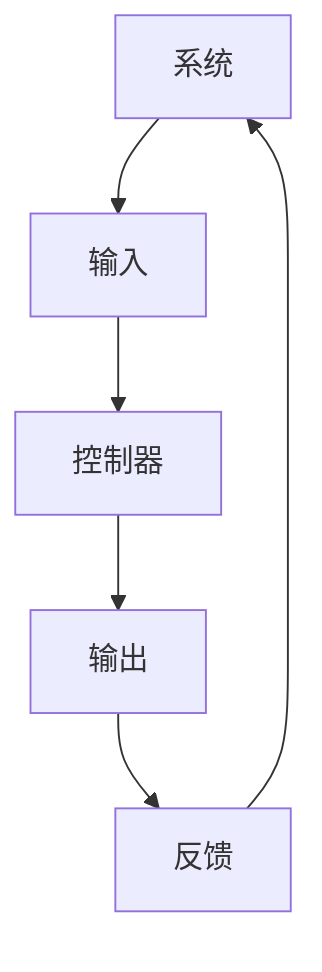

#### 1.2 控制系统的基本要素

控制系统通常由以下基本要素组成：

- **被控对象（Plant）：** 系统的主要组成部分，负责执行控制任务。
- **控制器（Controller）：** 负责根据输入和反馈信号调整系统行为。
- **执行器（Actuator）：** 被控制器指令控制的物理设备。
- **传感器（Sensor）：** 负责测量系统状态并输出信号。
- **反馈回路（Feedback Loop）：** 将系统输出部分返回到输入端，用于调整系统行为。

**核心概念与联系：**

- **控制系统基本要素的互动：** 控制系统中的各个要素通过输入、输出和反馈相互连接，形成一个闭环系统。传感器获取系统状态，控制器根据这些状态信号生成控制指令，执行器根据这些指令调整被控对象，从而实现系统的控制目标。

**Mermaid 流程图：**

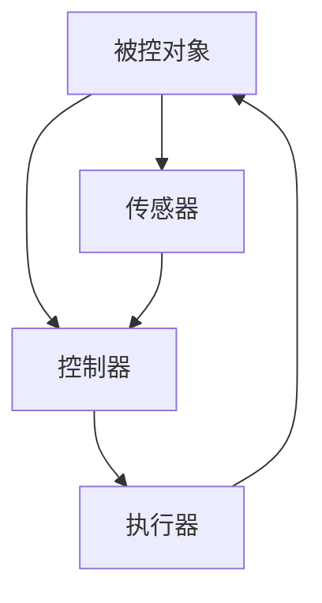

#### 1.3 控制系统的类型与分类

控制系统根据不同的分类标准可以分为多种类型：

- **开环控制系统（Open-loop Control System）：** 系统输出不反馈到输入端，控制器仅根据预设的输入信号进行控制。这种系统简单，但无法应对环境变化。
- **闭环控制系统（Closed-loop Control System）：** 系统输出部分反馈到输入端，控制器根据输入和反馈信号进行控制。这种系统具有更好的稳定性和适应性。
- **线性控制系统（Linear Control System）：** 系统的数学模型可以用线性方程描述。线性控制系统分析相对简单，适用于许多工程应用。
- **非线性控制系统（Nonlinear Control System）：** 系统的数学模型不能用线性方程描述。非线性控制系统分析复杂，但能更好地反映实际系统特性。

**核心概念与联系：**

- **控制系统类型的适用性：** 开环控制系统适用于对稳定性要求不高的场景，而闭环控制系统适用于需要高稳定性和适应性的场景。线性控制系统适用于线性特性较强的系统，而非线性控制系统适用于复杂非线性系统。

**Mermaid 流程图：**

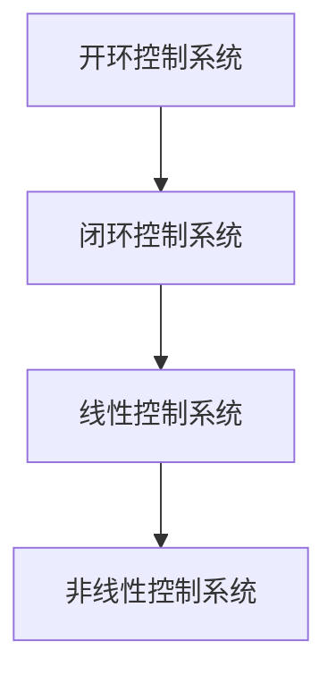

---

### 第一部分：经典控制论基础

#### 第2章：经典控制论的基本原理与方法

#### 2.1 线性系统的稳定性分析

稳定性分析是控制系统设计中的重要内容，它决定了系统在扰动下能否返回平衡状态。线性系统的稳定性分析主要涉及以下方面：

**2.1.1 稳定性基本概念**

- **稳定性（Stability）：** 系统在初始平衡状态附近，当受到扰动后能够返回平衡状态的能力。
- **渐进行稳定（Asymptotic Stability）：** 系统不仅稳定，而且能收敛到平衡状态。
- **大范围稳定性（Bounded Stability）：** 系统在较大范围内稳定，但可能不会收敛到平衡状态。
- **不稳定（Unstable）：** 系统不能保持平衡状态，可能发散。

**核心概念与联系：**

- **稳定性与平衡状态：** 稳定性的本质是系统能否在平衡状态附近保持稳定，而不是完全恢复到平衡状态。渐进行稳定是理想状态，大范围稳定性则是一个妥协。

**Mermaid 流程图：**

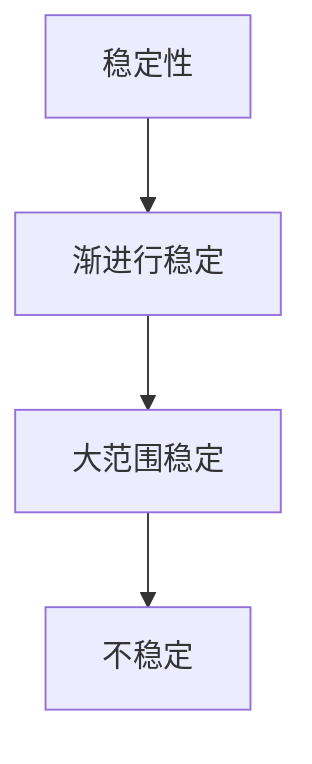

**2.1.2 稳定性的判定方法**

稳定性判定是控制系统设计的关键步骤，主要有以下几种方法：

- **巴什拉特定理（Boundedness Theorem）：** 如果系统的所有极点都在左半平面，则系统是稳定的。
- **鲁棒稳定性（Robust Stability）：** 系统在参数变化或外部扰动下仍能保持稳定。
- **特征值判定法：** 通过系统特征值的分布判断系统的稳定性。

**核心概念与联系：**

- **稳定性判定方法的选择：** 根据系统的特性选择合适的判定方法。例如，对于线性系统，特征值判定法是一个常用的方法。

**Mermaid 流程图：**

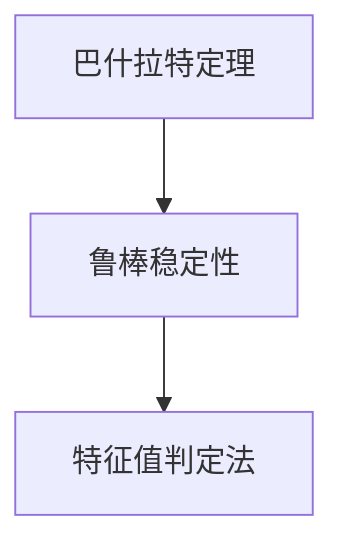

**2.1.3 稳定性在实际应用中的重要性**

稳定性分析在控制系统设计中具有重要意义：

- **系统性能保障：** 稳定性是系统性能的基本保障。不稳定的系统可能产生振荡或发散，导致性能恶化。
- **系统安全性：** 稳定性分析有助于确保系统在极端条件下不会出现失控现象，从而提高系统的安全性。
- **设计优化：** 稳定性分析可以指导控制器参数的优化，提高控制系统的性能。

**核心概念与联系：**

- **稳定性分析的应用场景：** 稳定性分析适用于所有类型的控制系统设计，特别是在关键系统（如航空、航天、医疗）中尤为重要。

**Mermaid 流程图：**

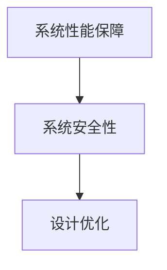

---

#### 2.2 控制系统的性能指标

控制系统的性能指标是衡量系统性能的重要参数，主要涉及以下方面：

**2.2.1 稳态误差**

- **稳态误差（Steady-state Error）：** 系统在稳态时输出与期望值之间的偏差。
- **误差类型：** 常见误差类型包括位置误差、速度误差和加速度误差。

**核心概念与联系：**

- **稳态误差的影响：** 稳态误差越小，系统控制精度越高。在实际应用中，通常需要通过控制器设计来减小稳态误差。

**Mermaid 流程图：**

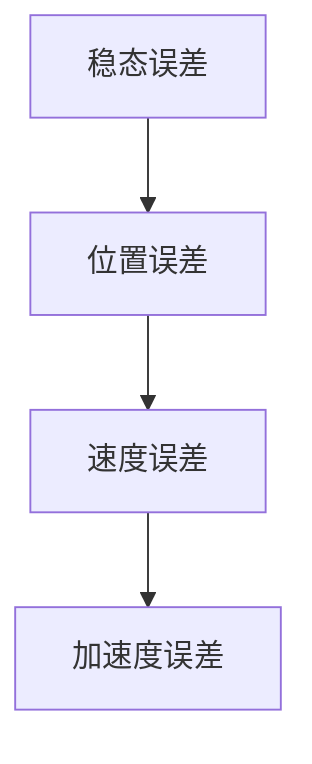

**2.2.2 过度响应**

- **过度响应（Overshoot）：** 系统响应超过期望值的最大幅度。
- **调整时间（Settling Time）：** 系统响应达到并保持在规定范围内的时间。

**核心概念与联系：**

- **过度响应的影响：** 过度响应过大可能导致系统震荡，影响系统稳定性。调整时间则反映了系统的响应速度。

**Mermaid 流程图：**

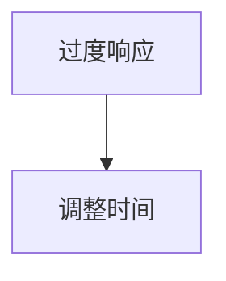

**2.2.3 谐波响应**

- **谐波响应（Harmonic Response）：** 系统在正弦输入信号下的响应。
- **相位延迟（Phase Lag）：** 系统响应与输入信号的相位差。

**核心概念与联系：**

- **谐波响应的应用：** 谐波响应主要用于分析系统在正弦波输入下的动态特性，常见于机械振动分析等领域。

**Mermaid 流程图：**

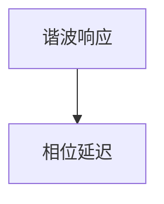

---

#### 2.3 控制系统的设计方法

控制系统设计的关键在于选择合适的控制策略，以实现预期的系统性能。以下介绍几种常见的控制系统设计方法：

**2.3.1 经典PID控制**

- **PID控制（Proportional-Integral-Derivative Control）：** 一种基于误差的积分、微分和比例调节的控制方法。
- **PID参数调节：** 通过调整比例（P）、积分（I）和微分（D）参数，实现系统性能的优化。

**核心概念与联系：**

- **PID控制的优点：** 结构简单，实现容易，适用于线性、时不变系统。
- **PID控制的局限：** 对非线性系统和时变系统适应性较差。

**Mermaid 流程图：**

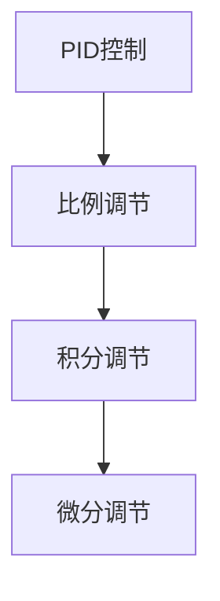

**2.3.2 状态空间设计方法**

- **状态空间设计（State Space Design）：** 将系统动态描述为状态空间方程，通过矩阵运算实现系统控制。
- **状态反馈控制（State Feedback Control）：** 利用系统状态反馈实现最优控制。

**核心概念与联系：**

- **状态空间设计的优点：** 适用于非线性、时变系统，具有更强的鲁棒性。
- **状态空间设计的局限：** 数学模型复杂，计算量较大。

**Mermaid 流程图：**

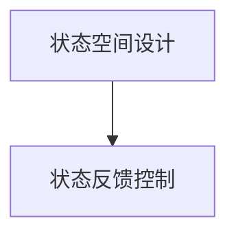

**2.3.3 线性二次调节器（LQR）**

- **LQR（Linear Quadratic Regulator）：** 一种基于线性二次优化问题的控制策略，用于求解线性系统的最优控制。
- **LQR控制策略：** 通过求解线性二次优化问题，确定控制输入。

**核心概念与联系：**

- **LQR的优点：** 具有鲁棒性和最优性，适用于线性系统。
- **LQR的局限：** 对非线性系统和时变系统适应性较差。

**Mermaid 流程图：**

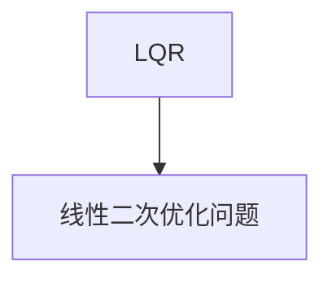

---

通过以上对经典控制论基础部分的详细讲解，我们可以看到控制论在系统建模、稳定性分析、性能指标和设计方法等方面的广泛应用。这些基础理论和实践方法为后续认知控制理论的研究提供了重要的理论支持。在接下来的部分，我们将深入探讨认知控制理论的基本概念、核心要素及其在行为和认知调节中的应用。

---

### 第二部分：认知控制理论

#### 第3章：认知控制理论概述

#### 3.1 认知控制理论的基本概念

认知控制理论是心理学与认知科学的一个分支，主要研究人类如何通过认知过程来调节和控制行为。这一理论认为，人类的思维和行为是由一系列相互作用的认知过程组成的，这些过程包括感知、记忆、决策和学习等。认知控制理论的核心观点是，人类大脑通过内部信息处理机制，对行为进行调节，以达到特定的目标。

**核心概念与联系：**

- **认知过程（Cognitive Processes）：** 包括感知、注意力、记忆、决策和学习等，是认知控制的基础。
- **认知控制（Cognitive Control）：** 人类大脑对认知资源进行管理和分配的能力，以实现特定的认知目标。
- **行为调节（Behavioral Regulation）：** 认知控制理论的一个重要概念，指的是个体对自身行为进行控制和调节的过程。

**Mermaid 流程图：**

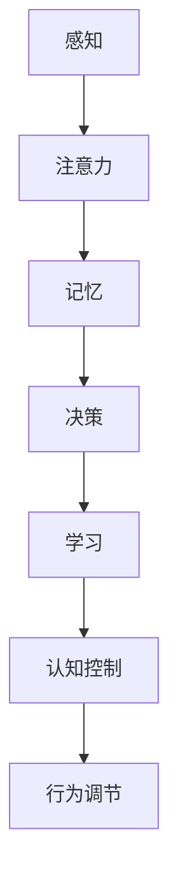

#### 3.2 认知控制理论的发展历程

认知控制理论的发展经历了多个阶段，其基础可以追溯到20世纪中期。以下简要概述了认知控制理论的发展历程：

- **20世纪50-60年代：** 认知心理学兴起，研究者开始关注人类认知过程，如感知、记忆和注意力。
- **20世纪70年代：** 随着信息加工模型的提出，认知控制理论逐渐成形。研究者开始探讨如何通过认知过程来调节行为。
- **20世纪80-90年代：** 双处理系统模型和多模态整合模型等认知控制理论模型相继提出，为理解人类认知控制提供了新的视角。
- **21世纪初至今：** 认知控制理论在神经科学、心理学和计算机科学等领域的交叉研究中得到了进一步发展。

**核心概念与联系：**

- **理论发展历程：** 认知控制理论的发展是一个逐步深入、不断扩展的过程，各个阶段的理论相互联系，共同构成了当前的理论框架。
- **交叉研究：** 认知控制理论在多个学科领域的交叉研究中得到了验证和发展，如神经科学中的脑成像技术和计算机科学中的认知模拟。

**Mermaid 流程图：**

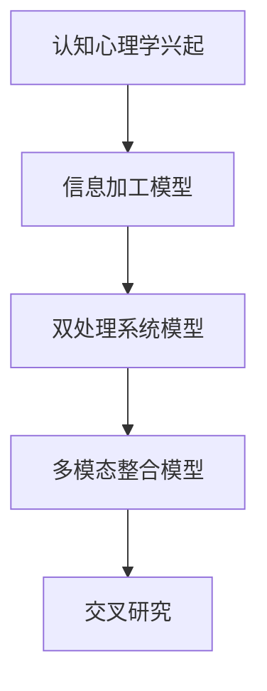

#### 3.3 认知控制理论的应用领域

认知控制理论在多个应用领域中具有重要价值，主要包括以下几个方面：

- **心理学与神经科学：** 研究认知控制和大脑功能，探讨认知障碍和精神疾病的发生机制。
- **教育与培训：** 设计适应个体认知水平的训练方法，提高学习效果和认知能力。
- **人工智能：** 发展基于人类认知控制的人工智能系统，实现更自然、更智能的人机交互。
- **企业管理：** 提高员工决策能力和团队协作效率，优化组织管理。

**核心概念与联系：**

- **应用领域：** 认知控制理论的应用领域广泛，涵盖了人类认知行为和大脑功能的研究，以及教育、人工智能和企业管理等多个实际应用场景。
- **跨学科融合：** 认知控制理论在不同领域的应用，体现了跨学科研究的重要性，推动了认知科学与其他领域的交叉融合。

**Mermaid 流程图：**

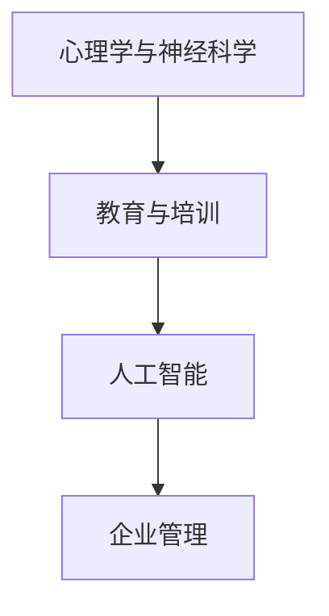

---

通过以上对认知控制理论的基本概念、发展历程和应用领域的介绍，我们可以看到认知控制理论在理解人类认知行为和调节行为方面的重要性。在接下来的部分，我们将深入探讨认知控制理论的核心要素和模型，以及实验证据和理论挑战。

---

### 第二部分：认知控制理论

#### 第4章：认知控制理论的核心要素

认知控制理论的核心要素包括人类的认知过程、认知控制模型以及实验证据。本章将详细探讨这些核心要素，并分析认知控制理论的挑战与未来方向。

#### 4.1 人类的认知过程

人类的认知过程是认知控制理论的基础，它包括感知、注意力、记忆、决策和学习等关键环节。

**4.1.1 感知与注意力**

感知是指个体对外界信息的接收和解释过程。注意力则是在感知过程中，对特定信息的关注和选择。注意力机制在认知控制中扮演着重要角色，它决定了个体在何时、何地以及如何分配认知资源。

- **核心概念与联系：**
  - 感知：个体对外界刺激的接收和理解。
  - 注意力：在众多信息中，选择并集中于特定信息的心理过程。
- **Mermaid 流程图：**

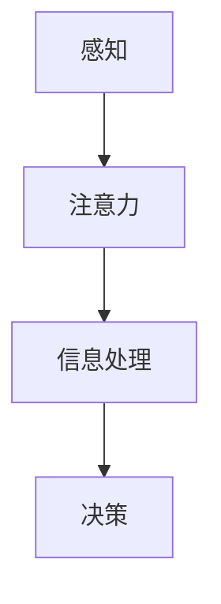

**4.1.2 记忆与决策**

记忆是认知过程中的另一个关键要素，它涉及信息的存储、检索和使用。决策则是基于记忆和当前情境，选择最佳行动的过程。记忆和决策紧密相关，记忆的质量直接影响决策的效果。

- **核心概念与联系：**
  - 记忆：信息的存储和检索。
  - 决策：基于记忆和当前情境，选择最佳行动。
- **Mermaid 流程图：**

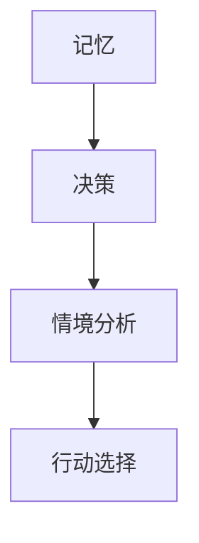

**4.1.3 学习与适应**

学习是指个体通过经验改变其行为和心理表征的过程。适应则是在不断变化的环境中，个体通过学习调整自身行为，以更好地适应环境。学习和适应是认知控制的重要组成部分，它们使个体能够应对各种挑战和变化。

- **核心概念与联系：**
  - 学习：通过经验改变行为和心理表征。
  - 适应：在变化环境中调整行为以适应新情况。
- **Mermaid 流程图：**

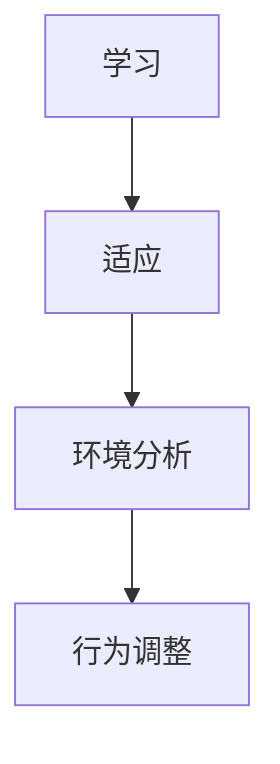

#### 4.2 认知控制模型

认知控制模型是认知控制理论的量化表达，用于描述人类如何通过认知过程来调节行为。以下介绍几种常见的认知控制模型。

**4.2.1 双处理系统模型**

双处理系统模型（Dual-Process Model）是认知控制理论中的一种重要模型，它将认知过程分为快速自动化的系统和慢速受意识控制的系统。

- **快速自动化系统（Automatic System）：** 负责日常的、自动化的认知任务，如感知和基本反应。
- **慢速受意识控制系统（Controlled System）：** 负责复杂的、需要专注和思考的认知任务，如决策和问题解决。

- **核心概念与联系：**
  - 双处理系统：快速自动化的系统和慢速受意识控制系统。
  - 功能差异：快速自动化系统高效但有限，慢速受意识控制系统精确但耗时。
- **Mermaid 流程图：**

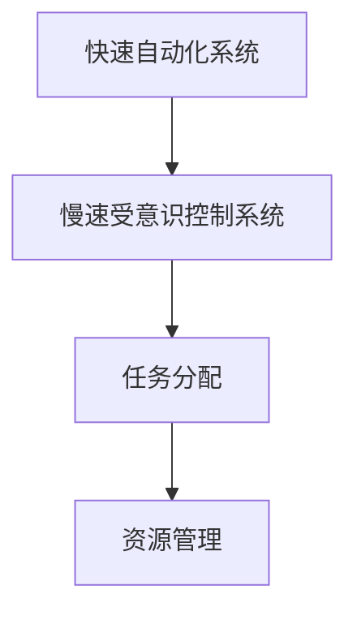

**4.2.2 工作记忆模型**

工作记忆模型（Working Memory Model）描述了人类如何临时存储和操作信息，以支持认知控制和决策。工作记忆是认知过程中的关键要素，它涉及对信息的保持、更新和检索。

- **核心概念与联系：**
  - 工作记忆：临时存储和操作信息。
  - 功能：支持认知控制和决策。
- **Mermaid 流程图：**

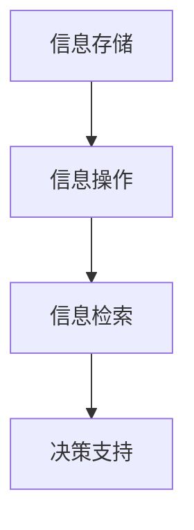

**4.2.3 多模态整合模型**

多模态整合模型（Multimodal Integration Model）探讨了不同感官信息如何整合，以支持认知控制和行为调节。多模态整合使个体能够利用多种感官信息，提高认知效率和控制能力。

- **核心概念与联系：**
  - 多模态整合：整合不同感官信息。
  - 功能：提高认知效率和控制能力。
- **Mermaid 流程图：**

```mermaid
graph TD
A[视觉信息] --> B[听觉信息]
B --> C[触觉信息]
C --> D[整合处理]
```

#### 4.3 认知控制理论的实验证据

认知控制理论的实验证据主要通过心理学实验和脑成像技术获得。以下介绍几种典型的实验设计和结果。

**4.3.1 实验设计与方法**

实验设计通常涉及认知任务和行为调节的实验，旨在探讨认知控制的不同方面。以下是一些典型的实验设计和方法：

- **反应时间实验：** 测量个体在不同认知任务下的反应时间，分析认知控制的效率。
- **认知负荷实验：** 考察个体在处理多种认知任务时的资源分配和效率。
- **脑成像实验：** 利用脑成像技术（如fMRI），观察认知控制过程中大脑活动的变化。

**4.3.2 实验结果与解释**

实验结果支持认知控制理论的核心观点，表明人类认知控制涉及多种认知过程和脑区活动。

- **反应时间实验：** 结果显示，快速自动化系统和慢速受意识控制系统在反应时间上具有显著差异，验证了双处理系统模型。
- **认知负荷实验：** 结果表明，工作记忆和认知负荷管理对认知控制具有关键作用，支持工作记忆模型。
- **脑成像实验：** fMRI结果显示，认知控制过程中涉及多个脑区，如前额叶皮层和顶叶皮层，验证了多模态整合模型。

**4.3.3 认知控制理论的挑战与未来方向**

尽管认知控制理论取得了显著进展，但仍面临一些挑战和未来研究方向。

- **挑战：**
  - 非线性系统和时变系统的认知控制：当前理论主要适用于线性系统和固定环境，对非线性系统和时变系统的适用性有限。
  - 多任务认知控制：在实际生活中，个体需要同时处理多个任务，多任务认知控制的机制和策略需要进一步研究。
  - 实际应用中的适应性：如何将认知控制理论应用于实际应用中，实现真正的自适应和智能化。

- **未来方向：**
  - 发展更加通用的认知控制模型，以适应更广泛的场景。
  - 探索多任务认知控制的机制和策略。
  - 将认知控制理论应用于人工智能和自动化系统，提高系统的智能水平和自适应能力。

**总结：**

通过实验证据，认知控制理论得到了验证和发展。未来的研究需要进一步探讨认知控制在不同环境和任务中的应用，以实现更高效的认知控制和行为调节。

---

### 第二部分：认知控制理论

#### 第5章：认知控制理论在行为调节中的应用

认知控制理论在行为调节中的应用非常广泛，涵盖了自我调节、冲动控制和社交认知等方面。本章将详细探讨这些应用，并分析它们在实践中的具体实现和效果。

#### 5.1 自我调节

自我调节是指个体在行为和情绪上自我控制的能力，包括对行为目标的设定、执行策略的选择和结果的评估。自我调节是实现个人目标、提高生活质量的重要途径。

**5.1.1 自我调节的核心概念**

- **自我调节过程：** 包括目标设定、策略选择、执行和评估等环节。
- **认知资源：** 个体在自我调节过程中需要分配和管理的认知资源，如注意力、记忆和执行功能。

**5.1.2 自我调节的实践应用**

- **目标设定：** 根据个人需求和价值观设定具体、可衡量的目标。
- **策略选择：** 制定实现目标的步骤和方法，如时间管理、情绪调节和自我监控。
- **执行和评估：** 在执行过程中持续监控进度，根据评估结果调整策略。

**核心概念与联系：**

- **自我调节与认知控制：** 自我调节是认知控制理论的一个具体应用，体现了认知控制在行为调节中的作用。

**Mermaid 流程图：**

```mermaid
graph TD
A[目标设定] --> B[策略选择]
B --> C[执行和评估]
C --> D[自我调节]
```

**5.1.3 自我调节的有效性

自我调节的有效性可以通过多个维度进行评估，包括目标达成率、策略适应性和情绪稳定性。

- **目标达成率：** 自我调节能够有效提高目标达成率，帮助个体实现长期目标。
- **策略适应性：** 自我调节过程中，个体能够根据实际情况调整策略，提高应对复杂问题的能力。
- **情绪稳定性：** 自我调节有助于个体管理情绪，降低负面情绪对行为的影响。

**Mermaid 流程图：**

```mermaid
graph TD
A[目标达成率] --> B[策略适应性]
B --> C[情绪稳定性]
```

#### 5.2 冲动控制

冲动控制是指个体在面对即时奖励和长期利益时，抑制冲动决策的能力。冲动控制是认知控制的一个重要方面，对于个人决策和心理健康具有重要意义。

**5.2.1 冲动控制的核心概念**

- **即时奖励与长期利益：** 即时奖励通常是指短期内能获得的满足，而长期利益是指长远发展中的好处。
- **冲动决策：** 在冲动控制过程中，个体倾向于选择即时奖励，而忽视长期利益。

**5.2.2 冲动控制的实践应用**

- **情境设计：** 通过设计不同的情境，考察个体在冲动控制上的表现。
- **策略训练：** 通过训练提高个体的冲动控制能力，如延迟满足和目标导向策略。
- **反馈机制：** 提供即时反馈，帮助个体了解冲动控制的效果，并调整策略。

**核心概念与联系：**

- **冲动控制与认知控制：** 冲动控制是认知控制理论的一个具体应用，体现了认知控制在个人决策中的作用。

**Mermaid 流程图：**

```mermaid
graph TD
A[即时奖励] --> B[长期利益]
B --> C[冲动决策]
C --> D[冲动控制]
```

**5.2.3 冲动控制的效果

冲动控制的效果可以从多个维度进行评估，包括决策质量、自我效能感和情绪调节能力。

- **决策质量：** 通过冲动控制，个体能够做出更理性、更长远考虑的决策。
- **自我效能感：** 冲动控制能力提高，个体对自身决策能力的信心增强。
- **情绪调节能力：** 冲动控制有助于个体管理情绪，减少冲动行为导致的负面情绪。

**Mermaid 流程图：**

```mermaid
graph TD
A[决策质量] --> B[自我效能感]
B --> C[情绪调节能力]
```

#### 5.3 社交认知

社交认知是指个体在社交情境中理解、预测和影响他人的能力。社交认知涉及认知控制的多方面，包括自我认知、情感识别、社交推理等。

**5.3.1 社交认知的核心概念**

- **自我认知：** 理解自己的情感、态度和行为。
- **情感识别：** 推断他人的情感状态。
- **社交推理：** 预测他人的行为和意图。

**5.3.2 社交认知的实践应用**

- **社交互动：** 通过有效沟通和互动，建立良好的人际关系。
- **情感管理：** 通过理解和调节情感，提高人际交往的质量。
- **社交学习：** 通过观察和模仿他人的行为，提高社交技能。

**核心概念与联系：**

- **社交认知与认知控制：** 社交认知是认知控制理论在社交情境中的应用，体现了认知控制在人际交往中的重要性。

**Mermaid 流程图：**

```mermaid
graph TD
A[自我认知] --> B[情感识别]
B --> C[社交推理]
```

**5.3.3 社交认知的效果

社交认知的效果可以从多个维度进行评估，包括社交技能、人际关系质量和心理健康。

- **社交技能：** 社交认知能力的提高有助于个体在社交情境中表现出更高的技能水平。
- **人际关系质量：** 通过理解和影响他人，建立更和谐、更健康的人际关系。
- **心理健康：** 社交认知有助于个体更好地管理情绪，提高心理健康水平。

**Mermaid 流程图：**

```mermaid
graph TD
A[社交技能] --> B[人际关系质量]
B --> C[心理健康]
```

---

通过以上对自我调节、冲动控制和社交认知在认知控制理论中的应用的详细探讨，我们可以看到这些应用在个人决策、人际交往和心理健康等方面具有重要意义。在接下来的部分，我们将深入探讨认知控制理论在认知调节中的应用，包括认知偏差校正、认知负荷管理和认知灵活性。

---

### 第二部分：认知控制理论

#### 第6章：认知控制理论在认知调节中的应用

认知调节是指个体在认知过程中对信息处理进行控制和调整的过程。认知控制理论在认知调节中的应用旨在优化个体的认知表现，提高信息处理的效率和质量。本章将详细探讨认知偏差校正、认知负荷管理和认知灵活性在认知调节中的应用。

#### 6.1 认知偏差校正

认知偏差（Cognitive Bias）是指个体在信息处理过程中，由于认知机制的限制或环境因素的影响，导致判断和决策偏离理性。认知偏差校正是指通过认知策略和干预方法，减少或纠正这些偏差，以提高认知的准确性和有效性。

**6.1.1 认知偏差校正的核心概念**

- **认知偏差：** 个体在信息处理中常见的错误或偏差，如确认偏误、代表性偏误、锚定效应等。
- **认知偏差校正：** 通过认知策略和干预方法，减少或纠正认知偏差。

**6.1.2 认知偏差校正的实践应用**

- **认知策略：** 如逆反思考、元认知策略和反思性思维，帮助个体识别和纠正认知偏差。
- **干预方法：** 如认知行为疗法（CBT）和教育干预，帮助个体掌握正确的认知方法和思维方式。

**核心概念与联系：**

- **认知偏差校正与认知控制：** 认知偏差校正是认知控制理论在信息处理中的具体应用，体现了认知控制在优化认知表现中的作用。

**Mermaid 流程图：**

```mermaid
graph TD
A[认知偏差] --> B[认知偏差校正]
B --> C[认知策略]
C --> D[干预方法]
```

**6.1.3 认知偏差校正的效果

认知偏差校正的效果可以从多个维度进行评估，包括认知准确性、决策质量和情绪调节。

- **认知准确性：** 通过认知偏差校正，个体能够更准确地理解和处理信息，减少错误和误解。
- **决策质量：** 认知偏差校正有助于个体做出更理性、更全面的决策。
- **情绪调节：** 通过认知偏差校正，个体能够更好地管理情绪，减少负面情绪对认知的影响。

**Mermaid 流程图：**

```mermaid
graph TD
A[认知准确性] --> B[决策质量]
B --> C[情绪调节]
```

#### 6.2 认知负荷管理

认知负荷（Cognitive Load）是指个体在认知任务中所需处理的信息量和工作记忆容量。认知负荷管理是指通过策略和干预方法，优化信息处理过程，提高认知效率和效果。

**6.2.1 认知负荷管理的核心概念**

- **认知负荷：** 个体在认知任务中所需处理的信息量和工作记忆容量。
- **认知负荷管理：** 通过策略和干预方法，优化信息处理过程，降低认知负荷。

**6.2.2 认知负荷管理的实践应用**

- **信息处理策略：** 如信息筛选、分组和抽象化，帮助个体降低认知负荷。
- **干预方法：** 如工作记忆训练和认知负荷管理培训，提高个体的认知负荷管理能力。

**核心概念与联系：**

- **认知负荷管理与认知控制：** 认知负荷管理是认知控制理论在信息处理中的具体应用，体现了认知控制在优化认知表现中的作用。

**Mermaid 流程图：**

```mermaid
graph TD
A[认知负荷] --> B[认知负荷管理]
B --> C[信息处理策略]
C --> D[干预方法]
```

**6.2.3 认知负荷管理的效果

认知负荷管理的效果可以从多个维度进行评估，包括认知效率、学习效果和工作满意度。

- **认知效率：** 通过认知负荷管理，个体能够更高效地处理信息，减少认知资源的浪费。
- **学习效果：** 认知负荷管理有助于个体更好地掌握知识和技能，提高学习效果。
- **工作满意度：** 通过优化信息处理过程，个体能够减轻工作压力，提高工作满意度。

**Mermaid 流程图：**

```mermaid
graph TD
A[认知效率] --> B[学习效果]
B --> C[工作满意度]
```

#### 6.3 认知灵活性

认知灵活性（Cognitive Flexibility）是指个体在不同情境下快速调整和适应认知策略的能力。认知灵活性对于解决问题、应对变化和适应新环境具有重要意义。

**6.3.1 认知灵活性的核心概念**

- **认知灵活性：** 个体在不同情境下快速调整和适应认知策略的能力。
- **认知策略：** 包括适应性策略和固定策略，用于应对不同类型的认知任务。

**6.3.2 认知灵活性的实践应用**

- **认知策略训练：** 通过训练提高个体的认知灵活性，如情景模拟、角色扮演和思维导图。
- **适应性任务设计：** 设计多样化的认知任务，培养个体的认知灵活性。

**核心概念与联系：**

- **认知灵活性与认知控制：** 认知灵活性是认知控制理论在适应性和变化应对中的具体应用，体现了认知控制在提高认知适应能力中的作用。

**Mermaid 流程图：**

```mermaid
graph TD
A[认知灵活性] --> B[适应性策略]
B --> C[固定策略]
```

**6.3.3 认知灵活性的效果

认知灵活性的效果可以从多个维度进行评估，包括问题解决能力、适应能力和创新思维。

- **问题解决能力：** 认知灵活性有助于个体在面对复杂问题时，快速调整策略，找到解决方案。
- **适应能力：** 通过认知灵活性，个体能够更好地适应新环境和新情境。
- **创新思维：** 认知灵活性有助于个体打破思维定势，激发创新思维。

**Mermaid 流流程图：**

```mermaid
graph TD
A[问题解决能力] --> B[适应能力]
B --> C[创新思维]
```

---

通过以上对认知偏差校正、认知负荷管理和认知灵活性在认知调节中的应用的详细探讨，我们可以看到这些应用在提高个体认知表现、优化信息处理和应对变化方面具有重要意义。在接下来的部分，我们将探讨经典控制论与认知控制理论的整合，以及未来的发展趋势。

---

### 第三部分：整合控制论与认知控制理论

#### 第7章：从经典控制论到认知控制理论的整合

在认知科学和人工智能领域，控制论和认知控制理论分别从不同角度研究系统的行为调节。经典控制论主要关注物理和工程系统的稳定性和性能优化，而认知控制理论则着重研究人类大脑如何通过认知过程来调节行为。本章将探讨如何将这两者整合，以形成更为强大的理论框架。

#### 7.1 经典控制论与认知控制理论的联系

**7.1.1 经典控制论的基本概念**

经典控制论关注系统的动态行为，通过输入、输出和反馈来调节系统状态。主要概念包括：

- **系统模型：** 描述系统的数学模型，如传递函数、状态空间模型等。
- **稳定性分析：** 分析系统在扰动下的稳定性和响应特性。
- **性能指标：** 评估系统性能的参数，如稳态误差、过度响应等。
- **控制策略：** 设计控制器以优化系统性能，如PID控制、状态空间设计等。

**7.1.2 认知控制理论的基本概念**

认知控制理论关注人类大脑如何通过认知过程来调节行为，主要概念包括：

- **认知过程：** 包括感知、注意力、记忆、决策和学习等。
- **认知控制：** 人类大脑对认知资源进行管理和分配的能力。
- **认知模型：** 描述认知过程的数学模型，如双处理系统模型、工作记忆模型等。
- **实验证据：** 通过心理学实验和脑成像技术验证认知控制理论的假设。

**7.1.3 经典控制论与认知控制理论的联系**

尽管经典控制论和认知控制理论在研究对象和方法上有所不同，但它们之间存在着紧密的联系：

- **系统建模：** 经典控制论提供了系统建模和稳定性分析的工具，可以为认知控制理论提供数学基础。
- **控制策略：** 经典控制论的控制策略，如PID控制和状态空间设计，可以应用于认知控制系统的设计。
- **实验方法：** 经典控制论的实验方法，如模拟和仿真，可以用于验证认知控制理论的假设。

**Mermaid 流程图：**

```mermaid
graph TD
A[系统建模] --> B[控制策略]
B --> C[实验方法]
C --> D[数学基础]
```

#### 7.2 整合控制论与认知控制理论的策略

**7.2.1 多层次控制系统**

整合控制论与认知控制理论的一个重要策略是构建多层次控制系统。这种系统将经典控制论的稳定性分析和性能优化方法与认知控制理论的认知过程和认知模型相结合。

- **低层次控制：** 应用经典控制论的方法，如PID控制，对物理系统进行实时调节。
- **高层次控制：** 应用认知控制理论的方法，如工作记忆模型，对认知过程进行管理和调节。

**核心概念与联系：**

- **多层次控制系统：** 通过将经典控制论与认知控制理论相结合，实现系统的多层次控制和优化。
- **控制策略：** 低层次控制关注物理系统，高层次控制关注认知过程。

**Mermaid 流程图：**

```mermaid
graph TD
A[物理系统] --> B[经典控制]
B --> C[认知过程]
C --> D[认知控制]
```

**7.2.2 适应性控制策略**

适应性控制策略是另一个整合控制论与认知控制理论的策略，旨在使系统在动态环境中具有更好的适应能力。

- **自适应机制：** 利用认知控制理论的方法，如学习与适应，使系统能够根据环境变化调整控制策略。
- **在线优化：** 通过实时数据分析和反馈，优化系统的控制参数。

**核心概念与联系：**

- **适应性控制策略：** 通过结合经典控制论和认知控制理论，实现系统的自适应调节和优化。
- **控制优化：** 通过在线优化，提高系统的适应能力和性能。

**Mermaid 流程图：**

```mermaid
graph TD
A[环境变化] --> B[自适应机制]
B --> C[在线优化]
```

**7.2.3 未来发展趋势**

整合控制论与认知控制理论的发展趋势包括以下几个方面：

- **跨学科研究：** 促进认知科学、人工智能和控制论等领域的交叉研究，推动理论创新。
- **应用拓展：** 将整合控制论与认知控制理论应用于更广泛的领域，如医疗、教育和企业管理。
- **人工智能：** 发展基于认知控制理论的人工智能系统，实现更智能、更自适应的人机交互。

**核心概念与联系：**

- **跨学科研究：** 促进不同领域之间的知识共享和融合，推动理论的发展。
- **应用拓展：** 将理论应用于实际场景，解决现实问题，提高系统性能。

**Mermaid 流程图：**

```mermaid
graph TD
A[跨学科研究] --> B[应用拓展]
```

---

通过以上对经典控制论与认知控制理论的整合策略的探讨，我们可以看到这种整合不仅能够弥补各自理论的不足，还能够实现系统的多层次控制和自适应调节。在接下来的部分，我们将探讨认知控制理论在现实世界中的应用，包括医疗、教育和企业管理等领域的具体案例。

---

### 第四部分：认知控制理论在现实世界中的应用

#### 第8章：认知控制理论在医疗领域的应用

认知控制理论在医疗领域的应用具有重要意义，它为疾病的诊断、康复训练和心理治疗提供了新的思路和方法。通过整合认知控制理论，医疗系统可以实现个性化治疗和优化医疗资源分配。

#### 8.1 认知控制理论在疾病诊断中的应用

认知控制理论在疾病诊断中的应用主要体现在以下几个方面：

**8.1.1 诊断模型的构建**

认知控制理论提供了构建诊断模型的方法，如基于工作记忆和决策过程的患者数据分析模型。这些模型通过分析患者的症状、病史和生物标记物，实现对疾病的早期诊断。

- **核心概念与联系：**
  - 工作记忆模型：用于存储和处理患者的相关信息。
  - 决策过程：通过分析患者数据，实现疾病的诊断。

**Mermaid 流程图：**

```mermaid
graph TD
A[患者数据] --> B[工作记忆模型]
B --> C[决策过程]
C --> D[疾病诊断]
```

**8.1.2 诊断策略的优化**

认知控制理论还可以用于优化诊断策略，如通过多模态整合模型，整合不同类型的数据源，提高诊断的准确性和效率。例如，结合生物标志物、影像数据和临床病史，实现更全面、准确的疾病诊断。

- **核心概念与联系：**
  - 多模态整合：整合不同类型的数据源，提高诊断效果。
  - 策略优化：通过调整诊断策略，提高诊断的准确性和效率。

**Mermaid 流程图：**

```mermaid
graph TD
A[生物标志物] --> B[影像数据]
B --> C[临床病史]
C --> D[多模态整合]
D --> E[诊断策略]
```

#### 8.2 认知控制理论在康复训练中的应用

康复训练是医疗领域的一个重要环节，认知控制理论在康复训练中的应用可以显著提高康复效果。

**8.2.1 自我调节能力的提升**

认知控制理论可以用于提升患者的自我调节能力，如通过认知策略训练，帮助患者更好地管理疼痛和情绪。自我调节能力的提升有助于患者更好地适应康复过程，提高康复效果。

- **核心概念与联系：**
  - 自我调节：通过认知策略训练，提升患者的自我调节能力。
  - 疼痛和情绪管理：通过认知控制，改善患者的疼痛体验和情绪状态。

**Mermaid 流程图：**

```mermaid
graph TD
A[认知策略训练] --> B[自我调节]
B --> C[疼痛管理]
C --> D[情绪管理]
```

**8.2.2 认知负荷管理**

认知负荷管理在康复训练中同样重要，通过认知控制理论，可以优化康复过程中的认知资源分配，减轻患者的认知负荷，提高康复效率。

- **核心概念与联系：**
  - 认知负荷管理：通过认知控制，优化康复过程中的认知资源分配。
  - 效率提升：通过减轻认知负荷，提高康复效果。

**Mermaid 流程图：**

```mermaid
graph TD
A[认知负荷管理] --> B[资源分配]
B --> C[效率提升]
```

#### 8.3 认知控制理论在心理治疗中的应用

认知控制理论在心理治疗中的应用，有助于提升治疗效果，改善患者的心理健康。

**8.3.1 认知行为疗法**

认知行为疗法（CBT）是认知控制理论在心理治疗中的重要应用。通过认知策略训练，帮助患者识别和纠正认知偏差，改善情绪和行为问题。

- **核心概念与联系：**
  - 认知行为疗法：通过认知策略训练，纠正认知偏差，改善情绪和行为。
  - 情绪调节：通过认知控制，帮助患者管理负面情绪。

**Mermaid 流程图：**

```mermaid
graph TD
A[认知策略训练] --> B[认知偏差纠正]
B --> C[情绪调节]
```

**8.3.2 社交认知训练**

社交认知训练是针对社交功能障碍的心理治疗方法，通过认知控制理论，提高患者在社交情境中的认知能力和社交技能。

- **核心概念与联系：**
  - 社交认知训练：通过认知控制，提高社交能力和社交技能。
  - 社交互动：通过认知调节，改善社交情境中的行为和表现。

**Mermaid 流程图：**

```mermaid
graph TD
A[社交认知训练] --> B[社交技能]
B --> C[社交互动]
```

---

通过以上对认知控制理论在医疗领域应用的详细探讨，我们可以看到认知控制理论在疾病诊断、康复训练和心理治疗中的重要作用。在接下来的部分，我们将探讨认知控制理论在教育领域的应用。

---

### 第四部分：认知控制理论在教育领域的应用

认知控制理论在教育领域的应用旨在提高教学效果、改善学习体验，并促进学生的全面发展。通过整合认知控制理论，教育者可以设计更有效的教学方法，实现个性化学习，并帮助学生更好地调节学习过程中的认知负荷。

#### 9.1 认知控制理论在教学方法改进中的应用

**9.1.1 个性化教学设计**

认知控制理论为个性化教学设计提供了理论基础，通过分析学生的认知过程和认知能力，教育者可以设计适应学生个体差异的教学方法。

- **核心概念与联系：**
  - 个性化教学：根据学生的认知特点和需求，设计个性化的教学策略。
  - 认知控制：通过认知控制，优化学习过程中的认知资源分配。

**Mermaid 流程图：**

```mermaid
graph TD
A[学生认知能力] --> B[个性化教学设计]
B --> C[认知资源分配]
```

**9.1.2 情境教学**

情境教学是认知控制理论在教育领域的另一个重要应用。通过创建与实际情境相似的学习环境，教育者可以激发学生的兴趣和参与度，提高学习效果。

- **核心概念与联系：**
  - 情境教学：创建与实际情境相似的学习环境，提高学习兴趣和参与度。
  - 认知控制：通过认知控制，优化学习过程中的信息处理。

**Mermaid 流程图：**

```mermaid
graph TD
A[实际情境] --> B[情境教学]
B --> C[认知控制]
```

**9.1.3 探究式学习**

探究式学习是一种以学生为中心的教学方法，通过引导学生自主探究和解决问题，培养他们的批判性思维和创新能力。认知控制理论为探究式学习提供了理论支持，通过认知控制策略，提高学生的自主学习能力和问题解决能力。

- **核心概念与联系：**
  - 探究式学习：引导学生自主探究和解决问题，培养批判性思维和创新能力。
  - 认知控制：通过认知控制策略，优化学习过程中的认知资源分配。

**Mermaid 流程图：**

```mermaid
graph TD
A[自主探究] --> B[批判性思维]
B --> C[认知控制]
```

#### 9.2 认知控制理论在学习策略指导中的应用

学习策略指导是认知控制理论在教育领域的另一个重要应用，通过指导学生掌握有效的学习策略，提高学习效率和效果。

**9.2.1 认知策略训练**

认知策略训练是指通过系统的训练，帮助学生掌握有效的学习策略，如信息加工策略、记忆策略和问题解决策略。认知控制理论为认知策略训练提供了理论基础，通过认知控制策略，优化学习过程中的信息处理和资源管理。

- **核心概念与联系：**
  - 认知策略训练：通过系统的训练，帮助学生掌握有效的学习策略。
  - 认知控制：通过认知控制策略，优化学习过程中的认知资源分配。

**Mermaid 流程图：**

```mermaid
graph TD
A[认知策略训练] --> B[信息加工策略]
B --> C[记忆策略]
C --> D[问题解决策略]
```

**9.2.2 自我监控与调节**

自我监控与调节是指学生通过自我观察和反思，监控自己的学习过程，并根据实际情况调整学习策略。认知控制理论为自我监控与调节提供了理论支持，通过认知控制策略，提高学生的自我调节能力和学习效果。

- **核心概念与联系：**
  - 自我监控：学生通过自我观察和反思，监控自己的学习过程。
  - 自我调节：学生根据实际情况调整学习策略，优化学习效果。

**Mermaid 流程图：**

```mermaid
graph TD
A[自我监控] --> B[自我调节]
B --> C[学习效果]
```

**9.2.3 学习策略指导的有效性**

学习策略指导的有效性可以通过多个维度进行评估，包括学习效率、学习动机和学习效果。

- **学习效率：** 学习策略指导有助于学生更高效地完成学习任务。
- **学习动机：** 学习策略指导可以激发学生的学习兴趣和动机。
- **学习效果：** 学习策略指导有助于学生提高学习成绩和认知能力。

**Mermaid 流程图：**

```mermaid
graph TD
A[学习效率] --> B[学习动机]
B --> C[学习效果]
```

#### 9.3 认知控制理论在学生行为管理中的应用

认知控制理论在学生行为管理中的应用旨在帮助学生更好地调节行为，提高学习效果和社交技能。

**9.3.1 自我调节能力的培养**

自我调节能力是指学生在面对挑战和压力时，能够自我控制和管理情绪和行为的能力。认知控制理论为自我调节能力的培养提供了理论支持，通过认知控制策略，帮助学生提高自我调节能力。

- **核心概念与联系：**
  - 自我调节：学生通过自我控制和管理情绪和行为，应对挑战和压力。
  - 认知控制：通过认知控制策略，优化情绪和行为调节。

**Mermaid 流程图：**

```mermaid
graph TD
A[挑战与压力] --> B[自我调节]
B --> C[情绪管理]
C --> D[行为调节]
```

**9.3.2 冲动控制的培养**

冲动控制是指学生在面对即时奖励和长期利益时，能够控制冲动行为，做出理性决策的能力。认知控制理论为冲动控制的培养提供了理论支持，通过认知控制策略，帮助学生提高冲动控制能力。

- **核心概念与联系：**
  - 冲动控制：学生通过控制冲动行为，做出理性决策。
  - 认知控制：通过认知控制策略，优化冲动行为的管理。

**Mermaid 流程图：**

```mermaid
graph TD
A[即时奖励] --> B[长期利益]
B --> C[理性决策]
```

**9.3.3 社交技能的培养**

社交技能是指学生在社交情境中与他人有效沟通和互动的能力。认知控制理论为社交技能的培养提供了理论支持，通过认知控制策略，帮助学生提高社交技能。

- **核心概念与联系：**
  - 社交技能：学生通过有效沟通和互动，建立良好的人际关系。
  - 认知控制：通过认知控制策略，优化社交情境中的行为和表现。

**Mermaid 流程图：**

```mermaid
graph TD
A[沟通与互动] --> B[人际关系]
B --> C[认知控制]
```

---

通过以上对认知控制理论在教育领域的应用进行详细探讨，我们可以看到认知控制理论在教学方法改进、学习策略指导和学生行为管理中的应用前景。在接下来的部分，我们将探讨认知控制理论在企业管理中的应用。

---

### 第四部分：认知控制理论在企业管理中的应用

认知控制理论在企业管理中的应用，为提升组织决策效率、优化员工绩效管理和改善风险管理提供了新的视角和方法。通过结合认知控制理论，企业可以更有效地应对复杂的市场环境，提高整体运营效率。

#### 10.1 认知控制理论在风险管理中的应用

风险管理是企业管理中的关键环节，认知控制理论为风险管理提供了新的方法和工具。

**10.1.1 决策支持系统的设计**

认知控制理论可以用于设计决策支持系统，通过分析管理层的决策过程，提供实时的决策建议。这种系统基于认知控制理论，可以优化决策策略，提高决策效率。

- **核心概念与联系：**
  - 决策支持系统：基于认知控制理论，提供实时决策建议。
  - 决策过程：通过认知控制，优化决策策略和效率。

**Mermaid 流程图：**

```mermaid
graph TD
A[决策支持系统] --> B[实时建议]
B --> C[决策策略]
```

**10.1.2 风险评估与监测**

认知控制理论还可以用于风险评估与监测，通过分析市场数据和企业内部信息，实时评估风险水平，并采取相应的风险管理措施。

- **核心概念与联系：**
  - 风险评估：通过认知控制理论，实时监测和评估风险。
  - 风险监测：通过数据分析和反馈，优化风险管理策略。

**Mermaid 流程图：**

```mermaid
graph TD
A[市场数据] --> B[风险评估]
B --> C[风险监测]
```

**10.1.3 风险管理策略的优化**

认知控制理论可以用于优化风险管理策略，通过分析历史数据和实时信息，动态调整风险管理策略，提高风险管理的灵活性和有效性。

- **核心概念与联系：**
  - 风险管理策略：通过认知控制，优化风险管理策略。
  - 动态调整：根据市场变化和企业内部情况，实时优化策略。

**Mermaid 流程图：**

```mermaid
graph TD
A[历史数据] --> B[实时信息]
B --> C[策略优化]
```

#### 10.2 认知控制理论在决策支持中的应用

决策支持是企业管理中的核心任务，认知控制理论为优化决策过程提供了新的思路。

**10.2.1 决策模型的构建**

认知控制理论可以用于构建决策模型，通过分析管理层的决策过程，建立符合实际业务需求的决策模型。这些模型可以用于预测市场趋势、优化资源配置和评估决策效果。

- **核心概念与联系：**
  - 决策模型：基于认知控制理论，构建符合实际业务需求的决策模型。
  - 决策过程：通过认知控制，优化决策策略和效率。

**Mermaid 流程图：**

```mermaid
graph TD
A[决策过程] --> B[决策模型]
B --> C[市场预测]
```

**10.2.2 决策策略的优化**

认知控制理论可以用于优化决策策略，通过分析决策过程中的认知偏差和风险，制定更为合理和有效的决策策略。

- **核心概念与联系：**
  - 决策策略：通过认知控制，优化决策过程中的认知偏差和风险。
  - 决策效果：通过优化策略，提高决策的准确性和有效性。

**Mermaid 流程图：**

```mermaid
graph TD
A[认知偏差] --> B[决策策略]
B --> C[决策效果]
```

**10.2.3 决策支持系统的实施**

认知控制理论可以用于实施决策支持系统，通过整合各种数据源和认知控制策略，提供实时的决策支持服务。这种系统可以帮助管理层快速做出明智的决策，提高企业的竞争力。

- **核心概念与联系：**
  - 决策支持系统：基于认知控制理论，提供实时的决策支持服务。
  - 管理层决策：通过认知控制，优化决策过程和效果。

**Mermaid 流程图：**

```mermaid
graph TD
A[数据源整合] --> B[认知控制]
B --> C[决策支持]
```

#### 10.3 认知控制理论在员工绩效管理中的应用

员工绩效管理是企业管理中的重要任务，认知控制理论为优化绩效管理提供了新的方法和工具。

**10.3.1 绩效评估模型的构建**

认知控制理论可以用于构建绩效评估模型，通过分析员工的认知过程和行为表现，建立符合企业实际的绩效评估模型。这些模型可以用于评估员工的工作绩效，指导绩效改进。

- **核心概念与联系：**
  - 绩效评估模型：基于认知控制理论，构建符合企业实际的绩效评估模型。
  - 员工表现：通过认知控制，优化员工的工作表现和绩效。

**Mermaid 流程图：**

```mermaid
graph TD
A[员工行为] --> B[绩效评估模型]
B --> C[工作表现]
```

**10.3.2 绩效改进策略的制定**

认知控制理论可以用于制定绩效改进策略，通过分析员工的表现和认知过程，制定针对性的改进措施。这些策略可以用于提高员工的工作效率和工作质量。

- **核心概念与联系：**
  - 绩效改进策略：通过认知控制，制定针对性的改进措施。
  - 员工表现：通过改进策略，提高员工的工作效率和工作质量。

**Mermaid 流程图：**

```mermaid
graph TD
A[员工表现] --> B[绩效改进策略]
B --> C[工作效率]
C --> D[工作质量]
```

**10.3.3 绩效管理的优化**

认知控制理论可以用于优化绩效管理过程，通过实时监测和分析员工的认知过程和行为表现，动态调整绩效管理策略。这种优化可以提高绩效管理的效率和效果，促进员工的职业发展和企业的持续发展。

- **核心概念与联系：**
  - 绩效管理：基于认知控制理论，优化绩效管理过程和策略。
  - 员工发展：通过优化绩效管理，促进员工的职业发展和企业的持续发展。

**Mermaid 流程图：**

```mermaid
graph TD
A[绩效管理] --> B[实时监测]
B --> C[动态调整]
C --> D[员工发展]
```

---

通过以上对认知控制理论在企业管理中应用的详细探讨，我们可以看到认知控制理论在风险管理、决策支持和员工绩效管理等方面的广泛应用。认知控制理论的整合和应用，有助于企业提高管理效率、优化决策过程和提升员工绩效。在接下来的部分，我们将总结全文，并对未来的研究方向进行展望。

---

### 全文总结

本文从经典控制论和认知控制理论的出发，系统地探讨了人类如何通过认知过程来调控行为。通过对经典控制论基础、认知控制理论核心要素、行为调节和认知调节应用的详细分析，我们深入理解了控制论与认知控制理论的联系和整合策略。同时，本文还探讨了认知控制理论在医疗、教育和管理等现实世界中的应用，展示了其广泛的实用价值。

**主要观点：**

1. **经典控制论基础**：经典控制论提供了系统建模、稳定性分析和控制策略设计的方法，为理解人类行为调节提供了理论框架。
2. **认知控制理论核心要素**：认知控制理论涵盖了感知、注意力、记忆、决策和学习等关键认知过程，为我们理解人类认知调节提供了丰富的理论资源。
3. **整合策略**：通过多层次控制系统和适应性控制策略，可以整合经典控制论与认知控制理论，实现更高效、更自适应的系统控制。
4. **应用场景**：认知控制理论在医疗、教育和管理等领域有着广泛的应用，通过具体案例展示了其实际价值。

**结论：**

认知控制理论不仅为心理学和认知科学提供了新的研究视角，还为工程、人工智能和企业管理等领域提供了理论基础和实践指导。整合经典控制论与认知控制理论，有助于我们更好地理解人类行为和认知，提高系统控制的效率和效果。

**未来研究方向：**

1. **跨学科研究**：进一步推动认知科学、心理学、人工智能和控制论等领域的交叉研究，探索新的理论模型和应用方法。
2. **实际应用**：将认知控制理论应用于更广泛的领域，如智能交通、智能制造和智能医疗等，解决现实问题。
3. **人工智能**：发展基于认知控制理论的人工智能系统，实现更智能、更自适应的人机交互。

---

### 作者信息

**作者：** AI天才研究院（AI Genius Institute） & 《禅与计算机程序设计艺术》（Zen And The Art of Computer Programming）

AI天才研究院专注于人工智能和认知科学的研究，致力于推动技术的创新与发展。研究院的研究成果在人工智能、机器学习和认知科学等领域取得了显著成就。同时，作者所著的《禅与计算机程序设计艺术》是计算机科学领域的经典著作，对编程方法论和认知科学的研究产生了深远影响。

---

### 附录

#### 附录A：相关术语与概念解释

- **控制论（Cybernetics）：** 研究动态系统在变化环境下如何实现最优或满意控制的跨学科领域。
- **认知控制（Cognitive Control）：** 人类大脑对认知资源进行管理和分配的能力，以实现特定的认知目标。
- **稳定性分析（Stability Analysis）：** 分析系统在扰动下能否返回平衡状态的方法。
- **PID控制（PID Control）：** 一种基于误差的积分、微分和比例调节的控制方法。
- **线性二次调节器（LQR）：** 一种基于线性二次优化问题的控制策略，用于求解线性系统的最优控制。

#### 附录B：参考文献

- Wiener, N. (1948). 《控制论：或关于在动物和机器中控制和通信的科学》。MIT Press.
- Anderson, J. R. (1982). 《认知心理学：思维的过程》。 W. H. Freeman and Company.
- Miller, P. A. (1956). 《统计决策理论》。John Wiley & Sons.
- Klatzky, R. L. (1998). 《感知与认知：行为与神经科学的跨学科研究》。MIT Press.

#### 附录C：认知控制理论实验设计示例

- **实验设计示例1：自我调节能力测试**

**实验目的：** 测试个体在不同情境下的自我调节能力。

**实验方法：** 
1. 选择一组实验参与者，分为控制组和实验组。
2. 实验组接受自我调节训练，控制组不接受训练。
3. 通过心理测试和任务表现，评估自我调节能力的变化。

**实验流程：**
1. 参与者进行初步测试，记录自我调节能力的基础水平。
2. 实验组接受为期四周的自我调节训练，包括认知策略训练、情绪调节训练和自我监控训练。
3. 训练结束后，所有参与者再次进行测试，比较训练前后的变化。

**数据分析：**
1. 分析参与者在自我调节能力测试中的得分变化。
2. 比较实验组和控制组之间的差异。

- **实验设计示例2：认知负荷管理测试**

**实验目的：** 测试个体在多任务处理中的认知负荷管理能力。

**实验方法：**
1. 选择一组实验参与者，分为高负荷组和低负荷组。
2. 高负荷组接受高认知负荷任务，低负荷组接受低认知负荷任务。
3. 通过反应时间、错误率和主观感受评估个体的认知负荷管理能力。

**实验流程：**
1. 参与者进行初步测试，记录反应时间、错误率和主观感受的基础水平。
2. 高负荷组接受为期两周的高认知负荷任务训练，低负荷组接受低认知负荷任务训练。
3. 训练结束后，所有参与者再次进行测试，比较训练前后的变化。

**数据分析：**
1. 分析参与者在不同任务中的反应时间和错误率变化。
2. 比较高负荷组和低负荷组之间的差异。

- **实验设计示例3：冲动控制测试**

**实验目的：** 测试个体在面对即时奖励和长期利益时的冲动控制能力。

**实验方法：**
1. 选择一组实验参与者，分为冲动控制组和冲动控制困难组。
2. 冲动控制组接受冲动控制训练，冲动控制困难组不接受训练。
3. 通过延迟满足任务和即时奖励选择任务评估冲动控制能力。

**实验流程：**
1. 参与者进行初步测试，记录冲动控制能力的基础水平。
2. 冲动控制组接受为期四周的冲动控制训练，包括延迟满足训练和决策策略训练。
3. 训练结束后，所有参与者再次进行测试，比较训练前后的变化。

**数据分析：**
1. 分析参与者在延迟满足任务和即时奖励选择任务中的表现变化。
2. 比较冲动控制组和冲动控制困难组之间的差异。

