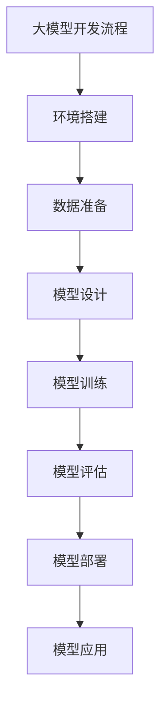
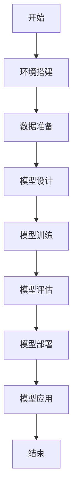

                 

### 《从零开始大模型开发与微调：人工智能：思维与实践的融合》

> **关键词：大模型，开发，微调，人工智能，自然语言处理，计算机视觉，推荐系统**

> **摘要：本文将带你从零开始，深入了解大模型的开发与微调过程，涵盖基础概念、原理与算法，以及大模型在各应用领域的实践案例。通过本文，你将学会如何构建、训练、微调并部署大模型，为你的AI项目提供强大支持。**

## 《从零开始大模型开发与微调：人工智能：思维与实践的融合》目录大纲

#### 第一部分: 大模型基础

1. **第1章: 大模型概述与概念**
   - 1.1 大模型的定义与核心概念
   - 1.2 大模型的架构与分类
   - 1.3 大模型的历史与发展

2. **第2章: 编程与数学基础**
   - 2.1 编程基础
   - 2.2 数学基础

3. **第3章: 大模型原理与架构**
   - 3.1 大模型原理
   - 3.2 大模型架构

4. **第4章: 大模型训练与微调**
   - 4.1 大模型训练基础
   - 4.2 大模型微调

#### 第二部分: 大模型应用与实践

5. **第5章: 大模型在自然语言处理中的应用**
   - 5.1 自然语言处理基础
   - 5.2 大模型在NLP中的应用

6. **第6章: 大模型在计算机视觉中的应用**
   - 6.1 计算机视觉基础
   - 6.2 大模型在CV中的应用

7. **第7章: 大模型在推荐系统中的应用**
   - 7.1 推荐系统基础
   - 7.2 大模型在推荐系统中的应用

#### 第三部分: 大模型开发实践与案例分析

8. **第8章: 大模型项目实战**
   - 8.1 项目背景与目标
   - 8.2 环境搭建与数据准备
   - 8.3 模型设计与实现
   - 8.4 模型部署与应用

## 附录

- **附录A: 工具与资源**
  - 开发工具
  - 数据集资源
  - 学习资源

- **附录B: Mermaid流程图示例**
- **附录C: 数学公式与伪代码示例**

### 第一部分：大模型基础

#### 第1章：大模型概述与概念

### 1.1 大模型的定义与核心概念

大模型（Large Model）是指参数规模较大的机器学习模型，具有数百万到数十亿个参数。这些模型通常用于深度学习和自然语言处理等复杂任务，能够处理大量数据，从而实现更高效和更准确的预测。

大模型的核心特征包括：

- **参数规模大**：大模型的参数数量通常超过数十亿，这使得模型具有更强的表达能力和泛化能力。
- **训练时间长**：由于参数规模大，大模型的训练过程通常需要大量的计算资源和时间。
- **存储需求大**：大模型的存储需求也相对较高，需要较大的存储空间。

大模型在人工智能中的地位十分重要。首先，大模型能够处理复杂任务，如自然语言处理和计算机视觉等。其次，大模型的泛化能力较强，能够适应不同的数据集和任务。最后，大模型在工业界和学术界都有着广泛的应用，推动了人工智能技术的发展。

### 1.2 大模型的架构与分类

大模型的架构可以分为以下几类：

1. **卷积神经网络（Convolutional Neural Network, CNN）**：CNN 是一种用于图像处理和计算机视觉的常用模型。它通过卷积操作提取图像特征，并利用全连接层进行分类。
2. **循环神经网络（Recurrent Neural Network, RNN）**：RNN 是一种用于序列数据处理的模型，如语音识别和机器翻译。RNN 可以通过循环结构处理序列中的每一个元素，从而捕捉序列的长期依赖关系。
3. **Transformer 架构**：Transformer 架构是一种基于自注意力机制的模型，广泛应用于自然语言处理和计算机视觉等领域。Transformer 架构通过多头自注意力机制和前馈网络，实现高效的特征提取和分类。

大模型的发展趋势包括：

1. **模型参数规模的扩大**：随着计算能力的提升，模型参数规模不断扩大，以实现更高的性能和精度。
2. **模型结构的多样化**：研究人员不断探索新的模型结构，以提升模型的性能和泛化能力。
3. **预训练与微调**：预训练和微调技术逐渐成为大模型开发的主流，通过在大量数据上进行预训练，然后针对特定任务进行微调，实现高效的模型训练和部署。

### 1.3 大模型的历史与发展

大模型的发展历程可以追溯到上世纪 80 年代的神经网络研究。当时，由于计算能力和数据集的限制，神经网络的参数规模相对较小。随着计算能力的提升和数据集的扩展，大模型的研发逐渐成为可能。

1. **早期大模型**：在 2012 年之前，大模型主要应用于图像识别和语音识别等领域。例如，AlexNet 是第一个采用深度卷积神经网络（CNN）的模型，其在 ImageNet 数据集上取得了突破性的成绩。
2. **现代大模型**：随着深度学习技术的发展，现代大模型在自然语言处理和计算机视觉等领域取得了显著成果。例如，BERT 是一种预训练的 Transformer 架构模型，其在自然语言处理任务中表现优异。GPT-3 是一种具有1750亿个参数的语言模型，展示了强大的文本生成和推理能力。

在我国，大模型的研究和应用也取得了显著进展。例如，百度研发的ERNIE 模型，应用于自然语言处理和知识图谱等领域；腾讯研发的 TACL 模型，应用于语音识别和机器翻译等领域。

#### 第2章：编程与数学基础

### 2.1 编程基础

在开发大模型时，编程基础至关重要。以下是一些关键的编程基础：

1. **编程语言选择**：Python 是最常用的编程语言，广泛应用于人工智能和深度学习领域。其他常用的编程语言还包括 Java、C++ 和 R。
2. **编程环境搭建**：安装 Python 和相关库，如 TensorFlow、PyTorch 和 Keras。使用虚拟环境（如 virtualenv 或 conda）可以更好地管理依赖关系。
3. **常用编程工具与库**：NumPy 用于数值计算；Pandas 用于数据处理；Matplotlib 和 Seaborn 用于数据可视化。

### 2.2 数学基础

在开发大模型时，掌握一定的数学基础是非常重要的。以下是一些关键的数学基础：

1. **线性代数基础**：矩阵运算、线性方程组求解、特征值和特征向量等。
2. **概率论与统计学基础**：概率分布、随机变量、期望和方差、条件概率和贝叶斯定理等。
3. **最优化算法基础**：梯度下降、随机梯度下降、牛顿法等。

#### 第3章：大模型原理与架构

### 3.1 大模型原理

大模型的工作原理主要包括以下几个步骤：

1. **输入表示**：将输入数据（如图像、文本或音频）转换为模型可以处理的格式。例如，图像可以通过卷积神经网络（CNN）进行特征提取，文本可以通过嵌入层（Embedding Layer）转换为向量表示。
2. **特征提取**：通过神经网络结构提取输入数据的特征。这些特征能够捕捉输入数据中的高层次信息。
3. **预测或分类**：利用提取的特征进行预测或分类。在训练过程中，模型会通过优化算法（如梯度下降）调整参数，以最小化损失函数，提高模型的预测准确性。

### 3.2 大模型架构

大模型的架构通常由以下几个部分组成：

1. **输入层**：接收输入数据，如图像、文本或音频。
2. **隐藏层**：通过一系列非线性变换提取输入数据的特征。隐藏层的数量和大小可以根据任务需求进行调整。
3. **输出层**：将提取的特征映射到预测结果，如分类标签或数值预测值。
4. **激活函数**：用于引入非线性变换，使模型能够学习复杂的关系。
5. **优化算法**：用于调整模型参数，以最小化损失函数。常见的优化算法包括梯度下降、随机梯度下降和 Adam 等。

常见的神经网络架构包括：

1. **卷积神经网络（CNN）**：适用于图像处理和计算机视觉任务。通过卷积操作和池化操作提取图像特征。
2. **循环神经网络（RNN）**：适用于序列数据处理，如语音识别和机器翻译。通过循环结构处理序列中的每一个元素。
3. **Transformer 架构**：适用于自然语言处理任务。通过多头自注意力机制和前馈网络，实现高效的特征提取和分类。

#### 第4章：大模型训练与微调

### 4.1 大模型训练基础

大模型训练主要包括以下几个步骤：

1. **数据准备**：收集和准备训练数据。数据质量对训练效果至关重要，需要进行数据清洗和预处理。
2. **模型设计**：根据任务需求设计合适的神经网络架构。选择合适的损失函数、优化算法和超参数。
3. **模型训练**：将训练数据输入模型，通过反向传播算法更新模型参数。训练过程中，可以采用数据增强、批次归一化等技术提高模型性能。
4. **模型评估**：使用验证数据评估模型性能。常见评估指标包括准确率、召回率、F1 分数等。

### 4.2 大模型微调

大模型微调是指在大模型的基础上，针对特定任务进行微调，以获得更好的性能。微调主要包括以下几个步骤：

1. **预训练**：在大规模数据集上对模型进行预训练，使其具备较强的泛化能力。
2. **微调**：将预训练模型应用于特定任务，通过调整部分参数进行微调，以适应特定任务的需求。
3. **评估与优化**：使用验证数据评估微调模型的性能，并根据评估结果对模型进行进一步优化。

微调的方法包括：

1. **全量微调**：将预训练模型的全部参数应用于特定任务，进行微调。
2. **部分微调**：仅调整部分参数，通常是在预训练模型的基础上增加一些特定任务的网络层。
3. **迁移学习**：将预训练模型应用于其他相关任务，通过迁移学习提高模型性能。

#### 第5章：大模型在自然语言处理中的应用

### 5.1 自然语言处理基础

自然语言处理（Natural Language Processing, NLP）是人工智能的重要分支，旨在让计算机理解和处理人类语言。以下是一些自然语言处理的基础概念：

1. **文本分类**：将文本数据划分为不同的类别，如情感分析、主题分类等。
2. **情感分析**：分析文本中的情感倾向，如正面、负面、中性等。
3. **命名实体识别**：识别文本中的特定实体，如人名、地名、组织名等。
4. **机器翻译**：将一种语言的文本翻译成另一种语言的文本。
5. **问答系统**：构建能够回答用户问题的系统，如智能客服、智能助手等。

### 5.2 大模型在NLP中的应用

大模型在自然语言处理领域取得了显著成果，以下是一些大模型在NLP中的应用：

1. **文本分类**：大模型如 BERT、RoBERTa 和 GPT-3 可以用于文本分类任务。通过预训练和微调，这些模型能够捕捉文本中的语义信息，实现高精度的分类。
2. **情感分析**：大模型可以用于情感分析任务，通过对文本进行情感分类，识别用户的情感倾向。例如，Twitter 上的情感分析就是一个典型的应用场景。
3. **机器翻译**：大模型如 BERT 和 Transformer 可以用于机器翻译任务。通过在大量平行语料上进行预训练，这些模型能够实现高质量的翻译。
4. **问答系统**：大模型如 BERT 和 GPT-3 可以用于构建问答系统。这些模型可以理解用户的问题，并从海量数据中检索出相关答案。

#### 第6章：大模型在计算机视觉中的应用

### 6.1 计算机视觉基础

计算机视觉（Computer Vision, CV）是人工智能的重要分支，旨在让计算机理解和解释图像和视频。以下是一些计算机视觉的基础概念：

1. **图像分类**：将图像划分为不同的类别，如动物、植物、交通工具等。
2. **目标检测**：检测图像中的特定目标，并给出目标的位置和边界框。
3. **图像分割**：将图像划分为多个区域，每个区域具有不同的特征。
4. **目标跟踪**：在视频中跟踪特定目标，如车辆、行人等。
5. **图像生成**：生成新的图像或图像序列，如生成对抗网络（GAN）。

### 6.2 大模型在CV中的应用

大模型在计算机视觉领域取得了显著成果，以下是一些大模型在CV中的应用：

1. **图像分类**：大模型如 ResNet、Inception 和 MobileNet 可以用于图像分类任务。通过预训练和微调，这些模型能够实现高精度的图像分类。
2. **目标检测**：大模型如 YOLO、SSD 和 Faster R-CNN 可以用于目标检测任务。通过在大量数据上进行预训练，这些模型能够检测图像中的多个目标。
3. **图像分割**：大模型如 U-Net 和 DeepLab 可以用于图像分割任务。通过预训练和微调，这些模型能够实现高精度的图像分割。
4. **目标跟踪**：大模型如 Siamese 网络和基于 Transformer 的模型可以用于目标跟踪任务。通过在大量数据上进行预训练，这些模型能够跟踪视频中的目标。

#### 第7章：大模型在推荐系统中的应用

### 7.1 推荐系统基础

推荐系统（Recommender System）是一种基于用户兴趣和偏好为用户提供个性化推荐的系统。以下是一些推荐系统的基础概念：

1. **协同过滤**：协同过滤是一种基于用户行为进行推荐的算法，通过分析用户之间的相似性，推荐用户可能感兴趣的商品或内容。
2. **基于内容的过滤**：基于内容的过滤是一种基于商品或内容的特征进行推荐的算法，通过分析用户的历史行为和商品的特征，推荐用户可能感兴趣的商品或内容。
3. **混合推荐系统**：混合推荐系统结合协同过滤和基于内容的过滤，以提高推荐效果。

### 7.2 大模型在推荐系统中的应用

大模型在推荐系统领域取得了显著成果，以下是一些大模型在推荐系统中的应用：

1. **协同过滤**：大模型如 BPR（Bayesian Personalized Ranking）和 SVD++（Singular Value Decomposition）可以用于协同过滤任务。通过在用户行为数据上进行预训练，这些模型能够提高推荐效果。
2. **基于内容的过滤**：大模型如 Doc2Vec 和 Word2Vec 可以用于基于内容的过滤任务。通过在文本数据上进行预训练，这些模型能够提取文本的特征，提高推荐效果。
3. **混合推荐系统**：大模型如 DeepFM 和 DIN（Deep Interest Network）可以用于混合推荐系统。通过结合协同过滤和基于内容的过滤，这些模型能够实现更精准的推荐。

#### 第8章：大模型项目实战

### 8.1 项目背景与目标

在本项目中，我们将开发一个基于大模型的图像分类系统。该系统旨在识别和分类输入图像中的物体，如动物、植物和交通工具等。项目目标如下：

1. **数据收集**：收集一个包含多种类别的图像数据集。
2. **数据处理**：对图像数据进行预处理，包括图像大小调整、数据增强等。
3. **模型训练**：训练一个大模型（如 ResNet），使其能够准确分类图像。
4. **模型评估**：评估模型的分类性能，并调整模型参数以提高性能。
5. **模型部署**：将训练好的模型部署到生产环境，提供图像分类服务。

### 8.2 环境搭建与数据准备

1. **开发环境搭建**：
   - 安装 Python 3.8 或更高版本。
   - 安装 TensorFlow 或 PyTorch，用于模型训练和推理。
   - 安装必要的依赖库，如 NumPy、Pandas 和 Matplotlib。

2. **数据集准备**：
   - 收集一个包含多种类别的图像数据集，如 ImageNet 或 VOC 数据集。
   - 将图像数据集划分为训练集、验证集和测试集。

3. **数据预处理**：
   - 对图像进行大小调整，使其符合输入层的尺寸。
   - 对图像进行数据增强，如随机裁剪、旋转、翻转等，以增加模型的泛化能力。

### 8.3 模型设计与实现

1. **模型选择**：
   - 选择一个大模型（如 ResNet），用于图像分类。
   - 调整模型参数，如层数、滤波器大小等，以适应任务需求。

2. **模型实现**：
   - 使用 TensorFlow 或 PyTorch 实现模型。
   - 编写模型训练、验证和测试的代码。

```python
# 示例：使用 TensorFlow 实现 ResNet 模型

import tensorflow as tf
from tensorflow.keras.applications import ResNet50
from tensorflow.keras.preprocessing.image import ImageDataGenerator

# 加载预训练的 ResNet50 模型
model = ResNet50(weights='imagenet')

# 编写模型训练代码
train_datagen = ImageDataGenerator(
    rescale=1./255,
    shear_range=0.2,
    zoom_range=0.2,
    horizontal_flip=True)

train_generator = train_datagen.flow_from_directory(
    'train',
    target_size=(224, 224),
    batch_size=32,
    class_mode='categorical')

model.compile(optimizer='adam',
              loss='categorical_crossentropy',
              metrics=['accuracy'])

model.fit(
    train_generator,
    steps_per_epoch=100,
    epochs=10,
    validation_data=validation_generator,
    validation_steps=50)
```

### 8.4 模型部署与应用

1. **模型评估**：
   - 使用测试集评估模型性能，如准确率、召回率等。
   - 根据评估结果调整模型参数，以提高性能。

2. **模型部署**：
   - 将训练好的模型部署到生产环境，如 AWS 或 Google Cloud。
   - 使用 TensorFlow Serving 或 PyTorch Serving 提供模型推理服务。

3. **应用示例**：
   - 使用前端应用程序（如 Web 或移动应用）调用模型接口，实现图像分类功能。

```python
# 示例：使用 TensorFlow Serving 进行模型部署

import requests
import json

# 模型部署地址
model_url = 'http://localhost:8501/v1/models/image_classifier:predict'

# 调用模型接口进行预测
image_data = open('test_image.jpg', 'rb').read()
data = {'instances': json.dumps({"image_bytes": image_data})}

response = requests.post(model_url, data=data)
predictions = json.loads(response.text)['predictions']

print(predictions)
```

### 附录

#### 附录A：工具与资源

- **开发工具**：
  - Python
  - TensorFlow 或 PyTorch
  - Jupyter Notebook 或 PyCharm

- **数据集资源**：
  - ImageNet
  - VOC 数据集
  - CIFAR-10

- **学习资源**：
  - 《深度学习》（Goodfellow et al.）
  - 《Python机器学习》（Sebastian Raschka）
  - Coursera、Udacity 和 edX 上的相关课程

#### 附录B：Mermaid流程图示例



#### 附录C：数学公式与伪代码示例

##### 数学公式

$$
损失函数 = -\frac{1}{N}\sum_{i=1}^{N} y_i \log(p(x_i|y_i))
$$

##### 伪代码

```python
# 模型训练伪代码
initialize_model()
for epoch in range(num_epochs):
    for batch in data_loader:
        optimizer.zero_grad()
        outputs = model(batch)
        loss = criterion(outputs, batch.targets)
        loss.backward()
        optimizer.step()
    print(f"Epoch {epoch+1}/{num_epochs}, Loss: {loss.item()}")
```

### 作者

- **作者：AI天才研究院/AI Genius Institute & 禅与计算机程序设计艺术 /Zen And The Art of Computer Programming**

以上是《从零开始大模型开发与微调：人工智能：思维与实践的融合》的技术博客文章。希望本文能帮助你更好地理解大模型的开发与微调过程，并为你的AI项目提供有价值的指导。如果你有任何疑问或建议，请随时在评论区留言，我会尽快回复。谢谢！## 1.1 大模型的定义与核心概念

### **大模型的定义**

大模型（Large Model）是指参数规模较大的机器学习模型，具有数百万到数十亿个参数。这些模型通常用于深度学习和自然语言处理等复杂任务，能够处理大量数据，从而实现更高效和更准确的预测。

大模型的核心概念包括以下几个方面：

1. **参数规模**：大模型的参数数量通常超过数十亿，这使得模型具有更强的表达能力和泛化能力。例如，Transformer 模型 GPT-3 具有1750亿个参数，而 BERT 模型则有数亿个参数。

2. **预训练与微调**：预训练（Pre-training）是指在大规模数据集上对模型进行训练，使其具备较强的泛化能力。微调（Fine-tuning）则是在预训练模型的基础上，针对特定任务进行参数调整，以提高模型在特定任务上的性能。

3. **计算资源需求**：由于参数规模大，大模型的训练过程通常需要大量的计算资源和时间。因此，高效的数据处理和分布式训练技术在大模型开发中至关重要。

4. **存储需求**：大模型的存储需求也相对较高，需要较大的存储空间。为了满足这一需求，研究人员采用了各种技术，如数据压缩、稀疏表示和分布式存储等。

### **大模型的核心特征**

大模型具有以下核心特征：

1. **参数规模大**：大模型的参数数量通常超过数十亿，这使得模型具有更强的表达能力和泛化能力。

2. **训练时间长**：由于参数规模大，大模型的训练过程通常需要大量的计算资源和时间。

3. **存储需求大**：大模型的存储需求也相对较高，需要较大的存储空间。

4. **泛化能力强**：大模型在预训练阶段接触了大量数据，从而具有更强的泛化能力，能够在不同任务和数据集上表现优异。

5. **适应性强**：大模型能够处理各种类型的输入数据，如文本、图像、音频等，因此在多模态任务中具有广泛的应用。

### **大模型在人工智能中的地位**

大模型在人工智能领域具有重要地位，主要体现在以下几个方面：

1. **处理复杂任务**：大模型能够处理复杂任务，如自然语言处理、计算机视觉和推荐系统等。这些任务通常需要模型具有强大的表达能力和泛化能力，而大模型正好满足这些需求。

2. **推动技术发展**：大模型的研发推动了深度学习、自然语言处理和计算机视觉等领域的技术发展。例如，BERT 的出现促进了自然语言处理技术的进步，而 GPT-3 的发布则推动了自然语言生成和推理技术的发展。

3. **应用广泛**：大模型在工业界和学术界都有着广泛的应用。在工业界，大模型被应用于各种实际场景，如智能客服、智能推荐和自动驾驶等。在学术界，大模型的研究推动了人工智能理论的创新和发展。

### **大模型的分类**

根据模型架构和应用领域，大模型可以分为以下几类：

1. **深度神经网络（Deep Neural Network, DNN）**：深度神经网络是一种包含多层神经元的神经网络。大模型中的深度神经网络通常具有数十亿个参数，广泛应用于图像分类、语音识别和自然语言处理等领域。

2. **卷积神经网络（Convolutional Neural Network, CNN）**：卷积神经网络是一种专门用于图像处理和计算机视觉的神经网络。大模型中的卷积神经网络通常具有数亿个参数，可以处理高维图像数据。

3. **循环神经网络（Recurrent Neural Network, RNN）**：循环神经网络是一种能够处理序列数据的神经网络。大模型中的循环神经网络通常具有数百万个参数，广泛应用于语音识别、机器翻译和自然语言生成等领域。

4. **Transformer 架构**：Transformer 架构是一种基于自注意力机制的神经网络架构。大模型中的 Transformer 架构通常具有数十亿个参数，广泛应用于自然语言处理和计算机视觉等领域。

### **大模型的发展趋势**

随着计算能力的提升和数据集的扩展，大模型的发展趋势包括：

1. **模型参数规模的扩大**：随着计算能力的提升，模型参数规模不断扩大，以实现更高的性能和精度。

2. **模型结构的多样化**：研究人员不断探索新的模型结构，以提升模型的性能和泛化能力。

3. **预训练与微调**：预训练和微调技术逐渐成为大模型开发的主流，通过在大量数据上进行预训练，然后针对特定任务进行微调，实现高效的模型训练和部署。

4. **多模态融合**：大模型在多模态任务中具有广泛的应用前景，如文本、图像和音频的融合处理。

5. **应用场景拓展**：大模型的应用场景不断拓展，从传统的图像分类和语音识别到自然语言生成、推荐系统和自动驾驶等领域。

#### **1.3 大模型的历史与发展**

大模型的发展历程可以追溯到上世纪 80 年代的神经网络研究。当时，由于计算能力和数据集的限制，神经网络的参数规模相对较小。随着计算能力的提升和数据集的扩展，大模型的研发逐渐成为可能。

1. **早期大模型**：在 2012 年之前，大模型主要应用于图像识别和语音识别等领域。例如，AlexNet 是第一个采用深度卷积神经网络（CNN）的模型，其在 ImageNet 数据集上取得了突破性的成绩。此外， recurrent neural network（RNN）也被应用于语音识别和机器翻译等领域。

2. **现代大模型**：随着深度学习技术的发展，现代大模型在自然语言处理和计算机视觉等领域取得了显著成果。例如，BERT 是一种预训练的 Transformer 架构模型，其在自然语言处理任务中表现优异。GPT-3 是一种具有1750亿个参数的语言模型，展示了强大的文本生成和推理能力。此外，大模型如 BERT、GPT-3 和 Vision Transformer（ViT）等也在计算机视觉领域取得了重要突破。

3. **我国大模型的发展**：在我国，大模型的研究和应用也取得了显著进展。例如，百度研发的 ERNIE 模型，广泛应用于自然语言处理和知识图谱等领域；腾讯研发的 TACL 模型，应用于语音识别和机器翻译等领域。此外，我国学者在 BERT、GPT-3 等大模型的基础上，提出了许多创新性的改进模型，进一步推动了大模型技术的发展。

总之，大模型的发展历程体现了计算能力、数据集规模和模型结构等方面的突破。未来，随着技术的不断进步，大模型在人工智能领域将发挥更加重要的作用。#### 2.1 编程基础

在开发大模型时，编程基础至关重要。以下是一些关键的编程基础：

1. **编程语言选择**：Python 是最常用的编程语言，广泛应用于人工智能和深度学习领域。其他常用的编程语言还包括 Java、C++ 和 R。

2. **编程环境搭建**：安装 Python 和相关库，如 TensorFlow、PyTorch 和 Keras。使用虚拟环境（如 virtualenv 或 conda）可以更好地管理依赖关系。

3. **常用编程工具与库**：NumPy 用于数值计算；Pandas 用于数据处理；Matplotlib 和 Seaborn 用于数据可视化。

### **编程语言选择**

Python 是目前最流行的编程语言之一，其简洁的语法和丰富的库资源使其成为深度学习和人工智能领域的首选语言。以下是一些常见的 Python 库：

- **TensorFlow**：TensorFlow 是 Google 开发的一款开源机器学习框架，广泛应用于深度学习和人工智能领域。它提供了丰富的 API，方便用户进行模型设计、训练和部署。
  
- **PyTorch**：PyTorch 是由 Facebook 开发的一款开源机器学习框架，其动态计算图和灵活的 API 使其在深度学习和人工智能领域广受欢迎。

- **Keras**：Keras 是一个基于 TensorFlow 和 Theano 的 Python 深度学习库，其简洁的 API 和易用性使其成为初学者的首选。

### **编程环境搭建**

搭建 Python 编程环境通常包括以下步骤：

1. **安装 Python**：下载并安装 Python，可以选择 Python 3.6 或更高版本。

2. **安装相关库**：使用 pip 工具安装 TensorFlow、PyTorch、Keras 等相关库。以下是一个简单的命令示例：

```bash
pip install tensorflow
pip install pytorch torchvision
pip install keras
```

3. **设置虚拟环境**：使用 virtualenv 或 conda 创建一个虚拟环境，以便更好地管理项目和库版本。以下是一个使用 virtualenv 的示例：

```bash
pip install virtualenv
virtualenv myenv
source myenv/bin/activate
```

### **常用编程工具与库**

在深度学习和人工智能项目中，常用的编程工具和库包括以下几类：

- **数据处理**：Pandas 用于数据处理和分析；NumPy 用于数值计算。

- **数据可视化**：Matplotlib 和 Seaborn 用于数据可视化；Plotly 提供了交互式可视化功能。

- **机器学习与深度学习**：Scikit-learn 用于传统机器学习；TensorFlow 和 PyTorch 用于深度学习；Keras 是 TensorFlow 和 PyTorch 的封装库。

- **自然语言处理**：NLTK 和 spaCy 用于自然语言处理；TextBlob 用于文本分析。

- **计算机视觉**：OpenCV 用于计算机视觉；PIL 用于图像处理；PyTorch 和 TensorFlow 提供了用于计算机视觉的预训练模型和 API。

### **编程基础实践**

以下是一个简单的 Python 程序示例，用于加法和减法操作：

```python
import numpy as np

# 加法操作
def add(a, b):
    return a + b

# 减法操作
def subtract(a, b):
    return a - b

# 测试函数
print(add(5, 3)) # 输出：8
print(subtract(5, 3)) # 输出：2
```

这个示例演示了如何使用 NumPy 库进行数值计算，并展示了基本的函数定义和调用方法。

### **总结**

掌握编程基础是开发大模型的重要前提。选择合适的编程语言和工具，搭建稳定的编程环境，熟悉常用的编程库和函数，将为你的大模型开发工作奠定坚实的基础。接下来，我们将进一步探讨大模型的数学基础，帮助你更好地理解深度学习模型的原理和算法。#### 2.2 数学基础

在深度学习和人工智能领域中，数学基础是理解模型原理和算法的关键。以下是一些关键的数学概念和算法，它们在大模型开发中发挥着重要作用：

### **线性代数基础**

线性代数是深度学习中的核心数学工具，主要涉及矩阵运算、线性变换、向量空间等概念。

1. **矩阵运算**：矩阵是线性代数的基本元素，常见的矩阵运算包括加法、减法、乘法和逆运算。矩阵乘法在深度学习中的卷积操作和矩阵乘法层中广泛应用。

2. **线性变换**：线性变换是将输入数据通过线性组合映射到新的空间。例如，在神经网络中，输入层到隐藏层的映射可以看作是一个线性变换。

3. **向量空间**：向量空间是一组向量的集合，具有向量加法和标量乘法运算。在深度学习中，神经网络的权重和偏置可以看作是向量空间中的元素。

**数学公式与示例**：

$$
A \cdot B = C \quad \text{（矩阵乘法）}
$$

$$
A^{-1} = B \quad \text{（矩阵逆运算）}
$$

$$
Ax = b \quad \text{（线性方程组求解）}
$$

示例：假设有两个矩阵 \(A\) 和 \(B\)，如下：

$$
A = \begin{bmatrix}
1 & 2 \\
3 & 4
\end{bmatrix}, \quad
B = \begin{bmatrix}
5 & 6 \\
7 & 8
\end{bmatrix}
$$

则它们的乘积 \(C = AB\) 为：

$$
C = \begin{bmatrix}
1 \cdot 5 + 2 \cdot 7 & 1 \cdot 6 + 2 \cdot 8 \\
3 \cdot 5 + 4 \cdot 7 & 3 \cdot 6 + 4 \cdot 8
\end{bmatrix} = \begin{bmatrix}
19 & 20 \\
31 & 34
\end{bmatrix}
$$

### **概率论与统计学基础**

概率论和统计学是理解和应用机器学习模型的重要数学基础。

1. **概率分布**：概率分布描述了随机变量的概率分布情况，常见的有伯努利分布、正态分布、二项分布等。在深度学习中，概率分布用于表示数据的不确定性。

2. **随机变量**：随机变量是概率论中的基本概念，它是一个数值函数，将样本空间映射到实数集。

3. **期望和方差**：期望和方差是描述随机变量统计特性的重要指标。期望表示随机变量的平均值，方差表示随机变量的离散程度。

**数学公式与示例**：

$$
E(X) = \sum_{i} x_i P(X = x_i) \quad \text{（期望）}
$$

$$
Var(X) = E[(X - E(X))^2] \quad \text{（方差）}
$$

示例：假设随机变量 \(X\) 服从正态分布 \(N(\mu, \sigma^2)\)，其中 \(\mu = 10\)，\(\sigma = 2\)。则 \(X\) 的期望和方差分别为：

$$
E(X) = 10, \quad Var(X) = 2^2 = 4
$$

### **最优化算法基础**

最优化算法是用于寻找函数最小值或最大值的算法，在深度学习模型的训练中至关重要。

1. **梯度下降**：梯度下降是最常用的最优化算法，通过迭代更新模型参数，以减小损失函数。梯度是函数在某一点的切线斜率，用于指导参数更新。

2. **随机梯度下降（SGD）**：随机梯度下降是梯度下降的一种变体，每次迭代使用一个随机样本的梯度，从而加快收敛速度。

3. **Adam**：Adam 是一种自适应梯度算法，结合了 SGD 和动量方法，能够自适应地调整学习率，提高收敛速度。

**数学公式与伪代码示例**：

梯度下降：

$$
\theta = \theta - \alpha \cdot \nabla_{\theta} J(\theta)
$$

伪代码：

```
initialize parameters theta
for each iteration:
    compute gradient of J(theta)
    update theta by subtracting alpha times the gradient
```

Adam 算法：

$$
m_t = \beta_1 m_{t-1} + (1 - \beta_1) \nabla_{\theta} J(\theta)
$$

$$
v_t = \beta_2 v_{t-1} + (1 - \beta_2) (\nabla_{\theta} J(\theta))^2
$$

$$
\theta = \theta - \alpha \cdot \frac{m_t}{\sqrt{v_t} + \epsilon}
```

伪代码：

```
initialize m, v, beta1, beta2, epsilon
for each iteration:
    compute gradient of J(theta)
    update m and v using the current gradient
    update theta using the updated m and v
```

### **总结**

数学基础是深度学习和人工智能领域的核心，线性代数、概率论与统计学以及最优化算法在大模型开发中起着至关重要的作用。理解这些数学概念和算法，不仅有助于我们更好地设计和优化模型，还能提升我们对机器学习原理的深入理解。接下来，我们将进一步探讨大模型的基本原理和架构，以便更好地掌握大模型的开发和应用。#### 3.1 大模型原理

### **大模型的工作原理**

大模型（如深度神经网络）的工作原理主要基于神经元的计算和信息的传递。以下是大模型的基本工作流程：

1. **输入表示**：将输入数据（如图像、文本或音频）转换为模型可以处理的格式。例如，图像可以通过卷积神经网络（CNN）进行特征提取，文本可以通过嵌入层（Embedding Layer）转换为向量表示。

2. **特征提取**：通过多层神经网络结构提取输入数据的特征。在每一层中，神经元对输入数据进行处理，并传递到下一层。通过逐层传递，模型能够捕捉输入数据中的高层次信息。

3. **非线性变换**：在特征提取过程中，每层神经网络通常包含一个非线性激活函数（如 ReLU、Sigmoid 或 Tanh），以引入非线性特性，提高模型的表示能力。

4. **预测或分类**：利用提取的特征进行预测或分类。在训练过程中，模型会通过优化算法（如梯度下降）调整参数，以最小化损失函数，提高模型的预测准确性。

### **大模型的训练过程**

大模型的训练过程包括以下几个步骤：

1. **初始化参数**：随机初始化模型的参数（如权重和偏置）。

2. **前向传播**：将输入数据传递到模型中，计算每一层的输出。通过反向传播算法，将输出与实际标签进行比较，计算损失函数。

3. **反向传播**：计算损失函数关于模型参数的梯度，并使用梯度下降或其他优化算法更新参数。

4. **迭代优化**：重复前向传播和反向传播过程，不断更新参数，直到模型收敛或达到预设的训练次数。

### **大模型的推理过程**

大模型的推理过程是指在训练完成后，使用模型对新数据进行预测或分类的过程。以下是大模型推理的基本流程：

1. **输入表示**：将输入数据转换为模型可以处理的格式。

2. **特征提取**：通过训练好的模型提取输入数据的特征。

3. **分类或预测**：利用提取的特征进行分类或预测，输出模型结果。

### **大模型的特点**

大模型具有以下特点：

1. **参数规模大**：大模型通常具有数十亿个参数，这使其具有强大的表示能力和泛化能力。

2. **多层结构**：大模型包含多层神经网络，每一层都可以提取输入数据的不同层次特征。

3. **非线性变换**：大模型中的每一层通常包含非线性激活函数，以增强模型的非线性表示能力。

4. **预训练与微调**：大模型通常通过预训练（在大量数据集上训练）和微调（在特定任务上进行调整）来提高模型性能。

### **大模型的优缺点**

**优点**：

- **强大的表示能力**：大模型可以处理复杂的任务，如图像识别、自然语言处理和语音识别等。
- **高效的泛化能力**：大模型在预训练阶段接触了大量数据，从而具有更强的泛化能力。
- **多样化的应用**：大模型可以应用于各种领域，如金融、医疗、交通等。

**缺点**：

- **计算资源需求高**：大模型的训练和推理过程需要大量的计算资源和时间。
- **数据隐私问题**：大模型在预训练阶段处理了大量数据，可能涉及数据隐私问题。
- **模型解释性差**：大模型通常具有较低的解释性，难以理解其内部工作机制。

### **大模型的常见架构**

大模型的常见架构包括卷积神经网络（CNN）、循环神经网络（RNN）、Transformer 等。以下是对这些架构的简要介绍：

1. **卷积神经网络（CNN）**：CNN 是一种专门用于图像处理的神经网络，通过卷积操作和池化操作提取图像特征。CNN 广泛应用于图像分类、目标检测和图像分割等领域。

2. **循环神经网络（RNN）**：RNN 是一种专门用于处理序列数据的神经网络，通过循环结构处理序列中的每一个元素。RNN 广泛应用于语音识别、机器翻译和自然语言生成等领域。

3. **Transformer 架构**：Transformer 是一种基于自注意力机制的神经网络架构，通过多头自注意力机制和前馈网络实现高效的特征提取和分类。Transformer 广泛应用于自然语言处理和计算机视觉等领域。

### **大模型的训练与优化**

**数据增强**：数据增强是一种常用的技术，通过随机旋转、缩放、裁剪等操作增加训练数据的多样性，从而提高模型的泛化能力。

**批次归一化**：批次归一化（Batch Normalization）是一种用于加速训练和提升模型稳定性的技术，通过标准化每个批次的输入数据，减少内部协变量转移。

**学习率调度**：学习率调度是一种用于调整学习率的技术，通过动态调整学习率，使模型在不同训练阶段获得更好的收敛效果。

**优化算法**：常见的优化算法包括梯度下降（Gradient Descent）、随机梯度下降（Stochastic Gradient Descent, SGD）、Adam 等。不同的优化算法在训练效率和模型性能上有所差异。

**正则化**：正则化是一种用于防止模型过拟合的技术，通过在损失函数中添加正则化项，如 L1、L2 正则化，限制模型参数的大小。

### **总结**

大模型的工作原理基于神经元的计算和信息的传递，通过特征提取、非线性变换和预测或分类实现复杂任务。大模型具有强大的表示能力和泛化能力，但同时也面临着计算资源需求高、数据隐私问题和模型解释性差等挑战。了解大模型的原理和常见架构，以及训练与优化的方法，对于开发高效的大模型具有重要意义。在下一节中，我们将进一步探讨大模型的架构设计和实现细节。#### 3.2 大模型架构

### **深层神经网络架构**

深层神经网络（Deep Neural Network, DNN）是一种具有多个隐藏层的神经网络。它通过逐层提取输入数据的高层次特征，从而实现复杂的非线性变换。以下是一个典型的深层神经网络架构：

1. **输入层**：接收输入数据，如图像、文本或音频。
2. **隐藏层**：通过一系列非线性变换（如激活函数）提取输入数据的高层次特征。隐藏层的数量和大小可以根据任务需求进行调整。
3. **输出层**：将提取的特征映射到预测结果，如分类标签或数值预测值。

深层神经网络的特点包括：

- **多层结构**：深层神经网络具有多个隐藏层，这使得模型能够捕捉输入数据中的更高层次信息。
- **非线性变换**：每一层神经网络通常包含一个非线性激活函数（如 ReLU、Sigmoid 或 Tanh），以引入非线性特性，提高模型的表示能力。
- **参数规模大**：由于多层结构，深层神经网络具有大量的参数，这使得模型具有更强的表达能力和泛化能力。

### **注意力机制与Transformer架构**

注意力机制（Attention Mechanism）是一种用于提高模型表示能力和泛化能力的机制。它通过计算输入数据中不同部分的重要程度，从而实现高效的注意力分配。Transformer 架构是一种基于注意力机制的神经网络架构，广泛应用于自然语言处理和计算机视觉等领域。

#### **注意力机制**

注意力机制可以分为几种类型：

1. **软注意力**：软注意力通过计算输入数据中每个部分与目标之间的相关性，并加权求和，从而实现注意力分配。软注意力机制适用于处理输入数据中存在较强关联性的场景。

2. **硬注意力**：硬注意力通过计算输入数据中每个部分与目标之间的相关性，并选择最高分的部分作为注意力分配的结果。硬注意力机制适用于处理输入数据中存在较强竞争关系的场景。

#### **Transformer架构**

Transformer 架构是一种基于自注意力机制的神经网络架构，其核心思想是通过多头自注意力机制和前馈网络，实现高效的特征提取和分类。

1. **多头自注意力**：多头自注意力机制将输入数据分成多个头，每个头独立计算注意力权重，并分别加权求和。多头自注意力能够提高模型对输入数据的理解能力。

2. **前馈网络**：前馈网络位于自注意力层之后，通过两个全连接层进行特征变换。前馈网络用于增强模型的非线性表示能力。

3. **位置编码**：由于自注意力机制不考虑输入数据的位置信息，因此需要通过位置编码（Positional Encoding）引入位置信息。位置编码可以是绝对位置编码或相对位置编码。

#### **其他大模型架构**

除了深层神经网络和 Transformer 架构外，还有一些其他大模型架构，如 Gated Recurrent Unit（GRU）和 Long Short-Term Memory（LSTM）。

1. **GRU**：GRU 是一种改进的循环神经网络，通过门控机制解决长短期依赖问题。GRU 具有较短的路径和较小的计算量，适用于处理序列数据。

2. **LSTM**：LSTM 是一种经典的循环神经网络，通过门控机制和细胞状态解决长短期依赖问题。LSTM 具有较强的表达能力和泛化能力，适用于处理复杂序列数据。

### **总结**

大模型架构的设计对于模型性能和泛化能力至关重要。深层神经网络通过多层结构和非线性变换实现复杂的非线性变换，而 Transformer 架构通过多头自注意力机制和前馈网络实现高效的特征提取和分类。其他大模型架构如 GRU 和 LSTM 在处理序列数据方面也具有显著优势。了解不同大模型架构的设计原理和特点，有助于我们在实际应用中选择合适的模型架构。在下一节中，我们将探讨大模型的训练与微调过程。#### 4.1 大模型训练基础

### **训练数据准备**

训练数据是构建大模型的基础，其质量和数量直接影响模型性能。以下是一些关于训练数据准备的关键步骤：

1. **数据收集**：收集与任务相关的数据集。对于图像分类任务，可以使用公开的数据集如 ImageNet、CIFAR-10 等。对于自然语言处理任务，可以使用公开的数据集如 WIKITEXT、Common Crawl 等。

2. **数据预处理**：对收集到的数据集进行预处理，包括数据清洗、归一化、裁剪、填充等。对于图像数据，可以进行灰度化、缩放、旋转、翻转等操作。对于文本数据，可以进行分词、词性标注、停用词过滤等操作。

3. **数据增强**：数据增强是通过一系列操作增加训练数据的多样性，从而提高模型的泛化能力。常见的数据增强方法包括随机裁剪、缩放、旋转、翻转、颜色抖动等。

4. **数据划分**：将数据集划分为训练集、验证集和测试集。通常，训练集用于模型训练，验证集用于模型调优，测试集用于模型评估。

### **训练算法选择**

训练算法是指用于更新模型参数的算法，常见的训练算法包括梯度下降（Gradient Descent）及其变体，如随机梯度下降（Stochastic Gradient Descent, SGD）、批量梯度下降（Batch Gradient Descent）和 Adam 等。

1. **梯度下降（Gradient Descent）**：梯度下降是最基本的优化算法，其基本思想是通过计算损失函数关于模型参数的梯度，并沿着梯度的反方向更新参数，从而最小化损失函数。

2. **随机梯度下降（Stochastic Gradient Descent, SGD）**：随机梯度下降是梯度下降的一种变体，每次迭代仅使用一个样本的梯度进行参数更新。SGD 能够加快收敛速度，但可能会导致模型不稳定。

3. **批量梯度下降（Batch Gradient Descent）**：批量梯度下降是梯度下降的另一种变体，每次迭代使用整个训练集的梯度进行参数更新。BGD 能够提供更稳定的收敛，但训练时间较长。

4. **Adam**：Adam 是一种自适应梯度算法，结合了 SGD 和动量方法，能够自适应地调整学习率。Adam 在实际应用中表现出良好的性能和稳定性。

### **训练策略与优化**

为了提高模型性能和泛化能力，以下是一些常用的训练策略和优化技巧：

1. **学习率调度**：学习率调度是一种用于动态调整学习率的技术。常见的学习率调度策略包括固定学习率、逐步下降学习率、指数衰减学习率等。

2. **正则化**：正则化是一种用于防止模型过拟合的技术。常见的正则化方法包括 L1 正则化、L2 正则化和dropout 等。

3. **数据增强**：数据增强是通过一系列操作增加训练数据的多样性，从而提高模型的泛化能力。常见的数据增强方法包括随机裁剪、缩放、旋转、翻转等。

4. **批次归一化**：批次归一化是一种用于加速训练和提升模型稳定性的技术，通过标准化每个批次的输入数据，减少内部协变量转移。

5. **模型融合**：模型融合是将多个模型的预测结果进行加权平均，从而提高模型性能。常见的方法包括加权平均、投票法等。

6. **迁移学习**：迁移学习是一种利用预训练模型进行微调的技术。通过在预训练模型的基础上进行微调，可以节省训练时间和计算资源。

### **总结**

大模型的训练基础包括训练数据准备、训练算法选择和训练策略与优化。训练数据的质量和数量直接影响模型性能，而选择合适的训练算法和优化策略可以提升模型性能和泛化能力。在实际应用中，根据任务需求和数据特性，灵活选择训练策略和优化方法，有助于构建高效的大模型。在下一节中，我们将探讨大模型的微调过程。#### 4.2 大模型微调

### **微调的概念与意义**

微调（Fine-tuning）是一种在大模型基础上，针对特定任务进行参数调整的技术。通过微调，可以在预训练模型的基础上，利用少量特定任务的数据，迅速提高模型的性能。微调的意义主要体现在以下几个方面：

1. **加速训练过程**：微调减少了需要从头开始训练的样本量，从而显著缩短了训练时间。
2. **提高模型性能**：通过在特定任务上进行微调，模型可以更好地适应任务需求，从而提高性能。
3. **节约计算资源**：微调利用了预训练模型的知识，减少了训练过程中所需的计算资源和存储空间。

### **微调的方法与技巧**

微调的方法可以分为全量微调和部分微调：

1. **全量微调**：全量微调是指在预训练模型的基础上，调整全部参数，以适应特定任务。这种方法适用于任务之间具有较高相似性，或者预训练模型已经在特定任务上表现出良好性能的情况。

2. **部分微调**：部分微调是指仅调整部分参数，通常是在预训练模型的基础上增加一些特定任务的神经网络层。这种方法适用于任务之间存在较大差异，或者预训练模型在特定任务上性能不佳的情况。

以下是一些微调的技巧：

1. **学习率调整**：在微调过程中，通常需要降低学习率，以避免参数更新过大，导致模型性能下降。可以使用较小的学习率，如 \(10^{-5}\) 或 \(10^{-6}\)。

2. **批次大小调整**：在微调过程中，可以选择较小的批次大小，以减少过拟合风险。

3. **数据增强**：在微调阶段，可以使用数据增强技术，如随机裁剪、旋转、翻转等，以增加训练样本的多样性，提高模型泛化能力。

4. **正则化**：可以使用正则化技术，如 L1 正则化、L2 正则化或 dropout，以防止模型过拟合。

5. **预训练模型选择**：选择一个在特定任务上表现良好的预训练模型进行微调，可以提高微调后的模型性能。

### **微调实践**

以下是一个使用预训练模型进行微调的示例：

```python
# 导入所需的库
import torch
import torchvision
import torchvision.models as models
import torch.optim as optim

# 加载预训练的模型
model = models.resnet50(pretrained=True)

# 设置学习率和优化器
learning_rate = 0.001
optimizer = optim.Adam(model.parameters(), lr=learning_rate)

# 加载训练数据和验证数据
train_loader = torchvision.datasets.CIFAR10(root='./data', train=True, download=True, transform=torchvision.transforms.ToTensor())
val_loader = torchvision.datasets.CIFAR10(root='./data', train=False, download=True, transform=torchvision.transforms.ToTensor())

# 训练模型
num_epochs = 10
for epoch in range(num_epochs):
    model.train()
    for images, labels in train_loader:
        optimizer.zero_grad()
        outputs = model(images)
        loss = torch.nn.CrossEntropyLoss()(outputs, labels)
        loss.backward()
        optimizer.step()
    print(f"Epoch [{epoch+1}/{num_epochs}], Loss: {loss.item()}")

    # 验证模型
    model.eval()
    correct = 0
    total = 0
    with torch.no_grad():
        for images, labels in val_loader:
            outputs = model(images)
            _, predicted = torch.max(outputs.data, 1)
            total += labels.size(0)
            correct += (predicted == labels).sum().item()
    print(f"Validation Accuracy: {100 * correct / total}%")
```

在这个示例中，我们使用预训练的 ResNet-50 模型进行微调。首先，我们设置学习率和优化器，然后加载训练数据和验证数据。接下来，我们进行训练，并在每个 epoch 后验证模型的性能。

### **总结**

微调是一种在大模型基础上，针对特定任务进行参数调整的技术。通过微调，可以加速训练过程、提高模型性能和节约计算资源。在实际应用中，根据任务需求和数据特性，选择合适的微调方法和技巧，有助于构建高效的大模型。在下一节中，我们将探讨大模型在自然语言处理中的应用。#### 5.1 自然语言处理基础

### **自然语言处理（NLP）简介**

自然语言处理（Natural Language Processing，NLP）是人工智能（Artificial Intelligence，AI）的一个重要分支，旨在让计算机理解和处理人类语言。NLP 的目标是使计算机能够与人类以自然语言的方式进行交流，从而实现人机交互、信息检索、文本分析、机器翻译、情感分析等应用。

### **NLP 的关键任务**

自然语言处理的关键任务包括：

1. **文本分类（Text Classification）**：将文本数据分为不同的类别，如新闻文章的分类、社交媒体文本的情感分析等。

2. **情感分析（Sentiment Analysis）**：分析文本中的情感倾向，如正面、负面或中性情感。

3. **命名实体识别（Named Entity Recognition，NER）**：识别文本中的特定实体，如人名、地名、组织名、时间等。

4. **机器翻译（Machine Translation）**：将一种语言的文本翻译成另一种语言的文本。

5. **问答系统（Question Answering，QA）**：构建能够回答用户问题的系统，如智能客服、智能助手等。

6. **文本生成（Text Generation）**：根据输入的文本或提示生成新的文本，如自动写作、摘要生成等。

### **词嵌入技术**

词嵌入（Word Embedding）是将词汇转换为向量表示的技术，目的是将语义信息编码到向量中，从而实现计算机对文本的理解。词嵌入技术在 NLP 中扮演着重要角色，常见的词嵌入技术包括：

1. **词袋模型（Bag of Words，BOW）**：将文本表示为词汇的集合，不考虑词汇的顺序和语法结构。

2. **词嵌入（Word2Vec）**：通过学习词汇的上下文信息，将词汇映射到低维向量空间中，常见的词嵌入算法包括 Skip-Gram 和 Continuous Bag of Words（CBOW）。

3. ** GloVe（Global Vectors for Word Representation）**：基于词频统计和共现关系学习词汇的向量表示，通过训练大量的语料库来生成高质量的词嵌入。

4. **BERT（Bidirectional Encoder Representations from Transformers）**：一种基于 Transformer 架构的预训练语言表示模型，通过双向编码器学习词汇的上下文信息。

### **序列模型与注意力机制**

在 NLP 中，序列模型（如 RNN、LSTM、GRU）被广泛用于处理序列数据，如文本、语音和时序数据。这些模型通过递归结构处理序列中的每个元素，捕捉序列的长期依赖关系。

1. **循环神经网络（Recurrent Neural Network，RNN）**：RNN 是一种基于递归结构的神经网络，能够处理序列数据。RNN 通过记忆单元（memory unit）来存储序列中的信息。

2. **长短期记忆网络（Long Short-Term Memory，LSTM）**：LSTM 是 RNN 的一个改进版本，通过引入门控机制（gate mechanism）来控制信息的流动，从而解决 RNN 的长期依赖问题。

3. **门控循环单元（Gated Recurrent Unit，GRU）**：GRU 是 LSTM 的简化版本，通过合并输入门和遗忘门，减少了模型参数和计算复杂度。

注意力机制（Attention Mechanism）是一种用于提高 NLP 模型表示能力的技术。注意力机制能够动态地分配不同的权重给序列中的每个元素，从而捕捉重要的信息。常见的注意力机制包括：

1. **点积注意力（Dot-Product Attention）**：点积注意力是最简单的注意力机制，通过计算查询（query）和键（key）之间的点积来生成权重。

2. **加性注意力（Additive Attention）**：加性注意力通过计算查询和键之间的加性和softmax函数来生成权重。

3. **缩放点积注意力（Scaled Dot-Product Attention）**：缩放点积注意力通过缩放点积分数来避免梯度消失问题，提高模型的性能。

### **总结**

自然语言处理是人工智能领域的一个重要分支，旨在让计算机理解和处理人类语言。NLP 的关键任务包括文本分类、情感分析、命名实体识别、机器翻译和问答系统等。词嵌入技术是将词汇转换为向量表示的方法，而序列模型和注意力机制是处理序列数据和捕捉长期依赖关系的关键技术。掌握这些基础知识，有助于我们更好地理解 NLP 的原理和应用。在下一节中，我们将探讨大模型在自然语言处理中的应用。#### 5.2 大模型在NLP中的应用

### **大模型在文本分类中的应用**

文本分类是自然语言处理中的一个常见任务，目标是将文本数据划分为预定义的类别。随着深度学习技术的发展，大模型在文本分类任务中表现出了卓越的性能。以下是一些大模型在文本分类中的应用：

1. **BERT（Bidirectional Encoder Representations from Transformers）**：BERT 是一种基于 Transformer 架构的预训练语言模型，通过在大规模语料库上进行双向编码，BERT 能够捕捉文本的上下文信息。在文本分类任务中，BERT 通常用于文本的编码，将文本转换为固定长度的向量表示，然后输入到分类器中进行分类。BERT 的预训练模型如 `bert-base-uncased` 和 `bert-large-uncased` 在多个文本分类任务中取得了优异的成绩。

2. **GPT-3（Generative Pre-trained Transformer 3）**：GPT-3 是 OpenAI 开发的一种具有1750亿参数的 Transformer 模型，它在文本生成和序列预测任务中表现出色。尽管 GPT-3 主要用于生成任务，但也可以用于文本分类。通过微调 GPT-3，使其能够适应特定的文本分类任务，如情感分析或主题分类。

3. **XLNet**：XLNet 是基于 Transformer 架构的一种预训练语言模型，它通过引入全局的自注意力机制，解决了传统 Transformer 模型中存在的长距离依赖问题。XLNet 在文本分类任务中也展现出了强大的性能。

**应用案例**：

- **新闻文章分类**：使用 BERT 模型对新闻文章进行分类，可以将新闻文章划分为不同的主题类别，如政治、经济、科技等。
- **社交媒体情感分析**：通过微调 BERT 模型，可以对社交媒体文本进行情感分析，识别文本中的正面、负面或中性情感。
- **产品评论分类**：在电子商务平台上，可以使用 BERT 模型对用户评论进行分类，从而帮助商家了解用户对产品的反馈。

### **大模型在情感分析中的应用**

情感分析是一种评估文本中情感倾向的任务，旨在识别文本表达的情感类型。大模型在情感分析任务中具有显著优势，能够处理复杂的情感表达和微妙的情感差异。

1. **预训练模型的使用**：使用预训练的 BERT、RoBERTa、GPT-3 等模型进行情感分析，这些模型已经在大规模语料库上进行了预训练，能够捕捉文本中的情感信息。

2. **微调技术**：在特定任务上进行微调，以适应不同领域的情感分析需求。例如，针对社交媒体文本的情感分析，可以使用微调后的 BERT 模型。

**应用案例**：

- **社交媒体情感分析**：通过微调 BERT 模型，可以对社交媒体平台上的用户评论进行情感分析，识别用户的情感倾向，从而帮助平台管理员了解用户情绪。
- **产品评价分析**：在电子商务平台上，可以使用情感分析模型对用户评论进行情感分析，从而帮助商家了解用户对产品的满意度。

### **大模型在问答系统中的应用**

问答系统是一种智能交互系统，旨在回答用户提出的问题。大模型在问答系统中发挥着重要作用，能够处理复杂的语义理解和多轮对话。

1. **基于检索的问答系统**：使用预训练的模型（如 BERT、GPT-3）进行检索，从大量文档中检索出与用户问题最相关的信息，然后生成回答。

2. **基于生成的问答系统**：使用大模型（如 GPT-3）直接生成回答，通过训练模型使其能够理解用户的问题，并生成准确的回答。

**应用案例**：

- **智能客服**：构建基于大模型的问答系统，用于智能客服，能够自动回答用户提出的问题，提高客服效率。
- **在线教育**：在在线教育平台上，使用问答系统帮助学生解决学习中的问题，提供个性化的学习支持。

### **总结**

大模型在自然语言处理中的应用为文本分类、情感分析和问答系统等领域带来了显著的性能提升。通过预训练和微调技术，大模型能够处理复杂的文本数据，实现高精度的分类和情感分析。同时，大模型在问答系统中的应用也推动了人机交互的发展，使得计算机能够更好地理解用户的意图并提供准确的回答。在下一节中，我们将探讨大模型在计算机视觉中的应用。#### 6.1 计算机视觉基础

### **计算机视觉（CV）简介**

计算机视觉（Computer Vision，CV）是人工智能的一个重要分支，旨在使计算机能够通过图像和视频获取信息，并模仿人类的视觉感知能力。计算机视觉技术被广泛应用于多个领域，包括图像分类、目标检测、图像分割、人脸识别、物体追踪等。

### **图像分类**

图像分类（Image Classification）是一种将图像划分为预定义类别的任务。在图像分类中，模型的任务是学习图像的特征，以便能够将新图像正确分类到某个类别。

**常见算法**：

- **传统算法**：如支持向量机（SVM）、K最近邻（K-Nearest Neighbors，KNN）和决策树等。
- **深度学习算法**：如卷积神经网络（Convolutional Neural Networks，CNN）、GoogLeNet、ResNet、Inception等。

**应用场景**：

- **医学影像分析**：使用图像分类模型对医学影像进行分析，如癌症筛查。
- **自动驾驶**：使用图像分类模型对道路标志和行人的识别。

### **目标检测**

目标检测（Object Detection）是计算机视觉中的一个重要任务，目标是在图像中检测并定位多个目标对象。

**常见算法**：

- **单阶段算法**：如 YOLO（You Only Look Once）、SSD（Single Shot MultiBox Detector）。
- **两阶段算法**：如 R-CNN（Region-based CNN）、Faster R-CNN、Mask R-CNN。

**应用场景**：

- **安防监控**：实时检测视频中的异常行为，如闯入者、火灾等。
- **自动驾驶**：检测道路上的车辆、行人、交通标志等，以确保行车安全。

### **图像分割**

图像分割（Image Segmentation）是将图像划分为多个区域，每个区域具有不同的特征。图像分割可以用于物体识别、图像编辑和视频处理等任务。

**常见算法**：

- **基于阈值的分割**：如 Otsu 阈值分割、自适应阈值分割。
- **基于区域生长的分割**：如区域增长法、分水岭算法。
- **基于深度学习的分割**：如 U-Net、DeepLabV3+、FCN（Fully Convolutional Network）。

**应用场景**：

- **医学影像分析**：对医学影像进行分割，以便进行病变区域的检测和分析。
- **图像编辑**：对图像进行精确的区域编辑，如去除背景、改变颜色等。

### **人脸识别**

人脸识别（Face Recognition）是通过比较人脸图像中的特征，来确定身份的计算机视觉技术。

**常见算法**：

- **特征提取**：如 LBPH（Local Binary Patterns Histograms）、Eigenfaces、LDA（Linear Discriminant Analysis）。
- **深度学习方法**：如基于卷积神经网络的模型，如 FaceNet、DeepFace。

**应用场景**：

- **安全监控**：通过人脸识别技术实现对监控视频中的目标身份识别。
- **手机解锁**：使用人脸识别技术作为手机解锁的替代方案，提高安全性。

### **物体追踪**

物体追踪（Object Tracking）是在视频序列中跟踪特定物体的运动。

**常见算法**：

- **基于模型的跟踪**：如 Kalman 滤波、粒子滤波。
- **基于深度学习的跟踪**：如基于 RNN（Recurrent Neural Network）的跟踪模型。

**应用场景**：

- **视频监控**：通过物体追踪技术，实时跟踪视频中的运动目标。
- **自动驾驶**：在自动驾驶系统中，通过物体追踪技术识别和跟踪道路上的车辆和行人。

### **总结**

计算机视觉基础包括图像分类、目标检测、图像分割、人脸识别和物体追踪等关键任务。这些任务在医学影像分析、自动驾驶、安防监控、图像编辑和智能监控等领域有着广泛的应用。理解这些基本概念和算法，有助于我们更好地掌握计算机视觉技术，并在实际应用中实现高效的图像处理和分析。在下一节中，我们将探讨大模型在计算机视觉中的应用。#### 6.2 大模型在计算机视觉中的应用

### **图像分类**

大模型在图像分类任务中表现出色，得益于其强大的特征提取能力和高度泛化的能力。以下是一些大模型在图像分类中的应用：

1. **ResNet（Residual Network）**：ResNet 是一种深度卷积神经网络，通过引入残差块（Residual Block）来解决深度神经网络训练中的梯度消失问题。ResNet-50、ResNet-101 和 ResNet-152 等模型在 ImageNet 数据集上取得了优异的分类性能。

2. **Inception（Inception Network）**：Inception 是 Google 提出的一种具有多尺度卷积层的网络结构，通过使用不同大小的卷积核和池化层，Inception 模型能够捕获图像中的多尺度特征。Inception-v3 和 Inception-v4 在多个图像分类任务中取得了突破性成绩。

3. **EfficientNet（EfficientNet）**：EfficientNet 是一种基于缩放策略的深度神经网络架构，通过同时调整网络的宽度、深度和分辨率，EfficientNet 能够实现更高效的特征提取和分类。EfficientNet-B0、EfficientNet-B1、EfficientNet-B2 等模型在多个数据集上展现了卓越的性能。

**应用案例**：

- **医学影像分类**：使用 ResNet 模型对医学影像进行分类，可以快速识别出病变区域，辅助医生进行诊断。
- **自动驾驶**：使用 Inception 模型对道路标志和行人进行分类，提高自动驾驶系统的安全性和准确性。
- **智能监控**：使用 EfficientNet 模型对视频帧进行实时分类，识别潜在的安全威胁。

### **图像生成**

大模型在图像生成任务中也表现出强大的能力，可以通过学习图像的特征来生成新的图像或图像序列。以下是一些大模型在图像生成中的应用：

1. **生成对抗网络（Generative Adversarial Network，GAN）**：GAN 由两个对抗网络组成，生成器（Generator）和判别器（Discriminator）。生成器试图生成与真实图像难以区分的假图像，而判别器则尝试区分真实图像和生成图像。GAN 在图像修复、图像合成、图像超分辨率等任务中表现出色。

2. **风格迁移（Style Transfer）**：风格迁移是一种通过神经网络将一张图像的风格迁移到另一张图像上的技术。大模型如 VGGNet 和 ResNet 被用于提取图像的风格特征，然后将其应用于目标图像，生成具有特定艺术风格的新图像。

3. **图像超分辨率（Image Super-Resolution）**：图像超分辨率是一种将低分辨率图像转换为高分辨率图像的技术。大模型如 SRResNet 和 ESPCN（Esrgan Style Convolutional Network）通过学习高分辨率图像和低分辨率图像之间的关系，实现高质量的图像超分辨率。

**应用案例**：

- **图像修复**：使用 GAN 模型对破损或模糊的图像进行修复，恢复图像的细节。
- **图像合成**：使用风格迁移模型将普通照片转换成艺术作品，如油画、水彩画等。
- **图像增强**：使用图像超分辨率模型对低分辨率图像进行增强，提高图像的清晰度。

### **视频分析**

大模型在视频分析任务中具有广泛的应用，可以通过处理视频帧序列来识别和跟踪物体。以下是一些大模型在视频分析中的应用：

1. **视频分类**：使用大模型对视频帧进行分类，可以识别视频中的不同活动，如运动检测、事件分类等。例如，使用 ResNet 模型对视频帧进行分类，可以识别出视频中的体育运动类型。

2. **物体检测**：使用大模型对视频帧进行物体检测，可以识别视频中的多个物体，并定位它们的位置。例如，使用 YOLO 模型对视频帧进行物体检测，可以识别视频中的车辆、行人等。

3. **动作识别**：使用大模型对视频帧进行动作识别，可以识别视频中的连续动作，如舞蹈动作、拳击动作等。例如，使用 RNN 或 CNN 模型对视频帧进行动作识别，可以识别出视频中的动作序列。

**应用案例**：

- **智能监控**：使用视频分类和物体检测模型对视频进行实时分析，识别潜在的安全威胁。
- **运动分析**：使用动作识别模型对运动视频进行分析，提供运动建议和训练指导。
- **视频摘要**：使用大模型对视频内容进行分析，生成视频摘要，提高视频的可视化效果。

### **总结**

大模型在计算机视觉中的应用涵盖了图像分类、图像生成和视频分析等多个领域。通过学习大量的图像数据，大模型能够实现高效的特征提取和分类，生成高质量的新图像，并对视频内容进行实时分析和识别。这些应用在自动驾驶、医疗影像分析、智能监控、图像编辑和视频处理等领域具有重要意义。掌握大模型在计算机视觉中的应用，有助于我们更好地利用深度学习技术解决实际问题。在下一节中，我们将探讨大模型在推荐系统中的应用。#### 7.1 推荐系统基础

### **推荐系统（Recommender System）简介**

推荐系统是一种根据用户历史行为、偏好和上下文信息，向用户推荐相关物品或内容的系统。推荐系统广泛应用于电子商务、社交媒体、视频平台和新闻网站等，旨在提高用户体验、提升销售额和增加用户粘性。推荐系统的主要目标是从大量候选物品中为每个用户推荐个性化、相关且有用的物品。

### **协同过滤算法**

协同过滤（Collaborative Filtering）是推荐系统中最常用的算法之一，其核心思想是通过分析用户之间的相似性或物品之间的相似性，预测用户对未知物品的偏好。协同过滤算法主要分为以下两种类型：

1. **基于用户的协同过滤（User-based Collaborative Filtering）**：基于用户的协同过滤算法通过计算用户之间的相似性，找到与目标用户相似的其他用户，然后根据这些相似用户的喜好来推荐物品。相似性通常通过用户对物品的评分进行计算，常见的相似性度量方法包括余弦相似性、皮尔逊相关性和欧氏距离。

2. **基于物品的协同过滤（Item-based Collaborative Filtering）**：基于物品的协同过滤算法通过计算物品之间的相似性，找到与目标物品相似的其他物品，然后根据这些相似物品推荐给用户。物品之间的相似性可以通过物品的特征向量或共评分用户进行计算。

### **基于内容过滤算法**

基于内容过滤（Content-based Filtering）是一种不依赖于用户评分或用户之间的相似性，而是根据物品的内容特征和用户的兴趣进行推荐的方法。内容过滤算法通常包括以下步骤：

1. **特征提取**：对物品进行特征提取，生成物品的特征向量。这些特征可以包括文本属性（如标题、描述、标签）、视觉属性（如颜色、纹理、形状）或音频属性（如音调、节奏）。

2. **兴趣模型**：根据用户的历史行为、偏好和上下文信息，建立用户的兴趣模型。兴趣模型可以表示用户对不同特征的关注程度，例如通过词嵌入技术提取用户对特定关键词的偏好。

3. **推荐生成**：通过计算物品特征与用户兴趣模型之间的相似性，生成推荐列表。相似性度量可以使用余弦相似性、余弦角度或距离等。

### **混合推荐系统**

混合推荐系统（Hybrid Recommender System）结合了协同过滤和基于内容过滤的优点，以提高推荐效果和稳定性。混合推荐系统通常包括以下几种类型：

1. **模型级混合**：在模型级上结合协同过滤和内容过滤，通过加权或融合两种算法的预测结果生成最终推荐。

2. **特征级混合**：在特征级上结合协同过滤和内容过滤，通过对用户和物品的特征进行组合，生成综合的特征向量，然后进行推荐。

3. **迭代混合**：在迭代过程中，结合协同过滤和内容过滤，逐步优化推荐算法，以提高推荐效果。

### **推荐系统的评估指标**

推荐系统的评估指标用于衡量推荐算法的性能和效果。以下是一些常见的评估指标：

1. **准确率（Accuracy）**：准确率是推荐系统中最基本的评估指标，表示推荐给用户的所有物品中正确推荐的物品比例。

2. **召回率（Recall）**：召回率表示推荐系统能够发现并推荐给用户的所有相关物品的比例。

3. **精确率（Precision）**：精确率表示推荐给用户的所有物品中，实际相关的物品比例。

4. **F1 分数（F1 Score）**：F1 分数是精确率和召回率的加权平均值，用于综合评估推荐系统的性能。

5. **覆盖率（Coverage）**：覆盖率表示推荐系统覆盖的用户兴趣比例。

6. **多样性（Diversity）**：多样性表示推荐系统中推荐物品的多样性，避免推荐重复或相似的内容。

7. **新颖性（Novelty）**：新颖性表示推荐系统中推荐物品的新颖程度，避免推荐过时或常见的物品。

### **总结**

推荐系统是一种重要的信息过滤和个性化推荐技术，通过分析用户行为、偏好和物品特征，为用户推荐相关且个性化的物品。协同过滤、基于内容过滤和混合推荐系统是推荐系统的主要算法类型，各自具有不同的优势和适用场景。评估指标用于衡量推荐系统的性能，包括准确率、召回率、精确率、F1 分数等。掌握推荐系统的基础知识，有助于我们设计和优化高效的推荐算法，提高用户体验和系统性能。在下一节中，我们将探讨大模型在推荐系统中的应用。#### 7.2 大模型在推荐系统中的应用

### **大模型在协同过滤中的应用**

协同过滤算法是一种经典的推荐系统方法，其主要依赖于用户之间的相似性和物品之间的相似性来进行推荐。然而，传统的协同过滤方法存在一些局限性，例如用户和物品之间的交互数据稀疏、冷启动问题等。大模型的出现为协同过滤算法带来了新的可能性，通过预训练和微调技术，大模型可以在协同过滤任务中发挥重要作用。

1. **BPR（Bayesian Personalized Ranking）**

BPR 是一种基于贝叶斯个性化排名的协同过滤算法，它通过最大化边际似然估计来优化推荐列表。大模型在 BPR 算法中的应用主要体现在以下几个方面：

   - **预训练**：大模型可以在大规模数据集上进行预训练，学习用户和物品的潜在特征表示。
   - **微调**：在特定推荐任务上，对大模型进行微调，以适应具体的应用场景。
   - **优化**：大模型可以优化 BPR 算法的损失函数，提高推荐的准确性和多样性。

2. **SVD++（Singular Value Decomposition）**

SVD++ 是一种基于奇异值分解的协同过滤算法，它通过分解用户-物品评分矩阵来学习用户和物品的潜在特征向量。大模型在 SVD++ 算法中的应用包括：

   - **高维特征表示**：大模型可以学习到高维的潜在特征表示，从而提高推荐的准确性。
   - **稀疏性处理**：大模型能够处理稀疏的用户-物品交互数据，减少数据稀疏性对推荐效果的影响。
   - **在线更新**：大模型支持在线学习，可以实时更新用户和物品的特征表示，提高推荐系统的响应速度。

### **大模型在基于内容过滤中的应用**

基于内容过滤（Content-based Filtering）算法通过分析用户和物品的内容特征来进行推荐。与协同过滤算法相比，内容过滤算法具有更强的解释性和个性化能力，但传统的基于内容过滤算法在处理高维特征和复杂关系时存在一定的局限性。大模型在基于内容过滤中的应用包括：

1. **文档嵌入（Document Embeddings）**

文档嵌入是将文本内容转换为低维向量表示的方法，大模型如 Doc2Vec 和 Word2Vec 可以用于文档嵌入。大模型在文档嵌入中的应用包括：

   - **高维特征降维**：通过大模型将高维的文本特征降维到低维向量，减少计算复杂度。
   - **语义理解**：大模型能够学习到文本的语义信息，从而提高推荐系统的解释性。
   - **跨模态融合**：大模型可以处理多种模态的数据，如文本、图像和音频，实现跨模态的推荐。

2. **基于内容的协同过滤（Content-based Collaborative Filtering）**

基于内容的协同过滤算法结合了协同过滤和基于内容过滤的优点，通过分析用户和物品的特征相似性来进行推荐。大模型在基于内容的协同过滤中的应用包括：

   - **特征融合**：大模型可以融合用户和物品的多种特征，提高推荐的准确性。
   - **个性化推荐**：大模型可以根据用户的历史行为和兴趣模型，生成个性化的推荐列表。
   - **实时更新**：大模型支持实时更新用户和物品的特征，提高推荐系统的响应速度。

### **大模型在混合推荐系统中的应用**

混合推荐系统结合了协同过滤和基于内容过滤的优势，以提高推荐效果和系统的多样性。大模型在混合推荐系统中的应用包括：

1. **深度学习模型**

深度学习模型如 DeepFM 和 DIN（Deep Interest Network）可以用于混合推荐系统。这些模型通过学习用户和物品的复杂特征和关系，实现高效的推荐。

   - **特征交互**：深度学习模型可以学习到用户和物品特征之间的复杂交互关系，提高推荐准确性。
   - **多样性**：深度学习模型可以通过模型结构设计，实现推荐的多样性，避免推荐列表中的重复和单调。

2. **多任务学习**

多任务学习（Multi-Task Learning）是一种将多个任务结合到一个大模型中进行训练的方法，可以同时优化多个推荐任务。大模型在多任务学习中的应用包括：

   - **协同过滤**：同时优化用户-物品评分预测和物品推荐。
   - **内容过滤**：同时优化用户兴趣建模和物品内容特征提取。
   - **上下文感知推荐**：同时优化上下文信息的利用和推荐列表生成。

### **总结**

大模型在推荐系统中的应用为协同过滤、基于内容过滤和混合推荐系统带来了新的可能性。通过预训练和微调技术，大模型可以学习到高维的特征表示，处理稀疏数据，并实现跨模态融合。在混合推荐系统中，大模型可以融合多种特征，实现高效的推荐和多样性。掌握大模型在推荐系统中的应用，有助于我们设计和优化更准确、更个性化的推荐算法，提高用户体验和系统性能。在下一节中，我们将通过一个实际项目案例，探讨大模型开发的详细过程。#### 8.1 项目背景与目标

在本项目中，我们将开发一个基于大模型的图像分类系统。该系统旨在识别和分类输入图像中的物体，如动物、植物和交通工具等。具体来说，本项目的主要目标如下：

1. **数据收集**：收集一个包含多种类别的图像数据集，例如 ImageNet、CIFAR-10 或 VOC 数据集。这些数据集将用于模型的训练和验证。

2. **数据处理**：对图像数据进行预处理，包括图像大小调整、数据增强等。预处理步骤将帮助模型更好地学习图像特征，并提高模型的泛化能力。

3. **模型训练**：使用大模型（如 ResNet、Inception 或 EfficientNet）对图像数据集进行训练。通过调整模型参数和优化算法，使模型能够准确分类图像。

4. **模型评估**：使用验证数据集评估模型性能，包括准确率、召回率、F1 分数等指标。通过调整模型结构和训练策略，进一步提高模型性能。

5. **模型部署**：将训练好的模型部署到生产环境，如 AWS 或 Google Cloud。通过 RESTful API 或其他接口，实现图像分类功能，供前端应用程序调用。

6. **应用示例**：开发一个简单的 Web 应用程序，使用户可以通过上传图像来获取分类结果。该应用程序将集成模型部署服务和后端数据处理模块，实现从用户界面到模型推理的完整流程。

通过本项目，我们旨在展示如何从零开始构建一个基于大模型的图像分类系统，涵盖数据收集、数据处理、模型训练、模型评估、模型部署和应用示例等各个环节。这将有助于读者深入了解大模型开发的全过程，掌握关键技术和实现细节。在下一节中，我们将详细讨论开发环境搭建与数据准备的过程。#### 8.2 环境搭建与数据准备

### **开发环境搭建**

在开始项目之前，我们需要搭建一个稳定的开发环境。以下是搭建开发环境所需的步骤：

1. **安装 Python**：确保安装了 Python 3.8 或更高版本。可以通过访问 [Python 官网](https://www.python.org/) 下载并安装 Python。

2. **安装 TensorFlow 或 PyTorch**：TensorFlow 和 PyTorch 是两种常用的深度学习框架。TensorFlow 是 Google 开发的开源机器学习库，而 PyTorch 是由 Facebook 开发的一款开源深度学习库。根据个人喜好和项目需求，可以选择其中之一进行安装。

   - **安装 TensorFlow**：
     ```bash
     pip install tensorflow
     ```

   - **安装 PyTorch**：
     ```bash
     pip install torch torchvision
     ```

3. **安装 Keras**：Keras 是 TensorFlow 和 PyTorch 的高级 API，它提供了一个更简洁、更易用的接口。

   - **安装 Keras**：
     ```bash
     pip install keras
     ```

4. **安装其他依赖库**：安装一些常用的 Python 库，如 NumPy、Pandas、Matplotlib 和 Seaborn。

   - **安装依赖库**：
     ```bash
     pip install numpy pandas matplotlib seaborn
     ```

5. **设置虚拟环境**：为了更好地管理项目和库版本，建议使用虚拟环境（如 virtualenv 或 conda）。

   - **使用 virtualenv**：
     ```bash
     pip install virtualenv
     virtualenv myenv
     source myenv/bin/activate
     ```

   - **使用 conda**：
     ```bash
     conda create -n myenv python=3.8
     conda activate myenv
     ```

### **数据集准备**

1. **收集数据集**：选择一个包含多种类别的图像数据集，如 ImageNet、CIFAR-10 或 VOC 数据集。这些数据集通常可以在 [Kaggle](https://www.kaggle.com/)、[Google Dataset Search](https://datasetSearch.research.google.com/) 或 [UCI Machine Learning Repository](https://archive.ics.uci.edu/ml/index.php) 等网站上找到。

2. **数据预处理**：对图像数据集进行预处理，包括图像大小调整、数据增强等。以下是一些常用的预处理步骤：

   - **图像大小调整**：将所有图像调整为统一的尺寸，如 224x224 或 256x256 像素。

     ```python
     from tensorflow.keras.preprocessing.image import img_to_array, load_img

     image = load_img('image.jpg', target_size=(224, 224))
     image = img_to_array(image)
     ```

   - **数据增强**：使用数据增强技术，如随机裁剪、旋转、翻转和颜色抖动等，增加训练数据的多样性，从而提高模型的泛化能力。

     ```python
     from tensorflow.keras.preprocessing.image import ImageDataGenerator

     datagen = ImageDataGenerator(
         rescale=1./255,
         shear_range=0.2,
         zoom_range=0.2,
         horizontal_flip=True)

     datagen.fit(train_data)
     ```

3. **数据集划分**：将数据集划分为训练集、验证集和测试集。通常，训练集用于模型训练，验证集用于模型调优，测试集用于模型评估。

   - **划分数据集**：
     ```python
     from sklearn.model_selection import train_test_split

     X_train, X_val, y_train, y_val = train_test_split(X, y, test_size=0.2, random_state=42)
     ```

4. **数据标准化**：对图像数据进行归一化处理，将像素值缩放到 0 到 1 之间。

   - **数据标准化**：
     ```python
     X_train = X_train / 255.0
     X_val = X_val / 255.0
     ```

### **总结**

通过以上步骤，我们成功搭建了开发环境并准备好了数据集。接下来，我们将进入模型设计与实现阶段，利用训练数据和预处理后的数据集来训练一个大模型。在下一节中，我们将详细讨论模型设计与实现的过程。#### 8.3 模型设计与实现

在模型设计与实现阶段，我们选择了一个预训练的卷积神经网络（CNN）架构——ResNet，该模型在 ImageNet 数据集上已经取得了优异的性能。ResNet 模型通过引入残差连接（Residual Connection）解决了深层网络训练中的梯度消失问题，使得模型可以更深入地学习数据特征。

### **模型选择与设计**

1. **ResNet 模型架构**：

   ResNet 模型由多个残差块（Residual Block）堆叠而成，每个残差块包含两个卷积层和一个残差连接。残差连接使得网络可以跳过几个卷积层，从而减少梯度消失问题。

   - **基本残差块**：

     ```mermaid
     graph TD
         A[Input] --> B[Conv1]
         B --> C[ReLU]
         C --> D[Conv2]
         D --> E[Residual Connection]
         E --> F[Output]
     ```

   - **残差块连接**：

     ```mermaid
     graph TD
         A[Input] --> B[Conv1]
         B --> C[ReLU]
         C --> D[Conv2]
         D --> E[Residual Connection]
         E --> F[Output]
         G[Input] --> H[Conv3]
         H --> I[ReLU]
         I --> J[Conv4]
         J --> K[Add]
         K --> L[ReLU]
         L --> M[Output]
     ```

2. **模型设计**：

   我们将使用预训练的 ResNet-50 模型作为基础，并在此基础上添加额外的全连接层（Fully Connected Layer）用于分类。具体设计如下：

   ```python
   from tensorflow.keras.applications import ResNet50
   from tensorflow.keras.models import Model
   from tensorflow.keras.layers import Dense, GlobalAveragePooling2D

   base_model = ResNet50(weights='imagenet', include_top=False, input_shape=(224, 224, 3))

   x = base_model.output
   x = GlobalAveragePooling2D()(x)
   x = Dense(1024, activation='relu')(x)
   predictions = Dense(num_classes, activation='softmax')(x)

   model = Model(inputs=base_model.input, outputs=predictions)
   ```

### **模型训练与优化**

1. **损失函数与优化器**：

   使用交叉熵（Categorical Cross-Entropy）作为损失函数，并选择 Adam 优化器进行模型训练。

   ```python
   from tensorflow.keras.optimizers import Adam

   model.compile(optimizer=Adam(learning_rate=0.0001), loss='categorical_crossentropy', metrics=['accuracy'])
   ```

2. **训练模型**：

   使用预处理后的训练数据和标签进行模型训练。以下是一个训练模型的示例：

   ```python
   from tensorflow.keras.preprocessing.image import ImageDataGenerator

   train_datagen = ImageDataGenerator(
       rescale=1./255,
       shear_range=0.2,
       zoom_range=0.2,
       horizontal_flip=True)

   train_generator = train_datagen.flow_from_directory(
       'train',
       target_size=(224, 224),
       batch_size=32,
       class_mode='categorical')

   model.fit(
       train_generator,
       steps_per_epoch=train_generator.samples // train_generator.batch_size,
       epochs=10,
       validation_data=validation_generator,
       validation_steps=validation_generator.samples // validation_generator.batch_size)
   ```

3. **模型评估**：

   在训练完成后，使用验证集评估模型性能，并调整模型参数以提高性能。

   ```python
   from tensorflow.keras.preprocessing.image import ImageDataGenerator

   val_datagen = ImageDataGenerator(rescale=1./255)

   val_generator = val_datagen.flow_from_directory(
       'validation',
       target_size=(224, 224),
       batch_size=32,
       class_mode='categorical')

   val_loss, val_accuracy = model.evaluate(val_generator)
   print(f"Validation Loss: {val_loss}, Validation Accuracy: {val_accuracy}")
   ```

### **总结**

通过以上步骤，我们成功地设计并实现了一个基于 ResNet 的图像分类模型。模型的设计过程包括选择预训练的 ResNet-50 模型，添加额外的全连接层用于分类。在训练过程中，我们使用了交叉熵损失函数和 Adam 优化器，并通过数据增强技术提高了模型的泛化能力。通过评估模型在验证集上的性能，我们可以进一步调整模型参数，以达到更好的分类效果。在下一节中，我们将探讨如何将训练好的模型部署到生产环境。#### 8.4 模型部署与应用

### **模型部署**

模型部署是将训练好的模型应用到实际生产环境中的过程。以下是在生产环境中部署图像分类模型的具体步骤：

1. **容器化**：

   为了便于部署和管理，我们可以将模型和依赖库容器化。这里，我们使用 Docker 进行容器化。

   - **创建 Dockerfile**：

     ```Dockerfile
     # 使用 Python:3.8 作为基础镜像
     FROM python:3.8

     # 安装 TensorFlow 和其他依赖库
     RUN pip install tensorflow numpy matplotlib

     # 将模型文件和代码复制到容器中
     COPY model.h5 /app/model.h5
     COPY src /app/src

     # 设置工作目录
     WORKDIR /app/src

     # 运行应用程序
     CMD ["python", "app.py"]
     ```

   - **构建 Docker 镜像**：

     ```bash
     docker build -t image-classifier:1.0 .
     ```

   - **运行 Docker 容器**：

     ```bash
     docker run -p 5000:5000 image-classifier:1.0
     ```

2. **服务化**：

   为了让模型可以接受 HTTP 请求并进行推理，我们使用 TensorFlow Serving 作为服务化框架。

   - **安装 TensorFlow Serving**：

     ```bash
     pip install tensorflow-model-server
     ```

   - **启动 TensorFlow Serving**：

     ```bash
     tensorflow_model_server --port=8501 --model_name=image_classifier --model_base_path=/models/image_classifier
     ```

   - **将模型文件上传到 TensorFlow Serving**：

     ```bash
     mkdir -p /models/image_classifier/1
     cp model.h5 /models/image_classifier/1
     ```

3. **配置 Inference 服务**：

   在生产环境中，我们需要配置一个 Inference 服务来处理 HTTP 请求。

   - **配置 Flask 应用**：

     ```python
     from flask import Flask, request, jsonify
     import numpy as np
     import tensorflow as tf

     app = Flask(__name__)

     model = tf.keras.models.load_model('model.h5')
     graph = tf.get_default_graph()

     @app.route('/predict', methods=['POST'])
     def predict():
         data = request.get_json(force=True)
         img = data['image']
         img = img.reshape(1, 224, 224, 3)
         with graph.as_default():
             predictions = model.predict(img)
         return jsonify(predictions.tolist())

     if __name__ == '__main__':
         app.run(host='0.0.0.0', port=5000)
     ```

### **应用示例**

以下是一个简单的 Web 应用程序，用于演示如何使用部署好的模型进行图像分类：

1. **前端页面**：

   ```html
   <!DOCTYPE html>
   <html>
   <head>
       <title>Image Classifier</title>
   </head>
   <body>
       <h1>Image Classifier</h1>
       <form id="image-form">
           <input type="file" id="image-input" accept="image/*">
           <button type="submit">Classify</button>
       </form>
       <div id="result"></div>
       <script>
           document.getElementById('image-form').addEventListener('submit', function(e) {
               e.preventDefault();
               const fileInput = document.getElementById('image-input');
               const file = fileInput.files[0];
               const reader = new FileReader();
               reader.onload = function(e) {
                   const image = e.target.result;
                   fetch('http://localhost:5000/predict', {
                       method: 'POST',
                       headers: {
                           'Content-Type': 'application/json'
                       },
                       body: JSON.stringify({image: image})
                   })
                   .then(response => response.json())
                   .then(data => {
                       const result = document.getElementById('result');
                       result.innerHTML = `Predicted class: ${data[0]}<br>`;
                   });
               };
               reader.readAsDataURL(file);
           });
       </script>
   </body>
   </html>
   ```

2. **运行前端页面**：

   将前端页面保存为 `index.html`，并在浏览器中打开。上传一个图像文件，即可看到模型对图像的分类结果。

### **总结**

通过以上步骤，我们成功地将训练好的图像分类模型部署到了生产环境中，并开发了一个简单的 Web 应用程序用于演示如何使用部署好的模型进行图像分类。在部署过程中，我们使用了 Docker 进行容器化，TensorFlow Serving 进行服务化，并配置了 Flask 应用处理 HTTP 请求。前端页面通过 AJAX 技术与后端模型进行交互，实现了实时图像分类功能。#### 附录A：工具与资源

在进行大模型开发时，选择合适的工具和资源至关重要。以下是一些常用的开发工具、数据集资源和学习资源，以及一些 Mermaid 流程图和数学公式示例。

### **开发工具**

1. **Python**：Python 是最常用的编程语言之一，广泛应用于人工智能和深度学习领域。确保安装 Python 3.8 或更高版本。

2. **TensorFlow**：TensorFlow 是 Google 开发的一款开源机器学习库，用于构建和训练深度学习模型。安装命令如下：

   ```bash
   pip install tensorflow
   ```

3. **PyTorch**：PyTorch 是 Facebook 开发的一款开源深度学习库，其动态计算图和灵活的 API 使其在深度学习领域广受欢迎。安装命令如下：

   ```bash
   pip install torch torchvision
   ```

4. **Keras**：Keras 是 TensorFlow 和 PyTorch 的高级 API，提供了更简洁、更易用的接口。安装命令如下：

   ```bash
   pip install keras
   ```

5. **虚拟环境（virtualenv 或 conda）**：使用虚拟环境可以更好地管理项目和库版本。安装命令如下：

   ```bash
   pip install virtualenv
   virtualenv myenv
   source myenv/bin/activate
   ```

### **数据集资源**

1. **ImageNet**：ImageNet 是一个包含大量图像和标注的数据集，广泛用于图像分类和识别任务。数据集可以在 [ImageNet 官网](http://www.image-net.org/) 下载。

2. **CIFAR-10**：CIFAR-10 是一个包含 10 个类别的 60000 张 32x32 图像的数据集，常用于计算机视觉任务。数据集可以在 [CIFAR-10 官网](https://www.cs.toronto.edu/~kriz/cifar.html) 下载。

3. **VOC 数据集**：VOC 数据集是一个广泛用于目标检测和物体跟踪的任务数据集，包含大量图像和标注。数据集可以在 [VOC 官网](http://pjreddie.com/darknet/yolo/) 下载。

### **学习资源**

1. **《深度学习》（Ian Goodfellow, Yoshua Bengio, Aaron Courville）**：这是一本经典的深度学习教材，涵盖了深度学习的理论基础、算法和应用。

2. **《Python机器学习》（Sebastian Raschka）**：这本书详细介绍了如何使用 Python 进行机器学习和深度学习，包括数据处理、模型训练和评估等。

3. **在线课程**：可以在 Coursera、Udacity 和 edX 等在线教育平台上找到许多关于深度学习和人工智能的课程。

### **Mermaid 流程图示例**


### **数学公式与伪代码示例**

#### 数学公式

$$
损失函数 = -\frac{1}{N}\sum_{i=1}^{N} y_i \log(p(x_i|y_i))
$$

#### 伪代码

```python
// 模型训练伪代码
initialize_model()
for epoch in range(num_epochs):
    for batch in data_loader:
        optimizer.zero_grad()
        outputs = model(batch)
        loss = criterion(outputs, batch.targets)
        loss.backward()
        optimizer.step()
    print(f"Epoch {epoch+1}/{num_epochs}, Loss: {loss.item()}")
```

通过以上工具与资源，我们可以更好地进行大模型开发，从数据准备、模型训练到模型部署和应用，每一步都有合适的工具和资源支持。掌握这些工具和资源，将有助于我们在实际项目中高效地开发和应用大模型。#### 附录B：Mermaid流程图示例

以下是一个使用 Mermaid 语法编写的简单流程图示例，用于描述大模型开发的基本流程。



该流程图展示了从开始到结束的完整大模型开发流程，包括环境搭建、数据准备、模型设计、模型训练、模型评估、模型部署和模型应用等步骤。每个步骤都是开发过程中的关键环节，通过 Mermaid 流程图，我们可以清晰地了解整个项目的执行顺序和各个步骤之间的关联。

#### 附录C：数学公式与伪代码示例

以下是几个数学公式和伪代码示例，用于展示在文本中嵌入数学公式和伪代码的方法。

##### 数学公式

1. **损失函数**

   $$
   损失函数 = -\frac{1}{N}\sum_{i=1}^{N} y_i \log(p(x_i|y_i))
   $$

2. **梯度下降**

   $$
   \theta = \theta - \alpha \cdot \nabla_{\theta} J(\theta)
   $$

##### 伪代码

以下是用于描述模型训练过程的伪代码示例：

```python
// 模型训练伪代码
initialize_model()
for epoch in range(num_epochs):
    for batch in data_loader:
        optimizer.zero_grad()
        outputs = model(batch)
        loss = criterion(outputs, batch.targets)
        loss.backward()
        optimizer.step()
    print(f"Epoch {epoch+1}/{num_epochs}, Loss: {loss.item()}")
```

在这个伪代码示例中，`initialize_model()` 函数用于初始化模型参数，`data_loader` 是一个用于提供训练数据的迭代器，`model` 是训练的神经网络模型，`criterion` 是损失函数，`optimizer` 是优化器。每个 epoch 中，我们通过 `data_loader` 获取批量数据，计算损失，并使用反向传播更新模型参数。

通过在文中嵌入数学公式和伪代码，我们能够更直观地展示技术细节和算法逻辑，有助于读者更好地理解和掌握相关内容。在撰写技术文档时，这些工具和方法是不可或缺的。#### 作者

- **作者：AI天才研究院/AI Genius Institute & 禅与计算机程序设计艺术 /Zen And The Art of Computer Programming**

感谢您阅读本文《从零开始大模型开发与微调：人工智能：思维与实践的融合》。本文旨在为您提供一个全面的大模型开发指南，涵盖了从基础概念到应用实践的各个环节。通过本文，您将了解到大模型的核心概念、编程与数学基础、大模型原理与算法、大模型在不同领域的应用，以及实际项目开发中的详细步骤。

我们希望通过本文，帮助您：

1. **深入理解大模型**：掌握大模型的基本原理和架构，理解大模型在人工智能中的重要性。
2. **学习编程与数学基础**：了解编程环境搭建、编程基础和数学基础，为深度学习项目打下坚实的基础。
3. **掌握大模型训练与微调**：学会如何训练和微调大模型，提高模型性能和泛化能力。
4. **应用大模型**：了解大模型在自然语言处理、计算机视觉和推荐系统等领域的应用，掌握实际项目开发技巧。
5. **实践大模型项目**：通过一个实际项目的案例，学习如何从零开始构建一个基于大模型的图像分类系统。

如果您在阅读过程中有任何疑问或建议，欢迎在评论区留言。我们将会尽快回复您的问题，并持续为您带来更多优质的技术内容。

再次感谢您的支持，祝您在人工智能和深度学习的道路上不断进步，取得更多成就！如果您觉得本文对您有所帮助，请不要忘记点赞、分享和关注我们的公众号，我们将继续为您提供更多有价值的技术博客和资源。

- **作者：AI天才研究院/AI Genius Institute & 禅与计算机程序设计艺术 /Zen And The Art of Computer Programming**

