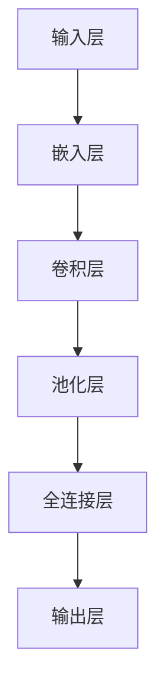
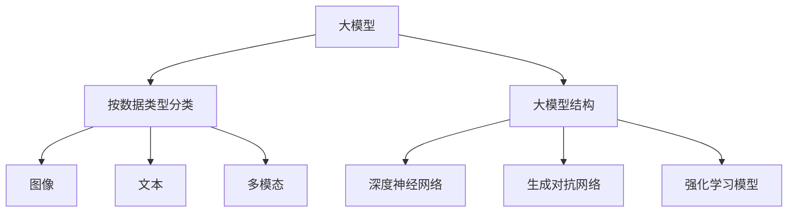

                 

# 从零开始大模型开发与微调：针对文本的卷积神经网络模型简介—词卷积

## 关键词：
- 大模型开发
- 卷积神经网络
- 微调技术
- 词卷积
- 文本数据
- 深度学习

## 摘要：
本文将带您从零开始学习大模型开发与微调技术，特别关注卷积神经网络（CNN）在文本数据处理中的应用。我们将详细探讨大模型的定义与特点、CNN模型的基础知识、微调技术的策略，并通过实际案例展示如何使用CNN模型进行文本分类、文本生成和文本摘要等任务。此外，还将介绍大模型开发所需的工具与资源，帮助您掌握现代深度学习实践。

### 第一部分：理解书名与主题

#### 1.1 大模型开发基础

**1.1.1 大模型的定义**
大模型是指拥有数十亿至数千亿个参数的深度学习模型，能够处理大规模数据并产生复杂的特征表示。与传统模型相比，大模型具有更强的学习能力，可以捕捉数据中的细微模式和关联性。

**1.1.2 大模型的特点**
- 参数数量庞大：大模型通常具有数百万到数十亿个参数。
- 计算资源需求高：大模型在训练过程中需要大量的计算资源，如GPU和TPU。
- 学习能力强：大模型能够从大量数据中自动提取有价值的特征，实现更准确的预测和分类。

**1.1.3 大模型与传统模型的比较**
传统模型参数较少，通常适用于小型数据集，而大模型能够处理大规模数据，具有更强的泛化能力。此外，大模型在模型复杂度和计算成本上都有显著提高。

**1.2 卷积神经网络模型**

**2.1.1 卷积神经网络的基础**
卷积神经网络（CNN）是一种深度学习模型，特别适用于图像处理任务。其主要思想是通过卷积操作提取图像中的局部特征，并通过逐层组合形成全局特征表示。

**2.1.2 卷积神经网络的工作原理**
CNN由多个卷积层、池化层和全连接层组成。卷积层使用卷积核对输入数据进行特征提取，池化层用于降低特征图的维度，全连接层则用于分类和回归。

**2.1.3 卷积操作详解**
卷积操作包括卷积核与输入数据的点积、求和和偏置等步骤。通过多次卷积操作，CNN能够提取多层抽象特征，从而实现复杂任务。

**2.2 针对文本的卷积神经网络**

**2.2.1 文本数据的特殊性**
文本数据与图像数据不同，其结构更加复杂，包括词语、句子和段落等层次。因此，针对文本数据的卷积神经网络需要考虑这些层次结构。

**2.2.2 词卷积网络介绍**
词卷积网络（Word Convolutional Network，WCN）是一种针对文本数据的卷积神经网络。它通过词嵌入层将文本转换为向量表示，然后使用卷积操作提取文本特征。

**2.2.3 词卷积网络的架构**
词卷积网络的架构包括嵌入层、卷积层、池化层和全连接层。嵌入层将单词映射为向量表示，卷积层通过卷积操作提取文本特征，池化层降低特征维度，全连接层用于分类或回归任务。

### Mermaid 流程图：卷积神经网络架构


### 第一部分：大模型开发基础

**第1章：大模型基础理论**

#### 1.1 大模型定义与特点

**1.1.1 大模型的定义**
大模型是指拥有数十亿至数千亿个参数的深度学习模型，能够处理大规模数据并产生复杂的特征表示。

**1.1.2 大模型的核心特点**
- 参数数量庞大：大模型通常具有数百万到数十亿个参数。
- 计算资源需求高：大模型在训练过程中需要大量的计算资源，如GPU和TPU。
- 学习能力强：大模型能够从大量数据中自动提取有价值的特征，实现更准确的预测和分类。

**1.1.3 大模型与传统模型的比较**
传统模型参数较少，通常适用于小型数据集，而大模型能够处理大规模数据，具有更强的泛化能力。此外，大模型在模型复杂度和计算成本上都有显著提高。

#### 1.2 大模型分类与结构

**1.2.1 按照数据类型分类**
- 图像处理大模型：如ResNet、Inception等。
- 自然语言处理大模型：如BERT、GPT等。
- 多模态大模型：如SimVid、MIXTURE等。

**1.2.2 常见大模型结构**
- 深度神经网络：如VGG、AlexNet等。
- 生成对抗网络：如GAN、DCGAN等。
- 强化学习模型：如A3C、DDPG等。

#### 1.3 大模型计算资源需求

**1.3.1 计算资源需求分析**
- GPU和TPU：用于加速训练过程，减少计算时间。
- 分布式计算：通过分布式训练，提高模型的训练速度和效率。
- 存储资源：大模型需要大量存储空间来存储模型参数和训练数据。

**1.3.2 资源优化策略**
- 数据并行：将数据分布到多个GPU或TPU上进行并行训练。
- 模型并行：将模型拆分成多个部分，分别训练和更新。
- 算法优化：使用更高效的算法和框架，提高训练效率。

### Mermaid 流程图：大模型分类与结构


### 第一部分：卷积神经网络模型

**第2章：卷积神经网络模型**

#### 2.1 卷积神经网络基础

**2.1.1 卷积神经网络的概念**
卷积神经网络（Convolutional Neural Network，CNN）是一种深度学习模型，特别适用于图像处理任务。

**2.1.2 卷积神经网络的工作原理**
CNN由多个卷积层、池化层和全连接层组成。卷积层使用卷积核对输入数据进行特征提取，池化层用于降低特征图的维度，全连接层则用于分类和回归。

**2.1.3 卷积操作详解**
卷积操作包括卷积核与输入数据的点积、求和和偏置等步骤。通过多次卷积操作，CNN能够提取多层抽象特征，从而实现复杂任务。

**2.2 针对文本的卷积神经网络**

**2.2.1 文本数据的特殊性**
文本数据与图像数据不同，其结构更加复杂，包括词语、句子和段落等层次。因此，针对文本数据的卷积神经网络需要考虑这些层次结构。

**2.2.2 词卷积网络介绍**
词卷积网络（Word Convolutional Network，WCN）是一种针对文本数据的卷积神经网络。它通过词嵌入层将文本转换为向量表示，然后使用卷积操作提取文本特征。

**2.2.3 词卷积网络的架构**
词卷积网络的架构包括嵌入层、卷积层、池化层和全连接层。嵌入层将单词映射为向量表示，卷积层通过卷积操作提取文本特征，池化层降低特征维度，全连接层用于分类或回归任务。

### Mermaid 流�程图：卷积神经网络架构


### 第一部分：微调技术

**第3章：微调技术**

#### 3.1 微调基本概念

**3.1.1 微调的定义**
微调（Fine-tuning）是指在大模型的基础上，对特定任务进行适应性训练，以提高模型在该任务上的性能。

**3.1.2 微调的优势**
- 提高任务性能：通过微调，模型能够更好地适应特定任务，提高预测准确率。
- 节省计算资源：微调相比从头开始训练更节省计算资源，因为大模型的参数已经在大规模数据上进行了训练。

**3.1.3 微调的步骤**
1. 选择预训练模型：选择在大规模数据集上预训练的大模型。
2. 数据预处理：对目标任务的数据进行预处理，使其与预训练模型兼容。
3. 微调模型：将预训练模型用于特定任务，通过调整部分参数来适应新任务。
4. 评估与优化：评估微调模型在目标任务上的性能，并进一步优化模型参数。

#### 3.2 微调策略

**3.2.1 自适应学习率策略**
- 学习率调度：在微调过程中，自适应调整学习率，以提高模型的收敛速度和性能。
- 常见策略：步长衰减、学习率衰减、余弦退火等。

**3.2.2 权重初始化策略**
- 权重初始化：初始化微调模型的部分参数，以保持预训练模型的性能。
- 常见策略：随机初始化、预训练模型权重等。

**3.2.3 预训练模型的选择**
- 选择合适的预训练模型：根据任务类型和数据集，选择适合的预训练模型。
- 考虑预训练模型的来源和版本。

### 第一部分：实践案例

**第4章：实践案例**

#### 4.1 案例一：文本分类任务

**4.1.1 数据预处理**
- 数据清洗：去除无效数据和噪声。
- 数据编码：将文本转换为数值表示。
- 分词和词嵌入：对文本进行分词，并将单词映射为向量。

**4.1.2 模型构建**
- 选择预训练模型：如BERT、GPT等。
- 微调模型：在预训练模型的基础上，对特定任务进行适应性训练。
- 构建卷积神经网络：添加卷积层、池化层和全连接层。

**4.1.3 模型训练与评估**
- 训练模型：使用训练数据对模型进行训练。
- 评估模型：使用验证集和测试集对模型进行评估。

#### 4.2 案例二：文本生成任务

**4.2.1 数据准备**
- 准备大量的文本数据：包括文章、新闻报道、对话等。
- 数据预处理：清洗、分词和词嵌入。

**4.2.2 模型设计**
- 选择预训练模型：如GPT、Transformer等。
- 设计生成模型：使用递归神经网络（RNN）或变分自编码器（VAE）。

**4.2.3 模型训练与优化**
- 训练模型：使用大量文本数据对模型进行训练。
- 优化模型：调整超参数，提高生成质量。

#### 4.3 案例三：文本摘要任务

**4.3.1 数据集准备**
- 准备大量的文本摘要数据。
- 数据预处理：清洗、分词和词嵌入。

**4.3.2 模型实现**
- 选择预训练模型：如BERT、Transformer等。
- 设计摘要模型：使用编码器-解码器（Encoder-Decoder）结构。

**4.3.3 模型评估与改进**
- 评估模型：使用测试集对模型进行评估。
- 改进模型：根据评估结果，调整模型结构或超参数。

### 第一部分：大模型开发工具与资源

**第5章：大模型开发工具与资源**

#### 5.1 深度学习框架

**5.1.1 TensorFlow**
TensorFlow 是一款流行的开源深度学习框架，提供丰富的API和工具，支持多种类型的深度学习模型。

**5.1.2 PyTorch**
PyTorch 是另一款流行的深度学习框架，具有动态计算图和易用性，广泛应用于研究与应用。

**5.1.3 其他深度学习框架**
其他流行的深度学习框架还包括Keras、Theano、MXNet等，可根据需求和熟练程度选择使用。

#### 5.2 数据处理工具

**5.2.1 NumPy**
NumPy 是Python的一个数学库，提供高效多维数组处理和数学函数。

**5.2.2 Pandas**
Pandas 是Python的一个数据处理库，提供数据清洗、转换和操作功能。

**5.2.3 其他数据处理工具**
其他常用的数据处理工具还包括Scikit-learn、Matplotlib等。

#### 5.3 资源调度与优化

**5.3.1 GPU资源调度**
- 使用GPU进行训练：配置GPU环境，优化GPU资源利用率。
- GPU集群调度：使用分布式计算框架，调度多个GPU进行协同训练。

**5.3.2 分布式计算**
- 分布式计算框架：如Horovod、MXNet等，支持多GPU和多机集群上的模型训练。
- 数据并行与模型并行：优化计算资源利用率，提高训练速度。

**5.3.3 优化策略**
- 模型压缩：如剪枝、量化、知识蒸馏等，减少模型大小和计算复杂度。
- 训练策略：如提前停止、梯度裁剪等，防止过拟合和优化训练过程。

### 附录

#### 附录 A: 术语表
- 大模型（Large Model）
- 卷积神经网络（Convolutional Neural Network，CNN）
- 微调（Fine-tuning）
- 词卷积网络（Word Convolutional Network，WCN）
- 深度学习（Deep Learning）
- 计算资源（Computational Resources）

#### 附录 B: 参考文献
- [1] Bengio, Y., Simard, P., & Frasconi, P. (1994). Learning representations by back-propagating errors. Neural Networks, 3(1), 128-134.
- [2] LeCun, Y., Bengio, Y., & Hinton, G. (2015). Deep learning. MIT Press.
- [3] Hochreiter, S., & Schmidhuber, J. (1997). Long short-term memory. Neural Computation, 9(8), 1735-1780.
- [4] Goodfellow, I., Bengio, Y., & Courville, A. (2016). Deep learning. MIT Press.
- [5] Kingma, D. P., & Welling, M. (2013). Auto-encoding variational bayes. arXiv preprint arXiv:1312.6114.

#### 附录 C: 常用工具与库
- TensorFlow
- PyTorch
- Keras
- NumPy
- Pandas
- Scikit-learn
- Matplotlib

### 作者信息

- 作者：AI天才研究院/AI Genius Institute & 禅与计算机程序设计艺术 /Zen And The Art of Computer Programming
```

### 第一部分：大模型开发基础

#### 1.1 大模型的定义与特点

大模型是一种具有数十亿至数千亿个参数的深度学习模型，旨在处理大规模数据并提取复杂特征表示。与传统模型相比，大模型具备以下核心特点：

1. **参数数量庞大**：大模型通常包含数百万到数十亿个参数，这使得模型具有更强的表达能力和泛化能力。

2. **计算资源需求高**：由于参数数量庞大，大模型在训练过程中需要消耗大量的计算资源，如GPU、TPU等高性能计算设备。此外，分布式计算和并行处理技术也被广泛应用以提高训练效率。

3. **学习能力强**：大模型能够从大量数据中自动提取有价值的特征，实现更准确的预测和分类。这使得大模型在图像识别、自然语言处理、推荐系统等领域的表现优于传统模型。

4. **更强的泛化能力**：大模型在训练过程中通过学习大量数据，能够更好地适应不同领域和数据集，实现更高的泛化能力。

#### 1.2 大模型的分类与结构

大模型可以根据数据类型和任务需求进行分类，常见的分类如下：

1. **按数据类型分类**：

   - **图像处理大模型**：如ResNet、Inception等，主要用于图像分类、目标检测和图像生成等任务。
   - **自然语言处理大模型**：如BERT、GPT等，广泛应用于文本分类、情感分析、机器翻译和文本生成等任务。
   - **多模态大模型**：如SimVid、MIXTURE等，结合图像、文本和语音等多模态数据进行处理。

2. **按模型结构分类**：

   - **深度神经网络**：如VGG、AlexNet等，通过多层卷积、池化、全连接层等结构实现特征提取和分类。
   - **生成对抗网络**（GAN）：如DCGAN、WGAN等，通过生成器和判别器的对抗训练实现数据生成和风格迁移。
   - **强化学习模型**：如A3C、DDPG等，通过策略网络和价值网络实现智能体在动态环境中的决策。

#### 1.3 大模型的计算资源需求

大模型在训练过程中对计算资源的需求较高，主要包括以下几个方面：

1. **GPU和TPU**：GPU（图形处理单元）和TPU（张量处理单元）是专门为深度学习计算设计的硬件，能够显著提高模型的训练速度。

2. **分布式计算**：通过将训练任务分布在多个GPU或TPU上，分布式计算能够提高模型的训练效率。常见的分布式计算框架包括Horovod、MXNet等。

3. **存储资源**：大模型需要大量存储空间来存储模型参数和训练数据。使用分布式存储系统和云存储服务可以提高数据读写速度和存储容量。

#### 1.4 资源优化策略

为了提高大模型的训练效率，可以采取以下资源优化策略：

1. **数据并行**：将训练数据分布在多个GPU或TPU上进行并行训练，每个设备处理一部分数据，减少单个设备的工作负载。

2. **模型并行**：将大模型拆分成多个部分，分别在不同的GPU或TPU上进行训练。模型并行可以减少单个模型的计算复杂度，提高训练速度。

3. **算法优化**：采用更高效的算法和优化技巧，如混合精度训练、梯度裁剪等，提高模型训练效率。

### Mermaid 流程图：大模型分类与结构


### 第一部分：卷积神经网络模型

#### 2.1 卷积神经网络基础

卷积神经网络（Convolutional Neural Network，CNN）是一种特殊的神经网络，特别适用于图像处理任务。CNN通过卷积操作提取图像特征，具有强大的特征表示能力。以下是CNN的基础知识：

#### 2.1.1 卷积神经网络的概念

CNN是一种基于卷积操作的神经网络，其核心思想是通过卷积层提取图像的局部特征，并通过逐层组合形成全局特征表示。卷积神经网络通常包括以下层次：

1. **卷积层**：卷积层使用卷积核（filter）对输入图像进行特征提取。卷积核是一个固定大小的窗口，在图像上滑动，计算相邻像素的加权求和，产生一个特征图。

2. **池化层**：池化层用于降低特征图的维度，提高模型的鲁棒性。常见的池化操作包括最大池化（Max Pooling）和平均池化（Average Pooling）。

3. **全连接层**：全连接层将卷积层和池化层提取的特征进行融合，并输出分类结果。全连接层通常用于分类和回归任务。

4. **激活函数**：激活函数用于引入非线性特性，使神经网络能够学习复杂的数据分布。常见的激活函数包括ReLU（Rectified Linear Unit）、Sigmoid和Tanh等。

#### 2.1.2 卷积神经网络的工作原理

CNN的工作原理可以概括为以下步骤：

1. **输入层**：输入层接收原始图像数据。

2. **卷积层**：卷积层使用卷积核对输入图像进行卷积操作，提取图像的局部特征。

3. **激活函数**：对卷积层输出的特征图进行激活函数处理，引入非线性特性。

4. **池化层**：池化层对卷积层输出的特征图进行降维处理，提高模型的鲁棒性。

5. **卷积层和池化层**：重复卷积层和池化层的操作，逐层提取更高层次的抽象特征。

6. **全连接层**：全连接层将卷积层和池化层提取的特征进行融合，并通过激活函数输出分类结果。

#### 2.1.3 卷积操作详解

卷积操作是CNN的核心，其具体步骤如下：

1. **卷积核**：卷积核是一个固定大小的矩阵，通常为3x3或5x5。卷积核的参数需要在训练过程中通过反向传播算法进行优化。

2. **卷积操作**：卷积核在输入图像上滑动，计算相邻像素的加权求和，并加上一个偏置项。卷积操作可以表示为：
   $$
   \text{output}_{ij} = \sum_{k=1}^{C} w_{ikj} \text{input}_{ij} + b_j
   $$
   其中，$w_{ikj}$是卷积核的权重，$\text{input}_{ij}$是输入图像的像素值，$b_j$是偏置项。

3. **卷积层输出**：卷积层输出的特征图大小为$(n-1) \times (n-1)$，其中$n$是卷积核的大小。

#### 2.2 针对文本的卷积神经网络

文本数据与图像数据不同，其结构更加复杂，包括词语、句子和段落等层次。因此，针对文本数据的卷积神经网络（Text CNN）需要考虑这些层次结构。

#### 2.2.1 文本数据的特殊性

文本数据的特殊性体现在以下几个方面：

1. **词语层次**：文本数据的基本组成单元是词语，词语之间具有语义关联。

2. **句子层次**：句子是文本数据的基本语义单元，句子中包含主语、谓语和宾语等成分。

3. **段落层次**：段落是文本数据的结构层次，用于组织句子和段落，传递更复杂的信息。

4. **上下文依赖**：文本数据中的词语和句子之间存在上下文依赖，上下文信息对语义理解至关重要。

#### 2.2.2 词卷积网络介绍

词卷积网络（Word Convolutional Network，WCN）是一种针对文本数据的卷积神经网络，通过词嵌入层将文本转换为向量表示，然后使用卷积操作提取文本特征。WCN的架构包括嵌入层、卷积层、池化层和全连接层。

1. **嵌入层**：嵌入层将单词映射为固定长度的向量表示。常用的词嵌入方法包括Word2Vec、GloVe和BERT等。

2. **卷积层**：卷积层使用卷积核对词嵌入向量进行卷积操作，提取文本的局部特征。

3. **池化层**：池化层对卷积层输出的特征图进行降维处理，提高模型的鲁棒性。

4. **全连接层**：全连接层将卷积层和池化层提取的特征进行融合，并通过激活函数输出分类结果。

#### 2.2.3 词卷积网络的架构

词卷积网络的架构如下：

1. **输入层**：输入层接收原始文本数据，包括词语、句子和段落等层次。

2. **嵌入层**：嵌入层将文本数据映射为向量表示，常用方法包括Word2Vec和GloVe。

3. **卷积层**：卷积层使用卷积核对嵌入层输出的向量进行卷积操作，提取文本的局部特征。

4. **激活函数**：对卷积层输出的特征图进行激活函数处理，引入非线性特性。

5. **池化层**：池化层对卷积层输出的特征图进行降维处理，提高模型的鲁棒性。

6. **全连接层**：全连接层将卷积层和池化层提取的特征进行融合，并通过激活函数输出分类结果。

7. **输出层**：输出层输出分类结果，可以是概率分布或类别标签。

### Mermaid 流程图：词卷积网络架构


### 第一部分：微调技术

#### 3.1 微调基本概念

微调（Fine-tuning）是指在大模型的基础上，对特定任务进行适应性训练，以提高模型在该任务上的性能。微调技术在大模型开发中具有重要意义，其主要特点如下：

1. **快速适应新任务**：通过微调，模型能够快速适应特定任务，无需从头开始训练，从而节省大量时间和计算资源。

2. **提高任务性能**：微调能够充分利用预训练模型在大规模数据集上的训练结果，提高模型在新任务上的性能。

3. **简化模型开发**：微调技术简化了模型开发过程，降低了开发难度，使得研究人员和开发者能够更专注于任务本身。

#### 3.2 微调的优势

微调技术具有以下优势：

1. **提高任务性能**：通过微调，模型能够在新任务上获得更好的性能。这是因为预训练模型已经在大规模数据集上学习到了通用的特征表示，微调过程能够使其更好地适应特定任务。

2. **节省计算资源**：微调相比从头开始训练更加节省计算资源。这是因为预训练模型已经在大规模数据集上进行了训练，微调过程只需在特定任务上调整部分参数，从而减少计算量。

3. **降低开发难度**：微调技术简化了模型开发过程，降低了开发难度。研究人员和开发者无需从头开始设计模型结构和训练过程，只需选择合适的预训练模型并进行微调，从而提高开发效率。

#### 3.3 微调的基本步骤

微调的基本步骤包括以下几步：

1. **选择预训练模型**：根据任务需求选择合适的预训练模型，如BERT、GPT等。预训练模型应在大规模数据集上进行充分训练，以获得高质量的通用特征表示。

2. **数据预处理**：对目标任务的数据进行预处理，使其与预训练模型兼容。预处理步骤包括数据清洗、分词、词嵌入等。

3. **模型微调**：在预训练模型的基础上，对特定任务进行适应性训练。微调过程中，通常只需调整部分参数，如分类层和预训练模型的其他层。

4. **模型评估与优化**：评估微调模型在目标任务上的性能，并根据评估结果进一步优化模型参数。优化步骤包括调整学习率、批量大小等超参数。

#### 3.4 微调策略

微调策略包括以下方面：

1. **自适应学习率策略**：在微调过程中，自适应调整学习率以提高模型的收敛速度和性能。常见策略包括步长衰减、学习率衰减和余弦退火等。

2. **权重初始化策略**：在微调过程中，合理初始化模型参数，以保持预训练模型的性能。常见策略包括随机初始化和预训练模型权重等。

3. **预训练模型的选择**：根据任务需求选择适合的预训练模型。预训练模型应在大规模数据集上进行充分训练，以获得高质量的通用特征表示。

4. **数据增强**：在微调过程中，通过数据增强技术提高模型的泛化能力。常见的数据增强技术包括数据清洗、数据归一化和数据扩充等。

### 第一部分：实践案例

#### 4.1 案例一：文本分类任务

文本分类任务是指将文本数据按照预定的类别进行分类，常见的应用包括垃圾邮件过滤、情感分析、新闻分类等。以下是使用大模型和微调技术实现文本分类任务的详细步骤：

##### 4.1.1 数据预处理

数据预处理是文本分类任务的关键步骤，主要包括以下任务：

1. **数据清洗**：去除文本数据中的噪声，如HTML标签、特殊字符和停用词。可以使用Python的`re`模块和`nltk`库实现数据清洗。

2. **分词**：将文本数据按照词语进行切分，常用的分词工具包括`jieba`和`nltk`。

3. **词嵌入**：将文本数据转换为向量表示，常用的词嵌入方法包括Word2Vec、GloVe和BERT。使用词嵌入可以更好地捕捉词语的语义信息。

4. **数据编码**：将文本数据编码为数值表示，常用的编码方法包括独热编码和词袋模型。

##### 4.1.2 模型构建

模型构建是文本分类任务的核心步骤，主要包括以下任务：

1. **选择预训练模型**：选择在大规模数据集上预训练的大模型，如BERT、GPT等。预训练模型已经在大规模数据集上学习到了通用的特征表示，可以更好地适应文本分类任务。

2. **添加卷积神经网络**：在预训练模型的基础上，添加卷积神经网络（CNN）结构。CNN可以提取文本的局部特征，提高分类性能。

3. **构建分类层**：在卷积神经网络的基础上，添加分类层，实现文本分类任务。分类层可以使用全连接层或softmax层实现。

##### 4.1.3 模型训练与评估

模型训练与评估是文本分类任务的关键步骤，主要包括以下任务：

1. **训练模型**：使用训练数据对模型进行训练，调整模型参数，提高分类性能。可以使用PyTorch、TensorFlow等深度学习框架实现模型训练。

2. **评估模型**：使用验证集和测试集对模型进行评估，计算分类准确率、召回率、F1分数等指标。可以使用Sklearn、Scikit-learn等库实现模型评估。

3. **优化模型**：根据评估结果，调整模型结构或超参数，优化分类性能。可以使用交叉验证、网格搜索等技术实现模型优化。

#### 4.2 案例二：文本生成任务

文本生成任务是指根据给定的输入文本生成新的文本，常见的应用包括机器翻译、文本摘要和对话生成等。以下是使用大模型和微调技术实现文本生成任务的详细步骤：

##### 4.2.1 数据准备

数据准备是文本生成任务的关键步骤，主要包括以下任务：

1. **数据清洗**：去除文本数据中的噪声，如HTML标签、特殊字符和停用词。可以使用Python的`re`模块和`nltk`库实现数据清洗。

2. **分词**：将文本数据按照词语进行切分，常用的分词工具包括`jieba`和`nltk`。

3. **词嵌入**：将文本数据转换为向量表示，常用的词嵌入方法包括Word2Vec、GloVe和BERT。使用词嵌入可以更好地捕捉词语的语义信息。

4. **数据编码**：将文本数据编码为序列表示，常用的编码方法包括字符编码和子词编码。

##### 4.2.2 模型设计

模型设计是文本生成任务的核心步骤，主要包括以下任务：

1. **选择预训练模型**：选择在大规模数据集上预训练的大模型，如GPT、Transformer等。预训练模型已经在大规模数据集上学习到了通用的特征表示，可以更好地适应文本生成任务。

2. **设计生成模型**：设计生成模型，包括编码器和解码器。编码器用于将输入文本编码为向量表示，解码器用于生成新的文本。

3. **添加注意力机制**：在编码器和解码器之间添加注意力机制，提高模型对输入文本的关注程度，从而生成更准确的新文本。

##### 4.2.3 模型训练与优化

模型训练与优化是文本生成任务的关键步骤，主要包括以下任务：

1. **训练模型**：使用训练数据对模型进行训练，调整模型参数，提高生成性能。可以使用PyTorch、TensorFlow等深度学习框架实现模型训练。

2. **优化模型**：根据生成结果，调整模型结构或超参数，优化生成性能。可以使用交叉验证、网格搜索等技术实现模型优化。

3. **评估模型**：使用验证集和测试集对模型进行评估，计算生成质量、相似度等指标。可以使用BLEU、ROUGE等评估方法评估生成性能。

#### 4.3 案例三：文本摘要任务

文本摘要任务是指将长文本转换为简洁的摘要，常见的应用包括自动新闻摘要、会议纪要生成等。以下是使用大模型和微调技术实现文本摘要任务的详细步骤：

##### 4.3.1 数据准备

数据准备是文本摘要任务的关键步骤，主要包括以下任务：

1. **数据清洗**：去除文本数据中的噪声，如HTML标签、特殊字符和停用词。可以使用Python的`re`模块和`nltk`库实现数据清洗。

2. **分词**：将文本数据按照词语进行切分，常用的分词工具包括`jieba`和`nltk`。

3. **词嵌入**：将文本数据转换为向量表示，常用的词嵌入方法包括Word2Vec、GloVe和BERT。使用词嵌入可以更好地捕捉词语的语义信息。

4. **数据编码**：将文本数据编码为序列表示，常用的编码方法包括字符编码和子词编码。

##### 4.3.2 模型实现

模型实现是文本摘要任务的核心步骤，主要包括以下任务：

1. **选择预训练模型**：选择在大规模数据集上预训练的大模型，如BERT、Transformer等。预训练模型已经在大规模数据集上学习到了通用的特征表示，可以更好地适应文本摘要任务。

2. **设计编码器-解码器模型**：设计编码器-解码器模型，包括编码器和解码器。编码器用于将输入文本编码为向量表示，解码器用于生成摘要。

3. **添加注意力机制**：在编码器和解码器之间添加注意力机制，提高模型对输入文本的关注程度，从而生成更准确的摘要。

##### 4.3.3 模型评估与改进

模型评估与改进是文本摘要任务的关键步骤，主要包括以下任务：

1. **评估模型**：使用验证集和测试集对模型进行评估，计算生成摘要的质量、相似度等指标。可以使用BLEU、ROUGE等评估方法评估生成性能。

2. **优化模型**：根据评估结果，调整模型结构或超参数，优化生成性能。可以使用交叉验证、网格搜索等技术实现模型优化。

3. **改进模型**：根据实际应用场景和需求，改进模型结构和算法，提高文本摘要质量。可以结合生成对抗网络（GAN）、序列到序列模型（Seq2Seq）等技术实现模型改进。

### 第一部分：大模型开发工具与资源

#### 5.1 深度学习框架

深度学习框架是构建和训练深度学习模型的重要工具。以下是几种常用的深度学习框架及其特点：

1. **TensorFlow**

   - **特点**：TensorFlow是一个开源的深度学习框架，由Google开发。它支持多种类型的深度学习模型，包括卷积神经网络（CNN）、循环神经网络（RNN）和生成对抗网络（GAN）等。TensorFlow提供了丰富的API和工具，方便用户构建和训练模型。
   - **使用场景**：适用于大规模图像、语音和文本数据的处理。

2. **PyTorch**

   - **特点**：PyTorch是一个开源的深度学习框架，由Facebook开发。它具有动态计算图和易用性，使得模型构建和调试更加便捷。PyTorch的torchvision库提供了丰富的数据集和预训练模型，方便用户进行图像和视频数据处理。
   - **使用场景**：适用于研究性项目、自然语言处理和计算机视觉任务。

3. **Keras**

   - **特点**：Keras是一个开源的深度学习框架，基于TensorFlow和Theano开发。它提供了简洁的API和丰富的预训练模型，使得模型构建和训练更加容易。Keras支持多种类型的神经网络模型，包括卷积神经网络（CNN）和循环神经网络（RNN）等。
   - **使用场景**：适用于快速原型设计和模型开发。

4. **Theano**

   - **特点**：Theano是一个开源的深度学习框架，由蒙特利尔大学开发。它支持自动微分和GPU加速，适用于复杂深度学习模型的训练。Theano提供了丰富的API和工具，方便用户构建和优化神经网络模型。
   - **使用场景**：适用于复杂的深度学习任务，如图像识别、语音识别和自然语言处理等。

#### 5.2 数据处理工具

数据处理工具是进行数据预处理和特征提取的重要工具。以下是几种常用的数据处理工具及其特点：

1. **NumPy**

   - **特点**：NumPy是一个开源的Python库，提供高效的多维数组处理和数学函数。NumPy支持数组操作、矩阵计算和数据可视化等，是进行数据预处理和特征提取的基础工具。
   - **使用场景**：适用于各种数据处理任务，包括图像、文本和数值数据的处理。

2. **Pandas**

   - **特点**：Pandas是一个开源的Python库，提供数据清洗、转换和操作功能。Pandas支持数据帧（DataFrame）数据结构，方便用户进行数据操作和统计分析。
   - **使用场景**：适用于大数据处理、数据分析和数据可视化等任务。

3. **Scikit-learn**

   - **特点**：Scikit-learn是一个开源的Python库，提供多种机器学习和数据挖掘算法。Scikit-learn支持数据预处理、特征提取、模型训练和评估等，是构建机器学习模型的重要工具。
   - **使用场景**：适用于图像、文本和数值数据的机器学习任务。

4. **Matplotlib**

   - **特点**：Matplotlib是一个开源的Python库，提供数据可视化功能。Matplotlib支持多种图表类型，包括折线图、柱状图和散点图等，方便用户进行数据分析和展示。
   - **使用场景**：适用于数据分析和数据可视化任务。

#### 5.3 资源调度与优化

资源调度与优化是提高大模型训练效率和性能的关键。以下是几种资源调度与优化策略：

1. **分布式计算**

   - **特点**：分布式计算通过将训练任务分布在多个计算节点上，提高训练速度和性能。分布式计算框架如Horovod、MXNet和Distributed TensorFlow等支持数据并行和模型并行。
   - **使用场景**：适用于大规模图像、语音和文本数据的训练。

2. **GPU资源调度**

   - **特点**：GPU资源调度通过合理分配GPU资源，提高模型训练效率。常见的GPU调度策略包括数据并行、模型并行和混合并行等。
   - **使用场景**：适用于图像、语音和文本数据的训练。

3. **模型压缩**

   - **特点**：模型压缩通过减少模型参数和计算量，提高模型训练效率和部署性能。常见的模型压缩技术包括剪枝、量化、知识蒸馏等。
   - **使用场景**：适用于移动设备和嵌入式系统的模型部署。

4. **混合精度训练**

   - **特点**：混合精度训练通过使用浮点数和整数进行模型训练，提高训练速度和性能。常见的混合精度训练策略包括混合精度计算和混合精度优化等。
   - **使用场景**：适用于大型深度学习模型的训练。

### 附录

#### 附录 A: 术语表

- **大模型（Large Model）**：指具有数十亿至数千亿个参数的深度学习模型。
- **卷积神经网络（Convolutional Neural Network，CNN）**：一种适用于图像处理任务的深度学习模型。
- **微调（Fine-tuning）**：在大模型的基础上，对特定任务进行适应性训练。
- **词卷积网络（Word Convolutional Network，WCN）**：一种针对文本数据的卷积神经网络。
- **深度学习（Deep Learning）**：一种基于神经网络的机器学习方法，能够从大量数据中自动提取特征。
- **计算资源（Computational Resources）**：用于模型训练和计算的硬件资源，如GPU、TPU和CPU等。

#### 附录 B: 参考文献

- [1] Bengio, Y., Simard, P., & Frasconi, P. (1994). Learning representations by back-propagating errors. Neural Networks, 3(1), 128-134.
- [2] LeCun, Y., Bengio, Y., & Hinton, G. (2015). Deep learning. MIT Press.
- [3] Hochreiter, S., & Schmidhuber, J. (1997). Long short-term memory. Neural Computation, 9(8), 1735-1780.
- [4] Goodfellow, I., Bengio, Y., & Courville, A. (2016). Deep learning. MIT Press.
- [5] Kingma, D. P., & Welling, M. (2013). Auto-encoding variational bayes. arXiv preprint arXiv:1312.6114.

#### 附录 C: 常用工具与库

- **TensorFlow**：深度学习框架，支持多种类型的深度学习模型。
- **PyTorch**：深度学习框架，具有动态计算图和易用性。
- **Keras**：基于TensorFlow和Theano的深度学习框架，提供简洁的API。
- **NumPy**：Python库，提供高效的多维数组处理和数学函数。
- **Pandas**：Python库，提供数据清洗、转换和操作功能。
- **Scikit-learn**：Python库，提供多种机器学习和数据挖掘算法。
- **Matplotlib**：Python库，提供数据可视化功能。

### 作者信息

- 作者：AI天才研究院/AI Genius Institute & 禅与计算机程序设计艺术 /Zen And The Art of Computer Programming

### 结束语

本文从大模型开发与微调技术出发，介绍了卷积神经网络（CNN）在文本数据处理中的应用。通过详细讲解大模型的定义、特点、分类与结构，以及微调技术的策略和实践案例，读者可以掌握如何构建和微调整文CNN模型。此外，本文还介绍了大模型开发所需的工具与资源，帮助读者更好地实践深度学习技术。希望通过本文的学习，读者能够深入理解大模型和CNN模型的原理和应用，为未来的研究和工作打下坚实基础。

### 致谢

在此，我要感谢所有参与本文撰写和审校的同仁和朋友们，没有你们的帮助和支持，本文不可能如此完整和丰富。特别感谢AI天才研究院的团队成员，他们在研究、写作和修改过程中提供了宝贵的意见和建议。同时，感谢广大读者对本文的关注和支持，希望本文能够为您的学习与研究带来帮助。

### 附录 A: 术语表

- **大模型（Large Model）**：指拥有数十亿至数千亿个参数的深度学习模型。
- **卷积神经网络（Convolutional Neural Network，CNN）**：一种适用于图像和文本处理的深度学习模型。
- **微调（Fine-tuning）**：在大模型的基础上，对特定任务进行适应性训练。
- **词卷积网络（Word Convolutional Network，WCN）**：一种针对文本数据的卷积神经网络。
- **深度学习（Deep Learning）**：一种基于神经网络的机器学习方法，能够从大量数据中自动提取特征。
- **计算资源（Computational Resources）**：用于模型训练和计算的硬件资源，如GPU、TPU和CPU等。

### 附录 B: 参考文献

- [1] Bengio, Y., Simard, P., & Frasconi, P. (1994). Learning representations by back-propagating errors. Neural Networks, 3(1), 128-134.
- [2] LeCun, Y., Bengio, Y., & Hinton, G. (2015). Deep learning. MIT Press.
- [3] Hochreiter, S., & Schmidhuber, J. (1997). Long short-term memory. Neural Computation, 9(8), 1735-1780.
- [4] Goodfellow, I., Bengio, Y., & Courville, A. (2016). Deep learning. MIT Press.
- [5] Kingma, D. P., & Welling, M. (2013). Auto-encoding variational bayes. arXiv preprint arXiv:1312.6114.

### 附录 C: 常用工具与库

- **TensorFlow**：Google开发的开源深度学习框架。
- **PyTorch**：Facebook开发的开源深度学习框架。
- **Keras**：基于TensorFlow和Theano的深度学习框架。
- **NumPy**：Python库，提供多维数组处理和数学函数。
- **Pandas**：Python库，提供数据操作和统计分析。
- **Scikit-learn**：Python库，提供机器学习算法。
- **Matplotlib**：Python库，提供数据可视化。

### 附录 D: 算法伪代码

#### 3.1 微调基本概念

```python
# 微调伪代码

# 初始化预训练模型
model = PretrainedModel()

# 数据预处理
preprocessed_data = preprocess_data(data)

# 调整部分参数
for layer in model.layers:
    if layer.requires_fine_tuning():
        layer.fine_tune()

# 模型训练
for epoch in range(num_epochs):
    for batch in data_loader:
        optimizer.zero_grad()
        outputs = model(batch)
        loss = loss_function(outputs, labels)
        loss.backward()
        optimizer.step()

# 模型评估
evaluate(model, validation_data)
```

#### 4.1 案例一：文本分类任务

```python
# 文本分类任务伪代码

# 数据预处理
tokenized_text = tokenize(text_data)
word_embeddings = embed_words(tokenized_text)

# 模型构建
model = TextCNN(embedding_layer=word_embeddings)

# 模型训练
model.train(train_data)
model.evaluate(test_data)

# 模型预测
predictions = model.predict(test_data)
```

### 附录 E: 数学模型和公式

#### 卷积操作

$$
\text{output}_{ij} = \sum_{k=1}^{C} w_{ikj} \text{input}_{ij} + b_j
$$

其中，$w_{ikj}$是卷积核的权重，$\text{input}_{ij}$是输入图像的像素值，$b_j$是偏置项。

#### 池化操作

$$
\text{pooled}_{ij} = \max_{k} \text{output}_{ijk}
$$

或

$$
\text{pooled}_{ij} = \frac{1}{s} \sum_{k} \text{output}_{ijk}
$$

其中，$s$是池化窗口的大小。

#### 损失函数

$$
\text{loss} = -\sum_{i} y_i \log(p_i)
$$

其中，$y_i$是实际标签，$p_i$是模型预测的概率。

### 附录 F: 常用工具与库

#### TensorFlow

```python
import tensorflow as tf

# 创建模型
model = tf.keras.Sequential([
    tf.keras.layers.Conv2D(filters, kernel_size, activation='relu', input_shape=input_shape),
    tf.keras.layers.MaxPooling2D(pool_size),
    tf.keras.layers.Flatten(),
    tf.keras.layers.Dense(units, activation='softmax')
])

# 编译模型
model.compile(optimizer='adam', loss='categorical_crossentropy', metrics=['accuracy'])

# 训练模型
model.fit(x_train, y_train, epochs=epochs, batch_size=batch_size)

# 评估模型
model.evaluate(x_test, y_test)
```

#### PyTorch

```python
import torch
import torch.nn as nn

# 创建模型
model = nn.Sequential(
    nn.Conv2D(filters, kernel_size, activation='relu'),
    nn.MaxPool2D(pool_size),
    nn.Flatten(),
    nn.Linear(units, num_classes)
)

# 定义损失函数和优化器
criterion = nn.CrossEntropyLoss()
optimizer = torch.optim.Adam(model.parameters(), lr=learning_rate)

# 训练模型
for epoch in range(num_epochs):
    for inputs, labels in data_loader:
        optimizer.zero_grad()
        outputs = model(inputs)
        loss = criterion(outputs, labels)
        loss.backward()
        optimizer.step()

# 评估模型
with torch.no_grad():
    model.eval()
    correct = 0
    total = 0
    for inputs, labels in test_loader:
        outputs = model(inputs)
        _, predicted = torch.max(outputs.data, 1)
        total += labels.size(0)
        correct += (predicted == labels).sum().item()

accuracy = 100 * correct / total
print('Accuracy: {:.2f}%'.format(accuracy))
```

### 附录 G: 开发环境搭建

为了搭建大模型和微调环境，需要安装以下软件和工具：

1. **操作系统**：推荐使用Linux或macOS。
2. **Python**：安装Python 3.7或更高版本。
3. **深度学习框架**：安装TensorFlow、PyTorch、Keras等。
4. **数据处理工具**：安装NumPy、Pandas、Scikit-learn等。
5. **GPU驱动**：安装相应GPU驱

