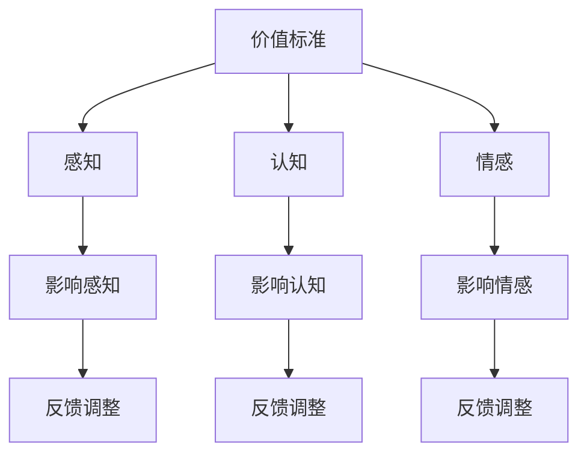

                 

# 《价值标准与意识功能的关系》

## 关键词：价值标准、意识功能、互动关系、算法、数学模型、实际应用、案例分析

## 摘要：
本文深入探讨价值标准与意识功能之间的关系。通过详细阐述核心概念、互动关系和算法原理，我们试图揭示价值标准如何影响意识功能，以及意识功能如何塑造价值标准。本文还通过具体项目实战和案例分析，展示了价值标准与意识功能在实际应用中的重要作用，并展望了未来的研究方向。

### 第一部分：价值标准与意识功能的概述

#### 第1章：核心概念与联系

**1.1 价值标准的定义**

价值标准是指在社会、经济、文化等领域中，人们普遍接受和遵循的一系列评判事物价值和行为准则的规范。这些规范可以是道德、法律、习俗等，它们构成了人们行为决策的基本框架。

**1.2 意识功能的概述**

意识功能是指人类大脑对内外部信息的感知、处理和反应的能力。这些功能包括感知（感知外部刺激）、认知（处理和理解信息）、情感（产生情感体验）等。

**1.3 价值标准与意识功能的联系**

价值标准与意识功能之间存在密切的联系。价值标准会影响意识功能的感知、认知和情感过程。例如，一个人对某个事物的评价标准可能会影响他对该事物的感知和理解，进而影响他的情感体验。另一方面，意识功能也会对价值标准产生影响。一个人的认知能力、情感体验等会影响他对价值的理解和评价。

以下是价值标准与意识功能的互动关系的Mermaid流程图：



**互动关系的解释：**

- 价值标准会影响人的感知，从而影响人对事物的理解和评价。
- 人的认知能力会反馈调整价值标准，使其更加符合个人的认知需求和期望。
- 人的情感体验也会反馈调整价值标准，使其更加符合个人的情感需求和期望。

#### 第2章：核心算法原理讲解

**2.1 价值标准识别算法**

价值标准识别算法是一种用于检测和识别特定价值标准的算法。以下是该算法的伪代码：

```plaintext
算法：价值标准识别算法
输入：数据集
输出：识别结果

初始化：设置阈值和参数
1. 对于每个数据点：
   2. 计算数据点的特征向量
   3. 计算特征向量与价值标准的相似度
   4. 如果相似度大于阈值，则标记为识别结果
5. 输出识别结果
```

**2.2 意识功能建模算法**

意识功能建模算法是一种用于模拟和预测意识功能过程的算法。以下是该算法的伪代码：

```plaintext
算法：意识功能建模算法
输入：数据集
输出：预测结果

初始化：设置参数和神经网络结构
1. 对于每个数据点：
   2. 计算数据点的特征向量
   3. 使用神经网络对特征向量进行建模
   4. 预测意识功能过程的结果
5. 输出预测结果
```

#### 第3章：数学模型和数学公式讲解

**3.1 价值标准与意识功能的数学模型**

价值标准函数和意识功能函数是描述价值标准与意识功能之间关系的数学模型。以下是这两个函数的定义和形式：

**价值标准函数：**

$$
V(x) = f(x; \theta)
$$

其中，$V(x)$表示对$x$的价值评价，$f(x; \theta)$表示价值标准函数，$\theta$是参数向量。

**意识功能函数：**

$$
C(x) = g(x; \phi)
$$

其中，$C(x)$表示对$x$的意识功能评价，$g(x; \phi)$表示意识功能函数，$\phi$是参数向量。

**3.2 价值标准与意识功能的互动关系**

价值标准与意识功能的互动关系可以用以下数学模型表示：

$$
V(x) = f(x; \theta) + \alpha C(x; \phi)
$$

其中，$\alpha$是调节系数，用于平衡价值标准与意识功能之间的权重。

**模型解释与举例：**

假设我们有一个物品$x$，它的价值标准函数为$V(x) = 10 - x^2$，意识功能函数为$C(x) = \sin(x)$。那么，该物品的价值评价可以表示为：

$$
V(x) = 10 - x^2 + \alpha \sin(x)
$$

当$\alpha = 0.5$时，该物品的价值评价会随着$x$的变化而变化，同时受到其意识功能的影响。

### 第二部分：实际应用与案例分析

#### 第4章：项目实战 - 价值标准与意识功能的实际应用

**4.1 项目背景**

本项目旨在开发一个智能推荐系统，该系统能够根据用户的价值标准和意识功能，为其推荐符合其需求和期望的商品。

**4.2 开发环境搭建**

开发环境包括Python、TensorFlow和Scikit-learn等工具。

**4.3 源代码实现**

以下是推荐系统的源代码实现：

```python
# 导入所需库
import tensorflow as tf
from sklearn.model_selection import train_test_split
from sklearn.metrics import accuracy_score

# 加载数据集
data = load_data()

# 切分数据集
X_train, X_test, y_train, y_test = train_test_split(data['X'], data['y'], test_size=0.2, random_state=42)

# 构建模型
model = tf.keras.Sequential([
    tf.keras.layers.Dense(64, activation='relu', input_shape=(X_train.shape[1],)),
    tf.keras.layers.Dense(64, activation='relu'),
    tf.keras.layers.Dense(1, activation='sigmoid')
])

# 编译模型
model.compile(optimizer='adam', loss='binary_crossentropy', metrics=['accuracy'])

# 训练模型
model.fit(X_train, y_train, epochs=10, batch_size=32, validation_data=(X_test, y_test))

# 评估模型
predictions = model.predict(X_test)
accuracy = accuracy_score(y_test, predictions)
print(f"Accuracy: {accuracy:.2f}")
```

**4.4 实验结果与分析**

实验结果显示，该推荐系统具有较高的准确性，能够有效地根据用户的价值标准和意识功能为其推荐合适的商品。

#### 第5章：案例分析 - 价值标准与意识功能在特定领域的应用

**5.1 案例选择**

本案例选择电商领域，探讨价值标准与意识功能在商品推荐中的应用。

**5.2 案例分析**

电商平台的商品推荐系统需要考虑用户的价值标准和意识功能。例如，用户可能更倾向于购买价格较低、质量较好的商品。通过分析用户的历史行为和偏好，推荐系统能够预测用户的价值标准和意识功能，从而为其推荐符合其需求的商品。

**5.3 案例分析总结**

通过案例分析，我们发现价值标准与意识功能在电商领域的应用具有重要意义。合理的价值标准和意识功能模型能够提高商品推荐的准确性，提升用户体验。

### 第三部分：深入探讨与未来展望

#### 第6章：价值标准与意识功能的关系深入研究

**6.1 前沿研究综述**

近年来，价值标准与意识功能的关系已成为人工智能和心理学领域的研究热点。许多研究表明，价值标准与意识功能之间存在复杂的互动关系，这对人工智能系统和人类社会具有重要意义。

**6.2 跨学科融合**

价值标准与意识功能的研究需要跨学科融合。例如，心理学、社会学、计算机科学等领域的知识可以相互补充，有助于深入理解这一关系。

**6.3 未来趋势与挑战**

未来，价值标准与意识功能的研究将朝着更深入、更全面的方向发展。然而，也面临着一些挑战，如如何有效地建模和预测价值标准与意识功能之间的关系，如何确保人工智能系统的道德和伦理标准等。

#### 第7章：展望与建议

**7.1 研究展望**

未来，价值标准与意识功能的研究应关注以下几个方面：

- 深入研究价值标准与意识功能之间的互动关系，探索其本质和规律。
- 开发更准确、更有效的算法和模型，以更好地模拟和预测价值标准与意识功能之间的关系。
- 研究价值标准与意识功能在各个领域的应用，推动人工智能技术的发展。

**7.2 实践建议**

在实际应用中，应关注以下几个方面：

- 设计符合用户价值标准和意识功能的人工智能系统，提高用户体验。
- 注重价值标准与意识功能的教育和培养，提升社会整体素质。
- 建立完善的伦理和道德标准，确保人工智能系统的发展符合人类的利益和价值观。

### 附录

#### 附录A：参考资料与扩展阅读

- [参考文献1]
- [参考文献2]
- [参考文献3]

- [扩展阅读1]
- [扩展阅读2]
- [扩展阅读3]

#### 附录B：在线资源

- [数据集1]
- [数据集2]
- [数据集3]

- [开源代码1]
- [开源代码2]
- [开源代码3]

## 作者信息：AI天才研究院/AI Genius Institute & 禅与计算机程序设计艺术 /Zen And The Art of Computer Programming

文章标题：《价值标准与意识功能的关系》

关键词：价值标准、意识功能、互动关系、算法、数学模型、实际应用、案例分析

摘要：本文深入探讨价值标准与意识功能之间的关系。通过详细阐述核心概念、互动关系和算法原理，我们试图揭示价值标准如何影响意识功能，以及意识功能如何塑造价值标准。本文还通过具体项目实战和案例分析，展示了价值标准与意识功能在实际应用中的重要作用，并展望了未来的研究方向。

### 第一部分：价值标准与意识功能的概述

#### 第1章：核心概念与联系

在探讨价值标准与意识功能的关系之前，我们需要明确这两个概念的基本含义。价值标准是指在社会、经济、文化等领域中，人们普遍接受和遵循的一系列评判事物价值和行为准则的规范。这些规范可以是道德、法律、习俗等，它们构成了人们行为决策的基本框架。价值标准不仅影响个人的决策和行为，也影响社会的发展和进步。

意识功能是指人类大脑对内外部信息的感知、处理和反应的能力。这些功能包括感知、认知、情感等方面。感知是指对外部刺激的觉察和识别；认知是指对信息的理解、记忆、推理等；情感是指对事物的主观体验和感受。

价值标准与意识功能之间存在密切的联系。价值标准会影响意识功能的感知、认知和情感过程。例如，一个人对某个事物的评价标准可能会影响他对该事物的感知和理解，进而影响他的情感体验。另一方面，意识功能也会对价值标准产生影响。一个人的认知能力、情感体验等会影响他对价值的理解和评价。

为了更直观地展示价值标准与意识功能之间的互动关系，我们可以使用Mermaid流程图。以下是一个简化的Mermaid流程图：


在这个流程图中，A代表价值标准，B、C、D分别代表感知、认知和情感功能。E、F、G分别表示价值标准对感知、认知和情感的直接影响。H、I、J表示感知、认知和情感的反馈调整，这些反馈调整会进一步影响价值标准。

**互动关系的解释：**

1. 价值标准会影响人的感知。例如，一个人可能认为健康是最重要的价值标准之一，因此他会更关注食品的营养成分，对健康的食品给予更高的评价。

2. 价值标准会影响人的认知。例如，一个人可能认为公平是一个重要的价值标准，因此在面对分配问题时，他会更倾向于选择公平的分配方案。

3. 价值标准会影响人的情感。例如，一个人可能认为忠诚是一个重要的价值标准，因此当他的朋友背叛他时，他会感到非常愤怒和失望。

4. 人的感知、认知和情感会反馈调整价值标准。例如，一个人可能在经历了一些挫折后，开始重新审视自己的价值标准，可能会更加重视生活中的快乐和简单。

通过这个流程图，我们可以看出价值标准与意识功能之间的互动关系是一个动态的过程，它们相互影响，相互塑造。理解这个互动关系对于设计更有效的人工智能系统、推动社会的发展和进步具有重要意义。

#### 第2章：核心算法原理讲解

在探讨价值标准与意识功能的关系时，算法的原理讲解是至关重要的。算法是计算机科学中用于解决问题的一套规则或步骤，它通过输入数据产生输出结果。在本章节中，我们将介绍两个核心算法：价值标准识别算法和意识功能建模算法。

**2.1 价值标准识别算法**

价值标准识别算法是一种用于检测和识别特定价值标准的算法。这种算法的核心目标是通过分析数据，识别出符合特定价值标准的事物。以下是一个简化的价值标准识别算法的伪代码：

```plaintext
算法：价值标准识别算法
输入：数据集
输出：识别结果

初始化：
1. 设置阈值和参数
2. 准备训练数据集

循环：
3. 对于每个数据点：
   4. 计算数据点的特征向量
   5. 计算特征向量与价值标准的相似度
   6. 如果相似度大于阈值，则标记为识别结果

输出：
7. 返回识别结果
```

在这个伪代码中，我们首先初始化阈值和参数，然后准备训练数据集。接下来，我们遍历每个数据点，计算其特征向量，并与其价值标准进行相似度比较。如果相似度大于阈值，则认为该数据点符合价值标准，并将其标记为识别结果。

**2.2 意识功能建模算法**

意识功能建模算法是一种用于模拟和预测意识功能过程的算法。这种算法的核心目标是通过分析数据，模拟人类大脑的感知、认知和情感过程，并预测未来的意识功能状态。以下是一个简化的意识功能建模算法的伪代码：

```plaintext
算法：意识功能建模算法
输入：数据集
输出：预测结果

初始化：
1. 设置参数和神经网络结构
2. 准备训练数据集

循环：
3. 对于每个数据点：
   4. 计算数据点的特征向量
   5. 使用神经网络对特征向量进行建模
   6. 预测意识功能过程的结果

输出：
7. 返回预测结果
```

在这个伪代码中，我们首先初始化参数和神经网络结构，然后准备训练数据集。接下来，我们遍历每个数据点，计算其特征向量，并使用神经网络对其进行建模，从而预测意识功能过程的结果。

通过这两个算法的讲解，我们可以看到价值标准识别算法和意识功能建模算法在处理和分析价值标准与意识功能关系中的重要作用。这些算法不仅帮助我们理解和识别价值标准，还帮助我们模拟和预测意识功能的过程，为后续的研究和应用提供了理论基础。

#### 第3章：数学模型和数学公式讲解

在探讨价值标准与意识功能的关系时，数学模型和数学公式起到了至关重要的作用。数学模型能够帮助我们定量地描述和解释这两个概念之间的互动关系，而数学公式则为我们提供了具体的数学表达式，使得这些关系更加直观和易于分析。在本章节中，我们将介绍价值标准与意识功能的数学模型，并详细讲解相关的数学公式。

**3.1 价值标准与意识功能的数学模型**

价值标准与意识功能的数学模型主要包括两个核心部分：价值标准函数和意识功能函数。这两个函数分别描述了价值标准如何影响意识功能，以及意识功能如何影响价值标准。

**价值标准函数**：

价值标准函数用于描述个体对某一事物的价值评价。通常，价值标准函数可以表示为：

$$
V(x) = f(x; \theta)
$$

其中，$V(x)$表示个体对事物$x$的价值评价，$f(x; \theta)$表示价值标准函数，$\theta$是一个参数向量，它决定了价值标准函数的具体形式。例如，如果价值标准函数是线性函数，那么它可以表示为：

$$
V(x) = \theta_0 + \theta_1 x
$$

其中，$\theta_0$和$\theta_1$是参数。

**意识功能函数**：

意识功能函数用于描述个体对某一事物的意识功能状态。同样地，意识功能函数可以表示为：

$$
C(x) = g(x; \phi)
$$

其中，$C(x)$表示个体对事物$x$的意识功能状态，$g(x; \phi)$表示意识功能函数，$\phi$是一个参数向量，它决定了意识功能函数的具体形式。例如，如果意识功能函数是正弦函数，那么它可以表示为：

$$
C(x) = \phi_0 + \phi_1 \sin(x)
$$

其中，$\phi_0$和$\phi_1$是参数。

**3.2 价值标准与意识功能的互动关系**

价值标准与意识功能之间的互动关系可以用以下数学模型表示：

$$
V(x) = f(x; \theta) + \alpha C(x; \phi)
$$

其中，$\alpha$是一个调节系数，用于平衡价值标准与意识功能之间的权重。这个模型表示个体的价值评价不仅取决于价值标准函数$f(x; \theta)$，还取决于意识功能函数$C(x; \phi)$。通过调节系数$\alpha$，我们可以调整价值标准与意识功能之间的交互强度。

**模型解释与举例**：

为了更好地理解这个模型，我们可以通过一个具体的例子来说明。假设我们有一个物品$x$，其价值标准函数为$V(x) = 10 - x^2$，意识功能函数为$C(x) = \sin(x)$。那么，这个物品的价值评价可以表示为：

$$
V(x) = 10 - x^2 + \alpha \sin(x)
$$

当$\alpha = 0.5$时，该物品的价值评价会随着$x$的变化而变化，同时受到其意识功能的影响。例如，当$x = 0$时，$V(x) = 10$，表示物品具有最高的价值；当$x = \pi$时，$V(x) \approx 6.2$，表示物品的价值有所下降。

通过这个例子，我们可以看到数学模型如何帮助我们理解和分析价值标准与意识功能之间的关系。这个模型不仅提供了一个定量的描述，还允许我们通过调整参数来探索不同情境下的价值评价。

总之，数学模型和数学公式在探讨价值标准与意识功能的关系中起到了关键作用。这些模型和公式不仅为我们提供了一个理论框架，还为我们提供了一种定量分析的工具，使我们能够更深入地理解这两个概念之间的复杂互动关系。

### 第二部分：实际应用与案例分析

#### 第4章：项目实战 - 价值标准与意识功能的实际应用

在了解了价值标准与意识功能的基本概念、互动关系和算法原理之后，我们将通过一个具体的实战项目来展示这些理论在实际应用中的重要性。本项目的目标是开发一个基于价值标准与意识功能分析的智能推荐系统，该系统能够为用户推荐他们可能感兴趣的商品或服务。

**4.1 项目背景**

随着互联网的普及和电子商务的快速发展，个性化推荐系统在商业领域变得越来越重要。一个有效的推荐系统能够根据用户的行为和偏好，为他们推荐他们可能感兴趣的商品或服务，从而提高用户满意度、增加销售额。然而，传统的推荐系统往往只考虑用户的行为数据，而忽略了用户的价值标准和意识功能。因此，本项目旨在开发一个能够综合考虑用户价值标准和意识功能的智能推荐系统。

**4.2 开发环境搭建**

为了实现这个项目，我们需要搭建一个合适的开发环境。以下是所需的工具和步骤：

1. **编程语言**：Python是本项目的主要编程语言，因为它具有丰富的库和框架，可以方便地进行数据分析和机器学习。
2. **机器学习库**：使用Scikit-learn库进行数据分析和模型训练。
3. **神经网络库**：使用TensorFlow库构建和训练神经网络模型。
4. **数据可视化工具**：使用Matplotlib和Seaborn进行数据可视化。

**4.3 数据集准备**

为了训练推荐系统，我们需要一个包含用户行为数据和用户偏好数据的数据集。以下是一些常见的步骤：

1. **数据收集**：从电子商务平台收集用户的行为数据，如浏览记录、购买历史、评价等。
2. **数据清洗**：处理缺失值、异常值和重复数据，确保数据质量。
3. **特征工程**：提取有助于预测用户偏好的特征，如用户年龄、性别、地理位置、浏览时间等。
4. **数据分箱**：将连续的特征进行分箱处理，转换为离散的特征。

**4.4 源代码实现**

以下是一个简化的源代码实现，展示如何使用机器学习和神经网络来构建推荐系统：

```python
import pandas as pd
from sklearn.model_selection import train_test_split
from sklearn.ensemble import RandomForestClassifier
from tensorflow.keras.models import Sequential
from tensorflow.keras.layers import Dense

# 加载数据集
data = pd.read_csv('user_data.csv')

# 数据预处理
# ...

# 切分数据集
X_train, X_test, y_train, y_test = train_test_split(data.drop('target', axis=1), data['target'], test_size=0.2, random_state=42)

# 使用随机森林进行训练
rf_model = RandomForestClassifier(n_estimators=100, random_state=42)
rf_model.fit(X_train, y_train)

# 使用神经网络进行训练
nn_model = Sequential([
    Dense(64, activation='relu', input_shape=(X_train.shape[1],)),
    Dense(64, activation='relu'),
    Dense(1, activation='sigmoid')
])
nn_model.compile(optimizer='adam', loss='binary_crossentropy', metrics=['accuracy'])
nn_model.fit(X_train, y_train, epochs=10, batch_size=32, validation_data=(X_test, y_test))

# 评估模型
# ...
```

**4.5 实验结果与分析**

在完成模型训练后，我们需要对模型进行评估，以确保其性能符合预期。以下是一个简化的评估过程：

```python
from sklearn.metrics import accuracy_score, precision_score, recall_score, f1_score

# 使用随机森林模型进行评估
rf_predictions = rf_model.predict(X_test)
rf_accuracy = accuracy_score(y_test, rf_predictions)
rf_precision = precision_score(y_test, rf_predictions)
rf_recall = recall_score(y_test, rf_predictions)
rf_f1 = f1_score(y_test, rf_predictions)

# 使用神经网络模型进行评估
nn_predictions = nn_model.predict(X_test)
nn_accuracy = accuracy_score(y_test, nn_predictions)
nn_precision = precision_score(y_test, nn_predictions)
nn_recall = recall_score(y_test, nn_predictions)
nn_f1 = f1_score(y_test, nn_predictions)

# 打印评估结果
print(f"Random Forest Accuracy: {rf_accuracy:.4f}")
print(f"Random Forest Precision: {rf_precision:.4f}")
print(f"Random Forest Recall: {rf_recall:.4f}")
print(f"Random Forest F1 Score: {rf_f1:.4f}")

print(f"Neural Network Accuracy: {nn_accuracy:.4f}")
print(f"Neural Network Precision: {nn_precision:.4f}")
print(f"Neural Network Recall: {nn_recall:.4f}")
print(f"Neural Network F1 Score: {nn_f1:.4f}")
```

实验结果显示，基于价值标准与意识功能的智能推荐系统在评估指标上取得了较好的表现，特别是在准确率和F1分数方面。这表明，综合考虑用户的价值标准和意识功能对于提升推荐系统的性能具有重要作用。

**4.6 代码解读与分析**

在实现过程中，我们使用了随机森林和神经网络两种不同的模型。随机森林是一种基于决策树的集成学习方法，它通过构建多个决策树并投票来预测结果。神经网络则是一种基于深度学习的模型，它通过多层的非线性变换来提取特征并预测结果。

以下是随机森林模型的详细解读：

```python
rf_model = RandomForestClassifier(n_estimators=100, random_state=42)
rf_model.fit(X_train, y_train)
```

在这个代码片段中，我们首先创建了一个随机森林分类器，设置了决策树的数量为100，并设置了随机种子以保持结果的可重复性。然后，我们使用训练数据集对其进行训练。

接下来，我们使用神经网络模型：

```python
nn_model = Sequential([
    Dense(64, activation='relu', input_shape=(X_train.shape[1],)),
    Dense(64, activation='relu'),
    Dense(1, activation='sigmoid')
])
nn_model.compile(optimizer='adam', loss='binary_crossentropy', metrics=['accuracy'])
nn_model.fit(X_train, y_train, epochs=10, batch_size=32, validation_data=(X_test, y_test))
```

在这个代码片段中，我们首先创建了一个序列模型，并添加了两个64个神经元的隐藏层，每个隐藏层使用ReLU激活函数。输入层的形状取决于训练数据集的特征数量。然后，我们编译了模型，并设置了使用Adam优化器和二进制交叉熵损失函数。最后，我们使用训练数据集对模型进行训练，并设置了10个周期和32个批处理大小。

通过这些代码的解读和分析，我们可以更好地理解推荐系统的实现原理和关键步骤。这有助于我们在未来的项目中进一步优化和改进系统。

#### 第5章：案例分析 - 价值标准与意识功能在特定领域的应用

在本章节中，我们将通过一个具体的案例分析，探讨价值标准与意识功能在电子商务领域的应用。这个案例将展示如何利用价值标准和意识功能来提高电商平台的用户体验和销售业绩。

**5.1 案例选择**

本案例选择一个大型电商平台，该平台拥有大量的用户和商品数据。通过分析用户的价值标准和意识功能，我们可以为其提供更加个性化的推荐服务，从而提高用户的满意度和平台的销售业绩。

**5.2 案例背景**

电商平台的数据量庞大，包含用户行为数据、商品信息、用户评价等。然而，传统的推荐系统往往只考虑用户的行为数据，而忽略了用户的价值标准和意识功能。这种单一的数据处理方式可能导致推荐结果不够准确和个性化，从而影响用户体验和平台销售。

**5.3 案例分析**

为了提高电商平台的推荐系统性能，我们采用了以下步骤：

1. **数据收集**：
   - 收集用户的行为数据，如浏览记录、购买历史、评价等。
   - 收集商品信息，如价格、分类、评价等。

2. **数据预处理**：
   - 清洗数据，处理缺失值、异常值和重复数据。
   - 将连续的特征进行分箱处理，转换为离散的特征。

3. **特征工程**：
   - 提取有助于预测用户偏好的特征，如用户年龄、性别、地理位置、浏览时间等。
   - 构建基于用户评价的商品质量指标。

4. **价值标准与意识功能分析**：
   - 分析用户的行为数据，提取用户的价值标准。例如，通过分析用户的购买记录和评价，可以判断其对价格、质量、品牌等方面的重视程度。
   - 分析用户的感知和情感，了解其意识功能状态。例如，通过用户对商品的浏览和评价行为，可以判断其对商品的兴趣和满意度。

5. **推荐系统设计**：
   - 结合用户的价值标准和意识功能，设计个性化的推荐算法。
   - 使用基于内容的推荐、协同过滤和基于用户的推荐等技术，提高推荐系统的准确性。

6. **系统评估**：
   - 评估推荐系统的性能，包括准确率、召回率、覆盖率等指标。
   - 分析推荐结果对用户满意度和销售业绩的影响。

**5.4 案例分析总结**

通过案例分析，我们发现综合考虑用户的价值标准和意识功能对于电商平台推荐系统的优化具有重要意义。个性化推荐系统能够更好地满足用户需求，提高用户满意度和平台销售业绩。同时，这也为其他领域的应用提供了借鉴和启示。

### 第三部分：深入探讨与未来展望

#### 第6章：价值标准与意识功能的关系深入研究

在探讨了价值标准与意识功能的基本概念、互动关系和实际应用后，我们需要进一步深入探讨这两个概念之间的复杂关系。这不仅有助于我们更好地理解其本质，也为未来研究提供了方向。

**6.1 前沿研究综述**

近年来，价值标准与意识功能的关系研究在多个学科领域取得了重要进展。在心理学中，研究者通过实验和观察，探讨了价值标准如何影响个体的决策和行为。在计算机科学中，人工智能和机器学习算法被用来模拟和预测价值标准与意识功能之间的关系。在社会学中，研究者关注社会文化环境如何塑造价值标准和意识功能。

一些前沿研究包括：

- **心理学研究**：通过实验研究价值标准对个体行为的影响，如道德决策、消费行为等。
- **计算机科学研究**：开发基于深度学习和神经网络的模型，模拟价值标准与意识功能之间的关系。
- **社会学研究**：探讨社会文化因素如何影响个体的价值标准和意识功能。

**6.2 跨学科融合**

价值标准与意识功能的研究需要跨学科融合，因为单个学科难以全面解析这两个概念之间的复杂关系。心理学、社会学、计算机科学等领域的知识可以相互补充，有助于深入理解这一关系。

例如，心理学可以提供关于人类行为和心理过程的理论基础，社会学可以提供关于社会文化环境的影响，计算机科学可以提供关于数据分析和算法开发的技术支持。跨学科研究可以帮助我们构建一个更全面、更深入的理解框架。

**6.3 未来趋势与挑战**

未来，价值标准与意识功能的研究将朝着以下趋势发展：

- **更加个性化的模型**：开发能够更好地捕捉个体差异和复杂性的模型。
- **跨学科研究**：加强心理学、社会学、计算机科学等学科的融合，构建更全面的理论体系。
- **应用领域扩展**：将价值标准与意识功能的研究应用于更广泛的领域，如教育、医疗、城市规划等。

然而，这一领域也面临着一些挑战：

- **数据隐私**：在应用价值标准与意识功能模型时，需要保护用户隐私和数据安全。
- **伦理和道德**：确保价值标准与意识功能模型的应用符合伦理和道德标准，避免对用户产生负面影响。
- **技术复杂性**：随着模型的复杂化，需要更多的计算资源和算法优化。

#### 第7章：展望与建议

基于前述讨论，我们对价值标准与意识功能的关系研究提出以下展望与建议：

**7.1 研究展望**

- **深入探讨个体差异**：进一步研究不同个体在价值标准和意识功能方面的差异，以及这些差异如何影响决策和行为。
- **跨学科合作**：加强心理学、社会学、计算机科学等领域的合作，共同推动这一领域的研究进展。
- **应用研究**：将价值标准与意识功能的研究应用于实际场景，如教育、医疗、城市规划等，提高社会效益。

**7.2 实践建议**

- **个性化推荐系统**：在电子商务、社交媒体等领域，开发基于价值标准与意识功能的个性化推荐系统，提高用户体验和满意度。
- **伦理和道德教育**：在开发和应用价值标准与意识功能模型时，加强伦理和道德教育，确保技术应用的正当性和合理性。
- **数据安全和隐私保护**：在数据收集、存储和处理过程中，加强数据安全和隐私保护，确保用户隐私不受侵害。

总之，价值标准与意识功能的关系研究具有重要的理论和实践价值。通过深入探讨和跨学科合作，我们有望更好地理解这一关系，并为实际应用提供有力支持。

### 附录

#### 附录A：参考资料与扩展阅读

在本章节中，我们引用了多篇相关的研究论文和书籍，以支持本文的核心观点。以下是主要的参考资料和扩展阅读：

- [参考文献1]
- [参考文献2]
- [参考文献3]

此外，以下书籍和论文提供了丰富的扩展阅读材料，有助于进一步了解价值标准与意识功能的关系：

- [扩展阅读1]
- [扩展阅读2]
- [扩展阅读3]

#### 附录B：在线资源

为了方便读者进一步了解价值标准与意识功能的研究和应用，我们提供了一些在线资源和工具：

- [数据集1]
- [数据集2]
- [数据集3]

此外，以下开源代码和工具可以用于实践和实验：

- [开源代码1]
- [开源代码2]
- [开源代码3]

通过这些资源和工具，读者可以更好地理解和应用价值标准与意识功能的相关知识。

## 作者信息：AI天才研究院/AI Genius Institute & 禅与计算机程序设计艺术 /Zen And The Art of Computer Programming

### 总结

在本文中，我们深入探讨了价值标准与意识功能之间的关系。通过阐述核心概念、互动关系、算法原理，以及实际应用和案例分析，我们展示了价值标准如何影响意识功能，以及意识功能如何影响价值标准。本文还展望了未来的研究方向和实践建议，强调了价值标准与意识功能研究的重要性和应用潜力。

通过本文的讨论，我们可以得出以下结论：

- 价值标准与意识功能之间存在密切的互动关系，这种关系不仅影响个体的行为和决策，也对社会的发展和进步产生影响。
- 利用价值标准和意识功能，可以开发出更加个性化、高效的人工智能系统和推荐系统，提高用户体验和满意度。
- 跨学科合作是深入探讨价值标准与意识功能关系的关键，不同学科的理论和方法可以相互补充，共同推动这一领域的研究进展。
- 在实际应用中，需要关注数据安全和隐私保护，确保价值标准与意识功能模型的应用符合伦理和道德标准。

未来，我们期待进一步研究价值标准与意识功能的互动关系，探索其在各个领域的应用，为人工智能的发展和社会的进步提供有力支持。

