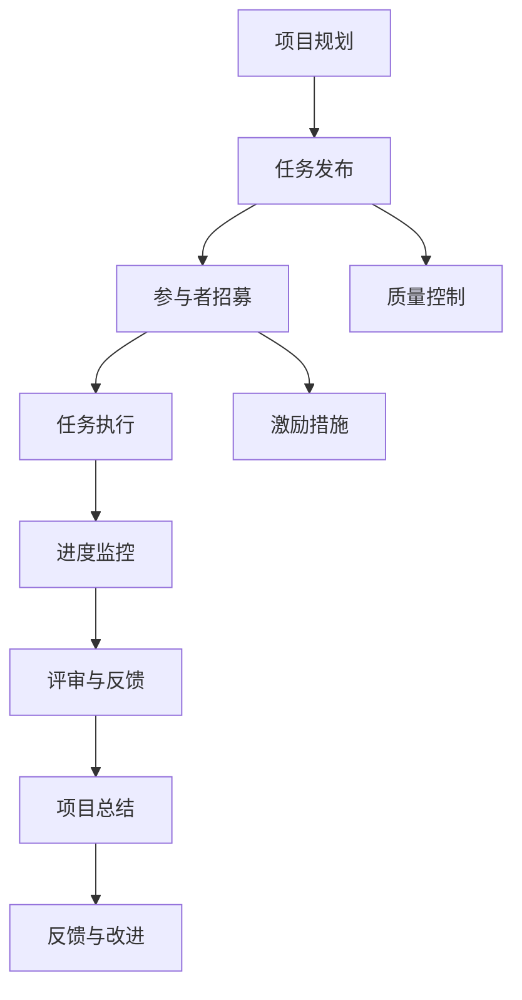
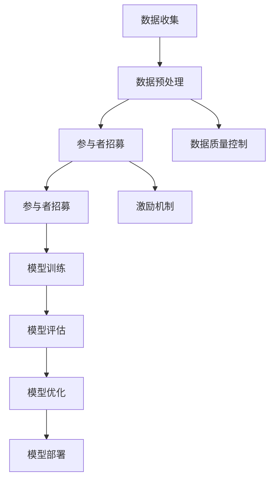

                 

# 《众包：汇聚微光，点亮科技未来》

## 关键词
- 众包
- 科技创新
- 数据科学
- 人工智能
- 平台生态系统
- 法律与伦理

## 摘要
本文深入探讨众包在科技领域的重要性与广泛应用。通过梳理众包的概念、优势、挑战以及生态系统，本文详细分析了众包在科学研究、软件开发与测试、人工智能与大数据等领域的实际应用。同时，通过成功与失败的案例分析，总结了众包项目的管理优化策略。最后，本文展望了众包的未来发展趋势，并探讨了众包的法律与伦理问题。希望本文能帮助读者全面了解众包，激发其对科技未来的思考与探索。

## 目录大纲

### 第一部分：众包概述

#### 第1章：众包的定义与背景
- **1.1 众包的概念与发展**
  - 众包的定义
  - 众包的历史背景
  - 众包与传统协作模式的区别

- **1.2 众包的优势与挑战**
  - 众包的优势
  - 众包面临的挑战
  - 应对挑战的策略

#### 第2章：众包生态系统
- **2.1 众包平台介绍**
  - 常见众包平台
  - 平台功能与特点

- **2.2 众包参与者**
  - 参与者的角色与职责
  - 参与者的权益保障

#### 第3章：众包项目设计
- **3.1 众包项目类型**
  - 创意征集
  - 数据标注
  - 软件开发
  - 人力资源招聘

- **3.2 众包项目流程**
  - 项目规划
  - 任务发布
  - 评审与反馈
  - 项目总结

### 第二部分：众包在科技领域的应用

#### 第4章：众包在科学研究中的应用
- **4.1 众包与科学研究的结合**
  - 科研众包的概念
  - 科研众包的案例

- **4.2 众包在数据收集与分析中的应用**
  - 大规模数据收集
  - 数据清洗与预处理
  - 数据分析与挖掘

#### 第5章：众包在软件开发与测试中的应用
- **5.1 众包在软件开发中的应用**
  - 众包在代码开发中的应用
  - 众包在软件测试中的应用

- **5.2 众包在软件优化中的应用**
  - 软件功能优化
  - 软件性能优化
  - 软件安全性优化

#### 第6章：众包在人工智能与大数据中的应用
- **6.1 众包与人工智能的结合**
  - 众包在人工智能研究中的应用
  - 众包在人工智能开发中的应用

- **6.2 众包在大数据应用中的挑战与机遇**
  - 大数据众包的挑战
  - 大数据众包的机遇

### 第三部分：众包实践与案例分析

#### 第7章：众包项目案例分析
- **7.1 成功案例分析**
  - 典型成功案例
  - 案例成功因素分析

- **7.2 失败案例分析**
  - 典型失败案例
  - 案例失败原因分析

#### 第8章：众包项目管理与优化
- **8.1 众包项目管理方法**
  - 项目规划
  - 项目执行
  - 项目监控
  - 项目总结

- **8.2 众包项目优化策略**
  - 众包激励机制
  - 众包质量控制
  - 众包成本控制

### 第四部分：众包的未来与趋势

#### 第9章：众包在未来的发展
- **9.1 众包的未来趋势**
  - 众包的发展方向
  - 众包的创新模式

- **9.2 众包对行业的影响**
  - 对企业的影响
  - 对社会的影响

#### 第10章：众包的法律与伦理问题
- **10.1 众包法律问题**
  - 众包合同法律风险
  - 数据隐私与保护

- **10.2 众包伦理问题**
  - 众包伦理挑战
  - 众包道德规范

### 附录

#### 附录 A：众包资源与工具
- **A.1 众包平台推荐**
  - 国内外常用众包平台

- **A.2 众包工具与资源**
  - 开源众包工具
  - 相关书籍与论文

#### 附录 B：众包流程图
- **B.1 众包项目流程图**
  - 众包项目全流程图示
- **B.2 大模型众包流程图**
  - AI大模型众包项目流程图

#### 附录 C：数学模型与算法伪代码
- **C.1 数据清洗算法**
  - 数据清洗伪代码实现

- **C.2 机器学习算法**
  - 机器学习算法伪代码实现

#### 附录 D：项目实战案例
- **D.1 创意征集项目案例**
  - 项目案例描述
  - 案例实现与解析

- **D.2 数据标注项目案例**
  - 项目案例描述
  - 案例实现与解析

- **D.3 人工智能众包项目案例**
  - 项目案例描述
  - 案例实现与解析

### 结束语
本文旨在为读者提供一个全面、系统的众包概述，从概念到应用，从挑战到未来趋势，帮助读者深入理解众包在科技领域的巨大潜力和实际影响。希望通过本文的阐述，激发更多人对众包的探索和实践，共同推动科技未来的发展。作者：AI天才研究院/AI Genius Institute & 禅与计算机程序设计艺术 /Zen And The Art of Computer Programming

---

### 第一部分：众包概述

#### 第1章：众包的定义与背景

**1.1 众包的概念与发展**

众包（Crowdsourcing）是一种将任务或项目外包给广大非特定人群来完成的新型协作模式。这种模式最早可以追溯到2000年，由Jeff Howe在其《连线》杂志的文章中首次提出。众包的核心在于利用互联网和社交媒体，将个体的智慧和力量汇集起来，共同完成一项任务或项目。

在众包的发展历程中，有一些重要的里程碑。例如，InnoCentive是一个早期的众包平台，成立于2001年，主要解决科学和工程领域的问题。同时，威望迪集团（Veolia Environment）与全球创客社区合作，开展了一个名为“垃圾至能源”（Waste to Energy）的众包项目，旨在通过公众的创意，解决垃圾处理问题。

与传统协作模式相比，众包具有以下几个显著特点：

1. **开放性**：众包不限定参与者的身份和地域，任何人都可以参与。
2. **去中心化**：众包项目通常由一个中央组织者发起，但任务执行和决策过程是分散的。
3. **灵活性**：众包项目可以根据实际情况灵活调整任务内容和进度。
4. **高效性**：通过大规模的参与者，众包可以快速完成一些复杂、庞大的任务。

**1.2 众包的优势与挑战**

**1.2.1 众包的优势**

众包作为一种新型的协作模式，具有以下优势：

1. **资源获取成本低**：由于参与者的广泛性，众包可以低成本地获取大量人力、智力和资源。
2. **创新性**：众包项目往往能够吸引来自不同领域和背景的参与者，从而激发出更多的创新思维。
3. **灵活性**：众包项目可以根据参与者的反馈和实际情况灵活调整，适应不断变化的需求。
4. **高效性**：通过大规模的参与者，众包可以快速完成一些复杂、庞大的任务。

**1.2.2 众包面临的挑战**

尽管众包具有许多优势，但在实际应用中仍然面临一些挑战：

1. **质量控制**：由于参与者数量庞大，如何保证项目的质量成为一个重要问题。
2. **权益保障**：参与者的权益保障，如知识产权保护和报酬分配，也需要得到妥善解决。
3. **激励机制**：如何有效地激励参与者，确保他们能够积极参与并完成任务，也是一个重要问题。
4. **法律与伦理问题**：众包项目涉及大量的个人数据和知识产权，如何确保其合法性和伦理性，也是一个需要关注的问题。

**1.2.3 应对挑战的策略**

为了克服上述挑战，可以采取以下策略：

1. **建立健全的质量管理体系**：通过制定严格的质量标准和流程，确保项目的质量。
2. **完善权益保障机制**：明确参与者的权益，确保其知识产权得到保护，合理分配报酬。
3. **设计有效的激励机制**：通过奖励机制、荣誉制度等，激发参与者的积极性。
4. **加强法律与伦理教育**：提高参与者和组织者的法律与伦理意识，确保众包项目的合法性和道德性。

综上所述，众包作为一种新型的协作模式，具有广泛的应用前景。通过充分利用众包的优势，克服面临的挑战，我们可以更好地发挥众包在科技领域的作用，推动科技创新和社会发展。

---

### 第2章：众包生态系统

**2.1 众包平台介绍**

众包平台是众包生态系统的核心组成部分，为任务发布者（客户端）和参与者（服务端）提供了一个连接和交互的桥梁。目前，国内外存在着多种众包平台，各自具有独特的功能与特点。

**2.1.1 常见众包平台**

以下是几种国内外常见的众包平台：

1. **世界级平台**：
   - **TopCoder**：成立于2002年，是全球领先的软件开发和算法竞赛平台，提供从创意设计到软件开发的各类众包任务。
   - **GitHub**：作为全球最大的代码托管平台，GitHub在软件开发领域的众包应用十分广泛，用户可以通过GitHub发起和参与各种开源项目的开发和改进。

2. **国内平台**：
   - **猪八戒网**：中国最大的众包服务交易网站，涵盖设计、开发、策划等多个领域的众包服务。
   - **码市**：专注于技术类众包服务平台，主要为企业和开发者提供软件开发、测试、维护等服务。

**2.1.2 平台功能与特点**

不同众包平台的功能和特点各不相同，以下是一些常见功能与特点：

1. **任务发布与管理**：
   - 平台允许用户发布各种类型的众包任务，并提供任务管理工具，方便任务发布者跟踪任务进度和参与者表现。

2. **人才招募与匹配**：
   - 平台通过算法和用户评价系统，为任务发布者推荐合适的参与者，提高任务完成质量和效率。

3. **任务评审与反馈**：
   - 平台通常提供任务评审功能，任务发布者可以查看参与者提交的成果并进行评价，为参与者提供反馈。

4. **支付与结算**：
   - 平台提供便捷的支付与结算服务，确保参与者的报酬及时到位。

5. **社区与交流**：
   - 平台往往设有社区功能，为用户提供一个交流、学习和分享经验的平台。

**2.2 众包参与者**

在众包生态系统中，参与者扮演着至关重要的角色。他们可以是通过个人能力或团队形式参与的各类人才。以下是参与者的角色与职责：

**2.2.1 参与者的角色与职责**

1. **任务参与者**：
   - 参与者根据自身技能和兴趣，接受平台发布的任务，并按照任务要求完成工作。

2. **评审者**：
   - 评审者通常由平台指定或用户邀请，对参与者提交的任务成果进行评价，提供专业反馈。

3. **社区志愿者**：
   - 社区志愿者在平台上负责维护社区秩序，帮助新用户解决问题，分享经验和知识。

**2.2.2 参与者的权益保障**

为了确保参与者的权益，平台需要建立完善的权益保障机制：

1. **知识产权保护**：
   - 平台需明确参与者的知识产权归属，确保其在任务中的创新成果得到保护。

2. **报酬保障**：
   - 平台需提供合理的报酬保障，确保参与者能够按时获得报酬。

3. **评价与信誉体系**：
   - 平台需建立评价与信誉体系，记录参与者的表现和贡献，为后续合作提供参考。

4. **隐私保护**：
   - 平台需保护参与者的个人信息和隐私，防止数据泄露和滥用。

综上所述，众包平台作为众包生态系统的核心，通过提供高效的任务发布、招募、评审和支付等服务，促进了众包的可持续发展。同时，参与者的积极参与和权益保障，也为众包生态系统的健康发展提供了重要支撑。

---

### 第3章：众包项目设计

**3.1 众包项目类型**

众包项目类型多样，根据任务性质和目标的不同，可以分为以下几类：

**3.1.1 创意征集**

创意征集是一种常见的众包项目类型，通常用于寻找新的创意、设计或解决方案。例如，企业可以通过众包平台征集品牌标识设计、广告创意、产品概念等。创意征集项目具有以下特点：

- **开放性**：任何人都可以参与，不受地域和身份限制。
- **创新性**：通过广泛征集，可以激发出多样化的创意。
- **竞争性**：参与者之间形成竞争，有助于提高项目的质量。

**3.1.2 数据标注**

数据标注是数据科学中的一项重要任务，涉及到对大量数据进行分类、标注或注释。众包平台可以用于招募参与者进行数据标注，例如图像标注、文本分类、语音识别等。数据标注项目具有以下特点：

- **大规模**：数据标注通常涉及大量数据，需要大规模的劳动力。
- **精度要求高**：数据标注的质量直接影响到后续数据处理和分析的结果。
- **灵活性**：可以根据任务需求灵活调整标注规则和标准。

**3.1.3 软件开发**

软件开发是众包项目中的一个重要领域，企业可以通过众包平台招募开发人员，共同完成软件项目。软件开发项目具有以下特点：

- **专业性**：软件开发需要具备专业知识和技能，参与者通常为具备相关经验的开发者。
- **协同性**：众包软件开发项目通常需要参与者之间的紧密合作。
- **灵活调整**：可以根据项目进度和需求，灵活调整开发计划和技术方案。

**3.1.4 人力资源招聘**

人力资源招聘是一种将招聘任务众包给广大参与者的方式。通过众包平台，企业可以发布招聘信息，招募合适的候选人。人力资源招聘项目具有以下特点：

- **广泛性**：可以吸引来自全球各地的候选人。
- **多样性**：候选人具有多样化的背景和技能，有助于企业找到适合的人才。
- **效率高**：通过众包，可以快速筛选出合适的候选人，提高招聘效率。

**3.2 众包项目流程**

一个成功的众包项目需要经过精心设计和有效管理。以下是众包项目的常见流程：

**3.2.1 项目规划**

项目规划是众包项目的第一步，主要包括以下内容：

- **目标设定**：明确项目目标，例如解决什么问题、达到什么效果。
- **任务分解**：将项目任务分解为具体的子任务，便于后续分配和执行。
- **预算分配**：根据项目需求和目标，制定合理的预算分配方案。
- **时间规划**：制定项目的时间表，明确各个阶段的时间节点。

**3.2.2 任务发布**

任务发布是众包项目的重要环节，主要包括以下内容：

- **任务描述**：详细描述任务内容、目标、要求和交付标准。
- **任务发布**：在众包平台上发布任务，吸引参与者参与。
- **评审标准**：明确任务评审的标准和流程，确保项目质量。

**3.2.3 参与者招募**

参与者招募是众包项目成功的关键，主要包括以下内容：

- **宣传推广**：通过社交媒体、网站等渠道宣传项目，吸引参与者。
- **资格审核**：对报名的参与者进行资格审核，确保其具备完成任务的能力。
- **任务匹配**：根据参与者的技能和经验，将其分配到合适的任务。

**3.2.4 任务执行**

任务执行是众包项目的核心环节，主要包括以下内容：

- **任务分配**：将任务分配给参与者，明确任务责任和进度要求。
- **进度监控**：监控任务进度，及时解决遇到的问题。
- **质量评估**：对参与者提交的任务成果进行评估，确保符合项目要求。

**3.2.5 评审与反馈**

评审与反馈是确保众包项目质量的重要环节，主要包括以下内容：

- **评审标准**：制定评审标准和流程，确保评审的客观性和公正性。
- **评价与反馈**：对参与者提交的任务成果进行评价，提供详细的反馈意见。
- **激励措施**：根据参与者的表现，给予相应的奖励和激励。

**3.2.6 项目总结**

项目总结是众包项目的最后一步，主要包括以下内容：

- **项目评估**：对整个项目进行评估，总结成功经验和不足之处。
- **反馈与改进**：根据评估结果，提出改进措施，为后续项目提供参考。
- **项目报告**：撰写项目报告，记录项目的全过程和成果。

通过以上流程，众包项目可以有效地进行设计和管理，实现项目的目标。同时，合理的流程设计和有效的项目管理，也是确保众包项目成功的关键因素。

---

### 第二部分：众包在科技领域的应用

#### 第4章：众包在科学研究中的应用

**4.1 众包与科学研究的结合**

科学研究是一个复杂且耗时的工作，常常需要大量的人力、物力和财力投入。而众包作为一种新兴的协作模式，通过将任务分散给广泛的参与者，可以有效降低研究成本、提高研究效率，从而推动科学研究的进展。众包与科学研究的结合主要体现在以下几个方面：

**4.1.1 科研众包的概念**

科研众包（Science Crowdsourcing）是指将科学研究中的某些任务或问题外包给非特定的参与者，通过众包平台进行协作和完成。科研众包不仅包括数据的收集和分析，还包括实验设计、模型构建、算法优化等。科研众包的核心理念是利用大众的智慧和力量，共同推进科学研究。

**4.1.2 科研众包的案例**

1. **天文学**：
   - ** citizen science project**：比如“Galaxy Zoo”，该项目通过众包方式邀请公众参与星系分类，吸引了数百万参与者，大大加速了星系分类的工作。

2. **生物学**：
   - **Foldit**：这是一个由游戏玩家参与蛋白质折叠预测的项目，参与者通过游戏方式解决了多个生物学难题，取得了与专业科学家相当的研究成果。

3. **医学**：
   - ** DARIAH**：这是一个数字人文领域的研究项目，通过众包方式收集和整理了大量历史文献数据，为医学研究提供了重要的数据支持。

**4.2 众包在数据收集与分析中的应用**

数据是科学研究的基础，而数据的收集与处理往往是一个复杂且耗时的过程。众包可以有效地解决这个问题，通过广泛的参与者，快速收集和清洗大量的数据。

**4.2.1 大规模数据收集**

科学研究中常常需要收集大量的数据，例如生物医学数据、地理信息数据、气象数据等。这些数据往往无法通过传统的数据收集方式在短时间内完成。通过众包，可以将数据收集任务分配给大量的参与者，实现快速、高效的数据收集。

- **案例**：在生物医学领域，有许多项目通过众包方式收集患者症状数据，以便进行大数据分析，从而发现新的疾病治疗方法。

**4.2.2 数据清洗与预处理**

数据清洗与预处理是数据科学中的重要环节，它涉及到去除噪声、纠正错误、填充缺失值等。通过众包，可以将数据清洗与预处理任务分配给大量的参与者，从而加速这一过程。

- **案例**：在地理信息科学中，许多项目通过众包方式邀请参与者对地理数据进行标注和清洗，从而提高数据质量。

**4.2.3 数据分析与挖掘**

数据分析与挖掘是科学研究的核心，通过数据分析可以发现数据中的隐藏模式和规律。众包可以为数据分析与挖掘提供更多的数据来源和计算资源。

- **案例**：在气象学领域，许多项目通过众包方式收集全球的气象数据，并利用这些数据进行气候模型的研究。

**4.3 众包在科学研究中的优势**

众包在科学研究中的应用具有以下优势：

- **成本效益**：通过众包，可以大大降低科学研究的人力成本和计算成本。
- **效率提升**：众包可以快速收集和整理大量数据，提高研究的效率。
- **创新性**：众包可以吸引来自不同领域和背景的参与者，激发创新的思维。
- **社会参与**：众包可以吸引公众参与科学研究，提高科学研究的公众参与度。

**4.4 众包在科学研究中的挑战**

尽管众包在科学研究中具有许多优势，但同时也面临着一些挑战：

- **质量控制**：众包项目中的参与者质量难以保证，如何确保数据质量和分析结果的准确性是一个重要问题。
- **隐私保护**：科学研究中的数据往往涉及个人隐私，如何保护参与者的隐私是一个重要问题。
- **激励机制**：如何激励参与者积极参与众包项目，确保他们的积极性和质量是一个挑战。

**4.5 解决挑战的策略**

为了解决上述挑战，可以采取以下策略：

- **建立健全的质量管理体系**：通过制定严格的数据收集和分析标准，确保数据质量和分析结果的准确性。
- **加强隐私保护**：在数据收集和分析过程中，采取严格的隐私保护措施，确保参与者的隐私安全。
- **设计有效的激励机制**：通过奖励机制、荣誉制度等，激发参与者的积极性和创造力。

综上所述，众包在科学研究中的应用具有巨大的潜力，通过充分利用众包的优势，解决面临的挑战，我们可以更好地推动科学研究的进展，实现科学技术的创新和发展。

---

### 第5章：众包在软件开发与测试中的应用

**5.1 众包在软件开发中的应用**

众包在软件开发中的应用已经逐渐成为行业共识，通过众包，企业可以快速获取全球范围内的技术资源和创新思维，从而加速软件的开发过程，提高产品质量。

**5.1.1 众包在代码开发中的应用**

1. **分布式开发**：
   - 众包平台可以将代码开发的任务分配给全球的开发者，实现分布式开发。这种模式不仅能够提高开发效率，还能够充分利用不同地区的专业人才。
   - **示例**：GitHub和GitLab等代码托管平台，通过众包模式吸引了全球的开发者共同参与开源项目的开发。

2. **功能实现与优化**：
   - 企业可以通过众包平台发布特定的功能开发任务，吸引开发者参与实现和优化。
   - **示例**：某个初创公司通过TopCoder平台发布了移动应用开发任务，获得了多个高质量的解决方案，并从中选择了最佳方案。

3. **代码审查与维护**：
   - 众包平台上的专业开发者可以提供代码审查服务，帮助团队识别和修复代码中的潜在问题。
   - **示例**：猪八戒网上的代码审查服务，吸引了大量的专业开发者，为企业提供了可靠的代码质量保障。

**5.1.2 众包在软件测试中的应用**

软件测试是软件开发过程中的关键环节，通过众包，企业可以迅速构建一个庞大的测试团队，提高软件的测试质量和效率。

1. **功能测试与性能测试**：
   - 众包平台可以招募来自不同地区和领域的测试员，进行功能测试和性能测试，确保软件在各种环境下的稳定性和可靠性。
   - **示例**：某个企业通过Testuff平台招募了全球各地的测试员，对新产品进行了全面的测试，及时发现了多个潜在问题。

2. **用户体验测试**：
   - 众包平台可以帮助企业招募真实的用户进行用户体验测试，收集用户的反馈和意见，从而优化软件的设计和功能。
   - **示例**：某知名互联网公司通过UserTesting平台，邀请了真实的用户对其新产品进行了用户体验测试，并根据用户的反馈进行了多次迭代优化。

3. **安全测试**：
   - 安全测试是软件测试中的重要一环，通过众包，企业可以吸引专业的安全专家进行安全测试，确保软件的安全性。
   - **示例**：某安全软件公司通过HackerOne平台，招募了全球的网络安全专家进行安全漏洞扫描和攻击测试，有效提升了产品的安全性。

**5.2 众包在软件优化中的应用**

软件优化是持续改进软件性能、功能和用户体验的重要过程，通过众包，企业可以快速获取专业意见和创新方案。

1. **功能优化**：
   - 众包平台可以吸引开发者对现有功能进行优化，提高软件的效率和使用体验。
   - **示例**：某游戏公司通过Upwork平台，招募了专业的游戏开发者对其游戏进行功能优化，提高了游戏的运行速度和图形质量。

2. **性能优化**：
   - 众包平台可以帮助企业对软件的性能进行优化，提高软件的响应速度和稳定性。
   - **示例**：某电商企业通过Topcoder平台，招募了专业的开发者和性能优化专家，对其电商平台进行了全面的性能优化，显著提升了网站的响应速度和并发处理能力。

3. **用户体验优化**：
   - 众包平台可以招募用户体验专家，对软件的界面和交互设计进行优化，提升用户满意度。
   - **示例**：某移动应用公司通过Dribbble平台，招募了用户体验设计师，对其应用的用户界面和交互流程进行了全面优化，大幅提升了用户的满意度和留存率。

**5.3 众包在软件开发与测试中的优势**

众包在软件开发与测试中的应用具有以下优势：

- **快速获取资源**：通过众包，企业可以快速获取全球范围内的技术资源和专业人才。
- **降低成本**：众包可以降低软件开发与测试的成本，提高资源利用率。
- **提高质量**：众包可以吸引更多的参与者，提高软件的开发质量和测试覆盖率。
- **创新思维**：众包可以吸引来自不同领域和背景的参与者，激发创新的思维和方案。

综上所述，众包在软件开发与测试中的应用不仅能够提高开发效率和测试质量，还能够降低成本，促进软件优化和创新。通过合理利用众包，企业可以更好地应对快速变化的科技环境和市场需求。

---

### 第6章：众包在人工智能与大数据中的应用

**6.1 众包与人工智能的结合**

人工智能（AI）是现代科技发展的核心领域，而众包作为一种高效的协作模式，为人工智能的研究和应用提供了新的可能。众包与人工智能的结合主要体现在以下几个方面：

**6.1.1 众包在人工智能研究中的应用**

1. **数据标注**：
   - 在人工智能研究中，大量的数据标注工作是必不可少的。通过众包，可以快速收集大量标注数据，为模型训练提供支持。
   - **案例**：OpenImageNet是一个利用众包进行图像数据标注的项目，吸引了大量参与者对图像进行分类和标注，为视觉识别模型提供了丰富的数据资源。

2. **众包编程**：
   - 众包编程是指将AI算法开发和优化任务分配给众包平台上的开发者。通过众包，可以集合全球开发者的智慧，共同优化AI算法。
   - **案例**：Google的AI Experiments项目，通过众包方式邀请开发者参与AI算法的设计和优化，实现了多个创新的应用。

3. **众包评估**：
   - 在AI模型训练和评估过程中，可以通过众包收集大量的评估数据，对模型进行全面的测试和优化。
   - **案例**：Google的Google AI Challenge项目，通过众包方式邀请全球开发者参与AI模型的评估和改进，提高了模型的表现和准确性。

**6.1.2 众包在人工智能开发中的应用**

1. **众包AI开发工具**：
   - 众包平台提供了各种AI开发工具，如AI框架、API和模型库，方便开发者快速构建和应用AI解决方案。
   - **案例**：IBM的Watson Studio平台，通过众包方式为开发者提供了丰富的AI开发工具和资源，支持各种AI项目的开发和应用。

2. **众包AI服务**：
   - 众包平台还提供了各种AI服务，如图像识别、自然语言处理和预测分析等，帮助企业和开发者快速实现AI应用。
   - **案例**：AWS的AI服务，通过众包平台提供各种AI模型和服务，帮助企业快速实现智能化的业务流程。

3. **众包AI平台**：
   - 众包平台本身也可以作为一个AI平台，提供从数据收集、模型训练到应用部署的一站式服务。
   - **案例**：Kaggle平台，通过众包模式为数据科学家和AI开发者提供了一个全面的AI开发平台，吸引了大量的用户参与AI项目的开发和优化。

**6.2 众包在大数据应用中的挑战与机遇**

大数据（Big Data）是现代科技发展的重要驱动力，而众包在处理和利用大数据方面也面临着许多挑战和机遇。

**6.2.1 挑战**

1. **数据质量**：
   - 众包平台上的数据质量参差不齐，如何确保数据的准确性和可靠性是一个重要问题。
   - **解决方案**：建立严格的数据质量管理体系，制定详细的数据标注标准和流程，确保数据的质量。

2. **数据隐私**：
   - 大数据往往涉及大量的个人隐私信息，如何在确保数据隐私的前提下利用众包处理大数据是一个挑战。
   - **解决方案**：采取严格的数据隐私保护措施，如数据脱敏、匿名化和加密技术，确保数据的隐私安全。

3. **数据安全**：
   - 大数据在传输和处理过程中可能面临数据泄露和网络攻击的风险，如何确保数据安全是一个重要问题。
   - **解决方案**：采取完善的数据安全措施，如防火墙、入侵检测系统和数据加密技术，确保数据的安全。

**6.2.2 机遇**

1. **数据资源**：
   - 通过众包，可以快速收集和积累大量的数据资源，为大数据分析提供丰富的数据基础。
   - **解决方案**：设计高效的数据收集和整理流程，利用众包平台的资源优势，快速构建大数据资源库。

2. **计算能力**：
   - 众包平台可以集合全球的计算资源，为大数据处理和分析提供强大的计算能力。
   - **解决方案**：利用分布式计算技术和云计算平台，提高大数据处理的效率和质量。

3. **创新应用**：
   - 众包平台为大数据应用提供了广阔的创新空间，可以通过众包模式实现各种创新的大数据应用。
   - **解决方案**：鼓励创新思维，设计多样化的众包项目，推动大数据应用的创新发展。

综上所述，众包在人工智能与大数据中的应用具有巨大的潜力和前景。通过充分利用众包的优势，克服面临的挑战，我们可以更好地推动人工智能与大数据的发展，实现科技的创新和突破。

---

### 第三部分：众包实践与案例分析

#### 第7章：众包项目案例分析

**7.1 成功案例分析**

**7.1.1 项目背景**

某全球知名科技公司（以下简称“该公司”）在开发一款全新的智能家居产品时，遇到了产品功能设计不完善、用户体验不佳的问题。为了解决这个问题，该公司决定采用众包模式，通过广大用户的创意和建议，优化产品的设计和功能。

**7.1.2 项目执行**

1. **任务发布**：
   - 该公司通过其官方网站和社交媒体平台，发布了众包项目，邀请全球用户参与产品功能的优化建议。

2. **参与者招募**：
   - 通过众包平台的宣传和推荐，吸引了大量用户和设计师参与项目。

3. **创意征集**：
   - 参与者提交了各种创意和建议，包括功能扩展、用户界面优化、用户体验改进等。

4. **评审与反馈**：
   - 该公司成立了专门的评审团队，对提交的创意和建议进行评审，并给予作者详细的反馈。

**7.1.3 项目总结**

1. **成果总结**：
   - 项目共收到了超过1000份有效的创意和建议，其中一些创意被采纳并实际应用到了产品的设计中。

2. **成功因素**：
   - 明确的项目目标和任务描述，确保参与者了解项目要求和期望。
   - 有效的激励机制，鼓励参与者积极参与和提交高质量的创意。
   - 严格的评审标准和流程，确保创意和建议的质量和可行性。

**7.1.4 社会影响**

1. **用户满意度提升**：
   - 通过用户的积极参与和反馈，该公司的智能家居产品得到了显著优化，用户满意度大幅提升。

2. **品牌影响力扩大**：
   - 该项目得到了广泛的关注和媒体报道，进一步提升了公司的品牌影响力。

**7.2 失败案例分析**

**7.2.1 项目背景**

某小型创业公司（以下简称“该公司”）在开发一款社交应用程序时，采用了众包模式，希望通过广泛的参与者，快速完成产品的开发。然而，该项目最终以失败告终。

**7.2.2 项目执行**

1. **任务发布**：
   - 该公司通过社交媒体平台发布了众包项目，但没有详细描述任务要求和预期目标。

2. **参与者招募**：
   - 虽然吸引了大量参与者，但其中很多参与者并不具备开发经验，且对项目缺乏理解和兴趣。

3. **任务执行**：
   - 参与者提交的代码质量参差不齐，且缺乏统一的技术标准和规范。

4. **项目监控**：
   - 该公司缺乏有效的项目监控和管理机制，导致项目进度严重滞后。

**7.2.3 项目总结**

1. **成果总结**：
   - 项目未能按时完成，且代码质量差，无法满足产品开发的需求。

2. **失败原因**：
   - 项目目标不明确，任务描述模糊，导致参与者对任务缺乏理解和兴趣。
   - 缺乏有效的激励机制，参与者积极性不高。
   - 项目监控和管理机制不完善，导致项目进度失控。

**7.2.4 社会影响**

1. **项目成本增加**：
   - 由于项目失败，该公司不得不投入更多的时间和资源进行修复和重构，导致项目成本大幅增加。

2. **品牌形象受损**：
   - 失败的众包项目在社交媒体上引起了负面反响，对公司的品牌形象造成了损害。

通过以上成功与失败的案例分析，我们可以看到，众包项目的成功与否不仅取决于众包模式的运用，还需要明确的项目目标、详细的任务描述、有效的激励机制和严格的项目管理。只有综合考虑这些因素，才能确保众包项目的成功实施和可持续发展。

---

### 第8章：众包项目管理与优化

**8.1 众包项目管理方法**

众包项目的成功离不开科学的项目管理方法。以下是一个典型的众包项目管理流程，包括项目规划、项目执行、项目监控和项目总结四个主要阶段。

**8.1.1 项目规划**

项目规划是众包项目的第一步，也是最重要的一步。项目规划主要包括以下内容：

- **目标设定**：明确项目的目标和预期成果，确保项目方向正确。
- **任务分解**：将项目任务分解为具体的子任务，便于后续分配和执行。
- **资源分配**：根据任务需求和项目目标，合理分配资源，包括人力、物力和财力。
- **时间规划**：制定项目的时间表，明确各个阶段的时间节点，确保项目按时完成。

**8.1.2 项目执行**

项目执行是众包项目的核心阶段，主要包括以下内容：

- **任务发布**：在众包平台上发布任务，明确任务要求、交付标准和奖励机制。
- **参与者招募**：通过宣传推广，吸引合适的参与者参与项目。
- **任务分配**：根据参与者的技能和经验，将其分配到合适的任务。
- **进度监控**：监控任务进度，及时解决遇到的问题，确保项目按计划进行。

**8.1.3 项目监控**

项目监控是确保众包项目质量和进度的重要环节，主要包括以下内容：

- **质量控制**：制定严格的质量标准和流程，确保参与者的任务成果符合项目要求。
- **风险评估**：识别项目风险，制定应对措施，降低风险对项目的影响。
- **沟通与反馈**：定期与参与者沟通，收集反馈意见，确保项目顺利进行。

**8.1.4 项目总结**

项目总结是众包项目的最后一步，主要包括以下内容：

- **项目评估**：对项目进行全面的评估，总结成功经验和不足之处。
- **反馈与改进**：根据评估结果，提出改进措施，为后续项目提供参考。
- **项目报告**：撰写项目报告，记录项目的全过程和成果，为项目参与者和利益相关者提供参考。

**8.2 众包项目优化策略**

为了确保众包项目的成功，需要采取一系列优化策略，包括激励机制、质量控制和成本控制。

**8.2.1 众包激励机制**

激励机制是确保参与者积极性和创造力的关键。以下是一些有效的激励机制：

- **奖励机制**：根据参与者的表现和贡献，给予相应的物质奖励和荣誉奖励。
- **荣誉制度**：建立荣誉制度，对优秀的参与者给予荣誉称号和公开表彰。
- **积分制度**：通过积分制度，鼓励参与者积极参与，提高参与度和贡献度。
- **晋升机制**：为表现优秀的参与者提供职业晋升机会，激励其长期参与。

**8.2.2 众包质量控制**

质量控制是确保众包项目成果的重要保障。以下是一些有效的质量控制策略：

- **质量标准**：制定严格的质量标准和流程，确保参与者的任务成果符合项目要求。
- **评审机制**：建立多层次的评审机制，对参与者的任务成果进行严格评审。
- **反馈机制**：及时给予参与者反馈，帮助其改进工作，提高质量。
- **质量控制工具**：利用质量控制工具，如自动化测试工具、代码审查工具等，提高任务质量。

**8.2.3 众包成本控制**

成本控制是确保众包项目经济效益的重要环节。以下是一些有效的成本控制策略：

- **预算管理**：制定详细的预算计划，合理分配资源，确保项目成本控制在预算范围内。
- **成本跟踪**：实时跟踪项目成本，及时发现和解决成本超支问题。
- **成本优化**：通过优化项目流程和资源配置，降低项目成本。
- **风险管理**：识别项目风险，制定应对措施，降低风险对项目成本的影响。

通过以上项目管理和优化策略，可以确保众包项目的顺利实施和成功完成。同时，不断优化项目管理方法和策略，将有助于进一步提升众包项目的效率和效果，为科技和创新提供强有力的支持。

---

### 第四部分：众包的未来与趋势

#### 第9章：众包在未来的发展

**9.1 众包的未来趋势**

随着互联网和科技的发展，众包模式正不断进化，展现出更加广泛和深入的应用前景。以下是众包在未来可能呈现的几个趋势：

**9.1.1 人工智能与众包的融合**

人工智能（AI）技术的快速发展为众包带来了新的机遇。AI可以在众包任务的分配、参与者管理、质量控制和反馈机制等方面发挥重要作用。例如，AI算法可以自动匹配任务与参与者，根据参与者的技能和经验推荐最适合的任务；AI还可以对参与者的表现进行实时评估，提供个性化的反馈和建议。

- **案例分析**：例如，GitHub已经推出了基于AI的代码审查工具，通过分析代码库的历史数据，自动识别代码中的潜在问题，并提供改进建议。

**9.1.2 区块链技术的应用**

区块链技术的去中心化和不可篡改特性，为众包提供了一种新的信任机制和数据安全性保障。通过区块链，可以确保参与者身份的真实性和任务执行的透明性，同时解决知识产权保护和报酬分配问题。

- **案例分析**：例如，某些众包平台已经开始尝试使用区块链技术，确保任务的完成情况和参与者的报酬发放，提高交易的透明度和安全性。

**9.1.3 数据驱动的众包优化**

随着大数据技术的普及，众包项目可以通过数据分析，优化参与者的招募、任务的分配和项目的管理。通过对历史数据的分析，可以预测参与者的行为模式，提高任务的完成率和项目的成功率。

- **案例分析**：例如，某些众包平台已经开始利用机器学习技术，分析用户历史数据，预测用户的行为，从而优化任务的分配和项目的管理。

**9.1.4 众包生态系统的全球化**

随着全球化的加深，众包平台将越来越国际化，吸引全球各地的参与者。这不仅扩大了众包的参与人群，也为企业提供了更多的资源和技术支持。

- **案例分析**：例如，Kaggle平台已经吸引了来自全球各地的数据科学家和AI开发者，共同参与各种数据科学竞赛和项目。

**9.2 众包的创新模式**

除了传统众包模式，未来还将出现更多创新的众包模式，以满足不同领域和场景的需求。

**9.2.1 众创空间**

众创空间是一种新型的众包模式，通过提供一个开放的物理空间，聚集各种创新资源和人才，鼓励创新和合作。众创空间可以为创业者、开发者、设计师等提供资源共享、知识交流和项目合作的平台。

- **案例分析**：例如，谷歌的“创新空间”（Google for Startups）为创业者提供了办公空间、资金支持和培训服务，促进了创新和创业。

**9.2.2 社区驱动众包**

社区驱动众包通过建立社区，促进成员之间的互动和协作，共同完成项目。这种模式强调社区成员的参与和共享，有助于建立信任和长期的合作关系。

- **案例分析**：例如，Linux内核开发就是一个典型的社区驱动众包案例，全球的开发者通过社区协作，共同开发和维护Linux内核。

**9.2.3 供应链众包**

供应链众包通过将供应链中的各个环节进行众包，实现供应链的优化和效率提升。例如，企业可以通过众包平台，将生产、物流和供应链管理等任务分配给合作伙伴，实现供应链的协同和优化。

- **案例分析**：例如，某些制造业企业已经开始利用众包平台，将零部件生产、产品组装等任务分配给全球的供应商，实现供应链的全球化。

**9.3 众包对行业的影响**

众包不仅改变了传统的工作模式，还对各行各业产生了深远的影响。

**9.3.1 对企业的影响**

众包为企业提供了灵活的人才资源和创新的解决方案，帮助企业降低成本、提高效率和创新能力。

- **案例分析**：例如，Airbnb和Uber等共享经济公司通过众包模式，将闲置资源转化为商业价值，实现了快速发展和成功。

**9.3.2 对社会的影响**

众包促进了知识的传播和共享，激发了公众的参与热情，推动了社会的创新和发展。

- **案例分析**：例如，Galaxy Zoo项目通过众包方式，吸引了数百万公众参与天文学研究，推动了天文学知识的普及和传播。

综上所述，众包在未来的发展中，将继续融合人工智能、区块链、大数据等新技术，创新众包模式，并对各个行业和社会产生深远的影响。通过充分利用众包的优势和潜力，我们可以共同推动科技和创新的进步，创造更加美好的未来。

---

### 第10章：众包的法律与伦理问题

**10.1 众包法律问题**

随着众包的广泛应用，相关法律问题也逐渐浮现。以下是众包在法律层面面临的一些主要问题及其解决方案：

**10.1.1 合同法律风险**

众包项目通常涉及大量参与者，每个参与者与项目组织者之间的合同关系可能不明确，导致法律纠纷的风险增加。为了规避合同法律风险，可以采取以下措施：

- **明确合同条款**：在项目启动前，制定详细的合同条款，明确参与者的权利和义务。
- **标准化合同模板**：采用标准化的合同模板，确保合同的规范性和一致性。
- **法律咨询**：在合同制定过程中，寻求专业法律咨询，确保合同符合相关法律法规。

**10.1.2 数据隐私与保护**

众包项目往往涉及大量的个人数据，如何保护这些数据隐私成为重要问题。为了保护数据隐私，可以采取以下措施：

- **数据匿名化**：在数据收集和处理过程中，对个人数据进行匿名化处理，降低数据泄露的风险。
- **数据加密**：采用数据加密技术，确保数据在传输和存储过程中的安全性。
- **隐私政策**：制定明确的隐私政策，告知参与者其数据的收集、使用和保护方式。

**10.1.3 知识产权保护**

众包项目中的知识产权保护问题主要涉及参与者的原创成果和项目的成果归属。为了保护知识产权，可以采取以下措施：

- **明确知识产权归属**：在合同中明确参与者的原创成果归属，防止知识产权纠纷。
- **知识产权审查**：在项目启动前，对参与者的原创成果进行知识产权审查，确保不存在侵权问题。
- **知识产权保护机制**：建立知识产权保护机制，对项目成果进行法律保护。

**10.2 众包伦理问题**

众包作为一种新型的协作模式，不仅涉及法律问题，还涉及伦理问题。以下是众包在伦理层面面临的一些主要问题及其解决方案：

**10.2.1 公平性问题**

众包项目中的参与者可能来自不同的背景和地区，如何确保公平对待每个参与者成为伦理问题。为了解决公平性问题，可以采取以下措施：

- **透明的招募流程**：确保招募流程的透明性，让每个参与者都有公平的机会参与项目。
- **多元化的评审标准**：在评审过程中，采用多元化的评审标准，避免因个人偏见而导致的不公平。
- **激励机制的公平性**：确保激励机制的公平性，让每个参与者的努力和贡献都得到合理的回报。

**10.2.2 道德责任**

众包项目中的参与者可能会承担一定的道德责任，例如在医疗数据标注项目中，参与者需要准确标注患者的病情数据，这可能涉及到患者的隐私权和生命安全。为了解决道德责任问题，可以采取以下措施：

- **道德培训**：对参与者进行道德培训，提高其道德意识和责任感。
- **伦理审查**：在项目启动前，进行伦理审查，确保项目符合道德标准。
- **道德监督**：建立道德监督机制，对参与者的行为进行监督，确保其遵守道德规范。

**10.2.3 社会责任**

众包项目不仅涉及参与者，还涉及到整个社会的利益。如何确保众包项目对社会负责成为重要问题。为了解决社会责任问题，可以采取以下措施：

- **社会责任评估**：在项目启动前，进行社会责任评估，确保项目符合社会责任要求。
- **透明度**：提高项目的透明度，让公众了解项目的进展和成果，增强社会信任。
- **公益合作**：与公益组织合作，利用众包平台开展公益活动，为社会做出贡献。

综上所述，众包在法律和伦理层面面临诸多挑战，但通过采取合理的措施，可以有效地解决这些问题，确保众包项目的合法性和道德性。只有在法律和伦理的框架内，众包才能真正发挥其潜力，为科技创新和社会发展贡献力量。

---

### 附录 A：众包资源与工具

**A.1 众包平台推荐**

以下是国内外一些常用的众包平台，这些平台在各自领域具有很高的知名度和使用率：

- **国内平台**：
  - **猪八戒网**：提供广泛的众包服务，包括设计、开发、策划等领域。
  - **码市**：专注于技术类众包服务平台，主要为企业和开发者提供软件开发、测试、维护等服务。
  - **淘宝众包**：提供各类在线众包任务，包括商品评价、店铺运营等。

- **国际平台**：
  - **TopCoder**：全球领先的软件开发和算法竞赛平台，提供从创意设计到软件开发的各类众包任务。
  - **GitHub**：全球最大的代码托管平台，支持开源项目的开发和管理。
  - **Kaggle**：专注于数据科学和机器学习的竞赛平台，提供丰富的数据科学挑战和竞赛。

**A.2 众包工具与资源**

以下是一些常用的众包工具和资源，有助于用户更好地开展众包项目：

- **众包工具**：
  - **CrowdFlower**：提供数据标注和分类工具，适合大规模数据标注任务。
  - **Mechanical Turk**：亚马逊公司提供的众包平台，适用于小规模、简单的众包任务。
  - **Clickworker**：提供多种众包任务，包括数据标注、调查问卷、内容创作等。

- **开源工具**：
  - ** crowdPy**：基于Python的众包任务管理工具，适用于构建和管理众包平台。
  - **PyBossa**：开源众包平台，支持多种任务类型，提供灵活的任务定义和管理功能。

- **相关书籍与论文**：
  - 《众包：如何利用众人的智慧创造巨大价值》（Crowdsourcing: How and Why Companies Use the Wisdom of Customers to Stay Relevant and Profitable）
  - 《众包平台设计：构建高效、可持续的众包生态系统》（Designing for Crowds: How to Create and Run Successful Participatory Systems）
  - 相关学术期刊和会议，如《计算机与自动化》（Computer Automation and Control Systems）和《数据挖掘》（Data Mining）等，定期发布众包领域的最新研究成果。

通过利用上述众包平台、工具和资源，用户可以更好地开展众包项目，实现资源共享和协作创新，推动科技和产业的进步。

---

### 附录 B：众包流程图

**B.1 众包项目流程图**

以下是一个典型的众包项目流程图，展示了从项目规划到项目总结的全过程：



**B.2 AI大模型众包项目流程图**

以下是一个AI大模型众包项目的流程图，展示了从数据收集到模型优化的全过程：



通过上述流程图，我们可以清晰地看到众包项目从启动到完成的全过程，以及每个阶段的关键任务和注意事项。这些流程图不仅有助于项目管理者更好地规划和执行项目，还可以为参与者提供明确的指导和参考。

---

### 附录 C：数学模型与算法伪代码

**C.1 数据清洗算法**

数据清洗是数据分析中的关键步骤，以下是一个简单的数据清洗算法的伪代码示例，该算法旨在处理缺失值和异常值。

```python
def data_cleaning(data):
    # 填充缺失值
    for column in data.columns:
        if data[column].isnull().any():
            data[column].fillna(data[column].mean(), inplace=True)
    
    # 删除异常值
    for column in data.columns:
        if data[column].dtype == 'float64' or data[column].dtype == 'int64':
            q1 = data[column].quantile(0.25)
            q3 = data[column].quantile(0.75)
            iqr = q3 - q1
            lower_bound = q1 - 1.5 * iqr
            upper_bound = q3 + 1.5 * iqr
            data = data[(data[column] >= lower_bound) & (data[column] <= upper_bound)]
    
    return data
```

**C.2 机器学习算法**

以下是一个简单的线性回归算法的伪代码示例，用于预测数据。

```python
def linear_regression(X, y):
    # 计算权重和偏置
    w = (np.linalg.inv(np.dot(X.T, X))).dot(X.T).dot(y)
    b = y.mean() - np.dot(w.T, X.mean())

    # 构建预测函数
    def predict(x):
        return np.dot(w, x) + b

    return predict
```

通过上述伪代码，我们可以看到数据清洗和机器学习算法的基本原理和实现方式。这些算法在实际应用中需要进行详细的参数调整和优化，以达到最佳效果。

---

### 附录 D：项目实战案例

**D.1 创意征集项目案例**

**案例描述：** 
某科技公司计划推出一款新的移动应用程序，希望通过众包平台收集用户的创意和建议，以优化产品的功能和设计。

**项目执行：** 
1. **任务发布**：公司在众包平台上发布了任务，描述了应用程序的目标和预期功能，并明确了奖励机制。
2. **参与者招募**：通过社交媒体宣传，吸引了大量的用户和设计师参与项目。
3. **创意征集**：参与者提交了各种创意和建议，包括用户界面设计、功能扩展和用户体验改进等。
4. **评审与反馈**：公司成立了评审团队，对创意和建议进行评审，并给予作者详细的反馈。

**案例实现与解析：**
1. **任务描述**：在任务发布阶段，公司详细描述了应用程序的需求和期望，包括用户群体、功能需求和设计风格等。
2. **激励措施**：为了鼓励参与者提交高质量的作品，公司提供了丰厚的奖金和荣誉证书。
3. **评审标准**：评审团队制定了明确的评审标准，包括创意的创新性、实现的可行性以及用户体验等。
4. **反馈机制**：公司通过邮件和社交媒体，及时向参与者反馈评审结果，并邀请优秀创意的作者进行进一步沟通。

**D.2 数据标注项目案例**

**案例描述：**
某人工智能公司正在开发一款图像识别系统，需要大量标注数据来训练模型。公司通过众包平台招募参与者进行数据标注。

**项目执行：**
1. **任务发布**：公司在众包平台上发布了数据标注任务，描述了标注规则和交付标准。
2. **参与者招募**：通过广告宣传，吸引了大量的参与者。
3. **数据标注**：参与者在线完成数据标注任务，并对标注结果进行提交。
4. **评审与反馈**：公司对提交的标注数据进行质量检查，并对标注员进行评价和反馈。

**案例实现与解析：**
1. **任务规则**：公司在发布任务时，详细说明了标注的规则和方法，确保参与者理解任务要求。
2. **质量控制**：公司制定了严格的数据标注质量控制流程，包括标注结果的抽查和复标。
3. **标注工具**：公司提供了便捷的数据标注工具，帮助参与者高效地完成标注任务。
4. **反馈机制**：公司通过在线反馈和培训，帮助标注员提高标注质量和效率。

**D.3 人工智能众包项目案例**

**案例描述：**
某初创公司正在开发一款智能家居助手，希望通过众包平台招募开发者参与软件的编写和优化。

**项目执行：**
1. **任务发布**：公司在众包平台上发布了软件开发任务，明确了任务要求和交付标准。
2. **参与者招募**：通过社交媒体和开发者社区宣传，吸引了大量的开发者参与。
3. **软件开发**：开发者根据任务要求，编写和优化软件代码。
4. **评审与反馈**：公司对开发者的代码进行评审，并提供详细的反馈。

**案例实现与解析：**
1. **任务规划**：公司在发布任务前，制定了详细的项目规划，包括任务分解和时间表。
2. **技术规范**：公司制定了明确的技术规范和代码标准，确保代码的一致性和可维护性。
3. **开发工具**：公司提供了高效的开发工具和集成环境，方便开发者协作和开发。
4. **激励机制**：公司通过奖金和股权激励，吸引和留住优秀的开发者。

通过这些实战案例，我们可以看到众包项目在不同领域和阶段的实际应用和操作过程。这些案例不仅展示了众包项目的运作模式，也为其他企业和项目提供了宝贵的经验和参考。通过合理利用众包，企业可以快速获取外部智慧和资源，加速项目进展，提高产品质量。

---

### 结束语

在本文中，我们从众包的定义和背景出发，深入探讨了众包在科技领域的广泛应用，包括科学研究、软件开发与测试、人工智能与大数据等领域。同时，通过成功与失败的案例分析，总结了众包项目的设计和管理策略。我们还展望了众包的未来发展趋势，并探讨了众包的法律与伦理问题。

通过本文的阐述，我们可以看到众包作为一种新兴的协作模式，在科技领域具有巨大的潜力和应用价值。它不仅能够降低成本、提高效率，还能激发创新思维，推动科学研究和产业发展的进步。同时，我们也认识到众包在法律和伦理方面面临的一些挑战，需要通过有效的措施来解决。

展望未来，随着人工智能、区块链等新技术的不断发展和应用，众包模式将更加智能化、透明化和高效化。我们期待更多企业和个人能够参与到众包中来，共同推动科技和创新的发展，创造更加美好的未来。

作者：AI天才研究院/AI Genius Institute & 禅与计算机程序设计艺术 /Zen And The Art of Computer Programming

