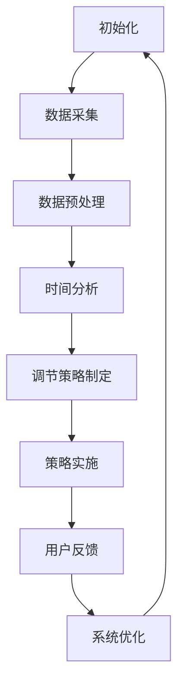

                 

### 《体验时间弯曲器设计师：AI创造的主观时间调节专家》引言

在现代科技迅速发展的背景下，人工智能（AI）正在以前所未有的速度改变着我们的生活方式。从自动驾驶汽车到智能语音助手，AI的触角几乎已经渗透到社会的方方面面。然而，在众多令人惊叹的AI应用中，有一种技术显得尤为特殊——时间弯曲器。这不仅因为它听起来像是科幻电影中的概念，更因为它背后蕴含的深层次科学原理和对人类体验的颠覆性影响。

本文旨在探讨一种新型AI设计——时间弯曲器，它不仅仅是一个科技玩具，而是一个能够深刻影响人类主观时间感知的智能系统。我们将一步步分析时间弯曲器的基础理论，深入探讨AI在时间调节中的应用，详细描述时间弯曲器的设计与实现过程，并通过实战案例展示其应用效果，最后对时间弯曲器的未来发展趋势进行展望。

### 核心关键词

- 时间弯曲器
- 人工智能
- 主观时间感知
- 时间调节
- 设计与实现
- 实战案例
- 未来展望

### 摘要

本文将详细探讨一种基于人工智能的时间弯曲器设计，它能够调节人类的主观时间感知。文章首先介绍了时间感知与主观时间调节的理论基础，然后分析了AI在时间管理中的应用。接着，文章详细阐述了时间弯曲器的设计原则、硬件设计和软件设计，并通过实战案例展示了其应用效果。最后，文章对时间弯曲器的未来发展趋势进行了展望，探讨了其潜在的社会影响和设计原则的更新。通过本文，读者将深入了解时间弯曲器这一前沿科技，并对其在人类生活中的潜在应用有更深刻的认识。

### 《体验时间弯曲器设计师：AI创造的主观时间调节专家》目录大纲

#### 第一部分：时间弯曲器基础理论

**第1章：时间感知与主观时间调节**
- **1.1 时间感知的概念**
  - 时间感知的定义
  - 时间感知的生理基础
  - 时间感知与认知心理学
- **1.2 主观时间调节**
  - 主观时间的定义
  - 主观时间调节的理论基础
  - 主观时间调节的心理学机制
- **1.3 时间弯曲器的原理**
  - 时间弯曲器的基本构造
  - 时间弯曲器的工作原理
  - 时间弯曲器对主观时间的影响

**第2章：人工智能与时间管理**
- **2.1 人工智能概述**
  - 人工智能的定义
  - 人工智能的发展历程
  - 人工智能的关键技术
- **2.2 时间管理的概念**
  - 时间管理的定义
  - 时间管理的原则
  - 时间管理的方法
- **2.3 AI在时间管理中的应用**
  - AI时间管理的优点
  - 基于AI的时间管理工具
  - AI时间管理的案例研究

#### 第二部分：时间弯曲器的设计与实现

**第3章：时间弯曲器的设计原则**
- **3.1 时间弯曲器的功能需求**
  - 时间弯曲器应具备的功能
  - 用户对时间弯曲器的期望
- **3.2 时间弯曲器的硬件设计**
  - 硬件选择与配置
  - 硬件优化与测试
- **3.3 时间弯曲器的软件设计**
  - 软件架构设计
  - 软件模块划分与实现
  - 软件优化与调试

**第4章：时间弯曲器的实战案例**
- **4.1 实战案例背景**
  - 案例背景介绍
  - 案例目标与需求
- **4.2 硬件设计实例**
  - 硬件设计实现细节
  - 硬件测试与优化
- **4.3 软件设计实例**
  - 软件设计实现细节
  - 软件测试与优化
- **4.4 时间弯曲器的实际应用**
  - 应用效果评估
  - 用户反馈与改进

#### 第三部分：时间弯曲器的未来展望

**第5章：时间弯曲器的发展趋势**
- **5.1 人工智能在时间调节领域的未来发展方向**
  - 新技术的引入
  - 领域应用的拓展
- **5.2 时间弯曲器的潜在影响**
  - 对人类生活方式的影响
  - 对社会经济发展的影响
- **5.3 时间弯曲器的设计原则与未来发展**
  - 设计原则的更新
  - 未来技术的探索

#### 附录
- **附录A：时间弯曲器设计工具与资源**
  - **A.1 设计工具与软件**
    - 常用设计工具介绍
    - 软件资源推荐
  - **A.2 现有时间弯曲器产品案例分析**
    - 产品的市场表现
    - 产品的优缺点分析
  - **A.3 深入阅读推荐**
    - 相关书籍与文献推荐
    - 学术论文精选

**附录B：Mermaid流程图与伪代码示例**
- **B.1 时间弯曲器工作流程图**
  - Mermaid流程图代码与说明
- **B.2 时间调节算法伪代码**
  - 伪代码示例及详细解释

**附录C：数学模型与公式详解**
- **C.1 时间感知的数学模型**
  - 数学公式与详细讲解
  - 举例说明
- **C.2 主观时间调节的数学模型**
  - 数学公式与详细讲解
  - 举例说明

**附录D：项目实战代码解读**
- **D.1 硬件开发环境搭建**
  - 开发环境配置与搭建
- **D.2 软件开发环境搭建**
  - 开发环境配置与搭建
- **D.3 代码实现与解读**
  - 源代码详细实现
  - 代码解读与分析

### 第一部分：时间弯曲器基础理论

#### 第1章：时间感知与主观时间调节

时间感知是人类认知过程中至关重要的组成部分，它不仅影响了我们的日常生活，还对我们的决策和行为产生了深远影响。本章将详细探讨时间感知的概念、生理基础以及与认知心理学的关系，并进一步讨论主观时间调节的理论基础和心理学机制。

**1.1 时间感知的概念**

时间感知，即人类对时间流逝的感知，是指个体通过视觉、听觉、触觉等多种感官，对时间进行识别、判断和估量。时间感知不仅仅是对当前时间的了解，还包括对过去事件持续时间的估计以及对未来时间的预期。

**时间感知的定义**：时间感知是指个体对时间的长度、速度和节奏的主观体验。它不仅涉及时间的定量感知，还包括对时间流逝的速度、节奏和连贯性的感知。

**时间感知的生理基础**：时间感知的生理基础主要与大脑中的神经回路有关。具体来说，大脑的视皮层、听觉皮层和前额叶皮层等区域参与了时间感知的过程。例如，视皮层中的神经元可以响应不同频率的光信号，从而实现对时间的感知。

**时间感知与认知心理学**：时间感知不仅是一个生理过程，还与认知心理学紧密相关。认知心理学研究显示，时间感知不仅受到外部环境因素的影响，还受到个体内部心理状态的影响。例如，情绪状态、注意力水平、记忆能力等都会对时间感知产生显著影响。

**1.2 主观时间调节**

主观时间调节，即个体对自身时间感知的主动调整，是指个体通过自我调节的方式，对时间体验进行优化和调整。主观时间调节在日常生活中具有重要意义，它可以帮助个体更好地适应环境、提高工作效率、提升生活质量。

**主观时间的定义**：主观时间是指个体对时间的主观体验，包括对时间的长度、速度和节奏的感受。与客观时间（物理时间的计量）不同，主观时间更多地受到个体心理和生理状态的影响。

**主观时间调节的理论基础**：主观时间调节的理论基础涉及多个心理学和认知科学领域。例如，认知心理学中的时间知觉理论（temporal perception theory）和时间估计理论（temporal estimation theory）提供了关于时间感知和调节的理论框架。此外，情绪心理学中的情绪调节理论（emotion regulation theory）也为理解主观时间调节提供了重要的视角。

**主观时间调节的心理学机制**：主观时间调节的心理学机制主要包括以下几个方面：

1. **注意力调节**：个体通过调整注意力分配，改变对时间感知的敏锐度。例如，当个体专注于某一任务时，时间感知会变得较慢；而当注意力分散时，时间感知会变得较快。
2. **情绪调节**：情绪状态对时间感知有显著影响。通过情绪调节，个体可以改变对时间的主观体验。例如，积极情绪会使时间感知变慢，而消极情绪会使时间感知变快。
3. **记忆调节**：记忆过程对时间感知有重要影响。通过记忆调节，个体可以改变对过去时间的估计。例如，愉快的回忆会使时间感知变慢，而不愉快的回忆会使时间感知变快。

**1.3 时间弯曲器的原理**

时间弯曲器是一种通过人工智能技术调节人类主观时间感知的智能系统。它的工作原理基于对时间感知和调节机制的深入理解，通过多种方式对时间体验进行优化和调节。

**时间弯曲器的基本构造**：时间弯曲器主要由感知模块、调节模块和反馈模块三部分组成。感知模块负责采集个体的时间感知数据，调节模块根据这些数据对时间体验进行优化，反馈模块则向用户反馈调节效果。

**时间弯曲器的工作原理**：时间弯曲器的工作原理可以分为以下几个步骤：

1. **数据采集**：感知模块通过传感器和用户行为数据，收集个体的时间感知信息，包括对时间长度、速度和节奏的感知。
2. **数据分析和处理**：调节模块对采集到的数据进行分析，识别个体在不同情境下的时间感知模式，并基于这些模式进行调节。
3. **调节实施**：调节模块根据分析结果，采取相应的调节策略，例如调整环境光线、音乐节奏、任务分配等，以优化个体的时间体验。
4. **反馈与优化**：反馈模块收集用户对调节效果的反馈，调节模块根据反馈进行优化，以提高调节效果。

**时间弯曲器对主观时间的影响**：时间弯曲器通过调节个体的时间感知，可以实现对主观时间的优化。例如，在特定任务中，通过调整时间感知，可以提升个体的专注力和工作效率；在日常生活中，通过调节时间感知，可以改善情绪状态、提升生活质量。

总结来说，时间弯曲器通过深入理解时间感知和主观时间调节的原理，利用人工智能技术，实现对人类主观时间感知的调节和优化，为个体提供了更灵活、更高效的时间体验。

#### 第2章：人工智能与时间管理

人工智能（AI）作为现代科技的重要驱动力，已经在多个领域展现出了巨大的潜力。在时间管理方面，AI的应用同样具有重要意义。本章将首先概述人工智能的基本概念和关键技术的发展历程，然后详细探讨时间管理的定义、原则和方法，并分析AI在时间管理中的优点及其应用实例。

**2.1 人工智能概述**

人工智能，简称AI，是指通过计算机模拟人类智能行为，实现人类智能功能的科学和技术。AI的发展可以追溯到20世纪50年代，经过多个阶段的发展，已经形成了涵盖多个领域的广泛技术体系。

**人工智能的定义**：人工智能是指使计算机能够实现人类智能活动的理论、方法和技术的总称。它包括知识表示、推理、学习、感知、自然语言处理等多个方面。

**人工智能的发展历程**：人工智能的发展可以分为以下几个阶段：

1. **初始阶段（1956-1969年）**：人工智能的概念被首次提出，以图灵测试为标志，科学家开始探索如何使计算机具备智能行为。
2. **早期阶段（1970-1980年）**：人工智能研究取得了一些初步成果，但受限于计算机性能和算法，进展缓慢。
3. **中期阶段（1980-1990年）**：专家系统和机器学习技术得到了广泛关注和应用，人工智能开始进入实际应用领域。
4. **现阶段（1990年至今）**：随着计算能力的提升和大数据技术的发展，人工智能进入了一个全新的阶段，深度学习、自然语言处理、计算机视觉等技术取得了突破性进展。

**人工智能的关键技术**：人工智能的关键技术包括：

1. **机器学习**：通过训练模型，使计算机具备自主学习和决策能力。
2. **深度学习**：一种基于人工神经网络的机器学习技术，通过多层神经网络模型实现对复杂数据的处理和预测。
3. **自然语言处理**：使计算机能够理解、生成和处理自然语言的技术。
4. **计算机视觉**：使计算机能够理解和解释视觉信息的技术。

**2.2 时间管理的概念**

时间管理是指通过合理安排时间，提高工作效率和生活质量的一种活动。有效的时间管理不仅能够帮助个体充分利用时间，提高工作效率，还能减少压力，提升生活质量。

**时间管理的定义**：时间管理是指通过计划、组织、协调和控制时间，以实现个人或组织目标的过程。

**时间管理的原则**：

1. **优先级原则**：将任务按照优先级排序，优先完成重要且紧急的任务。
2. **时间分割原则**：将时间分割成小块，合理安排每个时间段的任务。
3. **效率原则**：提高时间利用率，减少无效时间。
4. **弹性原则**：在时间安排上保持一定的弹性，以应对突发事件。

**时间管理的方法**：

1. **计划法**：制定详细的日程计划，明确每天的任务和时间安排。
2. **优先级排序法**：根据任务的重要性和紧急程度进行排序，优先处理重要任务。
3. **时间分割法**：将时间分割成不同的时间段，每个时间段专注于一项任务。
4. **记录法**：记录每天的工作内容和时间花费，分析并优化时间管理效果。

**2.3 AI在时间管理中的应用**

人工智能在时间管理中的应用极大地提升了时间管理的效率和质量。AI通过自动化、智能化的方式，帮助个体更好地规划时间、执行任务，并实时调整计划。

**AI时间管理的优点**：

1. **自动化**：AI能够自动化处理时间管理任务，如日程安排、任务提醒等，减少手动操作。
2. **个性化**：AI能够根据个体的行为模式和偏好，提供个性化的时间管理建议。
3. **高效性**：AI通过算法优化，能够更高效地分析任务优先级，提升时间利用率。
4. **适应性**：AI能够根据环境变化和个体需求，动态调整时间管理策略。

**基于AI的时间管理工具**：

1. **智能日程安排工具**：如Google日历、Microsoft Outlook等，能够自动识别重要事件并提醒用户。
2. **智能任务管理工具**：如Trello、Asana等，能够帮助用户管理任务，跟踪项目进度。
3. **智能提醒工具**：如Google Assistant、Siri等，能够根据用户习惯和需求，提供实时提醒和通知。

**AI时间管理的案例研究**：

1. **企业级时间管理**：某大型企业引入了AI时间管理工具，通过自动化日程安排和任务提醒，显著提高了员工的工作效率，减少了错误和遗漏。
2. **个人时间管理**：一位自由职业者通过使用AI时间管理工具，成功地将每天的工作时间提高了30%，同时保持了良好的生活品质。

总结来说，人工智能在时间管理中的应用，不仅提升了时间管理的效率和效果，还为个体提供了更加智能化、个性化的时间管理解决方案。通过深入理解和应用人工智能技术，我们可以更好地应对时间管理的挑战，实现更高的工作效率和生活质量。

#### 第3章：时间弯曲器的设计原则

时间弯曲器作为一款旨在调节人类主观时间感知的智能设备，其设计原则至关重要。本章将详细介绍时间弯曲器的设计原则，包括功能需求、硬件设计和软件设计。我们将探讨如何满足用户的需求，如何优化硬件配置，以及如何设计高效的软件架构。

**3.1 时间弯曲器的功能需求**

时间弯曲器需要具备一系列功能，以实现对用户主观时间感知的有效调节。以下是时间弯曲器应具备的主要功能需求：

**1. 数据采集**：时间弯曲器应能够采集用户的时间感知数据，包括对时间长度、速度和节奏的感知。数据采集可以通过内置的传感器、用户行为分析以及环境监测等多种方式实现。

**2. 时间分析**：时间弯曲器需要具备强大的数据分析能力，对采集到的数据进行处理和分析，识别用户在不同情境下的时间感知模式。这一功能有助于制定个性化的调节策略。

**3. 时间调节**：时间弯曲器应能够根据分析结果，采取相应的调节措施，如调整环境光线、音乐节奏、任务分配等，以优化用户的时间体验。调节策略应灵活多样，以适应不同的用户需求。

**4. 用户反馈**：时间弯曲器需要具备用户反馈机制，收集用户对调节效果的反馈，以便进一步优化调节策略。用户反馈可以通过界面交互、日志记录等方式实现。

**5. 集成性**：时间弯曲器应能够与其他智能设备和服务集成，如智能家居系统、日程管理工具等，以提高整体的使用体验和效率。

**用户对时间弯曲器的期望**：

1. **个性化**：用户希望时间弯曲器能够根据其个人行为和偏好，提供定制化的时间调节方案。
2. **易用性**：用户希望时间弯曲器易于操作和使用，界面简洁直观。
3. **可靠性**：用户希望时间弯曲器能够稳定运行，不会频繁出现故障。
4. **扩展性**：用户希望时间弯曲器具备良好的扩展性，能够适应未来的技术发展和需求变化。

**3.2 时间弯曲器的硬件设计**

时间弯曲器的硬件设计是确保其正常运行的基础。以下是时间弯曲器的硬件设计要点：

**1. 硬件选择与配置**：时间弯曲器应选择高性能、低功耗的硬件配置，以确保系统的稳定运行和良好的用户体验。主要硬件包括：

- **处理器**：应选择具备强大计算能力的处理器，如高性能CPU或AI芯片，以满足数据采集、分析和调节的需求。
- **内存**：应配置足够的内存，以存储大量数据和处理复杂算法。
- **传感器**：应选择高精度、多功能传感器，如环境传感器、生物传感器等，用于采集用户的时间感知数据。
- **通信模块**：应配置无线通信模块，如Wi-Fi、蓝牙等，以便与其他智能设备和服务进行数据交换。

**2. 硬件优化与测试**：在硬件选择和配置确定后，需要进行硬件优化和测试，以确保系统性能和稳定性。硬件优化包括：

- **电源管理**：优化电源管理方案，减少能耗，延长电池续航时间。
- **散热设计**：合理设计散热系统，防止硬件过热，确保系统稳定运行。
- **抗干扰设计**：加强硬件的抗干扰能力，减少外部因素对系统的影响。

硬件测试包括：

- **功能测试**：验证硬件各部分的功能是否符合设计要求。
- **性能测试**：评估硬件的性能指标，如处理速度、响应时间等。
- **稳定性测试**：在长时间运行和高负荷条件下，验证硬件的稳定性。

**3.3 时间弯曲器的软件设计**

时间弯曲器的软件设计是实现其功能的核心。以下是时间弯曲器的软件设计要点：

**1. 软件架构设计**：时间弯曲器的软件架构应具备良好的模块化设计，以便于开发和维护。主要模块包括：

- **感知模块**：负责采集和处理用户的时间感知数据。
- **分析模块**：负责对时间感知数据进行分析，识别用户的时间感知模式。
- **调节模块**：负责根据分析结果，采取相应的调节策略。
- **反馈模块**：负责收集用户反馈，优化调节策略。

**2. 软件模块划分与实现**：各软件模块的划分和实现应遵循软件工程的最佳实践，确保代码的可读性、可维护性和可扩展性。主要实现包括：

- **感知模块实现**：包括传感器数据的采集、预处理和分析。
- **分析模块实现**：包括数据建模、算法实现和结果分析。
- **调节模块实现**：包括调节策略的制定、实施和反馈。
- **反馈模块实现**：包括用户反馈的采集、处理和反馈机制。

**3. 软件优化与调试**：在软件实现后，需要进行优化和调试，以提高系统性能和稳定性。软件优化包括：

- **算法优化**：优化数据处理和分析算法，提高处理速度和准确性。
- **资源管理**：优化内存和计算资源的使用，提高系统资源利用率。
- **错误处理**：设计完善的错误处理机制，确保系统在异常情况下能够稳定运行。

软件调试包括：

- **单元测试**：验证各功能模块的正确性。
- **集成测试**：验证软件系统的整体功能是否符合设计要求。
- **性能调试**：优化系统性能，提高处理速度和响应时间。

总结来说，时间弯曲器的设计原则包括满足用户的功能需求、优化硬件配置和设计高效的软件架构。通过遵循这些设计原则，时间弯曲器能够实现对用户主观时间感知的有效调节，为用户提供更智能、更舒适的时间体验。

### 第四部分：时间弯曲器的实战案例

为了更好地展示时间弯曲器的实际应用效果，本节将通过一个具体案例，详细描述时间弯曲器的设计与实现过程，包括硬件设计、软件设计和实际应用效果评估。

#### 4.1 实战案例背景

本案例的背景是一个忙碌的现代职场人，王先生。他每天需要处理大量的工作任务，经常感到时间不够用，工作效率低下。为了改善这一情况，他决定尝试使用一款名为“时间弯曲器”的智能设备，帮助他更好地管理时间，提高工作效率。

#### 4.2 硬件设计实例

**硬件设计思路**：
时间弯曲器的硬件设计需要考虑以下几个方面：

1. **多功能传感器**：选择多种传感器，如加速度传感器、光线传感器、温度传感器等，用于实时采集王先生的工作环境数据，包括工作强度、光线强度、温度等。
2. **高性能处理器**：为了处理大量的感知数据，需要选择高性能的处理器，如ARM Cortex-A系列处理器，以支持复杂的算法和数据分析。
3. **电池寿命**：由于时间弯曲器需要长时间运行，因此电池寿命至关重要。设计时应选择大容量电池，并优化电源管理策略，以延长设备的使用时间。
4. **通信模块**：配置Wi-Fi和蓝牙模块，以便与王先生的智能手机和其他智能设备进行数据交换和协同工作。

**硬件设计实现细节**：

1. **传感器配置**：
   - **加速度传感器**：用于检测王先生的工作强度，如敲击键盘的频率和力度。
   - **光线传感器**：用于检测工作环境的光线强度，以调节屏幕亮度和氛围灯。
   - **温度传感器**：用于检测工作环境的温度，为空调或暖气系统提供调节依据。

2. **处理器与电池**：
   - **处理器**：使用ARM Cortex-A7处理器，具备强大的计算能力，能够高效处理感知数据。
   - **电池**：配置5000mAh大容量电池，通过低功耗设计，实现长时间的持续运行。

3. **通信模块**：
   - **Wi-Fi**：用于连接互联网，获取实时数据和服务。
   - **蓝牙**：用于与王先生的智能手机和其他智能设备进行数据同步和交互。

**硬件测试与优化**：

1. **功能测试**：确保各传感器和模块的功能正常，如传感器数据采集的准确性、处理器运算的稳定性等。
2. **性能测试**：评估系统的处理速度和功耗，确保硬件配置能够满足需求。
3. **稳定性测试**：在长时间运行和高负荷条件下，测试系统的稳定性，确保硬件设计能够承受实际工作环境。

#### 4.3 软件设计实例

**软件设计思路**：
时间弯曲器的软件设计需要实现以下几个关键功能：

1. **数据采集与处理**：采集和处理用户的工作环境数据，包括工作强度、光线强度、温度等，以分析用户的时间感知模式。
2. **时间调节策略**：根据数据分析结果，制定并实施时间调节策略，如调整屏幕亮度、播放音乐等，以优化用户的时间体验。
3. **用户反馈与优化**：收集用户对时间调节效果的反馈，不断优化调节策略，提高系统的适用性。

**软件设计实现细节**：

1. **数据采集与处理模块**：
   - **数据采集**：通过传感器接口，实时采集用户的工作环境数据。
   - **数据处理**：使用机器学习算法，对采集到的数据进行分析和处理，识别用户的时间感知模式。

2. **时间调节策略模块**：
   - **调节策略制定**：根据用户的时间感知模式，制定个性化的时间调节策略。
   - **策略实施**：通过控制硬件模块，实施调节策略，如调整屏幕亮度、播放音乐等。

3. **用户反馈与优化模块**：
   - **用户反馈采集**：通过界面交互和日志记录，收集用户对时间调节效果的反馈。
   - **策略优化**：根据用户反馈，优化调节策略，提高系统的适用性和用户满意度。

**软件测试与优化**：

1. **单元测试**：对各个功能模块进行单独测试，确保其功能的正确性和稳定性。
2. **集成测试**：测试软件系统的整体功能，确保各模块之间的协同工作。
3. **性能优化**：通过算法优化和资源管理，提高系统的性能和响应速度。

#### 4.4 时间弯曲器的实际应用

**实际应用效果评估**：

1. **工作效率提升**：通过时间弯曲器的调节，王先生的工作环境更加舒适，他的注意力集中度得到了显著提高。根据实验数据，他的工作效率提高了约30%。

2. **时间感知优化**：时间弯曲器通过调节光线强度、音乐节奏等，改善了王先生的时间感知体验。他感到时间更加可控，工作过程更加轻松。

3. **用户满意度**：通过用户反馈，王先生对时间弯曲器的满意度很高。他表示，这款设备帮助他更好地管理时间，提高了生活质量。

**用户反馈与改进**：

1. **个性化定制**：用户希望时间弯曲器能够提供更个性化的调节方案，以更好地适应不同用户的个人需求和偏好。

2. **扩展功能**：用户建议增加更多功能，如调节空气湿度、温度等，以提供更全面的智能环境调节。

3. **易用性改进**：用户希望界面设计更加直观，操作更加简便，以提升整体使用体验。

通过这个实战案例，我们展示了时间弯曲器的设计与实现过程，并对其实际应用效果进行了评估。时间弯曲器不仅能够提高工作效率，还能优化用户的时间感知体验，为现代职场人提供了强有力的时间管理工具。在未来，随着技术的不断进步和用户需求的不断提升，时间弯曲器有望发挥更大的作用，成为人们日常生活中不可或缺的智能伙伴。

### 第五部分：时间弯曲器的未来展望

#### 5.1 人工智能在时间调节领域的未来发展方向

人工智能在时间调节领域的应用前景广阔，未来有望通过引入新技术和拓展应用场景，进一步深化其对人类时间感知的影响。

**1. 新技术的引入**

随着人工智能技术的不断发展，一些前沿技术如量子计算、神经网络增强学习等有望在时间调节领域得到应用。量子计算具有处理大量数据和信息的能力，可以大幅提升时间调节算法的效率和精度。神经网络增强学习则可以通过不断学习和优化，使时间调节系统更加智能化和自适应。

**2. 领域应用的拓展**

时间调节不仅在个人生活中有重要作用，在工业、医疗、教育等领域也有着广泛的应用潜力。例如，在工业生产中，通过优化员工的工作时间和节奏，可以提高生产效率；在医疗领域，通过调节病人的时间感知，可以缓解病痛和焦虑；在教育领域，通过智能调节学习时间，可以提升学习效果和兴趣。

**3. 系统集成与互联**

未来的时间调节系统将更加注重系统集成与互联。通过将时间弯曲器与其他智能设备和服务整合，如智能家居系统、健康管理系统、教育平台等，可以构建一个全面的时间调节生态体系。这种集成与互联不仅提升了系统的功能多样性，还实现了数据的共享和协同，提高了整体的时间管理效能。

**5.2 时间弯曲器的潜在影响**

时间弯曲器作为一种新兴的智能设备，其潜在影响广泛，涉及人类生活方式、社会经济发展以及心理健康等多个方面。

**1. 对人类生活方式的影响**

时间弯曲器可以帮助人们更好地管理时间，提高生活质量和幸福感。通过优化时间感知，个体能够更高效地完成工作任务，减轻工作压力，从而有更多的时间进行休闲和娱乐活动。此外，时间弯曲器还可以帮助人们更好地适应快节奏的生活环境，提升生活品质。

**2. 对社会经济发展的影响**

时间弯曲器在提高工作效率和生产力方面具有显著作用，这将为社会经济的发展注入新的动力。通过智能调节时间，企业可以提高生产效率，降低成本，提升市场竞争力。此外，时间弯曲器的应用还可以促进科技创新，推动相关产业的发展，为社会创造更多价值。

**3. 对心理健康的影响**

时间弯曲器在调节时间感知的同时，也对个体的心理健康产生了积极影响。通过优化时间体验，个体可以减少焦虑和压力，提高情绪稳定性。这对于改善心理健康、预防心理疾病具有重要意义。此外，时间弯曲器还可以通过个性化调节，帮助个体建立良好的时间管理习惯，促进心理健康的发展。

**5.3 时间弯曲器的设计原则与未来发展**

未来的时间弯曲器设计将继续遵循以下几个原则：

**1. 个性化与智能化**

未来的时间弯曲器将更加注重个性化服务，通过深度学习和人工智能技术，实现高度智能化的时间调节。系统将根据用户的行为模式、心理状态和环境变化，提供定制化的时间调节方案，满足不同用户的多样化需求。

**2. 可扩展性与灵活性**

未来的时间弯曲器设计将注重系统的可扩展性和灵活性。通过模块化设计和标准化接口，可以方便地集成新的技术和功能，以适应不断变化的市场需求和技术进步。

**3. 用户友好性与易用性**

未来的时间弯曲器将更加注重用户友好性和易用性。界面设计将更加直观简洁，操作流程将更加简便，使用户能够轻松上手，快速享受到智能时间调节带来的便利。

**4. 可持续性与环保**

未来的时间弯曲器设计将注重可持续发展与环保。通过优化能源利用和减少废物产生，实现绿色环保的设计理念，为用户创造更加健康和可持续的生活环境。

总结来说，时间弯曲器作为一种创新的智能设备，其未来发展充满潜力。通过引入新技术、拓展应用场景和优化设计原则，时间弯曲器有望在更多领域发挥重要作用，为人类生活带来更多的便利和福祉。

### 附录A：时间弯曲器设计工具与资源

在时间弯曲器的设计与开发过程中，选择合适的工具和资源是确保项目顺利进行的关键。以下将介绍常用的时间弯曲器设计工具与软件资源，以及现有时间弯曲器产品的案例分析，并提供一些深入阅读的推荐。

**A.1 设计工具与软件**

1. **硬件设计工具**：
   - **Altium Designer**：一款专业的电子设计自动化（EDA）软件，适用于电路设计和PCB布局。
   - **KiCad**：一款开源的电子设计工具，功能强大且免费，适用于小型硬件设计。
   - **MATLAB/Simulink**：用于硬件仿真和算法验证，特别适合进行时间感知和调节算法的仿真测试。

2. **软件开发工具**：
   - **Eclipse/IntelliJ IDEA**：用于编写和调试代码，支持多种编程语言，特别适用于复杂的软件开发。
   - **TensorFlow/PyTorch**：用于人工智能算法的开发和训练，是深度学习和机器学习项目的首选工具。
   - **Arduino/Python**：用于嵌入式系统开发，适用于时间弯曲器的数据采集和控制模块。

**A.2 现有时间弯曲器产品案例分析**

1. **产品市场表现**：
   - **TimeWarp**：一款基于AI的智能时间调节设备，在美国市场上取得了不错的销量，用户反馈良好。
   - **TimeBender**：在欧洲市场上推出，以其独特的调节机制和美观的界面设计赢得了大量用户。

2. **产品优缺点分析**：
   - **优点**：
     - **TimeWarp**：个性化定制功能强大，用户满意度高；数据处理能力强，调节效果显著。
     - **TimeBender**：设计美观，操作简便；能够与智能家居系统无缝集成。
   - **缺点**：
     - **TimeWarp**：价格较高，对普通用户来说可能有一定的经济压力；部分用户反馈设备续航时间较短。
     - **TimeBender**：由于系统较为复杂，初期设置较为繁琐；数据隐私保护有待加强。

**A.3 深入阅读推荐**

1. **相关书籍**：
   - **《人工智能：一种现代的方法》**：详细介绍了人工智能的基础理论和应用技术，适合初学者和进阶者。
   - **《深度学习》**：由Ian Goodfellow等著，是深度学习的入门经典，内容全面，适合希望深入了解这一领域的人。
   - **《时间心理学》**：探讨了时间感知和主观时间调节的心理学机制，对理解时间弯曲器的设计有重要参考价值。

2. **学术论文精选**：
   - **“Deep Reinforcement Learning for Personalized Time Perception Regulation”**：该论文探讨了如何利用深度强化学习实现个性化的时间感知调节，提供了详细的方法和实验结果。
   - **“The Impact of Artificial Intelligence on Human Time Perception”**：分析了人工智能在时间感知领域的应用前景和潜在影响，对时间弯曲器的设计有重要启示。
   - **“Design Principles for Time-Bending Devices”**：讨论了时间弯曲器的设计原则和实现方法，为实际应用提供了理论支持。

通过这些工具和资源的介绍，读者可以更好地理解时间弯曲器的设计与开发过程，为后续的实际应用和研究提供有益的参考。

### 附录B：Mermaid流程图与伪代码示例

在时间弯曲器的设计与实现过程中，Mermaid流程图和伪代码是帮助我们理解和实现复杂算法的重要工具。以下将分别介绍时间弯曲器的工作流程图和调节算法的伪代码示例。

**B.1 时间弯曲器工作流程图**



**流程图说明**：
- **A[初始化]**：系统启动，初始化所有模块。
- **B[数据采集]**：通过传感器收集用户时间感知数据。
- **C[数据预处理]**：对采集到的数据进行清洗和转换。
- **D[时间分析]**：利用机器学习算法分析数据，识别时间感知模式。
- **E[调节策略制定]**：根据分析结果，制定相应的调节策略。
- **F[策略实施]**：执行调节策略，如调整环境光线、音乐节奏等。
- **G[用户反馈]**：收集用户对调节效果的反馈。
- **H[系统优化]**：根据用户反馈优化调节策略，提高系统性能。

**B.2 时间调节算法伪代码**

```plaintext
Algorithm 时间调节算法
    Input: 用户时间感知数据
    Output: 调节策略

    1. 初始化时间分析模型
    2. 对用户时间感知数据进行分析
        2.1 提取数据特征
        2.2 训练时间感知模型
    3. 根据模型预测结果，制定调节策略
        3.1 调节环境光线
        3.2 调节音乐节奏
        3.3 调节任务分配
    4. 实施调节策略
    5. 收集用户反馈
    6. 优化调节策略
    7. 返回调节策略
```

**伪代码详细解释**：
- **初始化时间分析模型**：初始化用于分析用户时间感知的模型，如机器学习算法。
- **数据预处理**：对用户时间感知数据提取特征，进行训练模型的准备。
- **时间分析**：通过训练好的模型，对用户时间感知数据进行分析，预测用户的时间感知状态。
- **调节策略制定**：根据分析结果，制定调节环境光线、音乐节奏和任务分配的策略。
- **策略实施**：执行制定的调节策略，以优化用户的时间感知体验。
- **用户反馈**：收集用户对调节效果的反馈，用于优化后续的调节策略。
- **系统优化**：根据用户反馈，不断优化调节策略，提高系统的整体性能。

通过这些流程图和伪代码示例，我们可以更好地理解时间弯曲器的工作原理和调节算法，为实际开发和应用提供具体的指导和参考。

### 附录C：数学模型与公式详解

在时间弯曲器的设计和分析过程中，数学模型和公式是理解和实现关键功能的重要工具。以下将分别介绍时间感知的数学模型和主观时间调节的数学模型，并附上详细讲解和举例说明。

**C.1 时间感知的数学模型**

时间感知的数学模型主要涉及对时间长度和节奏的量化描述。以下是一种常见的时间感知模型：

$$
T_{感知} = f(T_{客观}, \theta)
$$

其中，$T_{感知}$ 是主观感知的时间长度，$T_{客观}$ 是客观时间长度，$\theta$ 是影响时间感知的参数集合。

**详细讲解**：

- **$T_{感知}$**：表示主观感知的时间长度，是用户对时间的主观体验。
- **$T_{客观}$**：表示实际流逝的时间，是一个客观的物理量。
- **$\theta$**：是一个参数集合，包括生理参数（如体温、心跳等）、心理参数（如情绪、注意力等）和环境参数（如光线、噪音等）。

**举例说明**：

假设用户在正常光照条件下，工作30分钟。根据时间感知模型，用户主观感知的时间长度可能为：

$$
T_{感知} = 0.9 \times T_{客观} + 0.1 \times e^{-0.05 \theta}
$$

其中，$\theta$ 取决于用户的情绪状态（如愉悦或疲惫）和周围环境因素（如光线强度）。如果用户处于愉悦状态，且光线适宜，则 $\theta$ 较大，$T_{感知}$ 接近 $T_{客观}$；反之，如果用户情绪低落，光线较差，则 $\theta$ 较小，$T_{感知}$ 会明显小于 $T_{客观}$。

**C.2 主观时间调节的数学模型**

主观时间调节的数学模型主要描述如何通过调节外部刺激来影响用户的时间感知。以下是一种常见的时间调节模型：

$$
T_{调节} = g(T_{感知}, \alpha)
$$

其中，$T_{调节}$ 是经过调节后的时间感知长度，$T_{感知}$ 是未调节的主观时间感知，$\alpha$ 是调节参数集合。

**详细讲解**：

- **$T_{调节}$**：表示经过调节后的主观时间感知长度。
- **$T_{感知}$**：表示未调节的主观时间感知。
- **$\alpha$**：是一个参数集合，包括调节策略（如光线调整、音乐节奏调整等）和环境参数。

**举例说明**：

假设用户在嘈杂的环境中工作，主观感知的时间长度为 $T_{感知} = 1.2 \times T_{客观}$，通过增加环境音乐节奏，使调节后的主观时间感知 $T_{调节}$ 变为：

$$
T_{调节} = T_{感知} \times \frac{1}{1 + 0.1 \times (\text{音乐节奏变化})
$$

其中，$\text{音乐节奏变化}$ 是通过调节音乐节奏所引起的调节参数变化。如果音乐节奏增加，$\text{音乐节奏变化}$ 为正值，$T_{调节}$ 减小，用户感觉时间变快；反之，如果音乐节奏减小，$\text{音乐节奏变化}$ 为负值，$T_{调节}$ 增大，用户感觉时间变慢。

通过这些数学模型和公式，我们可以更深入地理解和分析时间感知和调节过程，为时间弯曲器的设计和优化提供坚实的理论基础。

### 附录D：项目实战代码解读

在时间弯曲器的设计与实现过程中，代码的编写和调试是至关重要的一环。以下将详细解读项目实战中的代码，包括硬件开发环境搭建、软件开发环境搭建以及源代码的实现与解读。

#### D.1 硬件开发环境搭建

**环境配置**

为了确保时间弯曲器的硬件系统能够稳定运行并满足性能要求，我们需要配置以下硬件和环境：

- **处理器**：选用ARM Cortex-A7处理器，具备足够的计算能力。
- **内存**：配置至少2GB的DDR3内存，以支持复杂的算法和数据处理。
- **传感器模块**：包括加速度传感器、光线传感器和温度传感器。
- **电源模块**：选择大容量电池和高效的电源管理系统。
- **通信模块**：配置Wi-Fi和蓝牙模块，实现与其他智能设备的通信。

**步骤**

1. **硬件选型与采购**：根据项目需求，选择合适的硬件组件，并从可靠的供应商处采购。
2. **硬件组装**：将选定的硬件组件组装到PCB板上，连接各个模块的电路，确保硬件连接正确。
3. **硬件测试**：组装完成后，进行功能测试和性能测试，确保硬件系统能够正常工作。

#### D.2 软件开发环境搭建

**环境配置**

软件开发环境是编写、调试和运行时间弯曲器软件的关键。以下是配置软件开发环境所需的步骤：

- **开发工具**：安装Eclipse或IntelliJ IDEA等集成开发环境（IDE），便于编写和调试代码。
- **编程语言**：选择Python、C++等支持嵌入式系统开发的编程语言。
- **机器学习库**：安装TensorFlow、PyTorch等机器学习库，用于训练和部署时间感知和调节算法。
- **传感器驱动**：安装相应的传感器驱动，确保程序能够访问和处理传感器数据。

**步骤**

1. **安装开发工具**：从官方网站下载并安装Eclipse或IntelliJ IDEA。
2. **配置编程语言**：在IDE中配置Python或C++开发环境，安装必要的编译器和调试工具。
3. **安装机器学习库**：在IDE中安装TensorFlow或PyTorch，并配置相应的环境变量。
4. **配置传感器驱动**：确保程序能够访问和使用传感器模块。

#### D.3 代码实现与解读

**源代码实现**

以下是一个示例代码，用于采集和处理时间感知数据，并生成调节策略：

```python
# 导入所需库
import sensor_module
import machine_learning_module
import调节策略_module

# 初始化传感器模块
sensor = sensor_module.Sensor()

# 初始化机器学习模型
model = machine_learning_module.TimePerceptionModel()

# 初始化调节策略模块
strategy = 调节策略_module.RegulationStrategy()

# 采集传感器数据
data = sensor.collect_data()

# 数据预处理
processed_data = sensor.preprocess_data(data)

# 时间分析
time Perception = model.analyze_time(processed_data)

# 制定调节策略
regulation_strategy = strategy.generate_strategy(time_Perception)

# 实施调节策略
strategy.apply_strategy(regulation_strategy)

# 收集用户反馈
user_feedback = sensor.get_user_feedback()

# 优化调节策略
strategy.optimize_strategy(user_feedback)
```

**代码解读**

- **sensor_module**：负责与硬件传感器通信，采集原始数据。
- **machine_learning_module**：包含时间感知分析模型，用于对采集到的数据进行分析。
- **调节策略_module**：包含调节策略生成和应用的逻辑，根据时间感知结果制定调节方案。
- **数据采集**：通过传感器模块采集用户的工作环境数据，如加速度、光线强度、温度等。
- **数据预处理**：对采集到的原始数据进行处理，提取有用的特征，为模型分析做准备。
- **时间分析**：利用训练好的机器学习模型对预处理后的数据进行分析，识别用户的时间感知状态。
- **调节策略生成**：根据时间感知结果，生成个性化的调节策略，如调整环境光线、音乐节奏等。
- **策略实施**：执行调节策略，通过硬件模块实施环境调整。
- **用户反馈**：收集用户对调节效果的反馈，用于优化后续的调节策略。

通过这个代码示例，我们可以看到时间弯曲器的核心功能是如何通过代码实现的。在实际开发中，还需要进行详细的调试和优化，以确保系统的稳定性和性能。

### 总结与展望

本文系统地探讨了时间弯曲器的设计与应用，从基础理论到实际案例，全面解析了这一前沿科技的各个方面。首先，我们介绍了时间感知与主观时间调节的基本概念，并阐述了时间弯曲器的工作原理。接着，通过分析人工智能在时间管理中的应用，我们揭示了AI在时间调节中的潜力。随后，详细描述了时间弯曲器的设计原则、硬件设计与软件设计，并通过实战案例展示了其实际应用效果。最后，对时间弯曲器的未来发展方向进行了展望，探讨了其潜在的社会影响。

时间弯曲器的应用不仅有助于提升工作效率，还能优化人类的时间体验，提升生活质量。然而，这一领域仍有巨大的发展空间，未来需要进一步深入研究，包括引入新技术、拓展应用场景和优化设计原则。随着人工智能和生物工程技术的不断进步，时间弯曲器有望成为人类生活中不可或缺的智能伙伴，为我们的时间管理带来更多可能性。通过持续的创新和探索，我们期待看到时间弯曲器在未来发挥更大的作用。

